# 17. PyTorch Autograd, Dataset and DataLoader

> Understand how PyTorch automatically computes gradients and how `Dataset` and `DataLoader` provide the data pipeline required for scalable Deep Learning training. This chapter connects tensors, automatic differentiation, batching, shuffling, multiprocessing, and model training into a complete PyTorch data-to-gradient workflow.

---

## 🎯 Learning Objectives

After completing this chapter, you will be able to:

- Understand PyTorch automatic differentiation
- Explain how computational graphs are created
- Understand `requires_grad`
- Use `backward()` to calculate gradients
- Understand gradient accumulation
- Clear gradients correctly
- Use `detach()` and `torch.no_grad()`
- Understand leaf and non-leaf tensors
- Inspect gradients during training
- Understand Jacobians and vector-Jacobian products at a high level
- Create custom PyTorch `Dataset` classes
- Understand `__len__()` and `__getitem__()`
- Understand map-style datasets
- Understand iterable-style datasets
- Build datasets from tensors
- Use `TensorDataset`
- Use `DataLoader`
- Understand batching
- Understand shuffling
- Understand `batch_size`
- Understand `drop_last`
- Understand `num_workers`
- Understand `pin_memory`
- Understand `persistent_workers`
- Understand custom `collate_fn`
- Handle variable-length data
- Understand worker processes
- Build efficient training input pipelines
- Move batches efficiently to GPU
- Combine Dataset, DataLoader, model, loss, autograd, and optimizer
- Design production-oriented PyTorch data pipelines

---

# 📖 Overview

A Deep Learning model cannot learn without data.

In PyTorch, the training pipeline typically consists of:

```text
Raw Data
   ↓
Dataset
   ↓
DataLoader
   ↓
Batch
   ↓
Model
   ↓
Prediction
   ↓
Loss
   ↓
Autograd
   ↓
Gradients
   ↓
Optimizer
   ↓
Updated Parameters
```

The two major responsibilities are:

```text
Dataset
    ↓
Defines how individual samples are accessed

DataLoader
    ↓
Defines how samples are organized and delivered to training
```

At the same time:

```text
Autograd
    ↓
Computes gradients required to optimize the model
```

Together, these components form the core PyTorch training infrastructure.

---

# 🧠 Complete PyTorch Training Architecture

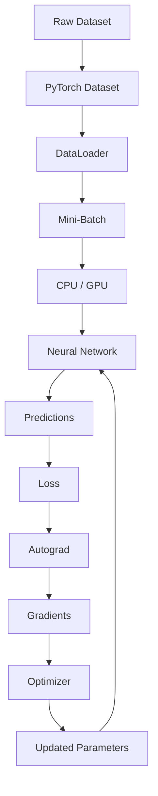

---

# 🔬 Part I — PyTorch Autograd

## 🧠 What Is Automatic Differentiation?

Training a neural network requires calculating:

\[
\frac{\partial L}{\partial \theta}
\]

where:

```text
L = Loss
θ = Model Parameters
```

These gradients tell the optimizer how model parameters should change.

PyTorch provides:

```python
torch.autograd
```

to automatically calculate these derivatives.

---

# 🧮 Gradient-Based Learning

The basic parameter update is:

\[
\theta_{t+1}
=
\theta_t
-
\eta
\nabla_\theta L
\]


Where:

```text
θ          = Model Parameters
η          = Learning Rate
L          = Loss
∇θL        = Gradient of Loss
```

Autograd provides:

```text
∇θL
```

The optimizer performs the parameter update.

---

# 🧠 Computational Graph

PyTorch builds a dynamic computational graph while performing operations on tensors that require gradients.

For:

```python
x = torch.tensor(
    3.0,
    requires_grad=True
)

y = x ** 2

z = y + 5
```

the conceptual graph is:

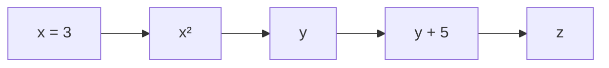

When:

```python
z.backward()
```

is executed, PyTorch traverses the graph backward to calculate gradients.

---

# 🧪 Basic Autograd Example

```python
import torch


x = torch.tensor(
    3.0,
    requires_grad=True
)

y = x ** 2

y.backward()

print(
    x.grad
)
```

Output:

```text
tensor(6.)
```

Because:

\[
y=x^2
\]

therefore:

\[
\frac{dy}{dx}=2x
\]

and:

\[
2(3)=6
\]

---

# 🧠 `requires_grad`

A tensor can request gradient tracking using:

```python
requires_grad=True
```

Example:

```python
x = torch.tensor(
    2.0,
    requires_grad=True
)
```

Operations involving `x` are then tracked by autograd.

---

# 🔍 Checking `requires_grad`

```python
print(
    x.requires_grad
)
```

Output:

```text
True
```

For a tensor without gradient tracking:

```python
x = torch.tensor(
    2.0
)

print(
    x.requires_grad
)
```

Output:

```text
False
```

---

# 🧠 When Does Autograd Track Operations?

Conceptually:

```text
Tensor requires_grad=True
           │
           ▼
Differentiable Operation
           │
           ▼
Computational Graph
           │
           ▼
backward()
           │
           ▼
Gradient
```

If gradient tracking is disabled, the operations are not recorded for backward differentiation.

---

# 🧮 Multiple Operations

Consider:

```python
x = torch.tensor(
    2.0,
    requires_grad=True
)

y = x ** 2

z = 3 * y

output = z + 4
```

Mathematically:

\[
output=3x^2+4
\]


The derivative is:

\[
\frac{d(output)}{dx}=6x
\]

At:

\[
x=2
\]

the gradient is:

```text
12
```

---

# 🧠 Backward Pass

Calling:

```python
output.backward()
```

causes PyTorch to calculate the derivative of the output with respect to the tracked leaf tensor.

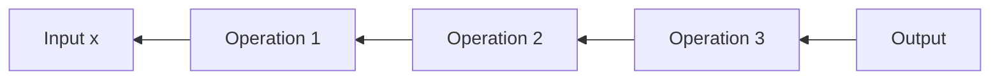

This is the computational foundation of backpropagation.

---

# 🧠 `grad_fn`

Non-leaf tensors participating in autograd often have a:

```python
grad_fn
```

attribute.

Example:

```python
x = torch.tensor(
    2.0,
    requires_grad=True
)

y = x ** 2

print(
    y.grad_fn
)
```

The exact representation may vary, but it indicates that PyTorch has recorded the operation that produced `y`.

---

# 🧠 Leaf Tensors

A leaf tensor is generally a tensor created directly by the user or one that is not the result of an autograd-tracked operation.

Example:

```python
x = torch.tensor(
    2.0,
    requires_grad=True
)
```

`x` is a leaf tensor.

Then:

```python
y = x * 3
```

creates a derived tensor.

Conceptually:

```text
x
│
├── Leaf Tensor
│
└── y
    └── Derived Tensor
```

---

# 🔍 Checking Leaf Status

```python
print(
    x.is_leaf
)

print(
    y.is_leaf
)
```

Typically:

```text
x → True
y → False
```

Understanding leaf tensors becomes important when inspecting gradients.

---

# 🧠 Where Are Gradients Stored?

For a leaf tensor:

```python
x.grad
```

contains its accumulated gradient after:

```python
backward()
```

Example:

```python
x = torch.tensor(
    3.0,
    requires_grad=True
)

y = x ** 2

y.backward()

print(
    x.grad
)
```

---

# ⚠ Non-Leaf Gradients

By default, PyTorch does not retain `.grad` for every non-leaf tensor.

If you need to inspect the gradient of a non-leaf tensor, use:

```python
y.retain_grad()
```

Example:

```python
x = torch.tensor(
    2.0,
    requires_grad=True
)

y = x ** 2

y.retain_grad()

z = y * 3

z.backward()

print(
    y.grad
)
```

---

# 🧠 Gradient Accumulation

One of the most important PyTorch concepts is:

> Gradients accumulate by default.

Example:

```python
x = torch.tensor(
    2.0,
    requires_grad=True
)

y = x ** 2

y.backward()

print(
    x.grad
)
```

If another backward pass is performed:

```python
y = x ** 2

y.backward()

print(
    x.grad
)
```

the gradient is accumulated rather than automatically replaced.

---

# 🧹 Clearing Gradients

This is why PyTorch training loops normally contain:

```python
optimizer.zero_grad()
```

The standard workflow is:

```python
optimizer.zero_grad()

prediction = model(
    x
)

loss = loss_fn(
    prediction,
    y
)

loss.backward()

optimizer.step()
```

---

# 🔄 Gradient Lifecycle

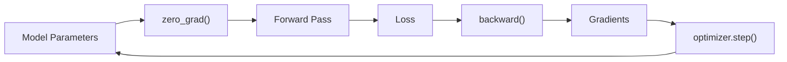

---

# 🧠 Why Does PyTorch Accumulate Gradients?

Gradient accumulation provides flexibility for:

- Multiple backward passes
- Gradient accumulation training
- Complex optimization algorithms
- Multiple losses
- Multi-stage optimization

However, for standard mini-batch training, gradients usually need to be cleared before the next update.

---

# 🧪 Complete Gradient Example

```python
import torch


x = torch.tensor(
    2.0,
    requires_grad=True
)


y = x ** 3

y.backward()


print(
    "Value:",
    x.item()
)

print(
    "Gradient:",
    x.grad.item()
)
```

Since:

\[
y=x^3
\]

then:

\[
\frac{dy}{dx}=3x^2
\]

At:

\[
x=2
\]

the gradient is:

```text
12
```

---

# 🧠 Vector-Valued Outputs

`backward()` is simplest when the output is scalar.

Example:

```python
x = torch.tensor(
    [1.0, 2.0, 3.0],
    requires_grad=True
)

y = x ** 2

loss = y.sum()

loss.backward()

print(
    x.grad
)
```

Output:

```text
tensor([2., 4., 6.])
```

---

# 🧠 Why Reduce the Loss to a Scalar?

Training losses are typically reduced to a scalar because the optimizer needs a single objective.

For example:

```python
loss = loss_fn(
    predictions,
    targets
)
```

typically returns a scalar when using the default reduction.

Conceptually:

```text
Batch Predictions
       ↓
Per-Sample Loss
       ↓
Mean / Sum
       ↓
Scalar Loss
       ↓
backward()
```

---

# 🧮 Vector-Jacobian Product

For vector-valued outputs, PyTorch's backward mechanism computes a vector-Jacobian product rather than automatically materializing the complete Jacobian.

Conceptually:

\[
v^T J
\]


where:

```text
v = upstream gradient
J = Jacobian
```

For ordinary neural-network training, this complexity is generally hidden because the final loss is usually scalar.

---

# 🧠 Supplying an Upstream Gradient

For a non-scalar output:

```python
x = torch.tensor(
    [1.0, 2.0, 3.0],
    requires_grad=True
)

y = x ** 2

y.backward(
    torch.ones_like(y)
)

print(
    x.grad
)
```

The supplied tensor represents the upstream gradient.

---

# 🧠 Detaching from the Graph

Use:

```python
detach()
```

when you want a tensor disconnected from its autograd history.

Example:

```python
x = torch.tensor(
    2.0,
    requires_grad=True
)

y = x ** 2

z = y.detach()
```

Now:

```python
z.requires_grad
```

is:

```text
False
```

---

# 🧠 `detach()` Mental Model

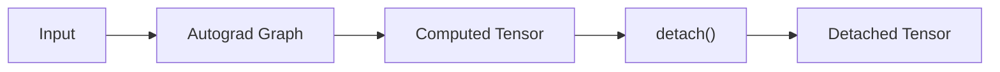

The detached tensor shares storage with the original tensor in typical cases, but does not track the original computation history.

---

# 🧠 `torch.no_grad()`

For inference:

```python
with torch.no_grad():

    predictions = model(
        x
    )
```

This disables gradient tracking for operations within the context.

---

# 🧠 `torch.inference_mode()`

PyTorch also provides:

```python
with torch.inference_mode():

    predictions = model(
        x
    )
```

This is intended for inference workloads and can provide additional performance benefits in appropriate situations.

---

# 🧠 `no_grad()` vs `detach()`

| `torch.no_grad()` | `detach()` |
|---|---|
| Context manager | Tensor operation |
| Disables gradient tracking for operations | Disconnects a tensor from its graph |
| Common during inference | Common when separating tensors from training graphs |
| Applies to operations in scope | Applies to returned tensor |

---

# ⚠ Common Autograd Mistakes

Avoid:

- Forgetting `requires_grad` when manually testing gradients
- Forgetting `optimizer.zero_grad()`
- Calling `backward()` repeatedly without understanding accumulation
- Converting tensors requiring gradients directly to NumPy
- Accidentally detaching tensors required for training
- Using NumPy operations inside a differentiable PyTorch computation
- Keeping unnecessary computation graphs in memory
- Performing inference with unnecessary gradient tracking
- Confusing leaf and non-leaf tensors

---

# 🔬 Part II — PyTorch Dataset

## 🧠 Why Do We Need Dataset?

A real-world dataset can contain:

```text
Millions of Images
Large Text Corpora
Audio Files
Video
Tabular Records
Sensor Data
Documents
```

The complete dataset often cannot be loaded into GPU memory.

A `Dataset` provides a controlled interface for accessing samples.

---

# 🧠 Dataset Responsibility

A Dataset generally answers:

> "Given an index, how do I obtain the corresponding training sample?"

For example:

```text
index = 42
      ↓
Dataset
      ↓
Load Sample 42
      ↓
Return Input + Target
```

---

# 🧱 PyTorch Dataset

PyTorch provides:

```python
torch.utils.data.Dataset
```

A common custom Dataset implements:

```python
__len__()
__getitem__()
```

---

# 🧪 Basic Custom Dataset

```python
from torch.utils.data import Dataset


class MyDataset(
    Dataset
):

    def __init__(
        self,
        features,
        labels
    ):

        self.features = features
        self.labels = labels

    def __len__(
        self
    ):

        return len(
            self.features
        )

    def __getitem__(
        self,
        index
    ):

        return (
            self.features[index],
            self.labels[index]
        )
```

---

# 🧠 `__len__()`

`__len__()` tells PyTorch how many samples are available.

Example:

```python
def __len__(
    self
):

    return len(
        self.features
    )
```

If the dataset contains:

```text
10,000 samples
```

then:

```python
len(dataset)
```

returns:

```text
10000
```

---

# 🧠 `__getitem__()`

`__getitem__()` retrieves one sample.

Example:

```python
def __getitem__(
    self,
    index
):

    return (
        self.features[index],
        self.labels[index]
    )
```

Then:

```python
x, y = dataset[10]
```

retrieves sample 10.

---

# 🧠 Dataset Architecture


---

# 🧪 Dataset Example

```python
import torch
from torch.utils.data import Dataset


class NumberDataset(
    Dataset
):

    def __init__(
        self,
        size
    ):

        self.x = torch.arange(
            size,
            dtype=torch.float32
        )

        self.y = (
            self.x * 2
        )

    def __len__(
        self
    ):

        return len(
            self.x
        )

    def __getitem__(
        self,
        index
    ):

        return (
            self.x[index],
            self.y[index]
        )
```

Usage:

```python
dataset = NumberDataset(
    100
)

print(
    len(dataset)
)

print(
    dataset[0]
)
```

---

# 🧠 Map-Style Dataset

The custom Dataset shown above is a map-style dataset.

It provides:

```text
Index → Sample
```

through:

```python
__getitem__()
```

and:

```python
__len__()
```

This is the most common Dataset style for ordinary supervised learning.

---

# 🔄 Map-Style Dataset

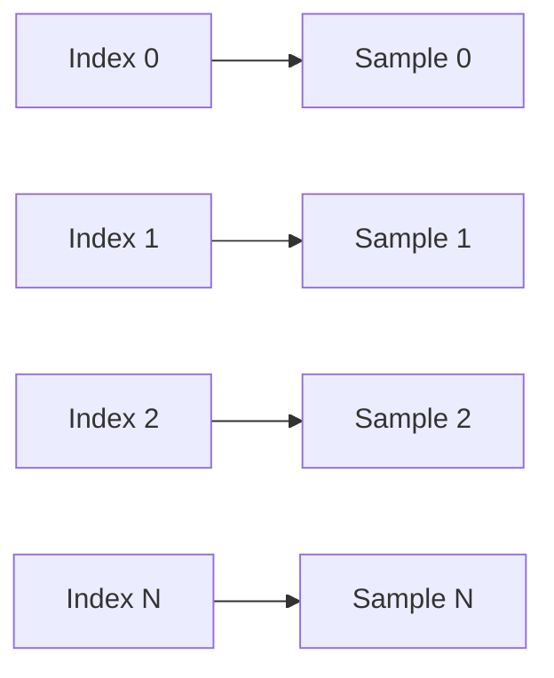

---

# 🧠 Iterable-Style Dataset

PyTorch also supports iterable-style datasets.

These implement:

```python
__iter__()
```

rather than random indexed access.

Useful examples include:

- Streaming datasets
- Large sequential datasets
- Data generated dynamically
- Data arriving from external streams
- Datasets where random access is inefficient

---

# 🧪 Iterable Dataset

```python
from torch.utils.data import IterableDataset


class NumberStream(
    IterableDataset
):

    def __init__(
        self,
        start,
        end
    ):

        self.start = start
        self.end = end

    def __iter__(
        self
    ):

        for value in range(
            self.start,
            self.end
        ):

            yield value
```

Usage:

```python
dataset = NumberStream(
    0,
    100
)

for value in dataset:

    print(
        value
    )
```

---

# 🧠 Map-Style vs Iterable-Style

| Map-Style | Iterable-Style |
|---|---|
| Uses `__getitem__()` | Uses `__iter__()` |
| Usually supports indexing | Sequential iteration |
| Usually has `__len__()` | Length may not be known |
| Good for ordinary datasets | Good for streams |
| Supports index-based sampling | Natural for streaming |
| Common in supervised learning | Useful for large / dynamic data |

---

# 🧠 Dataset Transforms

Datasets often require preprocessing:

```text
Raw Data
   ↓
Decode
   ↓
Resize
   ↓
Normalize
   ↓
Tensor
```

For images:

```text
Image
 ↓
Resize
 ↓
Crop
 ↓
Normalize
 ↓
Tensor
```

For text:

```text
Raw Text
 ↓
Tokenization
 ↓
Numerical IDs
 ↓
Padding
 ↓
Tensor
```

---

# 🧠 Dataset Responsibilities

A well-designed Dataset can handle:

```text
Data Access
+
Basic Sample-Level Transformation
+
Label Retrieval
```

It should generally not become a giant training framework.

Keep responsibilities separated.

---

# 🧠 `TensorDataset`

For data that already exists as tensors, PyTorch provides:

```python
TensorDataset
```

Example:

```python
from torch.utils.data import TensorDataset


x = torch.randn(
    1000,
    10
)

y = torch.randint(
    0,
    2,
    (1000,)
)

dataset = TensorDataset(
    x,
    y
)
```

Now:

```python
x_sample, y_sample = dataset[0]
```

---

# 🧠 Multiple Inputs

`TensorDataset` can also represent multiple tensors.

```python
dataset = TensorDataset(
    features,
    labels,
    metadata
)
```

Each sample returns:

```text
features
labels
metadata
```

provided the tensors have compatible first dimensions.

---

# 🔬 Part III — DataLoader

## 🧠 Why DataLoader?

A Dataset provides individual samples.

A DataLoader provides batches and iteration behavior.

```text
Dataset
    ↓
Individual Samples

DataLoader
    ↓
Mini-Batches
```

---

# 🧠 DataLoader Responsibilities

`DataLoader` can provide:

- Batching
- Shuffling
- Sampling
- Multi-process loading
- Memory pinning
- Custom collation
- Batch iteration

---

# 🧪 Basic DataLoader

```python
from torch.utils.data import DataLoader


loader = DataLoader(
    dataset,
    batch_size=32,
    shuffle=True
)
```

Now:

```python
for x_batch, y_batch in loader:

    print(
        x_batch.shape
    )
```

---

# 🧠 Dataset → DataLoader

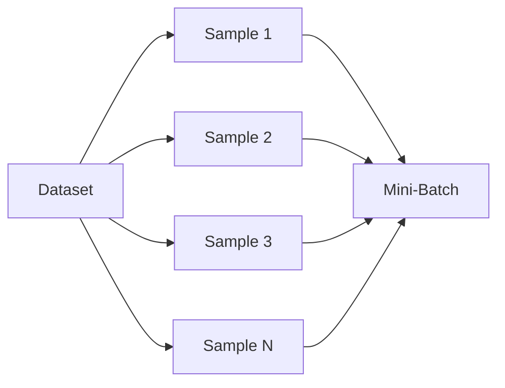

The DataLoader coordinates how individual samples are assembled into batches.

---

# 📦 Batch Size

Consider:

```python
dataset_size = 1000
```

and:

```python
batch_size = 32
```

The DataLoader produces approximately:

```text
32 samples
32 samples
32 samples
...
```

The final batch may contain fewer samples unless:

```python
drop_last=True
```

is used.

---

# 🧮 Number of Batches

For a dataset of size:

\[
N
\]

and batch size:

\[
B
\]

the number of batches with the final partial batch retained is:

\[
\left\lceil\frac{N}{B}\right\rceil
\]


For:

```text
N = 1000
B = 32
```

the DataLoader produces:

```text
32 batches
```

with the final batch containing fewer samples.

---

# 🧠 `drop_last`

```python
loader = DataLoader(
    dataset,
    batch_size=32,
    drop_last=True
)
```

This discards the final incomplete batch.

For:

```text
1000 samples
32 batch size
```

only complete batches are retained.

This can be useful when consistent batch shapes are desirable.

---

# 🧠 When Is `drop_last=True` Useful?

Potential use cases include:

- Batch Normalization behavior
- Distributed training
- Models requiring fixed batch shapes
- Certain contrastive learning approaches
- Avoiding unusually small final batches

It should not be enabled blindly because it discards data.

---

# 🔀 Shuffling

Training datasets are commonly shuffled.

```python
loader = DataLoader(
    dataset,
    batch_size=32,
    shuffle=True
)
```

Conceptually:

```text
Epoch 1:
1 2 3 4 5 6 ...

Epoch 2:
7 3 1 9 2 5 ...
```

The exact ordering changes.

---

# 🧠 Why Shuffle Training Data?

Shuffling helps reduce undesirable ordering effects.

For example, if a dataset is ordered:

```text
Class A
Class A
Class A
...
Class B
Class B
Class B
...
```

training without shuffling can expose the model to long runs of one class.

Randomized batching generally provides a better mixture of training examples.

---

# ⚠ Should Validation Data Be Shuffled?

Usually:

```text
Training → shuffle=True
Validation → shuffle=False
Test → shuffle=False
```

Shuffling validation or test data is generally unnecessary unless there is a specific reason to do so.

---

# 🧠 DataLoader Sampling

DataLoader can use samplers to control which indices are selected.

Examples include:

```text
SequentialSampler
RandomSampler
WeightedRandomSampler
DistributedSampler
```

This is particularly useful for:

- Imbalanced datasets
- Distributed training
- Specialized sampling strategies

---

# ⚖️ Weighted Sampling

For imbalanced classification:

```text
Class A → 95%
Class B → 5%
```

a weighted sampling strategy can increase the frequency with which minority examples are selected.

Example:

```python
from torch.utils.data import WeightedRandomSampler
```

Conceptually:

```text
Rare Class
   ↓
Higher Sampling Weight
   ↓
Selected More Frequently
```

---

# 🧠 DataLoader Worker Processes

Data loading can become a bottleneck when:

```text
GPU is fast
+
Data preprocessing is slow
```

PyTorch supports:

```python
num_workers
```

Example:

```python
loader = DataLoader(
    dataset,
    batch_size=64,
    shuffle=True,
    num_workers=4
)
```

Multiple worker processes can prepare batches while the model is computing.

---

# 🏗 Parallel Data Loading

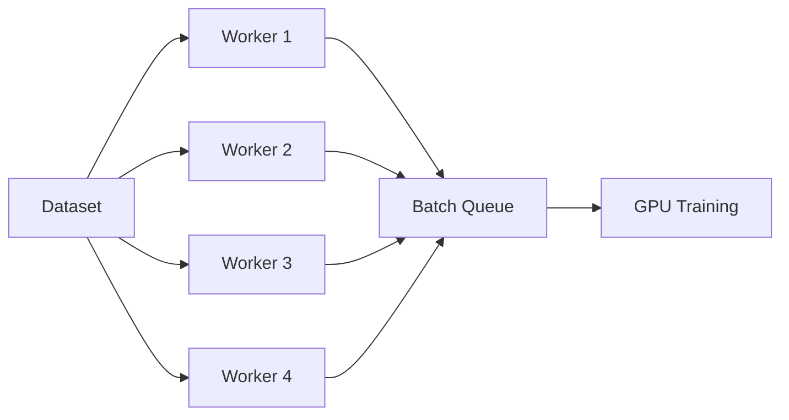

The objective is to overlap data preparation with model computation.

---

# 🧠 `num_workers`

Example:

```python
DataLoader(
    dataset,
    batch_size=64,
    num_workers=4
)
```

means multiple worker processes can be used for data loading.

The optimal value depends on:

```text
CPU Cores
Dataset Complexity
Storage Speed
Preprocessing Cost
Batch Size
GPU Speed
Operating System
Memory
```

There is no universal optimal number.

---

# ⚠ More Workers ≠ Always Faster

Increasing workers can increase:

```text
CPU Usage
Memory Usage
Process Overhead
I/O Contention
```

Therefore:

> Benchmark the pipeline rather than blindly maximizing `num_workers`.

---

# 🧠 `pin_memory`

When using CUDA, DataLoader can optionally use pinned host memory:

```python
loader = DataLoader(
    dataset,
    batch_size=64,
    pin_memory=True
)
```

Pinned memory can improve host-to-GPU transfer efficiency in appropriate workloads.

---

# 🚀 Pinned Memory + GPU Transfer

A common pattern is:

```python
x_batch = x_batch.to(
    device,
    non_blocking=True
)
```

when using pinned memory appropriately.

Conceptually:

```text
CPU Pinned Memory
       ↓
Efficient Transfer
       ↓
GPU Memory
```

---

# 🧠 `persistent_workers`

When using multiple workers, workers may otherwise be shut down and recreated between epochs.

For repeated training epochs, you can consider:

```python
DataLoader(
    dataset,
    batch_size=64,
    num_workers=4,
    persistent_workers=True
)
```

This keeps worker processes alive between epochs.

Use it when the workload benefits from avoiding worker startup overhead.

---

# 🧠 DataLoader Configuration

A production-oriented DataLoader may look like:

```python
loader = DataLoader(

    dataset,

    batch_size=64,

    shuffle=True,

    num_workers=4,

    pin_memory=True,

    persistent_workers=True,

    drop_last=True
)
```

Do not copy this configuration blindly.

Each option should be chosen based on the workload.

---

# 🧠 `collate_fn`

DataLoader needs to combine individual samples into batches.

The default behavior works for many fixed-size tensors.

But consider variable-length data:

```text
Sample 1 → length 10
Sample 2 → length 20
Sample 3 → length 15
```

These cannot always be directly stacked.

A custom:

```python
collate_fn
```

can solve this.

---

# 🧠 Default Collation

Conceptually:

```text
Sample 1 ─┐
Sample 2 ─┼──> Collate ──> Batch Tensor
Sample 3 ─┘
```

For fixed-size tensors:

```text
[3]
[3]
[3]
 ↓
[batch, 3]
```

---

# 🧪 Custom `collate_fn`

```python
def custom_collate(
    batch
):

    inputs = [
        item[0]
        for item in batch
    ]

    labels = [
        item[1]
        for item in batch
    ]

    return (
        inputs,
        labels
    )
```

Use:

```python
loader = DataLoader(
    dataset,
    batch_size=32,
    collate_fn=custom_collate
)
```

---

# 🧠 Variable-Length Sequences

For NLP or sequence data:

```text
"I like AI"
        ↓
3 tokens

"I like Deep Learning"
        ↓
4 tokens
```

A batch may require:

```text
Padding
+
Attention Mask
```

A custom collation function can prepare the batch.

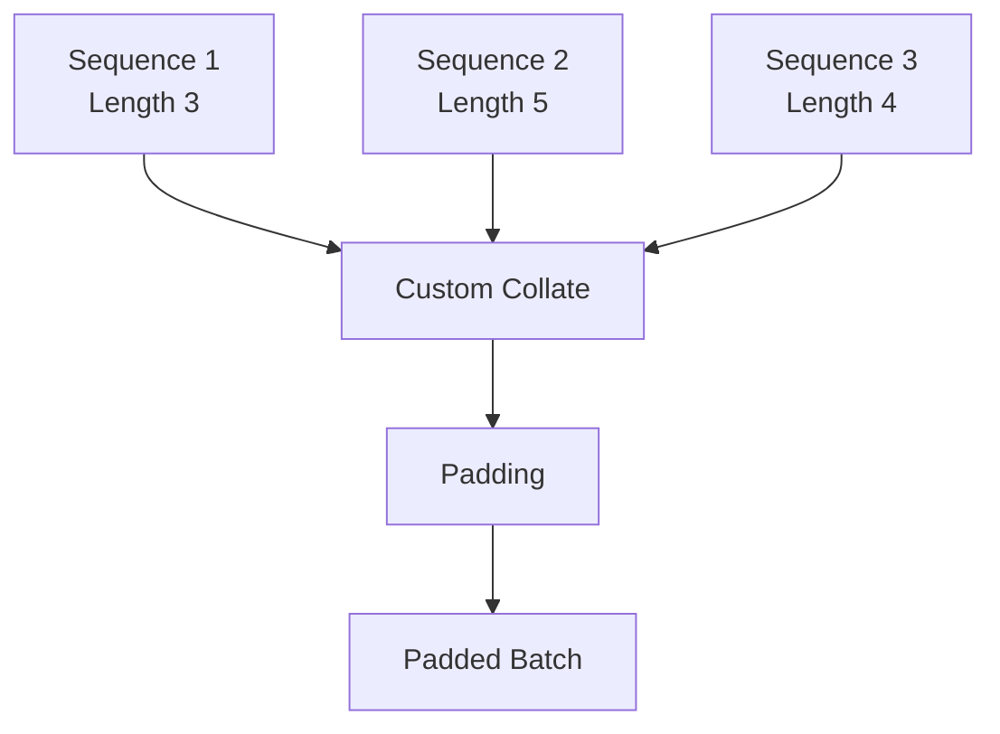

---

# 🧠 Dataset vs DataLoader

| Dataset | DataLoader |
|---|---|
| Defines sample access | Defines iteration |
| Provides individual samples | Provides batches |
| Implements data access logic | Handles batching |
| Can apply sample transformations | Can shuffle |
| Usually implements `__getitem__()` | Supports multiple workers |
| Usually implements `__len__()` | Supports custom collation |

Simple rule:

> **Dataset defines what the data is; DataLoader defines how the data is delivered.**

---

# 🧠 Dataset + DataLoader + GPU

A typical training pipeline is:

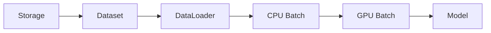

---

# 🧪 Complete Dataset + DataLoader Example

```python
import torch

from torch.utils.data import (
    Dataset,
    DataLoader
)


class RegressionDataset(
    Dataset
):

    def __init__(
        self,
        size
    ):

        self.x = torch.randn(
            size,
            10
        )

        self.y = (
            self.x.sum(
                dim=1,
                keepdim=True
            )
        )

    def __len__(
        self
    ):

        return len(
            self.x
        )

    def __getitem__(
        self,
        index
    ):

        return (
            self.x[index],
            self.y[index]
        )


dataset = RegressionDataset(
    10000
)


loader = DataLoader(
    dataset,
    batch_size=64,
    shuffle=True
)


for x_batch, y_batch in loader:

    print(
        x_batch.shape,
        y_batch.shape
    )

    break
```

Expected shapes:

```text
x_batch → [64, 10]
y_batch → [64, 1]
```

---

# 🧠 Complete Training Pipeline

```python
for epoch in range(
    epochs
):

    model.train()

    for x_batch, y_batch in train_loader:

        x_batch = x_batch.to(
            device
        )

        y_batch = y_batch.to(
            device
        )

        optimizer.zero_grad()

        predictions = model(
            x_batch
        )

        loss = loss_fn(
            predictions,
            y_batch
        )

        loss.backward()

        optimizer.step()
```

---

# 🧠 Production Data Pipeline

A production-oriented PyTorch pipeline can be viewed as:

```text
Object Storage / Database / Files
              ↓
          Dataset
              ↓
      Transform / Decode
              ↓
          DataLoader
              ↓
      Worker Processes
              ↓
       Batch Collation
              ↓
       Pinned CPU Memory
              ↓
        GPU Transfer
              ↓
        Model Training
```

---

# 🏢 Enterprise Data Pipeline Architecture

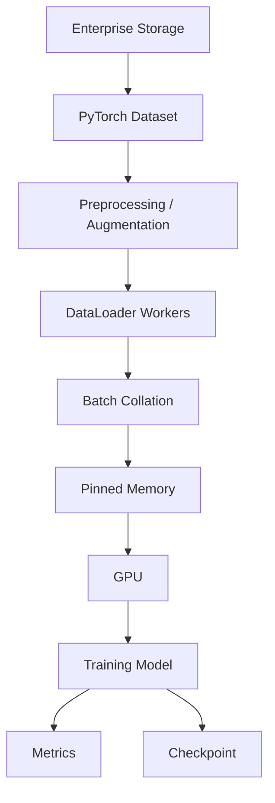

---

# 🧠 Data Pipeline Bottleneck

A training system can be represented as:

```text
Data Preparation
       ↓
Data Transfer
       ↓
GPU Computation
```

If:

```text
Data Preparation Time
>
GPU Computation Time
```

the GPU may sit idle.

```text
GPU Utilization

██████░░░░
      ↑
   Waiting for Data
```

The goal is to overlap:

```text
Data Preparation
```

with:

```text
Model Computation
```

---

# 🧠 Training Throughput

A simplified view:

\[
Throughput
=
\frac{Samples}{Second}
\]


Improving throughput may involve:

```text
Larger / Better Batch Sizes
+
Parallel Data Loading
+
Pinned Memory
+
Efficient Preprocessing
+
Faster Storage
+
GPU Utilization
```

---

# 🧠 DataLoader Performance Tuning

When optimizing a pipeline, measure:

```text
Batch Loading Time
GPU Transfer Time
Forward Time
Backward Time
Optimizer Time
GPU Utilization
CPU Utilization
Memory Usage
```

Do not optimize only the model.

The input pipeline can become the bottleneck.

---

# 🧪 Measuring Data Loading

A simple diagnostic:

```python
import time


start = time.perf_counter()

for batch in train_loader:

    end = time.perf_counter()

    print(
        "Batch load time:",
        end - start
    )

    start = time.perf_counter()

    # Training step here
```

For serious production profiling, use PyTorch profiling and system-level observability rather than relying only on simple timers.

---

# 🧠 Data Loading and Augmentation

For Computer Vision:

```text
Image
 ↓
Decode
 ↓
Resize
 ↓
Random Crop
 ↓
Random Flip
 ↓
Normalize
 ↓
Tensor
 ↓
Batch
 ↓
GPU
```

This pipeline is directly connected to future CNN training chapters.

---

# 🧠 Example Image Dataset

```python
from torch.utils.data import Dataset


class ImageDataset(
    Dataset
):

    def __init__(
        self,
        image_paths,
        labels,
        transform=None
    ):

        self.image_paths = image_paths
        self.labels = labels
        self.transform = transform

    def __len__(
        self
    ):

        return len(
            self.image_paths
        )

    def __getitem__(
        self,
        index
    ):

        image = load_image(
            self.image_paths[index]
        )

        label = self.labels[
            index
        ]

        if self.transform:

            image = self.transform(
                image
            )

        return (
            image,
            label
        )
```

The exact image-loading implementation depends on the chosen vision library.

---

# 🧠 Data Pipeline Responsibility Boundaries

A clean design can separate:

```text
Dataset
    ↓
Sample Access

Transform
    ↓
Sample-Level Processing

DataLoader
    ↓
Batching / Sampling / Workers

Training Loop
    ↓
Model Optimization
```

Avoid putting:

```text
Optimizer Logic
Loss Logic
Model Logic
```

inside the Dataset.

---

# 🧠 Reproducibility

Data loading can influence reproducibility.

Important factors include:

```text
Random Seeds
+
Shuffling
+
Worker Seeds
+
Data Augmentation
+
Sampler State
+
CUDA Determinism
```

A reproducible training system must control randomness carefully.

---

# 🧪 Setting a Basic Seed

```python
import torch


torch.manual_seed(
    42
)
```

For a complete production experiment, additional randomness sources may need to be controlled depending on the libraries and hardware being used.

---

# ⚠ Reproducibility vs Performance

Some deterministic configurations can reduce performance.

Therefore:

```text
Maximum Reproducibility
```

and:

```text
Maximum Performance
```

may sometimes involve trade-offs.

This should be an explicit engineering decision.

---

# 🧠 Distributed Training Consideration

In distributed training, each worker/process should generally receive the appropriate subset of data.

A common mechanism is:

```python
DistributedSampler
```

Conceptually:

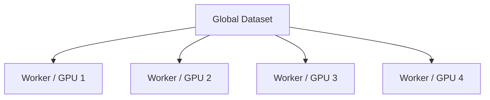

The data pipeline therefore becomes part of distributed training architecture.

---

# 🧠 Distributed Data Pipeline

```text
Global Dataset
      ↓
Distributed Sampler
      ↓
Process 1 → GPU 1
Process 2 → GPU 2
Process 3 → GPU 3
Process 4 → GPU 4
```

Each process trains on its assigned portion of the data.

---

# 🧠 DataLoader Configuration Checklist

When designing a DataLoader, evaluate:

```text
☐ batch_size
☐ shuffle
☐ sampler
☐ num_workers
☐ pin_memory
☐ persistent_workers
☐ drop_last
☐ collate_fn
☐ worker initialization
☐ memory usage
☐ storage throughput
☐ GPU transfer efficiency
```

---

# ⚠ Common DataLoader Mistakes

Avoid:

- Loading the entire dataset into GPU memory unnecessarily
- Using an excessively large batch size
- Setting `num_workers` arbitrarily high
- Using `shuffle=True` for validation without reason
- Forgetting `drop_last` requirements for specific architectures
- Ignoring variable-length samples
- Using an inefficient `collate_fn`
- Performing expensive preprocessing synchronously when it could be parallelized
- Excessive CPU/GPU data transfers
- Ignoring pinned memory when appropriate
- Assuming more workers always means better performance
- Forgetting distributed sampling in distributed training
- Introducing nondeterministic preprocessing without understanding its impact
- Performing heavy database/network calls for every sample without proper caching or batching

---

# 🧠 End-to-End Mental Model

The complete PyTorch Deep Learning workflow can be summarized as:

```text
                 DATA
                  │
                  ▼
              DATASET
                  │
                  ▼
             DATALOADER
                  │
            ┌─────┴─────┐
            │           │
        BATCHING      WORKERS
            │           │
            └─────┬─────┘
                  ▼
             CPU MEMORY
                  │
                  ▼
            GPU TRANSFER
                  │
                  ▼
               MODEL
                  │
                  ▼
             PREDICTION
                  │
                  ▼
                LOSS
                  │
                  ▼
              AUTOGRAD
                  │
                  ▼
              GRADIENTS
                  │
                  ▼
              OPTIMIZER
                  │
                  ▼
          UPDATED PARAMETERS
                  │
                  └──────────► MODEL
```

This is one of the most important mental models for PyTorch engineering.

---

# 🏢 Enterprise Perspective

In enterprise Deep Learning systems, model architecture is only one part of the system.

A production training platform must consider:

```text
Data Access
+
Data Versioning
+
Preprocessing
+
Dataset Construction
+
Batching
+
Sampling
+
GPU Transfer
+
Training
+
Checkpointing
+
Experiment Tracking
+
Monitoring
```

A poorly designed data pipeline can make an expensive GPU cluster underutilized.

Therefore:

> **Training performance is a system-level concern, not only a model-level concern.**

---

!!! tip "Production Insight"

    **A powerful GPU cannot compensate for a poorly designed input pipeline.**

    If the GPU is waiting for data, increasing GPU size may simply increase cost without increasing useful throughput.

    Always measure:

    ```text
    Data Loading
          ↓
    CPU Processing
          ↓
    CPU → GPU Transfer
          ↓
    GPU Computation
    ```

    Then identify the actual bottleneck before optimizing.

---

# 🧠 Production Optimization Strategy

A practical optimization sequence is:

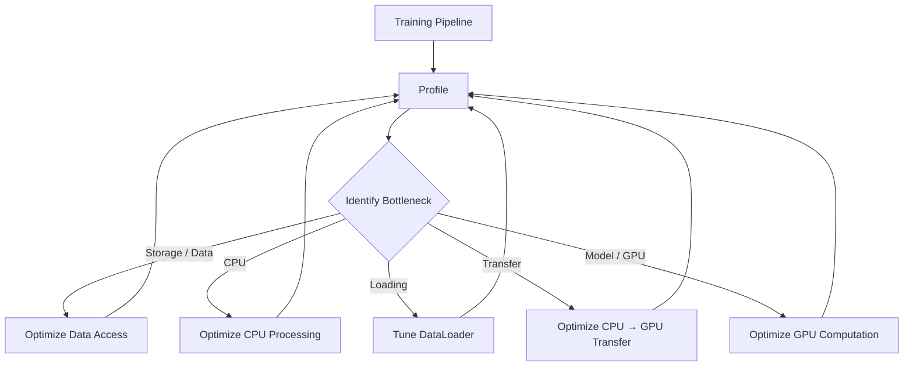

The key principle is:

> **Measure → Identify → Optimize → Measure Again.**

---

# 🧪 Practical Exercise 1 — Autograd

Create:

```python
x = torch.tensor(
    5.0,
    requires_grad=True
)
```

Calculate:

\[
y=3x^3+2x^2+x
\]

Then compute:

```python
y.backward()
```

and inspect:

```python
x.grad
```

---

# 🧪 Practical Exercise 2 — Gradient Accumulation

Create a tensor with:

```python
requires_grad=True
```

Perform two backward passes without clearing the gradient.

Observe the result.

Then repeat using:

```python
x.grad.zero_()
```

and compare.

---

# 🧪 Practical Exercise 3 — Custom Dataset

Create a Dataset representing:

```text
1000 samples
10 features
1 target
```

Implement:

```python
__len__()
__getitem__()
```

Verify:

```python
len(dataset)
dataset[0]
```

---

# 🧪 Practical Exercise 4 — DataLoader

Create:

```python
DataLoader(
    dataset,
    batch_size=32,
    shuffle=True
)
```

Inspect:

```text
Batch Shape
Number of Batches
Last Batch Size
```

---

# 🧪 Practical Exercise 5 — `drop_last`

Compare:

```python
drop_last=False
```

with:

```python
drop_last=True
```

using:

```text
Dataset Size = 100
Batch Size = 32
```

Observe the number and sizes of batches.

---

# 🧪 Practical Exercise 6 — DataLoader Workers

Benchmark:

```text
num_workers=0
num_workers=2
num_workers=4
```

Measure:

```text
Batch Loading Time
Epoch Time
CPU Usage
GPU Utilization
```

Do not assume the highest worker count is best.

---

# 🧪 Practical Exercise 7 — Custom `collate_fn`

Create variable-length sequences:

```text
[1, 2, 3]

[4, 5]

[6, 7, 8, 9]
```

Implement a custom `collate_fn` that pads them into a common batch shape.

---

# 🧪 Practical Exercise 8 — GPU Pipeline

Build:

```text
Dataset
 ↓
DataLoader
 ↓
GPU Transfer
 ↓
PyTorch Model
 ↓
Loss
 ↓
Backward
 ↓
Optimizer
```

Measure:

```text
Data Loading
GPU Transfer
Forward
Backward
Total Batch Time
```

---

# 🧪 Practical Exercise 9 — End-to-End Classifier

Build a complete classifier using:

```text
Custom Dataset
DataLoader
nn.Module
CrossEntropyLoss
AdamW
Autograd
GPU
Validation Loop
Checkpointing
```

Track:

```text
Training Loss
Validation Loss
Training Accuracy
Validation Accuracy
Epoch Time
```

---

# 🧠 Interview Questions

## Beginner

### 1. What is PyTorch Autograd?

Autograd is PyTorch's automatic differentiation system used to compute gradients for tensors involved in differentiable computations.

### 2. What does `requires_grad=True` mean?

It tells PyTorch to track operations involving the tensor so gradients can be calculated.

### 3. What does `backward()` do?

It performs reverse-mode automatic differentiation through the computational graph to calculate gradients.

### 4. Why do we call `optimizer.zero_grad()`?

Because gradients accumulate by default in PyTorch.

### 5. What is a Dataset?

A Dataset provides access to individual samples and their corresponding targets.

### 6. What are `__len__()` and `__getitem__()`?

`__len__()` reports the number of samples, while `__getitem__()` retrieves an individual sample.

### 7. What is a DataLoader?

A DataLoader provides an iterable over a Dataset and handles batching, shuffling, sampling, and optionally parallel data loading.

---

## Intermediate

### 8. What is the difference between Dataset and DataLoader?

Dataset defines how individual samples are obtained; DataLoader defines how those samples are organized and delivered during iteration.

### 9. What is a map-style Dataset?

A Dataset that provides index-based access through `__getitem__()` and generally implements `__len__()`.

### 10. What is an IterableDataset?

A dataset that provides samples through iteration using `__iter__()` and is useful for streaming or sequential data sources.

### 11. Why use `num_workers`?

To allow multiple worker processes to prepare data concurrently, potentially reducing input pipeline bottlenecks.

### 12. What is `pin_memory`?

It enables the DataLoader to place CPU tensors in pinned host memory, which can improve CPU-to-GPU transfer performance in appropriate CUDA workloads.

### 13. What is `collate_fn`?

It defines how individual samples are combined into a batch.

### 14. Why use `drop_last=True`?

It discards an incomplete final batch, which can be useful when consistent batch sizes are required.

### 15. Why shuffle training data?

To reduce undesirable ordering effects and generally provide better randomized mini-batches during optimization.

---

## Advanced

### 16. Why can a GPU remain underutilized even when the model is computationally large?

Because the input pipeline may be too slow. The GPU may spend time waiting for data, preprocessing, or CPU-to-GPU transfers.

### 17. How would you diagnose a DataLoader bottleneck?

Measure:

```text
Batch Loading Time
CPU Utilization
GPU Utilization
Transfer Time
Training Step Time
```

and profile the complete pipeline.

### 18. Why can increasing `num_workers` make performance worse?

More workers increase process overhead, memory consumption, and potential I/O contention. The optimal value depends on the workload.

### 19. What is gradient accumulation?

It is the process of accumulating gradients across multiple mini-batches before performing an optimizer update.

### 20. Why is gradient accumulation useful?

It can simulate a larger effective batch size when the desired batch size cannot fit into available GPU memory.

### 21. What is the difference between `detach()` and `no_grad()`?

`detach()` disconnects a specific tensor from its computation history, while `no_grad()` disables gradient tracking for operations executed inside its context.

### 22. What happens if you call `backward()` multiple times without clearing gradients?

Gradients accumulate in the relevant leaf tensors.

### 23. Why are scalar losses convenient for `backward()`?

A scalar loss naturally represents the single optimization objective and allows PyTorch to initiate reverse-mode differentiation without requiring an explicit upstream gradient.

### 24. How would you handle variable-length sequences in a DataLoader?

Use a custom `collate_fn` to pad, pack, or otherwise organize the samples into a batch representation appropriate for the model.

### 25. How would you design a production PyTorch input pipeline?

Separate:

```text
Data Storage
Dataset
Transforms
Sampling
DataLoader
Collation
Device Transfer
Training
Monitoring
```

and benchmark the pipeline end-to-end.

---

# 📌 Key Takeaways

- PyTorch Autograd automatically calculates gradients required for optimization.
- `requires_grad=True` enables gradient tracking.
- `backward()` computes gradients through the computational graph.
- Gradients accumulate by default.
- `optimizer.zero_grad()` is normally used before each standard optimization step.
- Leaf tensors are especially important when inspecting `.grad`.
- `detach()` disconnects tensors from their autograd history.
- `torch.no_grad()` disables gradient tracking for a block of computation.
- `torch.inference_mode()` is useful for inference workloads.
- A Dataset defines how individual samples are accessed.
- Map-style datasets use `__getitem__()` and generally `__len__()`.
- Iterable-style datasets use `__iter__()`.
- `TensorDataset` is useful when data already exists as tensors.
- DataLoader converts individual samples into iterable mini-batches.
- `batch_size` controls the number of samples in a batch.
- `shuffle=True` is commonly used for training datasets.
- `drop_last=True` removes incomplete final batches.
- `num_workers` can parallelize data loading.
- `pin_memory=True` can improve CPU-to-GPU transfer performance in suitable CUDA workloads.
- `collate_fn` controls how samples are assembled into batches.
- Variable-length data often requires custom collation.
- Distributed training requires careful dataset partitioning and sampling.
- The data pipeline can become the bottleneck even when the model and GPU are powerful.
- Production optimization should be driven by profiling rather than assumptions.
- Dataset, DataLoader, GPU transfer, model execution, autograd, and optimization form one integrated training system.

---

# 📚 Further Reading

Continue with:

- **[18. Building Classification and Regression Models](18-building-classification-and-regression-models.md)**
- **[19. Convolutional Neural Networks](19-convolutional-neural-networks.md)**
- **[20. CNN Architecture, Optimization and Training](20-cnn-architecture-optimization-and-training.md)**
- **[21. Transfer Learning and Fine-Tuning](21-transfer-learning-and-fine-tuning.md)**
- **[22. ResNet, Residual Connections and TorchVision](22-resnet-residual-connections-and-torchvision.md)**
- **[35. GPU-Accelerated Deep Learning](35-gpu-accelerated-deep-learning.md)**
- **[36. Deep Learning Training and Model Lifecycle](36-deep-learning-training-and-model-lifecycle.md)**
- **[37. Building Production Deep Learning Systems](37-building-production-deep-learning-systems.md)**

The next chapter applies these foundations to build complete **classification and regression models using both Keras and PyTorch**, connecting the concepts learned throughout the Deep Learning foundations and framework chapters.

---

## ➡️ Next Chapter

**[18. Building Classification and Regression Models](18-building-classification-and-regression-models.md)**

---

> **Enterprise AI Engineering Handbook**  
> *Building Production-Grade Enterprise AI Systems — One Chapter at a Time.*