# 18. Building Classification and Regression Models

> Learn how to build complete classification and regression models using Keras and PyTorch, from dataset preparation and model design to training, evaluation, prediction, and production-oriented model selection.

---

## 🎯 Learning Objectives

After completing this chapter, you will be able to:

- Understand the end-to-end Deep Learning model development workflow
- Differentiate between classification and regression problems
- Identify appropriate input and output representations
- Build classification models using Keras
- Build classification models using PyTorch
- Build regression models using Keras
- Build regression models using PyTorch
- Select appropriate output layers
- Select appropriate loss functions
- Select appropriate activation functions
- Understand binary and multi-class classification
- Understand regression model outputs
- Train models using mini-batches
- Evaluate classification models
- Evaluate regression models
- Use validation data correctly
- Compare Keras and PyTorch implementations
- Understand logits, probabilities, and thresholds
- Avoid common model-design mistakes
- Build production-oriented training pipelines

---

# 📖 Overview

Two of the most common supervised Deep Learning problems are:

```text
Classification
    ↓
Predict a category

Regression
    ↓
Predict a continuous numerical value
```

Examples:

```text
Classification

Email → Spam / Not Spam
Image → Cat / Dog
Transaction → Fraud / Legitimate
Customer → Churn / No Churn
```

```text
Regression

House → Price
Customer → Lifetime Value
Product → Demand
Sensor → Temperature
```

The overall workflow is similar:

```text
Data
 ↓
Preprocessing
 ↓
Train / Validation / Test Split
 ↓
Model
 ↓
Forward Pass
 ↓
Loss
 ↓
Backpropagation
 ↓
Optimizer
 ↓
Evaluation
 ↓
Prediction
```

---

# 🧠 Classification vs Regression

| Characteristic | Classification | Regression |
|---|---|---|
| Target | Category | Continuous value |
| Example | Fraud / Legitimate | Transaction Amount |
| Output | Class score / probability | Numeric value |
| Common Loss | Cross-Entropy / BCE | MSE / MAE |
| Typical Output | Logits | Linear value |
| Evaluation | Accuracy, Precision, Recall, F1 | MAE, MSE, RMSE, R² |

---

# 🏗 End-to-End Model Development Workflow

```mermaid
flowchart LR

    DATA["Raw Data"]

    CLEAN["Data Preparation"]

    SPLIT["Train / Validation / Test"]

    MODEL["Model Architecture"]

    TRAIN["Training"]

    VALIDATE["Validation"]

    EVALUATE["Evaluation"]

    PREDICT["Prediction"]

    DEPLOY["Deployment"]

    DATA --> CLEAN
    CLEAN --> SPLIT
    SPLIT --> MODEL
    MODEL --> TRAIN
    TRAIN --> VALIDATE
    VALIDATE --> EVALUATE
    EVALUATE --> PREDICT
    PREDICT --> DEPLOY
```

---

# 🧠 Choosing the Problem Type

Before building a model, identify the target variable.

## Classification

If:

```text
y ∈ {Class 1, Class 2, ..., Class N}
```

the problem is classification.

Examples:

```text
0 / 1
Cat / Dog
A / B / C
Fraud / Legitimate
```

---

## Regression

If:

```text
y ∈ ℝ
```

and the target is continuous, the problem is regression.

Examples:

```text
₹500.25
72.4 kg
23.7°C
145.8
```

---

# 🧠 Classification Types

Classification can be divided into:

```text
Binary Classification
        │
        ▼
Two Classes

Multi-Class Classification
        │
        ▼
More Than Two Classes

Multi-Label Classification
        │
        ▼
Multiple Independent Labels
```

---

# 🔵 Binary Classification

Example:

```text
Fraud
  │
  ├── 0 → Legitimate
  │
  └── 1 → Fraud
```

Typical model output:

```text
Single Logit
```

with:

```text
BCEWithLogitsLoss
```

in PyTorch or:

```text
BinaryCrossentropy
```

in Keras.

---

# 🟢 Multi-Class Classification

Example:

```text
Image
 │
 ├── Cat
 ├── Dog
 ├── Horse
 └── Bird
```

The model produces one score for each class.

For four classes:

```text
[1.2, -0.7, 3.5, 0.4]
```

These are logits.

The predicted class is generally:

```python
torch.argmax(
    logits,
    dim=1
)
```

in PyTorch.

---

# 🟡 Multi-Label Classification

A sample may belong to multiple classes simultaneously.

Example:

```text
Image
 │
 ├── Car       → 1
 ├── Person    → 1
 ├── Tree      → 0
 └── Building  → 1
```

Each class is treated as an independent binary decision.

Typical output:

```text
Multiple independent logits
```

with:

```text
Sigmoid
```

interpretation.

---

# 🧠 Regression

Regression predicts a continuous numerical value.

Example:

```text
Features
   ↓
Neural Network
   ↓
Single Numerical Output
```

For house-price prediction:

```text
Input:
Area
Bedrooms
Location
Age

Output:
₹8,500,000
```

---

# 🧠 Model Output Design

The output layer should match the problem.

| Problem | Output Units | Output Activation | Typical Loss |
|---|---:|---|---|
| Binary Classification | 1 | Sigmoid interpretation | Binary Cross-Entropy |
| Multi-Class | N | Softmax interpretation | Cross-Entropy |
| Multi-Label | N | Sigmoid interpretation | Binary Cross-Entropy |
| Regression | 1 | Linear | MSE / MAE |

A major principle:

> **The model output, activation, target representation, and loss function must be designed together.**

---

# 🧠 Classification Decision Pipeline

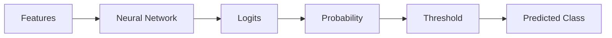

For binary classification, a threshold such as `0.5` is common as a starting point, but production systems may choose a different threshold based on business costs and validation performance.

---

# 📊 Classification Threshold

A binary classifier may produce:

```text
Probability = 0.82
```

Using:

```text
Threshold = 0.50
```

the prediction becomes:

```text
Class 1
```

If the threshold is:

```text
0.90
```

the same prediction becomes:

```text
Class 0
```


::contentReference[oaicite:0]{index=0}


This is important because threshold selection affects:

```text
True Positives
False Positives
True Negatives
False Negatives
Precision
Recall
F1
```

---

# 🧠 Dataset Preparation

Before model construction:

```text
Raw Dataset
    ↓
Data Cleaning
    ↓
Feature Preparation
    ↓
Target Preparation
    ↓
Normalization / Scaling
    ↓
Train / Validation / Test Split
```

---

# 🔀 Train / Validation / Test

A typical structure is:

```text
Dataset
   │
   ├── Training Set
   │
   ├── Validation Set
   │
   └── Test Set
```

Responsibilities:

| Dataset | Purpose |
|---|---|
| Training | Learn parameters |
| Validation | Tune architecture / hyperparameters |
| Test | Final unbiased evaluation |

---

# ⚠ Data Leakage

Never allow information from the validation or test set to influence training preprocessing.

Incorrect:

```text
Entire Dataset
      ↓
Fit Scaler
      ↓
Train / Validation / Test
```

Preferred:

```text
Training Data
      ↓
Fit Scaler
      ↓
Transform Train
Transform Validation
Transform Test
```

---

# 🧠 Feature Scaling

Neural networks often benefit from appropriately scaled numerical features.

Common approaches:

```text
Standardization
Normalization
Domain-Specific Scaling
```

Standardization is commonly represented as:

\[
z=\frac{x-\mu}{\sigma}
\]


where:

```text
μ = Training-set mean
σ = Training-set standard deviation
```

The scaling parameters should be learned from the training set.

---

# 🧠 Model Architecture

A basic feed-forward model looks like:

```text
Input
  ↓
Dense / Linear
  ↓
Activation
  ↓
Dense / Linear
  ↓
Activation
  ↓
Output
```

---

# 🧠 Classification Architecture

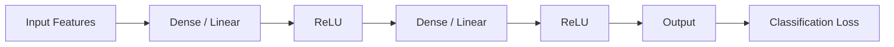

---

# 🧠 Regression Architecture

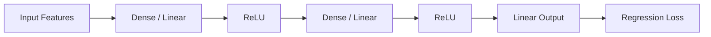

---

# 🐍 Part I — Classification with Keras

## 🧪 Keras Binary Classification

```python
import tensorflow as tf


model = tf.keras.Sequential([

    tf.keras.layers.Input(
        shape=(10,)
    ),

    tf.keras.layers.Dense(
        64,
        activation="relu"
    ),

    tf.keras.layers.Dense(
        32,
        activation="relu"
    ),

    tf.keras.layers.Dense(
        1,
        activation="sigmoid"
    )
])
```

Compile:

```python
model.compile(

    optimizer="adam",

    loss="binary_crossentropy",

    metrics=[
        "accuracy"
    ]
)
```

---

# 🧠 Keras Binary Classification Architecture

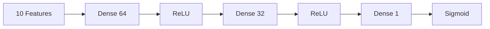

---

# 🧪 Training Keras Classification Model

```python
history = model.fit(

    X_train,
    y_train,

    validation_data=(
        X_val,
        y_val
    ),

    epochs=20,

    batch_size=32
)
```

---

# 🧪 Keras Multi-Class Classification

Suppose there are:

```text
10 classes
```

The output layer can be:

```python
model = tf.keras.Sequential([

    tf.keras.layers.Input(
        shape=(784,)
    ),

    tf.keras.layers.Dense(
        128,
        activation="relu"
    ),

    tf.keras.layers.Dense(
        64,
        activation="relu"
    ),

    tf.keras.layers.Dense(
        10,
        activation="softmax"
    )
])
```

Compile:

```python
model.compile(

    optimizer="adam",

    loss="sparse_categorical_crossentropy",

    metrics=[
        "accuracy"
    ]
)
```

---

# 🧠 Keras Multi-Class Output

```text
Logits
   ↓
Softmax
   ↓
Class Probabilities
   ↓
Argmax
   ↓
Predicted Class
```

For example:

```text
[0.02, 0.10, 0.80, 0.08]
```

Prediction:

```text
Class 2
```

---

# 🧠 `sparse_categorical_crossentropy`

Use:

```text
Integer Class Labels
```

such as:

```text
0
1
2
3
```

Example:

```python
y_train = [
    0,
    2,
    1,
    3
]
```

---

# 🧠 `categorical_crossentropy`

Use:

```text
One-Hot Encoded Labels
```

Example:

```text
Class 2

[0, 0, 1, 0]
```

Then:

```python
loss="categorical_crossentropy"
```

---

# 🐍 Part II — Classification with PyTorch

## 🧪 PyTorch Binary Classification

```python
import torch
import torch.nn as nn


class BinaryClassifier(
    nn.Module
):

    def __init__(
        self
    ):

        super().__init__()

        self.network = nn.Sequential(

            nn.Linear(
                10,
                64
            ),

            nn.ReLU(),

            nn.Linear(
                64,
                32
            ),

            nn.ReLU(),

            nn.Linear(
                32,
                1
            )
        )

    def forward(
        self,
        x
    ):

        return self.network(
            x
        )
```

Loss:

```python
loss_fn = nn.BCEWithLogitsLoss()
```

---

# 🧠 Why No Sigmoid Layer?

With:

```python
nn.BCEWithLogitsLoss()
```

the model should generally return raw logits.

Conceptually:

```text
Model
 ↓
Raw Logit
 ↓
BCEWithLogitsLoss
```

The loss internally combines the sigmoid operation with the binary cross-entropy calculation in a numerically stable way.

For inference:

```python
probability = torch.sigmoid(
    logits
)
```

---

# 🧪 PyTorch Binary Prediction

```python
model.eval()

with torch.no_grad():

    logits = model(
        x
    )

    probabilities = torch.sigmoid(
        logits
    )

    predictions = (
        probabilities >= 0.5
    ).int()
```

---

# 🧪 PyTorch Multi-Class Classification

```python
class MultiClassClassifier(
    nn.Module
):

    def __init__(
        self,
        input_features,
        num_classes
    ):

        super().__init__()

        self.network = nn.Sequential(

            nn.Linear(
                input_features,
                128
            ),

            nn.ReLU(),

            nn.Linear(
                128,
                64
            ),

            nn.ReLU(),

            nn.Linear(
                64,
                num_classes
            )
        )

    def forward(
        self,
        x
    ):

        return self.network(
            x
        )
```

Loss:

```python
loss_fn = nn.CrossEntropyLoss()
```

---

# 🧠 PyTorch Multi-Class Pipeline

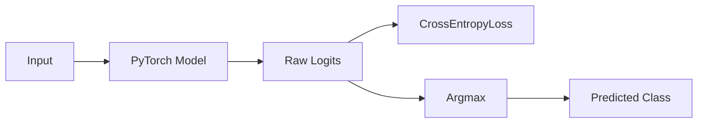

During training:

```text
Logits → CrossEntropyLoss
```

During prediction:

```text
Logits → Argmax
```

If probabilities are needed:

```python
probabilities = torch.softmax(
    logits,
    dim=1
)
```

---

# 🧠 Keras vs PyTorch Classification

| Concept | Keras | PyTorch |
|---|---|---|
| Dense Layer | `Dense` | `nn.Linear` |
| ReLU | `activation="relu"` | `nn.ReLU()` |
| Binary Loss | `binary_crossentropy` | `BCEWithLogitsLoss` |
| Multi-Class Loss | `categorical_crossentropy` | `CrossEntropyLoss` |
| Training | `model.fit()` | Training loop |
| Prediction | `model.predict()` | `model(x)` |
| Evaluation | `model.evaluate()` | Custom evaluation loop |
| GPU | TensorFlow device management | `.to(device)` |

---

# 🐍 Part III — Regression with Keras

## 🧪 Keras Regression Model

```python
model = tf.keras.Sequential([

    tf.keras.layers.Input(
        shape=(10,)
    ),

    tf.keras.layers.Dense(
        64,
        activation="relu"
    ),

    tf.keras.layers.Dense(
        32,
        activation="relu"
    ),

    tf.keras.layers.Dense(
        1
    )
])
```

Notice that the output layer does not use:

```text
Sigmoid
Softmax
ReLU
```

It produces a continuous value.

---

# 🧠 Keras Regression Architecture

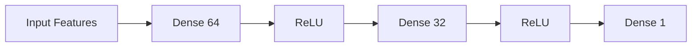

---

# 🧪 Compile Regression Model

```python
model.compile(

    optimizer="adam",

    loss="mse",

    metrics=[
        "mae"
    ]
)
```

Train:

```python
history = model.fit(

    X_train,
    y_train,

    validation_data=(
        X_val,
        y_val
    ),

    epochs=50,

    batch_size=32
)
```

---

# 🧮 Mean Squared Error

For predictions:

```text
y₁, y₂, ..., yₙ
```

and targets:

```text
ŷ₁, ŷ₂, ..., ŷₙ
```

MSE measures the average squared error.


---

# 🧮 Mean Absolute Error

MAE measures average absolute error.


---

# 🧪 PyTorch Regression Model

```python
class RegressionModel(
    nn.Module
):

    def __init__(
        self,
        input_features
    ):

        super().__init__()

        self.network = nn.Sequential(

            nn.Linear(
                input_features,
                64
            ),

            nn.ReLU(),

            nn.Linear(
                64,
                32
            ),

            nn.ReLU(),

            nn.Linear(
                32,
                1
            )
        )

    def forward(
        self,
        x
    ):

        return self.network(
            x
        )
```

Loss:

```python
loss_fn = nn.MSELoss()
```

Optimizer:

```python
optimizer = torch.optim.AdamW(
    model.parameters(),
    lr=0.001
)
```

---

# 🧠 PyTorch Regression Training

```python
for epoch in range(
    epochs
):

    model.train()

    for x_batch, y_batch in train_loader:

        x_batch = x_batch.to(
            device
        )

        y_batch = y_batch.to(
            device
        )

        optimizer.zero_grad()

        predictions = model(
            x_batch
        )

        loss = loss_fn(
            predictions,
            y_batch
        )

        loss.backward()

        optimizer.step()
```

---

# 🧠 Regression Pipeline


---

# 🧠 Classification Loss Selection

A practical decision tree:

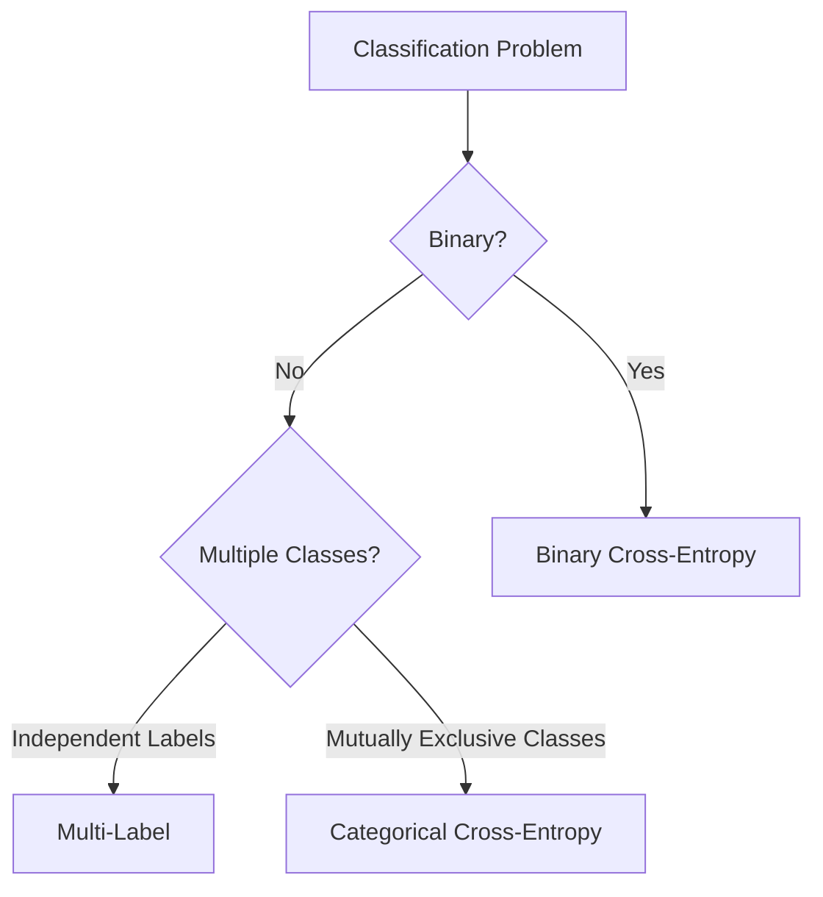

---

# 🧠 Regression Loss Selection

```text
Regression
    │
    ├── MSE
    │
    ├── MAE
    │
    └── Huber
```

General guidance:

| Loss | Characteristics |
|---|---|
| MSE | Penalizes large errors strongly |
| MAE | More robust to outliers |
| Huber | Combines MSE-like and MAE-like behavior |

---

# 🧠 Model Evaluation — Classification

Common metrics:

```text
Accuracy
Precision
Recall
F1 Score
ROC-AUC
PR-AUC
Specificity
Confusion Matrix
```

---

# 🧮 Accuracy

\[
Accuracy
=
\frac{TP+TN}
{TP+TN+FP+FN}
\]


::contentReference[oaicite:4]{index=4}


Accuracy can be misleading when classes are heavily imbalanced.

---

# 🧮 Precision

\[
Precision
=
\frac{TP}
{TP+FP}
\]

Precision answers:

> Of the examples predicted as positive, how many were actually positive?

---

# 🧮 Recall

\[
Recall
=
\frac{TP}
{TP+FN}
\]

Recall answers:

> Of all actual positive examples, how many did the model identify?

---

# 🧮 F1 Score

\[
F1
=
2
\frac{Precision\times Recall}
{Precision+Recall}
\]

F1 provides a balance between precision and recall.

---

# 📊 Confusion Matrix

```text
                    Actual
                 Positive Negative

Predicted Positive    TP       FP

Predicted Negative    FN       TN
```

This matrix is fundamental for understanding classification behavior.

---

# 🧠 Model Evaluation — Regression

Common metrics:

```text
MAE
MSE
RMSE
R²
```

---

# 🧮 RMSE

RMSE is the square root of MSE.

\[
RMSE
=
\sqrt{
\frac{1}{n}
\sum_{i=1}^{n}
(y_i-\hat{y}_i)^2
}
\]


RMSE has the same units as the target variable.

---

# 📊 Regression Residuals

A residual is:

\[
e_i=y_i-\hat{y}_i
\]


A good regression model should generally produce residuals without strong systematic patterns.

---

# 🧠 Regression Line

For simple linear regression:

\[
\hat{y}=b_0+b_1x
\]


::contentReference[oaicite:7]{index=7}


Deep Neural Networks extend this idea by learning multiple nonlinear transformations.

---

# 🧠 Keras Training Workflow

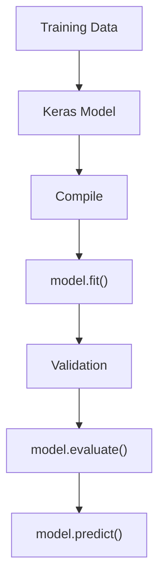

---

# 🧠 PyTorch Training Workflow

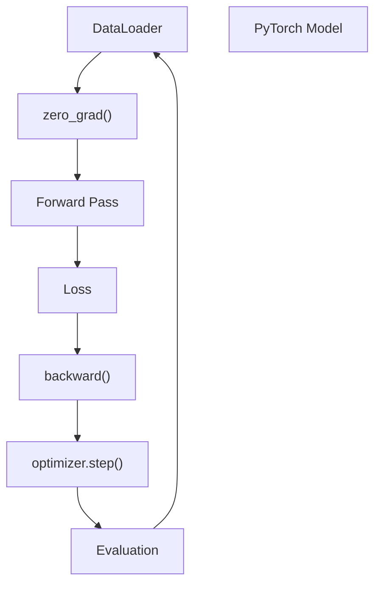

---

# 🧠 Keras vs PyTorch Training

### Keras

```python
model.fit(
    X_train,
    y_train,
    epochs=20,
    batch_size=32,
    validation_data=(
        X_val,
        y_val
    )
)
```

### PyTorch

```python
for epoch in range(
    epochs
):

    model.train()

    for x_batch, y_batch in train_loader:

        optimizer.zero_grad()

        predictions = model(
            x_batch
        )

        loss = loss_fn(
            predictions,
            y_batch
        )

        loss.backward()

        optimizer.step()
```

The abstraction level is different, but the underlying optimization process is similar.

---

# 🧠 What Happens During Training?

Regardless of framework:

```text
Input
 ↓
Forward Pass
 ↓
Prediction
 ↓
Loss
 ↓
Gradient Calculation
 ↓
Parameter Update
 ↓
Repeat
```

---

# 🧠 Epochs and Batches

Suppose:

```text
Dataset = 10,000 samples
Batch Size = 100
Epochs = 20
```

Then approximately:

```text
100 batches / epoch
```

and:

```text
2,000 optimization steps
```

across 20 epochs.

---

# 🧠 Overfitting

A model may achieve:

```text
Training Accuracy → 99%
Validation Accuracy → 75%
```

This suggests potential overfitting.

Typical solutions include:

```text
More Data
Regularization
Dropout
Early Stopping
Data Augmentation
Simpler Model
Weight Decay
```

---

# 🧠 Underfitting

Example:

```text
Training Accuracy → 65%
Validation Accuracy → 63%
```

The model may be underfitting.

Potential approaches:

```text
Increase Model Capacity
Train Longer
Improve Features
Reduce Excessive Regularization
Tune Learning Rate
```

---

# 🧠 Early Stopping

Keras:

```python
callback = tf.keras.callbacks.EarlyStopping(

    monitor="val_loss",

    patience=5,

    restore_best_weights=True
)
```

Training:

```python
model.fit(

    X_train,
    y_train,

    validation_data=(
        X_val,
        y_val
    ),

    epochs=100,

    callbacks=[
        callback
    ]
)
```

PyTorch requires implementing or using an external training utility for equivalent early-stopping behavior.

---

# 🧠 Model Capacity

A model's capacity is influenced by:

```text
Number of Layers
+
Number of Units
+
Parameter Count
+
Architecture
```

Too little capacity:

```text
Underfitting
```

Too much capacity:

```text
Potential Overfitting
```

---

# 🧠 Choosing Output Activations

```text
Binary Classification
        ↓
Sigmoid interpretation

Multi-Class
        ↓
Softmax interpretation

Multi-Label
        ↓
Independent Sigmoid interpretation

Regression
        ↓
Linear Output
```

---

# ⚠ Common Activation Mistakes

### Mistake 1

Using:

```text
Softmax
```

for a regression output.

Incorrect.

---

### Mistake 2

Using:

```text
Sigmoid
```

for mutually exclusive multi-class logits when the intended loss expects raw class logits.

---

### Mistake 3

Adding:

```python
Softmax
```

before PyTorch:

```python
CrossEntropyLoss()
```

This is generally unnecessary.

---

### Mistake 4

Using:

```python
ReLU
```

on a regression output when the target can legitimately be negative.

---

# 🧠 Production Model Selection

Model architecture should be driven by:

```text
Problem Type
+
Data Size
+
Data Distribution
+
Latency Requirements
+
Accuracy Requirements
+
Interpretability
+
Hardware
+
Cost
```

Do not automatically choose the deepest network.

---

# 🏢 Enterprise Example — Fraud Detection

Suppose a financial system predicts whether a transaction is fraudulent.

Input:

```text
Transaction Amount
Merchant
Location
Time
Customer History
Device Information
```

Target:

```text
0 = Legitimate
1 = Fraud
```

Architecture:

```text
Transaction Features
        ↓
Dense Layer
        ↓
ReLU
        ↓
Dense Layer
        ↓
ReLU
        ↓
Binary Logit
        ↓
Probability
        ↓
Threshold
        ↓
Fraud / Legitimate
```

Production considerations:

```text
False Positive Cost
False Negative Cost
Latency
Class Imbalance
Threshold Selection
Model Drift
Feature Drift
Monitoring
```

---

# 🏢 Enterprise Example — Customer Value Prediction

Input:

```text
Customer Age
Purchase Frequency
Average Order Value
Tenure
Interaction History
```

Target:

```text
Expected Customer Lifetime Value
```

Architecture:

```text
Customer Features
        ↓
Dense
        ↓
ReLU
        ↓
Dense
        ↓
ReLU
        ↓
Linear Output
        ↓
Predicted Value
```

Evaluation:

```text
MAE
RMSE
R²
Residual Analysis
```

---

# 🧠 Production Model Lifecycle

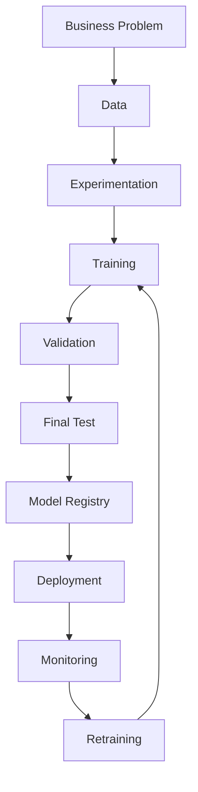

---

# 🧠 Classification vs Regression — Framework Perspective

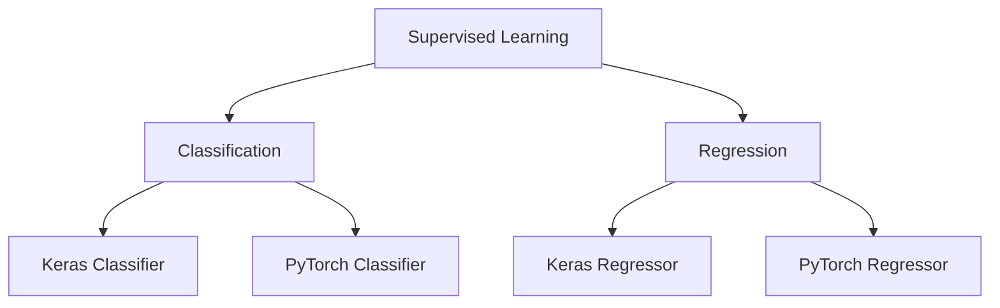

---

# 🧪 Practical Exercise 1 — Binary Classification

Build a binary classifier using:

```text
10 Features
64 Hidden Units
32 Hidden Units
1 Output
```

Implement it using:

```text
Keras
PyTorch
```

Compare:

```text
Training Loss
Validation Loss
Accuracy
Precision
Recall
F1
```

---

# 🧪 Practical Exercise 2 — Multi-Class Classification

Build a classifier with:

```text
784 Input Features
128 Hidden Units
64 Hidden Units
10 Classes
```

Implement:

```text
Keras
PyTorch
```

Compare:

```text
Architecture
Loss
Training API
Prediction API
Evaluation
```

---

# 🧪 Practical Exercise 3 — Regression

Build a regression model:

```text
10 Features
64 Hidden Units
32 Hidden Units
1 Output
```

Evaluate:

```text
MAE
MSE
RMSE
R²
```

Implement using both:

```text
Keras
PyTorch
```

---

# 🧪 Practical Exercise 4 — Threshold Optimization

Train a binary classifier and evaluate thresholds:

```text
0.10
0.20
0.30
...
0.90
```

For each threshold calculate:

```text
Precision
Recall
F1
```

Identify the threshold that best matches the business objective.

---

# 🧪 Practical Exercise 5 — Imbalanced Classification

Create a dataset with:

```text
95% Negative
5% Positive
```

Compare:

```text
Accuracy
Precision
Recall
F1
```

Demonstrate why accuracy alone can be misleading.

---

# 🧪 Practical Exercise 6 — Keras vs PyTorch

Build equivalent models in both frameworks.

Compare:

```text
Model Definition
Loss Configuration
Optimizer
Training
Validation
Prediction
Checkpointing
GPU Execution
```

Document the differences.

---

# 🧠 Interview Questions

## Beginner

### 1. What is the difference between classification and regression?

Classification predicts categories, while regression predicts continuous numerical values.

### 2. What output layer is commonly used for regression?

A linear output layer with one or more continuous outputs.

### 3. What loss is commonly used for regression?

MSE is common, while MAE and Huber are also frequently useful.

### 4. What is binary classification?

A classification problem with two possible classes.

### 5. What is multi-class classification?

A classification problem where each sample belongs to one of multiple mutually exclusive classes.

---

## Intermediate

### 6. Why does PyTorch commonly use raw logits with `CrossEntropyLoss`?

Because `CrossEntropyLoss` internally performs the relevant log-softmax and negative-log-likelihood computation.

### 7. Why does `BCEWithLogitsLoss` use logits?

It combines sigmoid and binary cross-entropy in a numerically stable implementation.

### 8. Why should validation data not be used to fit preprocessing parameters?

Doing so introduces information leakage and can make evaluation overly optimistic.

### 9. Why is accuracy insufficient for imbalanced classification?

A model can achieve high accuracy by predominantly predicting the majority class while performing poorly on the minority class.

### 10. What is the difference between logits and probabilities?

Logits are unconstrained model scores. Probabilities are normalized or transformed scores, such as sigmoid or softmax outputs.

---

## Advanced

### 11. How would you select a classification threshold?

Evaluate candidate thresholds on validation data using business-relevant metrics such as precision, recall, F1, cost, or expected utility.

### 12. Why might you prefer recall over precision?

In situations where missing a positive case is more costly than generating false alarms, maximizing recall may be preferable.

### 13. Why might you prefer precision over recall?

When false positives are particularly expensive, improving precision may be more important.

### 14. Why can a deeper network perform worse than a smaller network?

Because additional capacity can increase overfitting, optimization difficulty, computational cost, and sensitivity to hyperparameters.

### 15. How would you compare Keras and PyTorch implementations?

Compare equivalent:

```text
Architecture
Loss
Optimizer
Dataset
Batch Size
Learning Rate
Epochs
Initialization
Evaluation Metrics
Hardware
```

Only then is the framework comparison meaningful.

---

# 🏢 Enterprise Perspective

Building a model is not the same as solving a business problem.

An enterprise Deep Learning implementation must connect:

```text
Business Objective
        ↓
ML Problem Definition
        ↓
Data
        ↓
Model
        ↓
Evaluation
        ↓
Business Threshold
        ↓
Deployment
        ↓
Monitoring
```

For classification, the most accurate model is not always the best model.

For regression, the lowest MSE is not always the best business solution.

Production decisions should consider:

```text
Accuracy
Latency
Cost
Interpretability
Reliability
Data Quality
Model Stability
Business Impact
```

---

!!! tip "Production Insight"

    **Do not optimize only for model accuracy.**

    A production model must satisfy the complete system objective:

    ```text
    Model Quality
          +
    Business Metric
          +
    Latency
          +
    Reliability
          +
    Cost
          +
    Maintainability
    ```

    A slightly less accurate model may be preferable if it is significantly faster, cheaper, easier to monitor, and more reliable in production.

---

# 📌 Key Takeaways

- Classification predicts categories.
- Regression predicts continuous values.
- Binary classification commonly uses one output logit.
- Multi-class classification uses one logit per class.
- Multi-label classification uses independent outputs for each label.
- Regression generally uses a linear output.
- Output activation and loss function must be selected together.
- Keras provides high-level APIs such as `model.fit()`.
- PyTorch provides greater control through explicit training loops.
- `CrossEntropyLoss` expects raw logits in the common PyTorch multi-class pattern.
- `BCEWithLogitsLoss` combines sigmoid behavior with binary cross-entropy.
- MSE, MAE, and RMSE are common regression metrics.
- Accuracy alone can be misleading for imbalanced datasets.
- Classification thresholds affect precision and recall.
- Validation data should guide model and hyperparameter decisions.
- Test data should be reserved for final evaluation.
- Data leakage can invalidate model evaluation.
- Keras and PyTorch can implement equivalent architectures using different abstractions.
- Production model selection must consider business requirements, latency, cost, and maintainability in addition to predictive performance.

---

# 📚 Further Reading

Continue with:

- **[19. Convolutional Neural Networks](19-convolutional-neural-networks.md)**
- **[20. CNN Architecture, Optimization and Training](20-cnn-architecture-optimization-and-training.md)**
- **[21. Transfer Learning and Fine-Tuning](21-transfer-learning-and-fine-tuning.md)**
- **[22. ResNet, Residual Connections and TorchVision](22-resnet-residual-connections-and-torchvision.md)**
- **[23. Vision Transformers and CNN-ViT Hybrids](23-vision-transformers-and-cnn-vit-hybrids.md)**
- **[35. GPU-Accelerated Deep Learning](35-gpu-accelerated-deep-learning.md)**
- **[36. Deep Learning Training and Model Lifecycle](36-deep-learning-training-and-model-lifecycle.md)**
- **[37. Building Production Deep Learning Systems](37-building-production-deep-learning-systems.md)**

The next chapter moves into **Computer Vision**, beginning with the architecture and mathematics of Convolutional Neural Networks.

---

## ➡️ Next Chapter

**[19. Convolutional Neural Networks](19-convolutional-neural-networks.md)**

---

> **Enterprise AI Engineering Handbook**  
> *Building Production-Grade Enterprise AI Systems — One Chapter at a Time.*