# 19. Convolutional Neural Networks

> Understand how Convolutional Neural Networks (CNNs) learn spatial features from images, how convolution and pooling work, how CNN architectures are constructed, and how CNNs are implemented using Keras and PyTorch for Computer Vision tasks.

---

## 🎯 Learning Objectives

After completing this chapter, you will be able to:

- Explain why CNNs are useful for Computer Vision
- Understand the limitations of fully connected networks for images
- Understand convolution operations
- Explain kernels, filters, channels, stride, and padding
- Calculate convolution output dimensions
- Understand feature maps
- Understand local receptive fields
- Explain parameter sharing
- Understand translation-aware feature extraction
- Understand pooling operations
- Compare Max Pooling and Average Pooling
- Understand CNN architecture patterns
- Build CNN classification models using Keras
- Build CNN classification models using PyTorch
- Understand CNN tensor shapes
- Understand `Conv2D` in Keras
- Understand `nn.Conv2d` in PyTorch
- Understand flattening and fully connected layers
- Understand Batch Normalization and Dropout in CNNs
- Understand data augmentation for image classification
- Understand CNN training and evaluation
- Visualize CNN feature maps
- Understand common CNN architecture mistakes
- Prepare for advanced CNN optimization, Transfer Learning, ResNet, and Vision Transformers

---

# 📖 Overview

A Convolutional Neural Network (CNN) is a Deep Learning architecture designed primarily for data with spatial structure.

CNNs are particularly effective for:

- Image Classification
- Object Detection
- Image Segmentation
- Face Recognition
- Medical Image Analysis
- OCR
- Image Similarity
- Visual Search
- Autonomous Systems
- Industrial Inspection

The key idea is:

> **Instead of connecting every neuron to every pixel, CNNs learn local spatial patterns using shared convolutional filters.**

---

# 🧠 Why Do We Need CNNs?

Consider an RGB image:

```text
224 × 224 × 3
```

The number of input values is:

\[
224\times224\times3=150528
\]

A fully connected layer connecting this image directly to 1,000 neurons would already require a very large number of parameters.

CNNs solve this problem using:

```text
Local Connectivity
+
Parameter Sharing
+
Hierarchical Feature Learning
```

---

# 🧠 Fully Connected Network vs CNN

### Fully Connected Approach

```text
Every Pixel
     │
     ├──────────────┐
     ├──────────────┤
     ├──────────────┤
     └──────────────┘
            │
            ▼
       Dense Layer
```

Spatial relationships are not explicitly preserved.

---

### CNN Approach

```text
Image
  │
  ▼
Local Receptive Fields
  │
  ▼
Convolution Filters
  │
  ▼
Feature Maps
  │
  ▼
Hierarchical Features
  │
  ▼
Classification
```

---

# 🧠 CNN Feature Hierarchy

CNNs typically learn increasingly abstract representations.

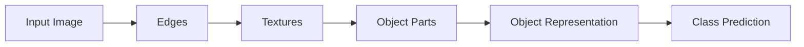

For example, a CNN may learn:

```text
Layer 1
 ↓
Edges

Layer 2
 ↓
Corners / Textures

Layer 3
 ↓
Shapes

Layer 4
 ↓
Object Parts

Deep Layers
 ↓
Semantic Representation
```

---

# 🖼️ Image Representation

A color image is commonly represented as:

```text
Height × Width × Channels
```

For example:

```text
224 × 224 × 3
```

where:

```text
Height   = 224
Width    = 224
Channels = 3
```

The three channels are commonly:

```text
Red
Green
Blue
```

---

# 🧠 PyTorch Image Layout

PyTorch CNN layers commonly use:

```text
N × C × H × W
```

where:

```text
N = Batch Size
C = Channels
H = Height
W = Width
```

Example:

```text
32 × 3 × 224 × 224
```

---

# 🧠 Keras Image Layout

TensorFlow / Keras commonly uses:

```text
N × H × W × C
```

Example:

```text
32 × 224 × 224 × 3
```

This difference is important when moving between frameworks.

---

# 🔄 Tensor Layout Comparison

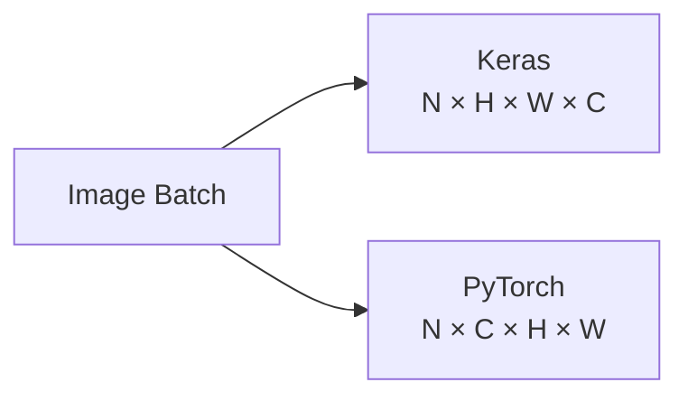

---

# 🧠 What Is Convolution?

Convolution is an operation that applies a small learnable filter across an input.

Conceptually:

```text
Input Image

┌───────────────┐
│               │
│   ┌─────┐     │
│   │Kernel│    │
│   └─────┘     │
│               │
└───────────────┘
        │
        ▼
   Feature Map
```

The kernel moves across the image and computes values at different spatial locations.

---

# 🔬 Convolution Operation

Consider a small image region:

```text
1  2  3
4  5  6
7  8  9
```

and a kernel:

```text
1  0 -1
1  0 -1
1  0 -1
```

The CNN performs element-wise multiplication followed by summation.

```text
1×1 + 2×0 + 3×(-1)
+
4×1 + 5×0 + 6×(-1)
+
7×1 + 8×0 + 9×(-1)
```

The result becomes one value in the feature map.

---

# 🧮 Convolution

A simplified 2D convolution can be represented as:

\[
Y(i,j)
=
\sum_m
\sum_n
X(i+m,j+n)K(m,n)
+b
\]


where:

```text
X = Input
K = Kernel
Y = Output Feature Map
b = Bias
```

In Deep Learning, the kernel values are learned during training.

---

# 🧠 Kernel / Filter

A kernel is a small matrix of learnable weights.

Example:

```text
3 × 3 Kernel
```

```text
┌─────────────┐
│ w₁ w₂ w₃    │
│ w₄ w₅ w₆    │
│ w₇ w₈ w₉    │
└─────────────┘
```

During training, these weights are updated using gradient descent.

---

# 🧠 What Does a Filter Learn?

A filter may learn to respond strongly to:

```text
Horizontal Edges
Vertical Edges
Corners
Textures
Patterns
Shapes
```

The network does not need the developer to manually specify these filters.

They are learned from data.

---

# 🧠 Feature Map

When a filter is applied to an image, it produces a feature map.

```text
Input Image
     │
     ▼
  Filter
     │
     ▼
Feature Map
```

A feature map indicates where a learned pattern appears strongly in the input.

---

# 🧠 Multiple Filters

A CNN layer usually learns multiple filters.

For example:

```text
Input
  │
  ├── Filter 1 → Feature Map 1
  ├── Filter 2 → Feature Map 2
  ├── Filter 3 → Feature Map 3
  └── Filter 4 → Feature Map 4
```

These feature maps become the channels of the output tensor.

---

# 🧠 Convolution Layer

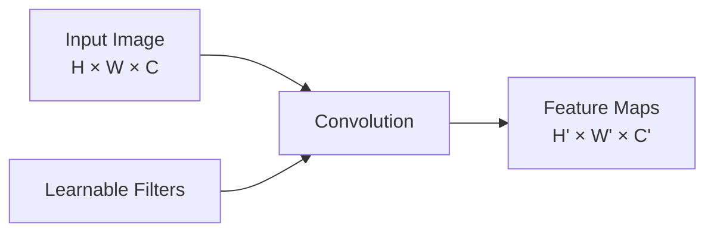

---

# 🧠 Input Channels and Filters

Suppose an RGB image has:

```text
3 Input Channels
```

A convolution filter covering the entire channel depth has:

```text
Kernel Height
×
Kernel Width
×
3
```

For a:

```text
3 × 3
```

kernel:

```text
3 × 3 × 3
```

weights are associated with each output filter, plus typically one bias.

If the layer has:

```text
64 Filters
```

the output has:

```text
64 Channels
```

---

# 🧮 Number of Parameters in a Convolution Layer

For a convolution layer:

```text
Kernel Height = Kₕ
Kernel Width  = Kᵥ
Input Channels = Cᵢₙ
Output Channels = Cₒᵤₜ
```

the parameter count with bias is:

\[
(K_hK_wC_{in}+1)C_{out}
\]


For example:

```text
Kernel = 3 × 3
Input Channels = 3
Output Channels = 64
```

Parameters:

```text
(3 × 3 × 3 + 1) × 64
=
1,792
```

This is dramatically smaller than connecting every input pixel directly to a large fully connected layer.

---

# 🧠 Parameter Sharing

A major CNN advantage is:

> **The same filter is reused across different spatial locations.**

Instead of learning a separate detector for every pixel location:

```text
One Filter
    ↓
Many Locations
```

This greatly reduces parameter count.

---

# 🧠 Local Receptive Field

A convolution filter only sees a local region of the input.

For example:

```text
3 × 3 Kernel
```

initially observes:

```text
3 × 3 region
```

This is called the local receptive field.

As layers are stacked, deeper neurons can effectively see larger regions of the original image.

---

# 🧠 Receptive Field Growth

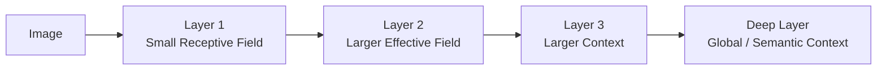

---

# 🧠 Stride

Stride determines how far the kernel moves at each step.

Example:

```text
Stride = 1
```

means the filter moves one pixel at a time.

```text
Stride = 2
```

moves two pixels at a time.

---

# 🧠 Stride 1

```text
Position 1
   ↓
Position 2
   ↓
Position 3
   ↓
...
```

This generally preserves more spatial information.

---

# 🧠 Stride 2

```text
Position 1
     ↓
Position 3
     ↓
Position 5
```

This reduces the spatial dimensions more aggressively.

---

# 🧠 Padding

Padding adds values around the input boundaries.

Common approaches:

```text
Valid
Same
```

---

# 🔵 Valid Padding

No padding is added.

```text
Input
  ↓
Kernel
  ↓
Smaller Output
```

Spatial dimensions decrease.

---

# 🟢 Same Padding

Padding is used to maintain spatial dimensions for stride 1.

```text
Input
  ↓
Padding
  ↓
Convolution
  ↓
Approximately Same Spatial Size
```

---

# 🧮 Convolution Output Size

For one spatial dimension:

\[
Output
=
\left\lfloor
\frac{N+2P-K}{S}
\right\rfloor+1
\]


where:

```text
N = Input Size
P = Padding
K = Kernel Size
S = Stride
```

---

# 🧮 Example

Suppose:

```text
Input = 32
Kernel = 3
Padding = 1
Stride = 1
```

Then:

```text
Output = 32
```

This is the common:

```text
3 × 3
stride 1
same padding
```

configuration.

---

# 🧠 CNN Spatial Dimensions

A CNN often transforms:

```text
224 × 224
     ↓
112 × 112
     ↓
56 × 56
     ↓
28 × 28
     ↓
14 × 14
     ↓
7 × 7
```

while increasing channels:

```text
3
 ↓
64
 ↓
128
 ↓
256
 ↓
512
```

This creates a common architectural pattern:

> **Spatial resolution decreases while feature depth increases.**

---

# 🧠 CNN Feature Transformation

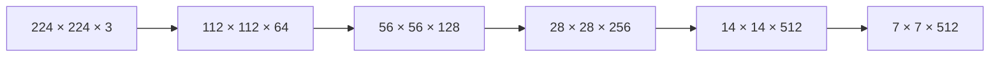

---

# 🧠 Activation Function

After convolution, an activation function is commonly applied.

For example:

```text
Convolution
    ↓
ReLU
```

ReLU:

\[
ReLU(x)=\max(0,x)
\]


---

# 🧠 Why ReLU?

ReLU:

- Introduces non-linearity
- Is computationally simple
- Helps train deep networks effectively
- Allows positive activations to pass through

A common CNN block is:

```text
Conv
 ↓
BatchNorm
 ↓
ReLU
```

---

# 🧠 Pooling

Pooling reduces spatial dimensions.

Common pooling operations:

```text
Max Pooling
Average Pooling
```

---

# 🔵 Max Pooling

Max Pooling selects the maximum value from a local region.

Example:

```text
1  3
2  4
```

Maximum:

```text
4
```

---

# 🟢 Average Pooling

Average Pooling calculates the average.

Example:

```text
1  3
2  4
```

Average:

```text
2.5
```

---

# 🧠 Max Pooling vs Average Pooling

| Max Pooling | Average Pooling |
|---|---|
| Selects maximum | Calculates average |
| Preserves strongest activation | Smooths information |
| Common in classic CNNs | Often used in later architectural designs |
| Highlights strongest detected feature | Represents average local response |

---

# 🧠 Pooling Architecture


Example:

```text
28 × 28 × 64
      ↓
14 × 14 × 64
```

---

# 🧠 CNN Building Block

A classic CNN block may look like:

```text
Input
  ↓
Conv2D
  ↓
ReLU
  ↓
MaxPooling
  ↓
Conv2D
  ↓
ReLU
  ↓
MaxPooling
  ↓
Flatten
  ↓
Dense
  ↓
Output
```

---

# 🧠 Classic CNN Architecture

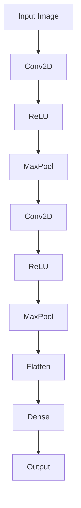

---

# 🧠 Flatten

After convolutional feature extraction, the feature maps can be flattened before fully connected layers.

Example:

```text
7 × 7 × 128
```

becomes:

```text
6272
```

because:

\[
7\times7\times128=6272
\]

---

# 🧠 Global Average Pooling

Instead of flattening the entire feature map, CNNs can use:

```text
Global Average Pooling
```

For:

```text
7 × 7 × 512
```

Global Average Pooling produces:

```text
512
```

one value per channel.

This can significantly reduce parameters compared with large fully connected layers.

---

# 🧠 Flatten vs Global Average Pooling

| Flatten | Global Average Pooling |
|---|---|
| Preserves all spatial activations | Aggregates each channel |
| More parameters downstream | Fewer parameters |
| Common in classic CNNs | Common in modern architectures |
| Can increase overfitting risk | Often acts as structural regularization |

---

# 🐍 Part I — CNN with Keras

## 🧪 Basic Keras CNN

```python
import tensorflow as tf


model = tf.keras.Sequential([

    tf.keras.layers.Input(
        shape=(28, 28, 1)
    ),

    tf.keras.layers.Conv2D(
        32,
        kernel_size=3,
        padding="same",
        activation="relu"
    ),

    tf.keras.layers.MaxPooling2D(
        pool_size=2
    ),

    tf.keras.layers.Conv2D(
        64,
        kernel_size=3,
        padding="same",
        activation="relu"
    ),

    tf.keras.layers.MaxPooling2D(
        pool_size=2
    ),

    tf.keras.layers.Flatten(),

    tf.keras.layers.Dense(
        128,
        activation="relu"
    ),

    tf.keras.layers.Dense(
        10,
        activation="softmax"
    )
])
```

---

# 🧠 Keras CNN Architecture

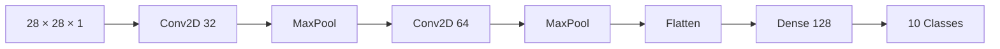

---

# 🧪 Compile Keras CNN

```python
model.compile(

    optimizer="adam",

    loss="sparse_categorical_crossentropy",

    metrics=[
        "accuracy"
    ]
)
```

Train:

```python
history = model.fit(

    X_train,
    y_train,

    validation_data=(
        X_val,
        y_val
    ),

    epochs=20,

    batch_size=64
)
```

---

# 🐍 Part II — CNN with PyTorch

## 🧪 Basic PyTorch CNN

```python
import torch
import torch.nn as nn


class CNNClassifier(
    nn.Module
):

    def __init__(
        self,
        num_classes=10
    ):

        super().__init__()

        self.features = nn.Sequential(

            nn.Conv2d(
                1,
                32,
                kernel_size=3,
                padding=1
            ),

            nn.ReLU(),

            nn.MaxPool2d(
                kernel_size=2
            ),

            nn.Conv2d(
                32,
                64,
                kernel_size=3,
                padding=1
            ),

            nn.ReLU(),

            nn.MaxPool2d(
                kernel_size=2
            )
        )

        self.classifier = nn.Sequential(

            nn.Flatten(),

            nn.Linear(
                64 * 7 * 7,
                128
            ),

            nn.ReLU(),

            nn.Linear(
                128,
                num_classes
            )
        )

    def forward(
        self,
        x
    ):

        x = self.features(
            x
        )

        return self.classifier(
            x
        )
```

---

# 🧠 PyTorch CNN Architecture

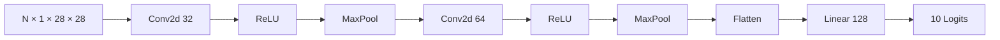

---

# 🧠 PyTorch CNN Training

```python
device = torch.device(
    "cuda"
    if torch.cuda.is_available()
    else "cpu"
)


model = CNNClassifier(
    num_classes=10
).to(device)


loss_fn = nn.CrossEntropyLoss()


optimizer = torch.optim.AdamW(
    model.parameters(),
    lr=0.001
)
```

Training:

```python
for epoch in range(
    epochs
):

    model.train()

    for images, labels in train_loader:

        images = images.to(
            device
        )

        labels = labels.to(
            device
        )

        optimizer.zero_grad()

        logits = model(
            images
        )

        loss = loss_fn(
            logits,
            labels
        )

        loss.backward()

        optimizer.step()
```

---

# 🧠 CNN Tensor Flow

For the example model:

```text
Input
28 × 28 × 1
      ↓
Conv
28 × 28 × 32
      ↓
MaxPool
14 × 14 × 32
      ↓
Conv
14 × 14 × 64
      ↓
MaxPool
7 × 7 × 64
      ↓
Flatten
3136
      ↓
Dense
128
      ↓
Output
10
```

---

# 🧠 Tensor Shape Tracking

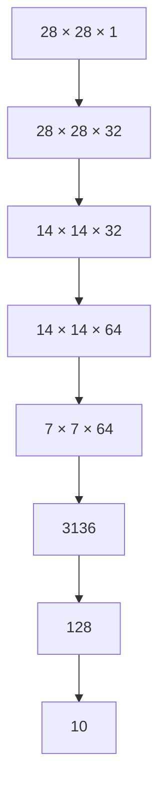

Understanding tensor shapes is one of the most important CNN implementation skills.

---

# 🧠 Batch Normalization

CNN architectures often use Batch Normalization.

Keras:

```python
tf.keras.layers.BatchNormalization()
```

PyTorch:

```python
nn.BatchNorm2d(
    64
)
```

A common block:

```text
Conv
 ↓
BatchNorm
 ↓
ReLU
```

---

# 🧠 CNN Block with Batch Normalization

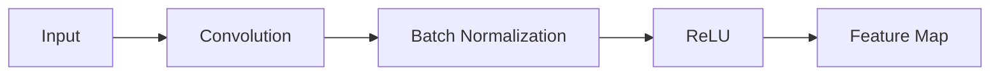

Batch Normalization can improve optimization and training stability, though its exact behavior and best placement depend on the architecture.

---

# 🧠 Dropout

Dropout randomly disables a subset of activations during training.

Keras:

```python
tf.keras.layers.Dropout(
    0.5
)
```

PyTorch:

```python
nn.Dropout(
    0.5
)
```

Conceptually:

```text
Training
 ↓
Randomly Drop Activations

Inference
 ↓
No Random Dropping
```

---

# 🧠 CNN Regularization

Common techniques include:

```text
Data Augmentation
Dropout
Weight Decay
Batch Normalization
Early Stopping
Reduced Model Capacity
```

These techniques help improve generalization.

---

# 🖼️ Data Augmentation

Images can be transformed during training:

```text
Original Image
      │
      ├── Random Crop
      ├── Horizontal Flip
      ├── Rotation
      ├── Translation
      ├── Zoom
      └── Contrast / Brightness Variation
```

The goal is to expose the model to realistic variations.

---

# 🧠 Data Augmentation Pipeline


---

# 🧪 Keras Data Augmentation

```python
augmentation = tf.keras.Sequential([

    tf.keras.layers.RandomFlip(
        "horizontal"
    ),

    tf.keras.layers.RandomRotation(
        0.1
    ),

    tf.keras.layers.RandomZoom(
        0.1
    )
])
```

Use:

```python
model = tf.keras.Sequential([

    augmentation,

    tf.keras.layers.Conv2D(
        32,
        3,
        activation="relu"
    ),

    ...
])
```

---

# 🧪 PyTorch Data Augmentation

Using TorchVision:

```python
from torchvision import transforms


train_transform = transforms.Compose([

    transforms.RandomHorizontalFlip(),

    transforms.RandomRotation(
        10
    ),

    transforms.ToTensor()
])
```

The exact augmentation strategy should reflect the domain.

---

# ⚠ Data Augmentation Mistakes

Do not apply transformations that change the semantic meaning of the image.

For example:

```text
Digit Classification
```

may not tolerate arbitrary rotations.

Similarly:

```text
Medical Imaging
```

may have domain-specific constraints.

Augmentation must be realistic.

---

# 🧠 CNN Training

The CNN training process is:

```text
Image Batch
     ↓
Convolution
     ↓
Activation
     ↓
Pooling
     ↓
More Convolution Blocks
     ↓
Feature Representation
     ↓
Classification Head
     ↓
Loss
     ↓
Backpropagation
     ↓
Filter Updates
```

---

# 🧠 CNN Backpropagation

During training, the network learns:

```text
Filter Weights
       ↓
Feature Detection
       ↓
Prediction
       ↓
Loss
       ↓
Gradient
       ↓
Filter Updates
```

The convolution filters are not manually designed.

They are learned using gradient-based optimization.

---

# 🧠 What Does a CNN Actually Learn?

Early layers may learn:

```text
Edges
```

Intermediate layers:

```text
Textures
Shapes
Patterns
```

Deeper layers:

```text
Object Parts
Semantic Features
```

Final layers:

```text
Class-Specific Representation
```

---

# 🧠 CNN Feature Hierarchy

```text
Image
 │
 ▼
┌──────────────┐
│ Low-Level    │
│ Features     │
│ Edges        │
└──────────────┘
       │
       ▼
┌──────────────┐
│ Mid-Level    │
│ Features     │
│ Textures     │
└──────────────┘
       │
       ▼
┌──────────────┐
│ High-Level   │
│ Features     │
│ Shapes       │
└──────────────┘
       │
       ▼
┌──────────────┐
│ Semantic     │
│ Features     │
│ Objects      │
└──────────────┘
```

---

# 🧠 CNN Classification Head

After feature extraction:

```text
Feature Maps
      ↓
Flatten / Global Pooling
      ↓
Dense Layer
      ↓
Output Layer
```

For modern architectures, Global Average Pooling is often preferred over a very large flattening layer.

---

# 🧠 Feature Extractor vs Classification Head

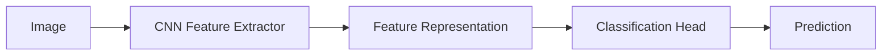

This separation becomes especially important for:

```text
Transfer Learning
Feature Extraction
Fine-Tuning
Vision Models
```

---

# 🧠 CNN Evaluation

For classification, evaluate:

```text
Accuracy
Precision
Recall
F1
Confusion Matrix
ROC-AUC
PR-AUC
```

For multi-class image classification, also consider:

```text
Per-Class Accuracy
Per-Class Recall
Macro F1
Weighted F1
```

---

# 🧠 Confusion Matrix for Image Classification

Example:

```text
             Predicted

          Cat   Dog   Horse

Cat        90    5      5

Dog         4   92      4

Horse       6    3     91
```

This can reveal classes that are systematically confused.

---

# 🧠 CNN Error Analysis

A production workflow should inspect incorrect predictions.

```text
Wrong Predictions
       ↓
Group by Class
       ↓
Inspect Images
       ↓
Identify Pattern
       ↓
Improve Data / Model
```

Potential causes:

```text
Poor Image Quality
Incorrect Labels
Class Imbalance
Insufficient Training Data
Domain Shift
Model Capacity
```

---

# 🧠 Visualizing Feature Maps

Feature maps can help understand what intermediate CNN layers respond to.

Conceptually:

```text
Input Image
     ↓
Conv Layer
     ↓
Feature Maps
     ↓
Visualization
```

Example approach:

```python
feature_model = tf.keras.Model(

    inputs=model.input,

    outputs=model.layers[1].output
)
```

Then:

```python
features = feature_model.predict(
    image_batch
)
```

The exact layer selection depends on the model.

---

# 🧠 CNN Interpretability

Useful techniques include:

```text
Feature Map Visualization
Saliency Maps
Grad-CAM
Occlusion Analysis
Integrated Gradients
```

These techniques can help answer:

> "Which parts of the image influenced the prediction?"

This becomes increasingly important in enterprise Computer Vision applications.

---

# 🧠 CNN Limitations

CNNs are powerful but have limitations.

Common challenges include:

- Large computational requirements
- Large training datasets
- Sensitivity to domain shift
- Limited global context in early layers
- Need for careful architecture design
- Potential overfitting
- High-resolution image cost
- Deployment constraints

Some of these limitations motivated architectures such as:

```text
ResNet
EfficientNet
Vision Transformers
Hybrid CNN-ViT Architectures
```

---

# 🧠 CNN Evolution

The evolution of Computer Vision architectures can be summarized as:


---

# 🧠 CNN Architecture Design Principles

When designing a CNN, consider:

```text
Input Resolution
+
Number of Channels
+
Kernel Size
+
Stride
+
Padding
+
Number of Filters
+
Depth
+
Pooling
+
Normalization
+
Regularization
+
Classification Head
```

---

# 🧠 Typical CNN Design Pattern

A common architecture pattern is:

```text
Input
 ↓
Conv
 ↓
Normalization
 ↓
Activation
 ↓
Conv
 ↓
Normalization
 ↓
Activation
 ↓
Downsampling
 ↓
Repeat
 ↓
Global Average Pooling
 ↓
Classifier
```

---

# 🧠 Why Increase Channels?

As spatial resolution decreases:

```text
H ↓
W ↓
```

the number of feature channels often increases:

```text
C ↑
```

This allows the network to represent increasingly complex features while reducing spatial computation.

---

# 🧠 Spatial Resolution vs Semantic Depth

```text
Early Layers

High Resolution
+
Low-Level Features
```

versus:

```text
Deep Layers

Lower Resolution
+
High-Level Semantic Features
```

This trade-off is fundamental to CNN design.

---

# 🧪 Practical Exercise 1 — Build a CNN

Build a CNN for:

```text
28 × 28 grayscale images
10 classes
```

Architecture:

```text
Conv2D 32
 ↓
ReLU
 ↓
MaxPool
 ↓
Conv2D 64
 ↓
ReLU
 ↓
MaxPool
 ↓
Flatten
 ↓
Dense 128
 ↓
Output 10
```

Implement it in:

```text
Keras
PyTorch
```

---

# 🧪 Practical Exercise 2 — Shape Tracking

For every CNN layer, record:

```text
Batch
Channels
Height
Width
```

Create a table:

| Layer | Channels | Height | Width |
|---|---:|---:|---:|
| Input | 1 | 28 | 28 |
| Conv | 32 | 28 | 28 |
| Pool | 32 | 14 | 14 |
| Conv | 64 | 14 | 14 |
| Pool | 64 | 7 | 7 |

---

# 🧪 Practical Exercise 3 — Convolution Calculation

Given:

```text
Input = 32 × 32
Kernel = 3 × 3
Padding = 1
Stride = 1
```

Calculate the output spatial dimensions.

Then repeat with:

```text
Padding = 0
Stride = 1
```

---

# 🧪 Practical Exercise 4 — Parameter Count

Calculate the parameters for:

```text
Conv2D
Input Channels = 3
Output Channels = 64
Kernel = 3 × 3
Bias = Enabled
```

Then compare it with a fully connected layer operating directly on:

```text
224 × 224 × 3
```

---

# 🧪 Practical Exercise 5 — Data Augmentation

Train the same CNN with:

```text
No Augmentation
```

and:

```text
Random Flip
Random Rotation
Random Zoom
```

Compare:

```text
Training Accuracy
Validation Accuracy
Validation Loss
```

---

# 🧪 Practical Exercise 6 — CNN Regularization

Compare:

```text
Baseline CNN
```

against:

```text
CNN + Dropout
CNN + BatchNorm
CNN + Data Augmentation
CNN + Weight Decay
```

Analyze:

```text
Training Loss
Validation Loss
Generalization
Training Time
```

---

# 🧪 Practical Exercise 7 — Feature Visualization

Extract feature maps from:

```text
Early Conv Layer
Middle Conv Layer
Deep Conv Layer
```

Compare what each layer represents.

---

# 🧪 Practical Exercise 8 — Error Analysis

Create a confusion matrix.

Identify:

```text
Most Confused Classes
```

Then inspect incorrectly classified images and determine whether the issue is related to:

```text
Data Quality
Label Quality
Class Similarity
Model Capacity
Insufficient Training
```

---

# 🧠 Interview Questions

## Beginner

### 1. What is a CNN?

A Convolutional Neural Network is a neural network architecture that uses convolution operations to learn spatial and hierarchical representations from data such as images.

### 2. Why are CNNs effective for images?

They exploit local spatial structure and parameter sharing, allowing them to learn useful visual patterns with far fewer parameters than fully connected networks operating directly on pixels.

### 3. What is a kernel?

A kernel is a learnable set of weights applied across local regions of an input to produce feature maps.

### 4. What is a feature map?

A feature map is the output produced when a convolutional filter responds to patterns across an input.

### 5. What is stride?

Stride determines how far a convolutional kernel moves between successive positions.

### 6. What is padding?

Padding adds values around an input boundary to control the spatial dimensions of the convolution output.

---

## Intermediate

### 7. What is parameter sharing?

The same convolutional filter weights are reused across different spatial locations.

### 8. Why does parameter sharing matter?

It significantly reduces the number of parameters and allows a learned feature detector to respond to the same pattern at different locations.

### 9. What is a receptive field?

It is the region of the original input that can influence a particular activation.

### 10. What is the difference between Max Pooling and Average Pooling?

Max Pooling selects the strongest activation in a region, while Average Pooling computes the average.

### 11. Why does a CNN usually increase channels while reducing spatial resolution?

Deeper layers represent increasingly complex features, so the network often trades spatial resolution for richer feature representations.

### 12. Why is data augmentation useful?

It exposes the model to realistic variations of training examples and can improve generalization.

### 13. Why is `model.eval()` important in PyTorch?

It switches layers such as Dropout and Batch Normalization into inference behavior.

### 14. Why do Keras and PyTorch use different image tensor layouts?

They use different framework conventions. Keras commonly uses channels-last, while PyTorch vision layers commonly use channels-first.

---

## Advanced

### 15. Why are convolutional layers more parameter-efficient than fully connected layers for images?

Because convolution uses local connectivity and shared filter weights rather than independent weights for every input-output connection.

### 16. How does receptive field increase in a deep CNN?

Stacking convolution and downsampling layers allows deeper activations to incorporate information from increasingly large regions of the original image.

### 17. Why might Global Average Pooling be preferred over Flatten?

It greatly reduces the number of parameters in the classification head and can improve generalization.

### 18. What happens when stride increases?

Spatial resolution generally decreases more aggressively.

### 19. What happens when padding changes from `same` to `valid`?

The spatial output dimensions generally become smaller for the same kernel and stride.

### 20. How would you diagnose a CNN that performs well on training images but poorly on production images?

Investigate:

```text
Overfitting
Domain Shift
Data Quality
Label Quality
Class Distribution
Image Preprocessing
Resolution
Lighting
Camera Differences
```

### 21. Why might a deeper CNN not always perform better?

Greater depth increases capacity and computational cost and can introduce optimization and generalization challenges. Architecture design and optimization matter.

### 22. How would you optimize a CNN for production inference?

Consider:

```text
Model Architecture
Input Resolution
Batch Size
Quantization
Pruning
Hardware
Memory
Latency
Throughput
Model Serving
```

---

# 🏢 Enterprise Perspective

A CNN in production is not simply:

```text
Image → Model → Prediction
```

A real Computer Vision system may look like:

```text
Camera / Image Source
        ↓
Image Ingestion
        ↓
Validation
        ↓
Preprocessing
        ↓
CNN Inference
        ↓
Prediction
        ↓
Business Decision
        ↓
Monitoring
```

For large-scale systems:

```text
Image Storage
      ↓
Dataset Pipeline
      ↓
Training
      ↓
Model Validation
      ↓
Model Registry
      ↓
Deployment
      ↓
Inference Service
      ↓
Monitoring
```

---

# 🏢 Production CNN Considerations

Important engineering concerns include:

### Data

```text
Dataset Size
Label Quality
Class Balance
Data Drift
Domain Shift
```

### Model

```text
Accuracy
Recall
Precision
Model Size
Inference Latency
```

### Infrastructure

```text
CPU
GPU
Memory
Storage
Network
```

### Operations

```text
Model Versioning
Monitoring
Logging
Alerting
Rollback
Retraining
```

---

!!! tip "Production Insight"

    **CNN architecture is only one part of a Computer Vision system.**

    A production-ready vision platform must connect:

    ```text
    Data
      +
    Preprocessing
      +
    Model
      +
    Hardware
      +
    Serving
      +
    Monitoring
      +
    Retraining
    ```

    A model with excellent offline accuracy can still fail in production because of image-quality changes, camera differences, domain shift, data drift, latency constraints, or incorrect preprocessing.

---

# 🧠 CNN Production Lifecycle

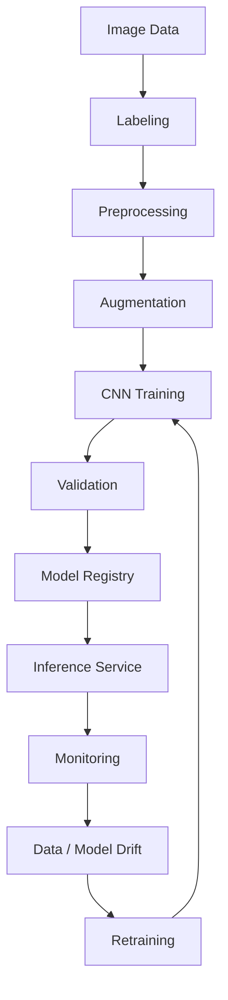

---

# 📌 Key Takeaways

- CNNs are designed to learn spatial representations.
- Convolutional filters learn local patterns from data.
- CNNs use local connectivity and parameter sharing.
- Feature maps represent learned visual responses.
- Stride controls how far a filter moves.
- Padding controls boundary behavior and spatial dimensions.
- Pooling reduces spatial resolution.
- Max Pooling preserves the strongest activation.
- Average Pooling aggregates local activations.
- CNNs generally reduce spatial resolution while increasing feature channels.
- Deep CNNs learn hierarchical representations.
- Early layers often learn low-level visual features.
- Deeper layers learn increasingly semantic representations.
- Keras commonly uses channels-last tensors.
- PyTorch CNNs commonly use channels-first tensors.
- CNNs can be implemented using `Conv2D` in Keras and `nn.Conv2d` in PyTorch.
- Batch Normalization and Dropout can support training and generalization.
- Data augmentation is an important Computer Vision regularization technique.
- Global Average Pooling can reduce the parameter count of the classification head.
- CNN performance should be evaluated using both aggregate metrics and class-level error analysis.
- Production CNN systems require data, infrastructure, serving, monitoring, and retraining strategies.
- CNNs provide the foundation for advanced architectures such as ResNet and modern vision models.

---

# 📚 Further Reading

Continue with:

- **[20. CNN Architecture, Optimization and Training](20-cnn-architecture-optimization-and-training.md)**
- **[21. Transfer Learning and Fine-Tuning](21-transfer-learning-and-fine-tuning.md)**
- **[22. ResNet, Residual Connections and TorchVision](22-resnet-residual-connections-and-torchvision.md)**
- **[23. Vision Transformers and CNN-ViT Hybrids](23-vision-transformers-and-cnn-vit-hybrids.md)**
- **[35. GPU-Accelerated Deep Learning](35-gpu-accelerated-deep-learning.md)**
- **[36. Deep Learning Training and Model Lifecycle](36-deep-learning-training-and-model-lifecycle.md)**
- **[37. Building Production Deep Learning Systems](37-building-production-deep-learning-systems.md)**

The next chapter focuses on **CNN architecture design, optimization, and training techniques**, including deeper architectures, normalization, regularization, learning-rate strategies, augmentation, and practical methods for improving CNN performance.

---

## ➡️ Next Chapter

**[20. CNN Architecture, Optimization and Training](20-cnn-architecture-optimization-and-training.md)**

---

> **Enterprise AI Engineering Handbook**  
> *Building Production-Grade Enterprise AI Systems — One Chapter at a Time.*