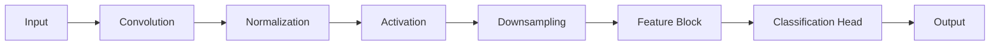
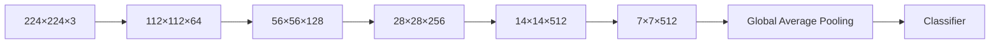
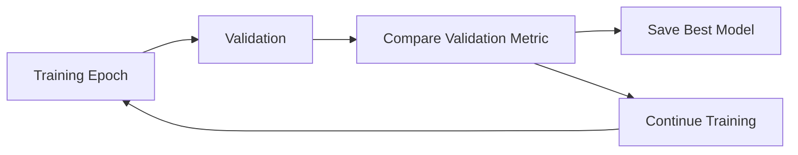
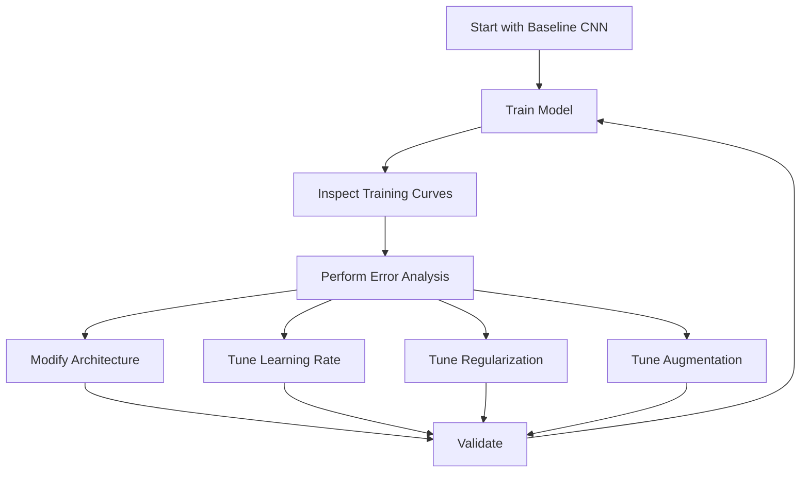
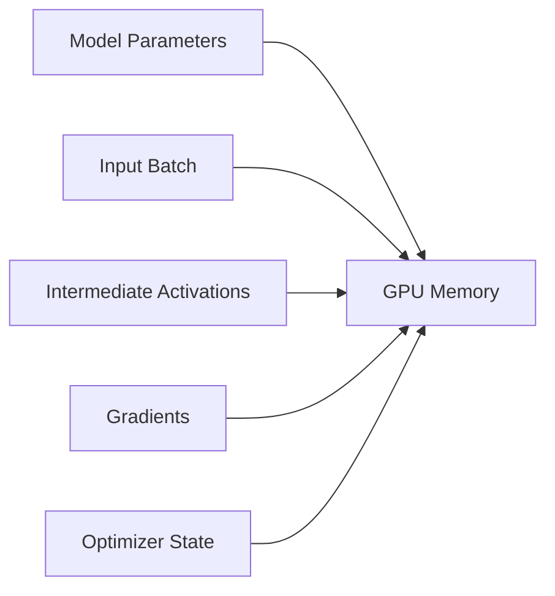
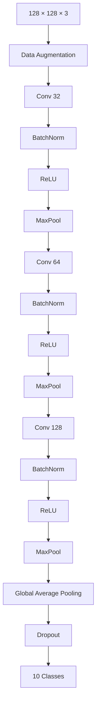
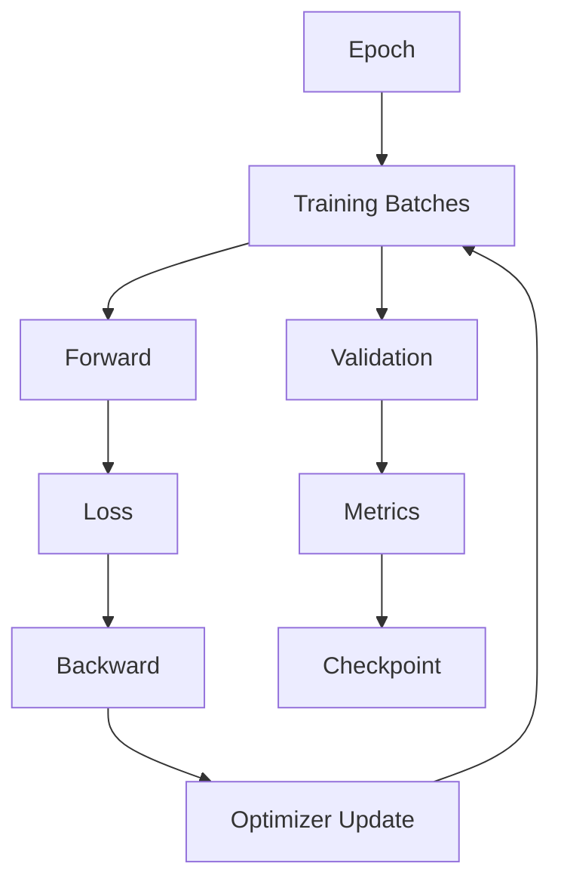
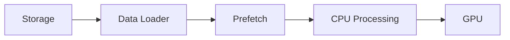
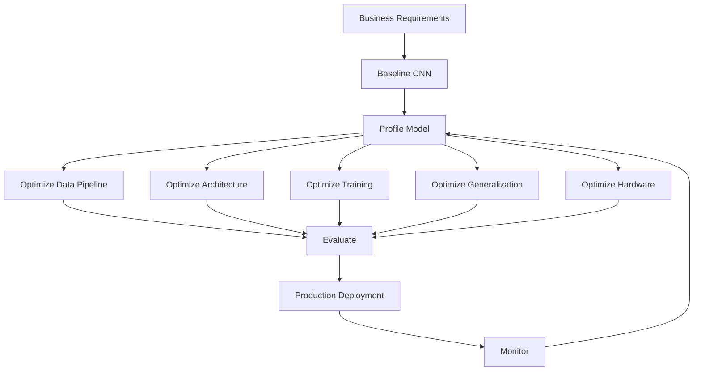

# 20. CNN Architecture, Optimization and Training

> Learn how to design, train, optimize, regularize, and evaluate Convolutional Neural Networks for reliable Computer Vision systems, moving from basic CNNs to deeper and more efficient architectures.

---

## 🎯 Learning Objectives

After completing this chapter, you will be able to:

- Understand how CNN architectures evolve from simple to deep networks
- Design effective CNN building blocks
- Understand convolutional blocks and downsampling strategies
- Understand the relationship between depth, width, and model capacity
- Apply Batch Normalization effectively
- Apply Dropout and weight decay
- Use data augmentation to improve generalization
- Understand learning-rate selection and scheduling
- Understand optimizer selection for CNN training
- Apply Early Stopping and checkpointing
- Diagnose underfitting and overfitting
- Understand exploding and vanishing gradients in CNNs
- Track CNN tensor shapes and parameter counts
- Build optimized CNNs using Keras
- Build optimized CNNs using PyTorch
- Compare different CNN architectures
- Analyze training and validation curves
- Understand CNN computational cost
- Apply practical CNN optimization techniques
- Prepare CNN models for Transfer Learning and ResNet-based architectures

---

# 📖 Overview

Building a CNN is only the first step.

A simple CNN may successfully learn a small image classification problem, but real-world Computer Vision systems often require:

```text
Higher Accuracy
+
Better Generalization
+
Faster Training
+
Lower Inference Latency
+
Lower Memory Usage
+
Stable Optimization
```

Therefore, CNN development is an iterative engineering process:

```text
Architecture
     ↓
Training
     ↓
Evaluation
     ↓
Error Analysis
     ↓
Optimization
     ↓
Retraining
     ↓
Validation
```

The goal is not simply to make the network deeper.

The goal is to find an architecture and training strategy that provides the right balance between:

```text
Accuracy
Performance
Generalization
Cost
Complexity
```

---

# 🧠 CNN Optimization Landscape

```mermaid
flowchart TD

    CNN["CNN Model"]

    ARCH["Architecture Optimization"]
    DATA["Data Optimization"]
    TRAIN["Training Optimization"]
    REG["Regularization"]
    HARDWARE["Hardware Optimization"]

    CNN --> ARCH
    CNN --> DATA
    CNN --> TRAIN
    CNN --> REG
    CNN --> HARDWARE

    ARCH --> DEPTH["Depth / Width"]
    ARCH --> KERNEL["Kernel / Stride"]
    ARCH --> POOL["Downsampling"]
    ARCH --> HEAD["Classification Head"]

    DATA --> AUG["Augmentation"]
    DATA --> QUALITY["Data Quality"]
    DATA --> BALANCE["Class Balance"]

    TRAIN --> OPT["Optimizer"]
    TRAIN --> LR["Learning Rate"]
    TRAIN --> BATCH["Batch Size"]
    TRAIN --> SCHEDULE["LR Schedule"]

    REG --> DROPOUT["Dropout"]
    REG --> WD["Weight Decay"]
    REG --> EARLY["Early Stopping"]

    HARDWARE --> GPU["GPU"]
    HARDWARE --> MIXED["Mixed Precision"]
    HARDWARE --> MEMORY["Memory Optimization"]
```



---

# 🧠 From Basic CNN to Optimized CNN

A simple CNN might look like:

```text
Input
 ↓
Conv
 ↓
ReLU
 ↓
Pool
 ↓
Conv
 ↓
ReLU
 ↓
Pool
 ↓
Flatten
 ↓
Dense
 ↓
Output
```

A more sophisticated CNN may use:

```text
Input
 ↓
Conv
 ↓
BatchNorm
 ↓
Activation
 ↓
Conv
 ↓
BatchNorm
 ↓
Activation
 ↓
Downsampling
 ↓
Residual / Feature Block
 ↓
Residual / Feature Block
 ↓
Global Average Pooling
 ↓
Classifier
```

---

# 🧠 CNN Design Principles

When designing a CNN, consider:

```text
Input Resolution
       +
Number of Channels
       +
Number of Filters
       +
Kernel Size
       +
Stride
       +
Padding
       +
Depth
       +
Downsampling
       +
Normalization
       +
Activation
       +
Regularization
       +
Classification Head
```

---

# 🏗 CNN Building Blocks

A CNN can be viewed as a collection of reusable blocks.



---

# 🧠 Depth

Depth refers to the number of learnable layers in a network.

Example:

```text
Shallow CNN

Input
 ↓
Conv
 ↓
Conv
 ↓
Dense
```

versus:

```text
Deep CNN

Input
 ↓
Conv
 ↓
Conv
 ↓
Conv
 ↓
Conv
 ↓
Conv
 ↓
Conv
 ↓
Classifier
```

Increasing depth can allow the network to learn more complex representations.

However:

> **Deeper does not automatically mean better.**

Deep networks introduce additional optimization and generalization challenges.

---

# 🧠 Width

Width generally refers to the number of channels or filters in a layer.

Example:

```text
Conv 32
 ↓
Conv 64
 ↓
Conv 128
 ↓
Conv 256
```

Increasing width increases representational capacity.

However:

```text
More Channels
     ↓
More Parameters
     ↓
More Memory
     ↓
More Computation
```

---

# 🧠 Depth vs Width

| Increasing Depth | Increasing Width |
|---|---|
| More layers | More filters/channels |
| More hierarchical representations | More representation capacity per layer |
| Can improve abstraction | Can improve feature diversity |
| May make optimization harder | Increases computation |
| Often increases latency | Often increases memory usage |

A good architecture balances both.

---

# 🧠 Spatial Resolution vs Channels

CNNs commonly follow:

```text
Spatial Resolution ↓
Channels ↑
```

Example:

```text
224 × 224 × 32
       ↓
112 × 112 × 64
       ↓
56 × 56 × 128
       ↓
28 × 28 × 256
       ↓
14 × 14 × 512
```

This allows the network to gradually trade detailed spatial information for increasingly rich semantic representations.

---

# 🧠 CNN Architecture Pattern



---

# 🧠 Convolution Kernel Size

Common kernel sizes include:

```text
1 × 1
3 × 3
5 × 5
7 × 7
```

The `3 × 3` kernel is particularly common in CNN architectures.

---

# 🧠 Why 3 × 3 Convolutions?

A `3 × 3` convolution provides a useful balance between:

```text
Local Context
+
Parameter Efficiency
+
Computational Cost
```

Two consecutive `3 × 3` convolutions can provide a larger effective receptive field while introducing additional nonlinear transformations.

---

# 🧠 1 × 1 Convolution

A `1 × 1` convolution does not combine neighboring spatial locations directly.

Instead, it operates across channels.

It can be used for:

```text
Channel Mixing
Channel Reduction
Channel Expansion
Computational Optimization
Bottleneck Blocks
```

Conceptually:

```text
H × W × C
      ↓
1 × 1 Conv
      ↓
H × W × C'
```

---

# 🧠 Stride as Downsampling

Stride can be used instead of pooling for downsampling.

Example:

```text
Stride = 1

224 × 224
    ↓
224 × 224
```

versus:

```text
Stride = 2

224 × 224
    ↓
112 × 112
```

This provides a learnable way to reduce spatial resolution.

---

# 🧠 Pooling vs Strided Convolution

| Pooling | Strided Convolution |
|---|---|
| Fixed operation | Learnable operation |
| Reduces spatial dimensions | Reduces spatial dimensions |
| No learned parameters | Has learned parameters |
| Simple | More expressive |
| Common in traditional CNNs | Common in modern architectures |

---

# 🧠 Batch Normalization

Batch Normalization normalizes intermediate activations using statistics derived from the mini-batch during training.

A simplified form is:

\[
\hat{x}
=
\frac{x-\mu_B}
{\sqrt{\sigma_B^2+\epsilon}}
\]


A learnable scale and shift are then applied:

\[
y=\gamma\hat{x}+\beta
\]


where:

```text
γ = Learnable Scale
β = Learnable Shift
```

---

# 🧠 Batch Normalization in CNNs

A common block is:

```text
Conv
 ↓
BatchNorm
 ↓
ReLU
```

Example in Keras:

```python
block = tf.keras.Sequential([

    tf.keras.layers.Conv2D(
        64,
        3,
        padding="same",
        use_bias=False
    ),

    tf.keras.layers.BatchNormalization(),

    tf.keras.layers.ReLU()
])
```

---

# 🧠 Why Disable Convolution Bias?

When Batch Normalization immediately follows a convolution, the bias term of the convolution can become redundant because Batch Normalization already includes a learnable shift.

Therefore, architectures often use:

```python
use_bias=False
```

in such blocks.

---

# 🧠 Batch Normalization — Training vs Inference

During training:

```text
Mini-Batch Statistics
        ↓
Normalization
        ↓
Learnable Scale / Shift
```

During inference:

```text
Stored Running Statistics
        ↓
Normalization
        ↓
Prediction
```

This distinction is important when deploying CNN models.

---

# 🧠 Dropout

Dropout randomly removes activations during training.

Example:

```python
tf.keras.layers.Dropout(
    0.5
)
```

Conceptually:

```text
Before Dropout

● ● ● ● ● ●

After Dropout

●   ● ●   ●
```

Dropout helps reduce reliance on specific activations and can improve generalization.

---

# 🧠 Weight Decay

Weight decay discourages excessively large model parameters.

A simplified regularized objective is:

\[
L_{total}
=
L_{data}
+
\lambda
\sum_i w_i^2
\]


where:

```text
λ = Regularization Strength
w = Model Parameters
```

In modern training pipelines, optimizer-based weight decay such as AdamW is often preferred over treating every regularization method as mathematically identical.

---

# 🧠 Data Augmentation

Data augmentation generates realistic variations of training examples.

Common image transformations:

```text
Horizontal Flip
Random Crop
Rotation
Translation
Zoom
Color Jitter
Brightness Adjustment
Contrast Adjustment
Random Erasing
```

---

# 🧠 Augmentation Pipeline


---

# ⚠ Data Augmentation Must Be Domain-Aware

Not every transformation is appropriate for every problem.

For example:

```text
Object Classification
→ Horizontal Flip may be valid
```

but:

```text
Digit Recognition
→ Arbitrary Rotation may change class meaning
```

Similarly, medical imaging often requires domain-specific augmentation policies.

Therefore:

> **Augmentation should represent plausible variations of production data.**

---

# 🧠 Training Data vs Validation Data

Augmentation is generally applied to training data.

```text
Training
    ↓
Augmentation
    ↓
CNN
```

Validation should generally represent the real evaluation distribution:

```text
Validation Image
    ↓
Required Preprocessing
    ↓
CNN
```

Do not randomly augment validation images unless the evaluation methodology explicitly requires it.

---

# 🧠 Learning Rate

The learning rate controls the magnitude of parameter updates.

Conceptually:

\[
\theta_{t+1}
=
\theta_t
-
\eta\nabla_\theta L
\]


where:

```text
θ = Model Parameters
η = Learning Rate
∇L = Gradient
```

---

# ⚠ Learning Rate Too High

```text
Loss
 ↑
 │    ╲  ╱╲
 │     ╲╱  ╲
 │      ╲  ╱
 │       ╲╱
 └────────────────→ Steps
```

Possible behavior:

```text
Unstable Training
Oscillation
Divergence
```

---

# ⚠ Learning Rate Too Low

```text
Loss
 ↑
 │\
 │ \
 │  \
 │   \
 │    \
 │     \____
 └────────────────→ Steps
```

Possible behavior:

```text
Very Slow Convergence
Excessive Training Time
Potentially Poor Local Progress
```

---

# 🧠 Learning Rate Selection

A practical strategy:

```text
Start With Reasonable LR
        ↓
Observe Training Curve
        ↓
Adjust
        ↓
Use LR Scheduler
```

Do not assume:

```text
0.001
```

is universally optimal.

---

# 🧠 Learning Rate Scheduling

Common schedules include:

```text
Step Decay
Exponential Decay
Cosine Decay
Reduce on Plateau
Warmup
One-Cycle
```

---

# 🧠 Step Decay

The learning rate is reduced after predefined intervals.

```text
LR
│
│────────
│       │
│       └──────
│              │
│              └──────
└────────────────────→ Epoch
```

---

# 🧠 Exponential Decay

The learning rate decreases continuously.

\[
\eta_t
=
\eta_0e^{-kt}
\]


---

# 🧠 Cosine Decay

A cosine schedule gradually reduces the learning rate.

Conceptually:

```text
Learning Rate
│\
│ \
│  \
│   ╲
│    ╲
│      ╲
│        ╲
└────────────────→ Training
```

Cosine schedules are widely used in modern Deep Learning training.

---

# 🧠 Reduce on Plateau

The learning rate can be reduced when validation performance stops improving.

Keras:

```python
scheduler = tf.keras.callbacks.ReduceLROnPlateau(

    monitor="val_loss",

    factor=0.5,

    patience=3,

    min_lr=1e-6
)
```

This is useful when the optimal schedule is not known beforehand.

---

# 🧠 Warmup

Warmup starts training with a smaller learning rate and gradually increases it.

```text
LR
│      ───────────────
│    /
│   /
│  /
│ /
└────────────────────→ Steps
   Warmup
```

Warmup can improve stability, particularly for large models, large batch sizes, or certain optimization setups.

---

# 🧠 Optimizer Selection

Common optimizers:

```text
SGD
Momentum
RMSprop
Adam
AdamW
```

---

# 🔵 SGD

Basic update:

\[
\theta_{t+1}
=
\theta_t-\eta g_t
\]

where:

```text
g_t = Gradient
```

SGD can provide strong generalization and is still widely used in Computer Vision.

---

# 🔵 SGD with Momentum

Momentum accumulates information from previous gradients.

Conceptually:

\[
v_t
=
\beta v_{t-1}
+
g_t
\]

\[
\theta_t
=
\theta_{t-1}
-
\eta v_t
\]


---

# 🟢 Adam

Adam combines ideas related to momentum and adaptive learning rates.

It maintains estimates of:

```text
First Moment
Second Moment
```

Adam often converges quickly and is a strong baseline for many problems.

---

# 🟢 AdamW

AdamW separates weight decay from the adaptive gradient update.

Example:

```python
optimizer = torch.optim.AdamW(

    model.parameters(),

    lr=1e-3,

    weight_decay=1e-4
)
```

AdamW is widely used in modern Deep Learning training.

---

# 🧠 Optimizer Comparison

| Optimizer | Strength | Typical Use |
|---|---|---|
| SGD | Simple, strong generalization | Vision training |
| SGD + Momentum | Faster directional convergence | CNNs |
| Adam | Fast optimization | General Deep Learning |
| AdamW | Adam + decoupled weight decay | Modern DL |
| RMSprop | Adaptive updates | Certain sequence / older architectures |

There is no universally best optimizer.

---

# 🧠 Batch Size

Batch size determines the number of training examples processed before a parameter update.

Example:

```text
Dataset = 50,000 images
Batch Size = 64
```

Approximately:

```text
50,000 / 64
≈ 782 steps per epoch
```

---

# 🧠 Small Batch vs Large Batch

| Small Batch | Large Batch |
|---|---|
| Less memory | More memory |
| More parameter updates | Fewer updates |
| Noisier gradients | Smoother gradients |
| Often easier on hardware | Better hardware utilization |
| Can sometimes generalize well | May require LR tuning |

---

# 🧠 Batch Size and Learning Rate

Changing batch size can affect optimization behavior.

Therefore, when changing:

```text
Batch Size
```

consider reassessing:

```text
Learning Rate
Optimizer
Training Stability
Generalization
```

---

# 🧠 Epoch

One epoch means the model has processed the training dataset approximately once.

```text
Dataset
   ↓
Batch 1
Batch 2
Batch 3
...
Batch N
   ↓
1 Epoch
```

---

# 🧠 Training Curves

Training curves are among the most important tools for diagnosing CNN training.

Typical plots:

```text
Training Loss
Validation Loss

Training Accuracy
Validation Accuracy
```

---

# 📊 Healthy Training Pattern

```text
Loss
│\
│ \
│  \
│   \
│    \____
│
└────────────────→ Epoch
```

Validation loss should generally improve along with training loss, although some fluctuation is normal.

---

# ⚠ Overfitting Pattern

```text
Loss
│\
│ \
│  \____ Training
│
│     ╲
│      ╲____
│           ╲ Validation
│            ╱
│           ╱
└────────────────→ Epoch
```

More commonly:

```text
Training Loss ↓
Validation Loss ↓
                 ↑
          Then Validation Loss ↑
```

This suggests the model is beginning to overfit.

---

# ⚠ Underfitting Pattern

```text
Training Loss
Validation Loss

Both remain high
        ↓
Model cannot adequately fit data
```

Possible causes:

```text
Insufficient Capacity
Too Much Regularization
Poor Features
Learning Rate Issues
Insufficient Training
```

---

# 🧠 Early Stopping

Early stopping prevents unnecessary training once validation performance stops improving.

Keras:

```python
early_stopping = tf.keras.callbacks.EarlyStopping(

    monitor="val_loss",

    patience=5,

    restore_best_weights=True
)
```

---

# 🧠 Model Checkpointing

Always consider saving the best model during training.

Keras:

```python
checkpoint = tf.keras.callbacks.ModelCheckpoint(

    "best_model.keras",

    monitor="val_loss",

    save_best_only=True
)
```

PyTorch:

```python
torch.save(
    model.state_dict(),
    "best_model.pt"
)
```

---

# 🧠 Checkpointing Workflow



---

# 🧠 CNN Regularization Strategy

A practical regularization stack may include:

```text
Data Augmentation
       ↓
Batch Normalization
       ↓
Weight Decay
       ↓
Dropout
       ↓
Early Stopping
```

However, using every technique simultaneously is not automatically optimal.

Regularization should be tuned according to observed overfitting.

---

# 🧠 Diagnosing Overfitting

Suppose:

```text
Training Accuracy = 99%
Validation Accuracy = 82%
```

Potential actions:

```text
Increase Data Augmentation
Increase Weight Decay
Add / Adjust Dropout
Reduce Model Capacity
Use Early Stopping
Collect More Data
```

---

# 🧠 Diagnosing Underfitting

Suppose:

```text
Training Accuracy = 72%
Validation Accuracy = 70%
```

Potential actions:

```text
Increase Model Capacity
Reduce Excessive Regularization
Train Longer
Improve Learning Rate
Improve Input Representation
```

---

# 🧠 Training Strategy

A practical CNN training process:



---

# 🧠 Avoid Random Hyperparameter Changes

Bad workflow:

```text
Change Learning Rate
+
Change Batch Size
+
Change Architecture
+
Change Augmentation
+
Change Optimizer
```

all at the same time.

You won't know which change caused the improvement or regression.

Better:

```text
Establish Baseline
      ↓
Change One Important Variable
      ↓
Measure
      ↓
Record
      ↓
Keep / Reject
```

---

# 🧪 Experiment Tracking

Track at least:

```text
Experiment ID
Model Architecture
Dataset Version
Image Resolution
Optimizer
Learning Rate
Batch Size
Epochs
Weight Decay
Augmentation
Training Loss
Validation Loss
Validation Accuracy
Precision
Recall
F1
Training Time
Inference Latency
```

Example:

| Experiment | LR | Batch | Optimizer | Augmentation | Val Accuracy |
|---|---:|---:|---|---|---:|
| CNN-01 | 0.001 | 32 | Adam | No | 82% |
| CNN-02 | 0.001 | 32 | Adam | Yes | 86% |
| CNN-03 | 0.0005 | 32 | AdamW | Yes | 88% |
| CNN-04 | 0.01 | 64 | SGD | Yes | 87% |

---

# 🧠 Parameter Count

Parameter count helps estimate model complexity.

For a Dense layer:

\[
Parameters
=
InputFeatures\times OutputFeatures
+
OutputFeatures
\]


For a convolutional layer:

\[
Parameters
=
(K_hK_wC_{in}+1)C_{out}
\]


Parameter count is useful, but it is not the same as actual inference cost.

---

# 🧠 FLOPs

FLOPs approximate the amount of computation required.

For a standard convolution, a simplified estimate is proportional to:

```text
Output Height
×
Output Width
×
Kernel Height
×
Kernel Width
×
Input Channels
×
Output Channels
```

Therefore:

```text
Large Image
+
Large Kernel
+
Many Channels
+
Many Filters
```

can dramatically increase computation.

---

# 🧠 Parameter Count vs FLOPs

A model can have:

```text
Few Parameters
```

but still require:

```text
Large Computation
```

and vice versa.

Production optimization should therefore consider:

```text
Parameter Count
+
FLOPs
+
Memory
+
Latency
+
Throughput
```

---

# 🧠 Memory Consumption

CNN memory usage includes:

```text
Model Parameters
+
Gradients
+
Optimizer State
+
Activations
+
Input Batches
```

During training, activations can consume significant memory because they are needed for backpropagation.

---

# 🧠 Training Memory



---

# 🧠 Mixed Precision

Modern GPUs can accelerate training using lower-precision numerical formats.

Common approaches include:

```text
FP32
FP16
BF16
```

Mixed precision typically uses:

```text
Lower Precision
+
FP32 Where Necessary
```

to balance performance and numerical stability.

---

# 🧪 Mixed Precision with Keras

```python
from tensorflow.keras import mixed_precision


mixed_precision.set_global_policy(
    "mixed_float16"
)
```

---

# 🧪 Mixed Precision with PyTorch

```python
scaler = torch.amp.GradScaler(
    "cuda"
)

with torch.autocast(
    device_type="cuda"
):

    logits = model(
        images
    )

    loss = loss_fn(
        logits,
        labels
    )

scaler.scale(
    loss
).backward()

scaler.step(
    optimizer
)

scaler.update()
```

The exact API can vary across PyTorch versions, so production code should follow the installed version's recommended AMP interface.

---

# 🧠 GPU Training

CNNs benefit significantly from GPUs because convolution operations are highly parallelizable.

```text
CPU
 ↓
General-Purpose Computation

GPU
 ↓
Massively Parallel Tensor Computation
```

---

# 🧠 GPU Training Pipeline


GPU optimization is covered in greater depth in:

**[35. GPU-Accelerated Deep Learning](35-gpu-accelerated-deep-learning.md)**.

---

# 🐍 Part I — Optimized CNN with Keras

```python
import tensorflow as tf


model = tf.keras.Sequential([

    tf.keras.layers.Input(
        shape=(128, 128, 3)
    ),

    tf.keras.layers.RandomFlip(
        "horizontal"
    ),

    tf.keras.layers.RandomRotation(
        0.1
    ),

    tf.keras.layers.Conv2D(
        32,
        3,
        padding="same",
        use_bias=False
    ),

    tf.keras.layers.BatchNormalization(),

    tf.keras.layers.ReLU(),

    tf.keras.layers.MaxPooling2D(
        2
    ),

    tf.keras.layers.Conv2D(
        64,
        3,
        padding="same",
        use_bias=False
    ),

    tf.keras.layers.BatchNormalization(),

    tf.keras.layers.ReLU(),

    tf.keras.layers.MaxPooling2D(
        2
    ),

    tf.keras.layers.Conv2D(
        128,
        3,
        padding="same",
        use_bias=False
    ),

    tf.keras.layers.BatchNormalization(),

    tf.keras.layers.ReLU(),

    tf.keras.layers.MaxPooling2D(
        2
    ),

    tf.keras.layers.GlobalAveragePooling2D(),

    tf.keras.layers.Dropout(
        0.3
    ),

    tf.keras.layers.Dense(
        10,
        activation="softmax"
    )
])
```

---

# 🧠 Optimized Keras CNN Architecture



---

# 🧪 Keras Optimizer

```python
optimizer = tf.keras.optimizers.AdamW(

    learning_rate=1e-3,

    weight_decay=1e-4
)
```

Compile:

```python
model.compile(

    optimizer=optimizer,

    loss="sparse_categorical_crossentropy",

    metrics=[
        "accuracy"
    ]
)
```

---

# 🧪 Keras Training Strategy

```python
callbacks = [

    tf.keras.callbacks.ModelCheckpoint(

        "best_model.keras",

        monitor="val_loss",

        save_best_only=True
    ),

    tf.keras.callbacks.EarlyStopping(

        monitor="val_loss",

        patience=7,

        restore_best_weights=True
    ),

    tf.keras.callbacks.ReduceLROnPlateau(

        monitor="val_loss",

        factor=0.5,

        patience=3
    )
]
```

Training:

```python
history = model.fit(

    X_train,
    y_train,

    validation_data=(
        X_val,
        y_val
    ),

    epochs=100,

    batch_size=64,

    callbacks=callbacks
)
```

---

# 🐍 Part II — Optimized CNN with PyTorch

```python
import torch
import torch.nn as nn


class OptimizedCNN(
    nn.Module
):

    def __init__(
        self,
        num_classes=10
    ):

        super().__init__()

        self.features = nn.Sequential(

            nn.Conv2d(
                3,
                32,
                kernel_size=3,
                padding=1,
                bias=False
            ),

            nn.BatchNorm2d(
                32
            ),

            nn.ReLU(),

            nn.MaxPool2d(
                2
            ),

            nn.Conv2d(
                32,
                64,
                kernel_size=3,
                padding=1,
                bias=False
            ),

            nn.BatchNorm2d(
                64
            ),

            nn.ReLU(),

            nn.MaxPool2d(
                2
            ),

            nn.Conv2d(
                64,
                128,
                kernel_size=3,
                padding=1,
                bias=False
            ),

            nn.BatchNorm2d(
                128
            ),

            nn.ReLU(),

            nn.MaxPool2d(
                2
            ),

            nn.AdaptiveAvgPool2d(
                (1, 1)
            )
        )

        self.classifier = nn.Sequential(

            nn.Flatten(),

            nn.Dropout(
                0.3
            ),

            nn.Linear(
                128,
                num_classes
            )
        )

    def forward(
        self,
        x
    ):

        x = self.features(
            x
        )

        return self.classifier(
            x
        )
```

---

# 🧠 Why `AdaptiveAvgPool2d(1, 1)`?

Instead of assuming a fixed spatial feature-map size:

```text
7 × 7
```

Adaptive Average Pooling produces:

```text
1 × 1
```

per channel.

This makes the classifier less dependent on the exact spatial dimensions of the preceding feature map.

---

# 🧪 PyTorch Optimizer

```python
optimizer = torch.optim.AdamW(

    model.parameters(),

    lr=1e-3,

    weight_decay=1e-4
)
```

---

# 🧠 PyTorch Scheduler

Example:

```python
scheduler = torch.optim.lr_scheduler.CosineAnnealingLR(

    optimizer,

    T_max=50
)
```

After each epoch:

```python
scheduler.step()
```

---

# 🧠 PyTorch Training Loop

```python
for epoch in range(
    epochs
):

    model.train()

    for images, labels in train_loader:

        images = images.to(
            device
        )

        labels = labels.to(
            device
        )

        optimizer.zero_grad()

        logits = model(
            images
        )

        loss = loss_fn(
            logits,
            labels
        )

        loss.backward()

        optimizer.step()

    scheduler.step()
```

---

# 🧠 Training Loop with Validation



---

# 🧠 CNN Optimization Checklist

Before increasing model complexity, check:

```text
✓ Dataset Quality
✓ Class Balance
✓ Input Normalization
✓ Image Resolution
✓ Data Augmentation
✓ Learning Rate
✓ Optimizer
✓ Batch Size
✓ Weight Decay
✓ Batch Normalization
✓ Dropout
✓ Early Stopping
✓ Learning Rate Schedule
✓ GPU Utilization
```

---

# 🧠 Architecture Optimization

If the model is underfitting:

```text
Increase Depth
Increase Width
Reduce Excessive Regularization
Train Longer
Improve Optimization
```

If the model is overfitting:

```text
Increase Augmentation
Increase Weight Decay
Add Dropout
Reduce Capacity
Use Early Stopping
Collect More Data
```

---

# 🧠 Training Optimization

If training is too slow:

```text
Use GPU
       ↓
Increase Hardware Utilization
       ↓
Tune Batch Size
       ↓
Use Mixed Precision
       ↓
Optimize DataLoader
       ↓
Reduce Unnecessary Computation
```

---

# 🧠 Data Pipeline Bottleneck

Sometimes the GPU is not the bottleneck.

The pipeline may be:

```text
Disk
 ↓
Image Decode
 ↓
Resize
 ↓
Augmentation
 ↓
CPU
 ↓
GPU
```

If the GPU waits for data:

```text
GPU Utilization ↓
Training Time ↑
```

---

# 🧠 Efficient Data Pipeline



Production training systems should optimize both:

```text
Model Computation
+
Data Pipeline
```

---

# 🧠 CNN Training Failure Modes

| Symptom | Possible Cause |
|---|---|
| Training loss does not decrease | Learning rate, architecture, labels |
| Training loss decreases slowly | LR too low, inefficient optimization |
| Loss explodes | LR too high, numerical instability |
| Training accuracy high, validation low | Overfitting |
| Both accuracies low | Underfitting |
| Validation unstable | Small validation set, LR, distribution issues |
| GPU utilization low | Data pipeline bottleneck |
| Training OOM | Batch size / model / activation memory |
| Validation suddenly collapses | Distribution issue or overfitting |

---

# 🧠 Learning Rate Experiment

Try:

```text
1e-2
1e-3
1e-4
```

Compare:

```text
Convergence
Final Validation Accuracy
Training Stability
Training Time
```

Do not assume that the largest learning rate is best.

---

# 🧠 Batch Size Experiment

Compare:

```text
16
32
64
128
```

Track:

```text
Memory
Training Time
Validation Accuracy
Convergence
```

---

# 🧠 Optimizer Experiment

Compare:

```text
SGD + Momentum
Adam
AdamW
```

Keep other variables stable.

---

# 🧠 Regularization Experiment

Compare:

```text
Baseline
Baseline + Weight Decay
Baseline + Dropout
Baseline + Augmentation
Baseline + Weight Decay + Augmentation
```

Record the results systematically.

---

# 🧪 Practical Exercise 1 — CNN Baseline

Build:

```text
Conv32
 ↓
MaxPool
 ↓
Conv64
 ↓
MaxPool
 ↓
Flatten
 ↓
Dense128
 ↓
Output
```

Train without advanced optimization.

Record:

```text
Training Accuracy
Validation Accuracy
Training Time
Parameters
```

---

# 🧪 Practical Exercise 2 — Add Batch Normalization

Modify:

```text
Conv
 ↓
ReLU
```

to:

```text
Conv
 ↓
BatchNorm
 ↓
ReLU
```

Compare:

```text
Convergence
Training Stability
Validation Accuracy
```

---

# 🧪 Practical Exercise 3 — Add Data Augmentation

Compare:

```text
No Augmentation
```

versus:

```text
Flip
Rotation
Zoom
```

Analyze the validation performance.

---

# 🧪 Practical Exercise 4 — Optimizer Comparison

Train the same architecture using:

```text
SGD + Momentum
Adam
AdamW
```

Keep:

```text
Dataset
Architecture
Batch Size
Epochs
```

constant.

---

# 🧪 Practical Exercise 5 — Learning Rate Comparison

Test:

```text
1e-2
1e-3
1e-4
```

Plot:

```text
Training Loss
Validation Loss
```

and explain the differences.

---

# 🧪 Practical Exercise 6 — Learning Rate Scheduling

Compare:

```text
Constant LR
Step Decay
Reduce on Plateau
Cosine Decay
```

Evaluate:

```text
Final Accuracy
Convergence Speed
Training Stability
```

---

# 🧪 Practical Exercise 7 — CNN Capacity

Build three models:

```text
Small CNN
Medium CNN
Large CNN
```

Compare:

```text
Parameters
Training Accuracy
Validation Accuracy
Inference Latency
```

Determine whether increasing capacity improves the production objective.

---

# 🧪 Practical Exercise 8 — Training Curve Analysis

Generate:

```text
Training Loss
Validation Loss
Training Accuracy
Validation Accuracy
```

Identify:

```text
Underfitting
Overfitting
Healthy Convergence
Unstable Training
```

---

# 🧪 Practical Exercise 9 — GPU Optimization

Train the same CNN:

```text
CPU
GPU
GPU + Mixed Precision
```

Compare:

```text
Training Time
GPU Utilization
Memory Usage
Throughput
```

---

# 🧪 Practical Exercise 10 — Production-Oriented CNN

Build an end-to-end pipeline:

```text
Dataset
 ↓
Preprocessing
 ↓
Augmentation
 ↓
CNN
 ↓
Training
 ↓
Validation
 ↓
Checkpoint
 ↓
Evaluation
 ↓
Inference
```

Track:

```text
Model Version
Dataset Version
Metrics
Hyperparameters
Training Time
Model Size
Inference Latency
```

---

# 🧠 Interview Questions

## Beginner

### 1. What is CNN optimization?

CNN optimization includes improving architecture, training configuration, regularization, data pipeline, and hardware utilization to achieve the desired accuracy and performance.

### 2. Why is Batch Normalization used?

It can improve optimization and training stability by normalizing intermediate activations and providing learnable scale and shift parameters.

### 3. What is weight decay?

Weight decay discourages excessively large parameter values and can improve generalization.

### 4. What is data augmentation?

It creates realistic variations of training samples to improve model generalization.

### 5. What is learning rate?

The learning rate controls the magnitude of parameter updates during optimization.

---

## Intermediate

### 6. What happens if the learning rate is too high?

Training may oscillate, become unstable, or diverge.

### 7. What happens if the learning rate is too low?

Training may become excessively slow and may make insufficient optimization progress.

### 8. Why use learning-rate schedules?

A schedule allows the optimization process to use different learning rates during different stages of training.

### 9. Why is AdamW useful?

AdamW combines adaptive optimization with decoupled weight decay and is widely useful as a modern training baseline.

### 10. Why might data augmentation improve validation performance?

It exposes the model to a wider range of realistic training examples and reduces over-reliance on specific training-image patterns.

### 11. What is the difference between model capacity and training performance?

Capacity describes what the model can represent, while training performance describes how well the current optimization process is fitting the data.

### 12. Why might a model with fewer parameters be faster?

It may require less computation and memory, although parameter count alone does not fully determine inference latency.

---

## Advanced

### 13. Why can a CNN with fewer parameters still be computationally expensive?

Because FLOPs depend on spatial dimensions, channel counts, kernel operations, and the number of layers, not just parameter count.

### 14. Why can increasing image resolution increase training cost dramatically?

Convolution operates over spatial locations, so increasing height and width increases the number of convolution operations.

### 15. How would you diagnose a GPU training bottleneck?

Inspect:

```text
GPU Utilization
CPU Utilization
Data Loading Time
I/O
Memory Usage
Batch Processing Time
```

If GPU utilization remains low while CPU/data loading is saturated, the data pipeline may be the bottleneck.

### 16. Why is changing multiple hyperparameters simultaneously a problem?

You cannot reliably determine which change caused the observed performance difference.

### 17. How would you optimize a CNN for production inference?

Consider:

```text
Architecture
Input Resolution
Batching
Quantization
Pruning
GPU / CPU
Memory
Latency
Throughput
Serving Framework
```

### 18. Why is validation loss often monitored for early stopping?

Loss provides a continuous optimization signal and can reveal overfitting before classification accuracy visibly changes.

### 19. Why can training accuracy continue improving while validation accuracy declines?

The model may be increasingly fitting training-specific patterns rather than learning representations that generalize.

### 20. How would you design a reliable CNN experiment?

Keep the following controlled:

```text
Dataset Version
Train / Validation Split
Random Seeds
Evaluation Metrics
Architecture
Hardware
```

and change only the variable being studied.

---

# 🏢 Enterprise Perspective

CNN optimization in enterprise systems is a multi-dimensional problem.

A model should not be selected only because:

```text
Validation Accuracy = Highest
```

Instead evaluate:

```text
Accuracy
+
Precision / Recall
+
Latency
+
Throughput
+
Memory
+
Training Cost
+
Inference Cost
+
Maintainability
```

For example:

```text
Model A

Accuracy = 94%
Latency = 200 ms
Memory = 2 GB
```

versus:

```text
Model B

Accuracy = 92%
Latency = 20 ms
Memory = 300 MB
```

For a high-throughput real-time application, Model B may be the better production choice.

---

# 🏭 Production CNN Optimization Pipeline



---

# 🏢 Production Optimization Priorities

A useful order is:

```text
1. Validate Data Quality
        ↓
2. Establish Baseline
        ↓
3. Fix Underfitting / Overfitting
        ↓
4. Tune Learning Rate
        ↓
5. Tune Regularization
        ↓
6. Improve Architecture
        ↓
7. Optimize Data Pipeline
        ↓
8. Optimize Hardware
        ↓
9. Optimize Inference
```

Do not optimize GPU kernels before confirming that the model and dataset are producing the desired business outcome.

---

!!! tip "Production Insight"

    **CNN optimization is not simply hyperparameter tuning.**

    A production-grade optimization process considers the entire system:

    ```text
    Data
      +
    Architecture
      +
    Optimization
      +
    Regularization
      +
    Training Infrastructure
      +
    Inference Infrastructure
      +
    Business Requirements
    ```

    The best model is the one that meets the required accuracy and reliability while satisfying latency, cost, scalability, and operational constraints.

---

# 📌 Key Takeaways

- CNN optimization involves architecture, data, training, regularization, and hardware.
- Increasing depth can improve representation capacity but also increases optimization complexity.
- Increasing width increases feature capacity but also increases computation and memory usage.
- CNNs commonly reduce spatial resolution while increasing channels.
- `3 × 3` convolutions provide an effective balance between local context and efficiency.
- `1 × 1` convolutions are useful for channel transformation and bottleneck architectures.
- Strided convolution can perform learnable downsampling.
- Batch Normalization can improve training stability.
- Dropout can reduce overfitting.
- Weight decay can improve generalization.
- Data augmentation is one of the most important Computer Vision regularization techniques.
- Learning rate is one of the most influential training hyperparameters.
- Learning-rate schedules can improve convergence.
- AdamW is a strong modern optimizer baseline.
- Batch size affects memory, throughput, gradient noise, and optimization behavior.
- Training curves are essential for diagnosing overfitting and underfitting.
- Checkpointing allows the best model to be retained during training.
- Parameter count alone does not determine computational cost.
- FLOPs, memory, latency, and throughput should be considered for production optimization.
- GPU acceleration can significantly improve CNN training.
- Mixed precision can improve training performance on supported hardware.
- Data pipelines can become bottlenecks even when the model is GPU-accelerated.
- CNN experiments should change controlled variables systematically.
- Production optimization must consider business requirements alongside model metrics.

---

# 📚 Further Reading

Continue with:

- **[21. Transfer Learning and Fine-Tuning](21-transfer-learning-and-fine-tuning.md)**
- **[22. ResNet, Residual Connections and TorchVision](22-resnet-residual-connections-and-torchvision.md)**
- **[23. Vision Transformers and CNN-ViT Hybrids](23-vision-transformers-and-cnn-vit-hybrids.md)**
- **[35. GPU-Accelerated Deep Learning](35-gpu-accelerated-deep-learning.md)**
- **[36. Deep Learning Training and Model Lifecycle](36-deep-learning-training-and-model-lifecycle.md)**
- **[37. Building Production Deep Learning Systems](37-building-production-deep-learning-systems.md)**

The next chapter introduces **Transfer Learning and Fine-Tuning**, showing how pretrained CNN representations can dramatically reduce training requirements for new Computer Vision tasks.

---

## ➡️ Next Chapter

**[21. Transfer Learning and Fine-Tuning](21-transfer-learning-and-fine-tuning.md)**

---

> **Enterprise AI Engineering Handbook**  
> *Building Production-Grade Enterprise AI Systems — One Chapter at a Time.*