# 21. Transfer Learning and Fine-Tuning

> Learn how pretrained Deep Learning models can be reused for new Computer Vision tasks, how feature extraction and fine-tuning work, how to select and freeze layers, and how pretrained models are adapted efficiently for production-grade applications.

---

## 🎯 Learning Objectives

After completing this chapter, you will be able to:

- Explain what Transfer Learning is
- Understand why pretrained models are useful
- Explain how pretrained CNNs learn reusable representations
- Understand feature extraction
- Understand fine-tuning
- Differentiate between freezing and unfreezing layers
- Understand pretrained model weights
- Understand source and target domains
- Select an appropriate pretrained architecture
- Replace a pretrained model's classification head
- Build Transfer Learning models using Keras
- Build Transfer Learning models using PyTorch
- Understand the difference between training from scratch and Transfer Learning
- Design a staged fine-tuning strategy
- Select appropriate learning rates for fine-tuning
- Avoid common fine-tuning mistakes
- Handle Batch Normalization during fine-tuning
- Evaluate Transfer Learning models
- Apply Transfer Learning to enterprise Computer Vision problems
- Understand when Transfer Learning may not be appropriate

---

# 📖 Overview

Training a Deep Learning model from scratch can require:

```text
Large Dataset
+
Large Compute Resources
+
Long Training Time
+
Careful Optimization
```

Transfer Learning provides an alternative.

Instead of starting with randomly initialized weights, we start with a model that has already learned useful representations from a large dataset.

```text
Large Dataset
      ↓
Pretrained Model
      ↓
Learned Representations
      ↓
Target Dataset
      ↓
Adapted Model
```

The central idea is:

> **Reuse knowledge learned from one task or dataset to improve learning on another related task.**

---

# 🧠 What Is Transfer Learning?

Transfer Learning is the process of taking knowledge learned by a model on one problem and applying it to another related problem.

For Computer Vision:

```text
ImageNet / Large Dataset
          ↓
   Pretrained CNN
          ↓
General Visual Features
          ↓
Target Dataset
          ↓
Target Task
```

The pretrained network may already understand:

```text
Edges
Textures
Shapes
Patterns
Object Parts
Visual Structures
```

The target model can reuse these representations instead of learning everything from zero.

---

# 🧠 Training From Scratch vs Transfer Learning

## Training From Scratch

```text
Random Initialization
        ↓
Training Dataset
        ↓
Learn Edges
        ↓
Learn Textures
        ↓
Learn Shapes
        ↓
Learn Object Representations
        ↓
Target Task
```

---

## Transfer Learning

```text
Pretrained Model
        ↓
Already Learned Features
        ↓
Target Dataset
        ↓
Adapt Classification Head
        ↓
Fine-Tune Selected Layers
        ↓
Target Task
```

---

# 🧠 Comparison

| Training From Scratch | Transfer Learning |
|---|---|
| Random initialization | Pretrained initialization |
| Requires more data | Often works with less data |
| Longer training | Usually faster convergence |
| Higher compute requirement | Lower training cost |
| Learns all representations | Reuses learned representations |
| Useful for very different domains | Strong for related domains |

---

# 🧠 Why Transfer Learning Works

Early CNN layers often learn general visual features.

For example:

```text
Layer 1
 ↓
Edges

Layer 2
 ↓
Textures

Layer 3
 ↓
Shapes

Deep Layers
 ↓
Task-Specific Features
```

The early representations can often be reused across different image tasks.

---

# 🧠 General-to-Specific Representation

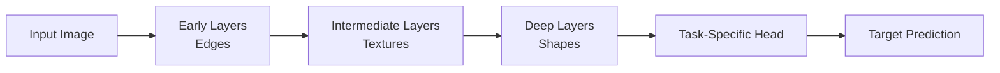

The deeper the representation becomes, the more task-specific it may be.

This is why fine-tuning often begins with the later layers.

---

# 🧠 Pretrained Model

A pretrained model is a model whose parameters have already been learned from a previous training task.

Examples include:

```text
ResNet
VGG
DenseNet
EfficientNet
MobileNet
ConvNeXt
```

These models may have been trained on large-scale image datasets.

---

# 🧠 Pretrained Model Components

A typical pretrained CNN contains:

```text
Feature Extractor
        +
Classification Head
```

For example:

```text
Input
  ↓
Conv Blocks
  ↓
Feature Extraction
  ↓
Global Pooling
  ↓
Original Classifier
```

For a new task:

```text
Input
  ↓
Conv Blocks
  ↓
Feature Extraction
  ↓
Global Pooling
  ↓
NEW Classifier
```

---

# 🧠 Transfer Learning Architecture

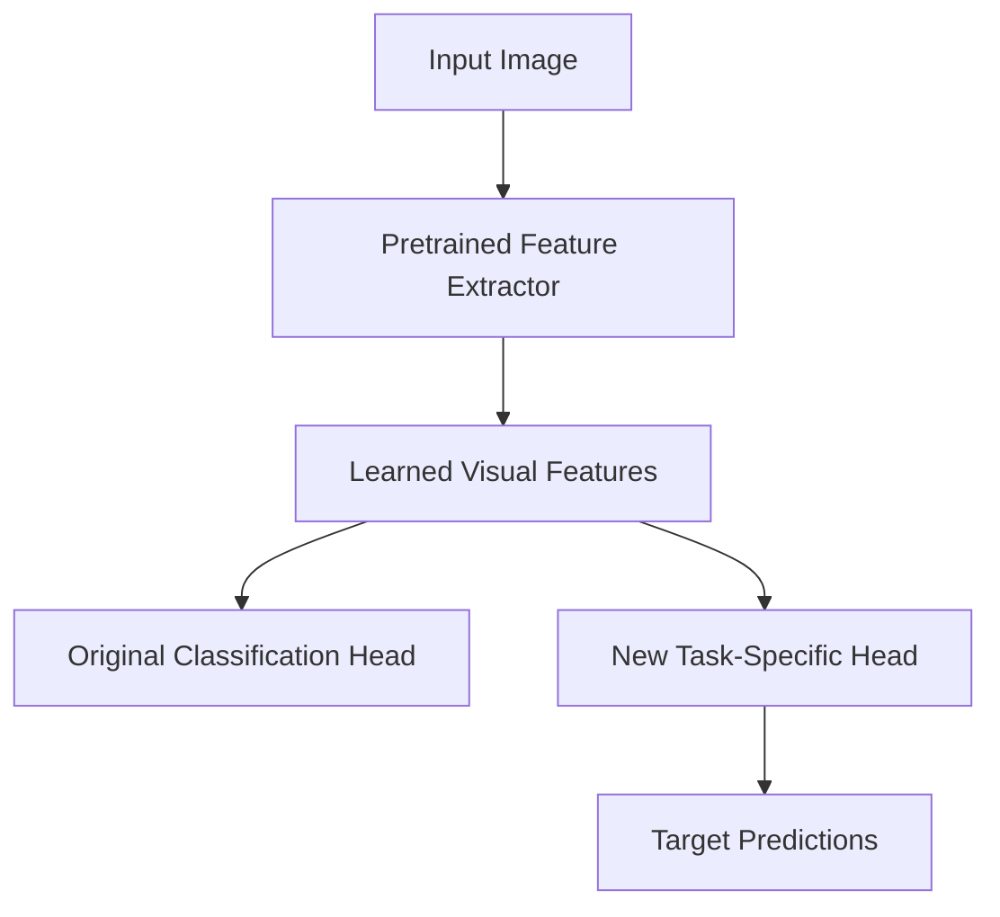

The original classification head is usually removed or replaced when the target task has a different number of classes.

---

# 🧠 Feature Extraction

Feature extraction means:

> **Use the pretrained model as a fixed feature extractor while training only a new task-specific head.**

Conceptually:

```text
Pretrained CNN
     │
     │ Frozen
     ▼
Feature Vector
     │
     ▼
New Classifier
     │
     ▼
Target Prediction
```

---

# 🧠 Frozen Layers

A frozen layer does not update its parameters during training.

```text
Layer
 ↓
requires_grad = False
```

The layer still performs forward computation.

It simply does not receive parameter updates.

---

# 🧠 Feature Extraction Strategy

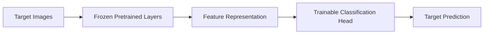

Only:

```text
Classification Head
```

is trained.

---

# 🧠 Fine-Tuning

Fine-tuning means allowing some or all pretrained layers to update using the target dataset.

Instead of:

```text
Frozen Feature Extractor
+
New Head
```

we use:

```text
Pretrained Feature Extractor
+
Partially / Fully Trainable Layers
+
New Head
```

---

# 🧠 Feature Extraction vs Fine-Tuning

| Feature Extraction | Fine-Tuning |
|---|---|
| Pretrained layers frozen | Some pretrained layers trainable |
| Only new head trained | Head + selected backbone layers trained |
| Faster | More computationally expensive |
| Lower risk of overfitting | Higher flexibility |
| Good for small datasets | Useful when domain differs |
| Minimal training | Requires careful LR tuning |

---

# 🧠 Fine-Tuning Strategies

There are several approaches.

### Strategy 1 — Train Only Head

```text
Backbone
 ↓
Frozen

Classifier
 ↓
Trainable
```

---

### Strategy 2 — Fine-Tune Last Few Layers

```text
Early Layers
 ↓
Frozen

Later Layers
 ↓
Trainable

Classifier
 ↓
Trainable
```

---

### Strategy 3 — Fine-Tune Entire Network

```text
All Backbone Layers
 ↓
Trainable

Classifier
 ↓
Trainable
```

This requires careful optimization.

---

# 🧠 Progressive Fine-Tuning

A practical approach is:

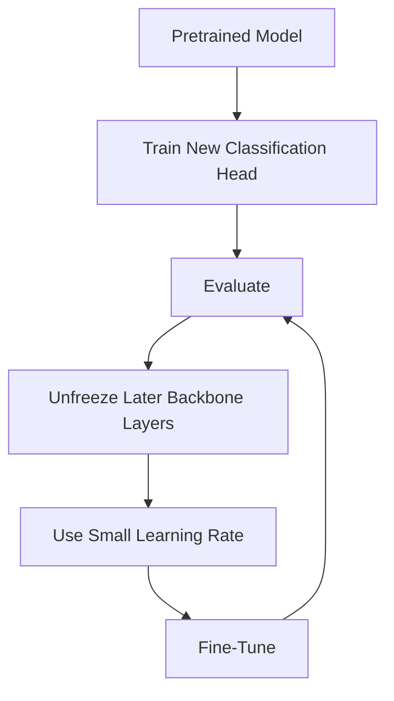

This is often safer than immediately unfreezing the entire model.

---

# 🧠 Why Use a Smaller Learning Rate?

Pretrained layers already contain useful knowledge.

Using a large learning rate can destroy those learned representations.

Therefore:

```text
New Head
    ↓
Higher Learning Rate

Pretrained Layers
    ↓
Lower Learning Rate
```

Conceptually:

```text
Head LR
   >
Backbone LR
```

---

# 🧠 Catastrophic Forgetting

If pretrained layers are updated too aggressively, the model can lose useful previously learned representations.

This can be thought of as:

```text
Pretrained Knowledge
        ↓
Large Updates
        ↓
Useful Representations Destroyed
```

Small learning rates and staged fine-tuning can reduce this risk.

---

# 🧠 Domain Similarity

Transfer Learning works especially well when source and target domains are related.

Example:

```text
Source:
General Natural Images

Target:
Animals
Plants
Vehicles
Products
```

The visual representations may transfer well.

---

# 🧠 Domain Shift

Suppose:

```text
Source Dataset
Natural RGB Images
```

Target:

```text
Medical X-Ray Images
```

The domains are significantly different.

The pretrained features may still provide value, but more extensive fine-tuning or domain-specific training may be required.

---

# 🧠 Domain Similarity Spectrum

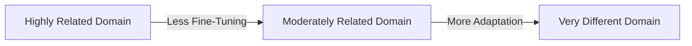

Generally:

```text
More Similar Domain
      ↓
More Reusable Features
      ↓
Less Fine-Tuning
```

---

# 🧠 Dataset Size and Fine-Tuning

Dataset size affects the strategy.

### Small Target Dataset

```text
Small Dataset
    ↓
Freeze Most Layers
    ↓
Train Head
```

---

### Medium Dataset

```text
Medium Dataset
    ↓
Train Head
    ↓
Fine-Tune Later Layers
```

---

### Large Dataset

```text
Large Dataset
    ↓
Fine-Tune More Layers
```

But dataset size alone should not determine the strategy. Domain similarity, label quality, model capacity, and training behavior also matter.

---

# 🧠 Transfer Learning Decision Matrix

| Target Dataset | Domain Similarity | Typical Strategy |
|---|---|---|
| Small | High | Feature Extraction |
| Small | Low | Careful Fine-Tuning |
| Medium | High | Head + Last Layers |
| Medium | Low | More Fine-Tuning |
| Large | High | Fine-Tune |
| Large | Low | Extensive Fine-Tuning / Domain Adaptation |

---

# 🧠 Classification Head Replacement

Suppose the pretrained model was trained for:

```text
1000 Classes
```

Your target problem has:

```text
10 Classes
```

The original classifier cannot directly be reused.

Replace:

```text
1000 Outputs
```

with:

```text
10 Outputs
```

---

# 🧠 Transfer Learning Architecture

```text
Pretrained Backbone
       │
       ▼
Feature Vector
       │
       ▼
New Dense Layer
       │
       ▼
10 Classes
```

---

# 🐍 Part I — Transfer Learning with Keras

## 🧪 Load a Pretrained ResNet

```python
import tensorflow as tf


base_model = tf.keras.applications.ResNet50(

    weights="imagenet",

    include_top=False,

    input_shape=(
        224,
        224,
        3
    )
)
```

Here:

```text
weights="imagenet"
```

loads pretrained weights.

And:

```text
include_top=False
```

removes the original classification head.

---

# 🧠 Freeze the Backbone

```python
base_model.trainable = False
```

Now only the new classification head will be trained.

---

# 🧪 Build the Classification Model

```python
inputs = tf.keras.Input(
    shape=(
        224,
        224,
        3
    )
)


x = base_model(
    inputs,
    training=False
)


x = tf.keras.layers.GlobalAveragePooling2D()(
    x
)


x = tf.keras.layers.Dropout(
    0.3
)(
    x
)


outputs = tf.keras.layers.Dense(
    10,
    activation="softmax"
)(
    x
)


model = tf.keras.Model(
    inputs,
    outputs
)
```

---

# 🧠 Keras Transfer Learning Architecture

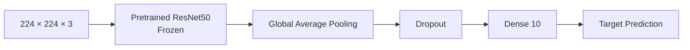

---

# 🧪 Compile the Model

```python
model.compile(

    optimizer=tf.keras.optimizers.Adam(
        learning_rate=1e-3
    ),

    loss="sparse_categorical_crossentropy",

    metrics=[
        "accuracy"
    ]
)
```

---

# 🧪 Train the Classification Head

```python
history = model.fit(

    train_dataset,

    validation_data=val_dataset,

    epochs=10
)
```

At this stage:

```text
Backbone → Frozen
Head     → Trainable
```

---

# 🧠 Fine-Tuning in Keras

After the classification head has converged, unfreeze selected layers.

```python
base_model.trainable = True
```

But do not immediately assume that every layer should be fine-tuned.

A common strategy is to freeze most layers and unfreeze only later layers.

---

# 🧪 Unfreeze the Last Layers

```python
for layer in base_model.layers[:-30]:

    layer.trainable = False


for layer in base_model.layers[-30:]:

    layer.trainable = True
```

Now:

```text
Early Layers
 ↓
Frozen

Last 30 Layers
 ↓
Trainable
```

---

# ⚠ Recompile After Changing Trainability

In Keras, after changing which layers are trainable, recompile the model before continuing training.

```python
model.compile(

    optimizer=tf.keras.optimizers.Adam(
        learning_rate=1e-5
    ),

    loss="sparse_categorical_crossentropy",

    metrics=[
        "accuracy"
    ]
)
```

Notice:

```text
Head Training LR
≈ 1e-3

Fine-Tuning LR
≈ 1e-5
```

The exact values should be tuned for the problem.

---

# 🧠 Keras Fine-Tuning Workflow

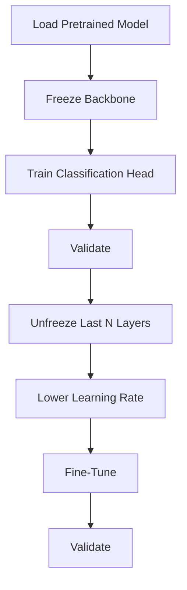

---

# ⚠ Batch Normalization During Fine-Tuning

Batch Normalization requires special attention.

A common Keras pattern is:

```python
x = base_model(
    inputs,
    training=False
)
```

even during fine-tuning when you want to keep BatchNorm behavior stable, especially for smaller target datasets.

This prevents Batch Normalization statistics from being updated as part of the forward pass.

The exact strategy depends on the model architecture and target dataset.

---

# 🐍 Part II — Transfer Learning with PyTorch

## 🧪 Load a Pretrained ResNet

```python
import torch
import torch.nn as nn

from torchvision import models


model = models.resnet50(
    weights=models.ResNet50_Weights.DEFAULT
)
```

---

# 🧠 Replace the Classifier

The pretrained ResNet has a classifier designed for its original dataset.

Replace it:

```python
num_features = model.fc.in_features


model.fc = nn.Linear(
    num_features,
    10
)
```

Now:

```text
Pretrained Backbone
        ↓
New 10-Class Classifier
```

---

# 🧠 Freeze Backbone in PyTorch

```python
for param in model.parameters():

    param.requires_grad = False
```

Then make the classifier trainable:

```python
for param in model.fc.parameters():

    param.requires_grad = True
```

---

# 🧪 PyTorch Feature Extraction

```python
device = torch.device(
    "cuda"
    if torch.cuda.is_available()
    else "cpu"
)


model = model.to(
    device
)
```

Only:

```text
model.fc
```

will receive gradient updates.

---

# 🧪 Optimizer for Feature Extraction

```python
optimizer = torch.optim.AdamW(

    model.fc.parameters(),

    lr=1e-3,

    weight_decay=1e-4
)
```

This is important:

> **Optimize only the parameters you intend to train.**

---

# 🧠 PyTorch Fine-Tuning

After the classifier has converged, selected backbone layers can be unfrozen.

For example:

```python
for param in model.layer4.parameters():

    param.requires_grad = True
```

Now:

```text
Layer 1
 ↓
Frozen

Layer 2
 ↓
Frozen

Layer 3
 ↓
Frozen

Layer 4
 ↓
Trainable

Classifier
 ↓
Trainable
```

---

# 🧪 Fine-Tuning Optimizer

```python
optimizer = torch.optim.AdamW(

    filter(
        lambda p: p.requires_grad,
        model.parameters()
    ),

    lr=1e-5,

    weight_decay=1e-4
)
```

This ensures that only trainable parameters are passed to the optimizer.

---

# 🧠 PyTorch Fine-Tuning Architecture

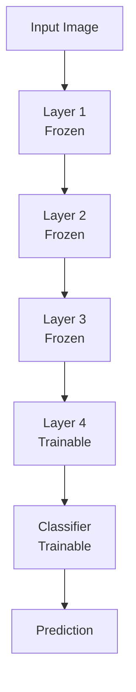

---

# 🧠 Feature Extraction Training

During feature extraction:

```text
Forward Pass
     ↓
Frozen Backbone
     ↓
Feature Vector
     ↓
Trainable Head
     ↓
Loss
     ↓
Gradient
     ↓
Head Update
```

The backbone parameters remain unchanged.

---

# 🧠 Fine-Tuning Training

During fine-tuning:

```text
Forward Pass
     ↓
Frozen + Trainable Backbone
     ↓
Feature Vector
     ↓
Classification Head
     ↓
Loss
     ↓
Backpropagation
     ↓
Selected Backbone + Head Updates
```

---

# 🧠 Transfer Learning Pipeline

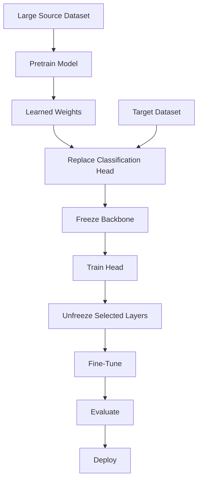

---

# 🧠 When Should You Use Feature Extraction?

Feature extraction is often a good starting point when:

```text
Target Dataset is Small
+
Target Domain is Similar
```

Example:

```text
Pretrained Natural Image Model
          ↓
Animal Classification
```

The pretrained visual features may already be highly useful.

---

# 🧠 When Should You Fine-Tune?

Fine-tuning becomes more attractive when:

```text
Target Dataset is Larger
OR
Target Domain is Different
OR
Feature Extraction Performance Plateaus
```

Example:

```text
Natural Image Pretraining
        ↓
Industrial Inspection
```

The later layers may need to adapt to domain-specific patterns.

---

# 🧠 Transfer Learning Decision Process

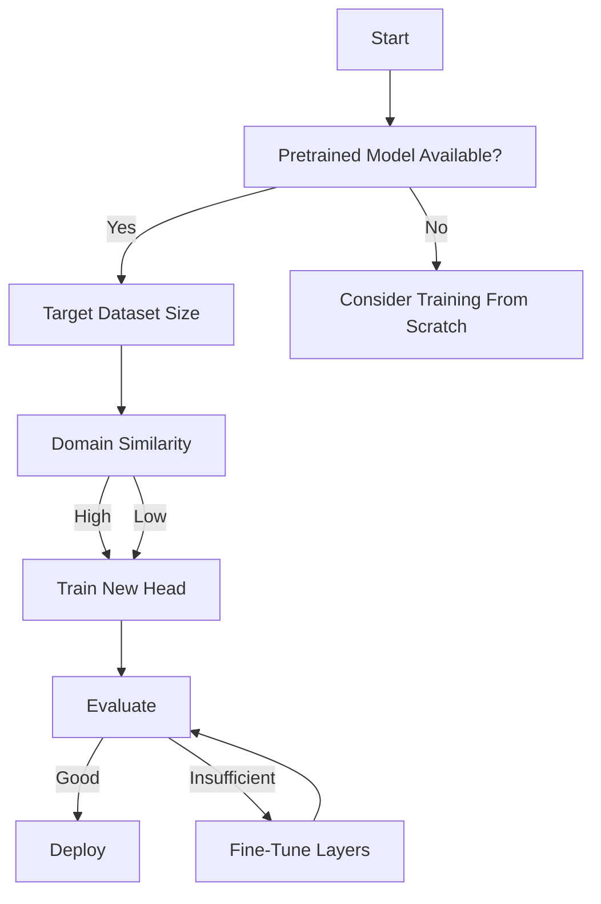

---

# 🧠 Transfer Learning Hyperparameters

Important hyperparameters include:

```text
Number of Frozen Layers
Number of Unfrozen Layers
Learning Rate
Batch Size
Weight Decay
Dropout
Augmentation
Optimizer
Training Epochs
```

---

# 🧠 Learning Rate Strategy

A common approach:

```text
Stage 1 — Train Head

LR = Higher

Stage 2 — Fine-Tune

LR = Lower
```

Example:

```text
Head:
1e-3

Fine-Tuning:
1e-5
```

These are examples, not universal defaults.

---

# 🧠 Discriminative Learning Rates

Different parts of the network can use different learning rates.

For example:

```text
Early Backbone
    ↓
1e-6

Later Backbone
    ↓
1e-5

Classification Head
    ↓
1e-3
```

This is called a discriminative learning-rate strategy.

The idea is:

> Earlier layers contain more general representations, while later layers often require greater adaptation.

---

# 🧠 Discriminative Learning Rates

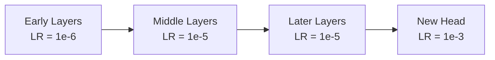

---

# 🧠 Transfer Learning and Data Augmentation

Fine-tuning can still overfit.

Therefore:

```text
Transfer Learning
+
Data Augmentation
+
Weight Decay
+
Early Stopping
```

can provide stronger generalization.

---

# 🧠 Input Preprocessing

Pretrained models usually expect a specific preprocessing strategy.

For example:

```text
Resize
+
Crop
+
Normalization
```

The target pipeline should be compatible with the pretrained model.

Using incorrect preprocessing can significantly reduce performance.

---

# 🧠 Preprocessing Pipeline

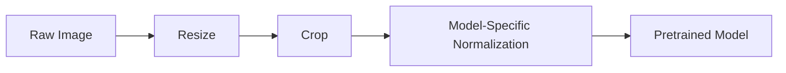

---

# ⚠ Common Transfer Learning Mistakes

## Mistake 1 — Using Incorrect Preprocessing

```text
Pretrained Model
      ↓
Expected Normalization
```

must match the preprocessing used by the model.

---

## Mistake 2 — Fine-Tuning Everything Immediately

```text
Pretrained Model
      ↓
Unfreeze All
      ↓
Large Learning Rate
```

can destroy pretrained representations.

---

## Mistake 3 — Using the Same Learning Rate

The new classification head and pretrained backbone often have different adaptation needs.

---

## Mistake 4 — Forgetting to Recompile in Keras

After changing trainability:

```python
layer.trainable = True
```

recompile before continuing training.

---

## Mistake 5 — Optimizing Frozen Parameters in PyTorch

Only parameters intended for training should normally be passed to the optimizer.

---

## Mistake 6 — Ignoring Batch Normalization

BatchNorm behavior can be particularly important when the target dataset is small.

---

## Mistake 7 — Over-Augmentation

Aggressive transformations may produce unrealistic examples and hurt learning.

---

## Mistake 8 — Comparing Against a Weak Baseline

Always establish:

```text
Baseline
   ↓
Feature Extraction
   ↓
Fine-Tuning
```

and compare the results.

---

# 🧠 Transfer Learning Evaluation

Evaluate both:

```text
Model Quality
```

and:

```text
Operational Performance
```

Model metrics:

```text
Accuracy
Precision
Recall
F1
Confusion Matrix
ROC-AUC
PR-AUC
```

Operational metrics:

```text
Inference Latency
Throughput
Memory
Model Size
GPU Utilization
Cost
```

---

# 🧠 Confusion Matrix Analysis

Transfer Learning can perform strongly overall while failing on particular classes.

Example:

```text
                 Predicted

             A     B     C

Actual A     90    5     5

Actual B      7   88     5

Actual C      3    8    89
```

Analyze:

```text
Which classes are confused?
Why?
Is the source model missing domain-specific features?
Does the dataset need more examples?
```

---

# 🧠 Transfer Learning Error Analysis

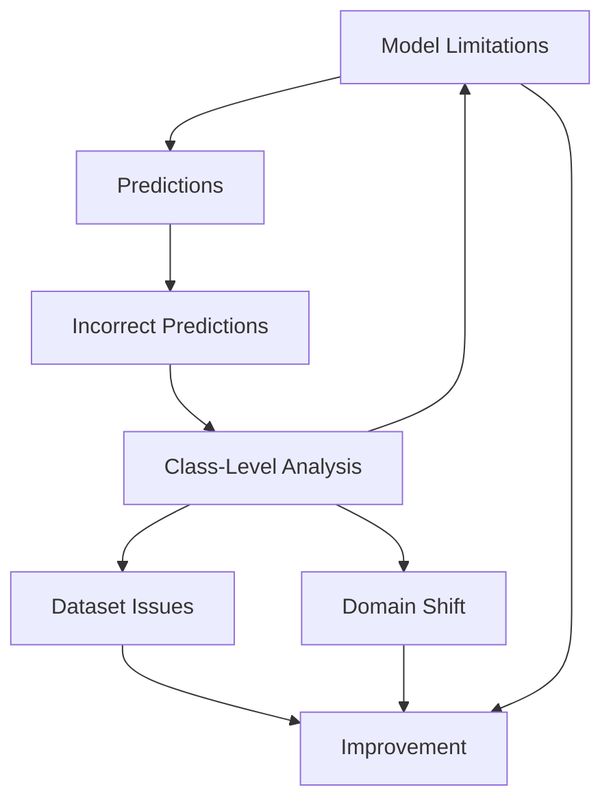

---

# 🧠 Transfer Learning vs Training From Scratch

Suppose:

```text
Target Dataset = 5,000 Images
```

Training from scratch:

```text
Random Weights
      ↓
Learn Everything
      ↓
High Data Requirement
```

Transfer Learning:

```text
Pretrained Weights
      ↓
Reuse Visual Features
      ↓
Adapt to Target Dataset
```

For many practical Computer Vision tasks, Transfer Learning is the stronger initial baseline.

---

# 🧪 Practical Exercise 1 — Feature Extraction

Use a pretrained ResNet.

```text
Freeze Backbone
+
Replace Classifier
+
Train Head
```

Record:

```text
Accuracy
Precision
Recall
F1
Training Time
```

---

# 🧪 Practical Exercise 2 — Fine-Tune Last Block

Start with the feature-extraction model.

Then:

```text
Unfreeze Last Block
+
Lower LR
+
Continue Training
```

Compare against feature extraction.

---

# 🧪 Practical Exercise 3 — Fine-Tune More Layers

Compare:

```text
Head Only
```

versus:

```text
Head + Last Block
```

versus:

```text
Head + Last Two Blocks
```

Record:

```text
Validation Accuracy
Validation Loss
Training Time
Inference Time
```

---

# 🧪 Practical Exercise 4 — Learning Rate Experiment

Compare:

```text
1e-4
1e-5
1e-6
```

for fine-tuning.

Analyze:

```text
Convergence
Stability
Final Validation Performance
```

---

# 🧪 Practical Exercise 5 — Freeze Depth Experiment

Compare:

```text
Freeze 100%
Freeze 75%
Freeze 50%
Freeze 25%
```

of the backbone.

Determine how much adaptation your target domain requires.

---

# 🧪 Practical Exercise 6 — Compare Architectures

Compare:

```text
ResNet
EfficientNet
MobileNet
```

Evaluate:

```text
Accuracy
Model Size
Latency
Training Time
Memory
```

---

# 🧪 Practical Exercise 7 — Transfer Learning With Small Dataset

Create a small target dataset.

Compare:

```text
Training From Scratch
```

against:

```text
Transfer Learning
```

Measure:

```text
Convergence Speed
Validation Accuracy
Generalization
```

---

# 🧪 Practical Exercise 8 — Domain Shift

Compare:

```text
Natural Image Dataset
```

with:

```text
Specialized Domain Dataset
```

Observe how fine-tuning requirements change.

---

# 🧪 Practical Exercise 9 — Data Augmentation

Compare:

```text
Transfer Learning
```

against:

```text
Transfer Learning + Augmentation
```

Analyze validation performance.

---

# 🧪 Practical Exercise 10 — Production Transfer Learning

Build:

```text
Dataset
 ↓
Preprocessing
 ↓
Pretrained Model
 ↓
Feature Extraction
 ↓
Fine-Tuning
 ↓
Evaluation
 ↓
Model Registry
 ↓
Inference Service
```

Track:

```text
Dataset Version
Model Version
Pretrained Checkpoint
Frozen Layers
Unfrozen Layers
Learning Rate
Optimizer
Metrics
Inference Latency
```

---

# 🧠 Interview Questions

## Beginner

### 1. What is Transfer Learning?

Transfer Learning reuses knowledge learned from one dataset or task to improve performance on another related task.

### 2. Why is Transfer Learning useful?

It can reduce data requirements, training time, compute requirements, and optimization difficulty.

### 3. What is a pretrained model?

A model whose parameters have already been learned from a previous training task.

### 4. What is feature extraction?

Using a pretrained model as a fixed feature extractor while training a new task-specific head.

### 5. What is fine-tuning?

Updating selected pretrained model parameters using the target dataset.

---

## Intermediate

### 6. Why freeze pretrained layers?

Freezing prevents their parameters from changing while the new classification head learns the target task.

### 7. Why use a lower learning rate during fine-tuning?

To make smaller updates to already useful pretrained representations.

### 8. Why replace the classification head?

The original classifier is usually designed for the source task and may have a different number of output classes.

### 9. When should you use feature extraction?

It is often a strong starting point when the target dataset is small and reasonably similar to the source domain.

### 10. When should you fine-tune?

When additional adaptation is required because of domain differences, sufficient target data, or feature-extraction performance limitations.

### 11. What is catastrophic forgetting?

It is the loss of useful previously learned representations when a pretrained model is updated too aggressively on a new task.

### 12. Why is preprocessing important?

Pretrained models were optimized with particular input distributions and preprocessing assumptions. Violating them can significantly reduce transfer performance.

---

## Advanced

### 13. Why are early CNN layers often easier to transfer?

They frequently learn relatively general visual primitives such as edges and textures.

### 14. Why are later layers more task-specific?

They combine lower-level features into increasingly semantic representations related to the source task.

### 15. How does domain similarity affect Transfer Learning?

Greater similarity generally increases the likelihood that pretrained representations will transfer effectively.

### 16. Why might fine-tuning hurt performance?

Possible causes include:

```text
Learning Rate Too High
Small Dataset
Overfitting
Incorrect Preprocessing
Aggressive Augmentation
BatchNorm Issues
Poor Layer Selection
```

### 17. How would you choose how many layers to unfreeze?

Start conservatively and progressively unfreeze later layers based on validation performance, domain similarity, dataset size, and observed underfitting.

### 18. What is discriminative learning rate?

It assigns different learning rates to different parts of the network, typically using smaller rates for earlier pretrained layers and larger rates for later layers or a new head.

### 19. Why might a pretrained model perform poorly on a new domain?

The learned representations may not adequately capture the visual characteristics of the target domain.

### 20. When might training from scratch be preferable?

Potential situations include:

```text
Very Different Domain
+
Large Target Dataset
+
Sufficient Compute
+
Specialized Architecture
```

---

# 🏢 Enterprise Perspective

Transfer Learning is particularly valuable in enterprise Computer Vision because organizations often have:

```text
Limited Labeled Data
+
High Training Costs
+
Specialized Business Domains
```

For example:

```text
General Pretrained Model
        ↓
Enterprise Product Images
        ↓
Fine-Tuned Model
        ↓
Product Classification
```

or:

```text
General Vision Model
        ↓
Industrial Images
        ↓
Defect Detection
```

---

# 🏢 Enterprise Transfer Learning Architecture

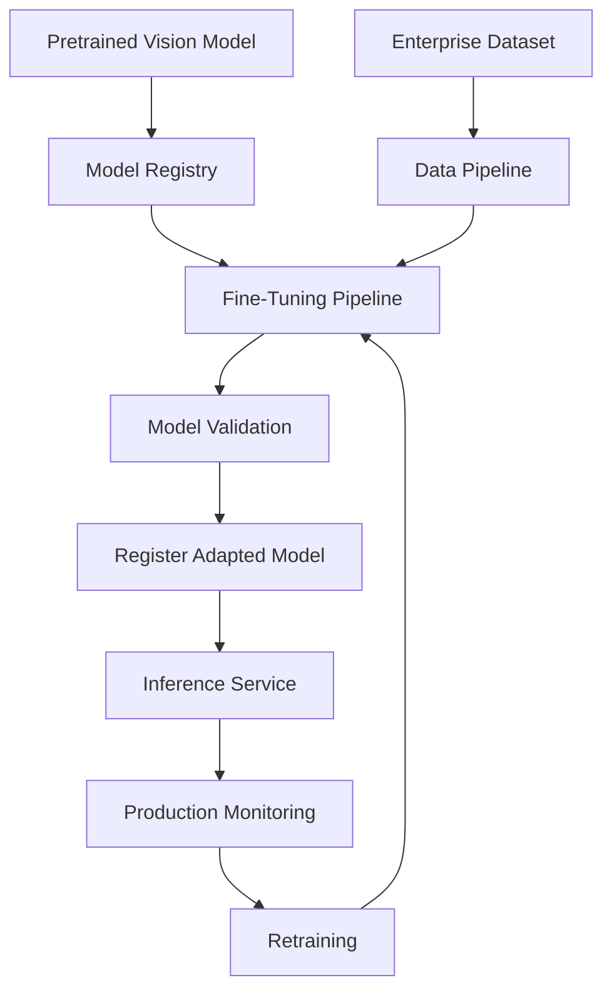

---

# 🏢 Enterprise Benefits

Transfer Learning can provide:

- Faster model development
- Lower compute costs
- Reduced training time
- Better performance with limited labeled data
- Easier experimentation
- Reusable model foundations
- Faster time-to-production

---

# 🏢 Enterprise Risks

However, organizations should also consider:

```text
License Restrictions
Model Provenance
Dataset Bias
Domain Shift
Security
Model Size
Inference Cost
Model Drift
```

Pretrained models should be evaluated for both technical suitability and organizational requirements.

---

# 🏢 Model Governance

A production Transfer Learning pipeline should record:

```text
Base Model
Base Model Version
Pretraining Dataset
Model License
Target Dataset
Target Dataset Version
Fine-Tuning Configuration
Training Code Version
Hyperparameters
Evaluation Metrics
Model Version
```

This creates reproducibility and auditability.

---

# 🏭 Production Transfer Learning Lifecycle

```mermaid
flowchart LR

    REQUIREMENTS["Business Requirements"]

    BASE["Select Base Model"]

    DATA["Prepare Target Data"]

    EXTRACT["Feature Extraction"]

    FINE["Fine-Tuning"]

    EVAL["Evaluation"]

    REGISTER["Model Registry"]

    DEPLOY["Deployment"]

    MONITOR["Monitoring"]

    RETRAIN["Retraining"]

    REQUIREMENTS --> BASE
    BASE --> DATA
    DATA --> EXTRACT
    EXTRACT --> FINE
    FINE --> EVAL
    EVAL --> REGISTER
    REGISTER --> DEPLOY
    DEPLOY --> MONITOR
    MONITOR --> RETRAIN
    RETRAIN --> FINE
```

---

!!! tip "Production Insight"

    **Transfer Learning is not simply loading a pretrained model.**

    Production-grade Transfer Learning requires a disciplined process:

    ```text
    Select Base Model
          ↓
    Verify License / Provenance
          ↓
    Validate Preprocessing
          ↓
    Establish Feature-Extraction Baseline
          ↓
    Fine-Tune Carefully
          ↓
    Evaluate by Class
          ↓
    Measure Latency and Cost
          ↓
    Register Model
          ↓
    Deploy
          ↓
    Monitor Drift and Performance
    ```

    The objective is not just higher accuracy. The adapted model must satisfy the target application's accuracy, latency, reliability, cost, and governance requirements.

---

# 📌 Key Takeaways

- Transfer Learning reuses knowledge learned from a pretrained model.
- It is particularly valuable when target datasets are limited.
- CNNs learn increasingly general-to-specific visual representations.
- Early layers often learn reusable low-level features.
- Later layers are generally more task-specific.
- Feature extraction freezes the pretrained backbone and trains a new head.
- Fine-tuning updates selected pretrained layers using target data.
- A new classification head is usually required for a different target task.
- Fine-tuning normally uses a smaller learning rate than head training.
- Progressive unfreezing can provide a safer fine-tuning strategy.
- Domain similarity strongly influences transfer effectiveness.
- Dataset size influences how aggressively a model can be fine-tuned.
- Incorrect preprocessing can severely reduce pretrained-model performance.
- Batch Normalization requires special attention during fine-tuning.
- Data augmentation remains useful during Transfer Learning.
- Keras requires recompilation after changing layer trainability.
- PyTorch optimizers should generally receive the parameters intended for training.
- Discriminative learning rates can provide more controlled adaptation.
- Fine-tuning can cause catastrophic forgetting when updates are too aggressive.
- Transfer Learning should be compared against a baseline rather than assumed to be optimal.
- Production Transfer Learning requires model governance, versioning, evaluation, monitoring, and reproducibility.
- Transfer Learning provides an important foundation for modern Computer Vision systems and pretrained Foundation Models.

---

# 📚 Further Reading

Continue with:

- **[22. ResNet, Residual Connections and TorchVision](22-resnet-residual-connections-and-torchvision.md)**
- **[23. Vision Transformers and CNN-ViT Hybrids](23-vision-transformers-and-cnn-vit-hybrids.md)**
- **[35. GPU-Accelerated Deep Learning](35-gpu-accelerated-deep-learning.md)**
- **[36. Deep Learning Training and Model Lifecycle](36-deep-learning-training-and-model-lifecycle.md)**
- **[37. Building Production Deep Learning Systems](37-building-production-deep-learning-systems.md)**

The next chapter explores **ResNet, residual connections, and TorchVision**, including why residual learning enabled much deeper CNN architectures and how pretrained ResNet models are used in modern Computer Vision systems.

---

## ➡️ Next Chapter

**[22. ResNet, Residual Connections and TorchVision](22-resnet-residual-connections-and-torchvision.md)**

---

> **Enterprise AI Engineering Handbook**  
> *Building Production-Grade Enterprise AI Systems — One Chapter at a Time.*