# 22. ResNet, Residual Connections and TorchVision

> Understand why very deep neural networks become difficult to optimize, how Residual Networks (ResNet) solve this problem using skip connections, how residual blocks work, and how pretrained ResNet models are implemented and adapted using TorchVision and PyTorch.

---

## 🎯 Learning Objectives

After completing this chapter, you will be able to:

- Understand the limitations of simply making CNNs deeper
- Explain the degradation problem in very deep networks
- Understand residual learning
- Explain skip connections
- Understand the mathematical formulation of a residual block
- Understand identity mappings
- Understand projection shortcuts
- Explain BasicBlock and Bottleneck architectures
- Understand ResNet-18, ResNet-34, ResNet-50, ResNet-101, and ResNet-152
- Compare ResNet architectures
- Understand why ResNet enabled much deeper CNNs
- Use pretrained ResNet models with TorchVision
- Replace the ResNet classification head
- Freeze and unfreeze ResNet layers
- Fine-tune ResNet for custom Computer Vision tasks
- Understand ResNet tensor shapes
- Understand Batch Normalization inside ResNet
- Understand the role of ReLU in residual blocks
- Build a custom residual block using PyTorch
- Use ResNet for feature extraction
- Use ResNet as a Transfer Learning backbone
- Understand ResNet training and optimization
- Analyze common ResNet mistakes
- Evaluate ResNet models for production workloads
- Understand the relationship between ResNet and modern CNN architectures

---

# 📖 Overview

As CNNs became deeper, researchers expected additional layers to provide greater representational power.

However, simply adding more layers did not always improve performance.

A deeper network could suffer from:

```text
Optimization Difficulty
+
Vanishing / Exploding Gradients
+
Degradation
+
Training Instability
```

Residual Networks introduced a simple but powerful idea:

> **Instead of forcing a layer stack to learn an entire transformation, allow it to learn a residual function relative to its input.**

This is implemented using:

```text
Skip Connection
```

The resulting architecture is known as:

> **Residual Network — ResNet**

---

# 🧠 Why Do We Need ResNet?

Consider:

```text
Shallow CNN
    ↓
Good Performance
```

Adding layers should theoretically allow:

```text
Deeper CNN
    ↓
Equal or Better Performance
```

But in practice, very deep plain networks can become harder to optimize.

This creates the:

```text
Degradation Problem
```

---

# ⚠ The Degradation Problem

The degradation problem does not simply mean overfitting.

A deeper plain network may have:

```text
Higher Training Error
```

even though it has:

```text
More Parameters
```

This indicates an optimization problem.

---

# 🧠 Plain CNN vs ResNet

### Plain CNN

```text
Input
  ↓
Conv
  ↓
ReLU
  ↓
Conv
  ↓
ReLU
  ↓
Conv
  ↓
ReLU
  ↓
Output
```

Every layer must learn the transformation required to produce the next representation.

---

### ResNet

```text
             ┌─────────────────────┐
             │                     │
Input ────────┼──────► Addition ────┼──► Output
 │            │          ▲         │
 │            │          │         │
 └──► Conv ─► ReLU ─► Conv ───────┘
```

The original input can bypass the convolutional layers.

---

# 🧠 Residual Learning

Instead of directly learning:

\[
H(x)
\]

the residual block learns:

\[
F(x)=H(x)-x
\]

Therefore:

\[
H(x)=F(x)+x
\]


where:

```text
H(x) = Desired Mapping
F(x) = Residual Mapping
x    = Input
```

The network learns:

```text
Residual Transformation
+
Original Input
```

---

# 🧠 Core ResNet Idea

```text
Input x
   │
   ├────────────────────────┐
   │                        │
   ▼                        │
Residual Function F(x)      │
   │                        │
   ▼                        │
   └──────────► Add ◄───────┘
                  │
                  ▼
               H(x)
```

This simple addition is the foundation of ResNet.

---

# 🧠 Residual Block

A basic residual block can be represented as:

```text
Input
  │
  ├─────────────────────┐
  │                     │
  ▼                     │
Conv                    │
  ↓                     │
BatchNorm               │
  ↓                     │
ReLU                    │
  ↓                     │
Conv                    │
  ↓                     │
BatchNorm               │
  │                     │
  └──────────► Add ◄────┘
                 │
                 ▼
                ReLU
                 │
                 ▼
              Output
```

---

# 🧠 Residual Block Architecture

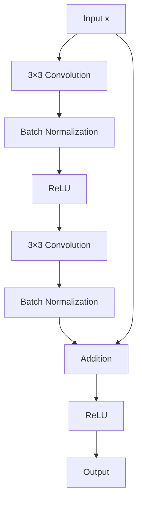

---

# 🧠 Skip Connection

The skip connection is the path that bypasses the residual transformation.

```text
Input
  │
  ├───────────────────────┐
  │                       │
  ▼                       │
Conv → BN → ReLU → Conv → BN
                          │
                          ▼
                       Addition
                          ▲
                          │
                    Skip Connection
```

The skip connection is sometimes called:

```text
Shortcut Connection
Identity Connection
Residual Connection
```

---

# 🧠 Why Does the Skip Connection Help?

The shortcut provides a direct path for information and gradients.

Without a shortcut:

```text
Input
 ↓
Layer
 ↓
Layer
 ↓
Layer
 ↓
Layer
 ↓
Output
```

With a shortcut:

```text
Input
 │
 ├──────────────────────────┐
 │                          │
 ▼                          ▼
Layers ───────────────────► Add
                              │
                              ▼
                           Output
```

This makes optimization easier for very deep networks.

---

# 🧠 Identity Mapping

When input and output dimensions are identical, the shortcut can simply be:

\[
S(x)=x
\]


Then:

\[
y=F(x)+x
\]


This is called an:

```text
Identity Shortcut
```

---

# 🧠 Projection Shortcut

Sometimes the residual branch changes:

```text
Height
Width
Channels
```

The original input can no longer be added directly.

For example:

```text
Input:
56 × 56 × 64

Residual Output:
28 × 28 × 128
```

The dimensions do not match.

A projection shortcut can solve this.

```text
Input
  │
  ▼
1 × 1 Convolution
  │
  ▼
28 × 28 × 128
```

---

# 🧠 Projection Shortcut

The shortcut can be represented as:

\[
S(x)=W_s*x
\]


Then:

\[
y=F(x)+S(x)
\]


---

# 🧠 Identity vs Projection Shortcut

| Identity Shortcut | Projection Shortcut |
|---|---|
| `S(x) = x` | `S(x) = W_s * x` |
| No learned parameters | Learnable parameters |
| Dimensions already match | Dimensions need transformation |
| Very efficient | Adds computation |
| Common inside same-resolution blocks | Used when changing dimensions |

---

# 🧠 Residual Block with Projection

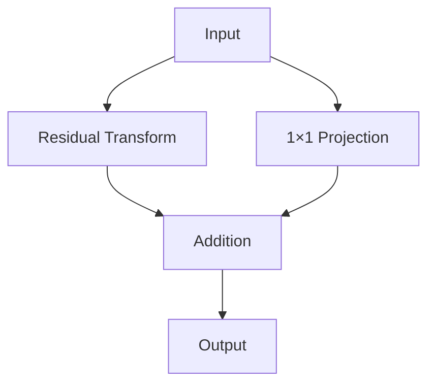

---

# 🧠 Downsampling in ResNet

ResNet stages commonly reduce spatial resolution.

For example:

```text
56 × 56
    ↓
28 × 28
    ↓
14 × 14
    ↓
7 × 7
```

At the same time, channels usually increase:

```text
64
 ↓
128
 ↓
256
 ↓
512
```

When this happens, the shortcut path must also transform the dimensions.

---

# 🧠 ResNet Stage Pattern

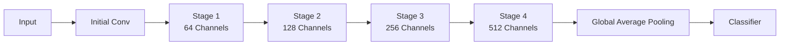

---

# 🧠 ResNet Architecture

A simplified ResNet architecture:

```text
Input
  ↓
7 × 7 Conv
  ↓
BatchNorm
  ↓
ReLU
  ↓
MaxPool
  ↓
Residual Stage 1
  ↓
Residual Stage 2
  ↓
Residual Stage 3
  ↓
Residual Stage 4
  ↓
Global Average Pooling
  ↓
Fully Connected Layer
  ↓
Output
```

---

# 🧠 ResNet Architecture Landscape

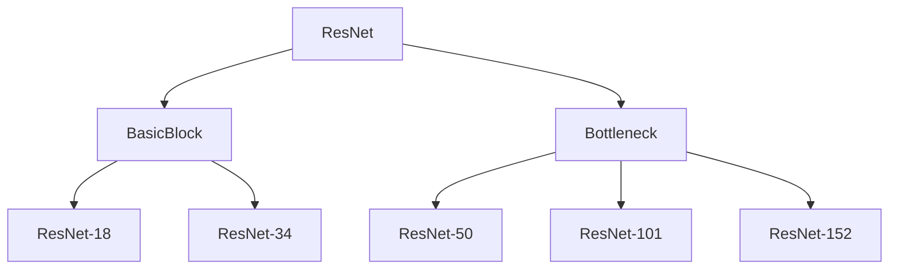

---

# 🧠 ResNet-18

ResNet-18 uses the simpler:

```text
BasicBlock
```

architecture.

A simplified stage configuration is:

```text
64
 ↓
128
 ↓
256
 ↓
512
```

with residual blocks distributed across these stages.

ResNet-18 is relatively lightweight and is often useful when inference cost matters.

---

# 🧠 ResNet-34

ResNet-34 also uses:

```text
BasicBlock
```

but contains more residual blocks than ResNet-18.

Conceptually:

```text
ResNet-18
 ↓
More Residual Blocks
 ↓
ResNet-34
```

This increases representational capacity and computation.

---

# 🧠 BasicBlock

A simplified BasicBlock contains:

```text
3 × 3 Conv
 ↓
BatchNorm
 ↓
ReLU
 ↓
3 × 3 Conv
 ↓
BatchNorm
 ↓
Addition
 ↓
ReLU
```

---

# 🧠 BasicBlock Diagram

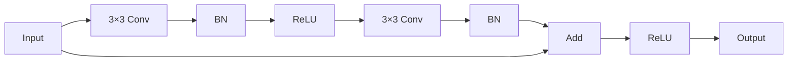

---

# 🧠 Bottleneck Block

Deeper ResNet variants such as:

```text
ResNet-50
ResNet-101
ResNet-152
```

use:

```text
Bottleneck Blocks
```

A bottleneck block uses:

```text
1 × 1 Conv
 ↓
3 × 3 Conv
 ↓
1 × 1 Conv
```

---

# 🧠 Bottleneck Architecture

```text
Input
  │
  ▼
1 × 1 Conv
  │
  ▼
3 × 3 Conv
  │
  ▼
1 × 1 Conv
  │
  ▼
Addition
  ▲
  │
Shortcut
```

The first `1 × 1` convolution reduces or transforms channel dimensions, while the final `1 × 1` convolution expands them.

---

# 🧠 Bottleneck Block Diagram

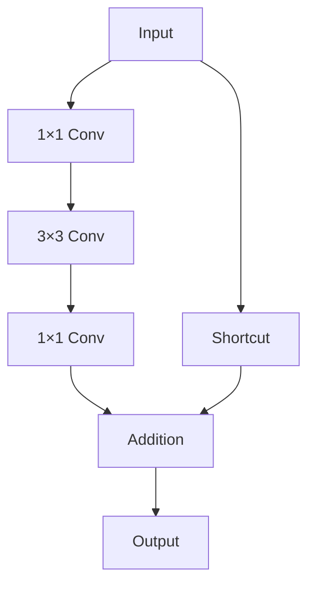

---

# 🧠 Why Use Bottleneck Blocks?

A bottleneck block allows deeper networks to increase depth without making every convolution operate at the highest channel dimension.

Conceptually:

```text
High-Dimensional Input
        ↓
1×1 Reduction
        ↓
3×3 Processing
        ↓
1×1 Expansion
        ↓
Output
```

This improves computational efficiency compared with simply stacking wide `3 × 3` convolutions.

---

# 🧠 BasicBlock vs Bottleneck

| BasicBlock | Bottleneck |
|---|---|
| `3×3 → 3×3` | `1×1 → 3×3 → 1×1` |
| Used by ResNet-18 | Used by ResNet-50 |
| Used by ResNet-34 | Used by ResNet-101 |
| Simpler | More compute-efficient for deeper models |
| Suitable for shallower ResNets | Suitable for deeper ResNets |

---

# 🧠 ResNet Model Comparison

| Model | Main Block | Relative Depth | Relative Compute |
|---|---|---:|---|
| ResNet-18 | BasicBlock | Low | Low |
| ResNet-34 | BasicBlock | Medium | Medium |
| ResNet-50 | Bottleneck | Higher | Higher |
| ResNet-101 | Bottleneck | Very High | High |
| ResNet-152 | Bottleneck | Extremely High | Very High |

The exact parameter counts and FLOPs depend on implementation and input resolution.

---

# 🧠 ResNet-18 vs ResNet-50

```text
ResNet-18

BasicBlock
3×3
 ↓
3×3
```

versus:

```text
ResNet-50

Bottleneck
1×1
 ↓
3×3
 ↓
1×1
```

The architecture is not simply:

```text
"ResNet-50 = ResNet-18 but deeper"
```

The block design also changes.

---

# 🧠 Why Residual Learning Helps

Suppose the desired mapping is:

\[
H(x)
\]

A plain network must directly approximate:

\[
H(x)
\]

A residual network learns:

\[
F(x)=H(x)-x
\]

and then:

\[
H(x)=F(x)+x
\]


If the desired transformation is close to identity:

```text
H(x) ≈ x
```

then:

```text
F(x) ≈ 0
```

The residual branch only needs to learn a small modification.

This can make optimization easier.

---

# 🧠 Gradient Flow

During backpropagation, the shortcut provides a direct computational path.

Conceptually:

```text
Forward:

Input
 │
 ├──────────────► Shortcut ────────┐
 │                                 │
 ▼                                 ▼
Residual Layers ────────────────► Add
                                   │
                                   ▼
                                 Output
```

and:

```text
Backward:

Gradient
   │
   ├──────────────► Shortcut
   │
   ▼
Residual Layers
```

This helps gradients propagate through deep networks.

---

# 🧠 ResNet and Vanishing Gradients

Very deep plain networks can suffer from gradient degradation.

Residual connections provide a direct path:

```text
Deep Network

Layer
 ↓
Layer
 ↓
Layer
 ↓
Layer
 ↓
Layer
```

versus:

```text
Residual Network

Layer ──────────────┐
 ↓                  │
Layer ──────────────┤
 ↓                  │
Layer ──────────────┤
 ↓                  │
Add ◄───────────────┘
```

This architectural shortcut contributes to more stable optimization of deep networks.

---

# 🧠 ResNet as a Feature Extractor

A pretrained ResNet can be used without its classifier:

```text
Image
 ↓
ResNet Backbone
 ↓
Feature Representation
```

This representation can then feed:

```text
Classification
Detection
Segmentation
Similarity Search
Retrieval
Clustering
```

---

# 🧠 ResNet Transfer Learning

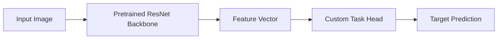

---

# 🐍 Part I — TorchVision

TorchVision provides pretrained Computer Vision models and utilities for PyTorch.

A typical workflow is:

```text
TorchVision
   ↓
Pretrained Model
   ↓
Modify Classifier
   ↓
Freeze / Fine-Tune
   ↓
Train
```

---

# 🧪 Load Pretrained ResNet-18

```python
import torch
import torch.nn as nn

from torchvision import models


model = models.resnet18(
    weights=models.ResNet18_Weights.DEFAULT
)
```

The exact weight enum depends on the TorchVision version.

---

# 🧠 Inspect the Model

```python
print(model)
```

You will see major components such as:

```text
conv1
bn1
relu
maxpool
layer1
layer2
layer3
layer4
avgpool
fc
```

These correspond to the major stages of ResNet.

---

# 🧠 ResNet Components

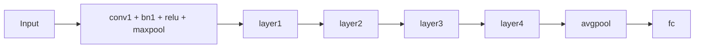

---

# 🧪 Replace the Classification Head

Suppose the target task contains:

```text
5 Classes
```

Replace:

```python
num_features = model.fc.in_features


model.fc = nn.Linear(
    num_features,
    5
)
```

---

# 🧠 Freeze the Backbone

```python
for param in model.parameters():

    param.requires_grad = False
```

Then:

```python
for param in model.fc.parameters():

    param.requires_grad = True
```

Now:

```text
ResNet Backbone
      ↓
Frozen

Classification Head
      ↓
Trainable
```

---

# 🧪 Optimizer

```python
optimizer = torch.optim.AdamW(

    model.fc.parameters(),

    lr=1e-3,

    weight_decay=1e-4
)
```

This ensures the optimizer updates the classification head only.

---

# 🧠 Fine-Tune ResNet Layer 4

After the classification head converges:

```python
for param in model.layer4.parameters():

    param.requires_grad = True
```

Now the optimizer can include the trainable parameters:

```python
optimizer = torch.optim.AdamW(

    filter(
        lambda p: p.requires_grad,
        model.parameters()
    ),

    lr=1e-5,

    weight_decay=1e-4
)
```

---

# 🧠 ResNet Fine-Tuning Strategy

```text
Stage 1

Backbone
 ↓
Frozen

Head
 ↓
Trainable


Stage 2

layer4
 ↓
Trainable

Head
 ↓
Trainable


Stage 3

More Backbone Layers
 ↓
Optional Fine-Tuning
```

---

# 🧠 Why Fine-Tune Layer 4 First?

Later ResNet layers generally contain more task-specific representations than early layers.

Therefore:

```text
Early Layers
 ↓
General Features
```

while:

```text
Later Layers
 ↓
More Task-Specific Features
```

Unfreezing later layers first provides a controlled way to adapt the model.

---

# 🧪 TorchVision Preprocessing

TorchVision pretrained weights often provide an associated preprocessing configuration.

For example:

```python
weights = models.ResNet50_Weights.DEFAULT

preprocess = weights.transforms()
```

Then:

```python
image_tensor = preprocess(
    image
)
```

This helps ensure that the input follows the preprocessing expectations of the pretrained weights.

---

# 🧠 Why Preprocessing Matters

A pretrained model expects a particular input distribution.

Incorrect:

```text
Resize
Normalization
Channel Order
Scaling
```

can reduce model performance.

Therefore:

> **The preprocessing pipeline is part of the model contract.**

---

# 🧠 ResNet Input Pipeline

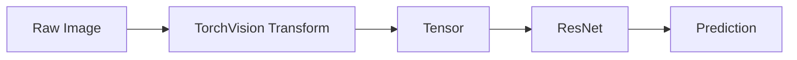

---

# 🧠 ResNet Tensor Shapes

For a typical ResNet with input:

```text
224 × 224 × 3
```

the internal representation approximately follows:

```text
224 × 224
     ↓
112 × 112
     ↓
56 × 56
     ↓
28 × 28
     ↓
14 × 14
     ↓
7 × 7
     ↓
1 × 1
```

while channels generally increase:

```text
64
 ↓
64
 ↓
128
 ↓
256
 ↓
512
```

---

# 🧠 ResNet Shape Flow

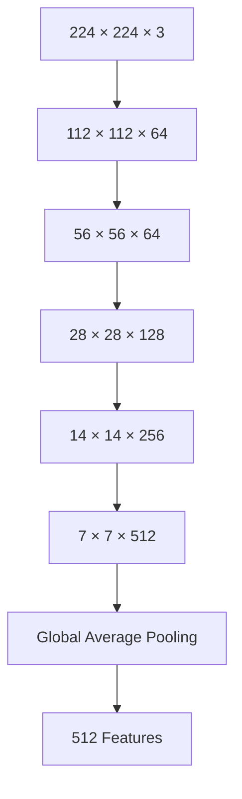

The exact tensor shapes can vary with architecture and implementation details.

---

# 🧠 Global Average Pooling in ResNet

Before the final classifier, ResNet uses global average pooling.

Conceptually:

```text
7 × 7 × 512
      ↓
1 × 1 × 512
      ↓
512
```

This creates one feature value per channel.

---

# 🧠 ResNet Classification

```text
Feature Maps
      ↓
Global Average Pooling
      ↓
Feature Vector
      ↓
Fully Connected Layer
      ↓
Class Logits
```

---

# 🧠 Logits vs Probabilities

ResNet's final `fc` layer produces logits.

For example:

```text
[-1.2, 2.7, 0.4, ...]
```

During training with:

```python
nn.CrossEntropyLoss()
```

you normally provide the raw logits.

Do not apply `softmax` before `CrossEntropyLoss`.

---

# 🧪 PyTorch Classification Setup

```python
criterion = nn.CrossEntropyLoss()


optimizer = torch.optim.AdamW(

    filter(
        lambda p: p.requires_grad,
        model.parameters()
    ),

    lr=1e-3,

    weight_decay=1e-4
)
```

---

# 🧠 ResNet Training Loop

```python
for epoch in range(
    epochs
):

    model.train()

    for images, labels in train_loader:

        images = images.to(
            device
        )

        labels = labels.to(
            device
        )

        optimizer.zero_grad()

        logits = model(
            images
        )

        loss = criterion(
            logits,
            labels
        )

        loss.backward()

        optimizer.step()
```

---

# 🧠 ResNet Validation

```python
model.eval()

correct = 0
total = 0

with torch.no_grad():

    for images, labels in val_loader:

        images = images.to(
            device
        )

        labels = labels.to(
            device
        )

        logits = model(
            images
        )

        predictions = logits.argmax(
            dim=1
        )

        correct += (
            predictions == labels
        ).sum().item()

        total += labels.size(0)

accuracy = correct / total
```

---

# 🧠 Custom Residual Block

Understanding the residual block is more important than simply knowing how to call `resnet50()`.

```python
class ResidualBlock(
    nn.Module
):

    def __init__(
        self,
        in_channels,
        out_channels,
        stride=1
    ):

        super().__init__()

        self.conv1 = nn.Conv2d(
            in_channels,
            out_channels,
            kernel_size=3,
            stride=stride,
            padding=1,
            bias=False
        )

        self.bn1 = nn.BatchNorm2d(
            out_channels
        )

        self.relu = nn.ReLU(
            inplace=True
        )

        self.conv2 = nn.Conv2d(
            out_channels,
            out_channels,
            kernel_size=3,
            padding=1,
            bias=False
        )

        self.bn2 = nn.BatchNorm2d(
            out_channels
        )

        if (
            stride != 1
            or in_channels != out_channels
        ):

            self.shortcut = nn.Sequential(

                nn.Conv2d(
                    in_channels,
                    out_channels,
                    kernel_size=1,
                    stride=stride,
                    bias=False
                ),

                nn.BatchNorm2d(
                    out_channels
                )
            )

        else:

            self.shortcut = nn.Identity()

    def forward(
        self,
        x
    ):

        identity = self.shortcut(
            x
        )

        out = self.conv1(
            x
        )

        out = self.bn1(
            out
        )

        out = self.relu(
            out
        )

        out = self.conv2(
            out
        )

        out = self.bn2(
            out
        )

        out += identity

        out = self.relu(
            out
        )

        return out
```

---

# 🧠 Custom Residual Block Flow

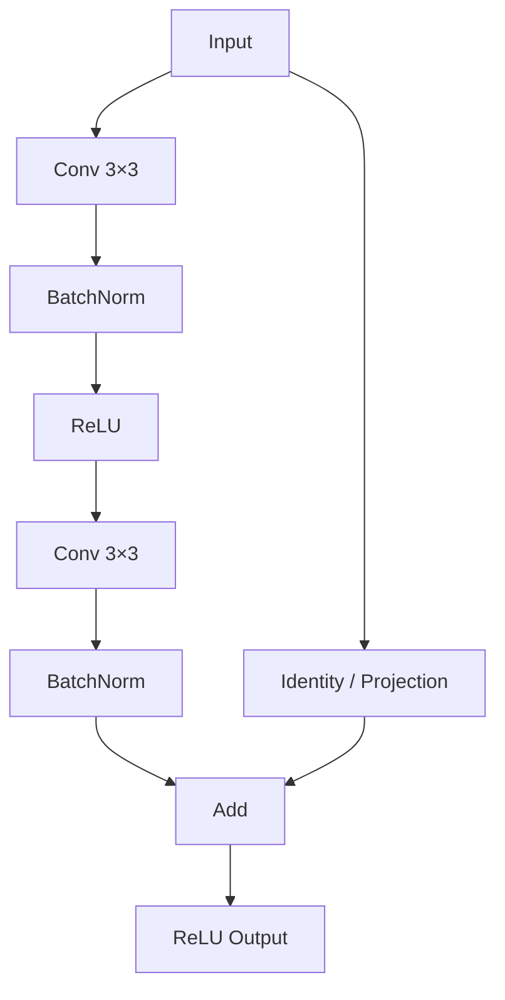

---

# 🧠 Identity Shortcut in Code

When dimensions match:

```python
self.shortcut = nn.Identity()
```

This means:

```text
Shortcut(x) = x
```

No parameters are introduced.

---

# 🧠 Projection Shortcut in Code

When dimensions differ:

```python
nn.Conv2d(
    in_channels,
    out_channels,
    kernel_size=1,
    stride=stride
)
```

This performs:

```text
Channel Transformation
+
Optional Downsampling
```

---

# 🧠 ResNet Block Invariants

For residual addition:

```text
Main Branch Shape
=
Shortcut Shape
```

must hold.

For example:

```text
Main:
28 × 28 × 128

Shortcut:
28 × 28 × 128

Addition:
Valid
```

But:

```text
Main:
28 × 28 × 128

Shortcut:
56 × 56 × 64

Addition:
Invalid
```

This is one of the most important implementation rules for residual networks.

---

# 🧠 Residual Addition

The addition operation is element-wise:

\[
y_i=F(x)_i+x_i
\]


Both tensors must have compatible shapes.

---

# 🧠 ResNet and Transfer Learning

ResNet became one of the most widely used pretrained CNN backbones.

Typical workflow:

```text
Pretrained ResNet
       ↓
Remove Original Classifier
       ↓
Add Custom Head
       ↓
Freeze Backbone
       ↓
Train Head
       ↓
Unfreeze Selected Layers
       ↓
Fine-Tune
```

---

# 🧠 ResNet Transfer Learning Lifecycle

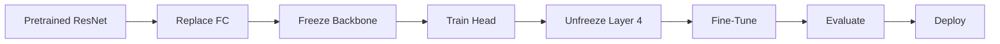

---

# 🧠 ResNet vs Plain CNN

| Plain CNN | ResNet |
|---|---|
| Sequential transformations | Residual transformations |
| No shortcut by default | Skip connections |
| Deep networks harder to optimize | Deep networks easier to optimize |
| More susceptible to degradation | Residual learning addresses degradation |
| Simple architecture | More sophisticated architecture |

---

# 🧠 ResNet Advantages

ResNet provides:

- Better optimization of deep networks
- Effective gradient flow
- Strong feature representations
- Reusable pretrained models
- Strong Computer Vision baseline
- Good Transfer Learning performance
- Multiple depth variants
- Mature ecosystem support

---

# ⚠ ResNet Limitations

ResNet is not always the optimal architecture.

Potential limitations include:

- Higher computation than lightweight CNNs
- Larger memory requirements
- Higher inference latency
- More expensive deployment
- Possible overkill for simple tasks
- Newer architectures may provide better efficiency
- CNN inductive biases may be limiting for some global-context tasks

For constrained environments, architectures such as:

```text
MobileNet
EfficientNet
EfficientNet-Lite
```

may be more appropriate.

---

# 🧠 ResNet vs Lightweight Models

| ResNet | Lightweight CNN |
|---|---|
| Strong general-purpose backbone | Optimized for constrained environments |
| More computation | Lower computation |
| Larger model | Smaller model |
| Strong accuracy baseline | Strong efficiency |
| Useful for server-side inference | Useful for edge/mobile |

The correct choice depends on:

```text
Accuracy
Latency
Memory
Hardware
Cost
```

---

# 🧠 ResNet and Vision Transformers

ResNet represents a major CNN milestone.

The Computer Vision architecture landscape later expanded toward:

```text
CNN
 ↓
ResNet
 ↓
Efficient CNNs
 ↓
Vision Transformers
 ↓
Hybrid CNN + ViT
```

Vision Transformers are covered in:

**[23. Vision Transformers and CNN-ViT Hybrids](23-vision-transformers-and-cnn-vit-hybrids.md)**.

---

# 🧠 ResNet Architecture Landscape

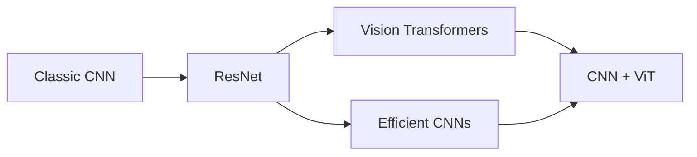

---

# 🧠 ResNet as a General Vision Backbone

ResNet can provide feature representations for:

```text
Image Classification
Object Detection
Semantic Segmentation
Instance Segmentation
Image Retrieval
Visual Similarity
Metric Learning
Anomaly Detection
```

---

# 🧠 ResNet in Object Detection

A simplified detection architecture may use:

```text
Image
 ↓
ResNet Backbone
 ↓
Feature Maps
 ↓
Detection Head
 ↓
Bounding Boxes
+
Class Predictions
```

The backbone learns reusable visual representations.

---

# 🧠 ResNet in Segmentation

For segmentation:

```text
Image
 ↓
CNN Backbone
 ↓
Feature Maps
 ↓
Decoder
 ↓
Pixel-Level Predictions
```

ResNet can act as the encoder/backbone.

---

# 🧠 ResNet Feature Extraction

A pretrained ResNet can generate embeddings:

```text
Image
 ↓
ResNet
 ↓
Global Average Pooling
 ↓
Feature Vector
```

These vectors can be used for:

```text
Similarity Search
Image Retrieval
Clustering
Duplicate Detection
Recommendation
```

---

# 🧪 Extract Features with PyTorch

```python
import torch


model.eval()


with torch.no_grad():

    features = model.avgpool(
        model.layer4(
            model.layer3(
                model.layer2(
                    model.layer1(
                        model.maxpool(
                            model.relu(
                                model.bn1(
                                    model.conv1(
                                        images
                                    )
                                )
                            )
                        )
                    )
                )
            )
        )
    )


features = torch.flatten(
    features,
    1
)
```

In production, prefer a dedicated feature-extractor interface rather than depending on deeply nested internal calls that may vary between architectures.

---

# 🧠 Better Feature Extractor Design

A cleaner approach is to define a model that explicitly exposes the representation:

```python
class ResNetFeatureExtractor(
    nn.Module
):

    def __init__(
        self,
        backbone
    ):

        super().__init__()

        self.backbone = backbone

        self.backbone.fc = nn.Identity()

    def forward(
        self,
        x
    ):

        return self.backbone(
            x
        )
```

Now:

```python
features = extractor(
    images
)
```

This is easier to integrate into production systems.

---

# 🧠 Production ResNet Architecture

A production system might look like:

```text
Client
  ↓
API Gateway
  ↓
Inference Service
  ↓
Image Preprocessing
  ↓
ResNet Model
  ↓
Prediction
  ↓
Business Service
```

---

# 🏢 Enterprise ResNet Architecture

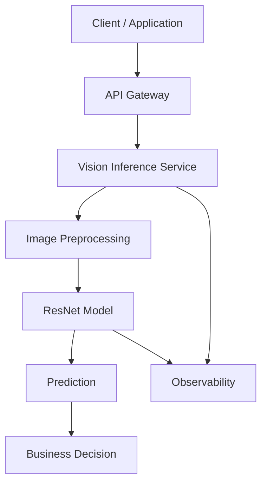

---

# 🏢 Production ResNet Considerations

Important concerns include:

### Model

```text
Accuracy
Model Size
Architecture
Input Resolution
```

### Inference

```text
Latency
Throughput
Batch Size
Concurrency
```

### Infrastructure

```text
CPU
GPU
Memory
Autoscaling
```

### Operations

```text
Logging
Metrics
Tracing
Model Versioning
Monitoring
Rollback
```

---

# 🧠 ResNet Model Optimization

Possible techniques include:

```text
Input Resolution Reduction
Quantization
Pruning
Knowledge Distillation
Batching
GPU Acceleration
Mixed Precision
Model Compilation
```

These techniques should be evaluated against the required accuracy.

---

# 🧠 Accuracy vs Latency Trade-Off

```text
Higher Accuracy
      ↑
      │
      │       Large ResNet
      │
      │
      │   Medium ResNet
      │
      │ Lightweight Model
      └────────────────────→
              Latency
```

The optimal model depends on the application.

For:

```text
Offline Batch Processing
```

higher compute may be acceptable.

For:

```text
Real-Time Edge Inference
```

latency and memory may dominate.

---

# 🧠 ResNet Monitoring

A production ResNet system should monitor:

```text
Inference Latency
Throughput
Error Rate
Prediction Distribution
Input Quality
Data Drift
Model Accuracy
Class Distribution
GPU Utilization
Memory Usage
```

---

# 🧠 Model Drift

A deployed ResNet can degrade if production images differ from training data.

Examples:

```text
New Camera
Different Lighting
Different Product
New Background
Seasonal Variation
Resolution Change
New Customer Segment
```

This creates:

```text
Training Distribution
        ≠
Production Distribution
```

---

# 🧠 ResNet Retraining

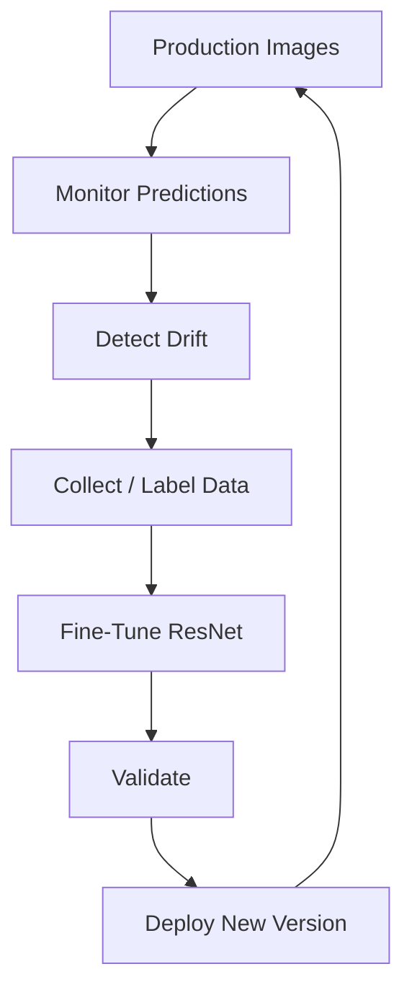

---

# 🧪 Practical Exercise 1 — Load ResNet-18

Use TorchVision:

```python
model = models.resnet18(
    weights=models.ResNet18_Weights.DEFAULT
)
```

Inspect:

```text
Architecture
Parameter Count
Input Shape
Output Shape
```

---

# 🧪 Practical Exercise 2 — Replace the Classifier

Adapt ResNet-18 for:

```text
5 Classes
```

Replace:

```python
model.fc
```

and verify:

```text
Output Shape = 5
```

---

# 🧪 Practical Exercise 3 — Feature Extraction

Freeze:

```text
Entire Backbone
```

Train:

```text
Classification Head
```

Compare training time and validation performance.

---

# 🧪 Practical Exercise 4 — Fine-Tune Layer 4

Unfreeze:

```text
layer4
```

Use a lower learning rate.

Compare:

```text
Feature Extraction
vs
Fine-Tuning
```

---

# 🧪 Practical Exercise 5 — Compare ResNet Variants

Train:

```text
ResNet-18
ResNet-34
ResNet-50
```

Compare:

```text
Accuracy
Parameters
Training Time
Inference Latency
Memory
```

---

# 🧪 Practical Exercise 6 — Residual Block

Implement:

```text
Basic Residual Block
```

from scratch using:

```text
Conv2d
BatchNorm2d
ReLU
Identity
```

Verify that tensor shapes are compatible before addition.

---

# 🧪 Practical Exercise 7 — Projection Shortcut

Create a residual block where:

```text
Input Channels = 64
Output Channels = 128
Stride = 2
```

Implement the projection shortcut.

Verify:

```text
Main Branch Shape
=
Shortcut Shape
```

---

# 🧪 Practical Exercise 8 — Feature Extraction

Use a pretrained ResNet to generate embeddings.

Then perform:

```text
Cosine Similarity
```

between image embeddings.

Explore:

```text
Similar Images
Different Images
```

---

# 🧪 Practical Exercise 9 — Transfer Learning

Build:

```text
Pretrained ResNet
      ↓
Frozen Backbone
      ↓
Custom Head
```

Then progressively fine-tune:

```text
layer4
```

and compare performance.

---

# 🧪 Practical Exercise 10 — Production Benchmark

Benchmark:

```text
ResNet-18
ResNet-50
```

on your target hardware.

Measure:

```text
Model Size
Inference Latency
Throughput
Memory Usage
Accuracy
```

Determine which architecture provides the best production trade-off.

---

# 🧠 Interview Questions

## Beginner

### 1. What is ResNet?

ResNet is a family of Deep CNN architectures that use residual connections to make very deep networks easier to optimize.

### 2. What is a residual connection?

A residual connection provides a shortcut path that adds the input to the output of a learned transformation.

### 3. What is the basic residual equation?

\[
y=F(x)+x
\]


### 4. What problem does ResNet address?

It primarily addresses the optimization degradation encountered when making plain CNNs increasingly deep.

### 5. What is a BasicBlock?

A residual block typically containing two `3 × 3` convolutions with normalization and activation.

### 6. What is a Bottleneck block?

A residual block typically using:

```text
1×1
 ↓
3×3
 ↓
1×1
```

to make deeper networks more computationally practical.

---

## Intermediate

### 7. What is a skip connection?

A shortcut that bypasses one or more layers and is combined with the residual branch.

### 8. When is an identity shortcut possible?

When the residual branch and input have compatible dimensions.

### 9. When is a projection shortcut required?

When spatial dimensions or channel dimensions need to change.

### 10. Why is a `1 × 1` convolution used in projection shortcuts?

It can transform channel dimensions and, with stride, perform spatial downsampling.

### 11. Why are ResNet-50 and deeper models based on bottleneck blocks?

Bottleneck blocks provide a computationally efficient way to build much deeper networks.

### 12. What is the difference between ResNet-18 and ResNet-50?

ResNet-18 uses BasicBlocks, while ResNet-50 uses Bottleneck blocks and is substantially deeper and more computationally expensive.

---

## Advanced

### 13. Why does residual learning make optimization easier?

It provides shortcut paths for information and gradients and allows the residual branch to learn modifications relative to the input rather than necessarily learning the complete mapping directly.

### 14. What happens if the residual branch learns zero?

Then:

\[
F(x)=0
\]

and:

\[
y=x
\]


The block can therefore represent an identity mapping.

### 15. Why must tensor shapes match before residual addition?

Element-wise addition requires compatible tensor dimensions.

### 16. Why can ResNet still overfit?

Residual connections improve optimization, but they do not eliminate the fundamental risk of excessive model capacity relative to the target dataset.

### 17. Why is fine-tuning ResNet usually done with a small learning rate?

Because the pretrained backbone already contains useful representations and large updates may destroy them.

### 18. Why might ResNet-18 be preferable to ResNet-152?

When:

```text
Latency
Memory
Compute Cost
```

are more important than the additional representational capacity of a much deeper model.

### 19. What is the purpose of Global Average Pooling?

It converts spatial feature maps into one representative value per channel, reducing the need for a large fully connected classification head.

### 20. How would you use ResNet for image similarity?

Remove or bypass the classification head, extract feature embeddings, and compare embeddings using an appropriate similarity metric such as cosine similarity.

### 21. How would you optimize ResNet for production inference?

Consider:

```text
Input Resolution
Batching
Quantization
Mixed Precision
Model Compilation
Hardware
Model Variant
Memory
Latency
Throughput
```

### 22. How would you detect whether a deployed ResNet is becoming unreliable?

Monitor:

```text
Input Distribution
Prediction Distribution
Data Drift
Model Performance
Latency
Error Rate
Class Distribution
```

---

# 🏢 Enterprise Perspective

ResNet is important not only because of its architecture but because it became a highly reusable Computer Vision backbone.

A single pretrained ResNet can support many enterprise applications:

```text
Image Classification
        ↓
Object Detection
        ↓
Image Retrieval
        ↓
Similarity Search
        ↓
Visual Inspection
        ↓
Anomaly Detection
```

This makes ResNet a useful bridge between:

```text
Deep Learning Research
        ↓
Reusable AI Components
        ↓
Production AI Systems
```

---

# 🏢 Enterprise ResNet Platform

A reusable enterprise vision platform can expose the model behind a capability interface:

```text
VisionProvider
      │
      ├── classify()
      ├── embed()
      └── predict()
```

The ResNet implementation becomes one model adapter behind the capability.

Conceptually:

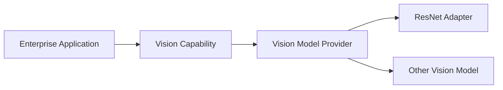

This separates:

```text
Business Capability
```

from:

```text
Specific Model Implementation
```

and makes model replacement easier.

---

# 🏢 Model Versioning

A production ResNet deployment should track:

```text
Model Architecture
Model Version
Pretrained Weight Version
Fine-Tuning Dataset
Dataset Version
Training Configuration
Code Version
Evaluation Metrics
Deployment Version
```

For example:

```text
Vision Model
    ↓
resnet50-v3
    ↓
Dataset v12
    ↓
Fine-Tuned 2026-08
    ↓
Production
```

---

# 🏢 Production ResNet Lifecycle

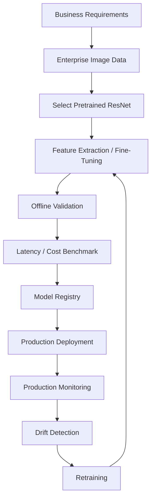

---

!!! tip "Production Insight"

    **ResNet is more than a CNN architecture. It is a reusable representation-learning backbone.**

    In production, the right question is not:

    ```text
    "Which ResNet is most accurate?"
    ```

    but:

    ```text
    Which model provides the required

    Accuracy
    +
Latency
    +
Throughput
    +
Memory Efficiency
    +
Cost
    +
Reliability
    ```

    for the actual production workload?

    ResNet-18 may be the right choice for a latency-sensitive application, while ResNet-50 may provide a better accuracy/compute balance for server-side inference.

---

# 📌 Key Takeaways

- ResNet introduced residual learning to make very deep CNNs easier to optimize.
- Residual blocks learn a transformation relative to the input.
- The core formulation is `y = F(x) + x`.
- Skip connections provide direct information and gradient paths.
- Identity shortcuts are used when tensor dimensions already match.
- Projection shortcuts use learnable transformations when dimensions need to change.
- `1 × 1` convolutions are commonly used for projection and channel transformation.
- ResNet commonly reduces spatial resolution while increasing channel depth.
- ResNet-18 and ResNet-34 use BasicBlocks.
- ResNet-50, ResNet-101, and ResNet-152 use Bottleneck blocks.
- Bottleneck blocks use `1 × 1 → 3 × 3 → 1 × 1` convolutions.
- Global Average Pooling reduces feature maps to compact representations.
- ResNet models are widely useful for Transfer Learning.
- TorchVision provides pretrained ResNet implementations for PyTorch.
- The original classification head can be replaced for custom tasks.
- Feature extraction can freeze the ResNet backbone.
- Fine-tuning can progressively unfreeze later layers.
- Fine-tuning generally requires smaller learning rates than head training.
- Correct preprocessing is part of the pretrained model contract.
- ResNet can serve as a backbone for classification, detection, segmentation, and embedding applications.
- Production ResNet systems should be evaluated for accuracy, latency, throughput, memory, and cost.
- Model monitoring should include input drift and prediction behavior.
- ResNet provides an important foundation for understanding modern Computer Vision architectures.

---

# 📚 Further Reading

Continue with:

- **[23. Vision Transformers and CNN-ViT Hybrids](23-vision-transformers-and-cnn-vit-hybrids.md)**
- **[35. GPU-Accelerated Deep Learning](35-gpu-accelerated-deep-learning.md)**
- **[36. Deep Learning Training and Model Lifecycle](36-deep-learning-training-and-model-lifecycle.md)**
- **[37. Building Production Deep Learning Systems](37-building-production-deep-learning-systems.md)**

The next chapter explores **Vision Transformers (ViT) and CNN-ViT hybrid architectures**, introducing the transition from convolution-based visual representation learning toward attention-based Computer Vision models.

---

## ➡️ Next Chapter

**[23. Vision Transformers and CNN-ViT Hybrids](23-vision-transformers-and-cnn-vit-hybrids.md)**

---

> **Enterprise AI Engineering Handbook**  
> *Building Production-Grade Enterprise AI Systems — One Chapter at a Time.*