# 23. Vision Transformers and CNN-ViT Hybrids

> Understand how Vision Transformers (ViTs) apply Transformer architectures to Computer Vision, how images are converted into patch tokens, how self-attention captures global relationships, and how CNN and Transformer architectures can be combined to build efficient and powerful vision systems.

---

## 🎯 Learning Objectives

After completing this chapter, you will be able to:

- Explain why Vision Transformers were introduced
- Understand the limitations of traditional CNNs for global context modeling
- Explain the core architecture of Vision Transformers
- Understand image patching
- Convert image patches into token embeddings
- Understand positional embeddings
- Explain self-attention in Vision Transformers
- Understand Multi-Head Self-Attention (MHSA)
- Understand the Transformer Encoder used by ViT
- Explain the role of the `[CLS]` token
- Understand the ViT classification pipeline
- Compare CNNs and Vision Transformers
- Understand the computational characteristics of self-attention
- Understand why ViTs require substantial training data
- Understand pretrained Vision Transformers
- Use Vision Transformer models with PyTorch and TorchVision
- Understand CNN-ViT hybrid architectures
- Explain how CNNs can provide local feature extraction before Transformer processing
- Understand hierarchical vision architectures
- Compare CNN, ViT, and hybrid approaches
- Understand Transfer Learning with ViTs
- Identify practical ViT deployment considerations
- Understand how Vision Transformers connect Computer Vision with modern Foundation Models

---

# 📖 Overview

Convolutional Neural Networks revolutionized Computer Vision by learning spatial patterns through convolutional filters.

CNNs are particularly strong at learning:

```text
Edges
 ↓
Textures
 ↓
Shapes
 ↓
Objects
```

However, traditional convolution operates over local receptive fields.

To understand relationships between distant regions, CNNs typically need:

```text
More Layers
+
Larger Receptive Fields
+
Downsampling
```

Transformers introduced another approach.

Instead of processing visual information primarily through local convolution operations, a Vision Transformer converts an image into a sequence of tokens and applies:

```text
Self-Attention
```

to model relationships between different image regions.

The fundamental transition is:

```text
CNN

Image
 ↓
Convolution
 ↓
Feature Maps
 ↓
Classification
```

to:

```text
Vision Transformer

Image
 ↓
Image Patches
 ↓
Patch Tokens
 ↓
Self-Attention
 ↓
Transformer Encoder
 ↓
Classification
```

---

# 🧠 Why Vision Transformers?

CNNs naturally encode local spatial structure.

For example:

```text
Pixel
 ↓
Local Neighborhood
 ↓
Edges
 ↓
Textures
 ↓
Shapes
 ↓
Objects
```

Self-attention provides a mechanism for directly relating different regions of an image.

For example:

```text
┌────────────── Image ──────────────┐
│                                  │
│  Head                      Tail  │
│    ●                         ●    │
│                                  │
└──────────────────────────────────┘
```

A Transformer can directly model:

```text
Head ↔ Tail
```

even when those regions are far apart.

---

# 🧠 CNN Locality vs Transformer Global Context

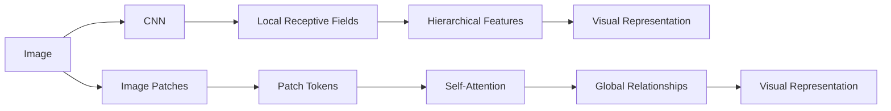

Both approaches can learn powerful visual representations, but they encode spatial relationships differently.

---

# 🧠 From CNN to Vision Transformer

The evolution can be viewed as:

```text
Traditional CNN
      ↓
Deep CNN
      ↓
Residual CNN
      ↓
Efficient CNN
      ↓
Vision Transformer
      ↓
Hybrid CNN + Transformer
      ↓
Modern Vision Foundation Models
```

---

# 🧠 Vision Transformer Architecture

The original Vision Transformer architecture can be simplified as:

```text
Input Image
    ↓
Split into Patches
    ↓
Flatten Patches
    ↓
Linear Projection
    ↓
Patch Embeddings
    ↓
Add Positional Embeddings
    ↓
Transformer Encoder
    ↓
Classification Head
```

---

# 🧠 Vision Transformer Architecture

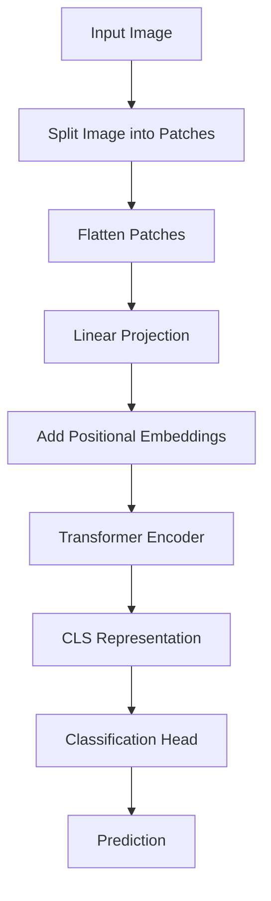

---

# 🧩 Image Patching

A Vision Transformer does not normally process every individual pixel as an independent token.

Instead, the image is divided into fixed-size patches.

Suppose:

```text
Image Size = 224 × 224
Patch Size = 16 × 16
```

Then the number of patches per dimension is:

\[
\frac{224}{16}=14
\]


Total patches:

\[
14\times14=196
\]


Therefore:

```text
224 × 224 Image
        ↓
196 Patches
```

---

# 🧠 General Number of Patches

For an image of size:

```text
H × W
```

with patch size:

```text
P × P
```

the number of patches is:

\[
N=\frac{H}{P}\times\frac{W}{P}
\]


where:

```text
H = Image Height
W = Image Width
P = Patch Size
N = Number of Patches
```

---

# 🧠 Patch Visualization

```text
Original Image

┌────┬────┬────┬────┐
│ P1 │ P2 │ P3 │ P4 │
├────┼────┼────┼────┤
│ P5 │ P6 │ P7 │ P8 │
├────┼────┼────┼────┤
│ P9 │P10 │P11 │P12 │
├────┼────┼────┼────┤
│P13 │P14 │P15 │P16 │
└────┴────┴────┴────┘
```

Each patch becomes a token.

```text
Patch 1 → Token 1
Patch 2 → Token 2
Patch 3 → Token 3
...
Patch N → Token N
```

---

# 🧠 Patch Size Trade-Off

Patch size affects:

```text
Number of Tokens
+
Computational Cost
+
Spatial Detail
```

Smaller patches:

```text
More Tokens
+
More Spatial Detail
+
Higher Attention Cost
```

Larger patches:

```text
Fewer Tokens
+
Lower Computational Cost
+
Less Fine-Grained Detail
```

---

# 📊 Patch Size Trade-Off

```text
Patch Size
    │
    │  8×8
    │   ●
    │
    │       16×16
    │          ●
    │
    │              32×32
    │                  ●
    └──────────────────────────→
       Token Count / Computation

Smaller Patch
      ↓
More Tokens
      ↓
Higher Attention Cost
```

---

# 🧠 Flattening Image Patches

Suppose an RGB patch is:

```text
16 × 16 × 3
```

The flattened patch contains:

\[
16\times16\times3=768
\]


values.

The patch can therefore be represented as:

```text
16 × 16 × 3
       ↓
Flatten
       ↓
768-dimensional vector
```

---

# 🧠 Patch Embedding

The flattened patch is projected into a model embedding dimension.

For example:

```text
Patch
768 values
   ↓
Linear Projection
   ↓
768-dimensional Embedding
```

The projection can be represented as:

\[
z=Wx+b
\]


where:

```text
x = Flattened Patch
W = Learnable Projection Matrix
b = Bias
z = Patch Embedding
```

---

# 🧠 Patch Embedding Pipeline


---

# 🧠 Why Do We Need Positional Embeddings?

Transformers process sequences.

However, self-attention itself does not inherently encode the spatial position of a token.

Consider:

```text
Patch A
Patch B
Patch C
```

and:

```text
Patch C
Patch A
Patch B
```

Without positional information, the model needs another mechanism to understand that the order or spatial location changed.

Therefore:

```text
Patch Embedding
+
Positional Embedding
```

are combined.

---

# 🧠 Positional Embedding

The input to the Transformer can be represented as:

\[
Z_0=E+E_{pos}
\]


where:

```text
E     = Patch Embeddings
Epos  = Positional Embeddings
Z0    = Transformer Input
```

---

# 🧠 CLS Token

Many ViT architectures prepend a learnable classification token:

```text
[CLS]
Patch 1
Patch 2
Patch 3
...
Patch N
```

Therefore the sequence length becomes:

\[
N+1
\]


The Transformer processes the entire sequence.

The final representation of:

```text
[CLS]
```

can be used by the classification head.

---

# 🧠 Token Sequence

```text
[CLS]
  +
Patch 1
  +
Patch 2
  +
Patch 3
  +
...
  +
Patch N
```

Conceptually:

```text
Image
 ↓
Patches
 ↓
Embeddings
 ↓
[CLS] + Patch Tokens
 ↓
Positional Information
 ↓
Transformer
```

---

# 🧠 ViT Input Representation

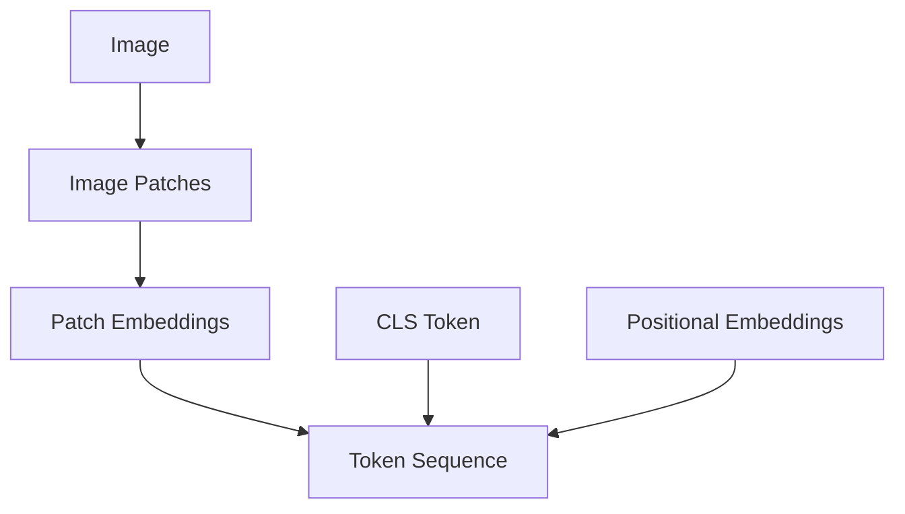

---

# 🧠 Self-Attention

Self-attention allows each token to interact with other tokens.

For an image:

```text
Patch 1
Patch 2
Patch 3
...
Patch N
```

each patch can attend to:

```text
Patch 1
Patch 2
Patch 3
...
Patch N
```

This enables global relationships.

---

# 🧠 Query, Key and Value

Self-attention transforms the input into:

```text
Query
Key
Value
```

The attention operation is:

\[
Attention(Q,K,V)=softmax\left(\frac{QK^T}{\sqrt{d_k}}\right)V
\]


where:

```text
Q  = Queries
K  = Keys
V  = Values
dk = Key Dimension
```

---

# 🧠 Self-Attention Intuition

Suppose:

```text
Patch A = Dog's Head
Patch B = Dog's Body
Patch C = Background
```

Self-attention can learn:

```text
Head ↔ Body
```

more strongly than:

```text
Head ↔ Background
```

The model learns these relationships from data.

---

# 🧠 Attention Matrix

If there are:

```text
N Tokens
```

the attention scores form approximately:

```text
N × N
```

relationships.

For example:

```text
       P1   P2   P3   P4

P1     ●    ●    ●    ●
P2     ●    ●    ●    ●
P3     ●    ●    ●    ●
P4     ●    ●    ●    ●
```

Each row represents how strongly one token attends to other tokens.

---

# 🧠 Multi-Head Self-Attention

Instead of using a single attention mechanism, Transformers use multiple attention heads.

```text
Input
  ↓
┌─────────┬─────────┬─────────┐
│ Head 1  │ Head 2  │ Head 3  │
└─────────┴─────────┴─────────┘
       ↓
   Concatenate
       ↓
   Projection
       ↓
     Output
```

Different heads can learn different relationships.

---

# 🧠 Multi-Head Attention

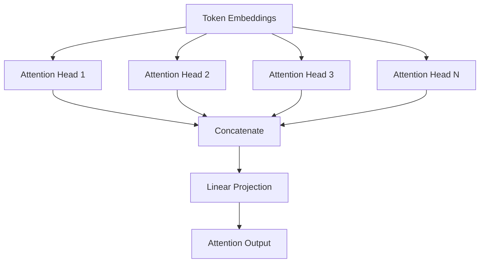

---

# 🧠 Transformer Encoder

A Vision Transformer uses Transformer Encoder blocks.

A simplified encoder contains:

```text
Input
 ↓
Layer Normalization
 ↓
Multi-Head Self-Attention
 ↓
Residual Connection
 ↓
Layer Normalization
 ↓
MLP / Feed-Forward Network
 ↓
Residual Connection
 ↓
Output
```

---

# 🧠 Transformer Encoder Block

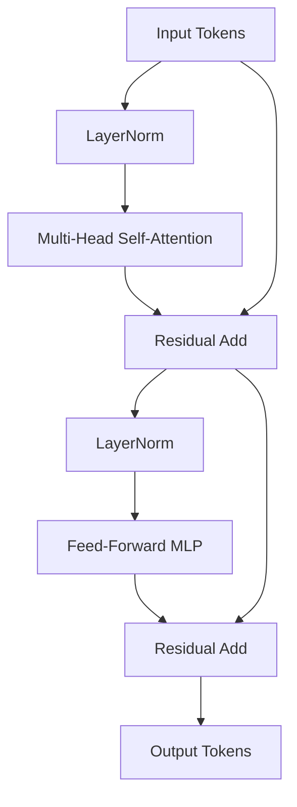

---

# 🧠 Transformer MLP

The feed-forward component usually contains:

```text
Linear
 ↓
Activation
 ↓
Linear
```

For example:

```python
nn.Sequential(
    nn.Linear(
        embedding_dim,
        hidden_dim
    ),
    nn.GELU(),
    nn.Linear(
        hidden_dim,
        embedding_dim
    )
)
```

The MLP operates independently on each token after the attention operation.

---

# 🧠 Layer Normalization

Transformer architectures commonly use Layer Normalization.

Conceptually:

```text
Token Representation
        ↓
LayerNorm
        ↓
Attention / MLP
```

Layer Normalization helps stabilize training.

---

# 🧠 ViT Encoder Stack

A complete ViT contains multiple encoder blocks.

```text
Patch Tokens
     ↓
Encoder Block 1
     ↓
Encoder Block 2
     ↓
Encoder Block 3
     ↓
...
     ↓
Encoder Block L
     ↓
Classification
```

---

# 🧠 Vision Transformer Complete Architecture

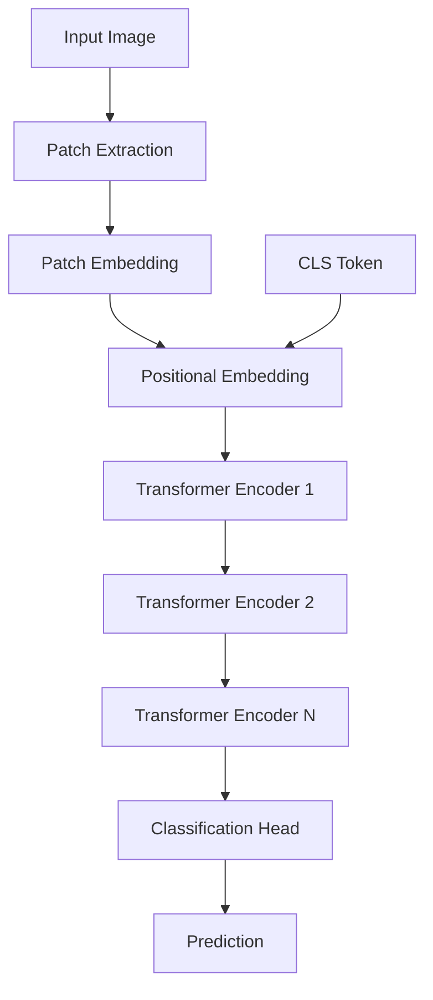

---

# 🧠 ViT Classification Pipeline

```text
Image
 ↓
Patches
 ↓
Patch Embeddings
 ↓
CLS + Patch Tokens
 ↓
Position Information
 ↓
Transformer Encoder
 ↓
CLS Representation
 ↓
MLP Head
 ↓
Class Prediction
```

---

# 🧠 CNN vs Vision Transformer

| CNN | Vision Transformer |
|---|---|
| Convolution-based | Attention-based |
| Strong locality bias | Global token interactions |
| Translation-aware inductive bias | More flexible learned relationships |
| Naturally hierarchical | Original ViT is less explicitly hierarchical |
| Usually works well with moderate data | Often benefits strongly from large-scale pretraining |
| Local receptive fields | Global attention |
| Efficient spatial processing | Attention cost grows with token count |
| Mature edge/mobile ecosystem | Strong scaling behavior |

Neither architecture is universally superior.

The correct architecture depends on:

```text
Dataset
Task
Compute
Latency
Model Scale
Pretraining
Deployment Environment
```

---

# 🧠 CNN Inductive Bias

CNNs encode useful assumptions directly into the architecture:

```text
Locality
+
Translation Equivariance
+
Weight Sharing
```

This can make CNNs highly data-efficient for many vision tasks.

---

# 🧠 Vision Transformer Inductive Bias

ViTs have weaker built-in spatial inductive biases than CNNs.

They learn relationships from data through attention.

This provides flexibility but can increase reliance on:

```text
Large Datasets
+
Strong Pretraining
```

---

# 🧠 Why ViTs Often Benefit From Large Datasets

CNNs already contain strong assumptions about images.

ViTs rely more heavily on learned representations.

Therefore:

```text
Small Dataset
+
Weak Pretraining
```

can make a ViT harder to train effectively.

But:

```text
Large-Scale Pretraining
+
Transfer Learning
```

can make ViTs extremely powerful.

---

# 🧠 Attention Complexity

If there are:

```text
N Tokens
```

self-attention typically has quadratic complexity with respect to sequence length:

\[
O(N^2)
\]


For images:

\[
N=\frac{H}{P}\times\frac{W}{P}
\]


Therefore reducing patch size increases:

```text
N
 ↓
Attention Computation
 ↓
Memory Requirement
```

---

# 🧠 Patch Size and Attention Cost

Suppose:

```text
Image = 224 × 224
```

### Patch = 16

```text
14 × 14 = 196 tokens
```

Attention matrix:

```text
196 × 196
```

---

### Patch = 8

```text
28 × 28 = 784 tokens
```

Attention matrix:

```text
784 × 784
```

The increase in token count causes a much larger increase in attention computation.

---

# 📊 Token Count Growth

```text
Patch Size
    │
16  │       ●
    │
12  │          ●
    │
 8  │                    ●
    │
    └────────────────────────→
          Token Count
```

The smaller the patch size, the greater the number of tokens.

---

# 🧠 Why Hierarchical Vision Transformers?

The original ViT uses a relatively flat token sequence.

Modern vision architectures often introduce hierarchy:

```text
High Resolution
      ↓
Local Features
      ↓
Downsampling
      ↓
Lower Resolution
      ↓
Higher Semantic Representation
```

This resembles the hierarchical structure of CNNs.

---

# 🧠 Hierarchical Vision Architecture


This pattern is common in modern vision architectures.

---

# 🧠 CNN + Transformer Hybrid

A hybrid architecture combines:

```text
CNN
+
Transformer
```

The CNN can extract local features efficiently.

The Transformer can model broader relationships.

---

# 🧠 Hybrid Architecture

```text
Image
 ↓
CNN Feature Extractor
 ↓
Feature Map
 ↓
Tokenization
 ↓
Transformer Encoder
 ↓
Classification Head
```

---

# 🧠 CNN-ViT Hybrid

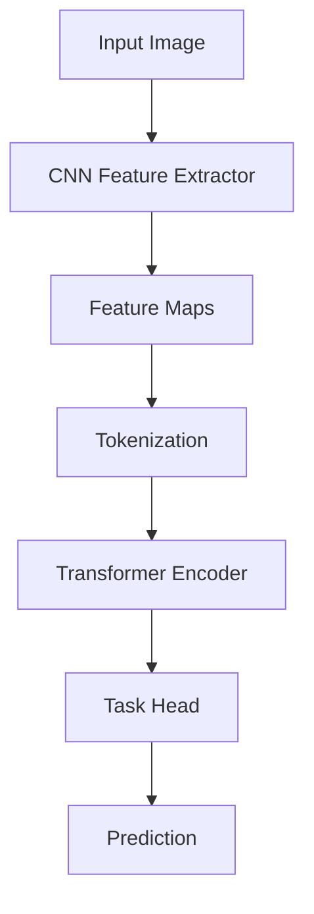

---

# 🧠 Why Combine CNN and Transformer?

CNNs provide:

```text
Locality
Efficient Spatial Processing
Translation-Aware Features
```

Transformers provide:

```text
Global Context
Long-Range Relationships
Flexible Attention
```

Therefore:

```text
CNN
+
Transformer
```

can combine complementary strengths.

---

# 🧠 Hybrid Model Design

A hybrid model may look like:

```text
Input Image
     ↓
Convolution
     ↓
Feature Extraction
     ↓
Patch / Token Projection
     ↓
Self-Attention
     ↓
Global Representation
     ↓
Task Head
```

---

# 🧠 CNN vs ViT vs Hybrid

| Architecture | Local Features | Global Context | Data Efficiency | Compute Characteristics |
|---|---:|---:|---:|---|
| CNN | Strong | Indirect | Strong | Usually efficient |
| ViT | Learned | Strong | Often lower without pretraining | Attention can be expensive |
| Hybrid | Strong | Strong | Often balanced | Depends on architecture |

---

# 🧠 Vision Transformer Transfer Learning

As with CNNs, pretrained ViTs can be reused.

```text
Pretrained ViT
      ↓
Remove Original Head
      ↓
Add Target Head
      ↓
Freeze Backbone
      ↓
Train Head
      ↓
Fine-Tune Selected Layers
```

---

# 🧠 ViT Transfer Learning

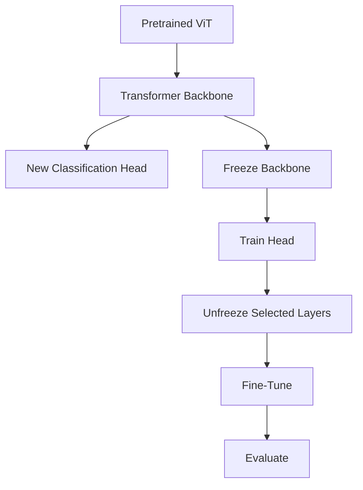

---

# 🐍 Part I — Vision Transformer with PyTorch

PyTorch provides Transformer building blocks, while TorchVision provides pretrained vision architectures.

A modern workflow commonly uses a pretrained vision model and replaces its classification head.

---

# 🧪 Load a Pretrained Vision Transformer

```python
import torch
import torch.nn as nn

from torchvision import models


weights = (
    models.ViT_B_16_Weights.DEFAULT
)


model = models.vit_b_16(
    weights=weights
)
```

---

# 🧠 Inspect the Model

```python
print(model)
```

A Vision Transformer contains components conceptually similar to:

```text
conv_proj
+
encoder
+
heads
```

The patch projection converts image regions into embeddings.

The encoder contains the Transformer blocks.

The head produces task-specific predictions.

---

# 🧠 Replace the Classification Head

Suppose the target dataset contains:

```text
5 Classes
```

The classifier can be replaced:

```python
num_features = (
    model.heads.head.in_features
)


model.heads.head = nn.Linear(
    num_features,
    5
)
```

---

# 🧠 Freeze the Transformer Backbone

```python
for param in model.parameters():

    param.requires_grad = False
```

Then:

```python
for param in model.heads.parameters():

    param.requires_grad = True
```

Now:

```text
ViT Backbone
     ↓
Frozen

Classification Head
     ↓
Trainable
```

---

# 🧪 ViT Optimizer

```python
optimizer = torch.optim.AdamW(

    model.heads.parameters(),

    lr=1e-3,

    weight_decay=1e-4
)
```

---

# 🧠 Fine-Tuning a ViT

After training the classification head, selected Transformer blocks can be unfrozen.

For example:

```python
for param in (
    model.encoder.layers[-2:].parameters()
):

    param.requires_grad = True
```

Then use a smaller learning rate:

```python
optimizer = torch.optim.AdamW(

    filter(
        lambda p: p.requires_grad,
        model.parameters()
    ),

    lr=1e-5,

    weight_decay=1e-4
)
```

---

# 🧠 ViT Fine-Tuning Strategy

```text
Stage 1
───────

ViT Backbone
   ↓
Frozen

Head
   ↓
Trainable


Stage 2
───────

Last Transformer Blocks
   ↓
Trainable

Head
   ↓
Trainable


Stage 3
───────

Additional Transformer Blocks
   ↓
Optional Fine-Tuning
```

---

# 🧠 ViT Preprocessing

Use the preprocessing associated with the pretrained weights where possible.

```python
weights = (
    models.ViT_B_16_Weights.DEFAULT
)

preprocess = (
    weights.transforms()
)
```

This ensures that the input preprocessing aligns with the pretrained checkpoint.

---

# 🧠 Why Preprocessing Is Critical for ViT

A pretrained model expects a particular:

```text
Image Size
Normalization
Tensor Format
Value Range
```

Mismatch can reduce transfer-learning performance.

Therefore:

> **Preprocessing should be versioned alongside the model.**

---

# 🧠 ViT Training Pipeline


---

# 🧪 Simple ViT Training Loop

```python
for epoch in range(
    epochs
):

    model.train()

    for images, labels in train_loader:

        images = images.to(
            device
        )

        labels = labels.to(
            device
        )

        optimizer.zero_grad()

        logits = model(
            images
        )

        loss = criterion(
            logits,
            labels
        )

        loss.backward()

        optimizer.step()
```

---

# 🧠 ViT Classification Loss

For multi-class classification:

```python
criterion = nn.CrossEntropyLoss()
```

The model should output:

```text
Raw Logits
```

rather than applying `softmax` before the loss.

---

# 🧠 ViT Feature Representation

The Transformer produces contextualized token representations.

Conceptually:

```text
Patch Tokens
     ↓
Self-Attention
     ↓
Context-Aware Tokens
     ↓
CLS Representation
     ↓
Classification
```

Each token can incorporate information from other image regions.

---

# 🧠 Contextualization

Before attention:

```text
Patch 1
Patch 2
Patch 3
```

After attention:

```text
Patch 1 + Context
Patch 2 + Context
Patch 3 + Context
```

The representation of each patch becomes contextual.

---

# 🧠 CNN Feature Maps vs Transformer Tokens

CNN:

```text
H × W × C
```

Transformer:

```text
N × D
```

where:

```text
N = Number of Tokens
D = Embedding Dimension
```

Both are representations of visual information, but their structures differ.

---

# 🧠 Feature Representation Comparison

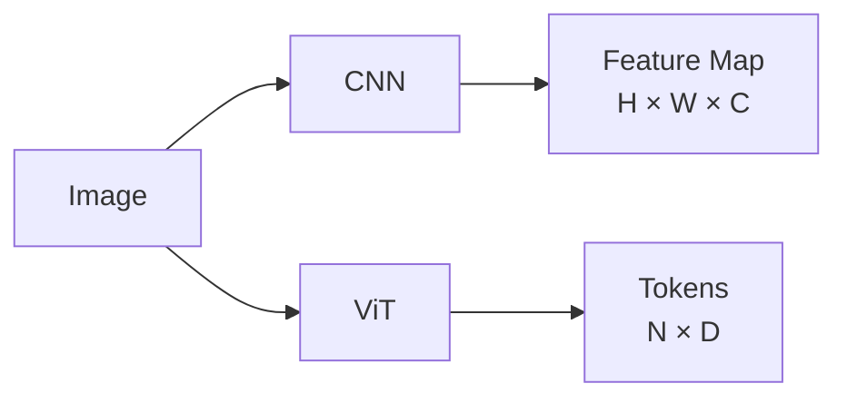

---

# 🧠 Vision Transformer Attention Visualization

Attention maps can provide insight into which image regions interact.

Conceptually:

```text
Input Image
     ↓
Attention Weights
     ↓
Attention Map
     ↓
Important Regions
```

This can be useful for analysis, but attention maps should not automatically be interpreted as definitive explanations of model decisions.

---

# 🧠 Attention Map Concept

```text
Image

┌─────────────────────┐
│     ░░░░            │
│   ███████           │
│   ███████    ░░     │
│      ░░             │
└─────────────────────┘

Darker Region
     ↓
Higher Attention Weight
```

The actual interpretation depends on the model, head, layer, and visualization method.

---

# 🧠 Vision Transformer Advantages

ViTs provide:

- Global self-attention
- Strong scaling with large-scale pretraining
- Flexible representation learning
- Powerful long-range relationship modeling
- A unified Transformer architecture
- Strong compatibility with modern Foundation Model research
- Effective Transfer Learning when suitable pretrained checkpoints are available

---

# ⚠ Vision Transformer Limitations

Potential limitations include:

- High attention cost for long token sequences
- Large memory requirements
- Greater dependence on pretraining for many tasks
- More sensitivity to patch size
- More expensive inference for high-resolution images
- Less built-in locality than CNNs
- More complex deployment for large models

---

# 🧠 When Should You Use a CNN?

CNNs may be preferable when:

```text
Dataset is Limited
+
Latency is Important
+
Edge Deployment
+
Strong Local Patterns
+
Compute is Constrained
```

Examples:

```text
Mobile Vision
Industrial Edge Devices
Real-Time Camera Systems
```

---

# 🧠 When Should You Use a ViT?

ViTs can be attractive when:

```text
Large-Scale Pretraining
+
Large Dataset
+
Global Context
+
Strong Compute Infrastructure
```

Examples:

```text
Large-Scale Image Classification
Image Retrieval
Multimodal Systems
Vision Foundation Models
```

---

# 🧠 When Should You Use a Hybrid?

Hybrid architectures are useful when:

```text
Local Feature Extraction
+
Global Context
```

are both important.

For example:

```text
Industrial Inspection
Medical Imaging
High-Resolution Vision
Complex Object Recognition
```

---

# 🧠 Architecture Selection

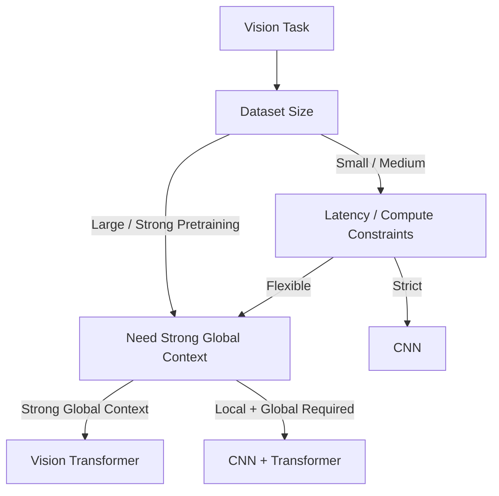

---

# 🧠 Model Selection Matrix

| Requirement | CNN | ViT | Hybrid |
|---|---:|---:|---:|
| Local feature extraction | Excellent | Good | Excellent |
| Global context | Good | Excellent | Excellent |
| Small dataset | Often strong | Often challenging without pretraining | Strong |
| Large-scale pretraining | Strong | Excellent | Excellent |
| Edge inference | Strong | Variable | Variable |
| Long-range relationships | Moderate | Excellent | Excellent |
| High-resolution workloads | Efficient variants available | Can be expensive | Depends on design |

---

# 🧠 Modern Vision Architecture Landscape

```text
CNN
 │
 ├── ResNet
 │
 ├── EfficientNet
 │
 └── MobileNet
 │
 ▼
Vision Transformers
 │
 ├── ViT
 │
 ├── Hierarchical Transformers
 │
 └── Swin-style architectures
 │
 ▼
Hybrid Architectures
 │
 ├── CNN + Transformer
 │
 └── Multi-scale Vision Models
 │
 ▼
Vision Foundation Models
```

---

# 🧠 Vision Transformers and Foundation Models

The Transformer architecture is no longer limited to language.

The same core concepts have expanded into:

```text
Text
+
Images
+
Audio
+
Video
+
Multimodal Data
```

This creates a broader architecture:

```text
Input Modality
      ↓
Tokenization / Representation
      ↓
Transformer
      ↓
Contextual Representation
      ↓
Task / Generation
```

---

# 🧠 Multimodal Vision Architecture

Modern multimodal systems may combine:

```text
Image Encoder
      +
Text Encoder / LLM
      ↓
Shared Representation
      ↓
Multimodal Reasoning
```

Conceptually:

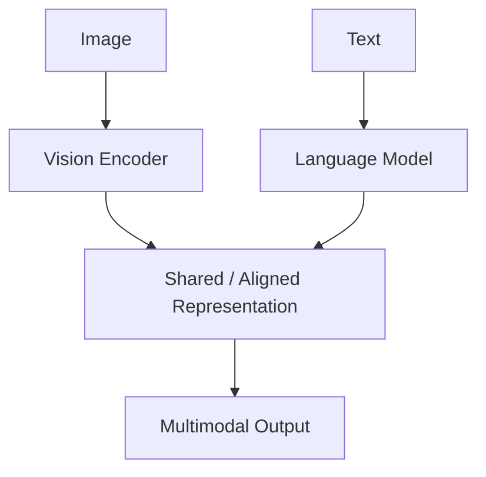

This forms an important bridge from Deep Learning to modern Generative AI.

---

# 🏢 Enterprise Perspective

Vision Transformers and hybrid architectures are increasingly relevant to enterprise Computer Vision systems.

Potential applications include:

```text
Document Understanding
Medical Imaging
Industrial Inspection
Retail Vision
Satellite Image Analysis
Visual Search
Product Classification
Image Retrieval
Multimodal AI
```

---

# 🏢 Enterprise Vision Architecture

A production vision platform may support multiple model families:

```text
VisionProvider
      │
      ├── CNN Adapter
      │      └── ResNet
      │
      ├── ViT Adapter
      │      └── Vision Transformer
      │
      └── Hybrid Adapter
             └── CNN + Transformer
```

The application should depend on the capability rather than a specific model.

---

# 🏢 Model Abstraction

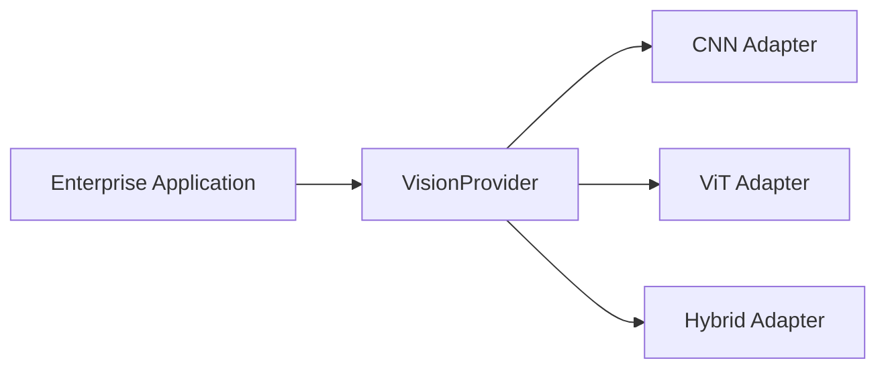

This allows an organization to change:

```text
ResNet
```

to:

```text
ViT
```

without necessarily changing the business-facing API.

---

# 🏢 Production Vision Model Pipeline

```text
Data Collection
      ↓
Data Validation
      ↓
Preprocessing
      ↓
Model Training
      ↓
Evaluation
      ↓
Model Registry
      ↓
Deployment
      ↓
Inference
      ↓
Monitoring
      ↓
Drift Detection
      ↓
Retraining
```

---

# 🏢 ViT Production Considerations

Important production concerns include:

### Model

```text
Architecture
Parameter Count
Embedding Dimension
Number of Layers
Number of Heads
Patch Size
```

### Performance

```text
Accuracy
Precision
Recall
F1
Latency
Throughput
```

### Infrastructure

```text
GPU Memory
CPU
GPU
Batch Size
Autoscaling
```

### Operations

```text
Model Version
Checkpoint Version
Preprocessing Version
Monitoring
Rollback
```

---

# 🧠 High-Resolution Vision Challenge

Suppose:

```text
Image = 1024 × 1024
Patch = 16 × 16
```

Number of patches:

\[
\frac{1024}{16}\times\frac{1024}{16}
=
64\times64
=
4096
\]


Then full self-attention has a token-pair matrix of approximately:

```text
4096 × 4096
```

This illustrates why high-resolution vision can make global attention expensive.

---

# 🧠 Why Efficient Attention Matters

As resolution increases:

```text
Image Resolution
      ↓
Patch Count
      ↓
Token Count
      ↓
Attention Cost
      ↓
Memory Requirement
```

This motivates architectures that use:

```text
Local Attention
+
Hierarchical Processing
+
Windowed Attention
+
Sparse Attention
+
Efficient Tokenization
```

---

# 🧠 Hierarchical and Local Attention

Instead of every token attending to every other token:

```text
Global Attention

P1 ↔ P2 ↔ P3 ↔ ... ↔ PN
```

a model may restrict attention:

```text
Local / Window Attention

┌───────┐
│ P1 P2 │
│ P3 P4 │
└───────┘

┌───────┐
│ P5 P6 │
│ P7 P8 │
└───────┘
```

This can reduce computational requirements.

---

# 🧠 CNN + ViT Hybrid Strategy

A practical hybrid can use:

```text
CNN
 ↓
Local Feature Extraction
 ↓
Downsample
 ↓
Tokenization
 ↓
Transformer
 ↓
Global Context
 ↓
Prediction
```

This provides a useful architectural compromise.

---

# 🧪 Practical Exercise 1 — Patch Extraction

Given:

```text
Image = 224 × 224
Patch = 16 × 16
```

calculate:

```text
Number of Patches
```

Then implement patch extraction using PyTorch.

---

# 🧪 Practical Exercise 2 — Patch Embeddings

Implement:

```text
Image
 ↓
Unfold / Patchify
 ↓
Flatten
 ↓
Linear Projection
```

Verify:

```text
Input Shape
Output Token Shape
```

---

# 🧪 Practical Exercise 3 — Positional Embeddings

Create a toy sequence:

```text
16 Tokens
```

Add:

```text
Learnable Positional Embeddings
```

and inspect the resulting tensor shape.

---

# 🧪 Practical Exercise 4 — Self-Attention

Implement a simplified self-attention mechanism:

```python
attention = torch.softmax(
    q @ k.transpose(-2, -1),
    dim=-1
)

output = attention @ v
```

Then experiment with different token counts.

---

# 🧪 Practical Exercise 5 — Load Pretrained ViT

Load:

```python
models.vit_b_16(
    weights=(
        models.ViT_B_16_Weights.DEFAULT
    )
)
```

Inspect:

```text
Model Structure
Parameter Count
Input Size
Classifier
```

---

# 🧪 Practical Exercise 6 — Transfer Learning with ViT

Replace the classification head.

Train:

```text
Head Only
```

Then:

```text
Head + Last Transformer Blocks
```

Compare:

```text
Accuracy
Training Time
Validation Loss
```

---

# 🧪 Practical Exercise 7 — CNN vs ViT

Train:

```text
ResNet-18
```

and:

```text
ViT
```

on the same dataset.

Compare:

```text
Accuracy
Training Time
Inference Latency
Memory
```

---

# 🧪 Practical Exercise 8 — CNN-ViT Hybrid

Design:

```text
CNN
 ↓
Feature Map
 ↓
Tokenization
 ↓
Transformer Encoder
 ↓
Classifier
```

Implement a simplified prototype.

---

# 🧪 Practical Exercise 9 — Patch Size Experiment

Compare:

```text
Patch = 8
Patch = 16
Patch = 32
```

Measure:

```text
Token Count
Training Time
Memory
Accuracy
Inference Latency
```

---

# 🧪 Practical Exercise 10 — High Resolution

Experiment with:

```text
224 × 224
384 × 384
512 × 512
```

Compare:

```text
Token Count
Attention Cost
GPU Memory
Inference Latency
```

---

# 🧪 Practical Exercise 11 — Attention Visualization

Extract attention information from a Vision Transformer and visualize how attention patterns differ across:

```text
Layers
Heads
Images
```

Treat attention visualization as an analytical tool rather than a guaranteed explanation of model reasoning.

---

# 🧪 Practical Exercise 12 — Production Benchmark

Compare:

```text
ResNet-50
ViT
CNN-ViT Hybrid
```

under the same production constraints.

Measure:

```text
Accuracy
P95 Latency
Throughput
GPU Memory
Model Size
Cost per Inference
```

Select the architecture based on the complete production trade-off.

---

# 🧠 Interview Questions

## Beginner

### 1. What is a Vision Transformer?

A Vision Transformer is a Computer Vision architecture that represents an image as a sequence of patch tokens and processes those tokens using Transformer encoder blocks.

### 2. Why do ViTs divide images into patches?

Patches provide a manageable token representation of the image while preserving spatial information through positional embeddings.

### 3. What is a patch embedding?

A numerical representation produced by projecting a flattened image patch into the model's embedding space.

### 4. Why are positional embeddings needed?

They provide information about where tokens originated in the image.

### 5. What is a CLS token?

A learnable token commonly prepended to the patch sequence whose final representation can be used for classification.

---

## Intermediate

### 6. How does self-attention work in ViT?

It computes relationships between token representations using Query, Key, and Value projections.

### 7. What is Multi-Head Self-Attention?

It performs attention through multiple learned attention heads, allowing different representation subspaces and relationships to be modeled in parallel.

### 8. Why can ViTs model global relationships effectively?

Self-attention allows tokens to directly interact with other tokens across the image.

### 9. What is the major computational challenge of standard self-attention?

Its attention computation generally grows quadratically with the number of tokens.

### 10. How does patch size affect ViT performance?

Smaller patches provide more spatial detail but increase token count and attention computation.

### 11. Why do ViTs often benefit from large-scale pretraining?

They have weaker built-in image-specific inductive biases than CNNs and can therefore benefit substantially from learning visual representations from large datasets.

### 12. What is a CNN-ViT hybrid?

An architecture that combines CNN-based local feature extraction with Transformer-based global contextual modeling.

---

## Advanced

### 13. Why are CNNs often more data-efficient than ViTs?

CNNs encode strong image-specific inductive biases such as locality, weight sharing, and translation-related structure.

### 14. Why can ViTs outperform CNNs at scale?

With sufficient data and compute, attention-based architectures can learn highly flexible global representations and scale effectively with model and dataset size.

### 15. Why is high-resolution ViT inference expensive?

Higher image resolution creates more patches, which increases token count and therefore the cost of global self-attention.

### 16. How can the cost of Vision Transformers be reduced?

Possible approaches include:

```text
Larger Patches
Local Attention
Windowed Attention
Hierarchical Architecture
Token Reduction
Efficient Attention
Downsampling
```

### 17. What is the difference between CNN feature maps and ViT tokens?

CNNs represent visual information primarily as spatial feature maps, while ViTs represent the image as a sequence of contextualized token embeddings.

### 18. Why might a hybrid model outperform either a pure CNN or pure ViT?

A hybrid can combine CNN locality and efficient spatial processing with Transformer global context.

### 19. How would you fine-tune a pretrained ViT?

Start with the classification head, freeze most of the Transformer backbone, then progressively unfreeze selected Transformer blocks using a smaller learning rate.

### 20. How would you select between ResNet and ViT for production?

Evaluate:

```text
Accuracy
Latency
Throughput
Memory
Training Data
Pretraining Availability
Inference Cost
Hardware
```

rather than selecting solely on benchmark accuracy.

### 21. Why does patch size influence computational cost so strongly?

Because token count grows inversely with the square of patch size for a fixed image resolution, while global attention scales approximately quadratically with token count.

### 22. What happens when image resolution doubles?

If patch size remains constant, the number of patches increases by approximately four times in two dimensions, while a full attention matrix can increase by approximately sixteen times.

---

# 🏢 Enterprise Perspective

Vision Transformers represent an important architectural transition:

```text
Hand-Designed Local Structure
          ↓
CNN Feature Learning
          ↓
Residual CNNs
          ↓
Attention-Based Vision
          ↓
Multimodal Foundation Models
```

For enterprise AI engineers, the important lesson is not simply:

> "ViT is better than CNN."

Instead:

> **Architecture selection should be driven by workload requirements, available data, pretraining, infrastructure, and production constraints.**

---

# 🏢 Enterprise Model Selection

A production architecture decision should consider:

```text
Business Requirements
        ↓
Dataset Characteristics
        ↓
Model Candidates
        ↓
Accuracy Benchmark
        ↓
Latency Benchmark
        ↓
Cost Benchmark
        ↓
Operational Complexity
        ↓
Production Decision
```

---

# 🏢 Enterprise Vision Platform

A scalable platform may expose:

```text
VisionProvider
      │
      ├── CNN
      │
      ├── ViT
      │
      ├── Hybrid
      │
      └── Vision Foundation Model
```

Applications consume capabilities:

```text
classify()
embed()
detect()
segment()
```

rather than depending directly on a particular model architecture.

---

# 🏢 Production Vision Architecture

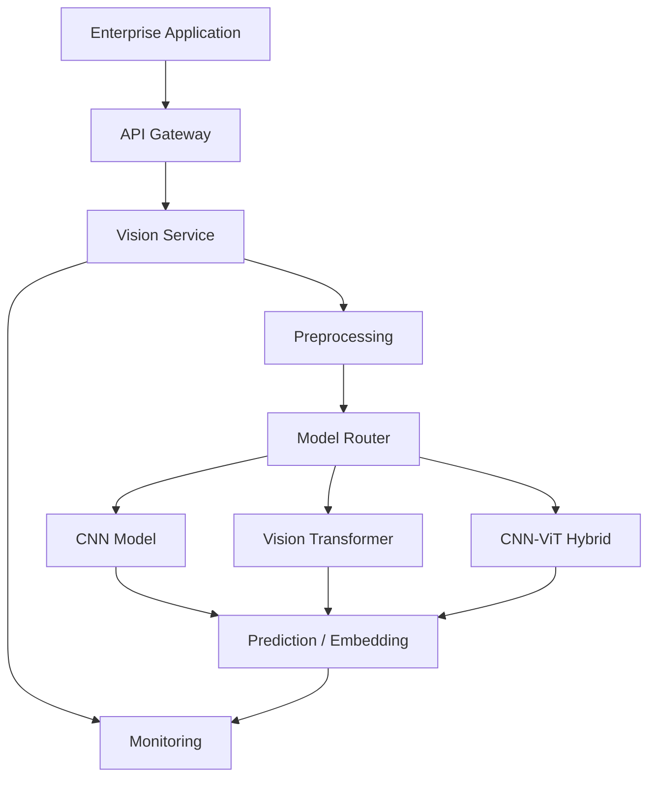

A model router can select different models based on:

```text
Task
Latency Requirement
Input Resolution
Model Availability
Cost
```

---

# 🏢 Model Governance

For production Vision Transformer systems, track:

```text
Model Architecture
Checkpoint
Pretraining Dataset
Model License
Patch Size
Input Resolution
Embedding Dimension
Number of Layers
Number of Heads
Target Dataset
Training Configuration
Model Version
Evaluation Results
Deployment Version
```

---

# 🏢 Production Monitoring

Monitor:

```text
P50 Latency
P95 Latency
P99 Latency
Throughput
GPU Utilization
GPU Memory
Prediction Distribution
Input Distribution
Data Drift
Error Rate
Business Metrics
```

---

# 🏢 Cost Considerations

A larger Transformer may provide higher accuracy but also:

```text
Higher GPU Cost
+
Higher Memory
+
Higher Latency
+
Lower Throughput
```

Therefore:

```text
Model Accuracy
      ≠
Production Value
```

Production value depends on the complete system.

---

# 🧠 Architecture Decision Example

Suppose an enterprise needs:

```text
Real-Time Camera Classification
```

with:

```text
Latency < 50 ms
Limited GPU
Moderate Dataset
```

A lightweight CNN may be a better initial choice.

---

Suppose the requirement is:

```text
Large-Scale Image Retrieval
+
Large Pretrained Dataset
+
GPU Infrastructure
```

A Vision Transformer may be attractive.

---

Suppose the requirement is:

```text
High-Resolution Industrial Inspection
+
Local Defect Detection
+
Global Context
```

A CNN-Transformer hybrid may be worth evaluating.

---

# 🧠 Architecture Decision Matrix

```text
                   Locality      Global Context

CNN                    ████████        ████
ViT                    ████            ████████
Hybrid                 ███████         ████████
```

This is a conceptual comparison, not a benchmark.

---

!!! tip "Production Insight"

    **Vision Transformers should not be adopted simply because Transformers are dominant in modern AI.**

    For a production Computer Vision system, evaluate:

    ```text
    Dataset Size
    +
    Pretraining
    +
    Accuracy
    +
    Latency
    +
    Throughput
    +
    GPU Memory
    +
    Cost
    +
    Deployment Environment
    ```

    CNNs remain extremely valuable, especially for efficient vision workloads.

    The most practical architecture may also be a hybrid:

    ```text
    CNN
      ↓
    Local Feature Extraction
      ↓
    Transformer
      ↓
    Global Context
      ↓
    Prediction
    ```

    The goal of architecture selection is not to choose the newest model. It is to choose the model that satisfies the complete production workload.

---

# 📌 Key Takeaways

- Vision Transformers apply Transformer architectures to Computer Vision.
- Images are divided into fixed-size patches.
- Each patch becomes a token representation.
- Patch embeddings convert image patches into model embeddings.
- Positional embeddings provide spatial information.
- A CLS token is commonly used for classification.
- Self-attention allows image regions to model relationships with other regions.
- Multi-Head Self-Attention allows multiple attention patterns to be learned.
- Transformer Encoder blocks contain attention, MLP, normalization, and residual connections.
- Standard self-attention has approximately quadratic complexity with respect to token count.
- Smaller patches increase token count and computational cost.
- ViTs often benefit strongly from large-scale pretraining.
- CNNs provide strong locality and image-specific inductive biases.
- ViTs provide flexible global relationship modeling.
- Neither CNNs nor ViTs are universally superior.
- CNN-ViT hybrids combine local convolutional features with global attention.
- Hierarchical vision architectures help manage computational complexity.
- Pretrained ViTs can be adapted using Transfer Learning and fine-tuning.
- Correct preprocessing is part of the pretrained model contract.
- High-resolution vision creates significant attention and memory challenges.
- Production model selection must consider accuracy, latency, throughput, memory, and cost.
- Vision Transformers form an important bridge from traditional Deep Learning toward modern multimodal and Vision Foundation Models.

---

# 📚 Further Reading

Continue with:

- **[24. Recurrent Neural Networks](24-recurrent-neural-networks.md)**
- **[25. LSTM and GRU](25-lstm-and-gru.md)**
- **[26. Attention and Positional Encoding](26-attention-and-positional-encoding.md)**
- **[27. Transformer Architecture](27-transformer-architecture.md)**
- **[28. Transformer Applications](28-transformer-applications.md)**
- **[35. GPU-Accelerated Deep Learning](35-gpu-accelerated-deep-learning.md)**
- **[37. Building Production Deep Learning Systems](37-building-production-deep-learning-systems.md)**

The next phase moves from Computer Vision into **Sequential Learning and Transformers**, beginning with Recurrent Neural Networks and their role in modeling sequential data.

---

## ➡️ Next Chapter

**[24. Recurrent Neural Networks](24-recurrent-neural-networks.md)**

---

> **Enterprise AI Engineering Handbook**  
> *Building Production-Grade Enterprise AI Systems — One Chapter at a Time.*