# 24. Recurrent Neural Networks

> Understand how Recurrent Neural Networks (RNNs) model sequential data by maintaining information across time, how hidden states and recurrent connections work, why vanilla RNNs struggle with long-term dependencies, and how RNNs provide the foundation for LSTMs, GRUs, and modern sequence modeling architectures.

---

## 🎯 Learning Objectives

After completing this chapter, you will be able to:

- Explain what sequential data is
- Understand why sequential data requires specialized modeling
- Explain the basic architecture of a Recurrent Neural Network
- Understand recurrent connections and hidden states
- Explain how an RNN processes sequences step by step
- Understand sequence-to-one, one-to-many, and sequence-to-sequence architectures
- Understand the mathematical formulation of an RNN
- Explain unrolling through time
- Understand Backpropagation Through Time (BPTT)
- Explain the vanishing gradient problem
- Explain the exploding gradient problem
- Understand why vanilla RNNs struggle with long-term dependencies
- Understand teacher forcing
- Understand many-to-one and many-to-many prediction
- Build RNN models using PyTorch
- Understand `nn.RNN`
- Prepare sequential datasets for RNN training
- Handle variable-length sequences
- Understand padding and masking
- Understand bidirectional RNNs
- Understand stacked RNNs
- Apply RNNs to time-series and NLP problems
- Understand the limitations of vanilla RNNs
- Understand why LSTM and GRU architectures were introduced
- Evaluate RNNs from a production perspective
- Understand where RNNs fit in the evolution toward Transformers

---

# 📖 Overview

Many Machine Learning problems involve data where **order matters**.

Examples include:

```text
Time-Series Data
      ↓
Stock Prices
      ↓
Sensor Measurements
      ↓
Weather Observations
      ↓
Speech Signals
      ↓
Text
      ↓
User Activity Sequences
```

In these problems, the meaning of the current observation may depend on previous observations.

For example:

```text
"I went to the bank to deposit..."
```

Understanding the next word depends on the sequence that came before it.

Similarly:

```text
Temperature:
25 → 26 → 28 → 31 → 34
```

The current value can be interpreted better when the historical sequence is considered.

Traditional feed-forward neural networks treat inputs independently.

RNNs introduce a mechanism for carrying information from one time step to the next.

---

# 🧠 What is a Recurrent Neural Network?

A Recurrent Neural Network is a neural network architecture designed to process sequential data by maintaining a hidden state that carries information across time steps.

The fundamental idea is:

```text
Current Input
      +
Previous Hidden State
      ↓
RNN Cell
      ↓
Current Hidden State
```

The hidden state acts as a form of learned memory.

---

# 🧠 Feed-Forward Network vs RNN

### Feed-Forward Network

```text
Input
  ↓
Layer
  ↓
Layer
  ↓
Output
```

The network does not naturally maintain information about previous inputs.

---

### Recurrent Neural Network

```text
x₁ ──► RNN ──► h₁
         │
         ▼
x₂ ──► RNN ──► h₂
         │
         ▼
x₃ ──► RNN ──► h₃
         │
         ▼
x₄ ──► RNN ──► h₄
```

Each time step receives:

```text
Current Input
+
Previous Hidden State
```

---

# 🧠 Core RNN Idea

The central concept is:

> **The current hidden state depends on both the current input and the previous hidden state.**

Conceptually:

\[
h_t=f(x_t,h_{t-1})
\]


where:

```text
xₜ     = Current Input
hₜ₋₁   = Previous Hidden State
hₜ     = Current Hidden State
```

---

# 🧠 RNN Architecture

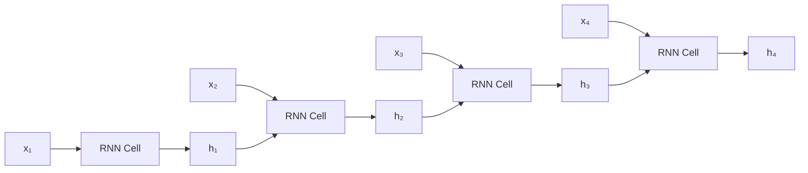

The same RNN cell parameters are reused at every time step.

---

# 🧠 RNN Memory

An RNN does not store the entire historical sequence explicitly.

Instead, it maintains a learned representation:

```text
hₜ
```

which summarizes information from previous time steps.

Conceptually:

```text
x₁
 ↓
h₁
 ↓
x₂
 ↓
h₂
 ↓
x₃
 ↓
h₃
 ↓
x₄
 ↓
h₄
```

Therefore:

```text
h₄
```

contains information derived from:

```text
x₁, x₂, x₃, x₄
```

although older information may become difficult to preserve in a vanilla RNN.

---

# 🧠 Unrolling an RNN

An RNN cell can be represented as a single reusable component:

```text
        ┌───────────────┐
xₜ ───► │   RNN Cell    │ ───► hₜ
hₜ₋₁ ─►│               │
        └───────────────┘
```

When processing a sequence, the cell is conceptually unrolled:

```text
       ┌─────┐       ┌─────┐       ┌─────┐
x₁ ──► │ RNN │ ────► │ RNN │ ────► │ RNN │
       └─────┘       └─────┘       └─────┘
          │             │             │
          ▼             ▼             ▼
         h₁            h₂            h₃
```

The parameters are shared across all time steps.

---

# 🧠 RNN Unrolling

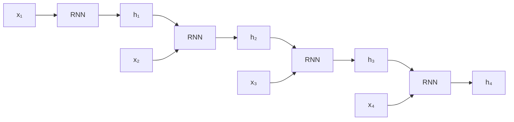

---

# 🧠 RNN Mathematical Formulation

A simple RNN hidden-state equation is:

\[
h_t=\tanh(W_{xh}x_t+W_{hh}h_{t-1}+b_h)
\]


where:

```text
xₜ       = Input at time t
hₜ₋₁     = Previous hidden state
Wₓₕ      = Input-to-hidden weights
Wₕₕ      = Hidden-to-hidden weights
bₕ       = Hidden bias
tanh     = Activation function
hₜ       = Current hidden state
```

---

# 🧠 Output Equation

The hidden state can be transformed into an output:

\[
y_t=W_{hy}h_t+b_y
\]


Therefore:

```text
Input
 ↓
Hidden State
 ↓
Output
```

---

# 🧠 Complete RNN Computation

```text
xₜ
 │
 ▼
Wₓₕxₜ
 │
 ├──────────────┐
 │              │
 ▼              ▼
             Wₕₕhₜ₋₁
 │              │
 └──────┬───────┘
        ▼
      Add
        │
        ▼
      tanh
        │
        ▼
       hₜ
        │
        ▼
     Wₕᵧhₜ
        │
        ▼
       yₜ
```

---

# 🧠 Why Are Weights Shared?

The same RNN parameters are applied at every time step.

```text
Time 1 → W
Time 2 → W
Time 3 → W
Time 4 → W
```

Not:

```text
Time 1 → W₁
Time 2 → W₂
Time 3 → W₃
Time 4 → W₄
```

This provides:

```text
Parameter Sharing
+
Sequence-Length Flexibility
+
Reduced Number of Parameters
```

---

# 🧠 RNN Sequence Processing

Suppose the sequence is:

```text
"I"
"love"
"machine"
"learning"
```

The RNN processes:

```text
x₁ = "I"
 ↓
h₁

x₂ = "love"
 ↓
h₂

x₃ = "machine"
 ↓
h₃

x₄ = "learning"
 ↓
h₄
```

The state evolves as:

```text
h₁ → h₂ → h₃ → h₄
```

---

# 🧠 RNN Input Representation

RNNs do not normally consume raw text directly.

A typical NLP pipeline is:

```text
Text
 ↓
Tokenization
 ↓
Token IDs
 ↓
Embedding
 ↓
RNN
 ↓
Output
```

---

# 🧠 Embeddings + RNN

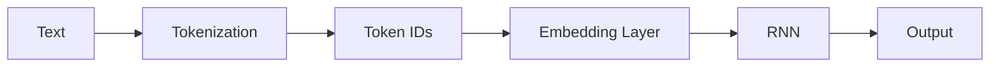

---

# 🧠 RNN Input Tensor

For batch-based training, an RNN commonly receives:

```text
Batch
Sequence Length
Features
```

Conceptually:

```text
(batch_size, sequence_length, input_size)
```

For example:

```text
(32, 20, 128)
```

means:

```text
32 sequences
20 time steps
128 features per time step
```

---

# 🧠 PyTorch RNN Input Shape

With:

```python
batch_first=True
```

the expected input shape is:

```text
(batch_size, sequence_length, input_size)
```

Without:

```python
batch_first=True
```

PyTorch commonly expects:

```text
(sequence_length, batch_size, input_size)
```

This distinction is important when building RNN pipelines.

---

# 🧠 Sequence-to-Sequence Mapping

RNN architectures can support different input/output patterns.

Common patterns include:

```text
One-to-One
One-to-Many
Many-to-One
Many-to-Many
```

---

# 🧠 One-to-One

A standard classification model:

```text
Input
 ↓
Model
 ↓
Output
```

Example:

```text
Image Classification
```

RNNs are generally not needed for this pattern.

---

# 🧠 One-to-Many

One input produces a sequence.

```text
Input
 ↓
RNN
 ↓
Output₁
 ↓
Output₂
 ↓
Output₃
```

Example:

```text
Image
 ↓
Caption
```

---

# 🧠 Many-to-One

A sequence produces one output.

```text
x₁
 ↓
x₂
 ↓
x₃
 ↓
x₄
 ↓
RNN
 ↓
Prediction
```

Examples:

```text
Sentiment Classification
Sequence Classification
Activity Recognition
```

---

# 🧠 Many-to-Many

A sequence produces another sequence.

```text
x₁ → y₁
x₂ → y₂
x₃ → y₃
x₄ → y₄
```

Examples:

```text
Named Entity Recognition
Part-of-Speech Tagging
Sequence Labeling
```

---

# 🧠 Sequence Mapping Patterns

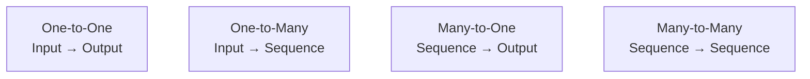

---

# 🧠 Many-to-One Classification

For sentiment classification:

```text
"I really enjoyed this movie"

Token 1
   ↓
Token 2
   ↓
Token 3
   ↓
Token 4
   ↓
Token 5
   ↓
Final Hidden State
   ↓
Classifier
   ↓
Positive
```

The final hidden representation is used for classification.

---

# 🧠 Many-to-One Architecture

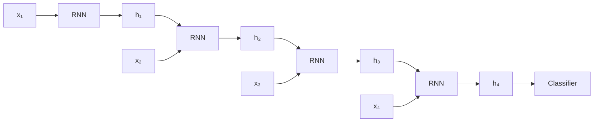

---

# 🧠 Many-to-Many Sequence Labeling

For Named Entity Recognition:

```text
John   lives   in   Berlin

 ↓       ↓      ↓      ↓

B-PER   O      O    B-LOC
```

The model produces an output for each time step.

---

# 🧠 Bidirectional RNN

A standard RNN processes:

```text
Past → Future
```

A Bidirectional RNN processes the sequence in both directions:

```text
Forward:
x₁ → x₂ → x₃ → x₄

Backward:
x₄ → x₃ → x₂ → x₁
```

The two representations are combined.

---

# 🧠 Bidirectional RNN

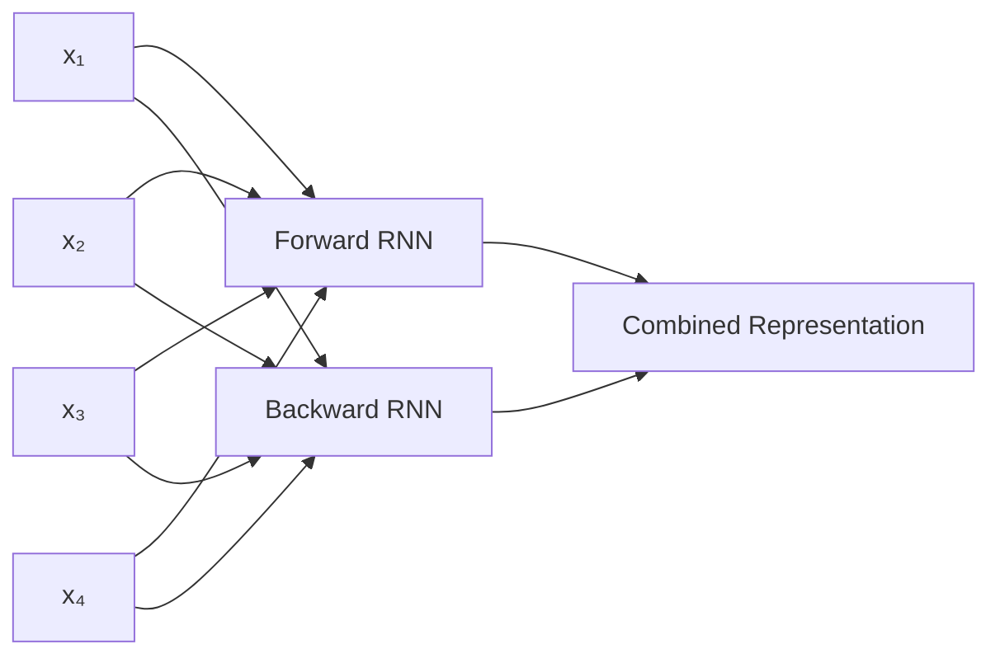

---

# 🧠 Why Use Bidirectional RNNs?

Some tasks benefit from both:

```text
Previous Context
+
Future Context
```

For example:

```text
"The bank approved the loan"
```

The meaning of a word may depend on information appearing later in the sentence.

Bidirectional RNNs can therefore be useful for:

```text
Sequence Classification
Named Entity Recognition
Speech Processing
Sequence Labeling
```

---

# 🧠 Limitation of Bidirectional RNNs

Bidirectional models require access to the complete sequence.

Therefore they are generally unsuitable for strictly causal real-time prediction where future observations are unavailable.

For example:

```text
Real-Time Streaming

Current Event
     ↓
Prediction
```

cannot use:

```text
Future Events
```

that have not happened yet.

---

# 🧠 Stacked RNN

Multiple RNN layers can be stacked.

```text
Input
 ↓
RNN Layer 1
 ↓
RNN Layer 2
 ↓
RNN Layer 3
 ↓
Output
```

The first layer learns lower-level temporal representations.

Higher layers can learn more abstract sequence patterns.

---

# 🧠 Stacked RNN Architecture

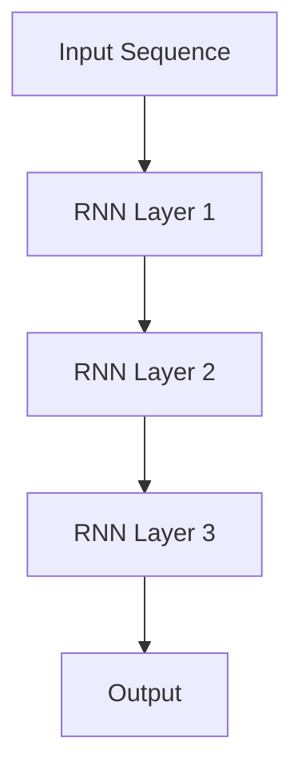

---

# 🧠 Deep RNN

A stacked RNN creates depth in two dimensions:

```text
Time

t₁ → t₂ → t₃ → t₄
```

and:

```text
Layer 1
   ↓
Layer 2
   ↓
Layer 3
```

Conceptually:

```text
          Time
      →     →     →     →

L1   h₁ →  h₂ →  h₃ →  h₄
      ↓     ↓     ↓     ↓
L2   h₁ →  h₂ →  h₃ →  h₄
      ↓     ↓     ↓     ↓
L3   h₁ →  h₂ →  h₃ →  h₄
```

---

# 🧠 The Long-Term Dependency Problem

Consider:

```text
"I grew up in France and I speak fluent ______."
```

The model may need to remember:

```text
France
```

for many time steps before predicting:

```text
French
```

A vanilla RNN can struggle to preserve this information over long sequences.

This is called the:

> **Long-Term Dependency Problem**

---

# ⚠ Vanishing Gradient Problem

During training, gradients are propagated backward through time.

For a long sequence:

```text
t₁
 ↓
t₂
 ↓
t₃
 ↓
...
 ↓
t₁₀₀
```

the gradient repeatedly passes through recurrent transformations.

If the gradients become smaller at each step:

```text
1.0
 ↓
0.5
 ↓
0.25
 ↓
0.125
 ↓
...
 ↓
≈ 0
```

the network receives almost no useful gradient for earlier time steps.

---

# 🧠 Vanishing Gradients

Conceptually:

```text
Loss
 ↓
Gradient
 ↓
t₁₀
 ↓
t₉
 ↓
t₈
 ↓
...
 ↓
t₁

Gradient magnitude
     ↓
     ↓
     ↓
     ↓
   ≈ 0
```

This makes it difficult to learn long-range dependencies.

---

# 🧠 Mathematical Intuition

During recurrent backpropagation, gradients involve repeated multiplication of Jacobian terms.

Conceptually:

\[
\frac{\partial L}{\partial h_t}
\propto
\prod_{k=t+1}^{T}
\frac{\partial h_k}{\partial h_{k-1}}
\]


If these factors tend to have magnitude below 1, repeated multiplication can cause the gradient to shrink rapidly.

---

# ⚠ Exploding Gradient Problem

The opposite can also occur.

If gradients repeatedly grow:

```text
1
 ↓
2
 ↓
4
 ↓
8
 ↓
16
 ↓
...
```

the gradient can become extremely large.

This is called:

> **Exploding Gradients**

---

# 🧠 Vanishing vs Exploding Gradients

| Problem | Gradient Behavior | Effect |
|---|---|---|
| Vanishing Gradient | Becomes very small | Earlier time steps learn poorly |
| Exploding Gradient | Becomes extremely large | Training becomes unstable |

---

# 🧠 Gradient Clipping

Gradient clipping can help control exploding gradients.

For example:

```python
torch.nn.utils.clip_grad_norm_(
    model.parameters(),
    max_norm=1.0
)
```

Typical training flow:

```python
loss.backward()

torch.nn.utils.clip_grad_norm_(
    model.parameters(),
    max_norm=1.0
)

optimizer.step()
```

This does not solve the fundamental long-term dependency problem, but it can stabilize training when gradients become excessively large.

---

# 🧠 Why Vanilla RNNs Struggle

The fundamental architecture repeatedly applies the same recurrent transformation.

```text
h₁
 ↓
h₂
 ↓
h₃
 ↓
h₄
 ↓
...
 ↓
h₁₀₀
```

Long sequences therefore create a long chain of dependencies.

The network may struggle to preserve important information from early time steps.

---

# 🧠 RNN → LSTM → GRU

The limitations of vanilla RNNs motivated improved recurrent architectures.

```text
Vanilla RNN
     ↓
LSTM
     ↓
GRU
```

LSTM introduces:

```text
Cell State
+
Gates
```

GRU provides a simpler gated mechanism.

The next chapter covers:

**[25. LSTM and GRU](25-lstm-and-gru.md)**.

---

# 🧠 Teacher Forcing

In sequence generation, the model may predict one token at a time.

During training, instead of feeding the model's previous prediction back into the next step, the actual previous target can be provided.

This is called:

> **Teacher Forcing**

---

# 🧠 Teacher Forcing

Without teacher forcing:

```text
Prediction₁
    ↓
Input₂
    ↓
Prediction₂
    ↓
Input₃
```

With teacher forcing:

```text
Prediction₁

Actual Target₁
     ↓
   Input₂
     ↓
Prediction₂

Actual Target₂
     ↓
   Input₃
```

---

# 🧠 Teacher Forcing Trade-Off

Teacher forcing can make training faster and easier.

However, during inference:

```text
Actual Previous Token
```

may not be available.

The model must use:

```text
Its Own Previous Prediction
```

This creates a difference between:

```text
Training
vs
Inference
```

known as:

```text
Exposure Bias
```

---

# 🧠 RNN for Time-Series

RNNs can process time-series data.

Example:

```text
Temperature
 ↓
Humidity
 ↓
Pressure
 ↓
Wind
 ↓
Future Temperature
```

A sliding sequence can be created:

```text
[t₁, t₂, t₃] → t₄
[t₂, t₃, t₄] → t₅
[t₃, t₄, t₅] → t₆
```

---

# 🧠 Time-Series RNN Architecture

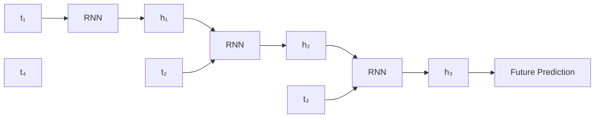

---

# 🐍 Part I — PyTorch RNN

PyTorch provides:

```python
nn.RNN
```

for implementing vanilla recurrent networks.

---

# 🧪 Create an RNN

```python
import torch
import torch.nn as nn


rnn = nn.RNN(
    input_size=128,
    hidden_size=64,
    num_layers=1,
    batch_first=True
)
```

Here:

```text
input_size  = 128
hidden_size = 64
num_layers  = 1
```

---

# 🧠 RNN Input Shape

With:

```python
batch_first=True
```

the input shape is:

```text
(batch_size, sequence_length, input_size)
```

Example:

```python
x = torch.randn(
    32,
    20,
    128
)
```

means:

```text
Batch Size      = 32
Sequence Length = 20
Features        = 128
```

---

# 🧪 Forward Pass

```python
output, hidden = rnn(
    x
)
```

The outputs represent the hidden representation for each time step.

Conceptually:

```text
output
 ↓
h₁, h₂, h₃, ..., hₜ
```

The final hidden state is also returned.

---

# 🧠 Output vs Hidden State

For a typical RNN:

```text
output
=
Hidden State at Every Time Step
```

while:

```text
hidden
=
Final Hidden State
```

For example:

```text
output:

h₁
h₂
h₃
h₄


hidden:

h₄
```

---

# 🧠 Tensor Shapes

For:

```text
num_layers = L
batch_size = B
sequence_length = T
hidden_size = H
```

with:

```python
batch_first=True
```

the output shape is:

```text
B × T × H
```

The hidden state shape is:

```text
L × B × H
```

---

# 🧪 Complete RNN Classifier

```python
class RNNClassifier(
    nn.Module
):

    def __init__(
        self,
        input_size,
        hidden_size,
        num_classes
    ):

        super().__init__()

        self.rnn = nn.RNN(
            input_size=input_size,
            hidden_size=hidden_size,
            batch_first=True
        )

        self.fc = nn.Linear(
            hidden_size,
            num_classes
        )

    def forward(
        self,
        x
    ):

        output, hidden = self.rnn(
            x
        )

        last_hidden = hidden[-1]

        logits = self.fc(
            last_hidden
        )

        return logits
```

---

# 🧠 RNN Classifier Architecture

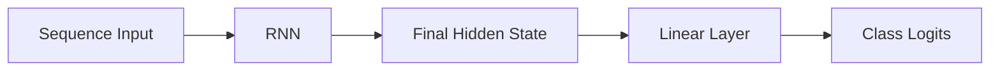

---

# 🧪 Create the Model

```python
model = RNNClassifier(
    input_size=128,
    hidden_size=64,
    num_classes=3
)
```

---

# 🧪 Loss and Optimizer

```python
criterion = nn.CrossEntropyLoss()

optimizer = torch.optim.AdamW(
    model.parameters(),
    lr=1e-3,
    weight_decay=1e-4
)
```

---

# 🧪 Training Loop

```python
for epoch in range(
    epochs
):

    model.train()

    for x, y in train_loader:

        x = x.to(
            device
        )

        y = y.to(
            device
        )

        optimizer.zero_grad()

        logits = model(
            x
        )

        loss = criterion(
            logits,
            y
        )

        loss.backward()

        torch.nn.utils.clip_grad_norm_(
            model.parameters(),
            max_norm=1.0
        )

        optimizer.step()
```

---

# 🧠 Why Clip Gradients?

RNNs can suffer from exploding gradients.

Therefore:

```text
Backward Pass
     ↓
Gradient Computation
     ↓
Gradient Clipping
     ↓
Optimizer Update
```

can improve training stability.

---

# 🧠 Multiple RNN Layers

PyTorch supports stacked RNNs:

```python
rnn = nn.RNN(
    input_size=128,
    hidden_size=64,
    num_layers=3,
    batch_first=True
)
```

This creates:

```text
RNN Layer 1
     ↓
RNN Layer 2
     ↓
RNN Layer 3
```

---

# 🧠 Dropout in Stacked RNNs

PyTorch supports dropout between recurrent layers when multiple layers are used.

For example:

```python
rnn = nn.RNN(
    input_size=128,
    hidden_size=64,
    num_layers=3,
    dropout=0.2,
    batch_first=True
)
```

The exact dropout behavior depends on the framework implementation.

---

# 🧠 Bidirectional RNN in PyTorch

A bidirectional RNN can be created using:

```python
rnn = nn.RNN(
    input_size=128,
    hidden_size=64,
    batch_first=True,
    bidirectional=True
)
```

The output hidden dimension becomes:

```text
64 × 2
=
128
```

because:

```text
Forward Hidden State
+
Backward Hidden State
```

are combined.

---

# 🧠 Bidirectional Tensor Shape

For:

```text
hidden_size = H
bidirectional = True
```

the output feature dimension becomes:

\[
2H
\]


For example:

```text
hidden_size = 64

Output Features = 128
```

---

# 🧪 Bidirectional Classifier

```python
class BiRNNClassifier(
    nn.Module
):

    def __init__(
        self,
        input_size,
        hidden_size,
        num_classes
    ):

        super().__init__()

        self.rnn = nn.RNN(
            input_size=input_size,
            hidden_size=hidden_size,
            batch_first=True,
            bidirectional=True
        )

        self.fc = nn.Linear(
            hidden_size * 2,
            num_classes
        )

    def forward(
        self,
        x
    ):

        output, hidden = self.rnn(
            x
        )

        forward_hidden = hidden[-2]

        backward_hidden = hidden[-1]

        combined = torch.cat(
            (
                forward_hidden,
                backward_hidden
            ),
            dim=1
        )

        return self.fc(
            combined
        )
```

---

# 🧠 Variable-Length Sequences

Real-world sequence data often has different lengths.

Example:

```text
Sequence A → 10 tokens
Sequence B → 20 tokens
Sequence C → 15 tokens
```

Batches require tensors with compatible dimensions.

A common solution is:

```text
Padding
+
Packed Sequences
```

---

# 🧠 Padding

Sequences can be padded:

```text
A:
[1, 2, 3, 4, PAD, PAD]

B:
[1, 2, 3, 4, 5, 6]
```

However, the model should avoid treating:

```text
PAD
```

as meaningful input.

---

# 🧠 Packed Sequences

PyTorch provides utilities such as:

```python
pack_padded_sequence
```

and:

```python
pad_packed_sequence
```

to efficiently process variable-length sequences.

---

# 🧪 Packed Sequence Example

```python
from torch.nn.utils.rnn import (
    pack_padded_sequence,
    pad_packed_sequence
)


packed = pack_padded_sequence(
    x,
    lengths,
    batch_first=True,
    enforce_sorted=False
)


output, hidden = rnn(
    packed
)


output, lengths = (
    pad_packed_sequence(
        output,
        batch_first=True
    )
)
```

This allows the RNN to avoid unnecessary computation over padded positions.

---

# 🧠 Masking

Another common strategy is masking.

Conceptually:

```text
Real Token → 1
Padding    → 0
```

The mask tells downstream operations which positions should contribute.

Masking becomes especially important for:

```text
Attention
Loss Computation
Sequence Pooling
Evaluation
```

---

# 🧠 RNN Applications

RNNs have historically been used for:

### Natural Language Processing

```text
Text Classification
Language Modeling
Sequence Labeling
Named Entity Recognition
Machine Translation
```

### Speech

```text
Speech Recognition
Audio Sequence Modeling
```

### Time-Series

```text
Demand Forecasting
Sensor Prediction
Anomaly Detection
Financial Time Series
```

### User Behavior

```text
Clickstream Modeling
Session Prediction
Recommendation
```

---

# 🧠 RNN Application Architecture

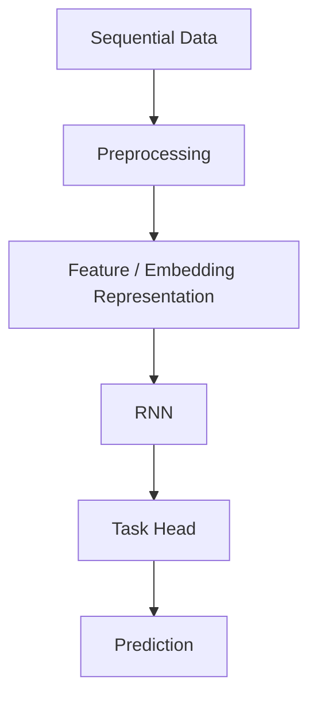

---

# 🧠 RNN for Language Modeling

A language model predicts the next token.

For:

```text
"The weather is"
```

the model predicts:

```text
"good"
```

Conceptually:

```text
"The"
 ↓
"weather"
 ↓
"is"
 ↓
Prediction
```

---

# 🧠 Language Modeling

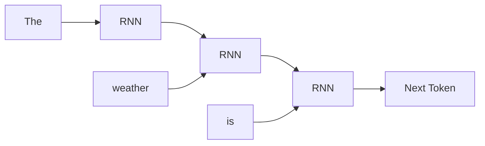

---

# 🧠 RNN for Time-Series Forecasting

For a sequence:

```text
[t₁, t₂, t₃, t₄]
```

the model can predict:

```text
t₅
```

Then for rolling forecasting:

```text
[t₂, t₃, t₄, t₅]
```

can be used to predict:

```text
t₆
```

---

# 🧠 RNN Forecasting

```text
Historical Sequence
        ↓
      RNN
        ↓
Next Value
        ↓
Updated Sequence
        ↓
      RNN
        ↓
Next Value
```

This can be used for multi-step forecasting, although recursive forecasting can accumulate prediction errors.

---

# ⚠ RNN Limitations

Vanilla RNNs have several limitations:

- Vanishing gradients
- Exploding gradients
- Difficulty learning long-term dependencies
- Sequential computation
- Limited parallelism across time steps
- Training can become slow for long sequences
- Performance can degrade for very long sequences
- Hidden-state bottleneck
- Difficulty retaining information over long contexts

---

# 🧠 Sequential Computation Bottleneck

An RNN naturally processes:

```text
x₁
 ↓
x₂
 ↓
x₃
 ↓
x₄
```

The next computation depends on the previous hidden state.

Therefore, time steps cannot be fully parallelized during the recurrent computation.

This is an important difference from Transformer architectures.

---

# 🧠 RNN vs Transformer

| RNN | Transformer |
|---|---|
| Sequential processing | Highly parallelizable during training |
| Hidden state | Token representations + attention |
| Limited long-term memory | Strong long-range relationship modeling |
| Recurrent computation | Self-attention |
| Naturally handles sequential order | Requires positional information |
| Older sequence architecture | Modern dominant architecture for many sequence tasks |

Transformers are covered in:

**[27. Transformer Architecture](27-transformer-architecture.md)**.

---

# 🧠 Evolution of Sequence Models

```text
Feed-Forward Networks
        ↓
Vanilla RNN
        ↓
LSTM / GRU
        ↓
Attention
        ↓
Transformers
        ↓
Large Language Models
        ↓
Foundation Models
```

---

# 🧠 RNN → LSTM → Transformer

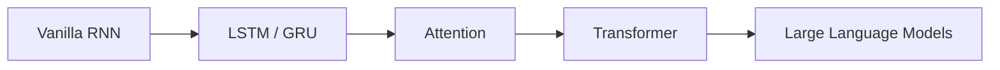

RNNs remain important because they explain the historical and conceptual foundation of modern sequence modeling.

---

# 🏢 Enterprise Perspective

RNNs are less dominant than they once were for many large-scale sequence problems, but they remain useful for:

```text
Streaming Data
Time-Series
Resource-Constrained Inference
Legacy ML Systems
Low-Latency Sequential Processing
```

They are also important for understanding why modern architectures evolved.

---

# 🏢 Production RNN Architecture

A production sequence-processing system may look like:

```text
Data Source
    ↓
Streaming / Batch Pipeline
    ↓
Feature Engineering
    ↓
Sequence Builder
    ↓
RNN Model
    ↓
Prediction
    ↓
Business Service
```

---

# 🏢 Enterprise RNN Architecture

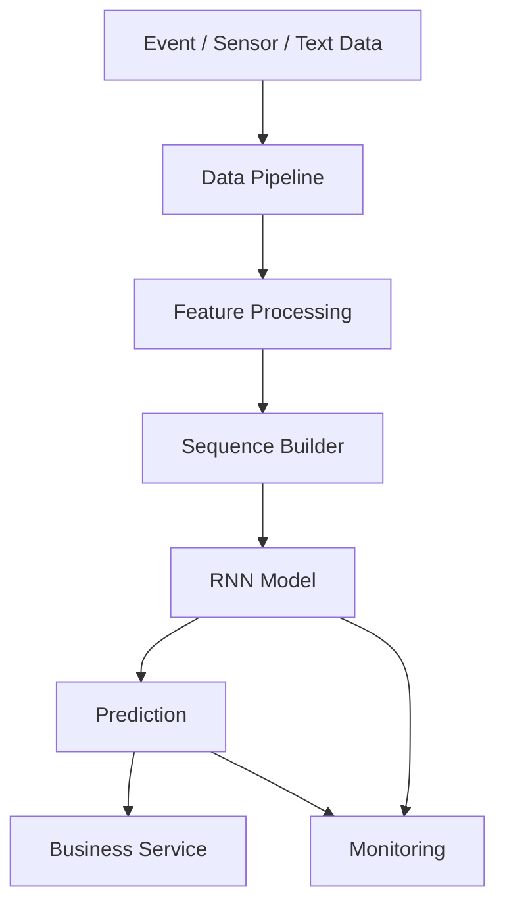

---

# 🏢 Streaming RNN Systems

RNNs can be attractive for streaming use cases because the hidden state can represent historical information.

Conceptually:

```text
Event₁
 ↓
h₁

Event₂
 ↓
h₂

Event₃
 ↓
h₃

Event₄
 ↓
h₄
```

The state can be updated incrementally.

However, state management becomes an important production concern.

---

# 🏢 Stateful Inference

A stateful service might maintain:

```text
User Session
      ↓
Hidden State
      ↓
New Event
      ↓
Updated Hidden State
```

But production systems must carefully manage:

```text
Session Identity
State Expiration
Concurrency
Fault Recovery
State Persistence
Model Version Compatibility
```

---

# 🏢 RNN State Management

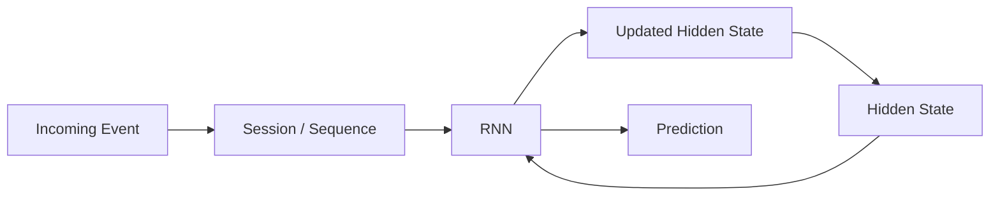

---

# 🏢 Model Versioning

For production sequence models, track:

```text
Model Version
Training Dataset Version
Feature Version
Sequence Length
Tokenizer Version
Embedding Version
Training Configuration
Evaluation Metrics
Deployment Version
```

For NLP systems, also track:

```text
Vocabulary
Tokenization Rules
Special Tokens
Padding Strategy
```

---

# 🏢 Monitoring RNN Systems

Production monitoring should include:

### Infrastructure

```text
CPU
GPU
Memory
Latency
Throughput
```

### Model

```text
Prediction Distribution
Accuracy
Precision
Recall
F1
Loss
```

### Data

```text
Input Drift
Feature Drift
Sequence Length Distribution
Missing Values
Padding Ratio
```

### Operational State

```text
Hidden-State Errors
Session State
State Expiration
Sequence Corruption
```

---

# 🏢 RNN Production Challenges

A production RNN may face:

```text
Long Sequences
      ↓
Memory Growth
      ↓
Training Cost
```

and:

```text
Stateful Inference
      ↓
State Management
      ↓
Operational Complexity
```

Therefore architecture decisions should consider whether an RNN is genuinely appropriate for the workload.

---

# 🧠 When Should You Use an RNN?

RNNs may still be reasonable when:

```text
Sequence Length is Moderate
+
Streaming Processing is Important
+
Model is Relatively Small
+
Sequential State is Useful
+
Infrastructure is Constrained
```

---

# 🧠 When Should You Prefer LSTM / GRU?

Use gated recurrent architectures when:

```text
Longer Dependencies
+
Sequential Processing
+
More Stable Memory
```

are important.

LSTM and GRU are covered in:

**[25. LSTM and GRU](25-lstm-and-gru.md)**.

---

# 🧠 When Should You Prefer Transformers?

Transformers may be preferable when:

```text
Long Context
+
Large-Scale Training
+
High Parallelism
+
Global Relationships
+
Large Pretrained Models
```

are important.

---

# 🧠 Sequence Architecture Decision

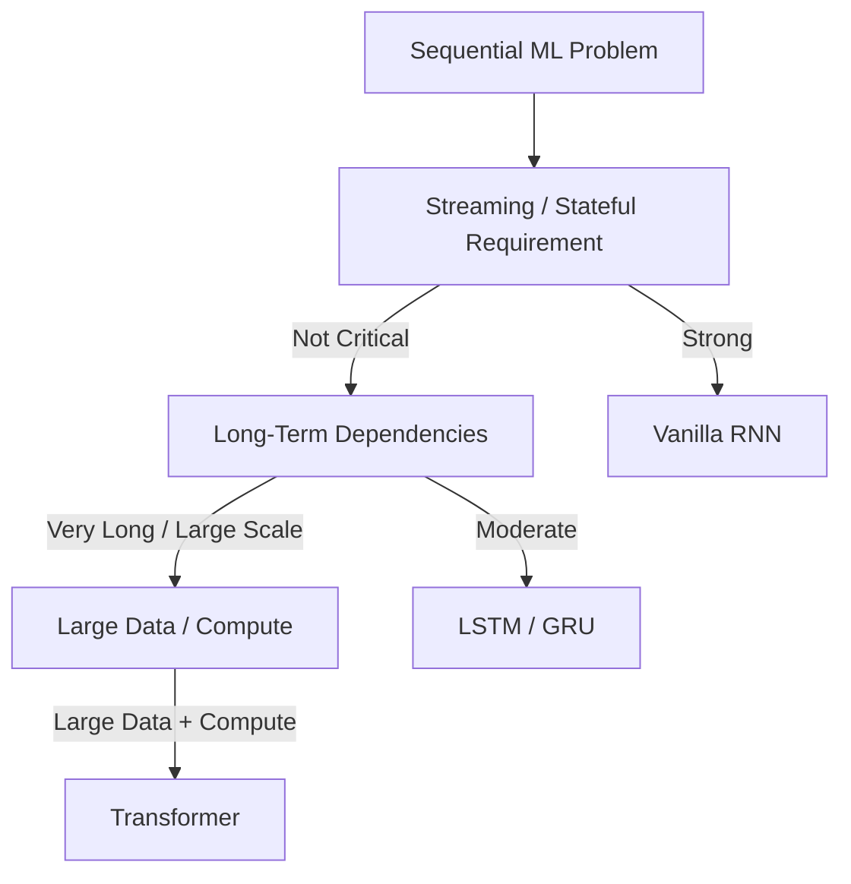

This is a conceptual decision guide rather than a universal rule.

---

# 🧪 Practical Exercise 1 — Build a Vanilla RNN

Create:

```text
Input Size = 32
Hidden Size = 64
Sequence Length = 20
```

Build a PyTorch RNN and inspect:

```text
Output Shape
Hidden State Shape
```

---

# 🧪 Practical Exercise 2 — Many-to-One Classification

Build an RNN classifier for:

```text
3 Classes
```

Use:

```text
Final Hidden State
        ↓
Linear Layer
        ↓
Class Prediction
```

---

# 🧪 Practical Exercise 3 — Sequence Labeling

Modify the model so that it produces an output for every time step.

Expected:

```text
Input:

x₁ x₂ x₃ x₄

Output:

y₁ y₂ y₃ y₄
```

---

# 🧪 Practical Exercise 4 — Bidirectional RNN

Create:

```python
nn.RNN(
    ...,
    bidirectional=True
)
```

Compare:

```text
Unidirectional
vs
Bidirectional
```

on a sequence classification task.

---

# 🧪 Practical Exercise 5 — Stacked RNN

Compare:

```text
1 Layer
2 Layers
3 Layers
```

Measure:

```text
Training Loss
Validation Loss
Accuracy
Training Time
```

---

# 🧪 Practical Exercise 6 — Gradient Clipping

Train the same RNN:

```text
Without Gradient Clipping
```

and:

```text
With Gradient Clipping
```

Compare training stability.

---

# 🧪 Practical Exercise 7 — Long-Term Dependency

Create a synthetic sequence task where the model must remember information from an early time step.

Experiment with:

```text
Sequence Length = 10
Sequence Length = 50
Sequence Length = 100
```

Observe how vanilla RNN performance changes.

---

# 🧪 Practical Exercise 8 — Time-Series Forecasting

Create a synthetic time series:

```text
sin(t)
```

and train an RNN to predict:

```text
next value
```

Compare:

```text
Actual
vs
Predicted
```

---

# 🧪 Practical Exercise 9 — Variable-Length Sequences

Create sequences of different lengths.

Implement:

```text
Padding
+
Packed Sequences
```

and verify that the model processes only valid sequence positions.

---

# 🧪 Practical Exercise 10 — RNN vs LSTM

Train:

```text
Vanilla RNN
```

and:

```text
LSTM
```

on a long-term dependency task.

Compare:

```text
Training Stability
Validation Accuracy
Long-Term Dependency Performance
```

---

# 🧪 Practical Exercise 11 — RNN vs Transformer

Use the same sequence classification dataset.

Compare:

```text
RNN
vs
Transformer Encoder
```

Measure:

```text
Accuracy
Training Time
Inference Latency
Memory
```

---

# 🧠 Interview Questions

## Beginner

### 1. What is an RNN?

An RNN is a neural network architecture designed for sequential data that maintains a hidden state across time steps.

### 2. What is the hidden state?

The hidden state is a learned representation carrying information from previous time steps.

### 3. Why are RNNs useful for sequential data?

Because the current representation depends on both the current input and previous hidden state.

### 4. What is an RNN cell?

The computational unit that combines the current input and previous hidden state to produce a new hidden state.

### 5. What does unrolling an RNN mean?

It means representing the recurrent computation across individual time steps so that the sequence processing and backpropagation can be understood through time.

---

## Intermediate

### 6. What is the basic RNN equation?

\[
h_t=\tanh(W_{xh}x_t+W_{hh}h_{t-1}+b_h)
\]


### 7. What is parameter sharing in an RNN?

The same recurrent weights are reused across all time steps.

### 8. What is a many-to-one RNN?

A sequence is processed to produce a single output, such as sentiment classification.

### 9. What is a many-to-many RNN?

A sequence produces outputs across multiple time steps, such as sequence labeling.

### 10. What is a Bidirectional RNN?

An RNN that processes the sequence in both forward and backward directions.

### 11. What is the main problem with vanilla RNNs?

They can suffer from vanishing and exploding gradients and have difficulty learning long-term dependencies.

### 12. What is gradient clipping?

A technique that limits gradient magnitude to reduce the risk of exploding gradients.

---

## Advanced

### 13. What is Backpropagation Through Time?

BPTT applies backpropagation to the unrolled recurrent network across its time steps.

### 14. Why do RNNs suffer from vanishing gradients?

Repeated multiplication of recurrent derivatives can cause gradient magnitudes to shrink toward zero.

### 15. Why do RNNs suffer from exploding gradients?

Repeated multiplication can instead cause gradient magnitudes to grow rapidly.

### 16. Why do LSTMs help with long-term dependencies?

They introduce gated memory mechanisms that provide a more controlled path for retaining and updating information.

### 17. Why are RNNs difficult to parallelize across time?

The hidden state at time `t` depends on the hidden state from time `t-1`.

### 18. What is teacher forcing?

A training strategy where the actual previous target is provided as the next input rather than the model's previous prediction.

### 19. What is exposure bias?

The difference between training with ground-truth previous tokens and inference where the model must consume its own predictions.

### 20. When would a Bidirectional RNN be inappropriate?

When future information is unavailable at prediction time, such as strictly causal real-time streaming prediction.

### 21. What is the difference between an RNN and a Transformer?

An RNN processes sequences recurrently through hidden states, while a Transformer uses attention mechanisms to model relationships between tokens and can parallelize much of training.

### 22. Why are RNNs still relevant?

They remain useful for understanding sequential modeling and can still be appropriate for certain streaming, time-series, and resource-constrained workloads.

---

# 🏢 Enterprise Perspective

RNNs represent an important stage in the evolution of Deep Learning for sequential data.

The architectural progression is:

```text
Feed-Forward Networks
        ↓
Vanilla RNN
        ↓
LSTM / GRU
        ↓
Attention
        ↓
Transformer
        ↓
Foundation Models
```

Understanding RNNs makes it easier to understand why:

```text
Memory
+
Long-Term Dependencies
+
Parallelism
+
Attention
```

became increasingly important in modern AI systems.

---

# 🏢 Enterprise Sequence Modeling

A production sequence system may process:

```text
Events
 ↓
Feature Pipeline
 ↓
Sequence Construction
 ↓
Embedding
 ↓
Sequence Model
 ↓
Prediction
 ↓
Business Decision
```

Examples include:

```text
Fraud Detection
Demand Forecasting
Predictive Maintenance
User Behavior Prediction
Anomaly Detection
Speech Processing
Text Classification
```

---

# 🏢 Production Architecture Considerations

Before selecting an RNN, evaluate:

```text
Sequence Length
State Requirements
Latency
Throughput
Training Parallelism
Model Size
Memory
Data Volume
Pretraining Availability
Monitoring Requirements
```

---

# 🏢 Production Insight

!!! tip "Production Insight"

    **RNNs should not be selected simply because the input is sequential.**

    Modern sequence modeling provides several choices:

    ```text
    RNN
      ↓
    LSTM / GRU
      ↓
    Transformer
    ```

    The architecture should be selected based on:

    ```text
    Sequence Length
    +
    Long-Term Dependency Requirements
    +
    Streaming Constraints
    +
    Training Scale
    +
    Latency
    +
    Infrastructure
    ```

    RNNs can still be excellent for compact stateful workloads, but Transformers are often a stronger choice when long context, large-scale training, and parallelism dominate the requirements.

---

# 📌 Key Takeaways

- RNNs are designed to model sequential data.
- RNNs maintain a hidden state across time steps.
- The hidden state combines information from the current input and previous state.
- The same recurrent parameters are reused at every time step.
- RNNs can be unrolled across time for training.
- Backpropagation Through Time is used to train recurrent networks.
- RNNs support one-to-many, many-to-one, and many-to-many patterns.
- Bidirectional RNNs process sequences in both directions.
- Stacked RNNs can provide additional model depth.
- Variable-length sequences require techniques such as padding, masking, and packed sequences.
- Vanilla RNNs suffer from vanishing gradients.
- Vanilla RNNs can also suffer from exploding gradients.
- Gradient clipping can help control exploding gradients.
- Vanilla RNNs struggle with long-term dependencies.
- LSTM and GRU architectures were introduced to address important limitations of vanilla RNNs.
- Teacher forcing can improve sequence-generation training but introduces exposure bias.
- RNNs process sequences sequentially, limiting parallelism across time.
- RNNs remain useful for certain streaming and stateful workloads.
- Transformers provide stronger parallelism and global context modeling for many modern sequence tasks.
- RNNs form an important conceptual foundation for understanding LSTM, GRU, attention, and Transformer architectures.

---

# 📚 Further Reading

Continue with:

- **[25. LSTM and GRU](25-lstm-and-gru.md)**
- **[26. Attention and Positional Encoding](26-attention-and-positional-encoding.md)**
- **[27. Transformer Architecture](27-transformer-architecture.md)**
- **[28. Transformer Applications](28-transformer-applications.md)**
- **[36. Deep Learning Training and Model Lifecycle](36-deep-learning-training-and-model-lifecycle.md)**
- **[37. Building Production Deep Learning Systems](37-building-production-deep-learning-systems.md)**

The next chapter introduces **LSTM and GRU**, gated recurrent architectures designed to address the long-term dependency and gradient-flow limitations of vanilla RNNs.

---

## ➡️ Next Chapter

**[25. LSTM and GRU](25-lstm-and-gru.md)**

---

> **Enterprise AI Engineering Handbook**  
> *Building Production-Grade Enterprise AI Systems — One Chapter at a Time.*