# 25. LSTM and GRU

> Understand how Long Short-Term Memory (LSTM) and Gated Recurrent Unit (GRU) networks overcome key limitations of vanilla RNNs by introducing learnable gating mechanisms for controlling information flow, preserving long-term dependencies, and building more robust sequence-processing systems.

---

## 🎯 Learning Objectives

After completing this chapter, you will be able to:

- Explain why LSTM and GRU were introduced
- Understand the limitations of vanilla RNNs
- Explain the vanishing gradient problem in recurrent networks
- Understand the concept of gated recurrent architectures
- Explain the LSTM cell architecture
- Understand the LSTM cell state
- Explain input, forget, and output gates
- Understand how information flows through an LSTM
- Understand the mathematical formulation of LSTM
- Explain how LSTM preserves long-term information
- Understand GRU architecture
- Explain update and reset gates in GRU
- Compare LSTM and GRU
- Understand bidirectional LSTM and GRU
- Build LSTM and GRU models using PyTorch
- Handle sequence classification with LSTM and GRU
- Apply LSTM to time-series problems
- Understand stacked LSTM and GRU architectures
- Understand packed sequences and variable-length inputs
- Understand gradient clipping for recurrent networks
- Select between RNN, LSTM, GRU, and Transformer architectures
- Understand production considerations for recurrent sequence models

---

# 📖 Overview

Vanilla Recurrent Neural Networks introduced the ability to carry information across time.

The basic concept was:

```text
Current Input
      +
Previous Hidden State
      ↓
RNN Cell
      ↓
Current Hidden State
```

However, vanilla RNNs struggle to preserve information over long sequences.

The major problem is:

```text
Long Sequence
      ↓
Repeated Gradient Multiplication
      ↓
Vanishing / Exploding Gradients
      ↓
Difficulty Learning Long-Term Dependencies
```

LSTM and GRU architectures address this problem using **gates**.

Instead of allowing every piece of information to flow through the recurrent network in the same way, gates learn:

```text
What to Remember
What to Forget
What to Update
What to Output
```

---

# 🧠 Why LSTM and GRU?

Consider:

```text
"I was born in India, moved to Germany several years ago, and now I live in ______."
```

A sequence model may need to retain information from much earlier in the sequence.

A vanilla RNN can struggle with such long-term dependencies.

LSTM introduces a dedicated:

```text
Cell State
```

along with gates that regulate information flow.

GRU provides a simpler gated architecture using:

```text
Update Gate
+
Reset Gate
```

---

# 🧠 Evolution of Recurrent Networks

```text
Vanilla RNN
     │
     │ Long-Term Dependency Problems
     ▼
   LSTM
     │
     │ Simplified Gated Architecture
     ▼
    GRU
     │
     │ Attention + Parallelism
     ▼
Transformer
```

---

# 🧠 Vanilla RNN vs LSTM vs GRU

| Architecture | Memory Mechanism | Gates | Parameters | Long-Term Dependencies |
|---|---|---:|---:|---|
| Vanilla RNN | Hidden State | None | Lower | Weak |
| LSTM | Hidden + Cell State | 3 main gates | Higher | Strong |
| GRU | Hidden State | 2 main gates | Lower than LSTM | Strong |
| Transformer | Attention | Attention mechanisms | Variable | Strong |

---

# 🧠 Core Idea of Gated Networks

A gated recurrent network learns to control information flow.

Conceptually:

```text
                 ┌───────────────┐
Input ──────────►│               │
                 │  Gated Cell   │────► Output
Previous State ─►│               │
                 └───────────────┘
                         │
                         ▼
                    New State
```

The gates are learnable functions.

---

# 🧠 LSTM Architecture

An LSTM maintains two important states:

```text
Hidden State
+
Cell State
```

The cell state provides a relatively direct path for information to flow through time.

```text
        Cell State
══════════════════════════════════════►

         ▲        ▲        ▲
         │        │        │
       Forget   Input    Output
        Gate     Gate     Gate

x₁ ─────► LSTM ─────► LSTM ─────► LSTM
          │            │            │
          h₁           h₂           h₃
```

---

# 🧠 LSTM State

At every time step, an LSTM maintains:

```text
cₜ = Cell State
hₜ = Hidden State
```

The cell state is primarily responsible for long-term information flow.

The hidden state is used as the current output representation and is passed to the next time step.

---

# 🧠 LSTM Information Flow

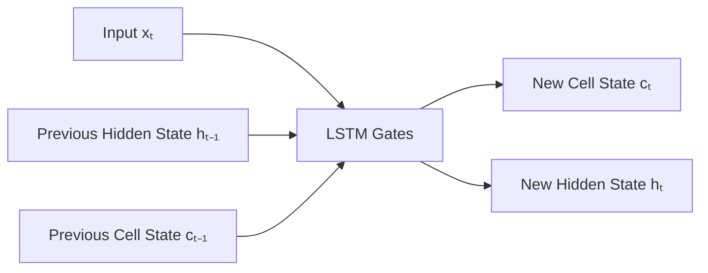

---

# 🧠 The Three Main LSTM Gates

An LSTM contains three primary gates:

```text
Forget Gate
Input Gate
Output Gate
```

Each gate uses a sigmoid function.

The sigmoid output lies between:

\[
0 < \sigma(x) < 1
\]


This makes sigmoid useful for controlling how much information passes through.

Conceptually:

```text
0
│
├── Block Information
│
├── Partial Information
│
└── 1
    Allow Information
```

---

# 🧠 Forget Gate

The forget gate determines which information from the previous cell state should be retained.

The equation is:

\[
f_t=\sigma(W_f[h_{t-1},x_t]+b_f)
\]


where:

```text
fₜ = Forget Gate
hₜ₋₁ = Previous Hidden State
xₜ = Current Input
Wf = Learnable Weights
bf = Bias
```

---

# 🧠 Forget Gate Intuition

Suppose the previous cell state contains:

```text
Old Information
Old Information
Important Information
Old Information
```

The forget gate may learn:

```text
0.1
0.2
0.9
0.1
```

Meaning:

```text
Mostly Forget
Mostly Forget
Strongly Retain
Mostly Forget
```

---

# 🧠 Input Gate

The input gate determines how much new information should be written into the cell state.

The input gate is:

\[
i_t=\sigma(W_i[h_{t-1},x_t]+b_i)
\]


---

# 🧠 Candidate Cell State

The LSTM also creates candidate information:

\[
\tilde{c}_t=\tanh(W_c[h_{t-1},x_t]+b_c)
\]


The candidate contains information that could potentially be added to the cell state.

---

# 🧠 Cell State Update

The new cell state is:

\[
c_t=f_t\odot c_{t-1}+i_t\odot\tilde{c}_t
\]


where:

```text
⊙ = Element-wise multiplication
```

This equation is central to LSTM memory management.

---

# 🧠 Cell State Update Intuition

```text
Previous Cell State
        │
        ▼
   Forget Gate
        │
        ▼
Retained Information
        │
        ├───────────────┐
        │               │
        │        Candidate Information
        │               │
        │          Input Gate
        │               │
        └───────┬───────┘
                ▼
          New Cell State
```

---

# 🧠 Output Gate

The output gate determines which information from the updated cell state should become the hidden state.

\[
o_t=\sigma(W_o[h_{t-1},x_t]+b_o)
\]


---

# 🧠 Hidden State

The new hidden state is:

\[
h_t=o_t\odot\tanh(c_t)
\]


The hidden state becomes:

```text
Current Output Representation
+
Input to Next Time Step
```

---

# 🧠 Complete LSTM Equations

The complete LSTM cell can be represented as:

\[
f_t=\sigma(W_f[h_{t-1},x_t]+b_f)
\]

\[
i_t=\sigma(W_i[h_{t-1},x_t]+b_i)
\]

\[
\tilde{c}_t=\tanh(W_c[h_{t-1},x_t]+b_c)
\]

\[
c_t=f_t\odot c_{t-1}+i_t\odot\tilde{c}_t
\]

\[
o_t=\sigma(W_o[h_{t-1},x_t]+b_o)
\]

\[
h_t=o_t\odot\tanh(c_t)
\]

---

# 🧠 LSTM Cell Architecture

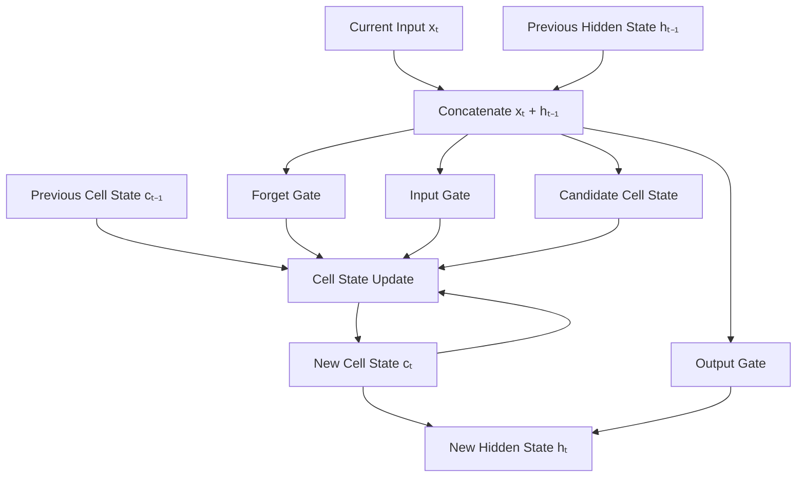

---

# 🧠 LSTM as a Memory Controller

The LSTM can be viewed as a memory controller:

```text
Forget Gate
     ↓
What old information should be removed?

Input Gate
     ↓
What new information should be stored?

Cell State
     ↓
What information should persist?

Output Gate
     ↓
What information should be exposed?
```

---

# 🧠 Why Does LSTM Help With Long-Term Dependencies?

The cell state provides a more direct path through time.

Instead of forcing all information through repeated nonlinear transformations:

```text
h₁
 ↓
h₂
 ↓
h₃
 ↓
...
```

LSTM maintains:

```text
c₁ → c₂ → c₃ → c₄ → ...
```

with gated updates.

This makes it easier for useful information to persist across many time steps.

---

# 🧠 LSTM Memory Highway

```text
c₁ ═══════► c₂ ═══════► c₃ ═══════► c₄
     │           │           │
   Gate        Gate        Gate
     │           │           │
   Update      Update      Update
```

The cell state acts as a controlled information highway.

---

# 🧠 LSTM vs Vanilla RNN

### Vanilla RNN

```text
xₜ + hₜ₋₁
       ↓
    tanh
       ↓
     hₜ
```

### LSTM

```text
xₜ + hₜ₋₁
       ↓
 ┌─────────────┐
 │    Gates    │
 └─────────────┘
       ↓
     cₜ + hₜ
```

---

# 🧠 LSTM Gradient Flow

The cell state provides a path where information can be retained with relatively controlled transformations.

Conceptually:

```text
Loss
 ↓
hₜ
 ↓
cₜ
 ↓
cₜ₋₁
 ↓
cₜ₋₂
 ↓
...
 ↓
c₁
```

This architecture helps reduce the severity of the long-term dependency problem compared with vanilla RNNs.

It does not mean LSTMs are immune to all gradient problems.

---

# 🧠 GRU Architecture

The Gated Recurrent Unit simplifies the LSTM architecture.

A GRU maintains:

```text
Hidden State
```

but does not maintain a separate cell state.

GRU primarily uses:

```text
Update Gate
Reset Gate
```

---

# 🧠 GRU Architecture

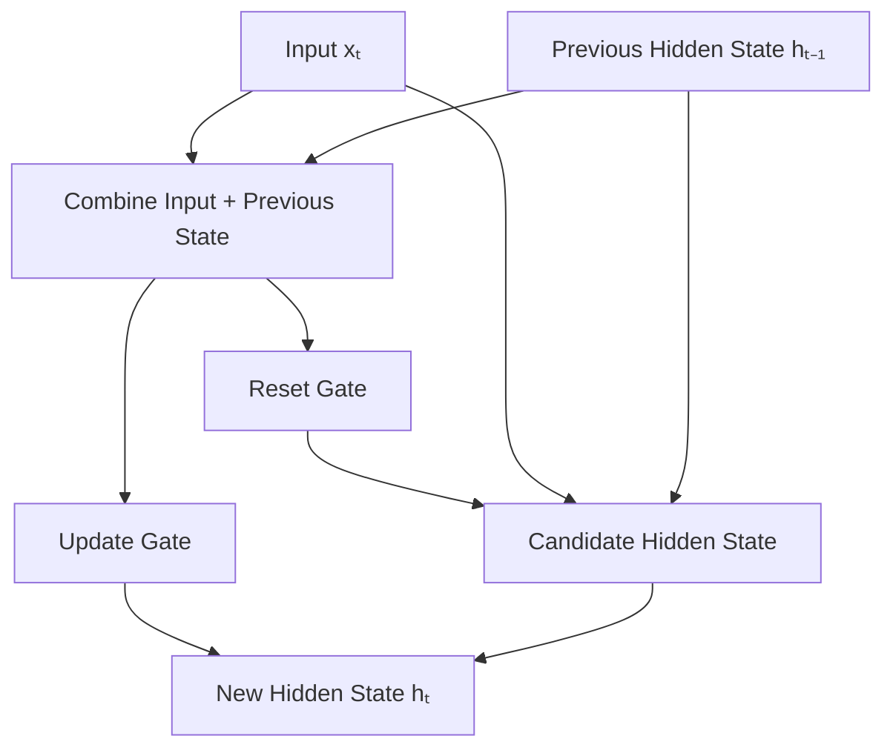

---

# 🧠 GRU Update Gate

The update gate determines how much of the previous hidden state should be retained versus replaced.

\[
z_t=\sigma(W_z[h_{t-1},x_t]+b_z)
\]


---

# 🧠 GRU Reset Gate

The reset gate determines how much previous hidden-state information should influence the candidate state.

\[
r_t=\sigma(W_r[h_{t-1},x_t]+b_r)
\]


---

# 🧠 GRU Candidate State

The candidate hidden state can be represented as:

\[
\tilde{h}_t=
\tanh(W_h[r_t\odot h_{t-1},x_t]+b_h)
\]


---

# 🧠 GRU Hidden State Update

A common formulation is:

\[
h_t=(1-z_t)\odot h_{t-1}+z_t\odot\tilde{h}_t
\]


The exact notation can vary between references and framework implementations.

The important idea is:

```text
Update Gate
     ↓
Control Previous State
       +
Candidate State
     ↓
New Hidden State
```

---

# 🧠 GRU Intuition

The update gate answers:

> How much should I keep from the previous state?

The reset gate answers:

> How much previous information should influence the candidate?

Conceptually:

```text
Previous State
      │
      ├───────────────┐
      │               │
 Update Gate       Reset Gate
      │               │
      ▼               ▼
 Retain         Candidate State
      │               │
      └───────┬───────┘
              ▼
        New Hidden State
```

---

# 🧠 LSTM vs GRU Architecture

```text
LSTM

Input
 ↓
Forget Gate ─────┐
Input Gate ──────┼──► Cell State
Candidate ───────┘
       ↓
Output Gate
       ↓
Hidden State
```

```text
GRU

Input
 ↓
Update Gate ─────┐
Reset Gate ──────┼──► Candidate
                 │
                 ▼
           Hidden State
```

---

# 🧠 LSTM vs GRU

| Feature | LSTM | GRU |
|---|---|---|
| Hidden State | Yes | Yes |
| Separate Cell State | Yes | No |
| Forget Gate | Yes | No |
| Input Gate | Yes | No |
| Output Gate | Yes | No |
| Update Gate | Conceptually split across gates | Yes |
| Reset Gate | No | Yes |
| Parameters | More | Fewer |
| Architecture | More complex | Simpler |
| Training | Can be slower | Often faster |
| Memory Control | Fine-grained | More compact |

---

# 🧠 Parameter Count Intuition

For an RNN-like recurrent layer with:

```text
Input Size = D
Hidden Size = H
```

a vanilla RNN has roughly:

\[
4? 
\]

The exact parameter count depends on the implementation and whether biases are included.

For practical comparison:

```text
Vanilla RNN
≈ 1 recurrent transformation

GRU
≈ 3 transformations

LSTM
≈ 4 transformations
```

This is why:

```text
LSTM > GRU > Vanilla RNN
```

in parameter count for comparable hidden dimensions.

---

# 🧠 Parameter Comparison

Conceptually:

```text
Parameters
    │
    │                ████████
    │                ████████  LSTM
    │        ██████
    │        ██████            GRU
    │  ████
    │  ████                    RNN
    └──────────────────────────────
```

The exact parameter count depends on:

```text
Input Dimension
Hidden Dimension
Number of Layers
Bidirectionality
Bias Configuration
```

---

# 🧠 When Can GRU Be Faster?

GRU has fewer gates and does not maintain a separate cell state.

Therefore:

```text
Simpler Architecture
      ↓
Fewer Parameters
      ↓
Less Computation
```

This can make GRUs attractive when:

```text
Model Size
Latency
Training Speed
```

are important.

However, actual performance must be benchmarked on the target workload.

---

# 🧠 LSTM vs GRU Decision

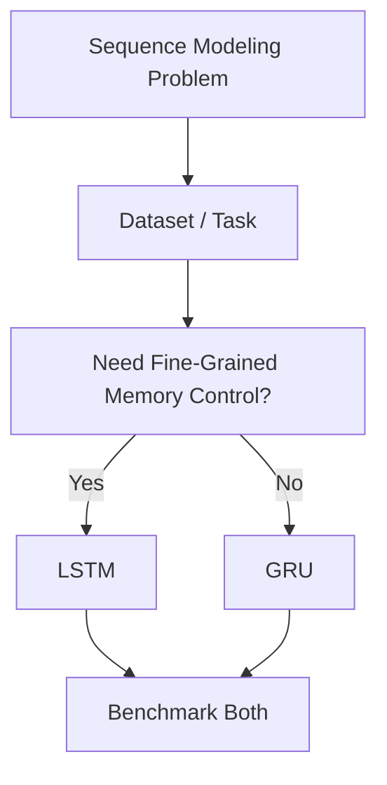

The best architecture should ultimately be selected through validation and production benchmarking.

---

# 🧠 Bidirectional LSTM

A Bidirectional LSTM processes the sequence in both directions.

```text
Forward:

x₁ → x₂ → x₃ → x₄


Backward:

x₄ → x₃ → x₂ → x₁
```

The outputs are combined.

---

# 🧠 Bidirectional LSTM

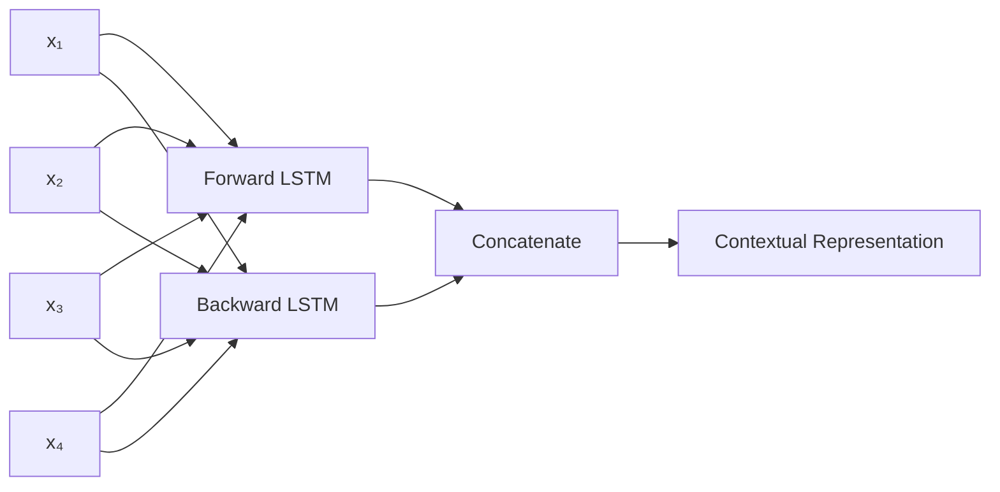

---

# ⚠ Bidirectional Models and Causality

Bidirectional models require access to future tokens.

Therefore they are appropriate for:

```text
Offline NLP
Sequence Classification
Sequence Labeling
```

but generally not for:

```text
Strict Real-Time Causal Prediction
```

where future observations are unavailable.

---

# 🧠 Stacked LSTM

Multiple LSTM layers can be stacked:

```text
Input
 ↓
LSTM Layer 1
 ↓
LSTM Layer 2
 ↓
LSTM Layer 3
 ↓
Classifier
```

Higher layers can learn increasingly abstract temporal representations.

---

# 🧠 Stacked LSTM Architecture

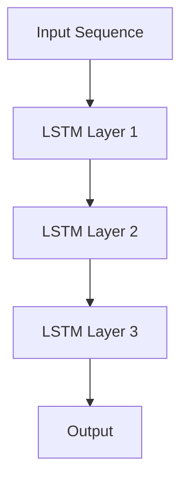

---

# 🐍 Part I — PyTorch LSTM

PyTorch provides:

```python
nn.LSTM
```

for implementing LSTM networks.

---

# 🧪 Create an LSTM

```python
import torch
import torch.nn as nn


lstm = nn.LSTM(
    input_size=128,
    hidden_size=64,
    num_layers=1,
    batch_first=True
)
```

---

# 🧠 LSTM Inputs and Outputs

The LSTM returns:

```python
output, (hidden, cell)
```

Conceptually:

```text
output
    ↓
Hidden representation at every time step

hidden
    ↓
Final hidden state

cell
    ↓
Final cell state
```

---

# 🧠 Tensor Shapes

With:

```text
Batch = B
Sequence Length = T
Hidden Size = H
Layers = L
```

and:

```python
batch_first=True
```

the output shape is:

```text
B × T × H
```

The hidden state shape is:

```text
L × B × H
```

The cell state shape is:

```text
L × B × H
```

For a bidirectional model:

```text
Directions = 2
```

so:

```text
Hidden Shape
=
L × 2 × B × H
```

---

# 🧪 LSTM Classifier

```python
class LSTMClassifier(
    nn.Module
):

    def __init__(
        self,
        input_size,
        hidden_size,
        num_classes
    ):

        super().__init__()

        self.lstm = nn.LSTM(
            input_size=input_size,
            hidden_size=hidden_size,
            batch_first=True
        )

        self.fc = nn.Linear(
            hidden_size,
            num_classes
        )

    def forward(
        self,
        x
    ):

        output, (
            hidden,
            cell
        ) = self.lstm(x)

        last_hidden = hidden[-1]

        logits = self.fc(
            last_hidden
        )

        return logits
```

---

# 🧠 LSTM Classifier Architecture

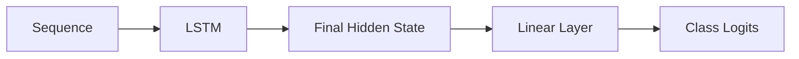

---

# 🧪 Create the LSTM Model

```python
model = LSTMClassifier(
    input_size=128,
    hidden_size=64,
    num_classes=3
)
```

---

# 🧪 LSTM Training

```python
criterion = nn.CrossEntropyLoss()

optimizer = torch.optim.AdamW(
    model.parameters(),
    lr=1e-3,
    weight_decay=1e-4
)


for epoch in range(epochs):

    model.train()

    for x, y in train_loader:

        x = x.to(device)
        y = y.to(device)

        optimizer.zero_grad()

        logits = model(x)

        loss = criterion(
            logits,
            y
        )

        loss.backward()

        torch.nn.utils.clip_grad_norm_(
            model.parameters(),
            max_norm=1.0
        )

        optimizer.step()
```

---

# 🧠 Why Gradient Clipping Still Matters

LSTM reduces the severity of vanishing-gradient problems but does not guarantee that exploding gradients cannot occur.

Therefore gradient clipping can still be useful:

```text
Loss
 ↓
Backward Pass
 ↓
Gradient Clipping
 ↓
Optimizer
```

---

# 🧪 Bidirectional LSTM

```python
lstm = nn.LSTM(
    input_size=128,
    hidden_size=64,
    num_layers=2,
    batch_first=True,
    bidirectional=True
)
```

The output feature dimension becomes:

```text
64 × 2 = 128
```

---

# 🧪 Stacked LSTM

```python
lstm = nn.LSTM(
    input_size=128,
    hidden_size=64,
    num_layers=3,
    batch_first=True,
    dropout=0.2
)
```

Dropout is applied between recurrent layers when multiple layers are used.

---

# 🐍 Part II — PyTorch GRU

PyTorch provides:

```python
nn.GRU
```

for implementing GRU networks.

---

# 🧪 Create a GRU

```python
gru = nn.GRU(
    input_size=128,
    hidden_size=64,
    num_layers=1,
    batch_first=True
)
```

---

# 🧠 GRU Output

Unlike LSTM, GRU returns:

```python
output, hidden
```

There is no separate cell state.

```text
GRU
 ↓
Output
+
Hidden State
```

---

# 🧪 GRU Classifier

```python
class GRUClassifier(
    nn.Module
):

    def __init__(
        self,
        input_size,
        hidden_size,
        num_classes
    ):

        super().__init__()

        self.gru = nn.GRU(
            input_size=input_size,
            hidden_size=hidden_size,
            batch_first=True
        )

        self.fc = nn.Linear(
            hidden_size,
            num_classes
        )

    def forward(
        self,
        x
    ):

        output, hidden = self.gru(
            x
        )

        last_hidden = hidden[-1]

        logits = self.fc(
            last_hidden
        )

        return logits
```

---

# 🧠 GRU Classifier Architecture

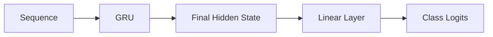

---

# 🧪 Create the GRU Model

```python
model = GRUClassifier(
    input_size=128,
    hidden_size=64,
    num_classes=3
)
```

---

# 🧠 LSTM and GRU Input Pipeline

For NLP:

```text
Text
 ↓
Tokenization
 ↓
Token IDs
 ↓
Embedding
 ↓
LSTM / GRU
 ↓
Hidden Representation
 ↓
Task Head
```

---

# 🧠 Embedding + LSTM

```python
class TextLSTM(
    nn.Module
):

    def __init__(
        self,
        vocab_size,
        embedding_dim,
        hidden_size,
        num_classes
    ):

        super().__init__()

        self.embedding = nn.Embedding(
            vocab_size,
            embedding_dim
        )

        self.lstm = nn.LSTM(
            embedding_dim,
            hidden_size,
            batch_first=True
        )

        self.fc = nn.Linear(
            hidden_size,
            num_classes
        )

    def forward(
        self,
        x
    ):

        x = self.embedding(x)

        output, (
            hidden,
            cell
        ) = self.lstm(x)

        return self.fc(
            hidden[-1]
        )
```

---

# 🧠 Embedding + GRU

```python
class TextGRU(
    nn.Module
):

    def __init__(
        self,
        vocab_size,
        embedding_dim,
        hidden_size,
        num_classes
    ):

        super().__init__()

        self.embedding = nn.Embedding(
            vocab_size,
            embedding_dim
        )

        self.gru = nn.GRU(
            embedding_dim,
            hidden_size,
            batch_first=True
        )

        self.fc = nn.Linear(
            hidden_size,
            num_classes
        )

    def forward(
        self,
        x
    ):

        x = self.embedding(x)

        output, hidden = self.gru(x)

        return self.fc(
            hidden[-1]
        )
```

---

# 🧠 Variable-Length Sequences

Real-world sequence datasets rarely have identical lengths.

For example:

```text
Sequence A → 12 tokens
Sequence B → 25 tokens
Sequence C → 18 tokens
```

A common strategy is:

```text
Padding
+
Packed Sequences
```

---

# 🧪 Packed LSTM Sequence

```python
from torch.nn.utils.rnn import (
    pack_padded_sequence,
    pad_packed_sequence
)


packed = pack_padded_sequence(
    x,
    lengths,
    batch_first=True,
    enforce_sorted=False
)


output, (
    hidden,
    cell
) = lstm(
    packed
)


output, lengths = (
    pad_packed_sequence(
        output,
        batch_first=True
    )
)
```

---

# 🧠 LSTM vs GRU for Variable-Length Data

Both can process packed sequences.

```text
Variable-Length Data
        ↓
Padding
        ↓
Packed Sequence
        ↓
LSTM / GRU
```

This avoids unnecessary recurrent computation over padding tokens.

---

# 🧠 LSTM for Time-Series

LSTM is widely used for sequential numerical data.

Example:

```text
Sensor Data
     ↓
Historical Window
     ↓
LSTM
     ↓
Future Prediction
```

---

# 🧠 Time-Series Example

Suppose:

```text
Temperature:

25
26
27
29
31
```

A sliding window can be created:

```text
[25, 26, 27] → 29
[26, 27, 29] → 31
```

The LSTM learns temporal patterns in the sequence.

---

# 🧠 LSTM Forecasting

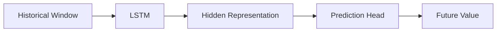

---

# 🧠 GRU for Time-Series

GRU can be used similarly:

```text
Historical Sequence
       ↓
GRU
       ↓
Hidden State
       ↓
Prediction Head
       ↓
Forecast
```

The choice between LSTM and GRU should be validated experimentally.

---

# 🧠 LSTM vs GRU for Time-Series

| Requirement | LSTM | GRU |
|---|---:|---:|
| Long dependencies | Strong | Strong |
| Model complexity | Higher | Lower |
| Parameter count | Higher | Lower |
| Training speed | Often slower | Often faster |
| Fine-grained memory control | Strong | Simpler |
| Small model requirement | Moderate | Strong |
| Production latency | Variable | Often favorable |

---

# 🧠 LSTM Auto-Regressive Forecasting

For multi-step prediction:

```text
Historical Data
      ↓
Prediction₁
      ↓
Prediction₂
      ↓
Prediction₃
```

The model may feed its own predictions back as future inputs.

---

# ⚠ Forecast Error Accumulation

Auto-regressive forecasting can suffer from:

```text
Prediction Error
      ↓
Used as Input
      ↓
New Error
      ↓
Larger Error
      ↓
Accumulation
```

Therefore multi-step forecasting requires careful evaluation.

---

# 🧠 LSTM and GRU for NLP

Historically, LSTM and GRU were widely used for:

```text
Sentiment Analysis
Language Modeling
Machine Translation
Speech Recognition
Named Entity Recognition
Text Classification
```

Modern NLP systems often use Transformers because they provide stronger parallelism and long-range attention.

---

# 🧠 LSTM / GRU Sequence Classification

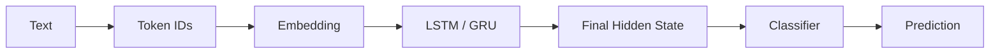

---

# 🧠 Bidirectional LSTM for NLP

A Bidirectional LSTM can combine:

```text
Left Context
+
Right Context
```

For:

```text
"Apple released a new phone"
```

the representation of:

```text
Apple
```

can incorporate information from later words.

This is useful for offline sequence understanding.

---

# 🧠 LSTM and Attention

LSTM-based encoder-decoder systems historically used attention to overcome the limitation of relying only on a single final hidden representation.

The evolution was:

```text
Encoder
   ↓
Single Context Vector
```

then:

```text
Encoder
   ↓
All Hidden States
   ↓
Attention
   ↓
Decoder
```

---

# 🧠 Encoder-Decoder with Attention

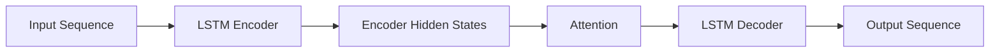

This architecture was an important step toward modern attention-based sequence modeling.

---

# 🧠 Why Attention Helped RNNs

Without attention:

```text
Entire Input Sequence
        ↓
Single Context Representation
        ↓
Decoder
```

With attention:

```text
Entire Input Sequence
        ↓
All Encoder States
        ↓
Attention
        ↓
Relevant Context
        ↓
Decoder
```

This reduced the bottleneck created by a single fixed-size representation.

---

# 🧠 From LSTM Attention to Transformers

The architectural evolution can be understood as:

```text
RNN
 ↓
LSTM / GRU
 ↓
Encoder-Decoder
 ↓
Attention
 ↓
Self-Attention
 ↓
Transformer
```

The next chapters explore this transition.

---

# 🧠 RNN vs LSTM vs GRU vs Transformer

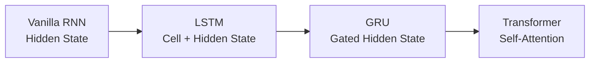

This is an architectural evolution rather than a strict replacement chain.

---

# 🧠 Architecture Comparison

| Characteristic | RNN | LSTM | GRU | Transformer |
|---|---:|---:|---:|---:|
| Hidden State | ✓ | ✓ | ✓ | Token States |
| Cell State | ✗ | ✓ | ✗ | ✗ |
| Gating | ✗ | ✓ | ✓ | Attention |
| Long-Term Dependencies | Weak | Stronger | Stronger | Strong |
| Sequential Computation | ✓ | ✓ | ✓ | Reduced during training |
| Parallel Training | Limited | Limited | Limited | Strong |
| Model Complexity | Low | High | Medium | Variable |
| Large-Scale Pretraining | Limited | Limited | Limited | Excellent |

---

# 🏢 Enterprise Perspective

LSTM and GRU remain important architectures for understanding sequence modeling, even though Transformers dominate many modern NLP and multimodal workloads.

They can still be appropriate for:

```text
Streaming Data
Time-Series Forecasting
Sensor Processing
Compact Sequence Models
Stateful Inference
Legacy ML Systems
Resource-Constrained Workloads
```

---

# 🏢 Production LSTM / GRU Architecture

A production system may look like:

```text
Event Stream
     ↓
Data Processing
     ↓
Sequence Builder
     ↓
Feature / Embedding Layer
     ↓
LSTM / GRU
     ↓
Prediction Head
     ↓
Inference Service
     ↓
Monitoring
```

---

# 🏢 Production Architecture

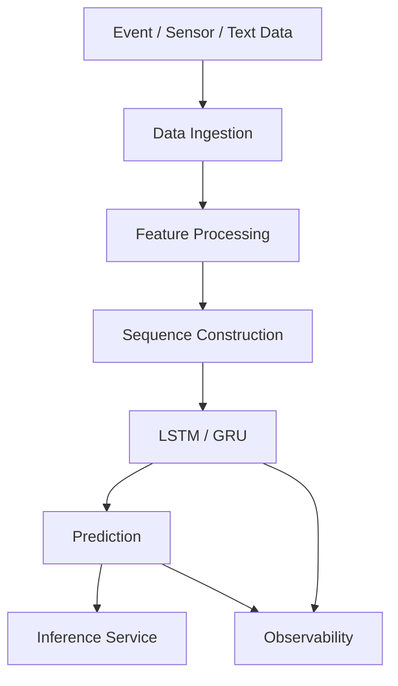

---

# 🏢 Stateful Inference

LSTM and GRU can maintain state across sequential events.

Conceptually:

```text
Event₁
 ↓
State₁

Event₂
 +
State₁
 ↓
State₂

Event₃
 +
State₂
 ↓
State₃
```

This can be useful in streaming applications.

However, stateful inference introduces operational complexity.

---

# ⚠ Stateful Production Challenges

Production systems must handle:

```text
Session Identity
State Expiration
State Storage
Concurrency
Failures
Retries
Model Versioning
State Compatibility
```

For example:

```text
Model v1
    ↓
State v1
```

may not necessarily be compatible with:

```text
Model v2
```

Therefore model upgrades require careful state-management strategies.

---

# 🏢 LSTM / GRU Monitoring

Monitor infrastructure:

```text
CPU
GPU
Memory
Latency
Throughput
```

Monitor model behavior:

```text
Prediction Distribution
Accuracy
Precision
Recall
F1
Loss
```

Monitor sequence behavior:

```text
Sequence Length
Missing Values
Padding Ratio
Feature Drift
Input Distribution
```

---

# 🏢 Production Model Versioning

Track:

```text
Model Version
Training Dataset
Feature Version
Tokenizer
Vocabulary
Embedding Version
Sequence Length
Hidden Size
Number of Layers
Bidirectional Configuration
Checkpoint
Training Configuration
Evaluation Metrics
Deployment Version
```

---

# 🏢 Cost and Latency

LSTM and GRU inference is sequential.

For long sequences:

```text
Long Sequence
      ↓
More Time Steps
      ↓
More Sequential Computation
      ↓
Higher Latency
```

GRU may have an advantage in some workloads because it uses fewer parameters than LSTM.

However:

> **Always benchmark on the actual workload and hardware.**

---

# 🧠 Architecture Selection

A practical selection process:

```text
Sequence Problem
      ↓
Is Streaming State Important?
      │
      ├── Yes
      │    ↓
      │  Consider RNN / LSTM / GRU
      │
      └── No
           ↓
      Long Context?
           │
           ├── Yes → Consider Transformer
           │
           └── No → Benchmark Candidates
```

---

# 🧠 LSTM vs GRU Decision Framework

Choose LSTM when:

```text
Fine-Grained Memory Control
+
Complex Temporal Dependencies
+
Sufficient Compute
```

Choose GRU when:

```text
Simpler Architecture
+
Lower Parameter Count
+
Lower Latency Target
```

But these are starting assumptions.

The final choice should be based on:

```text
Validation Metrics
+
Latency
+
Memory
+
Cost
+
Operational Complexity
```

---

# 🧪 Practical Exercise 1 — LSTM Classification

Build an LSTM classifier with:

```text
Input Size = 128
Hidden Size = 64
Classes = 3
```

Measure:

```text
Training Loss
Validation Loss
Accuracy
```

---

# 🧪 Practical Exercise 2 — GRU Classification

Build the equivalent GRU model.

Compare:

```text
Parameter Count
Training Time
Validation Accuracy
Inference Latency
```

---

# 🧪 Practical Exercise 3 — Long-Term Dependency

Create a synthetic dataset where:

```text
Important Information
```

appears near the beginning of a long sequence.

Compare:

```text
Vanilla RNN
LSTM
GRU
```

---

# 🧪 Practical Exercise 4 — Gradient Stability

Track:

```text
Gradient Norm
```

during training for:

```text
RNN
LSTM
GRU
```

Plot:

```text
Gradient Norm vs Training Step
```

---

# 🧪 Practical Exercise 5 — Sequence Length

Train models using:

```text
Sequence Length = 10
Sequence Length = 50
Sequence Length = 100
```

Compare:

```text
Accuracy
Training Time
Gradient Stability
```

---

# 🧪 Practical Exercise 6 — Bidirectional Models

Compare:

```text
LSTM
vs
Bidirectional LSTM
```

on an offline sequence classification problem.

Measure:

```text
Accuracy
Parameter Count
Inference Latency
```

---

# 🧪 Practical Exercise 7 — Stacked LSTM

Compare:

```text
1 Layer
2 Layers
3 Layers
```

and evaluate:

```text
Training Loss
Validation Loss
Accuracy
Overfitting
```

---

# 🧪 Practical Exercise 8 — Time-Series Forecasting

Train:

```text
LSTM
```

and:

```text
GRU
```

to predict the next value of a synthetic time series.

Compare:

```text
MAE
RMSE
Inference Latency
```

---

# 🧪 Practical Exercise 9 — Variable-Length Sequences

Create variable-length sequences and implement:

```text
Padding
+
Packed Sequence
+
LSTM
```

Verify that padded positions do not influence the recurrent computation.

---

# 🧪 Practical Exercise 10 — LSTM + Attention

Build a simplified:

```text
LSTM Encoder
+
Attention
+
Decoder
```

architecture.

Compare it with:

```text
LSTM Encoder
+
Final Hidden State
+
Decoder
```

---

# 🧪 Practical Exercise 11 — LSTM vs Transformer

Train:

```text
LSTM
```

and:

```text
Transformer Encoder
```

on the same sequence classification problem.

Compare:

```text
Accuracy
Training Time
Inference Latency
Memory
Parameter Count
```

---

# 🧪 Practical Exercise 12 — Production Benchmark

Benchmark:

```text
RNN
LSTM
GRU
Transformer
```

under identical workload constraints.

Record:

```text
Model Size
P50 Latency
P95 Latency
Throughput
Memory
Accuracy
Cost per Inference
```

Use the results to make an architecture decision.

---

# 🧠 Interview Questions

## Beginner

### 1. Why were LSTMs introduced?

LSTMs were introduced to address the difficulty vanilla RNNs have in learning long-term dependencies and to improve gradient flow through recurrent sequences.

### 2. What are the main components of an LSTM?

An LSTM contains:

```text
Cell State
Hidden State
Forget Gate
Input Gate
Output Gate
```

### 3. What is the cell state?

The cell state is the long-term memory pathway maintained by an LSTM.

### 4. What does the forget gate do?

It controls how much information from the previous cell state should be retained.

### 5. What does the input gate do?

It controls how much candidate information should be written into the cell state.

### 6. What does the output gate do?

It controls how much information from the updated cell state becomes the hidden state.

---

## Intermediate

### 7. What is the LSTM cell-state equation?

\[
c_t=f_t\odot c_{t-1}+i_t\odot\tilde{c}_t
\]


### 8. What is a GRU?

A GRU is a gated recurrent architecture that uses an update gate and reset gate while maintaining a single hidden state.

### 9. What are the two main GRU gates?

```text
Update Gate
Reset Gate
```

### 10. What is the main architectural difference between LSTM and GRU?

LSTM maintains separate hidden and cell states and uses more gates, while GRU uses a single hidden state and a simpler gating mechanism.

### 11. Why can GRUs be faster than LSTMs?

GRUs generally have fewer parameters and fewer gating computations.

### 12. Can LSTM and GRU completely eliminate vanishing gradients?

No. They significantly improve the ability to preserve information and gradient flow, but they do not mathematically guarantee the absence of gradient problems.

---

## Advanced

### 13. Why does the LSTM cell state help with long-term dependencies?

It provides a relatively direct recurrent memory pathway whose updates are controlled by gates.

### 14. Why is sigmoid used for LSTM and GRU gates?

Sigmoid produces values between 0 and 1, making it suitable for controlling the proportion of information that passes through a gate.

### 15. Why is `tanh` used for candidate states?

It provides bounded representations in the range approximately:

```text
-1 to +1
```

which helps control the candidate state values.

### 16. What is the difference between hidden state and cell state?

The hidden state represents the current exposed state/output, while the cell state serves as the LSTM's longer-term memory pathway.

### 17. Why does GRU not require a separate cell state?

GRU combines its memory-control mechanism into the hidden state through its gating structure.

### 18. Why can Bidirectional LSTM improve sequence understanding?

It can incorporate both preceding and following context.

### 19. Why is Bidirectional LSTM unsuitable for causal streaming?

Because the backward direction requires future observations.

### 20. Why are Transformers often preferred over LSTM for large-scale NLP?

Transformers provide stronger parallelism during training and direct attention-based modeling of long-range token relationships.

### 21. When might GRU be preferable to LSTM?

When a simpler recurrent architecture, lower parameter count, or lower computational cost is desirable and GRU performance is sufficient.

### 22. How would you choose between LSTM and GRU in production?

Benchmark both on:

```text
Accuracy
Latency
Throughput
Memory
Training Cost
Inference Cost
Operational Complexity
```

---

# 🏢 Enterprise Perspective

The most important lesson is not:

> **LSTM is better than GRU.**

or:

> **GRU is faster than LSTM.**

The correct engineering approach is:

```text
Business Requirement
        ↓
Sequence Characteristics
        ↓
Candidate Architectures
        ↓
Offline Evaluation
        ↓
Performance Benchmark
        ↓
Production Constraints
        ↓
Architecture Decision
```

---

# 🏢 Production Decision Matrix

| Requirement | RNN | LSTM | GRU | Transformer |
|---|---:|---:|---:|---:|
| Small model | Excellent | Good | Excellent | Variable |
| Long-term memory | Weak | Strong | Strong | Strong |
| Streaming state | Excellent | Excellent | Excellent | Architecture-dependent |
| Fine memory control | Weak | Excellent | Good | Attention-based |
| Training parallelism | Poor | Poor | Poor | Excellent |
| Long context | Weak | Good | Good | Excellent |
| Large-scale pretraining | Limited | Limited | Limited | Excellent |
| Low infrastructure footprint | Good | Moderate | Good | Variable |

---

# 🏢 Production LSTM/GRU Checklist

Before deploying:

```text
☐ Validate sequence construction
☐ Validate preprocessing
☐ Validate padding/masking
☐ Validate model checkpoint
☐ Validate hidden-state handling
☐ Configure gradient clipping
☐ Benchmark inference latency
☐ Benchmark throughput
☐ Measure memory consumption
☐ Version tokenizer/features
☐ Version model
☐ Define rollback strategy
☐ Monitor input drift
☐ Monitor prediction drift
☐ Monitor infrastructure
☐ Define retraining strategy
```

---

!!! tip "Production Insight"

    **LSTM and GRU are important not only because they solve problems in vanilla RNNs, but because they demonstrate a fundamental Deep Learning design principle: information flow can be learned and controlled.**

    LSTM explicitly separates:

    ```text
    Long-Term Memory
    +
    Exposed Hidden State
    ```

    while GRU simplifies the same idea into a more compact gated state.

    In production, do not select LSTM or GRU simply because it is a popular architecture.

    Evaluate:

    ```text
    Sequence Length
    +
    Dependency Horizon
    +
    Streaming Requirements
    +
    Latency
    +
    Memory
    +
    Accuracy
    +
    Cost
    ```

    For many modern large-scale sequence problems, Transformers are the natural next architecture to evaluate.

---

# 📌 Key Takeaways

- LSTM and GRU were introduced to address important limitations of vanilla RNNs.
- Vanilla RNNs can struggle with long-term dependencies because of vanishing and exploding gradients.
- LSTM maintains both a hidden state and a cell state.
- LSTM uses forget, input, and output gates.
- The forget gate controls retained information.
- The input gate controls newly written information.
- The output gate controls exposed information.
- The LSTM cell state provides a controlled memory pathway.
- GRU uses a simpler architecture with an update gate and reset gate.
- GRU does not maintain a separate cell state.
- GRUs generally contain fewer parameters than comparable LSTMs.
- LSTM can provide more explicit memory control.
- GRU can be attractive when model simplicity and efficiency are important.
- Neither LSTM nor GRU is universally superior.
- Bidirectional recurrent networks can incorporate both past and future context.
- Bidirectional models are unsuitable for strictly causal real-time prediction.
- Stacked LSTM and GRU models can learn deeper temporal representations.
- Variable-length sequences can be handled using padding and packed sequences.
- Gradient clipping can help stabilize recurrent-network training.
- LSTM and GRU can be used for NLP, time-series, speech, and event-sequence problems.
- Attention can improve encoder-decoder recurrent architectures.
- The evolution from RNN → LSTM/GRU → Attention → Transformer explains much of modern sequence modeling.
- Transformers are generally preferable when large-scale training, long context, and training parallelism are dominant requirements.
- Production architecture decisions should consider accuracy, latency, memory, throughput, infrastructure, and cost.

---

# 📚 Further Reading

Continue with:

- **[26. Attention and Positional Encoding](26-attention-and-positional-encoding.md)**
- **[27. Transformer Architecture](27-transformer-architecture.md)**
- **[28. Transformer Applications](28-transformer-applications.md)**
- **[36. Deep Learning Training and Model Lifecycle](36-deep-learning-training-and-model-lifecycle.md)**
- **[37. Building Production Deep Learning Systems](37-building-production-deep-learning-systems.md)**

The next chapter introduces **Attention Mechanisms and Positional Encoding**, which form the conceptual bridge between recurrent sequence models and the modern Transformer architecture.

---

## ➡️ Next Chapter

**[26. Attention and Positional Encoding](26-attention-and-positional-encoding.md)**

---

> **Enterprise AI Engineering Handbook**  
> *Building Production-Grade Enterprise AI Systems — One Chapter at a Time.*