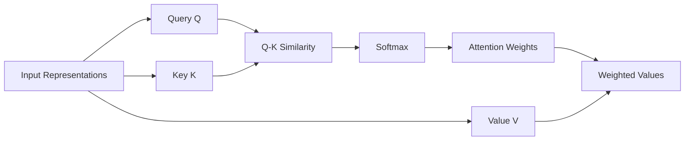
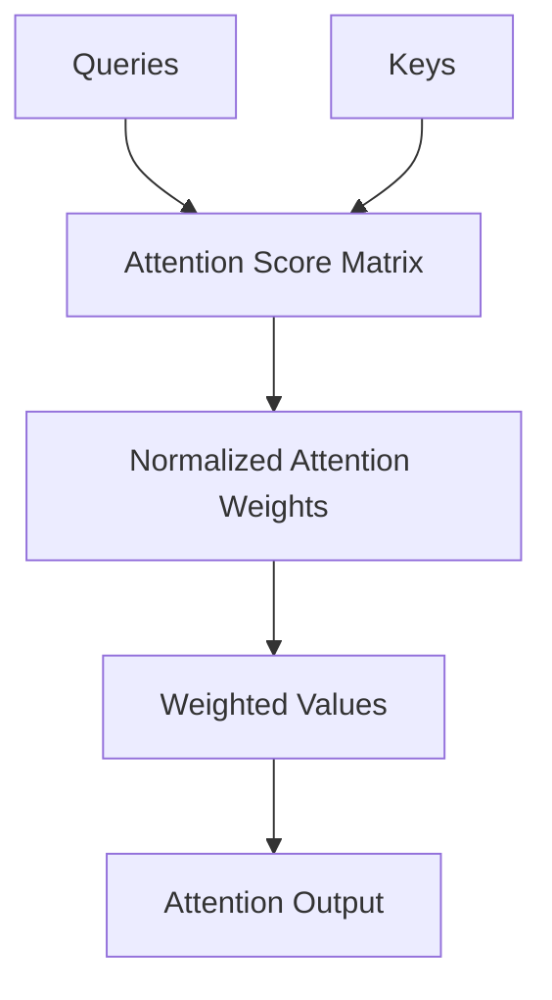
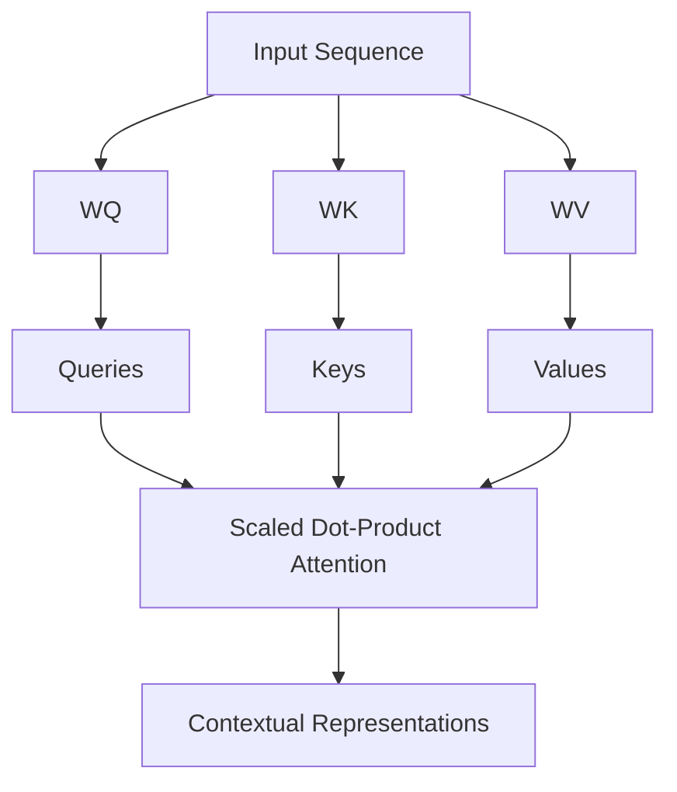
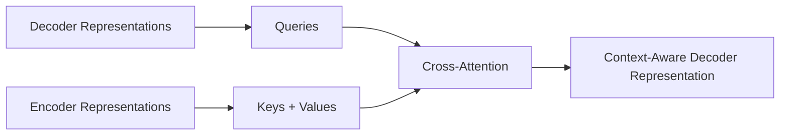
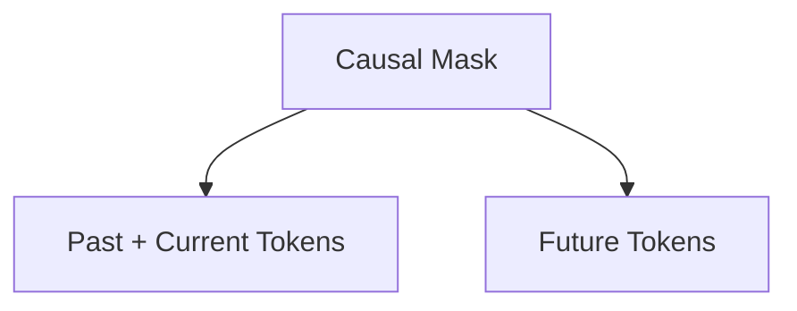
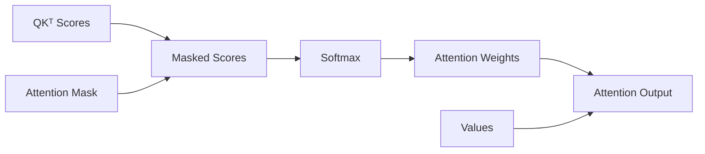
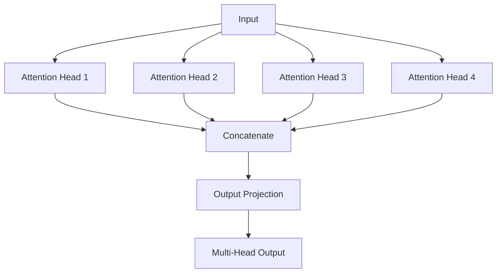
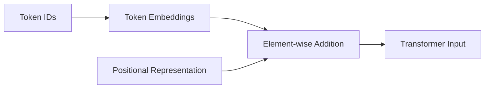
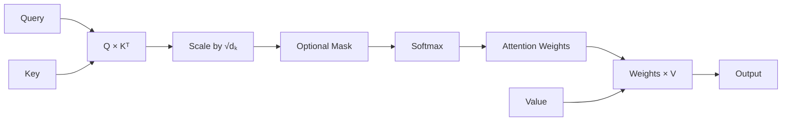
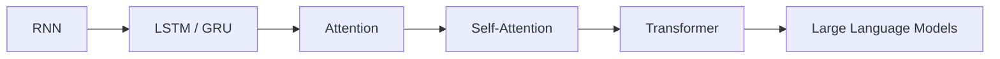

# 26. Attention and Positional Encoding

> Understand how Attention enables neural networks to dynamically focus on relevant information, why attention became a major breakthrough for sequence modeling, how Query-Key-Value representations work, and why positional encoding is required when sequence order is not inherently represented.

---

## 🎯 Learning Objectives

After completing this chapter, you will be able to:

- Explain why attention was introduced
- Understand the limitations of fixed-size recurrent representations
- Explain the intuition behind attention mechanisms
- Understand Query, Key, and Value representations
- Explain the attention scoring process
- Understand scaled dot-product attention
- Explain attention weights
- Understand softmax normalization in attention
- Implement attention conceptually using matrix operations
- Understand self-attention
- Distinguish self-attention from cross-attention
- Understand causal attention
- Explain multi-head attention conceptually
- Understand why Transformers need positional information
- Explain positional encoding
- Understand sinusoidal positional encoding
- Understand learned positional embeddings
- Compare different positional representation approaches
- Understand the relationship between attention and RNNs
- Understand how attention leads to the Transformer architecture
- Implement basic attention using PyTorch
- Understand attention masks
- Understand padding masks and causal masks
- Analyze attention complexity
- Understand production considerations for attention-based systems

---

# 📖 Overview

Recurrent Neural Networks process sequences step by step:

```text
x₁ → RNN → h₁
          ↓
x₂ → RNN → h₂
          ↓
x₃ → RNN → h₃
          ↓
x₄ → RNN → h₄
```

LSTM and GRU improve the ability to preserve information across time.

However, recurrent architectures still have an important limitation:

```text
Sequential Processing
+
Long Information Paths
+
Limited Parallelism
```

Attention introduced a different idea:

> **Instead of forcing the model to rely only on a recurrent hidden state, allow it to directly look at relevant parts of the input.**

This creates a flexible mechanism for selecting information based on the current context.

---

# 🧠 The Core Attention Idea

Suppose we want to understand:

```text
"The animal didn't cross the street because it was too tired."
```

To understand:

```text
"it"
```

the model needs to determine which previous words are relevant.

Attention allows the model to assign different importance to different tokens.

Conceptually:

```text
The       → Low Attention
animal    → High Attention
didn't    → Low Attention
cross     → Medium Attention
the       → Low Attention
street    → Medium Attention
because   → Low Attention
it        → Query
was       → Low Attention
too       → Low Attention
tired     → High Attention
```

The model learns these relationships during training.

---

# 🧠 Attention as Information Retrieval

A useful mental model is:

```text
Query
  ↓
Search Relevant Information
  ↓
Keys
  ↓
Retrieve Associated Information
  ↓
Values
```

This resembles a learned retrieval process.

```text
Query
   ↓
"Which information do I need?"
   ↓
Keys
   ↓
"Which positions are relevant?"
   ↓
Values
   ↓
"Retrieve the relevant content."
```

---

# 🧠 Query, Key, Value

Attention uses three representations:

```text
Query (Q)
Key   (K)
Value (V)
```

The basic idea is:

```text
Q
 ↓
Compare with K
 ↓
Attention Scores
 ↓
Softmax
 ↓
Attention Weights
 ↓
Weighted V
 ↓
Attention Output
```

---

# 🧠 Query

The Query represents:

> **What information am I looking for?**

For example:

```text
Current token
        ↓
Query
        ↓
Find relevant context
```

---

# 🧠 Key

The Key represents:

> **What information does this position contain or represent?**

Keys are compared with Queries to determine relevance.

---

# 🧠 Value

The Value represents:

> **What information should actually be retrieved if this position is considered relevant?**

Therefore:

```text
Query
+
Key
→
Relevance

Relevance
+
Value
→
Retrieved Information
```

---

# 🧠 Query-Key-Value Flow



---

# 🧠 Attention Scoring

The first step is to calculate how relevant each Key is to a Query.

A common method is the dot product:

\[
score(Q,K)=QK^T
\]


A larger score generally means:

```text
Query
and
Key
```

are more aligned.

---

# 🧠 Why Dot Product?

The dot product measures alignment between vectors.

Conceptually:

```text
Q
 ↓
[0.8, 0.2, 0.1]

K₁
 ↓
[0.7, 0.3, 0.2]

Similarity
 ↓
High
```

while:

```text
K₂
 ↓
[-0.4, 0.1, 0.8]

Similarity
 ↓
Lower
```

The model can therefore compare a Query against multiple Keys.

---

# 🧠 Attention Score Matrix

Suppose there are four tokens:

```text
x₁
x₂
x₃
x₄
```

Each token can compare its Query against every Key.

This creates:

```text
             Keys
          K₁ K₂ K₃ K₄

Query Q₁   •  •  •  •
Query Q₂   •  •  •  •
Query Q₃   •  •  •  •
Query Q₄   •  •  •  •
```

This becomes an attention score matrix.

---

# 🧠 Attention Matrix



---

# 🧠 Scaled Dot-Product Attention

Raw dot products can become large as the vector dimension increases.

Therefore Transformer-style attention uses scaling:

\[
Attention(Q,K,V)=softmax\left(\frac{QK^T}{\sqrt{d_k}}\right)V
\]


where:

```text
Q   = Queries
K   = Keys
V   = Values
dₖ  = Key dimension
```

---

# 🧠 Why Divide by √dₖ?

Without scaling:

```text
Large Vector Dimension
        ↓
Large Dot Products
        ↓
Softmax Saturation
        ↓
Small Effective Gradients
```

Scaling helps keep the score distribution in a more manageable range.

The factor is:

\[
\sqrt{d_k}
\]


---

# 🧠 Softmax in Attention

The score matrix is converted into normalized attention weights using softmax.

For a vector of scores:

\[
softmax(z_i)=\frac{e^{z_i}}{\sum_j e^{z_j}}
\]


The resulting weights satisfy:

```text
Weight ≥ 0
```

and:

\[
\sum_i weight_i=1
\]


---

# 🧠 Attention Weight Example

Suppose the model produces:

```text
Raw Scores:

[2.0, 1.0, 0.1, 3.0]
```

Softmax converts them into something like:

```text
Attention Weights:

[0.24, 0.09, 0.04, 0.63]
```

The fourth position receives the highest attention.

Therefore:

```text
Value₄
```

contributes more strongly to the output.

---

# 🧠 Weighted Sum of Values

The final attention representation is:

```text
Attention Weight₁ × Value₁
+
Attention Weight₂ × Value₂
+
...
+
Attention Weightₙ × Valueₙ
```

Conceptually:

```text
          Attention Weights
                 │
       ┌─────────┼─────────┐
       ▼         ▼         ▼
      V₁        V₂        V₃
       │         │         │
       └─────────┼─────────┘
                 ▼
          Weighted Sum
                 │
                 ▼
        Attention Output
```

---

# 🧠 Self-Attention

Self-attention is attention where:

```text
Q
K
V
```

are derived from the same input sequence.

For:

```text
X = [x₁, x₂, x₃, x₄]
```

we compute:

```text
Q = XWQ
K = XWK
V = XWV
```


---

# 🧠 Self-Attention Architecture



---

# 🧠 Why Self-Attention Is Powerful

In a recurrent network:

```text
x₁
 ↓
x₂
 ↓
x₃
 ↓
x₄
```

information from `x₁` must travel through intermediate states to influence `x₄`.

With self-attention:

```text
x₁ ───────────────► x₄
```

A token can directly attend to another token.

This creates much shorter information paths.

---

# 🧠 Information Path Length

### RNN

```text
x₁ → h₁ → h₂ → h₃ → h₄
```

### Self-Attention

```text
x₁ ───────────────► x₄
```

This is one reason attention is effective at modeling long-range relationships.

---

# 🧠 Self-Attention Example

Consider:

```text
"The animal didn't cross the street because it was tired."
```

When processing:

```text
"it"
```

the model can attend strongly to:

```text
"animal"
```

rather than relying only on a recurrent hidden state.

The attention mechanism learns these relationships from data.

---

# 🧠 Self-Attention Matrix

For four tokens:

```text
             Key
           1    2    3    4

Query 1   0.2  0.5  0.1  0.2
Query 2   0.1  0.7  0.1  0.1
Query 3   0.6  0.1  0.2  0.1
Query 4   0.5  0.1  0.1  0.3
```

Each row represents:

```text
How one token distributes attention across the sequence.
```

---

# 🧠 Attention Visualization

A useful conceptual visualization is a heatmap:

```text
             Tokens

        The Animal Cross Street

The      ███  ███  █    █
Animal   █    ███  █    █
Cross    █    █    ███  ██
Street   █    ██   █    ███
```

Darker regions conceptually represent stronger attention.

In real Transformer analysis, attention matrices can be visualized as heatmaps.

---

# 🧠 Cross-Attention

Self-attention uses:

```text
Q, K, V
```

from the same sequence.

Cross-attention uses:

```text
Queries
from one representation

Keys + Values
from another representation
```

Conceptually:

```text
Decoder Queries
       ↓
Encoder Keys + Values
       ↓
Cross-Attention
```

---

# 🧠 Cross-Attention Architecture



---

# 🧠 Self-Attention vs Cross-Attention

| Self-Attention | Cross-Attention |
|---|---|
| Q, K, V from same sequence | Q and K/V from different representations |
| Models internal relationships | Connects two representations |
| Common in Transformer encoder | Common in encoder-decoder architectures |
| Used for contextualization | Used for information retrieval from another sequence |

---

# 🧠 Causal Attention

For autoregressive language modeling, a token must not attend to future tokens.

For example:

```text
Token 1
```

can attend to:

```text
Token 1
```

but not:

```text
Token 2
Token 3
Token 4
```

---

# 🧠 Causal Attention Mask

For four tokens:

```text
       K1 K2 K3 K4

Q1     ✓  ✗  ✗  ✗
Q2     ✓  ✓  ✗  ✗
Q3     ✓  ✓  ✓  ✗
Q4     ✓  ✓  ✓  ✓
```

This creates a lower-triangular attention pattern.

---

# 🧠 Causal Mask



Conceptually:

```text
Allowed:

████
███
██
█
```

depending on matrix orientation.

---

# 🧠 Why Causal Masking Matters

Without causal masking:

```text
Current Token
      ↓
Could See Future Token
      ↓
Information Leakage
```

This would make autoregressive training invalid.

Therefore:

```text
Causal Mask
     ↓
Prevent Future Information
     ↓
Valid Next-Token Prediction
```

---

# 🧠 Padding Mask

Batch sequences often have padding.

Example:

```text
Sequence A:
[The, cat, sleeps, PAD, PAD]

Sequence B:
[The, dog, runs, fast, today]
```

The model should not attend to:

```text
PAD
```

positions.

A padding mask prevents padded tokens from influencing attention.

---

# 🧠 Causal Mask vs Padding Mask

| Mask | Purpose |
|---|---|
| Causal Mask | Prevent future-token access |
| Padding Mask | Ignore padding positions |
| Combined Mask | Enforce both constraints |

---

# 🧠 Attention with Masking

The attention computation can be conceptualized as:

```text
QKᵀ
 ↓
Apply Mask
 ↓
Scaled Scores
 ↓
Softmax
 ↓
Attention Weights
 ↓
Weighted Values
```

---

# 🧠 Masked Attention



---

# 🧠 Multi-Head Attention

Instead of using a single attention mechanism, Transformers use multiple attention heads.

Each head can learn different relationships.

Conceptually:

```text
Input
 ↓
Head 1 → Relationship A
Head 2 → Relationship B
Head 3 → Relationship C
Head 4 → Relationship D
 ↓
Concatenate
 ↓
Linear Projection
```

---

# 🧠 Multi-Head Attention



---

# 🧠 Why Multiple Heads?

Different attention heads can specialize in different relationships.

For example:

```text
Head 1
↓
Syntactic Relationship

Head 2
↓
Semantic Relationship

Head 3
↓
Long-Range Dependency

Head 4
↓
Local Context
```

These are conceptual interpretations rather than guaranteed fixed roles.

---

# 🧠 Multi-Head Attention Formula

A multi-head attention mechanism can be represented as:

\[
MultiHead(Q,K,V)=Concat(head_1,\ldots,head_h)W^O
\]


where each head is:

\[
head_i=Attention(QW_i^Q,KW_i^K,VW_i^V)
\]


---

# 🧠 Attention Head Dimensions

Suppose:

```text
Model Dimension = 512
Number of Heads = 8
```

A common configuration uses:

\[
d_{head}=\frac{512}{8}=64
\]


Each head operates in a lower-dimensional representation.

---

# 🧠 Why Positional Information Is Needed

Attention itself does not inherently encode token order.

Consider:

```text
"The dog chased the cat"
```

and:

```text
"The cat chased the dog"
```

The tokens are the same, but their order changes the meaning.

A pure set of token representations does not inherently distinguish these sequences.

Therefore Transformer architectures need:

> **Positional Information**

---

# 🧠 Sequence Order

```text
Token Embeddings
      +
Positional Information
      ↓
Input Representation
```

---

# 🧠 Positional Encoding

A positional encoding provides information about where a token occurs in the sequence.

Conceptually:

```text
Token
 +
Position
 ↓
Position-Aware Representation
```

For example:

```text
The      + Position 0
dog      + Position 1
chased   + Position 2
the      + Position 3
cat      + Position 4
```

---

# 🧠 Positional Encoding Architecture



---

# 🧠 Sinusoidal Positional Encoding

The original Transformer architecture introduced deterministic sinusoidal positional encodings.

For even dimensions:

\[
PE(pos,2i)=\sin\left(\frac{pos}{10000^{2i/d_{model}}}\right)
\]


For odd dimensions:

\[
PE(pos,2i+1)=\cos\left(\frac{pos}{10000^{2i/d_{model}}}\right)
\]


where:

```text
pos       = Position in sequence
i         = Dimension index
d_model   = Model embedding dimension
```

---

# 🧠 Why Sine and Cosine?

Sinusoidal functions provide smooth and structured positional representations.

Different dimensions use different frequencies.

Conceptually:

```text
Dimension 1
~~~~~~~ ~~~~~~~

Dimension 2
~ ~ ~ ~ ~ ~ ~ ~

Dimension 3
^^^^^^^^^^^^^^^

Dimension 4
_/\_/\_/\_/\_
```

This creates a unique positional pattern across dimensions.

---

# 🧠 Positional Encoding Intuition

```text
Position 0
 ↓
[sin₁, cos₁, sin₂, cos₂, ...]

Position 1
 ↓
[sin₁', cos₁', sin₂', cos₂', ...]

Position 2
 ↓
[sin₁'', cos₁'', sin₂'', cos₂'', ...]
```

Each position receives a distinct vector.

---

# 🧠 Learned Positional Embeddings

Instead of calculating positions using fixed functions, the model can learn positional representations.

Conceptually:

```text
Position 0 → Learnable Vector
Position 1 → Learnable Vector
Position 2 → Learnable Vector
...
```

These vectors are optimized during training.

---

# 🧠 Learned vs Sinusoidal Position

| Sinusoidal | Learned |
|---|---|
| Fixed mathematical function | Learned parameters |
| No additional learned position parameters | Requires trainable position embeddings |
| Used in original Transformer | Common in many Transformer architectures |
| Structured across frequencies | Learned from data |

---

# 🧠 Relative Positional Information

Absolute position answers:

```text
Where is this token?
```

Relative position answers:

```text
How far is this token from another token?
```

For example:

```text
Token A
      ↓
3 positions away
      ↓
Token B
```

Relative position can be especially useful when the relationship between tokens matters more than their absolute location.

Modern Transformer architectures use several approaches to encode positional information.

---

# 🧠 Absolute vs Relative Position

```text
Absolute Position

Token A → Position 5
Token B → Position 8
```

versus:

```text
Relative Position

Token B is
3 positions after
Token A
```

---

# 🧠 Position Representation Evolution

```text
Sinusoidal Position
        ↓
Learned Position Embeddings
        ↓
Relative Position Methods
        ↓
Rotary / Other Position Mechanisms
```

The exact positional strategy depends on the Transformer architecture.

---

# 🧠 Attention + Position

The overall idea becomes:

```text
Token Embedding
       +
Positional Information
       ↓
Transformer Input
       ↓
Self-Attention
       ↓
Contextual Representation
```

---

# 🧠 Attention vs Recurrence

| RNN / LSTM | Attention |
|---|---|
| Processes sequentially | Processes relationships directly |
| Hidden state carries context | Attention weights retrieve context |
| Long information path | Short direct paths |
| Limited parallelism | Highly parallelizable |
| State-based memory | Dynamic contextual lookup |

---

# 🧠 RNN Information Flow

```text
x₁
 ↓
h₁
 ↓
h₂
 ↓
h₃
 ↓
h₄
```

Information must propagate through intermediate states.

---

# 🧠 Attention Information Flow

```text
x₁ ───────────────► x₄
x₂ ───────────────► x₄
x₃ ───────────────► x₄
x₄ ───────────────► x₄
```

Each token can directly interact with the others.

---

# 🧠 Attention Complexity

For a sequence of length:

```text
n
```

the attention score matrix has:

\[
n\times n
\]


entries.

Therefore the core attention computation has approximately quadratic complexity with respect to sequence length:

\[
O(n^2d)
\]


where:

```text
n = Sequence Length
d = Representation Dimension
```

---

# ⚠ Attention Complexity Problem

As sequence length increases:

```text
n
 ↓
2n
```

the pairwise relationships grow approximately as:

```text
n²
 ↓
4n²
```

Therefore:

```text
Long Context
     ↓
Large Attention Matrix
     ↓
Higher Memory
     ↓
Higher Compute
```

This is one of the major challenges in scaling standard attention.

---

# 🧠 Attention Complexity Visualization

```text
Sequence Length

n       → n² relationships
2n      → 4n² relationships
4n      → 16n² relationships
8n      → 64n² relationships
```

This explains why long-context attention requires careful engineering.

---

# 🧠 PyTorch Scaled Dot-Product Attention

Modern PyTorch provides:

```python
torch.nn.functional.scaled_dot_product_attention
```

A conceptual implementation is:

```python
import torch
import torch.nn.functional as F


output = F.scaled_dot_product_attention(
    query,
    key,
    value
)
```

The implementation can use optimized kernels depending on the hardware and configuration.

---

# 🧪 Basic Attention Implementation

A simplified implementation can be written as:

```python
import math
import torch


def scaled_dot_product_attention(
    query,
    key,
    value,
    mask=None
):

    scores = (
        query @ key.transpose(-2, -1)
    )

    scores = (
        scores /
        math.sqrt(
            key.size(-1)
        )
    )

    if mask is not None:

        scores = scores.masked_fill(
            mask == 0,
            float("-inf")
        )

    weights = torch.softmax(
        scores,
        dim=-1
    )

    output = (
        weights @ value
    )

    return output, weights
```

This implementation demonstrates the mathematical concept but is not necessarily the most efficient production implementation.

---

# 🧠 Attention Implementation Flow



---

# 🧪 Self-Attention Module

A simple self-attention module can be constructed using linear projections:

```python
class SelfAttention(
    torch.nn.Module
):

    def __init__(
        self,
        d_model
    ):

        super().__init__()

        self.query = torch.nn.Linear(
            d_model,
            d_model
        )

        self.key = torch.nn.Linear(
            d_model,
            d_model
        )

        self.value = torch.nn.Linear(
            d_model,
            d_model
        )

    def forward(
        self,
        x
    ):

        q = self.query(x)
        k = self.key(x)
        v = self.value(x)

        output, weights = (
            scaled_dot_product_attention(
                q,
                k,
                v
            )
        )

        return output, weights
```

---

# 🧠 Attention Tensor Shapes

Suppose:

```text
Batch = B
Heads = H
Sequence Length = T
Head Dimension = D
```

Then:

```text
Q
[B, H, T, D]

K
[B, H, T, D]

V
[B, H, T, D]
```

The attention scores become:

```text
[B, H, T, T]
```

This is why attention memory grows rapidly with sequence length.

---

# 🧠 Multi-Head Attention Shapes

Conceptually:

```text
Input
[B, T, Dmodel]

      ↓

Q, K, V
[B, T, Dmodel]

      ↓

Split into Heads

[B, H, T, Dhead]

      ↓

Attention

[B, H, T, T]

      ↓

Concatenate Heads

[B, T, Dmodel]
```

---

# 🧠 Attention Mask Example

A causal mask can be created using a lower-triangular matrix.

```python
seq_len = 5

mask = torch.tril(
    torch.ones(
        seq_len,
        seq_len
    )
)
```

The result conceptually represents:

```text
1 0 0 0 0
1 1 0 0 0
1 1 1 0 0
1 1 1 1 0
1 1 1 1 1
```

where:

```text
1 = Allowed
0 = Blocked
```

---

# 🧠 Attention Masking with `-inf`

Before softmax, blocked positions can be assigned:

```text
-∞
```

Then:

```text
softmax(-∞) ≈ 0
```

This effectively removes those positions from attention.

---

# 🧠 Attention and Information Retrieval

Attention can be understood as a differentiable retrieval system:

```text
Query
 ↓
Similarity Search
 ↓
Relevant Keys
 ↓
Weights
 ↓
Retrieve Values
```

This conceptual connection becomes particularly useful when moving into:

```text
Transformers
RAG
Cross-Attention
Multimodal Models
LLMs
```

---

# 🧠 Attention in Encoder-Decoder Systems

Attention can connect an encoder and decoder:

```text
Input Sequence
      ↓
Encoder
      ↓
Encoder States
      ↓
Attention
      ↑
Decoder Query
      ↓
Decoder Output
```

The decoder can dynamically select relevant encoder information.

---

# 🧠 Attention Before Transformers

Attention originally appeared as a mechanism used with recurrent encoder-decoder systems.

The progression was:

```text
Encoder RNN
     ↓
Fixed Context Vector
     ↓
Decoder RNN
```

then:

```text
Encoder RNN
     ↓
All Hidden States
     ↓
Attention
     ↓
Decoder RNN
```

This significantly improved sequence-to-sequence modeling.

---

# 🧠 Transformer Breakthrough

The Transformer architecture took the attention mechanism much further.

Instead of relying on recurrence as the primary sequence-processing mechanism:

```text
Transformer
=
Attention
+
Feed-Forward Networks
+
Positional Information
+
Residual Connections
+
Normalization
```

This is the foundation of modern Transformer-based AI systems.

---

# 🧠 From Attention to Transformer



---

# 🏢 Enterprise Perspective

Attention changed sequence modeling because it transformed context handling from:

```text
Sequential Memory
```

into:

```text
Dynamic Context Selection
```

This idea became foundational for:

```text
Machine Translation
Search
Question Answering
Large Language Models
Vision Transformers
Multimodal AI
Retrieval-Augmented Generation
Agentic AI
```

---

# 🏢 Attention in Enterprise AI

A simplified enterprise AI pipeline can look like:

```text
User Request
      ↓
Tokenization
      ↓
Embeddings
      ↓
Transformer
      ↓
Self-Attention
      ↓
Contextual Representation
      ↓
Task Head / Generation
      ↓
Business Application
```

---

# 🏢 Attention + RAG

In Retrieval-Augmented Generation:

```text
User Query
      ↓
Embedding
      ↓
Retriever
      ↓
Relevant Documents
      ↓
Context
      ↓
LLM
      ↓
Attention
      ↓
Generated Response
```

Attention allows the model to dynamically combine information from the provided context.

However:

> **Attention itself is not a vector database or retrieval system.**

A production RAG system still requires an external retrieval mechanism.

---

# 🏢 Attention and Production Cost

Standard attention has approximately:

\[
O(n^2d)
\]


Therefore production systems need to consider:

```text
Context Length
+
Batch Size
+
Number of Heads
+
Head Dimension
+
GPU Memory
+
Latency
```

Longer context is not free.

---

# 🏢 Production Attention Optimization

Common optimization directions include:

```text
Efficient Attention Kernels
+
Flash Attention
+
KV Caching
+
Quantization
+
Context Management
+
Batching
+
Sequence Packing
```

These techniques become increasingly important when serving large Transformer models.

---

# 🧠 KV Cache Preview

During autoregressive generation, previously computed:

```text
Keys
+
Values
```

can be cached.

Instead of recomputing them for every generated token:

```text
Previous K/V
      ↓
Cache
      ↓
Reuse
```

This significantly improves generation efficiency.

KV caching will be explored in greater detail in Transformer and LLM-focused chapters.

---

# 🧠 Positional Encoding vs KV Cache

These solve completely different problems.

```text
Positional Encoding
        ↓
Represent Sequence Order
```

while:

```text
KV Cache
        ↓
Avoid Recomputing Previous Attention States
```

Do not confuse them.

---

# 🧠 Important Conceptual Distinction

Attention answers:

> **Which information should this representation use?**

Positional encoding answers:

> **Where does this token occur in the sequence?**

Together:

```text
Token Meaning
+
Token Position
      ↓
Contextual Representation
```

---

# 🧪 Practical Exercise 1 — Implement Attention

Implement:

```python
scaled_dot_product_attention()
```

from scratch.

Verify:

```text
QKᵀ
↓
Scaling
↓
Softmax
↓
Weighted V
```

---

# 🧪 Practical Exercise 2 — Visualize Attention

Create a small sentence and visualize:

```text
Attention Matrix
```

using a heatmap.

Analyze which tokens receive the highest attention.

---

# 🧪 Practical Exercise 3 — Causal Attention

Implement a causal mask.

Verify:

```text
Token 1 → Token 1 only

Token 2 → Token 1, Token 2

Token 3 → Token 1, Token 2, Token 3
```

---

# 🧪 Practical Exercise 4 — Padding Mask

Create variable-length sequences.

Add padding.

Implement a padding mask and verify that:

```text
PAD
```

positions receive zero attention probability.

---

# 🧪 Practical Exercise 5 — Self-Attention

Build a self-attention layer using:

```python
nn.Linear
```

for:

```text
Q
K
V
```

---

# 🧪 Practical Exercise 6 — Multi-Head Attention

Implement a simplified multi-head attention layer.

Use:

```text
d_model = 128
num_heads = 4
```

Verify:

\[
d_{head}=\frac{128}{4}=32
\]


---

# 🧪 Practical Exercise 7 — Positional Encoding

Implement sinusoidal positional encoding.

Generate:

```text
Sequence Length = 100
Embedding Dimension = 128
```

Visualize the resulting positional matrix.

---

# 🧪 Practical Exercise 8 — Learned Positional Embeddings

Implement:

```python
nn.Embedding(
    max_sequence_length,
    d_model
)
```

Compare learned positional embeddings with sinusoidal encoding.

---

# 🧪 Practical Exercise 9 — Attention vs RNN

Build:

```text
RNN
```

and:

```text
Self-Attention
```

for the same sequence classification problem.

Compare:

```text
Accuracy
Training Time
Memory
Long-Range Dependency Performance
```

---

# 🧪 Practical Exercise 10 — Causal Language Modeling

Build a small autoregressive model using causal self-attention.

Verify that:

```text
Future Tokens
```

cannot influence current predictions.

---

# 🧪 Practical Exercise 11 — Attention Complexity

Benchmark attention with:

```text
Sequence Length = 128
Sequence Length = 256
Sequence Length = 512
Sequence Length = 1024
```

Measure:

```text
GPU Memory
Execution Time
Attention Matrix Size
```

---

# 🧪 Practical Exercise 12 — Cross-Attention

Build a simple:

```text
Encoder
+
Decoder
+
Cross-Attention
```

pipeline.

Verify that:

```text
Decoder Query
```

attends to:

```text
Encoder Keys + Values
```

---

# 🧠 Interview Questions

## Beginner

### 1. What is attention?

Attention is a mechanism that dynamically weights different parts of an input representation based on their relevance to the current query.

### 2. What are Query, Key, and Value?

```text
Query → What information am I looking for?
Key   → What does each position represent?
Value → What information should be retrieved?
```

### 3. What is self-attention?

Self-attention is attention where Queries, Keys, and Values are derived from the same sequence.

### 4. Why is attention useful?

It allows a representation to directly access relevant information from other positions instead of relying only on sequential hidden-state propagation.

### 5. Why do Transformers need positional information?

Self-attention alone does not inherently encode sequence order.

---

## Intermediate

### 6. What is scaled dot-product attention?

\[
Attention(Q,K,V)=softmax\left(\frac{QK^T}{\sqrt{d_k}}\right)V
\]


### 7. Why divide by √dₖ?

To prevent dot-product scores from growing excessively with increasing dimensionality and causing problematic softmax behavior.

### 8. What does softmax do in attention?

It converts attention scores into normalized weights.

### 9. What is cross-attention?

Cross-attention uses Queries from one representation and Keys/Values from another representation.

### 10. What is causal attention?

Attention constrained so a token cannot access future tokens.

### 11. What is a padding mask?

A mask that prevents attention from being assigned to padding positions.

### 12. What is multi-head attention?

A mechanism that performs several attention operations in parallel using different learned projections and combines their outputs.

---

## Advanced

### 13. Why is self-attention more parallelizable than RNNs?

Self-attention can compute interactions across sequence positions using matrix operations without requiring each time step to wait for the previous hidden state.

### 14. What is the complexity of standard self-attention?

The core attention computation scales approximately as:

\[
O(n^2d)
\]


with respect to sequence length `n` and representation dimension `d`.

### 15. Why does long context increase attention cost?

Because every token can interact with every other token, creating an approximately `n × n` attention matrix.

### 16. What is positional encoding?

A mechanism for injecting information about token positions into Transformer representations.

### 17. What is sinusoidal positional encoding?

A fixed positional representation based on sine and cosine functions with different frequencies.

### 18. What are learned positional embeddings?

Trainable vectors associated with different positions in a sequence.

### 19. What is the difference between absolute and relative position?

Absolute position identifies where a token occurs, while relative position represents the distance or relationship between tokens.

### 20. Why is attention important for Transformers?

It provides the core mechanism for modeling relationships between tokens while enabling highly parallelizable sequence processing during training.

### 21. What is the relationship between attention and RAG?

Attention helps an LLM use the provided context, while the retrieval component of RAG independently finds relevant documents.

### 22. Is attention itself retrieval?

Not in the production RAG sense. Attention is a neural mechanism for weighting representations; a retrieval system typically searches an external corpus or index.

---

# 🏢 Enterprise Perspective

Attention is one of the most important architectural ideas in modern AI.

The progression is:

```text
RNN
 ↓
LSTM / GRU
 ↓
Attention
 ↓
Self-Attention
 ↓
Transformer
 ↓
LLM
 ↓
Generative AI
```

The key architectural shift was from:

```text
"Carry information forward through time"
```

to:

```text
"Directly retrieve relevant context."
```

This shift enabled highly scalable Transformer architectures.

---

# 🏢 Production Attention Architecture

A production Transformer system can be conceptualized as:

```text
Input
 ↓
Tokenization
 ↓
Token Embeddings
 +
Positional Representation
 ↓
Self-Attention
 ↓
Feed-Forward Network
 ↓
Residual + Normalization
 ↓
Repeated Transformer Blocks
 ↓
Task Head / LM Head
 ↓
Prediction
```

---

# 🏢 Production Attention Considerations

Before deploying attention-based systems, evaluate:

```text
Context Length
Attention Complexity
GPU Memory
Latency
Throughput
Batch Size
Model Size
Number of Heads
KV Cache
Quantization
Inference Kernel
```

---

# 🏢 Production Insight

!!! tip "Production Insight"

    **Attention is not simply a more powerful version of an RNN. It represents a different way of modeling information flow.**

    RNNs primarily propagate information through sequential hidden states:

    ```text
    h₁ → h₂ → h₃ → h₄
    ```

    Attention creates direct contextual interactions:

    ```text
    x₁ ───────► x₄
    x₂ ───────► x₄
    x₃ ───────► x₄
    ```

    This enables strong long-range modeling and highly parallelizable training.

    But attention introduces its own engineering challenge:

    ```text
    Sequence Length
          ↓
    O(n²) Attention
          ↓
    Memory + Compute
    ```

    Therefore production Transformer systems require careful context management, efficient attention implementations, caching, batching, and hardware-aware optimization.

---

# 📌 Key Takeaways

- Attention dynamically selects relevant information from a set of representations.
- Attention uses Query, Key, and Value representations.
- Queries represent what information is needed.
- Keys represent information that can be matched against Queries.
- Values contain the information that is actually retrieved.
- Scaled dot-product attention computes normalized weighted combinations of Values.
- Softmax converts attention scores into normalized weights.
- Self-attention derives Q, K, and V from the same sequence.
- Cross-attention connects two different representations.
- Causal attention prevents access to future tokens.
- Padding masks prevent padded positions from contributing to attention.
- Multi-head attention allows multiple attention mechanisms to operate in parallel.
- Attention provides shorter information paths than recurrent sequence processing.
- Attention is highly parallelizable during training.
- Standard attention has approximately quadratic complexity with sequence length.
- Positional information is necessary because attention itself does not inherently represent token order.
- Sinusoidal positional encoding uses deterministic sine and cosine functions.
- Learned positional embeddings use trainable position representations.
- Relative positional methods model relationships between token positions.
- Attention was an important bridge between recurrent sequence models and Transformers.
- Attention is fundamental to modern Transformer architectures.
- Attention should not be confused with external retrieval in systems such as RAG.
- Production attention systems must account for context length, memory, latency, throughput, and computational cost.

---

# 📚 Further Reading

Continue with:

- **[27. Transformer Architecture](27-transformer-architecture.md)**
- **[28. Transformer Applications](28-transformer-applications.md)**
- **[29. Autoencoders and Representation Learning](29-autoencoders-and-representation-learning.md)**
- **[35. GPU Accelerated Deep Learning](35-gpu-accelerated-deep-learning.md)**
- **[37. Building Production Deep Learning Systems](37-building-production-deep-learning-systems.md)**

The next chapter brings these concepts together into the **Transformer Architecture**, showing how self-attention, multi-head attention, positional information, feed-forward networks, residual connections, and normalization form the architecture behind modern LLMs and many other foundation models.

---

## ➡️ Next Chapter

**[27. Transformer Architecture](27-transformer-architecture.md)**

---

> **Enterprise AI Engineering Handbook**  
> *Building Production-Grade Enterprise AI Systems — One Chapter at a Time.*