# 27. Transformer Architecture

> Understand the architecture that transformed modern Deep Learning by replacing recurrent sequence processing with self-attention, and learn how embeddings, positional information, multi-head attention, feed-forward networks, residual connections, normalization, encoder-decoder structures, and causal masking work together to form modern Transformer systems.

---

## 🎯 Learning Objectives

After completing this chapter, you will be able to:

- Explain why Transformer architecture was introduced
- Understand the limitations of recurrent sequence models
- Explain the overall Transformer architecture
- Understand Transformer encoder and decoder components
- Explain token embeddings
- Understand positional information
- Explain self-attention inside a Transformer
- Understand Query, Key, and Value projections
- Explain scaled dot-product attention
- Understand multi-head attention
- Explain the role of feed-forward networks
- Understand residual connections
- Explain Layer Normalization
- Understand the Transformer encoder block
- Understand the Transformer decoder block
- Explain masked self-attention
- Understand cross-attention
- Explain the original encoder-decoder Transformer
- Understand encoder-only, decoder-only, and encoder-decoder Transformers
- Understand Transformer tensor shapes
- Understand Transformer computational complexity
- Understand PyTorch Transformer components
- Build a Transformer encoder classifier
- Build a simple Transformer architecture
- Understand causal language modeling
- Understand autoregressive generation
- Understand KV caching conceptually
- Understand the evolution from Transformer to LLMs
- Understand production considerations for Transformer systems

---

# 📖 Overview

The Transformer is one of the most important architectures in modern Artificial Intelligence.

Before Transformers, sequence modeling was dominated by:

```text
RNN
 ↓
LSTM
 ↓
GRU
```

These architectures process sequences recurrently.

The Transformer introduced a fundamentally different approach:

```text
Self-Attention
+
Feed-Forward Networks
+
Residual Connections
+
Normalization
+
Positional Information
```

Instead of processing tokens one by one through a recurrent state, Transformers allow tokens to interact directly through attention.

---

# 🧠 Why Were Transformers Introduced?

RNN-based architectures have several limitations:

```text
Sequential Computation
        ↓
Limited Parallelism
        ↓
Long Training Time
```

and:

```text
Long Sequence
      ↓
Long Information Path
      ↓
Difficulty Learning Long-Range Relationships
```

Transformers address these limitations using attention.

---

# 🧠 RNN vs Transformer

### RNN

```text
x₁
 ↓
h₁
 ↓
x₂
 ↓
h₂
 ↓
x₃
 ↓
h₃
 ↓
x₄
 ↓
h₄
```

### Transformer

```text
x₁ ─────────┐
x₂ ─────────┤
x₃ ─────────┼──► Self-Attention
x₄ ─────────┤
             │
             ▼
       Contextual Output
```

The Transformer can process relationships between many positions simultaneously.

---

# 🧠 The Original Transformer

The original Transformer architecture introduced an:

```text
Encoder
+
Decoder
```

architecture.

Conceptually:

```text
Input Sequence
      ↓
   Encoder
      ↓
Contextual Representations
      ↓
   Decoder
      ↓
Output Sequence
```

---

# 🧠 High-Level Transformer Architecture

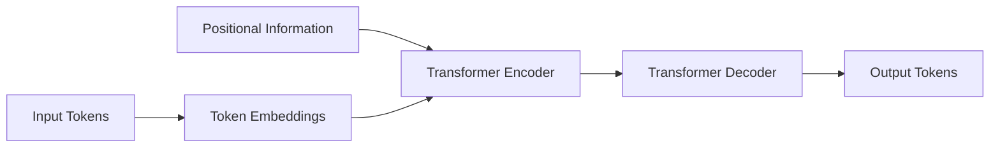

---

# 🧠 Transformer Architecture Landscape

Modern Transformer architectures evolved into three major patterns:

```text
Transformer
     │
     ├───────────────┬────────────────
     ▼               ▼               ▼
Encoder-only    Decoder-only    Encoder-Decoder
     │               │               │
     ▼               ▼               ▼
Classification      LLMs       Translation / Generation
```

Examples of tasks:

```text
Encoder-only
→ Classification
→ Embeddings
→ Sequence Understanding

Decoder-only
→ Text Generation
→ Code Generation
→ Conversational AI

Encoder-Decoder
→ Translation
→ Summarization
→ Sequence-to-Sequence Generation
```

---

# 🧠 Transformer Building Blocks

A Transformer is built from several core components:

```text
Token Embeddings
       ↓
Positional Information
       ↓
Multi-Head Attention
       ↓
Feed-Forward Network
       ↓
Residual Connections
       ↓
Layer Normalization
       ↓
Repeated Transformer Blocks
```

---

# 🧠 Transformer Block

A simplified Transformer block looks like:

```text
Input
  │
  ▼
Multi-Head Self-Attention
  │
  ▼
Add & Norm
  │
  ▼
Feed-Forward Network
  │
  ▼
Add & Norm
  │
  ▼
Output
```

---

# 🧠 Transformer Encoder Block

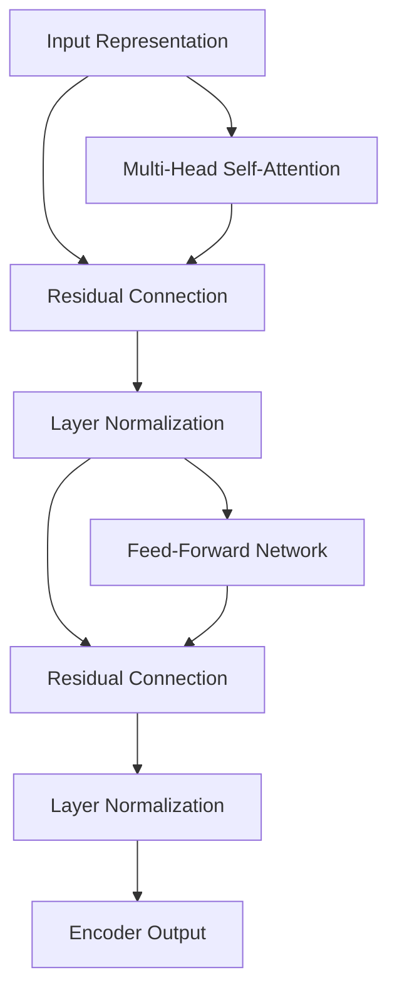

---

# 🧠 Token Embeddings

Neural networks operate on numerical representations.

Text starts as:

```text
"The cat sleeps"
```

The processing pipeline becomes:

```text
Text
 ↓
Tokenization
 ↓
Token IDs
 ↓
Embedding
 ↓
Dense Vectors
```

For example:

```text
"The"   → [0.12, -0.21, ...]
"cat"   → [0.51,  0.33, ...]
"sleeps"→ [-0.17, 0.81, ...]
```

---

# 🧠 Embedding Matrix

If:

```text
Vocabulary Size = V
Embedding Dimension = D
```

then the embedding matrix has shape:

\[
V \times D
\]


Each token maps to one row of this matrix.

---

# 🧠 Positional Information

Self-attention does not inherently understand:

```text
First
Second
Third
...
```

Therefore Transformer inputs need positional information.

Conceptually:

```text
Token Embedding
      +
Position Representation
      ↓
Transformer Input
```

---

# 🧠 Transformer Input

The Transformer input can be represented as:

\[
X=E+P
\]


where:

```text
E = Token Embeddings
P = Positional Representation
X = Transformer Input
```

---

# 🧠 Positional Information

Different Transformer architectures can use different positional mechanisms:

```text
Sinusoidal Positional Encoding
        ↓
Learned Positional Embeddings
        ↓
Relative Position Methods
        ↓
Rotary Position Representations
```

The exact mechanism depends on the model architecture.

---

# 🧠 Self-Attention

The central operation inside a Transformer is self-attention.

Given input:

```text
X
```

the model computes:

```text
Q = XWQ
K = XWK
V = XWV
```


---

# 🧠 Scaled Dot-Product Attention

The attention operation is:

\[
Attention(Q,K,V)
=
softmax
\left(
\frac{QK^T}{\sqrt{d_k}}
\right)V
\]


This consists of:

```text
QKᵀ
 ↓
Similarity Scores
 ↓
Scale
 ↓
Optional Mask
 ↓
Softmax
 ↓
Attention Weights
 ↓
Weighted Values
```

---

# 🧠 Attention Inside Transformer

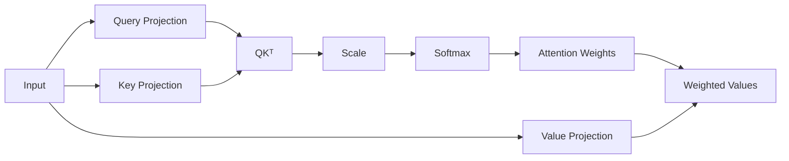

---

# 🧠 Multi-Head Attention

Transformers do not usually rely on a single attention operation.

Instead:

```text
Input
 ↓
Head 1
Head 2
Head 3
...
Head H
 ↓
Concatenate
 ↓
Output Projection
```

---

# 🧠 Multi-Head Attention Formula

\[
MultiHead(Q,K,V)
=
Concat(head_1,\ldots,head_h)W^O
\]


Each attention head is:

\[
head_i=
Attention(QW_i^Q,KW_i^K,VW_i^V)
\]


---

# 🧠 Multi-Head Attention Architecture

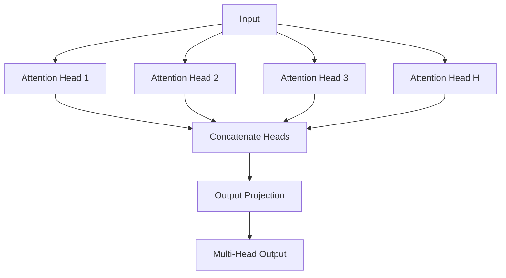

---

# 🧠 Why Multiple Heads?

Different heads can learn different relationships.

For example:

```text
Head 1
→ Local Relationships

Head 2
→ Syntactic Relationships

Head 3
→ Semantic Relationships

Head 4
→ Long-Range Relationships
```

These interpretations are conceptual rather than guaranteed fixed roles.

---

# 🧠 Attention Head Dimensions

Suppose:

```text
Model Dimension = 512
Number of Heads = 8
```

Then:

\[
d_{head}=\frac{512}{8}=64
\]


The heads operate in separate lower-dimensional subspaces before their outputs are concatenated.

---

# 🧠 Feed-Forward Network

Attention determines:

```text
Which information should interact?
```

The Feed-Forward Network transforms each token representation independently.

A standard Transformer FFN is:

\[
FFN(x)=\sigma(xW_1+b_1)W_2+b_2
\]


where:

```text
W₁ = First Projection
W₂ = Second Projection
σ  = Activation Function
```

Modern architectures may use different activation functions and FFN variants.

---

# 🧠 Feed-Forward Network Architecture

```text
Input
  ↓
Linear Projection
  ↓
Activation
  ↓
Linear Projection
  ↓
Output
```

---

# 🧠 Why Does the Transformer Need an FFN?

Attention primarily mixes information across positions.

The FFN then performs nonlinear transformation on each position.

Conceptually:

```text
Self-Attention
      ↓
Mix Information Across Tokens
      ↓
Feed-Forward Network
      ↓
Transform Each Token Representation
```

---

# 🧠 Attention + FFN

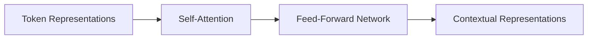

---

# 🧠 Residual Connections

Transformers use residual connections around major sublayers.

The basic idea is:

\[
y=x+F(x)
\]


Instead of forcing the layer to learn an entirely new representation, the network learns a transformation on top of the existing representation.

---

# 🧠 Residual Connection

```text
          ┌────────────────────┐
          │                    │
Input ────┼──► Transformer ────┼──► Add
          │         Block       │
          │                    │
          └────────────────────┘
                    │
                    ▼
                  Output
```

---

# 🧠 Why Residual Connections?

Residual connections help:

```text
Gradient Flow
      ↓
Deep Network Training
      ↓
Stable Optimization
```

They are especially important when many Transformer blocks are stacked.

---

# 🧠 Layer Normalization

Transformer architectures use normalization to stabilize activations.

Layer Normalization normalizes features within an individual example rather than across the batch.

Conceptually:

```text
Token Representation
        ↓
Layer Normalization
        ↓
Normalized Representation
```

---

# 🧠 Layer Normalization

For a feature vector:

\[
\hat{x}=\frac{x-\mu}{\sqrt{\sigma^2+\epsilon}}
\]


A learnable scale and bias are generally applied afterward.

---

# 🧠 Why LayerNorm?

Layer normalization can help:

```text
Stable Activations
+
Stable Gradient Flow
+
Reliable Deep Training
```

It is particularly suitable for sequence models because it does not depend on batch statistics in the same way BatchNorm does.

---

# 🧠 Add & Norm

A simplified Transformer sublayer can be visualized as:

```text
Input
 │
 ├─────────────────┐
 │                 │
 ▼                 │
Sublayer           │
 │                 │
 └──────────► Add ◄┘
               │
               ▼
        Layer Normalization
               │
               ▼
             Output
```

---

# 🧠 Post-Norm vs Pre-Norm

Two common arrangements are:

### Post-Norm

```text
x
 ↓
Sublayer
 ↓
Add
 ↓
LayerNorm
```

### Pre-Norm

```text
x
 ↓
LayerNorm
 ↓
Sublayer
 ↓
Add
```

Modern large Transformer architectures commonly use pre-normalization or related variants because of training-stability considerations.

---

# 🧠 Transformer Encoder Block

A conceptual encoder block can be represented as:

```text
Input
 ↓
LayerNorm
 ↓
Multi-Head Self-Attention
 ↓
Residual Add
 ↓
LayerNorm
 ↓
Feed-Forward Network
 ↓
Residual Add
 ↓
Output
```

---

# 🧠 Encoder Block

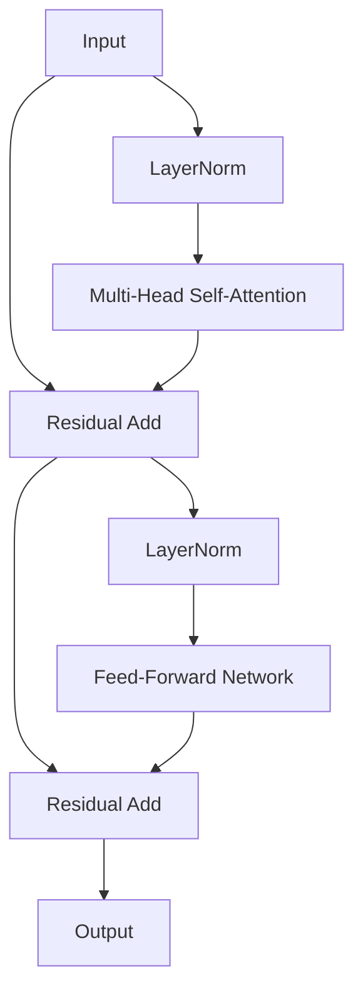

---

# 🧠 Stacking Transformer Encoder Blocks

A Transformer rarely uses only one block.

Instead:

```text
Input
 ↓
Encoder Block 1
 ↓
Encoder Block 2
 ↓
Encoder Block 3
 ↓
...
 ↓
Encoder Block N
 ↓
Output
```

---

# 🧠 Deep Transformer

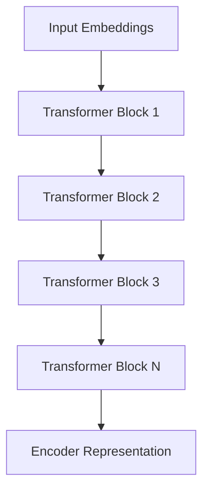

---

# 🧠 Transformer Decoder

The original Transformer decoder contains:

```text
Masked Self-Attention
+
Cross-Attention
+
Feed-Forward Network
```

with residual connections and normalization around the sublayers.

---

# 🧠 Decoder Block

```text
Input
 ↓
Masked Self-Attention
 ↓
Add & Norm
 ↓
Cross-Attention
 ↓
Add & Norm
 ↓
Feed-Forward Network
 ↓
Add & Norm
 ↓
Output
```

---

# 🧠 Transformer Decoder Architecture

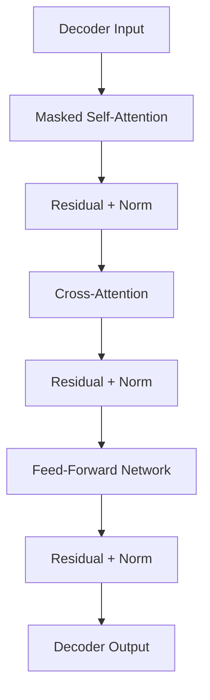

---

# 🧠 Masked Self-Attention

The decoder's self-attention is masked so the model cannot see future target tokens.

For:

```text
I love machine learning
```

when predicting:

```text
machine
```

the model can use:

```text
I
love
```

but not future tokens.

---

# 🧠 Decoder Causal Mask

```text
       Token

       1  2  3  4

1      ✓  ✗  ✗  ✗
2      ✓  ✓  ✗  ✗
3      ✓  ✓  ✓  ✗
4      ✓  ✓  ✓  ✓
```

This prevents information leakage during autoregressive generation.

---

# 🧠 Cross-Attention in Decoder

The decoder can attend to encoder outputs.

```text
Decoder Query
       ↓
Cross-Attention
       ↑
Encoder Keys + Values
```

This allows the decoder to retrieve relevant information from the encoded source sequence.

---

# 🧠 Full Encoder-Decoder Transformer

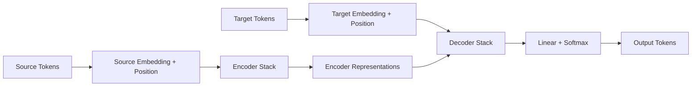

---

# 🧠 Encoder-Only Transformer

Encoder-only models use:

```text
Input
 ↓
Encoder Blocks
 ↓
Contextual Representations
 ↓
Task Head
```

Typical tasks:

```text
Text Classification
Named Entity Recognition
Embedding Generation
Semantic Similarity
```

---

# 🧠 Encoder-Only Architecture

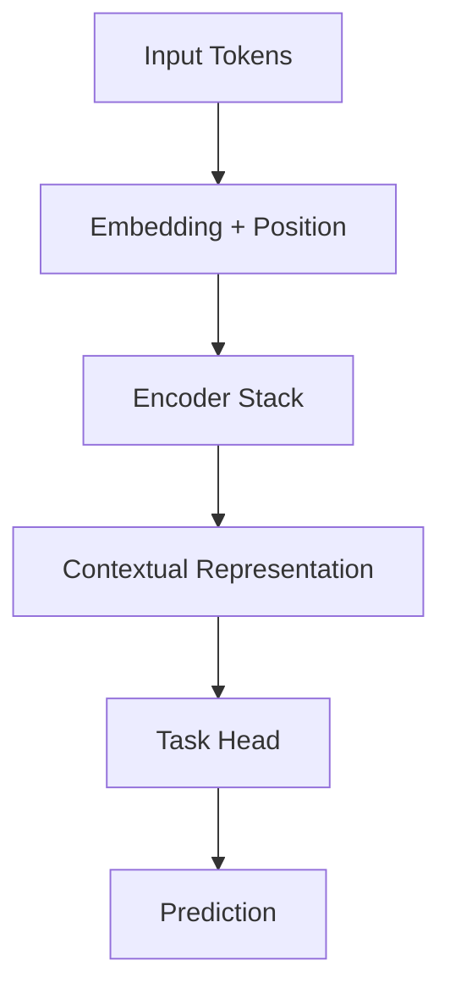

---

# 🧠 Decoder-Only Transformer

Decoder-only architectures use:

```text
Causal Self-Attention
+
Feed-Forward Networks
```

They are particularly suited to autoregressive generation.

Pipeline:

```text
Prompt
 ↓
Decoder Blocks
 ↓
Next-Token Probabilities
 ↓
Selected Token
 ↓
Append Token
 ↓
Repeat
```

---

# 🧠 Decoder-Only Architecture

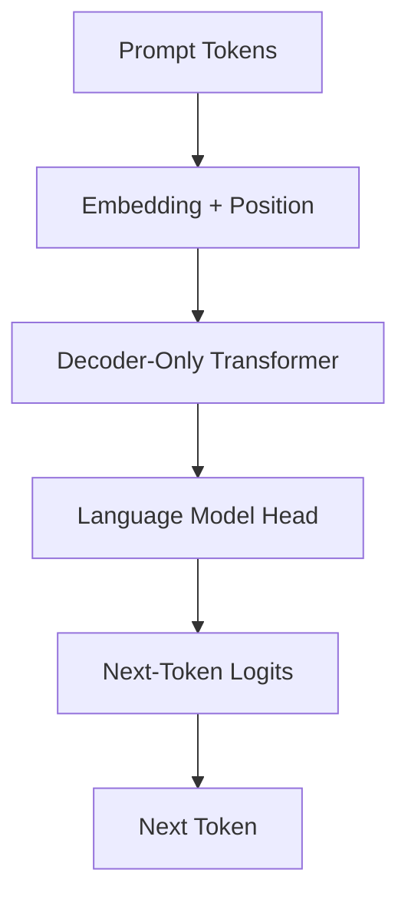

---

# 🧠 Encoder-Decoder Transformer

Encoder-decoder architectures use:

```text
Encoder
+
Decoder
```

They are particularly useful for sequence-to-sequence tasks.

Examples:

```text
Translation
Summarization
Text Transformation
```

---

# 🧠 Transformer Architecture Types

| Architecture | Main Mechanism | Typical Use |
|---|---|---|
| Encoder-only | Bidirectional Self-Attention | Understanding |
| Decoder-only | Causal Self-Attention | Generation |
| Encoder-decoder | Encoder + Cross-Attention Decoder | Sequence-to-sequence |

---

# 🧠 Transformer Data Flow

A simplified Transformer pipeline:

```text
Raw Input
   ↓
Tokenizer
   ↓
Token IDs
   ↓
Embedding
   ↓
Positional Information
   ↓
Transformer Blocks
   ↓
Contextual Representation
   ↓
Task / Language Model Head
   ↓
Output
```

---

# 🧠 Transformer Token Processing

For:

```text
"Machine learning is powerful"
```

the process becomes:

```text
Tokens
 ↓
[Machine, learning, is, powerful]
 ↓
Token IDs
 ↓
Embeddings
 ↓
Position Information
 ↓
Self-Attention
 ↓
Contextual Representations
```

After multiple Transformer layers, each token representation incorporates information from the relevant context.

---

# 🧠 Contextual Embeddings

A static embedding:

```text
bank
 ↓
One Vector
```

does not necessarily capture the meaning of every context.

Transformer representations are contextual:

```text
bank + river
      ↓
Contextual Representation A

bank + finance
      ↓
Contextual Representation B
```

The same token can therefore have different contextual representations depending on surrounding information.

---

# 🧠 Transformer as Context Builder

```text
Token
  +
Surrounding Tokens
  ↓
Self-Attention
  ↓
Contextual Representation
```

Repeated across layers:

```text
Context
 ↓
More Context
 ↓
Higher-Level Representation
```

---

# 🧠 Transformer Layer Processing

A Transformer layer can be understood as:

```text
Input Representation
       ↓
Attention
       ↓
Information Mixing
       ↓
Feed-Forward Transformation
       ↓
Output Representation
```

Repeated many times:

```text
Layer 1
 ↓
Layer 2
 ↓
Layer 3
 ↓
...
Layer N
```

---

# 🧠 Transformer Tensor Shapes

Suppose:

```text
Batch Size = B
Sequence Length = T
Model Dimension = D
```

The input tensor is:

\[
X\in\mathbb{R}^{B\times T\times D}
\]


For example:

```text
B = 32
T = 128
D = 512
```

Input shape:

```text
[32, 128, 512]
```

---

# 🧠 Attention Tensor Shapes

For:

```text
Batch = B
Heads = H
Sequence Length = T
Head Dimension = Dh
```

the projected tensors become:

```text
Q → [B, H, T, Dh]
K → [B, H, T, Dh]
V → [B, H, T, Dh]
```

The attention score matrix is:

```text
[B, H, T, T]
```

---

# 🧠 Why T × T Matters

The attention matrix contains relationships between every pair of sequence positions.

For:

```text
T = 4
```

we get:

```text
4 × 4
```

For:

```text
T = 1024
```

we get:

```text
1024 × 1024
```

which is:

\[
1,048,576
\]


attention positions per head for one sequence.

---

# ⚠ Transformer Complexity

Standard self-attention has approximately quadratic complexity with respect to sequence length:

\[
O(T^2D)
\]


where:

```text
T = Sequence Length
D = Model Dimension
```

This becomes a major consideration for long-context systems.

---

# 🧠 Transformer Complexity Visualization

```text
Sequence Length
      │
      │
      │                 █
      │
      │          █
      │
      │      █
      │
      │   █
      │ █
      └────────────────────
          Attention Cost
```

Conceptually:

```text
Short Context
    ↓
Low Attention Cost

Long Context
    ↓
Rapidly Increasing Cost
```

---

# 🧠 Why Transformers Scale Well During Training

Although attention has quadratic sequence complexity, Transformer training can perform many operations in parallel using matrix operations.

Compared with RNNs:

```text
RNN

Time Step 1
    ↓
Time Step 2
    ↓
Time Step 3
    ↓
Time Step 4
```

Transformer:

```text
Tokens
 ↓
Large Matrix Operations
 ↓
GPU Parallelism
```

This is one of the key reasons Transformers became dominant for large-scale sequence modeling.

---

# 🧠 Autoregressive Generation

Decoder-only Transformers generate tokens one at a time during inference.

Example:

```text
Prompt:
"The weather is"

      ↓

Token 1:
"good"

      ↓

"The weather is good"

      ↓

Token 2:
"today"

      ↓

"The weather is good today"
```

The process continues until:

```text
EOS
```

or another stopping condition.

---

# 🧠 Autoregressive Generation

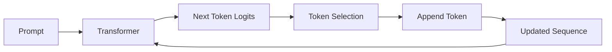

---

# 🧠 Language Model Head

The Transformer hidden representation is projected into vocabulary space.

If:

```text
Hidden Dimension = D
Vocabulary Size = V
```

then the language model head produces:

```text
[B, T, V]
```

logits.

The probability distribution is:

\[
P(token_i|context)=softmax(logits)
\]


---

# 🧠 Next Token Prediction

The model estimates:

```text
P(token₁ | context)
P(token₂ | context)
P(token₃ | context)
...
P(tokenV | context)
```

Then a decoding strategy selects the next token.

Common strategies include:

```text
Greedy Decoding
Sampling
Temperature
Top-k
Top-p
Beam Search
```

These are covered further in modern generative AI systems.

---

# 🧠 KV Cache

During autoregressive generation, the model repeatedly processes an expanding sequence.

Without caching:

```text
Token 1
 ↓
Recompute

Token 1 + Token 2
 ↓
Recompute

Token 1 + Token 2 + Token 3
 ↓
Recompute
```

KV caching stores previously calculated:

```text
Keys
+
Values
```

so they can be reused.

---

# 🧠 KV Cache Concept

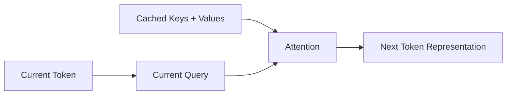

---

# 🧠 Why KV Cache Matters

KV caching improves autoregressive generation efficiency by avoiding unnecessary recomputation of previous Key and Value representations.

It is especially important for:

```text
LLM Serving
Long Conversations
High Throughput Inference
Interactive AI
```

---

# 🧠 Transformer Training vs Inference

### Training

```text
Many Tokens
     ↓
Parallel Matrix Operations
     ↓
GPU
     ↓
Efficient Training
```

### Autoregressive Inference

```text
Token 1
 ↓
Token 2
 ↓
Token 3
 ↓
Token 4
```

Generation remains sequential at the token level.

KV caching reduces repeated computation but does not make autoregressive generation fully parallel.

---

# 🧠 Transformer Training

A typical training flow:

```text
Dataset
 ↓
Tokenization
 ↓
Batching
 ↓
Transformer
 ↓
Logits
 ↓
Loss
 ↓
Backpropagation
 ↓
Optimizer
 ↓
Parameter Update
```

---

# 🧠 Language Model Training

For next-token prediction:

```text
Input:

The cat is

Target:

cat is sleeping
```

The model learns:

```text
P(cat | The)
P(is | The cat)
P(sleeping | The cat is)
```

using causal masking.

---

# 🧠 Cross-Entropy Loss

For classification or next-token prediction, cross-entropy is commonly used.

For a target class:

\[
L=-\log P(y|x)
\]


Higher probability assigned to the correct target produces lower loss.

---

# 🧠 Transformer Training Loop

```python
for batch in train_loader:

    input_ids = batch["input_ids"]
    labels = batch["labels"]

    optimizer.zero_grad()

    logits = model(
        input_ids
    )

    loss = criterion(
        logits,
        labels
    )

    loss.backward()

    optimizer.step()
```

In production training, additional components are commonly required:

```text
Mixed Precision
Gradient Clipping
Learning Rate Scheduling
Checkpointing
Distributed Training
Experiment Tracking
Validation
Monitoring
```

---

# 🐍 Part I — PyTorch Transformer

PyTorch provides Transformer components such as:

```python
torch.nn.Transformer
torch.nn.TransformerEncoder
torch.nn.TransformerEncoderLayer
torch.nn.TransformerDecoder
torch.nn.MultiheadAttention
```

These can be used to construct Transformer-based models.

---

# 🧪 Transformer Encoder Layer

A simple encoder layer can be created using:

```python
import torch.nn as nn


encoder_layer = nn.TransformerEncoderLayer(
    d_model=512,
    nhead=8,
    batch_first=True
)
```

---

# 🧪 Transformer Encoder

```python
encoder = nn.TransformerEncoder(
    encoder_layer,
    num_layers=6
)
```

Conceptually:

```text
Input
 ↓
Encoder Layer 1
 ↓
Encoder Layer 2
 ↓
Encoder Layer 3
 ↓
...
 ↓
Encoder Layer 6
 ↓
Output
```

---

# 🧪 Transformer Encoder Classifier

```python
class TransformerClassifier(
    nn.Module
):

    def __init__(
        self,
        vocab_size,
        d_model,
        nhead,
        num_layers,
        num_classes
    ):

        super().__init__()

        self.embedding = nn.Embedding(
            vocab_size,
            d_model
        )

        encoder_layer = (
            nn.TransformerEncoderLayer(
                d_model=d_model,
                nhead=nhead,
                batch_first=True
            )
        )

        self.encoder = (
            nn.TransformerEncoder(
                encoder_layer,
                num_layers=num_layers
            )
        )

        self.fc = nn.Linear(
            d_model,
            num_classes
        )

    def forward(
        self,
        input_ids
    ):

        x = self.embedding(
            input_ids
        )

        x = self.encoder(
            x
        )

        pooled = x[:, 0]

        return self.fc(
            pooled
        )
```

---

# 🧠 Transformer Classifier Architecture

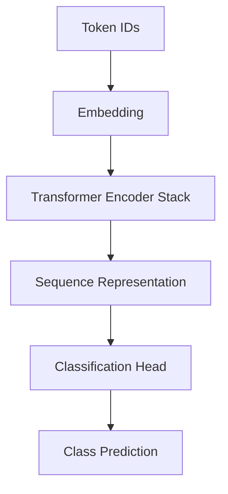

---

# 🧪 Transformer Configuration

Example:

```python
model = TransformerClassifier(
    vocab_size=30000,
    d_model=256,
    nhead=8,
    num_layers=6,
    num_classes=3
)
```

This configuration means:

```text
Vocabulary = 30,000
Model Dimension = 256
Attention Heads = 8
Encoder Layers = 6
Classes = 3
```

---

# 🧠 Attention Head Dimension

For:

```text
d_model = 256
nhead = 8
```

we get:

\[
d_{head}=\frac{256}{8}=32
\]


---

# 🧪 Transformer Mask

For causal modeling, a causal mask can be created.

```python
seq_len = 128

mask = (
    torch.triu(
        torch.ones(
            seq_len,
            seq_len
        ),
        diagonal=1
    ).bool()
)
```

This identifies future positions that should be blocked.

---

# 🧠 Transformer Attention Masks

Production Transformer systems may need multiple masks:

```text
Padding Mask
+
Causal Mask
+
Application-Specific Mask
```

The exact masking strategy depends on the architecture.

---

# 🧠 Transformer Encoder vs Decoder

### Encoder

```text
Input
 ↓
Bidirectional Self-Attention
 ↓
FFN
 ↓
Output
```

### Decoder

```text
Input
 ↓
Causal Self-Attention
 ↓
Cross-Attention
 ↓
FFN
 ↓
Output
```

---

# 🧠 Architecture Comparison

| Component | Encoder | Decoder |
|---|---|---|
| Self-Attention | Yes | Yes |
| Causal Mask | Usually No | Yes for autoregressive decoding |
| Cross-Attention | No | Yes in encoder-decoder architecture |
| FFN | Yes | Yes |
| Residual Connections | Yes | Yes |
| LayerNorm | Yes | Yes |

---

# 🧠 Original Transformer vs Modern LLMs

The original Transformer was an:

```text
Encoder
+
Decoder
```

architecture.

Modern LLMs often use:

```text
Decoder-Only Transformer
```

with:

```text
Causal Self-Attention
+
Feed-Forward Networks
+
Positional Representation
+
Residual Connections
+
Normalization
```

---

# 🧠 Modern LLM Architecture

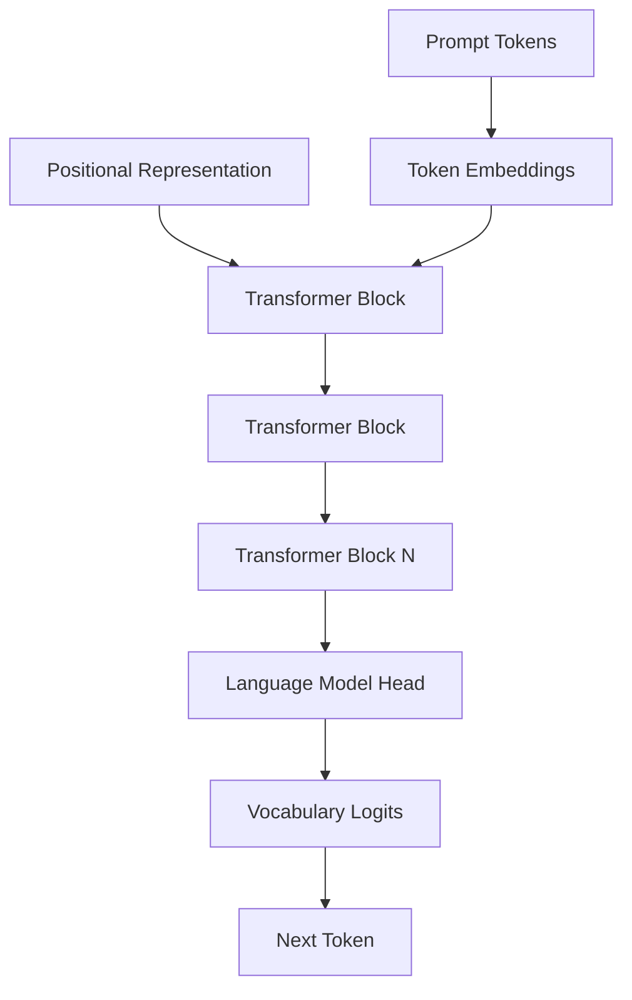

---

# 🧠 Transformer → LLM

A Large Language Model is not simply:

```text
Transformer
+
More Layers
```

A production LLM ecosystem also involves:

```text
Large-Scale Pretraining
+
Massive Datasets
+
Distributed Training
+
Optimization
+
Tokenizer
+
Evaluation
+
Alignment / Post-Training
+
Inference Infrastructure
+
Safety / Governance
```

---

# 🧠 Transformer Evolution

```text
Original Transformer
        ↓
Encoder Models
        ↓
Decoder Models
        ↓
Large-Scale Pretraining
        ↓
Foundation Models
        ↓
Large Language Models
        ↓
Multimodal Models
        ↓
Modern Generative AI
```

---

# 🧠 Transformer Architecture Landscape

```text
                     Transformer
                          │
            ┌─────────────┼─────────────┐
            ▼             ▼             ▼
       Encoder-only   Decoder-only   Encoder-Decoder
            │             │             │
            ▼             ▼             ▼
       Understanding   Generation   Seq2Seq
            │             │             │
            ▼             ▼             ▼
       Embeddings        LLMs       Translation
       Classification    Code       Summarization
       Retrieval         Chat       Transformation
```

---

# 🏢 Enterprise Transformer Architecture

A production Transformer system may look like:

```text
Client
  ↓
API Gateway
  ↓
Inference Service
  ↓
Tokenizer
  ↓
Model Runtime
  ↓
Transformer
  ↓
Post Processing
  ↓
Response
```

---

# 🏢 Production Transformer Architecture

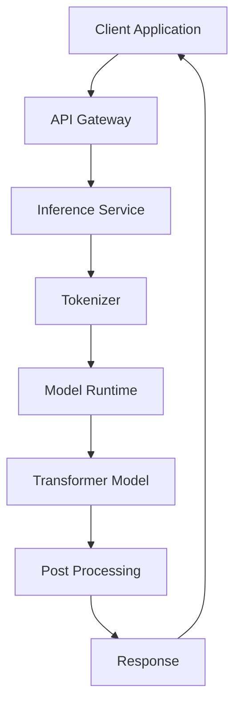

---

# 🏢 Production Transformer Concerns

A production Transformer system must consider:

```text
Latency
Throughput
GPU Memory
Context Length
Batch Size
Model Size
Quantization
KV Cache
Concurrency
Autoscaling
Observability
Model Versioning
Cost
Security
```

---

# 🏢 GPU Memory

Transformer inference can require substantial memory because of:

```text
Model Parameters
+
Activations
+
Attention Buffers
+
KV Cache
+
Batch Size
```

Therefore:

```text
Long Context
+
Large Batch
+
Large Model
```

can rapidly increase GPU memory requirements.

---

# 🏢 KV Cache and Serving

For decoder-only LLMs:

```text
Prompt
 ↓
Prefill
 ↓
KV Cache
 ↓
Token Generation
 ↓
Reuse KV Cache
```

This creates two important inference phases:

```text
Prefill
+
Decode
```

---

# 🧠 Prefill

During prefill:

```text
Entire Prompt
      ↓
Transformer
      ↓
Compute Prompt Representations
      ↓
KV Cache
```

The prompt can generally be processed in parallel.

---

# 🧠 Decode

During decoding:

```text
Current Token
      ↓
Transformer
      ↓
Next Token
      ↓
Repeat
```

The process is sequential at the token level.

KV caching avoids recomputing previous Key and Value representations.

---

# 🧠 Prefill vs Decode

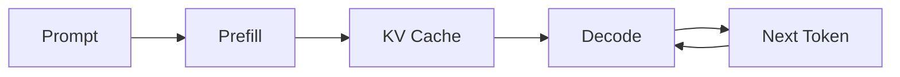

---

# 🏢 Transformer Observability

Production monitoring should cover:

### Infrastructure

```text
GPU Utilization
GPU Memory
CPU Utilization
Memory
Network
```

### Model

```text
Latency
Throughput
Token Generation Rate
Error Rate
Output Quality
```

### Request

```text
Input Tokens
Output Tokens
Total Tokens
Context Length
Batch Size
```

### Serving

```text
Queue Time
Prefill Latency
Decode Latency
P50 Latency
P95 Latency
P99 Latency
```

---

# 🏢 Cost Monitoring

For LLM workloads, cost is often related to:

```text
Input Tokens
+
Output Tokens
+
Model Size
+
GPU Time
```

Therefore production teams should track:

```text
Tokens per Request
GPU Seconds per Request
Requests per Second
Cost per Request
Cost per Token
```

---

# 🏢 Model Versioning

A production Transformer deployment should version:

```text
Model
Tokenizer
Vocabulary
Prompt Templates
Configuration
Weights
Quantization
Runtime
Evaluation Dataset
```

For LLM applications also consider:

```text
System Prompt
Tool Configuration
Retrieval Configuration
Safety Policies
```

---

# 🏢 Deployment Strategies

Transformer systems can be deployed using:

```text
Dedicated GPU Servers
+
Managed ML Platforms
+
Containerized Inference
+
Model Serving Platforms
+
Serverless / Specialized Inference
```

The choice depends on:

```text
Latency
Traffic
Model Size
Cost
Scaling Requirements
Operational Complexity
```

---

# 🏢 Transformer Scaling

At enterprise scale:

```text
Client Requests
       ↓
Load Balancer
       ↓
Inference Workers
       ↓
GPU Pool
       ↓
Transformer Models
```

Autoscaling can respond to:

```text
Request Rate
Queue Depth
GPU Utilization
Latency
```

---

# 🧠 Transformer Architecture Decision

When designing a Transformer system, ask:

```text
What is the task?
      ↓
Understanding or Generation?
      ↓
Encoder-only?
Decoder-only?
Encoder-decoder?
      ↓
What is the context length?
      ↓
What latency is required?
      ↓
What hardware is available?
      ↓
What model size is appropriate?
      ↓
What serving strategy is required?
```

---

# 🧪 Practical Exercise 1 — Build Transformer Encoder

Create:

```text
Embedding
+
Positional Information
+
Transformer Encoder
+
Classification Head
```

Train it on a sequence classification dataset.

---

# 🧪 Practical Exercise 2 — Inspect Attention

Capture attention weights and visualize:

```text
Token × Token
```

attention matrices.

Analyze:

```text
Which tokens interact?
Which heads behave differently?
```

---

# 🧪 Practical Exercise 3 — Causal Transformer

Build a decoder-style Transformer with:

```text
Causal Mask
```

Verify that:

```text
Current Token
```

cannot access:

```text
Future Tokens
```

---

# 🧪 Practical Exercise 4 — Positional Encoding

Implement:

```text
Sinusoidal Positional Encoding
```

and compare it with:

```text
Learned Positional Embedding
```

---

# 🧪 Practical Exercise 5 — Multi-Head Attention

Configure:

```text
d_model = 256
heads = 8
```

and verify:

```text
head dimension = 32
```

---

# 🧪 Practical Exercise 6 — Transformer Depth

Compare:

```text
2 Layers
4 Layers
6 Layers
8 Layers
```

Measure:

```text
Accuracy
Training Time
Parameter Count
Memory
```

---

# 🧪 Practical Exercise 7 — Context Length

Benchmark:

```text
128 tokens
256 tokens
512 tokens
1024 tokens
```

Measure:

```text
GPU Memory
Attention Cost
Latency
```

---

# 🧪 Practical Exercise 8 — RNN vs Transformer

Train:

```text
LSTM
```

and:

```text
Transformer Encoder
```

on the same dataset.

Compare:

```text
Accuracy
Training Time
Inference Latency
Memory
Long-Range Dependency Performance
```

---

# 🧪 Practical Exercise 9 — KV Cache Concept

Build a simplified autoregressive decoder.

Measure generation time:

```text
Without KV Cache
```

vs:

```text
With KV Cache
```

Observe how caching affects repeated computation.

---

# 🧪 Practical Exercise 10 — Production Benchmark

Benchmark a Transformer under different:

```text
Batch Sizes
Context Lengths
Sequence Lengths
Model Sizes
```

Record:

```text
P50 Latency
P95 Latency
Throughput
GPU Memory
Cost
```

---

# 🧠 Interview Questions

## Beginner

### 1. What is a Transformer?

A Transformer is a neural network architecture based primarily on attention mechanisms rather than recurrent sequence processing.

### 2. Why were Transformers introduced?

They were introduced to improve sequence modeling by enabling stronger parallelism and direct modeling of relationships between sequence positions.

### 3. What are the main components of a Transformer?

```text
Embeddings
Positional Information
Attention
Feed-Forward Networks
Residual Connections
Normalization
```

### 4. What is self-attention?

Self-attention allows tokens within the same sequence to directly interact through Query-Key-Value attention.

### 5. What is multi-head attention?

Multi-head attention performs several attention operations in parallel and combines their outputs.

---

## Intermediate

### 6. What is the Transformer attention equation?

\[
Attention(Q,K,V)
=
softmax
\left(
\frac{QK^T}{\sqrt{d_k}}
\right)V
\]


### 7. Why does a Transformer need positional information?

Because self-attention by itself does not inherently encode the order of tokens.

### 8. What is the role of the FFN?

The FFN applies nonlinear transformations independently to each token representation after attention mixes contextual information.

### 9. What is a residual connection?

A shortcut that adds the input representation to the output of a sublayer.

\[
y=x+F(x)
\]


### 10. What is LayerNorm?

A normalization technique that normalizes feature representations within individual examples.

### 11. What is causal attention?

Attention that prevents a token from accessing future positions.

### 12. What is cross-attention?

Attention where Queries come from one representation and Keys/Values come from another.

---

## Advanced

### 13. Why are Transformers more parallelizable than RNNs?

Transformers can process sequence relationships using matrix operations without requiring each time step to wait for the previous hidden state.

### 14. What is the complexity of standard self-attention?

Approximately:

\[
O(T^2D)
\]


where `T` is sequence length and `D` is model dimension.

### 15. Why does attention become expensive for long contexts?

Because every token can attend to every other token, producing an approximately `T × T` attention matrix.

### 16. What is the difference between encoder-only and decoder-only Transformers?

Encoder-only models are generally optimized for contextual understanding, while decoder-only models use causal attention for autoregressive generation.

### 17. What is the purpose of causal masking?

To prevent future-token information from leaking into predictions during autoregressive training.

### 18. What is KV caching?

A technique that stores previously computed Key and Value representations during autoregressive generation so they do not need to be recomputed.

### 19. What are prefill and decode phases?

Prefill processes the prompt and builds the KV cache. Decode generates new tokens sequentially using the cached context.

### 20. Why are Transformers effective for long-range relationships?

Self-attention provides direct paths between distant sequence positions rather than requiring information to propagate through many recurrent time steps.

### 21. Why are residual connections important?

They improve information and gradient flow through deep Transformer stacks.

### 22. Why is LayerNorm preferred over BatchNorm in many Transformers?

LayerNorm operates independently of batch statistics and works naturally with token-level sequence representations.

---

# 🏢 Enterprise Perspective

The Transformer is not just another neural network architecture.

It represents a fundamental change in how Deep Learning systems process context:

```text
RNN Era
   ↓
Sequential Memory
   ↓
LSTM / GRU
   ↓
Attention
   ↓
Direct Context Interaction
   ↓
Transformer
   ↓
Large-Scale Pretraining
   ↓
Foundation Models
```

This architecture now underpins a large portion of modern:

```text
Generative AI
Large Language Models
Code Models
Vision Transformers
Multimodal Models
Speech Models
Embedding Models
```

---

# 🏢 Production Transformer Stack

A modern enterprise AI platform may look like:

```text
                    Client
                      │
                      ▼
                API Gateway
                      │
                      ▼
             AI Application Service
                      │
          ┌───────────┴───────────┐
          ▼                       ▼
      Retrieval               Tools / APIs
          │                       │
          └───────────┬───────────┘
                      ▼
                 Prompt Builder
                      │
                      ▼
                  Tokenizer
                      │
                      ▼
             Transformer Runtime
                      │
                      ▼
                  GPU Cluster
                      │
                      ▼
                Model Output
                      │
                      ▼
              Post Processing
                      │
                      ▼
                 Response
```

---

# 🏢 Transformer + RAG

A production RAG system commonly combines:

```text
User Query
     ↓
Embedding
     ↓
Retriever
     ↓
Relevant Documents
     ↓
Context Construction
     ↓
Transformer / LLM
     ↓
Generated Response
```

The Transformer performs contextual reasoning/generation, while the retrieval system supplies external knowledge.

---

# 🏢 Transformer + Agentic AI

A modern agentic architecture may extend the Transformer with:

```text
LLM
 ↓
Reasoning / Planning
 ↓
Tool Selection
 ↓
Tool Execution
 ↓
Observation
 ↓
Next Model Call
 ↓
Final Response
```

The Transformer provides the model intelligence, while orchestration components manage the surrounding workflow.

---

# 🏢 Production Optimization Areas

For enterprise Transformer workloads, optimization often happens across:

```text
Model
 ↓
Quantization
 ↓
Attention Kernel
 ↓
KV Cache
 ↓
Batching
 ↓
GPU Utilization
 ↓
Serving Runtime
 ↓
Autoscaling
```

---

# 🏢 GPU-Aware Transformer Design

Production performance depends heavily on:

```text
GPU Architecture
+
Memory Bandwidth
+
GPU Memory
+
Kernel Efficiency
+
Batch Size
+
Sequence Length
```

Therefore:

> **Transformer architecture and infrastructure architecture cannot be treated independently at production scale.**

---

!!! tip "Production Insight"

    **The Transformer is an architectural pattern, not the complete production AI system.**

    A production-grade Transformer application requires multiple engineering layers:

    ```text
    Model Architecture
          ↓
    Model Weights
          ↓
    Tokenization
          ↓
    Inference Runtime
          ↓
    GPU Infrastructure
          ↓
    Serving Layer
          ↓
    API / Microservice
          ↓
    Observability
          ↓
    Security & Governance
    ```

    For large-scale AI systems, the most important engineering questions are not only:

    ```text
    "Which model should we use?"
    ```

    but also:

    ```text
    How much context?
    How much latency?
    How much throughput?
    How much GPU memory?
    How much does each request cost?
    How do we monitor it?
    How do we version it?
    How do we scale it?
    ```

---

# 📌 Key Takeaways

- Transformers replaced recurrence as the dominant architecture for many modern sequence-modeling workloads.
- The original Transformer uses an encoder-decoder architecture.
- Modern Transformer systems commonly use encoder-only, decoder-only, or encoder-decoder configurations.
- Token embeddings convert token IDs into dense vector representations.
- Positional information provides sequence-order information.
- Self-attention allows tokens to directly interact with other tokens.
- Query, Key, and Value projections form the foundation of attention.
- Scaled dot-product attention computes contextual representations.
- Multi-head attention allows multiple attention subspaces to operate in parallel.
- Feed-Forward Networks provide nonlinear transformation after attention.
- Residual connections improve information and gradient flow.
- Layer Normalization helps stabilize deep Transformer training.
- Encoder blocks use self-attention and feed-forward networks.
- Decoder blocks use masked self-attention and, in encoder-decoder architectures, cross-attention.
- Causal masking prevents future-token information leakage.
- Encoder-only models are commonly used for understanding and representation tasks.
- Decoder-only models are widely used for autoregressive generation and LLMs.
- Encoder-decoder models are useful for sequence-to-sequence tasks.
- Standard self-attention has approximately quadratic complexity with sequence length.
- KV caching improves autoregressive inference efficiency.
- Transformer training is highly parallelizable compared with recurrent architectures.
- Autoregressive generation remains sequential at the token level.
- Production Transformer systems require careful attention to GPU memory, latency, throughput, context length, batching, and cost.
- Transformers provide the architectural foundation for many modern foundation models and Generative AI systems.

---

# 📚 Further Reading

Continue with:

- **[28. Transformer Applications](28-transformer-applications.md)**
- **[29. Autoencoders and Representation Learning](29-autoencoders-and-representation-learning.md)**
- **[31. Diffusion Models](31-diffusion-models.md)**
- **[35. GPU Accelerated Deep Learning](35-gpu-accelerated-deep-learning.md)**
- **[36. Deep Learning Training and Model Lifecycle](36-deep-learning-training-and-model-lifecycle.md)**
- **[37. Building Production Deep Learning Systems](37-building-production-deep-learning-systems.md)**

The next chapter explores how Transformer architectures are applied across **NLP, computer vision, speech, multimodal AI, Generative AI, embeddings, and enterprise systems**.

---

## ➡️ Next Chapter

**[28. Transformer Applications](28-transformer-applications.md)**

---

> **Enterprise AI Engineering Handbook**  
> *Building Production-Grade Enterprise AI Systems — One Chapter at a Time.*