# 28. Transformer Applications

> Explore how Transformer architectures have evolved beyond their original sequence-to-sequence design and now power Natural Language Processing, Large Language Models, Computer Vision, Speech, Multimodal AI, Retrieval, Recommendation, and enterprise intelligent systems.

---

## 🎯 Learning Objectives

After completing this chapter, you will be able to:

- Understand the major application areas of Transformers
- Explain how Transformers are used in Natural Language Processing
- Understand encoder-only Transformer applications
- Understand decoder-only Transformer applications
- Understand encoder-decoder Transformer applications
- Explain how Transformers power Large Language Models
- Understand Transformer-based text classification
- Understand semantic embeddings and similarity
- Understand question answering with Transformers
- Understand machine translation
- Understand text summarization
- Understand code generation
- Understand Transformers for computer vision
- Understand Vision Transformers
- Understand Transformers for speech and audio
- Understand multimodal Transformer systems
- Understand Transformer-based retrieval and reranking
- Understand recommendation applications
- Understand document intelligence
- Understand Generative AI applications
- Understand Transformer-based enterprise architectures
- Understand production considerations when applying Transformers
- Select an appropriate Transformer architecture for a business problem

---

# 📖 Overview

The Transformer was originally introduced as an architecture for sequence-to-sequence learning.

Its impact, however, quickly expanded beyond the original use case.

Today, Transformer architectures are used for:

```text
Natural Language Processing
Computer Vision
Speech
Audio
Multimodal AI
Search
Recommendations
Code Intelligence
Document Intelligence
Generative AI
Enterprise AI
```

The important architectural idea is not simply:

> "Transformers are good at text."

The deeper idea is:

> **Attention provides a flexible mechanism for modeling relationships between elements in structured data.**

Those elements can be:

```text
Tokens
Image Patches
Audio Frames
Video Frames
Documents
Code Tokens
Sensor Events
Multimodal Features
```

---

# 🧠 Transformer Application Landscape

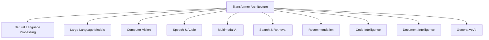

---

# 🧠 Transformer Architecture Selection

Different applications commonly favor different Transformer configurations.

| Application | Common Architecture |
|---|---|
| Text Classification | Encoder-only |
| Semantic Embeddings | Encoder-only |
| Sentiment Analysis | Encoder-only |
| Named Entity Recognition | Encoder-only |
| Text Generation | Decoder-only |
| Code Generation | Decoder-only |
| Conversational AI | Decoder-only |
| Translation | Encoder-decoder |
| Summarization | Encoder-decoder / decoder-only |
| Vision | Encoder-based / hybrid |
| Image Generation | Transformer-based or hybrid |
| Multimodal AI | Architecture-dependent |
| Retrieval | Encoder / dual encoder / cross encoder |
| Reranking | Cross-encoder Transformer |
| Speech | Encoder / encoder-decoder / hybrid |

Architecture choice depends on the task rather than the Transformer label alone.

---

# 🧠 1. Natural Language Processing

Natural Language Processing is one of the most important application domains for Transformers.

Common NLP tasks include:

```text
Classification
Translation
Summarization
Question Answering
Named Entity Recognition
Semantic Similarity
Information Extraction
Text Generation
Text Embeddings
```

---

# 🧠 NLP Pipeline

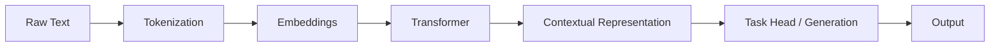

---

# 🧠 2. Text Classification

Transformers can classify text into predefined categories.

Examples:

```text
Spam Detection
Sentiment Analysis
Topic Classification
Intent Classification
Toxicity Detection
Customer Request Classification
Fraud-Related Text Classification
```

Example:

```text
Input:

"I want to cancel my subscription."

        ↓

Transformer

        ↓

Intent Classification

        ↓

"CANCEL_SUBSCRIPTION"
```

---

# 🧠 Text Classification Architecture

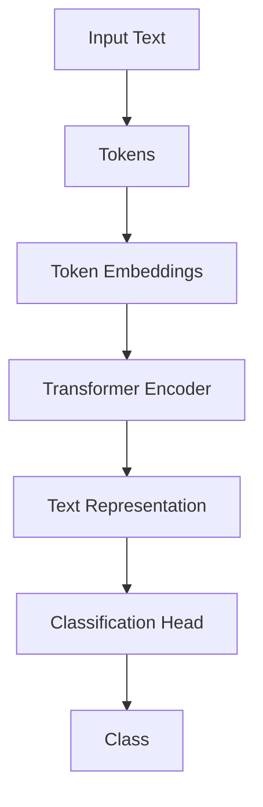

---

# 🧪 Classification Example

A classification model can be conceptually represented as:

```python
class TextClassifier(nn.Module):

    def __init__(
        self,
        encoder,
        hidden_size,
        num_classes
    ):
        super().__init__()

        self.encoder = encoder

        self.classifier = nn.Linear(
            hidden_size,
            num_classes
        )

    def forward(self, input_ids):

        representation = self.encoder(
            input_ids
        )

        return self.classifier(
            representation
        )
```

The exact implementation depends on the selected Transformer architecture and tokenizer.

---

# 🧠 3. Sentiment Analysis

Transformers can understand contextual sentiment.

Example:

```text
"The service was unexpectedly good."
```

A Transformer can use the complete context rather than evaluating each word independently.

Typical outputs:

```text
Positive
Negative
Neutral
```

---

# 🧠 4. Named Entity Recognition

Named Entity Recognition identifies entities within text.

Example:

```text
"Mihir joined ABC Bank in Germany."
```

Possible entity labels:

```text
Mihir      → PERSON
ABC Bank   → ORGANIZATION
Germany    → LOCATION
```

---

# 🧠 NER Architecture

```text
Input Text
    ↓
Tokenizer
    ↓
Transformer Encoder
    ↓
Token Representations
    ↓
Classification Layer
    ↓
Entity Labels
```

---

# 🧠 5. Question Answering

Transformers can answer questions based on provided context.

Example:

```text
Context:
"Amazon was founded in 1994."

Question:
"When was Amazon founded?"

          ↓

Transformer

          ↓

"1994"
```

---

# 🧠 Question Answering Architecture

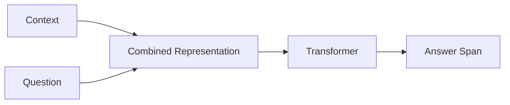

---

# 🧠 Extractive vs Generative Question Answering

### Extractive

The answer is selected from the provided context.

```text
Context
 ↓
Find Relevant Span
 ↓
Return Span
```

### Generative

The model generates an answer.

```text
Question + Context
 ↓
Transformer
 ↓
Generated Answer
```

---

# 🧠 6. Machine Translation

Transformers became highly influential in machine translation.

Example:

```text
English
 ↓
"I love machine learning."
 ↓
Transformer
 ↓
Hindi
 ↓
"मुझे मशीन लर्निंग पसंद है।"
```

Encoder-decoder architectures are particularly suited to sequence-to-sequence translation.

---

# 🧠 Translation Architecture

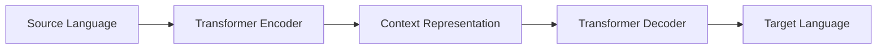

---

# 🧠 7. Text Summarization

Transformers can transform long documents into concise summaries.

```text
Long Document
      ↓
Transformer
      ↓
Important Information
      ↓
Summary
```

Applications include:

```text
News Summarization
Legal Document Summaries
Financial Reports
Meeting Summaries
Technical Documentation
Customer Support Summaries
```

---

# 🧠 Summarization Architecture

```text
Document
   ↓
Tokenizer
   ↓
Transformer
   ↓
Contextual Representation
   ↓
Generation
   ↓
Summary
```

---

# 🧠 Extractive vs Abstractive Summarization

### Extractive

Selects important sentences or spans.

```text
Document
 ↓
Important Sentences
 ↓
Summary
```

### Abstractive

Generates a new summary.

```text
Document
 ↓
Understanding
 ↓
Generation
 ↓
Summary
```

---

# 🧠 8. Text Generation

Decoder-only Transformers are particularly effective for autoregressive text generation.

```text
Prompt
 ↓
Transformer
 ↓
Next Token
 ↓
Append Token
 ↓
Transformer
 ↓
Next Token
 ↓
...
```

---

# 🧠 Text Generation

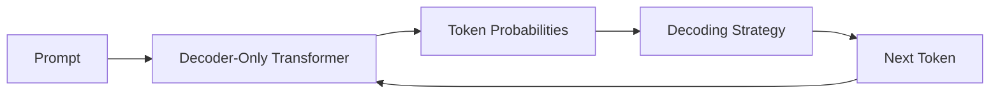

---

# 🧠 9. Large Language Models

Large Language Models are large-scale Transformer-based models trained on extensive datasets.

Typical capabilities include:

```text
Text Generation
Question Answering
Summarization
Reasoning
Translation
Code Generation
Information Extraction
Conversation
Tool Usage
```

---

# 🧠 LLM Application Architecture

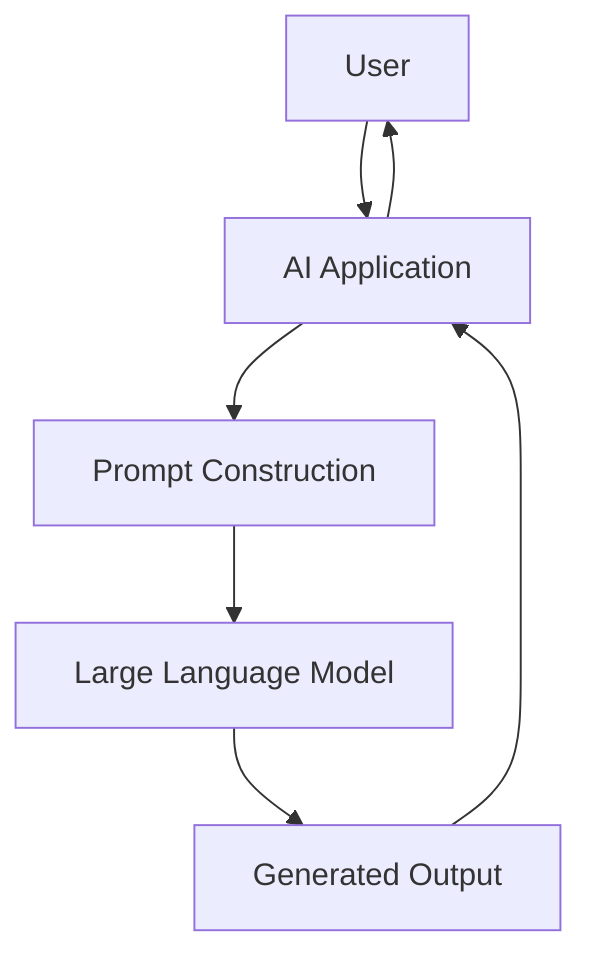

---

# 🧠 LLMs Are More Than Transformers

A production LLM system includes more than model architecture:

```text
Transformer
+
Tokenizer
+
Training Data
+
Pretraining
+
Post-Training
+
Evaluation
+
Inference Runtime
+
Safety
+
Serving Infrastructure
```

---

# 🧠 10. Code Generation

Transformers can operate over programming languages.

Example:

```text
Developer Request
      ↓
"Create a REST endpoint for customer lookup."
      ↓
Code Model
      ↓
Java / Python / Go / JavaScript
```

Applications include:

```text
Code Completion
Code Generation
Code Explanation
Code Translation
Bug Detection
Test Generation
Documentation Generation
SQL Generation
```

---

# 🧠 Code Transformer

```text
Natural Language
       +
Existing Code
       ↓
Code Transformer
       ↓
Generated / Modified Code
```

---

# 🧠 Code as a Sequence

A programming language can be represented as tokens:

```text
public
class
Customer
{
    ...
}
```

The Transformer can model relationships between:

```text
Variables
Methods
Classes
Imports
Expressions
Comments
```

---

# 🧠 11. Semantic Embeddings

Transformers can produce vector representations of text.

```text
Text
 ↓
Transformer Encoder
 ↓
Embedding Vector
```

Example:

```text
"How do I reset my password?"
```

becomes:

```text
[0.21, -0.44, 0.17, ...]
```

---

# 🧠 Embedding Applications

Embeddings are useful for:

```text
Semantic Search
Document Retrieval
Similarity
Clustering
Recommendation
Deduplication
Classification
RAG
```

---

# 🧠 Semantic Search

Traditional keyword search:

```text
Query
 ↓
Keyword Matching
 ↓
Documents
```

Semantic search:

```text
Query
 ↓
Embedding
 ↓
Vector Similarity
 ↓
Relevant Documents
```

---

# 🧠 Semantic Search Architecture

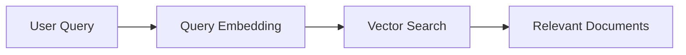

---

# 🧠 12. Transformer-Based Retrieval

Transformer architectures can be used to build retrieval systems.

Two common approaches are:

```text
Bi-Encoder / Dual Encoder
+
Cross-Encoder
```

---

# 🧠 Dual Encoder

A dual encoder independently encodes:

```text
Query
```

and:

```text
Document
```

into vectors.

```text
Query
 ↓
Encoder
 ↓
Query Vector

Document
 ↓
Encoder
 ↓
Document Vector
```

Then similarity can be calculated.

---

# 🧠 Dual Encoder Architecture

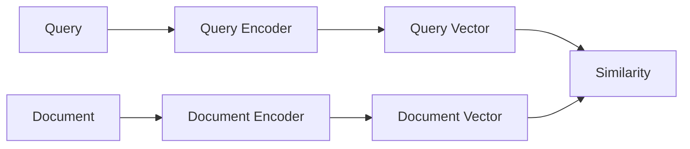

---

# 🧠 Cross-Encoder

A cross-encoder processes the query and document together.

```text
Query
 +
Document
 ↓
Transformer
 ↓
Relevance Score
```

This can provide richer interaction between query and document tokens.

---

# 🧠 Cross-Encoder Architecture

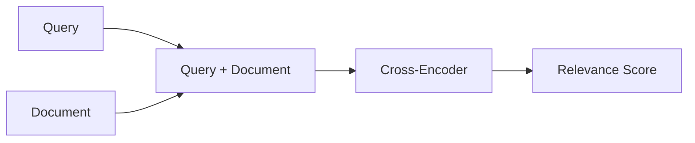

---

# 🧠 Dual Encoder vs Cross-Encoder

| Dual Encoder | Cross-Encoder |
|---|---|
| Query and document encoded separately | Query and document processed together |
| Efficient retrieval | More expensive |
| Suitable for large candidate sets | Suitable for reranking |
| Enables vector indexing | Usually requires pairwise scoring |
| Good first-stage retrieval | Good second-stage ranking |

This distinction becomes important in production retrieval systems.

---

# 🧠 13. Retrieval-Augmented Generation

Transformers are central to modern RAG systems.

A simplified architecture:

```text
User Query
      ↓
Query Embedding
      ↓
Retriever
      ↓
Relevant Documents
      ↓
Context
      ↓
LLM
      ↓
Generated Answer
```

---

# 🧠 RAG Architecture

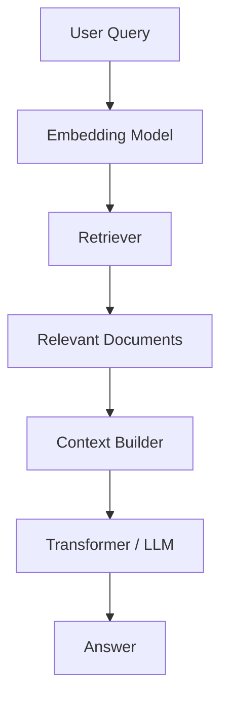

---

# 🧠 Important RAG Distinction

Attention:

```text
Uses representations inside the model
```

Retrieval:

```text
Searches an external knowledge source
```

Therefore:

> **Attention is not a replacement for retrieval.**

A production RAG architecture typically combines both.

---

# 👁️ 14. Transformers for Computer Vision

Transformers are not limited to text.

Images can be represented as sequences of patches.

For example:

```text
Image
 ↓
Divide into Patches
 ↓
Patch Embeddings
 ↓
Transformer
 ↓
Visual Representation
```

---

# 👁️ Vision Transformer

A Vision Transformer (ViT) divides an image into fixed-size patches.

Conceptually:

```text
Image

┌────┬────┬────┬────┐
│ P1 │ P2 │ P3 │ P4 │
├────┼────┼────┼────┤
│ P5 │ P6 │ P7 │ P8 │
├────┼────┼────┼────┤
│ P9 │P10 │P11 │P12 │
└────┴────┴────┴────┘
```

Each patch becomes a token-like representation.

---

# 👁️ Vision Transformer Architecture

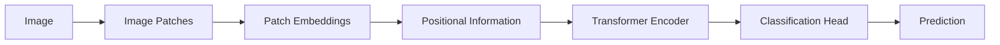

---

# 👁️ Image Patches as Tokens

This is a key conceptual transformation:

```text
Text:

Token 1
Token 2
Token 3
...

Vision:

Patch 1
Patch 2
Patch 3
...
```

The Transformer can then model relationships between image regions.

---

# 👁️ Vision Transformer Applications

Transformers in vision can be used for:

```text
Image Classification
Object Detection
Image Segmentation
Image Retrieval
Image Captioning
Visual Question Answering
Video Understanding
Medical Imaging
Satellite Image Analysis
```

---

# 👁️ 15. Hybrid CNN + Transformer Models

CNNs are strong at local feature extraction.

Transformers are strong at modeling broader relationships.

Hybrid architectures combine them:

```text
Image
 ↓
CNN
 ↓
Local Features
 ↓
Transformer
 ↓
Global Relationships
 ↓
Prediction
```

---

# 👁️ CNN + Transformer Architecture

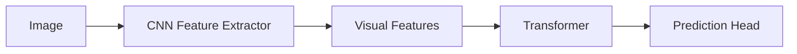

---

# 🔊 16. Transformers for Speech

Speech can also be represented as a sequence.

A simplified pipeline is:

```text
Audio
 ↓
Feature Extraction
 ↓
Audio Frames
 ↓
Transformer
 ↓
Text / Representation
```

---

# 🔊 Speech Transformer Architecture

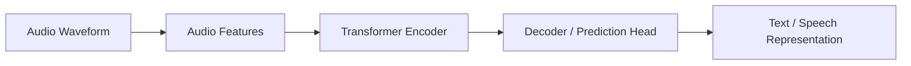

---

# 🔊 Speech Applications

Transformer-based speech systems can support:

```text
Speech Recognition
Speech Translation
Speaker Representation
Audio Classification
Speech Generation
Voice Assistants
Meeting Transcription
```

---

# 🎥 17. Video Understanding

Video can be represented as a sequence of:

```text
Frames
+
Spatial Features
+
Temporal Information
```

A Transformer can model relationships across:

```text
Spatial Dimension
+
Time Dimension
```

---

# 🎥 Video Transformer

```text
Video
 ↓
Frames
 ↓
Visual Tokens
 ↓
Temporal + Spatial Transformer
 ↓
Video Representation
 ↓
Task
```

Applications:

```text
Action Recognition
Video Classification
Video Search
Surveillance Analysis
Sports Analysis
Video Captioning
```

---

# 🌐 18. Multimodal Transformers

Modern AI systems increasingly combine multiple modalities:

```text
Text
+
Image
+
Audio
+
Video
```

A multimodal architecture can learn relationships between these representations.

---

# 🌐 Multimodal Architecture

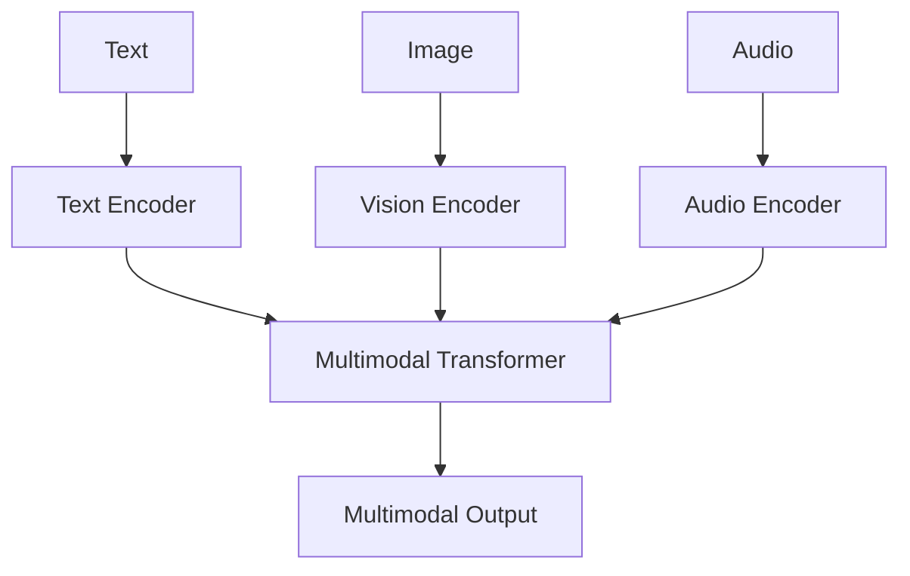

---

# 🌐 Multimodal Applications

Examples include:

```text
Image Question Answering
Visual Chat
Document Understanding
Image Captioning
Video Question Answering
Audio-Text Understanding
Multimodal Search
```

---

# 🌐 19. Document Intelligence

Transformers are highly useful for document processing.

Enterprise documents can contain:

```text
Text
Tables
Images
Forms
Headers
Footers
Signatures
Metadata
```

A production document intelligence pipeline may combine:

```text
OCR
+
Layout Analysis
+
Vision Encoder
+
Text Transformer
+
Multimodal Fusion
```

---

# 🏢 Document Intelligence Architecture

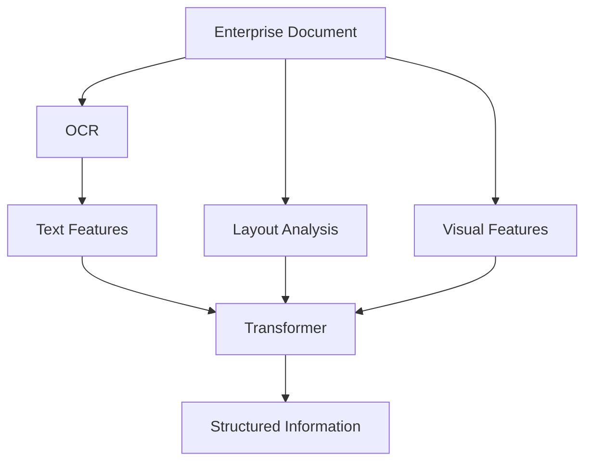

---

# 🧠 20. Recommendation Systems

Transformers can model sequences of user interactions.

Example:

```text
User History:

Product A
Product B
Product C
Product D
```

The model can predict:

```text
Next likely interaction
```

---

# 🧠 Recommendation Architecture

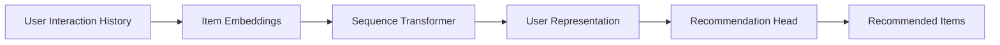

---

# 🧠 Recommendation Applications

```text
Product Recommendations
Content Recommendations
Video Recommendations
Music Recommendations
News Recommendations
Next-Best-Action
Personalized Offers
```

---

# 🧠 21. Search

Transformers have changed modern search systems.

A production search architecture can combine:

```text
Keyword Search
+
Semantic Retrieval
+
Transformer Reranking
```

---

# 🧠 Search Architecture

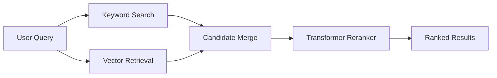

---

# 🧠 Hybrid Search

A production search system can combine:

```text
BM25 / Keyword Retrieval
+
Dense Vector Retrieval
```

Then:

```text
Candidate Set
 ↓
Transformer Reranker
 ↓
Final Ranking
```

This creates a multi-stage retrieval architecture.

---

# 🧠 22. Fraud Detection and Risk

Transformers can model sequences of financial or behavioral events.

Example:

```text
Transaction 1
 ↓
Transaction 2
 ↓
Transaction 3
 ↓
Transaction 4
```

The model can learn relationships across the event sequence.

Potential applications:

```text
Fraud Detection
Transaction Risk
Account Takeover Detection
Behavioral Anomaly Detection
Credit Risk Signals
```

---

# 🏦 Transaction Sequence Architecture

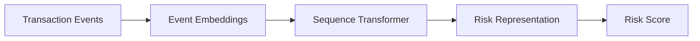

---

# 🏭 23. Predictive Maintenance

Industrial systems generate sequences of sensor measurements:

```text
Temperature
Pressure
Vibration
Current
Speed
```

Transformers can model temporal relationships across these signals.

---

# 🏭 Sensor Transformer

```text
Sensor Events
      ↓
Feature Encoding
      ↓
Temporal Transformer
      ↓
Equipment Representation
      ↓
Failure Probability
```

Applications include:

```text
Equipment Failure Prediction
Anomaly Detection
Remaining Useful Life
Industrial Monitoring
```

---

# 🏥 24. Healthcare Applications

Transformer-based systems can support:

```text
Medical Text Analysis
Clinical Documentation
Medical Image Analysis
Drug Discovery
Patient Timeline Modeling
Medical Question Answering
Clinical Decision Support
```

High-stakes healthcare applications require appropriate validation, governance, privacy controls, and human oversight.

---

# 💰 25. Financial Services

Enterprise financial applications include:

```text
Fraud Detection
Document Processing
Financial Report Analysis
Risk Analysis
Customer Support
Transaction Monitoring
Research Assistance
Compliance Analysis
```

---

# 📡 26. Telecommunications

Transformer-based systems can model:

```text
Network Events
Customer Interactions
Usage Sequences
Service Tickets
Network Anomalies
```

Applications include:

```text
Churn Prediction
Network Fault Detection
Customer Intent Classification
Support Automation
```

---

# 🧠 27. Generative AI

Transformers form the foundation of many modern Generative AI systems.

Applications include:

```text
Text Generation
Code Generation
Conversational AI
Document Generation
Summarization
Question Answering
Content Transformation
Multimodal Generation
```

---

# 🧠 Generative AI Architecture

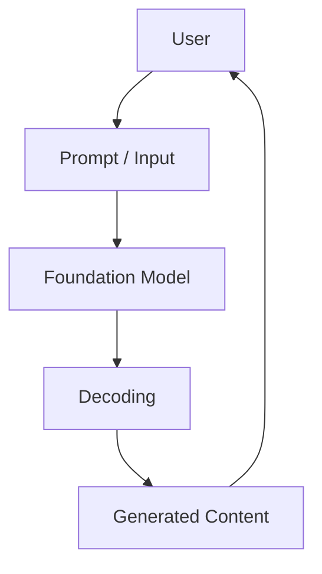

---

# 🧠 28. Conversational AI

A conversational AI system can use a Transformer as its reasoning and generation engine.

```text
User Message
      ↓
Conversation Context
      ↓
Prompt Construction
      ↓
Transformer / LLM
      ↓
Response
```

---

# 🧠 Production Conversational Architecture

```mermaid
flowchart TD

    USER["User"]

    API["Conversation API"]

    MEMORY["Conversation State"]

    RETRIEVAL["Knowledge Retrieval"]

    PROMPT["Prompt Builder"]

    LLM["Transformer / LLM"]

    GUARD["Guardrails"]

    RESPONSE["Response"]

    USER --> API
    API --> MEMORY
    API --> RETRIEVAL

    MEMORY --> PROMPT
    RETRIEVAL --> PROMPT

    PROMPT --> LLM
    LLM --> GUARD
    GUARD --> RESPONSE
    RESPONSE --> USER
```

---

# 🧠 29. Tool-Using AI

Transformers can also serve as the reasoning component of systems that invoke external tools.

```text
User Request
      ↓
Transformer
      ↓
Tool Selection
      ↓
External API
      ↓
Tool Result
      ↓
Transformer
      ↓
Final Response
```

---

# 🧠 Tool Calling Architecture

```mermaid
flowchart LR

    USER["User"]

    MODEL["Transformer / LLM"]

    TOOL["External Tool"]

    RESULT["Tool Result"]

    RESPONSE["Final Response"]

    USER --> MODEL
    MODEL --> TOOL
    TOOL --> RESULT
    RESULT --> MODEL
    MODEL --> RESPONSE
```

---

# 🧠 30. Agentic AI

A Transformer can act as the central model inside an agentic workflow.

```text
Goal
 ↓
Plan
 ↓
Reason
 ↓
Select Tool
 ↓
Execute
 ↓
Observe
 ↓
Re-plan
 ↓
Final Result
```

The Transformer provides model intelligence, while orchestration infrastructure manages execution.

---

# 🏢 Enterprise AI Application Landscape

```text
                         Transformer
                              │
      ┌───────────────────────┼────────────────────────┐
      │                       │                        │
      ▼                       ▼                        ▼
   Language                Vision                  Speech
      │                       │                        │
      ▼                       ▼                        ▼
   LLMs                     ViT                    ASR
      │                       │                        │
      └───────────────────────┼────────────────────────┘
                              ▼
                       Multimodal AI
                              │
             ┌────────────────┼────────────────┐
             ▼                ▼                ▼
            RAG             Agents          Search
             │                │                │
             └────────────────┼────────────────┘
                              ▼
                       Enterprise AI
```

---

# 🏢 Transformer Application by Business Capability

| Business Capability | Transformer Application |
|---|---|
| Customer Support | Conversational AI |
| Search | Semantic Search + Reranking |
| Knowledge Management | RAG |
| Software Engineering | Code Generation |
| Finance | Risk and Document Analysis |
| Banking | Fraud and Customer Intelligence |
| Telecom | Event and Customer Sequence Modeling |
| Manufacturing | Sensor Sequence Modeling |
| Healthcare | Clinical and Document Intelligence |
| Retail | Recommendation |
| Legal | Document Analysis |
| Operations | Intelligent Assistants |

---

# 🧠 Choosing the Right Transformer Architecture

The architecture should follow the problem.

```text
Need classification?
        ↓
Encoder

Need embeddings?
        ↓
Encoder

Need generation?
        ↓
Decoder

Need translation?
        ↓
Encoder + Decoder

Need multimodal reasoning?
        ↓
Multimodal Architecture

Need retrieval?
        ↓
Bi-Encoder / Vector Retrieval

Need reranking?
        ↓
Cross-Encoder
```

---

# 🧠 Application Selection Framework

```mermaid
flowchart TD

    PROBLEM["Business Problem"]

    UNDERSTAND["Need Understanding?"]

    GENERATE["Need Generation?"]

    SEQ2SEQ["Need Sequence-to-Sequence?"]

    RETRIEVE["Need Retrieval?"]

    MULTI["Need Multiple Modalities?"]

    ENCODER["Encoder Transformer"]

    DECODER["Decoder Transformer"]

    ENCDEC["Encoder-Decoder"]

    RETRIEVAL["Bi-Encoder / Cross-Encoder"]

    MULTIMODAL["Multimodal Transformer"]

    PROBLEM --> UNDERSTAND
    UNDERSTAND -->|Yes| ENCODER
    UNDERSTAND -->|No| GENERATE

    GENERATE -->|Yes| DECODER
    GENERATE -->|No| SEQ2SEQ

    SEQ2SEQ -->|Yes| ENCDEC
    SEQ2SEQ -->|No| RETRIEVE

    RETRIEVE -->|Yes| RETRIEVAL
    RETRIEVE -->|No| MULTI

    MULTI -->|Yes| MULTIMODAL
```

---

# 🧠 Transformer Application Patterns

Several recurring application patterns appear across industries.

### Pattern 1 — Classification

```text
Input
 ↓
Transformer Encoder
 ↓
Representation
 ↓
Classifier
```

### Pattern 2 — Generation

```text
Prompt
 ↓
Decoder Transformer
 ↓
Next Token
 ↓
Generated Sequence
```

### Pattern 3 — Retrieval

```text
Query
 ↓
Embedding
 ↓
Vector Search
 ↓
Candidates
```

### Pattern 4 — Reranking

```text
Query + Candidate
 ↓
Cross-Encoder
 ↓
Relevance Score
```

### Pattern 5 — RAG

```text
Query
 ↓
Retrieve
 ↓
Context
 ↓
LLM
 ↓
Answer
```

### Pattern 6 — Multimodal

```text
Text
+
Image
+
Audio
 ↓
Multimodal Model
 ↓
Unified Representation
 ↓
Output
```

---

# 🧪 Practical Exercise 1 — Text Classification

Build a Transformer classifier for:

```text
Positive
Negative
Neutral
```

Measure:

```text
Accuracy
Precision
Recall
F1
```

---

# 🧪 Practical Exercise 2 — Semantic Search

Build:

```text
Document Dataset
 ↓
Embedding Model
 ↓
Vector Store
 ↓
Query Embedding
 ↓
Similarity Search
```

Evaluate:

```text
Precision@K
Recall@K
MRR
```

---

# 🧪 Practical Exercise 3 — Cross-Encoder Reranking

Build a two-stage retrieval pipeline:

```text
Query
 ↓
Vector Retrieval
 ↓
Top 20 Candidates
 ↓
Cross-Encoder
 ↓
Top 5 Results
```

Compare the results before and after reranking.

---

# 🧪 Practical Exercise 4 — RAG Application

Build:

```text
Document Loader
 ↓
Chunking
 ↓
Embedding
 ↓
Vector Store
 ↓
Retriever
 ↓
Transformer / LLM
 ↓
Answer
```

Track:

```text
Retrieval Quality
Latency
Token Usage
Answer Quality
```

---

# 🧪 Practical Exercise 5 — Vision Transformer

Build a small Vision Transformer classifier.

Pipeline:

```text
Image
 ↓
Patch Extraction
 ↓
Patch Embeddings
 ↓
Transformer Encoder
 ↓
Classification
```

---

# 🧪 Practical Exercise 6 — Multimodal Search

Create a small dataset containing:

```text
Images
+
Text Descriptions
```

Generate embeddings and implement:

```text
Text → Image Search
```

---

# 🧪 Practical Exercise 7 — Transformer Recommendation

Create a sequence of user interactions:

```text
Item A
Item B
Item C
Item D
```

Train a Transformer to predict:

```text
Next Item
```

---

# 🧪 Practical Exercise 8 — Document Intelligence

Build a pipeline:

```text
PDF
 ↓
OCR
 ↓
Text + Layout
 ↓
Transformer
 ↓
Structured JSON
```

Extract:

```text
Invoice Number
Date
Customer
Total
Line Items
```

---

# 🧪 Practical Exercise 9 — Code Generation

Build a small code-generation experiment.

Input:

```text
"Create a Java method that validates an email."
```

Output:

```java
public boolean isValidEmail(
    String email
) {
    // implementation
}
```

Evaluate generated code for:

```text
Correctness
Security
Compilation
Test Coverage
```

---

# 🧪 Practical Exercise 10 — Enterprise Transformer Benchmark

Compare two architectures for the same task:

```text
Encoder Model
vs
Decoder Model
```

Measure:

```text
Accuracy
Latency
Memory
Throughput
Cost
```

---

# 🧠 Interview Questions

## Beginner

### 1. Where are Transformers used?

Transformers are used in:

```text
NLP
Vision
Speech
Multimodal AI
Search
Recommendations
Generative AI
```

### 2. What is a common application of encoder-only Transformers?

Text understanding tasks such as classification, embeddings, and named entity recognition.

### 3. What is a common application of decoder-only Transformers?

Autoregressive generation such as text and code generation.

### 4. What is an encoder-decoder Transformer used for?

Sequence-to-sequence tasks such as translation and summarization.

### 5. Can Transformers process images?

Yes. Vision Transformers represent images as sequences of patches.

---

## Intermediate

### 6. How are images converted into Transformer inputs?

Images can be divided into patches, and each patch is converted into a vector representation.

### 7. What is a dual encoder?

A model that independently encodes queries and documents into vector representations for efficient retrieval.

### 8. What is a cross-encoder?

A model that processes a query and candidate document together to compute a richer relevance score.

### 9. Why are cross-encoders usually used after retrieval?

Because evaluating every document pair is expensive, so they are typically applied to a smaller candidate set.

### 10. How are Transformers used in RAG?

Transformers can provide embeddings, reranking, contextual understanding, and generation within the RAG pipeline.

### 11. How can Transformers be used in recommendation systems?

They can model sequences of user interactions and predict future preferences or actions.

---

## Advanced

### 12. Why can the same Transformer architecture be used for different modalities?

Because different modalities can be converted into token-like representations that can be processed using attention.

### 13. Why are Transformers useful for multimodal AI?

Attention can model relationships between representations originating from different modalities.

### 14. What is the difference between retrieval and reranking?

Retrieval efficiently produces a candidate set, while reranking uses a more expressive model to order those candidates.

### 15. Why is a dual encoder more scalable than a cross-encoder for first-stage retrieval?

Documents can be encoded and indexed independently, allowing query-time similarity search without processing every query-document pair through the full Transformer.

### 16. Why is Transformer architecture selection a system-design decision?

Because the appropriate architecture depends on:

```text
Task
Latency
Scale
Context Length
Data
Hardware
Cost
Quality Requirements
```

---

# 🏢 Enterprise Perspective

Transformers should be viewed as a reusable intelligence architecture rather than a single-purpose NLP model.

The same core concept can be adapted to:

```text
Text
 ↓
Tokens

Images
 ↓
Patches

Audio
 ↓
Frames

Video
 ↓
Spatiotemporal Tokens

Events
 ↓
Event Tokens

Documents
 ↓
Multimodal Tokens
```

The common pattern is:

```text
Represent
   ↓
Attend
   ↓
Transform
   ↓
Predict / Generate
```

---

# 🏢 Enterprise Transformer Platform

A reusable enterprise AI platform can expose Transformer capabilities through services such as:

```text
Embedding Service
Classification Service
Generation Service
Reranking Service
Vision Service
Speech Service
Multimodal Service
```

Conceptually:

```mermaid
flowchart TD

    APPLICATION["Enterprise Applications"]

    GATEWAY["AI Gateway"]

    EMBED["Embedding Service"]

    LLM["LLM / Generation"]

    RERANK["Reranking Service"]

    VISION["Vision Service"]

    SPEECH["Speech Service"]

    MULTI["Multimodal Service"]

    APPLICATION --> GATEWAY

    GATEWAY --> EMBED
    GATEWAY --> LLM
    GATEWAY --> RERANK
    GATEWAY --> VISION
    GATEWAY --> SPEECH
    GATEWAY --> MULTI
```

---

# 🏢 Transformer as a Capability Layer

For enterprise architecture, avoid coupling business services directly to a specific model.

Prefer:

```text
Business Service
      ↓
AI Capability Interface
      ↓
Model Adapter
      ↓
Transformer Runtime
```

For example:

```text
LLMProvider
EmbeddingProvider
RerankingProvider
VisionProvider
SpeechProvider
```

This makes it easier to change:

```text
Model
Provider
Cloud
Inference Runtime
Hardware
```

without rewriting the business layer.

---

# 🏢 Production Deployment

A production Transformer platform may include:

```text
API Gateway
      ↓
AI Orchestration Service
      ↓
Model Router
      ↓
Model Runtime
      ↓
GPU Infrastructure
```

with supporting services:

```text
Model Registry
Observability
Feature / Data Stores
Vector Database
Prompt Management
Evaluation
Security
Governance
```

---

# 🏢 Production Insight

!!! tip "Production Insight"

    **The real enterprise value of Transformers comes from combining the model with reliable system architecture.**

    A Transformer model alone does not provide:

    ```text
    Authentication
    Authorization
    Retrieval
    Tool Integration
    Observability
    Cost Control
    Model Routing
    Versioning
    Governance
    ```

    A production AI system therefore looks more like:

    ```text
    Client
      ↓
    API Gateway
      ↓
    AI Service
      ↓
    Model Router
      ↓
    Transformer
      ↓
    Retrieval / Tools
      ↓
    Guardrails
      ↓
    Response
    ```

    This distinction becomes increasingly important as organizations move from AI experimentation to production-scale AI platforms.

---

# 📌 Key Takeaways

- Transformers have applications far beyond their original sequence-to-sequence use case.
- Encoder-only Transformers are widely used for understanding and representation tasks.
- Decoder-only Transformers are widely used for autoregressive generation.
- Encoder-decoder Transformers are useful for sequence-to-sequence problems.
- Transformers power many modern Large Language Models.
- Transformer-based systems can perform classification, question answering, summarization, translation, and generation.
- Transformers can produce semantic embeddings for search, retrieval, clustering, and recommendation.
- Dual encoders are useful for scalable first-stage retrieval.
- Cross-encoders are useful for high-quality reranking.
- Transformers can power RAG systems together with external retrieval infrastructure.
- Vision Transformers represent images as sequences of patches.
- Transformers can model speech, audio, video, and multimodal information.
- Transformer-based systems are increasingly used for document intelligence.
- Transformers can model sequential user interactions for recommendation systems.
- Transformers can support financial, healthcare, telecom, manufacturing, and enterprise applications.
- Transformer architecture selection should be driven by the business and technical requirements.
- Production Transformer systems require infrastructure, serving, observability, security, governance, and cost management.
- The Transformer should be treated as an intelligence component within a larger production architecture.

---

# 📚 Further Reading

Continue with:

- **[29. Autoencoders and Representation Learning](29-autoencoders-and-representation-learning.md)**
- **[30. Generative Adversarial Networks](30-generative-adversarial-networks.md)**
- **[31. Diffusion Models](31-diffusion-models.md)**
- **[32. Reinforcement Learning Fundamentals](32-reinforcement-learning-fundamentals.md)**
- **[35. GPU Accelerated Deep Learning](35-gpu-accelerated-deep-learning.md)**
- **[37. Building Production Deep Learning Systems](37-building-production-deep-learning-systems.md)**

---

## ➡️ Next Chapter

**[29. Autoencoders and Representation Learning](29-autoencoders-and-representation-learning.md)**

---

> **Enterprise AI Engineering Handbook**  
> *Building Production-Grade Enterprise AI Systems — One Chapter at a Time.*