# 29. Autoencoders and Representation Learning

> Understand how Autoencoders learn compact representations of data without requiring explicit labels, and explore their architecture, reconstruction objective, latent spaces, variants, applications, limitations, and role in modern Deep Learning and enterprise AI systems.

---

## 🎯 Learning Objectives

After completing this chapter, you will be able to:

- Explain what representation learning means
- Explain what an Autoencoder is
- Understand the Encoder and Decoder components
- Understand the latent representation
- Explain the reconstruction objective
- Understand the mathematical formulation of Autoencoders
- Understand bottleneck representations
- Explain undercomplete Autoencoders
- Understand overcomplete Autoencoders
- Explain sparse Autoencoders
- Understand denoising Autoencoders
- Understand convolutional Autoencoders
- Understand Variational Autoencoders at a conceptual level
- Understand Autoencoders for dimensionality reduction
- Use Autoencoders for anomaly detection
- Understand Autoencoders for feature learning
- Implement Autoencoders using TensorFlow/Keras
- Implement Autoencoders using PyTorch
- Understand the relationship between Autoencoders and PCA
- Understand latent-space visualization
- Understand reconstruction loss
- Understand the limitations of Autoencoders
- Understand production applications of representation learning

---

# 📖 Overview

Traditional Machine Learning often depends on carefully engineered features.

For example:

```text
Raw Data
   ↓
Feature Engineering
   ↓
Machine Learning Model
   ↓
Prediction
```

Deep Learning introduced a different approach:

```text
Raw Data
   ↓
Neural Network
   ↓
Learned Representation
   ↓
Prediction
```

This concept is known as:

> **Representation Learning**

An Autoencoder is one of the classic neural network architectures for learning useful representations directly from data.

---

# 🧠 What is Representation Learning?

Representation learning is the process of automatically learning useful features from raw data.

Instead of manually defining:

```text
Feature 1
Feature 2
Feature 3
...
```

the neural network learns representations that capture important characteristics of the input.

---

# 🧠 Traditional Feature Engineering vs Representation Learning

### Traditional Approach

```text
Raw Data
    ↓
Human-designed Features
    ↓
ML Algorithm
    ↓
Prediction
```

### Representation Learning

```text
Raw Data
    ↓
Neural Network
    ↓
Learned Features
    ↓
Prediction / Reconstruction
```

---

# 🧠 Why Representation Learning Matters

Good representations can capture:

```text
Patterns
Structure
Similarity
Relationships
Important Features
```

A useful representation can then be reused for:

```text
Classification
Clustering
Search
Anomaly Detection
Recommendation
Generation
Visualization
```

---

# 🤖 What is an Autoencoder?

An Autoencoder is a neural network trained to reconstruct its input.

The basic idea is:

```text
Input
 ↓
Encoder
 ↓
Latent Representation
 ↓
Decoder
 ↓
Reconstructed Input
```

The model learns:

```text
How to compress information
+
How to reconstruct important information
```

---

# 🧠 Autoencoder Architecture

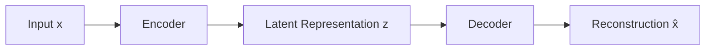

---

# 🧠 Autoencoder Components

An Autoencoder contains three conceptual components:

```text
Encoder
   ↓
Latent Space
   ↓
Decoder
```

### Encoder

Learns to transform the input into a compact representation.

### Latent Representation

Contains the learned features.

### Decoder

Uses the latent representation to reconstruct the original input.

---

# 🧠 Mathematical Representation

Let:

```text
x = Input
z = Latent Representation
x̂ = Reconstruction
```

The Encoder can be represented as:

\[
z=f_{\theta}(x)
\]


The Decoder reconstructs the input:

\[
\hat{x}=g_{\phi}(z)
\]


Therefore:

\[
\hat{x}=g_{\phi}(f_{\theta}(x))
\]


---

# 🧠 Autoencoder Objective

The Autoencoder attempts to make:

```text
Reconstruction
```

as similar as possible to:

```text
Original Input
```

Therefore:

\[
\min_{\theta,\phi}
L(x,\hat{x})
\]


where:

```text
θ = Encoder parameters
φ = Decoder parameters
L = Reconstruction Loss
```

---

# 🧠 Reconstruction

Suppose the input is:

```text
Original Image
```

The model produces:

```text
Reconstructed Image
```

The training objective is:

```text
Original
   ↓
Compare
   ↑
Reconstructed
```

The difference becomes the reconstruction loss.

---

# 🧠 Reconstruction Pipeline

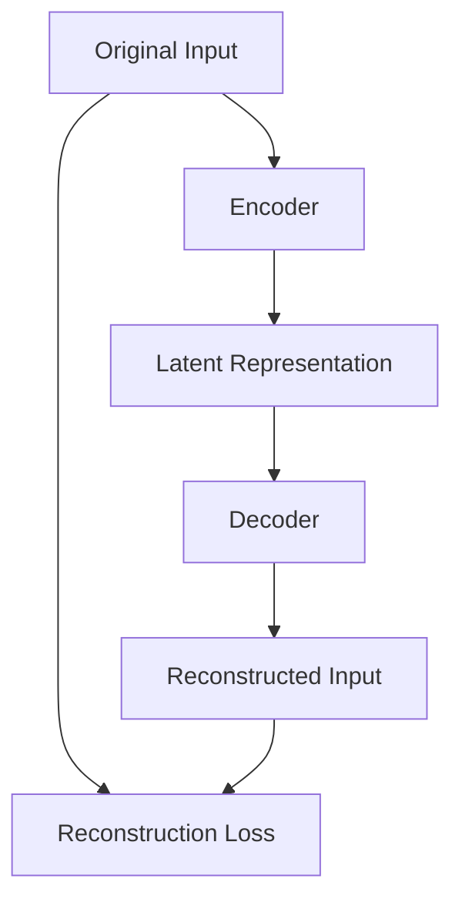

---

# 🧠 The Bottleneck

One of the most important ideas in an Autoencoder is the bottleneck.

For example:

```text
Input
784 dimensions
     ↓
Encoder
     ↓
128 dimensions
     ↓
32 dimensions
     ↓
Latent Space
     ↓
32 dimensions
     ↓
Decoder
     ↓
784 dimensions
     ↓
Reconstruction
```

The smaller latent representation forces the model to learn important information rather than simply copying the input.

---

# 🧠 Bottleneck Architecture

```text
Input
  │
  ▼
┌───────────────┐
│   Encoder     │
└───────────────┘
       │
       ▼
┌───────────────┐
│   Bottleneck  │
│      z        │
└───────────────┘
       │
       ▼
┌───────────────┐
│   Decoder     │
└───────────────┘
       │
       ▼
Reconstruction
```

---

# 🧠 Undercomplete Autoencoder

An undercomplete Autoencoder has:

```text
Latent Dimension
<
Input Dimension
```

For example:

```text
Input = 784
Latent = 32
```

This forces dimensionality reduction.

---

# 🧠 Undercomplete Autoencoder

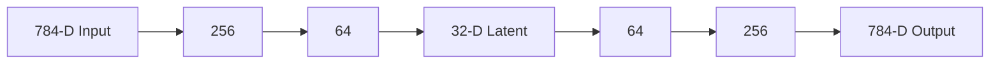

---

# 🧠 Overcomplete Autoencoder

An overcomplete Autoencoder has:

```text
Latent Dimension
≥
Input Dimension
```

This can create a problem.

If the model simply learns:

```text
Input
 ↓
Copy
 ↓
Output
```

then it may fail to learn useful structure.

Therefore regularization may be required.

---

# 🧠 Overcomplete Representation

```text
Input
   ↓
Encoder
   ↓
Large Latent Space
   ↓
Decoder
   ↓
Reconstruction
```

Regularization techniques can encourage meaningful representations.

---

# 🧠 Autoencoder Variants

Common variants include:

```text
Undercomplete Autoencoder
Sparse Autoencoder
Denoising Autoencoder
Convolutional Autoencoder
Variational Autoencoder
Contractive Autoencoder
Sequence Autoencoder
```

Each variant introduces a different inductive bias or learning objective.

---

# 🧠 1. Sparse Autoencoder

A Sparse Autoencoder encourages only a small number of latent neurons to activate strongly for a given input.

Conceptually:

```text
Latent Layer

Neuron 1   ███████
Neuron 2
Neuron 3
Neuron 4   █████
Neuron 5
Neuron 6
Neuron 7
Neuron 8   ███████
```

This encourages sparse representations.

---

# 🧠 Sparse Representation

Instead of:

```text
All neurons active
```

the model learns:

```text
Few neurons strongly active
Many neurons weakly active
```

This can encourage feature discovery.

---

# 🧠 Sparse Autoencoder Objective

The loss can contain:

```text
Reconstruction Loss
+
Sparsity Penalty
```

Conceptually:

\[
L=L_{reconstruction}+\lambda L_{sparsity}
\]


---

# 🧠 2. Denoising Autoencoder

A Denoising Autoencoder does not receive a perfectly clean input.

Instead:

```text
Clean Input
    ↓
Add Noise
    ↓
Corrupted Input
    ↓
Encoder
    ↓
Decoder
    ↓
Clean Reconstruction
```

The model learns to recover the original signal.

---

# 🧠 Denoising Autoencoder

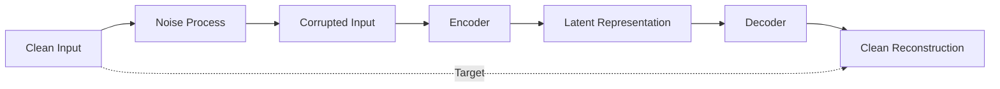

---

# 🧠 Denoising Objective

The model receives:

```text
x̃ = Noisy Input
```

but tries to reconstruct:

```text
x = Clean Input
```

Therefore:

\[
L=L(x,g_{\phi}(f_{\theta}(\tilde{x})))
\]


---

# 🧠 Why Denoising Autoencoders Work

The model cannot simply memorize the exact input because the input has been corrupted.

It must learn:

```text
Underlying Structure
```

rather than:

```text
Noise
```

---

# 👁️ 3. Convolutional Autoencoder

For image data, convolutional layers are often used in the Encoder and Decoder.

```text
Image
 ↓
Convolution
 ↓
Downsampling
 ↓
Latent Representation
 ↓
Upsampling
 ↓
Reconstructed Image
```

---

# 👁️ Convolutional Autoencoder Architecture

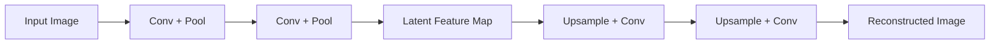

---

# 👁️ Why Convolutional Autoencoders?

CNNs preserve spatial relationships.

For images, nearby pixels often have meaningful relationships.

Therefore:

```text
Fully Connected Autoencoder
```

may be less efficient than:

```text
Convolutional Autoencoder
```

for image representation learning.

---

# 🧠 4. Variational Autoencoder

A Variational Autoencoder (VAE) extends the Autoencoder idea by learning a probabilistic latent representation.

Instead of learning:

```text
Input
 ↓
One fixed latent vector
```

the encoder learns parameters describing a distribution:

```text
Mean
+
Variance
```

---

# 🧠 VAE Architecture

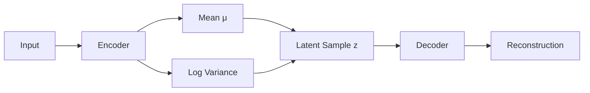

---

# 🧠 VAE Latent Distribution

The encoder produces:

\[
\mu(x),\sigma(x)
\]


A latent vector can then be sampled from:

\[
z\sim\mathcal{N}(\mu,\sigma^2)
\]


---

# 🧠 VAE Objective

The VAE objective combines:

```text
Reconstruction Loss
+
KL Divergence
```

Conceptually:

\[
L=L_{reconstruction}+\beta D_{KL}
\]


The KL term encourages the learned latent distribution to remain close to a chosen prior distribution.

---

# 🧠 Autoencoder vs VAE

| Autoencoder | Variational Autoencoder |
|---|---|
| Learns latent representation | Learns latent distribution |
| Usually deterministic | Probabilistic |
| Focuses on reconstruction | Reconstruction + regularized latent space |
| Useful for representation learning | Useful for representation + generation |
| Latent space may be irregular | Latent space is encouraged to be structured |

---

# 🧠 Why VAEs Matter

VAEs are important because they connect:

```text
Representation Learning
        +
Probabilistic Modeling
        +
Generative Modeling
```

They are therefore an important bridge between traditional Autoencoders and modern generative models.

---

# 🧠 Autoencoder vs Generative Model

A standard Autoencoder primarily learns:

```text
Input
 ↓
Representation
 ↓
Reconstruction
```

A generative model aims to learn:

```text
Data Distribution
 ↓
Generate New Samples
```

VAEs explicitly introduce probabilistic structure into the latent space to support generation.

---

# 🧠 Latent Space

The latent space is one of the most important concepts in Autoencoders.

Suppose:

```text
Input Image
 ↓
Encoder
 ↓
z = [z₁, z₂]
```

Then every input can be represented as a point in a two-dimensional latent space.

---

# 🧠 Latent Space Visualization

```text
z₂
 ↑
 │       ● Cat
 │    ●
 │              ● Dog
 │
 │ ●
 │         ●
 │
 └────────────────────→ z₁
```

Similar inputs may map to nearby regions.

---

# 🧠 Latent Representation

A good latent representation can capture meaningful factors such as:

```text
Shape
Texture
Position
Style
Semantic Features
```

The exact interpretation depends on the training objective and data.

---

# 🧠 Latent Space Manipulation

One interesting property of structured latent spaces is that representations can sometimes be manipulated.

Conceptually:

```text
Latent A
   ↓
Modify Latent Dimension
   ↓
Latent B
   ↓
Decoder
   ↓
Modified Output
```

This idea becomes particularly important in generative modeling.

---

# 🧠 Dimensionality Reduction

Autoencoders can perform nonlinear dimensionality reduction.

For example:

```text
100 Features
     ↓
Encoder
     ↓
2-D Latent Representation
```

The 2-D representation can be visualized.

---

# 🧠 Autoencoder vs PCA

PCA is a classical linear dimensionality-reduction technique.

Autoencoders can learn nonlinear transformations.

```text
PCA
 ↓
Linear Projection
```

versus:

```text
Autoencoder
 ↓
Nonlinear Neural Network
 ↓
Learned Representation
```

---

# 🧠 PCA and Autoencoder Relationship

A sufficiently constrained linear Autoencoder can learn a representation closely related to the principal subspace found by PCA.

This makes Autoencoders an important neural-network perspective on dimensionality reduction.

---

# 🧠 Dimensionality Reduction Architecture

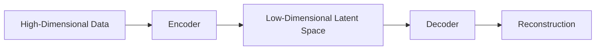

---

# 🧠 Reconstruction Loss

The reconstruction loss measures how different:

```text
Original Input
```

is from:

```text
Reconstructed Input
```

Common choices include:

```text
Mean Squared Error
Binary Cross-Entropy
Mean Absolute Error
```

The appropriate loss depends on the data and output distribution.

---

# 🧠 Mean Squared Error

For continuous-valued inputs:

\[
MSE=\frac{1}{n}\sum_{i=1}^{n}(x_i-\hat{x}_i)^2
\]


---

# 🧠 Mean Absolute Error

Another option is:

\[
MAE=\frac{1}{n}\sum_{i=1}^{n}|x_i-\hat{x}_i|
\]


---

# 🧠 Binary Cross-Entropy

For normalized binary-like data:

\[
BCE=-[x\log(\hat{x})+(1-x)\log(1-\hat{x})]
\]


---

# 🧠 Choosing Reconstruction Loss

| Input Type | Possible Loss |
|---|---|
| Continuous Values | MSE / MAE |
| Binary Data | Binary Cross-Entropy |
| Normalized Pixel Values | MSE / BCE depending on formulation |
| Robust Reconstruction | MAE or other robust losses |

The output activation and data scaling should be consistent with the chosen loss.

---

# 🧠 Autoencoder Training

The training process is:

```text
Input
 ↓
Encoder
 ↓
Latent Representation
 ↓
Decoder
 ↓
Reconstruction
 ↓
Loss
 ↓
Backpropagation
 ↓
Parameter Update
```

---

# 🧠 Autoencoder Training Flow

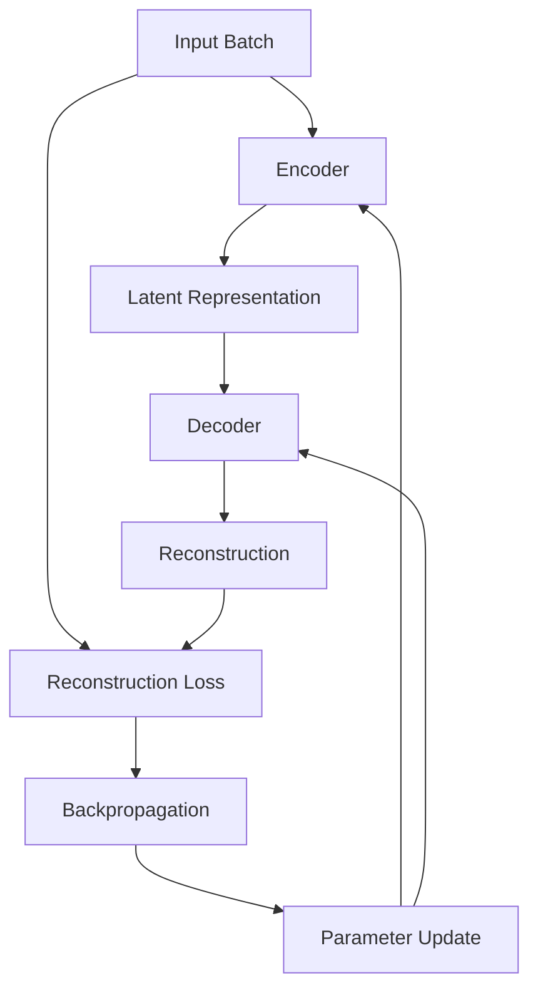

---

# 🧠 Autoencoder Training Objective

Unlike supervised classification:

```text
Input
+
Class Label
```

an Autoencoder commonly uses:

```text
Input
+
Input as Reconstruction Target
```

Therefore Autoencoders are often described as using a self-supervised reconstruction objective.

---

# 🧠 Self-Supervised Perspective

```text
Input Data
    │
    ├──────────────► Encoder → Decoder → Reconstruction
    │
    └──────────────► Target
```

No manually labeled class is required for the reconstruction objective.

---

# 🐍 Part I — TensorFlow / Keras Autoencoder

A basic Autoencoder can be implemented using Keras.

```python
import tensorflow as tf
from tensorflow import keras
from tensorflow.keras import layers


encoder = keras.Sequential([
    layers.Input(shape=(784,)),
    layers.Dense(256, activation="relu"),
    layers.Dense(64, activation="relu"),
    layers.Dense(32, activation="relu")
])


decoder = keras.Sequential([
    layers.Input(shape=(32,)),
    layers.Dense(64, activation="relu"),
    layers.Dense(256, activation="relu"),
    layers.Dense(784, activation="sigmoid")
])


autoencoder = keras.Sequential([
    encoder,
    decoder
])
```

---

# 🧪 Compile the Autoencoder

```python
autoencoder.compile(
    optimizer="adam",
    loss="mse"
)
```

---

# 🧪 Train the Autoencoder

For normalized input data:

```python
history = autoencoder.fit(
    x_train,
    x_train,
    epochs=20,
    batch_size=256,
    validation_data=(
        x_test,
        x_test
    )
)
```

Notice:

```python
x_train
```

is used as both:

```text
Input
```

and:

```text
Target
```

---

# 🧠 Keras Autoencoder Architecture

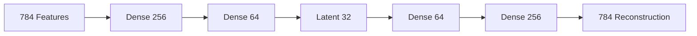

---

# 🐍 Part II — PyTorch Autoencoder

The same concept can be implemented using PyTorch.

```python
import torch
import torch.nn as nn


class Autoencoder(nn.Module):

    def __init__(self):
        super().__init__()

        self.encoder = nn.Sequential(
            nn.Linear(784, 256),
            nn.ReLU(),

            nn.Linear(256, 64),
            nn.ReLU(),

            nn.Linear(64, 32)
        )

        self.decoder = nn.Sequential(
            nn.Linear(32, 64),
            nn.ReLU(),

            nn.Linear(64, 256),
            nn.ReLU(),

            nn.Linear(256, 784),
            nn.Sigmoid()
        )

    def forward(self, x):

        z = self.encoder(x)

        reconstruction = self.decoder(z)

        return reconstruction
```

---

# 🧪 PyTorch Training Loop

```python
model = Autoencoder()

criterion = nn.MSELoss()

optimizer = torch.optim.Adam(
    model.parameters(),
    lr=1e-3
)


for epoch in range(20):

    for x, _ in train_loader:

        x = x.view(
            x.size(0),
            -1
        )

        optimizer.zero_grad()

        reconstruction = model(x)

        loss = criterion(
            reconstruction,
            x
        )

        loss.backward()

        optimizer.step()
```

---

# 🧠 Extracting Latent Representations

One of the main benefits of an Autoencoder is access to the latent representation.

In PyTorch:

```python
with torch.no_grad():

    latent = model.encoder(
        x
    )
```

Now:

```text
latent
```

contains the learned representation.

---

# 🧠 Latent Representation Pipeline

```text
Raw Data
   ↓
Encoder
   ↓
Latent Vector
   ↓
 ┌───────────────┐
 │ Classification│
 │ Clustering    │
 │ Search        │
 │ Visualization │
 │ Anomaly       │
 └───────────────┘
```

---

# 🧠 Autoencoder for Anomaly Detection

One important application is anomaly detection.

The basic idea:

```text
Train on Normal Data
       ↓
Learn Normal Patterns
       ↓
Reconstruct New Input
       ↓
Calculate Reconstruction Error
```

Normal samples should generally reconstruct well.

Anomalous samples may reconstruct poorly.

---

# 🧠 Anomaly Detection Architecture

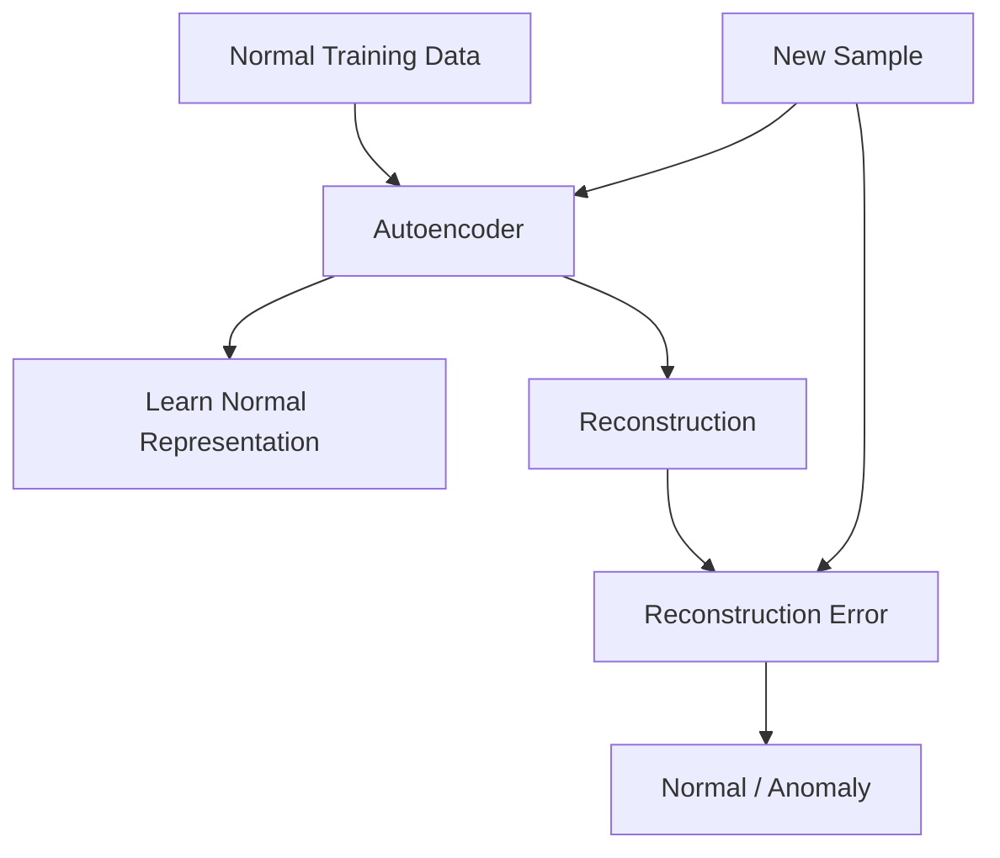

---

# 🧠 Reconstruction Error

For a sample:

\[
Error(x)=L(x,\hat{x})
\]


If:

```text
Error > Threshold
```

the sample may be classified as anomalous.

---

# 🧠 Anomaly Threshold

```text
Reconstruction Error

Low ───────────────────── High
 │                         │
 │     Normal              │ Anomaly
 │   ███████████            │     ███
 │ ███████████████          │   █████
 └──────────────────────────┴──────────
              Threshold
```

The threshold should be selected using validation data and the desired operational trade-off rather than chosen arbitrarily.

---

# 🏦 Autoencoder Anomaly Detection

Potential applications include:

```text
Fraud Detection
Network Anomaly Detection
Equipment Monitoring
Cybersecurity
Transaction Monitoring
Sensor Monitoring
```

---

# 🧠 Autoencoder for Denoising

Autoencoders can also learn to remove noise.

Examples:

```text
Noisy Image
   ↓
Autoencoder
   ↓
Clean Image
```

```text
Noisy Signal
   ↓
Autoencoder
   ↓
Clean Signal
```

---

# 🧠 Feature Extraction

An Autoencoder can be used as a feature extractor.

```text
Raw Input
   ↓
Encoder
   ↓
Latent Features
   ↓
Downstream Model
```

For example:

```text
Image
 ↓
CNN Encoder
 ↓
Latent Representation
 ↓
Classifier
```

---

# 🧠 Autoencoder + Classifier

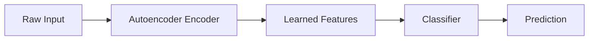

---

# 🧠 Pretraining Perspective

Historically, Autoencoders have also been used for unsupervised or self-supervised pretraining.

Conceptually:

```text
Large Unlabeled Dataset
        ↓
Train Autoencoder
        ↓
Learn Encoder
        ↓
Transfer Encoder
        ↓
Supervised Task
```

Modern foundation-model training often uses other objectives and architectures, but the underlying idea of learning reusable representations remains highly important.

---

# 🧠 Autoencoder for Compression

Autoencoders can learn compact representations.

```text
Original Data
      ↓
Encoder
      ↓
Compressed Representation
      ↓
Storage / Transmission
      ↓
Decoder
      ↓
Reconstructed Data
```

However, a neural Autoencoder is not automatically a replacement for specialized lossless or production compression algorithms.

---

# 🧠 Compression Pipeline

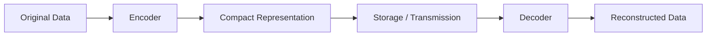

---

# 🧠 Autoencoder for Visualization

A latent representation can be reduced to two or three dimensions.

```text
High-Dimensional Data
       ↓
Encoder
       ↓
2D / 3D Latent Space
       ↓
Visualization
```

This can help explore:

```text
Clusters
Outliers
Similarity
Data Structure
```

---

# 🧠 Latent Space Visualization

```text
                 Latent Dimension 2
                       ↑
                       │
          ● ● ●        │
        ● ● ● ●        │
                       │
                       │       ● ● ●
                       │     ● ● ● ●
                       │
───────────────────────┼────────────────────→
                       │
          ●            │
                       │
                       │
```

For high-dimensional latent vectors, techniques such as PCA, t-SNE, or UMAP can be used for visualization, with care taken when interpreting the resulting projections.

---

# 🧠 Autoencoder Limitations

Autoencoders are powerful, but they have important limitations.

### 1. Reconstruction Does Not Guarantee Useful Features

A model can learn to reconstruct data well without learning representations that are ideal for a downstream task.

### 2. Latent Space Interpretability

Latent dimensions are not automatically human-interpretable.

### 3. Overfitting

A high-capacity Autoencoder may learn to memorize training examples.

### 4. Reconstruction Quality vs Representation Quality

Excellent reconstruction does not necessarily mean excellent semantic representation.

### 5. Threshold Selection

Anomaly detection requires a carefully chosen threshold.

### 6. Distribution Shift

Performance can degrade when production data differs from training data.

---

# 🧠 Autoencoder Failure Modes

```text
Too Much Capacity
      ↓
Identity Mapping
      ↓
Poor Representation Learning
```

Another possibility:

```text
Too Small Latent Space
      ↓
Excessive Information Loss
      ↓
Poor Reconstruction
```

Therefore architecture selection matters.

---

# 🧠 Capacity Trade-Off

```text
Latent Size

Too Small
   ↓
Information Bottleneck Too Strong
   ↓
Poor Reconstruction

Balanced
   ↓
Useful Representation

Too Large
   ↓
Easy Identity Mapping
   ↓
Potentially Weak Representation
```

---

# 🧠 Regularization Strategies

To encourage useful representations:

```text
Bottleneck
+
Sparsity
+
Noise Injection
+
Weight Regularization
+
Early Stopping
+
Data Augmentation
```

The appropriate strategy depends on the problem.

---

# 🧠 Autoencoder Design Decisions

When designing an Autoencoder, consider:

```text
Input Type
 ↓
Architecture
 ↓
Latent Dimension
 ↓
Activation Function
 ↓
Reconstruction Loss
 ↓
Regularization
 ↓
Training Strategy
 ↓
Evaluation
```

---

# 🧠 Architecture by Data Type

| Data | Possible Architecture |
|---|---|
| Tabular | Dense Autoencoder |
| Images | Convolutional Autoencoder |
| Sequences | RNN / Transformer Autoencoder |
| Audio | Convolutional / Sequence Autoencoder |
| Documents | Transformer-based Encoder |
| Multimodal | Multimodal Encoder |

---

# 🧠 Autoencoder Evaluation

Evaluation depends on the application.

### Reconstruction

```text
MSE
MAE
BCE
PSNR
SSIM
```

### Representation

```text
Downstream Accuracy
Clustering Quality
Embedding Similarity
```

### Anomaly Detection

```text
Precision
Recall
F1
AUROC
AUPRC
False Positive Rate
```

---

# 🧠 Representation Quality

A representation should be evaluated based on the intended use.

For example:

```text
Representation
      ↓
Classifier
      ↓
Accuracy
```

or:

```text
Representation
      ↓
Similarity Search
      ↓
Retrieval Quality
```

Therefore:

> **There is no single universal metric for representation quality.**

---

# 🏢 Enterprise Applications

Autoencoders can support several enterprise use cases.

```text
Anomaly Detection
+
Feature Learning
+
Data Compression
+
Noise Reduction
+
Dimensionality Reduction
+
Representation Learning
```

---

# 🏦 Financial Services

Potential applications:

```text
Transaction Anomaly Detection
Fraud Detection
Behavioral Modeling
Risk Feature Learning
```

A transaction sequence can be transformed into:

```text
Transaction Events
      ↓
Encoder
      ↓
Latent Risk Representation
      ↓
Anomaly Score
```

---

# 🏭 Manufacturing

Sensor data can be represented as:

```text
Temperature
Pressure
Vibration
Current
Speed
```

The Autoencoder learns normal operating patterns.

```text
Sensor Data
   ↓
Encoder
   ↓
Latent Representation
   ↓
Decoder
   ↓
Reconstruction Error
   ↓
Equipment Anomaly
```

---

# 📡 Network Monitoring

Network telemetry can be modeled as:

```text
Requests
Connections
Latency
Traffic
Errors
```

An Autoencoder can learn normal patterns and identify unusual observations.

---

# 🔐 Cybersecurity

Potential applications include:

```text
Network Anomaly Detection
User Behavior Modeling
Log Anomaly Detection
Security Event Analysis
```

The model can learn representations of normal behavior.

---

# 📄 Document Representation

An Encoder can transform documents into compact representations.

```text
Document
   ↓
Tokenizer
   ↓
Transformer Encoder
   ↓
Latent Representation
```

These representations can support:

```text
Search
Clustering
Classification
Similarity
Deduplication
```

---

# 🧠 Autoencoder vs Transformer Representation Learning

Both can learn representations, but they solve different problems.

| Autoencoder | Transformer |
|---|---|
| Reconstruction-oriented architecture | Attention-based architecture |
| Explicit encoder-decoder structure | Flexible encoder/decoder configurations |
| Strong for compression and reconstruction | Strong for contextual relationships |
| Useful for anomaly detection | Strong for sequence understanding |
| Can operate on many data types | Particularly powerful for sequences and tokenized modalities |

Modern systems can combine the two.

---

# 🧠 Transformer + Autoencoder

A system can use:

```text
Transformer Encoder
        ↓
Latent Representation
        ↓
Decoder
        ↓
Reconstruction
```

This can combine:

```text
Contextual Representation
+
Reconstruction Learning
```

---

# 🧠 Autoencoder + RAG

Autoencoder-style representations can also conceptually contribute to:

```text
Compression
+
Representation Learning
+
Retrieval
```

However, production RAG systems typically use dedicated embedding models optimized for semantic retrieval rather than assuming a generic reconstruction Autoencoder is the best embedding model.

---

# 🧪 Practical Exercise 1 — Basic Autoencoder

Build an Autoencoder for MNIST.

Architecture:

```text
784
 ↓
256
 ↓
64
 ↓
32
 ↓
64
 ↓
256
 ↓
784
```

Measure:

```text
Training Loss
Validation Loss
Reconstruction Quality
```

---

# 🧪 Practical Exercise 2 — Visualize Reconstructions

Display:

```text
Original Image
```

beside:

```text
Reconstructed Image
```

Compare reconstruction quality across training epochs.

---

# 🧪 Practical Exercise 3 — Latent Space

Create a 2-dimensional latent space:

```text
784
 ↓
128
 ↓
2
 ↓
128
 ↓
784
```

Plot the latent representations.

Analyze:

```text
Clusters
Outliers
Class Separation
```

---

# 🧪 Practical Exercise 4 — Denoising Autoencoder

Add noise to MNIST images.

```text
Clean Image
 ↓
Noise
 ↓
Noisy Image
```

Train the Autoencoder to reconstruct the clean image.

---

# 🧪 Practical Exercise 5 — Convolutional Autoencoder

Build:

```text
Conv2D
 ↓
Pooling
 ↓
Conv2D
 ↓
Latent
 ↓
Upsampling
 ↓
Conv2D
 ↓
Reconstruction
```

Train it on an image dataset.

---

# 🧪 Practical Exercise 6 — Anomaly Detection

Train an Autoencoder only on:

```text
Normal Samples
```

Then evaluate:

```text
Normal Samples
+
Anomalous Samples
```

Calculate reconstruction errors.

Plot:

```text
Error Distribution
```

and determine a suitable threshold.

---

# 🧪 Practical Exercise 7 — PCA vs Autoencoder

Compare:

```text
PCA
```

against:

```text
Autoencoder
```

for dimensionality reduction.

Measure:

```text
Reconstruction Error
Training Time
Latent Representation
Downstream Classification
```

---

# 🧪 Practical Exercise 8 — Sparse Autoencoder

Add a sparsity penalty.

Compare:

```text
Standard Autoencoder
```

against:

```text
Sparse Autoencoder
```

Analyze the latent activations.

---

# 🧪 Practical Exercise 9 — VAE

Build a simple VAE.

Implement:

```text
Encoder
 ↓
Mean + Log Variance
 ↓
Sampling
 ↓
Decoder
```

Train it on MNIST.

---

# 🧪 Practical Exercise 10 — Production Anomaly Detector

Build a production-style pipeline:

```text
Data Ingestion
 ↓
Feature Processing
 ↓
Autoencoder
 ↓
Reconstruction Error
 ↓
Threshold
 ↓
Anomaly Event
 ↓
Monitoring
```

Track:

```text
Precision
Recall
False Positives
Detection Latency
Model Drift
```

---

# 🧠 Interview Questions

## Beginner

### 1. What is an Autoencoder?

An Autoencoder is a neural network trained to reconstruct its input through a learned latent representation.

### 2. What are the main components of an Autoencoder?

```text
Encoder
Latent Representation
Decoder
```

### 3. What is the purpose of the Encoder?

The Encoder transforms the input into a learned latent representation.

### 4. What is the purpose of the Decoder?

The Decoder reconstructs the input from the latent representation.

### 5. What is the latent space?

The latent space is the lower-dimensional or learned representation produced by the Encoder.

### 6. What is reconstruction loss?

It measures the difference between the original input and the reconstructed output.

---

## Intermediate

### 7. Why is a bottleneck useful?

A bottleneck restricts the information passing through the latent representation and encourages the model to learn important features.

### 8. What is an undercomplete Autoencoder?

An Autoencoder whose latent dimension is smaller than the input dimension.

### 9. What is a denoising Autoencoder?

An Autoencoder trained using corrupted inputs while reconstructing the clean original data.

### 10. What is a sparse Autoencoder?

An Autoencoder that encourages sparse activation patterns in its latent representation.

### 11. How can Autoencoders be used for anomaly detection?

Train on normal data and use reconstruction error as an anomaly signal.

### 12. How are Autoencoders related to PCA?

A constrained linear Autoencoder can learn a representation related to the principal subspace identified by PCA.

---

## Advanced

### 13. Why doesn't low reconstruction error guarantee a useful representation?

Because the model can learn an efficient reconstruction strategy that does not necessarily capture features useful for a downstream task.

### 14. What happens if the latent dimension is too large?

The model may learn an identity-like mapping and fail to learn a useful bottleneck representation.

### 15. What happens if the latent dimension is too small?

The model may lose important information and produce poor reconstructions.

### 16. What is a Variational Autoencoder?

A VAE learns a probabilistic latent representation and combines reconstruction learning with a regularization term based on KL divergence.

### 17. What is the difference between a standard Autoencoder and a VAE?

A standard Autoencoder typically maps an input to a deterministic latent vector, while a VAE models a distribution over latent representations.

### 18. Why are Convolutional Autoencoders useful for images?

Convolutional layers preserve local spatial structure and share parameters efficiently across image regions.

### 19. What is the reconstruction-error approach to anomaly detection?

The model learns normal patterns and produces larger reconstruction errors when an input differs significantly from those patterns.

### 20. What is a major challenge with Autoencoder-based anomaly detection?

The model may also reconstruct some anomalies well, especially if anomalies resemble patterns seen during training or the model has excessive capacity.

---

# 🏢 Production Architecture

A production Autoencoder-based anomaly detection system might look like:

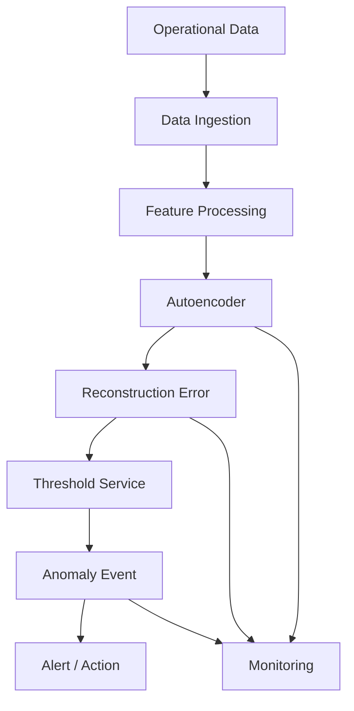

---

# 🏢 Production Design Considerations

A production Autoencoder system needs more than a trained model.

Consider:

```text
Data Quality
+
Feature Scaling
+
Model Versioning
+
Threshold Management
+
Drift Detection
+
Monitoring
+
Alerting
+
Retraining
+
Rollback
```

---

# 🏢 Model Lifecycle

```text
Historical Data
      ↓
Training
      ↓
Validation
      ↓
Threshold Calibration
      ↓
Deployment
      ↓
Monitoring
      ↓
Drift Detection
      ↓
Retraining
      ↓
Redeployment
```

---

# 🏢 Monitoring Reconstruction Error

A production system should monitor:

```text
Mean Reconstruction Error
P95 Reconstruction Error
P99 Reconstruction Error
Anomaly Rate
False Positive Rate
False Negative Rate
```

Changes in these metrics may indicate:

```text
Data Drift
Concept Drift
Infrastructure Problems
Model Degradation
Threshold Problems
```

---

# 🏢 Data Drift

Suppose the model was trained on:

```text
Normal Operating Conditions
```

but production changes:

```text
New Equipment
New Customer Behavior
New Transaction Patterns
New Network Traffic
```

Then reconstruction error may change.

```text
Training Distribution
        ↓
Production Distribution
        ↓
Distribution Shift
        ↓
Changed Reconstruction Error
```

---

# 🏢 Retraining Strategy

A production Autoencoder may require retraining when:

```text
Data Distribution Changes
+
Anomaly Patterns Evolve
+
False Positive Rate Increases
+
False Negative Rate Increases
```

Retraining should be controlled through a model lifecycle rather than performed blindly.

---

# 🏢 Model Serving

A lightweight inference service can expose:

```text
POST /anomaly-score
```

Request:

```json
{
  "features": [
    0.12,
    0.43,
    0.71
  ]
}
```

Response:

```json
{
  "reconstruction_error": 0.084,
  "anomaly": false
}
```

---

# 🏢 Enterprise Architecture

A Java/Spring-based enterprise service could follow:

```text
Spring Boot API
      ↓
Application Service
      ↓
Autoencoder Port
      ↓
Model Adapter
      ↓
Python / ONNX / Model Runtime
      ↓
GPU / CPU
```

The business layer should not be tightly coupled to the underlying model implementation.

---

# 🏢 Model Abstraction

A capability-based interface could conceptually look like:

```java
public interface AnomalyDetectionProvider {

    AnomalyResult detect(
        FeatureVector input
    );
}
```

An implementation can then use:

```text
PyTorch
TensorFlow
ONNX Runtime
Cloud ML Endpoint
Dedicated Model Server
```

without changing the business logic.

---

# 🏢 Cloud Deployment

An Autoencoder can be deployed through:

```text
Containerized Inference
+
Managed ML Endpoint
+
Kubernetes
+
Serverless Inference
+
Batch Processing
```

The right approach depends on:

```text
Traffic
Latency
Model Size
Cost
GPU Requirement
Operational Complexity
```

---

!!! tip "Production Insight"

    **An Autoencoder is not automatically an anomaly detector.**

    The model provides a reconstruction signal.

    A production anomaly detection system requires:

    ```text
    Autoencoder
         ↓
    Reconstruction Error
         ↓
    Threshold Strategy
         ↓
    Decision Logic
         ↓
    Alert / Action
    ```

    The threshold must be calibrated using representative validation data and continuously evaluated against production behavior.

    In enterprise systems, the difficult part is often not training the Autoencoder. It is maintaining:

    ```text
    Stable Data
    Reliable Thresholds
    Low False Positives
    Drift Detection
    Model Versioning
    Monitoring
    Retraining
    ```

---

# 📌 Key Takeaways

- Representation learning allows neural networks to learn useful features directly from data.
- Autoencoders learn to reconstruct their inputs through a latent representation.
- The Encoder produces the latent representation.
- The Decoder reconstructs the original input.
- The bottleneck encourages the model to learn compact information.
- Undercomplete Autoencoders have a latent dimension smaller than the input.
- Overcomplete Autoencoders may require regularization.
- Sparse Autoencoders encourage sparse latent activations.
- Denoising Autoencoders learn to reconstruct clean data from corrupted inputs.
- Convolutional Autoencoders are well suited to image representation learning.
- Variational Autoencoders learn probabilistic latent representations.
- Reconstruction loss is central to Autoencoder training.
- Autoencoders can perform nonlinear dimensionality reduction.
- Autoencoders can be used for feature extraction and representation learning.
- Autoencoders can support anomaly detection through reconstruction error.
- Low reconstruction error does not automatically mean that the learned representation is useful for every downstream task.
- PCA and linear Autoencoders have an important conceptual relationship.
- Latent-space visualization can help explore learned representations.
- Production anomaly detection requires threshold calibration and continuous monitoring.
- Data drift can significantly affect reconstruction-based anomaly detection.
- Enterprise Autoencoder systems require model lifecycle management, observability, deployment architecture, and retraining strategies.
- Autoencoders provide an important foundation for understanding modern representation and generative learning systems.

---

# 📚 Further Reading

Continue with:

- **[30. Generative Adversarial Networks](30-generative-adversarial-networks.md)**
- **[31. Diffusion Models](31-diffusion-models.md)**
- **[32. Reinforcement Learning Fundamentals](32-reinforcement-learning-fundamentals.md)**
- **[35. GPU Accelerated Deep Learning](35-gpu-accelerated-deep-learning.md)**
- **[36. Deep Learning Training and Model Lifecycle](36-deep-learning-training-and-model-lifecycle.md)**
- **[37. Building Production Deep Learning Systems](37-building-production-deep-learning-systems.md)**

---

## ➡️ Next Chapter

**[30. Generative Adversarial Networks](30-generative-adversarial-networks.md)**

---

> **Enterprise AI Engineering Handbook**  
> *Building Production-Grade Enterprise AI Systems — One Chapter at a Time.*