# 30. Generative Adversarial Networks

> Understand how Generative Adversarial Networks (GANs) learn to generate realistic data through competition between a Generator and a Discriminator, and explore GAN architecture, training dynamics, major variants, applications, limitations, and production considerations.

---

## 🎯 Learning Objectives

After completing this chapter, you will be able to:

- Explain what Generative Adversarial Networks are
- Understand the Generator and Discriminator
- Explain adversarial training
- Understand the GAN training objective
- Explain how GANs generate synthetic data
- Understand latent vectors and latent spaces
- Understand the role of random noise
- Explain the GAN training loop
- Understand the minimax objective
- Understand common GAN loss functions
- Explain mode collapse
- Understand training instability
- Understand the difference between GANs and Autoencoders
- Understand DCGAN architecture
- Understand Conditional GANs
- Understand Wasserstein GANs
- Understand CycleGAN at a conceptual level
- Understand StyleGAN at a conceptual level
- Understand image-to-image translation
- Understand GAN applications
- Implement a basic GAN using TensorFlow/Keras
- Implement a basic GAN using PyTorch
- Evaluate GAN-generated samples
- Understand GAN limitations
- Understand production considerations for generative models

---

# 📖 Overview

Traditional Machine Learning models are commonly designed to predict something from existing data.

For example:

```text
Input
 ↓
Model
 ↓
Prediction
```

Generative models solve a different problem.

Instead of only predicting an output, they attempt to learn the underlying data distribution and generate new samples.

```text
Training Data
     ↓
Generative Model
     ↓
Learned Data Distribution
     ↓
New Synthetic Samples
```

Generative Adversarial Networks introduced a powerful approach to generative modeling by training two neural networks against each other:

```text
Generator
     ↕
Discriminator
```

The Generator tries to create realistic samples.

The Discriminator tries to distinguish real samples from generated samples.

This competition drives the Generator toward increasingly realistic outputs.

---

# 🤖 What is a GAN?

A Generative Adversarial Network is a generative model composed primarily of:

```text
Generator
+
Discriminator
```

The Generator creates synthetic samples.

The Discriminator evaluates whether a sample appears to come from the real training distribution.

---

# 🧠 GAN Architecture

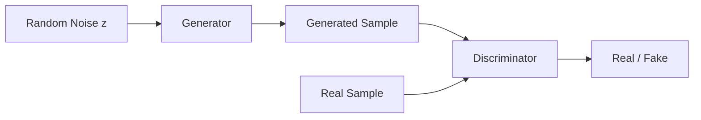

---

# 🧠 Generator

The Generator is responsible for producing synthetic data.

It receives a latent vector or random noise:

```text
z
```

and transforms it into a generated sample:

```text
G(z)
```

For an image-generation GAN:

```text
Random Vector
      ↓
Generator
      ↓
Synthetic Image
```

---

# 🧠 Discriminator

The Discriminator attempts to determine whether a sample is:

```text
Real
```

or:

```text
Generated
```

Conceptually:

```text
Image
 ↓
Discriminator
 ↓
Probability
```

For example:

```text
0.97 → likely real
0.08 → likely fake
```

---

# 🧠 Generator + Discriminator

The two networks have competing objectives.

### Generator

```text
Generate realistic samples
```

### Discriminator

```text
Distinguish real samples from generated samples
```

Therefore:

```text
Generator
    ↓
Creates Fake Data
    ↓
Discriminator
    ↓
Detects Fake Data
    ↓
Generator Learns
    ↓
Creates Better Data
```

---

# 🔄 Adversarial Training

The term **adversarial** comes from the competition between the two networks.

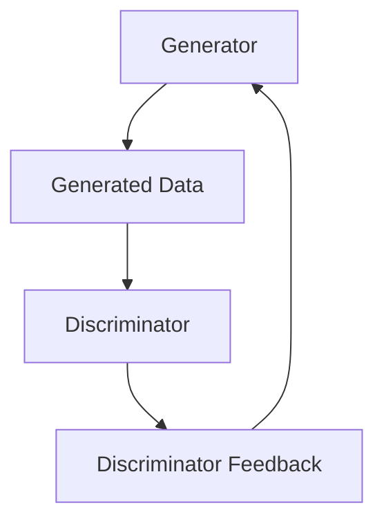

The Generator improves by learning from the Discriminator's feedback.

---

# 🧠 Real vs Fake Data

During training, the Discriminator receives two types of samples.

### Real

```text
x ~ p_data
```

where:

```text
p_data = Real Data Distribution
```

### Fake

```text
G(z)
```

where:

```text
z = Random Latent Vector
```

The Discriminator learns to distinguish:

```text
Real Data
```

from:

```text
Generated Data
```

---

# 🧠 GAN Training Flow

```text
Random Noise
     ↓
Generator
     ↓
Fake Sample
     ↓
Discriminator
     ↓
Fake Probability
```

At the same time:

```text
Real Sample
     ↓
Discriminator
     ↓
Real Probability
```

The two signals are used to train the Discriminator and Generator.

---

# 🧠 GAN Training Architecture

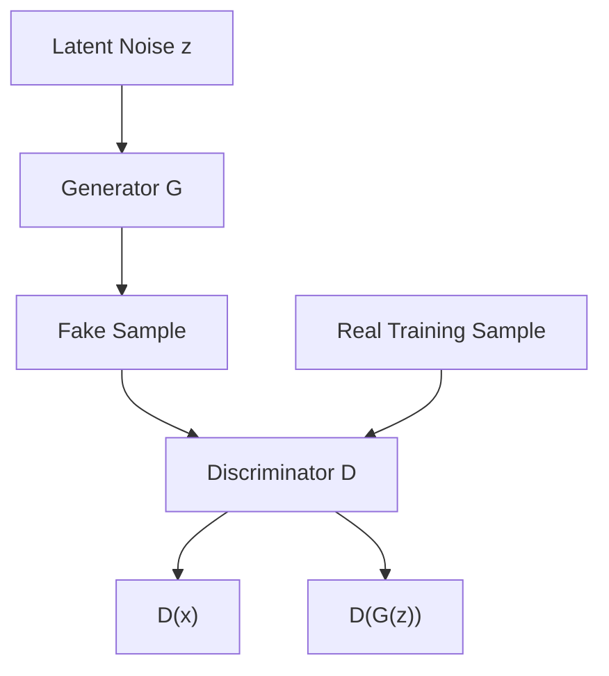

---

# 🧠 Latent Vector

The Generator does not normally receive a real image directly.

Instead, it starts with a random latent vector.

For example:

```text
z =
[
  0.17,
 -0.82,
  0.31,
  ...
]
```

The Generator transforms this vector into a synthetic sample.

---

# 🧠 Latent Space

Conceptually:

```text
Random Latent Vector
        ↓
     Generator
        ↓
Generated Sample
```

Different latent vectors can produce different samples.

```text
z₁ → Image A
z₂ → Image B
z₃ → Image C
```

---

# 🧠 Latent Space Visualization

```text
                 z₂
                  ↑
                  │
          ●       │       ●
                  │
     ●            │
                  │        ●
                  │
──────────────────┼────────────────→ z₁
                  │
             ●    │
                  │
        ●         │
```

The Generator learns a mapping from regions of latent space to generated samples.

---

# 🧠 Generator Function

The Generator can be represented as:

\[
G(z)
\]


where:

```text
z = Latent Vector
G = Generator
G(z) = Generated Sample
```

---

# 🧠 Discriminator Function

The Discriminator can be represented as:

\[
D(x)
\]


where:

```text
x = Input Sample
D(x) = Probability that x is real
```

For a generated sample:

\[
D(G(z))
\]


---

# 🧠 Original GAN Objective

The original GAN formulation uses a minimax objective.

Conceptually:

\[
\min_G\max_D V(D,G)
\]


The objective can be written as:

\[
\mathbb{E}_{x\sim p_{data}(x)}[\log D(x)]
+
\mathbb{E}_{z\sim p_z(z)}[\log(1-D(G(z)))]
\]


The Discriminator attempts to maximize this objective while the Generator attempts to minimize it.

---

# 🧠 Discriminator Objective

The Discriminator wants:

```text
D(real) → 1
D(fake) → 0
```

Therefore:

```text
Real Sample
    ↓
D(x)
    ↓
Close to 1

Fake Sample
    ↓
D(G(z))
    ↓
Close to 0
```

---

# 🧠 Generator Objective

The Generator wants the Discriminator to believe its generated samples are real.

Therefore:

```text
Generated Sample
      ↓
Discriminator
      ↓
Probability of Real
      ↓
Should approach 1
```

Conceptually:

```text
Generator Objective

D(G(z)) → 1
```

---

# 🧠 Generator and Discriminator Objectives

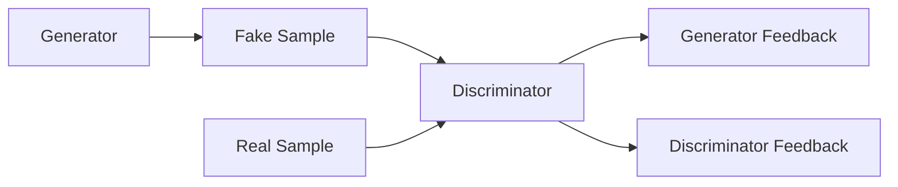

---

# 🔄 GAN Training Loop

A typical GAN training process alternates between:

```text
Train Discriminator
        ↓
Train Generator
        ↓
Train Discriminator
        ↓
Train Generator
        ↓
...
```

---

# 🧠 GAN Training Loop

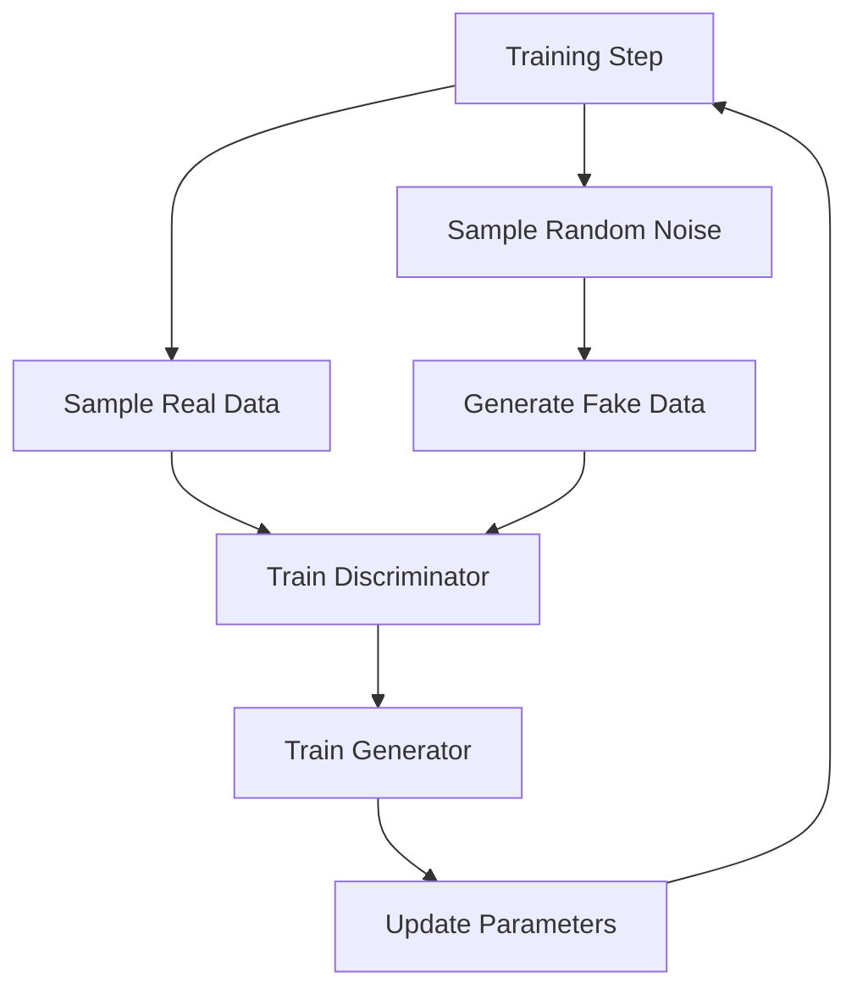

---

# 🧠 Step 1 — Train the Discriminator

Sample:

```text
Real Data
```

and:

```text
Random Noise
```

Generate:

```text
Fake Data
```

Then train the Discriminator using:

```text
Real → 1
Fake → 0
```

---

# 🧠 Step 2 — Train the Generator

Generate fake data.

Then pass it through the Discriminator.

The Generator is updated so that:

```text
D(fake)
```

moves toward:

```text
1
```

---

# 🧠 Two Optimization Problems

GAN training can therefore be viewed as two interacting optimization processes.

```text
Discriminator:

Real → Real
Fake → Fake
```

while:

```text
Generator:

Fake → Real-looking
```

---

# 🧠 Binary Cross-Entropy Loss

The original GAN formulation is commonly implemented using binary classification-style losses.

For binary classification:

\[
BCE=-[y\log(\hat{y})+(1-y)\log(1-\hat{y})]
\]


The Discriminator can use this type of objective to distinguish real and fake samples.

---

# 🧠 Non-Saturating Generator Loss

In practical implementations, the Generator is often trained using the non-saturating objective:

\[
L_G=-\mathbb{E}_{z\sim p_z}[\log D(G(z))]
\]


This provides stronger gradients than directly minimizing the original saturating objective in many training situations.

---

# 🧠 GAN Loss Landscape

GAN training is different from ordinary supervised optimization.

Instead of:

```text
One Model
 ↓
One Loss
 ↓
Minimum
```

GAN training involves:

```text
Generator
     ↕
Discriminator
     ↕
Competing Objectives
```

This makes optimization more challenging.

---

# ⚠ GAN Training Challenges

GANs can suffer from:

```text
Training Instability
Mode Collapse
Vanishing Gradients
Oscillating Losses
Sensitivity to Hyperparameters
Discriminator Dominance
Generator Dominance
```

Understanding these problems is essential for practical GAN development.

---

# ⚠ Mode Collapse

Mode collapse occurs when the Generator produces limited varieties of outputs.

For example, instead of generating:

```text
Many Different Faces
```

the Generator may produce:

```text
Very Similar Faces
Very Similar Faces
Very Similar Faces
...
```

even though the samples appear realistic.

---

# 🧠 Mode Collapse

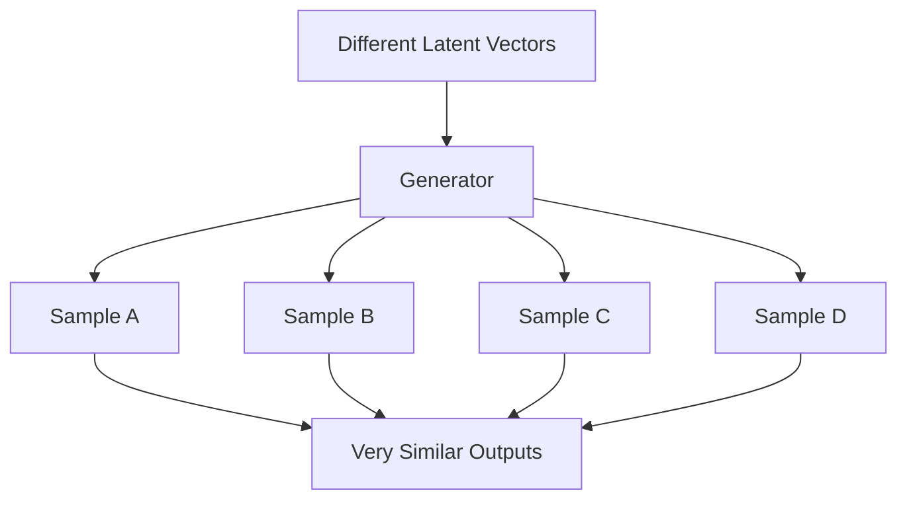

---

# ⚠ Why Mode Collapse Happens

The Generator may discover a small region of the data distribution that consistently fools the Discriminator.

Instead of learning:

```text
Full Data Distribution
```

it may focus on:

```text
Small Number of Successful Patterns
```

---

# ⚠ Training Instability

GANs can exhibit unusual loss behavior.

For example:

```text
Generator Loss
    ↗
 ↘     ↗
   ↘
      ↗
```

Loss curves do not always behave like conventional supervised-learning loss curves.

Therefore GAN evaluation should not rely only on training loss.

---

# ⚠ Discriminator Dominance

If the Discriminator becomes too strong:

```text
D(real) → 1
D(fake) → 0
```

very quickly.

The Generator may then receive weak or unhelpful gradients.

---

# ⚠ Generator Dominance

If the Generator becomes too strong too early, the Discriminator may struggle to learn useful distinctions.

Therefore training balance is important.

---

# 🧠 GAN Training Balance

```text
Generator
    ↕
Balanced Competition
    ↕
Discriminator
```

The goal is not simply:

```text
Make Discriminator as accurate as possible
```

or:

```text
Make Generator as powerful as possible
```

but to maintain a useful adversarial learning dynamic.

---

# 🧠 Deep Convolutional GAN

DCGAN stands for:

> **Deep Convolutional Generative Adversarial Network**

DCGANs adapt GANs to image generation using convolutional architectures.

---

# 👁️ DCGAN Architecture

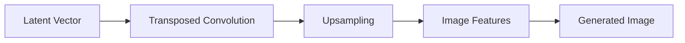

The Discriminator uses convolutional layers in the opposite direction:

```text
Image
 ↓
Convolution
 ↓
Feature Extraction
 ↓
Downsampling
 ↓
Real / Fake
```

---

# 👁️ DCGAN Full Architecture

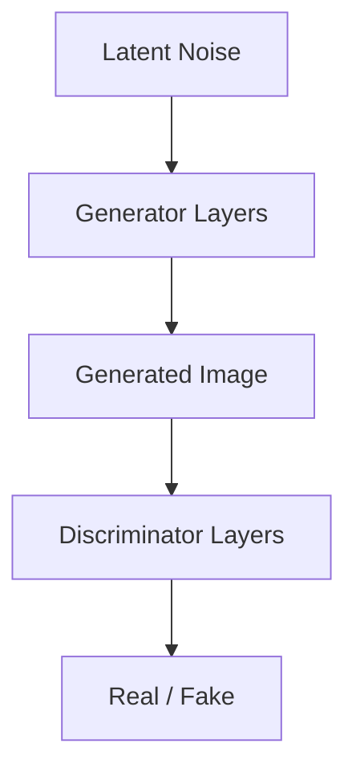

---

# 🧠 Conditional GAN

A standard GAN generates samples based only on random noise.

A Conditional GAN adds additional information.

For example:

```text
Random Noise
+
Class Label
      ↓
Generator
      ↓
Generated Sample
```

---

# 🧠 Conditional GAN Architecture

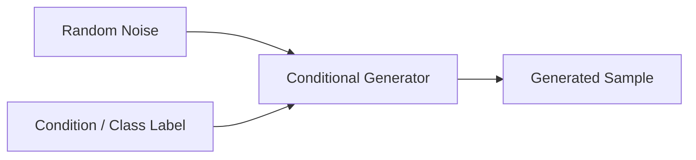

The Discriminator can also receive the condition.

```text
Image
+
Class Label
 ↓
Discriminator
 ↓
Real / Fake
```

---

# 🧠 Conditional Generation

For example:

```text
Label = "Digit 7"
+
Random Noise
 ↓
Generator
 ↓
Image of 7
```

The condition controls the type of sample generated.

---

# 🧠 Conditional GAN Applications

```text
Class-Controlled Image Generation
Image-to-Image Translation
Super-Resolution
Synthetic Data Generation
Domain Translation
```

---

# 🧠 Wasserstein GAN

Wasserstein GAN (WGAN) was introduced to improve training stability and provide a more useful notion of distance between distributions.

Instead of the original Discriminator formulation, WGAN uses a:

```text
Critic
```

that produces a scalar score rather than a probability interpreted directly as real/fake.

---

# 🧠 WGAN Architecture

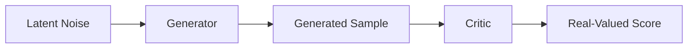

---

# 🧠 Discriminator vs Critic

| Traditional GAN | WGAN |
|---|---|
| Discriminator | Critic |
| Binary real/fake classification | Real-valued score |
| Often uses BCE-style objective | Wasserstein-based objective |
| Can experience unstable gradients | Designed to improve gradient behavior |

WGAN variants use constraints such as weight clipping or gradient penalties depending on the implementation.

---

# 🧠 WGAN-GP

WGAN-GP introduces a gradient penalty to encourage the desired Lipschitz constraint.

Conceptually:

```text
Wasserstein Objective
+
Gradient Penalty
```

This can improve training stability compared with basic GAN implementations.

---

# 🧠 CycleGAN

CycleGAN focuses on image-to-image translation without requiring paired examples.

Example:

```text
Horse
 ↓
Zebra
```

and:

```text
Zebra
 ↓
Horse
```

---

# 👁️ CycleGAN Architecture

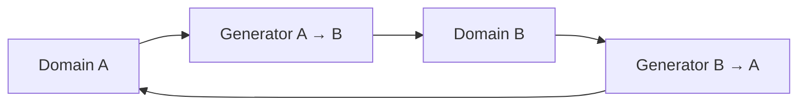

The cycle-consistency idea encourages:

```text
A → B → A
```

to approximately recover the original input.

---

# 🧠 Cycle Consistency

Conceptually:

\[
G_{BA}(G_{AB}(x))\approx x
\]


This helps constrain the image translation process.

---

# 🎨 StyleGAN

StyleGAN introduced important ideas for controlling generated image characteristics.

Instead of directly feeding a latent vector through a simple Generator pipeline, StyleGAN introduces a more sophisticated latent-space and style-control mechanism.

Conceptually:

```text
Latent Representation
        ↓
Style Mapping
        ↓
Style-Controlled Generation
        ↓
Image
```

---

# 🎨 StyleGAN Concept

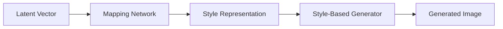

Style-based generation allows different levels of image characteristics to be influenced at different stages.

---

# 🧠 GAN Applications

GANs have been applied to many generative tasks.

```text
Image Generation
Image-to-Image Translation
Super-Resolution
Data Augmentation
Synthetic Data
Style Transfer
Image Restoration
Face Generation
Video Generation
Domain Adaptation
```

---

# 👁️ Image Generation

GANs can generate synthetic images.

```text
Random Noise
      ↓
Generator
      ↓
Synthetic Image
```

Applications include:

```text
Synthetic Faces
Product Images
Artwork
Textures
Training Data
```

---

# 👁️ Super-Resolution

GANs can generate high-resolution versions of low-resolution images.

```text
Low Resolution
      ↓
Generator
      ↓
High Resolution
```

---

# 👁️ Image Restoration

GAN-based models can support:

```text
Denoising
Deblurring
Inpainting
Image Restoration
```

---

# 👁️ Image-to-Image Translation

GANs can translate between visual domains.

Examples:

```text
Day → Night
Summer → Winter
Horse → Zebra
Sketch → Image
Satellite → Map
```

---

# 🧪 Synthetic Data Generation

GANs can generate synthetic datasets.

```text
Real Dataset
      ↓
GAN Training
      ↓
Generator
      ↓
Synthetic Dataset
```

Potential applications include:

```text
Data Augmentation
Privacy-Sensitive Data Simulation
Rare Event Generation
Testing
Simulation
```

However, synthetic data must be carefully validated for quality, bias, leakage, and downstream usefulness.

---

# 🧠 Synthetic Data Pipeline

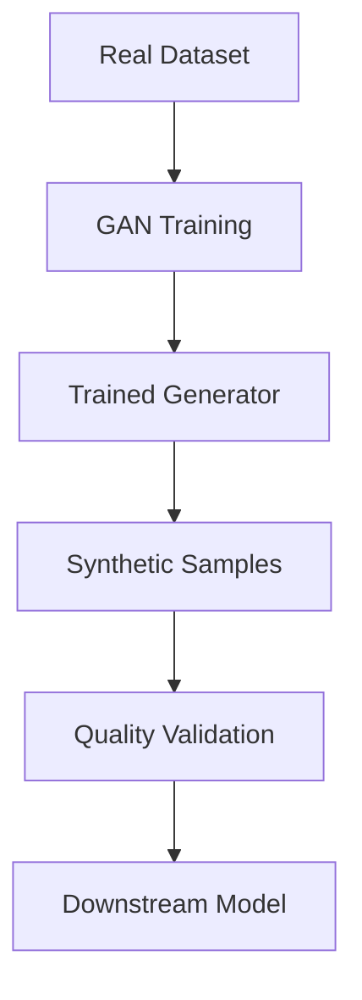

---

# 🏦 GANs in Financial Services

Potential applications include:

```text
Synthetic Transaction Data
Fraud Scenario Simulation
Stress Testing
Data Augmentation
Rare Event Simulation
```

A critical consideration is ensuring synthetic data does not accidentally reproduce sensitive information from the training dataset.

---

# 🏥 GANs in Healthcare

Potential applications include:

```text
Synthetic Medical Images
Data Augmentation
Medical Image Restoration
Research Simulation
```

Healthcare applications require strict privacy, validation, and regulatory controls.

---

# 🏭 GANs in Manufacturing

GANs can potentially generate:

```text
Synthetic Defects
Synthetic Sensor Patterns
Rare Failure Scenarios
Training Images
```

This can help when real abnormal examples are difficult to obtain.

---

# 🧠 GANs for Data Augmentation

When a dataset is small:

```text
Limited Real Data
       ↓
GAN
       ↓
Synthetic Samples
       ↓
Augmented Dataset
       ↓
Downstream Model
```

But synthetic augmentation should be validated rather than automatically assumed to improve model performance.

---

# 🧠 GAN vs Autoencoder

Both can generate or reconstruct data, but their objectives are different.

| Autoencoder | GAN |
|---|---|
| Learns reconstruction | Learns generation through adversarial training |
| Encoder + Decoder | Generator + Discriminator |
| Explicit latent representation | Latent input to Generator |
| Reconstruction loss | Adversarial objective |
| Useful for representation learning | Strong for realistic sample generation |
| Often easier to train | Often harder to stabilize |

---

# 🧠 GAN vs VAE

| GAN | VAE |
|---|---|
| Adversarial training | Probabilistic latent modeling |
| Generator + Discriminator | Encoder + Decoder |
| Often sharp generated samples | Often smoother samples |
| Training can be unstable | Generally more stable |
| Mode collapse can occur | Latent space is explicitly regularized |
| Strong image-generation history | Strong representation + generation combination |

---

# 🧠 GAN vs Diffusion Models

Modern generative modeling includes several approaches.

| GAN | Diffusion Model |
|---|---|
| Adversarial training | Iterative denoising |
| Generator + Discriminator | Denoising model |
| Often fast sampling | Sampling can require multiple steps |
| Training can be unstable | Generally more stable |
| Mode collapse possible | Strong mode coverage |
| Historically important for image synthesis | Highly influential in modern generative image systems |

---

# 🧠 GAN Evaluation

Evaluating GANs is difficult because generated samples should be:

```text
Realistic
+
Diverse
+
Relevant to the Target Distribution
```

---

# 🧠 Evaluation Dimensions

### Fidelity

How realistic are generated samples?

### Diversity

Does the Generator cover different modes of the real distribution?

### Distribution Similarity

How close is the generated distribution to the real distribution?

---

# 🧠 Common GAN Metrics

Depending on the application, metrics may include:

```text
Inception Score
FID
Precision
Recall
Human Evaluation
Downstream Task Performance
```

---

# 🧠 Fréchet Inception Distance

FID compares feature distributions between real and generated images.

Conceptually:

```text
Real Images
 ↓
Feature Extractor
 ↓
Real Feature Distribution

Generated Images
 ↓
Feature Extractor
 ↓
Generated Feature Distribution

            ↓

       FID Comparison
```

Lower FID is generally interpreted as better distributional similarity under the metric's assumptions.

---

# 🧠 GAN Evaluation Pipeline

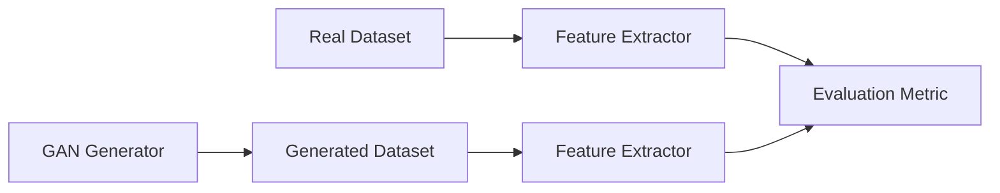

---

# ⚠ GAN Limitations

GANs have several important limitations.

### 1. Training Instability

GAN optimization can be difficult.

### 2. Mode Collapse

The Generator may produce insufficiently diverse outputs.

### 3. Hyperparameter Sensitivity

Training can be sensitive to:

```text
Learning Rate
Batch Size
Optimizer
Architecture
Update Ratio
Regularization
```

### 4. Evaluation Difficulty

High-quality generated samples do not guarantee good distribution coverage.

### 5. Computational Cost

Training high-resolution GANs can require significant GPU resources.

### 6. Data Privacy Risk

Generated samples may reproduce characteristics of training data.

### 7. Bias

The Generator can reproduce or amplify biases present in training data.

---

# ⚠ GAN Security Considerations

Generative models introduce additional security concerns.

Consider:

```text
Training Data Leakage
Synthetic PII
Model Extraction
Adversarial Manipulation
Deepfake Generation
Abuse of Generated Content
```

Enterprise deployments should include appropriate:

```text
Access Control
Content Policies
Monitoring
Auditing
Data Governance
```

---

# 🧠 GAN Hyperparameters

Important hyperparameters include:

```text
Generator Learning Rate
Discriminator Learning Rate
Batch Size
Latent Dimension
Optimizer
Training Steps
Generator/Discriminator Update Ratio
Regularization
```

---

# 🧠 Optimizer Choices

GAN implementations commonly use optimizers such as:

```text
Adam
RMSprop
SGD
```

The correct optimizer and settings depend on the GAN architecture.

---

# 🧠 GAN Architecture Design

A practical GAN design process can be:

```text
Define Data
    ↓
Choose Generator Architecture
    ↓
Choose Discriminator Architecture
    ↓
Choose Loss
    ↓
Choose Optimizer
    ↓
Train
    ↓
Evaluate
    ↓
Tune
```

---

# 🧠 Basic GAN with TensorFlow / Keras

A simplified Generator:

```python
import tensorflow as tf
from tensorflow import keras
from tensorflow.keras import layers


generator = keras.Sequential([
    layers.Input(shape=(100,)),

    layers.Dense(
        7 * 7 * 128,
        use_bias=False
    ),

    layers.BatchNormalization(),
    layers.ReLU(),

    layers.Reshape(
        (7, 7, 128)
    ),

    layers.Conv2DTranspose(
        64,
        kernel_size=4,
        strides=2,
        padding="same",
        use_bias=False
    ),

    layers.BatchNormalization(),
    layers.ReLU(),

    layers.Conv2DTranspose(
        1,
        kernel_size=4,
        strides=2,
        padding="same",
        activation="tanh"
    )
])
```

---

# 🧠 Keras Discriminator

```python
discriminator = keras.Sequential([
    layers.Input(shape=(28, 28, 1)),

    layers.Conv2D(
        64,
        kernel_size=4,
        strides=2,
        padding="same"
    ),

    layers.LeakyReLU(0.2),

    layers.Conv2D(
        128,
        kernel_size=4,
        strides=2,
        padding="same"
    ),

    layers.LeakyReLU(0.2),

    layers.Flatten(),

    layers.Dense(1)
])
```

---

# 🧠 PyTorch Generator

```python
import torch
import torch.nn as nn


class Generator(nn.Module):

    def __init__(self, latent_dim=100):

        super().__init__()

        self.model = nn.Sequential(

            nn.Linear(
                latent_dim,
                128 * 7 * 7
            ),

            nn.BatchNorm1d(
                128 * 7 * 7
            ),

            nn.ReLU(True),

            nn.Unflatten(
                1,
                (128, 7, 7)
            ),

            nn.ConvTranspose2d(
                128,
                64,
                kernel_size=4,
                stride=2,
                padding=1
            ),

            nn.BatchNorm2d(64),

            nn.ReLU(True),

            nn.ConvTranspose2d(
                64,
                1,
                kernel_size=4,
                stride=2,
                padding=1
            ),

            nn.Tanh()
        )

    def forward(self, z):

        return self.model(z)
```

---

# 🧠 PyTorch Discriminator

```python
class Discriminator(nn.Module):

    def __init__(self):

        super().__init__()

        self.model = nn.Sequential(

            nn.Conv2d(
                1,
                64,
                kernel_size=4,
                stride=2,
                padding=1
            ),

            nn.LeakyReLU(
                0.2,
                inplace=True
            ),

            nn.Conv2d(
                64,
                128,
                kernel_size=4,
                stride=2,
                padding=1
            ),

            nn.BatchNorm2d(128),

            nn.LeakyReLU(
                0.2,
                inplace=True
            ),

            nn.Flatten(),

            nn.Linear(
                128 * 7 * 7,
                1
            )
        ]

    def forward(self, x):

        return self.model(x)
```

---

# 🧠 GAN Training Pseudocode

```python
for real_images in dataset:

    # -------------------------
    # Train Discriminator
    # -------------------------

    noise = sample_noise()

    fake_images = generator(noise)

    real_output = discriminator(
        real_images
    )

    fake_output = discriminator(
        fake_images.detach()
    )

    discriminator_loss = (
        real_loss(real_output)
        +
        fake_loss(fake_output)
    )

    discriminator_optimizer.zero_grad()

    discriminator_loss.backward()

    discriminator_optimizer.step()


    # -------------------------
    # Train Generator
    # -------------------------

    noise = sample_noise()

    fake_images = generator(noise)

    fake_output = discriminator(
        fake_images
    )

    generator_loss = generator_loss_fn(
        fake_output
    )

    generator_optimizer.zero_grad()

    generator_loss.backward()

    generator_optimizer.step()
```

---

# 🧠 Important Implementation Detail

When training the Discriminator, the generated samples are often detached:

```python
fake_images.detach()
```

This prevents the Discriminator update from propagating gradients into the Generator during that step.

The Generator is then updated separately.

---

# 🧠 GAN Training Workflow

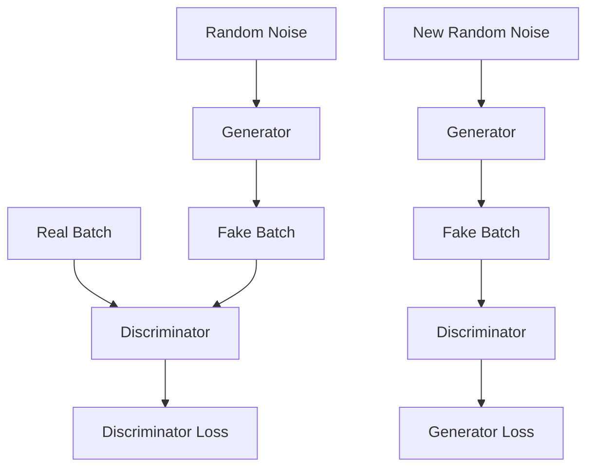

---

# 🧪 Practical Exercise 1 — MNIST GAN

Train a basic GAN to generate handwritten digits.

Pipeline:

```text
MNIST
 ↓
Generator
+
Discriminator
 ↓
Generated Digits
```

Monitor generated samples every few epochs.

---

# 🧪 Practical Exercise 2 — Conditional GAN

Modify the GAN to accept:

```text
Digit Label
```

and generate a requested digit.

Example:

```text
Condition = 7
```

should generate:

```text
7
```

---

# 🧪 Practical Exercise 3 — DCGAN

Implement a convolutional GAN using:

```text
Conv2D
Conv2DTranspose
Batch Normalization
LeakyReLU
```

Compare the image quality with a dense GAN.

---

# 🧪 Practical Exercise 4 — Mode Collapse Detection

Generate a large batch of samples.

Measure:

```text
Sample Diversity
Feature Similarity
Distribution Coverage
```

Look for repeated or highly similar outputs.

---

# 🧪 Practical Exercise 5 — Image-to-Image Translation

Experiment with a CycleGAN-style architecture.

Example:

```text
Domain A
 ↓
Domain B
```

and:

```text
Domain B
 ↓
Domain A
```

Measure:

```text
Visual Quality
Cycle Consistency
Domain Accuracy
```

---

# 🧪 Practical Exercise 6 — Synthetic Data

Train a GAN on a tabular dataset.

Generate synthetic records.

Evaluate:

```text
Statistical Similarity
Feature Correlation
Privacy Risk
Downstream Model Performance
```

---

# 🧪 Practical Exercise 7 — GAN vs VAE

Train:

```text
GAN
```

and:

```text
VAE
```

on the same dataset.

Compare:

```text
Sample Quality
Diversity
Training Stability
Latent Representation
Inference Cost
```

---

# 🧪 Practical Exercise 8 — GAN Evaluation

Generate a test dataset.

Calculate:

```text
FID
Precision
Recall
Sample Diversity
```

Also perform human inspection.

---

# 🧪 Practical Exercise 9 — Production Synthetic Data Pipeline

Build:

```text
Real Dataset
      ↓
Data Validation
      ↓
GAN Training
      ↓
Generator Registry
      ↓
Synthetic Data Generation
      ↓
Quality Validation
      ↓
Privacy Validation
      ↓
Approved Dataset
```

---

# 🧠 Interview Questions

## Beginner

### 1. What is a GAN?

A GAN is a generative architecture containing a Generator and Discriminator that learn through adversarial competition.

### 2. What does the Generator do?

The Generator produces synthetic samples from latent noise.

### 3. What does the Discriminator do?

The Discriminator attempts to distinguish real samples from generated samples.

### 4. What is the input to the Generator?

Typically a random latent vector.

### 5. What is the output of the Generator?

A synthetic sample such as an image, signal, or other data representation.

### 6. Why is GAN training called adversarial?

Because the Generator and Discriminator have competing objectives.

---

## Intermediate

### 7. What is mode collapse?

Mode collapse occurs when a Generator produces limited varieties of samples instead of covering the diversity of the target distribution.

### 8. Why are GANs difficult to train?

Because two neural networks are optimized simultaneously with competing objectives, making the optimization dynamics unstable.

### 9. What is a DCGAN?

A GAN that uses convolutional architectures designed for image generation and discrimination.

### 10. What is a Conditional GAN?

A GAN whose generation process is conditioned on additional information such as a class label.

### 11. What is WGAN?

A GAN variant that uses a Wasserstein-based objective and a critic to improve training behavior.

### 12. What is CycleGAN?

A GAN architecture designed for image-to-image translation between domains without requiring paired training examples.

---

## Advanced

### 13. Why can the Discriminator becoming too strong be problematic?

If the Discriminator becomes nearly perfect too early, the Generator may receive weak or unhelpful gradients.

### 14. Why doesn't GAN loss alone provide a complete evaluation?

GAN loss does not directly measure sample diversity, perceptual quality, or distribution coverage.

### 15. How can mode collapse be detected?

It can be investigated using sample diversity, feature-space analysis, distributional metrics, and repeated-generation analysis.

### 16. What is the difference between a GAN Generator and an Autoencoder Decoder?

A GAN Generator learns to produce samples that resemble the data distribution through adversarial training, while an Autoencoder Decoder reconstructs an input from its encoded representation.

### 17. Why can GAN-generated data be risky in enterprise environments?

Generated data may contain bias, reproduce sensitive patterns, introduce privacy risks, or be unsuitable for the intended downstream task.

### 18. What is the role of the latent vector?

It provides a compact random input from which the Generator creates different synthetic samples.

### 19. What is the difference between a Discriminator and a WGAN Critic?

A traditional Discriminator commonly outputs a real/fake probability, while the WGAN critic outputs a scalar score used by the Wasserstein objective.

### 20. Why should synthetic data be validated before production use?

Because visual or statistical similarity alone does not guarantee privacy, fairness, downstream usefulness, or correctness.

---

# 🏢 Enterprise Perspective

GANs demonstrate an important principle in Deep Learning:

> **Generative models do not necessarily need explicit labels for every generated sample.**

Instead, the Generator learns from feedback produced by another neural network.

This makes GANs particularly interesting for:

```text
Synthetic Data
Data Augmentation
Simulation
Image Generation
Image Transformation
Rare Event Generation
```

However, enterprise adoption requires much more than generating visually realistic samples.

A production system must consider:

```text
Data Governance
+
Privacy
+
Bias
+
Security
+
Model Quality
+
Evaluation
+
Monitoring
+
Versioning
+
Reproducibility
```

---

# 🏢 Production GAN Architecture

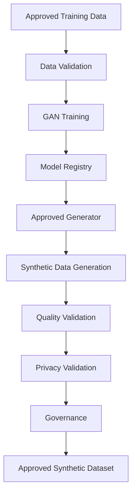

---

# 🏢 Synthetic Data Governance

Before synthetic data enters an enterprise workflow, validate:

```text
Statistical Similarity
Distribution Coverage
Privacy
PII Leakage
Bias
Fairness
Downstream Utility
Data Quality
```

---

# 🏢 Model Lifecycle

A production GAN lifecycle can be:

```text
Data Collection
      ↓
Data Validation
      ↓
GAN Training
      ↓
Evaluation
      ↓
Privacy Testing
      ↓
Model Registration
      ↓
Deployment
      ↓
Synthetic Data Generation
      ↓
Quality Monitoring
      ↓
Retraining
```

---

# 🏢 Monitoring GAN Systems

Useful monitoring dimensions include:

```text
Generation Latency
GPU Utilization
Throughput
Sample Quality
Diversity
Distribution Drift
Privacy Indicators
Failure Rate
Model Version
```

---

# 🏢 Model Versioning

Every generated dataset should be traceable to:

```text
Generator Version
Training Dataset Version
Configuration
Hyperparameters
Random Seed
Generation Timestamp
Validation Results
```

This is especially important for regulated enterprise environments.

---

# 🏢 Cloud Deployment

GAN workloads can be deployed using:

```text
GPU Training Clusters
Managed ML Platforms
Kubernetes
Containerized Model Services
Batch Generation Pipelines
```

Training and inference often have different infrastructure requirements.

---

# 🏢 Training vs Inference

### Training

```text
Large Dataset
      ↓
GPU Cluster
      ↓
Long-Running Training
      ↓
Generator Model
```

### Inference

```text
Latent Vector
      ↓
Generator
      ↓
Synthetic Sample
```

Inference can be substantially cheaper than training once the Generator is deployed.

---

# 🧠 GAN System Design

When designing a GAN-based production system, ask:

```text
What data should be generated?
        ↓
Why generate it?
        ↓
How will quality be measured?
        ↓
How will diversity be measured?
        ↓
How will privacy be validated?
        ↓
How will generated data be consumed?
        ↓
How will the Generator be versioned?
        ↓
How will drift be detected?
```

---

# 🧠 When Should You Use a GAN?

GANs can be useful when:

```text
High-Quality Synthetic Samples
+
Complex Data Distribution
+
Generation Is Valuable
+
Adversarial Training Is Appropriate
```

Examples:

```text
Image Synthesis
Image Translation
Synthetic Data
Data Augmentation
Super-Resolution
```

---

# 🧠 When Might You Avoid a GAN?

Consider alternatives when:

```text
Training Stability Is Critical
+
Distribution Coverage Is More Important
+
Simple Reconstruction Is Enough
+
Modern Diffusion Models Better Fit the Problem
```

The choice should depend on:

```text
Quality
Diversity
Latency
Cost
Training Complexity
Data Type
Business Requirements
```

---

!!! tip "Production Insight"

    **A GAN should not be evaluated only by whether its generated samples look realistic.**

    A production-grade generative system must answer:

    ```text
    Are the samples diverse?
    Are they statistically representative?
    Are they useful for the downstream task?
    Do they leak sensitive information?
    Are they biased?
    Can generation be reproduced?
    Can the model be monitored?
    ```

    For enterprise AI, the Generator is only one component of the system.

    ```text
    Generator
        ↓
    Synthetic Data
        ↓
    Quality Validation
        ↓
    Privacy Validation
        ↓
    Governance
        ↓
    Business Consumption
    ```

    This distinction is critical when moving from generative AI experiments to production systems.

---

# 📌 Key Takeaways

- GANs are generative models composed primarily of a Generator and Discriminator.
- The Generator creates synthetic samples from latent noise.
- The Discriminator attempts to distinguish real samples from generated samples.
- GAN training is adversarial because the two networks have competing objectives.
- The Generator learns to produce samples that increasingly resemble the target distribution.
- GANs use a minimax-style adversarial objective in their original formulation.
- Practical GAN implementations often use a non-saturating Generator loss.
- GAN training can be difficult because the optimization involves two competing models.
- Mode collapse occurs when the Generator produces insufficiently diverse samples.
- DCGANs use convolutional architectures for image generation.
- Conditional GANs allow generation to be controlled using additional information.
- WGANs use a Wasserstein-based formulation designed to improve training behavior.
- CycleGAN supports unpaired image-to-image translation.
- StyleGAN introduced powerful style-based approaches to image generation and latent-space control.
- GANs have applications in image generation, translation, super-resolution, augmentation, and synthetic data.
- Synthetic data must be validated for quality, diversity, privacy, bias, and downstream usefulness.
- GAN evaluation should consider more than training loss.
- Metrics such as FID can help evaluate generated image distributions, but no single metric captures every aspect of quality.
- GANs can require significant computational resources for training.
- Enterprise GAN systems require governance, monitoring, model versioning, privacy controls, and reproducibility.
- GANs remain an important foundation for understanding modern generative modeling even as other approaches, including diffusion models, have become highly influential.

---

# 📚 Further Reading

Continue with:

- **[31. Diffusion Models](31-diffusion-models.md)**
- **[32. Reinforcement Learning Fundamentals](32-reinforcement-learning-fundamentals.md)**
- **[33. Markov Decision Processes and Q-Learning](33-markov-decision-processes-and-q-learning.md)**
- **[35. GPU Accelerated Deep Learning](35-gpu-accelerated-deep-learning.md)**
- **[36. Deep Learning Training and Model Lifecycle](36-deep-learning-training-and-model-lifecycle.md)**
- **[37. Building Production Deep Learning Systems](37-building-production-deep-learning-systems.md)**

---

## ➡️ Next Chapter

**[31. Diffusion Models](31-diffusion-models.md)**

---

> **Enterprise AI Engineering Handbook**  
> *Building Production-Grade Enterprise AI Systems — One Chapter at a Time.*