# 31. Diffusion Models

> Understand how Diffusion Models learn to generate high-quality data by gradually adding noise to training samples and learning to reverse that process, and explore the forward diffusion process, reverse denoising process, U-Net architecture, conditioning, latent diffusion, Stable Diffusion concepts, training objectives, sampling, applications, limitations, and production considerations.

---

## 🎯 Learning Objectives

After completing this chapter, you will be able to:

- Explain what Diffusion Models are
- Understand the basic idea behind diffusion-based generative modeling
- Explain the forward diffusion process
- Understand how Gaussian noise is progressively added to data
- Explain the reverse denoising process
- Understand the role of the neural network denoiser
- Understand the mathematical formulation of diffusion
- Explain noise schedules
- Understand the role of timesteps
- Explain the training objective
- Understand how a model predicts noise
- Understand the sampling process
- Explain DDPMs at a conceptual and mathematical level
- Understand DDIM sampling
- Understand classifier guidance
- Understand classifier-free guidance
- Understand conditional diffusion
- Understand U-Net architecture in diffusion models
- Understand cross-attention in conditional generation
- Understand latent diffusion
- Understand Stable Diffusion at a conceptual level
- Understand text-to-image generation
- Understand image-to-image generation
- Understand inpainting
- Compare Diffusion Models with GANs and VAEs
- Understand the advantages and limitations of Diffusion Models
- Implement a basic diffusion model using TensorFlow/Keras or PyTorch
- Understand diffusion model evaluation
- Understand production deployment considerations
- Understand GPU and inference optimization
- Understand the role of Diffusion Models in modern Generative AI

---

# 📖 Overview

Generative models attempt to learn the underlying distribution of data and generate new samples that resemble the training distribution.

Earlier approaches include:

```text
Autoencoders
GANs
VAEs
```

Diffusion Models introduced a different approach.

Instead of directly learning:

```text
Random Noise
      ↓
Generated Data
```

a Diffusion Model learns how to reverse a controlled noise-adding process:

```text
Clean Data
    ↓
Add Noise
    ↓
More Noise
    ↓
More Noise
    ↓
Almost Pure Noise
```

Then the model learns the reverse:

```text
Pure Noise
    ↓
Remove Noise
    ↓
Remove Noise
    ↓
Remove Noise
    ↓
Generated Data
```

This iterative denoising process is the foundation of modern diffusion-based generation.

---

# 🧠 What is a Diffusion Model?

A Diffusion Model is a generative model that learns to generate data by reversing a gradual corruption process.

The high-level idea is:

```text
Training:

Real Data
   ↓
Noise Addition
   ↓
Noisy Data
   ↓
Learn Denoising Process
```

During generation:

```text
Random Noise
   ↓
Denoising Step
   ↓
Denoising Step
   ↓
Denoising Step
   ↓
Generated Sample
```

---

# 🧠 Core Idea

A diffusion model contains two conceptual processes:

```text
Forward Diffusion
+
Reverse Diffusion
```

### Forward Process

Gradually adds noise.

```text
x₀ → x₁ → x₂ → ... → xₜ
```

### Reverse Process

Learns to remove noise.

```text
xₜ → xₜ₋₁ → xₜ₋₂ → ... → x₀
```

---

# 🧠 Diffusion Process

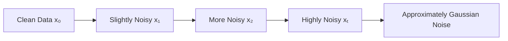

The reverse process attempts to learn:

```text
Noise
 ↓
Less Noise
 ↓
Less Noise
 ↓
Clean Data
```

---

# 🧠 Why Add Noise?

The forward process provides a controlled way to transform complex data into a simple distribution.

For example:

```text
Complex Image Distribution
          ↓
       Add Noise
          ↓
      Gaussian Noise
```

The model can then learn the reverse transformation.

This converts generation into a sequence of manageable denoising steps.

---

# 🧠 Forward Diffusion Process

Let:

```text
x₀ = Original Data
xₜ = Noisy Version at Time t
```

At each timestep, additional Gaussian noise is introduced.

A common formulation is:

\[
q(x_t|x_{t-1})=
\mathcal{N}
\left(
x_t;
\sqrt{1-\beta_t}x_{t-1},
\beta_t I
\right)
\]

where:

```text
βₜ = Noise Schedule
t = Diffusion Timestep
I = Identity Matrix
```

---

# 🧠 Noise Schedule

The noise schedule determines how much noise is added at each timestep.

Conceptually:

```text
β₁
β₂
β₃
...
βₜ
```

A simple schedule may gradually increase noise:

```text
Low Noise
   ↓
Medium Noise
   ↓
High Noise
```

---

# 🧠 Noise Schedule

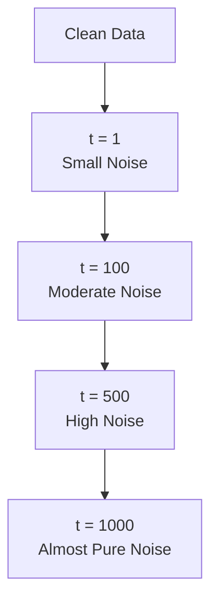

---

# 🧠 Forward Process Intuition

Imagine gradually adding static to an image.

```text
Original
████████████████

Small Noise
████░███████████

More Noise
██░█░████░██░███

High Noise
░██░░█░░██░░░█░█

Pure Noise
░░█░░░██░░█░░░░█
```

The exact visual progression depends on the noise schedule.

---

# 🧠 Closed-Form Noising

One important property of the diffusion process is that we can directly sample a noisy version at timestep `t` without applying every previous noise step.

A common formulation is:

\[
x_t=
\sqrt{\bar{\alpha}_t}x_0+
\sqrt{1-\bar{\alpha}_t}\epsilon
\]

where:

\[
\epsilon\sim\mathcal{N}(0,I)
\]

and:

\[
\alpha_t=1-\beta_t
\]

\[
\bar{\alpha}_t=\prod_{s=1}^{t}\alpha_s
\]

This formulation is central to efficient diffusion-model training.

---

# 🧠 Forward Diffusion Intuition

The equation can be interpreted as:

```text
Noisy Sample
=
Clean Signal
+
Gaussian Noise
```

with the contribution of each controlled by the timestep.

At small `t`:

```text
More Original Signal
+
Less Noise
```

At large `t`:

```text
Less Original Signal
+
More Noise
```

---

# 🧠 Reverse Diffusion

The reverse process attempts to recover:

```text
xₜ
 ↓
xₜ₋₁
 ↓
xₜ₋₂
 ↓
...
 ↓
x₀
```

The neural network learns how to estimate the information needed to perform each denoising step.

---

# 🧠 Reverse Diffusion Architecture

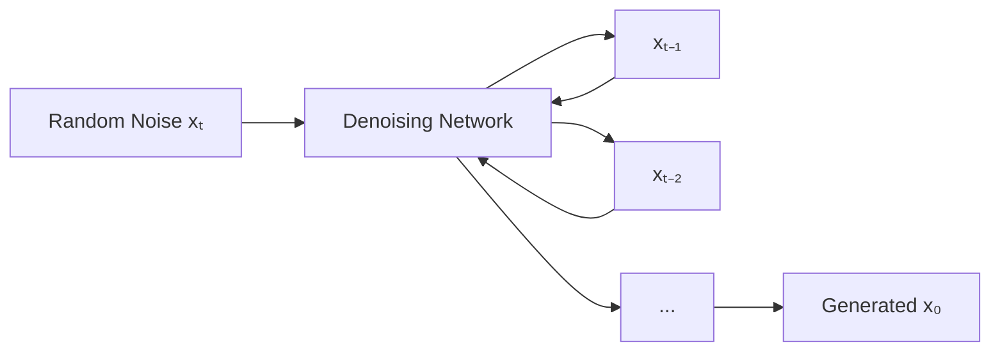

The same trained denoising network is generally reused across many timesteps, with the timestep provided as an input.

---

# 🧠 Denoising Network

The denoising network receives:

```text
Noisy Sample
+
Timestep
+
Optional Conditioning
```

and predicts information needed to remove noise.

Conceptually:

```text
xₜ
+
t
+
Condition
 ↓
Denoising Network
 ↓
Predicted Noise
```

---

# 🧠 Noise Prediction

Many DDPM-style models are trained to predict the noise that was added to the original sample.

The model can be represented as:

\[
\epsilon_\theta(x_t,t)
\]


where:

```text
xₜ = Noisy Sample
t = Timestep
θ = Model Parameters
εθ = Predicted Noise
```

---

# 🧠 Training Objective

A common diffusion training objective minimizes the difference between:

```text
Actual Noise
```

and:

```text
Predicted Noise
```

The simplified objective is:

\[
L=
\mathbb{E}_{x_0,\epsilon,t}
\left[
\|\epsilon-\epsilon_\theta(x_t,t)\|^2
\right]
\]


This is commonly implemented as a Mean Squared Error objective.

---

# 🧠 Training Process

Training can be summarized as:

```text
1. Select Real Sample
2. Select Random Timestep
3. Sample Gaussian Noise
4. Create Noisy Sample
5. Predict Noise
6. Compare Predicted vs Actual Noise
7. Calculate Loss
8. Backpropagate
9. Update Model
```

---

# 🧠 Diffusion Training Flow

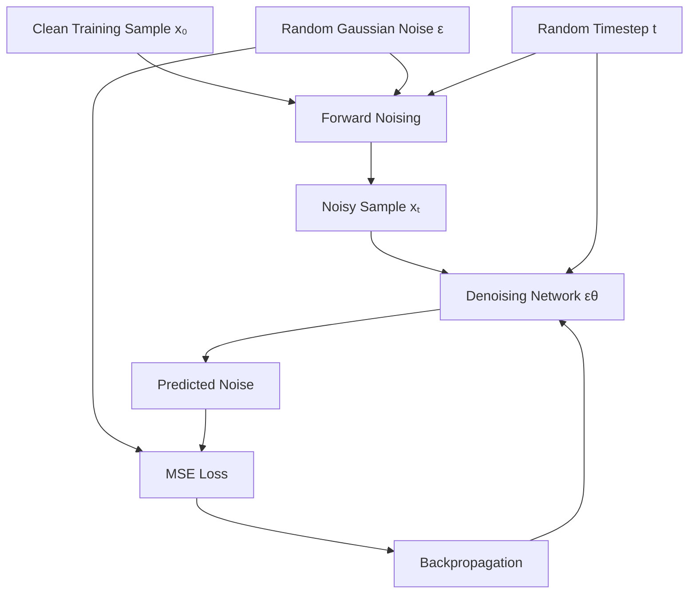

---

# 🧠 Why Randomize the Timestep?

The model needs to learn denoising at different noise levels.

Therefore, training samples can be corrupted at different timesteps:

```text
Low Noise
Medium Noise
High Noise
Very High Noise
```

The model learns a general denoising function rather than a single fixed denoising operation.

---

# 🧠 Timestep Embedding

The model needs information about how noisy the current input is.

Therefore the timestep `t` is transformed into an embedding.

```text
timestep
   ↓
Embedding
   ↓
Neural Network
```

---

# 🧠 Timestep Conditioning

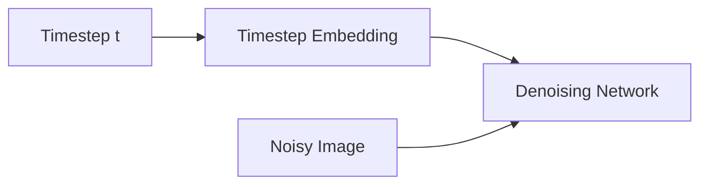

The same image architecture can therefore behave differently depending on the current denoising timestep.

---

# 🧠 Why U-Net?

For image diffusion, U-Net architectures are commonly used because they combine:

```text
Downsampling
+
Feature Extraction
+
Upsampling
+
Skip Connections
```

This allows the model to capture both:

```text
Global Context
+
Fine Spatial Details
```

---

# 🧠 U-Net Architecture

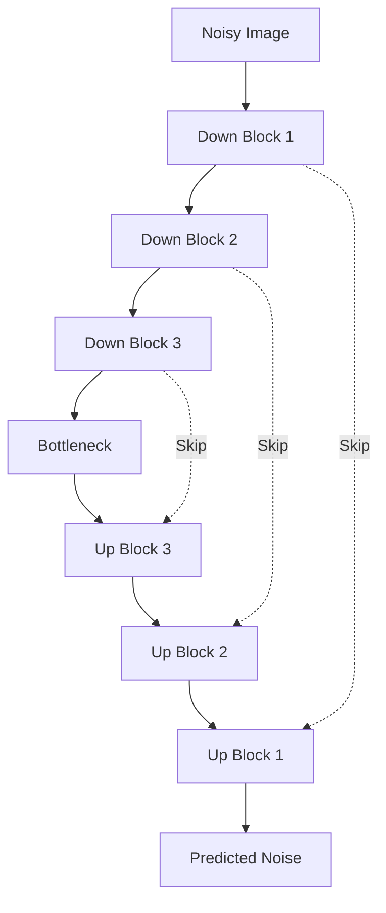

---

# 🧠 Skip Connections

Skip connections transfer information from earlier layers to later layers.

```text
Encoder Feature
      │
      └──────────────► Decoder
```

They help preserve spatial details that may otherwise be lost during downsampling.

---

# 🧠 Conditional Diffusion

A diffusion model can be conditioned on additional information.

For example:

```text
Random Noise
+
Text Prompt
      ↓
Diffusion Model
      ↓
Generated Image
```

Other conditioning signals can include:

```text
Class Label
Image
Segmentation Map
Depth Map
Pose
Reference Image
Audio
```

---

# 🧠 Text-to-Image Diffusion

A text-to-image system can conceptually work as:

```text
Text Prompt
     ↓
Text Encoder
     ↓
Text Embeddings
     ↓
Cross-Attention
     ↓
Diffusion Model
     ↓
Image
```

---

# 🧠 Cross-Attention

Cross-attention allows the denoising network to use information from another representation, such as text embeddings.

Conceptually:

```text
Image Features
      +
Text Embeddings
      ↓
Cross-Attention
      ↓
Conditioned Image Features
```

---

# 🧠 Conditional Diffusion Architecture

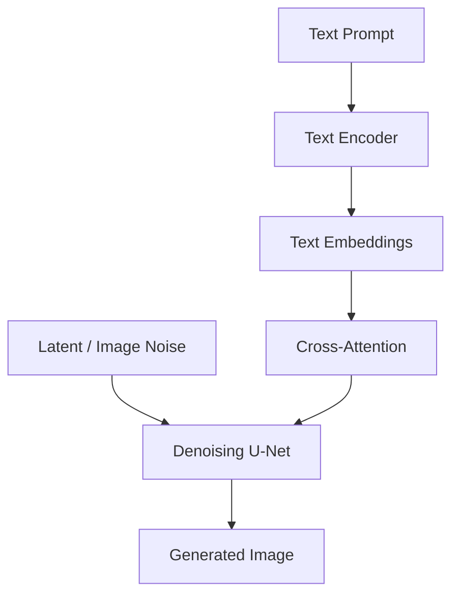

---

# 🧠 Classifier Guidance

Classifier guidance uses a separate classifier to influence the generation process.

Conceptually:

```text
Diffusion Model
      +
Classifier
      ↓
Guided Generation
```

The classifier provides information about the desired class or condition.

---

# 🧠 Classifier-Free Guidance

Classifier-free guidance avoids requiring a separate classifier.

Instead, the diffusion model is trained with conditional and sometimes unconditional inputs.

During sampling, the two predictions can be combined.

A common formulation is:

\[
\epsilon_{guided}
=
\epsilon_{uncond}
+
s
\left(
\epsilon_{cond}
-
\epsilon_{uncond}
\right)
\]


where:

```text
εuncond = Unconditional Prediction
εcond = Conditional Prediction
s = Guidance Scale
```

---

# 🧠 Guidance Scale

Guidance scale controls how strongly the generated output follows the condition.

Conceptually:

```text
Low Guidance
    ↓
More Freedom
Less Strict Conditioning

High Guidance
    ↓
Stronger Conditioning
Potentially Reduced Diversity / Artifacts
```

The optimal value depends on the model and task.

---

# 🧠 Sampling

Once the diffusion model is trained, generation starts from random noise.

```text
Random Noise
      ↓
Denoising Step
      ↓
Denoising Step
      ↓
Denoising Step
      ↓
...
      ↓
Generated Sample
```

---

# 🧠 Diffusion Sampling Process

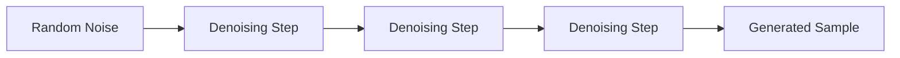

---

# 🧠 Why Sampling Can Be Expensive

A traditional diffusion model may require many denoising steps.

For example:

```text
1000
 ↓
999
 ↓
998
 ↓
...
 ↓
1
 ↓
0
```

Each step requires neural-network inference.

Therefore:

```text
More Steps
   ↓
Higher Compute Cost
   ↓
Higher Latency
```

This led to research into faster sampling methods.

---

# 🧠 DDPM

DDPM stands for:

> **Denoising Diffusion Probabilistic Model**

DDPMs established a widely used framework for training diffusion models using a forward noise process and learned reverse denoising process.

---

# 🧠 DDPM Conceptual Architecture

```text
Training:

x₀
 ↓
Forward Diffusion
 ↓
xₜ
 ↓
Predict Noise
 ↓
Loss

Generation:

Random Noise
 ↓
Reverse Diffusion
 ↓
Generated Sample
```

---

# 🧠 DDIM

DDIM stands for:

> **Denoising Diffusion Implicit Models**

DDIM provides an alternative sampling procedure that can generate samples using fewer steps in many cases.

Conceptually:

```text
DDPM
 ↓
Many Sampling Steps
```

versus:

```text
DDIM
 ↓
Reduced Sampling Steps
```

This can improve inference speed.

---

# 🧠 DDPM vs DDIM

| DDPM | DDIM |
|---|---|
| Probabilistic sampling process | Alternative implicit sampling process |
| Often requires many steps | Can use fewer steps |
| Strong baseline | Faster sampling in many cases |
| Stochastic generation | Can support deterministic sampling under certain settings |

---

# 🧠 Sampling Quality vs Speed

There is often a trade-off:

```text
More Steps
   ↓
Potentially Better Quality
   ↓
Higher Latency
```

versus:

```text
Fewer Steps
   ↓
Faster Generation
   ↓
Potential Quality Trade-Off
```

Modern samplers attempt to improve this trade-off.

---

# 🧠 Latent Diffusion

Diffusion does not always have to operate directly in pixel space.

Latent Diffusion performs the diffusion process in a compressed latent representation.

```text
Image
 ↓
Encoder
 ↓
Latent Representation
 ↓
Diffusion
 ↓
Latent Representation
 ↓
Decoder
 ↓
Image
```

---

# 🧠 Why Latent Diffusion?

Pixel-space diffusion can be computationally expensive, especially for high-resolution images.

Latent diffusion reduces the dimensionality before running the expensive denoising process.

```text
Pixel Space
Large
 ↓
Encoder
 ↓
Latent Space
Smaller
 ↓
Diffusion
 ↓
Decoder
 ↓
Pixel Space
```

---

# 🧠 Latent Diffusion Architecture

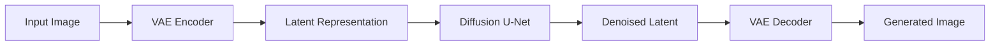

---

# 🧠 Stable Diffusion Concept

Stable Diffusion popularized latent diffusion for text-to-image generation.

At a high level:

```text
Text Prompt
     ↓
Text Encoder
     ↓
Text Embeddings
     ↓
Latent Diffusion
     ↓
Denoised Latent
     ↓
VAE Decoder
     ↓
Image
```

---

# 🧠 Stable Diffusion Architecture

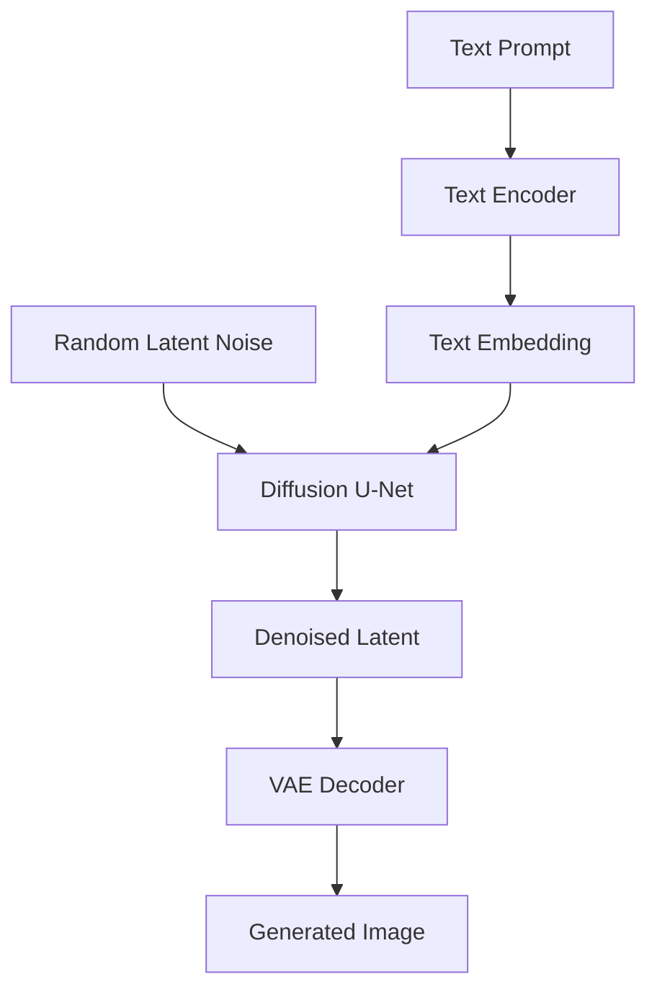

---

# 🧠 VAE and Diffusion

In latent diffusion systems, the VAE typically performs:

```text
Image
 ↓
Encode
 ↓
Latent
```

and:

```text
Latent
 ↓
Decode
 ↓
Image
```

The diffusion model operates primarily in this latent space.

---

# 🧠 Text-to-Image Generation Pipeline

```text
Prompt
  ↓
Text Tokenization
  ↓
Text Encoder
  ↓
Text Embeddings
  ↓
Random Latent
  ↓
Diffusion U-Net
  ↓
Denoising Steps
  ↓
Denoised Latent
  ↓
VAE Decoder
  ↓
Image
```

---

# 🎨 Text-to-Image Example

Conceptually:

```text
Prompt:

"A futuristic city at sunset"

        ↓

Text Encoder

        ↓

Semantic Representation

        ↓

Diffusion Model

        ↓

Denoising

        ↓

Generated Image
```

---

# 🎨 Image-to-Image Generation

Diffusion models can also transform existing images.

```text
Input Image
     ↓
Encode
     ↓
Add Controlled Noise
     ↓
Denoising
     ↓
Condition
     ↓
Generated Image
```

The amount of noise controls how strongly the model can alter the original image.

---

# 🎨 Image-to-Image Pipeline

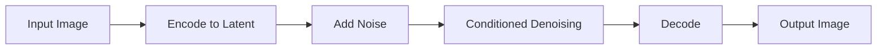

---

# 🎨 Inpainting

Inpainting generates or modifies selected regions of an image.

Conceptually:

```text
Original Image
      +
Mask
      +
Prompt
      ↓
Diffusion Model
      ↓
Modified Region
```

---

# 🎨 Inpainting Architecture

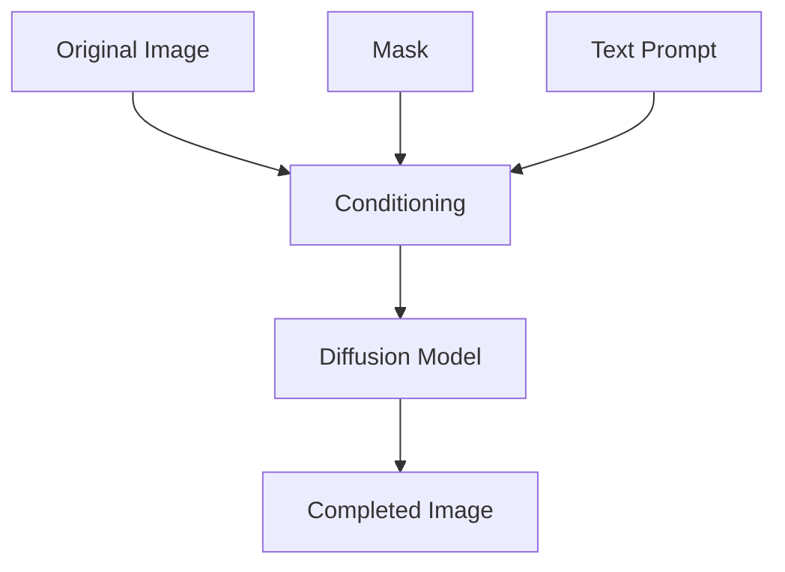

---

# 🧠 ControlNet Concept

ControlNet-style approaches allow diffusion models to use additional spatial conditioning.

Examples:

```text
Edge Map
Pose
Depth
Segmentation
Sketch
```

Conceptually:

```text
Text Prompt
+
Control Signal
+
Noise
 ↓
Diffusion Model
 ↓
Controlled Generation
```

---

# 🧠 Controlled Generation

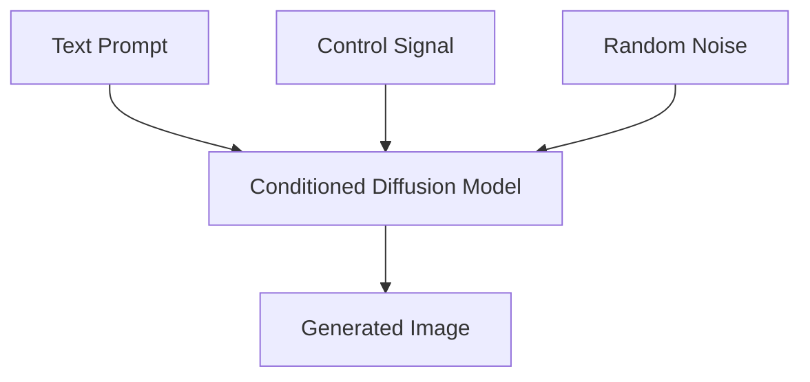

---

# 🧠 Diffusion for Other Modalities

Diffusion is not limited to images.

It can be applied to:

```text
Images
Audio
Video
3D Data
Molecular Structures
Time Series
Speech
Multimodal Data
```

The underlying idea remains:

```text
Add Noise
   ↓
Learn Reverse Process
   ↓
Generate Data
```

---

# 🎵 Audio Diffusion

Conceptually:

```text
Audio
 ↓
Noise Process
 ↓
Noisy Audio
 ↓
Denoising Model
 ↓
Generated Audio
```

Applications can include:

```text
Speech Generation
Music Generation
Sound Effects
Audio Restoration
```

---

# 🎬 Video Diffusion

Video generation extends diffusion into spatial and temporal dimensions.

```text
Frames
+
Temporal Relationships
      ↓
Diffusion Model
      ↓
Generated Video
```

The system must maintain:

```text
Spatial Consistency
+
Temporal Consistency
```

---

# 🧬 Molecular Generation

Diffusion approaches can also be applied to molecular structures.

Potential applications include:

```text
Molecule Generation
Drug Discovery
Protein Design
Chemical Structure Optimization
```

These applications require domain-specific constraints and validation.

---

# 🧠 Diffusion vs GAN

| Diffusion Model | GAN |
|---|---|
| Iterative denoising | Adversarial training |
| Forward noise process | No equivalent forward diffusion process |
| Reverse denoising model | Generator |
| No Discriminator required | Requires Discriminator |
| Generally stable training | Can be unstable |
| Sampling can be expensive | Sampling often faster |
| Strong diversity | Mode collapse can occur in GANs |
| Highly influential in modern generative AI | Historically important for image generation |

---

# 🧠 Diffusion vs VAE

| Diffusion Model | VAE |
|---|---|
| Iterative denoising | Encoder-decoder |
| Strong generation quality | Often smoother generations |
| Sampling can be expensive | Usually efficient sampling |
| Learns reverse noise process | Learns latent distribution |
| Can use rich conditioning | Latent-space modeling is explicit |

---

# 🧠 Diffusion vs Autoencoder

| Diffusion | Autoencoder |
|---|---|
| Generative sampling process | Reconstruction process |
| Starts from noise during generation | Starts from an input |
| Iterative denoising | Direct decoding |
| Can model complex distributions | Strong representation learning |
| Often computationally expensive | Usually simpler and faster |

---

# 🧠 Diffusion vs Transformer

Diffusion and Transformers are not necessarily competing concepts.

They can be combined.

For example:

```text
Transformer
   ↓
Conditioning Representation
   ↓
Diffusion Model
```

or transformer-based architectures can themselves be used for diffusion-style modeling.

---

# 🧠 Diffusion Model Evaluation

Evaluation depends heavily on the modality.

For image generation, common evaluation approaches include:

```text
FID
CLIP-based Metrics
Precision
Recall
Human Evaluation
Prompt Alignment
Image Quality
Diversity
```

---

# 🧠 Quality Dimensions

A good generated sample should ideally provide:

```text
Fidelity
+
Diversity
+
Condition Alignment
+
Semantic Correctness
```

For text-to-image systems:

```text
Prompt Alignment
```

is particularly important.

---

# 🧠 Diffusion Evaluation Pipeline

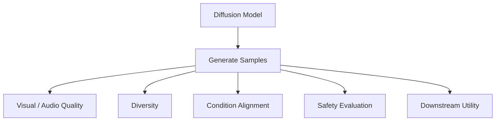

---

# ⚠ Diffusion Model Limitations

Diffusion Models are powerful but introduce important challenges.

### 1. Sampling Cost

Generation may require many neural-network evaluations.

### 2. GPU Requirements

Training large diffusion models can require substantial compute.

### 3. Memory Usage

High-resolution generation can consume significant GPU memory.

### 4. Model Size

Modern diffusion models can be large.

### 5. Dataset Requirements

Large-scale models often require substantial and carefully curated datasets.

### 6. Bias

The model can reproduce biases present in its training data.

### 7. Safety

Generated content can create misuse and content-safety concerns.

### 8. Copyright and Data Governance

Training data provenance and generated-content policies must be considered.

---

# ⚠ Common Diffusion Failure Modes

Potential problems include:

```text
Poor Prompt Alignment
Artifacts
Anatomical Errors
Repetition
Low Diversity
Oversmoothing
Overexposure
Unwanted Content
```

The exact failure modes depend on the model, conditioning mechanism, data, and sampling strategy.

---

# 🧠 Guidance and Quality Trade-Off

Increasing guidance can improve condition adherence but may also introduce:

```text
Artifacts
Reduced Diversity
Over-Saturated Outputs
```

Therefore:

```text
Guidance Scale
+
Sampling Steps
+
Sampler
```

must often be tuned together.

---

# 🧠 Important Diffusion Hyperparameters

Common inference parameters include:

```text
Sampling Steps
Guidance Scale
Random Seed
Resolution
Condition Strength
Scheduler
```

Training parameters include:

```text
Learning Rate
Batch Size
Noise Schedule
Model Architecture
Training Steps
Optimizer
Dataset
Precision
```

---

# 🧠 Random Seed

Diffusion generation usually begins with random noise.

Therefore changing the seed can produce different outputs.

```text
Prompt
+
Seed 1
 ↓
Image A

Prompt
+
Seed 2
 ↓
Image B
```

A fixed seed can help reproduce an experiment under the same configuration.

---

# 🧠 Reproducibility

Production experiments should track:

```text
Model Version
Checkpoint
Prompt
Negative Prompt
Seed
Sampler
Sampling Steps
Guidance Scale
Resolution
Software Version
Hardware
```

This makes generated results easier to reproduce and audit.

---

# 🧠 Mixed Precision

Diffusion inference can often benefit from reduced precision such as:

```text
FP32
 ↓
FP16 / BF16
```

Potential benefits include:

```text
Lower Memory Usage
Higher Throughput
Lower Latency
```

The actual benefit depends on hardware and implementation.

---

# 🧠 GPU Optimization

Production optimization may include:

```text
Mixed Precision
Batching
Model Compilation
Memory Efficient Attention
Efficient Samplers
Model Quantization
Model Offloading
Caching
```

Each optimization introduces trade-offs in quality, memory, latency, and engineering complexity.

---

# 🧠 Inference Pipeline

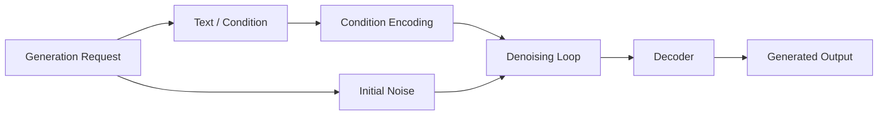

---

# 🏢 Production Diffusion Architecture

A production service may look like:

```text
Client
   ↓
API Gateway
   ↓
Generation Service
   ↓
Prompt / Condition Processor
   ↓
Model Orchestrator
   ↓
GPU Inference
   ↓
Safety / Validation
   ↓
Object Storage
   ↓
Response
```

---

# 🏢 Production Architecture

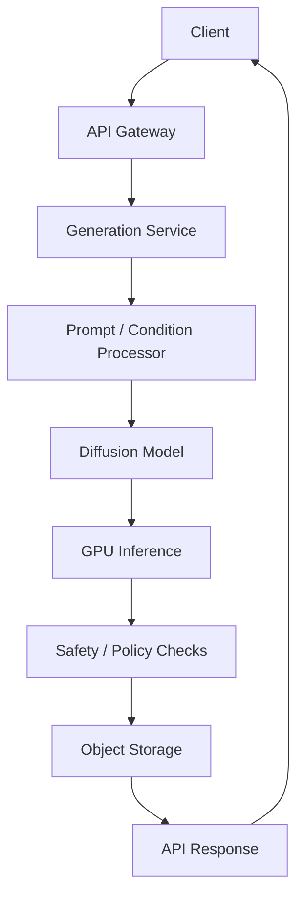

---

# 🏢 Asynchronous Generation

High-resolution generation can take time.

Therefore an asynchronous architecture may be preferable:

```text
Client
 ↓
POST /generation
 ↓
Job Queue
 ↓
GPU Worker
 ↓
Diffusion Inference
 ↓
Object Storage
 ↓
Notification
```

---

# 🏢 Asynchronous Architecture


---

# 🏢 Scaling Diffusion Inference

Scaling strategies include:

```text
Horizontal GPU Scaling
+
Queue-Based Work Distribution
+
Dynamic Worker Allocation
+
Model Replication
+
Request Batching
```

Important metrics include:

```text
GPU Utilization
Queue Depth
Generation Latency
Throughput
Memory Utilization
Failure Rate
Cost per Generation
```

---

# 🏢 Cost Optimization

Diffusion inference can be expensive.

Potential optimizations:

```text
Use Smaller Models
Reduce Resolution
Reduce Sampling Steps
Use Efficient Samplers
Use Quantization
Use Mixed Precision
Batch Requests
Scale GPU Workers Dynamically
Cache Reusable Components
```

The quality impact of each optimization should be measured.

---

# 🏢 Model Serving

Diffusion models can be exposed through:

```text
REST API
gRPC
Batch Processing
Managed ML Endpoint
Kubernetes Service
Serverless GPU Infrastructure
```

For large GPU workloads, asynchronous processing is often easier to scale than synchronous request handling.

---

# 🏢 Model Abstraction

An enterprise backend can hide the underlying diffusion implementation behind a capability interface.

```java
public interface ImageGenerationProvider {

    GenerationResult generate(
        GenerationRequest request
    );
}
```

The implementation could use:

```text
Local Diffusion Model
Cloud AI Service
Managed Model Endpoint
Specialized Inference Server
```

This prevents business services from becoming tightly coupled to a particular model implementation.

---

# 🏢 Spring Boot Integration

A Java backend can handle:

```text
Authentication
Authorization
Request Validation
Quota Management
Job Management
Audit Logging
Metadata
Storage
```

while GPU inference remains isolated in a model-serving layer.

```text
Spring Boot
    ↓
Generation API
    ↓
Generation Job
    ↓
Model Service
    ↓
GPU
```

---

# 🏢 Enterprise AI Architecture

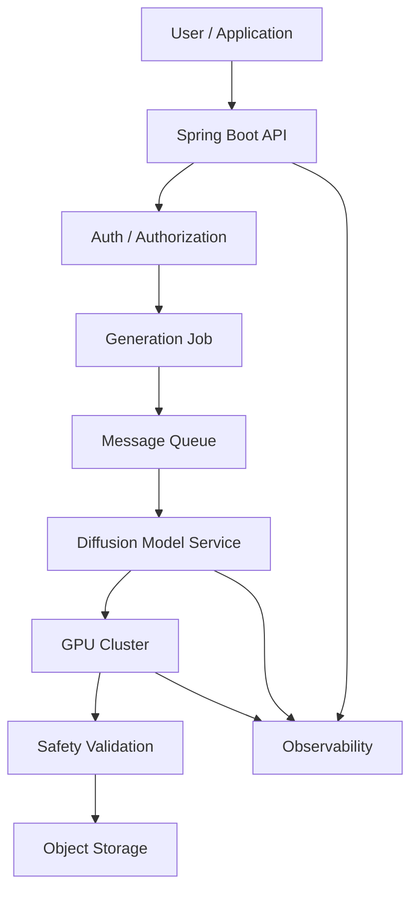

---

# 🏢 Observability

A production diffusion service should monitor:

```text
Request Rate
Latency
Queue Depth
GPU Utilization
GPU Memory
Generation Failures
Model Version
Sampling Configuration
Cost
Safety Violations
```

---

# 🏢 Model Lifecycle

```text
Dataset
   ↓
Training
   ↓
Checkpoint
   ↓
Evaluation
   ↓
Safety Validation
   ↓
Model Registry
   ↓
Deployment
   ↓
Monitoring
   ↓
Version Upgrade
```

---

# 🏢 Governance

Enterprise diffusion systems should maintain:

```text
Model Version
Training Data Provenance
License Information
Prompt Metadata
Generation Metadata
Safety Policies
Access Logs
Audit Trails
```

For regulated or sensitive environments, governance should be designed into the architecture rather than added after deployment.

---

# 🔐 Security Considerations

Diffusion systems may require protection against:

```text
Prompt Abuse
Unauthorized Generation
Resource Exhaustion
Data Leakage
Model Extraction
Malicious Content
Sensitive Image Generation
```

Controls can include:

```text
Authentication
Authorization
Rate Limiting
Quota Management
Content Safety
Audit Logging
Input Validation
Output Validation
```

---

# 🧠 Diffusion Model System Design

When designing a production diffusion system, ask:

```text
What modality is being generated?
        ↓
What conditioning is required?
        ↓
Pixel-space or latent-space diffusion?
        ↓
What model architecture?
        ↓
What sampler?
        ↓
How many inference steps?
        ↓
What GPU requirements?
        ↓
What latency target?
        ↓
What quality target?
        ↓
What safety requirements?
        ↓
How will the system scale?
```

---

# 🧪 Practical Exercise 1 — Forward Diffusion

Implement a forward diffusion process.

Take an image and progressively add Gaussian noise.

Visualize:

```text
t = 0
t = 100
t = 250
t = 500
t = 750
t = 1000
```

Observe how the original image gradually disappears.

---

# 🧪 Practical Exercise 2 — Noise Prediction

Implement a small neural network that receives:

```text
Noisy Image
+
Timestep
```

and predicts:

```text
Added Noise
```

Train it using MSE.

---

# 🧪 Practical Exercise 3 — Basic DDPM

Implement a simplified DDPM pipeline:

```text
Dataset
 ↓
Forward Diffusion
 ↓
Noise Prediction Model
 ↓
Training
 ↓
Reverse Diffusion
 ↓
Generated Samples
```

---

# 🧪 Practical Exercise 4 — U-Net

Implement a small U-Net with:

```text
Downsampling Blocks
Bottleneck
Upsampling Blocks
Skip Connections
```

Use it as the diffusion denoising network.

---

# 🧪 Practical Exercise 5 — Conditional Diffusion

Add class conditioning.

For example:

```text
Class = 0
+
Noise
 ↓
Generated Digit 0
```

Repeat for multiple classes.

---

# 🧪 Practical Exercise 6 — Compare Samplers

Compare:

```text
DDPM
```

and:

```text
DDIM
```

Measure:

```text
Sampling Time
Number of Steps
Generated Quality
Diversity
```

---

# 🧪 Practical Exercise 7 — Classifier-Free Guidance

Train a conditional model with both:

```text
Conditional
```

and:

```text
Unconditional
```

training examples.

Experiment with different guidance scales.

---

# 🧪 Practical Exercise 8 — Latent Diffusion

Build a simplified pipeline:

```text
Image
 ↓
Encoder
 ↓
Latent
 ↓
Diffusion
 ↓
Denoised Latent
 ↓
Decoder
 ↓
Image
```

Compare computational cost with pixel-space diffusion.

---

# 🧪 Practical Exercise 9 — Text Conditioning

Integrate a text encoder.

Pipeline:

```text
Prompt
 ↓
Text Encoder
 ↓
Text Embedding
 ↓
Cross-Attention
 ↓
Diffusion
 ↓
Image
```

---

# 🧪 Practical Exercise 10 — Production Diffusion Service

Build a production-style architecture:

```text
Client
 ↓
Spring Boot API
 ↓
Authentication
 ↓
Job Queue
 ↓
GPU Worker
 ↓
Diffusion Model
 ↓
Safety Validation
 ↓
Object Storage
 ↓
Completion Event
```

Track:

```text
Latency
GPU Utilization
Queue Depth
Cost
Model Version
Failure Rate
```

---

# 🧠 Interview Questions

## Beginner

### 1. What is a Diffusion Model?

A Diffusion Model is a generative model that learns to reverse a gradual noise-addition process to generate new samples.

### 2. What are the two main processes in diffusion?

```text
Forward Diffusion
Reverse Diffusion
```

### 3. What happens during the forward process?

Noise is gradually added to the training data.

### 4. What happens during the reverse process?

The model progressively removes noise to recover or generate a sample.

### 5. What is the purpose of the noise schedule?

It determines how much noise is added at each diffusion timestep.

### 6. What does the denoising network predict?

In many DDPM-style systems, it predicts the noise added to the noisy sample.

---

## Intermediate

### 7. Why are timesteps provided to the denoising model?

Because the denoising strategy depends on the current noise level.

### 8. Why is U-Net commonly used?

U-Net provides multi-scale feature extraction and skip connections that help preserve spatial information.

### 9. What is DDPM?

DDPM is a diffusion framework based on a probabilistic forward noising process and learned reverse denoising process.

### 10. What is DDIM?

DDIM is an alternative sampling approach that can generate samples with fewer denoising steps.

### 11. What is classifier-free guidance?

It combines conditional and unconditional model predictions to control how strongly generation follows a condition.

### 12. What is latent diffusion?

Latent diffusion performs the diffusion process in a compressed latent space rather than directly in pixel space.

---

## Advanced

### 13. Why can diffusion inference be expensive?

Because generation may require many sequential denoising steps, each requiring neural-network inference.

### 14. Why is latent diffusion more computationally efficient?

It performs the expensive denoising process in a lower-dimensional latent representation.

### 15. What is the role of cross-attention in text-to-image diffusion?

Cross-attention allows image-generation features to incorporate information from text embeddings.

### 16. What is the difference between training and sampling?

Training teaches the model to predict information about the noise process, while sampling repeatedly applies the learned reverse process to generate new data.

### 17. What is classifier-free guidance used for?

It controls the strength of conditioning, such as how strongly a generated image should follow a text prompt.

### 18. Why can increasing guidance too much be problematic?

Excessive guidance can reduce diversity and introduce artifacts or unnatural outputs.

### 19. Why are diffusion models generally considered easier to stabilize than GANs?

They avoid the direct adversarial competition between a Generator and Discriminator and instead optimize a denoising objective.

### 20. What are important production metrics for a diffusion service?

```text
Latency
Throughput
GPU Utilization
Memory Usage
Failure Rate
Cost per Generation
Quality
Safety Metrics
```

---

# 🏢 Enterprise Perspective

Diffusion Models are an important foundation of modern Generative AI.

Their importance comes from combining:

```text
Probabilistic Modeling
+
Deep Neural Networks
+
Iterative Denoising
+
Conditional Generation
```

They have enabled powerful systems for:

```text
Image Generation
Image Editing
Video Generation
Audio Generation
Synthetic Data
Scientific Modeling
Multimodal Generation
```

However, enterprise adoption requires more than a high-quality model.

A production system must address:

```text
Inference Cost
GPU Capacity
Latency
Scalability
Security
Privacy
Safety
Governance
Observability
Model Versioning
```

---

# 🏢 Diffusion Production Lifecycle

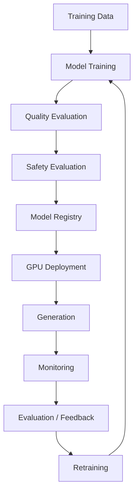

---

!!! tip "Production Insight"

    **Diffusion Models change the engineering problem from simply training a model to operating an expensive iterative inference system.**

    In a production environment, the model is only one part of the architecture.

    ```text
    Generation Request
          ↓
    API / Authentication
          ↓
    Job Management
          ↓
    GPU Scheduling
          ↓
    Diffusion Inference
          ↓
    Safety Validation
          ↓
    Storage
          ↓
    Response / Event
    ```

    The most important production concerns often include:

    ```text
    GPU Cost
    Inference Latency
    Sampling Efficiency
    Model Versioning
    Safety
    Observability
    Scalability
    ```

    Latent diffusion, efficient samplers, mixed precision, batching, quantization, and GPU-aware infrastructure can significantly affect the economics of a production Generative AI platform.

---

# 📌 Key Takeaways

- Diffusion Models generate data by learning to reverse a gradual noise-addition process.
- The forward diffusion process gradually corrupts data with noise.
- The reverse diffusion process learns to remove that noise.
- A denoising neural network is used repeatedly during generation.
- Many DDPM-style models are trained to predict the noise added to a sample.
- The timestep tells the model how noisy the current input is.
- Noise schedules control the amount of noise introduced during the forward process.
- U-Net architectures are commonly used for image diffusion because of their multi-scale structure and skip connections.
- Conditional diffusion allows generation to be guided by text, labels, images, depth, pose, or other information.
- Cross-attention enables diffusion models to incorporate conditioning such as text embeddings.
- Classifier-free guidance provides a practical mechanism for controlling conditional generation.
- DDPM provides a foundational probabilistic diffusion framework.
- DDIM provides an alternative sampling strategy that can reduce the number of required sampling steps.
- Latent Diffusion performs denoising in a compressed representation rather than directly in pixel space.
- Stable Diffusion popularized latent diffusion for practical text-to-image generation.
- Diffusion models can support image generation, editing, inpainting, audio, video, 3D, and scientific applications.
- Diffusion models generally avoid the adversarial instability associated with GAN training.
- Their major production challenge is often inference cost caused by iterative denoising.
- Sampling steps, guidance scale, sampler choice, resolution, and precision can significantly affect latency and quality.
- GPU utilization, memory consumption, throughput, and cost per generation are important production metrics.
- Enterprise diffusion systems require security, safety, governance, observability, model versioning, and scalable GPU infrastructure.
- Diffusion Models are one of the most important foundations for understanding modern Generative AI systems.

---

# 📚 Further Reading

Continue with:

- **[32. Reinforcement Learning Fundamentals](32-reinforcement-learning-fundamentals.md)**
- **[33. Markov Decision Processes and Q-Learning](33-markov-decision-processes-and-q-learning.md)**
- **[34. Deep Reinforcement Learning and DQN](34-deep-reinforcement-learning-and-dqn.md)**
- **[35. GPU Accelerated Deep Learning](35-gpu-accelerated-deep-learning.md)**
- **[36. Deep Learning Training and Model Lifecycle](36-deep-learning-training-and-model-lifecycle.md)**
- **[37. Building Production Deep Learning Systems](37-building-production-deep-learning-systems.md)**

---

## ➡️ Next Chapter

**[32. Reinforcement Learning Fundamentals](32-reinforcement-learning-fundamentals.md)**

---

> **Enterprise AI Engineering Handbook**  
> *Building Production-Grade Enterprise AI Systems — One Chapter at a Time.*