# 32. Reinforcement Learning Fundamentals

> Understand the foundations of Reinforcement Learning (RL), where an intelligent agent learns through interaction with an environment by taking actions, receiving rewards, and improving its behavior over time.

---

## 🎯 Learning Objectives

After completing this chapter, you will be able to:

- Explain what Reinforcement Learning is
- Understand the core components of an RL system
- Explain the Agent, Environment, State, Action, and Reward
- Understand the RL interaction loop
- Distinguish Reinforcement Learning from Supervised and Unsupervised Learning
- Understand policies
- Understand rewards and returns
- Explain episodes and trajectories
- Understand value functions
- Understand action-value functions
- Understand exploration vs exploitation
- Understand Markov Decision Processes at a conceptual level
- Understand discount factors
- Understand deterministic and stochastic policies
- Understand on-policy and off-policy learning
- Understand model-based and model-free RL
- Understand the role of Deep Learning in Reinforcement Learning
- Understand common Reinforcement Learning applications
- Understand the challenges of training RL systems
- Understand production considerations for RL systems

---

# 📖 Overview

Most Machine Learning systems learn from a fixed dataset.

For example:

```text
Training Data
     ↓
Machine Learning Model
     ↓
Prediction
```

Reinforcement Learning is different.

An RL system learns by interacting with an environment.

```text
Agent
  ↓
Action
  ↓
Environment
  ↓
New State + Reward
  ↓
Agent
```

The agent repeatedly interacts with the environment and learns which actions lead to better long-term outcomes.

---

# 🤖 What is Reinforcement Learning?

Reinforcement Learning is a Machine Learning paradigm in which an agent learns how to make decisions by interacting with an environment and receiving feedback in the form of rewards.

The fundamental objective is:

> **Learn a behavior that maximizes cumulative reward over time.**

Unlike supervised learning, the agent is not necessarily given the correct action for every situation.

Instead, it learns through:

```text
Experience
+
Rewards
+
Trial and Error
```

---

# 🧠 Reinforcement Learning Intuition

Consider a robot learning to navigate a warehouse.

```text
Robot
  ↓
Chooses Direction
  ↓
Moves
  ↓
Receives Reward / Penalty
  ↓
Observes New Position
  ↓
Chooses Next Action
```

For example:

```text
Reach Destination → +10
Move Toward Goal → +1
Hit Obstacle → -10
Waste Time → -1
```

Over many interactions, the robot learns a better strategy.

---

# 🧩 Core Components of Reinforcement Learning

The main components are:

```text
Agent
Environment
State
Action
Reward
Policy
Value Function
```

---

# 🧠 Agent

The **Agent** is the decision-making component.

It observes the current state and chooses an action.

Examples:

```text
Robot
Game Player
Trading System
Recommendation Engine
Autonomous Vehicle
Resource Scheduler
```

---

# 🌍 Environment

The **Environment** represents everything with which the agent interacts.

Examples:

```text
Game World
Warehouse
Financial Market
Road Network
Cloud Infrastructure
Simulation
```

The environment responds to actions and produces:

```text
New State
+
Reward
```

---

# 🧠 State

A **State** represents the current situation of the environment from the perspective of the agent.

For a robot:

```text
Position
Velocity
Obstacle Locations
Battery Level
Target Position
```

For a game:

```text
Player Position
Enemy Position
Health
Score
Available Actions
```

---

# 🎬 Action

An **Action** is a decision made by the agent.

Examples:

```text
Move Left
Move Right
Accelerate
Brake
Buy
Sell
Wait
Recommend Item
Allocate Resource
```

---

# 🏆 Reward

A **Reward** provides feedback to the agent.

Examples:

```text
Successful Action → +10
Bad Action → -5
Neutral Action → 0
```

The reward does not necessarily tell the agent exactly what to do.

It tells the agent how desirable the resulting outcome was.

---

# 🔄 Reinforcement Learning Interaction Loop

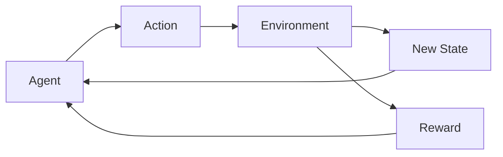

This loop is the foundation of Reinforcement Learning.

---

# 🧠 RL Interaction Cycle

At every step:

```text
1. Observe State
2. Select Action
3. Execute Action
4. Receive Reward
5. Observe New State
6. Update Learning
7. Repeat
```

---

# 🧠 Complete RL Workflow

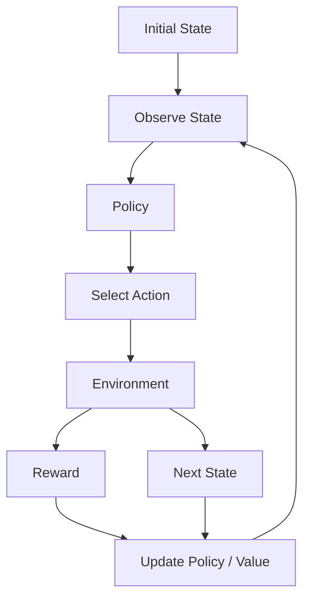

---

# 🧠 Reinforcement Learning vs Supervised Learning

| Supervised Learning | Reinforcement Learning |
|---|---|
| Learns from labeled examples | Learns from interaction |
| Correct output is provided | Correct action is not directly provided |
| Dataset is usually fixed | Data is generated through interaction |
| Objective is prediction accuracy | Objective is cumulative reward |
| Feedback is immediate for each example | Rewards can be delayed |

---

# 🧠 Reinforcement Learning vs Unsupervised Learning

| Unsupervised Learning | Reinforcement Learning |
|---|---|
| Finds structure in data | Learns decision-making |
| No explicit reward | Reward guides learning |
| Usually passive data | Active interaction |
| Examples: clustering | Examples: game playing, control |

---

# 🧠 Learning Paradigms

```text
Machine Learning
│
├── Supervised Learning
│
├── Unsupervised Learning
│
└── Reinforcement Learning
```

---

# 🧠 Policy

A **Policy** defines how an agent chooses actions.

Conceptually:

```text
State
  ↓
Policy
  ↓
Action
```

A policy can be represented as:

\[
\pi(a|s)
\]

where:

```text
π = Policy
a = Action
s = State
```

---

# 🧠 Deterministic Policy

A deterministic policy maps a state directly to an action.

```text
State
 ↓
Policy
 ↓
Action
```

For example:

```text
State = Obstacle Ahead

Policy:
    Turn Right
```

Conceptually:

\[
a=\pi(s)
\]

---

# 🧠 Stochastic Policy

A stochastic policy assigns probabilities to possible actions.

For example:

```text
State
 ↓
Policy
 ↓
Left  = 0.20
Right = 0.60
Forward = 0.20
```

The agent samples an action from this distribution.

---

# 🧠 Why Use Stochastic Policies?

Stochastic policies are useful when:

```text
Environment is uncertain
+
Multiple actions may be useful
+
Exploration is required
```

They are particularly important in policy-gradient and actor-critic methods.

---

# 🏆 Reward Function

The reward function defines the feedback provided by the environment.

For example, in a navigation problem:

```text
Reach Goal      → +100
Move Toward Goal → +1
Move Away       → -1
Collision       → -100
```

---

# ⚠ Reward Design

Reward design is one of the most important parts of Reinforcement Learning.

A poorly designed reward can cause unintended behavior.

For example:

```text
Goal:
Reach Destination Quickly
```

Suppose the reward is:

```text
+1 for every step completed
```

The agent may learn:

```text
Keep Moving
```

instead of:

```text
Reach Destination
```

---

# ⚠ Reward Hacking

Reward hacking occurs when an agent discovers a way to maximize the defined reward without achieving the intended real-world objective.

```text
Intended Goal
      ↓
Reward Function
      ↓
Agent
      ↓
Unexpected Strategy
      ↓
High Reward
```

Therefore:

> **The reward function is a specification of behavior, not merely a scoring mechanism.**

---

# 🧠 Immediate vs Delayed Rewards

Some tasks provide rewards immediately.

```text
Action
 ↓
Reward
```

Other tasks provide rewards much later.

```text
Action
 ↓
Action
 ↓
Action
 ↓
Action
 ↓
Final Reward
```

Delayed rewards make RL significantly more challenging.

---

# 🧠 Example of Delayed Reward

In chess:

```text
Move 1
 ↓
Move 2
 ↓
Move 3
 ↓
...
 ↓
Checkmate
 ↓
+1
```

The agent must determine which earlier actions contributed to the final outcome.

This is related to the **credit assignment problem**.

---

# 🧠 Episode

An **Episode** is one complete sequence of interaction from an initial state to a terminal state.

For example:

```text
Start Game
    ↓
Action
    ↓
Action
    ↓
Action
    ↓
Game Over
```

---

# 🧠 Episode Structure

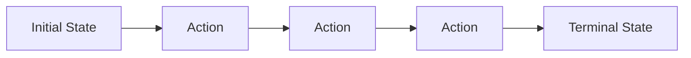

---

# 🧠 Trajectory

A trajectory represents the sequence of interactions:

```text
(s₀, a₀, r₁, s₁, a₁, r₂, s₂, ...)
```

It describes the agent's experience during an episode or interaction sequence.

---

# 🧠 Return

The agent usually cares about cumulative future rewards rather than only the immediate reward.

The discounted return is:

\[
G_t=r_{t+1}+\gamma r_{t+2}+\gamma^2r_{t+3}+\cdots
\]

where:

```text
Gₜ = Return
r = Reward
γ = Discount Factor
```

---

# 🧠 Discount Factor

The discount factor:

```text
γ
```

controls how much the agent values future rewards.

Typically:

```text
0 ≤ γ < 1
```

A lower value emphasizes immediate rewards.

A higher value emphasizes long-term rewards.

---

# 🧠 Discount Factor Intuition

```text
γ = 0

Immediate Reward
      ↓
Very Important

Future Rewards
      ↓
Ignored
```

versus:

```text
γ ≈ 1

Immediate Reward
      ↓
Important

Future Rewards
      ↓
Also Important
```

---

# 🧠 Value Function

The value function estimates how good a state is in terms of expected future reward.

It is commonly represented as:

\[
V^\pi(s)
\]

Conceptually:

```text
State
 ↓
Expected Future Return
```

---

# 🧠 State Value

For a policy π:

\[
V^\pi(s)=\mathbb{E}_\pi[G_t|S_t=s]
\]

This means:

```text
How much future reward can I expect
if I am in this state
and follow policy π?
```

---

# 🧠 Action-Value Function

The action-value function estimates the expected return from:

```text
State
+
Action
```

It is commonly represented as:

\[
Q^\pi(s,a)
\]

Conceptually:

```text
State + Action
       ↓
Expected Future Return
```

---

# 🧠 V vs Q

| Value Function | Action-Value Function |
|---|---|
| V(s) | Q(s,a) |
| Evaluates a state | Evaluates state-action pair |
| Assumes a policy | Evaluates action under a policy |
| Expected future return | Expected future return after taking an action |

---

# 🧠 Policy and Value Relationship

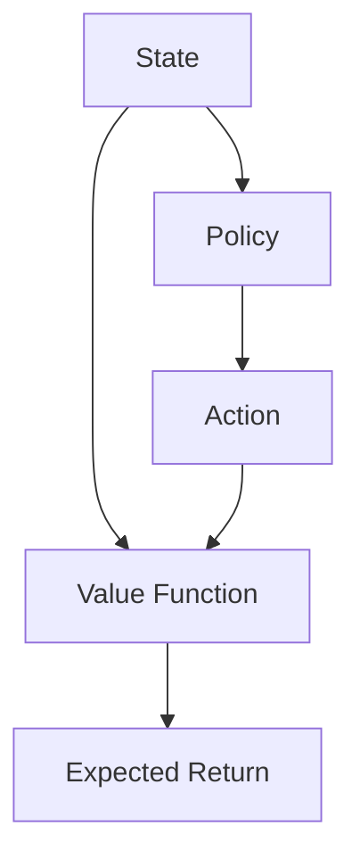

---

# 🧠 Exploration vs Exploitation

A central problem in Reinforcement Learning is balancing:

```text
Exploration
```

and:

```text
Exploitation
```

---

# 🔎 Exploration

Exploration means trying actions that are not yet known to be optimal.

```text
Try New Action
      ↓
Observe Result
      ↓
Learn
```

---

# 💡 Exploitation

Exploitation means choosing the action currently believed to be the best.

```text
Known Good Action
      ↓
Choose It
      ↓
Receive Expected Reward
```

---

# ⚖️ Exploration vs Exploitation

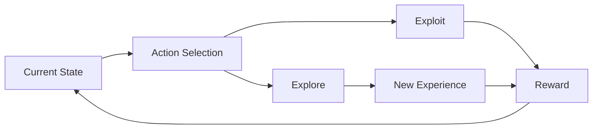

---

# 🧠 ε-Greedy Strategy

One simple exploration strategy is ε-greedy.

Conceptually:

```text
Probability ε
    ↓
Explore Random Action

Probability 1 - ε
    ↓
Choose Best Known Action
```

---

# 🧠 ε-Greedy Example

Suppose:

```text
ε = 0.1
```

Then approximately:

```text
10% → Explore
90% → Exploit
```

The exploration rate can be reduced over time.

---

# 🧠 Exploration Schedule

```text
Training Start
     ↓
High Exploration
     ↓
Learn Environment
     ↓
Reduce Exploration
     ↓
More Exploitation
```

---

# 🧠 Markov Property

Many RL problems are modeled using the Markov property.

The Markov property means that the current state contains enough information to predict the future dynamics, without requiring the entire history.

Conceptually:

```text
Past History
      ↓
Current State
      ↓
Future
```

The current state acts as a sufficient summary of the relevant history.

---

# 🧠 Markov Decision Process

A **Markov Decision Process (MDP)** provides a mathematical framework for modeling many RL problems.

An MDP is commonly defined by:

```text
(S, A, P, R, γ)
```

where:

```text
S = States
A = Actions
P = Transition Dynamics
R = Reward Function
γ = Discount Factor
```

---

# 🧠 MDP Architecture

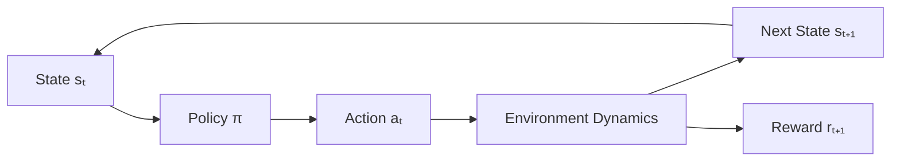

---

# 🧠 State Transition

When an agent takes an action:

```text
Current State
+
Action
      ↓
Environment
      ↓
Next State
+
Reward
```

The transition may be deterministic or stochastic.

---

# 🧠 Deterministic Environment

A deterministic environment produces the same result for the same:

```text
State
+
Action
```

Example:

```text
Chess Board
+
Legal Move
      ↓
Known New Board
```

---

# 🧠 Stochastic Environment

A stochastic environment may produce different outcomes.

For example:

```text
State
+
Action
      ↓
Possible Outcome A
Possible Outcome B
Possible Outcome C
```

with different probabilities.

---

# 🧠 Model-Based vs Model-Free RL

Two broad categories are:

```text
Model-Based RL
Model-Free RL
```

---

# 🧠 Model-Based Reinforcement Learning

The agent has or learns a model of the environment.

```text
State
+
Action
 ↓
Learned Environment Model
 ↓
Predicted Next State
+
Predicted Reward
```

The agent can use this model to plan.

---

# 🧠 Model-Free Reinforcement Learning

The agent learns directly from interaction without explicitly learning a complete environment model.

```text
State
 ↓
Action
 ↓
Reward
 ↓
Learning
```

Examples include:

```text
Q-Learning
SARSA
Policy Gradient
DQN
Actor-Critic
```

---

# 🧠 Model-Based vs Model-Free

| Model-Based RL | Model-Free RL |
|---|---|
| Learns or uses environment model | Learns directly from experience |
| Supports planning | Usually relies on learned policy/value |
| Can be sample efficient | Can require many interactions |
| Model errors can hurt planning | No explicit environment model required |
| More complex | Often simpler conceptually |

---

# 🧠 On-Policy vs Off-Policy

Another important distinction is:

```text
On-Policy
```

versus:

```text
Off-Policy
```

---

# 🧠 On-Policy Learning

The agent learns about the policy it is currently using to generate experience.

```text
Behavior Policy
      ↓
Experience
      ↓
Learn Same Policy
```

Examples:

```text
SARSA
Policy Gradient
PPO
```

---

# 🧠 Off-Policy Learning

The agent can learn about one policy using experience generated by another policy.

```text
Behavior Policy
      ↓
Experience
      ↓
Target Policy
      ↓
Learning
```

Examples:

```text
Q-Learning
DQN
SAC
```

---

# 🧠 RL Taxonomy

```text
Reinforcement Learning
│
├── Model-Based
│
└── Model-Free
     │
     ├── Value-Based
     │
     ├── Policy-Based
     │
     └── Actor-Critic
```

This taxonomy is useful for understanding how later RL algorithms fit together.

---

# 🧠 Value-Based Learning

Value-based methods learn:

```text
V(s)
```

or:

```text
Q(s,a)
```

and derive actions from these values.

Example:

```text
State
 ↓
Q-Values
 ↓
Choose Highest Value Action
```

---

# 🧠 Policy-Based Learning

Policy-based methods directly learn a policy.

```text
State
 ↓
Policy Network
 ↓
Action Distribution
```

This is particularly useful when action spaces are continuous or when stochastic policies are desired.

---

# 🧠 Actor-Critic

Actor-Critic methods combine:

```text
Actor
+
Critic
```

### Actor

Learns:

```text
Policy
```

### Critic

Evaluates:

```text
Value
```

---

# 🧠 Actor-Critic Architecture

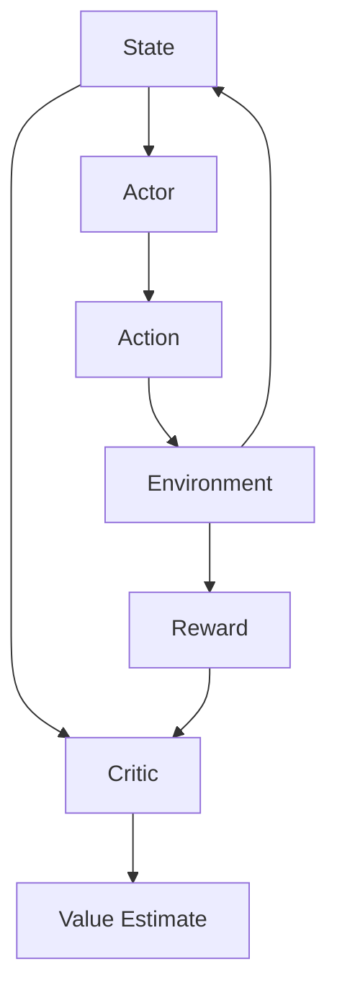

Actor-Critic methods form the foundation of many modern RL algorithms.

---

# 🧠 Deep Reinforcement Learning

Traditional RL methods often work with explicit tables or compact state representations.

Deep Reinforcement Learning uses neural networks to approximate:

```text
Value Functions
Policies
Q-Functions
Environment Models
```

---

# 🧠 Deep RL Architecture

```text
Environment
    ↓
State / Observation
    ↓
Neural Network
    ↓
Policy / Value / Q-Function
    ↓
Action
    ↓
Environment
```

---

# 🧠 Why Deep Learning Helps RL

Deep Neural Networks can process high-dimensional inputs.

For example:

```text
Raw Image
   ↓
CNN
   ↓
State Representation
   ↓
RL Policy
   ↓
Action
```

This enables RL agents to operate directly on complex observations.

---

# 🎮 Example — Game Playing

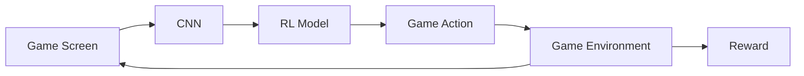

---

# 🧠 RL Applications

Reinforcement Learning has been applied to:

```text
Game Playing
Robotics
Autonomous Systems
Recommendation
Resource Allocation
Scheduling
Traffic Control
Industrial Control
Operations Research
Simulation
```

---

# 🎮 Game Playing

RL has been extensively used for environments where:

```text
Actions
 ↓
Game State
 ↓
Reward
```

can be simulated.

Examples include:

```text
Board Games
Video Games
Strategy Games
Simulation Environments
```

---

# 🤖 Robotics

A robot can learn:

```text
Movement
Grasping
Navigation
Control
Manipulation
```

through interaction with a simulated or physical environment.

---

# 🚗 Autonomous Systems

Potential applications include:

```text
Path Planning
Control
Decision Making
Traffic Interaction
Energy Optimization
```

Safety constraints are critical when RL is used in physical systems.

---

# 🏭 Industrial Optimization

RL can optimize:

```text
Production Scheduling
Resource Allocation
Energy Consumption
Equipment Control
Supply Chain Decisions
```

---

# ☁️ Cloud Resource Optimization

RL can conceptually be used for:

```text
Workload Placement
Auto Scaling
Resource Allocation
Cost Optimization
Capacity Planning
```

Example:

```text
System Metrics
     ↓
RL Agent
     ↓
Scaling Decision
     ↓
Cloud Environment
     ↓
Cost + Performance Reward
```

---

# 🧠 Recommendation Systems

An RL-based recommender can consider long-term user outcomes rather than only immediate clicks.

```text
User Context
    ↓
Policy
    ↓
Recommendation
    ↓
User Response
    ↓
Reward
    ↓
Policy Update
```

Potential rewards could include:

```text
Engagement
Retention
Conversion
Long-Term Satisfaction
```

Reward design is critical because optimizing only clicks can create undesirable behavior.

---

# 🧠 RL Training Challenges

Reinforcement Learning has several unique challenges.

```text
Exploration
Delayed Rewards
Credit Assignment
Sample Efficiency
Reward Design
Environment Complexity
Training Instability
Safety
Distribution Shift
```

---

# ⚠ Sample Efficiency

An RL agent may require many interactions to learn a good policy.

```text
Experience 1
Experience 2
Experience 3
...
Experience 1,000,000
```

This can be expensive when interacting with a real-world environment.

---

# 🧪 Simulation

Simulation can reduce the cost of real-world exploration.

```text
Real Environment
       ↓
Simulation
       ↓
RL Training
       ↓
Policy
       ↓
Real Environment
```

---

# 🧠 Sim-to-Real

In robotics and autonomous systems, an agent can be trained in simulation and then transferred to the real world.

```text
Simulation
 ↓
Learn Policy
 ↓
Validate
 ↓
Real Environment
```

However, differences between simulation and reality can cause performance degradation.

This is known as the:

> **Sim-to-Real Gap**

---

# ⚠ Exploration Safety

Random exploration may be acceptable in a simulation.

It can be dangerous in real-world systems.

For example:

```text
Simulation:

Try Action
 ↓
Failure
 ↓
Reset
```

versus:

```text
Physical Robot:

Try Action
 ↓
Hardware Damage
```

Therefore production RL often requires:

```text
Safety Constraints
+
Simulation
+
Guardrails
+
Offline Evaluation
```

---

# 🧠 Offline Reinforcement Learning

Offline RL learns from previously collected interaction data rather than continuously interacting with the environment during training.

```text
Historical Experience
       ↓
Offline RL
       ↓
Learn Policy
       ↓
Evaluation
       ↓
Deployment
```

This can be useful when online exploration is expensive or unsafe.

---

# 🧠 Offline RL Dataset

A dataset may contain:

```text
State
Action
Reward
Next State
```

Conceptually:

```text
(s, a, r, s')
```

The agent learns from historical trajectories.

---

# 🧠 Online vs Offline RL

| Online RL | Offline RL |
|---|---|
| Continuously interacts with environment | Learns from fixed historical data |
| Can explore | Limited by available data |
| Potentially expensive | Safer during training |
| Useful in simulation | Useful when interaction is costly |
| Requires environment access | Does not require online interaction during training |

---

# 🧠 RL Evaluation

Evaluating an RL system requires more than model loss.

Important metrics may include:

```text
Average Reward
Episode Return
Success Rate
Task Completion
Constraint Violations
Latency
Resource Consumption
Safety Incidents
```

---

# 🧠 Episode Return

A common evaluation metric is cumulative reward per episode.

```text
Episode 1 → +120
Episode 2 → +98
Episode 3 → +135
Episode 4 → +110
```

Average performance can then be monitored across episodes.

---

# 🧠 RL Evaluation Pipeline

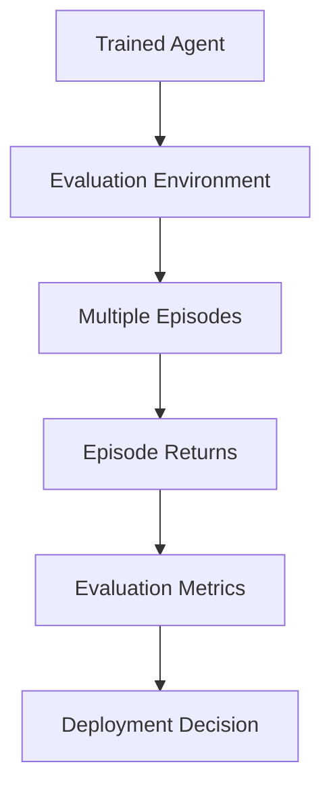

---

# 🧠 Reward Is Not Always Enough

A system may achieve a high reward while violating important business or safety constraints.

Therefore production evaluation should include:

```text
Reward
+
Business Metrics
+
Safety Metrics
+
Operational Metrics
```

---

# 🏢 Enterprise RL Architecture

A production RL system may contain:

```text
Environment / Simulator
        ↓
Experience Collection
        ↓
Replay / Dataset
        ↓
Training Pipeline
        ↓
Policy Evaluation
        ↓
Model Registry
        ↓
Policy Deployment
        ↓
Production Environment
        ↓
Monitoring
```

---

# 🏢 Production RL Architecture

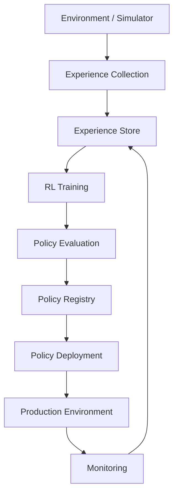

---

# 🏢 RL Policy as a Production Artifact

A trained RL policy should be treated like any other production model.

Track:

```text
Policy Version
Training Dataset
Environment Version
Reward Definition
Hyperparameters
Model Architecture
Evaluation Results
Deployment Version
```

---

# 🏢 Reward Versioning

Reward logic should be versioned.

For example:

```text
Reward Function v1
      ↓
Policy v1

Reward Function v2
      ↓
Policy v2
```

Changing the reward function can fundamentally change the learned behavior.

---

# 🏢 RL Monitoring

Production monitoring can include:

```text
Average Reward
Success Rate
Action Distribution
Constraint Violations
Business KPI
Latency
Resource Usage
Policy Drift
Environment Drift
```

---

# 🏢 Policy Drift

The environment can change after deployment.

For example:

```text
Training Environment
        ↓
Production Environment
        ↓
Changed Dynamics
```

The policy may become less effective.

This requires continuous evaluation.

---

# 🏢 RL Safety Architecture

A production RL agent should not necessarily have unrestricted control.

A safety layer can sit between:

```text
Policy
```

and:

```text
Environment
```

---

# 🛡️ Safety Layer

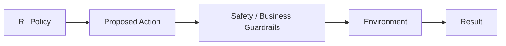

The guardrail can:

```text
Reject Invalid Actions
Apply Business Rules
Enforce Safety Limits
Apply Resource Constraints
```

---

# 🏢 Human-in-the-Loop RL

Some enterprise systems may require human approval.

```text
RL Agent
   ↓
Proposed Action
   ↓
Human Review
   ↓
Approved Action
   ↓
Environment
```

This can be useful for high-risk decisions.

---

# 🧠 RL and Generative AI

Reinforcement Learning is also important in modern Generative AI.

A simplified conceptual pipeline is:

```text
Pretrained Model
      ↓
Supervised Fine-Tuning
      ↓
Preference / Reward Signal
      ↓
Reinforcement Learning
      ↓
Aligned Model
```

This connects RL with model alignment and preference optimization.

---

# 🧠 RLHF

RLHF stands for:

> **Reinforcement Learning from Human Feedback**

The high-level idea is:

```text
Human Preferences
       ↓
Preference Data
       ↓
Reward Model
       ↓
RL Optimization
       ↓
Improved Policy
```

RLHF became particularly important in the development of aligned language-model systems.

---

# 🧠 RLHF Conceptual Architecture

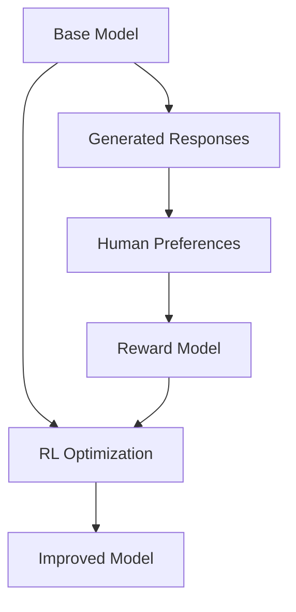

---

# 🧠 RL in AI Engineering

For an AI Engineer, Reinforcement Learning provides useful foundations for understanding:

```text
Decision-Making Systems
Policy Optimization
Reward Modeling
RLHF
Agentic Systems
Autonomous Systems
Optimization
Control
```

---

# 🧪 Practical Exercise 1 — Multi-Armed Bandit

Implement a simple multi-armed bandit.

```text
Arm 1 → Reward Distribution A
Arm 2 → Reward Distribution B
Arm 3 → Reward Distribution C
```

Implement:

```text
ε-Greedy
```

and observe the exploration/exploitation trade-off.

---

# 🧪 Practical Exercise 2 — Grid World

Create a simple environment:

```text
S . . .
. . # .
. # . .
. . . G
```

where:

```text
S = Start
G = Goal
# = Obstacle
```

Allow the agent to choose:

```text
Up
Down
Left
Right
```

Design a reward function.

---

# 🧪 Practical Exercise 3 — Q-Learning

Implement a Q-table.

```text
Q[state][action]
```

Train the agent to reach the goal.

Track:

```text
Episode
Total Reward
Steps
```

---

# 🧪 Practical Exercise 4 — Exploration Strategy

Compare:

```text
High ε
```

versus:

```text
Low ε
```

Measure:

```text
Learning Speed
Final Reward
Exploration
```

---

# 🧪 Practical Exercise 5 — Policy Visualization

Train an agent in Grid World.

Visualize:

```text
State
 ↓
Best Action
```

For example:

```text
→ → ↓ ↓
↑ # → ↓
↑ # → ↓
→ → → G
```

---

# 🧪 Practical Exercise 6 — Deep Q-Learning

Replace the Q-table with a neural network.

```text
State
 ↓
Neural Network
 ↓
Q-Values
 ↓
Best Action
```

This introduces the foundation of DQN.

---

# 🧪 Practical Exercise 7 — Actor-Critic

Implement a simplified Actor-Critic architecture:

```text
State
 ├──► Actor
 │      ↓
 │    Action
 │
 └──► Critic
        ↓
      Value
```

Compare its behavior with Q-Learning.

---

# 🧪 Practical Exercise 8 — Simulation-Based RL

Create a simulated environment for:

```text
Resource Allocation
```

Reward:

```text
High Performance
+
Low Cost
-
Constraint Violations
```

Train an RL agent to optimize the allocation strategy.

---

# 🧪 Practical Exercise 9 — Offline RL Dataset

Create a dataset containing:

```text
State
Action
Reward
Next State
```

Train an RL algorithm using only historical data.

Analyze the limitations caused by limited action coverage.

---

# 🧪 Practical Exercise 10 — Production RL System

Design:

```text
Simulator
 ↓
Experience Store
 ↓
Training Pipeline
 ↓
Policy Evaluation
 ↓
Model Registry
 ↓
Safety Layer
 ↓
Production Environment
 ↓
Monitoring
```

Include:

```text
Policy Versioning
Reward Versioning
Safety Constraints
Rollback
Observability
```

---

# 🧠 Interview Questions

## Beginner

### 1. What is Reinforcement Learning?

Reinforcement Learning is a Machine Learning approach where an agent learns through interaction with an environment using rewards as feedback.

### 2. What are the core components of RL?

```text
Agent
Environment
State
Action
Reward
Policy
```

### 3. What is an Agent?

The Agent is the decision-making system that selects actions.

### 4. What is an Environment?

The Environment is the system with which the agent interacts.

### 5. What is a Reward?

A Reward is feedback indicating how desirable an outcome was.

### 6. What is a Policy?

A Policy defines how an agent selects actions based on states.

---

## Intermediate

### 7. What is the difference between a state and an action?

A state describes the current situation, while an action is the decision taken by the agent.

### 8. What is the difference between reward and return?

Reward is the immediate feedback from an interaction, while return is the cumulative future reward, often discounted.

### 9. What is the discount factor?

The discount factor controls the importance assigned to future rewards.

### 10. What is exploration vs exploitation?

Exploration tries new actions to learn more, while exploitation chooses actions currently believed to provide the best reward.

### 11. What is an MDP?

A Markov Decision Process is a mathematical framework for modeling sequential decision-making problems.

### 12. What is the Markov property?

The current state contains sufficient information about the relevant past needed to model future transitions.

---

## Advanced

### 13. What is model-free RL?

Model-free RL learns policies or value functions directly from experience without explicitly learning a complete model of the environment.

### 14. What is model-based RL?

Model-based RL uses or learns a model of the environment and can use it for planning.

### 15. What is on-policy learning?

The agent learns about the same policy used to generate its experience.

### 16. What is off-policy learning?

The agent can learn a target policy using experience generated by another behavior policy.

### 17. What is the difference between value-based and policy-based RL?

Value-based methods learn value estimates and derive actions from them, while policy-based methods directly optimize a policy.

### 18. What is Actor-Critic?

Actor-Critic combines an Actor that learns the policy with a Critic that estimates the value of states or actions.

### 19. Why is reward design difficult?

Because the agent optimizes the defined reward, which may not perfectly represent the intended business or real-world objective.

### 20. Why are safety constraints important in production RL?

Because unrestricted exploration or incorrect policies can cause undesirable or unsafe actions in real-world environments.

---

# 🏢 Enterprise Perspective

Reinforcement Learning introduces a different way of thinking about Machine Learning systems.

Traditional ML often asks:

```text
What is the correct prediction?
```

Reinforcement Learning asks:

```text
What action should I take now
to maximize long-term outcomes?
```

This makes RL particularly relevant to:

```text
Optimization
Decision Automation
Control Systems
Resource Allocation
Scheduling
Recommendation
Autonomous Systems
AI Agents
```

---

# 🏢 Production RL Is More Than a Policy

A production RL system requires:

```text
Policy
+
Environment
+
Reward Function
+
Experience Pipeline
+
Safety Layer
+
Evaluation
+
Monitoring
+
Versioning
```

The policy is only one component of the overall system.

---

# 🏢 Production RL Lifecycle

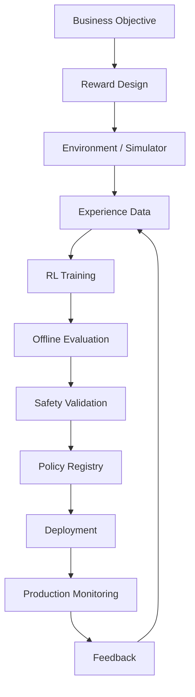

---

# 🏢 Production Design Considerations

Before deploying RL, evaluate:

```text
Can the environment be safely explored?
Can the reward be measured reliably?
Can failures be detected?
Can actions be constrained?
Can the policy be rolled back?
Can the environment change?
Can the policy be evaluated offline?
```

---

# 🏢 RL and Microservices

In an enterprise architecture, the RL policy can be isolated behind a service boundary.

```text
Business Service
      ↓
Decision Service
      ↓
RL Policy
      ↓
Action
```

A capability-based interface could look like:

```java
public interface DecisionPolicy {

    Action decide(
        State state
    );
}
```

The implementation could use:

```text
Q-Learning
DQN
PPO
SAC
Custom Policy
Cloud ML Endpoint
```

---

# 🏢 RL + Cloud

Cloud infrastructure can provide:

```text
GPU Training
CPU Simulation
Distributed Experience Collection
Object Storage
Model Registry
Monitoring
Kubernetes
Managed ML Platforms
```

A scalable architecture could look like:

```text
Simulation Workers
       ↓
Experience Queue
       ↓
Experience Store
       ↓
GPU Training
       ↓
Policy Registry
       ↓
Evaluation
       ↓
Deployment
```

---

# 🏢 Observability

Production RL systems should monitor both:

### ML Metrics

```text
Episode Return
Policy Performance
Action Distribution
Value Estimates
```

### Business Metrics

```text
Revenue
Cost
Latency
Conversion
Resource Utilization
```

### Safety Metrics

```text
Constraint Violations
Invalid Actions
Human Overrides
Failure Rate
```

---

# 🏢 Rollback Strategy

A production RL system should support:

```text
Policy v1
   ↓
Policy v2
   ↓
Performance Degrades
   ↓
Rollback
   ↓
Policy v1
```

This is particularly important because RL policies can affect live decision-making.

---

!!! tip "Production Insight"

    **Reinforcement Learning is fundamentally a decision-making problem, not simply a prediction problem.**

    In production, the most difficult component is often not the neural network.

    It is the environment around the model:

    ```text
    State Representation
         ↓
    Reward Design
         ↓
    Policy
         ↓
    Action
         ↓
    Safety Constraints
         ↓
    Environment
         ↓
    Feedback
    ```

    A production RL system should therefore be designed as a complete control loop with:

    ```text
    Safe Exploration
    Reliable Rewards
    Offline Evaluation
    Policy Versioning
    Guardrails
    Monitoring
    Rollback
    ```

    For enterprise AI, **reward design and safety constraints are as important as model architecture.**

---

# 📌 Key Takeaways

- Reinforcement Learning enables an agent to learn decision-making through interaction with an environment.
- The core RL components are Agent, Environment, State, Action, Reward, and Policy.
- The agent repeatedly observes states, takes actions, receives rewards, and observes new states.
- The objective is generally to maximize cumulative future reward.
- A policy defines how actions are selected from states.
- Rewards provide feedback but do not necessarily specify the correct action.
- Reward design is one of the most important aspects of RL.
- Poorly designed rewards can lead to reward hacking and unintended behavior.
- Returns represent cumulative future rewards and may use a discount factor.
- Value functions estimate the expected return from a state.
- Q-functions estimate the expected return for state-action pairs.
- Exploration discovers new possibilities while exploitation uses known good actions.
- Markov Decision Processes provide a mathematical framework for many RL problems.
- Model-based RL uses an environment model for planning.
- Model-free RL learns directly from experience.
- On-policy methods learn from the policy generating the experience.
- Off-policy methods can learn from experience generated by another policy.
- Value-based methods learn value functions.
- Policy-based methods directly optimize policies.
- Actor-Critic methods combine policy learning with value estimation.
- Deep Reinforcement Learning uses neural networks to approximate policies or value functions.
- Simulation can make RL training safer and more cost-effective.
- Offline RL can learn from historical interaction data when online exploration is expensive or unsafe.
- Production RL requires safety constraints, evaluation, monitoring, policy versioning, and rollback.
- RL is increasingly relevant to autonomous systems, optimization, recommendation, resource allocation, and AI agents.
- Reinforcement Learning also provides important foundations for understanding RLHF and modern AI alignment techniques.

---

# 📚 Further Reading

Continue with:

- **[33. Markov Decision Processes and Q-Learning](33-markov-decision-processes-and-q-learning.md)**
- **[34. Deep Reinforcement Learning and DQN](34-deep-reinforcement-learning-and-dqn.md)**
- **[35. GPU Accelerated Deep Learning](35-gpu-accelerated-deep-learning.md)**
- **[36. Deep Learning Training and Model Lifecycle](36-deep-learning-training-and-model-lifecycle.md)**
- **[37. Building Production Deep Learning Systems](37-building-production-deep-learning-systems.md)**

---

## ➡️ Next Chapter

**[33. Markov Decision Processes and Q-Learning](33-markov-decision-processes-and-q-learning.md)**

---

> **Enterprise AI Engineering Handbook**  
> *Building Production-Grade Enterprise AI Systems — One Chapter at a Time.*