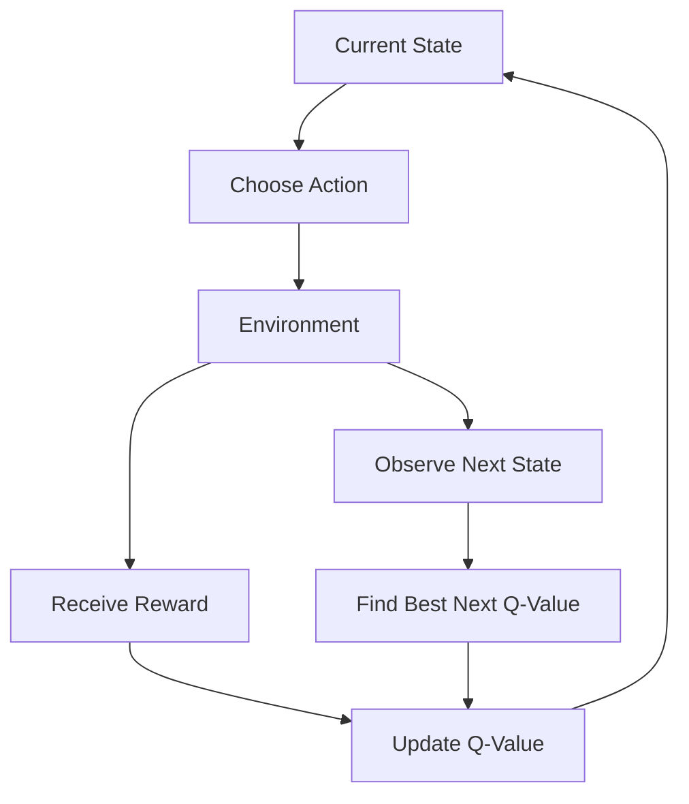
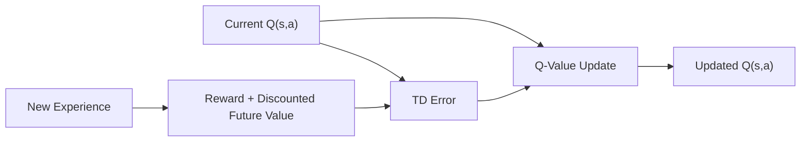
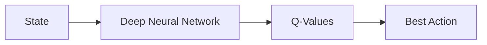
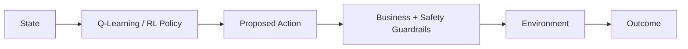

# 33. Markov Decision Processes and Q-Learning

> Understand how Markov Decision Processes provide the mathematical foundation for Reinforcement Learning and how Q-Learning enables agents to learn optimal actions from experience without explicitly modeling the environment.

---

## 🎯 Learning Objectives

After completing this chapter, you will be able to:

- Explain the Markov Property
- Understand Markov Decision Processes (MDPs)
- Identify the components of an MDP
- Understand states, actions, rewards, and transitions
- Explain transition probabilities
- Understand reward functions
- Understand policies in an MDP
- Explain value functions
- Explain action-value functions
- Understand the Bellman Equation
- Understand the Bellman Optimality Equation
- Explain Q-Learning
- Understand the Q-table
- Understand the Q-Learning update rule
- Understand temporal-difference learning
- Understand exploration and exploitation in Q-Learning
- Explain the ε-greedy strategy
- Understand learning rate and discount factor
- Understand terminal states
- Implement a basic Q-Learning agent
- Understand the limitations of tabular Q-Learning
- Understand the relationship between Q-Learning and Deep Q-Networks
- Understand production considerations for value-based Reinforcement Learning

---

# 📖 Overview

Reinforcement Learning problems involve sequential decision-making.

An agent repeatedly:

```text
Observe State
     ↓
Choose Action
     ↓
Interact with Environment
     ↓
Receive Reward
     ↓
Observe New State
     ↓
Learn
```

To mathematically describe this interaction, Reinforcement Learning commonly uses the concept of a:

> **Markov Decision Process (MDP)**

Q-Learning then provides a model-free algorithm that allows an agent to learn which actions are valuable in different states.

The core idea is:

```text
State
  ↓
Possible Actions
  ↓
Expected Future Rewards
  ↓
Choose Best Action
```

---

# 🧠 Markov Property

The **Markov Property** states that the future depends on the current state rather than the complete history of previous states and actions.

Conceptually:

```text
Past History
     ↓
Current State
     ↓
Future
```

If the current state contains all relevant information required to predict future behavior, the problem satisfies the Markov property.

---

# 🧠 Markov Property Example

Consider a chess game.

If the complete current board position is known:

```text
Current Board
     ↓
Legal Moves
     ↓
Possible Future States
```

The entire sequence of previous moves may not be required to determine the legal moves available from the current board.

The current state acts as a sufficient representation of the relevant history.

---

# 🧠 Non-Markov Example

Suppose a system only records:

```text
Current Position
```

but not:

```text
Velocity
```

For a moving vehicle, position alone may not be enough to predict the next state.

Two vehicles can have:

```text
Same Position
Different Velocity
```

and therefore behave differently in the future.

A better state representation might include:

```text
Position
+
Velocity
+
Direction
```

---

# 🧠 Markov Decision Process

A **Markov Decision Process (MDP)** provides a mathematical framework for sequential decision-making under uncertainty.

An MDP is commonly represented as:

\[
(S,A,P,R,\gamma)
\]

where:

```text
S = Set of States
A = Set of Actions
P = Transition Probability
R = Reward Function
γ = Discount Factor
```

---

# 🧩 Components of an MDP

| Component | Meaning |
|---|---|
| `S` | Set of possible states |
| `A` | Set of possible actions |
| `P` | Transition dynamics |
| `R` | Reward function |
| `γ` | Discount factor |

---

# 🧠 State Space

The **State Space** represents all possible states that the environment can be in.

For a simple Grid World:

```text
S = {Cell₁, Cell₂, Cell₃, ..., Cellₙ}
```

For a robot:

```text
S =
{
Position,
Velocity,
Orientation,
Battery,
Obstacle Information
}
```

---

# 🧠 Action Space

The **Action Space** represents all actions available to the agent.

For Grid World:

```text
A = {
    Up,
    Down,
    Left,
    Right
}
```

For a vehicle:

```text
A = {
    Accelerate,
    Brake,
    Turn Left,
    Turn Right
}
```

---

# 🧠 Transition Dynamics

The transition function describes how the environment changes after an action.

Conceptually:

```text
Current State
      +
Action
      ↓
Environment Dynamics
      ↓
Next State
```

For stochastic environments, the result is represented using probabilities.

---

# 🧠 Transition Probability

The transition probability can be written as:

\[
P(s'|s,a)
\]

This means:

> The probability of transitioning to state `s'` after taking action `a` in state `s`.

For example:

```text
Current State = S1
Action = Right

Possible Outcomes:

S2 → 0.80
S3 → 0.15
S4 → 0.05
```

The environment is therefore stochastic.

---

# 🧠 Deterministic Transition

In a deterministic environment:

```text
P(s' | s,a) = 1
```

for one particular next state.

Example:

```text
State A
+
Move Right
     ↓
State B
```

There is no uncertainty.

---

# 🧠 Stochastic Transition

In a stochastic environment:

```text
State A
+
Move Right
     ↓
 ┌─────────────┐
 │ State B 70% │
 │ State C 20% │
 │ State D 10% │
 └─────────────┘
```

The same action may lead to different outcomes.

---

# 🧠 Reward Function

The reward function defines the immediate feedback associated with transitions.

A common notation is:

\[
R(s,a,s')
\]

It represents the reward received when:

```text
State s
+
Action a
 ↓
State s'
```

---

# 🧠 Example Reward Function

Consider a Grid World:

```text
Reach Goal       → +100
Move Normally    → -1
Hit Wall         → -5
Fall into Trap   → -100
```

The reward structure encourages the agent to:

```text
Reach Goal
+
Avoid Bad States
+
Minimize Unnecessary Steps
```

---

# ⚠ Reward Design

The reward function defines what the agent is incentivized to optimize.

Therefore:

```text
Poor Reward Design
        ↓
Poor Behavior
```

Even if the RL algorithm works correctly, the agent may learn undesirable behavior if the reward does not accurately represent the intended objective.

---

# 🧠 Episode

An episode is one complete sequence of interactions.

For example:

```text
Initial State
     ↓
Action
     ↓
State
     ↓
Action
     ↓
State
     ↓
Goal
     ↓
Terminal State
```

The episode then ends.

---

# 🧠 Terminal State

A terminal state represents the end of an episode.

Examples:

```text
Game Won
Game Lost
Goal Reached
Robot Task Completed
Failure Condition
Time Limit
```

Once a terminal state is reached:

```text
No Further Actions
```

for that episode.

---

# 🧠 Trajectory

A trajectory represents the sequence of experiences generated during an episode.

For example:

```text
(s₀, a₀, r₁, s₁,
 a₁, r₂, s₂,
 a₂, r₃, s₃)
```

It captures:

```text
State
Action
Reward
Next State
```

over time.

---

# 🧠 Policy

A policy determines which action the agent takes in a given state.

A stochastic policy can be represented as:

\[
\pi(a|s)
\]

A deterministic policy can be represented as:

\[
a=\pi(s)
\]

---

# 🧠 Optimal Policy

The objective of an RL agent is often to learn an optimal policy:

\[
\pi^*
\]

The optimal policy maximizes expected cumulative reward.

Conceptually:

```text
All Possible Policies
        ↓
Evaluate Long-Term Reward
        ↓
Best Policy
        ↓
π*
```

---

# 🧠 Return

The return represents cumulative future reward.

A discounted return is:

\[
G_t=
r_{t+1}
+
\gamma r_{t+2}
+
\gamma^2r_{t+3}
+\cdots
\]


where:

```text
Gₜ = Return
r = Reward
γ = Discount Factor
```

---

# 🧠 Discount Factor

The discount factor determines how strongly future rewards influence current decisions.

```text
0 ≤ γ < 1
```

### Low γ

```text
Immediate Rewards
       ↓
High Importance
```

### High γ

```text
Future Rewards
       ↓
High Importance
```

---

# 🧠 Value Function

The state-value function estimates the expected return from a state when following a particular policy.

\[
V^\pi(s)
=
\mathbb{E}_\pi[G_t|S_t=s]
\]


Conceptually:

```text
State
 ↓
Expected Future Reward
```

---

# 🧠 Action-Value Function

The action-value function evaluates:

```text
State
+
Action
```

and estimates the expected future return.

\[
Q^\pi(s,a)
=
\mathbb{E}_\pi[G_t|S_t=s,A_t=a]
\]


---

# 🧠 V(s) vs Q(s,a)

| V(s) | Q(s,a) |
|---|---|
| Evaluates a state | Evaluates state + action |
| Estimates expected return | Estimates expected return after action |
| Does not explicitly specify action | Directly evaluates actions |
| Used in value-based and actor-critic methods | Central to Q-Learning |

---

# 🧠 Why Q-Values Matter

Suppose the agent is in:

```text
State S1
```

and possible actions are:

```text
Left
Right
Up
Down
```

The Q-values might be:

```text
Q(S1, Left)  = 4.2
Q(S1, Right) = 8.7
Q(S1, Up)    = 2.1
Q(S1, Down)  = 6.5
```

The agent can choose:

```text
Right
```

because it currently has the highest estimated value.

---

# 🧠 Q-Table

For small discrete environments, Q-values can be stored in a table.

Example:

| State | Up | Down | Left | Right |
|---|---:|---:|---:|---:|
| S1 | 0.2 | 0.4 | 0.1 | 0.8 |
| S2 | 0.5 | 0.2 | 0.9 | 0.3 |
| S3 | 0.1 | 0.7 | 0.2 | 0.4 |
| S4 | 0.9 | 0.1 | 0.4 | 0.2 |

The table estimates:

```text
Q(State, Action)
```

for every state-action pair.

---

# 🧠 Q-Learning

Q-Learning is a:

```text
Model-Free
+
Off-Policy
+
Value-Based
```

Reinforcement Learning algorithm.

The goal is to learn the optimal action-value function:

\[
Q^*(s,a)
\]

The optimal Q-function tells the agent:

> How valuable is it to take action `a` in state `s`, assuming optimal future behavior?

---

# 🧠 Q-Learning Workflow



---

# 🧠 Q-Learning Update Rule

The fundamental Q-Learning update is:

\[
Q(s,a)
\leftarrow
Q(s,a)
+
\alpha
\left[
r+
\gamma\max_{a'}Q(s',a')
-
Q(s,a)
\right]
\]


where:

```text
Q(s,a) = Current Q-value
α      = Learning Rate
r      = Immediate Reward
γ      = Discount Factor
s'     = Next State
a'     = Possible Next Action
```

---

# 🧠 Understanding the Q-Learning Formula

The update contains:

```text
Current Estimate
      +
Learning Rate
      ×
Learning Error
```

The learning target is:

```text
Immediate Reward
+
Best Estimated Future Reward
```

---

# 🧠 Temporal-Difference Error

The difference between the target and current estimate is the:

> **Temporal-Difference (TD) Error**

\[
\delta=
r+
\gamma\max_{a'}Q(s',a')
-
Q(s,a)
\]


The Q-value is then adjusted according to this error.

---

# 🧠 Q-Learning Update Intuition

```text
Current Q-Value
       ↓
Estimate Future Reward
       ↓
Compare with Actual Experience
       ↓
Calculate TD Error
       ↓
Update Q-Value
```

---

# 🧠 Learning Rate

The learning rate is represented by:

```text
α
```

It determines how strongly new experience changes the existing Q-value.

### Small α

```text
Slow Updates
More Stable
Less Responsive
```

### Large α

```text
Fast Updates
More Responsive
Potentially More Unstable
```

---

# 🧠 Discount Factor

The discount factor:

```text
γ
```

determines how much future rewards contribute to the target.

The Q-Learning target is:

\[
r+\gamma\max_{a'}Q(s',a')
\]


---

# 🧠 Q-Learning Example

Suppose:

```text
Current Q(S1, Right) = 5
```

The agent takes:

```text
Action = Right
```

and receives:

```text
Reward = 10
```

The next state has:

```text
Maximum Q-value = 8
```

Assume:

```text
α = 0.1
γ = 0.9
```

The target becomes:

```text
10 + 0.9 × 8
= 17.2
```

The Q-value moves toward:

```text
17.2
```

rather than immediately becoming 17.2.

This is controlled by the learning rate.

---

# 🧠 Q-Learning Learning Process



---

# 🧠 Why Q-Learning Is Off-Policy

Q-Learning learns the optimal policy:

\[
\pi^*
\]

while the behavior policy can be different.

For example, the agent may use:

```text
ε-Greedy
```

to explore.

But the Q-Learning target uses:

```text
max Q(s',a')
```

meaning it assumes the best possible next action.

Therefore:

```text
Behavior Policy
        ≠
Target Policy
```

This makes Q-Learning an off-policy algorithm.

---

# 🧠 Q-Learning vs SARSA

Both are temporal-difference learning algorithms.

The major difference is how they calculate the next-state value.

### Q-Learning

Uses:

```text
Maximum Next Q-Value
```

### SARSA

Uses:

```text
Q-Value of the Action Actually Selected
```

---

# 🧠 Q-Learning vs SARSA

| Q-Learning | SARSA |
|---|---|
| Off-policy | On-policy |
| Uses maximum next Q-value | Uses actual next action |
| Learns optimal target policy | Learns behavior policy |
| More aggressive | Can account for exploration behavior |

---

# 🧠 Q-Learning and Exploration

If the agent always chooses:

```text
argmax Q(s,a)
```

it may never discover better actions.

Therefore, exploration is required.

A common strategy is:

> **ε-Greedy**

---

# 🧠 ε-Greedy Strategy

With probability:

```text
ε
```

the agent explores.

With probability:

```text
1 - ε
```

the agent exploits.

```text
            Action Selection
                  │
          ┌───────┴────────┐
          │                │
       Explore          Exploit
          │                │
      Random Action    Best Q Action
```

---

# 🧠 ε Decay

The exploration rate can decrease during training.

```text
Training Start
ε = High
   ↓
Explore More
   ↓
Learn Q-Values
   ↓
Reduce ε
   ↓
Exploit More
```

Example:

```text
Episode 1     → ε = 1.00
Episode 100   → ε = 0.50
Episode 500   → ε = 0.10
Episode 1000  → ε = 0.01
```

The exact schedule depends on the environment.

---

# 🧠 Q-Learning in Grid World

Consider:

```text
S . . .
. # . .
. . # .
. . . G
```

where:

```text
S = Start
G = Goal
# = Obstacle
```

Actions:

```text
↑ Up
↓ Down
← Left
→ Right
```

---

# 🧠 Grid World Learning

Initially:

```text
Q-Values ≈ 0
```

The agent explores.

```text
S
↓
Move Right
↓
Reward
↓
Update Q
```

After many episodes:

```text
Q-Values
   ↓
Best Actions
   ↓
Optimal Path
```

---

# 🧠 Learned Policy

The final policy may look like:

```text
→ → → ↓
↑ # ↑ ↓
→ → # ↓
→ → → G
```

Each arrow represents the action with the highest Q-value for that state.

---

# 🧠 Q-Learning Algorithm

Pseudo-code:

```python
initialize Q(s, a)

for each episode:

    initialize state s

    while state is not terminal:

        choose action a using epsilon-greedy

        execute action a

        observe reward r
        observe next state s'

        Q[s, a] = Q[s, a] + alpha * (
            r
            + gamma * max(Q[s'])
            - Q[s, a]
        )

        s = s'
```

---

# 🧠 Simplified Python Implementation

```python
import numpy as np

q_table = np.zeros((state_size, action_size))

alpha = 0.1
gamma = 0.99
epsilon = 1.0

for episode in range(num_episodes):

    state = env.reset()
    done = False

    while not done:

        if np.random.random() < epsilon:
            action = env.sample_action()
        else:
            action = np.argmax(q_table[state])

        next_state, reward, done = env.step(action)

        best_next_q = np.max(q_table[next_state])

        q_table[state, action] += alpha * (
            reward
            + gamma * best_next_q
            - q_table[state, action]
        )

        state = next_state
```

This simplified implementation assumes a discrete state and action space.

---

# 🧠 Q-Table Limitations

Tabular Q-Learning works well when:

```text
State Space = Small
Action Space = Small
```

But real-world problems can have enormous or continuous state spaces.

For example:

```text
Image
 ↓
Millions of Pixel Values
```

A Q-table becomes impractical.

---

# 🧠 Curse of Dimensionality

Suppose:

```text
1,000,000 States
×
10 Actions
```

The Q-table requires:

```text
10,000,000 Q-Values
```

Large state spaces quickly become computationally expensive.

---

# 🧠 From Q-Table to Neural Network

Instead of storing:

```text
Q[state][action]
```

we can use a neural network:

```text
State
 ↓
Neural Network
 ↓
Q-Values for All Actions
```

This leads to:

> **Deep Q-Networks (DQN)**

---

# 🧠 Q-Learning vs DQN

| Tabular Q-Learning | DQN |
|---|---|
| Q-table | Neural network |
| Small discrete state spaces | High-dimensional states |
| Explicit Q-values | Approximated Q-values |
| Simple | More complex |
| Limited scalability | Much more scalable |

---

# 🧠 DQN Concept

A DQN approximates:

\[
Q(s,a;\theta)
\]

where:

```text
θ = Neural Network Parameters
```

The network receives:

```text
State
```

and outputs:

```text
Q-value for each action
```

---

# 🧠 DQN Architecture



DQN will be covered in detail in:

**[34. Deep Reinforcement Learning and DQN](34-deep-reinforcement-learning-and-dqn.md)**

---

# 🧠 Bellman Equation

The Bellman Equation expresses the recursive relationship between the value of a state and the values of future states.

For a policy:

\[
V^\pi(s)
=
\mathbb{E}_\pi
\left[
r+\gamma V^\pi(s')
\mid s
\right]
\]


The important idea is:

```text
Current Value
=
Immediate Reward
+
Discounted Future Value
```

---

# 🧠 Bellman Optimality Equation

For the optimal action-value function:

\[
Q^*(s,a)
=
\mathbb{E}
\left[
r+
\gamma\max_{a'}Q^*(s',a')
\right]
\]


This equation is fundamental to Q-Learning.

---

# 🧠 Bellman Equation Intuition

```text
Current State
     ↓
Immediate Reward
     +
Future State Value
     ↓
Current State Value
```

This recursive relationship allows an agent to reason about long-term consequences.

---

# 🧠 Dynamic Programming Perspective

If the environment model is known, Bellman equations can be used with techniques such as:

```text
Value Iteration
Policy Iteration
```

These methods can compute or improve policies using known transition and reward information.

Q-Learning is different because it does not require an explicit model of the environment.

---

# 🧠 Value Iteration

Conceptually:

```text
Initialize Values
      ↓
Apply Bellman Optimality Update
      ↓
Update Values
      ↓
Repeat
      ↓
Optimal Value Function
```

---

# 🧠 Policy Iteration

Policy iteration alternates between:

```text
Policy Evaluation
        ↓
Policy Improvement
        ↓
Policy Evaluation
        ↓
Policy Improvement
        ↓
...
```

until the policy converges.

---

# 🧠 Model-Based vs Q-Learning

| Model-Based Methods | Q-Learning |
|---|---|
| Require environment model | Model-free |
| Know or learn transitions | Learn directly from experience |
| Can plan explicitly | Learns action values |
| Can use dynamic programming | Uses temporal-difference learning |

---

# 🧠 Temporal-Difference Learning

Temporal-Difference (TD) learning updates estimates using:

```text
Current Experience
+
Estimated Future Value
```

rather than waiting until the entire episode ends.

This makes TD learning useful for continuing and episodic tasks.

---

# 🧠 Monte Carlo vs TD

| Monte Carlo | Temporal Difference |
|---|---|
| Waits until episode ends | Updates during episode |
| Uses actual return | Uses bootstrapped estimate |
| Can have high variance | Often lower variance |
| Requires complete episodes | Can learn online |

---

# 🧠 Q-Learning as TD Learning

Q-Learning uses:

```text
Current Q-Value
        +
Immediate Reward
        +
Estimated Future Q-Value
```

Therefore it is a temporal-difference learning algorithm.

---

# 🧠 Bootstrapping

Q-Learning uses an estimate to update another estimate.

```text
Current Q Estimate
        ↓
Future Q Estimate
        ↓
Update Current Q
```

This is called:

> **Bootstrapping**

---

# 🧠 Experience Replay

Basic Q-Learning updates immediately from each experience.

Deep RL systems often improve training by storing experiences:

```text
(s, a, r, s')
```

in a replay buffer.

```text
Environment
     ↓
Experience
     ↓
Replay Buffer
     ↓
Random Mini-Batch
     ↓
Neural Network
```

Experience replay will be covered in more detail in the DQN chapter.

---

# 🧠 Q-Learning Convergence

Under suitable theoretical conditions, tabular Q-Learning can converge toward the optimal Q-function.

However, practical convergence depends on factors such as:

```text
Learning Rate
Exploration
State Coverage
Reward Structure
Environment Dynamics
Training Duration
```

---

# ⚠ Common Q-Learning Problems

Potential issues include:

```text
Large State Spaces
Slow Learning
Sparse Rewards
Poor Exploration
Reward Hacking
Unstable Hyperparameters
Insufficient State Representation
```

---

# ⚠ Sparse Rewards

Suppose an agent receives:

```text
0 → 0 → 0 → 0 → 0 → +100
```

The agent receives little feedback until reaching the goal.

This can make learning difficult.

Potential approaches include:

```text
Reward Shaping
Curriculum Learning
Exploration Strategies
Intrinsic Motivation
```

Reward shaping must be designed carefully to avoid unintended behavior.

---

# ⚠ State Representation

Q-Learning depends heavily on the quality of the state representation.

Poor state:

```text
Position Only
```

Better state:

```text
Position
+
Velocity
+
Direction
+
Obstacle Information
```

If important information is missing, the environment may no longer appear Markovian to the agent.

---

# 🧠 Q-Learning Hyperparameters

Important parameters include:

```text
α = Learning Rate
γ = Discount Factor
ε = Exploration Rate
```

Other practical parameters may include:

```text
ε Decay
Episode Count
Maximum Steps
Reward Scaling
Initialization Strategy
```

---

# 🧠 Hyperparameter Intuition

| Parameter | Controls |
|---|---|
| `α` | How quickly Q-values change |
| `γ` | Importance of future rewards |
| `ε` | Exploration probability |
| `ε decay` | How exploration changes over time |

---

# 🧠 Q-Learning Training Curve

A useful metric is:

```text
Average Episode Reward
```

Conceptually:

```text
Reward
  │
  │                  ______
  │              ___/
  │          ___/
  │      ___/
  │   __/
  │__/
  └────────────────────────
        Training Episodes
```

A rising curve generally indicates improving performance, although reward curves can be noisy and should not be interpreted in isolation.

---

# 🧠 Q-Learning Debugging

When a Q-Learning agent fails to learn, inspect:

```text
State Representation
Reward Function
Action Space
Learning Rate
Discount Factor
Exploration Rate
Episode Length
Terminal Conditions
```

---

# 🧪 Practical Exercise 1 — MDP Design

Create a simple Grid World.

Define:

```text
State Space
Action Space
Transition Function
Reward Function
Terminal State
```

Document the complete MDP as:

```text
(S, A, P, R, γ)
```

---

# 🧪 Practical Exercise 2 — Q-Table

Create a Q-table:

```python
Q = np.zeros((num_states, num_actions))
```

Initialize:

```text
α
γ
ε
```

Train an agent to reach a goal.

---

# 🧪 Practical Exercise 3 — ε-Greedy

Implement:

```python
if random() < epsilon:
    action = random_action()
else:
    action = argmax(Q[state])
```

Track:

```text
Exploration Count
Exploitation Count
Episode Reward
```

---

# 🧪 Practical Exercise 4 — ε Decay

Experiment with:

```text
ε = 1.0
```

and gradually reduce it.

Compare:

```text
Constant ε
```

versus:

```text
Decaying ε
```

---

# 🧪 Practical Exercise 5 — Learning Rate

Compare:

```text
α = 0.01
α = 0.1
α = 0.5
```

Measure:

```text
Convergence Speed
Reward Stability
Final Performance
```

---

# 🧪 Practical Exercise 6 — Discount Factor

Compare:

```text
γ = 0.5
γ = 0.9
γ = 0.99
```

Observe how the agent's behavior changes.

---

# 🧪 Practical Exercise 7 — Reward Design

Create two reward functions:

```text
Reward A:
Goal = +100
Step = -1
```

and:

```text
Reward B:
Goal = +10
Step = 0
```

Compare the learned policies.

---

# 🧪 Practical Exercise 8 — Q-Learning vs SARSA

Implement both:

```text
Q-Learning
SARSA
```

Compare their behavior in an environment with risky states.

---

# 🧪 Practical Exercise 9 — Visualize Q-Values

For every Grid World state, display:

```text
↑ Q
↓ Q
← Q
→ Q
```

Then visualize the learned policy.

---

# 🧪 Practical Exercise 10 — Build a DQN

Replace the Q-table with a neural network:

```text
State
 ↓
Neural Network
 ↓
Q-Values
 ↓
Action
```

Then introduce:

```text
Replay Buffer
Target Network
Mini-Batch Training
```

Continue this implementation in:

**[34. Deep Reinforcement Learning and DQN](34-deep-reinforcement-learning-and-dqn.md)**

---

# 🧠 Interview Questions

## Beginner

### 1. What is an MDP?

An MDP is a mathematical framework for modeling sequential decision-making under uncertainty.

### 2. What are the components of an MDP?

```text
States
Actions
Transition Dynamics
Rewards
Discount Factor
```

### 3. What is the Markov Property?

The future depends on the current state rather than requiring the complete history, assuming the state contains the relevant information.

### 4. What is a Q-value?

A Q-value estimates the expected return from taking a particular action in a particular state.

### 5. What is Q-Learning?

Q-Learning is a model-free, off-policy, value-based Reinforcement Learning algorithm that learns the optimal action-value function.

---

## Intermediate

### 6. What is the difference between V(s) and Q(s,a)?

`V(s)` evaluates a state, while `Q(s,a)` evaluates taking a specific action in a specific state.

### 7. What is the Bellman Equation?

It expresses a value recursively as immediate reward plus discounted future value.

### 8. What is the Bellman Optimality Equation?

It expresses the optimal value using the maximum value over possible future actions.

### 9. Why is Q-Learning off-policy?

Because it learns the optimal target policy using the maximum next-state Q-value, even if a different behavior policy generated the experience.

### 10. What is TD Error?

It is the difference between the current estimate and the updated target based on reward and estimated future value.

### 11. What does α control?

The learning rate controls how strongly new information changes the existing Q-value.

### 12. What does γ control?

The discount factor controls the importance of future rewards.

### 13. What does ε control?

The exploration probability in an ε-greedy strategy.

---

## Advanced

### 14. Why does Q-Learning not require a model of the environment?

Because it learns Q-values directly from observed state-action-reward-next-state experiences.

### 15. What is bootstrapping?

Using an existing estimate of future value to update another value estimate.

### 16. What is the difference between Q-Learning and SARSA?

Q-Learning uses the maximum next-state Q-value, while SARSA uses the Q-value associated with the actual next action selected by the behavior policy.

### 17. Why does tabular Q-Learning struggle with large state spaces?

Because the Q-table grows with the number of state-action combinations and becomes impractical for high-dimensional or continuous states.

### 18. How does DQN address the Q-table limitation?

DQN uses a neural network to approximate Q-values instead of explicitly storing every state-action value.

### 19. Why is exploration important?

Without exploration, the agent may never discover potentially better actions.

### 20. What is reward shaping?

Reward shaping modifies or supplements the reward signal to provide more useful learning feedback, while requiring careful design to avoid changing the intended objective.

---

# 🏢 Enterprise Perspective

Markov Decision Processes and Q-Learning provide the mathematical foundation for understanding more advanced Reinforcement Learning systems.

The progression is:

```text
MDP
 ↓
Value Functions
 ↓
Bellman Equations
 ↓
Temporal-Difference Learning
 ↓
Q-Learning
 ↓
Deep Q-Learning
 ↓
DQN
 ↓
Modern Deep RL
```

For an AI Engineer, understanding this progression is more important than memorizing individual formulas.

---

# 🏢 Q-Learning in Production

Tabular Q-Learning is usually appropriate for:

```text
Small State Spaces
Small Action Spaces
Controlled Environments
Simulation
Educational Systems
Simple Optimization Problems
```

For larger systems, neural-network-based methods are generally more appropriate.

---

# 🏢 Production Decision Architecture

A production decision system may look like:

```text
Business Context
      ↓
State Builder
      ↓
RL Policy
      ↓
Proposed Action
      ↓
Safety / Business Rules
      ↓
Approved Action
      ↓
Environment
      ↓
Outcome
      ↓
Reward / Feedback
```

---

# 🏢 RL Policy Interface

A backend service can abstract policy decisions behind an interface:

```java
public interface DecisionPolicy {

    Action decide(State state);
}
```

This allows the implementation to evolve from:

```text
Q-Table
```

to:

```text
DQN
```

or:

```text
Actor-Critic
```

without forcing business services to understand the underlying RL algorithm.

---

# 🏢 Policy Versioning

Every production policy should have an identifiable version.

```text
Policy v1
Policy v2
Policy v3
```

Track:

```text
Policy Version
Environment Version
Reward Version
Training Dataset
Hyperparameters
Evaluation Results
```

---

# 🏢 Safety Layer

A production policy should not necessarily control the environment without constraints.



---

# 🏢 Monitoring

Production monitoring should include:

```text
Average Reward
Action Distribution
Invalid Actions
Policy Latency
State Distribution
Business KPI
Constraint Violations
Failure Rate
```

For RL systems, monitoring the environment is just as important as monitoring the model.

---

# 🏢 Model Lifecycle

```text
MDP Definition
      ↓
Reward Design
      ↓
Environment / Simulator
      ↓
Training
      ↓
Evaluation
      ↓
Policy Registry
      ↓
Deployment
      ↓
Monitoring
      ↓
Retraining
```

---

!!! tip "Production Insight"

    **Q-Learning teaches an important production AI engineering principle: a model is only useful when its decision-making objective, state representation, feedback loop, and operating environment are correctly designed.**

    The core loop is:

    ```text
    State
      ↓
    Action
      ↓
    Environment
      ↓
    Reward
      ↓
    Q-Value Update
      ↓
    Better Decision
    ```

    In production systems, the surrounding architecture must also provide:

    ```text
    State Validation
    Reward Integrity
    Safety Guardrails
    Policy Versioning
    Evaluation
    Monitoring
    Rollback
    ```

    For small discrete environments, tabular Q-Learning is an excellent foundation. For high-dimensional production environments, the same principles lead naturally to Deep Q-Networks and other Deep Reinforcement Learning approaches.

---

# 📌 Key Takeaways

- A Markov Decision Process provides a mathematical framework for sequential decision-making.
- The main MDP components are states, actions, transition dynamics, rewards, and discount factor.
- The Markov Property means the current state contains sufficient information about the relevant past for predicting the future.
- State representation is critical to successful Reinforcement Learning.
- Transition dynamics describe how actions change the environment.
- Transition probabilities represent uncertainty in environment behavior.
- Reward functions define what the agent is incentivized to optimize.
- Poor reward design can lead to unintended behavior.
- A policy determines how actions are selected.
- The value function evaluates states.
- The action-value function evaluates state-action pairs.
- The Bellman Equation expresses value recursively using immediate and future rewards.
- The Bellman Optimality Equation uses the best possible future action.
- Q-Learning is model-free, off-policy, and value-based.
- Q-Learning learns an optimal action-value function.
- The Q-table stores Q-values for discrete state-action combinations.
- Q-Learning updates values using temporal-difference learning.
- The learning rate controls how strongly new experience changes Q-values.
- The discount factor controls the importance of future rewards.
- ε-greedy provides a simple exploration strategy.
- Q-Learning is off-policy because its target uses the maximum next-state Q-value.
- SARSA differs from Q-Learning because it uses the action actually selected by the behavior policy.
- Tabular Q-Learning becomes impractical for large or continuous state spaces.
- Deep Q-Networks replace the Q-table with a neural network.
- Bellman equations provide the mathematical foundation behind Q-Learning.
- Production RL requires more than an algorithm—it requires a well-designed environment, reward function, safety layer, monitoring, and policy lifecycle.

---

# 📚 Further Reading

Continue with:

- **[34. Deep Reinforcement Learning and DQN](34-deep-reinforcement-learning-and-dqn.md)**
- **[35. GPU Accelerated Deep Learning](35-gpu-accelerated-deep-learning.md)**
- **[36. Deep Learning Training and Model Lifecycle](36-deep-learning-training-and-model-lifecycle.md)**
- **[37. Building Production Deep Learning Systems](37-building-production-deep-learning-systems.md)**

---

## ➡️ Next Chapter

**[34. Deep Reinforcement Learning and DQN](34-deep-reinforcement-learning-and-dqn.md)**

---

> **Enterprise AI Engineering Handbook**  
> *Building Production-Grade Enterprise AI Systems — One Chapter at a Time.*