# 34. Deep Reinforcement Learning and DQN

> Understand how Deep Learning extends traditional Reinforcement Learning to handle large and high-dimensional state spaces, and learn how Deep Q-Networks (DQN) combine Q-Learning with neural networks, experience replay, target networks, and modern training techniques.

---

## 🎯 Learning Objectives

After completing this chapter, you will be able to:

- Explain what Deep Reinforcement Learning is
- Understand why traditional Q-Learning does not scale to large state spaces
- Explain the concept of a Deep Q-Network (DQN)
- Understand how neural networks approximate Q-values
- Explain the architecture of a DQN
- Understand the DQN training loop
- Explain experience replay
- Understand target networks
- Explain the DQN loss function
- Understand temporal-difference targets in DQN
- Understand ε-greedy exploration in DQN
- Explain how DQN handles high-dimensional observations
- Understand convolutional DQN architectures
- Understand the relationship between Q-Learning and DQN
- Understand Double DQN
- Understand Dueling DQN
- Understand prioritized experience replay
- Understand common DQN training challenges
- Implement a basic DQN using PyTorch
- Understand DQN evaluation
- Understand production considerations for Deep Reinforcement Learning systems

---

# 📖 Overview

Traditional Q-Learning stores action values in a table:

```text
Q[state][action]
```

This works well when the state and action spaces are small.

However, real-world environments can have enormous or continuous state spaces.

For example:

```text
Game Screen
     ↓
Millions of Pixel Values
```

A Q-table cannot practically store a separate Q-value for every possible image.

Deep Reinforcement Learning solves this problem by using a neural network to approximate the Q-function.

```text
State
  ↓
Neural Network
  ↓
Q-Values
  ↓
Action
```

The combination of:

```text
Reinforcement Learning
+
Deep Neural Networks
```

is known as:

> **Deep Reinforcement Learning (Deep RL)**

---

# 🧠 What is Deep Reinforcement Learning?

Deep Reinforcement Learning uses Deep Neural Networks to approximate components of an RL system.

Neural networks can approximate:

```text
Q-Functions
Policies
Value Functions
Environment Models
```

This allows RL agents to operate on high-dimensional observations such as:

```text
Images
Audio
Sensor Data
Text
Large Feature Vectors
```

---

# 🧠 Traditional Q-Learning vs Deep Q-Learning

Traditional Q-Learning:

```text
State
 ↓
Q-Table
 ↓
Q-Values
 ↓
Action
```

Deep Q-Learning:

```text
State
 ↓
Neural Network
 ↓
Q-Values
 ↓
Action
```

---

# 🧠 Why Do We Need DQN?

Suppose a game provides a screen of:

```text
84 × 84 × 3
```

pixels.

The number of possible observations is enormous.

A Q-table would require an impractical number of entries.

Instead, a neural network can learn general patterns:

```text
Similar States
      ↓
Similar Representations
      ↓
Similar Q-Values
```

This allows the model to generalize across states it has not explicitly seen before.

---

# 🧠 DQN

DQN stands for:

> **Deep Q-Network**

DQN approximates the optimal action-value function:

\[
Q^*(s,a)
\]

using a neural network.

The network is commonly represented as:

\[
Q(s,a;\theta)
\]

where:

```text
s = State
a = Action
θ = Neural Network Parameters
```

---

# 🧠 DQN Architecture

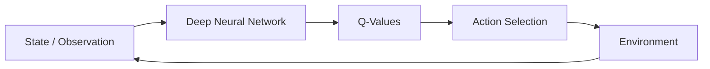

---

# 🧠 Example

Suppose the agent has four possible actions:

```text
Up
Down
Left
Right
```

The DQN may output:

```text
Q(Up)    = 2.1
Q(Down)  = 5.4
Q(Left)  = 1.7
Q(Right) = 3.8
```

The greedy action is:

```text
Down
```

because it has the highest estimated Q-value.

---

# 🧠 DQN Input and Output

For a discrete action space:

```text
Input:

State

        ↓

Neural Network

        ↓

Output:

Q(s, a₁)
Q(s, a₂)
Q(s, a₃)
...
Q(s, aₙ)
```

The network usually outputs Q-values for all possible discrete actions in a single forward pass.

---

# 🧠 DQN for Image-Based Environments

For visual environments, a CNN can process the image.

```text
Game Frame
    ↓
CNN
    ↓
Feature Representation
    ↓
Fully Connected Layers
    ↓
Q-Values
```

---

# 🧠 CNN-Based DQN

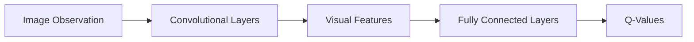

---

# 🧠 DQN Decision Process

At each timestep:

```text
1. Observe State
2. Pass State through DQN
3. Obtain Q-Values
4. Select Action
5. Execute Action
6. Receive Reward
7. Observe Next State
8. Store Experience
9. Sample Training Batch
10. Update Network
```

---

# 🔄 DQN Interaction Loop

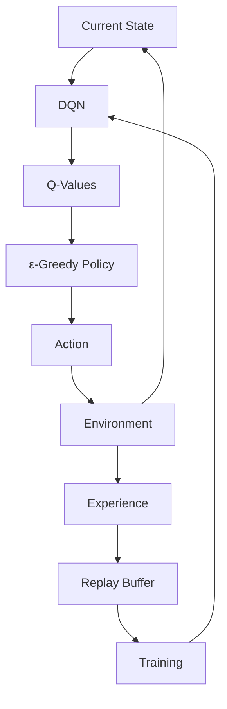

---

# 🧠 Q-Learning Foundation

DQN is based on the Q-Learning update.

The traditional Q-Learning target is:

\[
y=r+\gamma\max_{a'}Q(s',a')
\]


DQN uses a neural network to approximate the Q-function.

Therefore:

```text
Q-Table
```

becomes:

```text
Neural Network
```

---

# 🧠 DQN Target

For a transition:

```text
(s, a, r, s')
```

the target is commonly:

\[
y=r+\gamma\max_{a'}Q(s',a';\theta^-)
\]

for non-terminal states.

Here:

```text
θ⁻ = Target Network Parameters
```

---

# 🧠 DQN Loss

The DQN network tries to make its predicted Q-value approach the target.

A common loss is:

\[
L(\theta)
=
\mathbb{E}
\left[
\left(
y-Q(s,a;\theta)
\right)^2
\right]
\]


Conceptually:

```text
Predicted Q-Value
        ↓
Compare
        ↓
Target Q-Value
        ↓
Loss
        ↓
Backpropagation
        ↓
Update DQN
```

---

# 🧠 Terminal States

If the next state is terminal, there is no future reward to estimate.

The target becomes:

\[
y=r
\]


For non-terminal states:

\[
y=r+\gamma\max_{a'}Q(s',a')
\]

---

# 🧠 DQN Training Objective

The model learns to minimize:

```text
Difference Between:

Predicted Q-Value

and

Target Q-Value
```

The training process therefore resembles supervised learning:

```text
State
 ↓
DQN Prediction
 ↓
Q-Value
 ↓
Target Calculation
 ↓
Loss
 ↓
Backpropagation
```

But the targets are generated from RL experience rather than provided by a fixed labeled dataset.

---

# 🧠 Why Is DQN Difficult to Train?

Naively training a neural network directly on consecutive RL experiences can be unstable.

Two major problems are:

```text
Correlated Experiences
+
Moving Targets
```

DQN addresses these using:

```text
Experience Replay
+
Target Networks
```

These are foundational DQN techniques.

---

# 🧠 Experience Replay

Experience Replay stores previously observed transitions in a replay buffer.

Each experience contains:

```text
(state,
 action,
 reward,
 next_state,
 done)
```

---

# 🧠 Replay Buffer

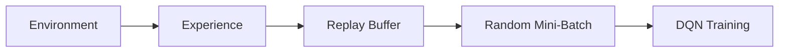

---

# 🧠 Why Experience Replay?

Without replay:

```text
Experience 1
Experience 2
Experience 3
Experience 4
```

are highly correlated.

This can make neural-network training unstable.

Replay breaks some of this correlation by sampling experiences randomly.

```text
Replay Buffer
      ↓
Random Sample
      ↓
Mini-Batch
      ↓
Training
```

---

# 🧠 Experience Replay Benefits

Experience replay provides:

- Reduced correlation between consecutive samples
- Better data efficiency
- Reuse of past experiences
- More stable training
- Mini-batch training compatible with Deep Learning

---

# 🧠 Replay Buffer Capacity

A replay buffer typically has a maximum capacity.

For example:

```text
Capacity = 100,000 transitions
```

When the buffer becomes full:

```text
Oldest Experience
       ↓
Removed
```

and new experiences are added.

---

# 🧠 Replay Buffer Lifecycle

```text
Experience
   ↓
Add to Buffer
   ↓
Buffer Fills
   ↓
Random Mini-Batch
   ↓
Train DQN
   ↓
Repeat
```

---

# 🧠 Warm-Up Period

Training may not begin immediately.

The replay buffer can first be populated with enough experiences.

```text
Collect Experiences
       ↓
Minimum Buffer Size
       ↓
Start Training
```

This can improve early training stability.

---

# 🧠 Target Network

The second major DQN technique is the:

> **Target Network**

Instead of calculating both:

```text
Current Q-Value
```

and:

```text
Target Q-Value
```

using the exact same rapidly changing network, DQN uses a separate target network.

---

# 🧠 Online Network vs Target Network

DQN commonly maintains two networks:

```text
Online Network
Target Network
```

### Online Network

Used for:

```text
Current Q-Value
Action Selection
Training
```

### Target Network

Used for:

```text
Target Q-Value
```

---

# 🧠 DQN Dual-Network Architecture

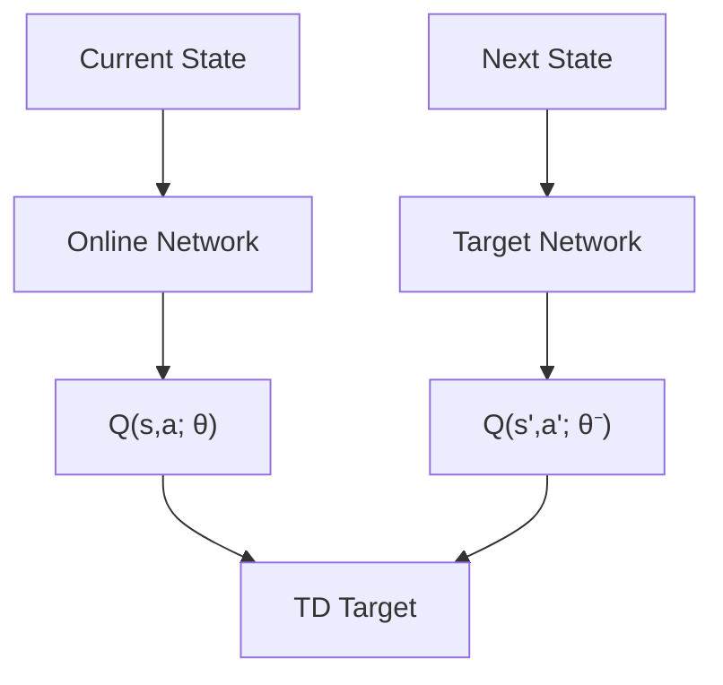

---

# 🧠 Why Target Networks?

If the network being trained also constantly changes the target, the optimization target moves continuously.

This can cause instability.

The target network is updated less frequently.

```text
Online Network
     ↓
Updated Frequently

Target Network
     ↓
Updated Periodically
```

---

# 🧠 Target Network Update

A simple strategy is:

```text
Every N Training Steps:

θ⁻ ← θ
```

where:

```text
θ  = Online Network Parameters
θ⁻ = Target Network Parameters
```

---

# 🧠 Hard Target Update

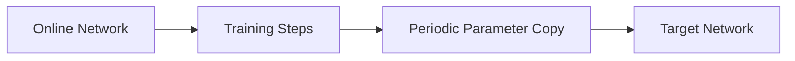

---

# 🧠 Soft Target Updates

An alternative is to update the target network gradually.

Conceptually:

\[
\theta^-
\leftarrow
\tau\theta
+
(1-\tau)\theta^-
\]

where:

```text
τ = Small Update Rate
```

This approach is more commonly associated with actor-critic methods but illustrates another way of stabilizing target updates.

---

# 🧠 DQN Training Architecture

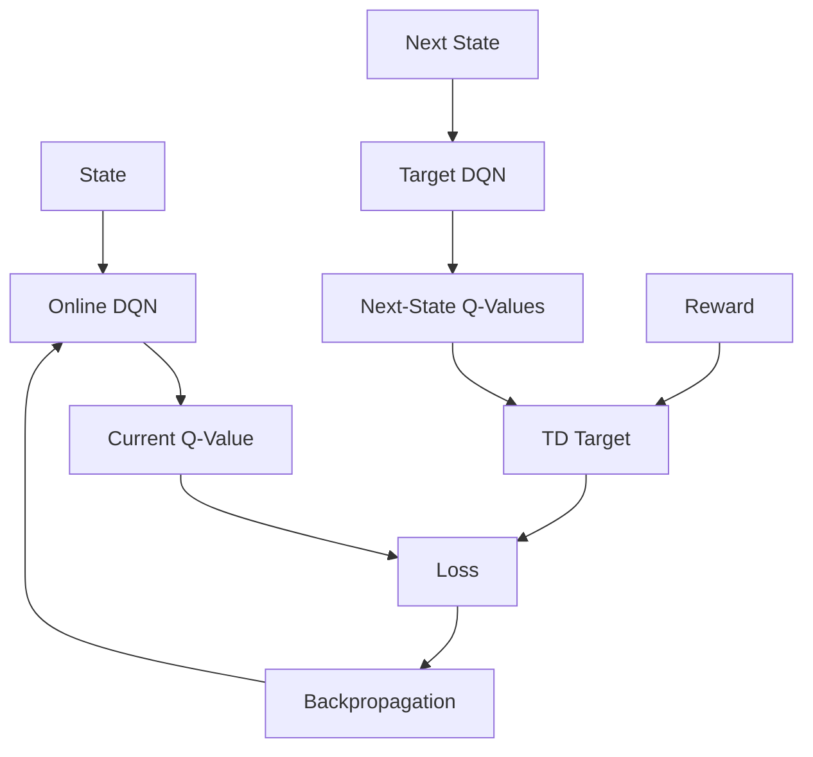

---

# 🧠 Complete DQN Learning Loop

```text
Initialize Online Network
Initialize Target Network
Initialize Replay Buffer

        ↓

Observe State

        ↓

Select Action using ε-Greedy

        ↓

Execute Action

        ↓

Receive Reward and Next State

        ↓

Store Transition

        ↓

Sample Mini-Batch

        ↓

Calculate TD Targets

        ↓

Calculate DQN Loss

        ↓

Backpropagate

        ↓

Update Online Network

        ↓

Periodically Update Target Network

        ↓

Repeat
```

---

# 🧠 DQN Algorithm

Pseudo-code:

```python
initialize online_network
initialize target_network

copy online_network parameters to target_network

replay_buffer = ReplayBuffer()

for each episode:

    state = env.reset()

    while not done:

        if random() < epsilon:
            action = random_action()
        else:
            q_values = online_network(state)
            action = argmax(q_values)

        next_state, reward, done = env.step(action)

        replay_buffer.add(
            state,
            action,
            reward,
            next_state,
            done
        )

        if replay_buffer.is_ready():

            batch = replay_buffer.sample(batch_size)

            current_q = online_network(batch.states)
            current_q = current_q[batch.actions]

            next_q = target_network(batch.next_states)

            target_q = (
                batch.rewards
                + gamma
                * max(next_q)
                * (1 - batch.done)
            )

            loss = mse(current_q, target_q)

            optimizer.zero_grad()
            loss.backward()
            optimizer.step()

        periodically:
            target_network.load_state_dict(
                online_network.state_dict()
            )

        state = next_state
```

---

# 🧠 DQN Training Flow

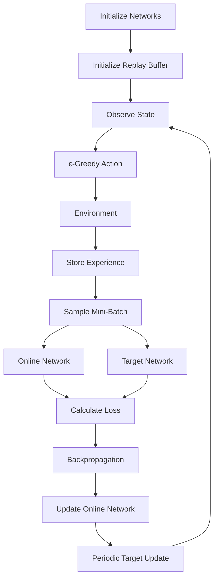

---

# 🧠 ε-Greedy in DQN

DQN commonly uses ε-greedy exploration.

```text
Probability ε
    ↓
Random Action

Probability 1 - ε
    ↓
Argmax Q-Value
```

At the beginning:

```text
High ε
```

During training:

```text
ε decreases
```

Eventually:

```text
Mostly Greedy Actions
```

---

# 🧠 Exploration Schedule

Example:

```text
Episode 1
ε = 1.0

      ↓

Episode 100
ε = 0.5

      ↓

Episode 500
ε = 0.1

      ↓

Episode 1000
ε = 0.01
```

The exact schedule depends on the environment and training strategy.

---

# 🧠 DQN Hyperparameters

Important DQN hyperparameters include:

```text
Learning Rate
Discount Factor
Exploration Rate
Exploration Decay
Batch Size
Replay Buffer Size
Target Update Frequency
Training Frequency
```

Architecture-specific parameters include:

```text
Hidden Layers
Hidden Dimensions
CNN Filters
Kernel Sizes
Activation Functions
```

---

# 🧠 Replay Buffer Size

A larger replay buffer can provide more diverse experiences.

But:

```text
Very Large Buffer
    ↓
Older / Stale Experiences
```

A smaller buffer may:

```text
Lose Diversity
```

The appropriate size depends on the environment.

---

# 🧠 Batch Size

The DQN is trained using mini-batches sampled from replay memory.

Example:

```text
Replay Buffer
    ↓
32 Experiences
    ↓
DQN Update
```

Common batch sizes might include:

```text
32
64
128
```

but should be tuned for the environment and hardware.

---

# 🧠 Target Update Frequency

The target network can be updated:

```text
Every N Steps
```

If updated too frequently:

```text
Target Changes Quickly
↓
Less Stability
```

If updated too rarely:

```text
Target Becomes Stale
```

This creates a trade-off.

---

# 🧠 DQN Loss Curve

During training, monitor:

```text
Training Loss
```

Conceptually:

```text
Loss
 │\
 │ \
 │  \__
 │     \__
 │        \____
 │             \__
 └────────────────────
       Training Steps
```

However, lower loss does not necessarily mean better policy performance.

Always evaluate:

```text
Reward
+
Success Rate
+
Task Performance
```

---

# 🧠 Reward Curve

A more important metric is often:

```text
Average Episode Reward
```

Example:

```text
Reward
  │
  │                 _______
  │             ___/
  │         ___/
  │      __/
  │   __/
  │__/
  └────────────────────────
      Training Episodes
```

RL reward curves can be highly noisy, so moving averages are often useful.

---

# 🧠 DQN Evaluation

Evaluate the trained policy without exploration.

During evaluation:

```text
ε ≈ 0
```

The agent generally chooses:

```text
argmax Q(s,a)
```

for each state.

---

# 🧠 Training vs Evaluation

| Training | Evaluation |
|---|---|
| Exploration enabled | Exploration minimized |
| Network parameters updated | No parameter updates |
| Replay buffer used | Usually not needed |
| Rewards drive learning | Rewards measure performance |
| Multiple episodes | Multiple evaluation episodes |

---

# 🧠 DQN Failure Modes

Common problems include:

```text
Unstable Learning
Divergence
Poor Exploration
Overestimation
Sparse Rewards
Catastrophic Forgetting
Replay Buffer Problems
Q-Value Explosion
Slow Convergence
```

---

# ⚠ Q-Value Explosion

If Q-values become extremely large:

```text
Q-Values
   ↓
Very Large
   ↓
Large TD Errors
   ↓
Large Gradients
   ↓
Training Instability
```

Potential causes include:

```text
Learning Rate Too High
Reward Scaling Problems
Poor Target Updates
Unstable Environment
```

---

# ⚠ Reward Scaling

Extremely large rewards can destabilize training.

For example:

```text
Reward = +1,000,000
```

may produce very large targets.

Reward normalization or clipping can sometimes help, depending on the problem.

---

# ⚠ Sparse Rewards

Consider:

```text
0
0
0
0
0
0
+100
```

The agent receives very little learning signal.

Possible strategies include:

```text
Reward Shaping
Curriculum Learning
Better Exploration
Intrinsic Rewards
Demonstrations
```

---

# ⚠ Correlated Experience

Consecutive experiences can be strongly correlated:

```text
State 1
State 2
State 3
State 4
```

Training directly on this sequence can make optimization inefficient.

Experience replay addresses this by randomly sampling from historical experiences.

---

# ⚠ Non-Stationary Targets

The target changes as the network learns.

```text
Network Update
    ↓
Q-Value Changes
    ↓
Target Changes
    ↓
Learning Problem Changes
```

The target network reduces the rate at which the target changes.

---

# 🧠 Double DQN

Standard DQN can overestimate action values because the same value estimates are involved in:

```text
Action Selection
+
Action Evaluation
```

Double DQN separates these roles.

---

# 🧠 Standard DQN Target

Standard DQN uses:

\[
y=
r+
\gamma
\max_{a'}
Q(s',a';\theta^-)
\]

---

# 🧠 Double DQN Target

Double DQN selects the action using the online network:

\[
a^*
=
\arg\max_{a'}
Q(s',a';\theta)
\]

and evaluates that action using the target network:

\[
y=
r+
\gamma
Q(s',a^*;\theta^-)
\]


This can reduce overestimation bias.

---

# 🧠 DQN vs Double DQN

| DQN | Double DQN |
|---|---|
| Max operation used directly | Online network selects action |
| Target network evaluates max | Target network evaluates selected action |
| Can overestimate Q-values | Reduces overestimation |
| Simpler | More robust value estimation |

---

# 🧠 Dueling DQN

Dueling DQN separates:

```text
State Value
```

from:

```text
Action Advantage
```

The architecture contains two streams.

```text
State Representation
       ↓
 ┌─────┴─────┐
 ↓           ↓
Value      Advantage
Stream      Stream
 ↓           ↓
 └─────┬─────┘
       ↓
   Q-Values
```

---

# 🧠 Value and Advantage

The Q-function can conceptually be decomposed as:

\[
Q(s,a)=V(s)+A(s,a)
\]

with an appropriate normalization to ensure identifiability.

The idea is:

```text
V(s)
=
How good is the state?

A(s,a)
=
How much better or worse is this action
relative to other actions?
```

---

# 🧠 Dueling DQN Architecture

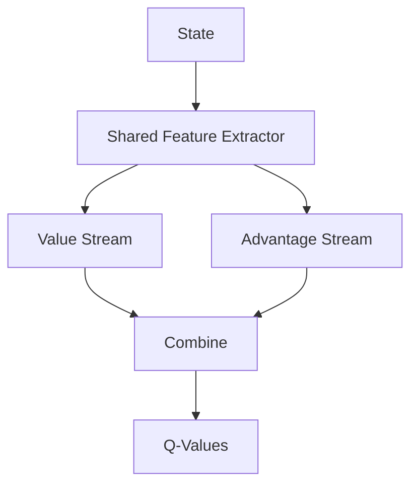

---

# 🧠 Why Dueling Architecture?

Some states may have similar values across many actions.

For example:

```text
State = Safe Room
```

Actions:

```text
Left
Right
Up
Down
```

If all actions are similarly good, learning separate Q-values for every action may be inefficient.

Dueling architecture explicitly learns:

```text
State Value
+
Action Advantage
```

---

# 🧠 Prioritized Experience Replay

Standard replay samples experiences approximately uniformly.

Prioritized Experience Replay gives higher probability to experiences that may provide more useful learning signals.

A common priority signal is related to:

```text
TD Error
```

Large TD error:

```text
Potentially More Informative Experience
```

---

# 🧠 Prioritized Replay

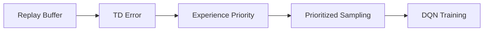

---

# 🧠 Why Prioritized Replay?

Suppose:

```text
Experience A
TD Error = 0.01

Experience B
TD Error = 5.0
```

Experience B may provide a stronger learning signal.

Prioritized replay increases the probability of sampling such experiences.

---

# 🧠 Advanced DQN

Modern DQN implementations may combine:

```text
Double DQN
+
Dueling DQN
+
Prioritized Experience Replay
+
Multi-Step Returns
+
Distributional RL
+
Noisy Networks
```

These techniques address different limitations of the basic DQN approach.

---

# 🧠 DQN Family

```text
DQN
│
├── Double DQN
│
├── Dueling DQN
│
├── Prioritized Replay
│
├── Multi-Step DQN
│
├── Distributional DQN
│
└── Noisy Networks
```

---

# 🧠 Distributional Reinforcement Learning

Standard Q-Learning estimates:

```text
Expected Return
```

Distributional RL attempts to model:

```text
Distribution of Returns
```

instead of only the expected value.

Conceptually:

```text
Q(s,a)
```

becomes:

```text
Distribution of Possible Returns
```

This can provide richer information about uncertainty and outcome variability.

---

# 🧠 Noisy Networks

Noisy Networks introduce learnable noise into network parameters to encourage exploration.

Instead of relying entirely on:

```text
ε-Greedy
```

the network itself can produce exploratory behavior.

---

# 🧠 Multi-Step Returns

Standard Q-Learning often uses one-step targets.

Multi-step methods incorporate several future rewards:

```text
rₜ
+
γrₜ₊₁
+
γ²rₜ₊₂
+
...
```

This can improve learning in some environments by propagating rewards more quickly.

---

# 🧠 DQN and Continuous Actions

Standard DQN is naturally suited to:

```text
Discrete Action Spaces
```

For example:

```text
Up
Down
Left
Right
```

It is not directly suited to large continuous action spaces such as:

```text
Steering Angle ∈ [-1,1]
```

For continuous actions, other algorithms are commonly used, such as:

```text
DDPG
TD3
SAC
PPO
```

These will be discussed as part of broader Deep RL approaches.

---

# 🧠 DQN vs Policy Gradient

| DQN | Policy Gradient |
|---|---|
| Value-based | Policy-based |
| Learns Q-values | Learns policy |
| Strong for discrete actions | Can handle continuous actions |
| Uses replay naturally | Often uses trajectories/on-policy data |
| ε-greedy commonly used | Stochastic policy often used |

---

# 🧠 DQN vs Actor-Critic

| DQN | Actor-Critic |
|---|---|
| Value-based | Policy + value |
| Learns Q-function | Actor learns policy |
| Discrete actions | Can support continuous actions |
| Replay commonly used | Depends on algorithm |
| Off-policy | Can be on-policy or off-policy |

---

# 🧠 DQN with PyTorch

A simplified DQN can be implemented using:

```python
import torch
import torch.nn as nn


class DQN(nn.Module):

    def __init__(self, state_dim, action_dim):
        super().__init__()

        self.network = nn.Sequential(
            nn.Linear(state_dim, 128),
            nn.ReLU(),
            nn.Linear(128, 128),
            nn.ReLU(),
            nn.Linear(128, action_dim)
        )

    def forward(self, state):
        return self.network(state)
```

The network receives:

```text
State
```

and produces:

```text
Q-Values for Every Action
```

---

# 🧠 DQN Training Step

A simplified training step:

```python
q_values = online_network(states)

current_q = q_values.gather(
    1,
    actions.unsqueeze(1)
).squeeze(1)

with torch.no_grad():

    next_q = target_network(next_states).max(
        dim=1
    ).values

    target_q = rewards + (
        gamma * next_q * (1 - dones)
    )

loss = nn.functional.mse_loss(
    current_q,
    target_q
)

optimizer.zero_grad()
loss.backward()
optimizer.step()
```

---

# 🧠 Why `detach` / `no_grad`?

The target network is used to calculate the learning target.

We normally do not backpropagate through the target calculation.

Therefore:

```python
with torch.no_grad():
```

prevents unnecessary gradient computation through the target network.

---

# 🧠 DQN Training Components

A complete implementation typically contains:

```text
Environment
Replay Buffer
Online Network
Target Network
Optimizer
Loss Function
Exploration Strategy
Training Loop
Evaluation Loop
```

---

# 🧠 DQN Software Architecture

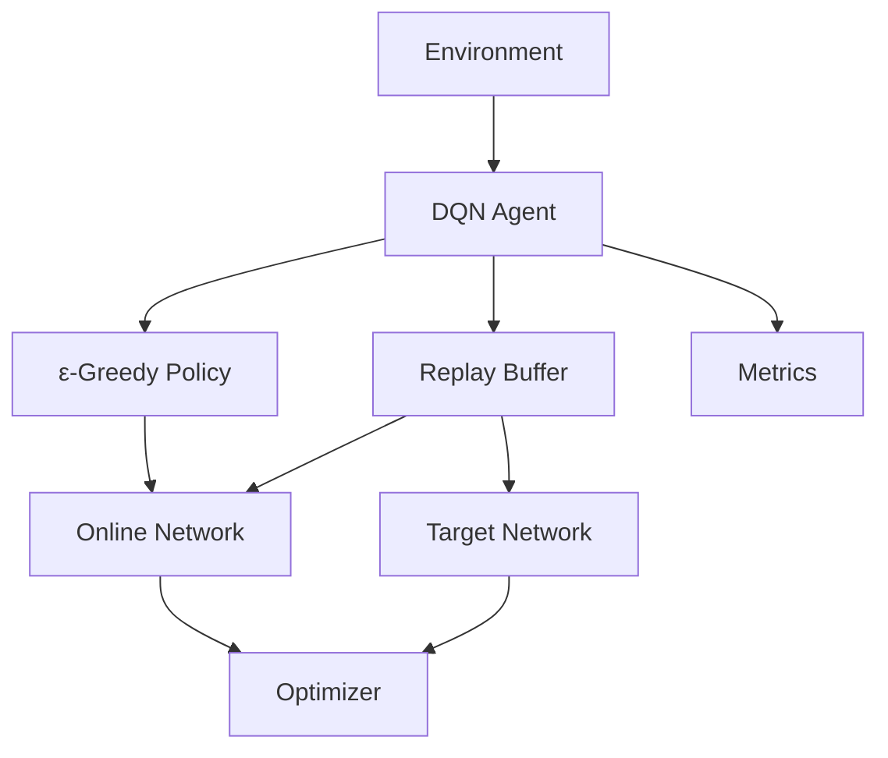

---

# 🧪 Practical Exercise 1 — CartPole DQN

Implement DQN for a simple environment such as CartPole.

The agent should learn to:

```text
Balance Pole
```

by choosing:

```text
Left
Right
```

---

# 🧪 Practical Exercise 2 — Replay Buffer

Implement a replay buffer:

```python
class ReplayBuffer:

    def add(
        self,
        state,
        action,
        reward,
        next_state,
        done
    ):
        ...

    def sample(self, batch_size):
        ...
```

Track:

```text
Buffer Size
Sample Distribution
Training Frequency
```

---

# 🧪 Practical Exercise 3 — Target Network

Train two versions:

```text
DQN without Target Network
```

and:

```text
DQN with Target Network
```

Compare:

```text
Training Stability
Reward
Q-Values
Loss
```

---

# 🧪 Practical Exercise 4 — ε Schedule

Compare:

```text
Constant ε
```

with:

```text
Decaying ε
```

Measure:

```text
Exploration
Reward
Convergence
```

---

# 🧪 Practical Exercise 5 — CNN DQN

Use image observations.

Build:

```text
Image
 ↓
CNN
 ↓
Feature Representation
 ↓
Q-Values
```

---

# 🧪 Practical Exercise 6 — Double DQN

Implement:

```text
DQN
```

and:

```text
Double DQN
```

Compare:

```text
Q-Value Estimates
Reward
Training Stability
```

---

# 🧪 Practical Exercise 7 — Dueling DQN

Modify the network to produce:

```text
Value Stream
+
Advantage Stream
```

Compare performance with standard DQN.

---

# 🧪 Practical Exercise 8 — Prioritized Replay

Implement prioritized experience replay using TD error.

Compare:

```text
Uniform Replay
```

versus:

```text
Prioritized Replay
```

---

# 🧪 Practical Exercise 9 — DQN Experiment Tracking

Track every experiment:

```text
Environment
Model Version
Learning Rate
Batch Size
Gamma
Epsilon
Replay Buffer
Target Update Frequency
Average Reward
Training Steps
```

Use an experiment tracking system such as MLflow.

---

# 🧪 Practical Exercise 10 — Production DQN Service

Design:

```text
Environment / Simulator
       ↓
Experience Collection
       ↓
Replay Store
       ↓
GPU Training
       ↓
Model Registry
       ↓
Policy Evaluation
       ↓
Deployment
       ↓
Safety Layer
       ↓
Production Environment
       ↓
Monitoring
```

---

# 🧠 Interview Questions

## Beginner

### 1. What is Deep Reinforcement Learning?

Deep Reinforcement Learning combines Reinforcement Learning with Deep Neural Networks to learn policies, value functions, or Q-functions in complex environments.

### 2. What is DQN?

DQN is a neural-network-based approach for approximating the Q-function in Reinforcement Learning.

### 3. Why is DQN needed?

DQN allows Q-Learning to work with large and high-dimensional state spaces where a Q-table is impractical.

### 4. What does a DQN output?

For a discrete action space, a DQN typically outputs a Q-value for each possible action.

### 5. What is experience replay?

Experience replay stores past transitions and randomly samples mini-batches for training.

---

## Intermediate

### 6. Why is experience replay useful?

It reduces correlation between consecutive experiences, improves data reuse, and provides more stable neural-network training.

### 7. What is a target network?

A target network is a delayed copy of the online network used to calculate more stable TD targets.

### 8. Why are two networks used in DQN?

Separating the online network from the target network reduces instability caused by rapidly changing targets.

### 9. What is the DQN loss?

It measures the difference between the predicted Q-value and the TD target.

### 10. What is the role of ε-greedy?

It balances exploration and exploitation during action selection.

### 11. Why is DQN mainly used for discrete actions?

Because the network typically outputs one Q-value for each action, which becomes impractical for large or continuous action spaces.

---

## Advanced

### 12. What is Double DQN?

Double DQN reduces Q-value overestimation by separating action selection from action evaluation.

### 13. What is Dueling DQN?

Dueling DQN separately estimates state value and action advantage before combining them into Q-values.

### 14. What is prioritized experience replay?

It samples experiences according to their learning importance, often based on TD error.

### 15. What is the difference between DQN and Q-Learning?

Q-Learning uses a table for small discrete state spaces, while DQN uses a neural network to approximate Q-values for larger state spaces.

### 16. Why can DQN training become unstable?

Common causes include correlated data, moving targets, large learning rates, reward scaling problems, and poor exploration.

### 17. What is Q-value overestimation?

It occurs when estimated Q-values become systematically higher than their actual expected values.

### 18. How does Double DQN address overestimation?

It uses the online network to select the action and the target network to evaluate that action.

### 19. Why is replay-buffer warm-up useful?

It ensures that training starts with a sufficiently diverse set of experiences rather than a tiny, highly correlated dataset.

### 20. Why is DQN not ideal for continuous action spaces?

Because enumerating and comparing all possible continuous actions is not practical.

---

# 🏢 Enterprise Perspective

Deep Reinforcement Learning moves Reinforcement Learning from small, explicitly represented environments toward complex environments with high-dimensional observations.

The evolution is:

```text
Tabular Q-Learning
       ↓
Function Approximation
       ↓
Deep Q-Network
       ↓
Double DQN
       ↓
Dueling DQN
       ↓
Prioritized Replay
       ↓
Modern Deep RL
```

For an AI Engineer, the important architectural concept is:

```text
Environment
     ↓
Experience
     ↓
Replay
     ↓
Neural Network
     ↓
Policy
     ↓
Action
     ↓
Environment
```

This creates a continuous learning loop.

---

# 🏢 Production Deep RL Architecture

A production system can separate:

```text
Training Plane
```

from:

```text
Inference / Decision Plane
```

---

# 🏢 Training Plane

```text
Environment / Simulator
        ↓
Experience Collection
        ↓
Replay Storage
        ↓
GPU Training
        ↓
Evaluation
        ↓
Model Registry
```

---

# 🏢 Inference Plane

```text
Production State
      ↓
Policy Service
      ↓
DQN
      ↓
Action
      ↓
Safety Guardrails
      ↓
Production Environment
```

---

# 🏢 Training vs Inference

| Training Plane | Inference Plane |
|---|---|
| Expensive GPU compute | Low-latency inference |
| Replay buffer | Policy model |
| Backpropagation | Forward pass |
| Exploration | Usually deterministic / controlled policy |
| Frequent experimentation | Stable production version |

---

# 🏢 Production Architecture

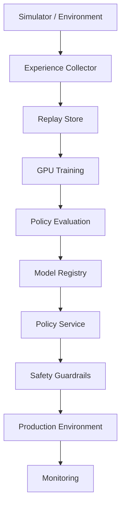

---

# 🏢 Model Registry

Every trained DQN should be versioned.

Track:

```text
Model Version
Environment Version
Reward Function
Replay Dataset
Hyperparameters
Network Architecture
Training Steps
Evaluation Metrics
```

---

# 🏢 Policy Deployment

A production deployment may use:

```text
Candidate Policy
      ↓
Offline Evaluation
      ↓
Shadow Testing
      ↓
Limited Rollout
      ↓
Production
```

This reduces the risk of deploying an unsafe or underperforming policy.

---

# 🏢 Shadow Mode

In shadow mode:

```text
Production Environment
        ↓
Existing Policy → Real Action
        ↓
Candidate DQN → Suggested Action
```

The candidate policy does not control the environment.

Its decisions are logged and evaluated.

---

# 🏢 Canary Deployment

A new policy can be gradually introduced:

```text
Policy v1 → 100%

Policy v2 → 0%
```

Then:

```text
Policy v1 → 90%
Policy v2 → 10%
```

and gradually:

```text
Policy v1 → 50%
Policy v2 → 50%
```

until the new policy is fully deployed.

---

# 🛡️ Safety Guardrails

A DQN should not necessarily have unrestricted control over a production system.

A safety layer can enforce:

```text
Business Rules
Action Constraints
Resource Limits
Rate Limits
Emergency Stop
Human Approval
```

---

# 🏢 Observability

Monitor both:

### RL Metrics

```text
Episode Reward
Q-Value Distribution
TD Error
Action Distribution
Policy Success Rate
```

### Infrastructure Metrics

```text
GPU Utilization
GPU Memory
CPU Usage
Latency
Throughput
```

### Business Metrics

```text
Cost
Revenue
Conversion
Resource Utilization
Customer Impact
```

---

# 🏢 Deep RL Monitoring

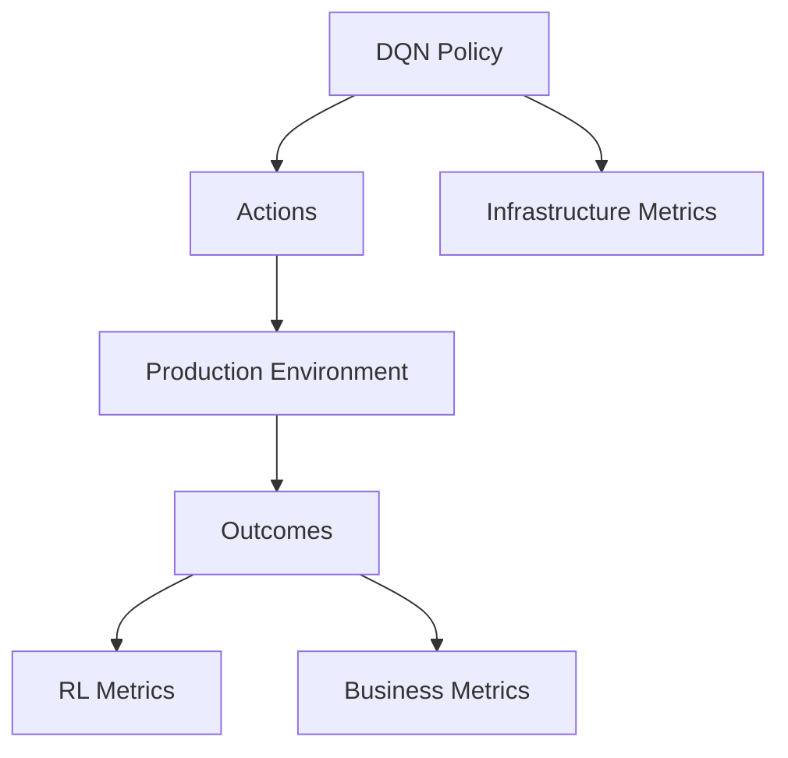

---

# 🏢 Model Drift and Environment Drift

A production environment may change:

```text
Training Environment
       ↓
Production Environment
       ↓
Different Dynamics
```

This can cause:

```text
Policy Performance ↓
```

Therefore production RL systems require continuous monitoring and evaluation.

---

# 🏢 Rollback

A robust deployment should support:

```text
DQN v1
   ↓
DQN v2
   ↓
Performance Degradation
   ↓
Rollback
   ↓
DQN v1
```

---

# 🧠 DQN System Design Checklist

Before deploying a DQN system, evaluate:

```text
Is the action space discrete?
Is the state representation sufficient?
Is the reward well designed?
Is exploration safe?
Is a simulator available?
Is replay storage scalable?
Are target updates stable?
Is the policy evaluated offline?
Are guardrails available?
Can the model be rolled back?
Can environment drift be detected?
```

---

!!! tip "Production Insight"

    **DQN is not simply Q-Learning with a neural network.**

    The practical success of DQN comes from combining several engineering and algorithmic techniques:

    ```text
    Neural Network
         +
    Experience Replay
         +
    Target Network
         +
    Exploration Strategy
         +
    Temporal-Difference Learning
    ```

    These components address the fundamental instability of applying neural networks directly to sequential RL data.

    In production, the system must go even further:

    ```text
    Simulator
         ↓
    Experience Pipeline
         ↓
    GPU Training
         ↓
    Evaluation
         ↓
    Model Registry
         ↓
    Safe Deployment
         ↓
    Monitoring
         ↓
    Rollback
    ```

    The model is only one component of the overall Deep Reinforcement Learning platform.

---

# 📌 Key Takeaways

- Deep Reinforcement Learning combines Reinforcement Learning with Deep Neural Networks.
- DQN uses a neural network to approximate the Q-function.
- DQN makes Q-Learning practical for large and high-dimensional state spaces.
- A DQN typically outputs Q-values for all available discrete actions.
- CNNs can be used when the state is represented as an image.
- DQN is based on the Bellman optimality principle and temporal-difference learning.
- Experience replay stores previous transitions and samples random mini-batches for training.
- Experience replay reduces correlation between consecutive experiences and improves data reuse.
- DQN uses an online network to learn current Q-values.
- DQN uses a target network to provide more stable TD targets.
- The target network is updated less frequently than the online network in the classic DQN approach.
- ε-greedy exploration balances exploration and exploitation.
- DQN training can become unstable because of correlated experiences and moving targets.
- Reward scaling, learning rates, exploration, and target updates can strongly affect training stability.
- Double DQN reduces Q-value overestimation by separating action selection and evaluation.
- Dueling DQN separates state-value estimation from action-advantage estimation.
- Prioritized Experience Replay samples experiences based on their learning importance.
- Multi-step, distributional, and noisy-network techniques extend the DQN family.
- DQN is naturally suited to discrete action spaces.
- Continuous action spaces generally require other Deep RL algorithms.
- Production Deep RL requires simulation, experience management, model evaluation, safety guardrails, monitoring, and rollback.
- Training and inference should often be separated into distinct architectural planes.
- DQN provides an important bridge between classical Reinforcement Learning and modern Deep Reinforcement Learning.

---

# 📚 Further Reading

Continue with:

- **[35. GPU Accelerated Deep Learning](35-gpu-accelerated-deep-learning.md)**
- **[36. Deep Learning Training and Model Lifecycle](36-deep-learning-training-and-model-lifecycle.md)**
- **[37. Building Production Deep Learning Systems](37-building-production-deep-learning-systems.md)**

---

## ➡️ Next Chapter

**[35. GPU Accelerated Deep Learning](35-gpu-accelerated-deep-learning.md)**

---

> **Enterprise AI Engineering Handbook**  
> *Building Production-Grade Enterprise AI Systems — One Chapter at a Time.*