# 35. GPU Accelerated Deep Learning

> Understand how GPUs accelerate Deep Learning workloads, how modern frameworks use CUDA and accelerator hardware, and how GPU memory, parallel computation, mixed precision, batching, distributed training, and inference optimization contribute to production-grade Deep Learning systems.

---

## 🎯 Learning Objectives

After completing this chapter, you will be able to:

- Explain why GPUs are important for Deep Learning
- Understand CPU vs GPU architectures
- Understand parallel computation in Deep Learning
- Explain how tensors are processed on GPUs
- Understand CUDA at a high level
- Understand the role of GPU kernels
- Explain GPU memory and VRAM
- Understand the relationship between model size and GPU memory
- Understand GPU utilization
- Explain batch processing on GPUs
- Understand mixed-precision training
- Understand FP32, FP16, and BF16
- Understand Tensor Cores at a high level
- Explain automatic mixed precision
- Understand gradient scaling
- Understand GPU memory optimization
- Understand data transfer between CPU and GPU
- Understand input pipeline bottlenecks
- Explain distributed Deep Learning
- Understand data parallelism
- Understand model parallelism
- Understand gradient synchronization
- Understand checkpointing
- Understand GPU monitoring
- Understand training performance optimization
- Understand inference optimization
- Understand GPU cost optimization
- Understand production GPU architecture
- Understand common GPU-related Deep Learning bottlenecks
- Apply GPU optimization principles to TensorFlow, Keras, and PyTorch systems

---

# 📖 Overview

Deep Learning models perform large numbers of mathematical operations involving:

```text
Matrix Multiplication
Vector Operations
Tensor Operations
Convolution
Attention
Gradient Computation
```

These operations can be executed in parallel.

This makes GPUs particularly well suited for Deep Learning.

A simplified training workflow is:

```text
Training Data
     ↓
CPU / Data Pipeline
     ↓
GPU
     ↓
Forward Pass
     ↓
Loss
     ↓
Backward Pass
     ↓
Parameter Update
     ↓
Repeat
```

Modern Deep Learning frameworks such as TensorFlow, Keras, and PyTorch provide GPU acceleration and distributed training capabilities, allowing engineers to focus on model design rather than implementing low-level parallel computation manually. :contentReference[oaicite:1]{index=1}

---

# 🚀 Why GPUs Matter for Deep Learning

Deep Learning involves enormous numbers of numerical operations.

For example, a neural network may perform:

```text
Millions / Billions of Operations
             ↓
Matrix Multiplication
             ↓
Convolution
             ↓
Activation
             ↓
Gradient Calculation
```

A CPU can execute these operations efficiently for general-purpose workloads.

A GPU is designed to execute many similar operations in parallel.

Therefore:

```text
CPU
 ↓
General-Purpose Computation

GPU
 ↓
Massively Parallel Computation
```

---

# 🧠 CPU vs GPU

| CPU | GPU |
|---|---|
| General-purpose processor | Highly parallel processor |
| Smaller number of powerful cores | Large number of parallel processing units |
| Optimized for sequential and varied workloads | Optimized for highly parallel workloads |
| Large control logic | High-throughput numerical computation |
| Excellent for orchestration | Excellent for tensor-heavy workloads |
| Commonly handles data loading and application logic | Commonly handles Deep Learning computation |

The best architecture often uses both.

```text
CPU
 │
 ├── Data Loading
 ├── Preprocessing
 ├── Application Logic
 └── Orchestration
          │
          ▼
        GPU
          │
          ├── Tensor Operations
          ├── Forward Pass
          ├── Backward Pass
          └── Inference
```

---

# 🧠 GPU Architecture Intuition

A simplified view:

```text
CPU

Few Powerful Cores
        ↓
General Computation


GPU

Many Parallel Processing Units
        ↓
Massive Parallel Computation
```

Deep Learning benefits because many operations can be performed independently.

---

# 🧠 Parallelism in Neural Networks

Consider matrix multiplication:

\[
C=AB
\]

Each element of `C` can be computed using combinations of rows and columns of `A` and `B`.

Conceptually:

```text
Matrix A
   ×
Matrix B
   ↓
Matrix C

C₁₁  C₁₂  C₁₃
C₂₁  C₂₂  C₂₃
C₃₁  C₃₂  C₃₃
```

Many of these calculations can be performed concurrently.

This is exactly the type of workload GPUs are designed to accelerate.

---

# 🧠 GPU Parallel Computation

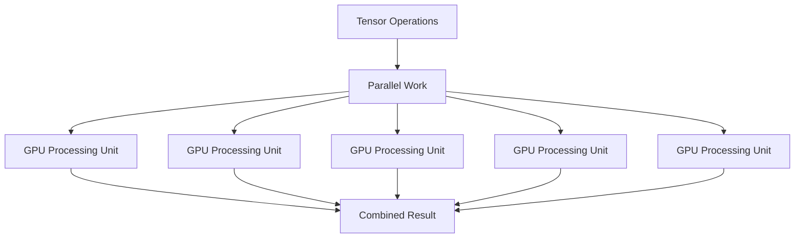

---

# 🧠 Tensor Computation

Deep Learning frameworks represent data using tensors.

Examples:

```text
Scalar
Vector
Matrix
3D Tensor
4D Tensor
5D Tensor
```

For example, an image batch may have:

```text
Batch × Channels × Height × Width
```

such as:

```text
32 × 3 × 224 × 224
```

A GPU can process many tensor elements in parallel.

---

# 🧠 GPU Tensor Pipeline

```text
Input Tensor
     ↓
Transfer to GPU
     ↓
GPU Kernel
     ↓
Parallel Computation
     ↓
Output Tensor
```

---

# 🧠 CUDA

CUDA is a GPU computing platform and programming model widely used for general-purpose GPU computation.

Deep Learning frameworks use GPU libraries and runtime components to execute operations efficiently on compatible hardware.

At a high level:

```text
PyTorch / TensorFlow
        ↓
GPU Runtime / Libraries
        ↓
CUDA
        ↓
GPU Hardware
```

---

# 🧠 CUDA Ecosystem

A simplified conceptual architecture is:

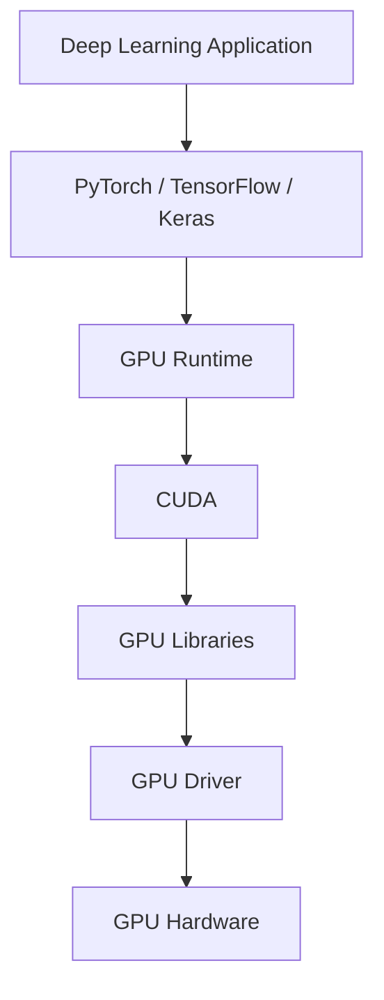

The exact software stack varies by framework, hardware, operating system, and deployment environment.

---

# 🧠 GPU Kernels

A GPU kernel is a function executed on the GPU.

For example:

```text
Matrix Multiplication
      ↓
GPU Kernel
      ↓
Parallel Execution
```

Deep Learning frameworks typically hide the low-level kernel implementation from application developers.

---

# 🧠 Why Frameworks Matter

TensorFlow, Keras, and PyTorch provide abstractions for:

- Tensor operations
- Automatic differentiation
- GPU acceleration
- Model building
- Training
- Evaluation
- Data pipelines
- Distributed training

This allows engineers to write:

```python
output = model(x)
```

instead of manually implementing GPU kernels.

---

# 🧠 GPU Memory

GPU memory is one of the most important constraints in Deep Learning.

It stores:

```text
Model Parameters
Gradients
Activations
Optimizer States
Input Batches
Intermediate Tensors
```

A simplified training-memory model is:

```text
GPU Memory
│
├── Model Parameters
├── Gradients
├── Activations
├── Optimizer States
└── Input / Intermediate Tensors
```

---

# 🧠 Why Training Uses More Memory

During inference, the system generally needs:

```text
Model
+
Input
+
Intermediate Activations
```

During training, it additionally needs:

```text
Model
+
Input
+
Activations
+
Gradients
+
Optimizer State
```

Therefore:

```text
Training Memory
>
Inference Memory
```

for the same model and input configuration.

---

# 🧠 Model Size vs GPU Memory

Suppose a model contains:

```text
100 Million Parameters
```

If parameters are stored using 32-bit floating point:

```text
100M × 4 bytes
≈ 400 MB
```

But training requires additional memory for:

```text
Gradients
Activations
Optimizer State
```

Therefore the total GPU memory requirement can be significantly higher than the raw parameter size.

---

# 🧠 GPU Memory Bottleneck

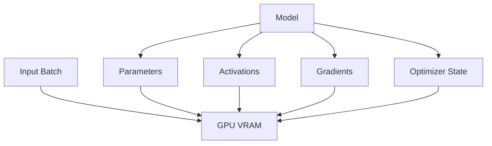

---

# ⚠ GPU Out of Memory

A common error during Deep Learning training is:

```text
CUDA Out Of Memory
```

Possible causes include:

- Batch size too large
- Model too large
- High-resolution inputs
- Large sequence length
- Excessive intermediate activations
- Optimizer memory
- Memory fragmentation
- Unreleased tensors

---

# 🛠 GPU Memory Optimization

Common techniques include:

```text
Reduce Batch Size
Reduce Input Resolution
Mixed Precision
Gradient Accumulation
Gradient Checkpointing
Model Sharding
Memory-Efficient Operations
Efficient Data Types
```

---

# 🧠 Batch Size

Batch size determines how many samples are processed together.

Example:

```text
Batch Size = 32
```

means:

```text
32 Samples
     ↓
GPU
     ↓
Forward Pass
     ↓
Loss
     ↓
Backward Pass
```

---

# 🧠 Batch Size vs GPU Utilization

Larger batches can improve GPU utilization.

```text
Small Batch
 ↓
GPU Underutilized
```

versus:

```text
Larger Batch
 ↓
More Parallel Work
 ↓
Better GPU Utilization
```

However, larger batches also require more GPU memory.

Therefore:

```text
Batch Size
     ↕
GPU Memory
     ↕
Throughput
```

must be balanced.

---

# 🧠 Batch Size Trade-Off

| Smaller Batch | Larger Batch |
|---|---|
| Lower memory usage | Higher memory usage |
| More parameter updates | Fewer updates per epoch |
| Potentially lower throughput | Potentially higher throughput |
| Easier on limited GPUs | Requires more GPU memory |

---

# 🧠 GPU Utilization

GPU utilization indicates how effectively the GPU is being used.

Low utilization may indicate:

```text
CPU Bottleneck
Data Loading Bottleneck
Small Batch Size
Synchronization Overhead
I/O Bottleneck
Poor Kernel Utilization
```

High utilization generally indicates that the GPU is receiving enough computational work, but high utilization alone does not guarantee optimal performance.

---

# 🧠 GPU Utilization Pipeline

```text
Data Source
    ↓
CPU Data Loading
    ↓
Preprocessing
    ↓
CPU → GPU Transfer
    ↓
GPU Computation
    ↓
GPU Synchronization
```

Any slow stage can reduce overall throughput.

---

# 🧠 CPU-GPU Data Transfer

Moving data between CPU memory and GPU memory introduces overhead.

Conceptually:

```text
CPU Memory
    ↓
Data Transfer
    ↓
GPU Memory
```

If transfers happen too frequently:

```text
Transfer Overhead
      ↓
GPU Waiting
      ↓
Lower Throughput
```

---

# 🧠 Data Pipeline Bottleneck


If:

```text
CPU Pipeline Speed
<
GPU Processing Speed
```

then the GPU may remain idle while waiting for data.

---

# 🧠 Input Pipeline Optimization

Possible optimizations include:

```text
Prefetching
Parallel Data Loading
Caching
Efficient Data Formats
Pinned Memory
Data Augmentation Optimization
Batch Preparation
```

---

# 🧠 Prefetching

Prefetching prepares future batches while the GPU processes the current batch.

```text
CPU:

Prepare Batch 2
        ↓
Prepare Batch 3
        ↓
Prepare Batch 4


GPU:

Process Batch 1
        ↓
Process Batch 2
        ↓
Process Batch 3
```

This reduces idle time.

---

# 🧠 Training Pipeline


---

# 🧠 Mixed Precision

Modern Deep Learning systems often use lower-precision numerical formats to improve performance and reduce memory usage.

Common formats include:

```text
FP32
FP16
BF16
```

---

# 🧠 FP32

FP32 represents:

```text
32-bit Floating Point
```

It provides high numerical precision but requires more memory and computational bandwidth than lower-precision formats.

---

# 🧠 FP16

FP16 represents:

```text
16-bit Floating Point
```

Benefits can include:

```text
Lower Memory Usage
Higher Throughput
Faster Tensor Operations
```

However, some operations may require higher precision for numerical stability.

---

# 🧠 BF16

BF16 is another 16-bit floating-point format commonly used for Deep Learning workloads.

It provides a wider exponent range than FP16 while using the same overall 16-bit storage size.

This can make BF16 attractive for many modern training workloads.

---

# 🧠 Precision Comparison

| Format | Size | Typical Use |
|---|---:|---|
| FP32 | 32-bit | High precision computation |
| FP16 | 16-bit | Mixed-precision training/inference |
| BF16 | 16-bit | Modern training workloads |

The exact hardware support and performance characteristics depend on the accelerator.

---

# 🧠 Mixed-Precision Training

Mixed precision does not necessarily mean:

```text
Everything → FP16
```

Instead, the system can use:

```text
FP16 / BF16
+
FP32
```

for different operations.

Conceptually:

```text
Model
 │
 ├── Lower Precision Operations
 │
 └── Higher Precision Operations
```

---

# 🧠 Automatic Mixed Precision

Frameworks can automatically select appropriate precision for supported operations.

```text
Model
  ↓
Automatic Mixed Precision
  ↓
FP16 / BF16 + FP32
  ↓
GPU
```

This reduces the need for manually converting every operation.

---

# 🧠 Gradient Scaling

When FP16 is used, very small gradients may underflow.

Gradient scaling can help:

```text
Loss
 ↓
Scale
 ↓
Backward Pass
 ↓
Gradients
 ↓
Unscale
 ↓
Optimizer Update
```

---

# 🧠 Mixed Precision Training Flow

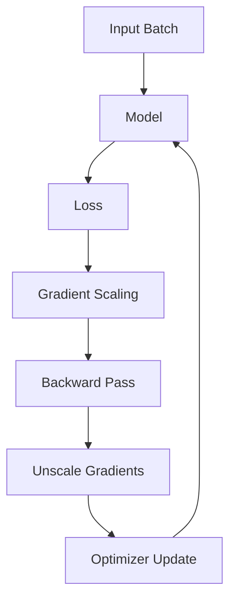

---

# 🧠 Tensor Cores

Modern GPUs include specialized hardware designed to accelerate matrix operations commonly used in Deep Learning.

These units can provide significant acceleration for supported low-precision matrix operations.

Conceptually:

```text
Matrix Operations
       ↓
Tensor Cores
       ↓
High Throughput
```

---

# 🧠 Why Tensor Cores Matter

Deep Learning relies heavily on:

```text
Matrix Multiplication
Convolution
Attention
```

These operations can benefit from specialized hardware acceleration.

---

# 🧠 GPU Acceleration Stack

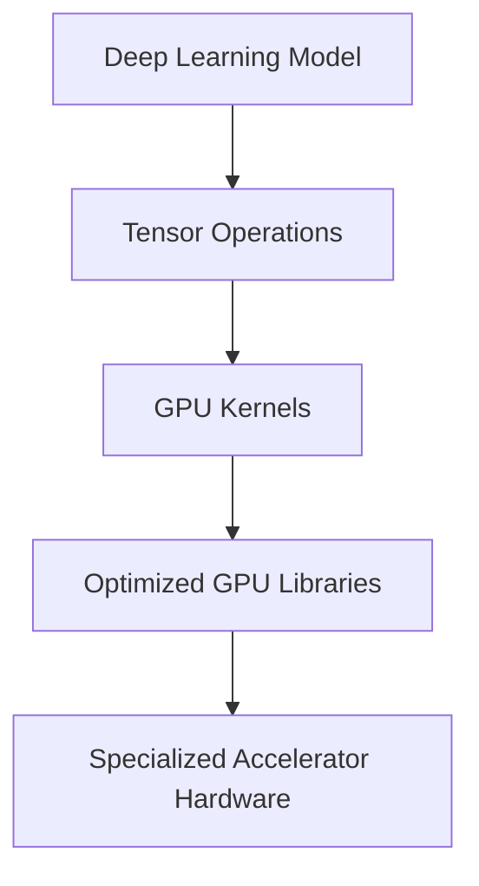

---

# 🧠 GPU Training Workflow

A typical training workflow is:

```text
Load Dataset
     ↓
Create Batches
     ↓
Transfer Batch to GPU
     ↓
Forward Pass
     ↓
Calculate Loss
     ↓
Backward Pass
     ↓
Update Parameters
     ↓
Repeat
```

---

# 🧠 PyTorch GPU Training

A simplified example:

```python
import torch

device = torch.device(
    "cuda" if torch.cuda.is_available() else "cpu"
)

model = model.to(device)

for inputs, targets in dataloader:

    inputs = inputs.to(device)
    targets = targets.to(device)

    optimizer.zero_grad()

    outputs = model(inputs)

    loss = criterion(outputs, targets)

    loss.backward()

    optimizer.step()
```

The important principle is:

```text
Model
+
Input
+
Target
```

must be placed on the appropriate device for GPU computation.

---

# 🧠 TensorFlow / Keras GPU Usage

Modern TensorFlow can automatically use supported GPUs when the environment is correctly configured.

A simplified workflow is:

```python
import tensorflow as tf

print(tf.config.list_physical_devices("GPU"))
```

The model can then be trained normally:

```python
model.fit(
    train_dataset,
    validation_data=validation_dataset,
    epochs=10
)
```

TensorFlow handles much of the device placement and GPU execution through its runtime.

---

# 🧠 GPU Availability

Always verify the actual execution environment.

For PyTorch:

```python
torch.cuda.is_available()
```

For TensorFlow:

```python
tf.config.list_physical_devices("GPU")
```

A common mistake is assuming that a GPU is being used without verifying it.

---

# ⚠ Common GPU Mistake

```text
GPU Available
     ↓
Model Created
     ↓
Input Remains on CPU
     ↓
Device Mismatch
```

Always ensure that tensors and model parameters are on compatible devices.

---

# 🧠 Checkpointing

Long Deep Learning training jobs can take hours or days.

Training should therefore save checkpoints.

```text
Training
   ↓
Checkpoint
   ↓
Continue Training
   ↓
Checkpoint
   ↓
Continue
```

---

# 🧠 Checkpoint Contents

A training checkpoint may contain:

```text
Model Parameters
Optimizer State
Scheduler State
Training Epoch
Training Step
Hyperparameters
Random State
```

---

# 🧠 Why Checkpointing Matters

Checkpoints enable:

- Recovery from failures
- Resume training
- Experiment comparison
- Model versioning
- Fine-tuning
- Deployment

---

# 🧠 Checkpoint Lifecycle

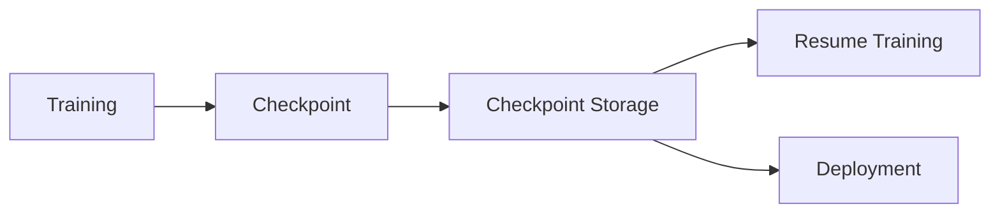

---

# 🧠 Distributed Deep Learning

A single GPU may not be sufficient for large models or datasets.

Distributed training allows multiple GPUs or machines to participate.

```text
GPU 1
GPU 2
GPU 3
GPU 4
   ↓
Distributed Training
```

---

# 🧠 Data Parallelism

In data parallelism, each GPU receives a different batch of data while maintaining a copy of the model.

```text
              Model
                │
        ┌───────┼────────┐
        ↓       ↓        ↓
      GPU 1   GPU 2    GPU 3
        │       │        │
     Batch 1  Batch 2  Batch 3
```

Each GPU computes gradients.

The gradients are then synchronized.

---

# 🧠 Data Parallelism Workflow

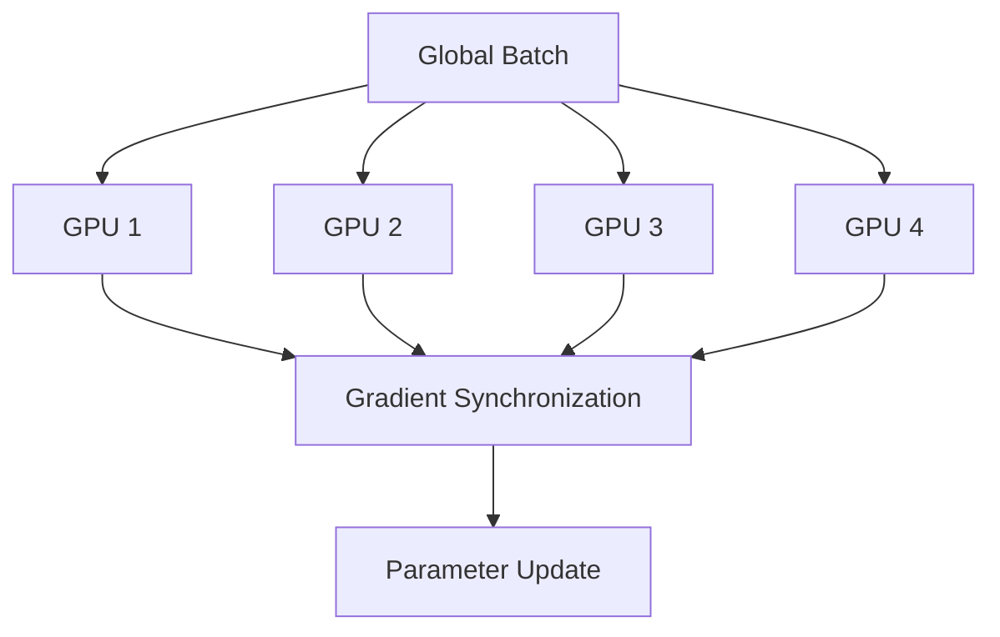

---

# 🧠 Distributed Data Parallelism

A common architecture is:

```text
One Process
    ↓
One GPU
    ↓
One Model Replica
```

across multiple workers.

Conceptually:

```text
Worker 1 → GPU 1
Worker 2 → GPU 2
Worker 3 → GPU 3
Worker 4 → GPU 4
```

Gradients are synchronized between workers.

---

# 🧠 Gradient Synchronization

Suppose:

```text
GPU 1 → Gradient G₁
GPU 2 → Gradient G₂
GPU 3 → Gradient G₃
```

The gradients can be aggregated:

\[
G=
\frac{G_1+G_2+G_3}{3}
\]

Then the synchronized gradient is used for the update.

---

# 🧠 All-Reduce

Distributed training commonly uses collective communication operations such as:

```text
All-Reduce
```

Conceptually:

```text
GPU 1 ─┐
GPU 2 ─┤
GPU 3 ─┼──► Aggregate Gradients
GPU 4 ─┘
             ↓
       Synchronized Update
```

Communication efficiency becomes increasingly important as the number of GPUs grows.

---

# 🧠 Model Parallelism

Data parallelism replicates the model across devices.

Model parallelism instead distributes different parts of the model across devices.

```text
GPU 1
 ↓
Layers 1–10
 ↓
GPU 2
 ↓
Layers 11–20
 ↓
GPU 3
 ↓
Layers 21–30
```

This can be useful when the complete model cannot fit into one GPU.

---

# 🧠 Model Parallelism

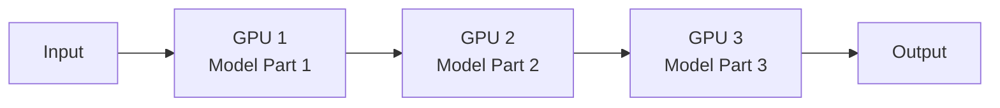

---

# 🧠 Data Parallelism vs Model Parallelism

| Data Parallelism | Model Parallelism |
|---|---|
| Replicates model | Splits model |
| Splits data | Splits model layers/components |
| Each GPU processes different data | GPUs process different model portions |
| Common for large datasets | Useful for very large models |
| Requires gradient synchronization | Requires inter-device activation communication |

---

# 🧠 Pipeline Parallelism

Pipeline parallelism divides a model into stages.

```text
Stage 1
 ↓
Stage 2
 ↓
Stage 3
 ↓
Stage 4
```

Different batches can be processed simultaneously across stages.

```text
Batch 1 → Stage 1
Batch 2 → Stage 1
          ↓
Batch 1 → Stage 2
Batch 2 → Stage 2
```

This can improve hardware utilization for large models.

---

# 🧠 Distributed Training Strategies

```text
Distributed Deep Learning
│
├── Data Parallelism
│
├── Model Parallelism
│
├── Pipeline Parallelism
│
└── Hybrid Parallelism
```

---

# 🧠 Scaling Deep Learning

A training system can scale:

```text
1 GPU
 ↓
2 GPUs
 ↓
4 GPUs
 ↓
8 GPUs
 ↓
Multiple Nodes
```

However, scaling is not automatically linear.

---

# ⚠ Distributed Training Overhead

Additional GPUs introduce:

```text
Communication
Synchronization
Network Traffic
Coordination
Memory Management
```

Therefore:

```text
More GPUs
≠
Exactly Proportional Speedup
```

---

# 🧠 Scaling Efficiency

A useful concept is:

\[
Scaling\ Efficiency
=
\frac{Speedup}{Number\ of\ GPUs}
\]

For example:

```text
1 GPU  → 1×
2 GPUs → 1.8×
4 GPUs → 3.2×
8 GPUs → 5.5×
```

The gap from ideal scaling is caused by overhead.

---

# 🧠 GPU Performance Optimization

A systematic optimization process is:

```text
Measure
  ↓
Identify Bottleneck
  ↓
Optimize
  ↓
Measure Again
```

Do not optimize GPU workloads based only on assumptions.

---

# 🧠 Profiling

Profiling helps identify:

```text
GPU Utilization
CPU Utilization
Memory Usage
Kernel Execution
Data Transfer
Synchronization
Input Pipeline
```

---

# 🧠 Training Bottleneck Categories

```text
Training Performance
│
├── Compute Bound
│
├── Memory Bound
│
├── Input Bound
│
├── Communication Bound
│
└── Synchronization Bound
```

---

# 🧠 Compute-Bound Workload

A workload is compute-bound when the GPU spends most of its time performing calculations.

```text
GPU Compute
████████████████████
```

Optimization may focus on:

```text
Mixed Precision
Larger Batches
Optimized Kernels
Tensor Cores
```

---

# 🧠 Memory-Bound Workload

A workload can become memory-bound when data movement is the limiting factor.

```text
Memory Access
████████████████████

Compute
██████
```

Optimization may involve:

```text
Better Memory Layout
Lower Precision
Fusion
Reduced Memory Transfers
```

---

# 🧠 Input-Bound Workload

If data loading is slow:

```text
CPU / Storage
     ↓
Slow Data Pipeline
     ↓
GPU Idle
```

Optimization may include:

```text
Prefetching
Parallel Workers
Caching
Faster Storage
Data Pipeline Optimization
```

---

# 🧠 Communication-Bound Workload

Distributed training can become communication-bound.

```text
GPU Compute
     ↓
Gradient Synchronization
     ↓
Network
     ↓
Other GPUs
```

If synchronization is slow:

```text
GPU Waiting
```

---

# 🧠 GPU Optimization Workflow

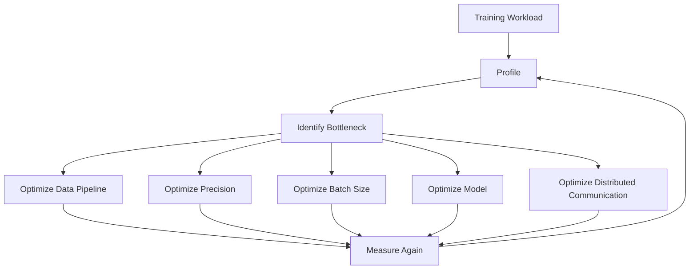

---

# 🧠 Inference Acceleration

GPU acceleration is also important during inference.

The objective may be:

```text
Lower Latency
+
Higher Throughput
+
Lower Cost
```

---

# 🧠 Training vs Inference

| Training | Inference |
|---|---|
| Forward + backward | Usually forward only |
| Requires gradients | Usually no gradients |
| Large compute requirement | Latency-sensitive |
| Checkpointing | Model loading |
| Distributed training | Scalable serving |
| Optimization for throughput | Optimization for latency and throughput |

---

# 🧠 Inference Pipeline

```text
Request
   ↓
Preprocessing
   ↓
GPU
   ↓
Model Forward Pass
   ↓
Postprocessing
   ↓
Response
```

---

# 🧠 Inference Batching

Multiple requests can sometimes be combined:

```text
Request 1 ─┐
Request 2 ─┤
Request 3 ─┼──► GPU Batch
Request 4 ─┘
```

This can improve GPU utilization.

However:

```text
Larger Batch
   ↓
Higher Throughput
   ↓
Potentially Higher Latency
```

---

# 🧠 Dynamic Batching

A serving system can collect requests for a short period:

```text
Request
Request
Request
   ↓
Dynamic Batch
   ↓
GPU
```

This can improve utilization while controlling latency.

---

# 🧠 Quantization

Quantization reduces numerical precision.

For example:

```text
FP32
 ↓
FP16
 ↓
INT8
```

Potential benefits:

```text
Lower Memory
Faster Inference
Lower Cost
```

But quantization may affect model quality.

---

# 🧠 GPU Optimization Techniques

Common techniques include:

```text
Mixed Precision
Batching
Dynamic Batching
Quantization
Kernel Optimization
Memory Optimization
Model Compilation
Caching
Efficient Data Loading
Distributed Inference
```

---

# 🧠 Production GPU Architecture

A production Deep Learning system may look like:

```text
Client
   ↓
API Gateway
   ↓
Inference Service
   ↓
Request Queue
   ↓
GPU Worker Pool
   ↓
Model
   ↓
Postprocessing
   ↓
Response
```

---

# 🏢 Production GPU Architecture

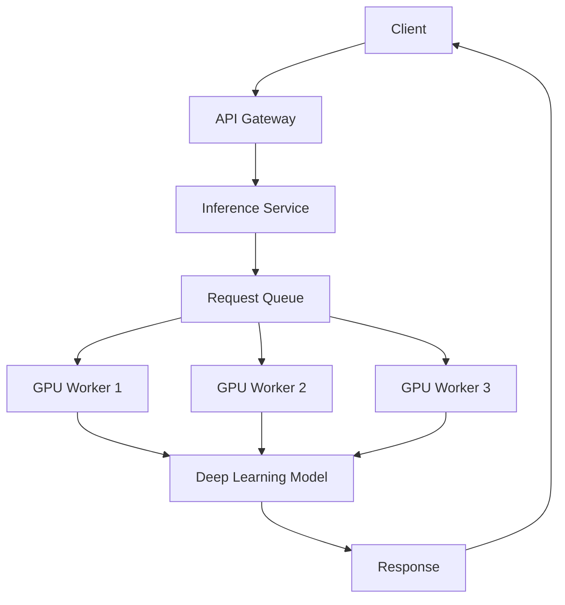

---

# 🏢 GPU Worker Pool

A GPU inference platform can scale workers based on:

```text
Request Rate
Queue Depth
GPU Utilization
Latency
```

For example:

```text
Low Traffic
 ↓
2 GPU Workers

High Traffic
 ↓
8 GPU Workers
```

---

# 🏢 Autoscaling

Autoscaling can be driven by:

```text
GPU Utilization
Queue Depth
Request Rate
Latency
```

A common architecture is:

```text
Traffic
  ↓
Queue
  ↓
Autoscaling Controller
  ↓
GPU Workers
```

---

# 🏢 GPU Monitoring

Important metrics include:

### Hardware Metrics

```text
GPU Utilization
GPU Memory
Temperature
Power Usage
```

### Training Metrics

```text
Training Throughput
Step Time
Samples / Second
GPU Utilization
Loss
```

### Inference Metrics

```text
Request Latency
Throughput
Batch Size
GPU Utilization
Queue Depth
```

### Business Metrics

```text
Cost per Request
Cost per Training Run
SLA Compliance
Model Quality
```

---

# 🏢 GPU Observability

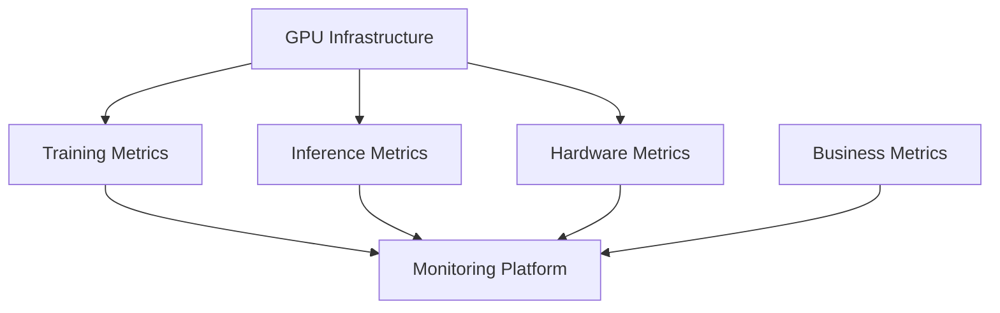

---

# 🏢 Cost Optimization

GPU infrastructure can become one of the largest costs in Deep Learning systems.

Potential optimization strategies include:

```text
Right-Sized GPUs
Mixed Precision
Efficient Batching
Autoscaling
Spot / Preemptible Capacity
Checkpointing
Quantization
Smaller Models
Efficient Training
Model Reuse
```

---

# 🧠 GPU Cost Model

A simplified cost model is:

```text
GPU Cost
=
GPU Runtime
×
Hourly GPU Price
```

Therefore:

```text
Reduce Training Time
        ↓
Reduce GPU Cost
```

and:

```text
Increase GPU Utilization
        ↓
More Work per GPU Hour
```

---

# 🧠 Cost vs Performance

The fastest GPU is not always the most cost-effective.

Consider:

```text
GPU A
Cost = High
Performance = Very High

GPU B
Cost = Medium
Performance = High

GPU C
Cost = Low
Performance = Moderate
```

The correct choice depends on:

```text
Training Time
Inference Volume
Latency Requirements
Model Size
Memory Requirements
Budget
```

---

# 🧠 GPU Selection

When selecting GPU infrastructure, evaluate:

```text
GPU Memory
Compute Capability
Memory Bandwidth
Tensor Acceleration
Supported Precision
Network Bandwidth
Cost
Availability
```

---

# 🧠 Training GPU Selection

Training often prioritizes:

```text
Compute Throughput
GPU Memory
Memory Bandwidth
High-Speed Interconnect
Distributed Training Support
```

---

# 🧠 Inference GPU Selection

Inference may prioritize:

```text
Latency
Throughput
Memory
Precision Support
Cost per Request
Batching Efficiency
```

---

# 🏢 Cloud GPU Architecture

A cloud-based Deep Learning platform may include:

```text
Object Storage
      ↓
Training Dataset
      ↓
Training Cluster
      ↓
GPU Nodes
      ↓
Model Checkpoint
      ↓
Model Registry
      ↓
GPU Inference
      ↓
Monitoring
```

---

# 🏢 Cloud Deep Learning Workflow

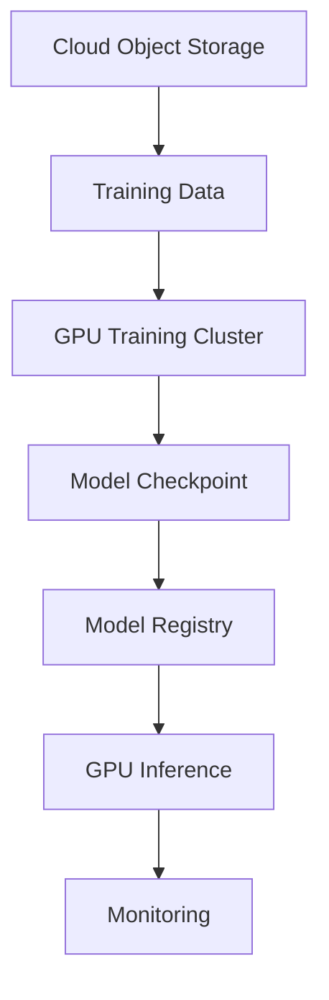

---

# 🏢 Distributed Training Architecture

```text
Training Dataset
      ↓
Distributed Data Loader
      ↓
┌─────────┬─────────┬─────────┐
│ GPU 1   │ GPU 2   │ GPU 3   │
└─────────┴─────────┴─────────┘
      ↓
Gradient Synchronization
      ↓
Updated Model
      ↓
Checkpoint
```

---

# 🧠 Framework Support

Modern Deep Learning frameworks support GPU acceleration and distributed training.

| Framework | GPU / Accelerator Support | Distributed Training |
|---|---|---|
| TensorFlow | Yes | Yes |
| Keras | Through backend/framework | Yes |
| PyTorch | Yes | Yes |
| JAX | Yes | Yes |

The exact capabilities depend on the hardware, runtime, and framework configuration.

---

# 🧠 TensorFlow GPU Concepts

TensorFlow can use GPUs through its runtime.

Common capabilities include:

```text
Tensor Operations
GPU Execution
Automatic Differentiation
Mixed Precision
Distributed Training
```

---

# 🧠 PyTorch GPU Concepts

PyTorch commonly exposes device management explicitly.

```python
device = torch.device(
    "cuda" if torch.cuda.is_available() else "cpu"
)

model.to(device)
```

This provides direct control over where tensors and models are executed.

---

# 🧠 Reproducibility

GPU training can involve sources of nondeterminism.

Production experiments should record:

```text
Random Seed
Framework Version
CUDA Version
GPU Type
Driver Version
Model Version
Dataset Version
Hyperparameters
Precision
```

This improves experiment reproducibility.

---

# 🧠 GPU Training Best Practices

Recommended practices include:

- Verify GPU availability before training.
- Monitor GPU utilization.
- Monitor GPU memory.
- Use appropriate batch sizes.
- Optimize the input pipeline.
- Use mixed precision when supported and validated.
- Save checkpoints regularly.
- Profile before optimizing.
- Track training configuration.
- Use distributed training when appropriate.
- Separate training and inference infrastructure when useful.

These practices align with the production-oriented Deep Learning guidance in the uploaded notes, which emphasizes GPU utilization, mixed precision, checkpointing, model versioning, monitoring, and distributed training. :contentReference[oaicite:2]{index=2}

---

# ⚠ Common Mistakes

Some common GPU-related mistakes include:

- Assuming the GPU is being used without verifying it.
- Using a batch size that exceeds GPU memory.
- Ignoring CPU data-loading bottlenecks.
- Performing unnecessary CPU-GPU transfers.
- Not using mixed precision when appropriate.
- Training without checkpointing.
- Ignoring GPU utilization.
- Ignoring distributed communication overhead.
- Using more GPUs without measuring scaling efficiency.
- Optimizing hardware before identifying the actual bottleneck.
- Ignoring inference latency.
- Ignoring GPU infrastructure cost.

---

# ⚠ GPU Memory Mistakes

Common problems include:

```text
Large Batch Size
+
High Resolution
+
Large Model
+
FP32
+
Large Optimizer State
```

which can result in:

```text
GPU Out Of Memory
```

A systematic response is:

```text
Reduce Batch Size
        ↓
Use Mixed Precision
        ↓
Optimize Activations
        ↓
Reduce Input Size
        ↓
Use Gradient Accumulation
        ↓
Use Larger / Distributed GPU Memory
```

---

# 🧠 Performance Optimization Checklist

Before optimizing:

```text
Measure
```

Then determine whether the workload is:

```text
Compute Bound
Memory Bound
Input Bound
Communication Bound
```

Then apply the appropriate optimization.

---

# 🧪 Practical Exercise 1 — CPU vs GPU

Train the same neural network using:

```text
CPU
```

and:

```text
GPU
```

Measure:

```text
Training Time
Samples / Second
GPU Utilization
```

---

# 🧪 Practical Exercise 2 — Batch Size

Compare:

```text
Batch Size = 16
Batch Size = 32
Batch Size = 64
Batch Size = 128
```

Measure:

```text
GPU Memory
Training Throughput
Epoch Time
Validation Performance
```

---

# 🧪 Practical Exercise 3 — Mixed Precision

Compare:

```text
FP32
```

against:

```text
FP16 / BF16
```

Measure:

```text
Training Time
GPU Memory
Throughput
Model Quality
```

---

# 🧪 Practical Exercise 4 — Input Pipeline

Create a deliberately slow data pipeline.

Measure GPU utilization.

Then add:

```text
Parallel Loading
Prefetching
Caching
```

Compare GPU utilization before and after optimization.

---

# 🧪 Practical Exercise 5 — Checkpointing

Train a model and save checkpoints every few epochs.

Simulate a training failure.

Resume training from the latest checkpoint.

---

# 🧪 Practical Exercise 6 — Distributed Training

Train a model using:

```text
1 GPU
```

then:

```text
2 GPUs
```

Compare:

```text
Training Time
Scaling Efficiency
GPU Utilization
Communication Overhead
```

---

# 🧪 Practical Exercise 7 — GPU Profiling

Profile a training workload.

Identify:

```text
GPU Idle Time
CPU Bottleneck
Data Transfer
Kernel Execution
Memory Usage
```

Document the main bottleneck and optimization applied.

---

# 🧪 Practical Exercise 8 — Inference Batching

Deploy a model and compare:

```text
Batch Size = 1
Batch Size = 8
Batch Size = 16
```

Measure:

```text
Latency
Throughput
GPU Utilization
```

---

# 🧪 Practical Exercise 9 — Quantized Inference

Compare:

```text
FP32
```

and:

```text
INT8
```

inference.

Measure:

```text
Latency
Memory
Throughput
Model Quality
```

---

# 🧪 Practical Exercise 10 — Production GPU Platform

Design:

```text
Object Storage
      ↓
Training Dataset
      ↓
GPU Training Cluster
      ↓
Checkpoint Storage
      ↓
Model Registry
      ↓
GPU Inference Cluster
      ↓
API Gateway
      ↓
Monitoring
```

Include:

```text
Autoscaling
Mixed Precision
Checkpointing
Model Versioning
GPU Monitoring
Cost Optimization
Rollback
```

---

# 🧠 Interview Questions

## Beginner

### 1. Why are GPUs useful for Deep Learning?

GPUs can perform large numbers of similar numerical operations in parallel, making them highly effective for tensor-heavy Deep Learning workloads.

### 2. CPU vs GPU?

CPUs are optimized for general-purpose computation, while GPUs are optimized for highly parallel workloads.

### 3. What is CUDA?

CUDA is a GPU computing platform and programming model widely used to execute general-purpose computations on compatible GPUs.

### 4. What is GPU memory?

GPU memory, or VRAM, stores model parameters, activations, gradients, input data, and other tensors required for computation.

### 5. Why does Deep Learning require large GPU memory?

Large models, batches, activations, gradients, and optimizer states can collectively consume significant memory.

---

## Intermediate

### 6. What is mixed-precision training?

Mixed-precision training uses lower-precision formats such as FP16 or BF16 for suitable operations while retaining higher precision where necessary.

### 7. What is the benefit of mixed precision?

It can reduce memory consumption and increase computational throughput on supported hardware.

### 8. What is GPU utilization?

GPU utilization indicates how actively the GPU is being used. Low utilization can indicate input, CPU, synchronization, or workload-size bottlenecks.

### 9. Why can increasing batch size improve performance?

Larger batches can provide more parallel work and improve GPU utilization, although they also consume more GPU memory.

### 10. What is data parallelism?

Data parallelism replicates a model across multiple GPUs while each GPU processes different data batches.

### 11. What is model parallelism?

Model parallelism distributes different portions of a model across multiple devices.

### 12. Why is checkpointing important?

Checkpointing allows training to resume after failures and supports experiment management, model versioning, and deployment.

---

## Advanced

### 13. Why does distributed training not scale linearly?

Communication, synchronization, networking, data loading, and coordination overhead increase as additional GPUs are introduced.

### 14. What is gradient synchronization?

It is the process of aggregating gradients computed by different workers so that model replicas remain synchronized.

### 15. What is All-Reduce?

All-Reduce is a collective communication operation commonly used to aggregate values such as gradients across distributed workers.

### 16. What is a compute-bound workload?

A workload is compute-bound when computational operations dominate execution time.

### 17. What is a memory-bound workload?

A workload is memory-bound when memory access or data movement limits performance more than computation.

### 18. How can you improve GPU utilization?

Possible approaches include:

```text
Increase Appropriate Batch Size
Optimize Data Loading
Use Prefetching
Use Mixed Precision
Reduce CPU-GPU Transfers
Optimize Kernels
Profile the Workload
```

### 19. How would you optimize GPU inference?

Consider:

```text
Batching
Dynamic Batching
Mixed Precision
Quantization
Model Compilation
Efficient Kernels
Caching
Autoscaling
```

### 20. How would you reduce GPU cost in production?

Reduce unnecessary GPU runtime through:

```text
Right-Sizing
Efficient Models
Mixed Precision
Autoscaling
Batching
Quantization
Efficient Training
Checkpointing
```

---

# 🏢 Enterprise Perspective

GPU acceleration changes Deep Learning from a computationally expensive research workflow into a scalable engineering platform.

A production Deep Learning platform may include:

```text
Data Engineering
      ↓
GPU Training
      ↓
Experiment Tracking
      ↓
Checkpointing
      ↓
Model Registry
      ↓
GPU Inference
      ↓
Monitoring
      ↓
Continuous Improvement
```

The uploaded engineering notes emphasize that production Deep Learning requires much more than model training, including data engineering, deployment, inference optimization, monitoring, infrastructure, and continuous improvement. :contentReference[oaicite:3]{index=3}

---

# 🏢 Training Platform

```text
Data Sources
      ↓
Data Preparation
      ↓
Training Dataset
      ↓
GPU Cluster
      ↓
Distributed Training
      ↓
Checkpoint
      ↓
Model Registry
```

---

# 🏢 Inference Platform

```text
Client
   ↓
API Gateway
   ↓
Inference Service
   ↓
GPU Worker
   ↓
Model
   ↓
Prediction
```

---

# 🏢 Production GPU Lifecycle

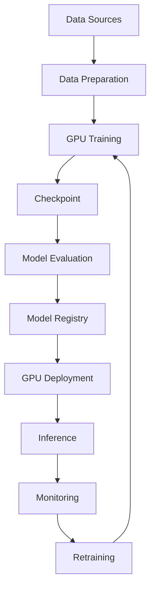

---

# 🏢 GPU as an Enterprise Infrastructure Layer

GPU infrastructure should be treated as a platform capability rather than something each individual model team manages independently.

A platform can provide:

```text
GPU Provisioning
Model Training
Experiment Tracking
Checkpoint Storage
Model Registry
Inference Serving
Monitoring
Cost Management
Security
Governance
```

---

# 🏢 GPU + Cloud-Native Architecture

A cloud-native Deep Learning platform can integrate:

```text
Object Storage
+
Container Orchestration
+
GPU Nodes
+
Model Registry
+
Message Queues
+
Monitoring
+
Autoscaling
```

Conceptually:

```text
Cloud Storage
      ↓
Training Job
      ↓
GPU Cluster
      ↓
Model Registry
      ↓
Inference Service
      ↓
API
```

---

# 🏢 Kubernetes GPU Workloads

A Kubernetes-based platform can schedule GPU workloads.

```text
Kubernetes Cluster
       │
       ├── CPU Nodes
       │
       └── GPU Nodes
             │
             ├── Training Pod
             ├── Training Pod
             └── Inference Pod
```

GPU scheduling allows teams to share infrastructure while isolating workloads.

---

# 🏢 GPU Resource Management

Production GPU platforms should manage:

```text
GPU Allocation
GPU Capacity
GPU Utilization
GPU Memory
Scheduling
Autoscaling
Quota
Cost
```

This becomes especially important when multiple teams share a GPU cluster.

---

# 🏢 Model Lifecycle and GPU Infrastructure

The model lifecycle can be connected directly to GPU infrastructure:

```text
Experiment
   ↓
GPU Training
   ↓
Checkpoint
   ↓
Evaluation
   ↓
Registry
   ↓
GPU Deployment
   ↓
Monitoring
```

---

# 🧠 Deep Learning Hardware Decision Framework

When selecting infrastructure, ask:

```text
What model size?
        ↓
What input size?
        ↓
What batch size?
        ↓
What training time target?
        ↓
What inference latency target?
        ↓
How much GPU memory?
        ↓
Single GPU or distributed?
        ↓
What precision?
        ↓
What workload volume?
        ↓
What cost target?
```

---

# 🧠 Performance vs Cost

A production architecture should optimize:

```text
Performance
+
Reliability
+
Scalability
+
Cost
```

rather than simply maximizing GPU compute.

---

# 🧠 GPU Engineering Principles

The most important principles are:

```text
1. Measure before optimizing.
2. Identify the actual bottleneck.
3. Keep the GPU fed with data.
4. Use appropriate precision.
5. Minimize unnecessary data movement.
6. Scale only when necessary.
7. Monitor GPU utilization and memory.
8. Checkpoint long-running training.
9. Optimize inference separately from training.
10. Track infrastructure cost.
```

---

!!! tip "Production Insight"

    **GPU acceleration is not simply about attaching a GPU to a Deep Learning model.**

    Production performance depends on the complete system:

    ```text
    Data Pipeline
          ↓
    CPU Processing
          ↓
    CPU → GPU Transfer
          ↓
    GPU Compute
          ↓
    Gradient / Synchronization
          ↓
    Storage
    ```

    A powerful GPU can remain underutilized if the surrounding system cannot provide data quickly enough.

    Similarly, adding more GPUs does not guarantee linear performance improvement because distributed workloads introduce:

    ```text
    Communication
    Synchronization
    Network
    Data Loading
    Coordination
    ```

    Therefore, production GPU engineering should follow:

    ```text
    Measure
       ↓
    Profile
       ↓
    Identify Bottleneck
       ↓
    Optimize
       ↓
    Measure Again
    ```

    The uploaded Deep Learning notes similarly emphasize **GPU utilization, mixed precision, distributed training, checkpointing, model versioning, monitoring, inference latency, scalability, and cost optimization** as important production considerations. :contentReference[oaicite:4]{index=4}

---

# 📌 Key Takeaways

- GPUs are highly effective for Deep Learning because they can execute large numbers of numerical operations in parallel.
- CPUs and GPUs serve different roles in a production Deep Learning system.
- CPUs commonly handle orchestration, data loading, and preprocessing.
- GPUs commonly handle tensor-heavy model computation.
- CUDA provides a major software and programming foundation for GPU-accelerated workloads.
- Deep Learning frameworks such as TensorFlow, Keras, and PyTorch abstract much of the low-level GPU programming.
- GPU memory stores model parameters, activations, gradients, optimizer states, and input tensors.
- Training typically requires significantly more memory than inference.
- Batch size affects GPU memory consumption, throughput, and utilization.
- GPU utilization should be monitored rather than assumed.
- CPU data pipelines can become bottlenecks and leave expensive GPUs underutilized.
- Prefetching, parallel data loading, caching, and efficient data transfer can improve GPU utilization.
- Mixed precision can reduce memory usage and increase throughput on supported hardware.
- FP16 and BF16 are common lower-precision formats for modern Deep Learning workloads.
- Tensor Cores and other accelerator hardware can significantly improve supported matrix-heavy workloads.
- Checkpointing protects long-running GPU training jobs from failures and supports reproducibility and model lifecycle management.
- Data parallelism distributes batches across multiple GPUs.
- Model parallelism distributes different portions of a model across multiple devices.
- Pipeline parallelism divides model execution into stages.
- Distributed training introduces communication and synchronization overhead.
- More GPUs do not necessarily provide linear performance improvements.
- GPU workloads should be profiled to identify whether they are compute-bound, memory-bound, input-bound, or communication-bound.
- Inference can be optimized through batching, dynamic batching, mixed precision, quantization, caching, and efficient model execution.
- GPU infrastructure should be monitored using hardware, training, inference, and business metrics.
- GPU cost optimization requires balancing performance, latency, utilization, scalability, and infrastructure cost.
- Production Deep Learning systems require GPU acceleration to be integrated with data engineering, model lifecycle management, deployment, monitoring, and governance.
- GPU infrastructure should be treated as an enterprise platform capability rather than simply a hardware resource.

---

# 📚 Further Reading

Continue with:

- **[36. Deep Learning Training and Model Lifecycle](36-deep-learning-training-and-model-lifecycle.md)**
- **[37. Building Production Deep Learning Systems](37-building-production-deep-learning-systems.md)**

---

## ➡️ Next Chapter

**[36. Deep Learning Training and Model Lifecycle](36-deep-learning-training-and-model-lifecycle.md)**

---

> **Enterprise AI Engineering Handbook**  
> *Building Production-Grade Enterprise AI Systems — One Chapter at a Time.*