# 36. Deep Learning Training and Model Lifecycle

> Understand the complete lifecycle of developing, training, evaluating, versioning, deploying, monitoring, and continuously improving Deep Learning models in production.

---

## 🎯 Learning Objectives

After completing this chapter, you will be able to:

- Explain the complete Deep Learning model lifecycle
- Understand the relationship between business requirements and model development
- Design training, validation, and test workflows
- Understand dataset preparation for Deep Learning
- Explain the Deep Learning training loop
- Understand epochs, batches, iterations, and steps
- Understand checkpointing
- Explain model evaluation and validation
- Understand hyperparameter tuning
- Understand experiment tracking
- Understand model persistence and versioning
- Understand model deployment strategies
- Explain model monitoring
- Understand data drift, model drift, and concept drift
- Understand retraining strategies
- Understand continuous training
- Design reproducible Deep Learning pipelines
- Understand the relationship between training and inference
- Design a production-oriented Deep Learning lifecycle
- Identify common lifecycle failures
- Apply lifecycle best practices to TensorFlow, Keras, and PyTorch projects

---

# 📖 Overview

Building a Deep Learning model is much more than creating a neural network and calling:

```python
model.fit(...)
```

A production Deep Learning system follows a complete lifecycle:

```text
Business Problem
      ↓
Data Collection
      ↓
Data Preparation
      ↓
Dataset Splitting
      ↓
Model Design
      ↓
Training
      ↓
Validation
      ↓
Hyperparameter Tuning
      ↓
Evaluation
      ↓
Model Persistence
      ↓
Model Registry
      ↓
Deployment
      ↓
Inference
      ↓
Monitoring
      ↓
Retraining
      ↓
Continuous Improvement
```

The lifecycle is iterative rather than strictly linear.

If the deployed model performs poorly, the engineering team may need to return to:

```text
Data
   ↓
Features
   ↓
Architecture
   ↓
Training
   ↓
Evaluation
```

The uploaded lifecycle notes emphasize that deployment is not the end of the process; monitoring and retraining are essential for maintaining production performance. :contentReference[oaicite:2]{index=2}

---

# 🧠 Why the Deep Learning Lifecycle Matters

A highly accurate model in a notebook does not automatically become a successful production system.

Production systems require:

- Reliable data pipelines
- Reproducible training
- Proper validation
- Model versioning
- Checkpointing
- Scalable infrastructure
- Deployment automation
- Monitoring
- Drift detection
- Retraining
- Governance

Therefore:

> **Model development is one stage of the Deep Learning lifecycle, not the lifecycle itself.**

---

# 🔄 Complete Deep Learning Lifecycle

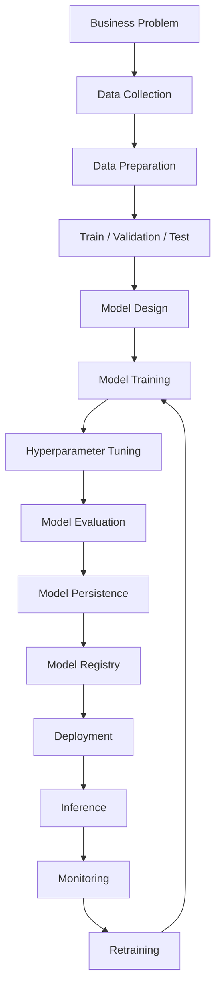

---

# 1. 🏢 Business Understanding

Every Deep Learning project should begin with a clearly defined business problem.

Examples include:

```text
Image Classification
Fraud Detection
Demand Forecasting
Speech Recognition
Document Classification
Recommendation
Object Detection
Text Generation
Medical Image Analysis
```

---

## 🎯 Define the Objective

Before selecting a model, define:

```text
What problem are we solving?
Who uses the prediction?
What does success mean?
What constraints exist?
```

---

## 📊 Define Success Metrics

Technical metrics might include:

```text
Accuracy
Precision
Recall
F1 Score
ROC-AUC
MAE
RMSE
Perplexity
BLEU
IoU
mAP
```

Business metrics might include:

```text
Revenue
Conversion
Fraud Loss Reduction
Customer Retention
Operational Cost
Response Time
Customer Satisfaction
```

---

## ⚠ Model Accuracy Is Not the Only Objective

A model can have excellent accuracy and still fail in production.

For example:

```text
Accuracy = 98%

BUT

Latency = 5 seconds
Cost = Very High
Availability = 95%
```

Such a model may not satisfy the production requirements.

Therefore:

```text
Model Quality
+
Latency
+
Cost
+
Reliability
+
Scalability
```

must be considered together.

---

# 2. 📥 Data Collection

Deep Learning models depend heavily on training data.

Common data sources include:

- Databases
- Data warehouses
- Data lakes
- Object storage
- APIs
- Streaming systems
- Sensors
- Images
- Documents
- Audio
- Video
- Text

---

# 🧠 Data Pipeline


---

# 3. 🧹 Data Preparation

Raw data is rarely ready for Deep Learning.

Typical preparation tasks include:

```text
Cleaning
Normalization
Resizing
Encoding
Tokenization
Missing Value Handling
Outlier Handling
Deduplication
Data Balancing
Augmentation
```

The exact preparation depends on the data type.

---

# 🖼 Image Data

Typical pipeline:

```text
Raw Images
    ↓
Resize
    ↓
Normalize
    ↓
Augment
    ↓
Batch
    ↓
Model
```

---

# 📝 Text Data

Typical pipeline:

```text
Raw Text
   ↓
Cleaning
   ↓
Tokenization
   ↓
Vocabulary / Token IDs
   ↓
Padding / Truncation
   ↓
Batch
   ↓
Model
```

---

# 🔊 Audio Data

Typical pipeline:

```text
Audio
  ↓
Resampling
  ↓
Noise Processing
  ↓
Feature Extraction
  ↓
Spectrogram / Representation
  ↓
Model
```

---

# 🧠 Data Quality

Important characteristics include:

```text
Accuracy
Completeness
Consistency
Representativeness
Balance
Freshness
Label Quality
```

Poor data quality can produce:

```text
Poor Training
      ↓
Poor Validation
      ↓
Poor Production Performance
```

---

# ⚠ Data Leakage

Data leakage occurs when information that should not be available during training influences the model.

Example:

```text
Future Information
       ↓
Training Dataset
       ↓
Artificially High Accuracy
```

This can produce misleading evaluation results.

---

# 4. 📊 Dataset Splitting

A typical workflow separates data into:

```text
Training
Validation
Testing
```

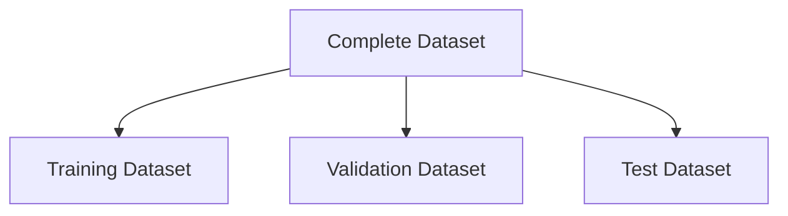

---

# 🧠 Training Dataset

Used to:

```text
Learn Model Parameters
```

---

# 🧠 Validation Dataset

Used to:

```text
Tune Hyperparameters
Compare Models
Monitor Generalization
Select Checkpoints
```

---

# 🧠 Test Dataset

Used for:

```text
Final Unbiased Evaluation
```

The test dataset should not be repeatedly used for model selection.

---

# 🧠 Dataset Workflow

```text
Dataset

├── Training
│     ↓
│   Learn
│
├── Validation
│     ↓
│   Tune
│
└── Test
      ↓
    Final Evaluation
```

---

# 5. 🏗 Model Design

Model architecture should be selected based on:

```text
Problem
Data Type
Dataset Size
Compute Availability
Latency Requirements
Accuracy Requirements
```

Examples:

| Problem | Typical Architecture |
|---|---|
| Structured Data | MLP |
| Image Classification | CNN |
| Image Recognition | CNN / Vision Transformer |
| Sequential Data | RNN / LSTM / GRU |
| Text | Transformer |
| Generative Images | Diffusion |
| Representation Learning | Autoencoder |
| RL | DQN / Actor-Critic |

---

# 🧠 Start Simple

A useful engineering principle is:

```text
Simple Baseline
      ↓
Measure
      ↓
Improve
      ↓
More Complex Architecture
```

Do not begin with the most complex architecture simply because it is available.

---

# 6. 🏋️ Model Training

Training is the process of learning model parameters from data.

A typical Deep Learning training loop is:

```text
Input
  ↓
Forward Pass
  ↓
Prediction
  ↓
Loss
  ↓
Backpropagation
  ↓
Optimizer
  ↓
Weight Update
  ↓
Repeat
```

---

# 🧠 Training Loop

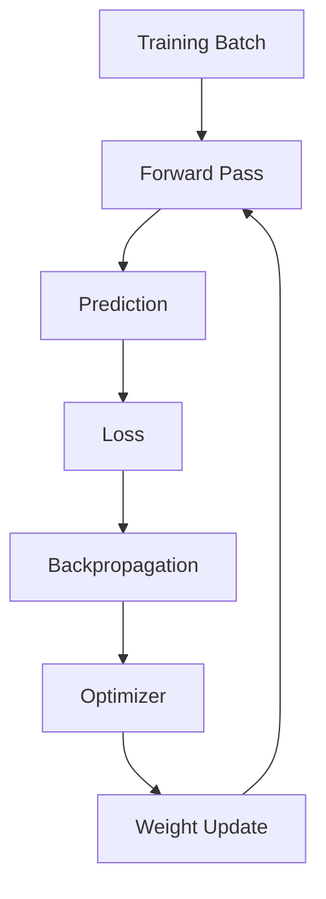

---

# 🧠 Forward Pass

The model transforms input:

\[
x
\]

into prediction:

\[
\hat{y}=f(x;\theta)
\]

where:

```text
x = Input
ŷ = Prediction
θ = Model Parameters
```

---

# 🧠 Loss Calculation

The prediction is compared against the target.

For example, Mean Squared Error:

\[
L=
\frac{1}{n}
\sum_{i=1}^{n}
(y_i-\hat{y}_i)^2
\]

The objective is to minimize the loss.

---

# 🧠 Backpropagation

Backpropagation calculates gradients:

\[
\frac{\partial L}{\partial \theta}
\]

These gradients tell the optimizer how model parameters should change.

---

# 🧠 Optimizer

The optimizer updates parameters.

A simple gradient descent update is:

\[
\theta_{t+1}
=
\theta_t
-
\eta
\nabla_{\theta}L
\]

where:

```text
η = Learning Rate
```

---

# 7. 🔢 Epochs, Batches, and Steps

These terms are fundamental to training.

---

## Epoch

One complete pass through the training dataset.

```text
Complete Dataset
       ↓
One Epoch
```

---

## Batch

A subset of training examples.

```text
Dataset
   ↓
Batch 1
Batch 2
Batch 3
...
```

---

## Step / Iteration

One optimizer update based on one batch.

```text
Batch
 ↓
Forward
 ↓
Loss
 ↓
Backward
 ↓
Update
```

---

# 🧠 Example

Suppose:

```text
Training Samples = 10,000
Batch Size = 100
```

Then approximately:

```text
100 Steps per Epoch
```

If:

```text
Epochs = 20
```

then:

```text
2,000 Training Steps
```

---

# 8. 🧪 Validation During Training

Validation helps detect overfitting.

Example:

```text
Epoch 1
Training Loss ↓
Validation Loss ↓

Epoch 10
Training Loss ↓
Validation Loss ↓

Epoch 20
Training Loss ↓
Validation Loss ↑
```

This may indicate:

```text
Overfitting
```

---

# 🧠 Training vs Validation

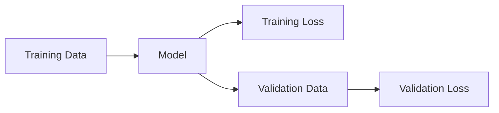

---

# 9. ⚙️ Hyperparameter Tuning

Model parameters are learned during training.

Hyperparameters are selected by the engineer.

Examples:

```text
Learning Rate
Batch Size
Epochs
Number of Layers
Hidden Dimensions
Dropout
Optimizer
Weight Decay
Kernel Size
```

---

# 🧠 Parameters vs Hyperparameters

| Parameters | Hyperparameters |
|---|---|
| Learned during training | Set before / during experimentation |
| Weights | Learning rate |
| Biases | Batch size |
| Learned automatically | Number of layers |
| Updated by optimizer | Dropout rate |

---

# 🧠 Hyperparameter Tuning Workflow

```text
Configuration
      ↓
Training
      ↓
Validation
      ↓
Metric
      ↓
Compare
      ↓
New Configuration
      ↓
Repeat
```

---

# 🧠 Tuning Methods

Common approaches include:

```text
Manual Search
Grid Search
Random Search
Bayesian Optimization
KerasTuner
Optuna
```

---

# 10. 🧪 Experiment Tracking

Every serious Deep Learning project should track experiments.

Track:

```text
Dataset Version
Model Architecture
Learning Rate
Batch Size
Epochs
Optimizer
Loss Function
Random Seed
GPU Type
Training Time
Validation Metrics
Test Metrics
Checkpoint
```

---

# 🧠 Experiment Tracking

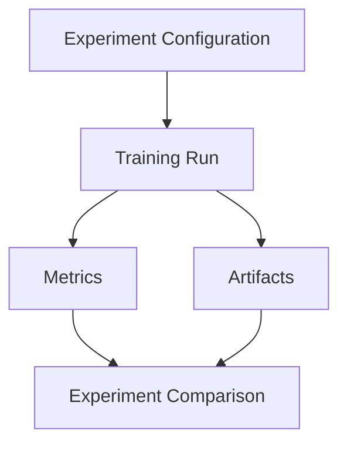

---

# 🧠 Why Experiment Tracking Matters

Without tracking:

```text
Experiment A
Experiment B
Experiment C
```

can become impossible to reproduce.

With tracking:

```text
Run ID
Model Version
Dataset Version
Hyperparameters
Metrics
Checkpoint
```

can be recovered.

---

# 11. 💾 Checkpointing

Deep Learning training can take hours or days.

Training should therefore periodically save checkpoints.

```text
Training
   ↓
Checkpoint
   ↓
Training
   ↓
Checkpoint
   ↓
Training
```

---

# 🧠 What Does a Checkpoint Contain?

Depending on the framework, a checkpoint may include:

```text
Model Parameters
Optimizer State
Learning Rate Scheduler
Epoch
Training Step
Hyperparameters
Random State
```

---

# 🧠 Checkpointing Workflow

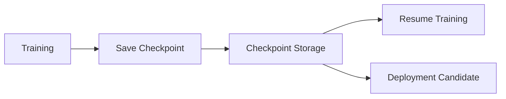

---

# 🧠 Why Checkpointing Matters

Checkpointing provides:

- Failure recovery
- Resume capability
- Experiment comparison
- Fine-tuning
- Model versioning
- Deployment candidates

---

# 12. 🛑 Early Stopping

Training does not always need to continue for a fixed number of epochs.

If validation performance stops improving:

```text
Validation Metric
       ↓
No Improvement
       ↓
Stop Training
```

This is called:

> **Early Stopping**

---

# 🧠 Early Stopping

```text
Epoch 1 → Validation improves
Epoch 2 → Validation improves
Epoch 3 → Validation improves
Epoch 4 → Validation improves
Epoch 5 → No improvement
Epoch 6 → No improvement
Epoch 7 → No improvement

              ↓

        Stop Training
```

---

# 13. 📈 Model Evaluation

After training, the model should be evaluated using appropriate metrics.

---

# Classification Metrics

Common metrics include:

```text
Accuracy
Precision
Recall
F1 Score
ROC-AUC
```

---

# Regression Metrics

Common metrics include:

```text
MAE
MSE
RMSE
R²
```

---

# Computer Vision Metrics

Depending on the task:

```text
IoU
mAP
Precision
Recall
F1
```

---

# Generative Model Metrics

Depending on the task:

```text
Perplexity
BLEU
ROUGE
Human Evaluation
Task-Specific Metrics
```

---

# 🧠 Evaluation Principle

Do not evaluate using a single metric blindly.

For example:

```text
Accuracy = 99%
```

may hide poor performance on a minority class.

Therefore evaluate:

```text
Overall Performance
+
Class-Level Performance
+
Business Impact
```

---

# 14. 🔍 Model Interpretation

Understanding model behavior can be important for enterprise systems.

Possible techniques include:

```text
Feature Importance
SHAP
LIME
Attention Visualization
Grad-CAM
Saliency Maps
```

The appropriate method depends on the model and problem.

---

# 🧠 Model Interpretation Workflow

```text
Model
  ↓
Prediction
  ↓
Interpretation Technique
  ↓
Important Features / Regions
  ↓
Human Analysis
```

---

# 15. 💾 Model Persistence

After a model is trained, it must be saved in a reusable format.

Common formats include:

```text
PyTorch state_dict
TensorFlow SavedModel
Keras Model
ONNX
```

The uploaded lifecycle notes specifically identify model persistence as a distinct stage between interpretation and deployment. :contentReference[oaicite:3]{index=3}

---

# 🧠 PyTorch Persistence

A common approach is:

```python
torch.save(
    model.state_dict(),
    "model.pth"
)
```

Load:

```python
model.load_state_dict(
    torch.load("model.pth")
)
```

---

# 🧠 TensorFlow / Keras Persistence

A model can be saved using supported Keras / TensorFlow formats.

Conceptually:

```python
model.save(
    "model.keras"
)
```

The exact format should be selected based on the deployment requirements and framework version.

---

# 16. 🗂 Model Versioning

A production system should not simply contain:

```text
model.bin
```

Instead use versions:

```text
model-v1
model-v2
model-v3
```

Each version should be associated with:

```text
Dataset
Code
Configuration
Metrics
Checkpoint
Training Run
```

---

# 🧠 Model Lineage

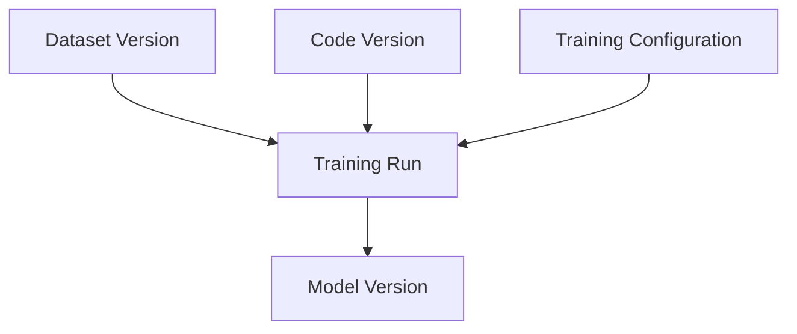

---

# 17. 🏛 Model Registry

A model registry provides centralized model lifecycle management.

It can track:

```text
Model Versions
Model Metadata
Metrics
Artifacts
Approval Status
Deployment Status
```

---

# 🧠 Model Registry Lifecycle

```text
Training
   ↓
Candidate
   ↓
Evaluation
   ↓
Approved
   ↓
Staging
   ↓
Production
   ↓
Archived
```

---

# 🧠 Model Registry

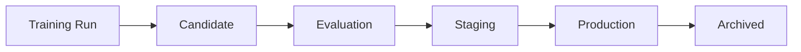

---

# 18. 🚀 Deployment

Deployment makes the trained model available to applications.

The model can be exposed through:

```text
REST API
Web Application
Mobile Application
Batch Job
Streaming Pipeline
Internal Service
```

The uploaded lifecycle notes identify REST APIs, web/mobile applications, batch jobs, streaming, FastAPI, Flask, TensorFlow Serving, TorchServe, Kubernetes, and cloud AI platforms as possible deployment approaches. :contentReference[oaicite:4]{index=4}

---

# 🧠 Deployment Architecture

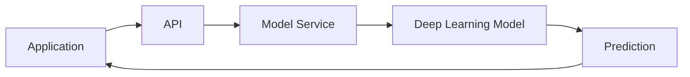

---

# 19. 🧩 Deployment Patterns

## Online Inference

```text
Request
   ↓
Model
   ↓
Response
```

Used when predictions are required immediately.

---

## Batch Inference

```text
Dataset
   ↓
Model
   ↓
Predictions
   ↓
Storage
```

Useful for large volumes of offline predictions.

---

## Streaming Inference

```text
Event
 ↓
Stream
 ↓
Model
 ↓
Prediction
 ↓
Event / Database
```

Useful for real-time event processing.

---

# 20. ⚡ Inference Optimization

Production inference may require:

```text
Low Latency
High Throughput
Low Cost
High Availability
```

Optimization techniques include:

```text
Batching
Dynamic Batching
Mixed Precision
Quantization
Model Compilation
Caching
GPU Acceleration
Model Compression
```

---

# 21. 📊 Model Monitoring

Deployment is not the end.

The production model must be monitored continuously.

The uploaded lifecycle notes explicitly identify monitoring of accuracy, latency, drift, resource usage, and failures. :contentReference[oaicite:5]{index=5}

---

# 🧠 What Should Be Monitored?

### Model Metrics

```text
Accuracy
Precision
Recall
F1
Prediction Distribution
```

### System Metrics

```text
Latency
Throughput
CPU
Memory
GPU
Failures
```

### Data Metrics

```text
Data Distribution
Missing Values
Feature Distribution
Input Quality
```

### Business Metrics

```text
Revenue
Conversion
Fraud Loss
Customer Satisfaction
Operational Cost
```

---

# 22. 🔄 Model Drift

Production data can change over time.

```text
Training Data
      ↓
Production Data
      ↓
Distribution Changes
```

This can reduce model performance.

---

# 🧠 Data Drift

Data drift occurs when the distribution of input data changes.

Example:

```text
Training:
Customer Age
20–40

Production:
Customer Age
40–70
```

---

# 🧠 Concept Drift

Concept drift occurs when the relationship between inputs and target changes.

For example:

```text
Historical Behavior
       ↓
Fraud Pattern

New Behavior
       ↓
Different Fraud Pattern
```

The same inputs may no longer imply the same outcomes.

---

# 🧠 Model Drift

Model drift refers broadly to degradation in model performance as production conditions change.

```text
Production Changes
       ↓
Model Performance ↓
       ↓
Drift Investigation
```

---

# 🧠 Drift Monitoring

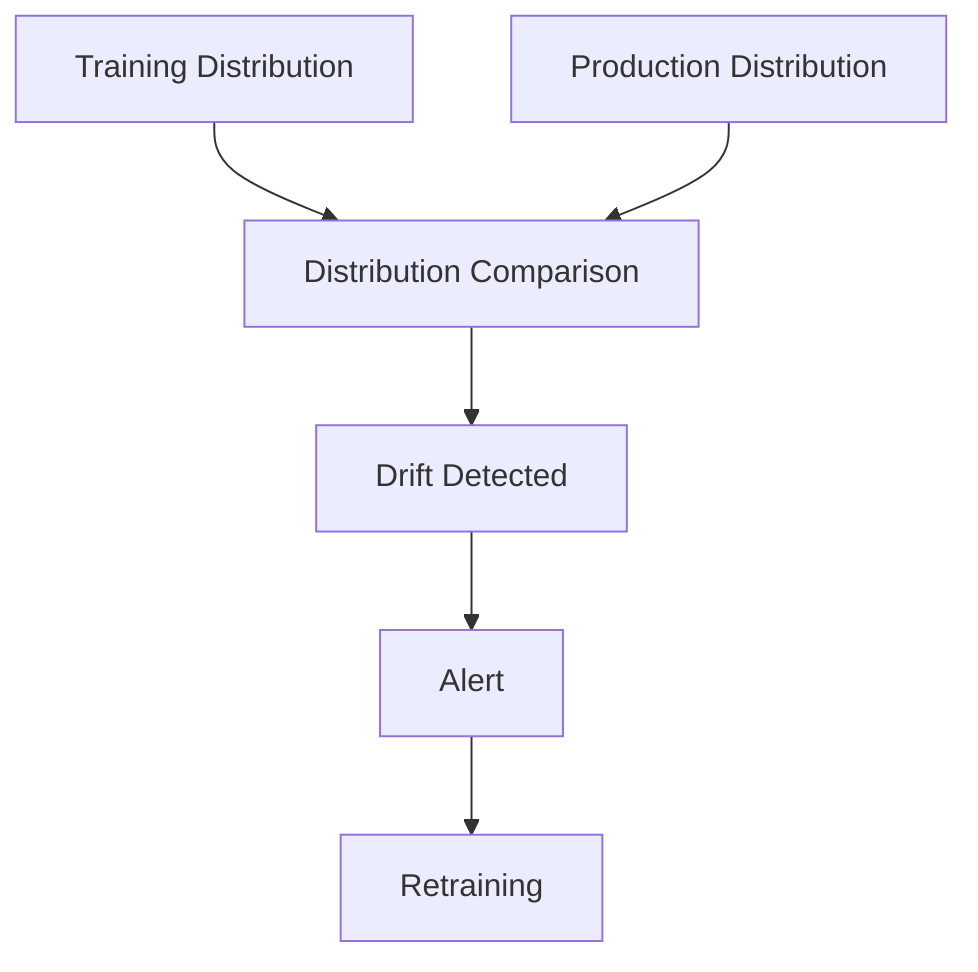

---

# 23. 🚨 Production Alerts

Alerts can be triggered when:

```text
Accuracy Drops
Latency Increases
Error Rate Increases
Input Distribution Changes
GPU Utilization Abnormal
Prediction Distribution Changes
Business KPI Drops
```

---

# 24. 🔁 Retraining

Retraining updates the model using newer data.

Retraining may be triggered when:

```text
Accuracy Drops
Data Changes
Business Rules Change
Drift Detected
New Data Becomes Available
```

These triggers and strategies are directly reflected in the uploaded lifecycle notes. :contentReference[oaicite:6]{index=6}

---

# 🧠 Retraining Strategies

Common strategies include:

```text
Scheduled Retraining
Trigger-Based Retraining
Continuous Training
```

---

# 🗓 Scheduled Retraining

Example:

```text
Every Week
     ↓
Collect Data
     ↓
Train Model
     ↓
Evaluate
     ↓
Deploy if Better
```

---

# 🚨 Trigger-Based Retraining

```text
Drift Detected
      ↓
Trigger Training
      ↓
Evaluate Model
      ↓
Deploy if Approved
```

---

# 🔄 Continuous Training

```text
New Data
   ↓
Training Pipeline
   ↓
Evaluation
   ↓
Model Registry
   ↓
Deployment
```

This creates a continuous improvement loop.

---

# 25. 🔁 Complete Continuous Learning Loop

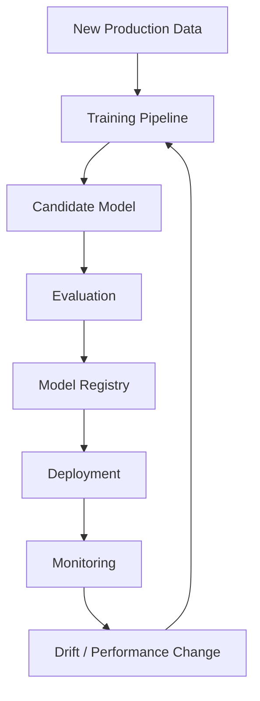

---

# 26. 🧪 Reproducibility

A Deep Learning experiment should be reproducible.

Record:

```text
Dataset Version
Code Version
Model Architecture
Hyperparameters
Random Seed
Framework Version
GPU Type
Precision
Training Configuration
```

---

# 🧠 Reproducible Training

```text
Dataset Version
      +
Code Version
      +
Configuration
      +
Random Seed
      ↓
Training Run
      ↓
Reproducible Model
```

---

# 27. 🔐 Data and Model Lineage

A production system should answer:

```text
Which dataset trained this model?
Which code produced it?
Which hyperparameters were used?
Which GPU was used?
Which experiment produced it?
Which evaluation metrics were recorded?
Where is the model deployed?
```

---

# 🧠 End-to-End Lineage

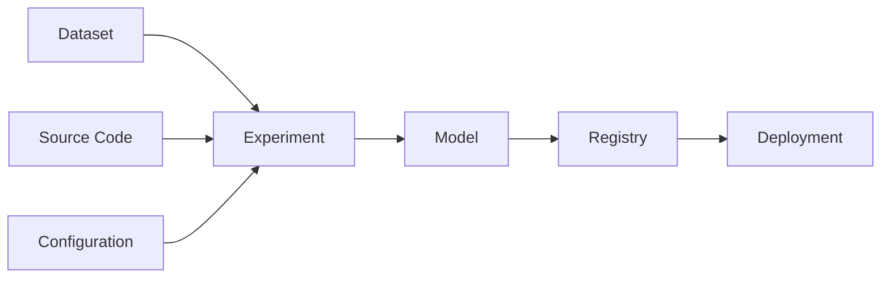

---

# 28. 🏗 Training Pipeline

A production training pipeline can be structured as:

```text
Data Ingestion
      ↓
Data Validation
      ↓
Data Preparation
      ↓
Dataset Versioning
      ↓
Training
      ↓
Validation
      ↓
Hyperparameter Tuning
      ↓
Evaluation
      ↓
Checkpoint
      ↓
Model Registry
```

---

# 🧠 Training Pipeline

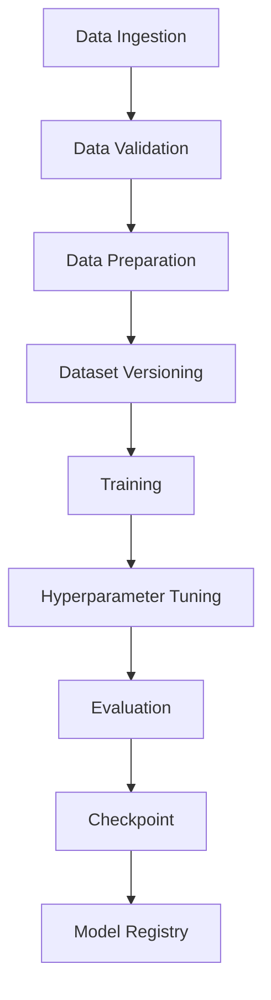

---

# 29. 🚀 CI/CD for Deep Learning

Traditional software uses:

```text
Continuous Integration
Continuous Delivery
```

Deep Learning systems extend this with:

```text
Continuous Training
```

This creates:

```text
CI
+
CD
+
CT
```

---

# 🧠 CI/CD/CT

```text
Code Change
     ↓
Tests
     ↓
Training Pipeline
     ↓
Evaluation
     ↓
Model Registry
     ↓
Deployment
     ↓
Monitoring
```

---

# 30. 🧪 Testing Deep Learning Systems

Testing should cover more than model accuracy.

### Unit Tests

Test:

```text
Data Processing
Model Components
Utility Functions
```

### Data Tests

Test:

```text
Schema
Missing Values
Ranges
Distribution
Labels
```

### Model Tests

Test:

```text
Input Shape
Output Shape
Prediction Range
Inference Functionality
```

### Integration Tests

Test:

```text
API
Model
Database
Storage
Messaging
```

---

# 31. 🧠 Training Validation Gates

Before a model reaches production:

```text
Training
   ↓
Validation
   ↓
Quality Gate
   ↓
Model Registry
   ↓
Deployment
```

A quality gate can verify:

```text
Accuracy Threshold
Latency Threshold
Resource Threshold
Bias Threshold
Safety Requirements
Business KPI
```

---

# 32. 🛡️ Model Promotion

A model should move through controlled stages.

```text
Development
     ↓
Candidate
     ↓
Validation
     ↓
Staging
     ↓
Production
```

---

# 33. 🔵 Shadow Deployment

A candidate model can receive production traffic without controlling the final decision.

```text
Production Request
       │
       ├────────► Current Model
       │              ↓
       │           Real Result
       │
       └────────► Candidate Model
                      ↓
                  Compare
```

This allows safe evaluation.

---

# 34. 🟢 Canary Deployment

A new model can be gradually introduced.

```text
Model v1 → 100%

Model v2 → 0%
```

Then:

```text
Model v1 → 90%
Model v2 → 10%
```

Then:

```text
Model v1 → 50%
Model v2 → 50%
```

Eventually:

```text
Model v2 → 100%
```

if performance remains acceptable.

---

# 35. 🔙 Rollback

Every production deployment should support rollback.

```text
Model v1
   ↓
Model v2
   ↓
Problem Detected
   ↓
Rollback
   ↓
Model v1
```

---

# 36. 🏢 Enterprise Deep Learning Lifecycle

A production enterprise platform may look like:

```text
Business Problem
       ↓
Data Sources
       ↓
Data Engineering
       ↓
Training Dataset
       ↓
GPU Training
       ↓
Experiment Tracking
       ↓
Model Evaluation
       ↓
Model Registry
       ↓
Deployment
       ↓
Inference
       ↓
Monitoring
       ↓
Drift Detection
       ↓
Retraining
```

This aligns with the production-oriented Deep Learning lifecycle in the uploaded material, which describes the progression from data preparation through model training, evaluation, registry, deployment, inference, monitoring, and retraining. :contentReference[oaicite:7]{index=7}

---

# 🏢 Enterprise Architecture

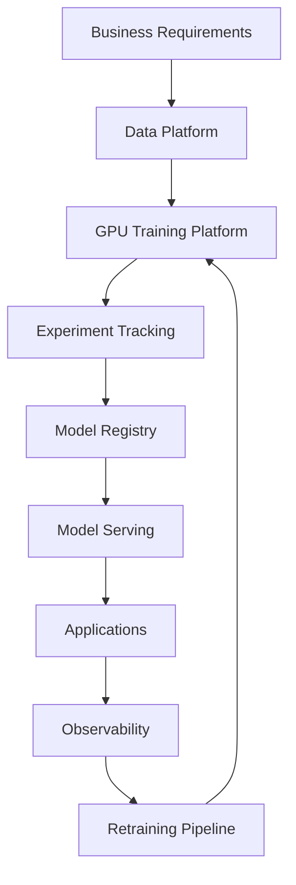

---

# 🏢 Training Plane vs Inference Plane

A mature architecture separates:

```text
Training Plane
```

from:

```text
Inference Plane
```

---

## Training Plane

```text
Data
 ↓
GPU Cluster
 ↓
Training
 ↓
Evaluation
 ↓
Model Registry
```

---

## Inference Plane

```text
Request
 ↓
Model Service
 ↓
GPU / CPU
 ↓
Prediction
```

---

# 🧠 Training and Inference Separation

| Training | Inference |
|---|---|
| GPU intensive | Latency sensitive |
| Model updates | Model reads |
| Checkpoints | Model artifacts |
| Experiments | Stable versions |
| Large compute | Optimized serving |
| Frequent changes | Controlled releases |

---

# 37. ☁️ Cloud-Native Lifecycle

A cloud implementation can use:

```text
Object Storage
      ↓
Data Processing
      ↓
Training Job
      ↓
GPU Cluster
      ↓
Experiment Tracking
      ↓
Model Registry
      ↓
Container
      ↓
Model Serving
      ↓
Monitoring
```

---

# 🧠 Cloud Deep Learning Lifecycle


---

# 38. 📦 Containerization

Deep Learning models should often be packaged as reproducible containers.

A container can include:

```text
Application
Model
Dependencies
Framework
Runtime
Configuration
```

Conceptually:

```text
Docker Image
   │
   ├── Python
   ├── PyTorch / TensorFlow
   ├── Model
   ├── Dependencies
   └── Inference Service
```

---

# 39. 📊 Production Monitoring Dashboard

A production dashboard can contain:

```text
Model Accuracy
Prediction Distribution
Drift Score
Latency
Throughput
GPU Utilization
Memory
Error Rate
Business KPI
```

---

# 🧠 Monitoring Architecture

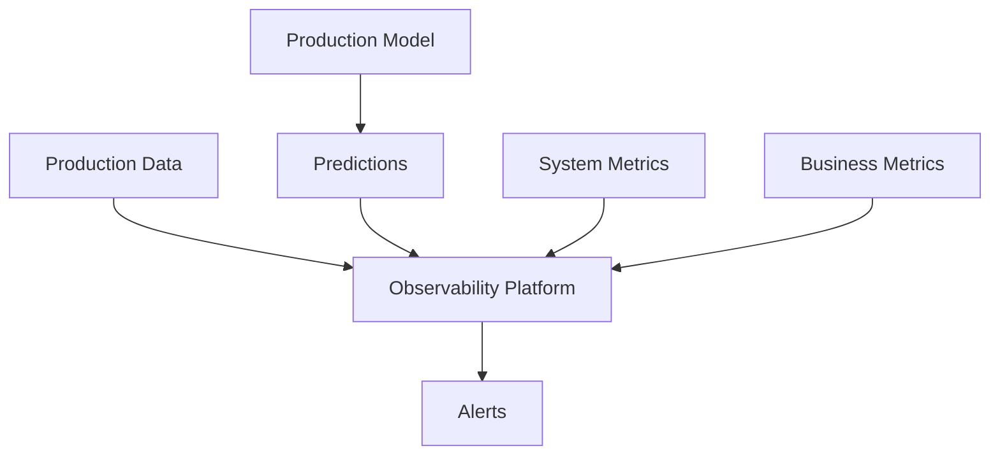

---

# 40. ⚠ Common Lifecycle Failures

## Failure 1 — Poor Data

```text
Poor Data
   ↓
Poor Model
```

---

## Failure 2 — Data Leakage

```text
Leakage
   ↓
Artificially High Validation
   ↓
Poor Production Performance
```

---

## Failure 3 — Overfitting

```text
Training Performance ↑
Validation Performance ↓
```

---

## Failure 4 — No Checkpointing

```text
Training Failure
      ↓
Hours / Days Lost
```

---

## Failure 5 — No Experiment Tracking

```text
Model Performs Well
      ↓
Cannot Reproduce It
```

---

## Failure 6 — No Monitoring

```text
Production Drift
      ↓
Performance Drops
      ↓
Nobody Notices
```

---

## Failure 7 — No Retraining

```text
Environment Changes
      ↓
Model Becomes Stale
```

---

# 41. ⚠ Common Mistakes

Avoid:

- Training without validation
- Evaluating only training data
- Using the test set repeatedly
- Ignoring data quality
- Ignoring data leakage
- Using excessive model complexity
- Not saving checkpoints
- Not versioning models
- Not tracking experiments
- Deploying without testing
- Not monitoring production
- Ignoring drift
- Never retraining
- Optimizing only accuracy
- Ignoring inference latency
- Ignoring infrastructure cost

---

# 42. 🧪 Practical Exercise 1 — Complete Training Pipeline

Build:

```text
Dataset
   ↓
Train / Validation / Test
   ↓
Model
   ↓
Training
   ↓
Evaluation
   ↓
Checkpoint
```

Track:

```text
Loss
Accuracy
Training Time
Validation Performance
```

---

# 43. 🧪 Practical Exercise 2 — Checkpoint Recovery

Train a model for:

```text
20 Epochs
```

Save checkpoints every:

```text
5 Epochs
```

Stop training at:

```text
Epoch 12
```

Resume from the latest checkpoint.

Verify that training continues correctly.

---

# 44. 🧪 Practical Exercise 3 — Experiment Tracking

Run:

```text
Experiment 1
Learning Rate = 0.001

Experiment 2
Learning Rate = 0.0001

Experiment 3
Learning Rate = 0.00001
```

Track:

```text
Training Loss
Validation Loss
Accuracy
Training Time
Model Version
```

---

# 45. 🧪 Practical Exercise 4 — Hyperparameter Tuning

Tune:

```text
Learning Rate
Batch Size
Dropout
Hidden Dimensions
```

Compare the resulting validation metrics.

---

# 46. 🧪 Practical Exercise 5 — Model Registry

Create:

```text
Model v1
Model v2
Model v3
```

Store:

```text
Metrics
Dataset Version
Training Configuration
Checkpoint
```

Promote only the best validated model.

---

# 47. 🧪 Practical Exercise 6 — Model Deployment

Deploy a trained model using:

```text
FastAPI
```

Expose:

```text
POST /predict
```

Architecture:

```text
Client
 ↓
FastAPI
 ↓
Model
 ↓
Prediction
```

---

# 48. 🧪 Practical Exercise 7 — Monitoring

Monitor:

```text
Latency
Throughput
Error Rate
Prediction Distribution
Model Quality
```

Create alerts when thresholds are exceeded.

---

# 49. 🧪 Practical Exercise 8 — Drift Detection

Create a synthetic production dataset with a changed distribution.

Compare:

```text
Training Distribution
```

against:

```text
Production Distribution
```

Detect the drift and trigger a retraining workflow.

---

# 50. 🧪 Practical Exercise 9 — Continuous Training

Build:

```text
New Data
   ↓
Validation
   ↓
Training
   ↓
Evaluation
   ↓
Model Registry
   ↓
Deployment
```

Trigger the pipeline when new data becomes available.

---

# 51. 🧪 Practical Exercise 10 — End-to-End Production System

Design:

```text
Data Sources
      ↓
Data Pipeline
      ↓
Dataset Versioning
      ↓
GPU Training
      ↓
Experiment Tracking
      ↓
Model Evaluation
      ↓
Model Registry
      ↓
Deployment
      ↓
Inference
      ↓
Monitoring
      ↓
Drift Detection
      ↓
Retraining
```

---

# 🧠 Interview Questions

## Beginner

### 1. What is the Deep Learning model lifecycle?

It is the complete process of defining a problem, preparing data, training and evaluating models, persisting and deploying them, monitoring production behavior, and retraining when necessary.

### 2. Why do we need training, validation, and test datasets?

Training is used to learn parameters, validation is used for model and hyperparameter selection, and the test dataset is used for final evaluation.

### 3. What is a checkpoint?

A checkpoint is a saved state of a training process that can be used to resume training or preserve a model state.

### 4. What is model persistence?

Model persistence is the process of saving a trained model so it can be reused for inference, deployment, or further training.

### 5. Why is monitoring required after deployment?

Production data and system conditions can change, causing model quality, latency, or reliability to degrade.

---

## Intermediate

### 6. What is the difference between a model parameter and hyperparameter?

Parameters are learned during training, while hyperparameters are configuration values selected by the engineering or experimentation process.

### 7. What is data drift?

Data drift is a change in the distribution of production inputs compared with the training data distribution.

### 8. What is concept drift?

Concept drift occurs when the relationship between input data and target outcomes changes over time.

### 9. What is model drift?

Model drift generally refers to degradation in model performance as production conditions change.

### 10. What is a model registry?

A model registry manages model versions, metadata, evaluation information, and lifecycle stages.

### 11. Why is experiment tracking important?

It allows engineers to reproduce experiments, compare configurations, and identify which training run produced a particular model.

### 12. What is early stopping?

Early stopping terminates training when validation performance stops improving according to a defined criterion.

---

## Advanced

### 13. How would you design a production Deep Learning lifecycle?

```text
Data
 ↓
Validation
 ↓
Training
 ↓
Evaluation
 ↓
Registry
 ↓
Deployment
 ↓
Monitoring
 ↓
Retraining
```

with versioning, reproducibility, quality gates, and rollback integrated throughout.

### 14. How do you make Deep Learning training reproducible?

Track:

```text
Dataset Version
Code Version
Configuration
Random Seed
Framework Version
Hardware
Model Architecture
```

### 15. How would you trigger retraining?

Possible triggers include:

```text
Scheduled Training
Data Drift
Model Performance Drop
Business Changes
New Labeled Data
```

### 16. How would you safely deploy a new model?

Use:

```text
Validation
 ↓
Staging
 ↓
Shadow Testing
 ↓
Canary
 ↓
Production
```

with rollback capability.

### 17. What should be monitored in production?

Monitor:

```text
Model Quality
Data Quality
Drift
Latency
Throughput
Errors
Resource Usage
Business KPIs
```

### 18. Why is model accuracy insufficient?

Because production systems must also satisfy:

```text
Latency
Reliability
Scalability
Cost
Availability
Business Requirements
```

### 19. What is continuous training?

Continuous training automatically incorporates new data into the model training lifecycle and produces new candidate models for evaluation and deployment.

### 20. What is the difference between CI/CD and continuous training?

```text
CI
 ↓
Code Quality

CD
 ↓
Application / Model Deployment

CT
 ↓
Continuous Model Training
```

Deep Learning systems can combine all three.

---

# 🏢 Enterprise Perspective

A production Deep Learning system should be treated as an **end-to-end engineering lifecycle**, not simply as a model.

The model exists inside a larger platform:

```text
Data Platform
      ↓
Training Platform
      ↓
Experiment Platform
      ↓
Model Registry
      ↓
Serving Platform
      ↓
Observability Platform
      ↓
Retraining Platform
```

The uploaded material emphasizes that successful production AI requires reliable data pipelines, evaluation, deployment, monitoring, and retraining rather than focusing exclusively on model accuracy. :contentReference[oaicite:8]{index=8}

---

# 🏢 Production Deep Learning Lifecycle

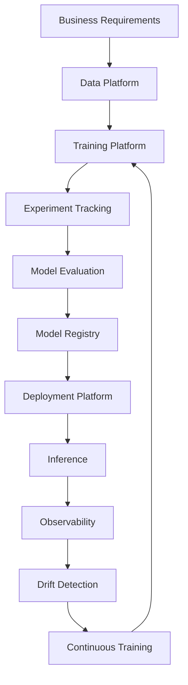

---

# 🏢 Production Quality Gates

Every production model should pass gates such as:

```text
Data Quality
      ↓
Training Quality
      ↓
Validation Quality
      ↓
Performance Quality
      ↓
Security
      ↓
Latency
      ↓
Cost
      ↓
Approval
      ↓
Deployment
```

---

# 🏢 Model Lifecycle States

A mature organization may manage models using:

```text
Development
     ↓
Experiment
     ↓
Candidate
     ↓
Validated
     ↓
Staging
     ↓
Production
     ↓
Deprecated
     ↓
Archived
```

---

# 🏢 Model Governance

Production Deep Learning systems should maintain:

```text
Model Ownership
Model Version
Dataset Lineage
Training Configuration
Evaluation Results
Approval History
Deployment History
Monitoring History
```

This becomes increasingly important in regulated enterprise environments.

---

# 🏢 Model Lifecycle vs Software Lifecycle

| Software Lifecycle | Deep Learning Lifecycle |
|---|---|
| Source Code | Source Code + Data |
| Build | Training |
| Test | Validation + Evaluation |
| Artifact | Model Artifact |
| Deployment | Model Deployment |
| Monitoring | Model + System Monitoring |
| Release | Model Promotion |
| Maintenance | Retraining |

The key difference is:

> **Software behavior is primarily determined by code, while Deep Learning behavior depends on code, data, model architecture, parameters, and training configuration.**

---

# 🧠 The Deep Learning Engineering Loop

```text
Build
 ↓
Train
 ↓
Evaluate
 ↓
Deploy
 ↓
Observe
 ↓
Learn
 ↓
Improve
 ↓
Retrain
 ↓
Deploy Again
```

---

!!! tip "Production Insight"

    **Training a Deep Learning model is not the finish line. It is the beginning of the model lifecycle.**

    A production-grade system must connect:

    ```text
    Data
       ↓
    Training
       ↓
    Evaluation
       ↓
    Versioning
       ↓
    Deployment
       ↓
    Monitoring
       ↓
    Drift Detection
       ↓
    Retraining
    ```

    The most important engineering mindset is:

    > **Treat the model as a versioned production artifact that continuously evolves with data and business requirements.**

    In real-world systems, significant effort goes beyond neural-network architecture itself: data preparation, experiment tracking, evaluation, deployment, monitoring, infrastructure, and continuous improvement are all part of the lifecycle. :contentReference[oaicite:9]{index=9}

---

# 🚀 Quick Revision Sheet

## Complete Lifecycle

```text
Business Problem

↓

Data Collection

↓

Data Preparation

↓

Train / Validation / Test

↓

Model Design

↓

Training

↓

Hyperparameter Tuning

↓

Evaluation

↓

Checkpoint

↓

Model Persistence

↓

Model Registry

↓

Deployment

↓

Inference

↓

Monitoring

↓

Drift Detection

↓

Retraining

↓

Continuous Improvement
```

---

## Training Flow

```text
Input
 ↓
Forward Pass
 ↓
Prediction
 ↓
Loss
 ↓
Backpropagation
 ↓
Optimizer
 ↓
Weight Update
```

---

## Production Flow

```text
Data
 ↓
Train
 ↓
Evaluate
 ↓
Register
 ↓
Deploy
 ↓
Monitor
 ↓
Retrain
```

---

## Remember

```text
Data Quality
     >
Model Complexity

Evaluation
     >
Training Accuracy

Monitoring
     >
Deployment

Reproducibility
     >
One-Time Experiment

Continuous Improvement
     >
One-Time Training
```

---

# 📌 Key Takeaways

- Deep Learning is an engineering lifecycle, not simply a model-training task.
- The lifecycle begins with a clearly defined business problem.
- Data quality is fundamental to model quality.
- Training, validation, and test datasets serve different purposes.
- Model architecture should match the problem, data, and production constraints.
- Training consists of forward propagation, loss calculation, backpropagation, and parameter updates.
- Epochs, batches, and steps describe different levels of the training process.
- Hyperparameter tuning is essential for optimizing model performance.
- Experiment tracking makes Deep Learning development reproducible.
- Checkpointing protects long-running training jobs and enables recovery.
- Early stopping can prevent unnecessary training and reduce overfitting.
- Model evaluation should use appropriate technical and business metrics.
- Model interpretation can help engineers understand model behavior.
- Trained models should be persisted in reusable formats.
- Model versions should be linked to dataset, code, configuration, and experiment information.
- A model registry provides centralized model lifecycle management.
- Deployment can support online, batch, or streaming inference.
- Inference optimization is different from training optimization.
- Production models must be monitored continuously.
- Data drift occurs when production input distributions change.
- Concept drift occurs when the relationship between inputs and outcomes changes.
- Model drift represents degradation in production model performance.
- Retraining can be scheduled, triggered by conditions, or performed continuously.
- CI/CD can be extended with Continuous Training for ML and Deep Learning systems.
- Production models should pass validation and quality gates before deployment.
- Shadow and canary deployment strategies reduce production risk.
- Rollback is essential for safe model deployment.
- Training and inference are often best managed as separate infrastructure planes.
- Deep Learning lifecycle management requires data lineage, model lineage, experiment tracking, versioning, monitoring, and governance.
- A production Deep Learning system should continuously learn from new data and changing business conditions.

---

# 📚 Further Reading

Continue with:

- **[37. Building Production Deep Learning Systems](37-building-production-deep-learning-systems.md)**

---

## ➡️ Next Chapter

**[37. Building Production Deep Learning Systems](37-building-production-deep-learning-systems.md)**

---

> **Enterprise AI Engineering Handbook**  
> *Building Production-Grade Enterprise AI Systems — One Chapter at a Time.*