# 37. Building Production Deep Learning Systems

> Learn how to transform Deep Learning models into scalable, reliable, observable, secure, and maintainable production systems that integrate data engineering, model training, deployment, inference, monitoring, governance, and continuous improvement.

---

## 🎯 Learning Objectives

After completing this chapter, you will be able to:

- Understand what makes a Deep Learning system production-ready
- Design an end-to-end production Deep Learning architecture
- Separate training and inference responsibilities
- Design reliable data pipelines
- Build reproducible Deep Learning training workflows
- Understand model versioning and lineage
- Design model registry workflows
- Deploy Deep Learning models as production services
- Design online, batch, and streaming inference architectures
- Optimize inference latency and throughput
- Design GPU-accelerated inference platforms
- Understand autoscaling for Deep Learning workloads
- Design production monitoring and observability
- Monitor model quality and system performance
- Detect data drift and model drift
- Implement model rollback strategies
- Design continuous training workflows
- Apply CI/CD/CT principles to Deep Learning
- Understand security and governance requirements
- Optimize Deep Learning infrastructure cost
- Design highly available Deep Learning systems
- Understand common production failure modes
- Apply enterprise architecture principles to Deep Learning systems

---

# 📖 Overview

Building a Deep Learning model in a notebook is very different from operating that model as a production system.

A notebook may contain:

```text
Dataset
   ↓
Model
   ↓
Training
   ↓
Prediction
```

A production system requires significantly more:

```text
Data Engineering
      ↓
Data Validation
      ↓
Dataset Versioning
      ↓
Training Pipeline
      ↓
Experiment Tracking
      ↓
Model Evaluation
      ↓
Model Registry
      ↓
Deployment
      ↓
Inference
      ↓
Monitoring
      ↓
Drift Detection
      ↓
Retraining
```

Production Deep Learning therefore combines:

```text
Deep Learning
+
Software Engineering
+
Cloud Infrastructure
+
Data Engineering
+
MLOps
+
Observability
+
Security
+
Governance
```

The uploaded Deep Learning notes emphasize that production systems require much more than neural-network training, including data preparation, experiment tracking, evaluation, deployment, inference optimization, monitoring, infrastructure, and continuous improvement.

---

# 🧠 What Is a Production Deep Learning System?

A production Deep Learning system is an engineered platform that takes a model from:

```text
Data
```

to:

```text
Reliable Business Capability
```

A simplified lifecycle is:

```text
Business Problem
       ↓
Data
       ↓
Training
       ↓
Evaluation
       ↓
Model Registry
       ↓
Deployment
       ↓
Inference
       ↓
Monitoring
       ↓
Continuous Improvement
```

---

# 🏗 Production Deep Learning Architecture

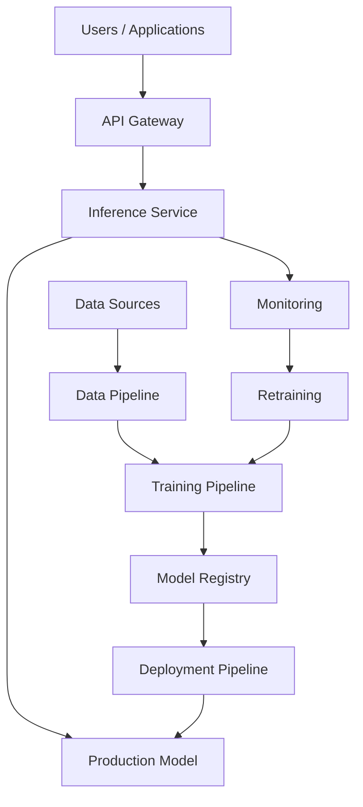

---

# 🧠 Production vs Notebook

| Notebook | Production |
|---|---|
| Manual execution | Automated pipelines |
| Local dataset | Managed data pipeline |
| Local model | Versioned model |
| Manual training | Automated training |
| Manual evaluation | Quality gates |
| Local inference | Scalable serving |
| No monitoring | Full observability |
| No rollback | Versioned rollback |
| One experiment | Experiment tracking |
| Manual retraining | Continuous / scheduled retraining |

---

# 🏢 Production Mindset

A production Deep Learning engineer should ask:

```text
Can we reproduce the model?

Can we deploy it safely?

Can we scale it?

Can we monitor it?

Can we roll it back?

Can we retrain it?

Can we explain its behavior?

Can we secure it?

Can we control its cost?
```

These questions are often more important than simply asking:

```text
What is the model accuracy?
```

---

# 1. 🎯 Start With the Business Problem

Production Deep Learning should begin with a business requirement.

Examples:

```text
Fraud Detection
Image Classification
Document Processing
Demand Forecasting
Recommendation
Speech Recognition
Customer Support
Medical Imaging
Anomaly Detection
```

---

# 🧠 Define Production Requirements

Before selecting an architecture, define:

```text
Accuracy
Latency
Throughput
Availability
Scalability
Cost
Security
Data Privacy
Compliance
```

---

# 📊 Model Requirements vs System Requirements

| Model Requirements | System Requirements |
|---|---|
| Accuracy | Availability |
| Precision | Latency |
| Recall | Throughput |
| F1 | Scalability |
| Loss | Cost |
| Generalization | Security |

A production system must satisfy both.

---

# 2. 🗃️ Production Data Architecture

Deep Learning systems are only as reliable as their data pipeline.

A production data platform may look like:

```text
Data Sources
     ↓
Ingestion
     ↓
Validation
     ↓
Storage
     ↓
Transformation
     ↓
Dataset
     ↓
Training
```

---

# 🧠 Data Sources

Examples include:

```text
Databases
Object Storage
APIs
Event Streams
IoT Devices
Applications
Documents
Images
Audio
Video
Logs
```

---

# 🧠 Data Pipeline


---

# 3. 🔍 Data Validation

Production pipelines should validate incoming data.

Check:

```text
Schema
Missing Values
Data Types
Value Ranges
Duplicates
Distribution
Labels
Data Volume
```

---

# 🧠 Data Quality Gate

```text
Incoming Data
      ↓
Schema Validation
      ↓
Quality Validation
      ↓
Distribution Check
      ↓
Approved Dataset
```

If validation fails:

```text
Data Validation
      ↓
FAIL
      ↓
Stop Pipeline
      ↓
Alert
```

---

# 🧠 Data Validation Architecture

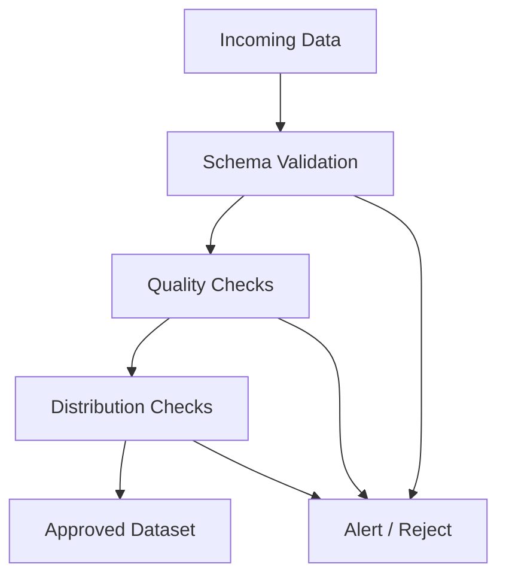

---

# 4. 📦 Dataset Versioning

Production systems should version datasets.

Instead of:

```text
training-data.csv
```

use:

```text
dataset-v1
dataset-v2
dataset-v3
```

Each version should capture:

```text
Source
Transformation
Schema
Timestamp
Validation Results
Labels
Data Lineage
```

---

# 🧠 Dataset Lineage


---

# 5. 🧪 Reproducible Training

A production training run should be reproducible.

Track:

```text
Dataset Version
Code Version
Model Architecture
Hyperparameters
Random Seed
Framework Version
GPU Type
Precision
Training Configuration
```

---

# 🧠 Reproducibility

```text
Dataset
   +
Code
   +
Configuration
   +
Environment
   +
Random Seed
      ↓
Training Run
      ↓
Model
```

---

# 🧠 Reproducibility Metadata

Example:

```yaml
model:
  name: image-classifier
  version: "3.2"

dataset:
  name: satellite-images
  version: "2.1"

training:
  framework: pytorch
  learning_rate: 0.001
  batch_size: 64
  epochs: 30

hardware:
  accelerator: gpu

precision:
  type: mixed
```

---

# 6. 🏋️ Production Training Pipeline

A production training pipeline should automate:

```text
Data Validation
      ↓
Dataset Preparation
      ↓
Training
      ↓
Validation
      ↓
Evaluation
      ↓
Checkpoint
      ↓
Model Registration
```

---

# 🧠 Training Pipeline

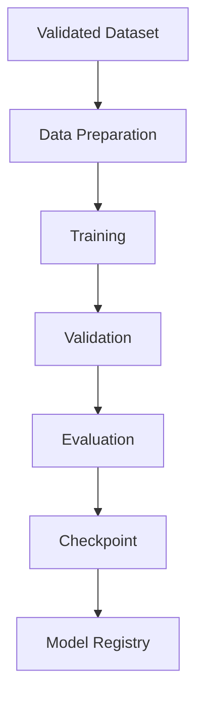

---

# 7. 🧪 Experiment Tracking

Every production training run should be traceable.

Track:

```text
Experiment ID
Dataset Version
Model Architecture
Hyperparameters
Training Metrics
Validation Metrics
GPU
Training Time
Checkpoint
Code Version
```

---

# 🧠 Experiment Example

```text
Experiment: EXP-2026-0812

Dataset: dataset-v4

Model:
ResNet-50

Learning Rate:
0.001

Batch Size:
64

Epochs:
50

Validation Accuracy:
94.2%

GPU:
8 × GPU

Checkpoint:
model-v4
```

---

# 8. 💾 Checkpointing

Training jobs can fail because of:

```text
Hardware Failure
Network Failure
Cloud Interruption
Out Of Memory
Software Failure
```

Checkpointing allows recovery.

```text
Training
   ↓
Checkpoint
   ↓
Training
   ↓
Checkpoint
   ↓
Failure
   ↓
Resume
```

---

# 🧠 Production Checkpoint Strategy

Checkpoints should be:

```text
Versioned
Durable
Accessible
Validated
Recoverable
```

Store them in reliable storage rather than only on local GPU disks.

---

# 9. 🗂️ Model Registry

A model registry becomes the central source of truth for model artifacts.

It can maintain:

```text
Model Version
Dataset Version
Training Run
Metrics
Artifact
Approval Status
Deployment Status
```

---

# 🧠 Model Lifecycle

```text
Training
   ↓
Candidate
   ↓
Validation
   ↓
Approved
   ↓
Staging
   ↓
Production
   ↓
Deprecated
   ↓
Archived
```

---

# 🧠 Model Registry Architecture

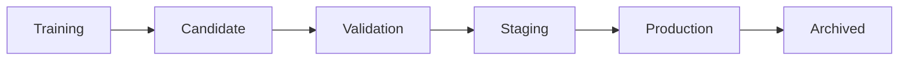

---

# 10. 🚦 Model Quality Gates

A model should not automatically enter production after training.

Quality gates may include:

```text
Accuracy
Precision
Recall
F1
Latency
Memory
Throughput
Bias
Security
Business KPI
```

---

# 🧠 Promotion Workflow

```text
Candidate Model
      ↓
Automated Evaluation
      ↓
Quality Gates
      ↓
Approval
      ↓
Staging
      ↓
Production
```

---

# 11. 🚀 Model Deployment

Production deployment exposes the model to applications.

Common deployment options include:

```text
REST API
Batch Processing
Streaming
Internal Microservice
Cloud AI Platform
Kubernetes Service
```

---

# 🧠 Online Inference

```text
Client
  ↓
API
  ↓
Model Service
  ↓
Model
  ↓
Prediction
  ↓
Response
```

---

# 🧠 Batch Inference

```text
Large Dataset
      ↓
Batch Processing
      ↓
Model
      ↓
Predictions
      ↓
Storage
```

---

# 🧠 Streaming Inference

```text
Event
  ↓
Stream
  ↓
Inference Service
  ↓
Model
  ↓
Prediction
  ↓
Downstream System
```

---

# 12. 🏗️ Model Serving Architecture

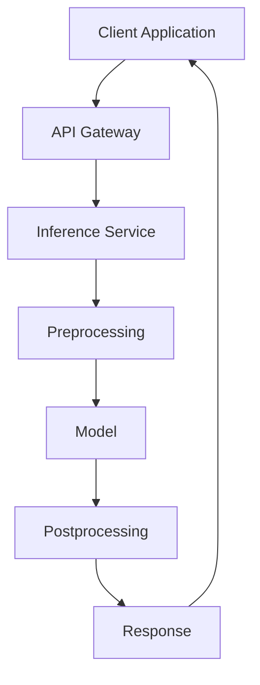

---

# 13. 📦 Containerized Model Serving

A production model can be packaged inside a container.

```text
Container
│
├── Application
├── Model
├── Runtime
├── Framework
├── Dependencies
└── Configuration
```

Example architecture:

```text
Docker Image
      ↓
Container
      ↓
Inference Service
      ↓
Model
```

---

# 14. ☁️ Kubernetes Model Serving

A Kubernetes-based deployment may look like:

```text
Kubernetes Cluster
       │
       ├── API Pods
       │
       ├── Inference Pods
       │
       └── GPU Nodes
              │
              ├── Model Pod
              ├── Model Pod
              └── Model Pod
```

---

# 🧠 Kubernetes GPU Architecture

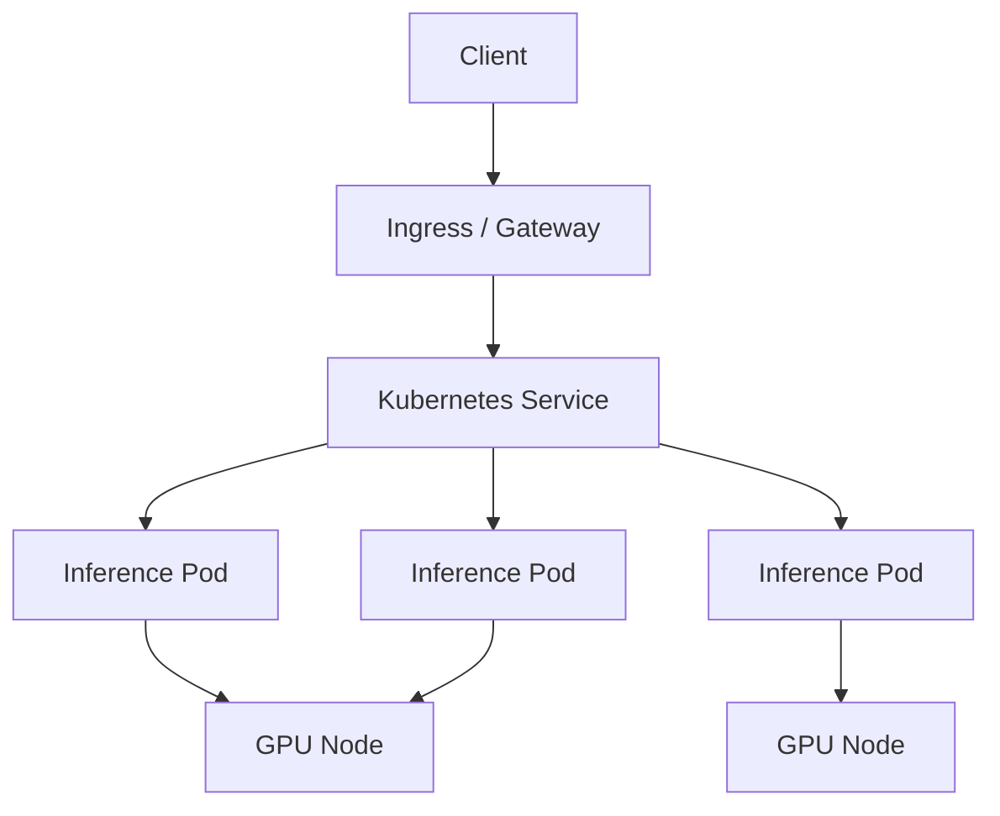

---

# 15. ⚡ Inference Latency

Production applications often require low latency.

Total latency can be represented conceptually as:

\[
L_{total}
=
L_{network}
+
L_{preprocess}
+
L_{queue}
+
L_{model}
+
L_{postprocess}
\]

The model itself may not be the only bottleneck.

---

# 🧠 Latency Breakdown

```text
Request
   ↓
Network
   ↓
Queue
   ↓
Preprocessing
   ↓
GPU
   ↓
Model
   ↓
Postprocessing
   ↓
Response
```

---

# 🧠 Latency Optimization

Possible techniques include:

```text
Batching
Dynamic Batching
Model Quantization
Mixed Precision
Caching
GPU Acceleration
Model Compilation
Smaller Models
Efficient Preprocessing
```

---

# 16. 📈 Throughput

Throughput measures how many requests or samples the system can process over time.

For example:

```text
1,000 requests / second
```

A production system often needs to balance:

```text
Latency
vs
Throughput
```

---

# 🧠 Latency vs Throughput

```text
Larger Batch
     ↓
Higher Throughput
     ↓
Potentially Higher Latency
```

Therefore production systems need workload-specific tuning.

---

# 17. 📦 Dynamic Batching

Dynamic batching combines multiple requests into a batch.

```text
Request 1 ─┐
Request 2 ─┤
Request 3 ─┼──► Dynamic Batch
Request 4 ─┘
                  ↓
                GPU
```

This can improve GPU utilization.

---

# 18. 🧠 GPU Inference Optimization

Production GPU inference may use:

```text
Mixed Precision
FP16
BF16
Quantization
Batching
Dynamic Batching
Tensor Acceleration
Model Compilation
Memory Optimization
```

---

# 19. 💰 Cost Optimization

GPU infrastructure can be expensive.

The objective is not:

```text
Maximum GPU Usage
```

but:

```text
Required Performance
+
Required Reliability
+
Acceptable Cost
```

---

# 🧠 GPU Cost Optimization

Strategies include:

```text
Right-Sizing
Autoscaling
Batching
Quantization
Mixed Precision
Smaller Models
Spot / Preemptible Capacity
Efficient Training
Model Caching
Idle Resource Removal
```

---

# 🧠 Cost Model

A simplified model:

\[
Cost
=
Runtime
\times
Resource\ Price
\]

Therefore:

```text
Reduce Runtime
      ↓
Reduce Cost
```

and:

```text
Improve Utilization
      ↓
More Work per GPU Hour
```

---

# 20. 📈 Autoscaling

Production workloads are rarely constant.

Traffic may look like:

```text
Low Traffic
     ↓
High Traffic
     ↓
Peak Traffic
     ↓
Low Traffic
```

Autoscaling can dynamically adjust resources.

---

# 🧠 Autoscaling Architecture

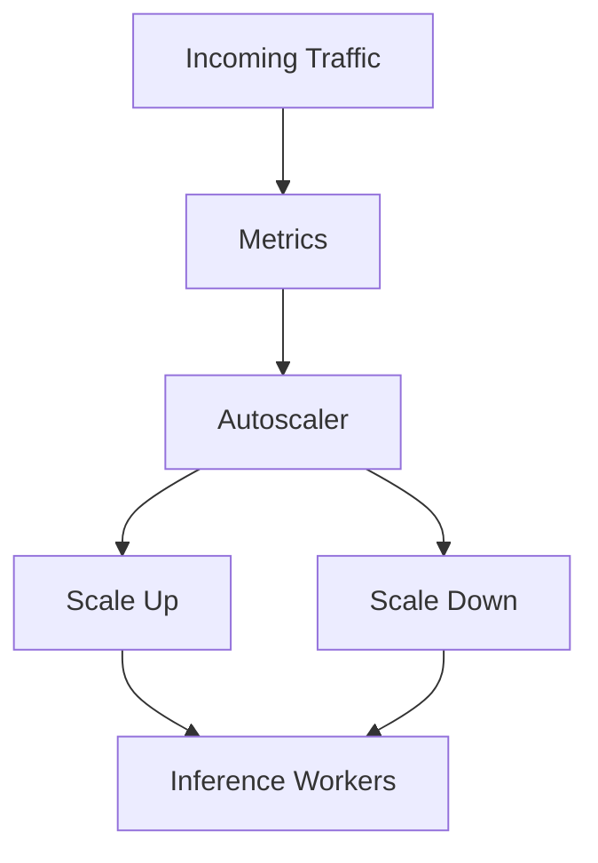

---

# 21. 🩺 Production Monitoring

Production Deep Learning systems require continuous monitoring.

Monitor four major categories:

```text
System
Model
Data
Business
```

---

# 🖥️ System Monitoring

Monitor:

```text
CPU
Memory
GPU Utilization
GPU Memory
Disk
Network
Latency
Throughput
Errors
Availability
```

---

# 🧠 Model Monitoring

Monitor:

```text
Accuracy
Precision
Recall
F1
Prediction Distribution
Confidence
Model Drift
```

---

# 📊 Data Monitoring

Monitor:

```text
Schema
Missing Values
Feature Distribution
Input Volume
Data Quality
Data Drift
```

---

# 🏢 Business Monitoring

Monitor:

```text
Revenue
Conversion
Fraud Loss
Customer Satisfaction
Operational Efficiency
Cost
```

---

# 🧠 Four-Layer Monitoring

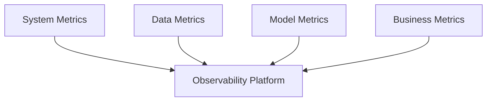

---

# 22. 📡 Observability

Observability should provide:

```text
Metrics
Logs
Traces
Alerts
Dashboards
```

---

# 🧠 Production Request Trace

```text
Client
  ↓
API Gateway
  ↓
Inference Service
  ↓
Preprocessing
  ↓
GPU
  ↓
Model
  ↓
Postprocessing
  ↓
Response
```

Each stage should be observable.

---

# 🧠 Important Metrics

### Latency

```text
P50
P90
P95
P99
```

### Throughput

```text
Requests / Second
Samples / Second
```

### Errors

```text
Error Rate
Timeout Rate
HTTP Errors
Inference Failures
```

### GPU

```text
GPU Utilization
GPU Memory
GPU Temperature
GPU Power
```

---

# 23. 📉 Model Drift

Production data changes over time.

```text
Training Distribution
        ↓
Production Distribution
        ↓
Distribution Changes
        ↓
Model Performance Changes
```

---

# 🧠 Data Drift

Input distribution changes.

```text
Training Data
      ↓
Distribution A

Production Data
      ↓
Distribution B
```

---

# 🧠 Concept Drift

The relationship between input and target changes.

```text
Old Behavior
      ↓
Old Relationship

New Behavior
      ↓
New Relationship
```

---

# 🧠 Drift Detection

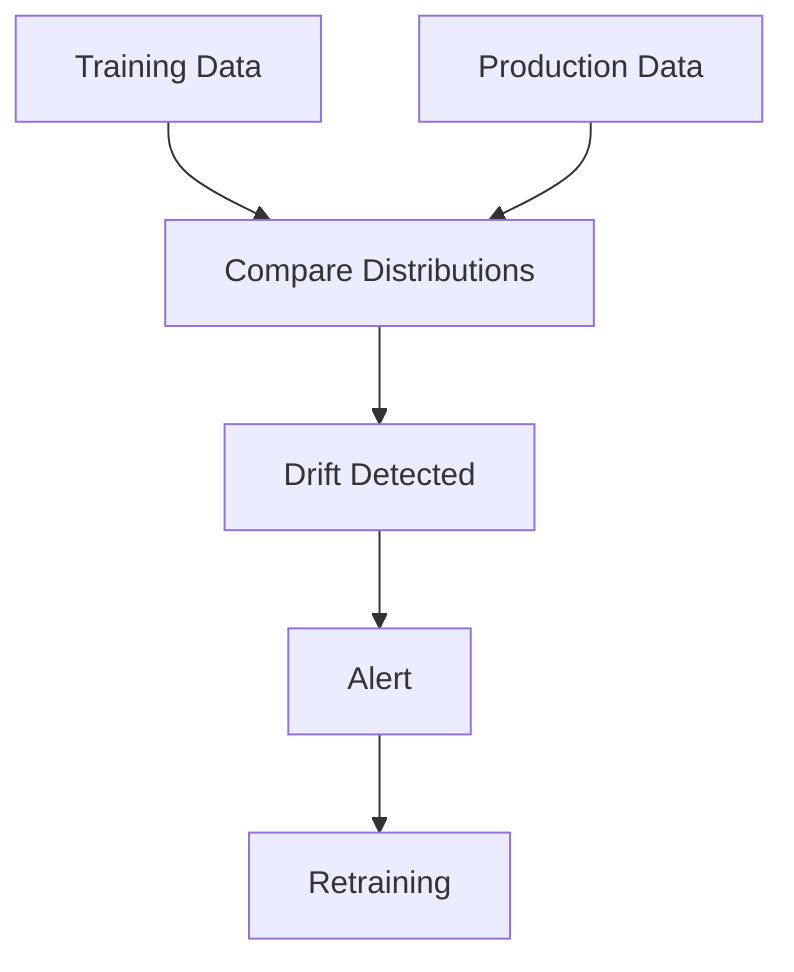

---

# 24. 🔄 Continuous Training

A production Deep Learning platform can automatically retrain models.

```text
New Data
   ↓
Data Validation
   ↓
Training
   ↓
Evaluation
   ↓
Model Registry
   ↓
Deployment
```

---

# 🧠 Continuous Training Architecture

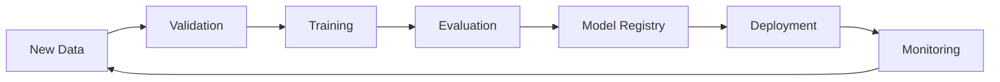

---

# 25. 🔁 CI/CD/CT

Traditional software engineering uses:

```text
Continuous Integration
Continuous Delivery
```

Deep Learning adds:

```text
Continuous Training
```

Therefore:

```text
CI
+
CD
+
CT
```

---

# 🧠 CI/CD/CT Pipeline

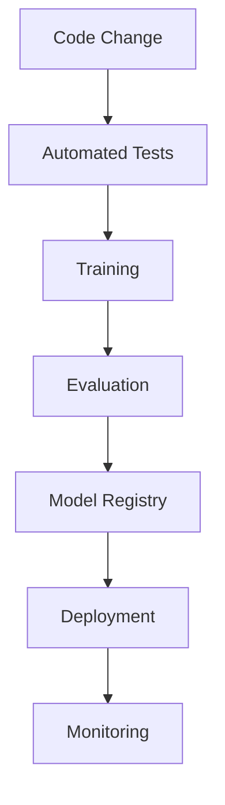

---

# 26. 🧪 Automated Testing

Production Deep Learning systems should include:

### Unit Tests

```text
Data Processing
Model Components
Utilities
```

### Data Tests

```text
Schema
Ranges
Missing Values
Distribution
Labels
```

### Model Tests

```text
Input Shape
Output Shape
Prediction Range
Inference
```

### Integration Tests

```text
API
Model
Storage
Database
Messaging
```

---

# 27. 🚦 Deployment Strategies

Production model releases should be controlled.

Common approaches:

```text
Blue / Green
Canary
Shadow
Rolling
A/B
```

---

# 🔵 Blue-Green Deployment

```text
Blue
 ↓
Current Production

Green
 ↓
New Model
```

Traffic can be switched from Blue to Green after validation.

---

# 🟣 Shadow Deployment

```text
Production Request
       │
       ├────► Current Model
       │
       └────► Candidate Model
                    ↓
                Compare
```

The candidate model does not control the production response.

---

# 🟢 Canary Deployment

```text
Model v1 → 90%
Model v2 → 10%
```

If successful:

```text
Model v1 → 50%
Model v2 → 50%
```

Eventually:

```text
Model v2 → 100%
```

---

# 28. 🔙 Rollback

Every model deployment should support rollback.

```text
Model v1
   ↓
Model v2
   ↓
Production
   ↓
Problem
   ↓
Rollback
   ↓
Model v1
```

---

# 🧠 Rollback Requirements

Maintain:

```text
Previous Model
Previous Configuration
Previous Container
Previous Deployment Configuration
```

Rollback should be automated whenever practical.

---

# 29. 🔐 Security

Production Deep Learning systems process potentially sensitive data.

Security should cover:

```text
Authentication
Authorization
Encryption
Secrets
Network Security
Data Privacy
Access Control
Audit Logging
```

---

# 🧠 Authentication vs Authorization

```text
Authentication
     ↓
Who are you?

Authorization
     ↓
What are you allowed to do?
```

---

# 30. 🔒 Data Security

Sensitive data may include:

```text
Customer Information
Financial Data
Medical Data
Documents
Voice
Images
Enterprise Data
```

Protect data using:

```text
Encryption at Rest
Encryption in Transit
Access Controls
Data Masking
Tokenization
Least Privilege
```

---

# 31. 🛡️ Model Security

Production models can also be targeted.

Potential risks include:

```text
Model Extraction
Adversarial Inputs
Data Poisoning
Unauthorized Access
Model Tampering
Prompt Injection
```

The exact risks depend on the model and application type.

---

# 32. 📋 Governance

Enterprise Deep Learning systems should maintain:

```text
Model Ownership
Dataset Lineage
Model Version
Training History
Evaluation Results
Approval History
Deployment History
Monitoring History
```

---

# 🧠 Governance Architecture

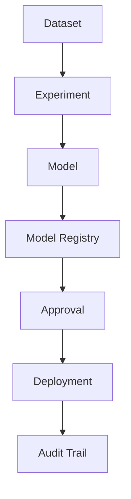

---

# 33. 📜 Model Lineage

A production platform should answer:

```text
Which dataset trained this model?

Which code created it?

Which hyperparameters were used?

Which experiment produced it?

Which evaluation metrics were achieved?

Which version is deployed?

Where is it deployed?

Who approved it?
```

---

# 34. 🧠 Model Explainability

Some enterprise applications require understanding model decisions.

Depending on the model:

```text
SHAP
LIME
Grad-CAM
Attention Visualization
Feature Importance
Saliency Maps
```

can be used.

---

# 35. 🧠 Responsible AI

Production AI systems should consider:

```text
Fairness
Transparency
Privacy
Safety
Security
Accountability
Human Oversight
```

---

# 36. 🏢 High Availability

Production inference systems should avoid a single point of failure.

Instead of:

```text
Client
  ↓
One Model Server
```

use:

```text
Client
  ↓
Load Balancer
  ↓
Model Server 1
Model Server 2
Model Server 3
```

---

# 🧠 High Availability Architecture

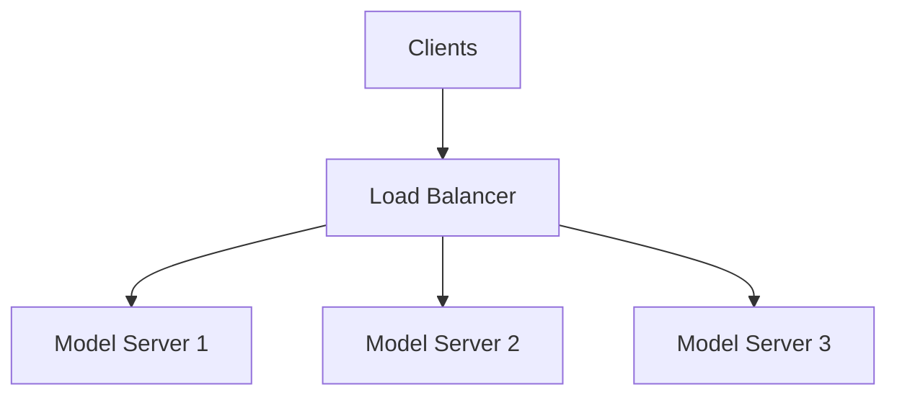

---

# 37. 📈 Scalability

A production system should scale based on demand.

### Horizontal Scaling

Add more inference instances.

```text
1 Instance
   ↓
2 Instances
   ↓
4 Instances
   ↓
8 Instances
```

---

### Vertical Scaling

Increase resources per instance.

```text
Small GPU
   ↓
Large GPU
```

---

# 🧠 Horizontal vs Vertical Scaling

| Horizontal | Vertical |
|---|---|
| More instances | Larger instance |
| Better elasticity | More resources per instance |
| Better fault tolerance | Simpler architecture |
| Good for high traffic | Good for large individual models |

---

# 38. 🧠 Large Model Deployment

Large models may not fit into one GPU.

Possible strategies:

```text
Model Sharding
Model Parallelism
Pipeline Parallelism
Quantization
Tensor Parallelism
Multiple GPUs
```

---

# 🧠 Large Model Architecture

```text
Model
 │
 ├── GPU 1
 │
 ├── GPU 2
 │
 ├── GPU 3
 │
 └── GPU 4
```

---

# 39. 🧠 Model Optimization

Before scaling infrastructure, optimize the model.

Possible techniques:

```text
Pruning
Quantization
Knowledge Distillation
Mixed Precision
Smaller Architecture
Operator Fusion
Compilation
Caching
```

---

# 40. ⚡ Inference Optimization Strategy

Use:

```text
Measure
  ↓
Profile
  ↓
Identify Bottleneck
  ↓
Optimize
  ↓
Measure Again
```

Do not optimize based only on assumptions.

---

# 🧠 Production Optimization Loop

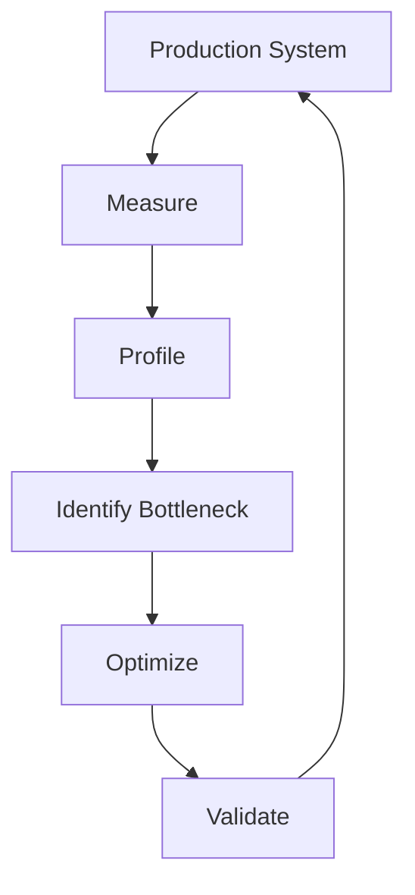

---

# 41. 🧪 Load Testing

Before production, test:

```text
Expected Traffic
Peak Traffic
Burst Traffic
Failure Scenarios
```

Measure:

```text
Latency
Throughput
Error Rate
GPU Utilization
Memory
Scalability
```

---

# 42. 🧪 Stress Testing

Push the system beyond expected capacity.

```text
Normal
  ↓
High
  ↓
Very High
  ↓
System Limit
```

Determine:

```text
Maximum Throughput
Failure Point
Recovery Behavior
Autoscaling Behavior
```

---

# 43. 🧪 Failure Testing

Test:

```text
GPU Failure
Pod Failure
Network Failure
Storage Failure
Model Loading Failure
Dependency Failure
```

The objective is to validate:

```text
Recovery
Retry
Failover
Rollback
Alerting
```

---

# 44. 🧠 Reliability Engineering

Production Deep Learning systems should follow:

```text
Reliability
+
Availability
+
Recoverability
```

---

# 45. 🧠 Error Handling

Inference systems should handle:

```text
Invalid Input
Timeout
Model Failure
GPU Failure
Dependency Failure
Overload
```

Example:

```text
Request
   ↓
Validation
   ↓
Valid?
 ┌───┴───┐
No      Yes
↓        ↓
Error   Model
          ↓
       Response
```

---

# 46. 🧠 Retry Strategy

Retries should be used carefully.

```text
Transient Failure
      ↓
Retry
      ↓
Success
```

But:

```text
Permanent Failure
      ↓
Retry × 10
      ↓
System Overload
```

can make the problem worse.

Use:

```text
Timeout
Backoff
Retry Limit
Circuit Breaker
```

where appropriate.

---

# 47. 🔌 Circuit Breaker

A circuit breaker can prevent cascading failures.

```text
Healthy
   ↓
Failure Rate ↑
   ↓
Open Circuit
   ↓
Reject / Fallback
   ↓
Recovery
   ↓
Close Circuit
```

---

# 48. 🧠 Graceful Degradation

If the primary model is unavailable:

```text
Primary Model
      ↓
Failure
      ↓
Fallback Model
```

Examples:

```text
Large Model
   ↓
Smaller Model

GPU
   ↓
CPU

Advanced Model
   ↓
Baseline Model
```

---

# 49. 📦 Model Caching

Caching can reduce repeated inference.

Examples:

```text
Request Cache
Embedding Cache
Feature Cache
Prediction Cache
```

Conceptually:

```text
Request
  ↓
Cache?
 ┌───┴───┐
Yes     No
↓        ↓
Result  Model
          ↓
        Cache
```

---

# 50. 🧠 Feature and Input Preprocessing

Preprocessing should be production-consistent with training.

A common failure is:

```text
Training Preprocessing
       ≠
Production Preprocessing
```

This can produce poor predictions.

Therefore:

```text
Training Pipeline
       +
Inference Pipeline
```

must share consistent preprocessing logic.

---

# 🧠 Training / Inference Consistency

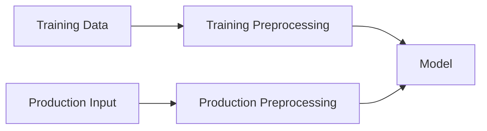

---

# 51. 🧠 Feature / Data Contract

Production systems should define contracts for model input.

Example:

```yaml
input:
  customer_age:
    type: integer
    required: true

  transaction_amount:
    type: float
    required: true

  country:
    type: string
    required: true
```

This helps prevent incompatible requests.

---

# 52. 📡 API Design

A model service should have a clear API contract.

Example:

```http
POST /predict
```

Request:

```json
{
  "features": {
    "age": 39,
    "income": 85000,
    "balance": 12000
  }
}
```

Response:

```json
{
  "prediction": 1,
  "confidence": 0.94
}
```

---

# 53. 🧠 API Versioning

Avoid breaking existing consumers.

Use:

```text
/api/v1/predict
/api/v2/predict
```

This allows controlled evolution.

---

# 54. 🏢 Microservices Architecture

Deep Learning models can be integrated into microservice architectures.

```text
API Gateway
    ↓
Business Service
    ↓
AI Service
    ↓
Model
```

The AI service can expose:

```text
Prediction
Classification
Embedding
Recommendation
Detection
```

---

# 🧠 AI Microservice Architecture

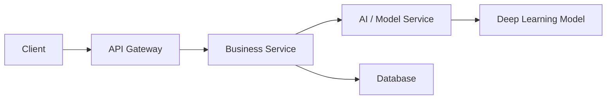

---

# 55. 🧩 Asynchronous Inference

For long-running predictions:

```text
Client
  ↓
Request
  ↓
Queue
  ↓
Inference Worker
  ↓
Result Storage
```

The client can retrieve the result later.

---

# 🧠 Async Inference Architecture

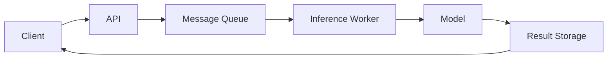

---

# 56. 📬 Queue-Based Scaling

Queues can absorb traffic spikes.

```text
Traffic Spike
      ↓
Queue
      ↓
Workers
      ↓
GPU
```

Instead of forcing every request directly onto a model server.

---

# 57. 🧠 Backpressure

When downstream capacity is limited:

```text
Incoming Requests
       ↓
Queue
       ↓
Controlled Processing
```

This prevents overload.

---

# 58. 🧠 Production Architecture Patterns

Common patterns include:

```text
Synchronous Inference
Asynchronous Inference
Batch Inference
Streaming Inference
GPU Serving
CPU Serving
Multi-Model Serving
Model Routing
Fallback Models
```

---

# 59. 🧠 Model Routing

Different models may be used for different workloads.

```text
Request
   ↓
Router
 ┌─┴──────────────┐
 ↓                ↓
Small Model     Large Model
 ↓                ↓
Fast            Accurate
```

This can optimize:

```text
Latency
Cost
Quality
```

---

# 60. 🧠 Multi-Model Serving

A serving platform may host:

```text
Model A
Model B
Model C
Model D
```

on shared infrastructure.

Benefits:

```text
Better Resource Utilization
Centralized Deployment
Simplified Management
```

But model isolation and resource contention must be managed carefully.

---

# 61. 🧠 Security Architecture

A production architecture can include:

```text
Client
  ↓
Authentication
  ↓
Authorization
  ↓
API Gateway
  ↓
Inference Service
  ↓
Model
```

---

# 62. 🔐 Secrets Management

Never hard-code:

```text
API Keys
Passwords
Cloud Credentials
Database Credentials
Certificates
```

Use a secrets management solution.

---

# 63. 🧠 Network Security

Production AI systems should consider:

```text
Private Networking
TLS
Network Policies
Firewall Rules
Service Identity
Ingress Controls
Egress Controls
```

---

# 64. 🧾 Audit Logging

Audit logs should capture appropriate operational events such as:

```text
Model Deployment
Model Promotion
Configuration Change
Access
Training Run
Rollback
Security Event
```

---

# 65. 🏢 Enterprise Production Platform

A mature enterprise Deep Learning platform may contain:

```text
Data Platform
      │
      ▼
Training Platform
      │
      ▼
Experiment Tracking
      │
      ▼
Model Registry
      │
      ▼
Deployment Platform
      │
      ▼
Inference Platform
      │
      ▼
Observability
      │
      ▼
Governance
```

---

# 🏢 Enterprise AI Platform

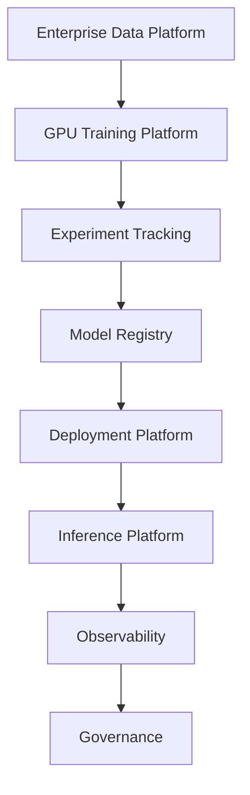

---

# 66. ☁️ Cloud-Native Deep Learning

Cloud environments can provide:

```text
Object Storage
GPU Compute
Containers
Kubernetes
Managed Databases
Queues
Monitoring
Identity
Secrets
Model Registry
```

---

# 🧠 Cloud-Native Architecture

```text
Object Storage
      ↓
Data Pipeline
      ↓
GPU Training
      ↓
Model Registry
      ↓
Container Registry
      ↓
Kubernetes / Model Serving
      ↓
Monitoring
```

---

# 67. 🐳 Container Registry

Production models can be packaged into container images.

```text
Source Code
   ↓
Build
   ↓
Container Image
   ↓
Container Registry
   ↓
Deployment
```

---

# 68. 🔄 Deployment Pipeline

```mermaid
flowchart TD

    CODE["Source Code"]

    TEST["Tests"]

    BUILD["Build Container"]

    SCAN["Security Scan"]

    REGISTRY["Container Registry"]

    STAGING["Staging"]

    PROD["Production"]

    CODE --> TEST
    TEST --> BUILD
    BUILD --> SCAN
    SCAN --> REGISTRY
    REGISTRY --> STAGING
    STAGING --> PROD
```

---

# 69. 🧠 Infrastructure as Code

Production infrastructure should be reproducible.

Typical infrastructure includes:

```text
Compute
Networking
Storage
GPU Nodes
Kubernetes
IAM
Monitoring
Queues
```

Infrastructure as Code helps define this consistently.

---

# 70. 🏗️ Environment Separation

Maintain separate environments:

```text
Development
      ↓
Testing
      ↓
Staging
      ↓
Production
```

This reduces deployment risk.

---

# 71. 🧪 Staging Environment

Staging should resemble production as closely as practical.

Test:

```text
Model
API
Infrastructure
Scaling
Monitoring
Security
Deployment
Rollback
```

---

# 72. 🧠 Configuration Management

Separate:

```text
Code
```

from:

```text
Configuration
```

Examples:

```text
Model Version
GPU Count
Batch Size
Timeout
Endpoint
Feature Flags
```

---

# 73. 🚦 Feature Flags

Feature flags can control:

```text
Model Version
Inference Strategy
New Architecture
Fallback
Experiment
```

Example:

```text
model_v2_enabled = true
```

---

# 74. 🧪 A/B Testing

Compare:

```text
Model A
vs
Model B
```

using production traffic.

Measure:

```text
Accuracy
Conversion
Latency
User Satisfaction
Cost
```

---

# 75. 📊 Production KPIs

A production Deep Learning system should define KPIs.

### Model KPIs

```text
Accuracy
Precision
Recall
F1
```

### System KPIs

```text
Latency
Throughput
Availability
Error Rate
```

### Business KPIs

```text
Revenue
Conversion
Cost Reduction
Customer Satisfaction
```

---

# 76. 🧠 SLO / SLA

Production systems may define:

```text
Availability SLO
Latency SLO
Error Rate SLO
Throughput SLO
```

For example:

```text
Availability ≥ 99.9%

P95 Latency < 200 ms

Error Rate < 0.1%
```

The exact targets depend on the application.

---

# 77. 🧠 Production Readiness Checklist

Before production, verify:

```text
✓ Data Validated
✓ Dataset Versioned
✓ Training Reproducible
✓ Model Evaluated
✓ Model Versioned
✓ Model Registered
✓ Security Reviewed
✓ API Tested
✓ Load Tested
✓ Monitoring Configured
✓ Alerts Configured
✓ Rollback Tested
✓ Autoscaling Tested
✓ Cost Reviewed
✓ Documentation Complete
```

---

# 78. ⚠ Common Production Failures

## Failure 1 — Notebook Works, Production Fails

Cause:

```text
Training Environment
      ≠
Production Environment
```

Solution:

```text
Containerization
+
Environment Versioning
+
Automated Testing
```

---

# 79. ⚠ Failure 2 — Data Pipeline Failure

```text
Data Failure
    ↓
Training Failure
```

Solution:

```text
Data Validation
+
Data Quality Monitoring
+
Pipeline Alerts
```

---

# 80. ⚠ Failure 3 — GPU Underutilization

```text
GPU Available
      ↓
CPU Pipeline Slow
      ↓
GPU Idle
```

Solution:

```text
Prefetching
Parallel Loading
Caching
Batch Optimization
```

---

# 81. ⚠ Failure 4 — High Inference Latency

Potential causes:

```text
Large Model
Slow Preprocessing
Network Latency
Small Batch
CPU Bottleneck
GPU Bottleneck
```

Solution:

```text
Profile
   ↓
Identify Bottleneck
   ↓
Optimize
```

---

# 82. ⚠ Failure 5 — Model Drift

```text
Production Data Changes
       ↓
Performance Drops
```

Solution:

```text
Monitoring
+
Drift Detection
+
Retraining
```

---

# 83. ⚠ Failure 6 — Model Version Confusion

```text
model-final.pkl
model-final-new.pkl
model-final-new2.pkl
```

This is not a production versioning strategy.

Use:

```text
model-v1
model-v2
model-v3
```

with complete lineage.

---

# 84. ⚠ Failure 7 — No Rollback

```text
Bad Deployment
      ↓
Production Impact
```

Every production deployment should have a known rollback path.

---

# 85. ⚠ Failure 8 — Cost Explosion

```text
High Traffic
   ↓
More GPU Instances
   ↓
Higher Cost
```

Without cost monitoring, infrastructure expenses can grow rapidly.

Use:

```text
Autoscaling
Right-Sizing
Batching
Quantization
Caching
Cost Monitoring
```

---

# 86. 🧪 Practical Exercise 1 — Production Architecture

Design:

```text
Client
  ↓
API Gateway
  ↓
Inference Service
  ↓
GPU Model
  ↓
Response
```

Add:

```text
Authentication
Monitoring
Autoscaling
Rollback
```

---

# 87. 🧪 Practical Exercise 2 — Model Registry

Create:

```text
Model v1
Model v2
Model v3
```

Track:

```text
Dataset
Code
Metrics
Training Configuration
Deployment Status
```

---

# 88. 🧪 Practical Exercise 3 — Containerized Model

Create a Docker image containing:

```text
Python
Framework
Model
Inference API
Dependencies
```

Run it locally.

---

# 89. 🧪 Practical Exercise 4 — FastAPI Inference Service

Build:

```text
POST /predict
GET /health
GET /version
```

Example:

```text
GET /health

{
  "status": "UP"
}
```

---

# 90. 🧪 Practical Exercise 5 — Load Testing

Generate:

```text
100 requests
1,000 requests
10,000 requests
```

Measure:

```text
P50
P95
P99
Throughput
Error Rate
```

---

# 91. 🧪 Practical Exercise 6 — Autoscaling

Simulate increasing traffic.

Observe:

```text
Low Traffic
 ↓
Scale Down

High Traffic
 ↓
Scale Up
```

---

# 92. 🧪 Practical Exercise 7 — Monitoring

Create dashboards for:

```text
Latency
Throughput
Errors
GPU Utilization
GPU Memory
Request Count
```

---

# 93. 🧪 Practical Exercise 8 — Drift Detection

Create:

```text
Training Dataset
```

and a changed:

```text
Production Dataset
```

Measure the distribution difference.

Trigger:

```text
Alert
```

when drift exceeds the defined threshold.

---

# 94. 🧪 Practical Exercise 9 — Canary Deployment

Deploy:

```text
Model v1 → 90%
Model v2 → 10%
```

Monitor:

```text
Latency
Accuracy
Error Rate
Business KPI
```

Increase traffic only if the candidate performs acceptably.

---

# 95. 🧪 Practical Exercise 10 — Rollback

Deploy:

```text
Model v2
```

introduce a simulated failure.

Automatically rollback to:

```text
Model v1
```

---

# 96. 🧪 Practical Exercise 11 — Continuous Training

Build:

```text
New Data
   ↓
Validation
   ↓
Training
   ↓
Evaluation
   ↓
Model Registry
   ↓
Deployment
```

---

# 97. 🧪 Practical Exercise 12 — End-to-End Enterprise System

Design:

```text
Enterprise Data
       ↓
Data Validation
       ↓
Dataset Versioning
       ↓
GPU Training
       ↓
Experiment Tracking
       ↓
Model Evaluation
       ↓
Model Registry
       ↓
Container Registry
       ↓
Kubernetes
       ↓
GPU Inference
       ↓
API Gateway
       ↓
Monitoring
       ↓
Drift Detection
       ↓
Retraining
```

---

# 🧠 Interview Questions

## Beginner

### 1. What makes a Deep Learning model production-ready?

A production-ready model requires more than good accuracy. It should have reliable deployment, monitoring, scalability, security, reproducibility, versioning, and rollback capabilities.

### 2. What is model serving?

Model serving is the infrastructure used to expose a trained model for inference.

### 3. What is model monitoring?

Model monitoring tracks model quality, data behavior, system performance, and business impact after deployment.

### 4. Why is model versioning important?

It allows teams to identify, reproduce, compare, deploy, and roll back specific model versions.

### 5. Why is containerization useful?

Containerization packages the model and its runtime dependencies into a reproducible deployment unit.

---

## Intermediate

### 6. What is the difference between online and batch inference?

Online inference processes requests individually or in small real-time batches, while batch inference processes large datasets offline.

### 7. What is model drift?

Model drift refers to degradation in model performance as production conditions change.

### 8. How do you monitor GPU inference?

Monitor:

```text
GPU Utilization
GPU Memory
Latency
Throughput
Error Rate
```

### 9. How do you reduce inference latency?

Use:

```text
Smaller Models
Batching
Quantization
Mixed Precision
Caching
GPU Optimization
Efficient Preprocessing
```

### 10. What is continuous training?

Continuous training automatically retrains models using new data and evaluates candidate models for potential deployment.

### 11. What is a model registry?

A model registry manages model artifacts, versions, metadata, metrics, and lifecycle stages.

### 12. Why are quality gates important?

They prevent poorly performing or unsafe models from being promoted to production.

---

## Advanced

### 13. How would you design a production Deep Learning architecture?

```text
Data Platform
      ↓
Training Pipeline
      ↓
Experiment Tracking
      ↓
Model Registry
      ↓
Deployment
      ↓
Inference
      ↓
Monitoring
      ↓
Retraining
```

with security, governance, scalability, and rollback integrated throughout.

### 14. How would you design highly available model serving?

Use:

```text
Load Balancer
+
Multiple Model Instances
+
Health Checks
+
Autoscaling
+
Failure Recovery
```

### 15. How would you optimize GPU inference?

First profile the workload, then identify whether it is:

```text
Compute Bound
Memory Bound
Input Bound
Network Bound
```

Then apply the appropriate optimization.

### 16. How would you safely deploy a new model?

Use:

```text
Validation
 ↓
Staging
 ↓
Shadow
 ↓
Canary
 ↓
Production
```

with monitoring and rollback.

### 17. How would you detect model drift?

Monitor production data and prediction behavior against the training baseline and trigger alerts when defined drift thresholds are exceeded.

### 18. How would you reduce GPU cost?

Use:

```text
Right-Sizing
Autoscaling
Batching
Mixed Precision
Quantization
Smaller Models
Caching
Efficient Training
```

### 19. What should be included in model lineage?

```text
Dataset Version
Code Version
Model Version
Training Configuration
Experiment
Metrics
Deployment
Approval
```

### 20. What is the difference between CI/CD and CI/CD/CT?

```text
CI
 ↓
Code Integration

CD
 ↓
Deployment

CT
 ↓
Continuous Model Training
```

Deep Learning systems often require all three.

---

# 🏢 Enterprise Perspective

Production Deep Learning should be treated as a **platform engineering problem**, not simply a model development problem.

A mature enterprise architecture connects:

```text
Data
 ↓
Training
 ↓
Model Registry
 ↓
Deployment
 ↓
Inference
 ↓
Observability
 ↓
Governance
 ↓
Continuous Training
```

The production concerns identified in the Deep Learning notes include:

```text
Data Quality
Reproducibility
GPU Utilization
Distributed Training
Model Versioning
Inference Latency
Scalability
Monitoring
Model Drift
Cost Optimization
Security
Governance
```

---

# 🏢 Production Deep Learning Platform

```mermaid
flowchart TD

    USERS["Users / Applications"]

    API["API Gateway"]

    AI["AI Service"]

    MODEL["Production Model"]

    DATA["Enterprise Data"]

    PIPELINE["Data Pipeline"]

    TRAIN["GPU Training"]

    TRACKING["Experiment Tracking"]

    REGISTRY["Model Registry"]

    DEPLOY["Deployment Platform"]

    OBS["Observability"]

    GOVERNANCE["Security & Governance"]

    RETRAIN["Continuous Training"]

    USERS --> API
    API --> AI
    AI --> MODEL

    DATA --> PIPELINE
    PIPELINE --> TRAIN
    TRAIN --> TRACKING
    TRACKING --> REGISTRY
    REGISTRY --> DEPLOY
    DEPLOY --> MODEL

    MODEL --> OBS
    OBS --> RETRAIN
    RETRAIN --> TRAIN

    GOVERNANCE --> API
    GOVERNANCE --> TRAIN
    GOVERNANCE --> REGISTRY
    GOVERNANCE --> MODEL
```

---

# 🏢 Training Plane

The training plane is responsible for:

```text
Data
Training
Experiments
Checkpoints
Evaluation
Model Registration
```

Architecture:

```text
Data
 ↓
Training Pipeline
 ↓
GPU Cluster
 ↓
Experiment Tracking
 ↓
Model Registry
```

---

# 🏢 Inference Plane

The inference plane is responsible for:

```text
Model Serving
API
Latency
Throughput
Scaling
Availability
```

Architecture:

```text
Client
 ↓
API Gateway
 ↓
Inference Service
 ↓
Model
 ↓
Prediction
```

---

# 🏢 Control Plane

A production AI platform also requires a control plane.

Responsibilities:

```text
Model Versioning
Deployment
Configuration
Security
Governance
Monitoring
Cost
```

---

# 🧠 Three-Plane Architecture

```mermaid
flowchart TD

    CONTROL["Control Plane<br/>Governance / Deployment / Registry"]

    TRAIN["Training Plane<br/>Data / GPU / Experiments"]

    INFER["Inference Plane<br/>Serving / API / Scaling"]

    CONTROL --> TRAIN
    CONTROL --> INFER

    TRAIN --> CONTROL
    INFER --> CONTROL
```

---

# 🏢 Enterprise AI Engineering Principles

A production Deep Learning platform should follow:

```text
1. Automate
2. Version
3. Validate
4. Observe
5. Secure
6. Scale
7. Recover
8. Optimize
```

---

# 🧠 Production Design Principles

## 1. Automate

Automate:

```text
Training
Testing
Evaluation
Deployment
Monitoring
Retraining
```

---

## 2. Version

Version:

```text
Code
Data
Model
Configuration
Container
Infrastructure
```

---

## 3. Validate

Validate:

```text
Data
Model
API
Infrastructure
Performance
Security
```

---

## 4. Observe

Monitor:

```text
System
Data
Model
Business
```

---

## 5. Secure

Protect:

```text
Data
Models
APIs
Infrastructure
Credentials
```

---

## 6. Scale

Scale:

```text
Training
Inference
Data
Infrastructure
```

---

## 7. Recover

Support:

```text
Checkpoint
Retry
Failover
Rollback
Disaster Recovery
```

---

## 8. Optimize

Optimize:

```text
Latency
Throughput
GPU Utilization
Memory
Cost
```

---

# 🧠 Production Deep Learning Maturity

A useful progression is:

```text
Level 1
Notebook
   ↓
Level 2
Scripted Training
   ↓
Level 3
Automated Training
   ↓
Level 4
Model Registry + Deployment
   ↓
Level 5
Monitoring + Retraining
   ↓
Level 6
Enterprise AI Platform
```

---

# 🏢 Level 1 — Notebook

```text
Manual Data
 ↓
Manual Training
 ↓
Manual Prediction
```

---

# 🏢 Level 2 — Scripted

```text
Code
 ↓
Training Script
 ↓
Model
```

---

# 🏢 Level 3 — Automated Training

```text
Pipeline
 ↓
Training
 ↓
Evaluation
 ↓
Artifact
```

---

# 🏢 Level 4 — Model Platform

```text
Training
 ↓
Registry
 ↓
Deployment
 ↓
Inference
```

---

# 🏢 Level 5 — MLOps

```text
Training
 ↓
Registry
 ↓
Deployment
 ↓
Monitoring
 ↓
Drift
 ↓
Retraining
```

---

# 🏢 Level 6 — Enterprise AI Platform

```text
Data Platform
      ↓
ML Platform
      ↓
Model Platform
      ↓
Inference Platform
      ↓
Observability
      ↓
Governance
      ↓
Continuous Improvement
```

---

# ⚠ Production Challenges

Deep Learning systems introduce several engineering challenges.

### Data Challenges

```text
Large Datasets
Poor Labels
Data Drift
Privacy
Data Quality
```

### Model Challenges

```text
Overfitting
Large Models
Inference Latency
Model Drift
Interpretability
```

### Infrastructure Challenges

```text
GPU Cost
GPU Availability
Scaling
Memory
Networking
Storage
```

### Operational Challenges

```text
Monitoring
Deployment
Rollback
Versioning
Governance
Security
```

---

# ⚠ Common Mistakes

Avoid:

- Treating a notebook as a production system.
- Ignoring data validation.
- Training without reproducibility.
- Not versioning datasets.
- Not versioning models.
- Deploying without quality gates.
- Ignoring inference latency.
- Ignoring GPU utilization.
- Not load testing.
- Not monitoring production.
- Ignoring model drift.
- No rollback strategy.
- No security controls.
- No cost monitoring.
- Manually retraining models.
- Mixing training and inference responsibilities unnecessarily.

---

!!! tip "Production Insight"

    **The neural network is only one component of a production Deep Learning system.**

    A production-grade architecture must connect:

    ```text
    Data
       ↓
    Data Validation
       ↓
    Training
       ↓
    Evaluation
       ↓
    Model Registry
       ↓
    Deployment
       ↓
    Inference
       ↓
    Monitoring
       ↓
    Drift Detection
       ↓
    Retraining
    ```

    The engineering challenge is therefore not simply:

    > "How do I build an accurate model?"

    It is:

    > **"How do I build a reliable AI capability that can be trained, deployed, scaled, monitored, secured, governed, and continuously improved?"**

    In real-world Deep Learning projects, significant engineering effort extends beyond the neural network itself into data preparation, experiment tracking, model evaluation, deployment, inference optimization, infrastructure, monitoring, and continuous improvement.

---

# 🚀 Quick Revision Sheet

## Production Lifecycle

```text
Business Problem

↓

Data

↓

Validation

↓

Training

↓

Evaluation

↓

Model Registry

↓

Deployment

↓

Inference

↓

Monitoring

↓

Drift Detection

↓

Retraining
```

---

## Production Architecture

```text
Client
  ↓
API Gateway
  ↓
AI Service
  ↓
Model
  ↓
Prediction
```

---

## Training Platform

```text
Data
 ↓
Training
 ↓
Experiment Tracking
 ↓
Evaluation
 ↓
Model Registry
```

---

## Inference Platform

```text
Request
 ↓
Gateway
 ↓
Inference Service
 ↓
Model
 ↓
Response
```

---

## Monitoring

```text
System
Data
Model
Business
```

---

## Reliability

```text
Health Checks
+
Autoscaling
+
Retry
+
Circuit Breaker
+
Fallback
+
Rollback
```

---

## Security

```text
Authentication
+
Authorization
+
Encryption
+
Secrets
+
Audit
+
Governance
```

---

## Optimization

```text
Latency
+
Throughput
+
GPU Utilization
+
Memory
+
Cost
```

---

## Continuous Improvement

```text
Production Data
      ↓
Monitoring
      ↓
Drift
      ↓
Retraining
      ↓
Evaluation
      ↓
Deployment
```

---

# 🧠 Remember

> **A production Deep Learning system is not just a model. It is an end-to-end engineering platform that combines data, training, model lifecycle management, deployment, inference, monitoring, security, governance, scalability, and continuous improvement.**

---

# 📌 Key Takeaways

- Production Deep Learning is an end-to-end engineering discipline.
- A production model requires much more than high validation accuracy.
- Data quality is one of the most important factors in production AI.
- Production datasets should be validated and versioned.
- Training should be reproducible and traceable.
- Experiments should be tracked.
- Long-running GPU training should use checkpoints.
- Models should be versioned and managed through a model registry.
- Quality gates should prevent poor models from reaching production.
- Models can be deployed through online, batch, or streaming inference architectures.
- Containerization improves deployment consistency.
- Kubernetes can provide scalable infrastructure for model serving.
- Inference latency should be analyzed across the complete request path.
- Throughput and latency often require different optimization strategies.
- Dynamic batching can improve GPU utilization.
- Mixed precision and quantization can improve inference efficiency.
- Autoscaling allows infrastructure to respond to changing workloads.
- Production systems require system, data, model, and business monitoring.
- Model drift and data drift must be continuously monitored.
- Continuous training allows models to evolve with changing data.
- CI/CD can be extended with Continuous Training for Deep Learning systems.
- Canary, shadow, blue-green, and rolling deployments can reduce model release risk.
- Every production model should have a rollback strategy.
- Security must protect data, models, APIs, infrastructure, and credentials.
- Enterprise systems require governance, lineage, ownership, and auditability.
- High availability requires redundancy, health checks, load balancing, and recovery mechanisms.
- Large models may require sharding, model parallelism, or multiple GPUs.
- Model optimization should be performed before simply adding more infrastructure.
- Load testing and failure testing are important before production deployment.
- Training and inference should often be treated as separate platform concerns.
- A mature Deep Learning platform connects data engineering, model engineering, cloud infrastructure, MLOps, observability, security, and governance.
- Production AI should be continuously measured, improved, and retrained.

---

# 📚 Further Reading

This chapter completes the **Deep Learning 🧠 Phase** of the Enterprise AI Engineering Handbook.

Continue into the next major AI engineering topics:

- Foundation Models
- Large Language Models
- Generative AI
- Retrieval-Augmented Generation
- AI Agents
- Agentic AI
- Enterprise AI Architecture

---

## ➡️ Deep Learning Module Complete

**Phase 8 — Production Deep Learning**

```text
35. GPU Accelerated Deep Learning
        ↓
36. Deep Learning Training and Model Lifecycle
        ↓
37. Building Production Deep Learning Systems
        ↓
        🧠 DEEP LEARNING COMPLETE
        ↓
Foundation Models
        ↓
LLMs
        ↓
Generative AI
        ↓
RAG
        ↓
AI Agents
        ↓
Agentic AI
```

---

> **Enterprise AI Engineering Handbook**  
> *Building Production-Grade Enterprise AI Systems — One Chapter at a Time.*