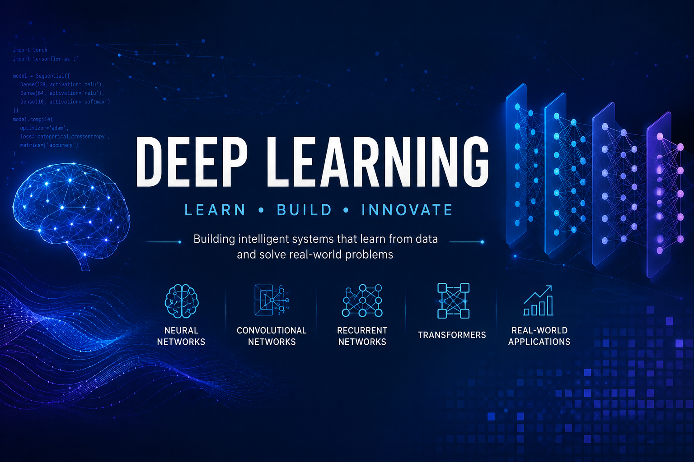

# Part II — Deep Learning

> Master Deep Learning fundamentals and learn how production-ready Deep Learning systems are designed, trained, optimized, evaluated, deployed, and operated in modern enterprise environments.

---

## 📖 Overview

Deep Learning (DL) is a specialized branch of Machine Learning that enables computers to automatically learn hierarchical representations from structured and unstructured data using Artificial Neural Networks.

This module provides a production-focused introduction to Deep Learning, covering the complete lifecycle of designing, training, optimizing, evaluating, and deploying neural network models. You'll learn the mathematical foundations of neural networks, implement models using TensorFlow, Keras, and PyTorch, and explore modern architectures such as Convolutional Neural Networks (CNNs), Recurrent Neural Networks (RNNs), Attention Mechanisms, and Transformers.

Designed for software engineers, backend developers, cloud engineers, solution architects, and AI engineers, this module bridges the gap between classical Machine Learning and modern AI Engineering, preparing you for advanced topics such as Foundation Models, Large Language Models (LLMs), and Generative AI.

---

## 🎯 Learning Outcomes

After completing this module, you will be able to:

- Understand the core principles of Deep Learning
- Explain how Artificial Neural Networks learn from data
- Understand forward propagation and backpropagation
- Apply gradient descent and modern optimization algorithms
- Select appropriate activation and loss functions
- Apply regularization techniques to improve model generalization
- Build Deep Learning models using TensorFlow, Keras, and PyTorch
- Design Deep Neural Networks (DNNs)
- Build Convolutional Neural Networks (CNNs) for Computer Vision
- Build Recurrent Neural Networks (RNNs), LSTMs, and GRUs for sequential data
- Understand Attention Mechanisms and Transformer architectures
- Apply Transfer Learning to accelerate model development
- Understand Autoencoders and representation learning
- Design, evaluate, deploy, and monitor production-ready Deep Learning systems

---

## 🛣️ Recommended Learning Path

This module is designed as a progressive learning journey. We recommend studying the chapters in the order presented, as each topic builds upon concepts introduced in previous chapters, gradually progressing from neural network fundamentals to production-ready Deep Learning systems.

| Chapter | Status |
|---------|:------:|
| **[01. Introduction to Deep Learning](01-introduction-to-deep-learning.md)** | 🚧 |
| **[02. Neural Network Fundamentals](02-neural-network-fundamentals.md)** | 🚧 |
| **[03. Artificial Neural Networks (ANN)](03-artificial-neural-networks.md)** | 🚧 |
| **[04. Deep Neural Networks (DNN)](04-deep-neural-networks.md)** | 🚧 |
| **[05. Activation Functions & Loss Functions](05-activation-functions-and-loss-functions.md)** | 🚧 |
| **[06. Forward Propagation & Backpropagation](06-forward-and-backpropagation.md)** | 🚧 |
| **[07. Gradient Descent & Optimization Algorithms](07-gradient-descent-and-optimization.md)** | 🚧 |
| **[08. Weight Initialization & Regularization](08-weight-initialization-and-regularization.md)** | 🚧 |
| **[09. TensorFlow & Keras Fundamentals](09-tensorflow-and-keras-fundamentals.md)** | 🚧 |
| **[10. PyTorch Fundamentals](10-pytorch-fundamentals.md)** | 🚧 |
| **[11. Convolutional Neural Networks (CNN)](11-convolutional-neural-networks.md)** | 🚧 |
| **[12. Transfer Learning](12-transfer-learning.md)** | 🚧 |
| **[13. Recurrent Neural Networks (RNN), LSTM & GRU](13-rnn-lstm-and-gru.md)** | 🚧 |
| **[14. Attention Mechanism](14-attention-mechanism.md)** | 🚧 |
| **[15. Transformer Architecture](15-transformer-architecture.md)** | 🚧 |
| **[16. Autoencoders & Representation Learning](16-autoencoders-and-representation-learning.md)** | 🚧 |
| **[17. Building Production Deep Learning Systems](17-building-production-deep-learning-systems.md)** | 🚧 |

---

## 🏢 Enterprise Perspective

Deep Learning powers many of today's most advanced AI systems across nearly every industry.

Some common enterprise applications include:

- Computer Vision
- Medical Image Analysis
- Natural Language Processing (NLP)
- Speech Recognition
- Intelligent Document Processing
- Recommendation Systems
- Fraud Detection
- Predictive Maintenance
- Time-Series Forecasting
- Autonomous Systems
- Image Classification
- AI-Powered Search
- Foundation Models & Generative AI

Throughout this module, you'll learn not only the underlying theory but also how Deep Learning systems are architected, trained, optimized, evaluated, deployed, monitored, and scaled in real-world enterprise environments using industry-standard frameworks such as **TensorFlow**, **Keras**, and **PyTorch**.

The concepts learned in this module provide the foundation for the next module, where you'll explore **Foundation Models, Large Language Models (LLMs), and Generative AI** built upon Transformer architectures.

---

## 🚀 Start Learning

Ready to begin your Deep Learning journey?

➡️ Continue with **[01. Introduction to Deep Learning](01-introduction-to-deep-learning.md)**.

---

Fixed issue in navigation

> **Enterprise AI Engineering Handbook**  
> *Building Production-Grade Enterprise AI Systems — One Chapter at a Time.*