# Generative AI Fundamentals: From Deep Learning to Foundation Models and LLMs

> A practical, engineering-focused introduction to **Generative Artificial Intelligence (Generative AI)** covering its evolution, core concepts, Foundation Models, Large Language Models (LLMs), major generative architectures, applications, ecosystem, production architecture, and the engineering challenges involved in building enterprise-grade Generative AI systems.

---

# 1. Overview

**Generative Artificial Intelligence (Generative AI)** is a branch of Artificial Intelligence that enables machines to learn patterns from data and generate new content that resembles the data on which they were trained.

Traditional AI systems are often designed to:

- Classify
- Predict
- Detect
- Rank
- Recommend

Generative AI focuses on creating new outputs.

Examples include:

- Text
- Images
- Audio
- Music
- Video
- Code
- Synthetic data
- Multimodal content

A simplified view is:

```text
Training Data
      ↓
Deep Learning Model
      ↓
Learned Representation
      ↓
Generative Model
      ↓
New Content
```

Modern Generative AI is powered primarily by large-scale **Deep Learning architectures**, particularly:

- Transformers
- Diffusion Models
- Generative Adversarial Networks
- Variational Autoencoders

For language applications, Transformer-based **Foundation Models and Large Language Models (LLMs)** have become the dominant architecture.

---

# 2. Generative AI vs Traditional Predictive AI

One of the easiest ways to understand Generative AI is to compare it with predictive AI.

| Predictive AI | Generative AI |
|---|---|
| Predicts existing outcomes | Generates new content |
| Classification | Text Generation |
| Regression | Image Generation |
| Fraud Detection | Code Generation |
| Forecasting | Content Creation |
| Recommendation | Synthetic Data |
| Risk Prediction | Audio / Video Generation |

## Predictive AI

```text
Customer Data
      ↓
Machine Learning Model
      ↓
Fraud Probability
```

The model predicts an existing property of the input.

## Generative AI

```text
Prompt
  ↓
Generative Model
  ↓
Generated Content
```

The model produces a new output.

---

# 3. A More Precise Mental Model

Generative AI does not simply "copy" the training dataset.

During training, a model learns statistical patterns and representations from large datasets.

A simplified conceptual flow is:

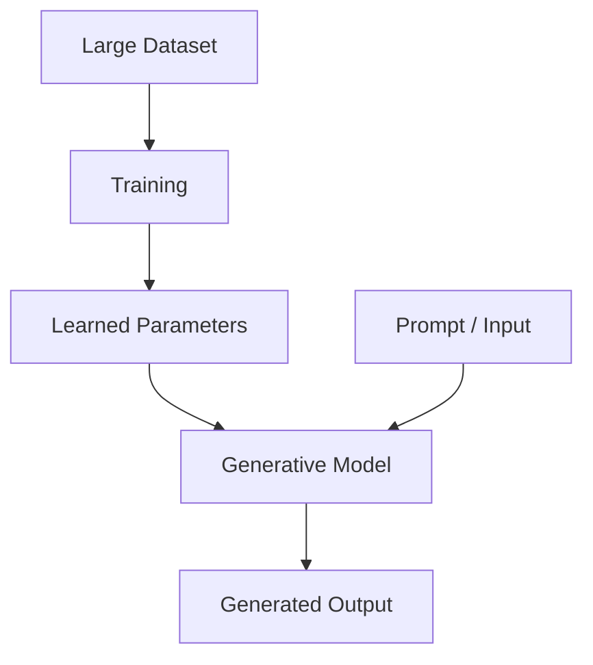

The learned parameters encode patterns that can later be used to generate new outputs.

---

# 4. Evolution of Generative AI

Generative AI has evolved through several generations of machine learning and deep learning.

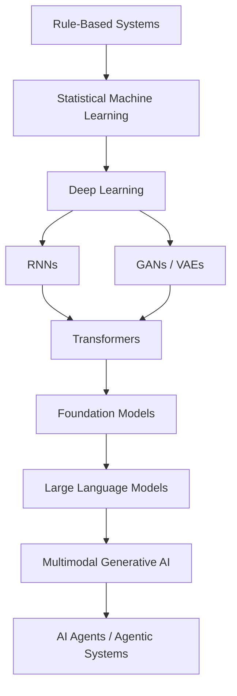

Each generation increased the scale, flexibility, and generalization capability of AI systems.

---

# 5. From Machine Learning to Deep Learning

Traditional Machine Learning often relies on manually engineered features.

For example:

```text
Raw Data
   ↓
Feature Engineering
   ↓
Machine Learning Algorithm
   ↓
Prediction
```

Deep Learning reduces the dependence on handcrafted features.

```text
Raw Data
   ↓
Deep Neural Network
   ↓
Learned Representations
   ↓
Prediction / Generation
```

This ability to learn hierarchical representations became one of the foundations of modern Generative AI.

---

# 6. Deep Learning and Generative AI

Generative AI systems typically use neural networks with millions, billions, or even larger numbers of parameters.

A simplified architecture is:

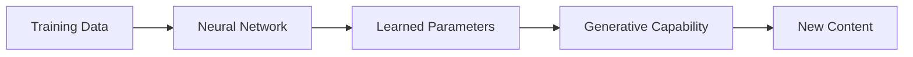

The model learns relationships between patterns in the training data.

The learned representation can then be used during inference to generate new outputs.

---

# 7. Foundation Models

A **Foundation Model** is a large pretrained model that can serve as a reusable base for multiple downstream tasks.

Instead of training a separate model from scratch for every task:

```text
Task A → Model A
Task B → Model B
Task C → Model C
```

a Foundation Model can act as a shared base:

```text
                 Foundation Model
                       │
        ┌──────────────┼──────────────┐
        ↓              ↓              ↓
     Task A          Task B          Task C
```

Typical characteristics include:

- Large-scale pretraining
- Large datasets
- Large parameter counts
- General-purpose representations
- Transfer learning capability
- Adaptation to downstream tasks

---

# 8. Foundation Model Workflow

A simplified Foundation Model lifecycle is:

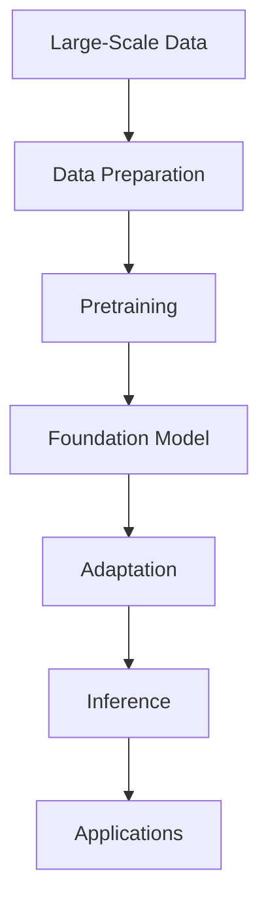

Model adaptation may involve:

- Prompting
- Fine-Tuning
- Parameter-Efficient Fine-Tuning
- Instruction Tuning
- Preference Optimization

These techniques become increasingly important in later chapters.

---

# 9. Large Language Models

**Large Language Models (LLMs)** are large neural language models capable of processing and generating natural language.

Examples of LLM families include:

- GPT
- Llama
- Mistral
- T5
- BERT
- Other Transformer-based language models

However, it is important to distinguish between different Transformer architectures.

For example:

```text
BERT
 ↓
Primarily Encoder-Based
 ↓
Language Understanding

GPT
 ↓
Primarily Decoder-Based
 ↓
Autoregressive Generation
```

The architectural differences are covered in:

**[06. GPT and BERT Architecture](06-gpt-and-bert-architecture.md)**

---

# 10. Why LLMs Became Important

Earlier NLP systems were usually designed for individual tasks.

For example:

```text
Sentiment Model
Intent Model
Translation Model
Classification Model
Question Answering Model
```

Foundation Models changed the architecture:

```text
                    Foundation Model
                           │
          ┌────────────────┼────────────────┐
          ↓                ↓                ↓
     Classification    Summarization     Generation
          │                │                │
          └────────────────┼────────────────┘
                           ↓
                    Multiple Applications
```

This enables a single pretrained model to support many downstream use cases.

---

# 11. Major Generative AI Architectures

Modern Generative AI uses several important architecture families.

The major categories covered in this module include:

- Recurrent Neural Networks
- Transformers
- Generative Adversarial Networks
- Variational Autoencoders
- Diffusion Models

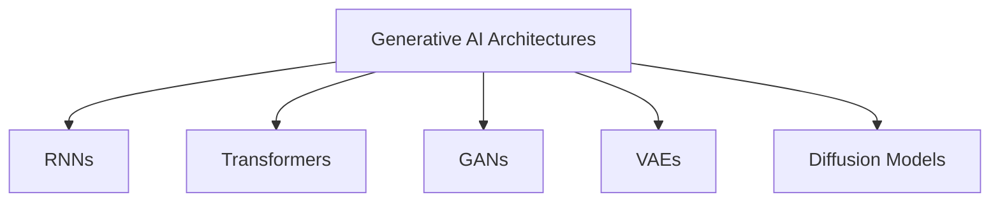

Each architecture has different strengths and applications.

---

# 12. Recurrent Neural Networks

**Recurrent Neural Networks (RNNs)** were important architectures for sequential data.

They maintain a hidden state that carries information from previous steps.

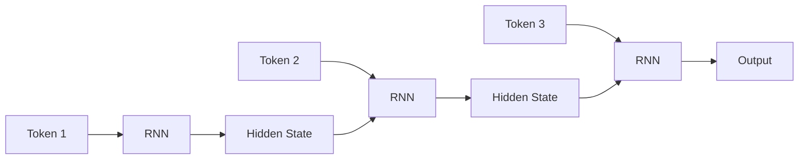

RNNs were widely used in:

- Language Modeling
- Machine Translation
- Speech Processing
- Time-Series Prediction

## Limitations

RNNs have several important limitations:

- Sequential computation
- Difficult parallelization
- Vanishing gradients
- Difficulty modeling long-range dependencies
- Slow training for long sequences

These limitations motivated architectures such as LSTM, GRU, and eventually Transformers.

---

# 13. Transformers

Transformers changed modern NLP and Generative AI.

The Transformer architecture introduced **Self-Attention** as the central mechanism for modeling relationships between tokens.

A simplified workflow is:

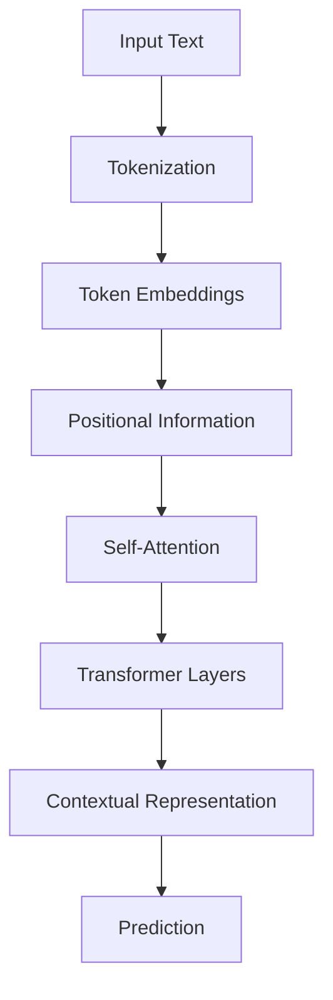

Transformers provide several major advantages:

- Parallelizable training
- Strong contextual modeling
- Better long-range dependency handling
- Excellent scalability
- Transfer learning
- Foundation-model pretraining

Detailed attention concepts are covered in:

**[05. Attention and Positional Encoding](05-attention-and-positional-encoding.md)**

---

# 14. Generative Adversarial Networks

**Generative Adversarial Networks (GANs)** consist of two neural networks:

1. Generator
2. Discriminator

The Generator creates synthetic data.

The Discriminator attempts to distinguish real data from generated data.

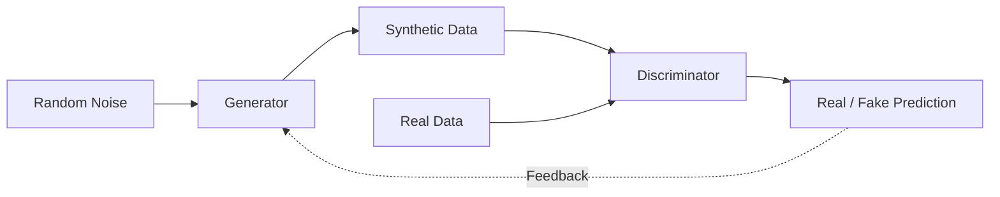

The two networks compete during training.

## Applications

GANs have been used for:

- Image Generation
- Image Enhancement
- Face Generation
- Data Augmentation
- Image-to-Image Translation
- Synthetic Data

---

# 15. Variational Autoencoders

**Variational Autoencoders (VAEs)** learn latent representations of data.

A simplified architecture is:

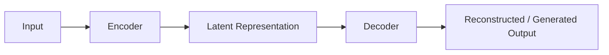

The latent space allows the model to learn a compressed representation from which new samples can be generated.

Applications include:

- Representation Learning
- Data Compression
- Anomaly Detection
- Synthetic Data Generation
- Generative Modeling

---

# 16. Diffusion Models

**Diffusion Models** generate content through a process involving noise and denoising.

A simplified conceptual process is:

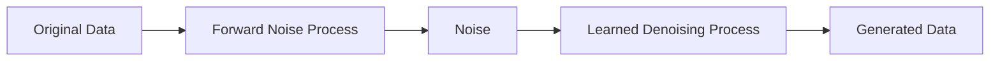

During generation:

```text
Random Noise
     ↓
Denoising Step
     ↓
Denoising Step
     ↓
Denoising Step
     ↓
Generated Content
```

Diffusion models are widely associated with modern image generation systems.

Applications include:

- Image Generation
- Image Editing
- Inpainting
- Super Resolution
- Video Generation
- Multimodal Generation

---

# 17. Comparing Major Generative Architectures

| Architecture | Main Idea | Common Applications |
|---|---|---|
| RNN | Sequential processing | Early NLP, sequence modeling |
| Transformer | Attention-based modeling | LLMs, NLP, multimodal AI |
| GAN | Generator vs discriminator | Image generation |
| VAE | Latent-variable generation | Representation learning |
| Diffusion | Iterative denoising | Image / video generation |

No single architecture is optimal for every generative task.

The correct architecture depends on:

- Data type
- Task
- Latency requirements
- Compute budget
- Quality requirements
- Production constraints

---

# 18. Text Generation

Modern text generation is commonly based on autoregressive language models.

The basic process is:

```text
Prompt
  ↓
Tokenizer
  ↓
Token IDs
  ↓
Transformer
  ↓
Next Token
  ↓
Next Token
  ↓
Next Token
  ↓
Generated Sequence
```

For example:

```text
Prompt:

"The future of AI is"

        ↓

"the"

        ↓

"future"

        ↓

"of"

        ↓

"intelligent"

        ↓

"systems"
```

The model repeatedly predicts the next token based on the available context.

Detailed language modeling concepts are covered in:

**[04. Language Modeling](04-language-modeling.md)**

---

# 19. Tokenization

LLMs do not directly process raw strings.

Text is converted into tokens.

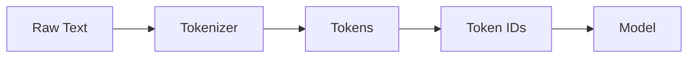

Tokens can represent:

- Words
- Subwords
- Characters
- Special tokens

For example:

```text
unbelievable
```

might be represented as multiple subword tokens.

Tokenization affects:

- Context length
- Memory
- Inference cost
- Model behavior
- Multilingual performance

---

# 20. Embeddings

Tokens are converted into numerical vectors through embedding layers.

```text
Token ID
   ↓
Embedding Lookup
   ↓
Dense Vector
```

Conceptually:

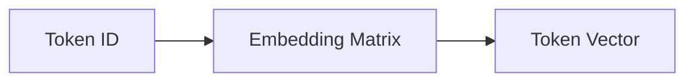

These vectors become the numerical representation processed by Transformer layers.

Traditional word embeddings and modern contextual representations are discussed in:

**[03. Word Embeddings](03-word-embeddings.md)**

---

# 21. Foundation Model Adaptation

A pretrained Foundation Model can be adapted for downstream tasks.

The adaptation spectrum includes:

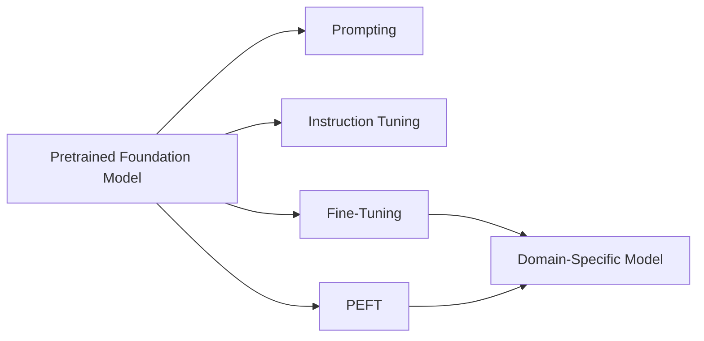

The appropriate approach depends on:

- Dataset size
- Task requirements
- Compute budget
- Latency
- Model ownership
- Domain specificity

Later chapters cover these techniques in detail.

---

# 22. Fine-Tuning

**Fine-Tuning** adapts a pretrained model using a task-specific dataset.

Conceptually:

```text
Pretrained Model
      ↓
Domain / Task Dataset
      ↓
Training
      ↓
Adapted Model
```

For example:

```text
General Language Model
        ↓
Financial Dataset
        ↓
Financial Language Model
```

Fine-tuning can improve performance on specialized tasks but requires additional:

- Compute
- Training data
- Evaluation
- Model management

---

# 23. Parameter-Efficient Fine-Tuning

Full model fine-tuning can be expensive.

**Parameter-Efficient Fine-Tuning (PEFT)** methods update only a small portion of the model's effective parameters.

Examples include:

- LoRA
- QLoRA
- Adapter-based methods

Conceptually:

```text
Large Foundation Model
        │
        ├── Most Parameters Frozen
        │
        └── Small Trainable Components
                    ↓
               Adapted Model
```

This can significantly reduce training resource requirements.

---

# 24. Quantization

**Quantization** reduces the numerical precision used to represent model parameters.

For example:

```text
FP32
 ↓
FP16 / BF16
 ↓
INT8
 ↓
Lower Precision
```

Potential benefits include:

- Lower memory consumption
- Faster inference
- Lower infrastructure cost
- Ability to run larger models on constrained hardware

However, quantization may introduce quality degradation depending on the method and model.

---

# 25. Generative AI Applications

Generative AI is used across multiple domains.

## Natural Language

- Chatbots
- Question Answering
- Summarization
- Translation
- Content Generation
- Information Extraction

## Software Engineering

- Code Generation
- Code Explanation
- Documentation
- Unit Test Generation
- Debugging Assistance
- Developer Copilots

## Computer Vision

- Image Generation
- Image Editing
- Image Captioning
- Super Resolution

## Audio

- Speech Synthesis
- Speech-to-Text
- Voice Generation
- Music Generation

## Video

- Video Generation
- Video Editing
- Content Creation

---

# 26. Enterprise Generative AI

Enterprise Generative AI extends beyond simple chat interfaces.

Common use cases include:

- Enterprise Knowledge Assistants
- Intelligent Document Processing
- Semantic Search
- Customer Support
- AI Copilots
- Code Assistants
- Document Summarization
- Contract Analysis
- Report Generation
- Workflow Automation
- Recommendation Systems

A simplified enterprise architecture is:

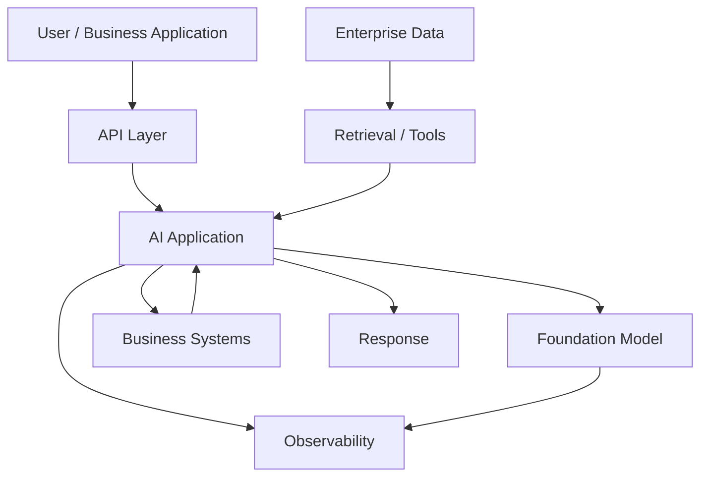

This architecture introduces an important distinction:

> A production Generative AI application is more than the underlying model.

It is a complete system involving data, orchestration, APIs, security, observability, and business integration.

---

# 27. Generative AI Production Lifecycle

A production-oriented lifecycle can be represented as:

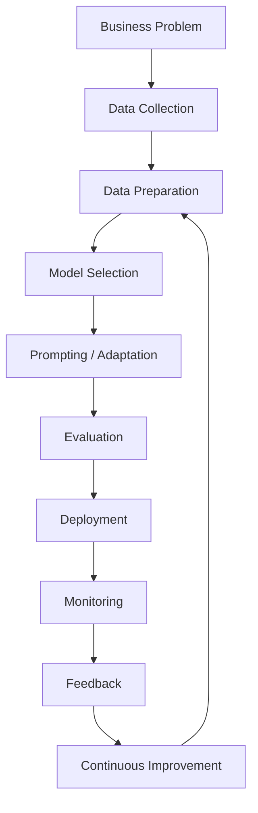

This lifecycle connects Generative AI development with standard production engineering practices.

---

# 28. Model Selection

Choosing a Foundation Model is an architectural decision.

Important considerations include:

## Capability

Can the model perform the required task?

## Context Length

How much input can the model process?

## Latency

How quickly can the model respond?

## Cost

What is the cost per request or token?

## Deployment Model

Can the model run:

- Cloud-hosted
- Self-hosted
- On-premises
- Edge infrastructure

## Data Requirements

Does the deployment meet enterprise data residency and privacy requirements?

## Licensing

Can the model legally be used for the intended application?

---

# 29. Open and Proprietary Models

The Generative AI ecosystem includes both open-weight/open-source-oriented models and proprietary hosted models.

Examples of model families include:

```text
Open / Open-Weight Ecosystem

Llama
Mistral
Qwen
Gemma
```

and proprietary model ecosystems such as:

```text
GPT
Claude
Gemini
```

The exact capabilities, licenses, deployment options, and commercial terms vary by model and version.

Therefore, model selection should be based on current technical and business requirements rather than brand recognition alone.

---

# 30. Generative AI Ecosystem

Modern Generative AI development commonly involves multiple layers.

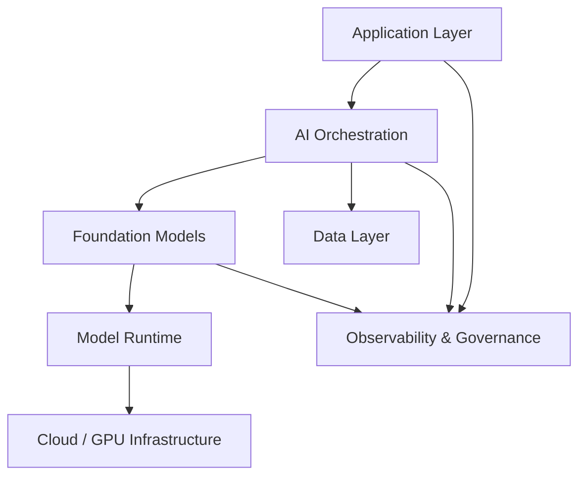

Common technologies include:

### Deep Learning Frameworks

- PyTorch
- TensorFlow

### Model Ecosystems

- Hugging Face Transformers
- Hugging Face Datasets
- Hugging Face Tokenizers

### AI Application Frameworks

- LangChain
- LangGraph
- LlamaIndex

### Infrastructure

- GPUs
- Kubernetes
- Cloud AI platforms
- Object storage
- Vector databases

---

# 31. Production Architecture

A production Generative AI system can be decomposed into several layers.

```text
┌─────────────────────────────────────────┐
│              Client Layer               │
│ Web / Mobile / API / Enterprise Apps    │
└────────────────────┬────────────────────┘
                     ↓
┌─────────────────────────────────────────┐
│            Application Layer            │
│ Prompting / Orchestration / Workflows   │
└────────────────────┬────────────────────┘
                     ↓
┌─────────────────────────────────────────┐
│              AI Layer                   │
│ LLM / Foundation Model / RAG / Tools    │
└────────────────────┬────────────────────┘
                     ↓
┌─────────────────────────────────────────┐
│              Data Layer                 │
│ Documents / DB / Vector Store / APIs    │
└────────────────────┬────────────────────┘
                     ↓
┌─────────────────────────────────────────┐
│          Infrastructure Layer           │
│ Cloud / GPU / Kubernetes / Storage      │
└─────────────────────────────────────────┘
```

Production architecture must also include cross-cutting concerns:

```text
Security
Observability
Governance
Cost Management
Reliability
Evaluation
```

---

# 32. Generative AI Inference

Inference is the process of using a trained model to generate output.

A simplified LLM inference pipeline is:

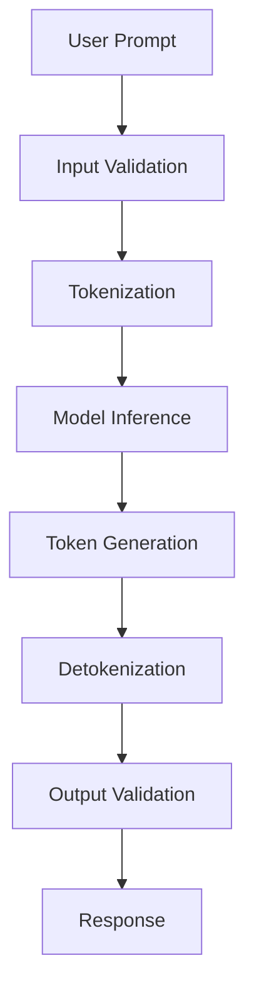

Production inference introduces additional concerns:

- Batching
- Caching
- Quantization
- GPU utilization
- Token limits
- Streaming
- Timeouts
- Rate limiting

---

# 33. Generation Quality

Generated output quality depends on multiple factors.

```text
Model
  +
Prompt
  +
Context
  +
Decoding Strategy
  +
Input Quality
  ↓
Generated Output
```

This is why production Generative AI cannot be evaluated solely by looking at the underlying model architecture.

---

# 34. Hallucinations

A major challenge in Generative AI is **hallucination**.

A hallucination occurs when a model generates content that is unsupported, incorrect, or fabricated.

Example:

```text
User:
What does the internal company policy say?

LLM:
The policy states that employees receive 45 days of leave.

Reality:
The policy contains no such statement.
```

Possible mitigation approaches include:

- Retrieval-Augmented Generation
- Grounding
- Tool Use
- Structured Outputs
- Better evaluation
- Domain-specific fine-tuning
- Confidence / verification workflows
- Human review for high-risk tasks

---

# 35. Responsible AI

Production Generative AI systems must consider responsible AI principles.

Important areas include:

- Safety
- Fairness
- Privacy
- Security
- Transparency
- Accountability
- Explainability
- Data governance

A production architecture should treat responsible AI as a system-level concern rather than simply a model feature.

---

# 36. Security Considerations

Generative AI introduces new security risks.

Examples include:

- Prompt Injection
- Data Leakage
- Sensitive Information Exposure
- Insecure Tool Usage
- Malicious Inputs
- Model Abuse
- Unauthorized Data Access

A simplified security architecture is:

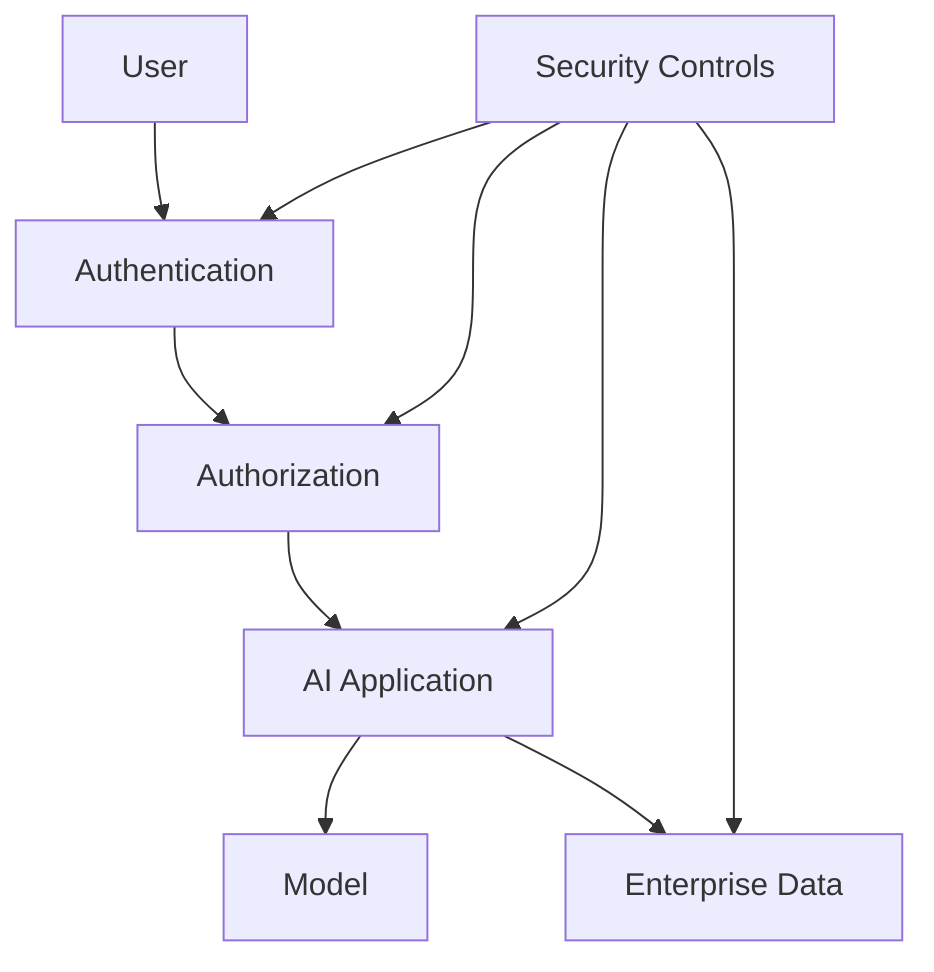

Security must be designed into the complete AI system.

---

# 37. Cost Optimization

Generative AI can be computationally expensive.

Major cost drivers include:

- Model size
- Input tokens
- Output tokens
- Context length
- GPU utilization
- Number of requests
- Fine-tuning
- Storage
- Data transfer

A simplified cost relationship is:

```text
Total Cost
   =
Inference Cost
+
Storage Cost
+
Training Cost
+
Infrastructure Cost
+
Operational Cost
```

Common optimization strategies include:

- Smaller models
- Quantization
- Prompt optimization
- Caching
- Batching
- Model routing
- Appropriate context limits
- Efficient infrastructure

---

# 38. Latency

Generative AI applications often have strict latency requirements.

A simplified request path is:

```text
Request
  ↓
Network
  ↓
Application
  ↓
Retrieval
  ↓
Model Inference
  ↓
Post Processing
  ↓
Response
```

Total latency is approximately the sum of the latency of these components.

Production systems may use:

- Streaming responses
- Caching
- Smaller models
- Parallel retrieval
- Optimized inference runtimes
- GPU acceleration

---

# 39. Scalability

Enterprise Generative AI systems may need to serve thousands or millions of requests.

Scalability considerations include:

- Horizontal scaling
- Load balancing
- GPU allocation
- Request batching
- Autoscaling
- Rate limiting
- Queue-based processing
- Model serving architecture

Conceptually:

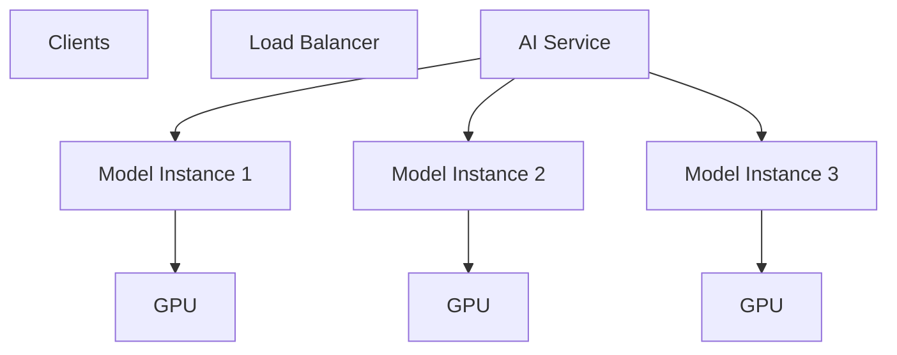

---

# 40. Observability

Production AI systems require observability at multiple layers.

## Infrastructure

- CPU
- GPU
- Memory
- Network
- Storage

## Application

- Request count
- Latency
- Errors
- Throughput

## Model

- Token usage
- Generation latency
- Output quality
- Hallucination indicators
- Safety violations

## Business

- User satisfaction
- Task completion
- Escalation rate
- Cost per workflow

A mature system connects technical metrics with AI and business metrics.

---

# 41. Evaluation

Generative AI evaluation is more complex than traditional classification evaluation.

Depending on the application, evaluation may include:

- Accuracy
- Relevance
- Faithfulness
- Groundedness
- Safety
- Toxicity
- Helpfulness
- Latency
- Cost
- Human evaluation

A production evaluation loop may look like:

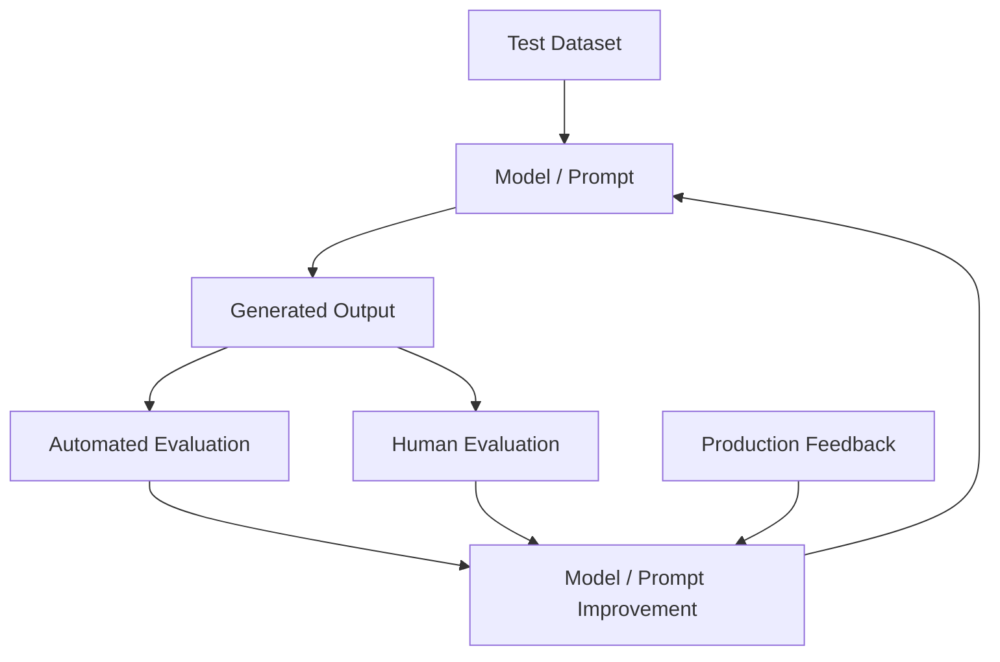

---

# 42. Multimodal Generative AI

Modern Foundation Models increasingly operate across multiple modalities.

Possible modalities include:

```text
Text
Image
Audio
Video
Code
```

A multimodal system can process combinations such as:

```text
Text + Image
Text + Audio
Text + Video
Image + Text
```

Conceptually:

```mermaid
flowchart TD
    A["Text"]
    B["Image"]
    C["Audio"]
    D["Video"]

    A --> E["Multimodal Foundation Model"]
    B --> E
    C --> E
    D --> E

    E --> F["Text"]
    E --> G["Image"]
    E --> H["Audio"]
```

Multimodal AI expands Generative AI beyond language-only applications.

---

# 43. Generative AI and Software Engineering

Generative AI has significant applications in software development.

Examples include:

- Code Generation
- Code Completion
- Refactoring
- Documentation
- Test Generation
- Bug Analysis
- API Generation
- Code Explanation

A simplified workflow:

```text
Developer Request
       ↓
LLM
       ↓
Generated Code
       ↓
Compilation
       ↓
Tests
       ↓
Security / Quality Checks
       ↓
Developer Review
```

The model should be treated as an engineering assistant rather than an automatic replacement for validation and review.

---

# 44. Generative AI and Enterprise Data

Enterprise AI systems often need access to private organizational data.

A Foundation Model alone may not contain current or organization-specific information.

This creates the need for architectures such as:

```text
Foundation Model
       +
Enterprise Data
       +
Retrieval
       +
Tools
       ↓
Enterprise AI Application
```

This concept leads directly to:

- Prompt Engineering
- Retrieval-Augmented Generation
- Tool Calling
- AI Agents
- Agentic AI

---

# 45. Foundation Models vs Traditional Deep Learning Models

| Traditional Deep Learning Model | Foundation Model |
|---|---|
| Usually task-specific | General-purpose |
| Smaller training scope | Large-scale pretraining |
| Often trained for one task | Adaptable to many tasks |
| Limited transfer | Strong transfer capability |
| Task-specific dataset | Broad pretraining dataset |
| Often trained from scratch | Usually pretrained and adapted |

For example:

```text
Traditional:

Customer Dataset
      ↓
Fraud Model
      ↓
Fraud Prediction
```

versus:

```text
Foundation Model
      │
      ├── Classification
      ├── Summarization
      ├── Question Answering
      ├── Extraction
      └── Generation
```

---

# 46. Generative AI System vs Generative AI Model

This distinction is critical for enterprise architecture.

## Generative AI Model

The model itself:

```text
Weights
+
Architecture
+
Tokenizer
```

## Generative AI System

The complete production system:

```text
Model
+
Prompting
+
Data
+
Retrieval
+
Tools
+
APIs
+
Security
+
Observability
+
Evaluation
+
Business Logic
```

Therefore:

> **Building a Generative AI application is a systems engineering problem, not only a model engineering problem.**

---

# 47. Production Design Principles

When designing Generative AI systems:

### 1. Start With the Business Problem

Do not begin with:

```text
"Which LLM should we use?"
```

Begin with:

```text
"What business problem are we solving?"
```

### 2. Select the Smallest Suitable Model

A larger model is not automatically better for every production workload.

### 3. Separate Model and Business Logic

Keep model interaction independently replaceable.

### 4. Design for Evaluation

Evaluation should be part of development from the beginning.

### 5. Build Observability

Measure:

- Latency
- Cost
- Token usage
- Errors
- Quality

### 6. Treat Security as a First-Class Concern

Protect:

- User data
- Enterprise data
- Credentials
- Model endpoints
- Tool access

---

# 48. Common Challenges

Generative AI systems face several challenges.

## Hallucinations

Generated information may be incorrect.

## Bias

Models can inherit biases from training data.

## Toxicity

Models may generate harmful or inappropriate content.

## Privacy

Sensitive information may be exposed or mishandled.

## Cost

Large models can be expensive to train and serve.

## Latency

Large-scale generation can introduce significant response times.

## Security

AI applications introduce new attack surfaces.

## Evaluation

Generated text is often harder to evaluate than deterministic predictions.

## Data Quality

Poor training or retrieval data can produce poor outputs.

## Model Drift

The behavior of models and surrounding data can change over time.

---

# 49. Best Practices

- Define the business objective before selecting a model.
- Start with a strong pretrained Foundation Model.
- Use high-quality data.
- Evaluate model outputs systematically.
- Monitor hallucinations and unsupported claims.
- Protect sensitive enterprise information.
- Apply Responsible AI principles.
- Use retrieval when external or private knowledge is required.
- Optimize inference cost and latency.
- Version prompts, models, datasets, and evaluation suites.
- Monitor production behavior.
- Design security controls around model and tool access.
- Prefer modular architectures that allow model replacement.
- Use smaller or quantized models where appropriate.
- Keep human oversight for high-risk workflows.

---

# 50. Common Mistakes

## Mistake 1: Assuming Bigger Models Are Always Better

Larger models often increase:

- Cost
- Latency
- Infrastructure requirements

without necessarily improving every task.

## Mistake 2: Treating the LLM as the Complete Application

The LLM is one component of a larger AI system.

## Mistake 3: Skipping Evaluation

A demo that looks good is not equivalent to a production-ready AI system.

## Mistake 4: Ignoring Security

Prompt injection, data leakage, and unauthorized tool access can create serious risks.

## Mistake 5: Ignoring Cost

Token consumption and inference infrastructure can become major operational expenses.

## Mistake 6: Using Fine-Tuning for Every Problem

Some problems are better solved through:

- Prompt Engineering
- Retrieval
- Tool Calling
- Structured Outputs

## Mistake 7: Treating Generated Text as Ground Truth

Generated content must be validated according to the application's risk profile.

---

# 51. Practical Architecture Example

Consider an enterprise knowledge assistant.

A simplified architecture could be:

```mermaid
flowchart TD
    A["Employee"]
    B["API Gateway"]
    C["AI Application"]
    D["Authentication / Authorization"]
    E["Embedding Model"]
    F["Vector Database"]
    G["Retriever"]
    H["LLM"]
    I["Enterprise Systems"]
    J["Observability"]

    A --> B
    B --> D
    D --> C

    C --> E
    E --> F
    F --> G
    G --> C

    C --> H
    H --> C

    C --> I
    I --> C

    C --> J
    H --> J
```

The important architectural idea is that the LLM is integrated into a broader system rather than operating independently.

---

# 52. From Generative AI to RAG and Agents

Generative AI provides the model capability.

Enterprise applications add additional capabilities.

```mermaid
flowchart TD
    A["Generative AI Fundamentals"]
    B["Prompt Engineering"]
    C["Retrieval-Augmented Generation"]
    D["Tool Calling"]
    E["AI Agents"]
    F["Agentic AI"]

    A --> B
    B --> C
    C --> D
    D --> E
    E --> F
```

This progression represents the movement from:

```text
Model
```

to:

```text
AI Application
```

and eventually:

```text
AI System
```

---

# 53. Interview Questions

## Beginner

1. What is Generative AI?
2. Generative AI vs Predictive AI?
3. What is a Foundation Model?
4. What is an LLM?
5. What is a Transformer?
6. What is a GAN?
7. What is a VAE?
8. What is a Diffusion Model?
9. What is tokenization?
10. What are embeddings?

## Intermediate

1. How did Generative AI evolve?
2. Why did Transformers replace many RNN-based architectures?
3. Foundation Model vs traditional Deep Learning model?
4. What is the difference between GPT and BERT?
5. How does autoregressive text generation work?
6. What is fine-tuning?
7. What is PEFT?
8. What is quantization?
9. What causes hallucinations?
10. How can hallucinations be reduced?
11. Why is evaluation difficult for Generative AI?
12. What is multimodal AI?

## Advanced

1. How would you design a production-grade enterprise Generative AI system?
2. How would you select between multiple Foundation Models?
3. When would you choose prompting instead of fine-tuning?
4. When would you use RAG instead of fine-tuning?
5. How would you optimize LLM inference cost?
6. How would you design an LLM serving architecture?
7. How would you monitor LLM quality in production?
8. How would you handle prompt injection?
9. How would you protect enterprise data?
10. How would you evaluate hallucinations?
11. How would you design a model abstraction layer that allows model replacement?
12. How would you scale a high-throughput Generative AI service?
13. How would you design a multimodal enterprise AI system?
14. What are the major production risks of Generative AI?
15. How would you establish an evaluation framework before deploying an LLM?

---

# 54. 🚀 Quick Revision Sheet

## Generative AI

```text
Learn Patterns
      ↓
Learn Representations
      ↓
Generate New Content
```

## Evolution

```text
Machine Learning
       ↓
Deep Learning
       ↓
RNNs
       ↓
GANs / VAEs
       ↓
Transformers
       ↓
Foundation Models
       ↓
LLMs
       ↓
Multimodal AI
       ↓
AI Agents
```

## Major Architectures

```text
RNN
Transformer
GAN
VAE
Diffusion
```

## Foundation Model

```text
Large-Scale Data
       ↓
Pretraining
       ↓
Foundation Model
       ↓
Adaptation
       ↓
Applications
```

## LLM

```text
Prompt
  ↓
Tokenizer
  ↓
Token IDs
  ↓
Embeddings
  ↓
Transformer
  ↓
Next-Token Prediction
  ↓
Generated Text
```

## Enterprise AI

```text
User
 ↓
Application
 ↓
Foundation Model
 ↓
Retrieval / Tools
 ↓
Enterprise Data
 ↓
Business Logic
 ↓
Response
```

## Production Concerns

```text
Quality
Security
Latency
Cost
Scalability
Observability
Governance
Evaluation
```

---

# 55. Key Takeaways

- **Generative AI** enables machines to generate new content based on patterns learned from data.
- Traditional predictive AI focuses primarily on classification, regression, ranking, and prediction.
- Deep Learning provided the representation-learning capabilities that enabled modern Generative AI.
- **Foundation Models** are large pretrained models that can be adapted to multiple downstream tasks.
- **Large Language Models** are large-scale language models capable of understanding and generating natural language.
- Transformers became the dominant architecture for modern language Foundation Models because of their scalability and attention-based contextual modeling.
- GANs, VAEs, and Diffusion Models remain important generative architectures, particularly for visual and multimodal applications.
- Tokenization converts raw text into units that language models can process.
- Embedding layers convert token IDs into numerical representations.
- LLMs commonly generate text through autoregressive next-token prediction.
- Foundation Models can be adapted using prompting, fine-tuning, instruction tuning, and parameter-efficient techniques.
- Quantization can reduce model memory requirements and inference cost.
- Enterprise Generative AI is a complete system rather than simply an LLM.
- Production systems require data pipelines, retrieval, APIs, security, observability, evaluation, and business integration.
- Hallucination, bias, privacy, security, latency, cost, and evaluation are major production challenges.
- Model selection should consider capability, latency, cost, context length, deployment requirements, licensing, and enterprise constraints.
- Responsible AI must be treated as a system-level engineering concern.
- Generative AI provides the foundation for subsequent topics such as **Prompt Engineering, Retrieval-Augmented Generation, AI Agents, and Agentic AI**.

---

# 56. Chapter Navigation

### Next

**[02. Language Understanding Fundamentals](02-language-understanding-fundamentals.md)**

### Related

**[03. Word Embeddings](03-word-embeddings.md)**

**[04. Language Modeling](04-language-modeling.md)**

**[05. Attention and Positional Encoding](05-attention-and-positional-encoding.md)**

**[06. GPT and BERT Architecture](06-gpt-and-bert-architecture.md)**

---

# References

- Vaswani et al. — *Attention Is All You Need*
- Goodfellow et al. — *Generative Adversarial Nets*
- Kingma & Welling — *Auto-Encoding Variational Bayes*
- Ho et al. — *Denoising Diffusion Probabilistic Models*
- Devlin et al. — *BERT: Pre-training of Deep Bidirectional Transformers for Language Understanding*
- Jurafsky & Martin — *Speech and Language Processing*
- Goodfellow, Bengio & Courville — *Deep Learning*
- Hugging Face Documentation
- PyTorch Documentation
- TensorFlow Documentation

---

> **Enterprise AI Engineering Handbook**  
> *Building Production-Grade Enterprise AI Systems — One Chapter at a Time.*