# Language Understanding Fundamentals: From NLP to Modern AI Systems

> A practical, engineering-focused guide to **Natural Language Understanding (NLU)** covering NLP vs NLU, text representation, tokenization, document classification, semantic understanding, neural NLP models, training pipelines, evaluation metrics, production considerations, and the evolution toward **Transformers and Large Language Models (LLMs)**.

---

# 1. Overview

**Natural Language Understanding (NLU)** is a branch of **Natural Language Processing (NLP)** focused on enabling machines to interpret the meaning, intent, context, and structure of human language.

Traditional NLP systems primarily focused on processing and transforming text.

NLU goes a step further by attempting to understand what the text means and what the user or document is trying to communicate.

Common NLU tasks include:

- Document Classification
- Sentiment Analysis
- Intent Recognition
- Topic Classification
- Entity Recognition
- Question Answering
- Semantic Similarity
- Text Classification
- Conversational Understanding
- Information Extraction

A simplified view is:

```text
Human Language
      ↓
Natural Language Processing
      ↓
Natural Language Understanding
      ↓
Meaning / Intent / Context
      ↓
Business Decision
```

Modern NLU forms an important conceptual foundation for **Foundation Models, Transformers, and Large Language Models**.

---

# 2. NLP vs NLU

The terms NLP and NLU are closely related but are not identical.

| NLP | NLU |
|---|---|
| Processes human language | Interprets human language |
| Tokenization | Intent Detection |
| Text Cleaning | Semantic Understanding |
| Parsing | Context Understanding |
| Feature Extraction | Meaning Extraction |
| Text Transformation | Language Interpretation |
| Classification | Question Understanding |

A useful mental model is:

```text
NLP
 │
 ├── Prepare
 ├── Process
 ├── Represent
 └── Analyze
       │
       ▼
      NLU
       │
       ├── Meaning
       ├── Intent
       ├── Context
       └── Understanding
```

NLP provides many of the techniques required to build NLU systems.

---

# 3. Why Natural Language Understanding Matters

Human language is highly complex.

The same word can have different meanings depending on context.

For example:

```text
I deposited money in the bank.
```

versus:

```text
We sat near the river bank.
```

The word `bank` refers to two different concepts.

Similarly, these sentences contain the same words but different meanings:

```text
Dog bites man.
```

```text
Man bites dog.
```

Therefore, effective NLU requires more than simply counting words.

It requires representations that capture:

- Context
- Relationships
- Semantics
- Syntax
- Intent
- Sequence
- Domain-specific meaning

---

# 4. Evolution of Language Understanding

Language understanding has evolved through several generations.

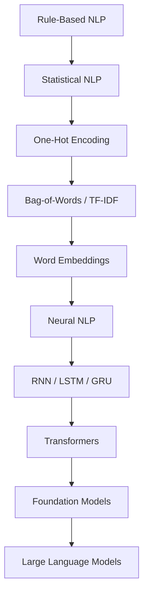

The major progression was:

```text
Rules
 ↓
Statistical Patterns
 ↓
Sparse Representations
 ↓
Dense Representations
 ↓
Neural Networks
 ↓
Contextual Representations
 ↓
Transformers
 ↓
Foundation Models
 ↓
LLMs
```

Each generation improved the ability of machines to represent and process language.

---

# 5. Natural Language Understanding Pipeline

A traditional NLU pipeline can be represented as:

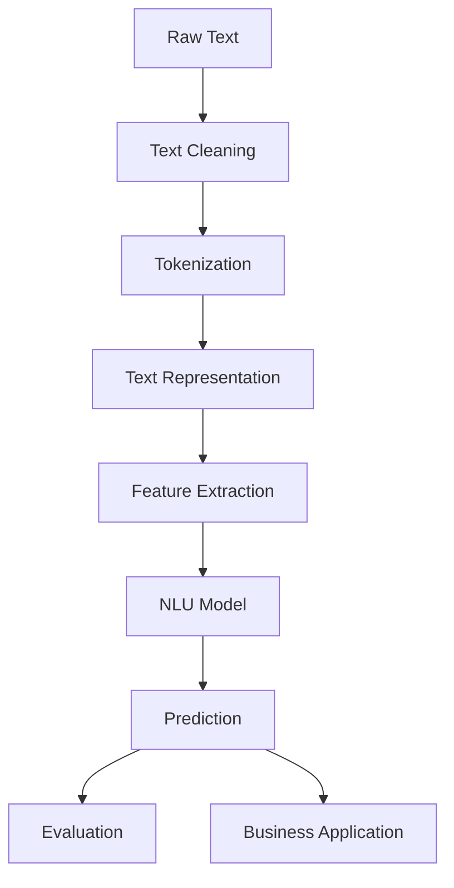

Different systems may omit or combine some stages.

Modern Transformer-based systems also simplify several traditional preprocessing steps because the model learns representations directly from tokenized text.

---

# 6. Text Preprocessing

Traditional NLP systems commonly perform preprocessing before modeling.

Typical operations include:

- Lowercasing
- Removing unnecessary whitespace
- Normalizing punctuation
- Handling special characters
- Tokenization
- Stop-word processing
- Stemming
- Lemmatization

Example:

```text
Raw Text

"Customers are paying online!!!"

        ↓

Normalized Text

"customers are paying online"
```

However, preprocessing should be task-specific.

Aggressive normalization can remove information that modern language models need.

---

# 7. Tokenization

**Tokenization** converts text into smaller units that a model can process.

A simple word-level tokenizer might produce:

```text
Enterprise AI Engineering

↓

["Enterprise", "AI", "Engineering"]
```

Modern Transformer systems often use subword tokenization.

For example:

```text
unbelievable

↓

["un", "believ", "able"]
```

The resulting tokens are converted into numerical token IDs.

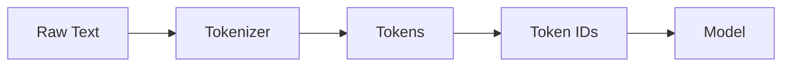

Detailed embedding concepts are covered in:

**[03. Word Embeddings](03-word-embeddings.md)**

---

# 8. Text Representation

Machine learning models require numerical representations.

Traditional approaches include:

- One-Hot Encoding
- Bag-of-Words
- TF-IDF
- Word Embeddings

Modern approaches include:

- Contextual Embeddings
- Transformer Representations
- Sentence Embeddings
- Document Embeddings

The progression can be summarized as:

```text
One-Hot
   ↓
BoW
   ↓
TF-IDF
   ↓
Word Embeddings
   ↓
Contextual Embeddings
   ↓
Transformer Representations
```

---

# 9. One-Hot Encoding

One-Hot Encoding assigns each vocabulary item a unique binary vector.

For:

```text
Vocabulary:

["AI", "Cloud", "Java"]
```

the representation could be:

```text
AI

[1, 0, 0]

Cloud

[0, 1, 0]

Java

[0, 0, 1]
```

## Advantages

- Simple
- Easy to understand
- Easy to implement

## Limitations

- Sparse
- High dimensional
- No semantic relationship
- Poor scalability

One-Hot Encoding treats words as independent categories.

---

# 10. Bag-of-Words

**Bag-of-Words (BoW)** represents text using word occurrence counts.

Example:

```text
AI enables intelligent systems
```

can be represented using counts such as:

```text
AI           → 1
enables      → 1
intelligent  → 1
systems      → 1
```

The major limitation is that word order is lost.

For example:

```text
Dog bites man.
```

and:

```text
Man bites dog.
```

may produce similar word-count representations despite having different meanings.

---

# 11. TF-IDF

**TF-IDF** assigns importance to words based on:

1. How frequently they appear in a document.
2. How frequently they appear across the entire document collection.

The basic formulation is:

$$
TFIDF(t,d)=TF(t,d)\times IDF(t)
$$

where:

- \(t\) = term
- \(d\) = document
- \(TF\) = term frequency
- \(IDF\) = inverse document frequency

A common IDF formulation is:

$$
IDF(t)=\log\left(\frac{N}{DF(t)}\right)
$$

where:

- \(N\) = number of documents
- \(DF(t)\) = number of documents containing the term

TF-IDF is useful for many traditional information retrieval and classification tasks.

However, it does not naturally provide rich contextual semantics.

---

# 12. Word Embeddings

Word embeddings represent words using dense numerical vectors.

For example:

```text
king

↓

[0.32, -0.71, 0.84, 0.15, ...]
```

Words that occur in similar contexts can develop related vector representations.

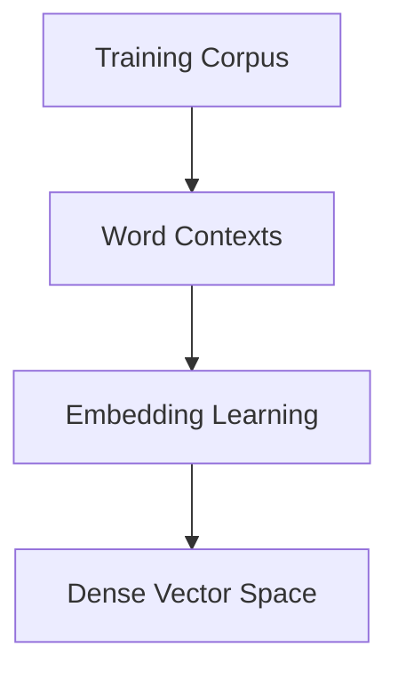

Word2Vec, GloVe, and FastText are important historical approaches.

Detailed coverage is provided in:

**[03. Word Embeddings](03-word-embeddings.md)**

---

# 13. Semantic Understanding

Semantic understanding focuses on the meaning of language.

Consider:

```text
The application crashed.
```

and:

```text
The software failed unexpectedly.
```

Although the words are different, the underlying meaning can be related.

Traditional keyword matching may struggle to identify this relationship.

Semantic representations enable models to compare meaning rather than only exact words.

```text
Sentence A
    ↓
Semantic Representation
    ↓
Similarity
    ↑
Semantic Representation
    ↑
Sentence B
```

This capability is fundamental to:

- Semantic Search
- Question Answering
- Recommendation
- Document Matching
- RAG
- Conversational AI

---

# 14. Document Classification

**Document Classification** assigns documents to predefined categories.

Examples:

- Spam Detection
- News Classification
- Sentiment Analysis
- Customer Support Routing
- Topic Classification
- Fraud-related document detection
- Legal document categorization

A simplified architecture is:


Example:

```text
Customer Message

"I cannot access my account."

        ↓

Intent Classifier

        ↓

ACCOUNT_ACCESS_PROBLEM
```

---

# 15. Sentiment Analysis

Sentiment analysis attempts to identify the emotional or opinion-based orientation of text.

Example:

```text
"The product is excellent."
```

might be classified as:

```text
Positive
```

while:

```text
"The service is extremely slow."
```

might be classified as:

```text
Negative
```

A typical workflow is:

```text
Text
 ↓
Tokenization
 ↓
Representation
 ↓
Model
 ↓
Sentiment
```

Possible classes include:

- Positive
- Negative
- Neutral

More advanced systems may perform fine-grained emotion or aspect-based sentiment analysis.

---

# 16. Intent Recognition

Intent recognition determines what the user is trying to accomplish.

For example:

```text
"How do I reset my password?"
```

could map to:

```text
PASSWORD_RESET
```

while:

```text
"What is my account balance?"
```

could map to:

```text
ACCOUNT_BALANCE
```

Conceptually:

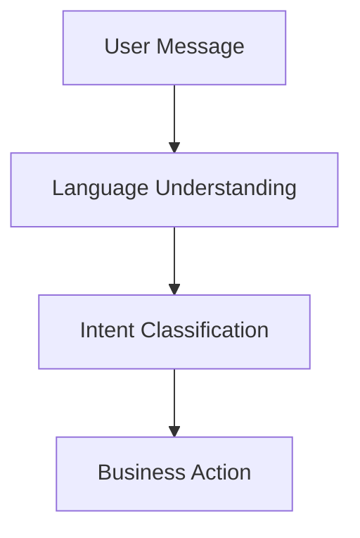

Intent recognition is commonly used in:

- Chatbots
- Customer Service
- Virtual Assistants
- Banking Applications
- IT Service Management

---

# 17. Entity Recognition

**Named Entity Recognition (NER)** identifies entities in text.

Example:

```text
Mihir works at an enterprise technology company in India.
```

A model may identify:

```text
Mihir       → PERSON
India       → LOCATION
```

Common entity types include:

- Person
- Organization
- Location
- Date
- Currency
- Product
- Address

The workflow is:

```text
Text
 ↓
Tokens
 ↓
Contextual Representation
 ↓
Entity Classification
 ↓
Entities
```

NER is an important building block for information extraction and document intelligence.

---

# 18. Question Answering

Question Answering systems attempt to provide an answer to a question.

Traditional extractive QA can work with a document:

```text
Document
   +
Question
   ↓
Model
   ↓
Answer Span
```

For example:

```text
Document:
"Amazon was founded in 1994."

Question:
"When was Amazon founded?"

Answer:
"1994"
```

Modern LLM-based QA can also generate answers rather than simply extracting spans.

This leads to modern Retrieval-Augmented Generation architectures.

---

# 19. Neural Networks for NLP

Traditional NLP systems often depended on handcrafted features.

Neural networks enabled models to learn representations automatically.

A simplified architecture is:

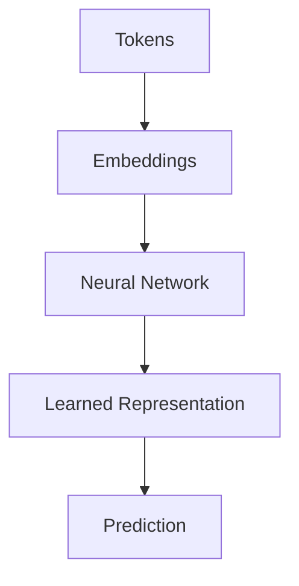

Advantages include:

- Automatic feature learning
- Better representation learning
- Improved generalization
- Scalability to large datasets

---

# 20. Sequence Models

Before Transformers became dominant, sequence models were widely used for NLP.

Important architectures include:

- RNN
- LSTM
- GRU

The basic idea is to maintain information from previous tokens.

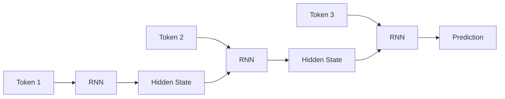

However, sequential computation made these models difficult to scale efficiently.

Transformers addressed many of these limitations.

---

# 21. Transformers

Transformers use **attention mechanisms** to model relationships between tokens.

A simplified architecture is:

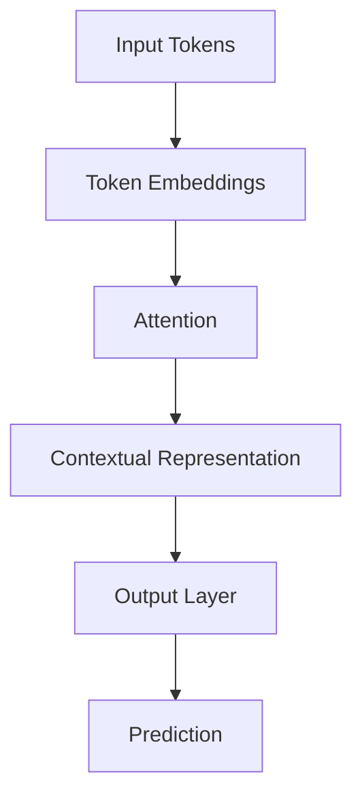

Transformers provide:

- Parallelizable training
- Strong contextual modeling
- Better long-range dependency handling
- Excellent scalability

The detailed mechanics of attention and positional encoding are covered in:

**[05. Attention and Positional Encoding](05-attention-and-positional-encoding.md)**

---

# 22. Language Understanding and Language Modeling

Language understanding and language modeling are closely connected but represent different objectives.

### Language Understanding

Focuses on interpreting:

```text
Meaning
Intent
Context
Entities
Relationships
```

### Language Modeling

Focuses on predicting:

```text
Next Token
```

A simplified relationship is:

```text
Language Understanding
          +
Language Modeling
          ↓
Contextual Language Models
          ↓
Foundation Models
          ↓
Large Language Models
```

Detailed language modeling concepts are covered in:

**[04. Language Modeling](04-language-modeling.md)**

---

# 23. Training Pipeline for NLU

A traditional supervised NLU training pipeline looks like:

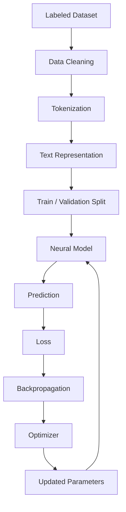

The model repeatedly updates its parameters to minimize the training objective.

---

# 24. Cross-Entropy Loss

For classification tasks, **Cross-Entropy Loss** is commonly used.

For one example:

$$
L=-\sum_i y_i\log(p_i)
$$

where:

- \(y_i\) = true label
- \(p_i\) = predicted probability

For a single correct class:

$$
L=-\log(p_{correct})
$$

If the model assigns high probability to the correct class:

```text
Probability ↑
Loss ↓
```

If it assigns low probability:

```text
Probability ↓
Loss ↑
```

---

# 25. Model Evaluation

NLU systems should be evaluated using metrics appropriate to the task.

Common metrics include:

- Accuracy
- Precision
- Recall
- F1 Score
- ROC-AUC
- Confusion Matrix

---

# 26. Accuracy

Accuracy measures the percentage of predictions that are correct.

$$
Accuracy=
\frac{Correct\ Predictions}
{Total\ Predictions}
$$

Example:

```text
100 predictions
80 correct

Accuracy = 80%
```

Accuracy is useful when class distributions are reasonably balanced.

---

# 27. Precision

Precision answers:

> Of the items predicted as positive, how many were actually positive?

$$
Precision=
\frac{TP}{TP+FP}
$$

where:

- \(TP\) = True Positives
- \(FP\) = False Positives

High precision means the model generates relatively few false positives.

---

# 28. Recall

Recall answers:

> Of all actual positive cases, how many did the model identify?

$$
Recall=
\frac{TP}{TP+FN}
$$

where:

- \(TP\) = True Positives
- \(FN\) = False Negatives

High recall means the model misses relatively few positive cases.

---

# 29. F1 Score

F1 combines Precision and Recall.

$$
F1=
2\times
\frac{Precision\times Recall}
{Precision+Recall}
$$

F1 is particularly useful when:

- Classes are imbalanced
- Both false positives and false negatives matter

---

# 30. Confusion Matrix

A confusion matrix provides a detailed view of classification performance.

For binary classification:

```text
                  Predicted
                Positive Negative

Actual Positive    TP       FN

Actual Negative    FP       TN
```

This helps identify whether the model is:

- Missing positive cases
- Producing excessive false positives
- Performing well across classes

---

# 31. Hyperparameters

Important NLU hyperparameters include:

- Learning Rate
- Batch Size
- Number of Epochs
- Embedding Dimension
- Hidden Dimension
- Dropout
- Optimizer
- Weight Decay
- Maximum Sequence Length

These parameters can significantly influence training stability and model performance.

---

# 32. Train, Validation, and Test Data

A robust NLU pipeline separates data into:

```text
Dataset
   │
   ├── Training
   │
   ├── Validation
   │
   └── Test
```

### Training Set

Used to learn model parameters.

### Validation Set

Used for:

- Hyperparameter tuning
- Model selection
- Early stopping

### Test Set

Used for final evaluation.

The test dataset should remain isolated from model development decisions.

---

# 33. Overfitting in NLU

A model overfits when it performs well on training data but poorly on unseen data.

```text
Training Performance
        ↑
        │
        │      ●
        │    ●
        │  ●
        │●
        └────────────────→

Validation Performance
        ↑
        │      ●
        │    ●
        │  ●
        │ ●
        │  ╲
        │   ╲
        └────────────────→
              Training
```

Common causes include:

- Small datasets
- Excessive model complexity
- Too many training epochs
- Poor regularization

Mitigation strategies include:

- More training data
- Dropout
- Weight decay
- Early stopping
- Data augmentation
- Transfer learning

---

# 34. Production NLU Architecture

A production enterprise NLU system may look like:

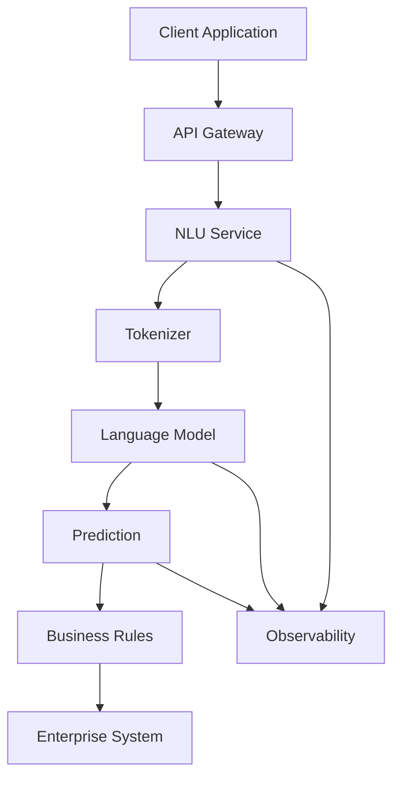

This architecture separates:

- API handling
- Model inference
- Business logic
- Enterprise integration
- Observability

This separation is important when building production-grade AI systems.

---

# 35. Enterprise Applications

NLU is widely used across enterprise systems.

## Customer Support

```text
Customer Message
       ↓
Intent Detection
       ↓
Routing
       ↓
Support Workflow
```

## Enterprise Search

```text
User Query
       ↓
Semantic Understanding
       ↓
Search
       ↓
Relevant Documents
```

## Document Intelligence

```text
Document
   ↓
Text Extraction
   ↓
Entity / Intent / Classification
   ↓
Structured Information
```

## Banking

Applications include:

- Transaction classification
- Customer support
- Document processing
- Fraud-related text analysis
- Compliance workflows

## Software Engineering

Applications include:

- Code understanding
- Documentation generation
- Issue classification
- Log analysis
- Developer assistants

---

# 36. NLU in Modern Enterprise AI

Modern enterprise AI systems often combine multiple capabilities:

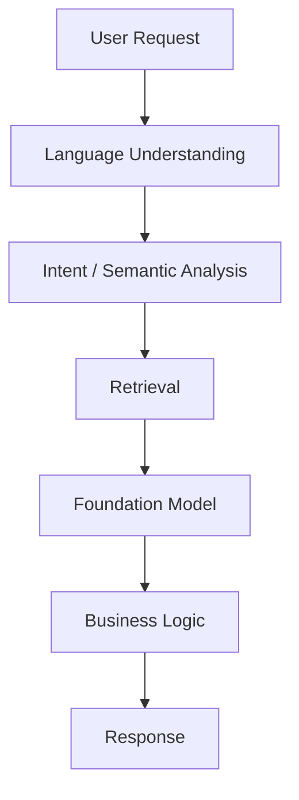

This architecture connects traditional NLU concepts with modern:

- Foundation Models
- LLMs
- RAG
- AI Agents
- Enterprise AI Applications

---

# 37. NLU vs LLMs

Traditional NLU systems are often designed for specific tasks.

For example:

```text
Input
 ↓
Intent Classifier
 ↓
Intent
```

An LLM can perform multiple language tasks through a general-purpose model:

```text
Input
 ↓
LLM
 ├── Classification
 ├── Summarization
 ├── Question Answering
 ├── Extraction
 ├── Translation
 └── Generation
```

This represents a shift from:

```text
Task-Specific Models
```

toward:

```text
General-Purpose Foundation Models
```

---

# 38. Common NLU Challenges

## Ambiguity

The same sentence may have multiple interpretations.

## Context

Meaning may depend on previous sentences.

## Domain Vocabulary

Specialized industries contain terminology that general-purpose models may not handle well.

## Class Imbalance

Some intents may have significantly fewer examples than others.

## Data Quality

Incorrect labels can directly affect model performance.

## Out-of-Vocabulary Terms

Traditional word-level models may fail on unseen words.

## Long Documents

Processing long documents introduces memory and context challenges.

## Multilingual Data

Different languages can have different:

- Syntax
- Morphology
- Tokenization requirements
- Training-data availability

---

# 39. Best Practices

When building NLU systems:

- Start with a clearly defined business problem.
- Build representative datasets.
- Maintain high-quality labels.
- Separate training, validation, and test datasets.
- Evaluate more than accuracy.
- Analyze confusion matrices.
- Monitor class imbalance.
- Use pretrained models when appropriate.
- Evaluate domain-specific terminology.
- Keep preprocessing consistent between training and inference.
- Version models and datasets.
- Monitor production drift.
- Log model latency and prediction quality.
- Design observability into the system.
- Protect sensitive enterprise data.
- Evaluate model behavior on edge cases.

---

# 40. Common Mistakes

## Mistake 1: Treating NLP and NLU as Identical

NLP is the broader field; NLU focuses specifically on interpretation and understanding.

## Mistake 2: Using Accuracy for Every Problem

Accuracy can be misleading for imbalanced datasets.

## Mistake 3: Ignoring Context

Keyword matching does not always capture meaning.

## Mistake 4: Over-Preprocessing Modern Transformer Inputs

Aggressive preprocessing can remove information that modern models need.

## Mistake 5: Training From Scratch Without Need

Pretrained language models can significantly reduce development and data requirements.

## Mistake 6: Ignoring Production Data Drift

Language, vocabulary, and user behavior can change after deployment.

## Mistake 7: Mixing Business Logic With Model Logic

Model inference and business workflows should remain independently maintainable.

---

# 41. Practical Python Example: Text Classification

A simplified classical NLP classification example:

```python
from sklearn.feature_extraction.text import TfidfVectorizer
from sklearn.linear_model import LogisticRegression

texts = [
    "I cannot login to my account",
    "How do I reset my password?",
    "What is my account balance?",
    "Show me my recent transactions"
]

labels = [
    "account_access",
    "password_reset",
    "balance",
    "transactions"
]

vectorizer = TfidfVectorizer()

X = vectorizer.fit_transform(texts)

model = LogisticRegression()

model.fit(X, labels)

query = ["I forgot my password"]

query_vector = vectorizer.transform(query)

prediction = model.predict(query_vector)

print(prediction)
```

This example demonstrates a traditional NLU pipeline:

```text
Text
 ↓
TF-IDF
 ↓
Classification Model
 ↓
Intent
```

Modern systems can replace TF-IDF and the classifier with pretrained Transformer models.

---

# 42. From Classical NLU to Transformers

The architectural evolution can be summarized as:

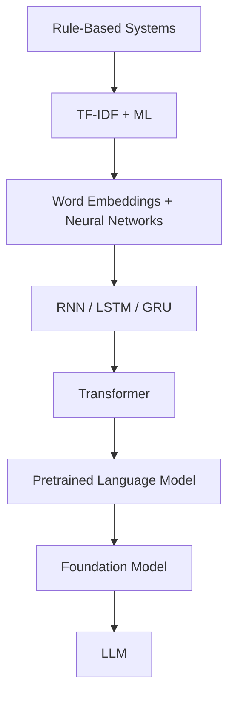

The key transition is from:

```text
Handcrafted Features
```

to:

```text
Learned Representations
```

and eventually:

```text
Large-Scale Pretrained Representations
```

---

# 43. NLU and Embeddings

Embeddings provide the numerical representation required by neural language models.

The relationship is:

```text
Text
 ↓
Tokens
 ↓
Embeddings
 ↓
Neural Model
 ↓
Contextual Representation
 ↓
NLU Task
```

This makes embeddings a fundamental building block of modern NLU.

See:

**[03. Word Embeddings](03-word-embeddings.md)**

---

# 44. NLU and Language Modeling

Language modeling focuses on learning language probabilities and generating or predicting tokens.

NLU focuses on understanding language.

The two capabilities increasingly converge in modern Foundation Models.

```text
Language Modeling
        +
Contextual Representations
        +
Large-Scale Pretraining
        ↓
Foundation Model
        ↓
LLM
```

See:

**[04. Language Modeling](04-language-modeling.md)**

---

# 45. NLU and Attention

Traditional sequence models process language sequentially.

Transformers use attention to model relationships between tokens.

For example:

```text
The customer opened an account because it was required.
```

Understanding what `it` refers to requires contextual relationships.

Attention helps the model determine which tokens are relevant to one another.

The detailed mechanism is covered in:

**[05. Attention and Positional Encoding](05-attention-and-positional-encoding.md)**

---

# 46. Production Evaluation

Production NLU evaluation should go beyond offline accuracy.

A mature evaluation strategy can include:

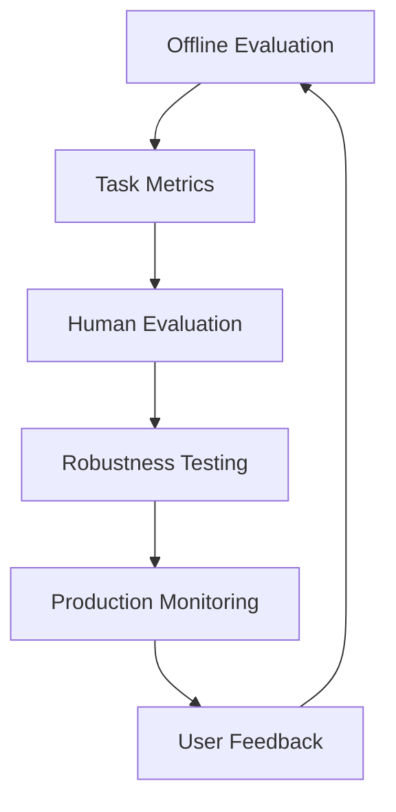

Important dimensions include:

- Accuracy
- Precision
- Recall
- F1
- Latency
- Robustness
- Error rates
- User satisfaction
- Business outcomes

---

# 47. Monitoring NLU Systems

Production monitoring should consider both infrastructure and model behavior.

## Infrastructure Metrics

- Latency
- Throughput
- CPU utilization
- GPU utilization
- Memory
- Error rate

## Model Metrics

- Prediction confidence
- Classification accuracy
- Drift
- Class distribution
- False positives
- False negatives

## Business Metrics

- Resolution rate
- Escalation rate
- Customer satisfaction
- Workflow completion

A production AI system should therefore be monitored across multiple layers.

---

# 48. NLU System Lifecycle

A production-oriented lifecycle can be represented as:

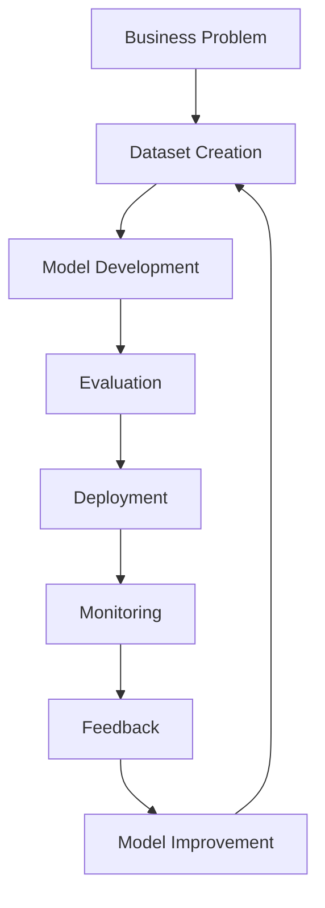

This creates a continuous improvement cycle.

---

# 49. Interview Questions

## Beginner

1. What is Natural Language Understanding?
2. What is the difference between NLP and NLU?
3. What is text classification?
4. What is sentiment analysis?
5. What is intent recognition?
6. What is tokenization?
7. What is Named Entity Recognition?
8. What is a word embedding?

## Intermediate

1. One-Hot Encoding vs TF-IDF?
2. Why are word embeddings useful?
3. Why does Bag-of-Words lose contextual information?
4. What is Cross-Entropy Loss?
5. Explain Precision, Recall, and F1.
6. Why is F1 useful for imbalanced datasets?
7. What is the role of a validation dataset?
8. Why did RNNs become popular for NLP?
9. What limitations do RNNs have?
10. Why did Transformers replace many RNN-based NLP architectures?

## Advanced

1. How would you design an enterprise NLU system?
2. How would you handle severe class imbalance?
3. How would you detect model drift in production?
4. How would you evaluate an intent classification system?
5. How would you select between a classical ML model and a Transformer?
6. How would you handle domain-specific terminology?
7. How would you design NLU inference as a microservice?
8. How would you monitor model quality after deployment?
9. How does contextual representation improve language understanding?
10. How does traditional NLU differ from modern LLM-based language understanding?
11. How would you integrate an NLU model into an enterprise workflow?
12. What are the production trade-offs between a task-specific NLU model and an LLM?

---

# 50. 🚀 Quick Revision Sheet

## NLP vs NLU

```text
NLP
 ↓
Process Language

NLU
 ↓
Understand Meaning
Intent
Context
Entities
```

## Representation Evolution

```text
One-Hot
 ↓
BoW
 ↓
TF-IDF
 ↓
Word Embeddings
 ↓
Contextual Embeddings
 ↓
Transformers
 ↓
LLMs
```

## NLU Pipeline

```text
Text
 ↓
Tokenization
 ↓
Representation
 ↓
Model
 ↓
Prediction
 ↓
Business Action
```

## Classification

```text
Document
 ↓
Features / Embeddings
 ↓
Classifier
 ↓
Class
```

## Evaluation

```text
Accuracy
Precision
Recall
F1
Confusion Matrix
```

## Modern AI

```text
Text
 ↓
Tokenizer
 ↓
Embeddings
 ↓
Transformer
 ↓
Contextual Representation
 ↓
LLM / NLU Task
```

## Enterprise

```text
User
 ↓
API
 ↓
AI Service
 ↓
Language Model
 ↓
Business Logic
 ↓
Enterprise System
 ↓
Monitoring
```

---

# 51. Key Takeaways

- **Natural Language Understanding (NLU)** focuses on interpreting the meaning, intent, context, and structure of human language.
- NLP is the broader field that includes many techniques used to process and understand language.
- Traditional NLU systems relied heavily on handcrafted features and statistical representations.
- One-Hot Encoding, Bag-of-Words, and TF-IDF provided early approaches to numerical text representation.
- Word embeddings introduced dense representations that could capture semantic relationships.
- Neural networks enabled models to learn language representations automatically.
- RNNs, LSTMs, and GRUs improved sequence modeling but were limited by sequential computation.
- Transformers introduced attention-based contextual modeling and enabled much larger-scale language systems.
- Modern NLU increasingly relies on pretrained Transformer-based models and Foundation Models.
- Classification, sentiment analysis, intent recognition, NER, semantic similarity, and question answering are important NLU tasks.
- Accuracy alone is insufficient for many real-world NLU problems.
- Precision, Recall, F1 Score, confusion matrices, and business-level metrics provide a more complete evaluation.
- Production NLU systems require data quality, model versioning, monitoring, security, observability, and drift detection.
- NLU concepts provide the foundation for understanding **word embeddings, language modeling, Transformers, Foundation Models, and LLMs**.
- Enterprise AI systems increasingly combine NLU capabilities with retrieval, LLMs, business logic, and workflow automation.

---

# 52. Chapter Navigation

### Previous

**[01. Generative AI Fundamentals](01-generative-ai-fundamentals.md)**

### Next

**[03. Word Embeddings](03-word-embeddings.md)**

### Related

**[04. Language Modeling](04-language-modeling.md)**

**[05. Attention and Positional Encoding](05-attention-and-positional-encoding.md)**

**[06. GPT and BERT Architecture](06-gpt-and-bert-architecture.md)**

---

# References

- Jurafsky & Martin — *Speech and Language Processing*
- Goodfellow, Bengio & Courville — *Deep Learning*
- Mikolov et al. — *Efficient Estimation of Word Representations in Vector Space*
- Vaswani et al. — *Attention Is All You Need*
- Devlin et al. — *BERT: Pre-training of Deep Bidirectional Transformers for Language Understanding*
- Hugging Face Documentation
- PyTorch Documentation
- Scikit-learn Documentation

---

> **Enterprise AI Engineering Handbook**  
> *Building Production-Grade Enterprise AI Systems — One Chapter at a Time.*