# Word Embeddings: From Word2Vec to Contextual Representations

> A practical, engineering-focused guide to **Word Embeddings**, covering distributed representations, One-Hot Encoding, Bag-of-Words, TF-IDF, Word2Vec, CBOW, Skip-Gram, embedding spaces, semantic similarity, pretrained embeddings, static vs contextual embeddings, and the evolution toward modern **Transformer-based Large Language Models (LLMs)**.

---

# 1. Overview

Computers do not understand words in the same way humans do.

Machine learning models operate primarily on numerical representations. Therefore, one of the fundamental challenges in Natural Language Processing (NLP) is:

> **How can human language be converted into numerical representations that preserve useful semantic and syntactic information?**

Early NLP systems used representations such as:

- One-Hot Encoding
- Bag-of-Words
- TF-IDF

These approaches were useful but had significant limitations.

**Word Embeddings** introduced a major improvement by representing words as dense numerical vectors that can capture relationships between words.

The evolution can be summarized as:

```text
One-Hot Encoding
        ↓
Bag-of-Words
        ↓
TF-IDF
        ↓
Word Embeddings
        ↓
Contextual Embeddings
        ↓
Transformer Representations
        ↓
Large Language Models
```

Word embeddings therefore provide an important bridge between traditional NLP and modern Generative AI.

---

# 2. What Are Word Embeddings?

A **Word Embedding** is a dense numerical vector representation of a word.

For example:

```text
king

↓

[0.32, -0.71, 0.84, 0.15, ...]
```

Instead of representing a word using a sparse categorical identifier, the model learns a vector in a continuous numerical space.


The goal is for words with related meanings or usage patterns to develop useful relationships in the embedding space.

For example:

```text
king  ───── queen
man    ───── woman
Paris  ───── France
Tokyo  ───── Japan
```

These relationships are learned from patterns in language data rather than manually programmed.

---

# 3. Why Do We Need Word Embeddings?

Traditional text representations have several limitations.

Consider:

```text
king
queen
car
```

With One-Hot Encoding:

```text
king  → [1, 0, 0]

queen → [0, 1, 0]

car   → [0, 0, 1]
```

The representation tells us that the words are different.

It does not naturally tell us that:

```text
king ≈ queen
```

or:

```text
king ≠ car
```

Word embeddings address this by placing words in a continuous vector space.

```text
Traditional Representation

king   → [1,0,0]
queen  → [0,1,0]
car    → [0,0,1]


Embedding Representation

king   → [0.32, 0.71, -0.21, ...]
queen  → [0.29, 0.68, -0.18, ...]
car    → [-0.73, 0.11, 0.92, ...]
```

The embedding representation allows mathematical operations to capture useful relationships.

---

# 4. Evolution of Text Representation

The progression of NLP representations is important for understanding modern LLMs.

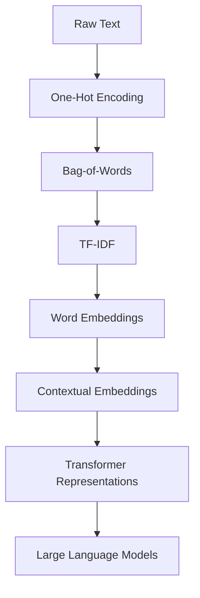

Each generation addressed limitations of the previous approach.

---

# 5. One-Hot Encoding

One-Hot Encoding represents each word using a binary vector.

Suppose the vocabulary is:

```text
["AI", "Machine", "Learning"]
```

The representations could be:

```text
AI

[1, 0, 0]

Machine

[0, 1, 0]

Learning

[0, 0, 1]
```

Only one position contains `1`.

## Advantages

- Simple
- Easy to implement
- Easy to understand
- Works well for small vocabularies

## Limitations

- Very sparse
- High dimensionality
- No semantic relationship
- Poor scalability
- No meaningful distance between related words

For a vocabulary of one million words:

```text
Embedding Size = 1,000,000
```

Most entries would be zero.

---

# 6. Bag-of-Words

**Bag-of-Words (BoW)** represents a document using word occurrence counts.

Example:

```text
AI is powerful
```

could become:

```text
AI        → 1
is        → 1
powerful  → 1
```

For multiple documents:

```text
Document 1:
AI is powerful

Document 2:
AI is useful
```

the representation can be constructed from a shared vocabulary.

## Limitations

Bag-of-Words ignores:

- Word order
- Context
- Semantic relationships
- Synonyms
- Polysemy

For example:

```text
Dog bites man
```

and:

```text
Man bites dog
```

can contain the same words but have completely different meanings.

---

# 7. TF-IDF

**TF-IDF (Term Frequency-Inverse Document Frequency)** improves upon simple word counts.

It considers:

- How frequently a term appears in a document
- How common the term is across the document collection

The basic formulation is:

$$
TFIDF(t,d)=TF(t,d)\times IDF(t)
$$

A common form of inverse document frequency is:

$$
IDF(t)=\log\left(\frac{N}{DF(t)}\right)
$$

where:

- \(t\) = term
- \(d\) = document
- \(N\) = number of documents
- \(DF(t)\) = number of documents containing the term

TF-IDF can help identify terms that are important within particular documents.

However, it still does not provide rich semantic representations.

---

# 8. Why Dense Embeddings?

Word embeddings represent words using dense vectors.

Example:

```text
King

↓

[0.23, -0.14, 0.82, 0.44, ...]
```

Instead of:

```text
[0, 0, 0, 0, 1, 0, 0, ...]
```

The dimensions are learned rather than explicitly assigned.

This creates a continuous vector space where relationships can emerge.

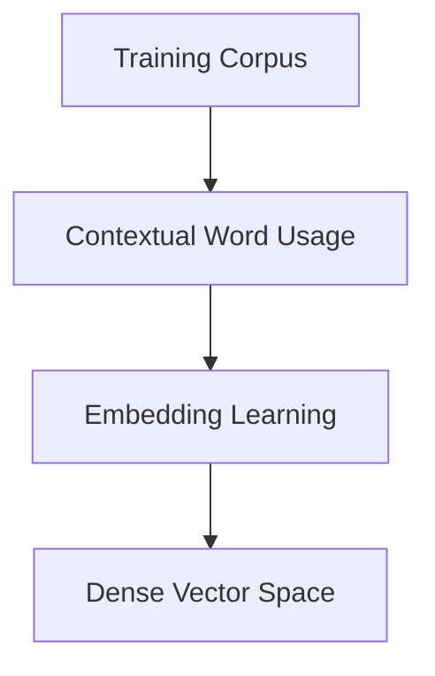

---

# 9. Distributed Representations

Word embeddings use **distributed representations**.

The meaning of a word is not stored in one specific dimension.

Instead, information is distributed across many dimensions.

```text
Word

↓

Dimension 1 ─┐
Dimension 2 ─┤
Dimension 3 ─┤
Dimension 4 ─┼→ Distributed Representation
Dimension 5 ─┤
Dimension N ─┘
```

The individual dimensions usually do not have simple human-readable meanings.

The representation is learned collectively.

---

# 10. Distributional Hypothesis

A major idea behind word embeddings is the **distributional hypothesis**:

> Words that occur in similar contexts tend to have similar meanings.

For example:

```text
The cat is drinking milk.

The kitten is drinking milk.
```

Because `cat` and `kitten` occur in similar contexts, an embedding model can learn that their representations should be related.


This principle is central to Word2Vec and many other embedding approaches.

---

# 11. Word2Vec

**Word2Vec** is one of the most influential methods for learning word embeddings.

It was introduced by Tomas Mikolov and colleagues at Google.

Word2Vec learns word representations from the context in which words appear.

The two major training strategies are:

- Continuous Bag of Words (CBOW)
- Skip-Gram

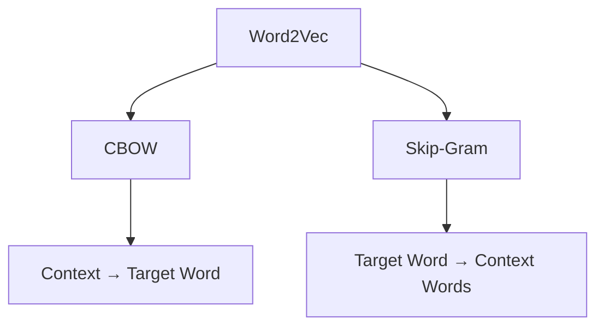

---

# 12. Continuous Bag of Words (CBOW)

**CBOW** predicts a target word from surrounding context words.

Consider:

```text
The cat sat on the mat.
```

For:

```text
The cat ___ on
```

the target could be:

```text
sat
```

The model uses the surrounding context to predict the missing target word.

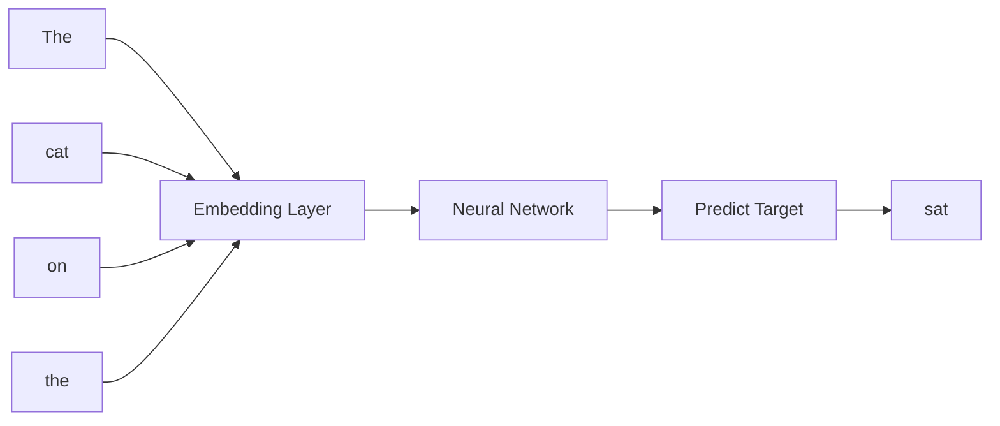

The simplified learning objective is:

```text
Context Words
      ↓
Predict Target Word
```

---

# 13. CBOW Example

Sentence:

```text
The customer opened the account.
```

Suppose:

```text
Context:

The customer opened the

Target:

account
```

The model attempts to predict:

```text
account
```

from the surrounding context.

```text
Context
─────────────────────
The
customer
opened
the
─────────────────────
        ↓
      CBOW
        ↓
     account
```

---

# 14. Skip-Gram

**Skip-Gram** reverses the prediction direction.

Instead of:

```text
Context → Target
```

it uses:

```text
Target → Context
```

For example:

```text
Target:

cat
```

The model predicts nearby context words:

```text
The
sat
on
the
```

Conceptually:

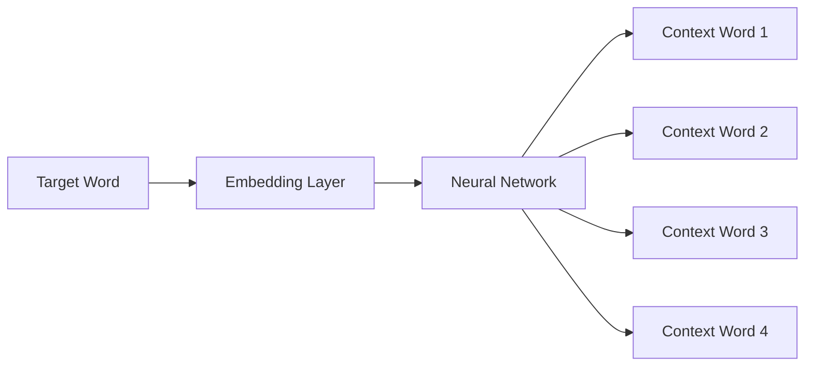

---

# 15. CBOW vs Skip-Gram

| Characteristic | CBOW | Skip-Gram |
|---|---|---|
| Prediction | Context → Target | Target → Context |
| Training | Generally faster | Generally slower |
| Frequent words | Often effective | Effective |
| Rare words | Less effective in some settings | Often useful |
| Training examples | Fewer | More |
| Computational Cost | Lower | Higher |
| Main Idea | Predict center word | Predict surrounding words |

---

# 16. Word2Vec Training Intuition

Suppose the corpus contains:

```text
The cat drinks milk.
The kitten drinks milk.
The dog drinks water.
```

The model observes recurring context patterns.

For example:

```text
cat → drinks → milk

kitten → drinks → milk
```

Over many training examples, the optimization process updates embedding vectors.

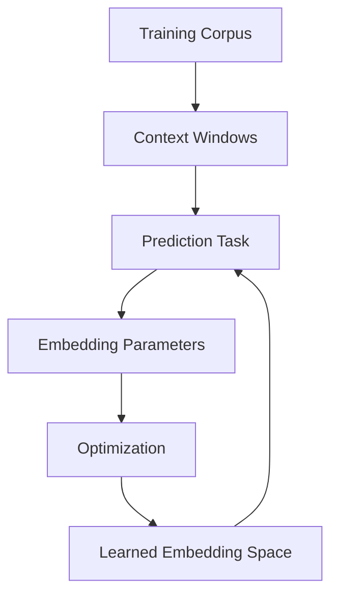

The embedding is not manually designed.

It emerges from the training objective.

---

# 17. Context Window

Word2Vec uses a configurable context window.

Example:

```text
The quick brown fox jumps over the lazy dog
```

For:

```text
brown
```

a context window of 2 might consider:

```text
The
quick
fox
jumps
```

Conceptually:

```text
The quick [brown] fox jumps
         ↑
       Target
```

The context window determines which neighboring words contribute training signals.

---

# 18. Embedding Dimensions

An embedding represents each word using a fixed number of dimensions.

Typical historical Word2Vec configurations include:

```text
50
100
200
300
```

A larger vector can potentially represent more information, but it also increases:

- Memory
- Computation
- Storage

Example:

```text
Vocabulary = 1,000,000 words
Embedding Dimension = 300
```

Approximate raw float32 storage:

$$
1,000,000 \times 300 \times 4
$$

which is approximately:

```text
1.2 GB
```

before considering additional model structures.

This demonstrates why embedding size matters in production.

---

# 19. Semantic Similarity

One important use of embeddings is measuring similarity.

A common metric is **Cosine Similarity**.

$$
\cos(\theta)=
\frac{A\cdot B}
{\|A\|\|B\|}
$$

where:

- \(A\) = embedding vector 1
- \(B\) = embedding vector 2

Values closer to `1` generally indicate that vectors point in similar directions.

---

# 20. Cosine Similarity Example

Suppose:

```text
A = [1, 0]

B = [0.8, 0.6]
```

Their cosine similarity is:

$$
\cos(\theta)=
\frac{1(0.8)+0(0.6)}
{1\times1}
=0.8
$$

This indicates a relatively strong directional similarity.

In practical NLP systems, cosine similarity can be used for:

- Semantic Search
- Recommendation
- Similarity Detection
- Document Matching
- Clustering

---

# 21. Embedding Space

Words can be visualized as points in a high-dimensional space.

For learning purposes, imagine reducing the vectors to two dimensions:

```text
Semantic Space

        ↑
        │       queen
        │        ●
        │      ● king
        │
        │
        │                         car
        │                          ●
        └────────────────────────────────→
```

Real embeddings typically contain hundreds or thousands of dimensions, so a 2D visualization is only a projection.

---

# 22. Vector Arithmetic

Word2Vec became famous for demonstrating interesting vector relationships.

A commonly cited example is:

```text
king - man + woman ≈ queen
```

Another example is:

```text
Paris - France + Japan ≈ Tokyo
```

These relationships emerge from learned representations.

However, vector arithmetic should be treated as an interesting property of particular embedding spaces rather than a universal guarantee.

---

# 23. Practical Similarity Search with Word Embeddings

A simplified Python example using NumPy:

```python
import numpy as np

king = np.array([0.8, 0.6, 0.2])
queen = np.array([0.7, 0.7, 0.2])

similarity = np.dot(king, queen) / (
    np.linalg.norm(king) * np.linalg.norm(queen)
)

print(similarity)
```

The calculation measures the directional similarity between the two vectors.

---

# 24. Static Word Embeddings

Traditional Word2Vec embeddings are **static embeddings**.

This means a word generally has one learned vector.

For example:

```text
bank

↓

One Embedding
```

This creates a major limitation for ambiguous words.

Consider:

```text
I deposited money in the bank.
```

and:

```text
We sat near the river bank.
```

The word `bank` has different meanings.

A static embedding does not dynamically change its representation based on the surrounding sentence.

---

# 25. Polysemy Problem

**Polysemy** refers to words having multiple meanings.

Example:

```text
bank
```

can mean:

```text
Financial Institution
```

or:

```text
River Bank
```

A static embedding provides one primary vector:

```text
bank → Vector
```

This motivates contextual representations.

---

# 26. Contextual Embeddings

Modern Transformer models generate representations that depend on surrounding context.

For example:

```text
I deposited money in the bank.

bank
   ↓
Financial Context
```

while:

```text
We sat near the river bank.

bank
   ↓
Geographical Context
```

The representation of `bank` can therefore differ according to context.

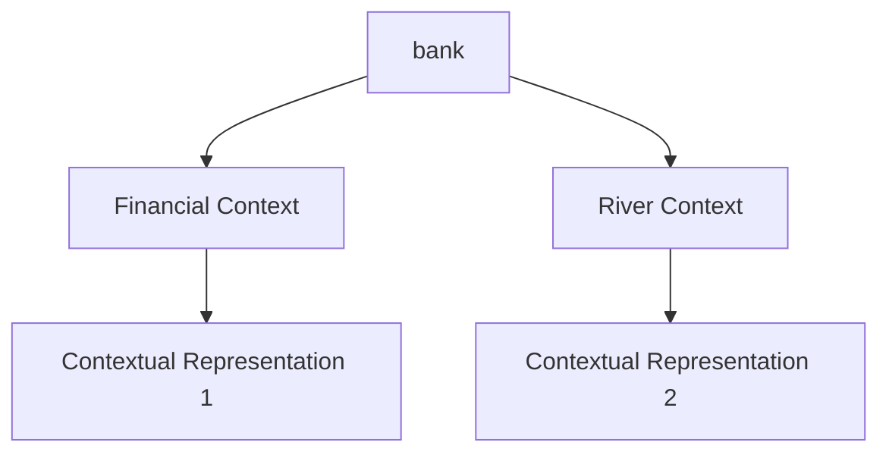

This is one of the major differences between traditional Word2Vec embeddings and Transformer-based representations.

---

# 27. Static vs Contextual Embeddings

| Characteristic | Static Embeddings | Contextual Embeddings |
|---|---|---|
| Representation | One vector per word | Depends on context |
| Polysemy | Limited handling | Better handling |
| Context Awareness | Low | High |
| Examples | Word2Vec, GloVe | BERT, GPT-style models |
| Architecture | Shallow embedding models | Transformer-based |
| Modern LLM Usage | Historical foundation | Core capability |

---

# 28. Pretrained Word Embeddings

Training embeddings from scratch requires a sufficiently large corpus.

Pretrained embeddings provide ready-to-use representations.

Popular approaches include:

- Word2Vec
- GloVe
- FastText

Benefits:

- Faster development
- Lower training requirements
- Useful semantic representations
- Transfer learning


---

# 29. GloVe

**GloVe (Global Vectors for Word Representation)** is another influential word-embedding method.

Unlike Word2Vec's prediction-based formulation, GloVe uses global word co-occurrence statistics.

The core idea is:

```text
Global Co-Occurrence Information
             ↓
       Embedding Learning
             ↓
       Dense Word Vectors
```

GloVe and Word2Vec both produce static word representations but use different learning approaches.

---

# 30. FastText

**FastText** extends the word-embedding idea by incorporating subword information.

Instead of treating:

```text
playing
```

only as a complete word, FastText can model character-level subword components.

Conceptually:

```text
playing

↓

play
lay
aying
...
```

This can help with:

- Rare words
- Morphologically rich languages
- Misspellings
- Unseen or uncommon words

---

# 31. Word Embeddings vs Contextual Embeddings

The conceptual evolution is:

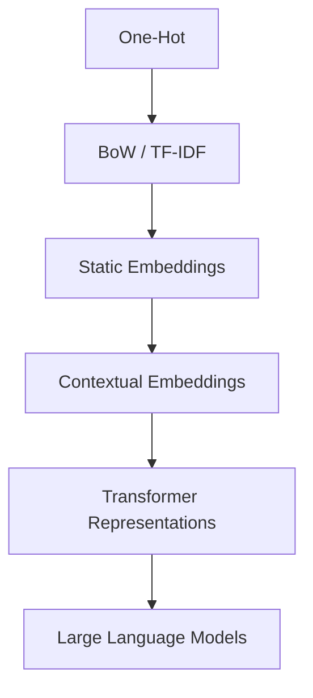

The major transition is:

```text
Static Meaning
      ↓
Context-Dependent Meaning
```

---

# 32. Embeddings in Transformer Models

Modern Transformer models still contain embedding layers.

A simplified pipeline is:

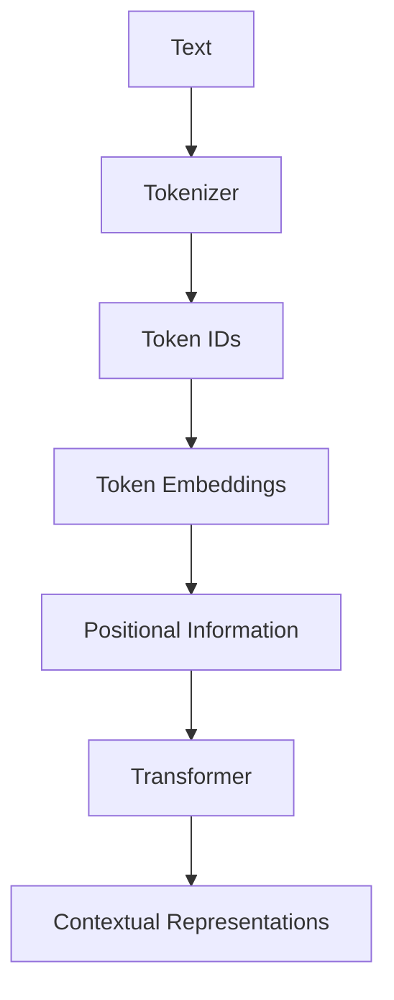

This demonstrates an important distinction:

> **Word embeddings are a historical foundation, while modern Transformer models build richer contextual representations on top of token embeddings.**

The detailed Transformer mechanism is covered in:

**[05. Attention and Positional Encoding](05-attention-and-positional-encoding.md)**

---

# 33. Word Embeddings and Language Modeling

Embeddings connect directly to language modeling.

The simplified progression is:

```text
Tokens
  ↓
Embeddings
  ↓
Language Model
  ↓
Contextual Representations
  ↓
Next-Token Prediction
```

This creates the bridge to:

**[04. Language Modeling](04-language-modeling.md)**

---

# 34. Embeddings in Search Systems

Embeddings became especially important in semantic search.

Traditional keyword search:

```text
Query
  ↓
Keyword Matching
  ↓
Documents
```

Embedding-based search:

```text
Query
  ↓
Query Embedding
  ↓
Vector Similarity
  ↓
Relevant Documents
```

Conceptually:

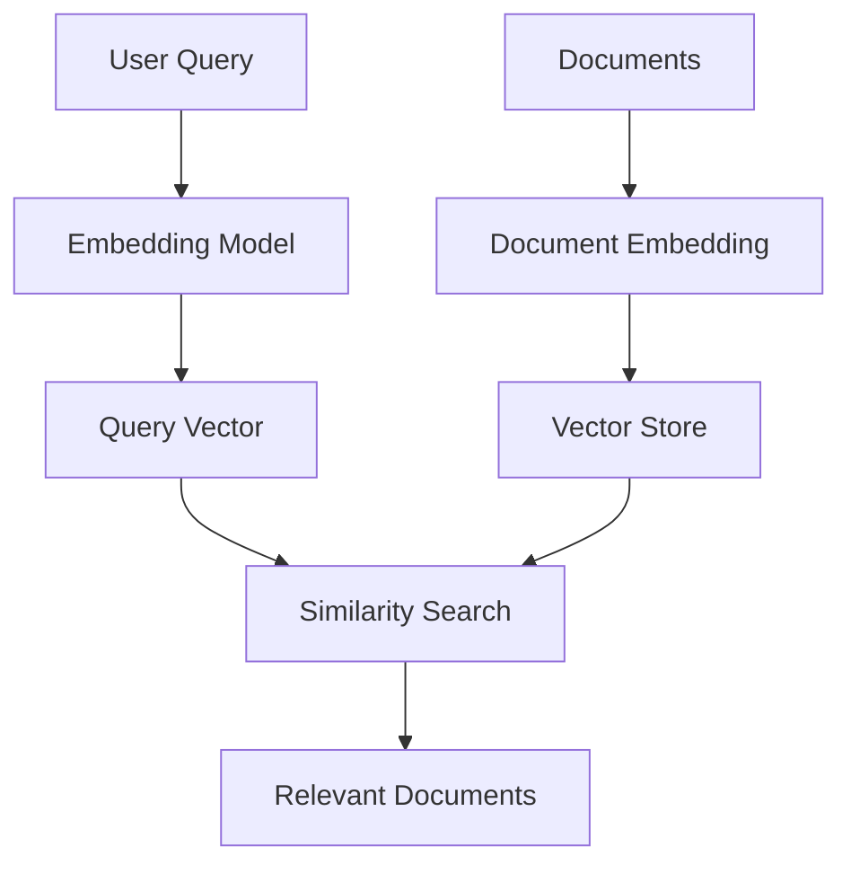

This idea becomes foundational for modern:

- Semantic Search
- Vector Databases
- Retrieval-Augmented Generation
- Recommendation Systems

---

# 35. Word Embeddings vs Sentence and Document Embeddings

It is important not to confuse these concepts.

### Word Embedding

Represents a word or token:

```text
cloud

↓

Vector
```

### Sentence Embedding

Represents a complete sentence:

```text
Cloud AI systems are scalable.

↓

Vector
```

### Document Embedding

Represents a larger text unit:

```text
Enterprise Architecture Document

↓

Vector
```

Modern enterprise retrieval systems generally use **sentence, passage, or document embedding models**, rather than relying directly on Word2Vec word vectors.

---

# 36. Production Embedding Pipeline

A modern production embedding pipeline may look like:

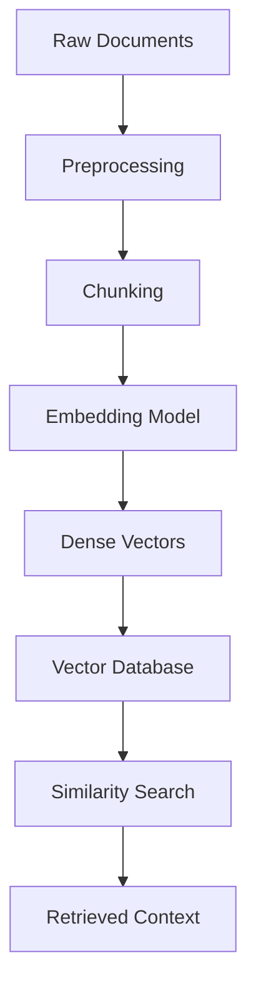

This represents the transition from traditional NLP embeddings to modern **Enterprise AI Engineering**.

---

# 37. Embedding Quality in Production

Embedding quality affects downstream systems such as:

- Semantic Search
- Recommendation
- Clustering
- Retrieval-Augmented Generation
- Classification

Important considerations include:

## Model Selection

Choose an embedding model appropriate for:

- Language
- Domain
- Task
- Latency requirements

## Dimensionality

Higher dimensionality can increase:

- Memory
- Storage
- Search cost

## Normalization

Depending on the similarity metric and vector database, normalization may be useful.

## Domain Vocabulary

Generic embeddings may perform poorly on specialized terminology.

---

# 38. Embedding Storage and Memory

Suppose a system stores:

```text
10 million vectors
```

with:

```text
768 dimensions
```

using:

```text
float32
```

Approximate raw storage:

$$
10,000,000 \times 768 \times 4
$$

which is approximately:

```text
30.72 GB
```

This is before considering:

- Index overhead
- Metadata
- Replication
- Database storage
- Query structures

This illustrates why embedding dimensionality and corpus size matter in production architectures.

---

# 39. Similarity Search

Common similarity measures include:

- Cosine Similarity
- Dot Product
- Euclidean Distance

The appropriate metric depends on the embedding model and retrieval architecture.

A simplified semantic retrieval flow is:

```text
User Query
    ↓
Query Embedding
    ↓
Vector Search
    ↓
Similarity Ranking
    ↓
Top-K Results
```

---

# 40. Embeddings and RAG

Retrieval-Augmented Generation systems commonly use embeddings to find relevant context.

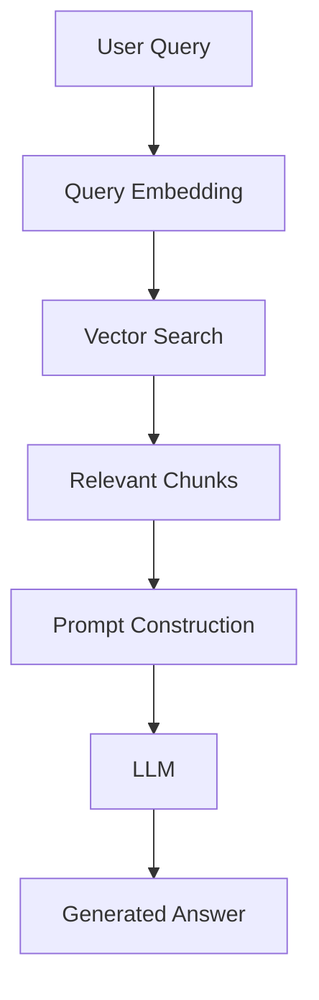

This creates a direct connection between embedding technology and modern Enterprise AI applications.

---

# 41. Practical Python Example: Sentence Embeddings

Modern semantic applications generally use pretrained embedding models rather than raw Word2Vec vectors.

A simplified example using Sentence Transformers:

```python
from sentence_transformers import SentenceTransformer

model = SentenceTransformer(
    "sentence-transformers/all-MiniLM-L6-v2"
)

sentences = [
    "Cloud AI architecture",
    "Enterprise machine learning systems",
    "Cooking recipes"
]

embeddings = model.encode(sentences)

print(embeddings.shape)
```

The resulting vectors can be used for semantic similarity or retrieval.

Conceptually:

```text
Sentence
   ↓
Embedding Model
   ↓
Dense Vector
   ↓
Similarity / Retrieval
```

---

# 42. Practical Python Example: Semantic Similarity

```python
from sentence_transformers import SentenceTransformer
from sklearn.metrics.pairwise import cosine_similarity

model = SentenceTransformer(
    "sentence-transformers/all-MiniLM-L6-v2"
)

sentences = [
    "Enterprise AI architecture",
    "Production AI systems",
    "Italian cooking recipes"
]

embeddings = model.encode(sentences)

similarity = cosine_similarity(embeddings)

print(similarity)
```

The similarity matrix provides a numerical indication of how closely the sentence representations align.

---

# 43. Word Embeddings in Enterprise AI

Word embeddings were an important milestone, but modern enterprise systems generally use more advanced embedding models.

A typical architecture is:

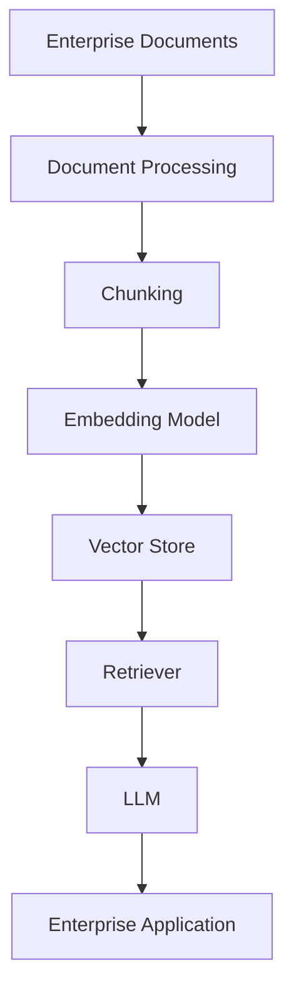

Applications include:

- Enterprise Search
- Knowledge Assistants
- Document Intelligence
- Recommendation Systems
- Similarity Detection
- RAG
- AI Assistants

---

# 44. Common Challenges

## Out-of-Vocabulary Words

Traditional word-level embeddings may struggle with words not present during training.

## Polysemy

A single word may have multiple meanings.

## Domain-Specific Vocabulary

Generic embeddings may not represent specialized terminology effectively.

Examples:

```text
Finance
Healthcare
Telecom
Legal
Engineering
```

## Dimensionality

Large embedding vectors require more memory and compute.

## Semantic Drift

Meaning and usage can change over time.

## Bias

Embedding spaces can inherit biases from training data.

---

# 45. Static vs Contextual Representation

The key conceptual difference is:

```text
Static Embedding

bank
 ↓
One Vector
```

versus:

```text
Contextual Representation

"bank account"
       ↓
Context-Aware Vector


"river bank"
       ↓
Different Context-Aware Vector
```

This transition was critical to the development of modern Transformer-based language models.

---

# 46. Word2Vec vs BERT-Style Representations

| Feature | Word2Vec | BERT |
|---|---|---|
| Representation | Static | Contextual |
| Context Sensitivity | Limited | High |
| Training Approach | CBOW / Skip-Gram | Masked Language Modeling + other objectives |
| Architecture | Shallow neural architecture | Transformer Encoder |
| Polysemy | Limited | Better handling |
| Long Context | Limited | Stronger contextual modeling |
| Modern LLM Foundation | Historical | Transformer-based |

The architectural details of BERT are covered in:

**[06. GPT and BERT Architecture](06-gpt-and-bert-architecture.md)**

---

# 47. Best Practices

When working with embeddings:

- Choose an embedding model based on the downstream task.
- Distinguish word embeddings from sentence and document embeddings.
- Consider domain-specific vocabulary.
- Evaluate semantic retrieval using representative datasets.
- Monitor embedding dimensionality and storage requirements.
- Choose similarity metrics carefully.
- Normalize vectors when appropriate for the chosen retrieval strategy.
- Keep the embedding model consistent between indexing and querying.
- Version embedding models in production.
- Re-index existing data when changing embedding models where required.
- Monitor retrieval quality separately from LLM generation quality.
- Treat embedding quality as a production dependency for RAG and semantic search systems.

---

# 48. Common Mistakes

## Mistake 1: Thinking Word Embeddings Understand Language

Embeddings encode statistical relationships learned from data.

They do not inherently possess human-like understanding.

## Mistake 2: Treating Word2Vec as a Modern LLM Embedding System

Word2Vec is historically important but is not equivalent to modern contextual embedding models.

## Mistake 3: Using Word Embeddings for Entire Documents

Word-level embeddings are not automatically suitable for semantic document retrieval.

Modern systems typically use dedicated sentence or passage embedding models.

## Mistake 4: Ignoring Context

Static embeddings assign one vector to a word regardless of context.

This is problematic for polysemous words.

## Mistake 5: Ignoring Embedding Versioning

Changing the embedding model can change vector representations.

A production vector index may therefore need to be rebuilt or migrated.

## Mistake 6: Assuming Higher Dimensions Always Mean Better Embeddings

Higher dimensionality can increase:

- Storage
- Memory
- Search cost
- Infrastructure requirements

Quality should be evaluated against the actual task.

---

# 49. Interview Questions

## Beginner

1. What is a word embedding?
2. Why are embeddings better than One-Hot Encoding?
3. What is Word2Vec?
4. What is CBOW?
5. What is Skip-Gram?
6. What is a dense vector?
7. What is the distributional hypothesis?

## Intermediate

1. CBOW vs Skip-Gram?
2. Word2Vec vs Bag-of-Words?
3. Why do embeddings capture semantic relationships?
4. What is cosine similarity?
5. What are static embeddings?
6. What are contextual embeddings?
7. Why does Word2Vec struggle with polysemy?
8. What are GloVe and FastText?
9. Why are pretrained embeddings useful?
10. Word embeddings vs sentence embeddings?

## Advanced

1. Explain how Word2Vec learns embeddings.
2. Explain the difference between CBOW and Skip-Gram.
3. Why does the distributional hypothesis work?
4. How would you evaluate an embedding model?
5. How would you select an embedding model for enterprise semantic search?
6. How does embedding dimensionality affect infrastructure cost?
7. How would you migrate a production vector index to a new embedding model?
8. Why are contextual embeddings better suited to ambiguous language?
9. Word2Vec vs BERT representations?
10. How do embeddings fit into a production RAG architecture?
11. How would you monitor retrieval quality in an embedding-based system?
12. What happens if the embedding model used during querying differs from the model used during indexing?

---

# 50. 🚀 Quick Revision Sheet

## Representation Evolution

```text
One-Hot
   ↓
Bag-of-Words
   ↓
TF-IDF
   ↓
Word2Vec
   ↓
Contextual Embeddings
   ↓
Transformer Representations
   ↓
LLMs
```

## Word2Vec

```text
Word2Vec
   │
   ├── CBOW
   │     Context → Target
   │
   └── Skip-Gram
         Target → Context
```

## Static Embedding

```text
Word
 ↓
One Vector
```

## Contextual Embedding

```text
Word + Context
      ↓
Context-Aware Representation
```

## Similarity

```text
Vector A
   +
Vector B
   ↓
Similarity Metric
   ↓
Semantic Relationship
```

Common metrics:

- Cosine Similarity
- Dot Product
- Euclidean Distance

## Semantic Search

```text
Query
 ↓
Embedding
 ↓
Vector Search
 ↓
Top-K Results
```

## RAG

```text
Query
 ↓
Embedding
 ↓
Vector Search
 ↓
Relevant Context
 ↓
LLM
 ↓
Answer
```

## Production

```text
Documents
 ↓
Chunking
 ↓
Embedding
 ↓
Vector Store
 ↓
Retrieval
 ↓
LLM
```

---

# 51. Key Takeaways

- **Word Embeddings** convert words into dense numerical vectors.
- One-Hot Encoding and Bag-of-Words are sparse representations that do not naturally capture semantic relationships.
- The **distributional hypothesis** provides the conceptual foundation for learning embeddings from language usage.
- **Word2Vec** learns word representations using CBOW and Skip-Gram objectives.
- CBOW predicts a target word from surrounding context.
- Skip-Gram predicts surrounding context from a target word.
- Word embeddings create continuous vector spaces where semantic and syntactic relationships can emerge.
- **Cosine similarity** is commonly used to measure similarity between embedding vectors.
- Traditional Word2Vec embeddings are generally **static**, meaning a word has one learned representation.
- Static embeddings have difficulty handling **polysemy**, where a word has multiple meanings.
- Contextual embeddings generate representations that depend on surrounding context.
- Transformer models such as BERT introduced powerful contextual representations.
- Word embeddings form an important conceptual bridge between traditional NLP and modern Transformer-based LLMs.
- Modern enterprise applications generally use specialized sentence, passage, or document embedding models rather than raw Word2Vec vectors.
- Embeddings are foundational to **semantic search, vector databases, recommendation systems, and Retrieval-Augmented Generation (RAG)**.
- Embedding dimensionality directly affects storage, memory, and retrieval infrastructure requirements.
- Production systems should version embedding models and maintain consistency between indexing and querying.
- Embedding quality should be evaluated independently from downstream LLM generation quality.
- Understanding embeddings is essential before studying language modeling, Transformers, RAG, and modern Enterprise AI systems.

---

# 52. Chapter Navigation

### Previous

**[02. Language Understanding Fundamentals](02-language-understanding-fundamentals.md)**

### Next

**[04. Language Modeling](04-language-modeling.md)**

### Related

**[05. Attention and Positional Encoding](05-attention-and-positional-encoding.md)**

**[06. GPT and BERT Architecture](06-gpt-and-bert-architecture.md)**

---

# References

- Mikolov et al. — *Efficient Estimation of Word Representations in Vector Space*
- Mikolov et al. — *Distributed Representations of Words and Phrases and their Compositionality*
- Pennington, Socher & Manning — *GloVe: Global Vectors for Word Representation*
- Bojanowski et al. — *Enriching Word Vectors with Subword Information*
- Devlin et al. — *BERT: Pre-training of Deep Bidirectional Transformers for Language Understanding*
- Jurafsky & Martin — *Speech and Language Processing*
- Goodfellow, Bengio & Courville — *Deep Learning*
- Hugging Face Documentation
- Sentence Transformers Documentation
- PyTorch Documentation

---

> **Enterprise AI Engineering Handbook**  
> *Building Production-Grade Enterprise AI Systems — One Chapter at a Time.*