# Language Modeling: From N-Gram Models to Large Language Models

> A practical, engineering-focused guide to **Language Modeling**, covering statistical language models, N-Grams, neural language models, RNNs, LSTMs, Transformers, next-token prediction, causal language modeling, masked language modeling, training objectives, perplexity, pretraining, and the evolution toward modern **Large Language Models (LLMs)**.

---

## 📖 Overview

**Language Modeling** is one of the foundational concepts behind modern Natural Language Processing (NLP), Generative AI, and Large Language Models (LLMs).

A language model learns the statistical structure of language and estimates the probability of tokens occurring in a particular context.

At its simplest:

```text
Given Context
      │
      ▼
Language Model
      │
      ▼
Predict Next Token
```

For example:

```text
The customer opened the
                    │
                    ▼
                 account
```

Modern LLMs extend this basic idea to enormous scales using:

- Large datasets
- Tokenization
- Neural networks
- Transformer architectures
- Self-attention
- Large parameter counts
- Distributed training
- Hardware acceleration

Understanding language modeling provides the conceptual bridge between traditional NLP and modern **Foundation Models, Generative AI, and LLM Engineering**.

---

# 1. What Is Language Modeling?

A **Language Model (LM)** is a machine learning model that learns the probability distribution of sequences of tokens.

Given a sequence:

```text
The customer opened the account
```

a language model attempts to estimate:

```text
P(The customer opened the account)
```

Using the chain rule of probability:

$$
P(x_1,x_2,\ldots,x_n)
=
\prod_{i=1}^{n} P(x_i \mid x_1,\ldots,x_{i-1})
$$

This means that the probability of a complete sequence can be decomposed into a series of conditional next-token predictions.

Conceptually:

```text
Previous Tokens
      │
      ▼
Predict Next Token
      │
      ▼
Add Token to Context
      │
      ▼
Predict Next Token
      │
      ▼
Repeat
```

This simple principle is fundamental to modern autoregressive LLMs.

---

# 2. Why Language Modeling Matters

Language modeling is not limited to text completion.

The same underlying capability enables:

- Text Generation
- Chatbots
- Question Answering
- Machine Translation
- Summarization
- Text Completion
- Code Generation
- Information Extraction
- Conversational AI
- AI Assistants

A modern LLM application can therefore be viewed as a system built around a powerful language model.

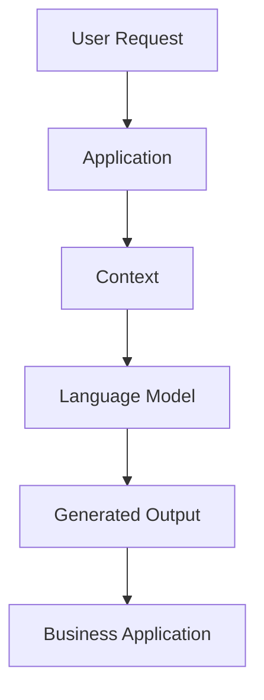

---

# 3. Language Modeling vs Text Classification

It is important to distinguish **language modeling** from traditional supervised NLP tasks.

### Text Classification

The model predicts a label:

```text
Customer Message
       │
       ▼
Classification Model
       │
       ▼
Complaint
```

### Language Modeling

The model predicts tokens:

```text
Customer opened the
       │
       ▼
Language Model
       │
       ▼
account
```

| Task | Model Output |
|---|---|
| Classification | Label |
| Sentiment Analysis | Sentiment |
| Spam Detection | Spam / Not Spam |
| Language Modeling | Token probabilities |
| Text Generation | Generated sequence |

Language modeling is therefore a **generative modeling objective**, while classification is typically a discriminative task.

---

# 4. Tokens and Language Modeling

Modern language models generally operate on **tokens**, not necessarily complete words.

For example:

```text
Enterprise AI Engineering
```

may become:

```text
["Enterprise", "AI", "Engineering"]
```

A tokenizer may also split words into subword tokens:

```text
unbelievable

↓

["un", "believ", "able"]
```

The exact representation depends on the tokenizer and vocabulary.

The language model operates on token IDs:

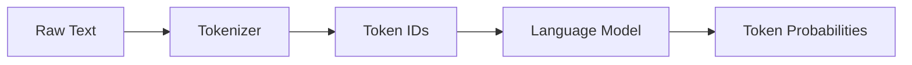

This is why **tokenization** is an important part of LLM engineering.

Detailed tokenization concepts are covered in the surrounding Foundation Model chapters.

---

# 5. Evolution of Language Models

Language modeling has evolved through several major generations.

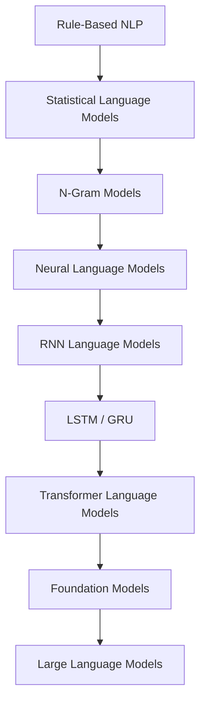

Each generation addressed limitations of the previous approach.

The major progression was:

```text
Fixed Statistical Context
        ↓
Learned Neural Representations
        ↓
Sequential Context Modeling
        ↓
Attention-Based Context Modeling
        ↓
Large-Scale Pretraining
        ↓
General-Purpose LLMs
```

---

# 6. Statistical Language Models

Early language models relied on statistical methods.

The basic idea was to estimate the probability of a word based on previously observed words.

For example:

```text
I am learning
```

could be modeled using:

```text
P(learning | I, am)
```

The model estimates these probabilities from observed training data.

However, storing and estimating probabilities for every possible sequence becomes increasingly difficult as the context grows.

This led to **N-Gram language models**.

---

# 7. N-Gram Language Models

An N-Gram model predicts a token based on a fixed number of previous tokens.

### Unigram

Uses no previous context:

```text
P(word)
```

### Bigram

Uses one previous word:

```text
P(word₂ | word₁)
```

Example:

```text
I → am
am → learning
learning → AI
```

### Trigram

Uses two previous words:

```text
P(word₃ | word₁, word₂)
```

Example:

```text
I am → learning
am learning → AI
```

The general formulation is:

$$
P(w_n \mid w_{n-N+1},\ldots,w_{n-1})
$$

---

# 8. N-Gram Example

Consider:

```text
The customer opened the account
```

A trigram model might use:

```text
The customer → opened

customer opened → the

opened the → account
```

The model therefore predicts the next token using a limited context window.

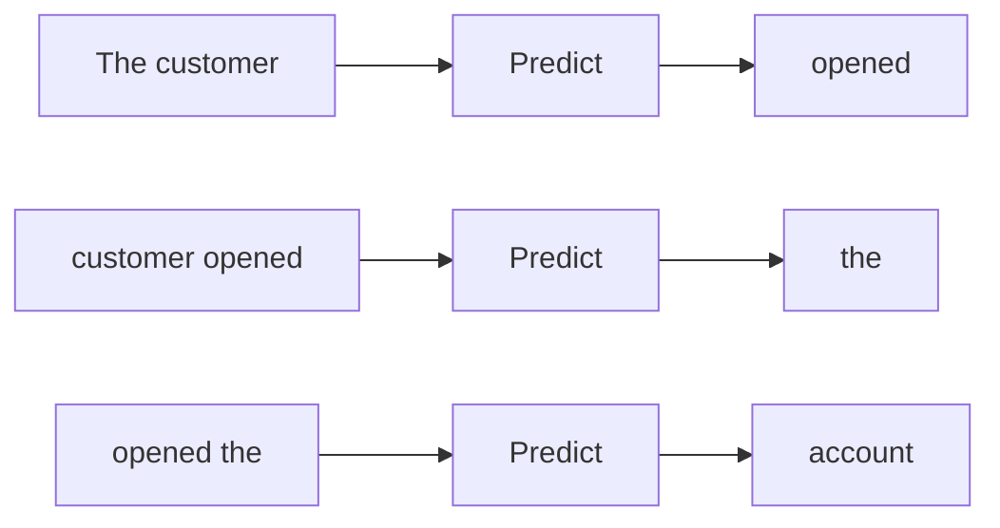

---

# 9. Limitations of N-Gram Models

N-Gram models were important historically, but they have significant limitations.

### Fixed Context

A trigram model only sees two previous tokens.

```text
Token₁ Token₂ → Token₃
```

It cannot naturally use very long context.

### Data Sparsity

Many valid word combinations may never appear in the training corpus.

### Vocabulary Growth

Large vocabularies require significant storage and computation.

### Limited Semantic Understanding

N-Gram models primarily learn statistical co-occurrence rather than rich semantic representations.

### Poor Long-Range Dependencies

Relationships between distant words are difficult to model.

These limitations motivated neural language models.

---

# 10. Neural Language Models

Neural language models replaced explicit probability tables with learned neural representations.

The simplified architecture is:

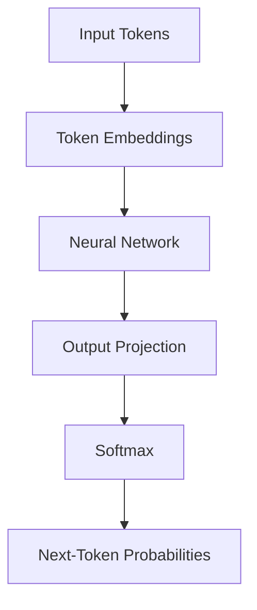

Instead of memorizing every possible sequence, the neural network learns reusable representations.

This allows the model to generalize across similar contexts.

---

# 11. Word Embeddings and Language Models

Neural language models rely on learned vector representations.

Instead of representing a token as:

```text
[0, 0, 0, 1, 0, 0, ...]
```

it can be represented as a dense vector:

```text
[0.21, -0.74, 0.35, 1.12, ...]
```

These representations allow models to learn relationships between tokens.

The progression is:

```text
One-Hot Encoding
        ↓
Bag-of-Words
        ↓
Word Embeddings
        ↓
Contextual Representations
        ↓
Transformer Representations
        ↓
LLMs
```

See:

**[03. Word Embeddings](03-word-embeddings.md)**

for a deeper discussion of word representations.

---

# 12. RNN Language Models

Recurrent Neural Networks introduced a mechanism for modeling sequential context.

An RNN maintains a hidden state as it processes a sequence.

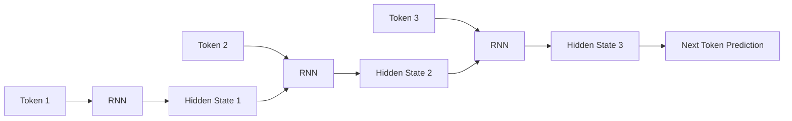

Conceptually:

$$
h_t = f(x_t,h_{t-1})
$$

where:

- \(x_t\) = current token representation
- \(h_{t-1}\) = previous hidden state
- \(h_t\) = current hidden state

The hidden state carries information from earlier tokens.

---

# 13. Limitations of RNNs

Although RNNs improved sequence modeling, they introduced important limitations.

### Sequential Computation

Tokens must be processed sequentially:

```text
Token 1
   ↓
Token 2
   ↓
Token 3
   ↓
Token 4
```

This reduces training parallelism.

### Long-Term Dependencies

Information from earlier tokens can become difficult to preserve.

### Gradient Problems

Traditional RNNs can suffer from:

- Vanishing gradients
- Exploding gradients

### Scaling

Sequential computation makes very large-scale training difficult.

These challenges motivated LSTM, GRU, and eventually Transformer architectures.

---

# 14. LSTM and GRU Language Models

LSTM and GRU architectures improved upon traditional RNNs.

They introduced mechanisms for controlling information flow.

Simplified architecture:

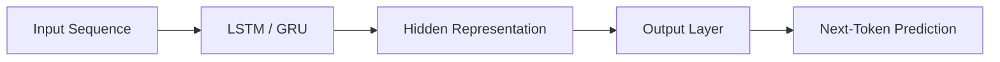

Advantages included:

- Better long-term dependency handling
- Improved gradient flow
- More effective sequence modeling

However, LSTM and GRU models still depended on sequential processing.

This remained a major scalability limitation.

---

# 15. Transformers and Language Modeling

Transformers changed language modeling fundamentally.

Instead of processing a sequence strictly one token at a time, Transformers use **Attention** to model relationships between tokens.

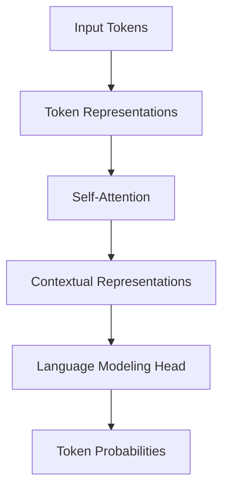

Transformers provide:

- Parallelizable training
- Better long-range dependency modeling
- Scalable architecture
- Strong contextual representations

The detailed mechanics of Self-Attention and Positional Encoding are covered in:

**[05. Attention and Positional Encoding](05-attention-and-positional-encoding.md)**

---

# 16. Next-Token Prediction

One of the most important ideas in modern LLMs is **next-token prediction**.

Consider:

```text
The customer opened the
```

The model produces a probability distribution:

```text
account       0.72
application   0.11
door          0.05
file          0.03
...
```

The model then selects a token according to the generation strategy.

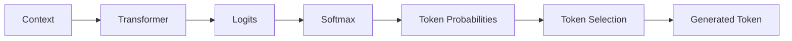

The generated token is appended to the context.

```text
The customer opened the
        ↓
The customer opened the account
        ↓
The customer opened the account yesterday
```

This process is repeated until generation stops.

---

# 17. Autoregressive Language Modeling

A language model is **autoregressive** when it predicts future tokens using previously generated tokens.

For:

```text
T₁ T₂ T₃ T₄
```

the model predicts:

```text
P(T₁)

P(T₂ | T₁)

P(T₃ | T₁,T₂)

P(T₄ | T₁,T₂,T₃)
```

This gives:

$$
P(T_1,T_2,\ldots,T_n)
=
\prod_{i=1}^{n}
P(T_i \mid T_1,\ldots,T_{i-1})
$$

Autoregressive modeling is the foundation of many decoder-only LLMs.

---

# 18. Causal Language Modeling

**Causal Language Modeling (CLM)** prevents the model from looking at future tokens while predicting the current token.

For:

```text
T1 T2 T3 T4
```

the visibility pattern is conceptually:

```text
T1 → T1

T2 → T1 T2

T3 → T1 T2 T3

T4 → T1 T2 T3 T4
```

This is implemented using a causal attention mask.

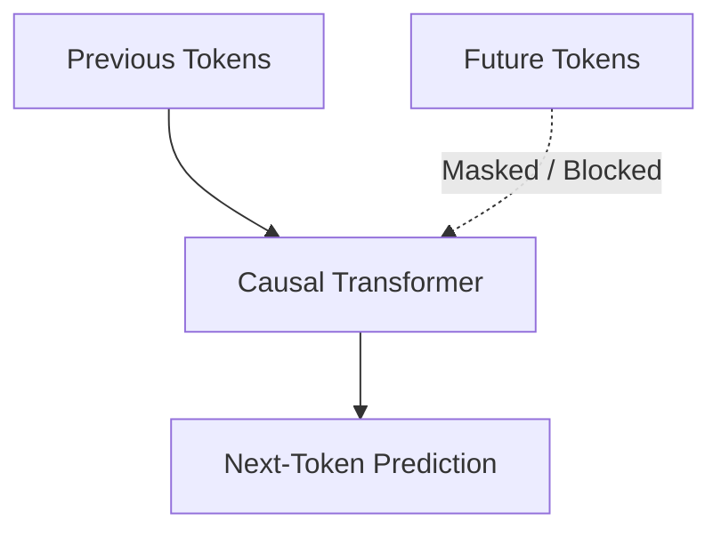

Causal language modeling is strongly associated with decoder-only architectures such as GPT-style models.

---

# 19. Masked Language Modeling

Not every language model predicts the next token.

**Masked Language Modeling (MLM)** hides selected tokens and asks the model to predict them.

Example:

```text
The customer opened the [MASK].
```

The model attempts to predict:

```text
account
```

Conceptually:

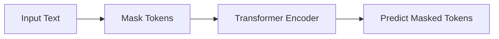

BERT is a well-known example of a model trained using a masked language modeling objective.

---

# 20. Causal LM vs Masked LM

| Characteristic | Causal Language Modeling | Masked Language Modeling |
|---|---|---|
| Objective | Predict next token | Predict masked token |
| Context | Previous tokens | Bidirectional context |
| Typical Architecture | Decoder-only | Encoder-style |
| Example | GPT-style models | BERT |
| Generation | Natural fit | Not primary objective |
| Typical Use | Text generation | Language understanding |

This distinction is important when understanding **GPT vs BERT**.

See:

**[06. GPT and BERT Architecture](06-gpt-and-bert-architecture.md)**

---

# 21. Language Model Training

A simplified training pipeline is:

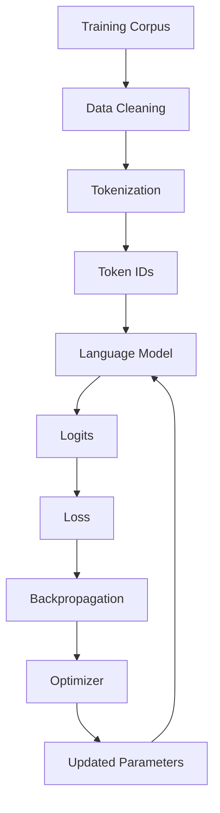

The model repeatedly performs this process over millions or billions of training examples.

---

# 22. Input and Target Sequences

For next-token prediction, training data can be shifted by one token.

Consider:

```text
The model generates useful responses
```

Training can use:

```text
Input:

The model generates useful

Target:

model generates useful responses
```

Conceptually:

```text
Input Tokens
T1 T2 T3 T4

       ↓

Model

       ↓

Predictions
T2 T3 T4 T5

       ↓

Compare With Targets
```

This simple shift creates many supervised training signals from raw text.

---

# 23. Cross-Entropy Loss

Language models commonly use **Cross-Entropy Loss** to measure the difference between predicted token probabilities and the correct target token.

For one target token:

$$
L=-\log P(y)
$$

where:

- \(y\) is the correct token
- \(P(y)\) is the probability assigned to the correct token

If the correct token receives a high probability:

```text
P(correct token) → high
Loss → low
```

If the correct token receives a low probability:

```text
P(correct token) → low
Loss → high
```

---

# 24. Training Loss Across a Sequence

For multiple tokens, the loss is aggregated across prediction positions.

```text
Token 1 → Loss₁
Token 2 → Loss₂
Token 3 → Loss₃
Token 4 → Loss₄

        ↓

Average Loss
```

The optimization loop is:

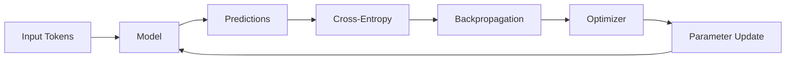

---

# 25. Teacher Forcing

During training, the model can use the correct previous tokens rather than its own generated predictions.

Example:

```text
Input:

The customer opened the

Target:

account
```

Next training position:

```text
Input:

The customer opened the account

Target:

yesterday
```

This approach is commonly known as **teacher forcing**.

It enables efficient training because the complete target sequence is already available.

---

# 26. Training vs Autoregressive Inference

One of the most important production concepts is the difference between training and inference.

### Training

During training, multiple token positions can often be processed in parallel.

```text
T1 T2 T3 T4 T5
│  │  │  │  │
└──┴──┴──┴──┘
   Parallel
```

### Autoregressive Inference

Generation occurs sequentially:

```text
Prompt
  ↓
Token 1
  ↓
Token 2
  ↓
Token 3
  ↓
Token 4
```

Therefore, a model can have highly parallelizable training but sequential generation.

This distinction has major implications for:

- Latency
- Throughput
- GPU utilization
- Cost
- Scaling

---

# 27. Logits and Softmax

The language model does not directly output a word.

It produces **logits** for every token in the vocabulary.

Example:

```text
Vocabulary

["the", "account", "customer", "opened", ...]
```

The model produces:

```text
Logits

[1.2, 4.8, 0.7, 2.1, ...]
```

These logits can be converted into probabilities using Softmax.

$$
P_i =
\frac{e^{z_i}}
{\sum_j e^{z_j}}
$$

where:

- \(z_i\) = logit for token \(i\)
- \(P_i\) = probability of token \(i\)

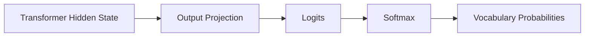

---

# 28. Vocabulary Projection

Suppose:

```text
Hidden Dimension = d

Vocabulary Size = V
```

The output projection maps:

```text
[d]

↓

[V]
```

Conceptually:

```text
Transformer Representation
          │
          ▼
   Output Projection
          │
          ▼
      V Logits
          │
          ▼
     Token Probabilities
```

This allows the model to score every possible next token.

---

# 29. Perplexity

**Perplexity** is a commonly used metric for evaluating language models.

For an average natural-log cross-entropy loss:

$$
Perplexity=e^{Loss}
$$

Lower perplexity generally indicates that the model assigns higher probability to the observed evaluation tokens.

Conceptually:

```text
Lower Loss
    ↓
Higher Probability Assigned to Targets
    ↓
Lower Perplexity
```

However, perplexity does not fully capture the quality of a modern LLM.

---

# 30. Why Perplexity Is Not Enough

An LLM can have good perplexity and still produce:

- Hallucinations
- Incorrect facts
- Biased outputs
- Unsafe responses
- Poor instruction following
- Poor enterprise relevance

Therefore, modern LLM evaluation should include:

```text
Language Modeling Metrics
        +
Task Metrics
        +
Human Evaluation
        +
Safety Evaluation
        +
Production Evaluation
```

See:

**[16. LLM Evaluation](16-llm-evaluation.md)**

for deeper coverage.

---

# 31. Pretraining

**Pretraining** is the process of training a model on a large and diverse dataset before adapting it to downstream tasks.

A simplified pipeline:

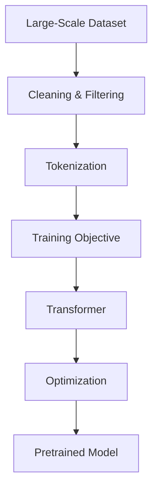

The resulting model learns broad statistical and semantic patterns.

---

# 32. Pretraining vs Fine-Tuning

### Pretraining

```text
Large General Dataset
        ↓
Pretraining
        ↓
Foundation Model
```

Goal:

> Learn broad patterns and representations.

### Fine-Tuning

```text
Pretrained Model
        +
Domain / Task Dataset
        ↓
Fine-Tuning
        ↓
Specialized Model
```

Goal:

> Adapt the model to a specific task, behavior, or domain.

This distinction becomes critical when designing enterprise AI systems.

---

# 33. From Language Modeling to Foundation Models

The evolution toward modern LLMs can be summarized as:

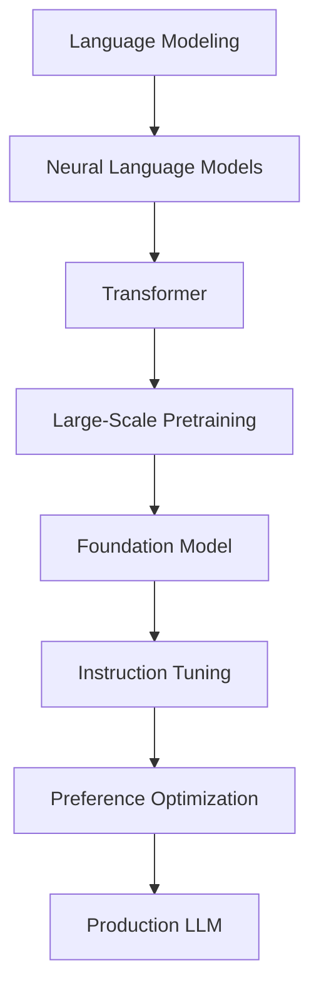

The language-modeling objective remains a fundamental building block even as modern training pipelines become more sophisticated.

---

# 34. Decoder-Only LLMs

Many modern generative LLMs use **decoder-only Transformer architectures**.

The inference pipeline looks like:

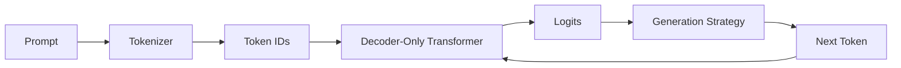

The generated token is appended to the sequence and the process repeats.

This is the foundation of autoregressive text generation.

---

# 35. Language Modeling and Code Generation

Language modeling is not restricted to natural language.

Source code can also be represented as a sequence of tokens.

For example:

```java
public class Customer {

    private String
```

The model can predict:

```text
name;
```

The same next-token prediction principle applies.

```text
Code Context
     ↓
Tokenization
     ↓
Language Model
     ↓
Next Code Token
     ↓
Generated Code
```

This enables:

- Code Completion
- Code Generation
- Unit Test Generation
- Documentation
- Refactoring
- Code Explanation

---

# 36. Production Language Modeling Architecture

A production LLM application is more than a language model.

A simplified enterprise architecture can look like:

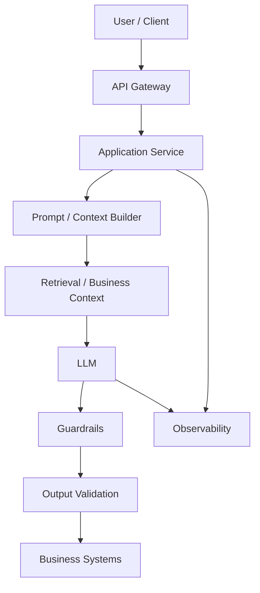

This architecture introduces concerns that are not present in a standalone language model.

---

# 37. Production Considerations

## Data

Production training pipelines must consider:

- Data quality
- Deduplication
- Data filtering
- Domain coverage
- Privacy
- Licensing
- Sensitive information

## Training

Important considerations include:

- GPU capacity
- Distributed training
- Mixed precision
- Gradient accumulation
- Checkpointing
- Experiment tracking

## Inference

Important considerations include:

- Latency
- Throughput
- Context length
- KV caching
- Batching
- Quantization
- GPU memory

## Application

Production applications must additionally consider:

- Prompt construction
- Context management
- Guardrails
- Validation
- Security
- Observability
- Cost

---

# 38. Language Model Training Lifecycle

A production-oriented lifecycle can be represented as:

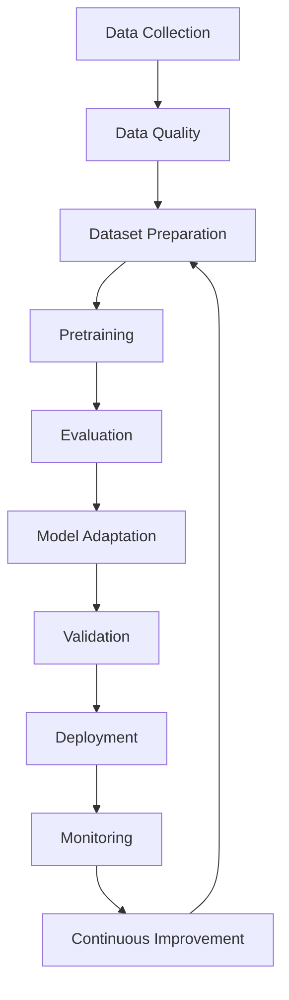

This lifecycle connects language modeling with broader **MLOps and AI Engineering** practices.

---

# 39. Practical Python Example: Next-Token Prediction

A simplified Hugging Face example:

```python
from transformers import AutoTokenizer, AutoModelForCausalLM

model_name = "gpt2"

tokenizer = AutoTokenizer.from_pretrained(model_name)
model = AutoModelForCausalLM.from_pretrained(model_name)

prompt = "Enterprise AI systems are"

inputs = tokenizer(
    prompt,
    return_tensors="pt"
)

outputs = model.generate(
    **inputs,
    max_new_tokens=30
)

generated_text = tokenizer.decode(
    outputs[0],
    skip_special_tokens=True
)

print(generated_text)
```

The important conceptual flow is:

```text
Prompt
  ↓
Tokenizer
  ↓
Token IDs
  ↓
Causal Language Model
  ↓
Logits
  ↓
Generation
  ↓
Generated Text
```

The next chapter will explain the Transformer mechanisms that make this possible.

---

# 40. Common Language Modeling Challenges

## 40.1 Data Quality

Poor training data can produce poor model behavior.

## 40.2 Hallucination

The model may generate plausible but factually incorrect information.

## 40.3 Long Context

Longer context increases computational and memory requirements.

## 40.4 Inference Latency

Autoregressive generation requires repeated token prediction.

## 40.5 Computational Cost

Large language models require significant hardware resources.

## 40.6 Bias

Training data may contain undesirable biases.

## 40.7 Domain Adaptation

General-purpose models may not perform optimally on specialized enterprise terminology.

## 40.8 Evaluation

Traditional language-model metrics do not fully represent real-world usefulness.

---

# 41. Best Practices

For production-oriented language modeling:

- Treat data quality as a first-class engineering concern.
- Understand the training objective before selecting an architecture.
- Choose causal or masked modeling based on the intended task.
- Track training and validation loss.
- Evaluate on representative datasets.
- Do not rely exclusively on perplexity.
- Separate model capability from application business logic.
- Consider inference latency early in architecture design.
- Monitor token usage and inference cost.
- Validate generated outputs.
- Apply security and responsible AI controls.
- Design observability into the system from the beginning.
- Consider domain-specific adaptation when necessary.

---

# 42. Common Mistakes

### Mistake 1: Thinking Language Models Memorize Sentences

A language model learns statistical patterns and representations from training data.

It should not be conceptualized simply as a database of sentences.

---

### Mistake 2: Confusing Language Modeling with Classification

Classification:

```text
Input
 ↓
Label
```

Language modeling:

```text
Context
 ↓
Token Probability Distribution
```

---

### Mistake 3: Assuming Every Language Model Is Generative

Some language models are optimized primarily for language understanding.

For example:

```text
BERT
 ↓
Masked Language Modeling
```

while GPT-style decoder-only models are naturally suited to autoregressive generation.

---

### Mistake 4: Confusing Training and Generation

Training can process many positions in parallel.

Generation is typically autoregressive:

```text
Token
 ↓
Next Token
 ↓
Next Token
 ↓
Next Token
```

---

### Mistake 5: Treating Perplexity as Complete LLM Evaluation

Perplexity evaluates a particular aspect of language modeling.

It does not directly measure:

- Factuality
- Helpfulness
- Safety
- Instruction following
- Business relevance

---

# 43. Interview Questions

## Beginner

1. What is a language model?
2. What is language modeling?
3. What is next-token prediction?
4. What is an N-Gram model?
5. What is an autoregressive language model?
6. What is a token?
7. Why are language models important for Generative AI?

## Intermediate

1. N-Gram vs neural language models?
2. Why were neural language models introduced?
3. Why did RNNs become popular for NLP?
4. What limitations do RNNs have?
5. Why were LSTM and GRU introduced?
6. Why did Transformers replace RNNs for large-scale language modeling?
7. What is Causal Language Modeling?
8. What is Masked Language Modeling?
9. Causal LM vs Masked LM?
10. What is Cross-Entropy Loss?
11. What is Perplexity?
12. What are logits?

## Advanced

1. Explain the complete training lifecycle of an autoregressive language model.
2. Why does next-token prediction produce useful language representations?
3. How does causal masking prevent information leakage?
4. Why can Transformers be trained more efficiently than RNNs?
5. Why is autoregressive inference sequential?
6. What are the production implications of autoregressive generation?
7. Why is perplexity insufficient for evaluating modern LLMs?
8. How would you design a language-model training pipeline for an enterprise domain?
9. How would you optimize LLM inference latency?
10. What is the difference between pretraining and fine-tuning?
11. How does language modeling form the foundation of modern LLMs?
12. How would you choose between a decoder-only and encoder-style architecture?

---

# 44. 🚀 Quick Revision Sheet

## What Is Language Modeling?

```text
Language Modeling

↓

Learn Probability of Token Sequences

↓

Predict Tokens From Context
```

---

## Evolution

```text
N-Gram
   ↓
Neural Language Model
   ↓
RNN
   ↓
LSTM / GRU
   ↓
Transformer
   ↓
Foundation Model
   ↓
LLM
```

---

## Autoregressive Generation

```text
Prompt
  ↓
Predict Token
  ↓
Append Token
  ↓
Predict Next Token
  ↓
Repeat
```

---

## Causal LM

```text
Previous Context
      ↓
Causal Transformer
      ↓
Next Token
```

Future tokens are blocked.

---

## Masked LM

```text
Sentence
   ↓
Mask Token
   ↓
Predict Missing Token
```

---

## Training

```text
Dataset
   ↓
Tokenization
   ↓
Model
   ↓
Logits
   ↓
Cross-Entropy
   ↓
Backpropagation
   ↓
Parameter Update
```

---

## Inference

```text
Prompt
   ↓
Tokenizer
   ↓
Transformer
   ↓
Logits
   ↓
Generation Strategy
   ↓
Next Token
   ↓
Repeat
```

---

## Evaluation

Important metrics and dimensions:

- Training Loss
- Validation Loss
- Perplexity
- Task Accuracy
- Factuality
- Human Evaluation
- Safety
- Instruction Following

---

# 45. Key Takeaways

- **Language Modeling** is the task of learning the probability structure of language.
- Modern generative LLMs commonly use **next-token prediction**.
- Language models operate on tokens rather than necessarily complete words.
- **N-Gram models** were early statistical approaches to language modeling.
- Neural language models introduced learned representations and improved generalization.
- **RNNs, LSTMs, and GRUs** improved sequential language modeling but remained limited by sequential computation.
- **Transformers** introduced attention-based sequence modeling and enabled highly scalable language-model training.
- **Autoregressive language models** predict future tokens from previous context.
- **Causal Language Modeling** prevents decoder-only models from accessing future tokens.
- **Masked Language Modeling** predicts intentionally hidden tokens and is commonly associated with encoder-style models such as BERT.
- **Cross-Entropy Loss** is a standard training objective for token prediction.
- **Perplexity** measures how well a language model predicts evaluation text but is not a complete measure of LLM quality.
- Training and inference have fundamentally different computational characteristics.
- Modern decoder-only LLMs repeatedly generate one token at a time during autoregressive inference.
- Pretraining teaches broad language patterns, while fine-tuning and other adaptation techniques specialize model behavior.
- Language modeling is the conceptual foundation of modern **Foundation Models and Large Language Models**.
- Production LLM systems require additional engineering around context, evaluation, safety, monitoring, infrastructure, latency, and cost.

---

# 46. Chapter Navigation

### Previous

**[03. Word Embeddings](03-word-embeddings.md)**

### Next

**[05. Attention and Positional Encoding](05-attention-and-positional-encoding.md)**

### Related

**[06. GPT and BERT Architecture](06-gpt-and-bert-architecture.md)**

---

# References

- Vaswani et al. — *Attention Is All You Need*
- Devlin et al. — *BERT: Pre-training of Deep Bidirectional Transformers for Language Understanding*
- Radford et al. — *Improving Language Understanding by Generative Pre-Training*
- Jurafsky & Martin — *Speech and Language Processing*
- Goodfellow, Bengio & Courville — *Deep Learning*
- Hugging Face Transformers Documentation
- PyTorch Documentation
- TensorFlow / Keras Documentation

---

> **Enterprise AI Engineering Handbook**  
> *Building Production-Grade Enterprise AI Systems — One Chapter at a Time.*