# Attention and Positional Encoding

> A practical engineering guide to **Attention Mechanisms and Positional Encoding**, covering the motivation for attention, Query-Key-Value (QKV) representations, scaled dot-product attention, self-attention, masking, multi-head attention, positional encoding, cross-attention, and their role in modern Transformer-based Large Language Models (LLMs).

---

## 🎯 Learning Objectives

After completing this chapter, you will be able to:

- Understand why Attention was introduced for sequence modeling
- Understand the limitations of RNN-based sequence processing
- Explain why Transformers require positional information
- Understand token embeddings and positional representations
- Explain Query, Key, and Value (QKV)
- Understand Self-Attention
- Understand Scaled Dot-Product Attention
- Explain attention scores and attention weights
- Understand why attention scores are scaled
- Explain causal attention masking
- Understand Multi-Head Attention
- Differentiate Self-Attention and Cross-Attention
- Understand the relationship between Attention and Positional Encoding
- Understand attention complexity and long-context challenges
- Understand the role of KV caching during autoregressive inference
- Connect Attention to GPT, BERT, and modern LLM architectures

---

# 1. Overview

Attention is one of the most important mechanisms in modern Deep Learning.

It is the core operation that enabled the Transformer architecture to move beyond the sequential limitations of traditional recurrent models.

Before Transformers, NLP systems commonly relied on:

- RNNs
- LSTMs
- GRUs

These models processed sequences sequentially.

Attention introduced a different approach.

Instead of forcing the model to compress the entire sequence into a single evolving hidden state, Attention allows a token to dynamically determine which other tokens are relevant.

A simplified view is:

```text
Input Sequence
      ↓
Attention
      ↓
Relevant Context
      ↓
Contextual Representation
```

This mechanism became the foundation for:

- BERT
- GPT
- T5
- BART
- Llama
- Mistral
- Gemma
- Modern Foundation Models
- Large Language Models

---

# 2. Why Attention?

Consider:

```text
The customer contacted the bank because it was closed.
```

When processing:

```text
"it"
```

the model needs contextual information from the surrounding sequence.

Attention allows the model to assign different importance to different tokens.

Conceptually:

```text
The        → Low Attention
customer   → Low Attention
contacted  → Low Attention
the        → Low Attention
bank       → High Attention
because    → Low Attention
it         → Current Token
was        → Context
closed     → Context
```

The exact attention weights are learned by the model.

The important idea is:

> **Attention allows each token to dynamically focus on the most relevant parts of the input sequence.**

---

# 3. From RNNs to Attention

Traditional recurrent models process sequences step by step.

```text
Token₁
  ↓
RNN
  ↓
Hidden State₁
  ↓
Token₂
  ↓
RNN
  ↓
Hidden State₂
  ↓
Token₃
  ↓
RNN
  ↓
Hidden State₃
```

This creates sequential dependencies.

For a long sequence:

```text
Token₁ → Token₂ → Token₃ → ... → Tokenₙ
```

information from early tokens may become increasingly difficult to preserve.

Attention changes this interaction pattern.

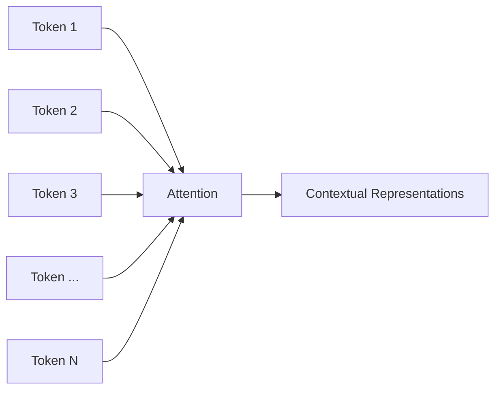

Instead of only passing information from one hidden state to the next, tokens can directly interact through attention.

---

# 4. Attention and Long-Range Dependencies

Consider:

```text
The company that acquired the startup last year
announced that it will expand internationally.
```

To understand:

```text
"it"
```

the model needs to connect it with the relevant entity earlier in the sentence.

Attention provides a direct mechanism for such relationships.

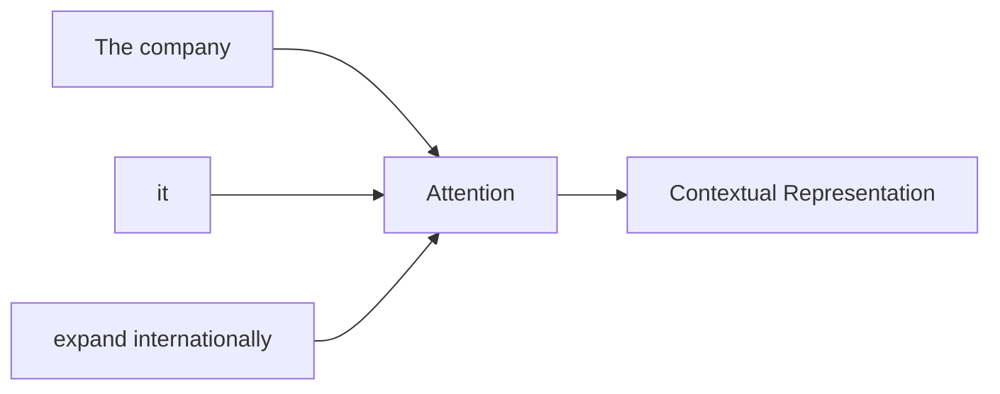

The important property is that the relationship does not have to pass through a long chain of recurrent hidden states.

---

# 5. Why Positional Encoding Is Required

Transformers process tokens in parallel during training.

Unlike an RNN, the Transformer does not inherently process:

```text
Token 1
   ↓
Token 2
   ↓
Token 3
```

as a sequential computation.

Therefore, the model needs explicit positional information.

Consider:

```text
Dog bites man
```

and:

```text
Man bites dog
```

Both contain the same words, but their meanings are different.

The model therefore needs to know not only:

```text
What token is this?
```

but also:

```text
Where does this token occur?
```

Conceptually:

```text
Token Embedding
       +
Position Information
       ↓
Position-Aware Representation
```

---

# 6. Token Embedding + Positional Information

The Transformer input can be represented conceptually as:

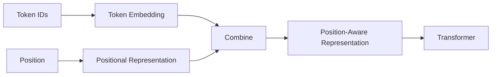

For the original Transformer formulation:

```text
Token Embedding
       +
Positional Encoding
       ↓
Transformer Input
```

This allows the model to distinguish:

```text
Token at position 1
```

from:

```text
Token at position 5
```

---

# 7. Positional Encoding

The original Transformer introduced **sinusoidal positional encoding**.

The idea is to represent each position using sine and cosine functions with different frequencies.

For even dimensions:

$$
PE(pos,2i)
=
\sin
\left(
\frac{pos}{10000^{\frac{2i}{d_{model}}}}
\right)
$$

For odd dimensions:

$$
PE(pos,2i+1)
=
\cos
\left(
\frac{pos}{10000^{\frac{2i}{d_{model}}}}
\right)
$$

Where:

- \(pos\) = token position
- \(i\) = embedding dimension index
- \(d_{model}\) = model embedding dimension

The resulting positional vector is combined with the token embedding.

$$
X = E + PE
$$

Where:

- \(E\) = token embedding
- \(PE\) = positional encoding
- \(X\) = position-aware representation

---

# 8. Why Sine and Cosine?

Different dimensions use different frequencies.

Conceptually:

```text
Dimension 1
   ↓
Slow Positional Signal

Dimension 2
   ↓
Different Frequency

Dimension 3
   ↓
Another Frequency

...

Dimension N
   ↓
Another Frequency
```

Together they produce a positional pattern.

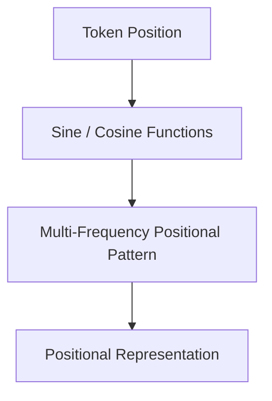

This provides the model with information about token order.

---

# 9. Modern Positional Representations

The original Transformer used sinusoidal positional encoding.

Modern Transformer architectures use several different approaches.

Common approaches include:

- Learned Positional Embeddings
- Sinusoidal Positional Encoding
- Relative Position Representations
- Rotary Position Embeddings (RoPE)

The high-level distinction is:

```text
Original Transformer
        ↓
Sinusoidal Positional Encoding
```

```text
Modern Transformers
        ↓
Multiple Position Representation Strategies
```

The specific mechanism depends on the model architecture.

---

# 10. Rotary Position Embeddings (RoPE)

Modern decoder-only LLMs frequently use **Rotary Position Embeddings (RoPE)**.

Instead of simply adding a positional vector to the token embedding, RoPE incorporates position information into representations used by the attention mechanism.

Conceptually:

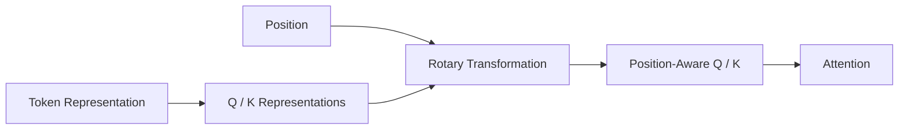

The important idea is:

```text
Token Representation
        +
Position
        ↓
Position-Aware Attention Representation
```

RoPE is especially important when studying modern decoder-only LLM architectures.

---

# 11. Attention Architecture

Attention uses three learned representations:

- Query
- Key
- Value

These are commonly referred to as **QKV**.

The basic process is:

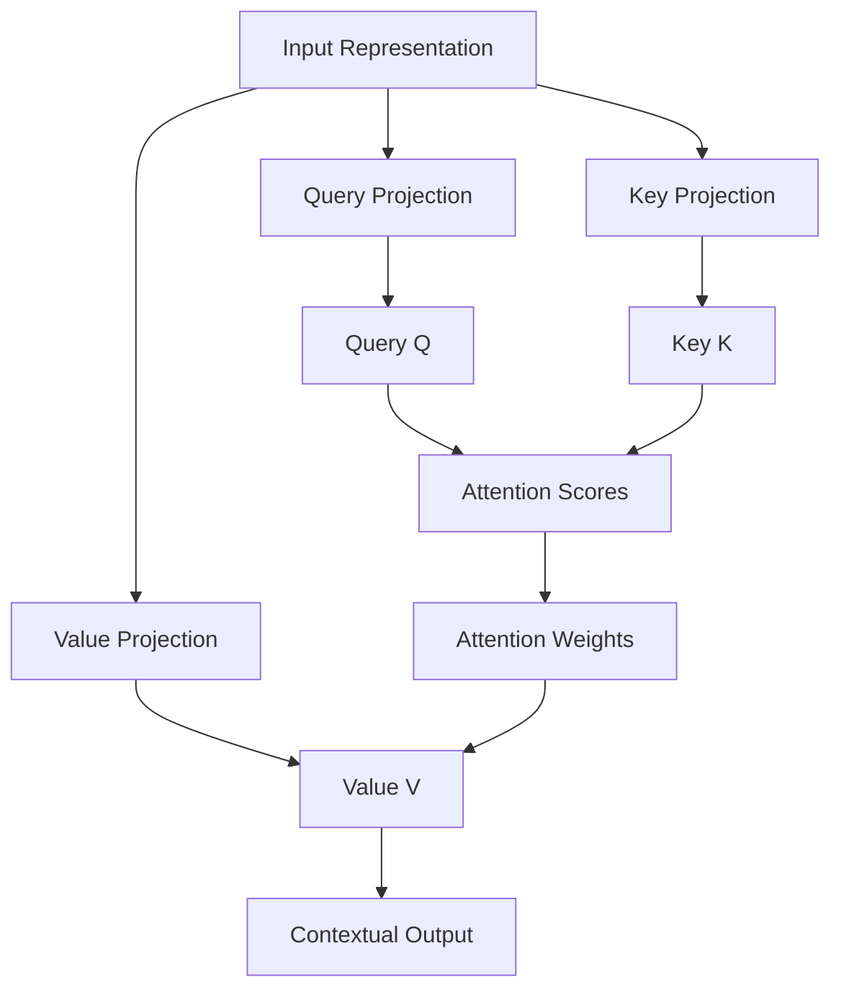

---

# 12. Query, Key, and Value

## Query

The Query represents what the current token is looking for.

```text
Query
 ↓
"What information am I looking for?"
```

---

## Key

The Key represents what information each token can be matched against.

```text
Key
 ↓
"What kind of information do I contain?"
```

---

## Value

The Value contains the information that will ultimately be aggregated.

```text
Value
 ↓
"What information should be passed forward?"
```

A useful analogy is a database lookup:

```text
Query
 ↓
Search Criteria

Key
 ↓
Matching Information

Value
 ↓
Retrieved Information
```

---

# 13. Creating Q, K, and V

Given an input representation \(X\), the model creates Q, K, and V using learned projection matrices.

$$
Q = XW_Q
$$

$$
K = XW_K
$$

$$
V = XW_V
$$

Where:

- \(X\) = input representation
- \(W_Q\) = Query projection matrix
- \(W_K\) = Key projection matrix
- \(W_V\) = Value projection matrix

These matrices are learned during training.

---

# 14. Self-Attention

**Self-Attention** means that Query, Key, and Value representations originate from the same input sequence.

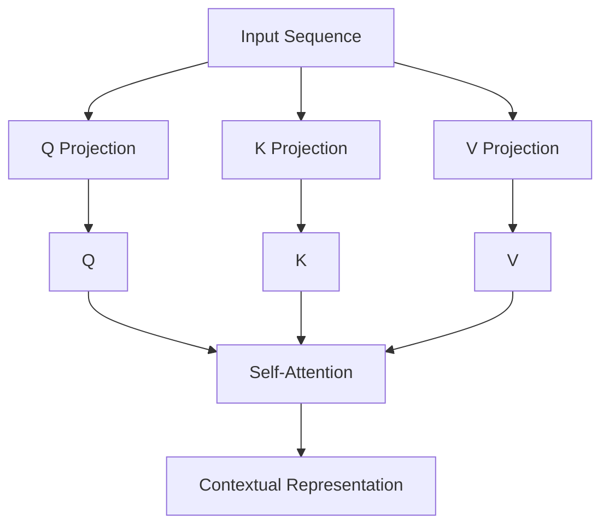

This allows every token to consider information from other tokens in the sequence.

---

# 15. Attention Scores

The first step is to determine how strongly each Query matches each Key.

The standard similarity calculation uses a dot product.

$$
Score(Q,K) = QK^T
$$

For example, a Query can compare itself against multiple Keys:

```text
Query₁ · Key₁
Query₁ · Key₂
Query₁ · Key₃
Query₁ · Key₄
```

This produces attention scores.

Conceptually:

```text
Query
  ↓
Compare with all Keys
  ↓
Similarity Scores
```

---

# 16. Scaled Dot-Product Attention

Raw dot-product scores can become large as the dimensionality of the Key vectors increases.

Therefore, the scores are scaled before applying Softmax.

The complete mechanism is:

$$
Attention(Q,K,V)
=
softmax
\left(
\frac{QK^T}{\sqrt{d_k}}
\right)V
$$

The process is:

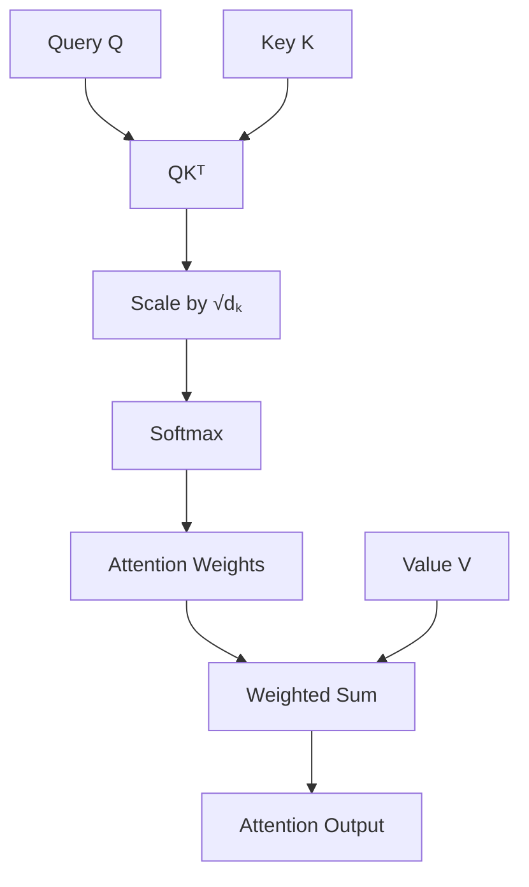

---

# 17. Why Scale by √dₖ?

As \(d_k\) increases, the dot-product values can become large.

Large values entering Softmax can make the resulting distribution excessively concentrated.

This can make optimization more difficult.

Scaling by:

$$
\sqrt{d_k}
$$

helps keep the attention scores in a more suitable numerical range.

Conceptually:

```text
QKᵀ
 ↓
Large Scores
 ↓
Divide by √dₖ
 ↓
Better Numerical Range
 ↓
Softmax
 ↓
Attention Weights
```

---

# 18. Softmax and Attention Weights

Softmax converts attention scores into normalized weights.

For example:

```text
Attention Scores

[2.0, 1.0, 0.5]

        ↓

Softmax

[0.63, 0.23, 0.14]
```

The numbers above are illustrative.

The resulting weights:

- Are positive
- Sum to 1
- Represent relative attention importance

Conceptually:

```text
Token A → 0.10
Token B → 0.60
Token C → 0.20
Token D → 0.10
```

The model places more weight on Token B.

---

# 19. Weighted Sum of Values

The attention weights are applied to the Value vectors.

Conceptually:

```text
V₁ × Weight₁
       +
V₂ × Weight₂
       +
V₃ × Weight₃
       +
V₄ × Weight₄
       ↓
Contextual Representation
```

Mathematically:

$$
Output
=
\sum_i AttentionWeight_i \cdot V_i
$$

This weighted aggregation produces the output representation for the Query.

---

# 20. Complete Self-Attention Pipeline

The complete mechanism is:

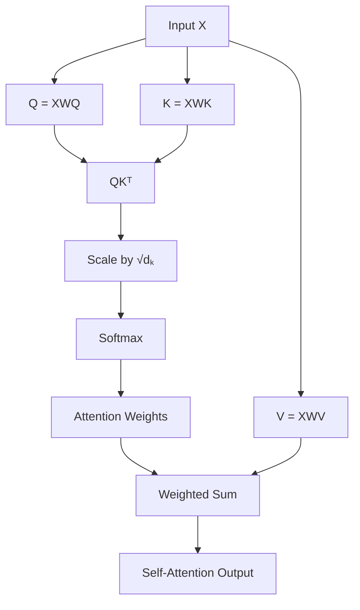

The key formula is:

$$
Attention(Q,K,V)
=
softmax
\left(
\frac{QK^T}{\sqrt{d_k}}
\right)V
$$

---

# 21. Attention Matrix

For a sequence containing multiple tokens, attention produces an attention matrix.

For:

```text
T1 T2 T3 T4
```

the conceptual matrix is:

```text
          Key

        T1    T2    T3    T4

Query
T1      .     .     .     .

T2      .     .     .     .

T3      .     .     .     .

T4      .     .     .     .
```

Each row represents a Query.

Each column represents a Key.

The values represent the attention weights between them.

For example:

```text
          T1    T2    T3    T4

T1       0.50  0.20  0.20  0.10
T2       0.10  0.60  0.20  0.10
T3       0.05  0.15  0.70  0.10
T4       0.10  0.20  0.20  0.50
```

These values are illustrative.

---

# 22. Attention Matrix Visualization

For learning purposes, think of the attention matrix as:

```text
Query ↓

        Key →

       T1   T2   T3   T4
T1     ▓    ░    ░    ░
T2     ░    ▓    ░    ░
T3     ░    ░    ▓    ░
T4     ░    ░    ░    ▓
```

Darker cells conceptually represent stronger attention.

Actual attention matrices in real models can contain complex patterns.

---

# 23. Causal Attention Masking

Attention can be modified using masks.

This is particularly important for decoder-only models such as GPT.

During autoregressive generation, a token must not use future tokens.

For:

```text
T1 T2 T3 T4
```

the causal attention pattern is:

```text
        T1   T2   T3   T4

T1      ✓    ✗    ✗    ✗
T2      ✓    ✓    ✗    ✗
T3      ✓    ✓    ✓    ✗
T4      ✓    ✓    ✓    ✓
```

This creates a lower-triangular attention pattern.

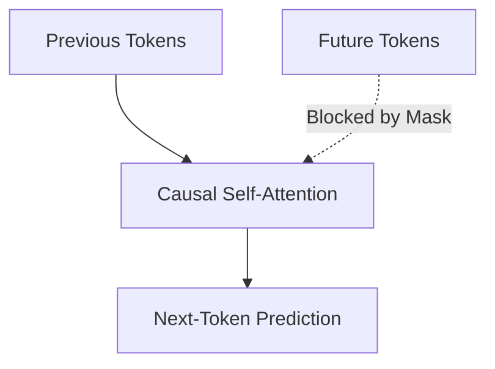

---

# 24. Why Causal Masking Matters

Without causal masking, a model predicting:

```text
The customer placed an [MASK]
```

could potentially use information from the future target token during training.

That would create information leakage.

Causal masking enforces:

```text
Current Token
      ↓
Can attend to
      ↓
Current + Previous Tokens
```

but not:

```text
Future Tokens
```

This is fundamental to autoregressive language modeling.

---

# 25. Encoder vs Decoder Attention

## Encoder Self-Attention

Encoder models such as BERT can generally use information from both directions.

```text
T1 ↔ T2 ↔ T3 ↔ T4
```

---

## Decoder Self-Attention

Decoder-only models such as GPT use causal masking.

```text
T1
 ↓
T1 T2
 ↓
T1 T2 T3
 ↓
T1 T2 T3 T4
```

This distinction is critical when understanding:

- BERT
- GPT
- Encoder–Decoder Transformers
- LLM pretraining

---

# 26. Multi-Head Attention

A single attention operation learns one set of relationships.

**Multi-Head Attention** performs multiple attention operations in parallel.

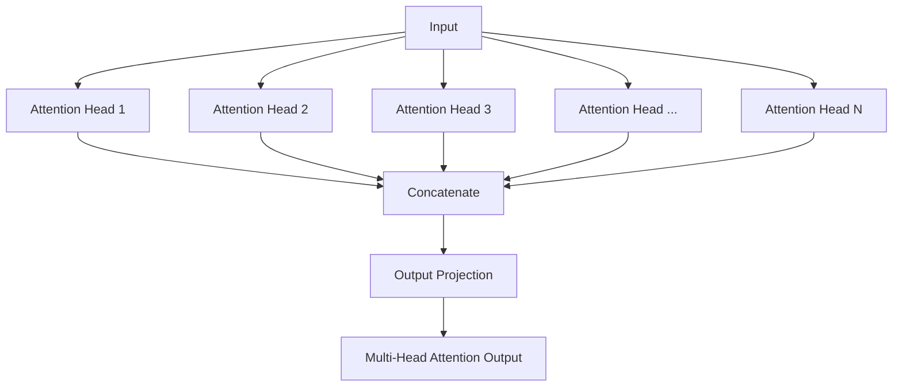

Each head has its own learned projections.

---

# 27. Why Multiple Attention Heads?

Different attention heads can learn different relationships.

Conceptually:

```text
Head 1 → Syntax Relationships
Head 2 → Semantic Relationships
Head 3 → Long-Range Dependencies
Head 4 → Entity Relationships
```

These interpretations are conceptual rather than guaranteed explanations of individual heads.

The important idea is:

> **Multiple attention heads allow the model to learn multiple relationship patterns in parallel.**

---

# 28. Multi-Head Attention Formula

For each attention head:

$$
head_i
=
Attention(Q_i,K_i,V_i)
$$

The outputs are concatenated:

$$
MultiHead(Q,K,V)
=
Concat(head_1,\ldots,head_h)W_O
$$

Where:

- \(h\) = number of attention heads
- \(W_O\) = output projection matrix

The process is:

```text
Input
 ↓
Q / K / V Projections
 ↓
Multiple Attention Heads
 ↓
Scaled Dot-Product Attention
 ↓
Concatenate
 ↓
Output Projection
 ↓
Multi-Head Attention Output
```

---

# 29. Self-Attention vs Cross-Attention

## Self-Attention

Q, K, and V originate from the same sequence.

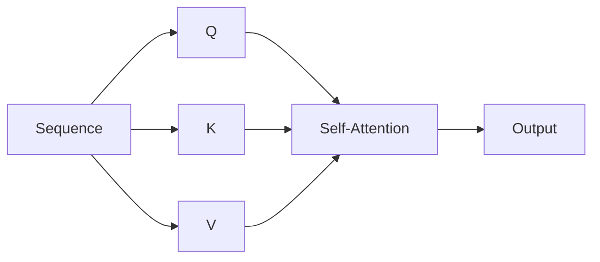

---

## Cross-Attention

Queries come from one sequence while Keys and Values come from another sequence.

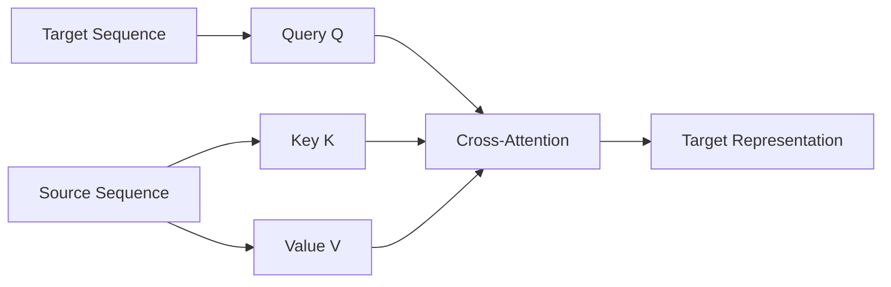

This is important in Encoder–Decoder architectures.

---

# 30. Example of Cross-Attention

Consider machine translation:

```text
French Input
     ↓
  Encoder
     ↓
K + V

English Decoder
     ↓
Q

     ↓
Cross-Attention
```

The Decoder can use relevant information from the encoded source sequence while generating the target sequence.

A simplified architecture is:

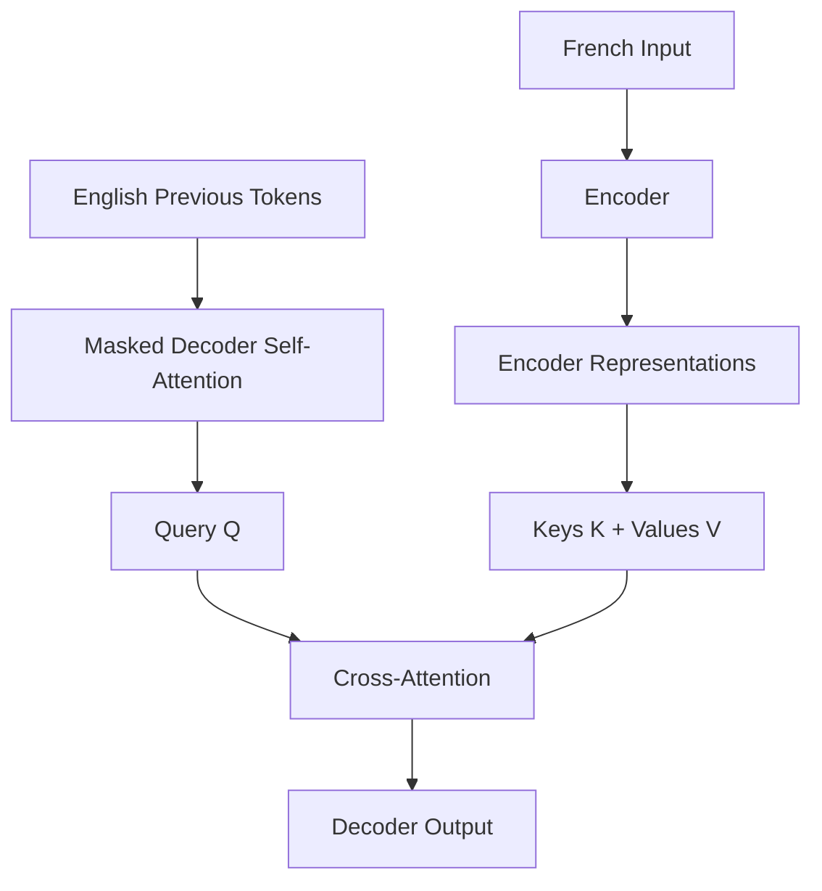

---

# 31. Attention + Positional Encoding

Attention and positional encoding solve different problems.

```text
Positional Encoding
        ↓
"Where is the token?"
```

```text
Attention
        ↓
"What other tokens are relevant?"
```

Together:

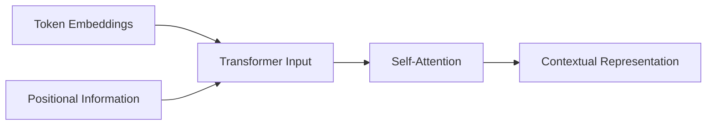

This is one of the most important concepts to remember.

---

# 32. Complete Transformer Input Flow

A simplified Transformer input pipeline is:

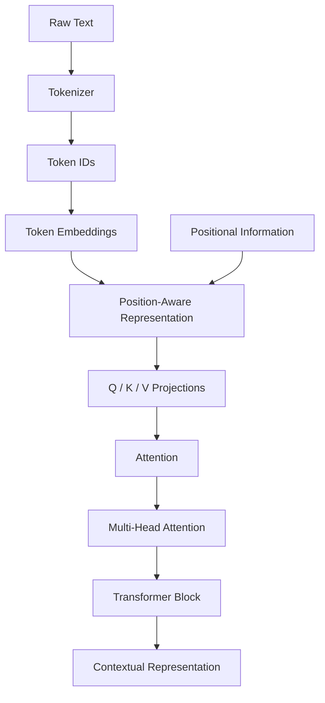

This creates the bridge:

```text
Tokenization
      ↓
Embeddings
      ↓
Position
      ↓
Attention
      ↓
Transformer
      ↓
BERT / GPT / LLM
```

---

# 33. Attention Complexity

Self-Attention creates pairwise interactions between tokens.

For a sequence length of \(n\), the attention matrix has approximately:

$$
O(n^2)
$$

relationships.

Conceptually:

```text
Sequence Length
       ↓
Attention Matrix
       ↓
n × n Relationships
```

Therefore:

```text
2× Context
   ↓
Approximately 4× Pairwise Attention Relationships
```

This quadratic behavior becomes important for long-context models.

---

# 34. Long-Context Challenges

Modern enterprise applications may process:

- Long documents
- Multiple documents
- Large conversations
- Source code
- Knowledge bases
- Contracts
- Technical manuals

Increasing context length can increase:

- GPU memory requirements
- Computational cost
- Latency
- Inference cost

Therefore:

> **More context is not automatically better. Relevant context is usually more valuable than simply maximizing context length.**

This is one reason production AI systems often use:

- Retrieval
- Chunking
- Context selection
- Reranking
- Efficient attention
- Long-context model techniques

---

# 35. KV Cache

Decoder-only LLMs generate tokens autoregressively.

During generation, previously calculated Key and Value representations can be reused.

This is called the **Key-Value Cache (KV Cache)**.

Conceptually:

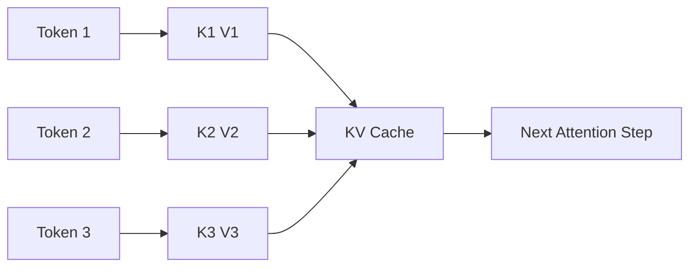

Instead of recomputing all previous Key and Value representations for every generated token, the model can reuse cached values.

This improves autoregressive inference efficiency.

---

# 36. Attention and GPU Memory

Attention-heavy workloads can consume substantial GPU memory.

Important factors include:

```text
Sequence Length
        +
Hidden Dimension
        +
Number of Layers
        +
Attention Heads
        +
Batch Size
        ↓
Memory Requirement
```

Production LLM serving therefore needs careful consideration of:

- GPU memory
- Context length
- Batch size
- Precision
- KV cache
- Throughput
- Latency

---

# 37. Attention in Modern LLM Inference

A simplified production inference pipeline is:

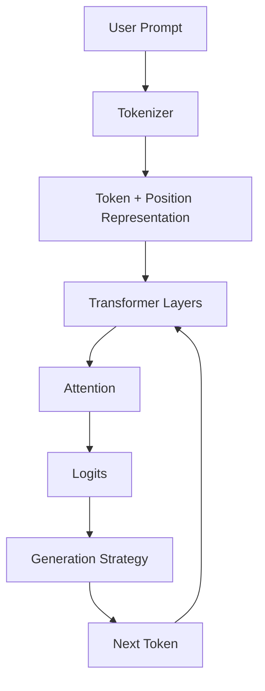

The process repeats until the generation terminates.

Production optimization may involve:

- KV caching
- Batching
- Quantization
- Efficient attention implementations
- GPU optimization
- Request scheduling
- Context management

---

# 38. Attention in BERT

BERT uses Encoder Self-Attention.

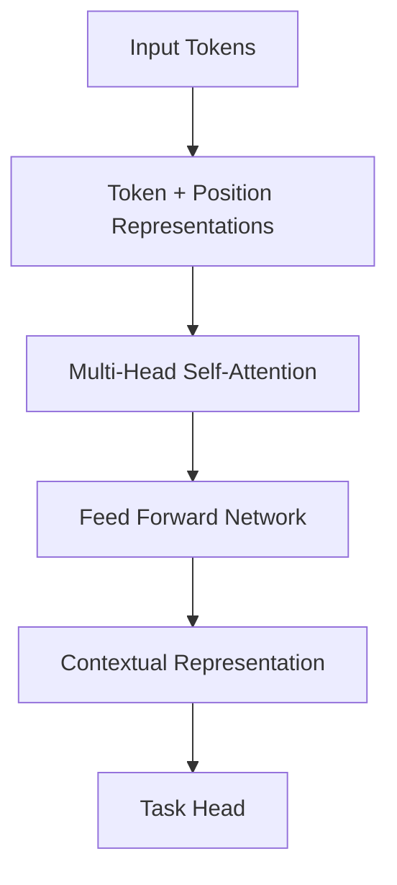

The attention is bidirectional.

This makes BERT effective for:

- Classification
- Semantic Matching
- Entity Recognition
- Search
- Question Answering

---

# 39. Attention in GPT

GPT uses Decoder-style causal Self-Attention.

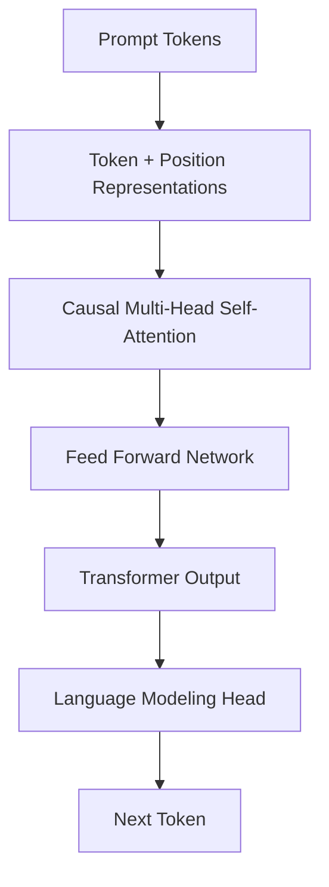

The model predicts one token at a time during generation.

---

# 40. Attention vs Traditional Sequence Processing

| Characteristic | RNN / LSTM | Transformer Attention |
| --- | --- | --- |
| Processing | Sequential | Parallelizable during training |
| Context | Hidden State | Attention Across Tokens |
| Long-Range Dependencies | More Difficult | More Direct |
| Training Parallelism | Limited | High |
| Core Mechanism | Recurrence | Attention |
| Position Handling | Sequence Order | Explicit Position Mechanism |
| Scaling | More difficult | Highly scalable |
| Foundation for Modern LLMs | No | Yes |

---

# 41. Production Perspective

Attention is not only a mathematical mechanism.

It has direct infrastructure and architecture implications.

A production LLM system must consider:

```mermaid
flowchart TD
    A["Attention Workload"]

    A --> B["Context Length"]
    A --> C["GPU Memory"]
    A --> D["Latency"]
    A --> E["Throughput"]
    A --> F["KV Cache"]
    A --> G["Inference Cost"]

    B --> H["Production Optimization"]
    C --> H
    D --> H
    E --> H
    F --> H
    G --> H
```

This makes Attention an important concept for both:

- AI Engineers
- Cloud AI Architects

---

# 42. Enterprise Architecture Considerations

When designing production LLM systems, attention-related considerations include:

### Context Management

Do not send unnecessary information into the model.

### Retrieval

Retrieve relevant information instead of passing entire knowledge bases into the context.

### KV Caching

Reuse previous Key and Value representations during generation.

### Model Selection

Different models have different context and attention characteristics.

### Hardware

GPU memory and compute capacity strongly influence inference performance.

### Cost

Token volume and context length directly affect operational cost.

### Latency

Autoregressive generation introduces token-generation latency.

---

# 43. Best Practices

- Understand the difference between token embeddings and positional information.
- Understand the difference between Self-Attention and Cross-Attention.
- Understand why Q, K, and V are separate projections.
- Understand why attention scores are scaled.
- Use causal masking for autoregressive language modeling.
- Consider context length when designing production LLM systems.
- Use relevant context instead of maximizing context blindly.
- Use KV caching for autoregressive inference where supported.
- Monitor GPU memory and inference latency.
- Consider batching and serving strategy for high-throughput workloads.
- Understand the positional mechanism used by the selected model.
- Treat attention visualization as an analysis tool rather than a complete explanation of model reasoning.

---

# 44. Common Mistakes

## Mistake 1: Attention and Positional Encoding Are the Same

They solve different problems.

```text
Positional Information
        ↓
Where is the token?
```

```text
Attention
        ↓
What other tokens are relevant?
```

---

## Mistake 2: Attention Is Sequential

Self-Attention can process all tokens in parallel during training.

The sequential behavior of GPT occurs during **autoregressive generation**.

---

## Mistake 3: Forgetting Causal Masking

Decoder-only language models must prevent future tokens from influencing current predictions.

---

## Mistake 4: Confusing Q, K, and V

Remember:

```text
Query
 ↓
What am I looking for?

Key
 ↓
What information do I represent?

Value
 ↓
What information should I provide?
```

---

## Mistake 5: Assuming More Context Is Always Better

More context can increase:

- Noise
- Cost
- Latency
- Memory

Relevant context is more important than maximum context.

---

## Mistake 6: Confusing Self-Attention and Cross-Attention

```text
Self-Attention

Q + K + V
from same sequence
```

```text
Cross-Attention

Q
from target sequence

K + V
from source sequence
```

---

# 45. Interview Questions

## Beginner

- What is Attention?
- Why was Attention introduced?
- What is Self-Attention?
- What is Positional Encoding?
- Why do Transformers need positional information?
- What are Query, Key, and Value?
- What is Multi-Head Attention?

## Intermediate

- Explain Scaled Dot-Product Attention.
- Why do we divide by \(\sqrt{d_k}\)?
- What does Softmax do in Attention?
- Why are multiple attention heads used?
- What is a causal mask?
- Encoder Self-Attention vs Decoder Self-Attention?
- Self-Attention vs Cross-Attention?
- Why are Transformers more parallelizable than RNNs?
- Why does self-attention have quadratic complexity?

## Advanced

- Derive the Scaled Dot-Product Attention mechanism.
- Why does dot-product attention require scaling?
- How does Multi-Head Attention improve representation learning?
- Why does self-attention have \(O(n^2)\) complexity?
- What are the production implications of long context?
- How does KV caching improve autoregressive inference?
- What is the difference between absolute and relative positional information?
- What is RoPE and why is it used in modern LLMs?
- How would you optimize attention-heavy workloads in production?
- Why is attention not necessarily a complete explanation of model reasoning?
- How would you design an LLM serving architecture where context length is a major constraint?

---

# 46. 🚀 Quick Revision Sheet

## Attention

```text
Input
 ↓
Q, K, V
 ↓
QKᵀ
 ↓
Scale by √dₖ
 ↓
Softmax
 ↓
Attention Weights
 ↓
Weighted Values
 ↓
Contextual Output
```

---

## Core Formula

$$
Attention(Q,K,V)
=
softmax
\left(
\frac{QK^T}{\sqrt{d_k}}
\right)V
$$

---

## QKV

```text
Query
 ↓
What am I looking for?

Key
 ↓
What information do I contain?

Value
 ↓
What information should I provide?
```

---

## Positional Information

```text
Token Embedding
       +
Position Information
       ↓
Position-Aware Representation
```

---

## Self-Attention

```text
Same Sequence
      ↓
Q + K + V
      ↓
Self-Attention
```

---

## Cross-Attention

```text
Target Sequence
      ↓
      Q

Source Sequence
      ↓
     K + V

      ↓

Cross-Attention
```

---

## BERT

```text
Input
 ↓
Position Information
 ↓
Bidirectional Self-Attention
 ↓
Contextual Representation
 ↓
Understanding
```

---

## GPT

```text
Prompt
 ↓
Position Information
 ↓
Causal Self-Attention
 ↓
Next Token
 ↓
Generated Sequence
```

---

## Multi-Head Attention

```text
Input
 ↓
Head 1 ─┐
Head 2 ─┤
Head 3 ─┼→ Concatenate → Projection
Head 4 ─┤
Head N ─┘
```

---

## Complexity

```text
Sequence Length = n

Attention Relationships
        ↓
      n × n

Complexity
        ↓
      O(n²)
```

---

## Production

```text
Long Context
      ↓
More Attention Computation
      ↓
More Memory
      ↓
Higher Latency / Cost
```

Optimization areas:

- Context management
- Retrieval
- Efficient attention
- KV caching
- Batching
- Quantization
- GPU optimization

---

## Remember

> **Attention determines which tokens are relevant to each other, while positional information tells the Transformer where those tokens occur in the sequence. Query, Key, and Value representations enable this dynamic interaction, and Multi-Head Attention allows the model to learn multiple relationships simultaneously.**

---

# 47. Key Takeaways

- Attention allows tokens to dynamically focus on relevant information from other tokens.
- Self-Attention derives Query, Key, and Value representations from the same sequence.
- Query represents what a token is looking for.
- Key represents what information a token can be matched against.
- Value contains the information aggregated into the attention output.
- Scaled Dot-Product Attention uses:

$$
softmax
\left(
\frac{QK^T}{\sqrt{d_k}}
\right)V
$$

- Scaling by \(\sqrt{d_k}\) helps control the magnitude of attention scores before Softmax.
- Softmax converts attention scores into normalized attention weights.
- The weighted combination of Value vectors produces contextual representations.
- Multi-Head Attention allows multiple attention patterns to be learned in parallel.
- Positional information is required because Transformers do not inherently encode sequential order in the same way as recurrent networks.
- The original Transformer used sinusoidal positional encoding.
- Modern Transformer models may use learned positions, relative position representations, or RoPE.
- Encoder Self-Attention can use bidirectional context.
- Decoder Self-Attention uses causal masking for autoregressive generation.
- Cross-Attention connects a target sequence with a source sequence.
- Self-Attention has approximately \(O(n^2)\) interaction complexity with sequence length.
- Long contexts therefore introduce significant memory, latency, and cost considerations.
- KV caching improves autoregressive inference efficiency by reusing previously computed Key and Value representations.
- Understanding Attention and Positional Encoding is essential before studying GPT and BERT architectures.
- These mechanisms form the architectural bridge from Deep Learning to modern Foundation Models and Large Language Models.

---

## ➡️ Next Chapter

**[06. GPT and BERT Architecture](06-gpt-and-bert-architecture.md)**

---

> **Enterprise AI Engineering Handbook**  
> *Building Production-Grade Enterprise AI Systems — One Chapter at a Time.*