# GPT and BERT Architecture: Encoder, Decoder, Pretraining, and Transformer-Based Language Models

> A practical, engineering-focused guide to **GPT and BERT architecture**, explaining Transformer encoders and decoders, bidirectional versus autoregressive language modeling, tokenization, embeddings, self-attention, pretraining objectives, fine-tuning, inference, architectural differences, and their evolution into modern Large Language Models (LLMs).

---

# 1. Overview

**GPT (Generative Pre-trained Transformer)** and **BERT (Bidirectional Encoder Representations from Transformers)** are two of the most influential Transformer-based language model architectures.

Both are built on the **Transformer architecture**, but they use different parts of the Transformer and are optimized for different objectives.

The fundamental distinction is:

```text
BERT
 ↓
Encoder-Based Transformer
 ↓
Bidirectional Context
 ↓
Language Understanding

GPT
 ↓
Decoder-Based Transformer
 ↓
Autoregressive Context
 ↓
Language Generation
```

This distinction is important because it explains why:

- BERT became highly influential for language understanding tasks.
- GPT became the foundation for modern generative LLMs.

---

# 2. GPT vs BERT at a Glance

| Characteristic | BERT | GPT |
|---|---|---|
| Full Name | Bidirectional Encoder Representations from Transformers | Generative Pre-trained Transformer |
| Transformer Component | Encoder | Decoder |
| Attention | Bidirectional / non-causal | Causal / masked |
| Primary Objective | Masked Language Modeling | Next-Token Prediction |
| Main Strength | Language Understanding | Language Generation |
| Context | Both left and right context | Previous tokens |
| Typical Tasks | Classification, NER, QA | Text Generation, Completion |
| Generation | Not its primary design | Core capability |
| Architecture | Encoder-only | Decoder-only |
| Pretraining Style | Masked tokens | Autoregressive tokens |
| Modern Influence | Encoder models | Generative LLMs |

---

# 3. Transformer Architecture Foundation

Both GPT and BERT originate from the Transformer architecture introduced in:

> **Attention Is All You Need**

The original Transformer consists of:

```text
Encoder Stack
      +
Decoder Stack
```

Conceptually:

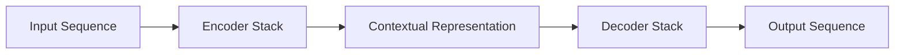

BERT primarily uses:

```text
Encoder Stack
```

GPT primarily uses:

```text
Decoder Stack
```

This difference creates their different behaviors.

---

# 4. Transformer Building Blocks

Both architectures are constructed from variations of the same fundamental components:

```text
Tokenization
     ↓
Token Embeddings
     +
Positional Information
     ↓
Attention
     ↓
Feed-Forward Network
     ↓
Normalization
     ↓
Residual Connections
     ↓
Repeated Transformer Layers
```

A simplified Transformer block is:

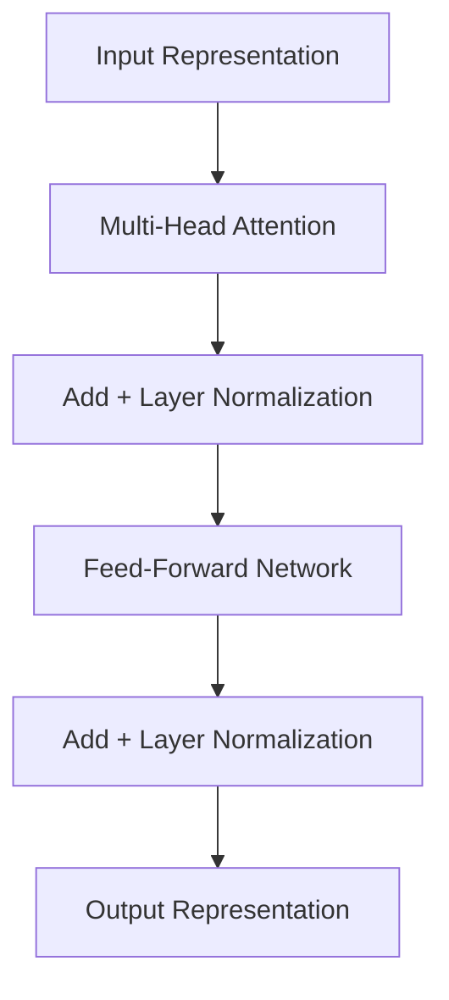

The exact implementation differs between BERT and GPT, especially around attention masking and normalization placement.

---

# 5. Tokenization

Neither GPT nor BERT directly processes raw text.

The input text is first converted into tokens.

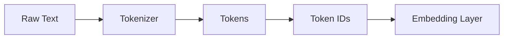

For example:

```text
"AI engineering is powerful"

        ↓

["AI", "engineering", "is", "powerful"]

        ↓

[101, 2345, 2003, 3928]
```

Actual tokenization and token IDs depend on the model's tokenizer.

---

# 6. Input Embeddings

Token IDs are mapped to dense vectors.

Conceptually:

```text
Token ID
   ↓
Embedding Matrix
   ↓
Dense Vector
```

For a sequence:

```text
Token 1 → Vector 1
Token 2 → Vector 2
Token 3 → Vector 3
Token 4 → Vector 4
```

These vectors form the initial representation supplied to Transformer layers.

---

# 7. Positional Information

Transformers process tokens in parallel, so the model needs information about token positions.

Conceptually:

```text
Token Embedding
      +
Position Information
      ↓
Transformer Input
```

For BERT, positional embeddings are traditionally added to token and segment embeddings.

For GPT-style models, positional information has evolved across model generations and may use approaches such as:

- Learned positional embeddings
- Rotary Position Embeddings (RoPE)
- Other relative or position-aware mechanisms

The detailed attention and positional encoding concepts are covered in:

**[05. Attention and Positional Encoding](05-attention-and-positional-encoding.md)**

---

# 8. BERT Architecture

**BERT** is an **encoder-only Transformer architecture**.

A simplified architecture is:

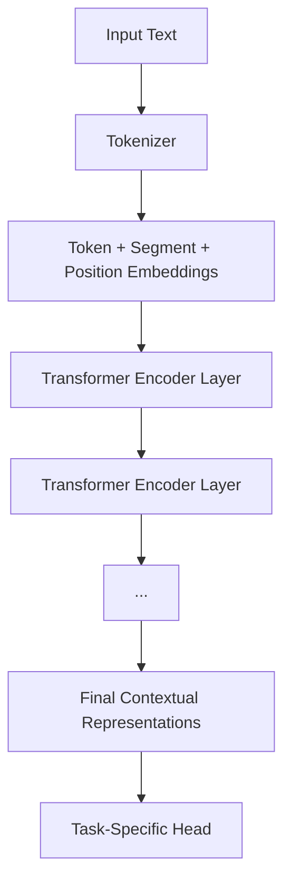

The core idea is that every token can attend to relevant tokens on both sides of the sequence.

---

# 9. BERT Bidirectional Attention

Consider:

```text
The bank approved the loan.
```

BERT can use context from both directions when building the representation of `bank`.

Conceptually:

```text
The  ←──┐
        │
bank ←──┼──→ approved
        │
loan ←──┘
```

More generally:

```text
Previous Tokens
       ↘
        Current Token
       ↗
Following Tokens
```

This bidirectional context is one of BERT's defining characteristics.

---

# 10. BERT Self-Attention

BERT uses self-attention to allow every token to interact with other tokens in the sequence.

For:

```text
The customer opened an account
```

attention can model relationships such as:

```text
customer ↔ opened
customer ↔ account
opened   ↔ account
```

Conceptually:

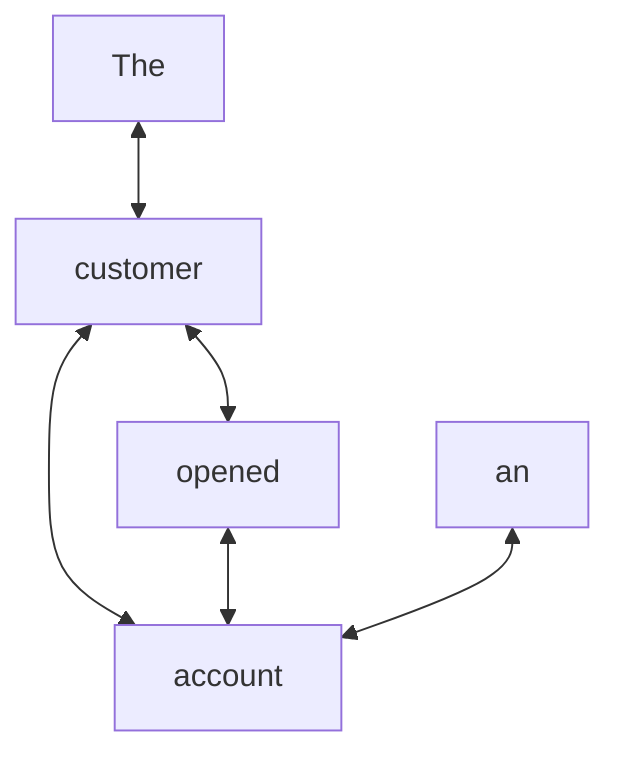

The actual attention mechanism assigns learned weights rather than simply treating every relationship equally.

---

# 11. BERT Encoder Layer

A simplified BERT encoder layer is:

```text
Input
  ↓
Multi-Head Self-Attention
  ↓
Residual Connection
  ↓
Layer Normalization
  ↓
Feed-Forward Network
  ↓
Residual Connection
  ↓
Layer Normalization
  ↓
Output
```

Mermaid representation:

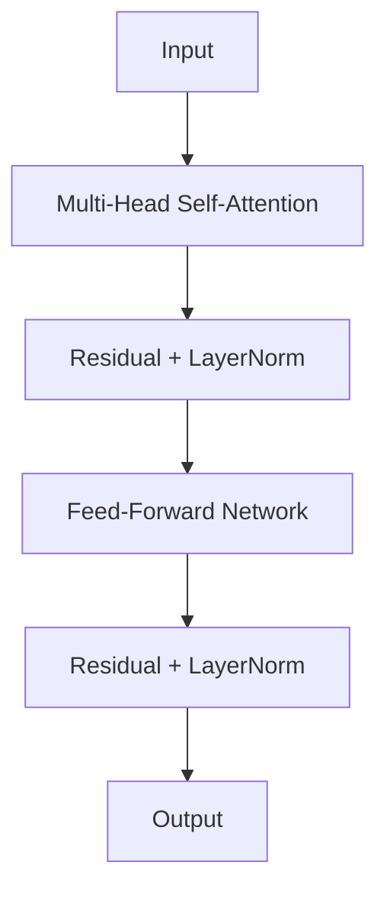

Multiple encoder layers are stacked to create the complete BERT model.

---

# 12. BERT Input Representation

Original BERT combines multiple types of embeddings.

```text
Token Embedding
       +
Segment Embedding
       +
Position Embedding
       ↓
Transformer Encoder
```

Conceptually:

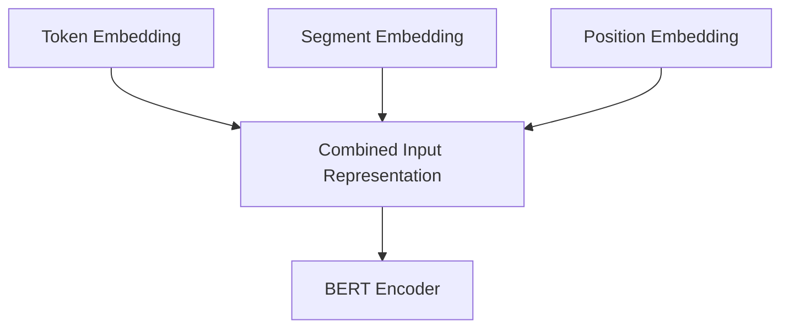

Segment embeddings were especially useful for tasks involving sentence pairs.

---

# 13. Special Tokens in BERT

BERT uses special tokens for different purposes.

Important examples include:

```text
[CLS]
[SEP]
[MASK]
[PAD]
```

### `[CLS]`

Represents the beginning of the sequence and is commonly used as an aggregate representation for classification tasks.

### `[SEP]`

Separates sentences or marks the end of a segment.

### `[MASK]`

Used during Masked Language Model pretraining.

### `[PAD]`

Used to make sequences within a batch the same length.

Example:

```text
[CLS] The bank approved the loan [SEP]
```

---

# 14. BERT Pretraining

The original BERT training approach used two major objectives:

1. Masked Language Modeling
2. Next Sentence Prediction

---

# 15. Masked Language Modeling

In **Masked Language Modeling (MLM)**, some input tokens are hidden and the model learns to predict them.

Example:

```text
The customer opened a [MASK].
```

Target:

```text
The customer opened a bank account.
```

Conceptually:

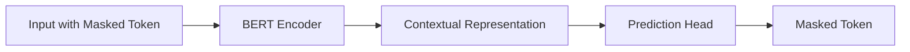

The key advantage is that the model can use both left and right context.

---

# 16. Why Masked Language Modeling Works

Consider:

```text
The customer deposited money into the [MASK].
```

The model can use:

```text
Left Context:
The customer deposited money into the

+

Right Context:
possibly surrounding words

↓

Predict:
bank
```

This encourages BERT to learn contextual representations rather than simply learning a left-to-right generation process.

---

# 17. Next Sentence Prediction

Original BERT also introduced **Next Sentence Prediction (NSP)**.

The model receives two sentence segments:

```text
Sentence A
+
Sentence B
```

and predicts whether B logically follows A.

Example:

```text
A:
The customer opened a new account.

B:
The bank issued a debit card.
```

The model attempts to classify the relationship.

NSP was intended to help BERT learn relationships between sentences.

Later research showed that NSP is not always necessary, and several BERT-family models modified or removed this objective.

---

# 18. GPT Architecture

**GPT** uses a **decoder-only Transformer architecture**.

A simplified architecture is:

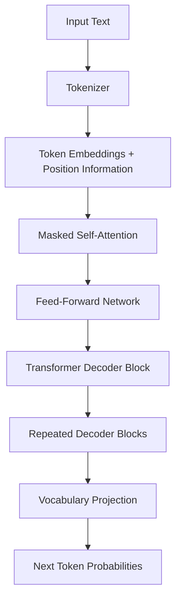

Unlike the original Transformer decoder, GPT-style models generally use decoder blocks without the encoder-decoder cross-attention layer because they operate as decoder-only models.

---

# 19. Causal Self-Attention

The defining property of GPT is **causal attention**.

A token can attend only to previous tokens and itself.

For:

```text
The customer opened an account
```

the attention pattern is approximately:

```text
Token 1 → Token 1

Token 2 → Token 1, Token 2

Token 3 → Token 1, Token 2, Token 3

Token 4 → Token 1, Token 2, Token 3, Token 4

Token 5 → Token 1, Token 2, Token 3, Token 4, Token 5
```

Conceptually:

```text
        Token 1  Token 2  Token 3  Token 4
Token 1    ✓        ✗        ✗        ✗
Token 2    ✓        ✓        ✗        ✗
Token 3    ✓        ✓        ✓        ✗
Token 4    ✓        ✓        ✓        ✓
```

This prevents the model from seeing future tokens during training.

---

# 20. Causal Attention Mask

The attention mask can be represented mathematically as a lower-triangular matrix.

```text
┌───┬───┬───┬───┐
│ ✓ │ ✗ │ ✗ │ ✗ │
├───┼───┼───┼───┤
│ ✓ │ ✓ │ ✗ │ ✗ │
├───┼───┼───┼───┤
│ ✓ │ ✓ │ ✓ │ ✗ │
├───┼───┼───┼───┤
│ ✓ │ ✓ │ ✓ │ ✓ │
└───┴───┴───┴───┘
```

This is what enables autoregressive generation.

---

# 21. GPT Language Modeling Objective

GPT is trained using **next-token prediction**.

Given:

```text
The customer opened
```

the model predicts:

```text
an
```

Then:

```text
The customer opened an
```

predicts:

```text
account
```

Conceptually:

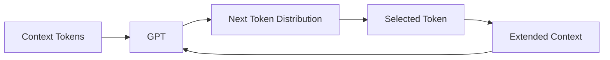

The process is repeated during generation.

---

# 22. Autoregressive Generation

During inference, GPT generates tokens one at a time.

Example:

```text
Prompt:

The future of AI is

        ↓

The future of AI is intelligent

        ↓

The future of AI is intelligent automation

        ↓

The future of AI is intelligent automation systems
```

Conceptually:

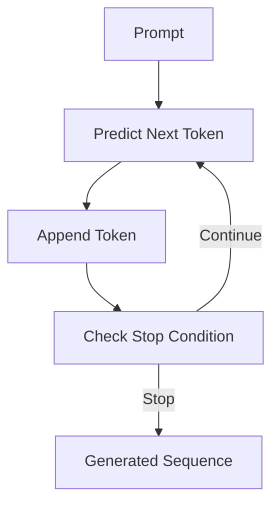

This autoregressive process is fundamental to GPT-style LLMs.

---

# 23. BERT vs GPT Attention

The biggest attention difference can be visualized as:

### BERT

```text
Token
 ↙ ↓ ↘
Previous + Current + Future
```

### GPT

```text
Previous Tokens
       ↓
     Token
```

Therefore:

```text
BERT → Bidirectional Attention
GPT  → Causal Attention
```

---

# 24. BERT vs GPT Training Objective

The training objectives are fundamentally different.

### BERT

```text
Masked Input
      ↓
Predict Missing Token
```

### GPT

```text
Previous Tokens
      ↓
Predict Next Token
```

Comparison:

```text
BERT:

The customer opened a [MASK].

                    ↓
                  "bank"


GPT:

The customer opened a

                    ↓
                  "new"
```

---

# 25. BERT Architecture Diagram

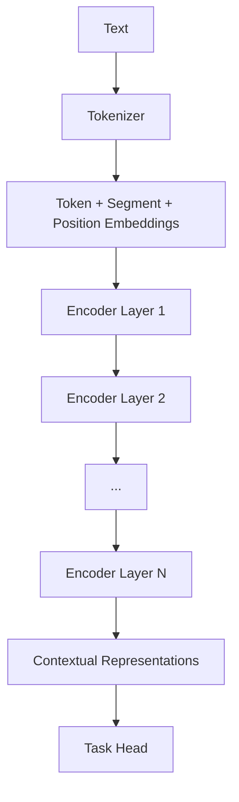

BERT is therefore:

```text
Input
 ↓
Encoder Stack
 ↓
Contextual Representation
 ↓
Task-Specific Head
```

---

# 26. GPT Architecture Diagram

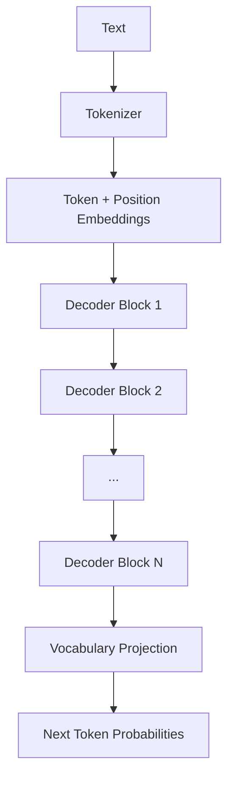

GPT is therefore:

```text
Input
 ↓
Decoder Stack
 ↓
Vocabulary Distribution
 ↓
Next Token
```

---

# 27. BERT Task-Specific Heads

BERT's contextual representation can be connected to different task-specific heads.

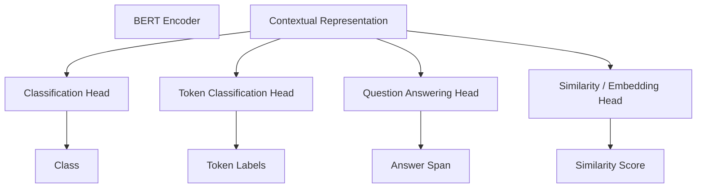

Common applications include:

- Sentiment Analysis
- Document Classification
- Intent Classification
- Named Entity Recognition
- Extractive Question Answering
- Semantic Similarity

---

# 28. GPT Application Pattern

GPT's autoregressive architecture naturally supports generation.

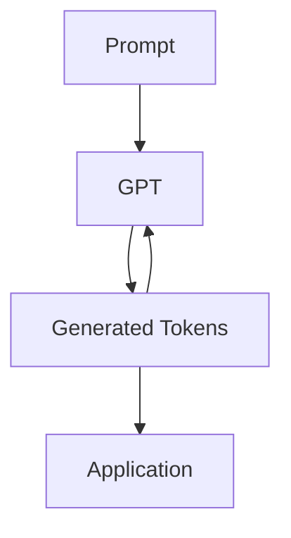

Applications include:

- Chatbots
- Text Completion
- Summarization
- Code Generation
- Question Answering
- Content Generation
- AI Assistants

---

# 29. BERT and GPT: Different Design Goals

A useful way to remember the difference is:

```text
BERT asks:

"What does this text mean?"

GPT asks:

"What token should come next?"
```

This is a simplification, but it captures their original architectural intent.

---

# 30. Encoder-Only vs Decoder-Only

The distinction can be generalized.

## Encoder-Only

```text
Input
 ↓
Encoder
 ↓
Representation
 ↓
Task
```

Typical use:

- Understanding
- Classification
- Retrieval
- Representation Learning

Examples:

- BERT
- RoBERTa
- DistilBERT

## Decoder-Only

```text
Input
 ↓
Decoder
 ↓
Next Token
 ↓
Generated Sequence
```

Typical use:

- Text Generation
- Code Generation
- Conversational AI
- General-purpose LLMs

Examples:

- GPT
- Llama
- Mistral
- Qwen

---

# 31. Encoder-Decoder Models

There is a third important architecture family:

**Encoder-Decoder Transformers**

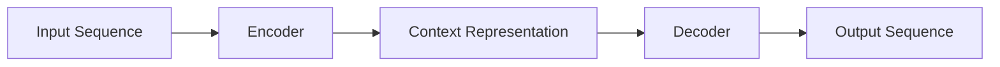

Examples include:

- T5
- BART

These architectures are particularly useful for sequence-to-sequence tasks.

Examples:

- Translation
- Summarization
- Text Transformation

Therefore, modern Transformer model families can be broadly categorized as:

```text
Transformer Models
       │
       ├── Encoder-Only
       │      └── BERT
       │
       ├── Decoder-Only
       │      └── GPT
       │
       └── Encoder-Decoder
              └── T5 / BART
```

---

# 32. Pretraining vs Fine-Tuning

Both BERT and GPT introduced the idea of large-scale pretraining followed by adaptation.

The general workflow is:

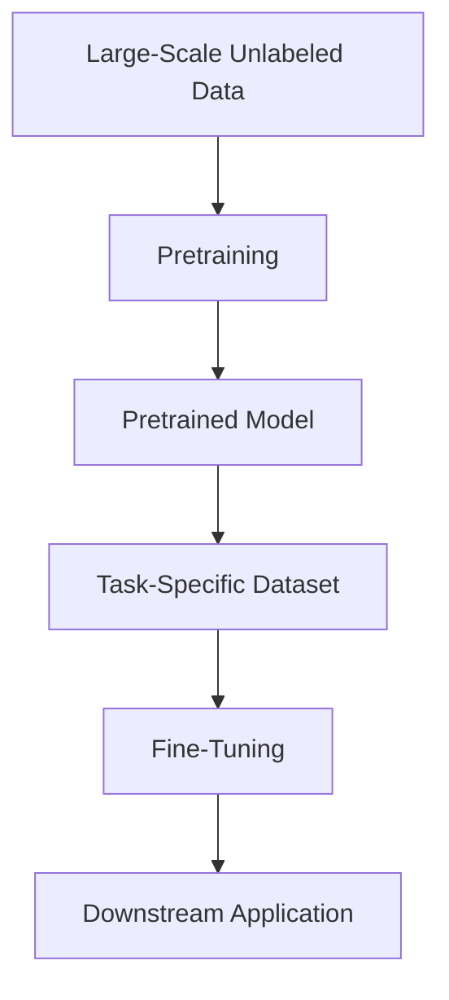

This approach dramatically reduced the amount of task-specific training required.

---

# 33. BERT Fine-Tuning

A BERT model can be fine-tuned for a classification problem.

```text
Pretrained BERT
      ↓
Customer Support Dataset
      ↓
Fine-Tuning
      ↓
Intent Classifier
```

Example:

```text
Input:
"I forgot my password."

        ↓

BERT

        ↓

PASSWORD_RESET
```

---

# 34. GPT Adaptation

GPT-style models can also be adapted through multiple approaches.

```text
Pretrained GPT
      ↓
Prompting
      ↓
Instruction Tuning
      ↓
Fine-Tuning
      ↓
Preference Optimization
```

Modern LLM development extends far beyond the original GPT training paradigm.

Later chapters cover:

- Supervised Fine-Tuning
- PEFT
- LoRA
- QLoRA
- Instruction Tuning
- Reward Modeling
- RLHF
- PPO
- DPO

---

# 35. Parameter Sharing and Scaling

Transformer language models scale through increasing:

- Number of layers
- Hidden dimensions
- Attention heads
- Vocabulary size
- Training data
- Parameter count

A simplified relationship is:

```text
More Data
    +
More Parameters
    +
More Compute
    ↓
Larger Pretrained Model
```

However, scaling is not simply about increasing model size.

Modern model engineering also considers:

- Data quality
- Training efficiency
- Architecture
- Inference efficiency
- Context length
- Alignment
- Evaluation

---

# 36. Contextual Representations

One of BERT's major contributions was demonstrating the power of contextual representations.

Consider:

```text
I deposited money at the bank.
```

and:

```text
I sat beside the river bank.
```

The representation of `bank` should depend on context.

Conceptually:

```text
bank + financial context
        ↓
Financial Representation

bank + river context
        ↓
Geographical Representation
```

This is significantly more powerful than assigning one static vector to every occurrence of a word.

---

# 37. GPT Context Modeling

GPT also creates contextual representations, but within a causal generation framework.

For:

```text
The customer opened an
```

the representation used to predict the next token depends on the preceding context.

```text
The
 ↓
customer
 ↓
opened
 ↓
an
 ↓
?
```

The model predicts:

```text
P(next_token | previous_tokens)
```

Conceptually:

$$
P(x_t \mid x_1,x_2,\ldots,x_{t-1})
$$

This probability distribution drives autoregressive generation.

---

# 38. BERT Objective vs GPT Objective

The two objectives can be summarized mathematically.

## BERT

BERT learns to predict masked tokens:

$$
P(x_i \mid x_{\setminus i})
$$

where the model uses surrounding context to predict the masked token.

## GPT

GPT learns:

$$
P(x_t \mid x_1,\ldots,x_{t-1})
$$

where each token is predicted using preceding tokens.

This difference explains much of the architectural behavior of the two model families.

---

# 39. Attention Mask Comparison

A simplified comparison:

```text
BERT

      1  2  3  4
1     ✓  ✓  ✓  ✓
2     ✓  ✓  ✓  ✓
3     ✓  ✓  ✓  ✓
4     ✓  ✓  ✓  ✓
```

Every token can attend to every other token.

GPT:

```text
      1  2  3  4
1     ✓  ✗  ✗  ✗
2     ✓  ✓  ✗  ✗
3     ✓  ✓  ✓  ✗
4     ✓  ✓  ✓  ✓
```

Future tokens are masked.

---

# 40. Why GPT Became Dominant for Generative AI

GPT-style decoder-only architectures became highly influential because they combine:

- Simple autoregressive objective
- Large-scale pretraining
- Scalable Transformer architecture
- Natural text generation
- In-context learning
- Prompt-based interaction
- Strong transfer across tasks

The architectural pattern became:

```text
Large Dataset
      ↓
Self-Supervised Pretraining
      ↓
Large Decoder-Only Transformer
      ↓
Instruction / Preference Adaptation
      ↓
General-Purpose LLM
```

This architecture is now central to modern Generative AI.

---

# 41. BERT's Continuing Importance

Although decoder-only LLMs dominate many generative workloads, encoder-based models remain valuable.

BERT-style models can still be effective for:

- Classification
- NER
- Semantic Search
- Embeddings
- Reranking
- Document Understanding
- Lightweight NLP inference

For some tasks, a smaller encoder model may be more efficient than using a large generative LLM.

This is an important production engineering consideration.

---

# 42. GPT vs BERT: Production Decision

A simplified decision framework:

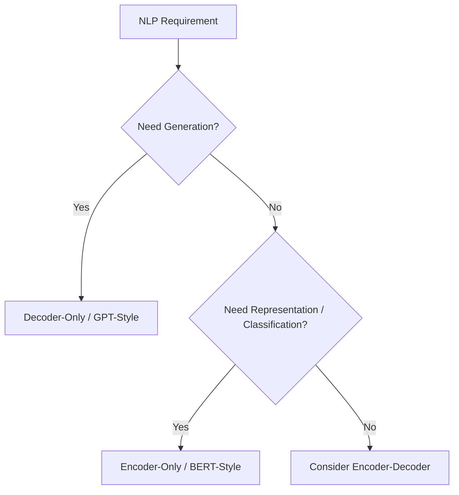

Use cases should drive architecture selection.

Do not automatically select an LLM simply because it is the newest model.

---

# 43. Practical PyTorch Representation

A simplified BERT-style architecture can be represented as:

```python
import torch
from transformers import BertModel

model = BertModel.from_pretrained("bert-base-uncased")

inputs = {
    "input_ids": torch.tensor([[101, 2023, 2003, 102]]),
    "attention_mask": torch.tensor([[1, 1, 1, 1]])
}

outputs = model(**inputs)

hidden_states = outputs.last_hidden_state

print(hidden_states.shape)
```

The output provides contextual representations for the input tokens.

---

# 44. Practical GPT-Style Representation

A simplified GPT-style model can be represented using a causal language model:

```python
import torch
from transformers import AutoTokenizer, AutoModelForCausalLM

model_name = "gpt2"

tokenizer = AutoTokenizer.from_pretrained(model_name)
model = AutoModelForCausalLM.from_pretrained(model_name)

inputs = tokenizer(
    "The future of AI is",
    return_tensors="pt"
)

with torch.no_grad():
    outputs = model(**inputs)

logits = outputs.logits

print(logits.shape)
```

The final logits represent the model's predicted distribution over the vocabulary for each position.

---

# 45. GPT Text Generation

A simplified Hugging Face generation workflow is:

```python
from transformers import AutoTokenizer, AutoModelForCausalLM

model_name = "gpt2"

tokenizer = AutoTokenizer.from_pretrained(model_name)
model = AutoModelForCausalLM.from_pretrained(model_name)

prompt = "Artificial intelligence will"

inputs = tokenizer(prompt, return_tensors="pt")

outputs = model.generate(
    **inputs,
    max_new_tokens=50
)

text = tokenizer.decode(
    outputs[0],
    skip_special_tokens=True
)

print(text)
```

The important engineering flow is:

```text
Prompt
 ↓
Tokenizer
 ↓
Token IDs
 ↓
Decoder-Only Transformer
 ↓
Logits
 ↓
Decoding Strategy
 ↓
Generated Tokens
 ↓
Text
```

---

# 46. BERT Classification Workflow

A simplified classification architecture is:

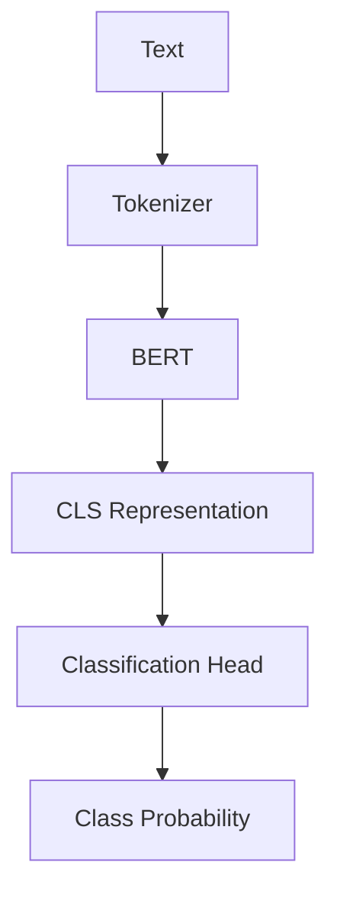

Example:

```text
Customer:
"My card is not working."

        ↓

BERT

        ↓

CARD_PROBLEM
```

---

# 47. GPT Generation Workflow

A simplified GPT generation architecture is:

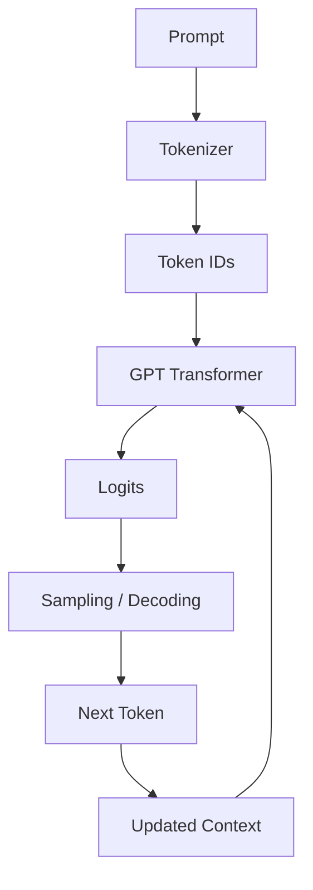

This loop continues until:

- Maximum token limit
- End-of-sequence token
- Application-defined stop condition

---

# 48. GPT and BERT in the Modern LLM Ecosystem

The evolution can be summarized as:

```mermaid
flowchart TD
    A["Transformer"]
    B["BERT"]
    C["GPT"]
    D["T5 / BART"]
    E["Modern Encoder Models"]
    F["Modern Decoder LLMs"]
    G["Multimodal Foundation Models"]

    A --> B
    A --> C
    A --> D
    B --> E
    C --> F
    D --> G
    F --> G
```

BERT and GPT therefore represent two important branches of the Transformer ecosystem.

---

# 49. Key Architectural Differences

| Dimension | BERT | GPT |
|---|---|---|
| Transformer Type | Encoder-only | Decoder-only |
| Attention | Bidirectional | Causal |
| Future Tokens Visible During Training | Yes | No |
| Training Objective | Masked Language Modeling | Next-Token Prediction |
| Primary Capability | Understanding | Generation |
| Typical Output | Representation | Token probabilities |
| Classification | Excellent | Possible |
| NER | Excellent | Possible |
| Text Generation | Not primary | Excellent |
| Chat Applications | Not primary | Excellent |
| Autoregressive | No | Yes |

---

# 50. BERT vs GPT Architecture Graph

```text
                    TRANSFORMER
                        │
            ┌───────────┴───────────┐
            │                       │
         ENCODER                  DECODER
            │                       │
          BERT                    GPT
            │                       │
     Bidirectional              Causal
       Attention               Attention
            │                       │
   Understanding                  Generation
            │                       │
 Classification                Next Token
 NER / QA / Search            Chat / Code / Content
```

---

# 51. Common Misconceptions

## Misconception 1: BERT and GPT Are Completely Different Architectures

They are not.

Both are based on the Transformer architecture.

The major difference is which Transformer component and attention strategy they use.

---

## Misconception 2: GPT Cannot Understand Language

GPT learns rich contextual representations as part of next-token prediction.

Its architecture supports both understanding and generation, although its primary training objective is autoregressive generation.

---

## Misconception 3: BERT Cannot Be Used in Generative Systems

BERT itself is not primarily designed for autoregressive generation, but BERT-style encoders can be components of larger systems.

---

## Misconception 4: Every Transformer Is an LLM

A Transformer architecture can be used for many tasks.

Not every Transformer model is a large language model.

---

## Misconception 5: Bigger Models Always Perform Better

Production performance depends on:

- Task
- Data
- Model architecture
- Evaluation
- Cost
- Latency
- Context
- Deployment environment

---

# 52. Production Considerations

When choosing between encoder and decoder architectures, evaluate:

## Latency

Encoder-only models can be much cheaper for simple classification tasks.

## Throughput

Task-specific models may provide higher throughput than general-purpose LLMs.

## Cost

Using a large generative model for a simple classification task may be unnecessarily expensive.

## Accuracy

Architecture should match the task.

## Maintainability

Separate model inference from business logic.

## Deployment

Consider:

- CPU inference
- GPU inference
- Batch processing
- Quantization
- Model serving
- Autoscaling

---

# 53. Interview Questions

## Beginner

1. What is BERT?
2. What is GPT?
3. What does GPT stand for?
4. What does BERT stand for?
5. What is the Transformer architecture?
6. Encoder vs decoder?
7. What is self-attention?
8. What is masked language modeling?
9. What is next-token prediction?

## Intermediate

1. Why is BERT bidirectional?
2. Why does GPT use causal attention?
3. What is the difference between MLM and autoregressive language modeling?
4. Why is BERT useful for classification?
5. Why is GPT useful for generation?
6. What are `[CLS]`, `[SEP]`, and `[MASK]`?
7. What is causal masking?
8. How does GPT generate text?
9. How does BERT create contextual representations?
10. Encoder-only vs decoder-only vs encoder-decoder?

## Advanced

1. Why did decoder-only Transformers become dominant for modern LLMs?
2. Why might an encoder model be preferable to an LLM for classification?
3. How would you choose between BERT and GPT for an enterprise application?
4. What are the production trade-offs between encoder and decoder architectures?
5. How does causal masking affect training and inference?
6. Why can GPT perform multiple tasks without task-specific heads?
7. How does self-supervised pretraining enable transfer learning?
8. How would you optimize GPT inference for high throughput?
9. How would you deploy a BERT classifier in a microservice architecture?
10. How would you evaluate an encoder-based model against an LLM for the same enterprise task?
11. What role does model size play in Transformer performance?
12. How do modern LLM architectures differ from the original GPT architecture?

---

# 54. 🚀 Quick Revision Sheet

## BERT

```text
Text
 ↓
Tokenizer
 ↓
Embeddings
 ↓
Encoder Stack
 ↓
Bidirectional Attention
 ↓
Contextual Representation
 ↓
Task Head
 ↓
Prediction
```

## GPT

```text
Prompt
 ↓
Tokenizer
 ↓
Embeddings
 ↓
Decoder Stack
 ↓
Causal Attention
 ↓
Logits
 ↓
Next Token
 ↓
Generated Text
```

## BERT Objective

```text
Masked Token
     ↓
Predict Missing Token
```

## GPT Objective

```text
Previous Tokens
      ↓
Predict Next Token
```

## Architecture

```text
Transformer
   │
   ├── Encoder-Only
   │       └── BERT
   │
   ├── Decoder-Only
   │       └── GPT
   │
   └── Encoder-Decoder
           └── T5 / BART
```

---

# 55. Key Takeaways

- **BERT and GPT are both based on the Transformer architecture.**
- BERT is primarily an **encoder-only Transformer**.
- GPT is primarily a **decoder-only Transformer**.
- BERT uses bidirectional self-attention for contextual language understanding.
- GPT uses causal self-attention so that each token can only attend to previous tokens.
- BERT was originally pretrained using **Masked Language Modeling** and **Next Sentence Prediction**.
- GPT is pretrained using **autoregressive next-token prediction**.
- BERT is highly effective for classification, NER, semantic representation, and other language understanding tasks.
- GPT-style architectures are naturally suited to text generation and have become the dominant architecture for many modern LLMs.
- Encoder-decoder Transformers such as T5 provide another important architecture family for sequence-to-sequence tasks.
- Tokenization, embeddings, positional information, attention, feed-forward networks, residual connections, and normalization are core Transformer components.
- Pretraining allows models to learn general-purpose language representations from large datasets.
- Fine-tuning and other adaptation techniques transform pretrained models into specialized enterprise AI solutions.
- Model architecture should be selected based on the **business problem, quality requirements, latency, cost, scalability, and deployment constraints** rather than simply choosing the largest available model.
- Understanding BERT and GPT provides the architectural foundation for understanding modern **Foundation Models, LLMs, fine-tuning, PEFT, instruction tuning, RLHF, DPO, and production Generative AI systems**.

---

# 56. Chapter Navigation

### Previous

**[05. Attention and Positional Encoding](05-attention-and-positional-encoding.md)**

### Next

**[07. Hugging Face and Transformers](07-huggingface-and-transformers.md)**

### Related

**[03. Word Embeddings](03-word-embeddings.md)**

**[04. Language Modeling](04-language-modeling.md)**

**[05. Attention and Positional Encoding](05-attention-and-positional-encoding.md)**

---

# References

- Vaswani et al. — *Attention Is All You Need*
- Devlin et al. — *BERT: Pre-training of Deep Bidirectional Transformers for Language Understanding*
- Radford et al. — *Improving Language Understanding by Generative Pre-Training*
- Radford et al. — *Language Models are Unsupervised Multitask Learners*
- Brown et al. — *Language Models are Few-Shot Learners*
- Jurafsky & Martin — *Speech and Language Processing*
- Hugging Face Transformers Documentation
- PyTorch Documentation

---

> **Enterprise AI Engineering Handbook**  
> *Building Production-Grade Enterprise AI Systems — One Chapter at a Time.*