# Hugging Face and Transformers: Model Hub, Tokenizers, Pipelines, Training, and Production AI

> A practical engineering guide to the **Hugging Face ecosystem and Transformers**, covering pretrained Foundation Models, the Hugging Face Model Hub, tokenizers, Auto Classes, pipelines, datasets, inference, training, fine-tuning, PEFT, Accelerate, and production deployment of Transformer-based AI systems.

---

# 1. Overview

The **Hugging Face ecosystem** is one of the most widely used open-source platforms for developing, sharing, fine-tuning, evaluating, and deploying modern Transformer-based AI models.

It provides tools and infrastructure for:

- Natural Language Processing (NLP)
- Large Language Models (LLMs)
- Computer Vision
- Speech AI
- Multimodal AI
- Foundation Models
- Model fine-tuning
- Model evaluation
- AI application development

Instead of implementing and training Transformer architectures from scratch, AI Engineers can reuse pretrained models and adapt them to downstream tasks.

A simplified workflow is:

```text
Pretrained Foundation Model
            │
            ▼
       Tokenizer
            │
            ▼
       Inference
            │
            ▼
      Fine-Tuning
            │
            ▼
       Evaluation
            │
            ▼
       Deployment
```

Hugging Face therefore acts as an important bridge between **Deep Learning research and practical AI Engineering**.

---

# 2. Why Hugging Face?

Training modern Foundation Models from scratch requires enormous:

- Datasets
- Compute
- GPU resources
- Training time
- Engineering effort

For most enterprise applications, training a foundation model from scratch is unnecessary.

Instead, teams typically:

```text
Discover Model
     ↓
Download Pretrained Model
     ↓
Experiment
     ↓
Adapt / Fine-Tune
     ↓
Evaluate
     ↓
Deploy
```

This provides several advantages:

- Thousands of pretrained models
- Standardized APIs
- Reusable tokenizers
- Dataset tooling
- Fine-tuning support
- Model sharing
- Open-source ecosystem
- PyTorch integration
- TensorFlow integration
- Production-oriented tooling

The major engineering benefit is **reuse**.

---

# 3. Hugging Face Ecosystem

The ecosystem consists of multiple libraries and services.

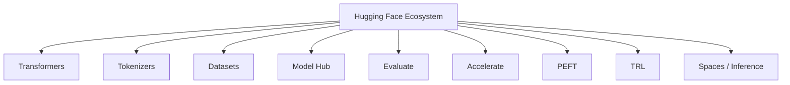

Each component addresses a different stage of the AI lifecycle.

| Component | Primary Purpose |
|---|---|
| Transformers | Pretrained Transformer models and inference |
| Tokenizers | Fast tokenization and encoding |
| Datasets | Dataset loading and preprocessing |
| Model Hub | Model and dataset discovery/sharing |
| Evaluate | Evaluation utilities |
| Accelerate | Hardware and distributed training |
| PEFT | Parameter-efficient fine-tuning |
| TRL | Post-training and alignment workflows |
| Spaces | Interactive AI applications |
| Inference | Model inference and deployment |

---

# 4. Transformers Library

The **Transformers** library is the central component of the Hugging Face ecosystem for working with Transformer-based models.

It provides standardized APIs for:

- Loading pretrained models
- Loading tokenizers
- Running inference
- Text generation
- Fine-tuning
- Model configuration
- Saving models
- Loading models
- Evaluation workflows

Popular model families include:

### Encoder Models

- BERT
- RoBERTa
- DeBERTa
- DistilBERT

Typical applications:

- Classification
- Semantic Search
- Named Entity Recognition
- Question Answering
- Embeddings

### Decoder Models

- GPT
- Llama
- Gemma
- Mistral
- Falcon
- Phi

Typical applications:

- Text Generation
- Chatbots
- AI Assistants
- Code Generation

### Encoder-Decoder Models

- T5
- BART
- FLAN-T5
- mT5

Typical applications:

- Translation
- Summarization
- Text Transformation
- Sequence-to-Sequence Tasks

---

# 5. Hugging Face Model Hub

The **Hugging Face Model Hub** is a centralized repository for discovering, sharing, versioning, and distributing machine learning models.

A typical workflow is:


The Hub contains models for:

- Text Classification
- Text Generation
- Translation
- Summarization
- Question Answering
- Computer Vision
- Speech Recognition
- Multimodal AI

It enables teams to reuse pretrained checkpoints instead of starting from zero.

---

# 6. Foundation Model Categories

A useful way to understand models on the Hub is by architecture.

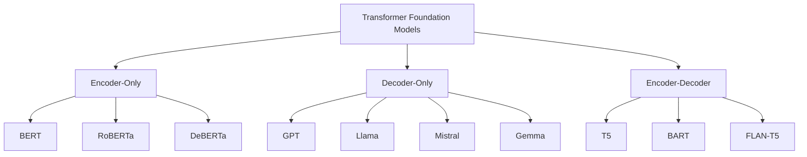

Architecture selection should depend on the task.

```text
Understanding / Classification
        ↓
Encoder Model

Generation
        ↓
Decoder Model

Sequence Transformation
        ↓
Encoder-Decoder Model
```

---

# 7. Model Repository Structure

A Hugging Face model repository commonly contains artifacts such as:

```text
model/
├── config.json
├── model.safetensors
├── tokenizer.json
├── tokenizer_config.json
├── special_tokens_map.json
└── README.md
```

The exact files vary by model.

Conceptually:

```text
Model Repository
      │
      ├── Configuration
      ├── Model Weights
      ├── Tokenizer
      └── Metadata
```

These artifacts allow the model to be reconstructed and used in another environment.

---

# 8. Auto Classes

One of the most useful features of Transformers is the **Auto Classes** API.

Common Auto Classes include:

```text
AutoConfig
AutoTokenizer
AutoModel
AutoModelForSequenceClassification
AutoModelForTokenClassification
AutoModelForQuestionAnswering
AutoModelForCausalLM
AutoModelForSeq2SeqLM
```

Instead of manually selecting the architecture, the Auto API uses the model configuration to determine the appropriate implementation.

Conceptually:

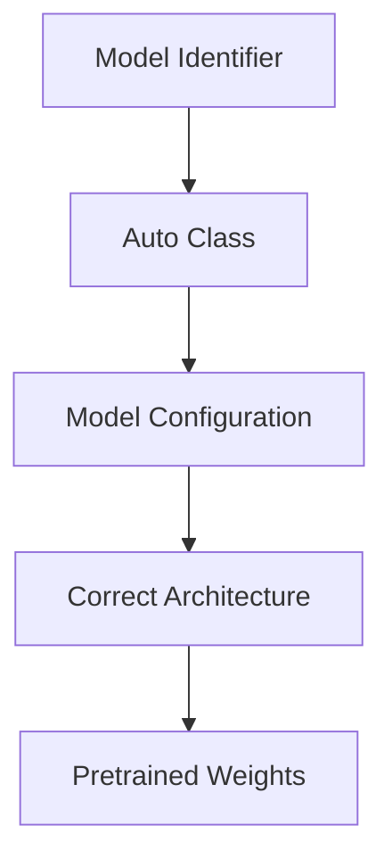

---

# 9. AutoTokenizer

The tokenizer should normally be loaded from the same model repository as the model.

```python
from transformers import AutoTokenizer

model_name = "bert-base-uncased"

tokenizer = AutoTokenizer.from_pretrained(
    model_name
)
```

This is important because different models may use different:

- Vocabulary
- Tokenization algorithms
- Special tokens
- Token IDs
- Input formatting

A common production mistake is using an incompatible tokenizer.

---

# 10. AutoModel

A generic model can be loaded using:

```python
from transformers import AutoModel

model = AutoModel.from_pretrained(
    "bert-base-uncased"
)
```

This generally provides the base Transformer representation rather than a task-specific prediction head.

For example:

```text
AutoModel
   ↓
Contextual Hidden States
```

For downstream tasks, task-specific Auto classes are usually more appropriate.

---

# 11. Task-Specific Auto Classes

For classification:

```python
from transformers import AutoModelForSequenceClassification

model = AutoModelForSequenceClassification.from_pretrained(
    "distilbert-base-uncased",
    num_labels=3
)
```

For causal language modeling:

```python
from transformers import AutoModelForCausalLM

model = AutoModelForCausalLM.from_pretrained(
    "gpt2"
)
```

For sequence-to-sequence generation:

```python
from transformers import AutoModelForSeq2SeqLM

model = AutoModelForSeq2SeqLM.from_pretrained(
    "google/flan-t5-base"
)
```

This provides a consistent programming model across different architectures.

---

# 12. Why Auto Classes Matter

Auto Classes provide:

- Less boilerplate
- Architecture abstraction
- Standardized APIs
- Easier experimentation
- Easier model replacement
- Reduced coupling

For example:

```python
model = AutoModel.from_pretrained(
    model_name
)
```

The application does not need to know every implementation detail of the underlying model class.

This concept is especially useful when designing **model abstraction layers** in enterprise applications.

---

# 13. Tokenizers

A Transformer model does not directly consume raw text.

The input must first be converted into tokens.

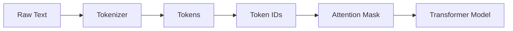

Example:

```python
from transformers import AutoTokenizer

tokenizer = AutoTokenizer.from_pretrained(
    "bert-base-uncased"
)

text = "Enterprise AI engineering"

tokens = tokenizer.tokenize(text)

print(tokens)
```

---

# 14. Tokenizer Output

The tokenizer can produce several model inputs.

```python
encoded = tokenizer(
    "Enterprise AI engineering",
    return_tensors="pt"
)

print(encoded)
```

Depending on the model, outputs can include:

```text
input_ids
attention_mask
token_type_ids
```

### `input_ids`

Numerical identifiers representing tokens.

### `attention_mask`

Indicates which positions contain meaningful input.

### `token_type_ids`

Used by models that support segment or token-type information.

Not every model uses every field.

---

# 15. Padding and Truncation

Real applications process text of different lengths.

For example:

```text
Sequence A:
Token1 Token2 Token3 Token4

Sequence B:
Token1 Token2
```

Batching requires compatible tensor shapes.

Padding can produce:

```text
Sequence A:
Token1 Token2 Token3 Token4

Sequence B:
Token1 Token2 PAD    PAD
```

The attention masks identify valid positions:

```text
Sequence A:
1 1 1 1

Sequence B:
1 1 0 0
```

A tokenizer can handle this automatically:

```python
encoded = tokenizer(
    texts,
    padding=True,
    truncation=True,
    max_length=128,
    return_tensors="pt"
)
```

---

# 16. Pipeline API

The **Pipeline API** provides a high-level abstraction for running pretrained models.

Example:

```python
from transformers import pipeline

classifier = pipeline(
    "sentiment-analysis"
)

result = classifier(
    "The new platform is excellent."
)

print(result)
```

Internally:


The Pipeline API is particularly useful for rapid experimentation.

---

# 17. Common Pipeline Tasks

Examples include:

```text
sentiment-analysis
text-classification
text-generation
summarization
translation
question-answering
token-classification
fill-mask
zero-shot-classification
```

Example:

```python
generator = pipeline(
    "text-generation",
    model="gpt2"
)

result = generator(
    "Artificial intelligence will",
    max_new_tokens=50
)

print(result)
```

---

# 18. Pipeline vs Direct Model APIs

There are two common levels of abstraction.

### High-Level

```python
pipeline(...)
```

Best for:

- Learning
- Prototyping
- Quick experiments
- Demonstrations

### Lower-Level

```text
Tokenizer
   ↓
Model
   ↓
Logits
   ↓
Custom Post Processing
```

Best for:

- Production services
- Custom preprocessing
- Custom batching
- Custom decoding
- Device management
- Monitoring
- Model routing

A production AI Engineer should understand both approaches.

---

# 19. Pretrained Model Inference

The standard inference workflow is:

```text
Input Text
    ↓
Tokenizer
    ↓
Token IDs
    ↓
Transformer
    ↓
Logits / Hidden States
    ↓
Post Processing
    ↓
Application Output
```

For example:

```python
import torch
from transformers import (
    AutoTokenizer,
    AutoModel
)

model_name = "bert-base-uncased"

tokenizer = AutoTokenizer.from_pretrained(
    model_name
)

model = AutoModel.from_pretrained(
    model_name
)

inputs = tokenizer(
    "Enterprise AI engineering",
    return_tensors="pt"
)

model.eval()

with torch.no_grad():
    outputs = model(**inputs)

print(outputs.last_hidden_state.shape)
```

---

# 20. Causal Language Model Inference

For GPT-style models:

```python
from transformers import (
    AutoTokenizer,
    AutoModelForCausalLM
)

model_name = "gpt2"

tokenizer = AutoTokenizer.from_pretrained(
    model_name
)

model = AutoModelForCausalLM.from_pretrained(
    model_name
)
```

Generation:

```python
prompt = "The future of AI is"

inputs = tokenizer(
    prompt,
    return_tensors="pt"
)

outputs = model.generate(
    **inputs,
    max_new_tokens=50
)

text = tokenizer.decode(
    outputs[0],
    skip_special_tokens=True
)

print(text)
```

---

# 21. Generation Workflow

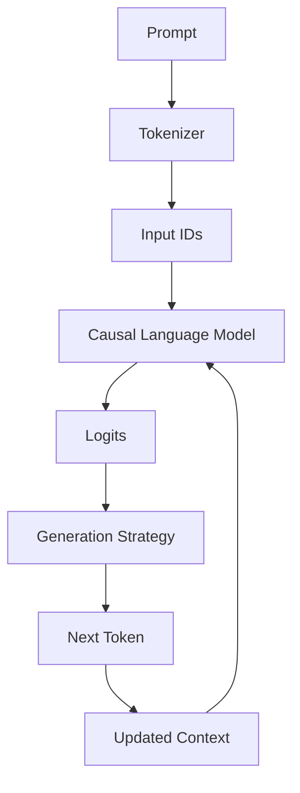

This autoregressive loop continues until a stopping condition is reached.

Possible stopping conditions include:

- End-of-sequence token
- Maximum number of generated tokens
- Application-defined stop condition

---

# 22. Generation Parameters

Important generation parameters include:

- `max_new_tokens`
- `temperature`
- `top_k`
- `top_p`
- `do_sample`
- `num_beams`
- `repetition_penalty`

Example:

```python
outputs = model.generate(
    **inputs,
    max_new_tokens=100,
    do_sample=True,
    temperature=0.7,
    top_p=0.9
)
```

These parameters influence:

- Diversity
- Determinism
- Creativity
- Repetition
- Output length

Detailed generation strategies are covered in:

**[15. LLM Generation Strategies](15-llm-generation-strategies.md)**

---

# 23. Hugging Face Datasets

The **Datasets** library provides standardized tools for loading, processing, filtering, splitting, and streaming datasets.

Installation:

```bash
pip install datasets
```

Example:

```python
from datasets import load_dataset

dataset = load_dataset("imdb")

print(dataset)
```

A dataset commonly contains:

```text
Dataset
├── train
├── validation
└── test
```

The exact splits depend on the dataset.

---

# 24. Dataset Processing

A typical workflow is:

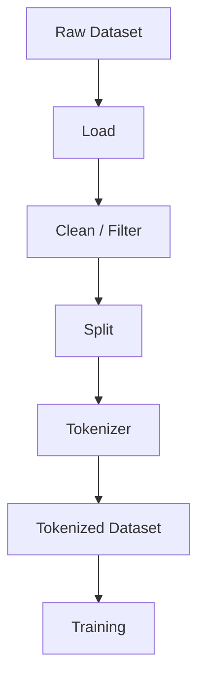

Tokenization can be performed with:

```python
def tokenize_function(batch):
    return tokenizer(
        batch["text"],
        truncation=True,
        padding=False
    )

tokenized_dataset = dataset.map(
    tokenize_function,
    batched=True
)
```

---

# 25. Data Collators

A **Data Collator** prepares individual examples into batches.

For sequence classification:

```python
from transformers import DataCollatorWithPadding

data_collator = DataCollatorWithPadding(
    tokenizer=tokenizer
)
```

Dynamic padding can avoid unnecessarily padding every example to a global maximum length.

Conceptually:

```text
Examples
   ↓
Data Collator
   ↓
Batch
   ↓
Model
```

---

# 26. Hugging Face Training Workflow

A standard training workflow is:

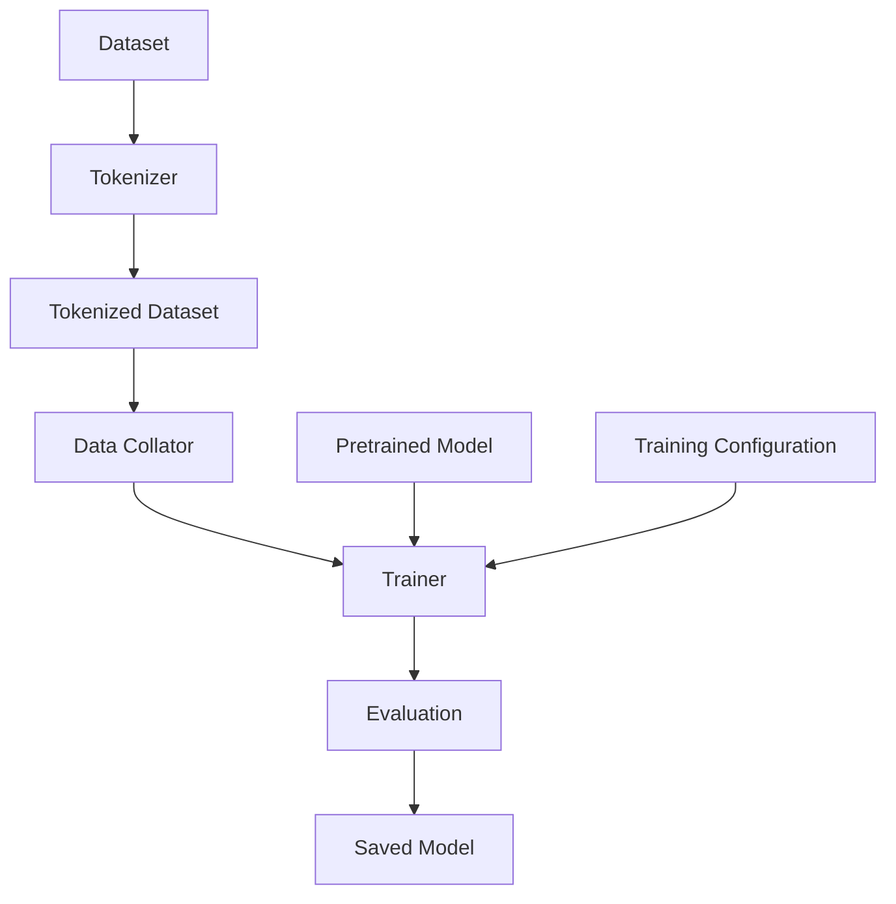

This allows engineers to fine-tune pretrained models without implementing every part of the training loop manually.

---

# 27. TrainingArguments

A simplified configuration can look like:

```python
from transformers import TrainingArguments

training_args = TrainingArguments(
    output_dir="./model-output",
    learning_rate=2e-5,
    per_device_train_batch_size=16,
    per_device_eval_batch_size=16,
    num_train_epochs=3,
    weight_decay=0.01,
    logging_steps=100,
    save_strategy="epoch"
)
```

Important parameters include:

- Learning rate
- Batch size
- Number of epochs
- Weight decay
- Logging frequency
- Evaluation strategy
- Checkpoint strategy

These should be tuned according to:

- Dataset size
- Model size
- Hardware
- Task complexity
- Evaluation results

---

# 28. Trainer API

The `Trainer` API provides a standardized training abstraction.

```python
from transformers import Trainer

trainer = Trainer(
    model=model,
    args=training_args,
    train_dataset=tokenized_dataset["train"],
    eval_dataset=tokenized_dataset["test"],
    tokenizer=tokenizer,
    data_collator=data_collator
)

trainer.train()
```

The Trainer can manage:

- Batching
- Forward passes
- Backpropagation
- Optimization
- Logging
- Checkpointing
- Evaluation
- Saving

---

# 29. What Happens Under the Trainer?

The underlying process remains a standard Deep Learning training loop:

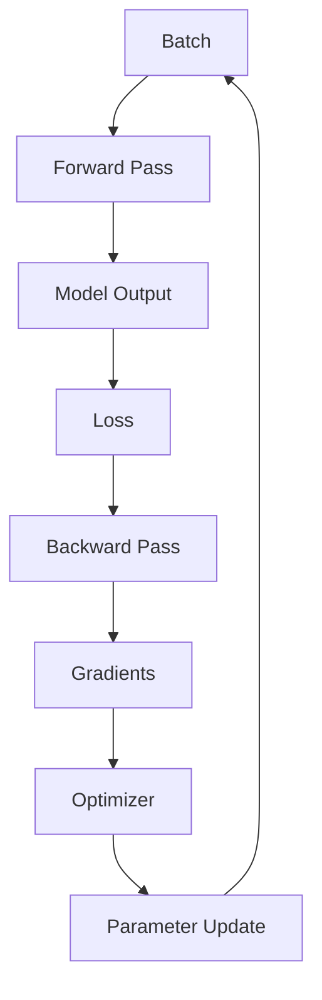

Understanding this lower-level process remains important even when using high-level Hugging Face abstractions.

---

# 30. Trainer vs Custom PyTorch

Use `Trainer` when:

- Standard supervised training is sufficient.
- The model follows standard Transformers APIs.
- You want rapid development.
- Custom training behavior is limited.

Use a custom PyTorch training loop when:

- Custom losses are required.
- Multiple models interact.
- Training logic is highly specialized.
- Reinforcement learning is involved.
- Non-standard optimization is required.
- Advanced distributed training behavior is needed.

The engineering goal is not to avoid abstractions, but to use the **right abstraction level**.

---

# 31. Model Configuration

Transformer models use configuration objects to define architectural parameters.

```python
from transformers import AutoConfig

config = AutoConfig.from_pretrained(
    "bert-base-uncased"
)

print(config)
```

Configuration may include:

- Hidden dimension
- Number of layers
- Attention heads
- Vocabulary size
- Maximum sequence length
- Dropout
- Architecture metadata

Conceptually:

```text
Configuration
      ↓
Architecture
      ↓
Model
```

---

# 32. Configuration vs Weights

It is important to distinguish:

```text
Configuration
      ↓
Defines model architecture
```

from:

```text
Weights
      ↓
Learned parameters
```

A usable pretrained model generally requires:

```text
Configuration
+
Weights
+
Tokenizer
```

This separation is fundamental to model portability.

---

# 33. Training and Evaluation Modes

PyTorch models commonly operate in two modes.

Training:

```python
model.train()
```

Inference:

```python
model.eval()
```

During inference, gradients are normally disabled:

```python
with torch.no_grad():
    outputs = model(**inputs)
```

This reduces unnecessary computation and memory consumption.

---

# 34. Device Management

Models can run on supported compute devices such as:

- CPU
- CUDA GPUs
- Other accelerators

Example:

```python
import torch

device = torch.device(
    "cuda" if torch.cuda.is_available() else "cpu"
)

model = model.to(device)
```

Inputs must be moved to the same device:

```python
inputs = {
    key: value.to(device)
    for key, value in inputs.items()
}
```

Architecture:

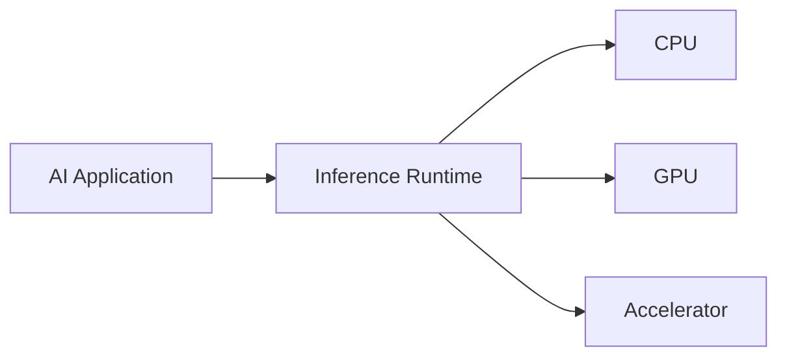

---

# 35. Batch Inference

Processing individual requests sequentially can underutilize GPU resources.

Instead:

```text
Request 1 ─┐
Request 2 ─┤
Request 3 ─┼──→ Batch → Model
Request 4 ─┘
```

Example:

```python
texts = [
    "AI is useful.",
    "The service is slow.",
    "The product is excellent."
]

inputs = tokenizer(
    texts,
    padding=True,
    truncation=True,
    return_tensors="pt"
)
```

Batching can improve:

- GPU utilization
- Throughput
- Cost efficiency

However, larger batches can increase latency and memory usage.

---

# 36. Model Loading Strategy

A major production mistake is loading the model for every request.

### Poor Architecture

```text
Request
   ↓
Load Model
   ↓
Inference
   ↓
Unload Model
```

### Better Architecture

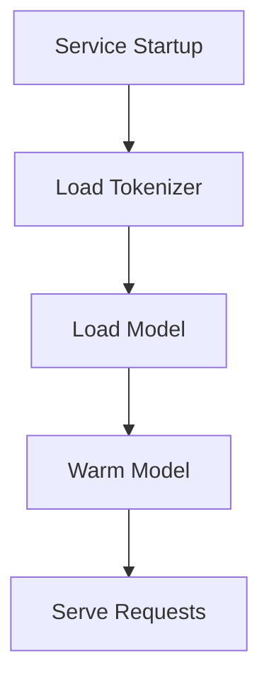

The model should generally remain loaded in memory while the service is running.

---

# 37. Production Inference Architecture

A production Transformer service can be structured as:

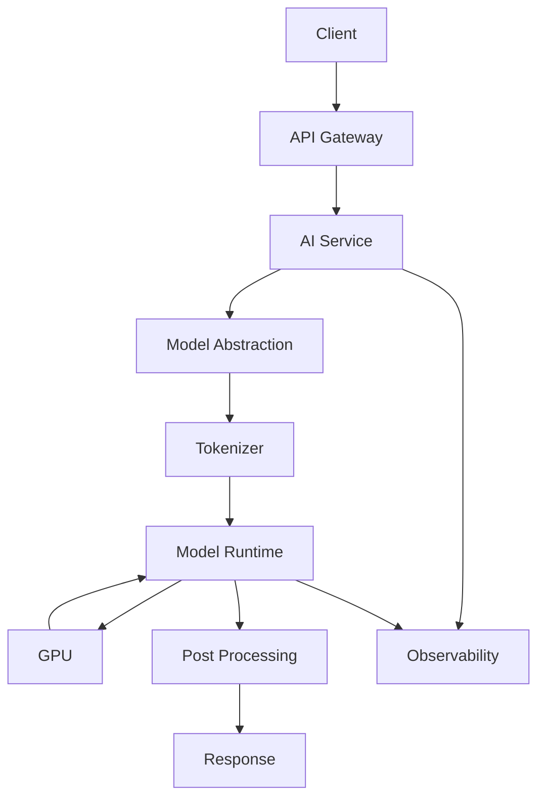

Production concerns include:

- Authentication
- Authorization
- Input validation
- Rate limiting
- Request timeouts
- Batching
- Model loading
- GPU utilization
- Logging
- Metrics
- Distributed tracing
- Cost management

---

# 38. Model Abstraction in Enterprise AI

Enterprise applications should avoid coupling business logic directly to a specific model.

Instead:

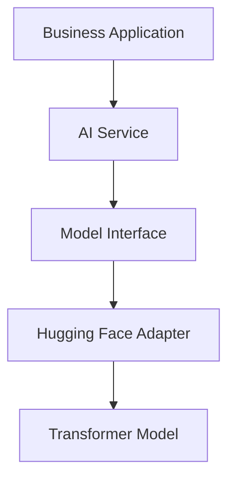

Example interface:

```python
from abc import ABC, abstractmethod


class TextGenerator(ABC):

    @abstractmethod
    def generate(
        self,
        prompt: str
    ) -> str:
        pass
```

A Hugging Face implementation can then act as an adapter:

```python
class HuggingFaceTextGenerator(TextGenerator):

    def __init__(self, tokenizer, model):
        self.tokenizer = tokenizer
        self.model = model

    def generate(self, prompt: str) -> str:

        inputs = self.tokenizer(
            prompt,
            return_tensors="pt"
        )

        outputs = self.model.generate(
            **inputs,
            max_new_tokens=100
        )

        return self.tokenizer.decode(
            outputs[0],
            skip_special_tokens=True
        )
```

This creates a clean separation:

```text
Business Capability
        ↓
Application Interface
        ↓
Hugging Face Adapter
        ↓
Model Runtime
```

This approach makes model replacement easier.

---

# 39. Hugging Face vs Native PyTorch

Hugging Face and PyTorch solve different levels of the problem.

| Hugging Face | Native PyTorch |
|---|---|
| High-level Transformer APIs | Low-level Deep Learning framework |
| Pretrained models | Custom architectures |
| Standardized model loading | Maximum flexibility |
| Tokenizers | Tensor operations |
| Trainer | Custom training loops |
| Model Hub | Custom model storage |
| Faster experimentation | Greater control |

### Use Hugging Face for

- Pretrained Foundation Models
- Transformer applications
- Fine-tuning
- LLM development
- Standard NLP workflows

### Use Native PyTorch for

- Custom architectures
- Research
- Custom training loops
- Novel algorithms
- Low-level optimization

In practice:

```text
Hugging Face
     ↓
Transformer Abstractions
     ↓
PyTorch
     ↓
Hardware
```

---

# 40. Accelerate

**Accelerate** simplifies distributed and hardware-aware training.

It supports workflows involving:

- CPU
- GPU
- Multiple GPUs
- Distributed execution
- Mixed precision
- Hardware-aware execution

Conceptually:

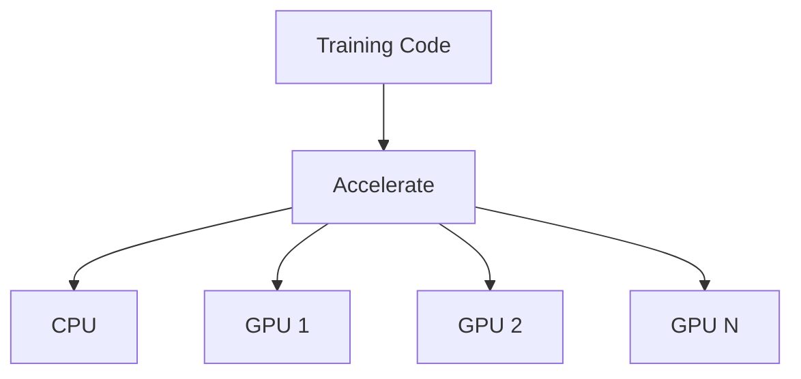

The goal is to allow training code to scale across different hardware environments without completely rewriting the application.

---

# 41. Parameter-Efficient Fine-Tuning

Hugging Face integrates with the **PEFT** ecosystem.

Common approaches include:

- LoRA
- QLoRA
- Adapter-based methods
- Prompt Tuning
- Prefix Tuning
- P-Tuning

Conceptually:

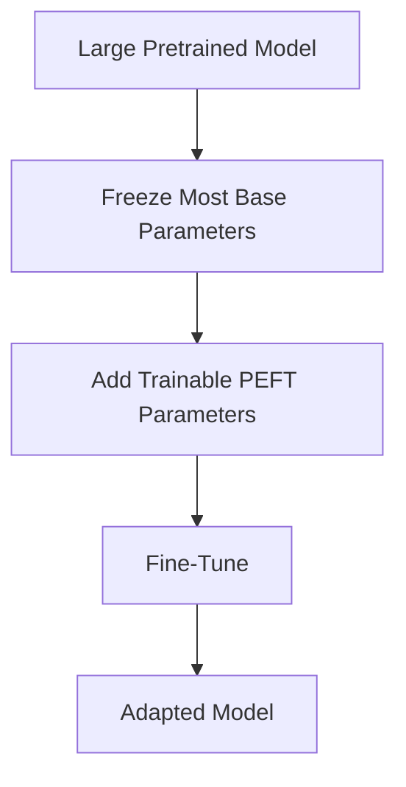

Advantages include:

- Lower GPU memory requirements
- Faster training
- Smaller checkpoints
- Lower storage cost
- Easier experimentation

Detailed PEFT techniques are covered in:

**[12. Parameter-Efficient Fine-Tuning](12-parameter-efficient-fine-tuning.md)**

---

# 42. Quantization

Quantization reduces numerical precision to reduce model memory and potentially improve inference efficiency.

Conceptually:

```text
FP32
  ↓
FP16 / BF16
  ↓
INT8
  ↓
Lower Precision
```

A simplified relationship is:

```text
Model Memory
      ≈
Number of Parameters
      ×
Bytes per Parameter
```

For example, ignoring runtime overhead:

```text
FP32 → 4 bytes / parameter
FP16 → 2 bytes / parameter
INT8 → 1 byte / parameter
```

Actual memory requirements are higher because of:

- Activations
- Temporary tensors
- Runtime overhead
- KV cache
- Batch size

Detailed quantization concepts are covered in:

**[14. Model Quantization](14-model-quantization.md)**

---

# 43. Hugging Face Model Lifecycle

A practical model lifecycle is:

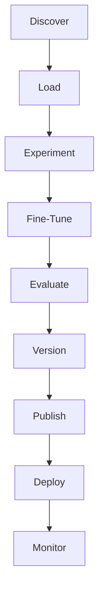

This closely resembles a software engineering lifecycle:

```text
Develop
   ↓
Test
   ↓
Version
   ↓
Release
   ↓
Monitor
```

---

# 44. Saving a Model

After training, models can be saved locally.

```python
trainer.save_model(
    "./my-model"
)

tokenizer.save_pretrained(
    "./my-model"
)
```

The resulting directory may contain:

```text
my-model/
├── config.json
├── model.safetensors
├── tokenizer.json
├── tokenizer_config.json
└── ...
```

---

# 45. Loading a Saved Model

The same standardized APIs can load the model:

```python
tokenizer = AutoTokenizer.from_pretrained(
    "./my-model"
)

model = AutoModel.from_pretrained(
    "./my-model"
)
```

This enables the same model artifact to move between:

```text
Training
   ↓
Validation
   ↓
Staging
   ↓
Production
```

---

# 46. Model Versioning

Production systems should avoid relying on an ambiguous:

```text
latest
```

reference.

Instead, use explicit versions:

```text
customer-classifier-v1
customer-classifier-v2
customer-classifier-v3
```

This enables controlled deployment:

```text
v2 → Production
v3 → Staging
```

and supports rollback when necessary.

---

# 47. Reproducibility

A production training run should ideally capture:

```text
Code Version
+
Dataset Version
+
Model Version
+
Tokenizer Version
+
Configuration
+
Hyperparameters
+
Environment
```

Conceptually:

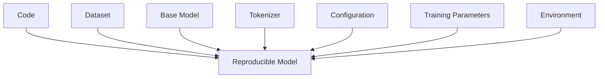

This is essential for:

- Debugging
- Auditing
- Reproducibility
- Model governance
- Rollbacks

---

# 48. Evaluation Before Deployment

A model should not be deployed simply because it successfully produces predictions.

A production evaluation pipeline should include:

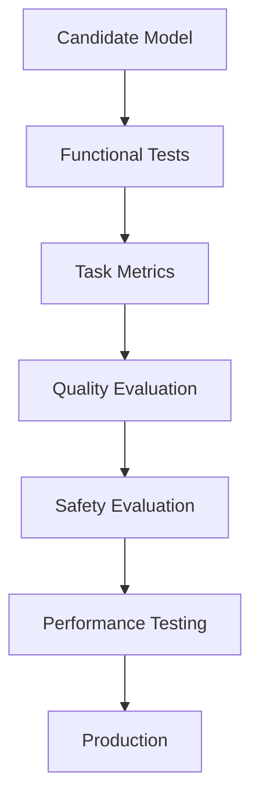

Depending on the use case, evaluate:

- Accuracy
- Precision
- Recall
- F1
- Generation quality
- Hallucination
- Safety
- Latency
- Throughput
- Memory
- Cost

---

# 49. Production Performance

Important inference metrics include:

### Latency

How long one request takes.

```text
Request
  ↓
Inference
  ↓
Response
```

### Throughput

How many requests can be processed within a given period.

```text
Requests / Second
```

### GPU Utilization

How effectively accelerator resources are being used.

### Memory Utilization

How much model and runtime memory is consumed.

### Cost

The infrastructure cost required to serve the workload.

A production system must balance all of these.

---

# 50. Batching vs Latency

Batching can improve throughput:

```text
Request 1 ─┐
Request 2 ─┤
Request 3 ─┼──→ Batch → GPU
Request 4 ─┘
```

But larger batches can increase individual request latency.

Therefore:

```text
Small Batch
    ↓
Lower Latency
    ↓
Potentially Lower Throughput

Large Batch
    ↓
Higher GPU Utilization
    ↓
Potentially Higher Throughput
```

The correct configuration depends on application Service Level Objectives.

---

# 51. Context Length

Longer sequences generally require more computation and memory.

```text
Short Context
     ↓
Lower Memory
     ↓
Lower Latency

Long Context
     ↓
Higher Memory
     ↓
Higher Latency
```

Therefore, enterprise applications should avoid sending unnecessary context to models.

This becomes especially important for:

- RAG systems
- Long documents
- Multi-turn conversations
- Agentic AI
- Long-context LLMs

---

# 52. Hugging Face in MLOps

Hugging Face components can participate in a broader MLOps lifecycle.

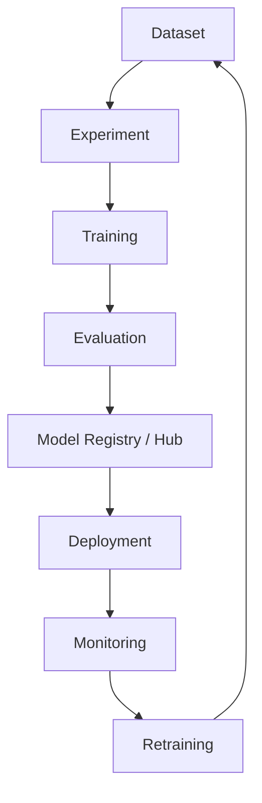

An enterprise platform may integrate Hugging Face with:

- Git
- CI/CD
- MLflow
- Docker
- Kubernetes
- Cloud object storage
- Model registries
- Monitoring platforms

---

# 53. Enterprise AI Architecture

A production enterprise AI system can use Hugging Face as one adapter within a larger architecture.

```mermaid
flowchart TD
    A["Enterprise Application"]
    B["AI Service"]
    C["Model Provider Interface"]

    C --> D["Hugging Face Adapter"]
    C --> E["Cloud AI Adapter"]
    C --> F["Other Model Provider"]

    D --> G["Transformer Model"]
    E --> H["Cloud Foundation Model"]
    F --> I["Alternative Model"]

    A --> B
    B --> C
```

This architecture avoids making the business layer dependent on one specific model provider.

---

# 54. Security and Governance

Using public or open-source models introduces governance considerations.

Before deploying a model, evaluate:

- Model license
- Usage restrictions
- Dataset provenance
- Security risks
- Sensitive data exposure
- Model provenance
- Supply-chain security
- Access controls

A production model should be treated as a software artifact that requires governance.

---

# 55. Common Mistakes

### 1. Using the Wrong Tokenizer

```text
Model A
+
Tokenizer B
=
Potentially Incorrect Input
```

Always use the tokenizer compatible with the model.

### 2. Using an Oversized Model

A large model is not automatically the best production choice.

Consider:

- Quality
- Latency
- Cost
- Memory
- Throughput

### 3. Ignoring Model License

Not every model has identical usage rights.

### 4. No Evaluation

A model that works technically may still fail business requirements.

### 5. Loading Models Per Request

Models should generally be initialized during service startup.

### 6. No Versioning

Version:

```text
Code
Dataset
Tokenizer
Model
Configuration
```

### 7. Ignoring Hardware Constraints

Model size and sequence length can dramatically affect GPU memory.

---

# 56. Best Practices

- Use the tokenizer associated with the pretrained model.
- Start with a pretrained Foundation Model whenever possible.
- Choose architecture according to the task.
- Use Pipeline APIs for rapid experimentation.
- Use direct model APIs when production control is required.
- Use `Trainer` for standardized training workflows.
- Understand the underlying PyTorch training loop.
- Use PEFT for efficient LLM adaptation where appropriate.
- Version datasets, models, and configurations.
- Evaluate models before deployment.
- Benchmark latency and throughput.
- Monitor GPU and memory utilization.
- Validate model licensing and governance requirements.
- Keep application logic decoupled from individual model implementations.
- Prefer reproducible model artifacts and deployment processes.

---

# 57. Interview Questions

## Beginner

1. What is Hugging Face?
2. What is the Transformers library?
3. What is the Hugging Face Model Hub?
4. What is a tokenizer?
5. What is `AutoTokenizer`?
6. What is the Pipeline API?
7. Why do Transformer models require tokenization?
8. What is a pretrained model?

## Intermediate

1. Explain the Hugging Face ecosystem.
2. What is the difference between `AutoModel` and `AutoModelForSequenceClassification`?
3. What is `AutoModelForCausalLM`?
4. Why should the tokenizer match the model?
5. What is the Datasets library?
6. What is a Data Collator?
7. What is the Trainer API?
8. What is Accelerate?
9. How does PEFT integrate with Hugging Face?
10. Pipeline API vs direct model API?

## Advanced

1. How would you build an enterprise NLP service using Hugging Face?
2. How would you abstract Hugging Face models behind a provider interface?
3. How would you optimize Transformer inference latency?
4. How would you handle model versioning?
5. How would you manage model and dataset reproducibility?
6. How would you deploy a large Transformer model on Kubernetes?
7. How would you optimize GPU utilization?
8. How would you choose between a small encoder model and a large decoder LLM?
9. How would you integrate Hugging Face into an MLOps pipeline?
10. What production risks should be considered when using open-source Foundation Models?

---

# 58. 🚀 Quick Revision Sheet

## Hugging Face Ecosystem

```text
Hugging Face
      │
      ├── Transformers
      ├── Tokenizers
      ├── Datasets
      ├── Trainer
      ├── Accelerate
      ├── PEFT
      ├── Evaluate
      └── Model Hub
```

---

## Typical Workflow

```text
Dataset
   ↓
Tokenizer
   ↓
Transformer Model
   ↓
Inference / Fine-Tuning
   ↓
Evaluation
   ↓
Versioning
   ↓
Deployment
   ↓
Monitoring
```

---

## Auto Classes

```text
AutoConfig
AutoTokenizer
AutoModel
AutoModelForSequenceClassification
AutoModelForTokenClassification
AutoModelForQuestionAnswering
AutoModelForCausalLM
AutoModelForSeq2SeqLM
```

---

## Model Families

### Encoder

```text
BERT
RoBERTa
DeBERTa
```

### Decoder

```text
GPT
Llama
Gemma
Mistral
Falcon
Phi
```

### Encoder-Decoder

```text
T5
BART
FLAN-T5
mT5
```

---

## Production Workflow

```text
Business Requirement
        ↓
Select Model
        ↓
Load from Hub
        ↓
Prepare Data
        ↓
Tokenize
        ↓
Fine-Tune / Inference
        ↓
Evaluate
        ↓
Version
        ↓
Deploy
        ↓
Monitor
```

---

## Remember

> **Hugging Face provides a complete ecosystem for discovering, loading, adapting, evaluating, sharing, and deploying Transformer-based Foundation Models, enabling AI Engineers to build modern AI applications without implementing every model component from scratch.**

---

# 59. Key Takeaways

- Hugging Face provides a broad ecosystem for modern Transformer-based AI development.
- The **Transformers** library provides standardized APIs for pretrained Foundation Models.
- The **Model Hub** enables model discovery, sharing, and reuse.
- **Auto Classes** simplify model and tokenizer loading across different architectures.
- **Tokenizers** convert raw text into the numerical representation required by Transformer models.
- The **Pipeline API** provides a high-level interface for rapid inference and experimentation.
- The **Datasets** library simplifies dataset loading and preprocessing.
- The **Trainer** API provides a standardized training and fine-tuning workflow.
- **Accelerate** helps scale training across hardware environments.
- **PEFT** enables efficient adaptation of large pretrained models.
- Production systems require model versioning, evaluation, reproducibility, monitoring, and governance.
- Hugging Face should be treated as part of a larger AI Engineering architecture rather than as the entire production platform.
- Enterprise applications should decouple business capabilities from specific model implementations.
- Understanding Hugging Face provides the practical foundation for the next stages of **LLM data preparation, training, fine-tuning, PEFT, LoRA, quantization, evaluation, and post-training**.

---

# 60. Chapter Navigation

### Previous

**[06. GPT and BERT Architecture](06-gpt-and-bert-architecture.md)**

### Next

**[08. LLM Data Preparation](08-llm-data-preparation.md)**

### Related Chapters

**[03. Word Embeddings](03-word-embeddings.md)**

**[04. Language Modeling](04-language-modeling.md)**

**[05. Attention and Positional Encoding](05-attention-and-positional-encoding.md)**

**[10. Transformer Fine-Tuning Fundamentals](10-transformer-fine-tuning-fundamentals.md)**

**[12. Parameter-Efficient Fine-Tuning](12-parameter-efficient-fine-tuning.md)**

**[14. Model Quantization](14-model-quantization.md)**

---

# References

- Hugging Face Documentation
- Hugging Face Transformers Documentation
- Hugging Face Tokenizers Documentation
- Hugging Face Datasets Documentation
- Hugging Face Accelerate Documentation
- Hugging Face PEFT Documentation
- PyTorch Documentation
- TensorFlow Documentation
- IBM AI Engineering Professional Certificate
- *Attention Is All You Need* — Vaswani et al.
- *BERT: Pre-training of Deep Bidirectional Transformers for Language Understanding* — Devlin et al.

---

> **Enterprise AI Engineering Handbook**  
> *Building Production-Grade Enterprise AI Systems — One Chapter at a Time.*