# 08 — LLM Data Preparation

> A practical engineering guide to **Large Language Model (LLM) Data Preparation**, covering text preprocessing, tokenization, subword algorithms, vocabulary, special tokens, token IDs, attention masks, padding, truncation, dataset preparation, batching, data collators, Hugging Face Datasets, GPT/BERT input preparation, fine-tuning datasets, data quality, reproducibility, performance optimization, and production AI data pipelines.

---

# 1. Overview

Large Language Models cannot process raw human language directly.

Before text can be consumed by a Transformer architecture, it must be transformed into structured numerical representations.

This process is known as **LLM Data Preparation**.

A modern LLM data-preparation pipeline typically includes:

- Text collection
- Text cleaning
- Text normalization
- Data validation
- Deduplication
- Tokenization
- Vocabulary mapping
- Special-token handling
- Token ID generation
- Attention-mask generation
- Padding
- Truncation
- Dataset creation
- Dataset splitting
- Batching
- Data collators
- DataLoader integration
- Label preparation
- Tensor generation


LLM data preparation is foundational for:

- LLM pretraining
- Supervised Fine-Tuning
- Instruction Tuning
- Preference Optimization
- Model Evaluation
- Inference
- Retrieval-Augmented Generation (RAG)
- AI Agents
- Agentic AI systems

---

# 2. Why LLM Data Preparation Matters

Neural networks operate on numerical tensors rather than raw natural-language strings.

Therefore, the preprocessing layer must transform human language into representations that the model can efficiently consume.

A high-quality data-preparation pipeline provides:

- Consistent model inputs
- Efficient GPU utilization
- Reduced memory consumption
- Better batching efficiency
- Reproducible preprocessing
- Scalable dataset processing
- Training and inference consistency
- Better model quality

Poor preprocessing can result in:

- Tokenizer/model incompatibility
- Excessive padding
- Excessive truncation
- Incorrect attention masks
- Incorrect labels
- Data leakage
- Training/inference mismatch
- Wasted GPU memory
- Poor throughput
- Dataset contamination

For production AI engineering, preprocessing should therefore be treated as a **first-class component of the LLM system** rather than as a temporary data-cleaning script.

The relationship can be summarized as:

```text
Data Quality
     ↓
Preprocessing Quality
     ↓
Model Input Quality
     ↓
Training / Inference Quality
     ↓
Production AI Quality
```

A preprocessing defect can therefore propagate through the entire AI lifecycle.

---

# 3. LLM Data Preparation Lifecycle

A complete LLM data-preparation lifecycle can be represented as:

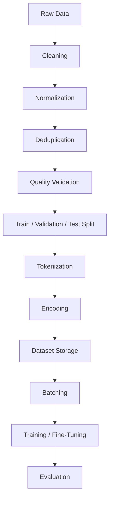

The important engineering principle is:

```text
Data
  ↓
Preparation
  ↓
Model
  ↓
Evaluation
  ↓
Production
```

A change in preprocessing can directly affect:

- Model quality
- Training cost
- GPU utilization
- Inference latency
- Memory consumption
- Evaluation results

For production systems, the data-preparation layer should therefore be independently testable and versioned.

---

# 4. Evolution of Text Representation

Natural Language Processing has evolved through several generations of text representation.

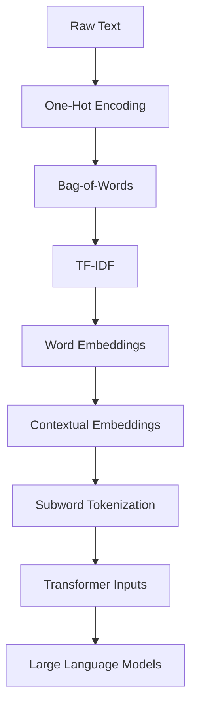

Each generation addressed limitations of previous approaches.

The progression can be summarized as:

```text
Raw Text
   ↓
Sparse Representations
   ↓
Dense Representations
   ↓
Contextual Representations
   ↓
Subword Tokenization
   ↓
Transformer Inputs
   ↓
Large Language Models
```

This evolution is important because LLM data preparation is built on many of the ideas developed during earlier NLP research.

---

# 5. One-Hot Encoding

One-Hot Encoding represents each vocabulary item using a sparse binary vector.

Suppose the vocabulary is:

```text
["AI", "Cloud", "Model"]
```

The representations are:

```text
AI      → [1, 0, 0]
Cloud   → [0, 1, 0]
Model   → [0, 0, 1]
```

Each word receives a unique position in the vector.

## Advantages

- Simple
- Easy to understand
- Easy to implement
- Deterministic representation

## Limitations

- Very sparse
- Large vectors for large vocabularies
- No semantic relationships
- Poor scalability
- Does not represent similarity between words

For example:

```text
King  → [1, 0, 0, 0]

Queen → [0, 1, 0, 0]
```

Although `King` and `Queen` are semantically related, One-Hot Encoding does not express that relationship.

Every word is essentially independent.

```text
King
  │
  └── No semantic relationship encoded

Queen
  │
  └── No semantic relationship encoded
```

This limitation motivated the development of more expressive representations.

---

# 6. Bag-of-Words

**Bag-of-Words (BoW)** represents text using word-frequency information.

For example:

```text
AI is powerful
```

can be represented as:

```text
AI        → 1
is        → 1
powerful  → 1
```

The order of the words is ignored.

Consider:

```text
Dog bites man

Man bites dog
```

Both sentences contain the same words:

```text
Dog
bites
man
```

A basic Bag-of-Words representation may therefore produce the same feature set even though the meanings are different.

## Advantages

- Simple
- Fast
- Easy to implement
- Useful as a classical NLP baseline
- Works well for some simple classification problems

## Limitations

- Ignores word order
- Ignores contextual meaning
- Sparse representation
- Poor semantic representation
- Vocabulary size can become large

Bag-of-Words is useful for understanding the evolution of NLP, but modern LLMs require significantly richer representations.

---

# 7. TF-IDF

**TF-IDF (Term Frequency-Inverse Document Frequency)** improves upon basic word-frequency representations by assigning greater importance to terms that are more informative within a document collection.

TF-IDF considers two important ideas:

```text
Term Frequency
       +
Inverse Document Frequency
       ↓
TF-IDF Score
```

A term that appears frequently within a document but rarely across the overall collection receives a higher score.

TF-IDF is useful for:

- Information retrieval
- Search
- Document classification
- Keyword analysis
- Classical NLP systems

However, TF-IDF does not provide the contextual representations required by modern Transformer-based LLMs.

It also does not naturally capture:

- Word meaning
- Context
- Long-range dependencies
- Semantic relationships

The progression therefore continues:

```text
One-Hot
   ↓
Bag-of-Words
   ↓
TF-IDF
   ↓
Word Embeddings
   ↓
Contextual Embeddings
```

---

# 8. Word Embeddings

Word embeddings represent words using dense numerical vectors.

Examples include:

- Word2Vec
- GloVe
- FastText

Conceptually:

```text
King

↓

[0.32, -0.71, 1.28, ...]
```

Unlike One-Hot Encoding, embeddings allow semantically related words to occupy related regions of vector space.

For example:

```text
King   ───── Queen

Doctor ───── Nurse

Paris  ───── France
```

The dimensions themselves do not normally have explicit human-readable meanings.

Instead, useful semantic and syntactic relationships emerge from the training process.

## Advantages

- Dense representations
- Semantic similarity
- Better generalization
- More efficient than sparse vectors
- Useful for downstream NLP tasks

Word embeddings were a major step toward modern neural NLP.

---

# 9. Contextual Embeddings

Traditional word embeddings generally provide a relatively fixed representation for a word.

Consider:

```text
The river bank was flooded.

The bank approved the loan.
```

The word `bank` has different meanings depending on its context.

A static embedding may assign one general representation to:

```text
bank
```

Modern Transformer models generate representations that depend on surrounding tokens.

Conceptually:


Therefore:

```text
River bank
     ↓
Context-aware representation

Bank account
     ↓
Different context-aware representation
```

This transition from static representations to contextual representations was fundamental to modern NLP and LLMs.

---

# 10. Text Preprocessing

Before tokenization, text may require cleaning and normalization.

Common operations can include:

- Unicode normalization
- Whitespace normalization
- Removing unwanted control characters
- Handling malformed text
- Standardizing formatting
- Detecting corrupted records
- Duplicate detection
- Removing irrelevant content

Example:

```text
Raw Input

"  Enterprise   AI   Engineering  "

        ↓

Normalized Input

"Enterprise AI Engineering"
```

However, preprocessing should be **model-aware**.

Modern pretrained tokenizers are generally trained on large collections of relatively raw text.

Excessive manual preprocessing can remove useful information.

For example, blindly removing:

- Punctuation
- Capitalization
- Symbols
- Formatting
- Code syntax

may negatively affect model behavior.

## Production Principle

> Do not apply aggressive preprocessing simply because a traditional NLP pipeline used it. Validate every transformation against the selected tokenizer, model, and downstream task.

---

# 11. Data Cleaning

Raw enterprise data often contains noise that should be addressed before training.

Typical problems include:

- Empty records
- Duplicate records
- Broken encoding
- HTML fragments
- Boilerplate
- Corrupted documents
- Invalid metadata
- Repeated content
- Extremely short records
- Extremely long records

A production cleaning pipeline can be represented as:

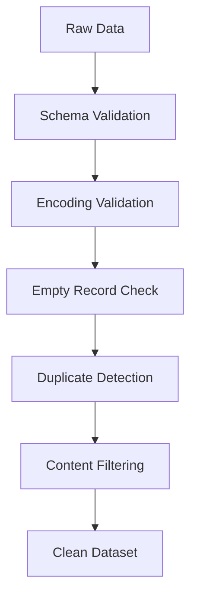

The objective is not to remove as much data as possible.

The objective is to produce **high-quality, task-relevant training data**.

A good data-cleaning pipeline should therefore distinguish between:

```text
Noise
  ↓
Remove

Useful Rare Information
  ↓
Preserve
```

Over-cleaning can be just as harmful as under-cleaning.

---

# 12. Tokenization

**Tokenization** converts text into smaller units called **tokens**.

Example:

```text
Large Language Models are powerful.
```

may conceptually become:

```text
[
    "Large",
    "Language",
    "Models",
    "are",
    "powerful",
    "."
]
```

The exact token boundaries depend on the tokenizer.

Modern LLMs generally process token sequences rather than complete words.

The high-level transformation is:

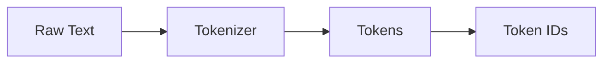

For example:

```text
Raw Text
   ↓
"Large Language Models"
   ↓
Tokenizer
   ↓
["Large", "Language", "Models"]
   ↓
Vocabulary
   ↓
[Token IDs]
```

Tokenization is therefore one of the most important stages in the LLM input pipeline.

---

# 13. Tokenizer vs Vocabulary vs Token IDs vs Embeddings

These concepts are closely related but have different responsibilities.

| Component | Responsibility |
|---|---|
| Tokenizer | Converts text into tokens |
| Vocabulary | Maps tokens to IDs |
| Token IDs | Numerical representation of tokens |
| Embedding Layer | Converts IDs into dense vectors |
| Transformer | Processes contextual representations |

The complete transformation is:

```text
Sentence
   ↓
Tokenizer
   ↓
Tokens
   ↓
Vocabulary
   ↓
Token IDs
   ↓
Embedding Layer
   ↓
Embedding Vectors
   ↓
Transformer
```

Think about the components as:

```text
Tokenizer
→ Breaks text into model-recognized units.

Vocabulary
→ Assigns each unit an integer ID.

Token IDs
→ Represent tokens numerically.

Embedding Layer
→ Converts token IDs into dense vectors.

Transformer
→ Builds contextual representations from those vectors.
```

This distinction is important when debugging LLM pipelines.

For example, if tokenization is incorrect, changing the embedding layer will not solve the problem.

---

# 14. Types of Tokenization

The major approaches are:

- Word tokenization
- Character tokenization
- Subword tokenization

Modern LLMs primarily use **subword tokenization**.

---

## 14.1 Word Tokenization

Word tokenization splits text into complete words.

```text
Machine Learning is powerful

↓

["Machine", "Learning", "is", "powerful"]
```

### Advantages

- Easy to understand
- Human-readable
- Natural representation
- Straightforward implementation

### Limitations

- Very large vocabulary
- Out-of-vocabulary problems
- Poor handling of rare words
- Vocabulary management becomes difficult
- Morphologically related words may be treated independently

For example:

```text
play
playing
played
player
```

may all become separate vocabulary entries.

This increases vocabulary size.

---

## 14.2 Character Tokenization

Character tokenization splits text character by character.

```text
AI

↓

["A", "I"]
```

Another example:

```text
Model

↓

["M", "o", "d", "e", "l"]
```

### Advantages

- Small vocabulary
- Handles unseen words
- Language-independent
- No traditional out-of-vocabulary problem

### Limitations

- Very long sequences
- Higher computational cost
- Weak word-level semantics
- More tokens required to represent the same content

For example:

```text
Artificial Intelligence
```

could become dozens of character-level tokens.

That increases sequence length and therefore Transformer computation.

---

## 14.3 Subword Tokenization

Subword tokenization provides a balance between word-level and character-level approaches.

Example:

```text
unbelievable

↓

["un", "believ", "able"]
```

A rare word can therefore be represented using known subword components.

Subword tokenization helps reduce:

- Vocabulary size
- Out-of-vocabulary problems
- Unknown-token frequency

while maintaining reasonable sequence lengths.

### Advantages

- Smaller vocabulary
- Handles rare words
- Better generalization
- Supports previously unseen words through subword composition
- Efficient for Transformer models
- Works well across many languages and domains

The basic idea is:

```text
Complete Word
      ↓
Known Subword Units
      ↓
Token IDs
```

Modern LLM tokenizers use variants of this general approach.

---

# 15. Popular Subword Tokenization Algorithms

Important tokenization algorithms include:

- WordPiece
- Byte Pair Encoding (BPE)
- SentencePiece
- Unigram

These approaches differ in how they construct and select vocabulary units.

---

## 15.1 WordPiece

WordPiece is strongly associated with BERT-family models.

Conceptually:

```text
playing

↓

play + ##ing
```

The `##` notation is commonly associated with WordPiece tokenization to indicate a continuation subword in certain BERT tokenizers.

WordPiece attempts to construct useful subword units while maintaining a manageable vocabulary.

Conceptually:

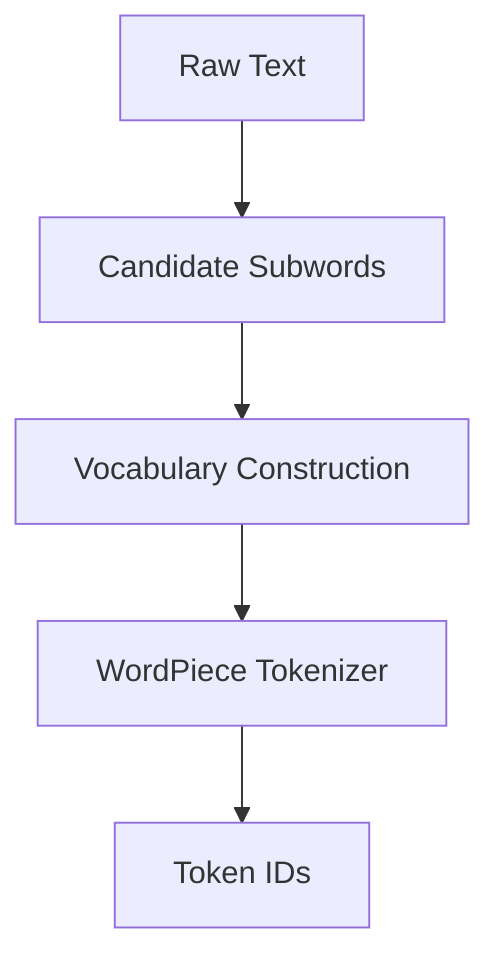

---

## 15.2 Byte Pair Encoding

**Byte Pair Encoding (BPE)** repeatedly merges frequently occurring token pairs.

Conceptually:

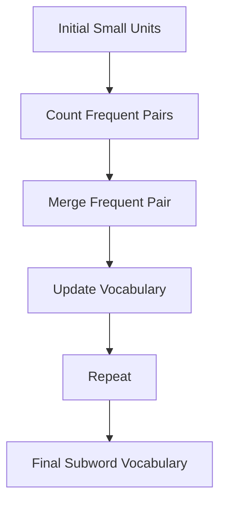

A simplified example:

```text
l o w
```

may evolve through frequent merges into larger units.

The important idea is:

```text
Small Units
     ↓
Frequent Pair Detection
     ↓
Merge
     ↓
Larger Subword Units
```

BPE is widely used in modern generative language-model ecosystems.

---

## 15.3 SentencePiece

SentencePiece treats input as a raw character stream rather than depending on whitespace-based tokenization.

```text
Raw Text
    ↓
SentencePiece
    ↓
Subword Tokens
    ↓
Token IDs
```

This makes SentencePiece useful for multilingual and language-independent tokenization.

A key idea is:

> SentencePiece can operate directly on raw text without requiring traditional whitespace tokenization first.

---

## 15.4 Unigram

Unigram uses a probabilistic vocabulary-selection approach to identify useful subword units.

Instead of repeatedly merging tokens in the same manner as BPE, the Unigram approach starts from a larger candidate vocabulary and removes less useful pieces according to a probabilistic objective.

Conceptually:

```text
Large Candidate Vocabulary
          ↓
Probability-Based Evaluation
          ↓
Remove Less Useful Pieces
          ↓
Final Vocabulary
```

Unigram is another important tokenization strategy in modern Transformer ecosystems.

# 16. Vocabulary

A **vocabulary** is the collection of tokens recognized by a tokenizer.

Each token is associated with a unique numerical identifier called a **token ID**.

For example:

| Token | Token ID |
|---|---:|
| AI | 1542 |
| language | 3921 |
| model | 872 |
| `<pad>` | 0 |

The relationship is:

```text
Token
  ↓
Vocabulary
  ↓
Token ID
```

The vocabulary is tightly coupled to the tokenizer and pretrained model.

## Important Rule

> The tokenizer, vocabulary, and pretrained model must remain compatible.

Do not arbitrarily replace the vocabulary of a pretrained model.

---

# 17. Special Tokens

Special tokens provide structural information to Transformer models.

Common examples include:

| Token | Purpose |
|---|---|
| `<bos>` | Beginning of sequence |
| `<eos>` | End of sequence |
| `<pad>` | Padding |
| `<unk>` | Unknown token |
| `<cls>` | Classification |
| `<sep>` | Sequence separator |
| `<mask>` | Masked language modeling |

Example:

```text
<bos>
Hello world
<eos>
```

A sentence-pair input may look conceptually like:

```text
[CLS] Sentence A [SEP] Sentence B [SEP]
```

Not every model uses every special token.

Always use the tokenizer configuration associated with the selected model.

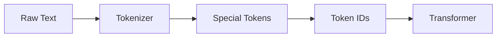

---

# 18. Token IDs

After tokenization, each token is converted into an integer ID.

Conceptually:

```text
Enterprise AI Engineering

↓

["Enterprise", "AI", "Engineering"]

↓

[1542, 4682, 9831]
```

The actual IDs depend on the tokenizer vocabulary.

Transformer models consume these numerical IDs rather than raw strings.

The complete transformation is:


Token IDs themselves are not semantic vectors.

They are categorical identifiers.

The embedding layer converts these identifiers into dense numerical representations.

---

# 19. Attention Masks

An **attention mask** identifies which positions contain meaningful input.

Example:

```text
Tokens:

Hello world <pad> <pad>

Attention Mask:

1     1     0     0
```

Where:

```text
1 → Valid token
0 → Padding
```

The attention mask prevents padding positions from being treated as meaningful content.

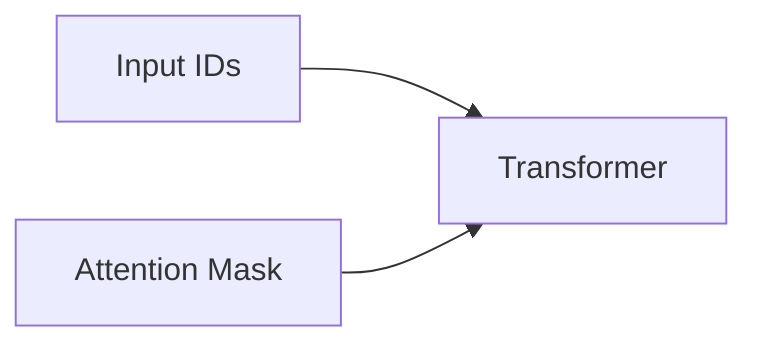

For a batch:

```text
Input IDs:

[101, 7592, 2088, 102,    0,    0]

Attention Mask:

[  1,    1,    1,   1,    0,    0]
```

The model can therefore distinguish:

```text
Real Tokens
    ↓
Process

Padding Tokens
    ↓
Ignore
```

Attention masks are particularly important when batches contain sequences of different lengths.

---

# 20. Padding

Natural-language sequences have different lengths.

For example:

```text
Sequence A:
I love AI

Sequence B:
I love AI systems
```

To process them as a batch:

```text
Sequence A:
I love AI <pad>

Sequence B:
I love AI systems
```

Attention masks become:

```text
Sequence A:
1 1 1 0

Sequence B:
1 1 1 1
```

Padding allows variable-length sequences to be represented as compatible tensors.

The general process is:

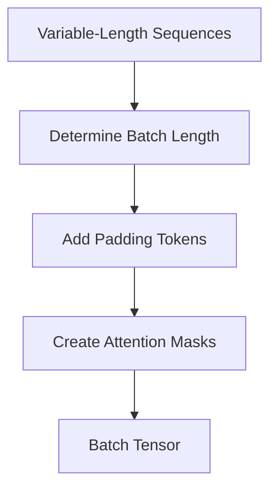

---

# 21. Static vs Dynamic Padding

There are two common padding strategies:

- Static padding
- Dynamic padding

| Static Padding | Dynamic Padding |
|---|---|
| Fixed sequence length | Batch-dependent sequence length |
| Simple | More memory efficient |
| Predictable tensor shape | Reduces unnecessary padding |
| Can waste computation | Usually better for variable-length data |

### Static Padding

Every sequence is padded to the same predefined length.

```text
Every sequence
      ↓
512 tokens
```

For example:

```text
Input A → 512 tokens
Input B → 512 tokens
Input C → 512 tokens
```

Even if the actual sequences are much shorter, the remaining positions are padding.

### Dynamic Padding

Sequences are padded only to the longest sequence in the current batch.

```text
Batch 1 → 128 tokens
Batch 2 → 256 tokens
Batch 3 → 96 tokens
```

Conceptually:

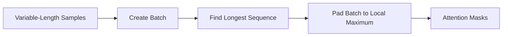

Dynamic padding can significantly reduce wasted computation.

---

# 22. Truncation

Transformer models have a maximum supported sequence length.

If an input exceeds that limit, it may need to be truncated.

```text
Long Document
      ↓
Maximum Sequence Length
      ↓
Truncated Input
```

A Hugging Face example:

```python
encoded = tokenizer(
    text,
    truncation=True,
    max_length=512
)
```

Truncation can also be combined with padding:

```python
encoded = tokenizer(
    text,
    truncation=True,
    padding="max_length",
    max_length=512
)
```

However, the two operations solve different problems:

```text
Truncation
→ Controls sequences that are too long.

Padding
→ Aligns sequences that are too short.
```

## Production Warning

Truncation is not simply a technical setting.

It is an **information-management decision**.

For long enterprise documents, blindly truncating content can remove critical information.

Alternatives may include:

- Chunking
- Sliding windows
- Hierarchical processing
- Retrieval
- Summarization
- Long-context models

The right strategy depends on the task.

---

# 23. Sequence Length Analysis

Before training, analyze the token-length distribution of the dataset.

Useful statistics include:

```text
Minimum
Average
Median
P90
P95
P99
Maximum
```

Example:

```text
P50  → 128 tokens
P90  → 256 tokens
P95  → 384 tokens
P99  → 1024 tokens
Max  → 12000 tokens
```

Setting every example to 12,000 tokens would waste significant resources.

Therefore:

> **Maximum sequence length should be selected using workload statistics and model requirements, not simply the largest observed example.**

A useful analysis pipeline is:

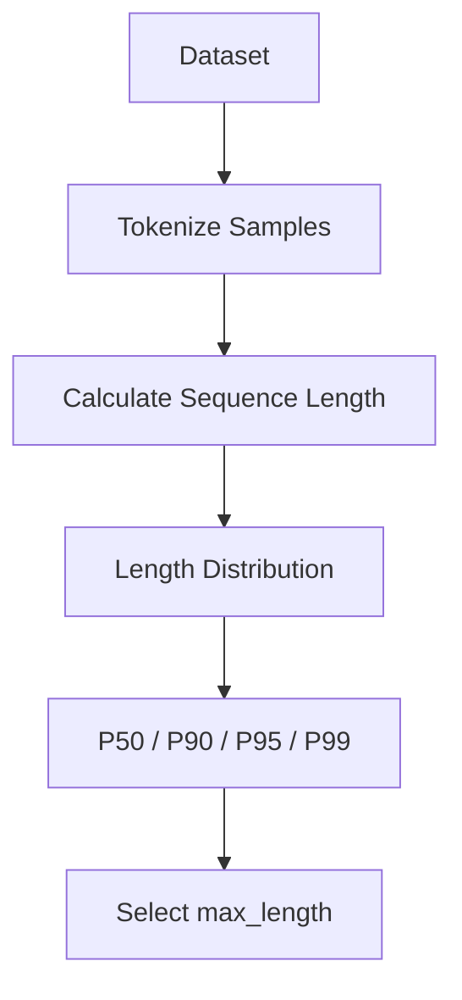

Sequence length directly influences Transformer resource requirements.

Longer sequences generally mean:

- More memory
- More computation
- Larger batches becoming difficult
- Higher training cost
- Higher inference latency

---

# 24. Hugging Face Dataset Preparation

The Hugging Face `datasets` library provides standardized tooling for loading and processing datasets.

```python
from datasets import load_dataset

dataset = load_dataset("imdb")

print(dataset)
```

A dataset may contain:

```text
DatasetDict
├── train
├── validation
└── test
```

depending on the dataset.

Datasets may originate from:

- Hugging Face Hub
- CSV
- JSON
- Parquet
- Local files
- Object storage
- Enterprise data pipelines

The high-level workflow is:

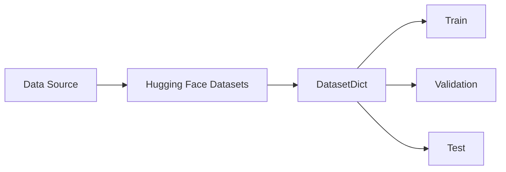

The `datasets` library provides a consistent abstraction for dataset processing before training.

---

# 25. Loading Local Data

Enterprise projects frequently use local or organization-specific datasets.

For example, a CSV file can be loaded using:

```python
from datasets import load_dataset

dataset = load_dataset(
    "csv",
    data_files="data/train.csv"
)
```

JSON can be loaded using:

```python
dataset = load_dataset(
    "json",
    data_files="data/train.json"
)
```

Parquet can be loaded using:

```python
dataset = load_dataset(
    "parquet",
    data_files="data/train.parquet"
)
```

The general architecture is:

```text
Enterprise Data
      ↓
CSV / JSON / Parquet
      ↓
Hugging Face Dataset
      ↓
Preprocessing
      ↓
Tokenization
      ↓
Training
```

For large-scale production systems, Parquet and object-storage-based datasets are often useful because they support efficient columnar data access and scalable storage patterns.

---

# 26. Tokenizing a Dataset

A preprocessing function can be applied using `.map()`.

```python
def tokenize_function(batch):
    return tokenizer(
        batch["text"],
        truncation=True,
        padding=False
    )

tokenized_dataset = dataset.map(
    tokenize_function,
    batched=True
)
```

The pipeline is:


Using:

```python
batched=True
```

allows multiple examples to be processed per invocation.

This is generally more efficient than repeatedly invoking the tokenizer for individual examples.

---

# 27. Tokenization with Maximum Sequence Length

A common preprocessing configuration is:

```python
def tokenize_function(batch):
    return tokenizer(
        batch["text"],
        truncation=True,
        max_length=512,
        padding=False
    )
```

This provides:

```text
truncation=True
    ↓
Prevent sequences from exceeding max_length

max_length=512
    ↓
Maximum sequence length

padding=False
    ↓
Do not add unnecessary padding during dataset preprocessing
```

Padding can instead be handled later at batch creation time.

This is particularly useful when using dynamic padding.

---

# 28. Data Collators

A **Data Collator** converts individual tokenized examples into model-ready batches.

```text
Tokenized Samples
       ↓
Data Collator
       ↓
Dynamically Padded Batch
       ↓
Transformer
```

A common Hugging Face implementation is:

```python
from transformers import DataCollatorWithPadding

data_collator = DataCollatorWithPadding(
    tokenizer=tokenizer
)
```

A data collator can handle:

- Padding
- Tensor creation
- Label preparation
- Batch formatting
- Task-specific processing

The architecture is:

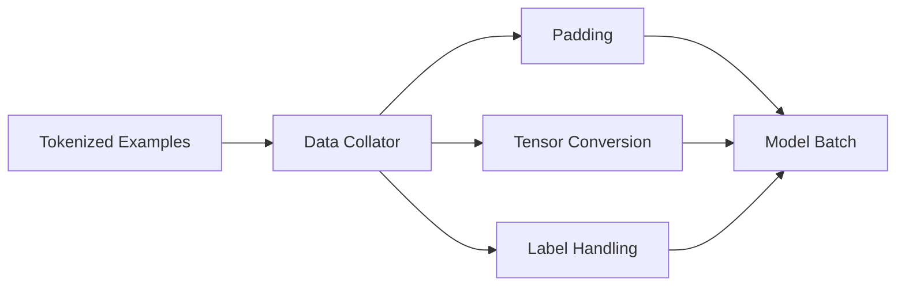

---

# 29. Dynamic Padding with Data Collators

Dynamic padding is particularly useful with Hugging Face training workflows.

Example:

```python
from transformers import DataCollatorWithPadding

data_collator = DataCollatorWithPadding(
    tokenizer=tokenizer,
    padding=True
)
```

Suppose a batch contains:

```text
Example A → 80 tokens
Example B → 120 tokens
Example C → 100 tokens
```

The collator may create:

```text
Batch length = 120
```

instead of padding every example to a fixed maximum such as 512.

Conceptually:

```text
80 tokens
   ↓
+40 padding

100 tokens
   ↓
+20 padding

120 tokens
   ↓
No padding
```

This can improve:

- Memory efficiency
- GPU utilization
- Training throughput

---

# 30. PyTorch Dataset and DataLoader

PyTorch provides two important abstractions:

- `Dataset`
- `DataLoader`


Example:

```python
from torch.utils.data import DataLoader

loader = DataLoader(
    dataset,
    batch_size=16,
    shuffle=True
)
```

A DataLoader provides:

- Mini-batching
- Shuffling
- Iteration
- Parallel data loading
- Efficient data delivery

The overall flow is:

```text
Dataset
   ↓
DataLoader
   ↓
Mini-Batch
   ↓
GPU
   ↓
Model
```

---

# 31. Dataset vs DataLoader

| Dataset | DataLoader |
|---|---|
| Represents the data | Delivers the data |
| Provides samples | Provides batches |
| Defines data structure | Handles iteration |
| Data abstraction | Training input pipeline |

Think of it as:

```text
Dataset
=
"What is my data?"

DataLoader
=
"How do I deliver my data to the model?"
```

A useful engineering distinction is:


---

# 32. Batching

Instead of processing one example at a time, models process groups of examples called mini-batches.

Example:

```text
Sentence 1
Sentence 2
Sentence 3
Sentence 4

        ↓

Mini-Batch
```

Advantages:

- Better hardware utilization
- Higher throughput
- Efficient tensor operations
- More stable optimization

Typical batch sizes may include:

- 8
- 16
- 32
- 64
- 128+

The optimal value depends on:

- GPU memory
- Model size
- Sequence length
- Precision
- Training objective

A simplified training pipeline is:


---

# 33. Batch Size vs Sequence Length

Batch size and sequence length are two important drivers of memory usage.

A simplified relationship is:

```text
Memory Requirement
        ↑
        │
        ├── Batch Size
        ├── Sequence Length
        ├── Model Size
        └── Precision
```

For example:

```text
Batch Size = 8
Sequence Length = 512
```

can require substantially less memory than:

```text
Batch Size = 32
Sequence Length = 2048
```

Therefore, increasing both simultaneously can quickly exceed GPU memory.

Production tuning should consider:

```text
Effective Batch Size
=
Per-GPU Batch Size
×
Gradient Accumulation
×
Number of GPUs
```

---

# 34. Length-Aware Batching

Randomly grouping very different sequence lengths can produce excessive padding.

Poor batching:

```text
Batch:

32 tokens
512 tokens
128 tokens
1024 tokens
64 tokens
```

Length-aware batching groups similar-length sequences.

```text
Batch A:

32
48
64
72

Batch B:

480
512
540
560
```

Pipeline:

```mermaid
flowchart LR
    A["Variable-Length Examples"] --> B["Length Analysis"]
    B --> C["Length Bucketing"]
    C --> D["Similar-Length Batches"]
    D --> E["Dynamic Padding"]
    E --> F["Transformer"]
```

Benefits include:

- Lower padding overhead
- Better GPU utilization
- Better throughput
- Lower memory consumption

Length-aware batching is especially useful when sequence lengths vary significantly.

---

# 35. Sequence Packing

For some training workloads, multiple shorter examples can be packed into a single sequence to reduce unused token capacity.

Conceptually:

```text
Example A: 100 tokens
Example B: 120 tokens
Example C: 80 tokens

        ↓

Packed Sequence

300 useful tokens
```

Without packing:

```text
100 + 120 + 80
+
Unused Padding
```

With packing:

```text
Higher Token Utilization
```

Sequence packing is especially relevant to large-scale language-model training where maximizing tokens processed per GPU step is important.

Conceptually:

```mermaid
flowchart LR
    A["Short Examples"] --> B["Packing Strategy"]
    B --> C["Packed Sequence"]
    C --> D["Training Batch"]
    D --> E["Transformer"]
```

Packing must be implemented carefully because the model must not incorrectly treat unrelated examples as one semantic sequence.

For causal language modeling, boundaries between packed examples must be handled correctly according to the training framework and objective.

---

# 36. Preparing Data for Fine-Tuning

Foundation Models are pretrained on large general-purpose datasets.

Enterprise applications often require task-specific fine-tuning datasets.

Typical examples include:

- Question-answer pairs
- Instruction-response examples
- Chat conversations
- Classification datasets
- Summarization examples
- Domain-specific documents
- Customer-support conversations

Typical workflow:

```mermaid
flowchart TD
    A["Raw Business Data"] --> B["Cleaning"]
    B --> C["Filtering"]
    C --> D["Formatting"]
    D --> E["Instruction / Response"]
    E --> F["Tokenization"]
    F --> G["Training Dataset"]
    G --> H["Fine-Tuning"]
```

The quality of fine-tuning data directly influences:

- Model behavior
- Task performance
- Domain adaptation
- Safety
- Instruction following

Fine-tuning data preparation should therefore be treated as a data-engineering problem rather than simply a formatting task.

---

# 37. Classification Dataset Preparation

For classification tasks, a dataset may contain:

```text
text
label
```

Example:

```json
{
  "text": "The payment failed.",
  "label": 1
}
```

The preprocessing pipeline becomes:

```mermaid
flowchart LR
    A["Text"] --> B["Tokenizer"]
    B --> C["Input IDs"]
    B --> D["Attention Mask"]
    E["Label"] --> F["Training Batch"]
    C --> F
    D --> F
```

Example:

```python
def tokenize_function(batch):
    return tokenizer(
        batch["text"],
        truncation=True,
        max_length=256
    )

tokenized_dataset = dataset.map(
    tokenize_function,
    batched=True
)
```

The label normally remains associated with the example so that the training framework can calculate the task-specific loss.

---

# 38. Instruction and Chat Data

Instruction-tuning datasets commonly represent examples as instruction-response pairs.

Example:

```json
{
  "instruction": "Explain what a Transformer is.",
  "input": "",
  "output": "A Transformer is a neural architecture based on attention."
}
```

Modern conversational models may use structured messages:

```python
messages = [
    {
        "role": "system",
        "content": "You are an AI assistant."
    },
    {
        "role": "user",
        "content": "Explain Transformers."
    },
    {
        "role": "assistant",
        "content": "Transformers are neural architectures..."
    }
]
```

A model-specific chat template can format these messages:

```python
formatted = tokenizer.apply_chat_template(
    messages,
    tokenize=False,
    add_generation_prompt=True
)
```

The exact formatting must match the selected model's expected chat format.

The conceptual flow is:

```mermaid
flowchart TD
    A["Structured Messages"] --> B["Chat Template"]
    B --> C["Formatted Conversation"]
    C --> D["Tokenizer"]
    D --> E["Token IDs"]
    E --> F["Training / Inference"]
```

---

# 39. Chat Templates

Different instruction-tuned and chat-oriented models may expect different conversation formats.

For example, the conceptual representation:

```text
System
User
Assistant
```

may be transformed into model-specific control tokens.

Therefore:

> Do not manually invent a chat format when the model provides a tokenizer chat template.

Example:

```python
messages = [
    {
        "role": "user",
        "content": "What is RAG?"
    }
]

text = tokenizer.apply_chat_template(
    messages,
    tokenize=False,
    add_generation_prompt=True
)
```

The chat template provides model-compatible formatting.

This is especially important when working with instruction-tuned models.

---

# 40. Labels and Target Preparation

Different training objectives require different target structures.

For classification:

```text
Input
  ↓
Class Label
```

For causal language modeling:

```text
Previous Tokens
       ↓
Next Token Targets
```

For masked language modeling:

```text
Masked Input
      ↓
Original Token Targets
```

For preference optimization:

```text
Prompt
  +
Chosen Response
  +
Rejected Response
```

The preprocessing pipeline must therefore understand the training objective.

```mermaid
flowchart TD
    A["Task Definition"] --> B["Dataset Format"]
    B --> C["Input Preparation"]
    B --> D["Target Preparation"]
    C --> E["Model"]
    D --> E
```

---

# 41. Data Preparation for Causal Language Modeling

Causal Language Modeling predicts the next token based on previous tokens.

Example:

```text
The model is
```

Target:

```text
powerful
```

The conceptual training relationship is:

```text
Input:

The model is

Target:

model is powerful
```

At token level:

```text
Input Tokens:
[t1, t2, t3]

Target Tokens:
[t2, t3, t4]
```

The exact shifting behavior is typically handled by the training model or data collator.

The core objective is:

```mermaid
flowchart LR
    A["Previous Tokens"] --> B["Causal Transformer"]
    B --> C["Next-Token Probabilities"]
    C --> D["Target Token"]
    D --> E["Loss"]
```

---

# 42. Data Preparation for Masked Language Modeling

Masked Language Modeling hides selected tokens and asks the model to predict them.

Example:

```text
The Transformer uses [MASK] mechanisms.
```

Target:

```text
attention
```

Conceptually:

```mermaid
flowchart LR
    A["Original Text"] --> B["Mask Selected Tokens"]
    B --> C["Masked Input"]
    C --> D["Encoder"]
    D --> E["Predicted Tokens"]
    E --> F["Loss"]
```

This objective is associated strongly with encoder-based architectures such as BERT.

---

# 43. Dataset Quality

Dataset quality is one of the most important factors in LLM training.

Important checks include:

- Missing records
- Empty records
- Duplicate examples
- Invalid labels
- Corrupted text
- Excessively long examples
- Data leakage
- Train/test overlap

A production validation pipeline can look like:

```mermaid
flowchart TD
    A["Raw Dataset"] --> B["Schema Validation"]
    B --> C["Missing / Empty Check"]
    C --> D["Duplicate Detection"]
    D --> E["Length Validation"]
    E --> F["Label Validation"]
    F --> G["Leakage Detection"]
    G --> H["Validated Dataset"]
```

The goal is not simply to maximize dataset size.

The goal is to maximize **useful training signal**.

---

# 44. Data Leakage

Data leakage occurs when information from validation or test data unintentionally enters the training process.

Example:

```text
Training Dataset
        +
Validation Dataset
        ↓
Duplicate Examples
```

This can produce artificially high evaluation results.

A safer workflow is:

```text
Raw Dataset
      ↓
Deduplication
      ↓
Train / Validation / Test Split
      ↓
Independent Processing
```

For enterprise datasets, leakage detection should be treated as part of dataset engineering.

Potential leakage sources include:

- Exact duplicates
- Near duplicates
- Repeated documents
- Shared customer records
- Temporal leakage
- Future information appearing in training data

---

# 45. Deduplication

Large language-model datasets can contain repeated or near-repeated content.

Duplicates may appear because:

- The same document exists in multiple locations
- Web pages are mirrored
- Documents are versioned
- Data sources overlap
- Crawling systems collect the same content repeatedly

A simplified pipeline is:

```mermaid
flowchart TD
    A["Raw Documents"] --> B["Normalization"]
    B --> C["Exact Duplicate Detection"]
    C --> D["Near-Duplicate Detection"]
    D --> E["Unique Dataset"]
```

Deduplication can improve:

- Dataset efficiency
- Training signal diversity
- Evaluation reliability
- Storage efficiency

It can also reduce the risk of train/test contamination.

---

# 46. Data Splitting

A dataset should generally be divided according to the training objective.

Common splits include:

```text
Training
Validation
Test
```

Conceptually:

```mermaid
flowchart LR
    A["Raw Dataset"] --> B["Split Strategy"]
    B --> C["Training Set"]
    B --> D["Validation Set"]
    B --> E["Test Set"]
```

For some enterprise use cases, temporal splitting may be more appropriate.

Example:

```text
Historical Data
      ↓
Training

Recent Data
      ↓
Validation

Future / Holdout Data
      ↓
Test
```

The splitting strategy should reflect how the model will actually be evaluated in production.

---

# 47. Dataset Versioning

A production LLM pipeline should version its datasets.

For example:

```text
customer-support-v1
customer-support-v2
customer-support-v3
```

Track:

```text
Dataset Version
      +
Tokenizer Version
      +
Preprocessing Version
      +
Training Configuration
```

This enables:

- Reproducibility
- Debugging
- Auditing
- Rollbacks
- Model comparison

A useful lineage model is:

```mermaid
flowchart LR
    A["Dataset v3"] --> B["Preprocessing v5"]
    B --> C["Tokenizer v2"]
    C --> D["Training Config v7"]
    D --> E["Model v12"]
```

This allows engineers to trace a production model back to the exact data and preprocessing configuration used to create it.


# 57. Production Workflow

A production-grade LLM data-preparation workflow should treat data preparation as a versioned, observable, and reproducible engineering pipeline.

```mermaid
flowchart TD
    A["Enterprise Data Sources"] --> B["Data Ingestion"]
    B --> C["Schema Validation"]
    C --> D["Data Cleaning"]
    D --> E["Deduplication"]
    E --> F["Data Quality Checks"]
    F --> G["Train / Validation / Test Split"]
    G --> H["Tokenizer"]
    H --> I["Tokenized Dataset"]
    I --> J["Sequence Length Analysis"]
    J --> K["Batching / Packing"]
    K --> L["Data Collator"]
    L --> M["Training Pipeline"]
    M --> N["Evaluation"]
    N --> O["Model Registry"]
```

A production workflow should maintain lineage across:

```text
Source Dataset
      ↓
Dataset Version
      ↓
Preprocessing Version
      ↓
Tokenizer Version
      ↓
Tokenized Dataset
      ↓
Training Configuration
      ↓
Model Version
      ↓
Evaluation Results
```

Important production capabilities include:

- Dataset versioning
- Data validation
- Data quality monitoring
- Deduplication
- Leakage detection
- Tokenizer versioning
- Sequence-length analysis
- Efficient batching
- Checkpointing
- Reproducibility
- Security
- Auditability
- Observability

## Production Data Lineage

```mermaid
flowchart LR
    A["Raw Dataset v1"] --> B["Preprocessing v2"]
    B --> C["Tokenizer v3"]
    C --> D["Training Config v4"]
    D --> E["Model v5"]
    E --> F["Evaluation v5"]
    F --> G["Production"]
```

A production AI engineer should be able to answer:

```text
Which data produced this model?

Which preprocessing pipeline was used?

Which tokenizer version was used?

Which sequence length was configured?

Which training configuration was used?

Which evaluation dataset produced these metrics?
```

If these questions cannot be answered, the training pipeline has insufficient lineage and reproducibility.

---

# 58. Production Data Quality Gates

Before data reaches the training pipeline, production systems should apply quality gates.

```mermaid
flowchart TD
    A["Incoming Dataset"] --> B{"Schema Valid?"}
    B -->|No| X["Reject"]
    B -->|Yes| C{"Missing Data?"}
    C -->|Yes| X
    C -->|No| D{"Duplicates?"}
    D -->|Yes| E["Deduplicate"]
    D -->|No| F{"Valid Labels?"}
    E --> F
    F -->|No| X
    F -->|Yes| G{"Length Valid?"}
    G -->|No| H["Filter / Transform"]
    G -->|Yes| I["Approved Dataset"]
    H --> I
```

Useful quality metrics include:

- Total records
- Valid records
- Invalid records
- Duplicate rate
- Missing-value rate
- Average token length
- P95 token length
- P99 token length
- Truncation rate
- Padding ratio
- Label distribution

---

# 59. Production Workflow Checklist

Before starting an LLM training or fine-tuning job:

```text
[ ] Dataset source identified
[ ] Dataset version recorded
[ ] Schema validated
[ ] Missing values checked
[ ] Duplicate detection completed
[ ] Data leakage checked
[ ] Labels validated
[ ] Train/validation/test strategy defined
[ ] Tokenizer version recorded
[ ] Token length distribution analyzed
[ ] Maximum sequence length selected
[ ] Padding strategy selected
[ ] Truncation strategy selected
[ ] Data collator configured
[ ] Batch strategy defined
[ ] Training configuration versioned
[ ] Checkpoint strategy configured
[ ] Evaluation metrics defined
[ ] Experiment tracking enabled
[ ] Model lineage recorded
```

---

# 60. Remember

> **LLM data preparation is not simply text preprocessing. It is the engineering layer that transforms raw data into reliable, efficient, model-compatible training and inference inputs.**

Remember the complete transformation:

```text
Raw Data
   ↓
Cleaning
   ↓
Validation
   ↓
Deduplication
   ↓
Dataset Split
   ↓
Tokenization
   ↓
Token IDs
   ↓
Attention Masks
   ↓
Padding / Truncation
   ↓
Batching
   ↓
Model
```

And remember the most important production principle:

```text
Better Data
    +
Correct Tokenization
    +
Efficient Batching
    +
Reproducible Pipeline
    +
Strong Evaluation
    ↓
Better Production AI
```

---

# 61. 🚀 Quick Revision Sheet

## LLM Data Preparation

```text
Raw Data
   ↓
Clean
   ↓
Validate
   ↓
Deduplicate
   ↓
Split
   ↓
Tokenize
   ↓
Encode
   ↓
Pad / Truncate
   ↓
Batch
   ↓
Train
```

## Tokenization

```text
Text
 ↓
Tokenizer
 ↓
Tokens
 ↓
Token IDs
```

## Model Input

```text
Input IDs
+
Attention Mask
+
Labels
    ↓
Transformer
```

## Important Tokenization Methods

- Word Tokenization
- Character Tokenization
- BPE
- WordPiece
- SentencePiece
- Unigram

## Important Dataset Concepts

- Dataset Validation
- Dataset Splitting
- Deduplication
- Data Leakage
- Dataset Versioning
- Sequence Length Analysis

## Important Performance Concepts

- Dynamic Padding
- Length-Aware Batching
- Sequence Packing
- Batch Size
- Gradient Accumulation
- Token Throughput

## Production Concepts

- Data Lineage
- Reproducibility
- Observability
- Quality Gates
- Versioning
- Security
- Auditability

---

# 62. Key Takeaways

- LLMs require text to be converted into numerical representations before processing.
- LLM data preparation includes cleaning, validation, tokenization, encoding, padding, truncation, batching, and dataset construction.
- Tokenizers convert raw text into model-recognized tokens.
- Vocabulary mappings convert tokens into numerical token IDs.
- Embedding layers convert token IDs into dense representations consumed by Transformer architectures.
- Modern LLMs primarily rely on subword tokenization techniques such as BPE, WordPiece, SentencePiece, and Unigram.
- Special tokens provide structural information required by specific model architectures.
- Attention masks distinguish valid tokens from padding positions.
- Padding enables variable-length sequences to be processed as batches.
- Dynamic padding can significantly reduce unnecessary computation.
- Truncation prevents sequences from exceeding model-supported context lengths, but excessive truncation can remove important information.
- Sequence-length analysis should be performed before selecting `max_length`.
- Dataset quality is often more important than simply increasing dataset size.
- Deduplication reduces redundant training signals and helps prevent train/test contamination.
- Data leakage can produce misleadingly strong evaluation results.
- Dataset, preprocessing, tokenizer, and model versions should be tracked together.
- Production LLM pipelines should implement data-quality gates before training.
- Efficient batching, sequence packing, and length-aware batching can improve GPU utilization.
- LLM data preparation should be treated as a production data-engineering pipeline rather than a one-time preprocessing script.
- Strong data lineage allows engineers to trace a production model back to its source data and preprocessing configuration.

---

# 63. Chapter Navigation

## Previous Chapter

[07. Hugging Face and Transformers](07-huggingface-and-transformers.md)

## Current Chapter

**08. LLM Data Preparation**

## Next Chapter

[09. Hugging Face Training Workflow](09-huggingface-training-workflow.md)

## Related Chapters

- [01. Generative AI Fundamentals](01-generative-ai-fundamentals.md)
- [02. Language Understanding Fundamentals](02-language-understanding-fundamentals.md)
- [03. Word Embeddings](03-word-embeddings.md)
- [04. Language Modeling](04-language-modeling.md)
- [05. Attention and Positional Encoding](05-attention-and-positional-encoding.md)
- [06. GPT and BERT Architecture](06-gpt-and-bert-architecture.md)
- [07. Hugging Face and Transformers](07-huggingface-and-transformers.md)
- [09. Hugging Face Training Workflow](09-huggingface-training-workflow.md)
- [10. Transformer Fine-Tuning Fundamentals](10-transformer-fine-tuning-fundamentals.md)

---

# References

- Hugging Face Transformers Documentation
- Hugging Face Datasets Documentation
- Hugging Face Tokenizers Documentation
- Hugging Face Evaluate Documentation
- Hugging Face Accelerate Documentation
- Hugging Face PEFT Documentation
- Hugging Face TRL Documentation
- Hugging Face Hub Documentation
- PyTorch Documentation
- Attention Is All You Need — Vaswani et al.
- BERT: Pre-training of Deep Bidirectional Transformers for Language Understanding
- Speech and Language Processing — Jurafsky & Martin
- WordPiece — Google Research
- SentencePiece — Google Research
- Byte Pair Encoding — Sennrich, Haddow & Birch

---

> **Enterprise AI Engineering Handbook**  
> *Building Production-Grade Enterprise AI Systems — One Chapter at a Time.*