# 09 — Hugging Face Training Workflow

> A practical, production-oriented guide to the **Hugging Face training workflow**, covering Hugging Face Transformers, Datasets, tokenization, model loading, preprocessing, data collators, training configuration, the Trainer API, evaluation, checkpoints, logging, mixed precision, gradient accumulation, model saving, Hugging Face Hub, custom training loops, distributed training, parameter-efficient fine-tuning, experiment reproducibility, and production considerations.

---

# 1. Overview

The Hugging Face ecosystem provides a standardized workflow for building, training, fine-tuning, evaluating, and deploying Transformer-based models.

For engineers moving from traditional backend and machine-learning workflows into LLM engineering, Hugging Face provides abstractions that simplify many of the repetitive components of model development.

A typical Hugging Face training workflow is:


The core Hugging Face ecosystem includes:

- `transformers`
- `datasets`
- `tokenizers`
- `evaluate`
- `accelerate`
- `peft`
- `trl`
- Hugging Face Hub

These components address different stages of the LLM lifecycle.

---

# 2. Hugging Face Ecosystem

The Hugging Face ecosystem can be viewed as a set of specialized capabilities.

| Component | Primary Responsibility |
|---|---|
| Transformers | Models, tokenizers, training utilities |
| Datasets | Dataset loading and processing |
| Tokenizers | Fast tokenization |
| Evaluate | Evaluation metrics |
| Accelerate | Distributed and hardware-aware training |
| PEFT | Parameter-efficient fine-tuning |
| TRL | Preference optimization and post-training |
| Hub | Model and dataset sharing/versioning |

Conceptually:

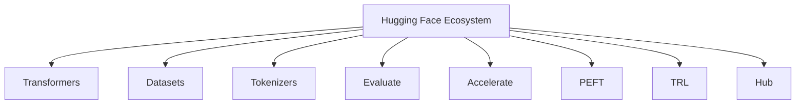

The important engineering principle is that these libraries are complementary rather than interchangeable.

---

# 3. Transformers

The `transformers` library provides implementations and utilities for many Transformer architectures.

It provides:

- Pretrained models
- Tokenizers
- Configuration objects
- Model loading
- Training utilities
- Generation APIs
- Model saving/loading

Example:

```python
from transformers import AutoTokenizer, AutoModelForSequenceClassification

model_name = "bert-base-uncased"

tokenizer = AutoTokenizer.from_pretrained(model_name)

model = AutoModelForSequenceClassification.from_pretrained(
    model_name,
    num_labels=2
)
```

The `Auto*` APIs allow the library to infer the appropriate implementation from the model configuration.

---

# 4. The Hugging Face Training Lifecycle

A complete training workflow can be represented as:

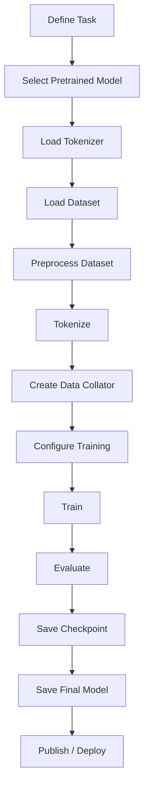

This workflow can support:

- Text classification
- Token classification
- Question answering
- Sequence-to-sequence tasks
- Causal language modeling
- Masked language modeling
- Instruction tuning
- Fine-tuning pretrained LLMs

---

# 5. Step 1 — Define the Training Objective

Before selecting a model, define the task.

Examples:

```text
Text Classification
       ↓
Predict a class
```

```text
Causal Language Modeling
       ↓
Predict the next token
```

```text
Masked Language Modeling
       ↓
Predict masked tokens
```

```text
Instruction Fine-Tuning
       ↓
Generate an appropriate response
```

```text
Sequence-to-Sequence
       ↓
Generate target sequence from source sequence
```

The training objective determines:

- Model architecture
- Dataset format
- Labels
- Tokenization strategy
- Data collator
- Loss function
- Evaluation metrics
- Training configuration

---

# 6. Step 2 — Select a Pretrained Model

Hugging Face provides a large ecosystem of pretrained models.

Examples of model families include:

- BERT
- RoBERTa
- DistilBERT
- GPT-style models
- T5
- FLAN-T5
- LLaMA-family models
- Mistral-family models
- Encoder-decoder models
- Vision-language models

The correct model depends on the task.

For example:

| Task | Typical Architecture |
|---|---|
| Classification | Encoder |
| Token Classification | Encoder |
| Embedding | Encoder / specialized embedding model |
| Text Generation | Decoder-only |
| Summarization | Encoder-decoder or decoder-only |
| Translation | Encoder-decoder or modern multilingual models |
| Chat | Instruction-tuned decoder-only |

---

# 7. AutoModel Classes

Hugging Face provides task-specific `AutoModel` classes.

Examples:

```python
from transformers import AutoModel
```

For classification:

```python
from transformers import AutoModelForSequenceClassification
```

For causal language modeling:

```python
from transformers import AutoModelForCausalLM
```

For masked language modeling:

```python
from transformers import AutoModelForMaskedLM
```

For sequence-to-sequence generation:

```python
from transformers import AutoModelForSeq2SeqLM
```

For token classification:

```python
from transformers import AutoModelForTokenClassification
```

The choice should match the training objective.

---

# 8. Step 3 — Load the Tokenizer

The tokenizer should normally be loaded from the same model family.

```python
from transformers import AutoTokenizer

model_name = "bert-base-uncased"

tokenizer = AutoTokenizer.from_pretrained(
    model_name
)
```

This ensures compatibility between:

- Vocabulary
- Token IDs
- Special tokens
- Tokenization rules
- Model embeddings

The relationship is:

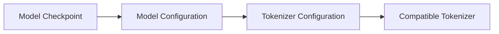

---

# 9. Step 4 — Load the Dataset

The Hugging Face `datasets` library provides a standard dataset abstraction.

```python
from datasets import load_dataset

dataset = load_dataset("imdb")

print(dataset)
```

A typical dataset structure may look like:

```text
DatasetDict
├── train
├── test
```

A validation split may need to be created:

```python
dataset = dataset["train"].train_test_split(
    test_size=0.1
)
```

The resulting structure can be:

```text
DatasetDict
├── train
└── test
```

or:

```text
DatasetDict
├── train
└── validation
```

depending on how the split is created.

---

# 10. Step 5 — Inspect the Dataset

Before training, inspect the dataset.

```python
print(dataset)
```

Inspect columns:

```python
print(dataset["train"].column_names)
```

Inspect an example:

```python
print(dataset["train"][0])
```

This helps identify:

- Input fields
- Labels
- Metadata
- Missing values
- Unexpected schema

A production workflow should validate the schema before preprocessing.

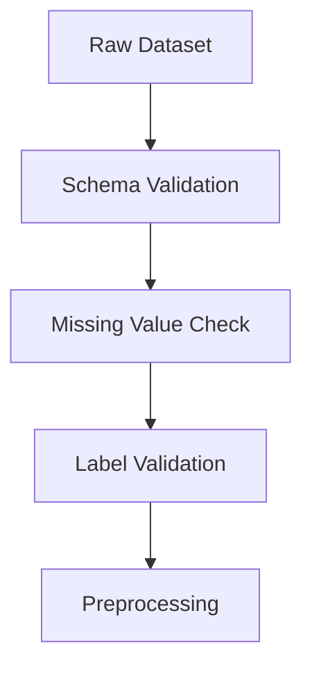

---

# 11. Step 6 — Define the Tokenization Function

Suppose the dataset contains:

```text
text
label
```

A tokenizer function can be defined as:

```python
def tokenize_function(batch):
    return tokenizer(
        batch["text"],
        truncation=True,
        max_length=512
    )
```

Apply it using:

```python
tokenized_dataset = dataset.map(
    tokenize_function,
    batched=True
)
```

The workflow is:


Using:

```python
batched=True
```

allows multiple examples to be processed together.

---

# 12. Step 7 — Padding Strategy

Padding can be applied during tokenization:

```python
tokenizer(
    text,
    padding="max_length",
    truncation=True,
    max_length=512
)
```

However, for many training workflows, dynamic padding is preferable.

Instead:

```python
tokenizer(
    text,
    truncation=True,
    max_length=512,
    padding=False
)
```

and later:

```python
from transformers import DataCollatorWithPadding

data_collator = DataCollatorWithPadding(
    tokenizer=tokenizer
)
```

This allows padding to happen at batch creation time.

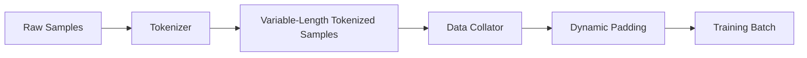

---

# 13. Step 8 — Data Collator

A data collator converts individual examples into model-ready batches.

For sequence classification:

```python
from transformers import DataCollatorWithPadding

data_collator = DataCollatorWithPadding(
    tokenizer=tokenizer
)
```

The collator can handle:

- Padding
- Tensor conversion
- Batch formatting
- Label handling

Conceptually:

```text
Example 1 → 100 tokens
Example 2 → 120 tokens
Example 3 → 90 tokens

              ↓

Data Collator

              ↓

Batch = 120 tokens
```

This reduces unnecessary padding.

---

# 14. Step 9 — Remove Unnecessary Columns

After tokenization, the dataset may contain original text fields that the model does not require.

For example:

```text
text
label
input_ids
attention_mask
```

The training process may only need:

```text
input_ids
attention_mask
label
```

Columns can be removed when appropriate:

```python
tokenized_dataset = tokenized_dataset.remove_columns(
    ["text"]
)
```

Always verify the expected model input schema before removing fields.

---

# 15. Step 10 — Configure Training

Hugging Face provides `TrainingArguments` for configuring common training behavior.

Example:

```python
from transformers import TrainingArguments

training_args = TrainingArguments(
    output_dir="./results",
    eval_strategy="epoch",
    learning_rate=2e-5,
    per_device_train_batch_size=16,
    per_device_eval_batch_size=16,
    num_train_epochs=3,
    weight_decay=0.01,
    logging_dir="./logs",
    save_strategy="epoch"
)
```

Training configuration controls:

- Learning rate
- Batch size
- Number of epochs
- Evaluation strategy
- Checkpoint strategy
- Logging
- Weight decay
- Output directories
- Hardware behavior

---

# 16. Important TrainingArguments

Some commonly used parameters include:

| Parameter | Purpose |
|---|---|
| `output_dir` | Training outputs and checkpoints |
| `learning_rate` | Optimizer learning rate |
| `per_device_train_batch_size` | Training batch size per device |
| `per_device_eval_batch_size` | Evaluation batch size per device |
| `num_train_epochs` | Number of training epochs |
| `weight_decay` | Regularization |
| `logging_steps` | Logging frequency |
| `save_strategy` | Checkpoint strategy |
| `eval_strategy` | Evaluation strategy |
| `gradient_accumulation_steps` | Effective batch-size scaling |
| `fp16` | FP16 mixed precision |
| `bf16` | BF16 mixed precision |
| `gradient_checkpointing` | Memory optimization |
| `load_best_model_at_end` | Restore best checkpoint |
| `report_to` | Experiment tracking integration |

The exact available parameters depend on the installed Transformers version.

---

# 17. Learning Rate

The learning rate controls how aggressively model parameters are updated.

Conceptually:

```text
Learning Rate
      ↓
Parameter Update Size
```

Too high:

```text
Large Updates
      ↓
Unstable Training
```

Too low:

```text
Very Small Updates
      ↓
Slow Convergence
```

Fine-tuning pretrained models often uses a lower learning rate than training a model from scratch.

Example:

```python
learning_rate=2e-5
```

The correct value depends on:

- Model architecture
- Dataset size
- Fine-tuning objective
- Batch size
- Optimizer
- Training stability

---

# 18. Batch Size

Training arguments commonly specify batch size per device:

```python
per_device_train_batch_size=16
```

With multiple GPUs, the effective batch size changes.

A simplified relationship is:

```text
Effective Batch Size
=
Per-Device Batch Size
×
Number of Devices
×
Gradient Accumulation Steps
```

For example:

```text
Per-GPU Batch Size = 8
GPUs = 4
Gradient Accumulation = 2

Effective Batch Size
=
8 × 4 × 2
=
64
```

This distinction is important when reproducing experiments.

---

# 19. Gradient Accumulation

When GPU memory cannot support a large batch directly, gradient accumulation can simulate a larger effective batch.

Example:

```python
training_args = TrainingArguments(
    ...,
    per_device_train_batch_size=4,
    gradient_accumulation_steps=8
)
```

Conceptually:

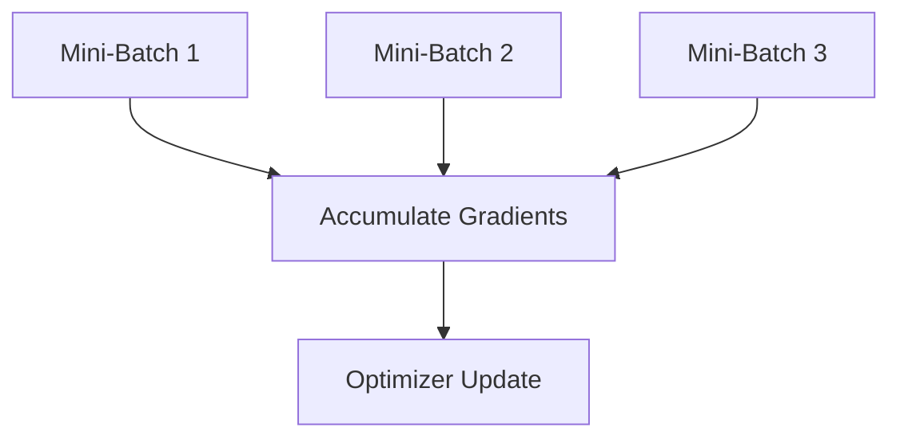

Instead of updating model parameters after every mini-batch, gradients are accumulated across multiple steps.

This is useful when:

- GPU memory is limited
- Larger effective batches are desirable
- Fine-tuning large models

---

# 20. Epochs

An epoch represents one complete pass through the training dataset.

For example:

```python
num_train_epochs=3
```

means the training process will iterate through the training dataset three times.

Conceptually:

```text
Dataset
   ↓
Epoch 1
   ↓
Epoch 2
   ↓
Epoch 3
```

More epochs do not automatically mean better performance.

Too many epochs can result in:

- Overfitting
- Higher training cost
- Reduced generalization

---

# 21. Weight Decay

Weight decay is commonly used as a regularization technique.

Example:

```python
weight_decay=0.01
```

Conceptually:

```text
Training
   +
Regularization
   ↓
Better Generalization
```

The appropriate value depends on the task and model.

---

# 22. Evaluation Strategy

Evaluation should be performed during training rather than only after training.

For example:

```python
eval_strategy="epoch"
```

means evaluation can occur after each epoch.

Alternative strategies may use training steps.

The workflow becomes:

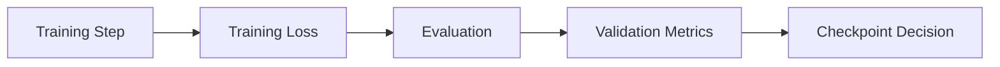

Evaluation helps identify:

- Overfitting
- Underfitting
- Training instability
- Performance improvements
- Performance degradation

---

# 23. Evaluation Metrics

Different tasks require different metrics.

For classification:

- Accuracy
- Precision
- Recall
- F1
- ROC-AUC

For language generation:

- Perplexity
- BLEU
- ROUGE
- Task-specific evaluation

For LLM applications, traditional metrics may not always capture practical quality.

Evaluation may also include:

- Human evaluation
- LLM-as-a-judge
- Groundedness
- Factuality
- Safety
- Instruction following

The metric must align with the actual business objective.

---

# 24. Using the Evaluate Library

Hugging Face provides the `evaluate` library for standardized evaluation.

Conceptually:

```python
import evaluate

accuracy = evaluate.load("accuracy")
```

A metric can then be calculated using predictions and references.

Example:

```python
def compute_metrics(eval_pred):
    predictions, labels = eval_pred

    predictions = predictions.argmax(axis=-1)

    return accuracy.compute(
        predictions=predictions,
        references=labels
    )
```

The metric function can then be passed to the Trainer.

---

# 25. Step 11 — Create the Trainer

The `Trainer` API provides a high-level training abstraction.

Example:

```python
from transformers import Trainer

trainer = Trainer(
    model=model,
    args=training_args,
    train_dataset=tokenized_dataset["train"],
    eval_dataset=tokenized_dataset["test"],
    tokenizer=tokenizer,
    data_collator=data_collator,
    compute_metrics=compute_metrics
)
```

The Trainer connects:

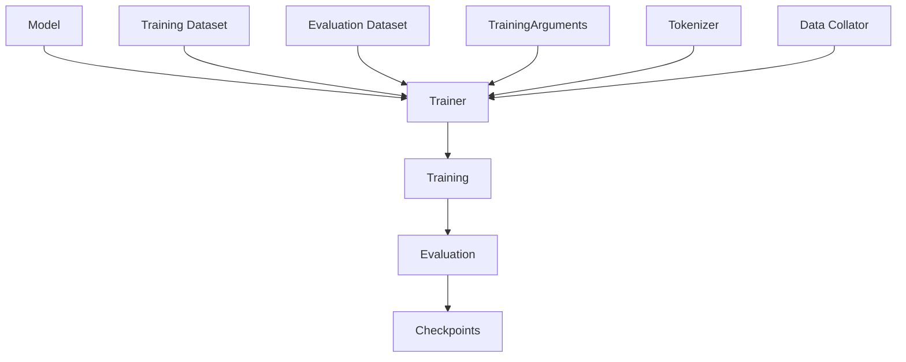

---

# 26. Step 12 — Start Training

Training begins with:

```python
trainer.train()
```

The Trainer manages many common operations:

- Batching
- Forward pass
- Loss calculation
- Backpropagation
- Optimizer updates
- Learning-rate scheduling
- Evaluation
- Checkpointing
- Logging

The high-level flow is:

```text
Dataset
   ↓
DataLoader
   ↓
Batch
   ↓
Model Forward Pass
   ↓
Loss
   ↓
Backward Pass
   ↓
Optimizer
   ↓
Parameter Update
```

---

# 27. What Happens Inside `trainer.train()`?

Although the API is simple, substantial work happens internally.

Conceptually:

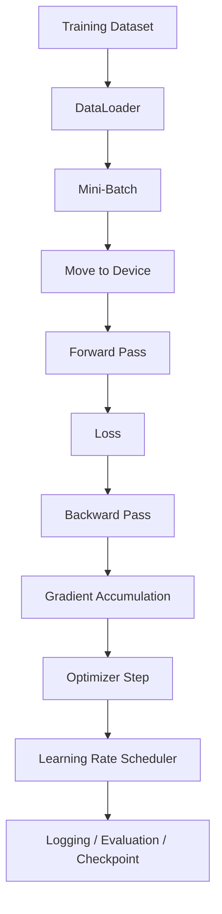

The Trainer abstracts many implementation details while preserving the ability to customize the workflow.

---

# 28. Training Loop Concept

A simplified PyTorch training loop looks like:

```python
for batch in dataloader:

    optimizer.zero_grad()

    outputs = model(**batch)

    loss = outputs.loss

    loss.backward()

    optimizer.step()

    scheduler.step()
```

The Hugging Face Trainer provides a higher-level abstraction around this process.

This distinction is important:

```text
Trainer
=
High-Level Training Abstraction

Custom PyTorch Loop
=
Low-Level Training Control
```

---

# 29. When to Use Trainer

The Trainer API is a strong choice when:

- The training objective is conventional
- Standard optimization is sufficient
- Standard evaluation is sufficient
- You want rapid experimentation
- You want less training-loop boilerplate

Advantages:

- Less code
- Faster experimentation
- Integrated evaluation
- Integrated checkpointing
- Logging support
- Hardware integration
- Distributed training support

---

# 30. When to Use a Custom Training Loop

A custom training loop may be preferable when:

- Training logic is highly specialized
- Multiple models interact during training
- Custom loss functions are required
- Non-standard optimization is required
- Complex reinforcement-learning workflows are used
- Advanced control over every training step is required

Conceptually:

```text
Trainer
   ↓
Convention Over Configuration

Custom Loop
   ↓
Maximum Control
```

The right abstraction depends on the complexity of the training system.

---

# 31. Checkpointing

Training large models can take hours or days.

Checkpoints allow training to be resumed.

Example:

```python
save_strategy="epoch"
```

A checkpoint may contain:

```text
checkpoint/
├── model weights
├── optimizer state
├── scheduler state
├── trainer state
├── tokenizer files
└── configuration
```

The exact files depend on the model and training configuration.

Conceptually:

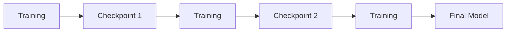

Checkpointing provides resilience against:

- Hardware failure
- Interrupted training
- Runtime failures
- Long-running training jobs

---

# 32. Resume Training

Training can often be resumed from a checkpoint.

Conceptually:

```python
trainer.train(
    resume_from_checkpoint="./results/checkpoint-1000"
)
```

This avoids starting training from scratch.

For production-scale training, checkpoint recovery should be part of the operational design.

---

# 33. Saving the Model

After training:

```python
trainer.save_model("./final-model")
```

The tokenizer should also be saved:

```python
tokenizer.save_pretrained("./final-model")
```

The resulting directory can contain:

```text
final-model/
├── model configuration
├── model weights
├── tokenizer configuration
├── vocabulary
├── special-token configuration
└── tokenizer files
```

The model and tokenizer should remain version-aligned.

---

# 34. Loading a Fine-Tuned Model

A saved model can later be loaded using:

```python
from transformers import AutoTokenizer
from transformers import AutoModelForSequenceClassification

model_path = "./final-model"

tokenizer = AutoTokenizer.from_pretrained(
    model_path
)

model = AutoModelForSequenceClassification.from_pretrained(
    model_path
)
```

This allows the model to be reused for:

- Evaluation
- Batch inference
- REST APIs
- Microservices
- Cloud deployment

---

# 35. Model Inference with Pipeline

Hugging Face provides the `pipeline` abstraction for common inference tasks.

Example:

```python
from transformers import pipeline

classifier = pipeline(
    "sentiment-analysis",
    model="./final-model",
    tokenizer="./final-model"
)

result = classifier(
    "This product is excellent."
)

print(result)
```

The pipeline abstracts:

```text
Input
 ↓
Tokenization
 ↓
Model
 ↓
Postprocessing
 ↓
Prediction
```

It is convenient for experimentation and simpler applications.

For production services requiring more control, directly invoking the model may be preferable.

---

# 36. Mixed Precision

Large Transformer models can benefit from reduced-precision training.

Common formats include:

- FP32
- FP16
- BF16

Conceptually:

```text
FP32
 ↓
Higher Precision
 ↓
Higher Memory Usage

FP16 / BF16
 ↓
Lower Precision
 ↓
Lower Memory / Higher Throughput
```

Training arguments may include:

```python
fp16=True
```

or:

```python
bf16=True
```

The correct option depends on hardware support and numerical stability.

---

# 37. FP16 vs BF16

| FP16 | BF16 |
|---|---|
| 16-bit floating point | 16-bit floating point |
| Smaller exponent range | Larger exponent range |
| Can be memory efficient | Often more numerically robust |
| Widely supported on modern GPUs | Strong support on newer accelerators |

The choice should be based on:

- GPU/accelerator capabilities
- Model architecture
- Training stability
- Framework support

---

# 38. Gradient Checkpointing

Gradient checkpointing reduces memory usage by trading additional computation for memory.

Normally:

```text
Forward Pass
   ↓
Store Activations
   ↓
Backward Pass
```

With gradient checkpointing:

```text
Forward Pass
   ↓
Store Selected Activations
   ↓
Recompute Some Activations
   ↓
Backward Pass
```

Conceptually:


It is useful when fine-tuning larger models under constrained GPU memory.

A typical configuration is:

```python
training_args = TrainingArguments(
    ...,
    gradient_checkpointing=True
)
```

---

# 39. Logging

Training should be observable.

Important signals include:

- Training loss
- Evaluation loss
- Learning rate
- Gradient statistics
- Throughput
- Steps per second
- GPU memory
- Evaluation metrics

Example:

```python
logging_steps=100
```

The general workflow is:

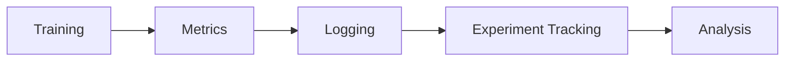

Possible experiment-tracking systems include:

- TensorBoard
- Weights & Biases
- MLflow
- Other compatible tracking systems

---

# 40. Experiment Reproducibility

Training should be reproducible wherever practical.

Track:

```text
Model
Tokenizer
Dataset
Dataset Version
Preprocessing
Hyperparameters
Random Seed
Hardware
Software Versions
Training Configuration
```

A useful experiment record is:

```text
Experiment
├── Model
├── Dataset
├── Tokenizer
├── Preprocessing
├── Hyperparameters
├── Random Seed
├── Hardware
└── Metrics
```

Random seed example:

```python
training_args = TrainingArguments(
    ...,
    seed=42
)
```

Reproducibility may still vary across hardware and distributed environments, but explicit configuration significantly improves experiment traceability.

---

# 41. Hugging Face Hub

The Hugging Face Hub provides a centralized platform for:

- Models
- Datasets
- Tokenizers
- Model cards
- Versioning
- Collaboration

The workflow can be:


A trained model can be pushed to the Hub using:

```python
trainer.push_to_hub()
```

The Hub can act as a model-sharing and artifact-management layer.

---

# 42. Model Cards

Production-oriented model sharing should include documentation.

A model card can describe:

- Model purpose
- Architecture
- Training data
- Fine-tuning data
- Evaluation results
- Limitations
- Intended use
- Out-of-scope use
- Known risks

The model artifact should not be treated as self-documenting.

A useful model lifecycle is:

```text
Model
+
Configuration
+
Evaluation
+
Documentation
+
Lineage
```

---

# 43. Dataset Cards

Datasets should also be documented.

Important information includes:

- Dataset purpose
- Data sources
- Collection process
- Preprocessing
- Known limitations
- Sensitive data considerations
- License
- Intended use

The overall governance model becomes:

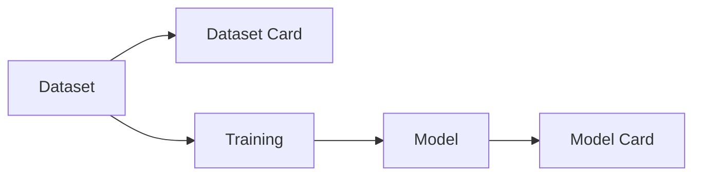

---

# 44. Accelerate

Hugging Face Accelerate simplifies running PyTorch workloads across different hardware environments.

It can support:

- CPU
- Single GPU
- Multiple GPUs
- Distributed training
- Mixed precision

Conceptually:

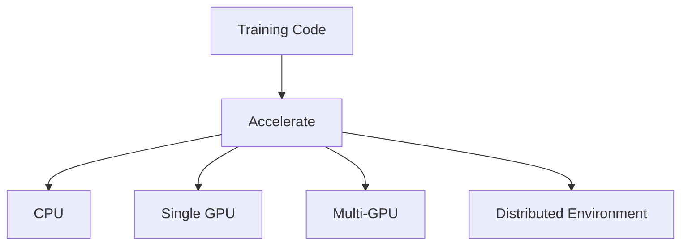

This helps reduce the amount of hardware-specific training code.

---

# 45. Distributed Training

Large models may require multiple GPUs.

A simplified architecture is:

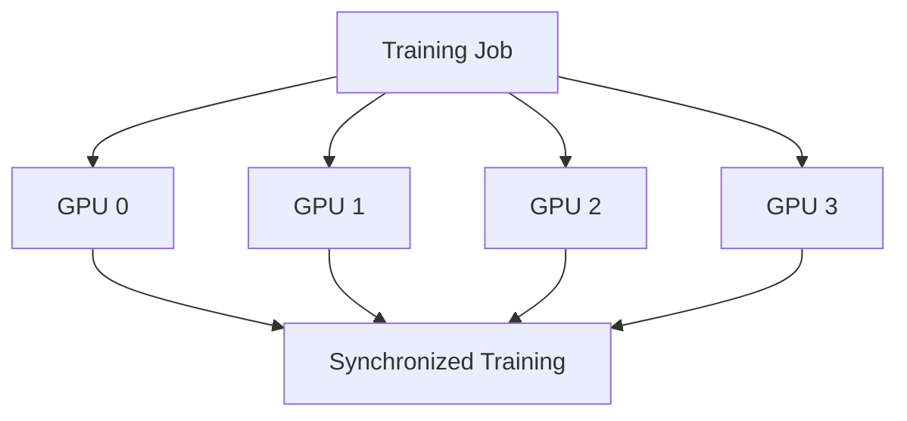

Distributed training can improve:

- Training throughput
- Model capacity
- Effective batch size

But it introduces additional concerns:

- Communication overhead
- Synchronization
- Checkpoint management
- Distributed data loading
- Failure handling

---

# 46. Parameter-Efficient Fine-Tuning

Full fine-tuning updates most or all model parameters.

For large models this can be expensive.

Parameter-efficient fine-tuning methods update a much smaller set of parameters.

Examples include:

- LoRA
- QLoRA
- Adapters
- Other PEFT methods

Conceptually:

```text
Base Model
   ↓
Freeze Most Parameters
   ↓
Train Small Adapter Parameters
   ↓
Fine-Tuned Model
```

Hugging Face provides the `peft` library for this workflow.

Example:

```python
from peft import LoraConfig

peft_config = LoraConfig(
    r=16,
    lora_alpha=32,
    lora_dropout=0.05
)
```

The detailed treatment of LoRA, QLoRA, and PEFT belongs to later chapters in this learning sequence.

---

# 47. Trainer + PEFT Architecture

A modern fine-tuning pipeline can look like:

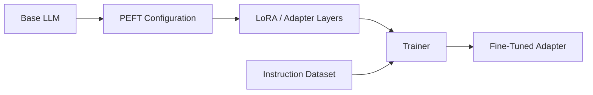

Instead of updating billions of base-model parameters, training focuses on a smaller parameter set.

Benefits may include:

- Lower memory requirements
- Lower training cost
- Smaller trainable parameter count
- Easier adapter management

---

# 48. Training Workflow for Decoder-Only LLMs

A simplified decoder-only training workflow is:

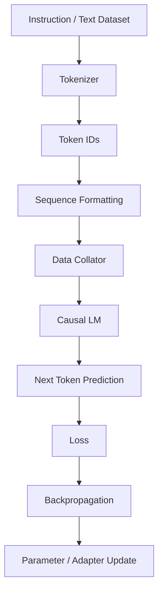

This workflow is used for:

- Causal language modeling
- Instruction tuning
- Supervised fine-tuning
- Domain adaptation

---

# 49. Training Workflow for Encoder Models

For an encoder model such as BERT:

```mermaid
flowchart TD
    A["Text Dataset"] --> B["Tokenizer"]
    B --> C["Input IDs"]
    B --> D["Attention Mask"]
    C --> E["Encoder"]
    D --> E
    E --> F["Classification Head"]
    F --> G["Prediction"]
    G --> H["Loss"]
    H --> I["Backpropagation"]
```

The model objective determines the appropriate model class and dataset format.

---

# 50. End-to-End Classification Example

A simplified Hugging Face classification workflow is:

```python
from datasets import load_dataset
from transformers import (
    AutoTokenizer,
    AutoModelForSequenceClassification,
    DataCollatorWithPadding,
    TrainingArguments,
    Trainer
)

model_name = "bert-base-uncased"

dataset = load_dataset("imdb")

tokenizer = AutoTokenizer.from_pretrained(
    model_name
)

model = AutoModelForSequenceClassification.from_pretrained(
    model_name,
    num_labels=2
)


def tokenize_function(batch):
    return tokenizer(
        batch["text"],
        truncation=True,
        max_length=512
    )


tokenized_dataset = dataset.map(
    tokenize_function,
    batched=True
)


data_collator = DataCollatorWithPadding(
    tokenizer=tokenizer
)


training_args = TrainingArguments(
    output_dir="./results",
    eval_strategy="epoch",
    learning_rate=2e-5,
    per_device_train_batch_size=16,
    per_device_eval_batch_size=16,
    num_train_epochs=3,
    weight_decay=0.01,
    save_strategy="epoch"
)


trainer = Trainer(
    model=model,
    args=training_args,
    train_dataset=tokenized_dataset["train"],
    eval_dataset=tokenized_dataset["test"],
    tokenizer=tokenizer,
    data_collator=data_collator
)


trainer.train()
```

The important architecture is:

```text
Dataset
   ↓
Tokenizer
   ↓
Tokenized Dataset
   ↓
Data Collator
   ↓
TrainingArguments
   ↓
Trainer
   ↓
Pretrained Transformer
   ↓
Fine-Tuned Model
```

---

# 51. Debugging the Training Pipeline

When training fails, inspect the pipeline layer by layer.

```mermaid
flowchart TD
    A["Dataset"] --> B["Schema"]
    B --> C["Tokenizer"]
    C --> D["Token IDs"]
    D --> E["Labels"]
    E --> F["Data Collator"]
    F --> G["Batch"]
    G --> H["Model"]
    H --> I["Loss"]
```

Check:

### Dataset

```python
print(dataset["train"][0])
```

### Tokenizer

```python
print(tokenizer.tokenize("Hello world"))
```

### Encoded Input

```python
print(
    tokenizer(
        "Hello world",
        return_tensors="pt"
    )
)
```

### Model

```python
print(model)
```

### Batch

Inspect:

```text
input_ids
attention_mask
labels
```

### Loss

Verify that:

```text
loss
```

is finite and behaves reasonably during training.

---

# 52. Common Training Problems

## Problem 1 — Out of Memory

Possible causes:

- Large batch size
- Large sequence length
- Large model
- Excessive padding
- Full fine-tuning

Potential solutions:

- Reduce batch size
- Use gradient accumulation
- Reduce sequence length
- Use mixed precision
- Use gradient checkpointing
- Use PEFT

---

## Problem 2 — Training Is Too Slow

Potential causes:

- CPU preprocessing bottleneck
- Slow storage
- Excessive padding
- Small batch size
- Inefficient DataLoader
- GPU underutilization

Investigate:

```text
CPU Utilization
GPU Utilization
DataLoader Throughput
Tokenization Throughput
Sequence Length
```

---

## Problem 3 — Validation Performance Degrades

Potential causes:

- Overfitting
- Learning rate too high
- Training for too many epochs
- Dataset leakage
- Poor validation split

Potential solutions:

- Early stopping
- Lower learning rate
- More representative validation data
- Regularization
- Better dataset quality

---

## Problem 4 — Model Gives Poor Predictions

Investigate:

```text
Dataset Quality
       ↓
Labels
       ↓
Tokenization
       ↓
Training Configuration
       ↓
Evaluation
```

Do not immediately assume that the model architecture is the problem.

---

# 53. Production Training Architecture

A production-oriented Hugging Face training system can be structured as:

```mermaid
flowchart TD
    A["Enterprise Data Sources"] --> B["Data Ingestion"]
    B --> C["Data Validation"]
    C --> D["Dataset Storage"]
    D --> E["Preprocessing"]
    E --> F["Tokenization"]
    F --> G["Training Dataset"]
    G --> H["Training Job"]
    H --> I["Evaluation"]
    I --> J["Model Registry"]
    J --> K["Deployment"]
    K --> L["Inference Service"]
    L --> M["Monitoring"]
```

Important architectural capabilities include:

- Dataset versioning
- Model versioning
- Reproducible preprocessing
- Distributed training
- Checkpointing
- Evaluation
- Artifact storage
- Model registry
- Monitoring

---

# 54. Training Pipeline as a Reproducible Artifact

A production training run should be reproducible from configuration.

For example:

```text
training-config.yaml
```

could conceptually contain:

```yaml
model:
  name: bert-base-uncased

training:
  learning_rate: 0.00002
  batch_size: 16
  epochs: 3
  weight_decay: 0.01

data:
  max_length: 512

evaluation:
  strategy: epoch
```

The exact structure depends on the application.

The important idea is:

```text
Configuration
      +
Dataset Version
      +
Code Version
      +
Model Version
      ↓
Reproducible Training Run
```

---

# 55. Production Observability

Training pipelines should expose useful operational metrics.

Important metrics include:

### Training Metrics

- Training loss
- Evaluation loss
- Accuracy
- Precision
- Recall
- F1
- Learning rate

### Performance Metrics

- Steps per second
- Samples per second
- Tokens per second
- GPU utilization
- GPU memory
- CPU utilization

### Data Metrics

- Dataset size
- Average sequence length
- P95 sequence length
- Truncation rate
- Padding ratio

### Reliability Metrics

- Failed steps
- Checkpoint failures
- Data-loading errors
- OOM events
- Training job duration

---

# 56. Cost Optimization

LLM training can become expensive quickly.

Important optimization areas include:

```text
Data
 ↓
Token Efficiency
 ↓
Batch Efficiency
 ↓
GPU Utilization
 ↓
Training Efficiency
 ↓
Cost
```

Strategies include:

- Remove duplicate data
- Reduce unnecessary tokens
- Use dynamic padding
- Use length-aware batching
- Use mixed precision
- Use gradient accumulation
- Use PEFT
- Cache preprocessing
- Use efficient storage
- Monitor GPU utilization

The goal is not simply to minimize infrastructure cost.

The goal is to maximize:

> **Useful training signal per unit of compute.**

---

# 57. Hugging Face Training Workflow — Production Mental Model

A useful mental model is:

```text
                ┌─────────────────────┐
                │      Dataset        │
                └──────────┬──────────┘
                           ↓
                ┌─────────────────────┐
                │   Preprocessing     │
                └──────────┬──────────┘
                           ↓
                ┌─────────────────────┐
                │     Tokenizer       │
                └──────────┬──────────┘
                           ↓
                ┌─────────────────────┐
                │  Tokenized Dataset  │
                └──────────┬──────────┘
                           ↓
                ┌─────────────────────┐
                │   Data Collator     │
                └──────────┬──────────┘
                           ↓
                ┌─────────────────────┐
                │      Trainer        │
                └──────────┬──────────┘
                           ↓
                ┌─────────────────────┐
                │ Transformer Model   │
                └──────────┬──────────┘
                           ↓
                ┌─────────────────────┐
                │    Evaluation       │
                └──────────┬──────────┘
                           ↓
                ┌─────────────────────┐
                │     Checkpoint      │
                └──────────┬──────────┘
                           ↓
                ┌─────────────────────┐
                │ Model Registry/Hub  │
                └─────────────────────┘
```

---

# 58. Best Practices

## Model Selection

- Select the architecture based on the training objective.
- Start with an appropriate pretrained model.
- Verify model licensing and usage requirements.
- Match tokenizer and model versions.

## Dataset

- Validate schema.
- Remove duplicates.
- Check labels.
- Detect leakage.
- Version datasets.
- Analyze sequence lengths.

## Tokenization

- Use the model's compatible tokenizer.
- Avoid unnecessary preprocessing.
- Monitor truncation.
- Use appropriate padding.
- Validate special tokens.

## Training

- Start with conservative hyperparameters.
- Monitor training and evaluation loss.
- Use checkpoints.
- Track experiments.
- Use mixed precision when appropriate.
- Use gradient accumulation when memory is limited.

## Performance

- Monitor GPU utilization.
- Optimize data loading.
- Use dynamic padding.
- Use length-aware batching.
- Cache expensive preprocessing.
- Consider PEFT for large models.

## Production

- Version code, model, tokenizer, dataset, and configuration.
- Store checkpoints reliably.
- Record evaluation metrics.
- Document model limitations.
- Secure sensitive training data.
- Separate training infrastructure from inference infrastructure.

---

# 59. Common Mistakes

### Mistake 1 — Using an Incompatible Tokenizer

```text
Model A
   +
Tokenizer B
   ↓
Unexpected Input Representation
```

Use the tokenizer associated with the model.

---

### Mistake 2 — Padding Everything to the Maximum Length

```text
Actual Input = 100 tokens
Maximum = 4096

100 tokens
+
3996 padding tokens
```

This can waste significant compute.

Prefer dynamic padding when appropriate.

---

### Mistake 3 — Ignoring Dataset Quality

More data does not automatically mean better training.

```text
More Data
   ≠
Better Data
```

Quality, diversity, relevance, and correctness matter.

---

### Mistake 4 — No Evaluation During Training

Training loss alone does not tell you whether the model generalizes.

Always monitor appropriate validation metrics.

---

### Mistake 5 — No Checkpointing

Long-running training without checkpoints creates operational risk.

---

### Mistake 6 — No Reproducibility

If you cannot identify:

```text
Which model?
Which dataset?
Which tokenizer?
Which configuration?
Which code?
```

then reproducing the result becomes difficult.

---

### Mistake 7 — Full Fine-Tuning by Default

Large models may not require all parameters to be updated.

Evaluate whether PEFT is more appropriate.

---

# 60. Interview Questions

## Beginner

- What is Hugging Face?
- What is the Transformers library?
- What is Hugging Face Datasets?
- What is a tokenizer?
- What is the Trainer API?
- What is a pretrained model?
- What is a data collator?
- What is `TrainingArguments`?
- What is a checkpoint?
- What is the Hugging Face Hub?

## Intermediate

- Explain the complete Hugging Face training workflow.
- What is the difference between `Dataset` and `DataLoader`?
- Why use `AutoTokenizer`?
- Why use `AutoModelForSequenceClassification`?
- What does `Trainer` do?
- What is dynamic padding?
- Why is `batched=True` useful?
- What is gradient accumulation?
- What is mixed-precision training?
- What is gradient checkpointing?
- How do you resume training?
- How do you save a fine-tuned model?
- How do you evaluate during training?
- How do you push a model to the Hugging Face Hub?

## Advanced

- When would you use Trainer versus a custom PyTorch training loop?
- How would you optimize Hugging Face training for multi-GPU environments?
- How would you diagnose low GPU utilization?
- How would you reduce padding overhead?
- How would you design a reproducible Hugging Face training pipeline?
- How would you integrate PEFT with Trainer?
- How would you version datasets and model artifacts?
- How would you design a production training pipeline for billions of tokens?
- How would you handle checkpoint recovery?
- How would you monitor training infrastructure?
- How would you optimize training cost?
- How would you separate training and inference architecture?
- How would you handle sensitive enterprise data during fine-tuning?

---

# 61. Scenario-Based Interview Questions

## Scenario 1 — GPU Out of Memory

Your fine-tuning job fails with an out-of-memory error.

Investigate:

```text
Batch Size
     ↓
Sequence Length
     ↓
Padding
     ↓
Model Size
     ↓
Precision
     ↓
Activation Memory
```

Potential solutions:

- Reduce batch size
- Use gradient accumulation
- Reduce sequence length
- Use BF16/FP16
- Enable gradient checkpointing
- Use PEFT
- Use a smaller model

---

## Scenario 2 — GPU Utilization Is Low

Suppose:

```text
CPU = 95%
GPU = 35%
```

A likely bottleneck is the input pipeline.

Investigate:

```text
Tokenization
     ↓
DataLoader
     ↓
Storage
     ↓
Batch Construction
```

Potential solutions:

- Batch preprocessing
- Parallel data loading
- Dataset caching
- Faster storage
- Dynamic batching
- Pre-tokenization

---

## Scenario 3 — Training Loss Decreases but Validation Loss Increases

This is a common overfitting pattern.

```text
Training Loss
      ↓
      ↓
      ↓

Validation Loss
      ↓
      ↑
      ↑
```

Possible solutions:

- Reduce training epochs
- Lower learning rate
- Add regularization
- Improve dataset diversity
- Check train/validation leakage
- Use early stopping

---

## Scenario 4 — Model Performs Well but Production Quality Is Poor

Investigate preprocessing consistency:

```text
Training Input
      ≠
Production Input
```

Check:

- Tokenizer
- Chat template
- Special tokens
- Sequence length
- Normalization
- Prompt format
- Model version

---

# 62. 🚀 Quick Revision Sheet

## Hugging Face Ecosystem

```text
Transformers
    ↓
Models + Tokenizers + Training

Datasets
    ↓
Dataset Loading + Processing

Tokenizers
    ↓
Fast Tokenization

Evaluate
    ↓
Metrics

Accelerate
    ↓
Distributed / Hardware-Aware Training

PEFT
    ↓
Parameter-Efficient Fine-Tuning

TRL
    ↓
Post-Training / Preference Optimization

Hub
    ↓
Model + Dataset Sharing
```

---

## Core Training Workflow

```text
Dataset
   ↓
Preprocessing
   ↓
Tokenizer
   ↓
Tokenized Dataset
   ↓
Data Collator
   ↓
TrainingArguments
   ↓
Trainer
   ↓
Model
   ↓
Evaluation
   ↓
Checkpoint
   ↓
Final Model
```

---

## Important Hugging Face APIs

```python
AutoTokenizer
AutoModel
AutoModelForSequenceClassification
AutoModelForCausalLM
AutoModelForMaskedLM
AutoModelForSeq2SeqLM
TrainingArguments
Trainer
DataCollatorWithPadding
```

---

## Performance Optimization

```text
Dynamic Padding
+
Length-Aware Batching
+
Mixed Precision
+
Gradient Accumulation
+
Gradient Checkpointing
+
PEFT
+
Efficient Data Loading
```

---

## Production Requirements

```text
Dataset Versioning
+
Model Versioning
+
Tokenizer Versioning
+
Configuration Versioning
+
Checkpointing
+
Evaluation
+
Observability
+
Security
```

---

# 63. Key Takeaways

- Hugging Face provides an integrated ecosystem for modern Transformer and LLM development.
- `transformers` provides pretrained models, tokenizers, training utilities, and generation APIs.
- `datasets` provides standardized dataset loading and processing.
- The tokenizer should remain compatible with the pretrained model.
- Dataset preprocessing converts raw examples into model-ready representations.
- Data collators are useful for dynamic padding and batch construction.
- `TrainingArguments` centralizes important training configuration.
- `Trainer` provides a high-level abstraction for standard Transformer training and fine-tuning.
- Custom PyTorch loops provide greater control for specialized training workflows.
- Checkpointing is essential for long-running training jobs.
- Mixed precision can reduce memory consumption and improve throughput when supported by the hardware.
- Gradient accumulation can increase effective batch size without requiring the entire batch to fit into GPU memory.
- Gradient checkpointing trades additional computation for lower memory usage.
- Evaluation should be aligned with the actual business and model objective.
- Dataset, tokenizer, model, code, and configuration versions should be tracked for reproducibility.
- PEFT can significantly reduce the cost of fine-tuning large models.
- Accelerate helps abstract hardware and distributed-training complexity.
- Hugging Face Hub provides a convenient mechanism for sharing and versioning models and datasets.
- Production LLM training requires more than model code: it requires data quality, observability, lineage, reproducibility, security, and operational resilience.

---

# 64. Chapter Navigation

## Previous Chapter

[08. LLM Data Preparation](08-llm-data-preparation.md)

## Next Chapter

[10. Transformer Fine-Tuning Fundamentals](10-transformer-fine-tuning-fundamentals.md)

## Related Chapters

- [01. Generative AI Fundamentals](01-generative-ai-fundamentals.md)
- [02. Language Understanding Fundamentals](02-language-understanding-fundamentals.md)
- [03. Word Embeddings](03-word-embeddings.md)
- [04. Language Modeling](04-language-modeling.md)
- [05. Attention and Positional Encoding](05-attention-and-positional-encoding.md)
- [06. GPT and BERT Architecture](06-gpt-and-bert-architecture.md)
- [07. Hugging Face and Transformers](07-huggingface-and-transformers.md)
- [08. LLM Data Preparation](08-llm-data-preparation.md)
- [10. Transformer Fine-Tuning Fundamentals](10-transformer-fine-tuning-fundamentals.md)
- [11. Supervised Fine-Tuning (SFT)](11-supervised-fine-tuning-sft.md)

---

# References

- Hugging Face Transformers Documentation
- Hugging Face Datasets Documentation
- Hugging Face Tokenizers Documentation
- Hugging Face Evaluate Documentation
- Hugging Face Accelerate Documentation
- Hugging Face PEFT Documentation
- Hugging Face TRL Documentation
- Hugging Face Hub Documentation
- PyTorch Documentation
- Attention Is All You Need — Vaswani et al.
- BERT: Pre-training of Deep Bidirectional Transformers for Language Understanding
- Speech and Language Processing — Jurafsky & Martin

---

> **Enterprise AI Engineering Handbook**  
> *Building Production-Grade Enterprise AI Systems — One Chapter at a Time.*