# 10 — Transformer Fine-Tuning Fundamentals

> A practical, production-oriented guide to **Transformer Fine-Tuning**, covering pretrained Transformer models, transfer learning, fine-tuning strategies, model freezing, trainable parameters, learning rates, optimization, training objectives, dataset preparation, evaluation, checkpoints, catastrophic forgetting, overfitting, layer-wise learning rates, discriminative fine-tuning, Hugging Face workflows, and production considerations for adapting Transformer models to enterprise AI workloads.

---

# 1. Overview

**Transformer fine-tuning** is the process of adapting a pretrained Transformer model to a specific downstream task, domain, or behavior using a smaller task-specific dataset.

Instead of training a Transformer from scratch, fine-tuning starts with a model that has already learned useful language representations from large-scale pretraining.

The general idea is:

```text
Large General-Purpose Dataset
            ↓
      Pretraining
            ↓
   Pretrained Transformer
            ↓
    Task-Specific Data
            ↓
        Fine-Tuning
            ↓
     Specialized Model
```

Fine-tuning is widely used for:

- Text classification
- Sentiment analysis
- Named Entity Recognition
- Question answering
- Summarization
- Translation
- Domain adaptation
- Instruction following
- Conversational AI
- Enterprise document understanding
- Customer-support automation

The key engineering advantage is that the model does not need to relearn language from scratch.

---

# 2. Why Fine-Tuning?

Training a Transformer from scratch requires:

- Massive datasets
- Significant compute
- Large GPU clusters
- Long training times
- Complex distributed-training infrastructure
- Extensive hyperparameter tuning

Fine-tuning starts with an existing pretrained model.

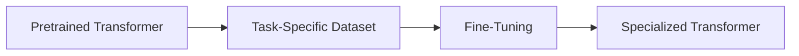

For example:

```text
BERT
 ↓
General Language Understanding
 ↓
Fine-Tune on Customer Support Data
 ↓
Customer Support Classifier
```

Instead of:

```text
Randomly Initialized Model
 ↓
Huge Dataset
 ↓
Massive Compute
 ↓
Language Learning
 ↓
Task Learning
```

This is the fundamental idea behind **transfer learning for NLP and Transformer models**.

---

# 3. Transfer Learning

Fine-tuning is a form of **transfer learning**.

A model first learns general representations from a large dataset and then transfers those learned representations to a downstream task.

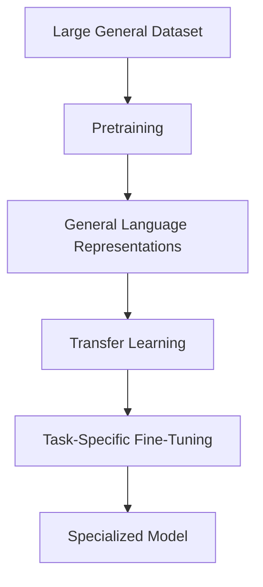

The pretrained model may already understand:

- Syntax
- Grammar
- Word relationships
- Semantic relationships
- Context
- Sentence structure
- Domain-independent patterns

Fine-tuning modifies these learned representations to better solve the target problem.

---

# 4. Pretraining vs Fine-Tuning

| Pretraining | Fine-Tuning |
|---|---|
| Large general dataset | Smaller task/domain dataset |
| Expensive | Relatively cheaper |
| Learns general representations | Adapts representations |
| Large compute requirements | Lower compute requirements |
| Usually long-running | Usually shorter |
| General-purpose model | Specialized model |

Conceptually:

```text
PRETRAINING

Large Dataset
      ↓
Large Compute
      ↓
General Transformer
```

versus:

```text
FINE-TUNING

Pretrained Transformer
      +
Task Dataset
      ↓
Specialized Transformer
```

---

# 5. Transformer Fine-Tuning Lifecycle

A complete fine-tuning workflow can be represented as:

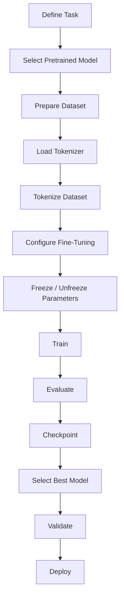

The major stages are:

1. Task definition
2. Model selection
3. Dataset preparation
4. Tokenization
5. Fine-tuning strategy
6. Training configuration
7. Evaluation
8. Model selection
9. Deployment

---

# 6. What Actually Changes During Fine-Tuning?

A pretrained Transformer contains learned parameters.

For example:

```text
Transformer
├── Embedding Layer
├── Attention Layers
├── Feed-Forward Layers
├── Layer Normalization
└── Task Head
```

During full fine-tuning, many or all trainable parameters are updated.

Conceptually:

```text
Before Fine-Tuning

W₁ W₂ W₃ W₄ W₅
│  │  │  │  │
└── Learned During Pretraining


After Fine-Tuning

W₁' W₂' W₃' W₄' W₅'
│   │   │   │   │
└── Adapted to Target Task
```

The model is not starting from random weights.

It is refining an existing representation.

---

# 7. Transformer Parameters

A Transformer may contain billions of parameters.

Important parameter groups include:

```text
Transformer
│
├── Token Embeddings
│
├── Transformer Block 1
│   ├── Attention
│   ├── Feed Forward
│   └── Layer Norm
│
├── Transformer Block 2
│   ├── Attention
│   ├── Feed Forward
│   └── Layer Norm
│
├── ...
│
└── Output Head
```

Fine-tuning decisions include:

- Which parameters should be updated?
- Which parameters should be frozen?
- What learning rate should be used?
- Should all layers receive the same learning rate?
- Should the task head use a different learning rate?

---

# 8. Full Fine-Tuning

**Full fine-tuning** updates the pretrained model parameters along with the task-specific head.

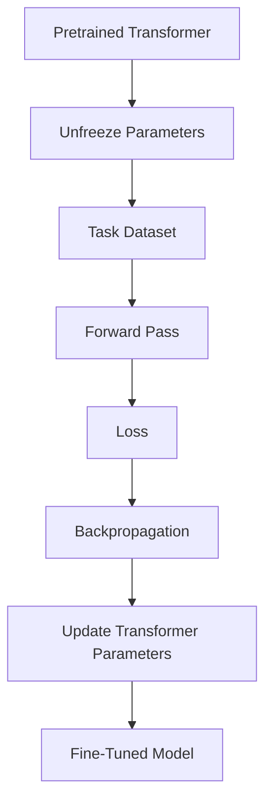

Example:

```text
Pretrained BERT
       ↓
All Layers Trainable
       ↓
Classification Dataset
       ↓
Update Model Weights
       ↓
Fine-Tuned BERT
```

## Advantages

- Maximum adaptation capacity
- Can produce strong task-specific performance
- Useful when sufficient training data is available
- Can adapt deeper representations

## Disadvantages

- High GPU memory requirements
- High training cost
- Larger optimizer state
- Greater risk of catastrophic forgetting
- More sensitive to hyperparameters

Full fine-tuning is often unnecessary for very large models when PEFT methods can achieve the required performance more efficiently.

---

# 9. Feature Extraction

An alternative strategy is to freeze the pretrained Transformer and train only a task-specific head.

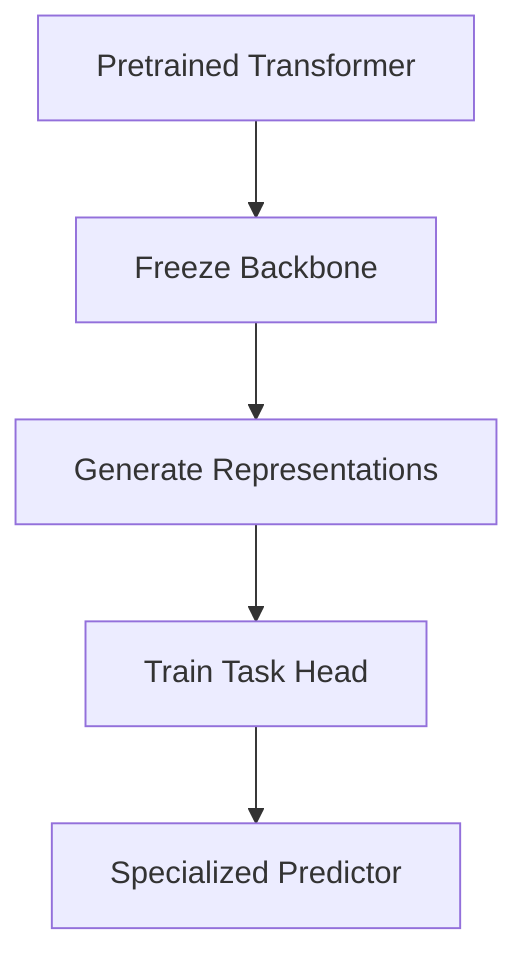

For example:

```text
BERT
 ↓
Frozen BERT
 ↓
Sentence Representation
 ↓
Classification Head
 ↓
Prediction
```

The Transformer parameters remain unchanged.

## Advantages

- Lower compute requirements
- Lower memory usage
- Faster training
- Lower risk of modifying pretrained representations

## Disadvantages

- Less task adaptation
- May underperform full fine-tuning
- Limited domain adaptation

---

# 10. Freezing Model Parameters

Parameters can be frozen using:

```python
for param in model.base_model.parameters():
    param.requires_grad = False
```

The task head can remain trainable.

Conceptually:

```text
Transformer Backbone
====================
Frozen

Classification Head
====================
Trainable
```

This is useful when:

- Dataset is small
- Compute is limited
- The pretrained representation is already suitable
- Only a lightweight task adaptation is required

---

# 11. Partial Fine-Tuning

Instead of freezing everything or updating everything, selected Transformer layers can be trained.

For example:

```text
Transformer

Layer 1  → Frozen
Layer 2  → Frozen
Layer 3  → Frozen
Layer 4  → Frozen
Layer 5  → Trainable
Layer 6  → Trainable
Layer 7  → Trainable
Layer 8  → Trainable
```

Conceptually:

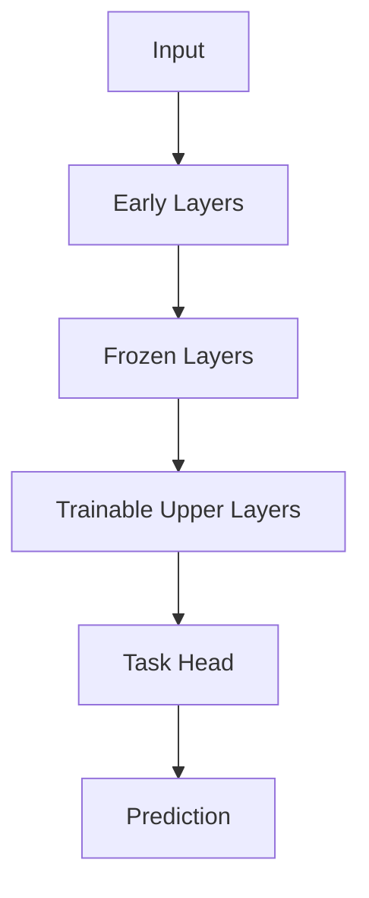

This provides a compromise between:

```text
Feature Extraction
        ↕
Full Fine-Tuning
```

---

# 12. Why Layer Freezing Can Work

Transformer layers often learn representations at different levels of abstraction.

A simplified conceptual hierarchy is:

```text
Lower Layers
     ↓
Lexical / Local Patterns
     ↓
Syntactic Patterns
     ↓
Semantic Patterns
     ↓
Task-Specific Representations
     ↓
Upper Layers
```

This is a simplified mental model rather than a strict architectural rule.

For some tasks, pretrained lower-level representations may already be useful, while upper layers benefit more from task-specific adaptation.

---

# 13. Fine-Tuning Learning Rate

Learning rate is one of the most important fine-tuning hyperparameters.

A learning rate that works for training a model from scratch may be too large for fine-tuning.

Conceptually:

```text
Pretrained Model
      ↓
Already Useful Parameters
      ↓
Small Parameter Updates
      ↓
Task Adaptation
```

A typical fine-tuning learning rate may be in a relatively small range such as:

```text
1e-5
2e-5
3e-5
5e-5
```

These are examples, not universal defaults.

The appropriate value depends on:

- Model architecture
- Dataset size
- Dataset quality
- Number of trainable parameters
- Task complexity
- Batch size
- Optimizer
- Number of epochs

---

# 14. Why Learning Rate Matters More During Fine-Tuning

Suppose the pretrained model already has useful parameters.

A very large update can destroy useful information.

```text
Pretrained Knowledge
       ↓
Large Gradient Updates
       ↓
Large Weight Changes
       ↓
Potential Knowledge Degradation
```

A smaller learning rate provides more controlled adaptation.

```text
Pretrained Knowledge
       ↓
Small Updates
       ↓
Task Adaptation
```

This is one reason fine-tuning typically requires more conservative optimization than training from scratch.

---

# 15. Task Head

A pretrained Transformer may require an additional task-specific head.

For classification:

```text
Transformer
     ↓
[CLS] / pooled representation
     ↓
Linear Layer
     ↓
Class Probabilities
```

For token classification:

```text
Transformer
     ↓
Token Representations
     ↓
Classification Layer
     ↓
Token Labels
```

For causal language modeling:

```text
Transformer
     ↓
Vocabulary Projection
     ↓
Next-Token Probabilities
```

The task head depends on the objective.

---

# 16. Classification Fine-Tuning

A classification model can be represented as:

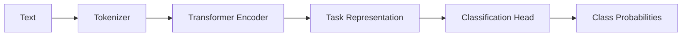

Example:

```text
Input:
"The payment was rejected."

        ↓

Tokenizer

        ↓

Transformer

        ↓

Classification Head

        ↓

Payment Failure
```

Hugging Face example:

```python
from transformers import AutoModelForSequenceClassification

model = AutoModelForSequenceClassification.from_pretrained(
    "bert-base-uncased",
    num_labels=3
)
```

---

# 17. Token Classification Fine-Tuning

Token classification predicts a label for each token.

Common use cases include:

- Named Entity Recognition
- Part-of-Speech Tagging
- Information Extraction

Example:

```text
Mihir works at OpenAI.

Mihir     → PERSON
works     → O
at        → O
OpenAI    → ORGANIZATION
```

Architecture:

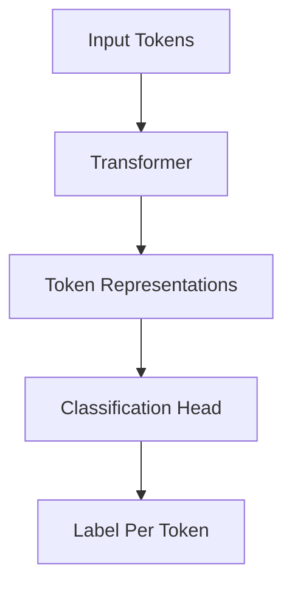

---

# 18. Question Answering Fine-Tuning

For extractive question answering, the model learns to identify the answer span inside a context.

Example:

```text
Question:
Where is the company headquartered?

Context:
The company is headquartered in Berlin.
```

The model predicts:

```text
Start Position → Berlin
End Position   → Berlin
```

Architecture:

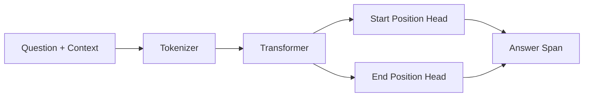

---

# 19. Sequence-to-Sequence Fine-Tuning

Encoder-decoder models can be fine-tuned for tasks such as:

- Summarization
- Translation
- Text transformation
- Question generation

Conceptually:

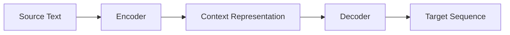

Examples of model families include:

- T5
- FLAN-T5
- BART

Example:

```text
Long Document
      ↓
Encoder
      ↓
Decoder
      ↓
Summary
```

---

# 20. Causal Language Model Fine-Tuning

Decoder-only models can be fine-tuned using a next-token prediction objective.

Example:

```text
Input:

The customer reported a

Target:

payment failure
```

At token level:

```text
Token 1 → Predict Token 2
Token 2 → Predict Token 3
Token 3 → Predict Token 4
```

Architecture:


This is the foundation of many modern LLM fine-tuning workflows.

---

# 21. Supervised Fine-Tuning

**Supervised Fine-Tuning (SFT)** trains a pretrained model on curated input-output examples.

Example:

```text
Instruction:
Explain what an API gateway does.

Response:
An API gateway provides a centralized entry point...
```

The dataset provides a desired response for each input.

The general flow is:

```text
Pretrained LLM
      +
Instruction Dataset
      ↓
Supervised Fine-Tuning
      ↓
Instruction-Following Model
```

SFT is an important post-pretraining stage and will be covered in greater depth in the next chapter.

---

# 22. Fine-Tuning Dataset Size

There is no universal dataset size for fine-tuning.

The required amount depends on:

- Task complexity
- Model size
- Dataset quality
- Domain specificity
- Desired behavior
- Label quality
- Diversity of examples

A small high-quality dataset can outperform a much larger noisy dataset.

The important relationship is:

```text
Dataset Quality
      +
Task Relevance
      +
Example Diversity
      +
Correct Labels
      ↓
Useful Fine-Tuning Signal
```

---

# 23. Data Quality for Fine-Tuning

Fine-tuning can amplify patterns present in the dataset.

Poor-quality data may teach the model:

- Incorrect facts
- Incorrect formatting
- Undesired behaviors
- Biased patterns
- Repetitive responses
- Poor instruction-following behavior

Therefore:

> Fine-tuning is only as good as the signal contained in the fine-tuning dataset.

Quality checks should include:

```text
Correctness
Consistency
Diversity
Relevance
Duplicates
Formatting
Label Quality
Safety
```

---

# 24. Training / Validation / Test Split

Fine-tuning datasets should normally be divided into:

```text
Training
Validation
Test
```

Conceptually:

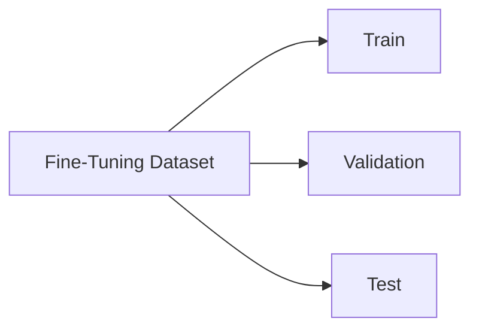

The training set is used to update parameters.

The validation set is used for:

- Hyperparameter selection
- Model selection
- Early stopping

The test set is reserved for final evaluation.

---

# 25. Avoiding Data Leakage

Data leakage can invalidate fine-tuning evaluation.

Example:

```text
Training Dataset
       +
Test Dataset
       ↓
Same / Near-Duplicate Examples
       ↓
Artificially High Performance
```

A production pipeline should check:

- Exact duplicates
- Near duplicates
- Repeated conversations
- Shared documents
- Temporal leakage
- Evaluation examples appearing in training

The principle is:

```text
Training Data
       ≠
Final Evaluation Data
```

---

# 26. Overfitting During Fine-Tuning

Fine-tuning datasets are often much smaller than pretraining datasets.

This makes overfitting a significant risk.

Typical pattern:

```text
Training Loss
   ↓
   ↓
   ↓

Validation Loss
   ↓
   ↑
   ↑
```

The model continues improving on training data while generalization deteriorates.

Potential solutions include:

- Fewer epochs
- Lower learning rate
- Weight decay
- Early stopping
- Better dataset diversity
- More training examples
- Parameter-efficient fine-tuning

---

# 27. Catastrophic Forgetting

**Catastrophic forgetting** occurs when fine-tuning causes a model to lose useful capabilities learned during pretraining.

Conceptually:

```text
Pretrained Knowledge
       ↓
Aggressive Fine-Tuning
       ↓
Task-Specific Adaptation
       ↓
Loss of Some General Capabilities
```

For example, a model fine-tuned aggressively on a narrow dataset may become very specialized and perform worse on general language tasks.

Potential mitigation strategies include:

- Smaller learning rates
- Fewer epochs
- Better data diversity
- Mixing general and domain data
- Parameter-efficient fine-tuning
- Careful evaluation across multiple capabilities

---

# 28. Learning Rate Scheduling

The learning rate does not necessarily remain constant throughout training.

A scheduler can modify the learning rate during training.

Conceptually:

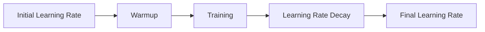

A common strategy is:

```text
Warmup
   ↓
Stable / Decaying Learning Rate
   ↓
Low Final Learning Rate
```

Warmup can help stabilize early training steps.

---

# 29. Learning Rate Warmup

During warmup, the learning rate gradually increases from a small initial value.

Conceptually:

```text
Learning Rate

   │        /
   │       /
   │      /
   │     /
   │____/────────────
   │
   └──────────────────
       Training Steps
```

Hugging Face training configurations can specify warmup steps or a warmup ratio.

Example:

```python
training_args = TrainingArguments(
    ...,
    warmup_ratio=0.1
)
```

The exact value should be tuned based on the training workload.

---

# 30. Optimizers

Fine-tuning requires an optimizer to update model parameters.

Common optimizers include:

- Adam
- AdamW
- SGD

Transformer fine-tuning commonly uses **AdamW** or related Adam-family optimizers.

Conceptually:

```text
Loss
 ↓
Gradients
 ↓
Optimizer
 ↓
Updated Parameters
```

A simplified training step is:

```python
loss.backward()
optimizer.step()
optimizer.zero_grad()
```

The optimizer configuration affects:

- Convergence
- Stability
- Training speed
- Final model quality

---

# 31. Weight Decay During Fine-Tuning

Weight decay can provide regularization.

Example:

```python
weight_decay=0.01
```

Conceptually:

```text
Fine-Tuning
     +
Weight Decay
     ↓
Reduced Overfitting Risk
```

However, weight decay should not be treated as a universal solution.

It should be evaluated together with:

- Dataset size
- Learning rate
- Number of epochs
- Model architecture
- Fine-tuning strategy

---

# 32. Effective Batch Size

The effective batch size may differ from the physical batch size.

A simplified relationship is:

```text
Effective Batch Size
=
Per-Device Batch Size
×
Number of Devices
×
Gradient Accumulation Steps
```

Example:

```text
Per GPU Batch Size = 4
GPUs = 4
Gradient Accumulation = 8

Effective Batch Size
=
4 × 4 × 8
=
128
```

This is important when comparing experiments.

---

# 33. Mixed Precision Fine-Tuning

Fine-tuning large Transformer models can require substantial GPU memory.

Mixed precision can reduce memory usage.

Common formats include:

- FP32
- FP16
- BF16

Conceptually:

```text
FP32
 ↓
Higher Memory

FP16 / BF16
 ↓
Lower Memory
+
Potentially Higher Throughput
```

Example:

```python
training_args = TrainingArguments(
    ...,
    bf16=True
)
```

or:

```python
training_args = TrainingArguments(
    ...,
    fp16=True
)
```

The correct option depends on the hardware.

---

# 34. Gradient Accumulation

Gradient accumulation allows multiple smaller batches to contribute to one optimizer update.

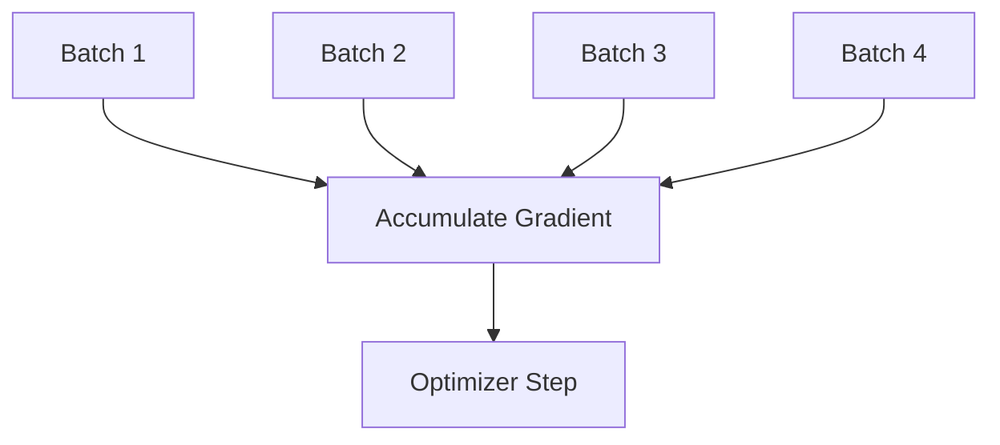

Example:

```python
training_args = TrainingArguments(
    ...,
    per_device_train_batch_size=2,
    gradient_accumulation_steps=8
)
```

This can provide a larger effective batch without requiring the entire batch to fit into GPU memory.

---

# 35. Gradient Checkpointing

Gradient checkpointing reduces activation memory by recomputing selected activations during the backward pass.

```text
Forward Pass
      ↓
Store Selected Activations
      ↓
Backward Pass
      ↓
Recompute Some Activations
      ↓
Calculate Gradients
```

Example:

```python
training_args = TrainingArguments(
    ...,
    gradient_checkpointing=True
)
```

The trade-off is:

```text
Lower Memory
     ↕
Higher Computation
```

It is particularly useful when fine-tuning large models on constrained GPU infrastructure.

---

# 36. Full Fine-Tuning vs PEFT

Full fine-tuning updates many model parameters.

PEFT methods update a much smaller parameter subset.

| Full Fine-Tuning | PEFT |
|---|---|
| Many parameters updated | Small parameter subset |
| High memory | Lower memory |
| Larger optimizer state | Smaller optimizer state |
| Higher compute | Lower compute |
| Full model adaptation | Adapter-based adaptation |
| Larger checkpoints | Smaller adapter artifacts |

Conceptually:

```text
Full Fine-Tuning

Base Model
   ↓
Update Most Parameters
   ↓
New Model
```

versus:

```text
PEFT

Base Model
   ↓
Freeze Base Model
   ↓
Train Adapter
   ↓
Adapter + Base Model
```

LoRA and QLoRA will be covered in later chapters.

---

# 37. Layer-Wise Learning Rates

Not every layer necessarily needs the same learning rate.

A strategy called **discriminative fine-tuning** can assign different learning rates to different layers.

Conceptually:

```text
Lower Layers
    ↓
Smaller Learning Rate

Middle Layers
    ↓
Moderate Learning Rate

Upper Layers
    ↓
Larger Learning Rate
```

Example:

```text
Layer 1 → 1e-6
Layer 2 → 1e-6
Layer 3 → 2e-6
Layer 4 → 5e-6
Task Head → 1e-5
```

This can help preserve lower-level pretrained representations while allowing higher-level layers to adapt more strongly.

The exact strategy should be validated experimentally.

---

# 38. Discriminative Fine-Tuning

The general idea is:

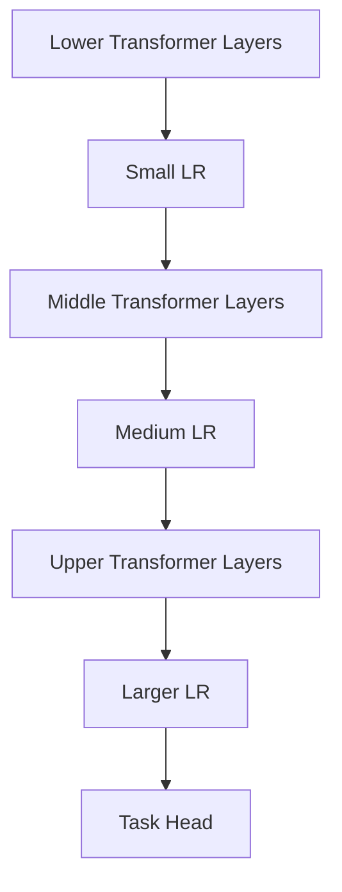

This strategy can be useful when:

- The task is related to the pretrained domain
- Lower-level representations are already useful
- Upper layers require more specialization

It is more complex than applying one learning rate to all parameters.

---

# 39. Early Stopping

Early stopping terminates training when validation performance stops improving.

Conceptually:

```text
Epoch 1 → Improving
Epoch 2 → Improving
Epoch 3 → Improving
Epoch 4 → Stable
Epoch 5 → Worse
         ↓
      Stop
```

It can reduce:

- Overfitting
- Training cost
- Unnecessary parameter updates

A production training workflow should define a clear model-selection criterion.

---

# 40. Best Checkpoint Selection

The final checkpoint is not necessarily the best checkpoint.

For example:

```text
Checkpoint 1 → F1 = 0.84
Checkpoint 2 → F1 = 0.87
Checkpoint 3 → F1 = 0.85
```

The best model is:

```text
Checkpoint 2
```

Model selection should therefore be based on the validation metric that best represents the target objective.

Possible criteria include:

- Validation loss
- Accuracy
- F1
- Recall
- Precision
- ROUGE
- BLEU
- Task-specific score

---

# 41. Evaluation Beyond Accuracy

Fine-tuning evaluation should reflect the real production objective.

For classification:

- Accuracy
- Precision
- Recall
- F1
- ROC-AUC

For generation:

- ROUGE
- BLEU
- Perplexity
- Human evaluation
- LLM-based evaluation

For enterprise LLM systems, additional dimensions may include:

```text
Correctness
Groundedness
Relevance
Safety
Consistency
Instruction Following
Latency
Cost
```

The most useful metric is not necessarily the easiest metric to calculate.

---

# 42. Fine-Tuning vs Prompt Engineering

Fine-tuning and prompt engineering solve different problems.

| Prompt Engineering | Fine-Tuning |
|---|---|
| Changes input instructions | Changes model parameters |
| No model training | Requires training |
| Fast experimentation | Higher engineering cost |
| Useful for behavior/context | Useful for deeper adaptation |
| Easy to iterate | Requires dataset and evaluation |

Conceptually:

```text
Prompt Engineering

Model
  +
Prompt
  ↓
Output
```

```text
Fine-Tuning

Pretrained Model
  +
Training Data
  ↓
Updated Model
```

A production AI engineer should evaluate prompt engineering before introducing fine-tuning complexity.

---

# 43. Fine-Tuning vs RAG

Fine-tuning and Retrieval-Augmented Generation solve different problems.

| Fine-Tuning | RAG |
|---|---|
| Changes model behavior/parameters | Provides external context |
| Useful for behavior/style/task adaptation | Useful for dynamic knowledge |
| Knowledge becomes harder to update | Knowledge can be updated in the index |
| Requires training | Usually no model training |
| Can improve domain behavior | Can improve factual grounding |

A useful mental model is:

```text
Fine-Tuning
→ Teach the model how to behave.

RAG
→ Provide the model with relevant information.
```

For enterprise knowledge that changes frequently, RAG may be more appropriate than repeatedly fine-tuning the model.

---

# 44. Fine-Tuning vs Pretraining

Pretraining teaches general language capabilities.

Fine-tuning adapts those capabilities.

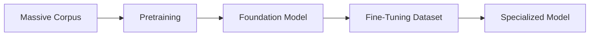

Think of:

```text
Pretraining
=
Learn general capabilities

Fine-Tuning
=
Adapt capabilities
```

---

# 45. Domain Adaptation

Fine-tuning can be used to adapt a model to specialized domains.

Examples:

- Banking
- Healthcare
- Telecom
- Legal
- Insurance
- Manufacturing
- Customer support
- Software engineering

Example:

```text
General Language Model
        ↓
Financial Domain Data
        ↓
Domain Adaptation
        ↓
Financial Language Model
```

Domain adaptation can improve the model's ability to work with:

- Domain terminology
- Domain-specific writing styles
- Specialized tasks
- Organization-specific patterns

However, domain adaptation should be evaluated carefully to avoid degrading general capabilities.

---

# 46. Enterprise Fine-Tuning Example

Suppose an enterprise wants to classify support tickets.

Raw dataset:

```text
Ticket
"Unable to complete payment"

Label
PAYMENT_FAILURE
```

Pipeline:

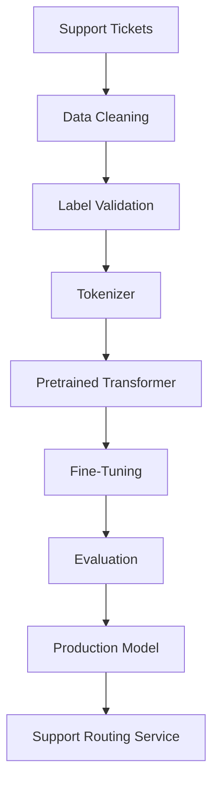

The final architecture might be:

```text
Customer
   ↓
Support API
   ↓
Ticket Classification Service
   ↓
Fine-Tuned Transformer
   ↓
Classification
   ↓
Routing System
```

This demonstrates how fine-tuning fits into a broader enterprise microservice architecture.

---

# 47. Hugging Face Fine-Tuning Workflow

A standard Hugging Face fine-tuning workflow is:

```python
from datasets import load_dataset
from transformers import (
    AutoTokenizer,
    AutoModelForSequenceClassification,
    DataCollatorWithPadding,
    TrainingArguments,
    Trainer
)

model_name = "bert-base-uncased"

dataset = load_dataset("imdb")

tokenizer = AutoTokenizer.from_pretrained(
    model_name
)

model = AutoModelForSequenceClassification.from_pretrained(
    model_name,
    num_labels=2
)


def tokenize_function(batch):
    return tokenizer(
        batch["text"],
        truncation=True,
        max_length=512
    )


tokenized_dataset = dataset.map(
    tokenize_function,
    batched=True
)


data_collator = DataCollatorWithPadding(
    tokenizer=tokenizer
)


training_args = TrainingArguments(
    output_dir="./fine-tuned-model",
    eval_strategy="epoch",
    save_strategy="epoch",
    learning_rate=2e-5,
    per_device_train_batch_size=16,
    per_device_eval_batch_size=16,
    num_train_epochs=3,
    weight_decay=0.01,
    load_best_model_at_end=True
)


trainer = Trainer(
    model=model,
    args=training_args,
    train_dataset=tokenized_dataset["train"],
    eval_dataset=tokenized_dataset["test"],
    tokenizer=tokenizer,
    data_collator=data_collator
)


trainer.train()
```

The architecture is:

```text
Dataset
   ↓
Tokenizer
   ↓
Tokenized Dataset
   ↓
Data Collator
   ↓
TrainingArguments
   ↓
Trainer
   ↓
Pretrained Transformer
   ↓
Fine-Tuned Model
```

---

# 48. Fine-Tuning Configuration Example

A production-oriented configuration might be represented as:

```yaml
model:
  name: bert-base-uncased

data:
  max_length: 512
  truncation: true
  dynamic_padding: true

training:
  learning_rate: 0.00002
  batch_size: 16
  epochs: 3
  weight_decay: 0.01
  gradient_accumulation_steps: 2

evaluation:
  strategy: epoch
  metric: f1

checkpoint:
  strategy: epoch
  save_best_model: true
```

The exact configuration should be adapted to the model and workload.

The important production principle is:

```text
Training Logic
      +
Versioned Configuration
      ↓
Reproducible Experiment
```

---

# 49. Reproducibility

A fine-tuning experiment should track:

```text
Model Version
Dataset Version
Tokenizer Version
Preprocessing Version
Learning Rate
Batch Size
Epochs
Optimizer
Scheduler
Random Seed
Hardware
Software Versions
Evaluation Metrics
```

Conceptually:

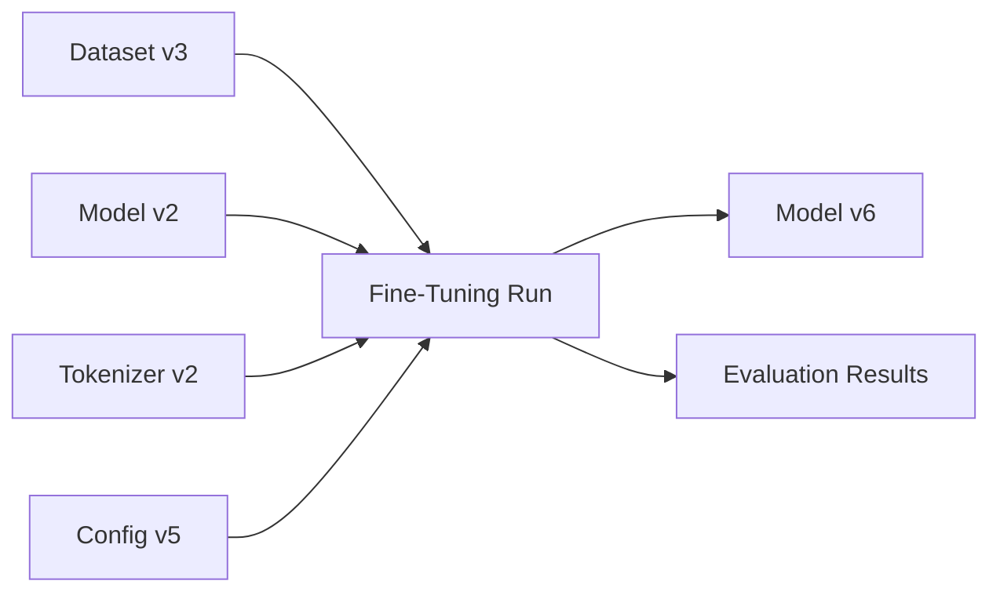

Without this information, comparing experiments becomes difficult.

---

# 50. Fine-Tuning Experiment Tracking

A useful experiment record can contain:

```text
Experiment ID
Model
Dataset
Dataset Version
Tokenizer
Learning Rate
Batch Size
Epochs
Optimizer
Scheduler
Trainable Parameters
Training Loss
Validation Loss
Evaluation Metrics
Training Duration
GPU Type
Checkpoint
Final Model
```

This allows engineers to answer:

```text
Why did Experiment B perform better than Experiment A?
```

rather than relying on memory or undocumented configuration.

---

# 51. Production Workflow

A production Transformer fine-tuning workflow should be designed as an end-to-end ML/AI engineering pipeline.

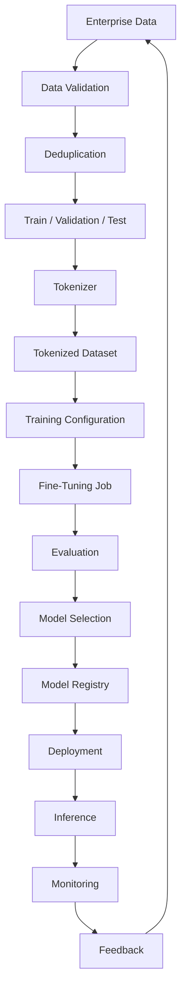

A production system should include:

- Dataset versioning
- Model versioning
- Tokenizer versioning
- Configuration versioning
- Experiment tracking
- Checkpointing
- Automated evaluation
- Model registry
- Deployment automation
- Monitoring
- Rollback capability

---

# 52. Production Model Lineage

Model lineage should connect:

```text
Source Data
     ↓
Dataset Version
     ↓
Preprocessing Version
     ↓
Tokenizer Version
     ↓
Training Configuration
     ↓
Fine-Tuning Run
     ↓
Checkpoint
     ↓
Model Version
     ↓
Production Deployment
```

A useful architecture is:


This enables:

- Auditing
- Debugging
- Reproducibility
- Rollbacks
- Compliance
- Experiment comparison

---

# 53. Production Observability

Fine-tuning should be observable at multiple levels.

## Training Metrics

- Training loss
- Validation loss
- Learning rate
- Gradient norms
- Evaluation metrics

## Infrastructure Metrics

- GPU utilization
- GPU memory
- CPU utilization
- Disk throughput
- Network throughput
- Training duration

## Data Metrics

- Number of examples
- Average sequence length
- P95 sequence length
- Truncation rate
- Duplicate rate
- Label distribution

## Model Metrics

- Accuracy
- Precision
- Recall
- F1
- Task-specific metrics
- Regression metrics
- Safety metrics

---

# 54. Production Cost Optimization

Fine-tuning cost is influenced by:

```text
Model Size
×
Dataset Size
×
Sequence Length
×
Number of Epochs
×
Compute Cost
```

Optimization strategies include:

- Use an appropriately sized pretrained model
- Remove duplicate data
- Reduce unnecessary sequence length
- Use dynamic padding
- Use mixed precision
- Use gradient accumulation
- Use gradient checkpointing
- Use PEFT when appropriate
- Monitor GPU utilization
- Avoid unnecessary epochs

The objective should be:

> Maximize useful task improvement per unit of compute.

---

# 55. Security and Enterprise Data

Fine-tuning enterprise models may involve sensitive organizational data.

Important controls include:

- Access control
- Encryption
- Data minimization
- Dataset governance
- Audit logging
- Data retention policies
- Secure artifact storage
- PII handling
- Secrets management
- Model access control

The pipeline should distinguish:

```text
Training Data
      ↓
Sensitive Enterprise Information
      ↓
Controlled Data Boundary
      ↓
Training Infrastructure
```

Training data should not automatically be treated as safe merely because it is internal.

---

# 56. Common Fine-Tuning Mistakes

## Mistake 1 — Starting With Full Fine-Tuning

Do not assume every problem requires updating all model parameters.

Evaluate:

```text
Prompt Engineering
      ↓
RAG
      ↓
PEFT
      ↓
Full Fine-Tuning
```

based on the actual requirement.

---

## Mistake 2 — Using Too High a Learning Rate

A high learning rate can damage pretrained representations.

Start conservatively and evaluate.

---

## Mistake 3 — Training for Too Many Epochs

Small fine-tuning datasets can overfit quickly.

Monitor validation performance.

---

## Mistake 4 — Ignoring Dataset Quality

A larger noisy dataset is not automatically better.

---

## Mistake 5 — No Held-Out Evaluation

Without an independent evaluation set, model improvement cannot be trusted.

---

## Mistake 6 — Ignoring Catastrophic Forgetting

A specialized model may lose general capabilities.

Evaluate both:

```text
Target Task
+
General Capabilities
```

when general-purpose behavior matters.

---

## Mistake 7 — Inconsistent Tokenization

Training and inference must use compatible:

- Tokenizer
- Vocabulary
- Special tokens
- Chat template
- Preprocessing

---

## Mistake 8 — No Model Lineage

If the production model cannot be traced to its dataset and training configuration, debugging becomes difficult.

---

# 57. Fine-Tuning Decision Framework

A useful production decision framework is:

```mermaid
flowchart TD
    A["Need Better Model Behavior?"] --> B{"Prompt Engineering Enough?"}
    B -->|Yes| C["Prompt Engineering"]
    B -->|No| D{"Need External / Changing Knowledge?"}
    D -->|Yes| E["RAG"]
    D -->|No| F{"Need Task / Style Adaptation?"}
    F -->|Yes| G{"Large Model / Limited Compute?"}
    G -->|Yes| H["PEFT"]
    G -->|No| I["Fine-Tuning"]
```

The key idea is:

```text
Not every LLM problem is a fine-tuning problem.
```

---

# 58. Interview Questions

## Beginner

- What is Transformer fine-tuning?
- What is transfer learning?
- Why fine-tune a pretrained Transformer?
- What is full fine-tuning?
- What is feature extraction?
- What does freezing model parameters mean?
- What is a task-specific head?
- What is catastrophic forgetting?
- Why is learning rate important during fine-tuning?

## Intermediate

- Pretraining vs fine-tuning?
- Full fine-tuning vs feature extraction?
- How do you fine-tune BERT for classification?
- How do you fine-tune a decoder-only LLM?
- Why is fine-tuning learning rate usually small?
- What is gradient accumulation?
- What is mixed-precision fine-tuning?
- What is gradient checkpointing?
- How do you prevent overfitting?
- How do you detect data leakage?
- How do you select the best checkpoint?
- What is discriminative fine-tuning?
- Why is dataset quality important?

## Advanced

- How would you design a production Transformer fine-tuning pipeline?
- When would you choose PEFT over full fine-tuning?
- How would you prevent catastrophic forgetting?
- How would you select learning rates for different Transformer layers?
- How would you optimize fine-tuning for limited GPU memory?
- How would you diagnose poor GPU utilization?
- How would you design dataset and model lineage?
- How would you compare fine-tuning versus RAG?
- How would you evaluate whether fine-tuning actually improved production quality?
- How would you implement rollback for a fine-tuned model?
- How would you handle sensitive enterprise data during fine-tuning?
- How would you design multi-GPU fine-tuning for a large Transformer?
- How would you optimize cost without significantly reducing model quality?

---

# 59. Scenario-Based Interview Questions

## Scenario 1 — Fine-Tuned Model Overfits

You have:

```text
Training Loss ↓
Validation Loss ↑
```

What would you investigate?

```text
Dataset Size
Dataset Quality
Epochs
Learning Rate
Weight Decay
Duplicate Data
```

Possible actions:

- Reduce epochs
- Lower learning rate
- Add regularization
- Improve dataset diversity
- Use early stopping
- Evaluate PEFT

---

## Scenario 2 — Fine-Tuned Model Lost General Capabilities

The specialized task improved, but general performance degraded.

Possible causes:

```text
Aggressive Fine-Tuning
       ↓
Large Parameter Updates
       ↓
Catastrophic Forgetting
```

Potential approaches:

- Lower learning rate
- Reduce epochs
- Improve data diversity
- Mix general and domain data
- Use PEFT
- Evaluate broader benchmark coverage

---

## Scenario 3 — GPU Memory Is Insufficient

You cannot fit the desired batch size.

Investigate:

```text
Batch Size
Sequence Length
Model Size
Precision
Activation Memory
```

Potential solutions:

```text
Reduce Batch Size
       +
Gradient Accumulation
       +
Mixed Precision
       +
Gradient Checkpointing
       +
PEFT
```

---

## Scenario 4 — Fine-Tuning Improves Offline Metrics but Not Production

Investigate whether offline evaluation represents production traffic.

Check:

```text
Training Distribution
       ↓
Validation Distribution
       ↓
Production Distribution
```

Potential issues:

- Dataset mismatch
- Evaluation leakage
- Poor production representative data
- Incorrect metric
- Prompt/template mismatch
- Tokenizer mismatch

---

# 60. 🚀 Quick Revision Sheet

## Fine-Tuning

```text
Pretrained Model
      +
Task Dataset
      ↓
Fine-Tuning
      ↓
Specialized Model
```

## Main Strategies

```text
Feature Extraction
       ↓
Partial Fine-Tuning
       ↓
Full Fine-Tuning
       ↓
PEFT
```

## Core Hyperparameters

- Learning Rate
- Batch Size
- Epochs
- Weight Decay
- Warmup
- Optimizer
- Scheduler
- Gradient Accumulation

## Memory Optimization

```text
Mixed Precision
+
Gradient Accumulation
+
Gradient Checkpointing
+
PEFT
```

## Fine-Tuning Risks

- Overfitting
- Catastrophic Forgetting
- Data Leakage
- Poor Dataset Quality
- High Compute Cost
- Distribution Shift

## Evaluation

```text
Training Metrics
+
Validation Metrics
+
Held-Out Test
+
Production Evaluation
```

---

# 61. Remember

> **Transformer fine-tuning adapts a pretrained model to a specific task or domain by updating selected model parameters using task-specific data.**

The core mental model is:

```text
Pretraining
    ↓
General Capabilities
    ↓
Fine-Tuning
    ↓
Task / Domain Adaptation
    ↓
Specialized Model
```

Remember:

```text
Fine-Tuning
≠
Training From Scratch
```

and:

```text
Fine-Tuning
≠
RAG
```

Fine-tuning primarily changes **model behavior and learned parameters**, while RAG primarily provides **external context at inference time**.

The most important production principle is:

> **Choose the smallest adaptation mechanism that reliably solves the business problem.**

---

# 62. Key Takeaways

- Transformer fine-tuning is a form of transfer learning that adapts pretrained models to specific tasks or domains.
- Fine-tuning is significantly less expensive than training a Transformer from scratch.
- Full fine-tuning updates most or all trainable model parameters.
- Feature extraction freezes the pretrained Transformer and trains a task-specific head.
- Partial fine-tuning updates only selected Transformer layers.
- Learning rate is one of the most important fine-tuning hyperparameters.
- Fine-tuning generally requires conservative parameter updates because the pretrained model already contains useful knowledge.
- Task-specific heads allow the same pretrained architecture to support classification, token classification, question answering, and generation tasks.
- Fine-tuning datasets must be high quality, diverse, correctly labeled, and representative of the target workload.
- Data leakage can produce misleadingly strong evaluation results.
- Small datasets increase the risk of overfitting.
- Catastrophic forgetting can occur when aggressive fine-tuning damages previously learned capabilities.
- Learning-rate warmup and scheduling can improve training stability.
- Gradient accumulation enables larger effective batch sizes under GPU memory constraints.
- Mixed precision can reduce memory usage and improve training throughput.
- Gradient checkpointing trades additional computation for reduced activation memory.
- Layer-wise or discriminative learning rates can provide more controlled adaptation.
- PEFT methods can reduce the memory and compute requirements of fine-tuning large models.
- Fine-tuning and RAG solve different problems and should not be treated as interchangeable.
- Production fine-tuning requires dataset versioning, model lineage, experiment tracking, evaluation, security, observability, and rollback capabilities.
- Fine-tuning should be evaluated against production-relevant metrics rather than relying exclusively on training loss or a single offline metric.
- The best model is not necessarily the final checkpoint; model selection should be based on an appropriate validation objective.
- A production AI engineer should choose between prompt engineering, RAG, PEFT, and full fine-tuning based on the actual problem rather than defaulting to model training.

---

# 63. Chapter Navigation

## Previous Chapter

[09. Hugging Face Training Workflow](09-huggingface-training-workflow.md)

## Current Chapter

**10. Transformer Fine-Tuning Fundamentals**

## Next Chapter

[11. Supervised Fine-Tuning (SFT)](11-supervised-fine-tuning-sft.md)

## Related Chapters

- [01. Generative AI Fundamentals](01-generative-ai-fundamentals.md)
- [02. Language Understanding Fundamentals](02-language-understanding-fundamentals.md)
- [03. Word Embeddings](03-word-embeddings.md)
- [04. Language Modeling](04-language-modeling.md)
- [05. Attention and Positional Encoding](05-attention-and-positional-encoding.md)
- [06. GPT and BERT Architecture](06-gpt-and-bert-architecture.md)
- [07. Hugging Face and Transformers](07-huggingface-and-transformers.md)
- [08. LLM Data Preparation](08-llm-data-preparation.md)
- [09. Hugging Face Training Workflow](09-huggingface-training-workflow.md)
- [11. Supervised Fine-Tuning (SFT)](11-supervised-fine-tuning-sft.md)
- [12. Parameter-Efficient Fine-Tuning](12-parameter-efficient-fine-tuning.md)
- [13. LoRA and QLoRA](13-lora-and-qlora.md)

---

# References

- Hugging Face Transformers Documentation
- Hugging Face Datasets Documentation
- Hugging Face Trainer Documentation
- Hugging Face PEFT Documentation
- PyTorch Documentation
- Attention Is All You Need — Vaswani et al.
- BERT: Pre-training of Deep Bidirectional Transformers for Language Understanding
- Improving Language Understanding by Generative Pre-Training — Radford et al.
- Exploring the Limits of Transfer Learning with a Unified Text-to-Text Transformer — Raffel et al.
- Training language models to follow instructions with human feedback — Ouyang et al.
- Parameter-Efficient Transfer Learning for NLP — Houlsby et al.
- LoRA: Low-Rank Adaptation of Large Language Models — Hu et al.
- Training language models to follow instructions with human feedback — Ouyang et al.
- Speech and Language Processing — Jurafsky & Martin

---

> **Enterprise AI Engineering Handbook**  
> *Building Production-Grade Enterprise AI Systems — One Chapter at a Time.*