# 11 — Supervised Fine-Tuning (SFT)

> A practical, production-oriented guide to **Supervised Fine-Tuning (SFT)** for Large Language Models, covering instruction datasets, prompt-response pairs, conversational datasets, causal language modeling, loss masking, labels, chat templates, data quality, training configuration, evaluation, Hugging Face TRL, checkpoints, overfitting, catastrophic forgetting, parameter-efficient SFT, production workflows, and enterprise AI engineering considerations.

---

# 1. Overview

**Supervised Fine-Tuning (SFT)** is the process of adapting a pretrained language model using a curated dataset containing examples of desired model behavior.

Each training example typically contains:

```text
Input / Instruction
        +
Expected Response
        ↓
Supervised Fine-Tuning
        ↓
Instruction-Following Model
```

For example:

```text
Instruction:
Explain REST API in simple terms.

Response:
A REST API is an interface that allows applications
to communicate using HTTP-based operations...
```

During SFT, the model learns to generate responses that resemble the desired responses in the training dataset.

SFT is one of the most important stages in the modern LLM post-training lifecycle.

A simplified lifecycle is:

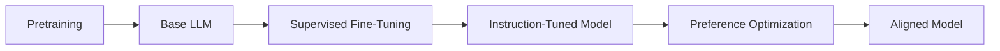

---

# 2. What Is Supervised Fine-Tuning?

Supervised Fine-Tuning uses labeled examples to teach a pretrained model how to perform a desired task.

The dataset contains:

```text
Input
+
Target Output
```

The model generates a prediction and compares it with the target output.

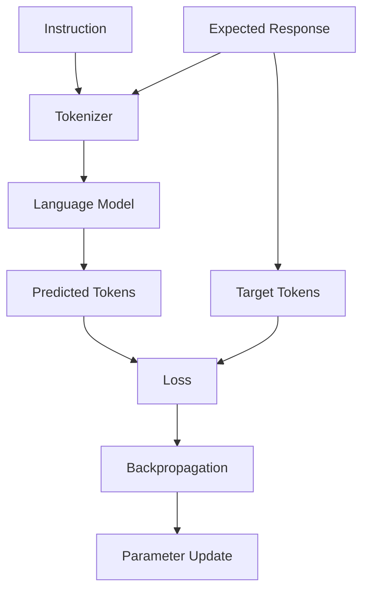

The fundamental objective is:

> Minimize the difference between the model's generated response and the desired response.

---

# 3. SFT vs Pretraining

Pretraining and SFT serve different purposes.

| Pretraining | Supervised Fine-Tuning |
|---|---|
| Learns general language capabilities | Learns desired task behavior |
| Extremely large datasets | Usually smaller curated datasets |
| Self-supervised objective | Supervised input-output examples |
| Very expensive | Relatively cheaper |
| Builds foundation model | Adapts foundation model |
| Learns language patterns | Learns instructions and response patterns |

Conceptually:

```text
PRETRAINING

Massive Text Corpus
       ↓
Next-Token Prediction
       ↓
Base LLM
```

```text
SFT

Instruction / Response Dataset
       ↓
Supervised Learning
       ↓
Instruction-Tuned LLM
```

---

# 4. Why SFT Matters

A base language model may be capable of generating text but may not reliably follow instructions.

For example, a base model may continue:

```text
Explain Kubernetes:

Kubernetes is a system...
```

An instruction-tuned model is optimized to respond directly:

```text
Kubernetes is a container orchestration platform
that automates deployment, scaling, and management
of containerized applications.
```

SFT helps transform:

```text
Base Language Model
```

into:

```text
Instruction-Following Language Model
```

---

# 5. Base Model vs Instruction-Tuned Model

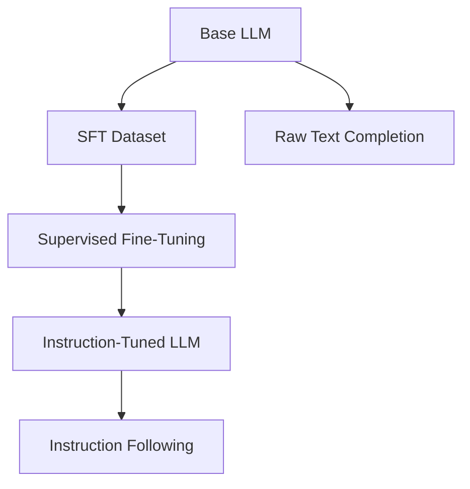

A base model primarily learns:

```text
"What token is likely to come next?"
```

SFT teaches:

```text
"Given this instruction, what response should I produce?"
```

The underlying training objective still relies heavily on next-token prediction, but the dataset changes the behavior being optimized.

---

# 6. Instruction Dataset

An SFT dataset commonly contains examples such as:

```json
{
  "instruction": "Explain Docker containers.",
  "response": "Docker containers package applications..."
}
```

A larger dataset might contain:

```json
[
  {
    "instruction": "Explain REST APIs.",
    "response": "REST APIs expose resources..."
  },
  {
    "instruction": "What is Kubernetes?",
    "response": "Kubernetes is a container orchestration platform..."
  }
]
```

The quality of these examples strongly influences the resulting model.

---

# 7. Instruction-Response Structure

A basic SFT example contains:

```text
Instruction
    ↓
Expected Response
```

A more complete representation may include:

```text
System Instruction
        +
User Instruction
        ↓
Assistant Response
```

For conversational models:

```text
System
  ↓
User
  ↓
Assistant
  ↓
User
  ↓
Assistant
```

This structure is commonly represented using chat messages.

---

# 8. Conversational SFT Dataset

A conversational example may look like:

```json
{
  "messages": [
    {
      "role": "system",
      "content": "You are a helpful technical assistant."
    },
    {
      "role": "user",
      "content": "What is an API gateway?"
    },
    {
      "role": "assistant",
      "content": "An API gateway is a centralized entry point..."
    }
  ]
}
```

The roles provide structural information.

Common roles include:

- `system`
- `user`
- `assistant`

The exact supported format depends on the model and training framework.

---

# 9. SFT Data Pipeline

A production SFT data pipeline can be represented as:

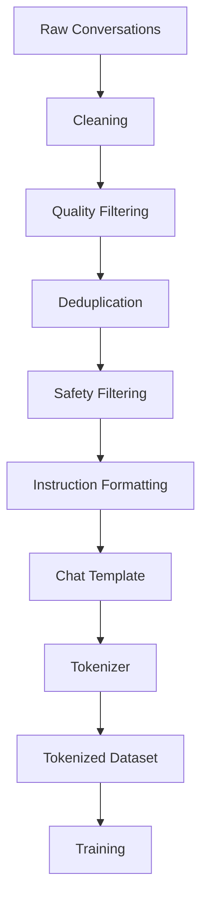

This demonstrates an important principle:

> SFT is not only a model-training problem. It is also a data-engineering problem.

---

# 10. What Makes a Good SFT Example?

A good SFT example should generally be:

- Correct
- Relevant
- Clear
- Consistent
- Representative
- Well formatted
- Free from unnecessary noise
- Appropriate for the target model behavior

For technical assistants, examples should ideally demonstrate:

```text
Correct Technical Reasoning
+
Clear Explanations
+
Consistent Terminology
+
Useful Structure
+
Appropriate Level of Detail
```

---

# 11. Data Quality Is Critical

SFT teaches the model to imitate patterns present in the dataset.

If the dataset contains poor responses:

```text
Poor Training Data
        ↓
Poor Learned Behavior
```

If the dataset contains high-quality responses:

```text
High-Quality Training Data
        ↓
Better Behavioral Signal
```

A useful principle is:

> **SFT amplifies the behavior represented by its training examples.**

Therefore, data quality often matters more than simply increasing dataset size.

---

# 12. SFT Dataset Quality Dimensions

Important quality dimensions include:

```text
Correctness
Consistency
Relevance
Diversity
Coverage
Formatting
Instruction Quality
Response Quality
Safety
Domain Accuracy
```

For enterprise applications, also consider:

```text
PII
Confidential Information
Regulated Data
Internal Policies
Security Information
```

---

# 13. Dataset Diversity

A model should not be trained only on repetitive examples.

For example:

```text
Question A → Same Response Pattern
Question B → Same Response Pattern
Question C → Same Response Pattern
Question D → Same Response Pattern
```

This may cause the model to learn a narrow response style.

A stronger dataset contains variation:

```text
Different Instructions
        +
Different Domains
        +
Different Difficulty Levels
        +
Different Response Styles
        ↓
Broader Behavioral Coverage
```

---

# 14. Instruction Diversity

For an enterprise AI assistant, instructions may include:

```text
Explain
Summarize
Compare
Extract
Classify
Transform
Generate
Debug
Analyze
Recommend
Translate
Reason
```

Example:

```text
Explain:
"What is Kafka?"

Compare:
"Kafka vs RabbitMQ"

Extract:
"Extract all API endpoints."

Summarize:
"Summarize this incident report."

Transform:
"Convert this JSON into YAML."
```

A diverse instruction distribution can produce more robust behavior.

---

# 15. Response Quality

Responses should represent the behavior you want the model to learn.

Poor response:

```text
Kafka is good.
```

Better response:

```text
Apache Kafka is a distributed event-streaming platform
designed for high-throughput, fault-tolerant event ingestion,
storage, and processing.
```

The model learns from the patterns present in the target response.

---

# 16. SFT and Next-Token Prediction

SFT for decoder-only LLMs still commonly uses a causal language-model objective.

Suppose the target response is:

```text
Kafka is an event streaming platform.
```

The model learns:

```text
Kafka
   ↓
is
   ↓
an
   ↓
event
   ↓
streaming
   ↓
platform
```

More precisely, the model learns conditional probabilities:

```text
P(token₂ | token₁)

P(token₃ | token₁, token₂)

P(token₄ | token₁, token₂, token₃)

...
```

The training objective is based on next-token prediction.

---

# 17. Cross-Entropy Loss

SFT commonly uses cross-entropy loss for next-token prediction.

The model predicts a probability distribution over the vocabulary.

```text
Input Tokens
      ↓
Transformer
      ↓
Logits
      ↓
Softmax
      ↓
Token Probabilities
      ↓
Cross-Entropy Loss
```

Conceptually:

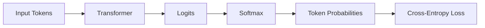

The objective is to assign high probability to the correct target tokens.

---

# 18. Token-Level Supervision

SFT is generally performed at token level.

Example:

```text
Response:

The API is secure.
```

Tokenized representation:

```text
The
API
is
secure
.
```

The model produces predictions for each target position.

```text
Position 1 → Target Token
Position 2 → Target Token
Position 3 → Target Token
Position 4 → Target Token
Position 5 → Target Token
```

Loss is calculated over the relevant target positions.

---

# 19. Prompt Tokens vs Response Tokens

Consider:

```text
User:
Explain Kubernetes.

Assistant:
Kubernetes is a container orchestration platform.
```

The complete training sequence may contain:

```text
[USER TOKENS]
+
[ASSISTANT TOKENS]
```

However, many SFT workflows calculate loss primarily on the assistant response tokens.

Conceptually:

```text
Prompt Tokens
──────────────
No / Reduced Loss Contribution

Response Tokens
────────────────
Training Loss
```

This is known as **loss masking** or **completion-only loss**, depending on the implementation.

---

# 20. Loss Masking

Loss masking determines which tokens contribute to the training loss.

Example:

```text
User:
What is Kafka?

Assistant:
Kafka is an event streaming platform.
```

Conceptually:

```text
User tokens:

What | is | Kafka | ?

  ↓
Loss Mask = 0

Assistant tokens:

Kafka | is | an | event | streaming | platform

  ↓
Loss Mask = 1
```

This allows the model to focus learning on the desired assistant response.

---

# 21. Why Loss Masking Matters

Without appropriate masking, the model may receive loss signals for tokens that represent:

- Prompt instructions
- System messages
- User messages
- Formatting tokens

With response-only loss:

```text
Prompt
  ↓
Context

Response
  ↓
Learning Target
```

This is especially useful for instruction-following and conversational SFT.

The exact masking behavior depends on the training framework and configuration.

---

# 22. Chat Templates

Modern chat models often use model-specific chat templates.

A conversational structure:

```text
System
User
Assistant
```

may be converted into a serialized token sequence.

Conceptually:

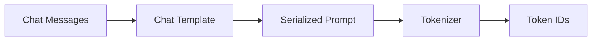

Example:

```python
messages = [
    {
        "role": "system",
        "content": "You are a helpful assistant."
    },
    {
        "role": "user",
        "content": "Explain REST APIs."
    }
]
```

A compatible tokenizer can apply the model's chat template.

```python
text = tokenizer.apply_chat_template(
    messages,
    tokenize=False
)
```

The exact template is model-specific.

---

# 23. Why Chat Templates Matter

Different chat models may use different special tokens and message formats.

For example:

```text
Model A
<system>...</system>
<user>...</user>
<assistant>...</assistant>
```

Another model may use a different representation.

Therefore:

```text
Wrong Template
      ↓
Incorrect Token Sequence
      ↓
Poor Fine-Tuning / Inference Behavior
```

Always use the model's documented chat format.

---

# 24. SFT Data Formatting

A raw dataset might contain:

```json
{
  "question": "What is Kubernetes?",
  "answer": "Kubernetes is a container orchestration platform."
}
```

It may be transformed into:

```json
{
  "messages": [
    {
      "role": "user",
      "content": "What is Kubernetes?"
    },
    {
      "role": "assistant",
      "content": "Kubernetes is a container orchestration platform."
    }
  ]
}
```

Then:

```text
Messages
   ↓
Chat Template
   ↓
Serialized Text
   ↓
Tokenizer
   ↓
Token IDs
```

---

# 25. SFT Dataset Splitting

A robust SFT dataset should normally have:

```text
Training
Validation
Test
```

Example:

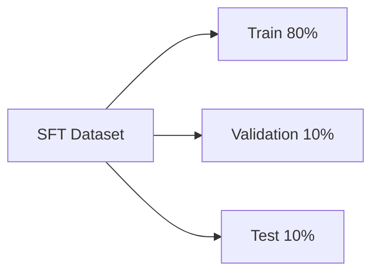

The exact proportions should depend on:

- Dataset size
- Data availability
- Evaluation requirements
- Domain complexity

The important principle is that the final evaluation set should remain isolated from training.

---

# 26. Data Leakage in SFT

Data leakage can occur when the same or nearly identical examples appear in both training and evaluation datasets.

Example:

```text
Training:
"What is Kubernetes?"

Evaluation:
"What is Kubernetes?"
```

This can produce misleadingly strong metrics.

Near duplicates can also create leakage:

```text
Training:
"Explain Kubernetes architecture."

Evaluation:
"Describe the architecture of Kubernetes."
```

Production pipelines should perform duplicate and similarity checks.

---

# 27. SFT Dataset Deduplication

Deduplication can happen at multiple levels.

```text
Exact Duplicate
      ↓
Near Duplicate
      ↓
Semantic Duplicate
```

A production data pipeline may use:

- Exact hashing
- Normalized text comparison
- MinHash
- Locality-sensitive hashing
- Embedding similarity

The goal is to reduce redundant examples and prevent evaluation contamination.

---

# 28. SFT Hyperparameters

Important SFT hyperparameters include:

- Learning rate
- Batch size
- Number of epochs
- Warmup ratio
- Weight decay
- Gradient accumulation
- Maximum sequence length
- Optimizer
- Learning-rate scheduler
- Mixed precision
- Gradient checkpointing

Example:

```python
training_args = TrainingArguments(
    output_dir="./sft-model",
    learning_rate=2e-5,
    num_train_epochs=3,
    per_device_train_batch_size=2,
    gradient_accumulation_steps=8,
    warmup_ratio=0.05,
    weight_decay=0.01,
    bf16=True
)
```

These are examples rather than universal defaults.

---

# 29. Learning Rate for SFT

SFT generally requires careful learning-rate selection.

Too high:

```text
Large Parameter Updates
       ↓
Instability
       ↓
Potential Knowledge Degradation
```

Too low:

```text
Very Small Updates
       ↓
Slow Learning
       ↓
Insufficient Adaptation
```

A useful starting point depends heavily on:

- Model size
- Full fine-tuning vs PEFT
- Dataset size
- Dataset quality
- Number of trainable parameters

PEFT and full fine-tuning may require different learning-rate ranges.

---

# 30. Epochs and Overfitting

SFT datasets can be relatively small.

Training too long can lead to:

```text
Training Loss ↓
Validation Loss ↑
```

This indicates potential overfitting.

Potential mitigations:

- Fewer epochs
- Lower learning rate
- Early stopping
- Better dataset diversity
- Regularization
- PEFT
- More high-quality examples

---

# 31. Catastrophic Forgetting During SFT

Aggressive SFT can alter pretrained behavior.

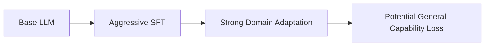

For example, a model trained heavily on a narrow enterprise style may become:

```text
Excellent at:
Internal Task

Potentially Worse at:
General Tasks
```

Mitigation strategies can include:

- Conservative learning rates
- Fewer epochs
- Diverse training examples
- Mixture of domain and general data
- PEFT
- Broad evaluation

---

# 32. Instruction Following

One of the main goals of SFT is improved instruction following.

Example:

```text
Instruction:
Summarize this document in three bullet points.
```

The model should learn:

```text
1. Key point
2. Key point
3. Key point
```

rather than:

```text
A long unrelated response.
```

SFT teaches these response patterns through examples.

---

# 33. Response Formatting

SFT can teach structured output behavior.

Examples include:

### JSON

```json
{
  "customer_id": "12345",
  "intent": "payment_failure",
  "priority": "high"
}
```

### Markdown

```markdown
## Summary

- Point one
- Point two
- Point three
```

### SQL

```sql
SELECT customer_id
FROM customers
WHERE status = 'ACTIVE';
```

### Code

```python
def calculate_total(items):
    return sum(items)
```

If structured output is important, the training dataset should contain representative examples of the desired structure.

---

# 34. SFT for Enterprise AI

Enterprise SFT can be used to teach:

- Internal terminology
- Response formats
- Domain-specific workflows
- Customer-support behavior
- Coding conventions
- Classification patterns
- Document transformation
- Structured extraction

Example:

```text
Enterprise Ticket
      ↓
SFT Model
      ↓
Intent Classification
      ↓
Routing Decision
```

Another example:

```text
Enterprise Document
      ↓
SFT Model
      ↓
Structured Extraction
      ↓
JSON
```

---

# 35. SFT vs RAG

SFT and RAG solve different problems.

| SFT | RAG |
|---|---|
| Changes model parameters | Supplies external context |
| Learns behavior | Retrieves knowledge |
| Useful for style/task adaptation | Useful for dynamic information |
| Requires training | Usually no model training |
| Knowledge becomes part of learned parameters | Knowledge remains external |
| Updating requires another training cycle | Index can often be updated independently |

Mental model:

```text
SFT
→ Teach the model how to behave.

RAG
→ Give the model information to use.
```

For frequently changing enterprise knowledge:

```text
RAG
```

is often more appropriate than repeatedly fine-tuning the model.

---

# 36. SFT vs Prompt Engineering

Prompt engineering:

```text
Model
 +
Prompt
 ↓
Output
```

SFT:

```text
Model
 +
Training Dataset
 ↓
Updated Model
```

Prompt engineering is usually easier to iterate.

SFT is useful when the desired behavior needs to become part of the model's learned behavior.

A practical decision path is:

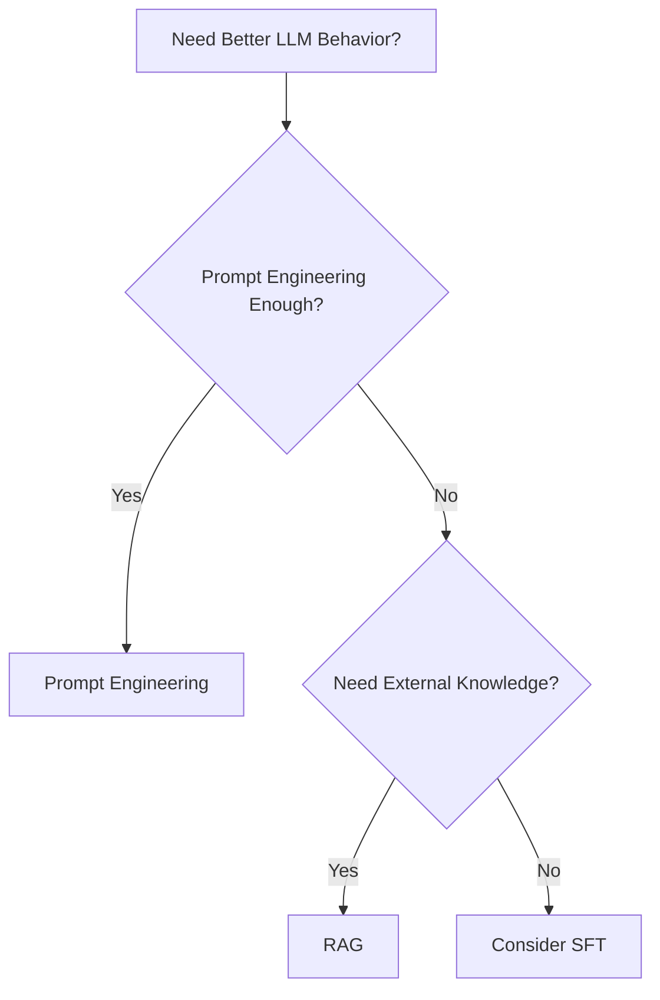

---

# 37. SFT vs Preference Optimization

SFT learns from demonstrations.

Preference optimization learns from preferences between responses.

Example SFT:

```text
Prompt
 +
Preferred Response
```

Preference optimization:

```text
Prompt
 +
Preferred Response
 +
Rejected Response
```

Conceptually:

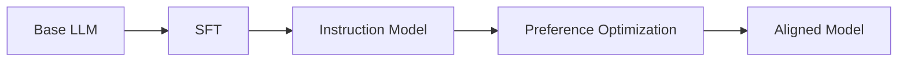

Later chapters will cover:

- Reward Modeling
- RLHF
- PPO
- DPO

---

# 38. Hugging Face TRL

**TRL (Transformer Reinforcement Learning)** provides tooling for post-training and alignment workflows.

It supports workflows including:

- Supervised Fine-Tuning
- Preference optimization
- Reward modeling
- Reinforcement-learning-based post-training

For SFT, TRL provides the `SFTTrainer`.

Conceptually:

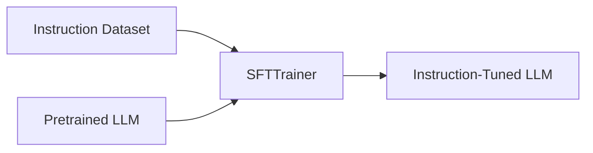

---

# 39. SFTTrainer

A simplified TRL workflow can look like:

```python
from trl import SFTTrainer

trainer = SFTTrainer(
    model=model,
    train_dataset=train_dataset,
    eval_dataset=eval_dataset,
    args=training_args
)

trainer.train()
```

The exact API and configuration options depend on the installed TRL version.

SFTTrainer can simplify:

- Dataset handling
- Tokenization
- Training
- Evaluation
- Checkpointing
- Integration with PEFT

---

# 40. Example SFT Dataset

A simple dataset might look like:

```python
dataset = [
    {
        "prompt": "What is an API gateway?",
        "completion": (
            "An API gateway is a centralized entry point "
            "for client requests to backend services."
        )
    },
    {
        "prompt": "What is Kafka?",
        "completion": (
            "Apache Kafka is a distributed event-streaming "
            "platform designed for high-throughput data pipelines."
        )
    }
]
```

The dataset can then be transformed into the format expected by the model and trainer.

---

# 41. Conversational SFT Example

A conversational dataset can look like:

```python
dataset = [
    {
        "messages": [
            {
                "role": "system",
                "content": "You are an enterprise AI assistant."
            },
            {
                "role": "user",
                "content": "What is an API gateway?"
            },
            {
                "role": "assistant",
                "content": (
                    "An API gateway provides a centralized "
                    "entry point for backend services."
                )
            }
        ]
    }
]
```

The model's chat template should be applied consistently.

---

# 42. SFT Training Architecture

A complete architecture can be represented as:

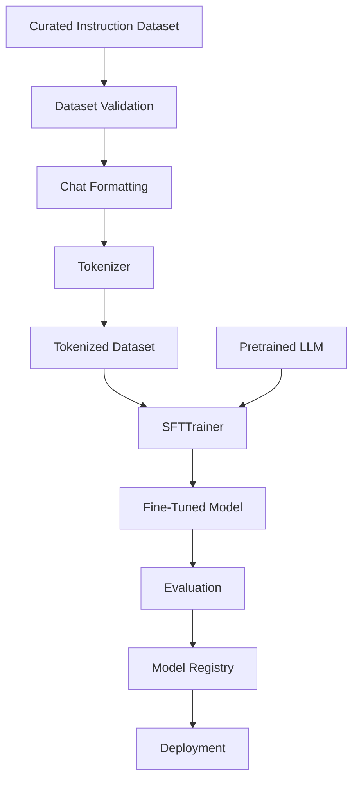

---

# 43. Parameter-Efficient SFT

Full SFT can be expensive for large models.

Parameter-efficient SFT can use methods such as:

- LoRA
- QLoRA
- Adapters

Conceptually:

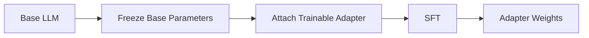

The base model remains mostly frozen.

This can dramatically reduce:

- Trainable parameters
- GPU memory
- Optimizer state
- Training cost
- Checkpoint size

Detailed PEFT and LoRA workflows are covered in later chapters.

---

# 44. SFT with LoRA

A simplified conceptual workflow is:

```python
from peft import LoraConfig

peft_config = LoraConfig(
    r=16,
    lora_alpha=32,
    lora_dropout=0.05
)
```

Then:

```text
Base LLM
   ↓
LoRA Configuration
   ↓
Trainable Adapter Layers
   ↓
SFT
   ↓
LoRA Adapter
```

The exact target modules and configuration should be selected according to the model architecture.

---

# 45. SFT Memory Optimization

Large LLMs can exceed GPU memory during SFT.

Useful techniques include:

```text
Mixed Precision
+
Gradient Accumulation
+
Gradient Checkpointing
+
Sequence Length Optimization
+
Dynamic Padding
+
PEFT
+
Quantization
```

Conceptually:

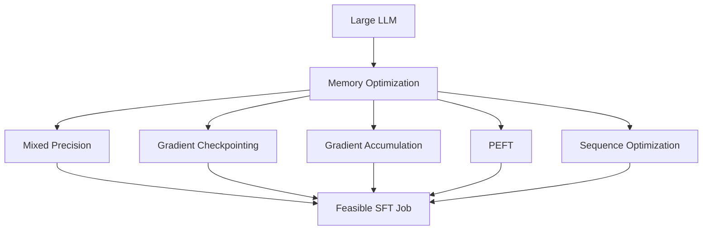

---

# 46. Sequence Length

Sequence length has a major effect on training cost.

For Transformer models, attention computation can become expensive as sequence length grows.

Conceptually:

```text
Sequence Length
      ↑
      ↑
Attention Compute
      ↑
      ↑
Memory Usage
```

Therefore:

> Do not automatically choose the model's maximum context length for every SFT example.

Analyze the actual dataset first.

---

# 47. Token Distribution Analysis

Before SFT, inspect:

```text
Minimum Tokens
Average Tokens
Median Tokens
P95 Tokens
P99 Tokens
Maximum Tokens
```

Example:

```text
Average = 420
P95     = 950
P99     = 1400
Max     = 8192
```

If most examples are short, blindly padding every example to 8192 tokens would waste substantial compute.

---

# 48. Packing

Sequence packing combines multiple short examples into a larger training sequence.

Example:

```text
Example A = 100 tokens
Example B = 150 tokens
Example C = 120 tokens

Without Packing:

[ A ---------------- ]
[ B ---------------- ]
[ C ---------------- ]

With Packing:

[ A ][ B ][ C ]----------------
```

This can improve token utilization.

However, packing must be implemented correctly so that examples do not unintentionally attend to one another when the training objective requires isolation.

---

# 49. Data Collation

A data collator prepares tokenized examples into training batches.

It may handle:

- Padding
- Labels
- Attention masks
- Tensor conversion
- Batch construction

Conceptually:

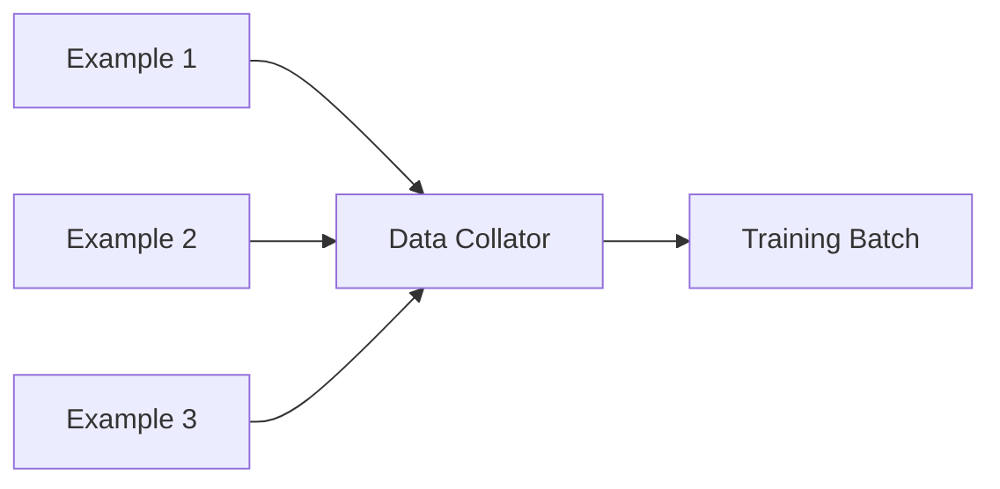

For SFT, the collator must correctly preserve the relationship between:

```text
Input Tokens
+
Labels
+
Loss Mask
```

---

# 50. Labels in Causal LM SFT

For causal language modeling, labels are generally aligned with the token sequence.

Conceptually:

```text
Input:

A B C D E

Labels:

B C D E F
```

The model predicts the next token.

In practice, frameworks may internally shift labels or logits as required.

The important concept is:

```text
Current Context
      ↓
Predict Next Token
```

---

# 51. Response-Only Training

For instruction tuning, it can be useful to calculate loss only on assistant responses.

Example:

```text
System:
You are a technical assistant.

User:
Explain Kafka.

Assistant:
Kafka is a distributed event-streaming platform.
```

Conceptually:

```text
System Tokens → Masked
User Tokens   → Masked
Assistant Tokens → Loss
```

This focuses optimization on the target response.

The exact implementation depends on the training framework and model format.

---

# 52. SFT Evaluation

Evaluation should happen at multiple levels.

## Offline Evaluation

- Validation loss
- Perplexity
- Task metrics
- Instruction-following tests

## Human Evaluation

- Helpfulness
- Correctness
- Clarity
- Relevance
- Style

## Safety Evaluation

- Unsafe behavior
- Sensitive data leakage
- Policy violations
- Prompt injection robustness

## Production Evaluation

- User satisfaction
- Task completion
- Latency
- Cost
- Failure rate

---

# 53. Perplexity

Perplexity is commonly associated with language-model evaluation.

Conceptually:

```text
Lower Perplexity
      ↓
Better Probability Assignment
```

However, lower perplexity does not automatically mean better user-facing behavior.

For instruction-tuned models, evaluation should combine:

```text
Language Modeling Metrics
+
Task Metrics
+
Human / LLM Evaluation
+
Production Metrics
```

---

# 54. SFT Evaluation Matrix

A production evaluation matrix can be:

| Dimension | Example Metric |
|---|---|
| Correctness | Human / automated score |
| Relevance | Relevance score |
| Instruction Following | Task completion |
| Format Compliance | Schema validity |
| Safety | Safety benchmark |
| Factuality | Groundedness / factuality |
| Latency | p50 / p95 |
| Cost | Cost per request |
| Reliability | Failure rate |

This provides a more complete picture than training loss alone.

---

# 55. Model Checkpointing

SFT can take significant time, especially for large models.

Checkpointing provides recovery.

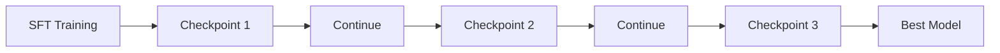

Checkpointing protects against:

- Infrastructure failure
- GPU failure
- Training interruption
- Preemption

---

# 56. Model Selection

The final training checkpoint is not automatically the best model.

Example:

```text
Checkpoint 1 → F1 0.82
Checkpoint 2 → F1 0.86
Checkpoint 3 → F1 0.84
```

Select:

```text
Checkpoint 2
```

if F1 is the appropriate selection metric.

For generative SFT, model selection may use:

- Validation loss
- Instruction-following score
- Human preference
- Domain-specific evaluation
- Safety evaluation

---

# 57. SFT Failure Modes

Common SFT failure modes include:

- Overfitting
- Catastrophic forgetting
- Poor dataset quality
- Data leakage
- Incorrect chat template
- Incorrect loss masking
- Excessive sequence length
- Poor response formatting
- Learning rate instability
- Mode collapse toward repetitive responses
- Training/inference format mismatch

A useful debugging sequence is:

```text
Dataset
   ↓
Formatting
   ↓
Chat Template
   ↓
Tokenizer
   ↓
Labels
   ↓
Loss Mask
   ↓
Training
   ↓
Evaluation
```

---

# 58. Common Mistake — Training on Bad Responses

If the target responses contain poor behavior:

```text
Bad Responses
     ↓
SFT
     ↓
Model Learns Bad Patterns
```

For example:

```text
Prompt:
Explain the error.

Bad Response:
I don't know.
```

If many examples contain this pattern, the model may learn undesirable behavior.

Curated demonstrations matter.

---

# 59. Common Mistake — Too Many Similar Examples

A dataset with thousands of near-identical examples can provide less useful training signal than a smaller diverse dataset.

```text
100,000 Highly Similar Examples
          ↓
Limited Behavioral Diversity
```

versus:

```text
20,000 High-Quality Diverse Examples
          ↓
Broader Behavioral Coverage
```

Dataset composition matters.

---

# 60. Common Mistake — Incorrect Chat Template

Training:

```text
Template A
```

Inference:

```text
Template B
```

can cause:

```text
Training / Inference Distribution Mismatch
```

Always preserve the model's expected chat formatting.

---

# 61. Common Mistake — Ignoring Token Limits

If examples exceed the configured sequence length:

```text
Long Example
    ↓
Truncation
    ↓
Important Information Lost
```

Monitor:

```text
Truncation Rate
```

If truncation is excessive, consider:

- Better preprocessing
- Chunking
- Example restructuring
- Larger context model
- Selective truncation

---

# 62. Common Mistake — Evaluating Only Training Loss

Training loss can improve while actual model quality worsens.

```text
Training Loss ↓
       ≠
Production Quality ↑
```

Always include held-out evaluation and task-specific tests.

---

# 63. Enterprise SFT Architecture

A production enterprise SFT platform can look like:

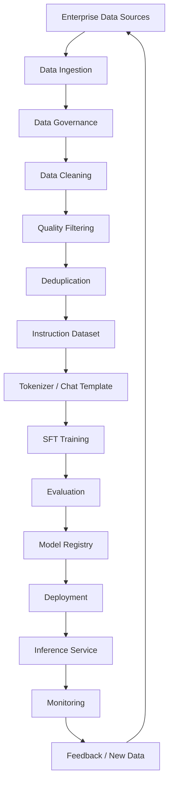

This architecture separates:

```text
Data Engineering
+
Model Training
+
Evaluation
+
Model Management
+
Inference
```

---

# 64. Production Workflow

A production-grade SFT workflow should be treated as a versioned ML/LLM pipeline.

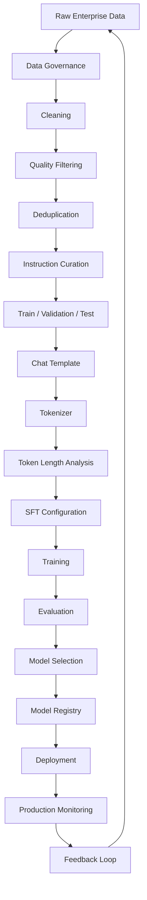

Production controls should include:

- Dataset versioning
- Model versioning
- Tokenizer versioning
- Chat-template versioning
- Configuration versioning
- Experiment tracking
- Checkpointing
- Evaluation gates
- Model registry
- Security
- Monitoring
- Rollback

---

# 65. Production Data Lineage

A production SFT model should be traceable to the exact data and configuration that produced it.

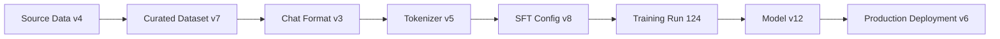

This enables:

- Reproducibility
- Auditing
- Debugging
- Rollbacks
- Experiment comparison
- Governance

---

# 66. Production Observability

SFT infrastructure should expose useful metrics.

## Training Metrics

- Training loss
- Validation loss
- Learning rate
- Gradient norm
- Tokens per second
- Steps per second

## Data Metrics

- Dataset size
- Token count
- Average sequence length
- P95 sequence length
- Truncation rate
- Duplicate rate
- Label distribution

## Infrastructure Metrics

- GPU utilization
- GPU memory
- CPU utilization
- Storage throughput
- Network throughput
- Training duration

## Model Metrics

- Instruction following
- Task accuracy
- F1
- Factuality
- Safety
- Format compliance

---

# 67. Production Cost Optimization

SFT cost is influenced by:

```text
Model Size
×
Training Tokens
×
Sequence Length
×
Epochs
×
Compute Cost
```

Optimization strategies include:

- Remove duplicate examples
- Reduce unnecessary tokens
- Use efficient sequence packing
- Use dynamic padding
- Use mixed precision
- Use gradient accumulation
- Use gradient checkpointing
- Use PEFT
- Select appropriate model size
- Avoid unnecessary training epochs

The target should be:

> **Maximum useful behavioral improvement per unit of compute.**

---

# 68. Security and Governance

Enterprise SFT datasets may contain sensitive information.

Potential risks include:

- PII leakage
- Confidential information
- Customer data
- Internal credentials
- Proprietary source code
- Regulatory data

A secure pipeline should include:

```text
Data Classification
       ↓
Access Control
       ↓
PII / Sensitive Data Filtering
       ↓
Secure Storage
       ↓
Controlled Training
       ↓
Model Evaluation
       ↓
Deployment Governance
```

A model can memorize information from its training data, so sensitive data handling must be considered before training.

---

# 69. SFT and Model Memorization

Fine-tuning can cause models to memorize training examples, especially when:

- Dataset is small
- Examples are repeated
- Training is aggressive
- Data contains unique identifiers
- Sensitive information is present

Mitigation strategies include:

- Data minimization
- Deduplication
- PII removal
- Regularization
- PEFT
- Conservative training
- Memorization testing

---

# 70. SFT and Enterprise Microservices

SFT is not the final production architecture.

A fine-tuned model can be exposed through a service:

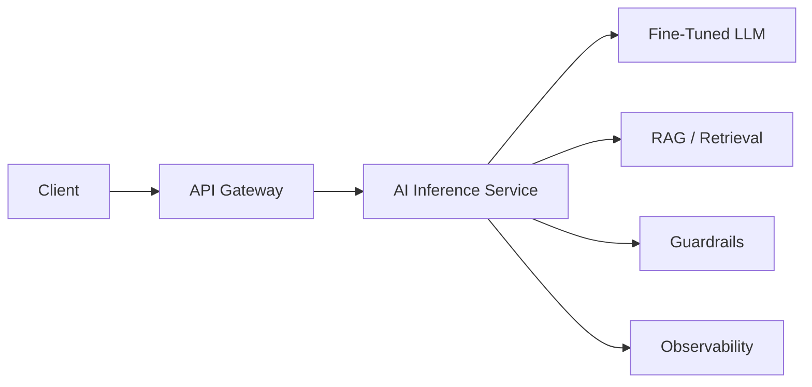

This allows the model to become one capability inside a broader enterprise application.

For a backend engineer, the important distinction is:

```text
Model Training
      ↓
Model Artifact
      ↓
Inference Service
      ↓
Enterprise API
      ↓
Business Workflow
```

---

# 71. SFT Model Deployment

After training:

```text
SFT Model
   ↓
Evaluation Gate
   ↓
Model Registry
   ↓
Deployment
   ↓
Canary / Blue-Green
   ↓
Production
```

Deployment should not occur simply because training completed successfully.

A production gate should verify:

```text
Quality
Safety
Latency
Cost
Compatibility
```

---

# 72. SFT Model Versioning

Model versions should be immutable.

Example:

```text
support-assistant-sft:v1
support-assistant-sft:v2
support-assistant-sft:v3
```

Track:

```text
Model Version
Dataset Version
Tokenizer Version
Training Config
Evaluation Results
Deployment Version
```

This allows controlled rollback:

```text
v3
 ↓
Problem
 ↓
Rollback
 ↓
v2
```

---

# 73. SFT Decision Framework

Use SFT when you need the model to learn:

```text
Task Behavior
Response Style
Domain Patterns
Instruction Following
Structured Output
Classification Behavior
Transformation Patterns
```

Consider RAG when you need:

```text
Current Knowledge
External Documents
Frequently Changing Information
Enterprise Knowledge
Source Attribution
```

Consider PEFT when:

```text
Model Is Large
+
Compute Is Limited
+
Task Adaptation Is Required
```

Consider full fine-tuning when:

```text
Strong Adaptation Is Required
+
Sufficient Data Exists
+
Compute Is Available
+
Full Parameter Updates Are Justified
```

---

# 74. SFT Decision Tree

```mermaid
flowchart TD
    A["LLM Quality Problem"] --> B{"Prompt Engineering Enough?"}
    B -->|Yes| C["Prompt Engineering"]
    B -->|No| D{"Need External / Dynamic Knowledge?"}
    D -->|Yes| E["RAG"]
    D -->|No| F{"Need Learned Behavior Adaptation?"}
    F -->|No| G["Revisit Problem Definition"]
    F -->|Yes| H{"Large Model / Limited Compute?"}
    H -->|Yes| I["PEFT + SFT"]
    H -->|No| J["SFT"]
```

---

# 75. Interview Questions

## Beginner

- What is Supervised Fine-Tuning?
- What is SFT?
- Why do we use SFT?
- Base model vs instruction-tuned model?
- What is an instruction dataset?
- What is a conversational SFT dataset?
- What is a chat template?
- What is loss masking?
- What is response-only loss?
- Why is dataset quality important?

## Intermediate

- Explain the complete SFT pipeline.
- How does SFT differ from pretraining?
- How does SFT differ from prompt engineering?
- How does SFT differ from RAG?
- What is next-token prediction in SFT?
- Why is cross-entropy used?
- What is an SFT dataset format?
- Why are chat templates important?
- What is catastrophic forgetting?
- How do you prevent SFT overfitting?
- How do you detect data leakage?
- What is sequence packing?
- How does gradient accumulation help SFT?
- Why use mixed precision?
- What is PEFT-based SFT?
- What is TRL's SFTTrainer?

## Advanced

- How would you design a production SFT pipeline?
- How would you curate an enterprise instruction dataset?
- How would you measure SFT dataset quality?
- How would you prevent evaluation contamination?
- How would you implement response-only loss?
- How would you handle multi-turn conversational SFT?
- How would you prevent catastrophic forgetting?
- How would you select between full SFT and LoRA-based SFT?
- How would you optimize SFT for limited GPU memory?
- How would you optimize SFT cost?
- How would you design model and dataset lineage?
- How would you evaluate instruction-following improvements?
- How would you detect memorization of sensitive training data?
- How would you safely deploy an SFT model into an enterprise environment?
- How would you combine SFT with RAG?
- How would you design an SFT feedback loop from production traffic?

---

# 76. Scenario-Based Interview Questions

## Scenario 1 — Training Loss Improves but Responses Become Worse

You observe:

```text
Training Loss ↓
Validation Loss ↓
User Quality ↓
```

Possible causes:

- Offline metric mismatch
- Poor evaluation dataset
- Response-style overfitting
- Training data distribution mismatch
- Loss masking issue

Investigate:

```text
Training Data
      ↓
Evaluation Data
      ↓
Human Evaluation
      ↓
Production Examples
```

---

## Scenario 2 — Model Repeats Training Responses

Possible causes:

- Small dataset
- Duplicate examples
- Excessive training
- Memorization
- Low diversity

Investigate:

```text
Duplicate Rate
Sequence Similarity
Epochs
Learning Rate
Dataset Size
```

---

## Scenario 3 — Model Works Poorly in Chat

Training:

```text
Instruction → Response
```

Inference:

```text
Chat Messages
```

Potential problem:

```text
Training Format
       ≠
Inference Format
```

Check:

- Chat template
- Special tokens
- System message format
- User/assistant roles
- Tokenizer
- Loss masking

---

## Scenario 4 — GPU Memory Is Insufficient

Use:

```text
Smaller Batch
+
Gradient Accumulation
+
Mixed Precision
+
Gradient Checkpointing
+
PEFT
+
Sequence Optimization
```

---

## Scenario 5 — SFT Improved Domain Performance but Reduced General Performance

Likely concern:

```text
Catastrophic Forgetting
```

Investigate:

- Learning rate
- Number of epochs
- Dataset diversity
- Domain/general data ratio
- PEFT vs full fine-tuning

Evaluate both:

```text
Domain Performance
+
General Capability
```

---

# 77. 🚀 Quick Revision Sheet

## SFT

```text
Pretrained LLM
      +
Instruction Dataset
      ↓
Supervised Fine-Tuning
      ↓
Instruction-Tuned LLM
```

## Dataset

```text
System
+
User
+
Assistant
```

## Training

```text
Messages
   ↓
Chat Template
   ↓
Tokenizer
   ↓
Token IDs
   ↓
Causal LM
   ↓
Next-Token Prediction
   ↓
Cross-Entropy Loss
   ↓
Backpropagation
```

## Loss Masking

```text
System Tokens
      ↓
Masked

User Tokens
      ↓
Masked

Assistant Tokens
      ↓
Loss
```

## SFT Risks

- Overfitting
- Catastrophic Forgetting
- Data Leakage
- Memorization
- Poor Dataset Quality
- Incorrect Chat Template
- Excessive Sequence Length

## Optimization

```text
Mixed Precision
+
Gradient Accumulation
+
Gradient Checkpointing
+
Sequence Packing
+
PEFT
```

## Production

```text
Dataset Versioning
+
Model Versioning
+
Tokenizer Versioning
+
Evaluation
+
Model Registry
+
Monitoring
+
Rollback
```

---

# 78. Remember

> **Supervised Fine-Tuning teaches a pretrained language model how to respond to instructions by training it on curated examples of desired input-output behavior.**

The core mental model is:

```text
Base LLM
   ↓
Curated Demonstrations
   ↓
SFT
   ↓
Instruction-Tuned LLM
```

Remember:

```text
Pretraining
→ Learn general language capabilities

SFT
→ Learn desired behavior from demonstrations

Preference Optimization
→ Learn which behaviors are preferred
```

Also remember:

> **SFT teaches behavior; RAG supplies knowledge.**

And:

> **The quality of the SFT dataset determines the quality of the behavioral signal the model receives.**

---

# 79. Key Takeaways

- Supervised Fine-Tuning adapts pretrained language models using curated instruction-response examples.
- SFT is one of the primary stages in modern LLM post-training.
- A base LLM learns general language capabilities during pretraining, while SFT teaches task and instruction-following behavior.
- SFT for decoder-only LLMs commonly uses the causal next-token prediction objective.
- Cross-entropy loss is commonly used to optimize token-level predictions.
- Instruction datasets can be represented as prompt-response pairs or multi-turn conversational messages.
- Modern chat models often require model-specific chat templates.
- Training and inference must use compatible formatting and special-token conventions.
- Loss masking can focus optimization on assistant responses rather than prompts.
- High-quality SFT datasets should be correct, relevant, diverse, representative, and consistent.
- Dataset deduplication helps reduce redundant training signals and evaluation leakage.
- Dataset leakage can create artificially strong evaluation results.
- SFT datasets should normally be separated into training, validation, and test sets.
- Small SFT datasets can lead to overfitting and catastrophic forgetting.
- Sequence length has a major impact on SFT memory and compute requirements.
- Dynamic padding and sequence packing can improve token utilization.
- Gradient accumulation allows larger effective batch sizes under GPU memory constraints.
- Mixed precision and gradient checkpointing can reduce memory requirements.
- Parameter-efficient methods such as LoRA can make SFT practical for larger models.
- TRL provides specialized tooling for SFT and other LLM post-training workflows.
- Fine-tuning should not automatically be chosen over prompt engineering or RAG.
- SFT is useful for teaching task behavior, response style, structured output, and domain-specific patterns.
- RAG is generally better suited for frequently changing external knowledge.
- Production SFT requires dataset lineage, model versioning, evaluation gates, observability, security, and rollback.
- Enterprise SFT pipelines must carefully handle sensitive data, PII, confidential information, and memorization risks.
- The best SFT model should be selected using task-specific and production-relevant evaluation rather than training loss alone.
- A successful SFT system is not just a trained model; it is a reproducible, governed, evaluated, and deployable AI engineering pipeline.

---

# 80. Chapter Navigation

## Previous Chapter

[10. Transformer Fine-Tuning Fundamentals](10-transformer-fine-tuning-fundamentals.md)

## Current Chapter

**11. Supervised Fine-Tuning (SFT)**

## Next Chapter

[12. Parameter-Efficient Fine-Tuning](12-parameter-efficient-fine-tuning.md)

## Related Chapters

- [01. Generative AI Fundamentals](01-generative-ai-fundamentals.md)
- [02. Language Understanding Fundamentals](02-language-understanding-fundamentals.md)
- [03. Word Embeddings](03-word-embeddings.md)
- [04. Language Modeling](04-language-modeling.md)
- [05. Attention and Positional Encoding](05-attention-and-positional-encoding.md)
- [06. GPT and BERT Architecture](06-gpt-and-bert-architecture.md)
- [07. Hugging Face and Transformers](07-huggingface-and-transformers.md)
- [08. LLM Data Preparation](08-llm-data-preparation.md)
- [09. Hugging Face Training Workflow](09-huggingface-training-workflow.md)
- [10. Transformer Fine-Tuning Fundamentals](10-transformer-fine-tuning-fundamentals.md)
- [12. Parameter-Efficient Fine-Tuning](12-parameter-efficient-fine-tuning.md)
- [13. LoRA and QLoRA](13-lora-and-qlora.md)
- [14. Model Quantization](14-model-quantization.md)
- [15. LLM Generation Strategies](15-llm-generation-strategies.md)

---

# References

- Hugging Face Transformers Documentation
- Hugging Face TRL Documentation
- Hugging Face PEFT Documentation
- Hugging Face Datasets Documentation
- Hugging Face Tokenizers Documentation
- PyTorch Documentation
- Attention Is All You Need — Vaswani et al.
- Improving Language Understanding by Generative Pre-Training — Radford et al.
- BERT: Pre-training of Deep Bidirectional Transformers for Language Understanding
- Exploring the Limits of Transfer Learning with a Unified Text-to-Text Transformer — Raffel et al.
- Training Language Models to Follow Instructions with Human Feedback — Ouyang et al.
- LoRA: Low-Rank Adaptation of Large Language Models — Hu et al.
- Training a Helpful and Harmless Assistant with Reinforcement Learning from Human Feedback — Bai et al.
- Direct Preference Optimization: Your Language Model is Secretly a Reward Model — Rafailov et al.
- Speech and Language Processing — Jurafsky & Martin

---

> **Enterprise AI Engineering Handbook**  
> *Building Production-Grade Enterprise AI Systems — One Chapter at a Time.*