# 12 — Parameter-Efficient Fine-Tuning (PEFT)

> A practical, production-oriented guide to **Parameter-Efficient Fine-Tuning (PEFT)** for Large Language Models, covering why full fine-tuning becomes expensive, parameter freezing, adapter-based training, LoRA, QLoRA concepts, trainable parameters, memory optimization, Hugging Face PEFT, Transformer integration, SFT with PEFT, adapter management, evaluation, deployment, production architecture, cost optimization, common failure modes, and enterprise AI engineering considerations.

---

# 1. Overview

**Parameter-Efficient Fine-Tuning (PEFT)** is a family of techniques that adapts a pretrained model by training only a small subset of parameters instead of updating the entire model.

Traditional full fine-tuning may require updating billions of parameters.

PEFT changes the strategy:

```text
Pretrained Model
      ↓
Freeze Most Parameters
      ↓
Add / Select Small Trainable Parameters
      ↓
Fine-Tune
      ↓
Specialized Model
```

The fundamental idea is:

> **Keep most of the pretrained model fixed and train only a small number of additional or selected parameters.**

PEFT is especially important for:

- Large Language Models
- Enterprise AI
- Limited GPU environments
- Multi-model customization
- Domain adaptation
- Instruction tuning
- Personalized models
- Cost-efficient model training

---

# 2. Why Parameter-Efficient Fine-Tuning?

Full fine-tuning becomes increasingly expensive as model size grows.

Consider:

```text
7B Model
 ↓
13B Model
 ↓
34B Model
 ↓
70B Model
 ↓
Hundreds of Billions of Parameters
```

Updating every parameter requires substantial:

- GPU memory
- Optimizer memory
- Gradient memory
- Compute
- Storage
- Training time

PEFT addresses this problem by dramatically reducing the number of trainable parameters.

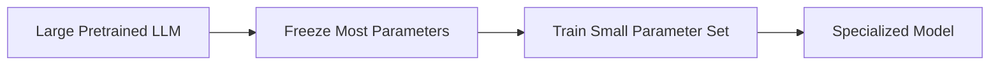

---

# 3. Full Fine-Tuning vs PEFT

| Full Fine-Tuning | PEFT |
|---|---|
| Updates most/all parameters | Updates small parameter subset |
| High GPU memory | Lower GPU memory |
| Large optimizer state | Smaller optimizer state |
| Large checkpoints | Small adapter checkpoints |
| Higher training cost | Lower training cost |
| More difficult multi-task customization | Easier adapter-based customization |
| Strong adaptation capability | Efficient adaptation |

Conceptually:

```text
FULL FINE-TUNING

Base Model
   ↓
Update All / Most Parameters
   ↓
New Full Model
```

```text
PEFT

Base Model
   ↓
Freeze Base Parameters
   ↓
Train Small Adapter
   ↓
Base Model + Adapter
```

---

# 4. Why Full Fine-Tuning Requires So Much Memory

Training memory is not determined only by model weights.

A simplified view is:

```text
Training Memory
=
Model Weights
+
Gradients
+
Optimizer States
+
Activations
```

For large models, optimizer states can consume significant additional memory.

Conceptually:

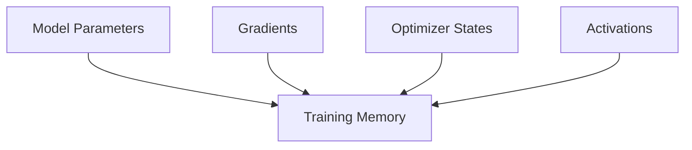

PEFT reduces the number of parameters that require:

- Gradients
- Optimizer states
- Parameter updates

The frozen base model still occupies memory, but the trainable state becomes much smaller.

---

# 5. Core PEFT Mental Model

The easiest way to understand PEFT is:

```text
Base Model
    +
Small Trainable Component
    ↓
Adapted Model
```

For example:

```text
70B Base Model
       +
Small LoRA Adapter
       ↓
Financial Assistant
```

Another adapter could be:

```text
70B Base Model
       +
Legal Adapter
       ↓
Legal Assistant
```

And another:

```text
70B Base Model
       +
Customer Support Adapter
       ↓
Support Assistant
```

The same base model can therefore support multiple specialized behaviors.

---

# 6. PEFT Architecture

A simplified PEFT architecture is:

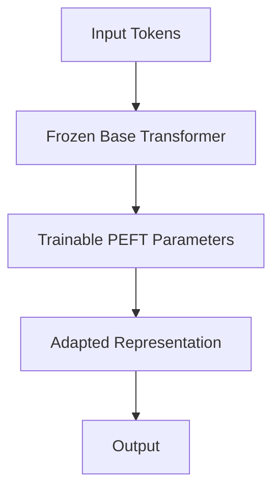

The base model remains mostly unchanged.

The trainable PEFT parameters provide task-specific adaptation.

---

# 7. Parameter Freezing

A fundamental PEFT operation is freezing base-model parameters.

Conceptually:

```python
for param in model.parameters():
    param.requires_grad = False
```

Then PEFT-specific parameters are marked trainable.

The resulting model may contain:

```text
Base Model Parameters
=====================
Frozen

Adapter Parameters
==================
Trainable
```

This is the core difference from full fine-tuning.

---

# 8. Trainable Parameter Ratio

Suppose a model contains:

```text
7,000,000,000 parameters
```

and PEFT trains:

```text
20,000,000 parameters
```

Then:

```text
Trainable Ratio
=
20M / 7B
≈ 0.29%
```

So more than:

```text
99%
```

of the original parameters remain frozen.

The exact ratio depends on:

- Model architecture
- PEFT method
- LoRA rank
- Target modules
- Number of adapted layers

---

# 9. Parameter Efficiency

A useful metric when evaluating PEFT is:

```text
Trainable Parameters
--------------------
Total Parameters
```

Example:

```text
Base Model      = 7B
Trainable       = 15M

Trainable Ratio
≈ 0.21%
```

A low trainable ratio is not automatically better.

The objective is:

> **Achieve the required task performance with the smallest practical adaptation footprint.**

---

# 10. Major PEFT Techniques

PEFT includes multiple families of approaches.

Important examples include:

- LoRA
- QLoRA
- Adapters
- Prefix Tuning
- Prompt Tuning
- P-Tuning
- IA³
- Other low-rank or selective parameter-update methods

This chapter focuses primarily on the concepts required to understand modern LLM PEFT workflows.

LoRA and QLoRA receive deeper treatment in the next chapter.

---

# 11. Adapter-Based Fine-Tuning

Adapter methods introduce small trainable modules into a pretrained network.

Conceptually:

```text
Transformer Block
       ↓
Frozen Layer
       ↓
Adapter
       ↓
Frozen Layer
```

Architecture:

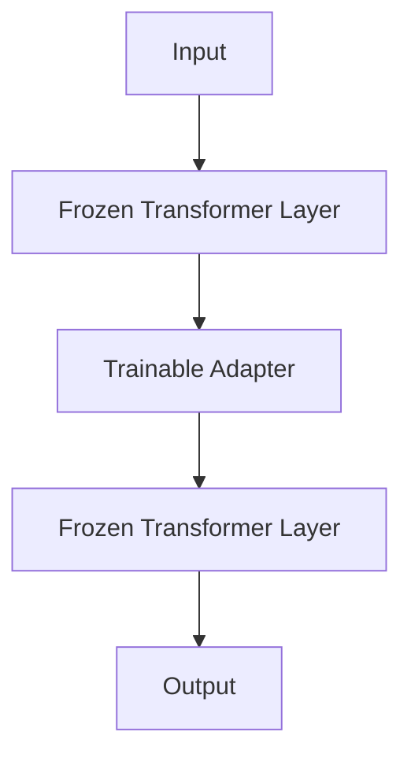

The adapter learns task-specific behavior while the original model remains largely unchanged.

---

# 12. LoRA

**LoRA — Low-Rank Adaptation of Large Language Models** — is one of the most widely used PEFT techniques.

Instead of directly updating a large weight matrix:

```text
W
```

LoRA learns a low-rank update:

```text
ΔW
```

and uses:

```text
W' = W + ΔW
```

where the update is represented using two smaller matrices.

Conceptually:

```text
ΔW = B × A
```

where:

- `A` is a low-rank matrix
- `B` is a low-rank matrix

The base weight matrix `W` remains frozen.

---

# 13. LoRA Architecture

A simplified LoRA layer can be represented as:

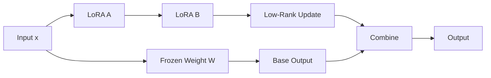

Conceptually:

```text
Output
=
W(x)
+
B(A(x))
```

The exact implementation includes a scaling factor.

---

# 14. Why Low-Rank Updates?

Large neural-network weight matrices often contain adaptation directions that can be represented efficiently using lower-rank transformations.

Instead of learning:

```text
Huge Matrix
```

LoRA learns:

```text
Small Matrix A
       ×
Small Matrix B
```

This significantly reduces trainable parameters.

---

# 15. LoRA Rank

The LoRA rank is commonly represented as:

```text
r
```

Example:

```python
LoraConfig(
    r=8
)
```

or:

```python
LoraConfig(
    r=16
)
```

Higher rank generally means:

```text
More Trainable Parameters
        +
Greater Adaptation Capacity
```

Lower rank means:

```text
Fewer Parameters
        +
Lower Memory / Storage
```

The optimal rank is task-dependent.

---

# 16. LoRA Alpha

LoRA commonly uses a scaling parameter such as:

```text
lora_alpha
```

Example:

```python
LoraConfig(
    r=16,
    lora_alpha=32
)
```

The scaling controls the contribution of the LoRA update relative to the base model.

A simplified conceptual expression is:

```text
Output
=
Base Output
+
Scaling × LoRA Update
```

The exact scaling formulation depends on the LoRA implementation.

---

# 17. LoRA Dropout

LoRA configurations may include:

```python
lora_dropout=0.05
```

Dropout can help regularize adapter training.

Conceptually:

```text
LoRA Parameters
      ↓
Dropout
      ↓
Task Adaptation
```

The appropriate value depends on:

- Dataset size
- Dataset diversity
- Task complexity
- Overfitting behavior

---

# 18. LoRA Target Modules

LoRA does not necessarily need to be applied to every model parameter.

It can target specific modules.

Common Transformer attention projections include:

```text
q_proj
k_proj
v_proj
o_proj
```

Some workflows also target feed-forward projections.

Conceptually:

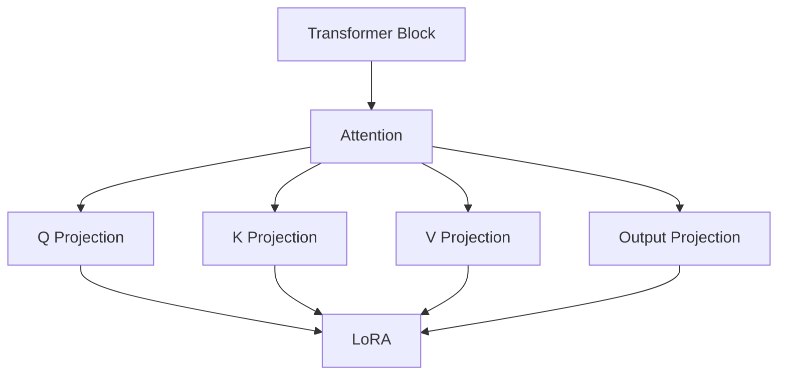

The correct target modules depend on the architecture.

---

# 19. PEFT Configuration

Hugging Face PEFT provides configuration objects.

Example:

```python
from peft import LoraConfig

peft_config = LoraConfig(
    r=16,
    lora_alpha=32,
    lora_dropout=0.05,
    bias="none",
    task_type="CAUSAL_LM"
)
```

This configuration tells the framework how the adapter should be created.

The exact configuration should be adapted to the model architecture.

---

# 20. Applying PEFT to a Model

A PEFT configuration can be applied to a pretrained model.

Conceptually:

```python
from peft import get_peft_model

model = get_peft_model(
    model,
    peft_config
)
```

The model now contains:

```text
Frozen Base Model
        +
Trainable PEFT Parameters
```

You can inspect trainable parameters using:

```python
model.print_trainable_parameters()
```

This is an important verification step.

---

# 21. PEFT Training Flow

The complete workflow becomes:

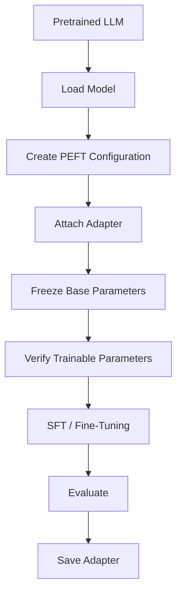

---

# 22. PEFT + SFT

PEFT is commonly combined with Supervised Fine-Tuning.

```text
Pretrained LLM
      +
Instruction Dataset
      +
LoRA
      ↓
PEFT-based SFT
      ↓
Adapter
```

Architecture:

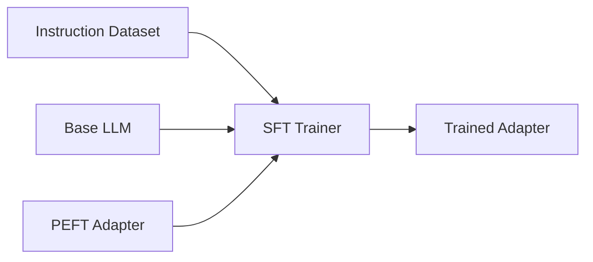

This is one of the most practical approaches for fine-tuning large open-weight LLMs.

---

# 23. Hugging Face TRL + PEFT

A simplified workflow can use TRL and PEFT together.

```python
from peft import LoraConfig
from trl import SFTTrainer

peft_config = LoraConfig(
    r=16,
    lora_alpha=32,
    lora_dropout=0.05,
    task_type="CAUSAL_LM"
)

trainer = SFTTrainer(
    model=model,
    train_dataset=train_dataset,
    eval_dataset=eval_dataset,
    peft_config=peft_config,
    args=training_args
)

trainer.train()
```

The exact API depends on the installed versions of TRL and PEFT.

---

# 24. PEFT vs Full Fine-Tuning Memory

Consider a simplified comparison:

```text
FULL FINE-TUNING

Base Model
   ↓
Gradients for many parameters
   ↓
Optimizer states for many parameters
   ↓
High Memory


PEFT

Base Model
   ↓
Frozen Parameters
   ↓
Gradients only for adapters
   ↓
Optimizer states only for adapters
   ↓
Lower Memory
```

This is the primary practical advantage of PEFT.

---

# 25. PEFT Checkpoint Size

Full fine-tuning typically produces a complete model checkpoint.

PEFT can produce a much smaller adapter artifact.

```text
Full Model Checkpoint
=====================
Large

PEFT Adapter
============
Small
```

Conceptually:

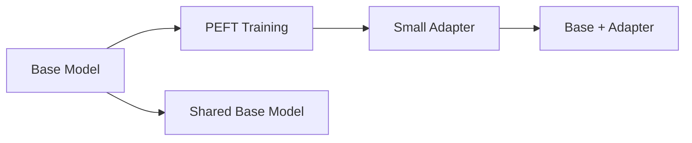

Multiple adapters can potentially share one base model.

---

# 26. Multiple Adapters

One of the strongest architectural advantages of PEFT is the ability to maintain multiple task-specific adapters.

For example:

```text
Shared Base LLM
      │
      ├── Finance Adapter
      ├── Legal Adapter
      ├── Support Adapter
      ├── Coding Adapter
      └── HR Adapter
```

Architecture:

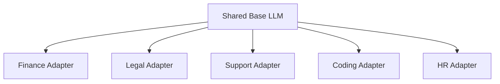

This can simplify model customization.

---

# 27. Adapter Switching

At inference time, an application can conceptually select the appropriate adapter.

```text
User Request
      ↓
Task Router
      ↓
Select Adapter
      ↓
Base LLM + Adapter
      ↓
Response
```

Example:

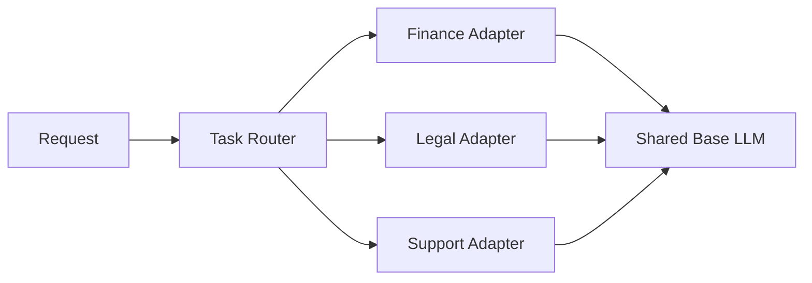

This creates an adapter-based multi-domain architecture.

---

# 28. Enterprise Adapter Architecture

A production enterprise system could use:

```text
                    ┌────────────────────┐
                    │    Base LLM        │
                    └─────────┬──────────┘
                              │
          ┌───────────────────┼───────────────────┐
          │                   │                   │
          ▼                   ▼                   ▼
    Finance Adapter      Support Adapter     Coding Adapter
          │                   │                   │
          └───────────────────┼───────────────────┘
                              ▼
                       Inference Service
```

The application can route requests based on:

- Tenant
- Business domain
- Capability
- Task
- User role
- API endpoint

---

# 29. PEFT for Multi-Tenant AI

PEFT can be useful in multi-tenant architectures.

Example:

```text
Shared Base Model
       │
       ├── Tenant A Adapter
       ├── Tenant B Adapter
       ├── Tenant C Adapter
       └── Tenant D Adapter
```

Potential benefits:

- Reduced storage
- Shared base infrastructure
- Tenant-specific behavior
- Easier adapter lifecycle management

However, strict isolation requirements must be evaluated carefully.

---

# 30. Adapter Lifecycle

Adapters should be managed like production artifacts.

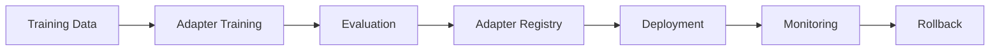

Track:

```text
Adapter Version
Base Model Version
Dataset Version
Training Configuration
Evaluation Results
Deployment Version
```

An adapter should never be treated as an anonymous file.

---

# 31. PEFT and Model Compatibility

An adapter is generally associated with a particular base-model architecture and configuration.

Conceptually:

```text
Base Model A
     +
Adapter A
     ↓
Compatible
```

But:

```text
Base Model B
     +
Adapter A
     ↓
Potentially Incompatible
```

Therefore, adapter metadata should include:

- Base model identifier
- Base model version
- Architecture
- PEFT method
- Configuration
- Target modules
- Training dataset
- Training configuration

---

# 32. QLoRA

**QLoRA** combines quantization with LoRA-based fine-tuning.

The conceptual architecture is:

```text
Large Base Model
      ↓
Quantized Base Model
      ↓
LoRA Adapters
      ↓
Fine-Tuning
```

Architecture:

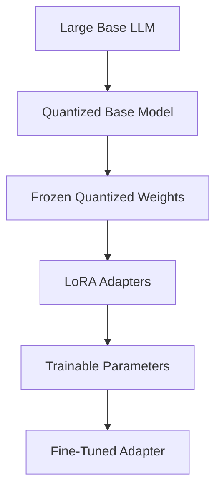

QLoRA is particularly useful when GPU memory is constrained.

Detailed QLoRA mechanics will be covered in the next chapter.

---

# 33. PEFT and Quantization

PEFT and quantization address different parts of the resource problem.

```text
Quantization
→ Reduce memory footprint of model weights

PEFT
→ Reduce number of trainable parameters
```

Together:

```text
Quantized Base Model
+
Small Trainable Adapter
=
Memory-Efficient Fine-Tuning
```

This combination is one of the most important techniques for practical LLM fine-tuning on limited hardware.

---

# 34. PEFT Training Memory

A simplified memory model is:

```text
PEFT Training Memory
=
Frozen Base Model Memory
+
Trainable Adapter Memory
+
Adapter Gradients
+
Adapter Optimizer State
+
Activations
```

The base model still needs to be loaded for forward computation.

Therefore:

> PEFT reduces training memory significantly, but it does not make the base model's memory requirement disappear.

This distinction is important when planning infrastructure.

---

# 35. Sequence Length Still Matters

PEFT does not eliminate activation memory.

For long sequences:

```text
Sequence Length ↑
      ↓
Activation Memory ↑
      ↓
Training Memory ↑
```

Therefore, even with LoRA:

- Reduce unnecessary context
- Analyze token lengths
- Use gradient checkpointing
- Use efficient batching
- Consider sequence packing

PEFT solves the trainable-parameter problem, not every memory problem.

---

# 36. PEFT Hyperparameters

Important PEFT hyperparameters vary by technique.

For LoRA:

```text
r
lora_alpha
lora_dropout
target_modules
bias
task_type
```

Training hyperparameters still matter:

```text
Learning Rate
Batch Size
Epochs
Warmup
Weight Decay
Sequence Length
Gradient Accumulation
```

PEFT does not remove the need for careful optimization.

---

# 37. LoRA Rank Selection

A practical starting strategy is to experiment with multiple ranks.

For example:

```text
r = 4
r = 8
r = 16
r = 32
```

Then compare:

```text
Quality
+
Trainable Parameters
+
Training Cost
+
Inference Cost
```

A higher rank is not automatically better.

The goal is to find an efficient trade-off.

---

# 38. Target Module Selection

The effectiveness of LoRA depends partly on where adapters are inserted.

Possible target modules may include:

```text
q_proj
k_proj
v_proj
o_proj
```

and potentially feed-forward projections.

The appropriate selection depends on:

- Model architecture
- Task
- Desired adaptation capacity
- Compute budget

Do not blindly copy target modules from another architecture.

Inspect the model architecture first.

---

# 39. Inspecting Model Modules

Before configuring LoRA, inspect the model.

Example:

```python
for name, module in model.named_modules():
    print(name)
```

Look for:

```text
attention
q_proj
k_proj
v_proj
o_proj
mlp
up_proj
down_proj
gate_proj
```

This helps identify compatible target modules.

---

# 40. Verifying Trainable Parameters

Always verify the PEFT configuration.

```python
model.print_trainable_parameters()
```

A useful output conceptually looks like:

```text
trainable params: 15M
all params: 7B
trainable%: 0.21%
```

This confirms that the intended parameters are trainable.

A production training job should fail early if the trainable parameter count is unexpectedly high.

---

# 41. PEFT Training Validation

Before launching a long training job, validate:

```text
[ ] Correct Base Model
[ ] Correct Tokenizer
[ ] Correct Dataset
[ ] Correct Chat Template
[ ] Correct PEFT Configuration
[ ] Correct Target Modules
[ ] Expected Trainable Parameter Count
[ ] Correct Loss Masking
[ ] Correct Evaluation Dataset
```

A short smoke test can save significant GPU cost.

---

# 42. PEFT Smoke Test

A practical validation strategy is:

```text
Small Dataset
      ↓
Few Training Steps
      ↓
Check Loss
      ↓
Check Gradients
      ↓
Check Trainable Parameters
      ↓
Check Output Quality
      ↓
Full Training
```

Conceptually:


---

# 43. PEFT Evaluation

Evaluate both the adapted behavior and the base model capabilities.

```text
Base Model
     ↓
Evaluation
     ↓
PEFT Model
     ↓
Evaluation
```

Compare:

```text
Task Performance
General Performance
Safety
Latency
Memory
Cost
```

This is especially important when the adapter is trained on a narrow domain.

---

# 44. Adapter Evaluation Matrix

A useful evaluation matrix is:

| Dimension | Base Model | PEFT Model |
|---|---:|---:|
| Task Accuracy | ✓ | ✓ |
| Instruction Following | ✓ | ✓ |
| Domain Quality | ✓ | ✓ |
| General Capability | ✓ | ✓ |
| Safety | ✓ | ✓ |
| Latency | ✓ | ✓ |
| Cost | ✓ | ✓ |

The goal is not simply:

```text
PEFT Score > Base Score
```

but:

```text
Required Quality
+
Acceptable Cost
+
Acceptable Operational Complexity
```

---

# 45. PEFT vs Prompt Engineering

PEFT modifies model behavior.

Prompt engineering modifies the input.

```text
Prompt Engineering

Base Model
    +
Prompt
    ↓
Response
```

```text
PEFT

Base Model
    +
Adapter
    ↓
Adapted Response
```

Prompt engineering should generally be tested first when it can solve the requirement.

PEFT becomes attractive when repeated prompting is insufficient.

---

# 46. PEFT vs RAG

PEFT and RAG solve different problems.

```text
PEFT
→ Adapt model behavior.

RAG
→ Retrieve external knowledge.
```

For example:

```text
Need model to always produce
company-specific JSON format
        ↓
PEFT may help
```

But:

```text
Need current company policy
        ↓
RAG may be more appropriate
```

They can also be combined:


---

# 47. PEFT + RAG

An enterprise AI system can combine:

```text
PEFT
+
RAG
+
Guardrails
+
Tool Calling
```

Architecture:

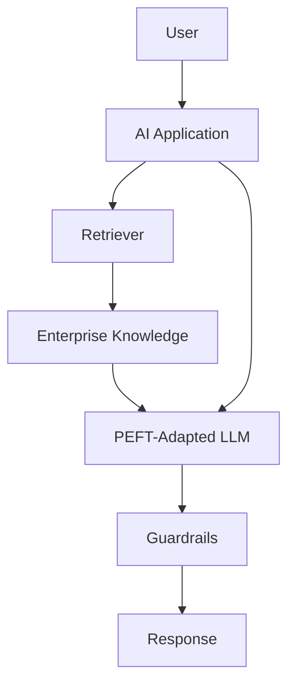

PEFT teaches:

```text
How to behave
```

RAG provides:

```text
What information to use
```

---

# 48. PEFT + SFT + RAG

A complete enterprise architecture can therefore use:

```text
Pretrained LLM
      ↓
PEFT + SFT
      ↓
Domain / Behavior Adaptation
      ↓
RAG
      ↓
Current Enterprise Knowledge
      ↓
Production Response
```

This separates:

```text
Model Behavior
```

from:

```text
External Knowledge
```

which can make enterprise systems easier to maintain.

---

# 49. PEFT Deployment Models

There are several possible deployment patterns.

## Pattern 1 — Base + Adapter at Runtime

```text
Base Model
+
Adapter
↓
Inference
```

## Pattern 2 — Merge Adapter Into Base Model

```text
Base Model
+
Adapter
↓
Merged Model
↓
Inference
```

## Pattern 3 — Multiple Adapters

```text
Base Model
├── Adapter A
├── Adapter B
└── Adapter C
```

Each has different operational trade-offs.

---

# 50. Adapter Merging

Some PEFT workflows allow adapter weights to be merged into the base model.

Conceptually:

```text
Base Model
      +
LoRA Update
      ↓
Merged Weights
```

After merging:

```text
Base + Adapter
      ↓
Standalone Model
```

Potential advantages:

- Simpler inference architecture
- No separate adapter loading step
- Potentially simpler serving

Potential disadvantages:

- Loses some flexibility of separate adapters
- Larger artifact
- More difficult adapter switching

The decision should be based on deployment requirements.

---

# 51. Adapter Serving

A multi-adapter serving architecture can be:

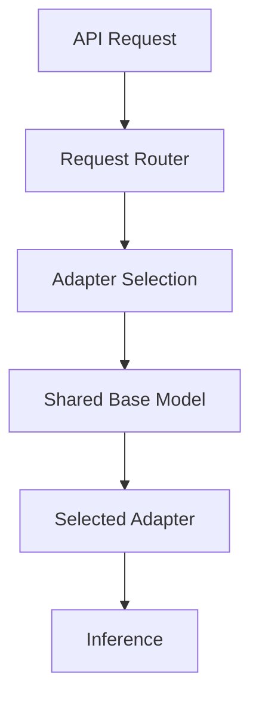

Adapter selection could depend on:

```text
Tenant
Domain
Task
User
Capability
API Route
```

This can support efficient model customization.

---

# 52. Production PEFT Architecture

A production platform can be structured as:

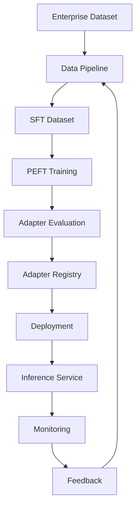

Important components include:

- Dataset storage
- Training infrastructure
- Experiment tracking
- Adapter registry
- Model registry
- Evaluation service
- Inference service
- Monitoring
- Rollback

---

# 53. Production Workflow

A production PEFT workflow should be treated as a complete lifecycle rather than simply a training script.

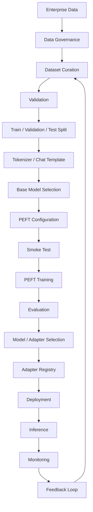

Production controls should include:

- Dataset versioning
- Base-model versioning
- Adapter versioning
- PEFT configuration versioning
- Tokenizer versioning
- Experiment tracking
- Checkpointing
- Automated evaluation
- Security
- Model registry
- Adapter registry
- Deployment automation
- Monitoring
- Rollback

---

# 54. Production Data and Model Lineage

An adapter should be traceable to the exact base model and dataset used to create it.

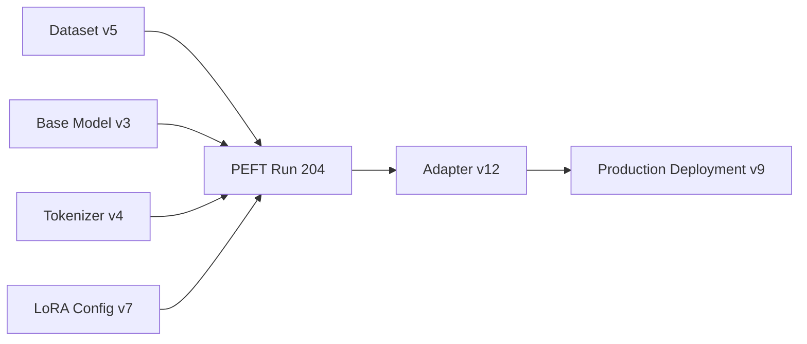

Track at minimum:

```text
Base Model
Base Model Version
Dataset Version
Tokenizer Version
Chat Template
PEFT Method
PEFT Configuration
Training Configuration
Evaluation Results
Adapter Version
Deployment Version
```

---

# 55. Production Observability

PEFT systems require observability at multiple layers.

## Training Metrics

- Training loss
- Validation loss
- Learning rate
- Gradient norms
- Trainable parameter count
- Tokens per second

## Infrastructure Metrics

- GPU utilization
- GPU memory
- CPU utilization
- Storage throughput
- Network throughput
- Training duration

## Data Metrics

- Dataset size
- Token count
- Average sequence length
- P95 sequence length
- Truncation rate
- Duplicate rate

## Model Metrics

- Task accuracy
- F1
- Instruction following
- Domain quality
- Safety
- Factuality
- General capability

## Serving Metrics

- p50 latency
- p95 latency
- Throughput
- GPU utilization
- Memory utilization
- Error rate
- Cost per request

---

# 56. Production Cost Optimization

PEFT can significantly reduce training cost, but optimization should consider the complete lifecycle.

```text
Training Cost
+
Storage Cost
+
Serving Cost
+
Operational Complexity
```

Potential optimizations:

- Use smaller appropriate base models
- Use LoRA instead of full fine-tuning
- Use quantization where appropriate
- Reduce sequence length
- Use dynamic padding
- Use efficient batching
- Cache tokenized datasets
- Use mixed precision
- Avoid unnecessary epochs
- Monitor GPU utilization
- Reuse shared base models

The goal is:

> **Minimize total cost of ownership while meeting quality requirements.**

---

# 57. PEFT Storage Optimization

Suppose:

```text
Base Model = 14 GB
Adapter = 100 MB
```

Multiple adapters could therefore be stored as:

```text
Shared Base Model
        +
100 MB Adapter A
100 MB Adapter B
100 MB Adapter C
100 MB Adapter D
```

rather than maintaining:

```text
14 GB Model A
14 GB Model B
14 GB Model C
14 GB Model D
```

This can significantly reduce storage requirements.

---

# 58. PEFT for Model Customization

PEFT enables a model-customization architecture:

```text
                    Base LLM
                       │
        ┌──────────────┼──────────────┐
        │              │              │
        ▼              ▼              ▼
    Finance         Support        Coding
    Adapter         Adapter        Adapter
        │              │              │
        └──────────────┼──────────────┘
                       ▼
                Inference Layer
```

This architecture can be useful when multiple business capabilities require different behaviors.

---

# 59. PEFT and Cloud Architecture

PEFT maps well to cloud-native AI infrastructure.

A conceptual architecture could be:

```mermaid
flowchart TD
    A["Object Storage"] --> B["Training Pipeline"]
    B --> C["GPU Training Cluster"]
    C --> D["Adapter Artifact"]
    D --> E["Model / Adapter Registry"]
    E --> F["Inference Platform"]
    F --> G["API Gateway"]
    G --> H["Enterprise Application"]
    F --> I["Observability"]
```

Cloud-specific implementation may use:

- Object storage
- Managed ML platforms
- GPU compute
- Container orchestration
- Model registries
- CI/CD
- Monitoring

The exact services depend on the cloud platform.

---

# 60. PEFT in CI/CD

PEFT artifacts can be integrated into an ML CI/CD pipeline.

```mermaid
flowchart LR
    A["Code Change"] --> B["Dataset Validation"]
    B --> C["Training"]
    C --> D["Evaluation"]
    D --> E{"Quality Gate"}
    E -->|Pass| F["Register Adapter"]
    E -->|Fail| G["Reject"]
    F --> H["Deploy"]
```

Quality gates may validate:

```text
Task Performance
Safety
Regression Tests
Latency
Memory
Cost
```

---

# 61. Regression Testing

A new adapter should not only be evaluated on the target task.

Regression testing should include:

```text
Target Task
+
General Capability
+
Safety
+
Formatting
+
Production Scenarios
```

Example:

```text
Adapter v1 → Baseline
Adapter v2 → Candidate

Compare:
Accuracy
F1
Safety
Latency
Cost
General Capability
```

---

# 62. PEFT Security Considerations

Adapters may contain learned information about the training domain.

Treat adapter artifacts as controlled model assets.

Security controls should include:

- Access control
- Encryption
- Artifact integrity
- Versioning
- Audit logs
- Secure storage
- Deployment authorization

For multi-tenant systems:

```text
Tenant A Adapter
       ≠
Tenant B Adapter
```

Ensure appropriate isolation.

---

# 63. Common PEFT Mistakes

## Mistake 1 — Assuming PEFT Solves All Memory Problems

PEFT reduces trainable-parameter memory.

It does not eliminate:

- Base-model memory
- Activation memory
- Sequence-length costs
- Inference memory

---

## Mistake 2 — Using the Wrong Target Modules

LoRA target modules are architecture-dependent.

Always inspect the model.

---

## Mistake 3 — Not Checking Trainable Parameters

Always run:

```python
model.print_trainable_parameters()
```

Unexpectedly high trainable parameters may indicate a configuration problem.

---

## Mistake 4 — Choosing a Very High LoRA Rank Without Evidence

Higher rank increases trainable parameters.

Start with a reasonable configuration and evaluate.

---

## Mistake 5 — Ignoring Dataset Quality

PEFT does not compensate for poor training data.

```text
Bad Data
+
Efficient Training
=
Efficiently Learned Bad Behavior
```

---

## Mistake 6 — Ignoring the Base Model Version

An adapter should be associated with the correct base model.

---

## Mistake 7 — Using PEFT When Prompting Would Be Enough

PEFT introduces:

- Training cost
- Evaluation complexity
- Model lifecycle complexity
- Deployment complexity

Do not train unnecessarily.

---

# 64. PEFT Failure Modes

Common failure modes include:

- Adapter has insufficient capacity
- Adapter rank is too low
- Wrong target modules
- Learning rate too high
- Dataset too small
- Dataset too repetitive
- Incorrect chat template
- Incorrect loss masking
- Base-model incompatibility
- Overfitting
- Catastrophic forgetting
- Poor evaluation
- Inference configuration mismatch

A useful debugging workflow is:

```text
Base Model
   ↓
PEFT Configuration
   ↓
Target Modules
   ↓
Trainable Parameters
   ↓
Dataset
   ↓
Tokenizer
   ↓
Training
   ↓
Evaluation
   ↓
Inference
```

---

# 65. PEFT Decision Framework

Use PEFT when:

```text
Large Pretrained Model
+
Task / Domain Adaptation
+
Limited Compute
```

Consider full fine-tuning when:

```text
Strong Full-Model Adaptation
+
Large Dataset
+
Sufficient Compute
```

Consider prompt engineering when:

```text
Behavior Can Be Controlled Through Instructions
```

Consider RAG when:

```text
Problem Is External / Dynamic Knowledge
```

A practical decision sequence is:

```mermaid
flowchart TD
    A["LLM Requirement"] --> B{"Prompt Engineering Enough?"}
    B -->|Yes| C["Prompt Engineering"]
    B -->|No| D{"Need External Knowledge?"}
    D -->|Yes| E["RAG"]
    D -->|No| F{"Need Model Adaptation?"}
    F -->|No| G["Revisit Requirement"]
    F -->|Yes| H{"Compute Constrained?"}
    H -->|Yes| I["PEFT"]
    H -->|No| J["Compare PEFT vs Full Fine-Tuning"]
```

---

# 66. PEFT vs Full Fine-Tuning Decision Matrix

| Requirement | Recommended Starting Point |
|---|---|
| Simple behavior change | Prompt Engineering |
| Dynamic enterprise knowledge | RAG |
| Small domain adaptation | PEFT |
| Limited GPU memory | PEFT |
| Multiple domain adapters | PEFT |
| Strong complete model adaptation | Full Fine-Tuning |
| Large high-quality dataset | Evaluate Full FT + PEFT |
| Cost-sensitive training | PEFT |
| Multi-tenant customization | PEFT |

This is a starting framework, not an absolute rule.

---

# 67. Interview Questions

## Beginner

- What is PEFT?
- Why is PEFT useful for LLMs?
- What is parameter freezing?
- What is an adapter?
- What is LoRA?
- What is a trainable parameter?
- Full fine-tuning vs PEFT?
- Why does PEFT reduce training cost?
- What is QLoRA?

## Intermediate

- How does LoRA work?
- What is low-rank adaptation?
- What is LoRA rank?
- What is `lora_alpha`?
- What is `lora_dropout`?
- What are LoRA target modules?
- How do you apply PEFT using Hugging Face?
- How do you verify trainable parameters?
- Why can multiple adapters share one base model?
- PEFT vs RAG?
- PEFT vs prompt engineering?
- How does PEFT reduce optimizer memory?
- What are the limitations of PEFT?

## Advanced

- Explain the mathematics behind LoRA.
- How would you select LoRA rank?
- How would you choose target modules for an unfamiliar architecture?
- How would you design a multi-adapter enterprise platform?
- How would you manage adapter versioning?
- How would you deploy multiple adapters efficiently?
- How would you combine PEFT with RAG?
- How would you optimize PEFT for limited GPU memory?
- How does quantization complement PEFT?
- How would you compare PEFT against full fine-tuning experimentally?
- How would you prevent adapter/base-model incompatibility?
- How would you design PEFT CI/CD?
- How would you monitor adapter performance in production?
- How would you handle tenant-specific adapters securely?

---

# 68. Scenario-Based Interview Questions

## Scenario 1 — LoRA Training Uses Too Much Memory

Investigate:

```text
Base Model Size
+
Sequence Length
+
Batch Size
+
Activation Memory
+
Precision
```

Possible solutions:

```text
Reduce Batch Size
+
Gradient Accumulation
+
Mixed Precision
+
Gradient Checkpointing
+
Quantization
+
Reduce Sequence Length
```

---

## Scenario 2 — Trainable Parameter Count Is Much Higher Than Expected

Check:

```text
PEFT Configuration
Target Modules
Frozen Parameters
Adapter Configuration
```

Run:

```python
model.print_trainable_parameters()
```

The goal is to confirm that only the intended parameters are trainable.

---

## Scenario 3 — LoRA Adapter Improves Training Loss but Not Evaluation

Investigate:

```text
Dataset Quality
Target Modules
Rank
Learning Rate
Epochs
Evaluation Dataset
Loss Masking
```

Do not immediately increase LoRA rank.

---

## Scenario 4 — Multiple Adapters Need to Run on One Base Model

Design:

```text
Shared Base Model
       ↓
Adapter Registry
       ↓
Request Router
       ↓
Selected Adapter
       ↓
Inference
```

Important concerns:

- Adapter loading
- Memory management
- Isolation
- Versioning
- Routing
- Latency

---

## Scenario 5 — Enterprise Wants Separate Models for 20 Domains

Instead of storing 20 complete fine-tuned models:

```text
Shared Base LLM
       +
20 Small Adapters
```

can significantly reduce artifact storage and potentially simplify model lifecycle management.

---

# 69. 🚀 Quick Revision Sheet

## PEFT

```text
Pretrained LLM
      ↓
Freeze Base Parameters
      ↓
Train Small Parameter Set
      ↓
Specialized Model
```

## Major Techniques

- LoRA
- QLoRA
- Adapters
- Prefix Tuning
- Prompt Tuning
- P-Tuning
- IA³

## LoRA

```text
Base Weight W
      +
Low-Rank Update ΔW
      ↓
Adapted Weight
```

Conceptually:

```text
ΔW = B × A
```

## Important LoRA Parameters

```text
r
lora_alpha
lora_dropout
target_modules
bias
task_type
```

## Memory Optimization

```text
PEFT
+
Mixed Precision
+
Gradient Accumulation
+
Gradient Checkpointing
+
Quantization
```

## Production Benefits

- Lower training cost
- Lower memory requirements
- Smaller checkpoints
- Multiple adapters
- Faster customization
- Easier domain specialization

## Production Risks

- Adapter incompatibility
- Incorrect target modules
- Insufficient adapter capacity
- Dataset quality issues
- Inference mismatch
- Model lineage problems

---

# 70. Remember

> **Parameter-Efficient Fine-Tuning adapts large pretrained models by updating only a small number of parameters while keeping most of the base model frozen.**

The core mental model is:

```text
Base LLM
   ↓
Freeze Most Parameters
   ↓
Attach Small Trainable Component
   ↓
Fine-Tune
   ↓
Adapter
```

Remember:

```text
PEFT
≠
Smaller Base Model
```

The base model may still be very large.

Instead:

```text
PEFT
=
Smaller Trainable State
```

Also remember:

> **PEFT reduces training cost and trainable parameters, but it does not eliminate base-model or activation memory requirements.**

And:

> **LoRA is one of the most important PEFT techniques for modern LLM fine-tuning.**

Finally:

> **Choose PEFT when you need meaningful model adaptation but do not need to update the entire pretrained model.**

---

# 71. Key Takeaways

- Parameter-Efficient Fine-Tuning adapts pretrained models while updating only a small subset of parameters.
- PEFT significantly reduces the trainable parameter count compared with full fine-tuning.
- Freezing the base model reduces gradient and optimizer-state requirements.
- LoRA is one of the most widely used PEFT techniques for modern LLMs.
- LoRA represents weight updates using low-rank matrices instead of directly updating large weight matrices.
- LoRA rank controls the capacity and parameter count of the adaptation.
- `lora_alpha` controls LoRA scaling.
- `lora_dropout` can provide regularization during adapter training.
- LoRA target modules must be selected according to the model architecture.
- Hugging Face PEFT provides APIs for attaching and managing adapters.
- `print_trainable_parameters()` is an important validation step before training.
- PEFT works naturally with Supervised Fine-Tuning and Hugging Face TRL.
- Multiple task-specific adapters can share a single base model.
- Adapter-based architectures can support domain-specific or tenant-specific customization.
- QLoRA combines quantized base models with LoRA adapters to reduce memory requirements further.
- PEFT does not eliminate base-model memory or activation memory.
- Sequence length remains an important factor in PEFT training cost.
- PEFT checkpoints can be dramatically smaller than full model checkpoints.
- Adapter versioning and base-model versioning are critical for production reliability.
- PEFT can be combined with RAG to separate learned behavior from dynamic enterprise knowledge.
- Prompt engineering, RAG, PEFT, and full fine-tuning solve different classes of problems.
- Production PEFT requires experiment tracking, dataset lineage, adapter registries, evaluation gates, security, observability, and rollback.
- The best PEFT configuration is not necessarily the one with the fewest trainable parameters; it is the one that achieves the required quality with an acceptable cost and operational footprint.
- PEFT is a key architectural technique for making large-model customization practical in enterprise AI systems.

---

# 72. Chapter Navigation

## Previous Chapter

[11. Supervised Fine-Tuning (SFT)](11-supervised-fine-tuning-sft.md)

## Current Chapter

**12. Parameter-Efficient Fine-Tuning (PEFT)**

## Next Chapter

[13. LoRA and QLoRA](13-lora-and-qlora.md)

## Related Chapters

- [01. Generative AI Fundamentals](01-generative-ai-fundamentals.md)
- [02. Language Understanding Fundamentals](02-language-understanding-fundamentals.md)
- [03. Word Embeddings](03-word-embeddings.md)
- [04. Language Modeling](04-language-modeling.md)
- [05. Attention and Positional Encoding](05-attention-and-positional-encoding.md)
- [06. GPT and BERT Architecture](06-gpt-and-bert-architecture.md)
- [07. Hugging Face and Transformers](07-huggingface-and-transformers.md)
- [08. LLM Data Preparation](08-llm-data-preparation.md)
- [09. Hugging Face Training Workflow](09-huggingface-training-workflow.md)
- [10. Transformer Fine-Tuning Fundamentals](10-transformer-fine-tuning-fundamentals.md)
- [11. Supervised Fine-Tuning (SFT)](11-supervised-fine-tuning-sft.md)
- [13. LoRA and QLoRA](13-lora-and-qlora.md)
- [14. Model Quantization](14-model-quantization.md)
- [15. LLM Generation Strategies](15-llm-generation-strategies.md)
- [16. LLM Evaluation](16-llm-evaluation.md)

---

# References

- Hugging Face PEFT Documentation
- Hugging Face Transformers Documentation
- Hugging Face TRL Documentation
- Hugging Face Accelerate Documentation
- Hugging Face Datasets Documentation
- PyTorch Documentation
- LoRA: Low-Rank Adaptation of Large Language Models — Hu et al.
- QLoRA: Efficient Finetuning of Quantized LLMs — Dettmers et al.
- Parameter-Efficient Transfer Learning for NLP — Houlsby et al.
- Prefix-Tuning: Optimizing Continuous Prompts for Generation — Li & Liang
- The Power of Scale for Parameter-Efficient Prompt Tuning — Lester et al.
- IA³: Few-Shot Parameter-Efficient Fine-Tuning is Better and Cheaper than In-Context Learning — Liu et al.
- Attention Is All You Need — Vaswani et al.
- Training Language Models to Follow Instructions with Human Feedback — Ouyang et al.
- Speech and Language Processing — Jurafsky & Martin

---

> **Enterprise AI Engineering Handbook**  
> *Building Production-Grade Enterprise AI Systems — One Chapter at a Time.*