# 13 — LoRA and QLoRA

> A practical, production-oriented guide to **LoRA (Low-Rank Adaptation)** and **QLoRA (Quantized Low-Rank Adaptation)** for Large Language Models, covering low-rank updates, adapter architecture, rank selection, target modules, scaling, quantization, NF4, double quantization, paged optimizers, memory optimization, Hugging Face PEFT, TRL-based training, SFT integration, evaluation, deployment, adapter management, production architecture, cost optimization, common failure modes, and enterprise AI engineering considerations.

---

# 1. Overview

**LoRA — Low-Rank Adaptation of Large Language Models** — is one of the most widely used **Parameter-Efficient Fine-Tuning (PEFT)** techniques.

Instead of updating all parameters of a pretrained model, LoRA:

```text
Freezes the Base Model
        ↓
Adds Small Trainable Low-Rank Matrices
        ↓
Trains Only Those Matrices
        ↓
Produces a Small Adapter
```

**QLoRA** extends this approach by combining:

```text
Quantized Base Model
        +
LoRA Adapters
        ↓
Memory-Efficient Fine-Tuning
```

The overall evolution is:


LoRA and QLoRA have become important techniques for adapting large open-weight language models when full fine-tuning is expensive or impractical.

---

# 2. Why LoRA?

A large Transformer contains enormous weight matrices.

For example:

```text
Transformer Layer
       │
       ├── Attention
       │     ├── Q Projection
       │     ├── K Projection
       │     ├── V Projection
       │     └── O Projection
       │
       └── Feed Forward Network
```

Full fine-tuning updates these weights directly.

```text
W
↓
W + ΔW
```

For a large model, this can require substantial:

- GPU memory
- Gradient memory
- Optimizer memory
- Training compute
- Checkpoint storage

LoRA instead learns a compact update.

```text
Original Weight
      +
Low-Rank Update
      ↓
Adapted Behavior
```

---

# 3. Full Fine-Tuning vs LoRA

| Full Fine-Tuning | LoRA |
|---|---|
| Updates model weights | Freezes base weights |
| Very large trainable parameter count | Small trainable parameter count |
| Large optimizer state | Small optimizer state |
| Large checkpoint | Small adapter checkpoint |
| Higher compute cost | Lower compute cost |
| Separate full model per specialization | Adapters can share a base model |
| More GPU memory | Lower training memory |

Conceptually:

```text
FULL FINE-TUNING

Base Model
     ↓
Update W
     ↓
New Full Model
```

```text
LoRA

Base Model
     ↓
Freeze W
     ↓
Learn ΔW
     ↓
Base Model + LoRA Adapter
```

---

# 4. The Core LoRA Idea

Suppose a Transformer contains a weight matrix:

```text
W
```

Full fine-tuning learns:

```text
W'
```

where:

```text
W' = W + ΔW
```

LoRA assumes that the update `ΔW` can be represented efficiently using a low-rank decomposition.

Conceptually:

```text
ΔW = B × A
```

Therefore:

```text
W' = W + B × A
```

where:

```text
W = Frozen Base Weight

A = Trainable Low-Rank Matrix

B = Trainable Low-Rank Matrix
```

This is the fundamental mathematical idea behind LoRA.

---

# 5. LoRA Mathematical Representation

Suppose:

```text
W ∈ R^(d × k)
```

Instead of training:

```text
ΔW ∈ R^(d × k)
```

LoRA learns:

```text
A ∈ R^(r × k)

B ∈ R^(d × r)
```

where:

```text
r << d
r << k
```

Therefore:

```text
ΔW = B A
```

The forward computation becomes conceptually:

```text
y = Wx + BAx
```

A scaling factor is commonly applied:

```text
y = Wx + (α / r) BAx
```

where:

```text
r = LoRA rank
α = LoRA scaling factor
```

---

# 6. LoRA Architecture

The architecture can be visualized as:

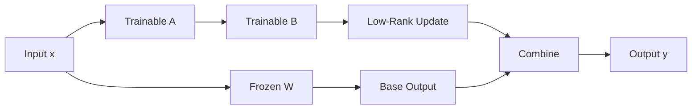

The important point is:

```text
Base Path
    +
LoRA Path
    ↓
Final Output
```

The base model remains frozen.

---

# 7. Why Is It Called Low-Rank?

The matrices `A` and `B` use a much smaller intermediate dimension:

```text
r
```

Instead of directly learning a huge matrix:

```text
d × k
```

LoRA learns:

```text
d × r
+
r × k
```

When:

```text
r << d,k
```

the number of trainable parameters is dramatically smaller.

---

# 8. LoRA Parameter Count

Suppose:

```text
W = d × k
```

Full fine-tuning requires:

```text
d × k
```

trainable parameters.

LoRA requires:

```text
d × r + r × k
```

trainable parameters.

Therefore:

```text
LoRA Parameters
=
r(d + k)
```

instead of:

```text
Full Parameters
=
d × k
```

This is the primary source of LoRA's parameter efficiency.

---

# 9. Example Parameter Reduction

Suppose:

```text
d = 4096
k = 4096
r = 16
```

Full matrix:

```text
4096 × 4096
=
16,777,216 parameters
```

LoRA:

```text
4096 × 16
+
16 × 4096
```

which gives:

```text
131,072 parameters
```

So instead of training more than:

```text
16 million
```

parameters for that matrix, LoRA trains roughly:

```text
131 thousand
```

parameters.

This illustrates why low-rank adaptation can be extremely efficient.

---

# 10. LoRA Rank

The most important LoRA hyperparameter is:

```text
r
```

The rank controls the capacity of the low-rank update.

Common experimental values may include:

```text
r = 4
r = 8
r = 16
r = 32
r = 64
```

Higher rank generally means:

```text
Higher Adaptation Capacity
        +
More Trainable Parameters
        +
More Memory
```

Lower rank means:

```text
Lower Adaptation Capacity
        +
Fewer Parameters
        +
Lower Memory
```

The optimal value depends on the task.

---

# 11. LoRA Rank Trade-Off

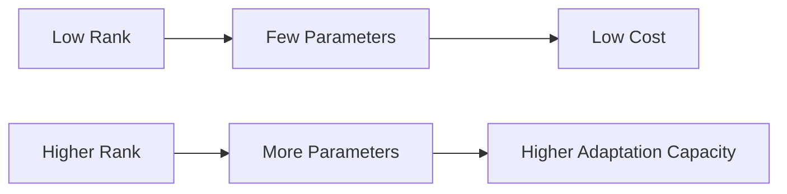

The goal is not to maximize rank.

The goal is:

```text
Required Quality
       +
Minimum Practical Cost
```

---

# 12. LoRA Alpha

LoRA commonly uses:

```text
lora_alpha
```

The scaling factor controls how strongly the LoRA update contributes relative to the frozen base weights.

Conceptually:

```text
Output
=
Base Output
+
Scaling × LoRA Output
```

A commonly used conceptual formulation is:

```text
Scaling = α / r
```

where:

```text
α = lora_alpha
r = rank
```

---

# 13. LoRA Dropout

LoRA configurations may include:

```text
lora_dropout
```

Example:

```python
lora_dropout=0.05
```

Dropout can provide regularization during adapter training.

Conceptually:

```text
Input
  ↓
LoRA A
  ↓
Dropout
  ↓
LoRA B
  ↓
Adapter Update
```

The appropriate value depends on:

- Dataset size
- Dataset diversity
- Task complexity
- Overfitting behavior

---

# 14. LoRA Target Modules

LoRA is normally applied to selected model modules.

For Transformer attention, common projection names include:

```text
q_proj
k_proj
v_proj
o_proj
```

Some architectures and configurations may also target feed-forward layers such as:

```text
up_proj
down_proj
gate_proj
```

The correct modules depend on the model architecture.

---

# 15. Attention Projection Architecture

A simplified Transformer attention block:

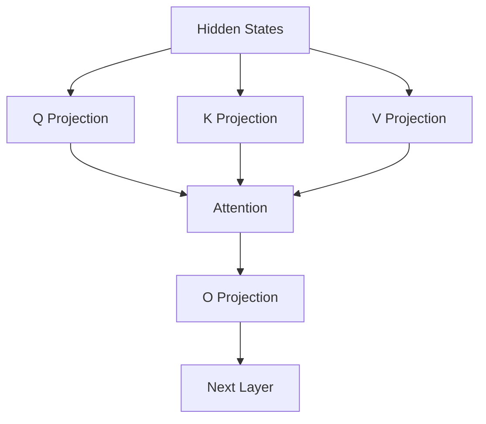

LoRA can be inserted into selected projections:

```text
Q Projection → LoRA
K Projection → LoRA
V Projection → LoRA
O Projection → LoRA
```

---

# 16. Choosing LoRA Target Modules

Do not blindly assume every Transformer uses the same names.

Inspect the architecture:

```python
for name, module in model.named_modules():
    print(name)
```

Look for modules such as:

```text
q_proj
k_proj
v_proj
o_proj
up_proj
down_proj
gate_proj
```

Then select the modules appropriate for the architecture.

---

# 17. Q, K, V and O Projections

In self-attention:

```text
Q = XWq

K = XWk

V = XWv
```

Attention is conceptually:

```text
Attention(Q,K,V)
```

followed by an output projection.

LoRA can adapt these projection matrices without modifying the original weights.

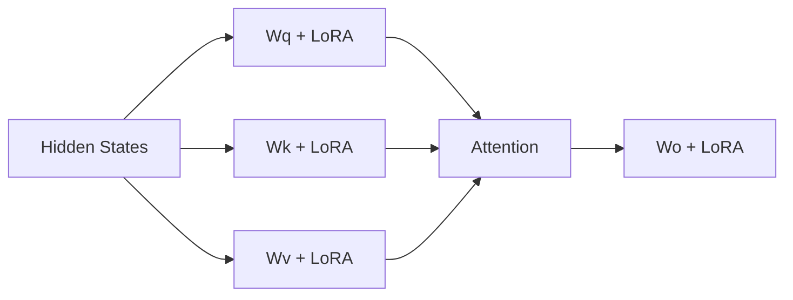

---

# 18. LoRA Initialization

A common LoRA setup initializes the adapter such that its initial contribution is small or effectively zero.

Conceptually:

```text
Base Model
      +
Initially Small LoRA Update
      ↓
Original Model Behavior
```

Training gradually learns:

```text
Useful ΔW
```

This allows the adapter to specialize the model without starting from a radically different parameter configuration.

---

# 19. LoRA Training Flow

A complete LoRA training workflow:

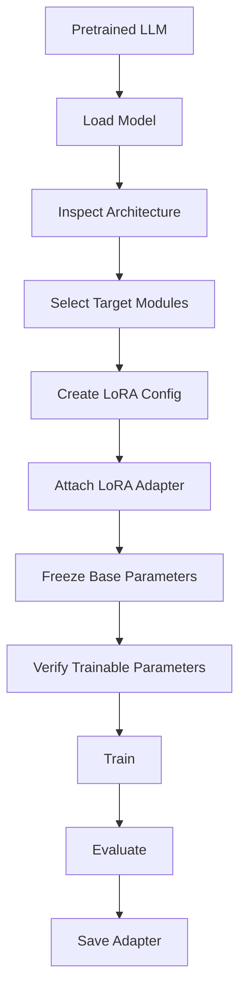

---

# 20. Hugging Face PEFT

The Hugging Face PEFT library provides a standard way to configure LoRA.

Example:

```python
from peft import LoraConfig

peft_config = LoraConfig(
    r=16,
    lora_alpha=32,
    lora_dropout=0.05,
    bias="none",
    task_type="CAUSAL_LM",
)
```

The exact values are examples and should be tuned for the task.

---

# 21. Applying LoRA

A pretrained model can be wrapped with the LoRA configuration.

```python
from peft import get_peft_model

model = get_peft_model(
    model,
    peft_config
)
```

The resulting architecture contains:

```text
Frozen Base Model
        +
Trainable LoRA Parameters
```

---

# 22. Verify Trainable Parameters

Always inspect the number of trainable parameters.

```python
model.print_trainable_parameters()
```

Conceptual output:

```text
trainable params: 15M
all params: 7B
trainable%: 0.21%
```

This is an important sanity check.

If the trainable percentage is unexpectedly large, investigate the configuration before starting a long training run.

---

# 23. LoRA + SFT

LoRA is commonly used together with Supervised Fine-Tuning.

```text
Instruction Dataset
        +
Pretrained LLM
        +
LoRA
        ↓
SFT
        ↓
LoRA Adapter
```

Architecture:

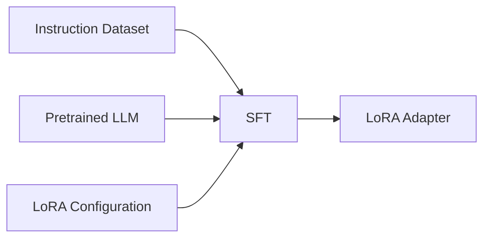

This combination is one of the most practical approaches for LLM customization.

---

# 24. LoRA with Hugging Face TRL

A simplified example:

```python
from peft import LoraConfig
from trl import SFTTrainer

peft_config = LoraConfig(
    r=16,
    lora_alpha=32,
    lora_dropout=0.05,
    bias="none",
    task_type="CAUSAL_LM",
)

trainer = SFTTrainer(
    model=model,
    train_dataset=train_dataset,
    eval_dataset=eval_dataset,
    peft_config=peft_config,
    args=training_args,
)

trainer.train()
```

The exact API depends on the installed TRL and PEFT versions.

---

# 25. LoRA and Learning Rate

LoRA training often uses a different learning-rate regime from full fine-tuning because only a small set of parameters is trainable.

However, there is no universal LoRA learning rate.

Tune based on:

```text
Model Size
Dataset Size
Task
LoRA Rank
Target Modules
Training Objective
```

Evaluate:

```text
Training Loss
Validation Loss
Task Metrics
Behavioral Quality
```

---

# 26. LoRA and Batch Size

Effective batch size can be increased using gradient accumulation.

Conceptually:

```text
Effective Batch Size
=
Per-Device Batch Size
×
Gradient Accumulation Steps
×
Number of Devices
```

Example:

```text
Per-device batch size = 2
Gradient accumulation = 8
Devices = 1

Effective batch size = 16
```

This allows larger effective batches without requiring all samples to fit into GPU memory simultaneously.

---

# 27. LoRA and Sequence Length

LoRA reduces trainable parameter memory but does not eliminate activation memory.

Therefore:

```text
Sequence Length ↑
        ↓
Activation Memory ↑
        ↓
Training Cost ↑
```

Before training, analyze:

```text
Average Tokens
Median Tokens
P95 Tokens
P99 Tokens
Maximum Tokens
```

Do not automatically train every example at the model's maximum context length.

---

# 28. LoRA and Gradient Checkpointing

Gradient checkpointing trades additional computation for lower activation memory.

Conceptually:

```text
Without Checkpointing

Forward
 ↓
Store Many Activations
 ↓
Backward
```

```text
With Checkpointing

Forward
 ↓
Store Selected Activations
 ↓
Recompute Some Activations
 ↓
Backward
```

This can make larger models or longer sequences feasible.

---

# 29. LoRA and Mixed Precision

Mixed precision can reduce memory and improve GPU throughput.

Common options include:

```text
FP16
BF16
```

depending on the hardware and framework.

Conceptually:

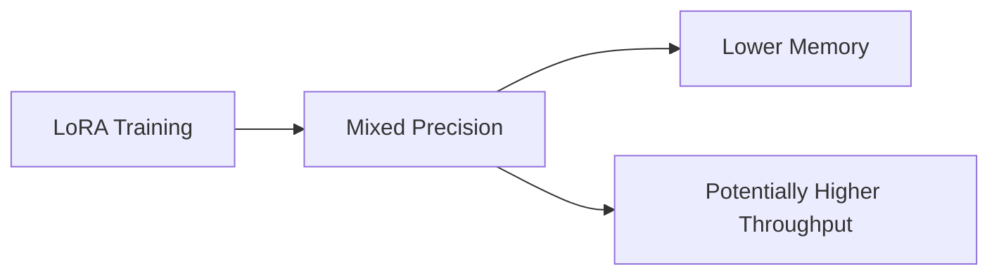

BF16 is often attractive on compatible modern accelerators because of its numerical range.

---

# 30. LoRA Memory Model

A simplified training-memory model is:

```text
LoRA Training Memory
=
Base Model
+
LoRA Parameters
+
LoRA Gradients
+
LoRA Optimizer State
+
Activations
```

Compared with full fine-tuning:

```text
Full FT
=
Base Model
+
Gradients for Many Parameters
+
Optimizer States for Many Parameters
+
Activations
```

Therefore LoRA significantly reduces the trainable-state component of memory.

---

# 31. LoRA Checkpoint Size

A LoRA checkpoint contains primarily the adapter parameters and configuration.

Conceptually:

```text
Base Model
=============
Large

LoRA Adapter
=============
Small
```

This makes it practical to store many specialized adapters.

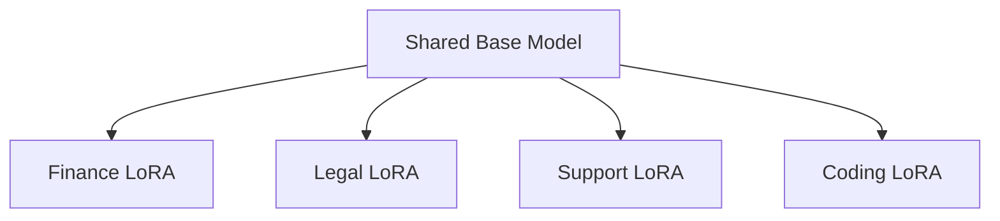

---

# 32. Multiple LoRA Adapters

A single base model can support multiple adapters.

Example:

```text
Base LLM
   │
   ├── Finance Adapter
   ├── Healthcare Adapter
   ├── Support Adapter
   ├── Coding Adapter
   └── Legal Adapter
```

This creates a reusable model-customization architecture.

The base model can be shared while adapters represent different capabilities.

---

# 33. Adapter Routing

An enterprise application can route requests to different adapters.

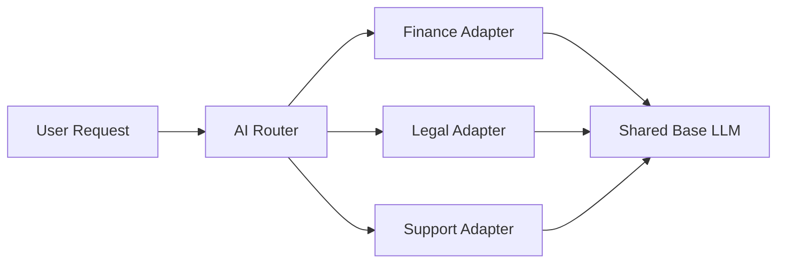

Routing can be based on:

- Tenant
- Domain
- Task
- User role
- API endpoint
- Capability

---

# 34. Adapter Switching

Conceptually:

```text
Request
   ↓
Identify Task
   ↓
Select Adapter
   ↓
Load / Activate Adapter
   ↓
Base LLM + Adapter
   ↓
Response
```

This is useful when many specialized behaviors share a common foundation model.

---

# 35. LoRA Adapter Metadata

Production adapters should include metadata such as:

```yaml
adapter_name: finance-assistant
base_model: <base-model-id>
base_model_revision: <revision>
method: lora
rank: 16
alpha: 32
dropout: 0.05
target_modules:
  - q_proj
  - v_proj
dataset_version: finance-sft-v4
training_run: 184
```

The exact schema can be adapted to the organization's model registry.

---

# 36. LoRA and Model Version Compatibility

An adapter is not an independent model.

It depends on a compatible base model.

```text
Base Model v1
      +
Adapter trained for v1
      ↓
Compatible
```

But:

```text
Base Model v2
      +
Adapter trained for v1
      ↓
Compatibility Must Be Verified
```

Never treat an adapter as universally portable.

Track the base-model identity and revision.

---

# 37. Merging LoRA Weights

LoRA adapters can sometimes be merged into the base model.

Conceptually:

```text
W' = W + ΔW
```

After merging:

```text
Base Model
      +
LoRA
      ↓
Merged Model
```

Advantages:

- Simpler deployment
- Potentially simpler inference
- No separate adapter management at inference

Trade-offs:

- Larger artifact
- Less adapter flexibility
- More difficult adapter switching

---

# 38. Separate Adapter vs Merged Model

| Separate Adapter | Merged Model |
|---|---|
| Small artifact | Full model artifact |
| Easy adapter switching | Simpler serving |
| Shared base model | Self-contained model |
| Multiple specializations | One specialized model |
| Adapter lifecycle required | Full model lifecycle |

Choose based on deployment architecture.

---

# 39. What Is QLoRA?

**QLoRA** combines:

```text
Quantization
+
LoRA
```

The key idea is:

```text
Quantize the Base Model
        +
Keep LoRA Parameters Trainable
        ↓
Memory-Efficient Fine-Tuning
```

A simplified architecture is:

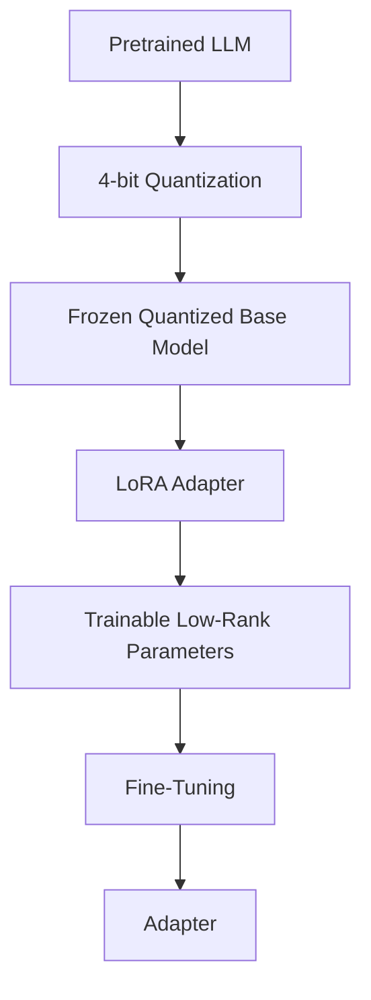

QLoRA is especially useful when GPU memory is the primary constraint.

---

# 40. Why QLoRA?

LoRA already reduces the number of trainable parameters.

However, the base model may still require substantial memory.

For example:

```text
Large Base Model
      ↓
Still Large in Memory
```

QLoRA addresses this by reducing the memory footprint of the base model through quantization.

Therefore:

```text
LoRA
→ Reduce Trainable State

QLoRA
→ Reduce Base Weight Memory + Trainable State
```

---

# 41. LoRA vs QLoRA

| LoRA | QLoRA |
|---|---|
| Base model typically kept at higher precision | Base model is quantized |
| Adapter is trainable | Adapter is trainable |
| Lower training memory than full FT | Even lower base-model memory |
| Simpler precision setup | More quantization considerations |
| Good for sufficient GPU memory | Useful for constrained GPU memory |

---

# 42. Quantization Fundamentals

Quantization reduces the numerical precision used to represent model weights.

Example:

```text
FP32
 ↓
FP16 / BF16
 ↓
INT8
 ↓
4-bit
```

Lower precision can significantly reduce memory.

Conceptually:

```text
Higher Precision
      ↓
More Memory

Lower Precision
      ↓
Less Memory
```

However, aggressive quantization may introduce quality or numerical trade-offs.

---

# 43. 4-Bit Quantization

QLoRA commonly uses 4-bit quantization for the base model.

A simplified memory comparison:

```text
FP32
≈ 32 bits / parameter

FP16
≈ 16 bits / parameter

INT8
≈ 8 bits / parameter

4-bit
≈ 4 bits / parameter
```

The actual memory footprint also includes:

- Quantization metadata
- Scales
- Runtime buffers
- Other model states

Therefore, these values should be treated as theoretical approximations rather than exact GPU memory usage.

---

# 44. QLoRA and NF4

One of the important ideas associated with QLoRA is **NF4 — NormalFloat4**.

NF4 is designed for quantizing normally distributed neural-network weights.

Conceptually:

```text
FP Weight Distribution
        ↓
NF4 Quantization
        ↓
4-bit Representation
```

The goal is to preserve useful information while reducing memory.

---

# 45. NormalFloat4 Concept

Instead of treating 4-bit values as ordinary integer values, NF4 uses a quantization scheme designed around the distribution of pretrained neural-network weights.

Conceptually:

```text
Continuous Weight Values
          ↓
Distribution-Aware Quantization
          ↓
4-bit Codes
```

This is one of the reasons QLoRA can achieve useful fine-tuning performance despite the quantized base model.

---

# 46. Double Quantization

QLoRA also introduced **double quantization**.

The basic idea is:

```text
Quantize Model Weights
        ↓
Quantize Quantization Constants
        ↓
Further Memory Reduction
```

Conceptually:

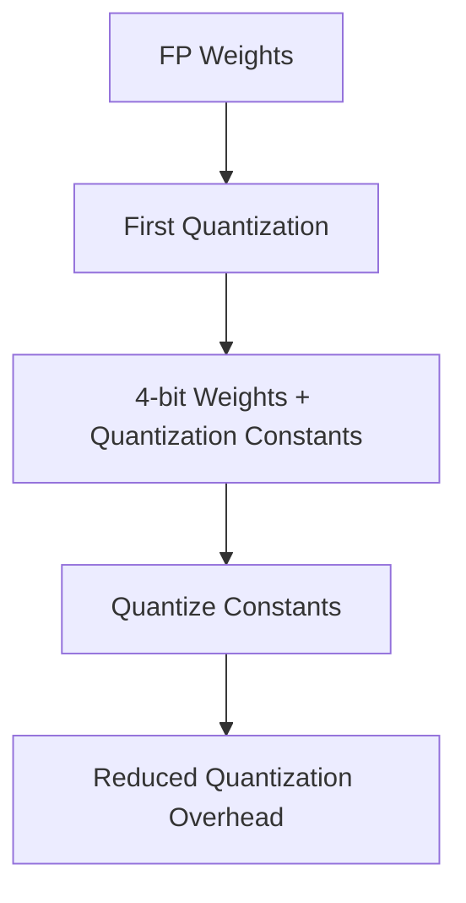

This reduces memory used by quantization metadata.

---

# 47. Paged Optimizers

QLoRA also uses memory-management techniques such as paged optimizers.

The objective is to reduce memory spikes during training.

Conceptually:

```text
GPU Memory
     ↑
Training State
     ↓
Paging / Memory Management
     ↓
Reduced Memory Spikes
```

This becomes useful when training approaches the limits of available GPU memory.

---

# 48. QLoRA Architecture

A conceptual QLoRA architecture:

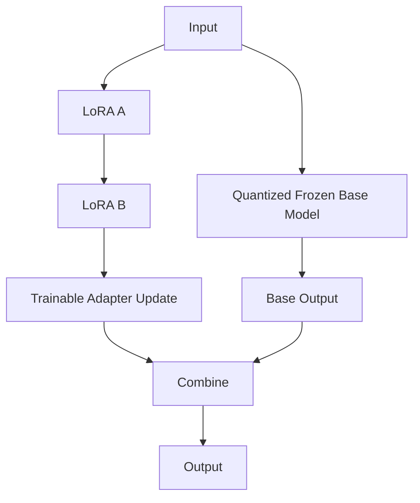

The base model is quantized and frozen.

The LoRA matrices remain trainable.

---

# 49. QLoRA Training Concept

The important distinction is:

```text
Base Model
→ Quantized
→ Frozen

LoRA Adapter
→ Higher Precision
→ Trainable
```

Therefore:

```text
Quantized Base
      +
Trainable LoRA
      ↓
Efficient Fine-Tuning
```

The adapter generally remains in a suitable higher-precision representation for training.

---

# 50. BitsAndBytes Integration

Hugging Face ecosystems commonly use `bitsandbytes` for supported quantized model loading.

A conceptual configuration can look like:

```python
from transformers import BitsAndBytesConfig

bnb_config = BitsAndBytesConfig(
    load_in_4bit=True,
    bnb_4bit_quant_type="nf4",
    bnb_4bit_use_double_quant=True,
    bnb_4bit_compute_dtype="bfloat16",
)
```

The exact supported options depend on the model, hardware, and installed library versions.

---

# 51. Loading a Quantized Model

Conceptually:

```python
model = AutoModelForCausalLM.from_pretrained(
    model_id,
    quantization_config=bnb_config,
    device_map="auto",
)
```

Then attach LoRA:

```python
model = get_peft_model(
    model,
    peft_config
)
```

The overall pipeline becomes:

```text
Quantized Base Model
        ↓
Attach LoRA
        ↓
Train Adapter
```

---

# 52. QLoRA Configuration

A conceptual configuration might contain:

```python
bnb_config = BitsAndBytesConfig(
    load_in_4bit=True,
    bnb_4bit_quant_type="nf4",
    bnb_4bit_use_double_quant=True,
    bnb_4bit_compute_dtype=torch.bfloat16,
)

peft_config = LoraConfig(
    r=16,
    lora_alpha=32,
    lora_dropout=0.05,
    bias="none",
    task_type="CAUSAL_LM",
)
```

The values are examples rather than universal defaults.

---

# 53. QLoRA + SFT

The complete training architecture:

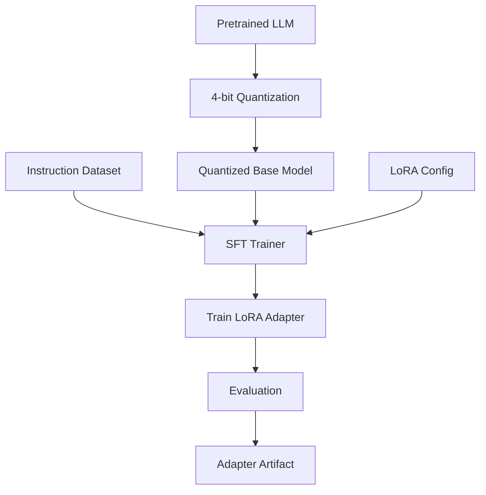

This is a common practical architecture for resource-constrained LLM fine-tuning.

---

# 54. End-to-End QLoRA Workflow

```text
1. Select Base Model
        ↓
2. Analyze GPU Memory
        ↓
3. Load Quantized Model
        ↓
4. Inspect Architecture
        ↓
5. Configure LoRA
        ↓
6. Attach Adapter
        ↓
7. Prepare SFT Dataset
        ↓
8. Tokenize / Apply Chat Template
        ↓
9. Run Smoke Test
        ↓
10. Train
        ↓
11. Evaluate
        ↓
12. Save Adapter
        ↓
13. Deploy
```

---

# 55. QLoRA Memory Architecture

A simplified comparison:

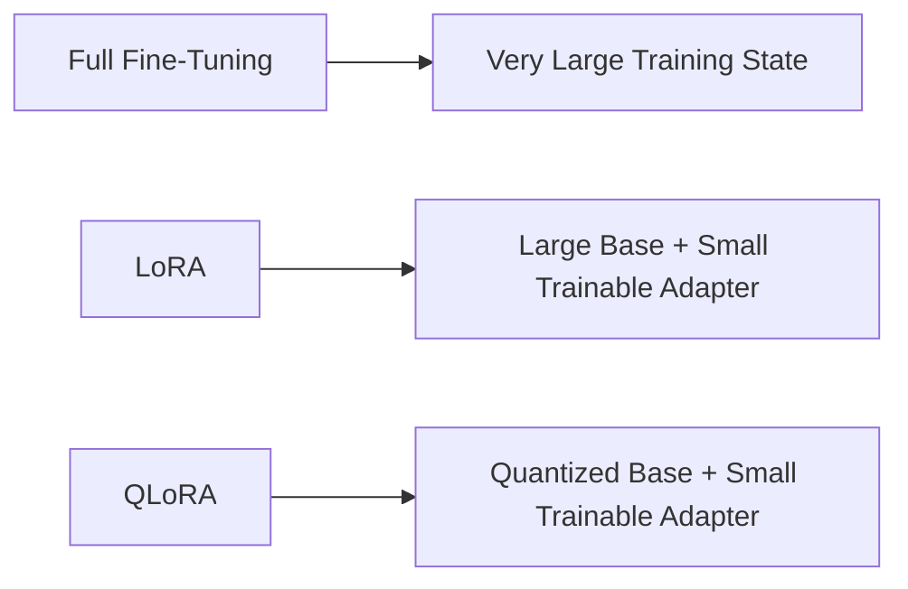

Therefore:

```text
Full FT
→ Highest Training Memory

LoRA
→ Lower Training Memory

QLoRA
→ Lower Base-Weight Memory + PEFT
```

Actual memory usage depends on model architecture, sequence length, precision, optimizer, batch size, and hardware.

---

# 56. QLoRA Does Not Mean Everything Is 4-Bit

An important misconception is:

```text
QLoRA = Entire Training Pipeline in 4-bit
```

This is not the correct mental model.

Instead:

```text
Base Model Weights
→ Quantized

LoRA Parameters
→ Trainable

Compute
→ Appropriate Higher Precision
```

The exact precision path depends on the implementation and hardware.

---

# 57. Compute Dtype

Quantization dtype and compute dtype are different concepts.

For example:

```text
Stored Base Weights
→ 4-bit

Computation
→ BF16
```

This allows the model to save memory while using a more suitable numerical precision for computation.

Conceptually:

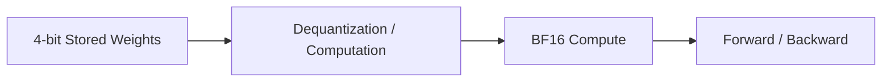

---

# 58. QLoRA Hardware Considerations

Before training, consider:

```text
GPU VRAM
CUDA Compatibility
Compute Capability
PyTorch Version
Transformers Version
PEFT Version
bitsandbytes Version
TRL Version
```

Also evaluate:

```text
Model Size
Sequence Length
Batch Size
Gradient Accumulation
Precision
```

A configuration that works on one GPU may not work on another.

---

# 59. QLoRA Memory Estimation

A simplified model-weight memory estimate is:

```text
Memory ≈ Parameters × Bits / 8
```

For a 7B parameter model at theoretical 4-bit storage:

```text
7,000,000,000 × 4 / 8
≈ 3.5 GB
```

This is only a theoretical lower-level weight-storage estimate.

Actual GPU memory will be higher because of:

- Quantization metadata
- Runtime buffers
- Activations
- KV cache where applicable
- Framework overhead
- LoRA parameters
- Temporary tensors

Never use the simple equation as an exact VRAM requirement.

---

# 60. QLoRA and Sequence Length

Even with 4-bit weights:

```text
Long Context
     ↓
Large Activations
     ↓
Large Memory Requirement
```

Therefore, if a QLoRA job runs out of memory, do not assume the quantization configuration is the only problem.

Investigate:

```text
Batch Size
Sequence Length
Gradient Checkpointing
Gradient Accumulation
Compute Dtype
Activation Memory
```

---

# 61. QLoRA and Gradient Checkpointing

A practical memory-efficient configuration often combines:

```text
4-bit Quantization
+
LoRA
+
Gradient Checkpointing
+
Gradient Accumulation
+
Mixed Precision
```

Conceptually:

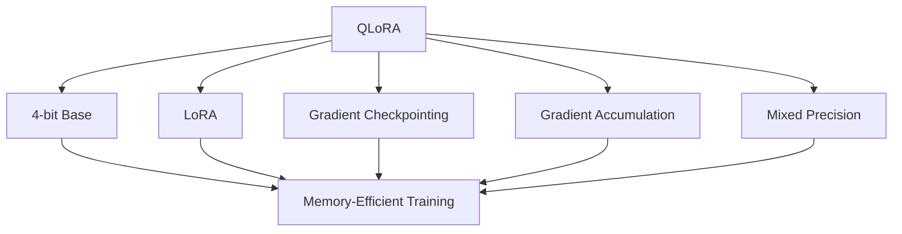

---

# 62. LoRA vs QLoRA Quality

QLoRA is designed to preserve useful model quality while dramatically reducing memory requirements.

However, quality should always be measured empirically.

Compare:

```text
Base Model
LoRA
QLoRA
```

using:

```text
Task Metrics
Human Evaluation
Instruction Following
Safety
General Capability
```

Do not assume:

```text
More Quantization
=
Same Quality
```

for every model and task.

---

# 63. LoRA vs QLoRA Decision

Use standard LoRA when:

```text
GPU Memory Is Sufficient
+
You Want Simpler Training
```

Consider QLoRA when:

```text
Model Is Large
+
GPU Memory Is Constrained
+
4-bit Quantization Is Supported
```

A practical decision:

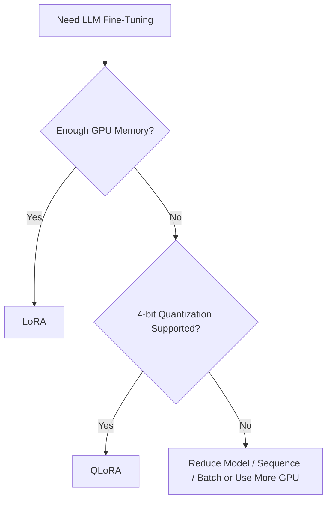

---

# 64. LoRA Rank Experimentation

Do not choose rank only from community examples.

Run controlled experiments.

Example:

```text
Experiment A
r = 8

Experiment B
r = 16

Experiment C
r = 32
```

Compare:

```text
Validation Score
Training Time
Adapter Size
GPU Memory
Inference Quality
```

Then select the smallest configuration that satisfies the quality target.

---

# 65. LoRA Hyperparameter Matrix

A useful experiment matrix:

| Experiment | Rank | Alpha | Dropout | Target Modules |
|---|---:|---:|---:|---|
| A | 8 | 16 | 0.05 | Q/V |
| B | 16 | 32 | 0.05 | Q/V |
| C | 16 | 32 | 0.05 | Q/K/V/O |
| D | 32 | 64 | 0.05 | Q/K/V/O |

These are example configurations for experimentation, not universal recommendations.

---

# 66. LoRA Target Module Strategy

A practical progression can be:

```text
Start Small
   ↓
Q/V Projections
   ↓
Evaluate
   ↓
Q/K/V/O
   ↓
Evaluate
   ↓
Add MLP Projections if Necessary
```

The goal is to increase adaptation capacity only when evaluation demonstrates a need.

---

# 67. QLoRA Dataset Considerations

Quantization does not compensate for poor data.

A strong QLoRA pipeline still requires:

```text
High-Quality Data
+
Correct Chat Template
+
Correct Loss Masking
+
Good Train/Validation Split
+
Deduplication
+
Evaluation
```

Remember:

> **Efficient training cannot compensate for poor training data.**

---

# 68. QLoRA and Data Quality

The model still learns the behavior represented by the dataset.

```text
Poor Dataset
      +
QLoRA
      ↓
Efficiently Learned Poor Behavior
```

Therefore:

```text
Data Quality
>
Training Optimization
```

when the dataset itself is the primary bottleneck.

---

# 69. LoRA and Overfitting

Because LoRA has fewer trainable parameters, it can sometimes reduce overfitting risk compared with full fine-tuning, but it does not eliminate overfitting.

Potential causes:

- Small dataset
- Repetitive examples
- Too many epochs
- High learning rate
- Excessive rank
- Poor validation split

Monitor:

```text
Training Loss
Validation Loss
Task Metrics
Generated Outputs
```

---

# 70. QLoRA and Overfitting

Quantization does not prevent overfitting.

QLoRA can still overfit when:

```text
Dataset Small
+
Training Too Long
+
High Learning Rate
```

Use:

- Validation data
- Early stopping where appropriate
- Better dataset diversity
- Appropriate rank
- Appropriate learning rate
- Human evaluation

---

# 71. LoRA and Catastrophic Forgetting

LoRA often limits how much the base model can change, but significant behavioral shifts are still possible.

Evaluate:

```text
Target Domain
+
General Capability
+
Safety
```

A domain adapter should not be evaluated only on its specialized task.

---

# 72. QLoRA and Catastrophic Forgetting

QLoRA inherits the behavioral trade-offs of LoRA-based adaptation.

Quantizing the base model does not eliminate:

```text
Overfitting
+
Behavioral Drift
+
Domain Over-specialization
```

Therefore use the same evaluation discipline.

---

# 73. LoRA and RAG

LoRA and RAG are complementary.

```text
LoRA
→ Adapt behavior

RAG
→ Retrieve knowledge
```

Example:

```text
Finance Assistant

LoRA
→ Finance response style and task behavior

RAG
→ Current financial policies and documents
```

---

# 74. QLoRA + RAG Architecture

A production architecture could be:

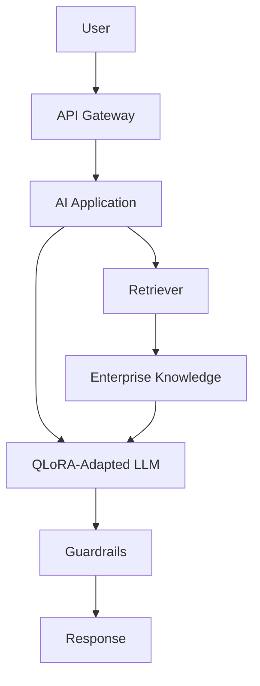

This separates:

```text
Behavior Adaptation
```

from:

```text
External Knowledge
```

---

# 75. LoRA + Tool Calling

LoRA can also be used to teach models task-specific tool-use patterns.

Example:

```text
User Request
      ↓
Fine-Tuned Model
      ↓
Tool Selection
      ↓
API Call
      ↓
Tool Result
      ↓
Final Response
```

The training data can contain examples of:

```text
Tool Selection
+
Tool Arguments
+
Tool Results
+
Final Responses
```

The exact implementation depends on the model and tool-calling format.

---

# 76. Enterprise LoRA Architecture

A scalable enterprise architecture may look like:

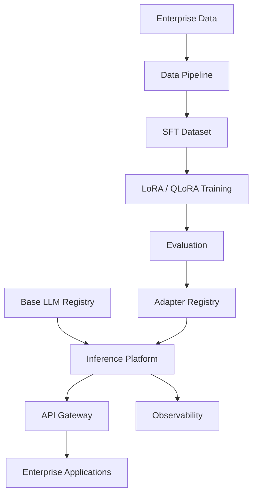

This separates:

```text
Data
Training
Evaluation
Model Registry
Adapter Registry
Serving
Observability
```

---

# 77. Multi-Adapter Enterprise Architecture

A shared-base architecture:

```mermaid
flowchart TD
    A["Shared Base LLM"] --> B["Finance LoRA"]
    A --> C["Support LoRA"]
    A --> D["Coding LoRA"]
    A --> E["Legal LoRA"]
    A --> F["Operations LoRA"]

    B --> G["Inference Layer"]
    C --> G
    D --> G
    E --> G
    F --> G

    G --> H["API Gateway"]
```

The router determines which adapter should be active.

---

# 78. Adapter Registry

A production adapter registry should track:

```text
Adapter ID
Adapter Version
Base Model
Base Model Revision
Training Dataset
Dataset Version
LoRA Configuration
Training Run
Evaluation Results
Security Classification
Deployment Status
```

Example:

```yaml
adapter_id: support-assistant
version: 3.2
base_model: <base-model>
method: qlora
rank: 16
alpha: 32
dataset: support-sft-v8
training_run: 241
status: production
```

---

# 79. Adapter Promotion Pipeline

A production adapter should move through environments.

```mermaid
flowchart LR
    A["Training"] --> B["Evaluation"]
    B --> C["Staging"]
    C --> D["Canary"]
    D --> E["Production"]
```

At each stage:

```text
Quality Gate
Safety Gate
Compatibility Gate
Performance Gate
```

---

# 80. Adapter Rollback

Because adapters are versioned artifacts, rollback can be straightforward.

```text
Production
Adapter v4
    ↓
Quality Regression
    ↓
Rollback
    ↓
Adapter v3
```

Keep previous versions available until the new version has passed sufficient production validation.

---

# 81. Production Monitoring

Monitor the adapter independently from the base model.

Important metrics:

```text
Task Success Rate
Instruction Following
Safety
Latency
Throughput
GPU Memory
Error Rate
Cost
User Feedback
```

Compare adapter versions:

```text
Adapter v3
vs
Adapter v4
```

to identify regressions.

---

# 82. Production Cost Optimization

LoRA and QLoRA can reduce training cost, but the entire lifecycle should be optimized.

```text
Data Processing
+
Training
+
Storage
+
Serving
+
Monitoring
```

Potential optimizations:

- Reuse base models
- Reuse adapters
- Use QLoRA where appropriate
- Optimize sequence lengths
- Remove duplicates
- Use gradient checkpointing
- Use efficient batching
- Use mixed precision
- Train only for necessary epochs
- Avoid unnecessary full-model copies

---

# 83. Adapter Storage Strategy

A production storage structure could be:

```text
models/
└── base/
    └── model-v3/

adapters/
├── finance/
│   ├── v1/
│   └── v2/
├── support/
│   ├── v1/
│   └── v3/
└── coding/
    └── v4/
```

This separates:

```text
Base Model Artifacts
```

from:

```text
Adapter Artifacts
```

---

# 84. LoRA CI/CD

LoRA training can be integrated into an ML CI/CD pipeline.

```mermaid
flowchart TD
    A["Dataset Change"] --> B["Validation"]
    B --> C["LoRA Training"]
    C --> D["Automated Evaluation"]
    D --> E{"Quality Gate"}
    E -->|Pass| F["Register Adapter"]
    E -->|Fail| G["Reject"]
    F --> H["Deploy to Staging"]
    H --> I["Canary"]
    I --> J["Production"]
```

Quality gates can check:

```text
Task Metrics
Safety
Regression
Latency
Memory
Cost
```

---

# 85. Reproducibility

A LoRA/QLoRA training run should be reproducible.

Record:

```text
Base Model
Model Revision
Dataset Version
Tokenizer
Chat Template
LoRA Rank
LoRA Alpha
Dropout
Target Modules
Learning Rate
Batch Size
Epochs
Sequence Length
Quantization Configuration
Random Seed
Software Versions
Hardware
```

This is essential for debugging and auditing.

---

# 86. Experiment Tracking

Track experiments systematically.

Example:

```text
Run 101
r=8
score=0.81

Run 102
r=16
score=0.85

Run 103
r=32
score=0.86
```

But also record:

```text
GPU Hours
Memory
Training Time
Adapter Size
Inference Latency
```

Then the decision becomes:

```text
Quality
vs
Cost
vs
Operational Complexity
```

---

# 87. Common Mistake — Too High LoRA Rank

Using a very high rank without evidence can:

```text
Increase Parameters
Increase Memory
Increase Training Cost
Increase Overfitting Risk
```

Instead:

```text
Start Reasonably
      ↓
Evaluate
      ↓
Increase Rank if Necessary
```

---

# 88. Common Mistake — Wrong Target Modules

A configuration copied from another model may not match the current architecture.

Bad approach:

```text
Copy LoRA Config
      ↓
Assume Compatibility
```

Better:

```text
Inspect Model
      ↓
Identify Modules
      ↓
Select Targets
      ↓
Run Smoke Test
```

---

# 89. Common Mistake — Incorrect Quantization Configuration

QLoRA depends on a compatible quantization setup.

Potential issues:

- Unsupported hardware
- Unsupported dtype
- Library version incompatibility
- Incorrect quantization configuration
- Unexpected memory usage

Validate the environment before starting a long training job.

---

# 90. Common Mistake — Assuming 4-Bit Means Tiny VRAM

A 4-bit model still requires memory for:

```text
Quantized Weights
+
Quantization Metadata
+
Activations
+
Runtime Buffers
+
LoRA Parameters
+
Training State
```

Therefore:

```text
4-bit ≠ Exact VRAM Requirement
```

Always benchmark the actual workload.

---

# 91. Common Mistake — Ignoring Inference Configuration

A model may perform well during training but poorly in production because:

```text
Training Template
       ≠
Inference Template
```

Verify:

```text
Tokenizer
Chat Template
Special Tokens
Adapter
Generation Configuration
Prompt Format
```

---

# 92. Common Mistake — Training Without a Baseline

Always evaluate the base model first.

```text
Base Model
    ↓
Baseline Evaluation
    ↓
LoRA / QLoRA
    ↓
Post-Training Evaluation
```

Otherwise, you cannot determine whether the adapter actually improved the system.

---

# 93. Common Mistake — Evaluating Only the Target Task

A specialized adapter may improve:

```text
Finance Task
```

while degrading:

```text
General Reasoning
Safety
Instruction Following
```

Therefore evaluate:

```text
Target Capability
+
General Capability
+
Safety
```

---

# 94. Common LoRA Failure Modes

Common failures include:

- Rank too low
- Rank too high
- Wrong target modules
- Learning rate too high
- Learning rate too low
- Dataset too small
- Dataset too repetitive
- Incorrect loss masking
- Incorrect chat template
- Poor tokenizer configuration
- Overfitting
- Adapter/base mismatch
- Quantization incompatibility
- GPU memory exhaustion
- Poor evaluation methodology

---

# 95. QLoRA Failure Modes

Additional QLoRA-specific issues include:

- Unsupported quantization configuration
- Insufficient GPU memory
- Incorrect compute dtype
- Quantization quality degradation
- Library incompatibility
- Hardware incompatibility
- Unexpected optimizer memory
- Activation memory overflow

A useful debugging sequence:

```text
Environment
   ↓
Base Model
   ↓
Quantization
   ↓
PEFT Configuration
   ↓
Trainable Parameters
   ↓
Dataset
   ↓
Training
   ↓
Evaluation
```

---

# 96. Debugging GPU Out-of-Memory

If a LoRA/QLoRA job fails with OOM:

```text
1. Reduce Batch Size
        ↓
2. Reduce Sequence Length
        ↓
3. Enable Gradient Checkpointing
        ↓
4. Increase Gradient Accumulation
        ↓
5. Use Mixed Precision
        ↓
6. Use QLoRA / Lower Precision
        ↓
7. Reduce Model Size
```

Do not immediately change every variable.

Change one or two dimensions at a time so the impact can be measured.

---

# 97. LoRA and Model Quality

The quality of a LoRA adapter depends on:

```text
Base Model Quality
+
Dataset Quality
+
LoRA Configuration
+
Training Configuration
+
Evaluation Quality
```

A useful conceptual relationship is:

```text
Final Quality
=
Base Capability
+
Useful Adaptation
-
Training / Data / Quantization Errors
```

This is not a mathematical formula, but a useful engineering mental model.

---

# 98. LoRA and Domain Adaptation

LoRA can be useful for:

```text
Finance
Healthcare
Legal
Telecom
Customer Support
Coding
Enterprise Operations
```

For example:

```text
General LLM
      +
Finance LoRA
      ↓
Finance-Oriented Assistant
```

However, domain knowledge that changes frequently should generally remain external through mechanisms such as RAG rather than being repeatedly baked into adapters.

---

# 99. LoRA for Structured Output

LoRA can teach consistent output formats.

Example:

```json
{
  "intent": "payment_failure",
  "severity": "high",
  "recommended_action": "investigate_gateway"
}
```

Training examples should consistently represent:

```text
Schema
+
Field Names
+
Value Types
+
Formatting
```

The model learns the output pattern through supervised examples.

---

# 100. LoRA for Tool Calling

LoRA can also adapt models for tool-use patterns.

Example:

```text
User
 ↓
Model
 ↓
Tool Selection
 ↓
Function Arguments
 ↓
Tool
 ↓
Result
 ↓
Final Response
```

The training dataset should contain representative examples of the desired tool-call behavior.

---

# 101. LoRA for Coding Models

For coding assistants, LoRA can adapt a general model to:

- Organization coding standards
- Framework conventions
- Internal APIs
- Code-review style
- Documentation style
- Test-generation patterns

Example:

```text
General Code Model
        +
Company Coding Adapter
        ↓
Organization Coding Assistant
```

Be careful with proprietary source code and secrets in training data.

---

# 102. LoRA and Enterprise Data Governance

Enterprise LoRA training may involve:

```text
Customer Data
Internal Documents
Source Code
Operational Logs
Tickets
Policies
```

Before training:

```mermaid
flowchart TD
    A["Enterprise Data"] --> B["Classification"]
    B --> C["PII Detection"]
    C --> D["Sensitive Data Filtering"]
    D --> E["Access Control"]
    E --> F["Training Dataset"]
```

Do not assume that fine-tuning is automatically safe simply because the adapter is small.

---

# 103. LoRA and Data Memorization

Adapters can learn patterns from their training data.

Potential risks:

```text
Sensitive Information
+
Small Dataset
+
Repeated Examples
+
Aggressive Training
```

may increase memorization risk.

Mitigation:

- Remove secrets
- Remove PII
- Deduplicate
- Minimize sensitive data
- Evaluate memorization
- Use secure artifact storage
- Restrict adapter access

---

# 104. Production Workflow

A production-grade LoRA/QLoRA workflow should look like:

```mermaid
flowchart TD
    A["Enterprise Data"] --> B["Governance"]
    B --> C["Cleaning"]
    C --> D["Deduplication"]
    D --> E["Instruction Curation"]
    E --> F["Train / Validation / Test"]
    F --> G["Tokenizer / Chat Template"]
    G --> H["Base Model Selection"]
    H --> I["LoRA / QLoRA Configuration"]
    I --> J["Smoke Test"]
    J --> K["Training"]
    K --> L["Evaluation"]
    L --> M["Adapter Selection"]
    M --> N["Adapter Registry"]
    N --> O["Staging"]
    O --> P["Canary"]
    P --> Q["Production"]
    Q --> R["Monitoring"]
    R --> S["Feedback"]
    S --> E
```

Production controls should include:

- Dataset versioning
- Base-model versioning
- Adapter versioning
- Quantization configuration
- Experiment tracking
- Evaluation gates
- Model registry
- Adapter registry
- Security controls
- Monitoring
- Rollback

---

# 105. Production Data Lineage

A production adapter should have complete lineage.

```mermaid
flowchart LR
    A["Dataset v8"] --> F["QLoRA Run 301"]
    B["Base Model v4"] --> F
    C["Tokenizer v6"] --> F
    D["LoRA Config v9"] --> F
    E["Quantization Config v3"] --> F
    F --> G["Adapter v15"]
    G --> H["Deployment v10"]
```

This enables:

```text
Reproducibility
Auditing
Debugging
Rollback
Experiment Comparison
Governance
```

---

# 106. Production Observability

Monitor:

## Training

- Training loss
- Validation loss
- Learning rate
- Gradient norms
- Tokens per second
- GPU utilization

## Memory

- GPU memory
- Peak memory
- Activation memory
- Host memory

## Dataset

- Number of examples
- Token count
- Average sequence length
- P95 length
- Truncation rate
- Duplicate rate

## Model

- Task performance
- General performance
- Safety
- Factuality
- Instruction following

## Serving

- p50 latency
- p95 latency
- Throughput
- Error rate
- GPU utilization
- Cost per request

---

# 107. Production Evaluation Gate

Before deployment:

```mermaid
flowchart TD
    A["Trained Adapter"] --> B["Task Evaluation"]
    B --> C["Regression Evaluation"]
    C --> D["Safety Evaluation"]
    D --> E["Performance Evaluation"]
    E --> F{"All Gates Pass?"}
    F -->|Yes| G["Register"]
    F -->|No| H["Reject / Retrain"]
```

Possible gates:

```text
Task Accuracy
Instruction Following
Safety
Factuality
Latency
Memory
Cost
Regression
```

---

# 108. Adapter Registry Design

A conceptual registry entry:

```yaml
adapter:
  name: enterprise-support
  version: "4.2"

base_model:
  id: <base-model>
  revision: <revision>

method:
  name: qlora
  rank: 16
  alpha: 32
  dropout: 0.05

quantization:
  bits: 4
  type: nf4
  double_quantization: true
  compute_dtype: bfloat16

dataset:
  name: support-sft
  version: "8"

evaluation:
  task_score: 0.91
  safety_score: 0.98

status: production
```

This is an example metadata structure, not a mandatory schema.

---

# 109. LoRA vs QLoRA vs Full Fine-Tuning

| Capability | Full Fine-Tuning | LoRA | QLoRA |
|---|---|---|---|
| Base weights trainable | Yes | No | No |
| Base model quantized | Optional | Usually no | Yes |
| Trainable parameters | Very high | Low | Low |
| Training memory | Highest | Lower | Lowest among these approaches in many constrained setups |
| Adapter artifact | No | Yes | Yes |
| Multiple adapters | More expensive | Easy | Easy |
| GPU requirements | High | Moderate | Lower |
| Configuration complexity | Moderate | Moderate | Higher |
| Best use case | Strong full adaptation | Efficient adaptation | Memory-constrained adaptation |

---

# 110. Practical Decision Framework

Use **Full Fine-Tuning** when:

```text
You need broad model adaptation
+
Have substantial compute
+
Have enough high-quality data
```

Use **LoRA** when:

```text
You need efficient task adaptation
+
Have sufficient memory for the base model
```

Use **QLoRA** when:

```text
You need LoRA
+
Base model memory is the primary constraint
```

Use **RAG** when:

```text
The problem is dynamic external knowledge
```

Use **Prompt Engineering** when:

```text
The behavior can be achieved without training
```

---

# 111. Interview Questions

## Beginner

- What is LoRA?
- What is QLoRA?
- Why is LoRA parameter-efficient?
- What does low-rank mean?
- What is a LoRA adapter?
- What is LoRA rank?
- What is `lora_alpha`?
- What is `lora_dropout`?
- Why do we freeze the base model?
- LoRA vs full fine-tuning?
- LoRA vs QLoRA?

## Intermediate

- Explain the LoRA equation.
- How does LoRA reduce trainable parameters?
- How do you calculate LoRA parameter count?
- What are LoRA target modules?
- Why are Q/K/V/O projections commonly adapted?
- How do you configure LoRA using PEFT?
- How do you verify trainable parameters?
- How does LoRA work with SFT?
- What is QLoRA?
- What is 4-bit quantization?
- What is NF4?
- What is double quantization?
- What are paged optimizers?
- Why does QLoRA reduce GPU memory?
- Why does sequence length still matter in QLoRA?
- How do you choose LoRA rank?

## Advanced

- Derive the LoRA parameter reduction mathematically.
- How would you select target modules for an unknown architecture?
- How would you design a multi-adapter enterprise platform?
- How would you manage adapter/base-model compatibility?
- How would you compare LoRA and QLoRA experimentally?
- How would you debug QLoRA GPU OOM?
- How would you design adapter versioning?
- How would you deploy multiple adapters efficiently?
- How would you combine QLoRA with RAG?
- How would you evaluate whether quantization degraded model quality?
- How would you design a production LoRA CI/CD pipeline?
- How would you monitor adapter-specific regressions?
- How would you secure tenant-specific adapters?
- How would you optimize LoRA rank and target modules?
- How would you decide between LoRA, QLoRA, and full fine-tuning?

---

# 112. Scenario-Based Interview Questions

## Scenario 1 — 7B Model Does Not Fit During Training

You need to fine-tune a 7B model on a limited GPU.

Start with:

```text
LoRA
```

If base-model memory remains too high:

```text
QLoRA
```

Then consider:

```text
Gradient Checkpointing
+
Gradient Accumulation
+
Sequence Length Optimization
+
Mixed Precision
```

---

## Scenario 2 — QLoRA Still Runs Out of Memory

Investigate:

```text
Batch Size
Sequence Length
Activation Memory
Gradient Checkpointing
Compute Dtype
GPU Memory
```

Then reduce memory systematically.

---

## Scenario 3 — LoRA Training Quality Is Poor

Investigate:

```text
Dataset
↓
Chat Template
↓
Loss Masking
↓
Target Modules
↓
Rank
↓
Learning Rate
↓
Epochs
```

Do not assume the problem is always rank.

---

## Scenario 4 — Adapter Works on One Model Version but Not Another

Possible issue:

```text
Base Model Mismatch
```

Check:

```text
Base Model ID
Revision
Architecture
Tokenizer
Target Modules
PEFT Configuration
```

---

## Scenario 5 — Enterprise Needs 15 Specialized Assistants

Instead of maintaining:

```text
15 Complete Models
```

consider:

```text
1 Shared Base Model
+
15 LoRA Adapters
```

Then introduce:

```text
Adapter Registry
+
Request Router
+
Inference Platform
```

---

# 113. 🚀 Quick Revision Sheet

## LoRA

```text
Frozen Base Model
        +
Low-Rank Matrices
        ↓
Trainable Adapter
```

Mathematical idea:

```text
W' = W + ΔW

ΔW = BA
```

## Important Parameters

```text
r
lora_alpha
lora_dropout
target_modules
```

## QLoRA

```text
Quantized Base Model
        +
LoRA Adapter
        ↓
Memory-Efficient Fine-Tuning
```

## QLoRA Concepts

```text
4-bit Quantization
NF4
Double Quantization
Paged Optimizers
```

## Memory Optimization

```text
QLoRA
+
Gradient Checkpointing
+
Gradient Accumulation
+
Mixed Precision
+
Sequence Optimization
```

## Production

```text
Dataset
 ↓
LoRA / QLoRA
 ↓
Evaluation
 ↓
Adapter Registry
 ↓
Staging
 ↓
Canary
 ↓
Production
 ↓
Monitoring
```

---

# 114. Remember

> **LoRA adapts a pretrained model by learning a low-rank update while keeping the original model weights frozen.**

The core equation is:

```text
W' = W + BA
```

Remember:

```text
W
→ Frozen Base Weight

A
→ Trainable Low-Rank Matrix

B
→ Trainable Low-Rank Matrix
```

The most important mental model is:

```text
Full Fine-Tuning
→ Update Everything

LoRA
→ Freeze Base + Train Low-Rank Adapter

QLoRA
→ Quantize Base + Train Low-Rank Adapter
```

Also remember:

> **LoRA reduces the trainable parameter footprint; QLoRA additionally reduces the memory footprint of the base model through quantization.**

And:

> **PEFT efficiency comes from changing what is trained, while quantization changes how model weights are represented.**

---

# 115. Key Takeaways

- LoRA is a parameter-efficient fine-tuning technique based on low-rank weight updates.
- LoRA freezes the pretrained model and trains small adapter matrices.
- The core conceptual equation is `W' = W + BA`.
- LoRA reduces trainable parameters from `d × k` to approximately `r(d + k)` for an adapted matrix.
- The LoRA rank `r` controls adaptation capacity and trainable parameter count.
- `lora_alpha` controls the scaling of the LoRA update.
- `lora_dropout` can provide regularization.
- LoRA is commonly applied to Transformer projection modules such as Q, K, V, and O projections.
- Target modules are architecture-specific and should be inspected rather than blindly copied.
- Hugging Face PEFT provides standard APIs for configuring and applying LoRA adapters.
- `print_trainable_parameters()` should be used to verify the expected trainable parameter count.
- LoRA integrates naturally with Supervised Fine-Tuning.
- LoRA adapters are much smaller than complete model checkpoints.
- Multiple LoRA adapters can share a common base model.
- Adapter routing can support multi-domain and multi-tenant AI architectures.
- QLoRA combines LoRA with quantized base-model weights.
- QLoRA commonly uses 4-bit quantization for the base model.
- NF4 is a quantization format associated with QLoRA designed for neural-network weight distributions.
- Double quantization reduces quantization metadata overhead.
- Paged optimizers help manage memory spikes during training.
- Quantization and PEFT solve different resource problems and can be combined effectively.
- QLoRA does not mean every component of the training pipeline is 4-bit.
- Compute dtype and storage precision are separate concepts.
- Sequence length remains a major contributor to activation memory even with QLoRA.
- Gradient checkpointing, gradient accumulation, and mixed precision can further improve memory efficiency.
- LoRA and QLoRA do not eliminate overfitting, catastrophic forgetting, or dataset-quality problems.
- A smaller adapter does not automatically mean a better model; evaluation must drive configuration choices.
- Base-model, tokenizer, chat-template, dataset, PEFT, and quantization versions should be tracked for reproducibility.
- Production adapters should be versioned and managed through an adapter registry.
- LoRA and QLoRA can be combined with RAG to separate learned behavior from dynamic enterprise knowledge.
- Production deployment should include evaluation gates, staging, canary deployment, monitoring, and rollback.
- Enterprise LoRA pipelines must address PII, confidential information, security, model lineage, and artifact access.
- The best LoRA/QLoRA configuration is the smallest practical configuration that satisfies the required quality, memory, latency, and cost targets.

---

# 116. Chapter Navigation

## Previous Chapter

[12. Parameter-Efficient Fine-Tuning (PEFT)](12-parameter-efficient-fine-tuning.md)

## Current Chapter

**13. LoRA and QLoRA**

## Next Chapter

[14. Model Quantization](14-model-quantization.md)

## Related Chapters

- [01. Generative AI Fundamentals](01-generative-ai-fundamentals.md)
- [02. Language Understanding Fundamentals](02-language-understanding-fundamentals.md)
- [03. Word Embeddings](03-word-embeddings.md)
- [04. Language Modeling](04-language-modeling.md)
- [05. Attention and Positional Encoding](05-attention-and-positional-encoding.md)
- [06. GPT and BERT Architecture](06-gpt-and-bert-architecture.md)
- [07. Hugging Face and Transformers](07-huggingface-and-transformers.md)
- [08. LLM Data Preparation](08-llm-data-preparation.md)
- [09. Hugging Face Training Workflow](09-huggingface-training-workflow.md)
- [10. Transformer Fine-Tuning Fundamentals](10-transformer-fine-tuning-fundamentals.md)
- [11. Supervised Fine-Tuning (SFT)](11-supervised-fine-tuning-sft.md)
- [12. Parameter-Efficient Fine-Tuning (PEFT)](12-parameter-efficient-fine-tuning.md)
- [14. Model Quantization](14-model-quantization.md)
- [15. LLM Generation Strategies](15-llm-generation-strategies.md)
- [16. LLM Evaluation](16-llm-evaluation.md)

---

# References

- Hu et al. — *LoRA: Low-Rank Adaptation of Large Language Models*
- Dettmers et al. — *QLoRA: Efficient Finetuning of Quantized LLMs*
- Hugging Face PEFT Documentation
- Hugging Face Transformers Documentation
- Hugging Face TRL Documentation
- Hugging Face BitsAndBytes Documentation
- Hugging Face Datasets Documentation
- PyTorch Documentation
- *Attention Is All You Need* — Vaswani et al.
- *Training Language Models to Follow Instructions with Human Feedback* — Ouyang et al.
- *Parameter-Efficient Transfer Learning for NLP* — Houlsby et al.
- *Prefix-Tuning: Optimizing Continuous Prompts for Generation* — Li & Liang
- *The Power of Scale for Parameter-Efficient Prompt Tuning* — Lester et al.
- *IA³: Few-Shot Parameter-Efficient Fine-Tuning is Better and Cheaper than In-Context Learning* — Liu et al.
- Speech and Language Processing — Jurafsky & Martin

---

> **Enterprise AI Engineering Handbook**  
> *Building Production-Grade Enterprise AI Systems — One Chapter at a Time.*