# 14 — Model Quantization

> A practical, production-oriented guide to **Model Quantization for Large Language Models (LLMs)**, covering quantization fundamentals, precision formats, weight-only quantization, activation quantization, post-training quantization, quantization-aware training, GPTQ, AWQ, bitsandbytes, INT8, INT4, NF4, FP8, mixed precision, KV-cache quantization, QLoRA, memory estimation, inference optimization, quality trade-offs, Hugging Face workflows, production serving, benchmarking, deployment architecture, monitoring, common failure modes, and enterprise AI engineering considerations.

---

# 1. Overview

**Model Quantization** is the process of representing neural-network parameters and, in some cases, activations using lower numerical precision.

The primary goals are:

- Reduce model memory
- Reduce inference cost
- Improve inference throughput
- Enable larger models on smaller GPUs
- Reduce model storage
- Improve hardware utilization
- Make LLM deployment more accessible

The basic idea is:

```text
High-Precision Model
        ↓
Lower-Precision Representation
        ↓
Smaller Model Footprint
        ↓
More Efficient Inference
```

For Large Language Models, common precision levels include:

```text
FP32
 ↓
FP16 / BF16
 ↓
INT8
 ↓
INT4
```

Modern quantization techniques can reduce memory substantially while preserving much of the model's original quality.

---

# 2. Why Model Quantization Matters

Large Language Models can contain billions or hundreds of billions of parameters.

For example:

```text
7B
13B
34B
70B
405B+
```

Storing and serving these models at full precision can require substantial infrastructure.

Without quantization:

```text
Large Model
    ↓
High Memory Requirement
    ↓
Expensive GPU
    ↓
Higher Serving Cost
```

With quantization:

```text
Large Model
    ↓
Lower Precision
    ↓
Smaller Memory Footprint
    ↓
Lower Infrastructure Requirement
```

This makes quantization an important part of **LLM inference engineering**.

---

# 3. Quantization Mental Model

Think of quantization as reducing the numerical precision used to represent model values.

For example:

```text
FP32
32 bits / value
        ↓
FP16
16 bits / value
        ↓
INT8
8 bits / value
        ↓
INT4
4 bits / value
```

The trade-off is:

```text
Precision
   ↕
Memory
   ↕
Performance
   ↕
Model Quality
```

The objective is not simply to use the lowest possible precision.

The objective is:

> **Use the lowest practical precision that satisfies the application's quality, latency, memory, and cost requirements.**

---

# 4. Quantization in the LLM Lifecycle

Quantization can be applied at different stages.


Or:

```text
Pretrained Model
      ↓
Quantization
      ↓
Quantized Model
      ↓
Inference
```

Quantization can also be integrated into fine-tuning workflows such as:

```text
QLoRA
```

where the base model is quantized while LoRA adapters are trained.

---

# 5. Why LLMs Consume So Much Memory

Model memory is primarily influenced by:

```text
Number of Parameters
×
Bytes per Parameter
```

A simplified approximation is:

```text
Model Memory ≈ Parameters × Bytes per Parameter
```

For example, a 7B parameter model stored in FP16 theoretically requires:

```text
7B × 2 bytes
≈ 14 GB
```

In FP32:

```text
7B × 4 bytes
≈ 28 GB
```

In 4-bit:

```text
7B × 0.5 bytes
≈ 3.5 GB
```

These are theoretical weight-storage estimates.

Actual GPU memory usage is higher because of:

- Quantization metadata
- Runtime buffers
- Activations
- KV cache
- Framework overhead
- Temporary tensors
- CUDA allocations

Therefore:

```text
Theoretical Weight Memory
≠
Actual GPU VRAM Requirement
```

---

# 6. Precision Formats

Important numerical formats include:

## FP32

32-bit floating point.

```text
High Precision
High Memory
```

Commonly used for:

- Training
- Numerical reference
- Debugging

---

## FP16

16-bit floating point.

```text
Lower Memory
Higher Throughput
```

Common in:

- GPU inference
- Mixed-precision training

---

## BF16

Brain Floating Point 16.

BF16 uses:

```text
16 bits
```

but provides a larger exponent range than FP16.

It is widely used in modern AI workloads where supported.

---

## INT8

8-bit integer representation.

```text
Lower Memory
Potentially Faster Inference
```

Widely supported by inference frameworks and hardware.

---

## INT4

4-bit integer representation.

```text
Very Low Memory
Potentially Significant Compression
```

Common in:

- LLM inference
- QLoRA
- GPTQ
- AWQ

---

# 7. Precision Comparison

| Format | Bits | Relative Weight Memory | Typical Use |
|---|---:|---:|---|
| FP32 | 32 | High | Training / reference |
| FP16 | 16 | Medium | Training / inference |
| BF16 | 16 | Medium | Training / inference |
| INT8 | 8 | Low | Inference |
| INT4 | 4 | Very Low | LLM inference / QLoRA |

Approximate memory ratio:

```text
FP32 : FP16 : INT8 : INT4

32 : 16 : 8 : 4
```

Therefore:

```text
INT4 ≈ 1/8 of FP32 weight storage
```

before accounting for quantization metadata and runtime overhead.

---

# 8. What Exactly Gets Quantized?

Quantization can target different parts of a neural network.

Possible targets include:

```text
Weights
Activations
KV Cache
Gradients
Optimizer States
```

For LLM inference, the most common approach is:

```text
Weight Quantization
```

Conceptually:

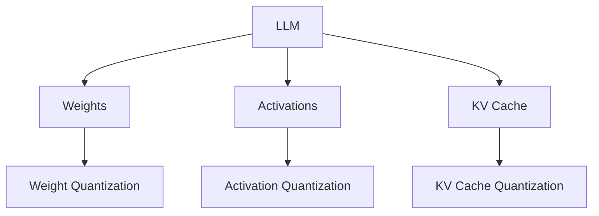

Different quantization strategies produce different trade-offs.

---

# 9. Weight-Only Quantization

**Weight-only quantization** quantizes model weights while computation may still happen using higher precision.

Example:

```text
Stored Weights
→ INT4

Compute
→ FP16 / BF16
```

Conceptually:

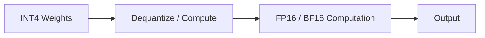

This is a common strategy for LLM inference.

---

# 10. Weight-Only Quantization vs Full Quantization

## Weight-Only

```text
Weights → INT4 / INT8
Activations → Higher Precision
```

## Weight + Activation Quantization

```text
Weights → INT8 / INT4
Activations → INT8 / INT4
```

Weight-only quantization is often easier to deploy while maintaining strong quality.

Full quantization can provide additional performance benefits but may require more careful calibration and hardware support.

---

# 11. Post-Training Quantization

**Post-Training Quantization (PTQ)** applies quantization after a model has already been trained.

Workflow:

```text
Pretrained Model
      ↓
Calibration / Quantization
      ↓
Quantized Model
```

Advantages:

- No full retraining required
- Faster than training a new model
- Practical for deployment
- Can reduce model size significantly

---

# 12. Quantization-Aware Training

**Quantization-Aware Training (QAT)** incorporates quantization effects during training.

Conceptually:

```text
Training
   ↓
Simulated Quantization
   ↓
Model Learns Around Quantization Effects
   ↓
Quantized Model
```

Architecture:


QAT can preserve quality better for some workloads but requires additional training complexity.

---

# 13. PTQ vs QAT

| PTQ | QAT |
|---|---|
| Quantization after training | Quantization effects during training |
| Faster workflow | More training cost |
| No full retraining | Requires training / fine-tuning |
| Easier deployment pipeline | More complex |
| May have larger quality degradation at aggressive precision | Can recover some quantization loss |

For LLMs, PTQ is often attractive because large-model retraining is expensive.

---

# 14. Static vs Dynamic Quantization

Quantization can also be classified by when scaling parameters are determined.

## Static Quantization

Quantization parameters are determined ahead of inference using calibration data.

```text
Calibration Dataset
       ↓
Estimate Ranges
       ↓
Quantization Parameters
       ↓
Inference
```

## Dynamic Quantization

Some quantization parameters are determined dynamically during execution.

```text
Input
 ↓
Runtime Statistics
 ↓
Quantization
 ↓
Computation
```

The appropriate strategy depends on the model, hardware, and inference framework.

---

# 15. Quantization Parameters

Quantization commonly requires parameters such as:

```text
Scale
Zero Point
```

A simplified quantization relationship is:

```text
q = round(x / scale) + zero_point
```

where:

```text
x
→ Original value

q
→ Quantized value
```

Dequantization conceptually reconstructs:

```text
x ≈ scale × (q - zero_point)
```

The exact implementation varies between quantization schemes.

---

# 16. Symmetric Quantization

In symmetric quantization, values are mapped around zero.

Conceptually:

```text
Negative
   │
   ├──────── Zero ────────┤
   │
Positive
```

A simplified form is:

```text
q ≈ x / scale
```

This can simplify implementation.

---

# 17. Asymmetric Quantization

Asymmetric quantization introduces an offset.

Conceptually:

```text
q = x / scale + zero_point
```

This can better represent distributions that are not symmetric around zero.

The appropriate approach depends on the data distribution and quantization method.

---

# 18. Per-Tensor Quantization

One scale is used for an entire tensor.

```text
Tensor
  ↓
One Scale
```

Advantages:

- Simple
- Low metadata overhead

Disadvantages:

- Less flexible for tensors with varying distributions

---

# 19. Per-Channel Quantization

Different channels can have different scales.

```text
Channel 1 → Scale 1
Channel 2 → Scale 2
Channel 3 → Scale 3
...
```

This can improve quantization quality because different channels may have different value distributions.

---

# 20. Group-Wise Quantization

Large weight matrices can be divided into groups.

```text
Weight Matrix
│
├── Group 1 → Scale 1
├── Group 2 → Scale 2
├── Group 3 → Scale 3
└── Group N → Scale N
```

This provides a balance between:

```text
Quantization Accuracy
+
Metadata Overhead
```

Group-wise quantization is widely used in modern LLM quantization methods.

---

# 21. Why Quantization Can Reduce Quality

Quantization maps many high-precision values into a smaller numerical representation.

Therefore:

```text
Original Value
      ↓
Approximation
      ↓
Quantized Value
```

Information is lost.

At aggressive precision:

```text
FP16
 ↓
INT8
 ↓
INT4
 ↓
Lower Precision
```

the potential for quality degradation increases.

However, good quantization methods attempt to minimize the effect on important model behavior.

---

# 22. Quantization Error

Conceptually:

```text
Quantization Error
=
Original Value
-
Dequantized Value
```

A simplified objective is:

```text
Minimize Quantization Error
```

But for LLMs, minimizing raw numerical error alone is not always enough.

The more important objective is:

```text
Preserve Model Behavior
```

---

# 23. Weight Distribution Matters

Neural-network weights are not necessarily uniformly distributed.

Some layers or channels may contain:

```text
Large Outliers
```

These outliers can make quantization more difficult.

Conceptually:

```text
Most Values
██████████████████

Few Large Outliers
                         █
                         █
```

A good quantization method needs to account for these distributions.

---

# 24. Outlier Problem

Suppose most values are:

```text
-1 → +1
```

but a few values are:

```text
-20
+18
```

If one scale is used for all values:

```text
Most Values
→ Poorly Represented
```

because the scale must accommodate the large outliers.

This is one reason why:

- Per-channel quantization
- Group-wise quantization
- Outlier-aware methods

can improve quality.

---

# 25. LLM Quantization Methods

Important LLM quantization approaches include:

- bitsandbytes
- GPTQ
- AWQ
- SmoothQuant
- NF4
- FP8
- HQQ
- AQLM
- GGUF-based quantization ecosystems

Different methods optimize different objectives.

This chapter focuses on the concepts most relevant to production LLM engineering.

---

# 26. bitsandbytes

**bitsandbytes** is widely used in the Hugging Face ecosystem for lower-precision model loading and training.

Common use cases include:

```text
8-bit Model Loading
4-bit Model Loading
QLoRA
Memory-Efficient Training
```

Example:

```python
from transformers import BitsAndBytesConfig

bnb_config = BitsAndBytesConfig(
    load_in_4bit=True,
    bnb_4bit_quant_type="nf4",
    bnb_4bit_use_double_quant=True,
    bnb_4bit_compute_dtype="bfloat16",
)
```

The exact configuration depends on the model, hardware, and library versions.

---

# 27. GPTQ

**GPTQ** is a post-training quantization approach designed for efficient LLM weight quantization.

Conceptually:

```text
FP Model
   ↓
Calibration
   ↓
GPTQ Quantization
   ↓
INT4 / INT8 Model
   ↓
Inference
```

GPTQ is particularly associated with weight-only quantization for LLM inference.

---

# 28. AWQ

**AWQ — Activation-aware Weight Quantization** — uses activation information to identify which weights are more important to preserve.

The basic intuition is:

```text
Not All Weights Are Equally Important
```

Therefore:

```text
Analyze Activations
       ↓
Identify Important Weight Groups
       ↓
Protect Important Weights
       ↓
Quantize Remaining Weights
```

This can improve quality at low precision.

---

# 29. GPTQ vs AWQ

| GPTQ | AWQ |
|---|---|
| Post-training quantization | Post-training quantization |
| Weight-focused | Activation-aware |
| Calibration-based | Uses activation importance |
| Common for LLM inference | Common for efficient LLM inference |
| Supports low-bit weights | Supports low-bit weights |

The best choice depends on:

- Model architecture
- Serving engine
- Hardware
- Target precision
- Quality requirements

---

# 30. SmoothQuant

**SmoothQuant** addresses activation outliers by transforming the relative difficulty between activations and weights.

Conceptually:

```text
Activation Outliers
       ↓
Smoothing Transformation
       ↓
More Quantization-Friendly Distribution
       ↓
INT8 Inference
```

This is particularly relevant for weight-and-activation quantization.

---

# 31. NF4

**NF4 — NormalFloat4** is a 4-bit data type designed around the distribution of pretrained neural-network weights.

It is strongly associated with QLoRA.

Conceptually:

```text
FP Weight Distribution
        ↓
Distribution-Aware 4-bit Representation
        ↓
NF4
```

NF4 aims to preserve useful information while significantly reducing weight memory.

---

# 32. FP8

**FP8** represents floating-point values using 8 bits.

FP8 formats can be useful for:

- Training
- Inference
- Accelerator optimization

Modern hardware increasingly provides specialized support for low-precision floating-point operations.

FP8 is different from INT8 because:

```text
INT8
→ Integer Representation

FP8
→ Floating-Point Representation
```

The best choice depends on the workload and hardware.

---

# 33. INT8 vs FP8

| INT8 | FP8 |
|---|---|
| Integer | Floating point |
| Mature inference option | Increasing hardware adoption |
| Requires scaling | Has floating-point exponent representation |
| Strong for certain inference paths | Useful for modern accelerators |
| Hardware/framework dependent | Hardware/framework dependent |

Do not assume one is universally faster.

Benchmark on the target hardware.

---

# 34. INT4 vs INT8

| INT4 | INT8 |
|---|---|
| Lower memory | Higher memory |
| Higher compression | Lower compression |
| Potentially greater quality loss | Usually easier quality preservation |
| Excellent for memory-constrained LLMs | Strong general inference option |
| Requires more careful calibration | Generally easier deployment |

A useful rule:

```text
If INT8 Meets Requirements
→ Prefer Simpler INT8

If Memory Is the Constraint
→ Evaluate INT4
```

---

# 35. Quantization and QLoRA

QLoRA is one of the most important examples of quantization combined with PEFT.

```text
4-bit Quantized Base Model
        +
LoRA Adapter
        ↓
QLoRA
```

The base model is quantized and frozen.

The LoRA adapter is trainable.

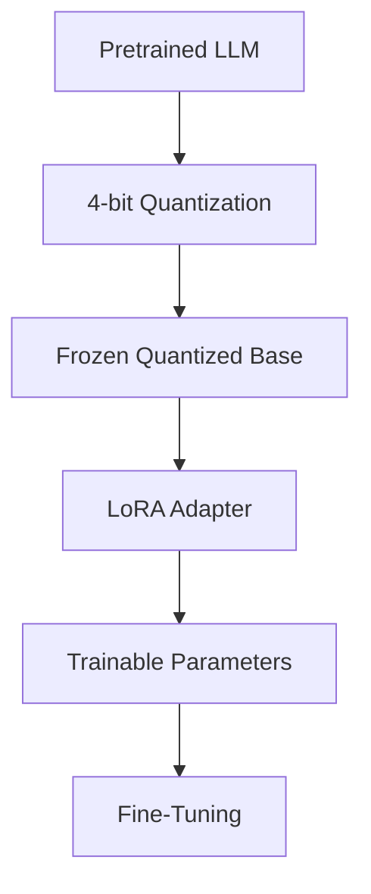

QLoRA will be treated as the bridge between:

```text
Quantization
+
PEFT
```

---

# 36. Quantization and Inference

Quantization can reduce:

```text
Model Memory
```

which can enable:

```text
Larger Batch Size
More Concurrent Requests
Smaller GPU
Lower Cost
```

But performance is hardware-dependent.

A quantized model is not automatically faster.

---

# 37. Memory vs Throughput

Quantization can produce:

```text
Lower Memory
```

without necessarily producing:

```text
Higher Throughput
```

Why?

Because inference performance depends on:

- GPU architecture
- Kernel support
- Memory bandwidth
- Compute utilization
- Quantization format
- Serving engine
- Batch size
- Sequence length

Therefore:

> **Always benchmark quantized models on the actual target serving stack.**

---

# 38. Memory Bandwidth

Large LLM inference workloads can be heavily influenced by memory bandwidth.

If model weights are smaller:

```text
Less Data
Needs to Move
```

which can improve efficiency in memory-bound workloads.

Conceptually:

```text
Large FP16 Weights
       ↓
More Memory Traffic

Small INT4 Weights
       ↓
Less Memory Traffic
```

But kernel overhead and dequantization costs can affect the final result.

---

# 39. Quantization and Batch Size

A smaller model footprint can allow larger batches.

For example:

```text
FP16
Batch Size = 2

INT4
Batch Size = 8
```

These values are only illustrative.

Larger batches can improve:

```text
GPU Utilization
Throughput
```

but may also increase:

```text
Latency
```

Therefore, benchmark:

```text
Batch Size
vs
Throughput
vs
Latency
```

---

# 40. Quantization and Latency

Latency can be divided conceptually into:

```text
Request Processing
+
Prefill
+
Decode
```

Quantization may affect these differently.

```text
Prefill
→ Compute-heavy

Decode
→ Often memory-bandwidth-sensitive
```

Therefore, benchmark:

```text
Time to First Token
```

and:

```text
Time Per Output Token
```

rather than only measuring total request time.

---

# 41. Quantization and KV Cache

During autoregressive generation, Transformers maintain a **KV cache**.

Conceptually:

```text
Prompt
 ↓
Transformer
 ↓
K/V Cache
 ↓
Next Token
 ↓
Updated K/V Cache
```

For long contexts and high concurrency, the KV cache can become a major memory consumer.

Therefore:

```text
Weight Quantization
```

does not automatically solve:

```text
KV Cache Memory
```

---

# 42. Weight Memory vs KV Cache Memory

A production LLM server may consume memory from:

```text
Model Weights
+
KV Cache
+
Runtime Buffers
+
Activations
```

Example:

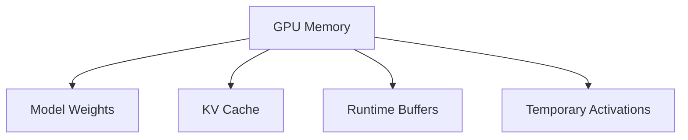

This is an important production distinction.

---

# 43. KV-Cache Quantization

KV-cache quantization reduces the precision of cached attention keys and values.

Conceptually:

```text
FP16 KV Cache
      ↓
INT8 / Lower Precision KV Cache
      ↓
Reduced Memory
```

This can help long-context and high-concurrency workloads.

However, quality and latency should be benchmarked carefully.

---

# 44. Quantization for Long Context

As context length increases:

```text
Context Length ↑
      ↓
KV Cache ↑
      ↓
GPU Memory ↑
```

Therefore, production long-context systems may require a combination of:

```text
Weight Quantization
+
KV-Cache Optimization
+
Paged Attention
+
Efficient Batching
```

Quantization alone is not a complete long-context strategy.

---

# 45. Quantization and Serving Engines

Popular LLM serving ecosystems may support different quantization methods.

Examples include:

- vLLM
- TensorRT-LLM
- llama.cpp
- Hugging Face Transformers
- Text Generation Inference
- ONNX Runtime

The supported quantization formats vary by engine and hardware.

Therefore:

```text
Choose Model
      ↓
Choose Quantization
      ↓
Choose Serving Engine
      ↓
Verify Compatibility
```

Do not choose a quantization format in isolation.

---

# 46. GGUF

**GGUF** is a model file format commonly used in the llama.cpp ecosystem.

It supports quantized model representations designed for efficient local inference.

Typical workflow:

```text
Model
 ↓
Conversion
 ↓
GGUF
 ↓
Quantized Variant
 ↓
llama.cpp / Compatible Runtime
```

GGUF is particularly relevant for:

- Local LLM inference
- CPU inference
- Consumer hardware
- Edge deployments

---

# 47. Quantization for Local AI

Quantization enables larger models to run on:

```text
Consumer GPUs
Gaming PCs
Workstations
Mac systems
CPUs
Edge devices
```

Conceptually:

```text
Large Model
     ↓
INT4 / Quantized
     ↓
Local Hardware
```

This has contributed significantly to the growth of local LLM inference.

---

# 48. Quantization for Cloud AI

Quantization is also valuable in cloud environments.

Benefits include:

```text
Smaller GPU Requirement
Lower Cost
Higher Density
More Concurrent Requests
```

Architecture:

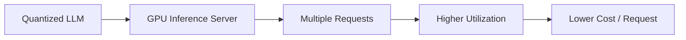

---

# 49. Quantization and GPU Selection

The model's precision can influence GPU selection.

For example:

```text
FP16 Model
→ Requires More VRAM

INT4 Model
→ Requires Less VRAM
```

This may allow:

```text
Larger Model
on
Smaller GPU
```

But always account for:

```text
KV Cache
Concurrency
Context Length
Batch Size
Runtime Overhead
```

---

# 50. Quantization and Cost Optimization

A production cost model should consider:

```text
GPU Hourly Cost
×
GPU Count
×
Utilization
```

Quantization can reduce cost by enabling:

```text
Smaller GPU
or
More Requests per GPU
```

The actual business metric should be:

```text
Cost per Successful Request
```

rather than only:

```text
Cost per GPU Hour
```

---

# 51. Quantization Benchmarking

A proper benchmark should compare:

```text
Base FP16/BF16
INT8
INT4
```

Metrics:

```text
Model Quality
Memory
Latency
Throughput
Cost
```

Example:

| Model | Precision | VRAM | p95 Latency | Throughput | Quality |
|---|---|---:|---:|---:|---:|
| Base | BF16 | High | Baseline | Baseline | Baseline |
| Model A | INT8 | Lower | Measure | Measure | Measure |
| Model B | INT4 | Lower | Measure | Measure | Measure |

Never select a quantized model based on memory alone.

---

# 52. Quantization Evaluation Framework

Use:

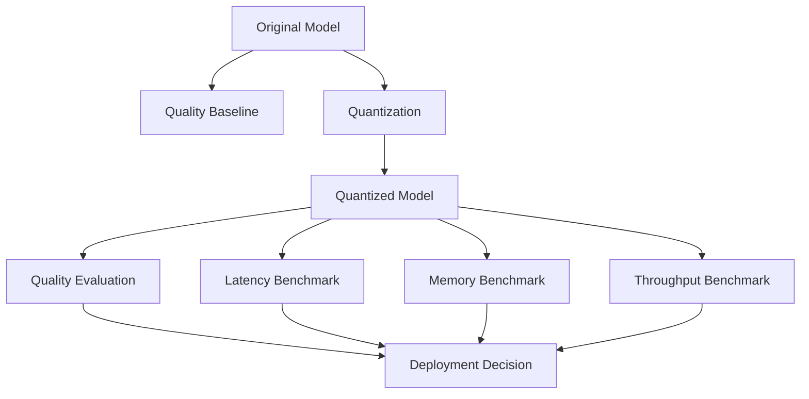

The final decision should consider:

```text
Quality
+
Latency
+
Throughput
+
Memory
+
Cost
```

---

# 53. Quantization Calibration

Some quantization methods require representative calibration data.

Calibration data should represent:

```text
Real Production Inputs
```

For example:

```text
Customer Queries
Support Requests
Enterprise Documents
Coding Prompts
Domain Questions
```

Poor calibration data can produce poor quantization behavior.

---

# 54. Calibration Dataset Requirements

A useful calibration dataset should have:

- Representative language
- Representative sequence lengths
- Domain terminology
- Typical prompt structures
- Common production patterns
- Edge cases where appropriate

Avoid using only:

```text
Random Text
```

when production traffic has a very different distribution.

---

# 55. Quantization-Aware Evaluation

After quantization, test:

```text
Simple Tasks
Complex Tasks
Long Context
Structured Output
Tool Calling
Domain Questions
Safety
Reasoning
```

A model can maintain benchmark accuracy while failing a specific production capability.

---

# 56. Structured Output and Quantization

If the model produces structured output:

```json
{
  "intent": "refund",
  "priority": "high",
  "action": "escalate"
}
```

test:

```text
JSON Validity
Schema Compliance
Field Accuracy
Missing Fields
Extra Fields
```

Quantization should not introduce unacceptable formatting failures.

---

# 57. Tool Calling and Quantization

For tool-calling models, evaluate:

```text
Tool Selection
Argument Generation
Argument Schema
Tool Routing
Final Response
```

A quantized model should be tested against the same tool-calling suite as the original model.

---

# 58. Safety and Quantization

Quantization can potentially alter model behavior.

Therefore evaluate:

```text
Safety
Refusal Behavior
Prompt Injection Resistance
Policy Compliance
Sensitive Information Handling
```

Do not assume:

```text
Quantized Model
=
Behaviorally Identical Model
```

without testing.

---

# 59. Quantization and Prompt Injection

For RAG systems, test:

```text
Malicious Documents
+
Prompt Injection
+
Quantized Model
```

because the deployment model may behave differently under adversarial inputs.

Production evaluation should therefore include:

```text
Base Model Safety
+
Quantized Model Safety
```

---

# 60. Quantization and RAG

Quantization is generally orthogonal to RAG.

```text
RAG
→ Provides Knowledge

Quantization
→ Optimizes Model Representation
```

Architecture:


This is a common production architecture.

---

# 61. Quantized LLM + RAG Production Stack

```text
User
 ↓
API Gateway
 ↓
AI Application
 ├── Retriever
 │    ↓
 │  Vector Database
 │    ↓
 │  Enterprise Context
 │
 └── Quantized LLM
      ↓
   Generation
      ↓
   Guardrails
      ↓
   Response
```

Quantization can reduce the serving cost of the LLM component without changing the retrieval architecture.

---

# 62. Quantization and Agentic AI

Quantized models can also be used in agentic systems.

```text
User
 ↓
Agent
 ↓
Planner / LLM
 ↓
Tool
 ↓
Observation
 ↓
LLM
 ↓
Next Action
```

However, aggressive quantization should be evaluated for:

```text
Tool Selection
Planning
Structured Output
Long Context
Reasoning
```

because small quality regressions can compound over multiple agent steps.

---

# 63. Quantization and Microservices

A production AI backend may expose the quantized model through an inference service.

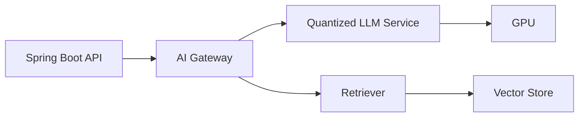

The application layer can remain independent of the underlying model precision.

This supports:

```text
Model Versioning
A/B Testing
Quantization Experiments
Provider Switching
```

---

# 64. Quantization as an Infrastructure Optimization

Quantization should not leak unnecessarily into business logic.

Prefer:

```text
Application
    ↓
LLM Provider Interface
    ↓
Inference Adapter
    ↓
Quantized Model
```

rather than:

```text
Business Logic
    ↓
Hardcoded INT4 Model
```

This keeps the application architecture flexible.

---

# 65. Capability-Based Architecture

For an enterprise AI platform:

```text
LLMProvider
      ↓
Inference Adapter
      ↓
Model Runtime
      ↓
Quantized Model
```

The application should care about:

```text
Generate
Embed
Classify
```

rather than:

```text
INT4
GPTQ
AWQ
BF16
```

These should remain infrastructure-level concerns where possible.

---

# 66. Model Registry Metadata

A production model registry should record:

```yaml
model:
  name: enterprise-llm
  version: "3.1"

precision:
  type: int4
  method: awq

base_model:
  name: <base-model>
  revision: <revision>

runtime:
  engine: <serving-engine>

hardware:
  accelerator: <gpu>

evaluation:
  quality_score: 0.92
  p95_latency_ms: 480
  throughput: 35
```

This enables reproducibility and deployment decisions.

---

# 67. Model Quantization CI/CD

Quantization can be incorporated into the model delivery pipeline.

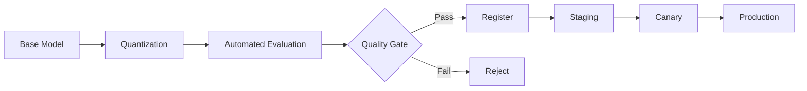

Quality gates may include:

```text
Accuracy
F1
Safety
Latency
Memory
Throughput
Cost
```

---

# 68. Quantization Regression Testing

Every new quantization configuration should be treated as a model variant.

Example:

```text
Model v3 BF16
Model v3 INT8
Model v3 INT4 AWQ
Model v3 INT4 GPTQ
```

Compare them systematically.

```text
Quality
Latency
Memory
Throughput
Cost
```

Do not replace the baseline without measurement.

---

# 69. Quantization Rollback

A quantized model should be independently versioned.

```text
Production
INT4 v2
   ↓
Regression
   ↓
Rollback
   ↓
INT8 v1
```

Keep a validated fallback model available when model quality is business-critical.

---

# 70. Production Deployment Strategy

A safe rollout:

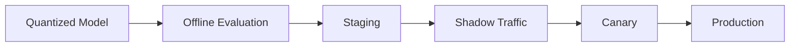

Measure:

```text
Latency
Error Rate
Quality
User Feedback
GPU Utilization
Cost
```

---

# 71. Shadow Testing

A quantized model can receive shadow traffic without serving its responses to users.

```text
Production Request
      │
      ├── Current Model → User
      │
      └── Quantized Model → Evaluation Only
```

Compare:

```text
Outputs
Latency
Token Usage
Errors
Safety
```

This reduces deployment risk.

---

# 72. Canary Deployment

Only a small percentage of traffic initially uses the quantized model.

```text
100% Traffic
     ↓
95% Baseline
5% Quantized
     ↓
Monitor
     ↓
25% Quantized
     ↓
50%
     ↓
100%
```

Increase traffic only after quality and infrastructure metrics remain within acceptable thresholds.

---

# 73. Production Monitoring Dashboard

A quantized LLM dashboard should include:

```text
Model Version
Quantization Method
Precision
GPU Type
GPU Utilization
GPU Memory
Requests/sec
Tokens/sec
p50 Latency
p95 Latency
TTFT
TPOT
Error Rate
Quality Metrics
Cost/request
```

Where:

```text
TTFT = Time To First Token

TPOT = Time Per Output Token
```

---

# 74. Common Quantization Mistakes

## Mistake 1 — Choosing the Lowest Precision Automatically

```text
INT4
```

is not automatically better than:

```text
INT8
```

Evaluate quality and performance.

---

## Mistake 2 — Looking Only at Model Size

A smaller model artifact does not guarantee:

```text
Lower Latency
Higher Throughput
Lower Cost
```

Benchmark the full inference system.

---

## Mistake 3 — Ignoring KV Cache

Weight quantization does not automatically solve:

```text
Long-Context Memory
```

---

## Mistake 4 — Ignoring Hardware Support

A quantization format may be supported by the model ecosystem but poorly optimized on your hardware.

---

# 75. Common Quantization Failure Modes

Common problems include:

- Significant quality degradation
- Incorrect calibration dataset
- Outlier sensitivity
- Unsupported kernels
- Poor GPU utilization
- Unexpected memory usage
- Higher latency than baseline
- Incompatible serving engine
- Incorrect model conversion
- Generation instability
- Structured-output degradation
- Tool-calling regression

---

# 76. Debugging Quantization Quality Loss

Use a controlled process:

```text
Original Model
      ↓
Baseline Evaluation
      ↓
Quantized Model
      ↓
Same Evaluation
      ↓
Identify Regression
```

Then isolate:

```text
Precision
+
Quantization Method
+
Calibration
+
Target Layers
```

Do not simultaneously change:

```text
Model
Precision
Prompt
Runtime
Dataset
```

because then the source of regression becomes difficult to identify.

---

# 77. Debugging Quantization Performance

If the quantized model is slower:

```text
Check
 ↓
Serving Engine
 ↓
Kernel Support
 ↓
GPU Utilization
 ↓
Batch Size
 ↓
Memory Bandwidth
 ↓
Dequantization Overhead
 ↓
Sequence Length
```

A quantized model can theoretically use less memory but still perform poorly if the runtime lacks optimized kernels.

---

# 78. Quantization Benchmark Checklist

Before deployment:

```text
[ ] Baseline Model Evaluated
[ ] Quantized Model Evaluated
[ ] Memory Measured
[ ] TTFT Measured
[ ] TPOT Measured
[ ] p95 Latency Measured
[ ] Throughput Measured
[ ] GPU Utilization Measured
[ ] Safety Tested
[ ] Structured Output Tested
[ ] Tool Calling Tested
[ ] RAG Tested
[ ] Long Context Tested
[ ] Cost Estimated
[ ] Rollback Model Available
```

---

# 79. Quantization Decision Framework

Use higher precision when:

```text
Quality Is Extremely Sensitive
+
Memory Is Available
```

Use INT8 when:

```text
You Need Strong Quality
+
Memory Reduction
+
Good Runtime Support
```

Use INT4 when:

```text
Memory Is the Primary Constraint
+
Quality Regression Is Acceptable
+
Runtime Supports Efficient INT4
```

Use FP8 when:

```text
Hardware and Runtime Provide Strong FP8 Support
+
Workload Benefits From Floating-Point Low Precision
```

---

# 80. Quantization Decision Tree

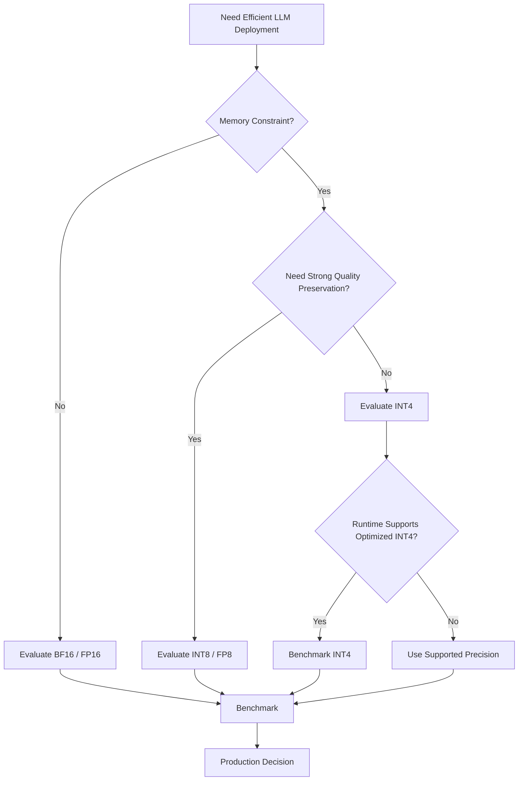

---

# 81. Quantization vs Distillation

Quantization and knowledge distillation solve different problems.

## Quantization

```text
Same Model
+
Lower Precision
```

## Distillation

```text
Large Teacher
+
Smaller Student
↓
Smaller Model
```

Conceptually:

```text
Quantization
→ Compress Representation

Distillation
→ Compress Model Capacity
```

They can also be combined.

---

# 82. Quantization vs Pruning

Pruning removes or reduces model parameters.

```text
Pruning
→ Remove Weights / Connections
```

Quantization reduces numerical precision.

```text
Quantization
→ Represent Weights More Efficiently
```

They can potentially be combined:

```text
Pruning
+
Quantization
=
Further Compression
```

But the production benefit depends on hardware and runtime support.

---

# 83. Quantization vs LoRA

These techniques solve different problems.

```text
LoRA
→ Reduce Trainable Parameters

Quantization
→ Reduce Weight Representation Size
```

Together:

```text
QLoRA
=
Quantization
+
LoRA
```

This distinction is fundamental.

---

# 84. Quantization vs RAG

RAG is a knowledge architecture.

Quantization is a model optimization technique.

```text
RAG
→ Where knowledge comes from

Quantization
→ How model weights are represented
```

They can be combined without replacing each other.

---

# 85. Quantization and Agentic Systems

For agentic workloads, benchmark:

```text
Planning
Tool Selection
Argument Generation
Multi-Step Reasoning
Structured Output
Long Context
```

A small quality loss at each step can accumulate across multiple agent iterations.

Therefore:

```text
Quantized Agent
```

requires more than a simple single-prompt benchmark.

---

# 86. Enterprise Architecture

A production enterprise architecture may look like:

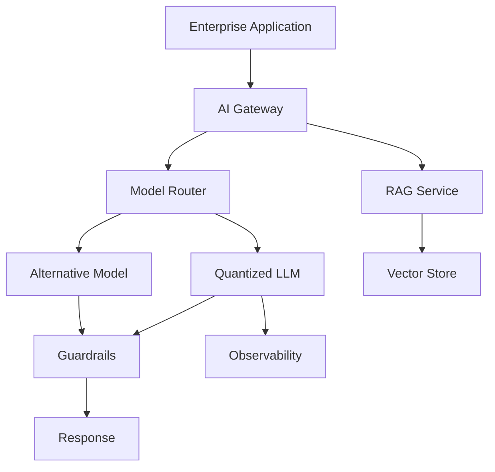

This allows the organization to:

- Switch model variants
- A/B test quantization
- Roll back
- Route workloads
- Control costs

---

# 87. Cloud AI Architecture

A cloud deployment could contain:

```text
Object Storage
      ↓
Model Registry
      ↓
Quantization Pipeline
      ↓
Container Registry
      ↓
GPU Inference Cluster
      ↓
API Gateway
      ↓
Enterprise Applications
```

Observability:

```text
Metrics
Logs
Traces
Quality Signals
Cost
```

---

# 88. Java / Spring Boot Integration

For a Java-first enterprise architecture, the application layer should remain independent of quantization details.

Example:

```text
Spring Boot Application
        ↓
LLMProvider
        ↓
LLM Inference Adapter
        ↓
HTTP / gRPC
        ↓
Quantized Model Server
```

Conceptual interface:

```java
public interface LLMProvider {

    GenerationResult generate(
        GenerationRequest request
    );
}
```

The implementation could communicate with:

```text
vLLM
TensorRT-LLM
TGI
Custom Inference Service
Cloud Model Endpoint
```

The business application does not need to know whether the underlying model is:

```text
BF16
INT8
INT4
AWQ
GPTQ
```

---

# 89. Ports and Adapters Architecture

A production AI backend can use:

```text
Domain
  ↓
LLMProvider
  ↓
Inference Adapter
  ↓
Model Runtime
```

Example:


This keeps quantization implementation details outside business logic.

---

# 90. Production Cost Model

A useful production metric is:

```text
Cost per 1M Input Tokens
+
Cost per 1M Output Tokens
```

or:

```text
Cost per Successful Request
```

Compare:

```text
BF16
vs
INT8
vs
INT4
```

under the same workload.

The best model is not necessarily the one with the smallest memory footprint.

---

# 91. Quantization Experiment Matrix

A practical experiment matrix could be:

| Variant | Precision | Method | Memory | Latency | Quality | Cost |
|---|---|---|---:|---:|---:|---:|
| Baseline | BF16 | None | Measure | Measure | Measure | Measure |
| A | INT8 | PTQ | Measure | Measure | Measure | Measure |
| B | INT4 | AWQ | Measure | Measure | Measure | Measure |
| C | INT4 | GPTQ | Measure | Measure | Measure | Measure |

The values should come from actual benchmarks.

---

# 92. Production Optimization Strategy

A good optimization sequence is:

```text
1. Establish Baseline
        ↓
2. Profile Memory
        ↓
3. Profile Latency
        ↓
4. Try BF16 / FP16
        ↓
5. Evaluate INT8 / FP8
        ↓
6. Evaluate INT4
        ↓
7. Optimize Serving Engine
        ↓
8. Optimize Batch / Concurrency
        ↓
9. Optimize KV Cache
        ↓
10. Validate Quality
```

Do not start with the most aggressive optimization.

---

# 93. Practical Engineering Rule

A useful engineering principle is:

```text
First Make It Correct
        ↓
Then Make It Efficient
        ↓
Then Make It Cheap
```

For LLM deployment:

```text
Quality Baseline
      ↓
Quantization
      ↓
Benchmark
      ↓
Quality Gate
      ↓
Production
```

---

# 94. Interview Questions

## Beginner

- What is model quantization?
- Why is quantization useful for LLMs?
- What is FP32?
- What is FP16?
- What is BF16?
- What is INT8?
- What is INT4?
- Why does quantization reduce memory?
- What is post-training quantization?
- What is QAT?
- What is weight-only quantization?

## Intermediate

- INT8 vs INT4?
- FP16 vs BF16?
- INT8 vs FP8?
- What is quantization error?
- What are scale and zero point?
- What is symmetric quantization?
- What is asymmetric quantization?
- Per-tensor vs per-channel quantization?
- What is group-wise quantization?
- What is GPTQ?
- What is AWQ?
- What is NF4?
- What is bitsandbytes?
- How does QLoRA use quantization?
- Why can quantization affect model quality?
- Why doesn't quantization automatically solve KV-cache memory?

## Advanced

- How would you select a quantization strategy for a 70B model?
- How would you benchmark INT4 vs INT8?
- How would you design a production quantization pipeline?
- How would you select calibration data?
- How would you debug quality degradation after quantization?
- Why can an INT4 model be slower than an FP16 model?
- How would you design quantization CI/CD?
- How would you handle quantized model rollback?
- How would you evaluate quantization for tool-calling models?
- How would you combine quantization with RAG?
- How would you optimize long-context inference?
- How would you design a quantized LLM service behind Spring Boot?
- How would you choose between AWQ, GPTQ, and bitsandbytes?
- How would you evaluate FP8 versus INT8?
- How would you measure cost savings after quantization?

---

# 95. Scenario-Based Interview Questions

## Scenario 1 — 70B Model Does Not Fit on a GPU

Start by estimating:

```text
Model Weight Memory
+
KV Cache
+
Runtime Overhead
```

Then evaluate:

```text
INT8
```

or:

```text
INT4
```

depending on quality requirements and runtime support.

---

## Scenario 2 — INT4 Has Lower Memory but Worse Quality

Investigate:

```text
Quantization Method
Calibration Dataset
Target Layers
Outliers
Quantization Configuration
```

Then compare:

```text
INT4 AWQ
INT4 GPTQ
INT8
```

using the same evaluation suite.

---

## Scenario 3 — INT4 Is Slower Than BF16

Investigate:

```text
GPU
Serving Engine
Kernel Support
Dequantization Overhead
Batch Size
Memory Bandwidth
```

Quantization is not automatically a latency optimization.

---

## Scenario 4 — Long Context Causes OOM Despite INT4

The likely issue may be:

```text
KV Cache
+
Activations
```

Investigate:

```text
Context Length
Concurrency
KV Cache Precision
Batching
Paged Attention
```

---

## Scenario 5 — Quantized Model Breaks JSON Output

Evaluate:

```text
Base Model JSON Accuracy
Quantized Model JSON Accuracy
```

Then investigate whether the quantization method or precision introduced the regression.

Do not deploy simply because general benchmark scores remain acceptable.

---

# 96. 🚀 Quick Revision Sheet

## Quantization

```text
High Precision
      ↓
Lower Precision
      ↓
Smaller Model
      ↓
Lower Memory
```

## Precision

```text
FP32
 ↓
FP16 / BF16
 ↓
INT8
 ↓
INT4
```

## Main Quantization Targets

- Weights
- Activations
- KV Cache

## Important Methods

- bitsandbytes
- GPTQ
- AWQ
- SmoothQuant
- NF4
- FP8
- GGUF ecosystem

## Quantization Types

```text
PTQ
QAT
Weight-Only
Weight + Activation
Static
Dynamic
Per-Tensor
Per-Channel
Group-Wise
```

## QLoRA

```text
4-bit Quantized Base
        +
LoRA Adapter
        ↓
Memory-Efficient Fine-Tuning
```

## Production Metrics

- Memory
- TTFT
- TPOT
- p50 latency
- p95 latency
- Throughput
- GPU utilization
- Quality
- Safety
- Cost/request

## Production Workflow

```text
Baseline
 ↓
Quantize
 ↓
Evaluate
 ↓
Benchmark
 ↓
Register
 ↓
Canary
 ↓
Production
 ↓
Monitor
```

---

# 97. Remember

> **Model quantization reduces the numerical precision used to represent model parameters and can dramatically reduce memory requirements for Large Language Models.**

The core mental model is:

```text
FP32
 ↓
FP16 / BF16
 ↓
INT8
 ↓
INT4
```

But remember:

```text
Lower Precision
≠
Automatically Better
```

The correct objective is:

```text
Quality
+
Latency
+
Memory
+
Throughput
+
Cost
```

Also remember:

> **Weight quantization reduces model-weight memory, but KV cache and runtime memory can still dominate long-context, high-concurrency inference.**

And:

> **Quantization is an infrastructure optimization, not a replacement for good model architecture, data quality, evaluation, or production engineering.**

---

# 98. Key Takeaways

- Model quantization represents model values using lower numerical precision.
- Quantization can significantly reduce LLM weight memory.
- FP32, FP16, BF16, INT8, INT4, and FP8 represent different precision strategies.
- Weight-only quantization is widely used for LLM inference.
- Activation quantization can provide additional efficiency but requires more careful engineering.
- Post-Training Quantization is applied after model training.
- Quantization-Aware Training incorporates quantization effects during training.
- Quantization requires trade-offs between memory, performance, and model quality.
- Quantization parameters can include scale and zero point.
- Per-channel and group-wise quantization can provide better accuracy than simple per-tensor approaches in some workloads.
- Weight distributions and outliers are important factors in quantization quality.
- GPTQ is a post-training weight quantization approach commonly used for LLM inference.
- AWQ uses activation information to identify important weights for preservation.
- bitsandbytes provides widely used 8-bit and 4-bit model-loading capabilities in the Hugging Face ecosystem.
- NF4 is a 4-bit representation associated strongly with QLoRA.
- FP8 provides an alternative low-precision floating-point representation on supported hardware.
- QLoRA combines 4-bit base-model quantization with LoRA adapters.
- Quantization can reduce memory without necessarily improving latency.
- Runtime kernel support and hardware architecture strongly influence quantized-model performance.
- Weight quantization does not automatically reduce KV-cache memory.
- Long-context inference may require KV-cache optimization in addition to weight quantization.
- Quantized models should be benchmarked using real production workloads.
- Model quality, safety, structured output, tool calling, and RAG behavior should be evaluated after quantization.
- Quantization should be treated as a versioned model artifact in production.
- Quantization pipelines should include automated evaluation and quality gates.
- Shadow and canary deployment can reduce the risk of quantized-model regressions.
- Model registries should record quantization method, precision, base-model version, runtime, hardware, and evaluation results.
- Quantization can reduce infrastructure cost by enabling smaller GPUs or higher request density.
- The correct quantization strategy depends on the model, workload, hardware, serving engine, quality target, and cost requirements.
- Production LLM optimization should consider the complete memory footprint: weights, KV cache, activations, runtime buffers, and concurrency.
- Quantization works well alongside RAG, PEFT, LoRA, QLoRA, and cloud-native inference architectures.
- In enterprise systems, quantization should remain an infrastructure concern behind model-provider and inference interfaces whenever practical.

---

# 99. Chapter Navigation

## Previous Chapter

[13. LoRA and QLoRA](13-lora-and-qlora.md)

## Current Chapter

**14. Model Quantization**

## Next Chapter

[15. LLM Generation Strategies](15-llm-generation-strategies.md)

## Related Chapters

- [01. Generative AI Fundamentals](01-generative-ai-fundamentals.md)
- [02. Language Understanding Fundamentals](02-language-understanding-fundamentals.md)
- [03. Word Embeddings](03-word-embeddings.md)
- [04. Language Modeling](04-language-modeling.md)
- [05. Attention and Positional Encoding](05-attention-and-positional-encoding.md)
- [06. GPT and BERT Architecture](06-gpt-and-bert-architecture.md)
- [07. Hugging Face and Transformers](07-huggingface-and-transformers.md)
- [08. LLM Data Preparation](08-llm-data-preparation.md)
- [09. Hugging Face Training Workflow](09-huggingface-training-workflow.md)
- [10. Transformer Fine-Tuning Fundamentals](10-transformer-fine-tuning-fundamentals.md)
- [11. Supervised Fine-Tuning (SFT)](11-supervised-fine-tuning-sft.md)
- [12. Parameter-Efficient Fine-Tuning (PEFT)](12-parameter-efficient-fine-tuning.md)
- [13. LoRA and QLoRA](13-lora-and-qlora.md)
- [15. LLM Generation Strategies](15-llm-generation-strategies.md)
- [16. LLM Evaluation](16-llm-evaluation.md)

---

# References

- Hugging Face Transformers Documentation
- Hugging Face BitsAndBytes Documentation
- Hugging Face PEFT Documentation
- Hugging Face Text Generation Inference Documentation
- PyTorch Documentation
- GPTQ: Accurate Post-Training Quantization for Generative Pre-trained Transformers
- AWQ: Activation-aware Weight Quantization for LLM Compression and Acceleration
- SmoothQuant: Accurate and Efficient Post-Training Quantization for Large Language Models
- QLoRA: Efficient Finetuning of Quantized LLMs — Dettmers et al.
- LLM.int8(): 8-bit Matrix Multiplication for Transformers at Scale
- llama.cpp Documentation
- vLLM Documentation
- NVIDIA TensorRT-LLM Documentation
- ONNX Runtime Documentation
- *Efficient Large Language Models: A Survey*
- *Quantization and Training of Neural Networks for Efficient Integer-Arithmetic-Only Inference*
- *A Survey of Quantization Methods for Efficient Neural Network Inference*

---

> **Enterprise AI Engineering Handbook**  
> *Building Production-Grade Enterprise AI Systems — One Chapter at a Time.*