# 15 — LLM Generation Strategies

> A practical, production-oriented guide to **LLM Generation Strategies**, covering autoregressive text generation, decoding, greedy search, beam search, sampling, temperature, Top-K, Top-P, Top-A, typical sampling, repetition penalties, frequency and presence penalties, length control, stopping criteria, deterministic vs stochastic generation, constrained generation, structured output, streaming, speculative decoding, KV cache, generation configuration, Hugging Face Transformers, production inference, RAG generation, agentic AI, evaluation, latency, cost optimization, failure modes, and enterprise AI engineering considerations.

---

# 1. Overview

Large Language Models generate text **token by token**.

Given an input sequence:

```text
Input Tokens
     ↓
Transformer
     ↓
Next-Token Probabilities
     ↓
Token Selection
     ↓
Append Token
     ↓
Transformer
     ↓
Next Token
     ↓
Repeat
```

This process is called **autoregressive generation** for models such as GPT-style causal language models.

The model does not directly generate an entire paragraph in one operation.

Instead:

```text
P(token₁ | prompt)

P(token₂ | prompt, token₁)

P(token₃ | prompt, token₁, token₂)

...
```

Therefore:

> **LLM generation is fundamentally a probability-based token-selection process.**

Generation strategies determine **how the next token is selected from the model's probability distribution**.

---

# 2. Why LLM Generation Strategies Matter

The same model can produce very different outputs depending on its generation configuration.

For example:

```text
Temperature = 0
      ↓
More Deterministic
```

while:

```text
Temperature ↑
      ↓
More Randomness
```

Similarly:

```text
Greedy Decoding
      ↓
Predictable
```

versus:

```text
Sampling
      ↓
More Diverse
```

Therefore, generation configuration directly affects:

- Accuracy
- Creativity
- Diversity
- Repetition
- Factual consistency
- Latency
- Token consumption
- Structured output reliability
- Tool-calling reliability
- User experience

---

# 3. The LLM Generation Pipeline

A simplified generation pipeline:

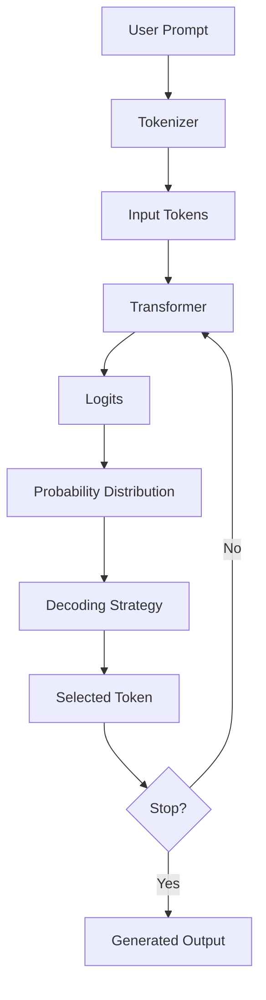

The critical component is:

```text
Logits
   ↓
Probability Distribution
   ↓
Decoding Strategy
   ↓
Next Token
```

---

# 4. Logits

The Transformer produces a vector of raw scores called **logits**.

Conceptually:

```text
Transformer
     ↓
Logits
```

Example:

```text
Token        Logit

"the"         4.2
"is"          3.7
"model"       2.9
"cat"         1.8
"banana"     -1.2
```

Logits are not probabilities.

They are converted into probabilities using the **softmax** function.

---

# 5. Softmax

The softmax function converts logits into a probability distribution.

Conceptually:

```text
Logits
  ↓
Softmax
  ↓
Probabilities
```

The probability for token `i` can be represented as:

```text
P(i) = exp(zᵢ) / Σ exp(zⱼ)
```

where:

```text
zᵢ = logit for token i
```

The resulting probabilities satisfy:

```text
0 ≤ P(i) ≤ 1
```

and:

```text
Σ P(i) = 1
```

---

# 6. Next-Token Prediction

Suppose the model sees:

```text
The capital of France is
```

It may produce:

```text
Paris      0.92
London     0.02
Berlin     0.01
Madrid     0.01
...
```

The generation strategy determines what happens next.

With greedy decoding:

```text
Paris
```

is selected because it has the highest probability.

With sampling:

```text
Paris
```

is still very likely, but another candidate may occasionally be selected depending on the sampling configuration.

---

# 7. Autoregressive Generation

The generation loop is:

```text
Prompt
  ↓
Predict Token
  ↓
Append Token
  ↓
Predict Next Token
  ↓
Append Token
  ↓
Repeat
```

Example:

```text
Prompt:

The sky is

Step 1:
blue

Step 2:
today

Step 3:
and

Step 4:
clear
```

The model repeatedly conditions on the tokens generated so far.

---

# 8. Autoregressive Generation Formula

For a sequence:

```text
x₁, x₂, ..., xₙ
```

the model estimates:

```text
P(x₁, x₂, ..., xₙ)
```

as:

```text
P(x₁)
×
P(x₂ | x₁)
×
P(x₃ | x₁,x₂)
×
...
×
P(xₙ | x₁,...,xₙ₋₁)
```

This factorization is fundamental to autoregressive language modeling.

---

# 9. Decoding

**Decoding** refers to the strategy used to transform the model's probability distribution into generated tokens.

Major strategies include:

```text
Greedy Decoding
Beam Search
Temperature Sampling
Top-K Sampling
Top-P Sampling
Top-A Sampling
Typical Sampling
Contrastive Search
Constrained Decoding
Speculative Decoding
```

These methods optimize different objectives.

---

# 10. Deterministic vs Stochastic Generation

Generation strategies can broadly be divided into:

## Deterministic

The same input generally produces the same output.

Examples:

- Greedy decoding
- Beam search
- Sampling with effectively disabled randomness

## Stochastic

Randomness influences token selection.

Examples:

- Temperature sampling
- Top-K sampling
- Top-P sampling

Conceptually:

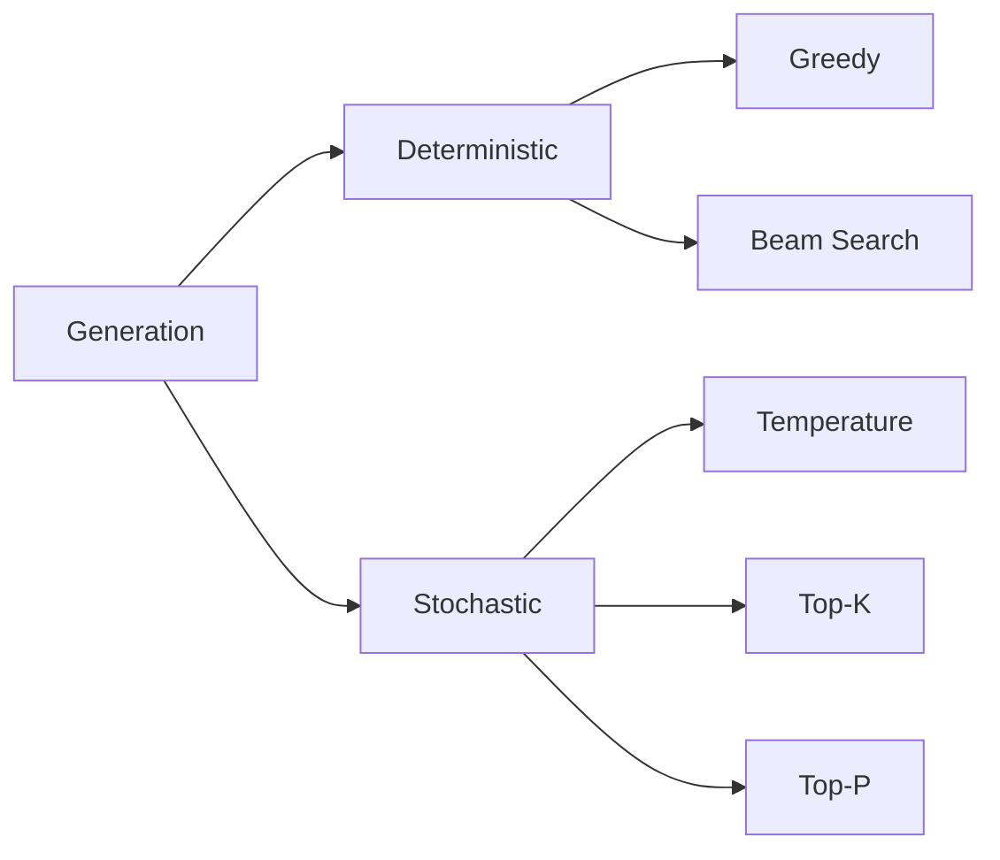

---

# 11. Greedy Decoding

**Greedy decoding** selects the token with the highest probability at every step.

```text
Next Token
    =
argmax P(token | context)
```

Example:

```text
Token      Probability

A          0.55
B          0.25
C          0.15
D          0.05
```

Greedy decoding selects:

```text
A
```

every time.

---

# 12. Greedy Decoding Workflow

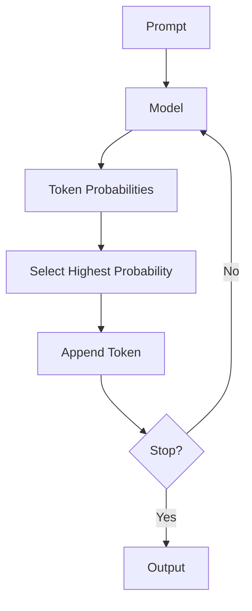

---

# 13. Advantages of Greedy Decoding

Advantages:

- Simple
- Fast
- Deterministic
- Low computational overhead
- Predictable
- Useful for classification-like generation

Good use cases include:

- Structured extraction
- Simple deterministic transformations
- Some enterprise workflows
- Repeatable evaluations

---

# 14. Limitations of Greedy Decoding

Greedy decoding makes the best decision **locally**.

The highest-probability token at one step may lead to a poor sequence later.

Example:

```text
Step 1
A = 0.60
B = 0.40

Greedy → A
```

But:

```text
A → poor continuation

B → strong continuation
```

The locally best decision may not produce the globally best sequence.

---

# 15. Beam Search

**Beam search** maintains multiple candidate sequences instead of selecting only one token at each step.

Example:

```text
Beam Width = 3
```

The decoder maintains:

```text
Candidate 1
Candidate 2
Candidate 3
```

and expands them over multiple steps.

---

# 16. Beam Search Workflow

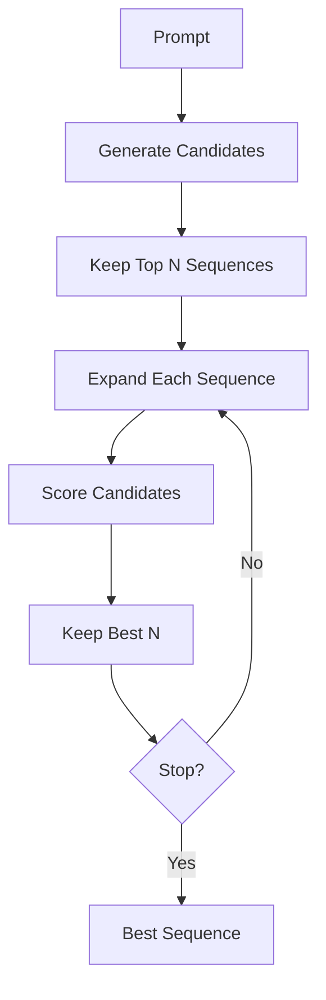

---

# 17. Beam Width

Beam search uses:

```text
num_beams
```

For example:

```text
num_beams = 1
```

is effectively greedy-style search.

```text
num_beams = 4
```

maintains four candidate sequences.

Higher beam width generally means:

```text
More Search
+
More Compute
```

but does not guarantee better output quality.

---

# 18. Beam Search Scoring

A simplified sequence score is:

```text
Score(sequence)
=
Σ log P(token | previous tokens)
```

Because multiplying many probabilities can produce extremely small numbers, log probabilities are commonly used.

Long sequences can receive lower scores simply because more probabilities are multiplied.

Therefore, length normalization or related techniques may be used.

---

# 19. Beam Search Limitations

Beam search can:

- Increase compute
- Increase latency
- Produce repetitive outputs
- Reduce diversity
- Prefer high-probability generic sequences

For open-ended conversational generation, sampling is often more useful than traditional beam search.

---

# 20. Greedy vs Beam Search

| Greedy | Beam Search |
|---|---|
| One candidate | Multiple candidates |
| Fast | More compute |
| Deterministic | Deterministic |
| Local decisions | Searches multiple paths |
| Simple | More complex |
| Good for simple generation | Useful for sequence optimization |

---

# 21. Temperature

**Temperature** controls the sharpness of the probability distribution.

Conceptually:

```text
Adjusted Probability
=
Softmax(logits / T)
```

where:

```text
T = temperature
```

---

# 22. Low Temperature

When:

```text
T < 1
```

the distribution becomes sharper.

Example:

```text
Before:

A 0.60
B 0.25
C 0.15
```

After lower temperature:

```text
A 0.80
B 0.14
C 0.06
```

The model becomes more deterministic.

---

# 23. High Temperature

When:

```text
T > 1
```

the distribution becomes flatter.

Example:

```text
Before:

A 0.60
B 0.25
C 0.15
```

After higher temperature:

```text
A 0.45
B 0.31
C 0.24
```

This increases diversity.

---

# 24. Temperature Intuition

```text
Temperature ↓
      ↓
Sharper Distribution
      ↓
More Deterministic
```

```text
Temperature ↑
      ↓
Flatter Distribution
      ↓
More Diverse
```

---

# 25. Temperature Graph

```text
Probability
   ^
   |             Low T
   |               /\
   |              /  \
   |             /    \
   |     High T /      \
   |      _____/        \____
   +----------------------------> Tokens
```

The exact distribution depends on the model logits.

---

# 26. Temperature Use Cases

## Low Temperature

Useful for:

- Factual responses
- Structured generation
- Extraction
- Classification
- Enterprise workflows
- Tool calling

## Higher Temperature

Useful for:

- Brainstorming
- Creative writing
- Ideation
- Story generation
- Alternative phrasing

---

# 27. Temperature Is Not a Creativity Switch

A common misconception is:

```text
Temperature
=
Creativity
```

More accurately:

```text
Temperature
=
Probability Distribution Sharpness
```

Higher temperature increases randomness but does not guarantee:

```text
Better Creativity
```

---

# 28. Top-K Sampling

**Top-K sampling** restricts candidate tokens to the K most probable tokens.

Example:

```text
K = 5
```

The model considers only:

```text
Top 5 Tokens
```

and samples from them.

---

# 29. Top-K Workflow

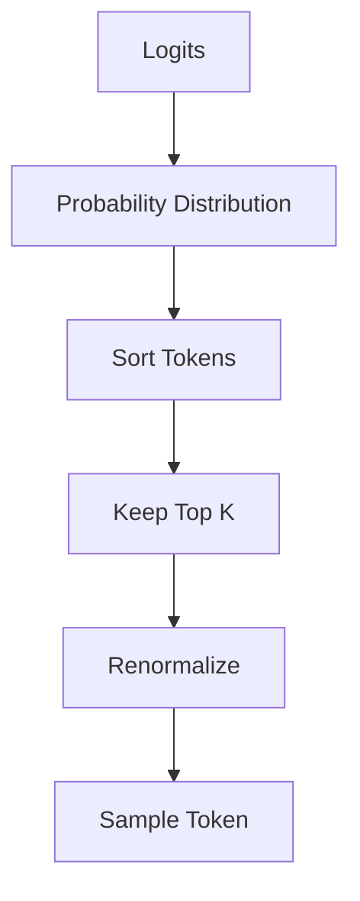

---

# 30. Example of Top-K

Suppose:

```text
Token A = 0.40
Token B = 0.25
Token C = 0.15
Token D = 0.10
Token E = 0.05
Token F = 0.03
Token G = 0.02
```

With:

```text
K = 3
```

only:

```text
A
B
C
```

remain candidates.

The probabilities are renormalized before sampling.

---

# 31. Advantages of Top-K

Top-K:

- Prevents extremely unlikely tokens
- Adds controlled randomness
- Is simple to understand
- Can improve generation diversity

---

# 32. Limitations of Top-K

A fixed K may not fit every probability distribution.

Example:

```text
Highly Confident Distribution
```

may need only:

```text
2–3 tokens
```

while a broad distribution may reasonably contain:

```text
20+ plausible tokens
```

A fixed K does not adapt to this variation.

---

# 33. Top-P Sampling

**Top-P**, also called **nucleus sampling**, dynamically selects the smallest set of tokens whose cumulative probability exceeds `P`.

Example:

```text
P = 0.90
```

The decoder keeps tokens until their cumulative probability reaches approximately:

```text
90%
```

---

# 34. Top-P Workflow

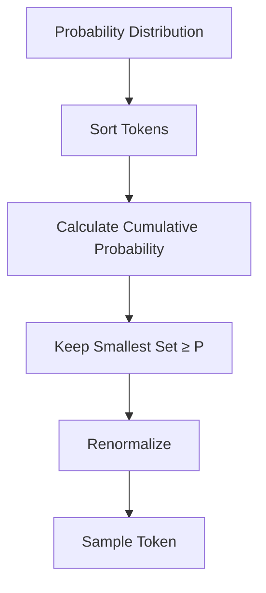

---

# 35. Example of Top-P

Suppose:

```text
A = 0.50
B = 0.25
C = 0.10
D = 0.07
E = 0.05
F = 0.03
```

With:

```text
P = 0.90
```

cumulative probability:

```text
A       → 0.50
A+B     → 0.75
A+B+C   → 0.85
A+B+C+D → 0.92
```

Therefore the candidate set becomes:

```text
A
B
C
D
```

---

# 36. Top-K vs Top-P

| Top-K | Top-P |
|---|---|
| Fixed number of tokens | Dynamic number of tokens |
| K controls candidate count | P controls cumulative probability |
| Simple | Adaptive |
| Can be rigid | Usually more flexible |

A common production sampling configuration uses:

```text
Temperature
+
Top-P
```

---

# 37. Top-A Sampling

**Top-A sampling** is another adaptive sampling strategy.

It uses the probability of the highest-probability token as a reference and removes candidates below a relative threshold.

Conceptually:

```text
Highest Probability
       ↓
Define Threshold
       ↓
Remove Very Weak Candidates
       ↓
Sample
```

It is less commonly used than Top-P in mainstream production LLM APIs but is useful to understand as part of the broader decoding landscape.

---

# 38. Typical Sampling

**Typical sampling** attempts to select tokens that are representative of the distribution's expected information content rather than simply selecting the highest-probability tokens.

The intuition is:

```text
Avoid Extremely Unlikely Tokens
+
Avoid Overly Predictable Choices
```

It can provide an alternative to Top-K and Top-P for certain generation workloads.

---

# 39. Sampling Strategy Comparison

```text
Greedy
→ Highest probability

Temperature
→ Adjust distribution sharpness

Top-K
→ Keep K candidates

Top-P
→ Keep cumulative probability mass

Top-A
→ Relative probability threshold

Typical
→ Information-content-based filtering
```

These strategies can sometimes be combined.

---

# 40. Repetition Problem

LLMs can sometimes produce repetitive text.

Example:

```text
The system is good.
The system is good.
The system is good.
The system is good.
```

Repetition can arise from:

- Decoding configuration
- Model behavior
- Training data
- Long generation
- Prompt structure

Generation penalties can help.

---

# 41. Repetition Penalty

A **repetition penalty** modifies the likelihood of tokens that have already appeared.

Conceptually:

```text
Previously Generated Token
        ↓
Apply Penalty
        ↓
Reduce Probability
```

A simplified mental model:

```text
Repetition Penalty > 1
→ Discourage Repetition
```

The exact implementation depends on the framework.

---

# 42. Frequency Penalty

A frequency penalty reduces the likelihood of tokens based on how frequently they have already appeared.

Conceptually:

```text
Token Used Once
→ Small Penalty

Token Used Many Times
→ Larger Penalty
```

This can encourage lexical diversity.

---

# 43. Presence Penalty

A presence penalty penalizes tokens based primarily on whether they have already appeared.

Conceptually:

```text
Token Seen?
    ↓
Yes → Penalize
No  → No Presence Penalty
```

This can encourage the model to introduce new concepts or words.

---

# 44. Frequency vs Presence Penalty

| Frequency Penalty | Presence Penalty |
|---|---|
| Depends on occurrence frequency | Depends mainly on whether token appeared |
| Repeated tokens get increasingly penalized | Previously used tokens are penalized |
| Encourages lexical diversity | Encourages introducing new tokens/concepts |

Exact behavior depends on the implementation.

---

# 45. Generation Length

Generation can be controlled using:

```text
max_new_tokens
```

This limits the number of newly generated tokens.

Example:

```python
max_new_tokens=256
```

This is generally preferable to assuming a character-based limit.

---

# 46. max_length vs max_new_tokens

Important distinction:

```text
max_length
```

usually refers to the total sequence length:

```text
Input + Output
```

while:

```text
max_new_tokens
```

controls newly generated tokens:

```text
Output Only
```

For application-level generation control:

```text
max_new_tokens
```

is often easier to reason about.

---

# 47. Minimum Generation Length

Some generation configurations support:

```text
min_new_tokens
```

This can prevent the model from stopping too early.

However, forcing a minimum length can also result in unnecessary text.

Use it only when the task requires a minimum output length.

---

# 48. Stop Sequences

A generation system can stop when a specific token sequence appears.

Example:

```text
<END>
```

Workflow:

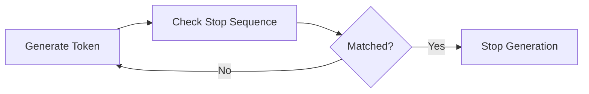

Stop sequences are particularly useful for:

- Structured generation
- Tool calls
- Multi-part responses
- Prompt templates
- Agent workflows

---

# 49. EOS Token

The **End-of-Sequence (EOS)** token tells the model that generation can stop.

Conceptually:

```text
Generated Tokens
      ↓
EOS
      ↓
Stop
```

A correctly configured EOS token is important for generation reliability.

---

# 50. Early Stopping

Generation may terminate when:

```text
EOS Token
```

or:

```text
Stop Sequence
```

is reached.

The system can also stop because:

```text
max_new_tokens
```

has been reached.

Therefore:

```text
Generation Stop Condition
=
EOS
OR
Stop Sequence
OR
Length Limit
OR
Application Rule
```

---

# 51. Deterministic Generation Configuration

For deterministic-style generation:

```python
outputs = model.generate(
    **inputs,
    do_sample=False,
    max_new_tokens=256,
)
```

The model will generally select tokens deterministically according to the decoding strategy.

---

# 52. Sampling Configuration

A sampling configuration might look like:

```python
outputs = model.generate(
    **inputs,
    do_sample=True,
    temperature=0.7,
    top_p=0.9,
    max_new_tokens=256,
)
```

This enables stochastic sampling.

---

# 53. Greedy Generation Example

```python
outputs = model.generate(
    **inputs,
    do_sample=False,
    max_new_tokens=128,
)
```

Use this style when:

```text
Predictability
+
Repeatability
```

are important.

---

# 54. Top-K Example

```python
outputs = model.generate(
    **inputs,
    do_sample=True,
    top_k=50,
    temperature=0.7,
    max_new_tokens=256,
)
```

This limits sampling to the top 50 candidate tokens at each generation step.

---

# 55. Top-P Example

```python
outputs = model.generate(
    **inputs,
    do_sample=True,
    top_p=0.9,
    temperature=0.7,
    max_new_tokens=256,
)
```

The candidate set dynamically changes according to the probability mass.

---

# 56. Hugging Face GenerationConfig

Hugging Face Transformers provides `GenerationConfig` for storing generation settings.

Example:

```python
from transformers import GenerationConfig

generation_config = GenerationConfig(
    max_new_tokens=256,
    temperature=0.7,
    top_p=0.9,
    do_sample=True,
)
```

This makes generation configuration explicit and reusable.

---

# 57. Production Generation Configuration

Do not scatter generation parameters throughout application code.

Prefer:

```text
GenerationConfig
        ↓
Model Adapter
        ↓
Inference Runtime
```

Example:

```yaml
generation:
  max_new_tokens: 512
  temperature: 0.2
  top_p: 0.9
  repetition_penalty: 1.05
```

Version these configurations like other production artifacts.

---

# 58. Task-Specific Generation Strategies

Different tasks require different decoding strategies.

| Task | Typical Strategy |
|---|---|
| Classification | Low randomness / deterministic |
| Information Extraction | Deterministic or very low temperature |
| JSON Generation | Low randomness + constraints |
| RAG QA | Low-to-moderate randomness |
| Summarization | Low-to-moderate randomness |
| Brainstorming | Moderate/high sampling |
| Creative Writing | Higher sampling |
| Tool Calling | Low randomness |
| Code Generation | Low/moderate randomness |
| Agent Planning | Usually controlled randomness |

These are starting points rather than universal rules.

---

# 59. Generation for RAG

In a RAG system:

```text
User Query
     ↓
Retriever
     ↓
Relevant Context
     ↓
LLM
     ↓
Generation
```

The goal is generally:

```text
Grounded
+
Faithful
+
Relevant
+
Concise
```

Therefore extremely high temperature is usually undesirable for factual enterprise RAG workloads.

---

# 60. RAG Generation Pipeline

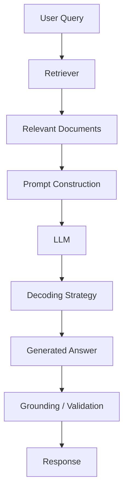

---

# 61. Generation for Enterprise Search

Enterprise search assistants often need:

```text
High Precision
+
Low Hallucination
+
Consistent Formatting
```

A common strategy is:

```text
Low Temperature
+
Strong Prompt Constraints
+
RAG
+
Citation / Evidence Validation
```

Generation strategy should support the retrieval architecture rather than compensate for poor retrieval.

---

# 62. Generation for Summarization

Summarization generally benefits from controlled generation.

Possible configuration:

```text
Low / Moderate Temperature
+
Appropriate max_new_tokens
+
Repetition Controls
```

Evaluation should include:

```text
Faithfulness
Coverage
Conciseness
Readability
```

---

# 63. Generation for Creative Writing

Creative tasks may benefit from:

```text
Temperature ↑
Top-P Sampling
```

The objective is:

```text
Diversity
+
Novelty
+
Coherence
```

But increasing randomness indefinitely does not guarantee quality.

---

# 64. Generation for Code

Code generation requires:

```text
Correctness
+
Syntax
+
Consistency
+
Instruction Following
```

Often:

```text
Lower Temperature
```

is preferred.

However, generating multiple candidates with controlled sampling can be useful for:

```text
Candidate Generation
+
Testing
+
Selection
```

---

# 65. Self-Consistency

For some reasoning workloads, multiple sampled outputs can be generated.

```text
Prompt
 ↓
Sample 1
 ↓
Sample 2
 ↓
Sample 3
 ↓
Sample N
 ↓
Aggregate / Select
```

Conceptually:

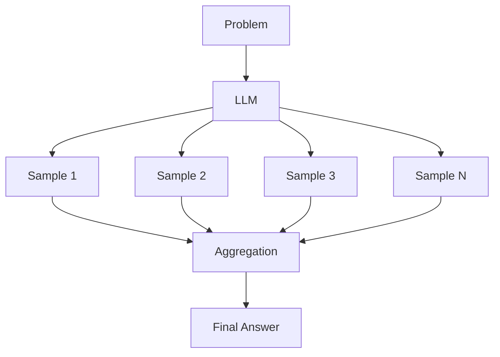

This can improve robustness for certain tasks but increases:

```text
Latency
+
Token Cost
+
Compute
```

---

# 66. Best-of-N Generation

Another strategy is:

```text
Generate N Candidates
      ↓
Evaluate Candidates
      ↓
Select Best
```

The evaluator can be:

- Rule-based
- Classifier
- Reward model
- LLM judge
- External validator
- Unit tests

Example:

```text
Generate 5 Code Solutions
        ↓
Run Tests
        ↓
Select Passing Solution
```

---

# 67. Candidate Generation Architecture

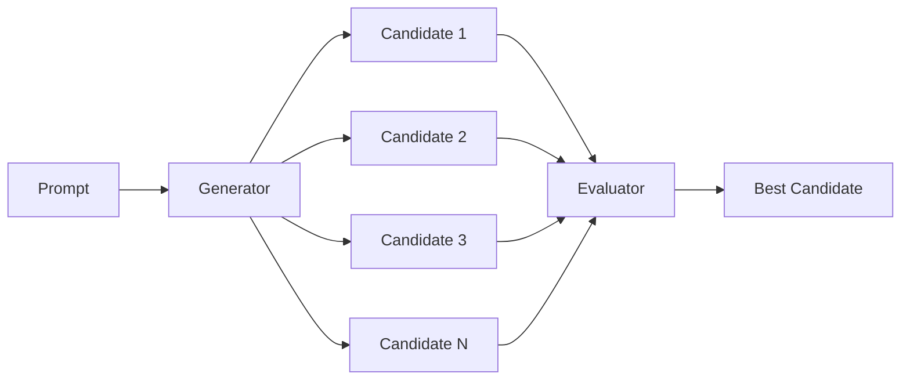

---

# 68. Constrained Decoding

Some applications require outputs to follow strict constraints.

Examples:

```text
JSON
SQL
Programming Language
Regular Grammar
Function Call
Schema
```

Instead of allowing arbitrary token generation:

```text
LLM
 ↓
Any Token
```

constrained decoding restricts:

```text
Allowed Tokens
```

at each step.

---

# 69. Structured Generation

Example schema:

```json
{
  "customer_id": "string",
  "intent": "string",
  "priority": "high|medium|low"
}
```

The generation system should enforce:

```text
Valid JSON
+
Required Fields
+
Allowed Values
```

This is much more reliable than relying only on a natural-language instruction.

---

# 70. Constrained Generation Architecture

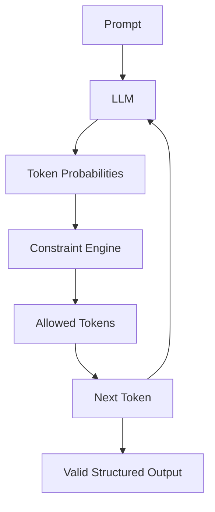

---

# 71. Grammar-Constrained Decoding

A grammar can define valid sequences.

Conceptually:

```text
JSON Grammar
      ↓
Allowed Token Paths
      ↓
LLM Generation
```

This can significantly improve structured-output reliability.

---

# 72. Tool Calling

Tool calling is another structured generation scenario.

The model may produce:

```json
{
  "name": "get_weather",
  "arguments": {
    "city": "Kolkata"
  }
}
```

The application then:

```text
Validates Tool Call
       ↓
Executes Tool
       ↓
Returns Result
       ↓
Continues Generation
```

---

# 73. Tool Calling Generation Loop

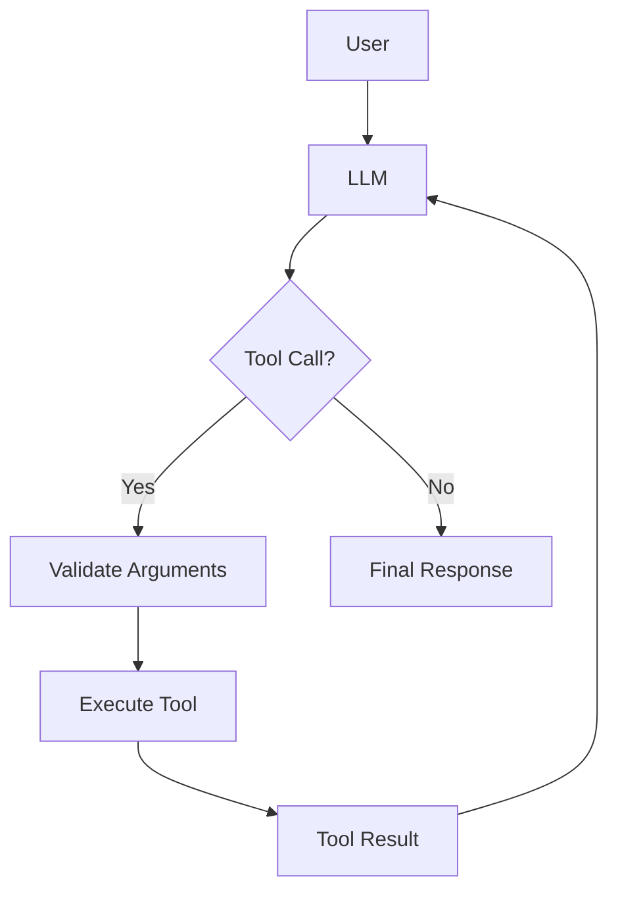

---

# 74. Generation in Agentic AI

Agentic systems repeatedly invoke models.

```text
Observe
 ↓
Reason / Plan
 ↓
Act
 ↓
Observe Result
 ↓
Continue
```

Generation strategy must therefore control:

```text
Tool Selection
Argument Validity
Planning
Output Format
Stopping
```

A small generation error can propagate through multiple steps.

---

# 75. Agent Stop Conditions

Agents need explicit stop conditions.

Possible conditions:

```text
Final Answer
Tool Result
Maximum Steps
Timeout
Budget Exhaustion
Safety Block
Task Completion
```

Example:

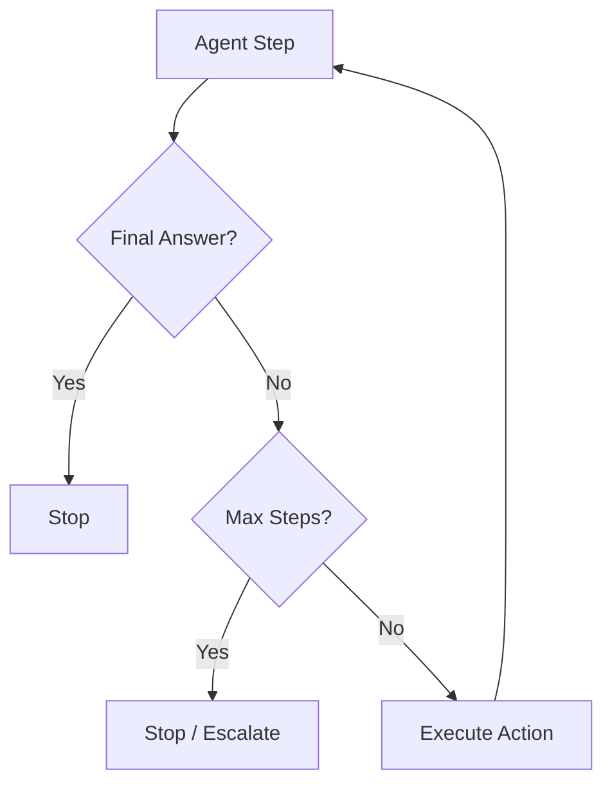

---

# 76. Streaming Generation

LLMs can stream generated tokens as they are produced.

Without streaming:

```text
Request
   ↓
Generate Entire Response
   ↓
Return Response
```

With streaming:

```text
Request
   ↓
Token 1
 ↓
Token 2
 ↓
Token 3
 ↓
...
```

---

# 77. Streaming Architecture

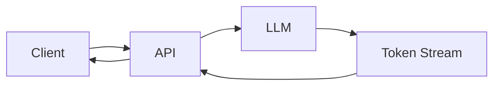

Streaming improves perceived responsiveness because users do not need to wait for the entire response.

---

# 78. Time to First Token

**TTFT — Time To First Token** measures how long the system takes to produce the first generated token.

```text
TTFT
=
Request Start
→
First Output Token
```

Low TTFT is important for interactive applications.

---

# 79. Time Per Output Token

**TPOT — Time Per Output Token** measures the time required to generate subsequent tokens.

Conceptually:

```text
TTFT
+
Token-by-Token Decode Speed
```

Together they strongly influence perceived generation latency.

---

# 80. Prefill vs Decode

LLM generation can be divided into:

## Prefill

The model processes the input prompt.

```text
Prompt
 ↓
Transformer
 ↓
KV Cache
```

## Decode

The model generates tokens one at a time.

```text
Token
 ↓
Transformer
 ↓
Next Token
 ↓
Repeat
```

---

# 81. Prefill and Decode Architecture

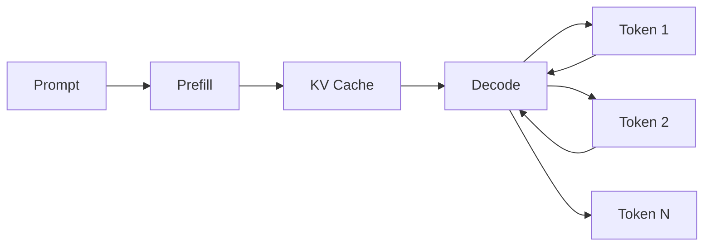

This distinction is important for performance engineering.

---

# 82. KV Cache

The Transformer repeatedly computes attention over prior tokens.

The KV cache stores previously computed:

```text
Keys
Values
```

so the model does not need to recompute them from scratch for every generated token.

Conceptually:

```text
Previous Tokens
      ↓
K/V
      ↓
Cache
      ↓
Next Token Generation
```

---

# 83. Why KV Cache Matters

Without KV cache:

```text
Generation Step N
→ Recompute Previous Context
```

With KV cache:

```text
Generation Step N
→ Reuse Cached K/V
```

This significantly improves autoregressive decoding efficiency.

---

# 84. KV Cache Memory

KV cache grows with:

```text
Context Length
+
Number of Layers
+
Number of Attention Heads
+
Head Dimension
+
Batch Size
+
Concurrency
```

Therefore:

```text
Long Context
+
High Concurrency
```

can create substantial memory pressure even when model weights are quantized.

---

# 85. Speculative Decoding

**Speculative decoding** uses a smaller draft model to propose tokens that a larger model verifies.

Architecture:

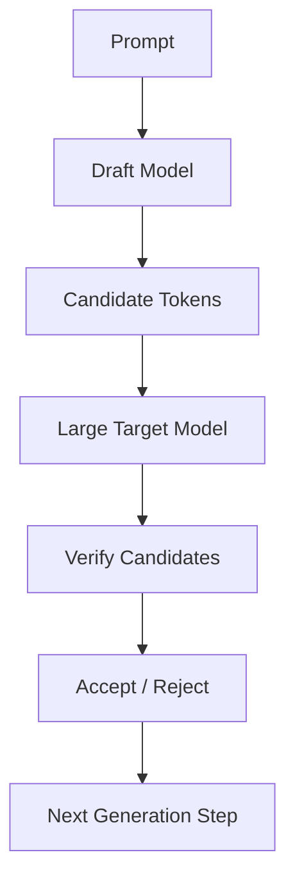

The goal is to improve generation speed without changing the target model's output distribution when implemented correctly.

---

# 86. Speculative Decoding Concept

Instead of:

```text
Large Model
 ↓
Token 1
 ↓
Large Model
 ↓
Token 2
 ↓
Large Model
```

use:

```text
Small Model
 ↓
Propose Multiple Tokens
 ↓
Large Model
 ↓
Verify
```

If many proposed tokens are accepted:

```text
More Tokens
per Target-Model Step
```

which can improve throughput or reduce latency.

---

# 87. Speculative Decoding Trade-Offs

Advantages:

- Potentially lower latency
- Better utilization of target model
- Useful for autoregressive generation

Trade-offs:

- Requires compatible draft model
- Additional infrastructure complexity
- Acceptance rate matters
- Performance depends on hardware and workload

---

# 88. Generation and Quantization

Generation strategy and model quantization are different concerns.

```text
Quantization
→ How Model Weights Are Represented

Generation Strategy
→ How Next Tokens Are Selected
```

They can be combined:

```text
Quantized LLM
+
Top-P Sampling
```

or:

```text
Quantized LLM
+
Greedy Decoding
```

---

# 89. Generation and LoRA

Similarly:

```text
LoRA
→ How Model Is Adapted

Generation
→ How Model Produces Output
```

A LoRA-adapted model can use:

```text
Greedy
Sampling
Top-P
Top-K
Beam Search
```

depending on the application.

---

# 90. Generation and RAG

```text
RAG
→ Supplies Context

Generation Strategy
→ Produces Response
```

Therefore:

```text
Retrieval Quality
+
Prompt Quality
+
Generation Strategy
```

all contribute to final answer quality.

---

# 91. Hallucination and Generation

Higher randomness can sometimes increase the likelihood of unsupported content.

However:

```text
Hallucination
≠
Only a Temperature Problem
```

Hallucinations can result from:

- Missing knowledge
- Poor retrieval
- Ambiguous prompts
- Model limitations
- Training data
- Decoding strategy

Therefore lowering temperature alone is not a complete hallucination strategy.

---

# 92. Grounded Generation

A production RAG system should use:

```text
Retrieval
+
Prompt Constraints
+
Generation Controls
+
Post-Generation Validation
```

Architecture:

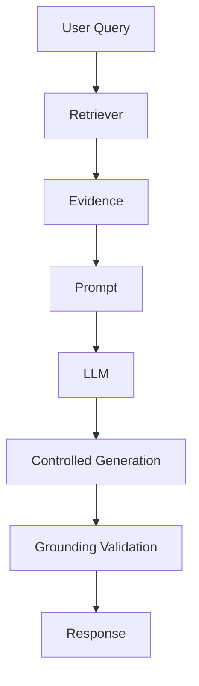

---

# 93. Generation Evaluation

Generation quality should not be measured only by:

```text
Exact Match
```

Possible metrics include:

- BLEU
- ROUGE
- METEOR
- BERTScore
- Perplexity
- Task-specific accuracy
- Human evaluation
- LLM-as-a-judge
- Faithfulness
- Groundedness
- JSON validity
- Tool-call accuracy

The correct metric depends on the task.

---

# 94. Deterministic Evaluation

For reproducible benchmarking:

```text
Temperature
→ Controlled

Sampling
→ Disabled where appropriate

Seed
→ Controlled where supported
```

This makes comparisons between model versions more meaningful.

---

# 95. Stochastic Evaluation

For creative or sampling-based systems, a single output may not represent the full behavior.

Evaluate:

```text
Multiple Runs
```

and measure:

```text
Average Quality
Variance
Failure Rate
Diversity
```

This is especially useful for:

- Creative generation
- Agentic workflows
- Candidate generation
- Self-consistency

---

# 96. Generation Quality vs Diversity

There is often a trade-off:

```text
More Deterministic
        ↓
Higher Consistency
        ↓
Lower Diversity
```

while:

```text
More Randomness
        ↓
Higher Diversity
        ↓
Potentially Lower Consistency
```

The correct point depends on the business task.

---

# 97. Generation Strategy Matrix

| Strategy | Determinism | Diversity | Compute | Typical Use |
|---|---|---|---|---|
| Greedy | High | Low | Low | Extraction |
| Beam Search | High | Low/Medium | Higher | Sequence tasks |
| Temperature | Variable | Variable | Low | General sampling |
| Top-K | Variable | Medium | Low | Controlled sampling |
| Top-P | Variable | Medium/High | Low | General generation |
| Typical | Variable | Medium | Low/Medium | Alternative sampling |
| Best-of-N | Low | High | High | Candidate selection |
| Speculative | Depends | Depends | More complex | Speed optimization |

---

# 98. Task-to-Strategy Mapping

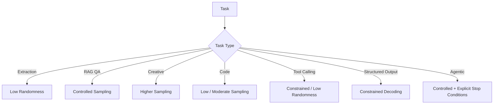

---

# 99. Generation Configuration as a Product Contract

Production systems should treat generation configuration as part of the model behavior.

Example:

```yaml
model:
  name: enterprise-llm
  version: "3.2"

generation:
  strategy: top_p
  temperature: 0.2
  top_p: 0.9
  max_new_tokens: 512
  repetition_penalty: 1.05

stopping:
  eos_token: true
  stop_sequences:
    - "<END>"
```

Changing these values can change user-visible behavior.

Therefore they should be version-controlled.

---

# 100. Per-Task Generation Profiles

Instead of one global configuration:

```yaml
generation:
  temperature: 0.7
```

use task-specific profiles.

Example:

```yaml
profiles:

  extraction:
    temperature: 0.0
    max_new_tokens: 256

  rag:
    temperature: 0.2
    top_p: 0.9
    max_new_tokens: 512

  creative:
    temperature: 0.8
    top_p: 0.95
    max_new_tokens: 1024

  tool_calling:
    temperature: 0.0
    max_new_tokens: 256
```

This is often more appropriate for enterprise systems.

---

# 101. Generation Provider Interface

In a cloud-native application, generation configuration can be abstracted behind an interface.

```java
public interface LLMProvider {

    GenerationResult generate(
        GenerationRequest request
    );
}
```

Example request:

```java
public record GenerationRequest(
    String prompt,
    GenerationConfig config
) {}
```

This keeps application logic independent from a particular model runtime.

---

# 102. Generation Adapter

Architecture:

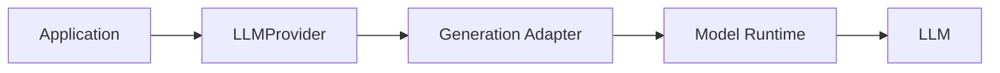

The adapter can translate:

```text
Enterprise GenerationConfig
```

into:

```text
Hugging Face
vLLM
TensorRT-LLM
Cloud Model API
```

specific parameters.

---

# 103. Provider-Agnostic GenerationConfig

A useful abstraction might include:

```java
public record GenerationConfig(
    Integer maxNewTokens,
    Double temperature,
    Double topP,
    Integer topK,
    Double repetitionPenalty,
    Boolean doSample,
    Integer numBeams
) {}
```

Provider-specific features should remain optional or capability-driven.

---

# 104. Capability-Based Generation

Not every provider supports every generation feature.

For example:

```text
Provider A
→ Top-P
→ Temperature

Provider B
→ Top-P
→ Temperature
→ Grammar Constraints

Provider C
→ Tool Calling
→ Structured Output
```

Therefore:

```text
LLMProvider
+
Capability Discovery
```

is often better than assuming universal support.

---

# 105. Generation Configuration Validation

Before sending a request:

```text
Validate:
```

- Temperature range
- Top-P range
- Top-K validity
- Token limits
- Beam count
- Stop sequences
- Model context window
- Provider capabilities

Example:

```java
if (config.temperature() != null
        && config.temperature() < 0) {
    throw new IllegalArgumentException(
        "Temperature must be non-negative"
    );
}
```

---

# 106. Context Window and Generation Length

A model has a maximum context window.

Conceptually:

```text
Input Tokens
+
Generated Tokens
≤
Context Window
```

Therefore:

```text
max_new_tokens
```

must be considered alongside input length.

Example:

```text
Context Window = 8192

Input = 7000 tokens

Maximum remaining output ≈ 1192 tokens
```

Actual runtime behavior depends on the model and serving system.

---

# 107. Context Budget

A production application should explicitly manage the token budget.

```text
Context Window
      ↓
System Prompt
+
User Prompt
+
Retrieved Context
+
Conversation History
+
Output Budget
```

Architecture:

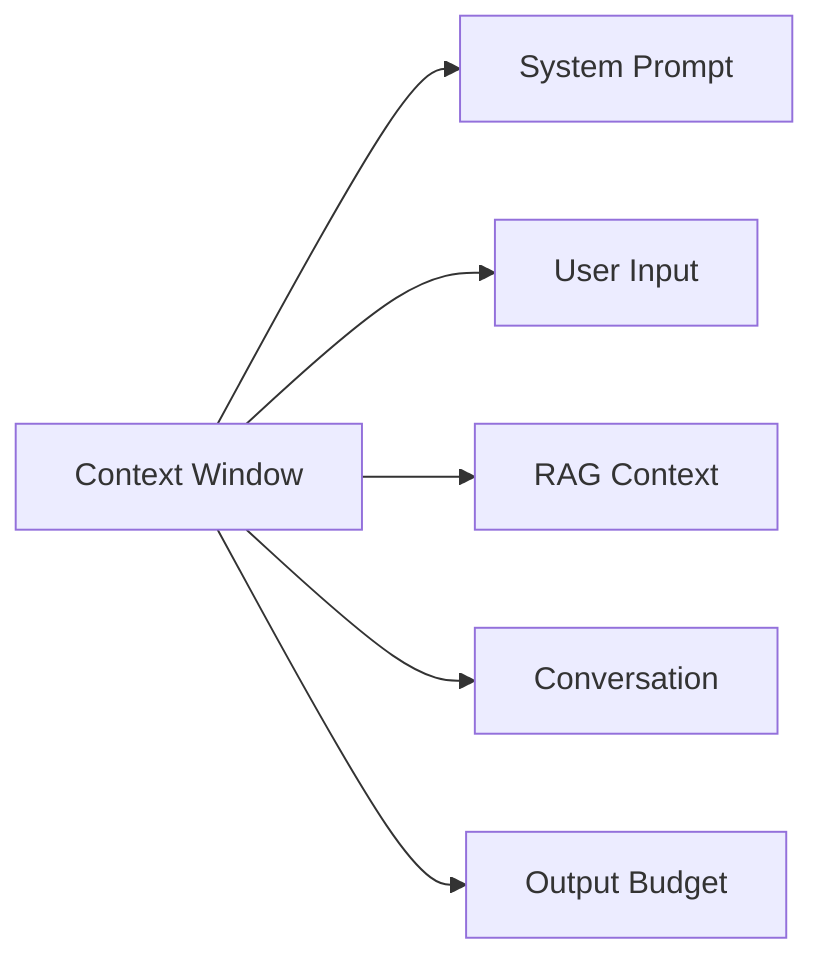

This is critical for RAG and agentic systems.

---

# 108. Dynamic Max Tokens

Instead of always setting:

```text
max_new_tokens = 2048
```

calculate an appropriate output budget from:

```text
Context Window
-
Current Input Tokens
```

This avoids unnecessary context overflow.

---

# 109. Generation and Cost

Generation cost is heavily influenced by:

```text
Input Tokens
+
Output Tokens
```

Therefore:

```text
max_new_tokens
```

is not only a quality parameter.

It is also:

```text
A Cost-Control Parameter
```

---

# 110. Generation and Latency

More generated tokens generally mean:

```text
More Decode Steps
      ↓
Higher Latency
```

Therefore:

```text
Output Length
```

is one of the simplest ways to control latency.

---

# 111. Generation and Concurrency

At high concurrency:

```text
Requests ↑
      ↓
KV Cache ↑
      ↓
GPU Memory Pressure ↑
```

Therefore generation configuration must be designed together with:

```text
Concurrency
+
Batching
+
KV Cache
+
Context Length
```

---

# 112. Continuous Batching

Modern inference engines can combine requests dynamically.

Conceptually:

```mermaid
flowchart TD
    A["Request 1"] --> D["Continuous Batching"]
    B["Request 2"] --> D
    C["Request 3"] --> D
    D --> E["GPU Inference"]
    E --> F["Token Streams"]
```

This improves GPU utilization in high-throughput serving environments.

---

# 113. Generation and Batching

Batching can improve throughput:

```text
Single Request
→ Lower Utilization

Multiple Requests
→ Better GPU Utilization
```

But interactive workloads care about:

```text
Latency
```

while batch workloads care more about:

```text
Throughput
```

Therefore optimize according to the workload.

---

# 114. Streaming vs Non-Streaming

## Streaming

Advantages:

- Lower perceived latency
- Better interactive UX
- Immediate token delivery

Disadvantages:

- More complex client/server handling
- Partial responses
- More complicated error handling

## Non-Streaming

Advantages:

- Simple API
- Easier response validation
- Easier batch processing

Disadvantages:

- Higher perceived latency

---

# 115. Production Streaming Architecture

```mermaid
sequenceDiagram
    participant U as User
    participant A as API
    participant L as LLM

    U->>A: Generate Request
    A->>L: Generation Request
    L-->>A: Token 1
    A-->>U: Token 1
    L-->>A: Token 2
    A-->>U: Token 2
    L-->>A: Token N
    A-->>U: Token N
    L-->>A: EOS
    A-->>U: Complete
```

Streaming protocols may use:

```text
SSE
WebSocket
HTTP Streaming
gRPC Streaming
```

depending on the application architecture.

---

# 116. Generation Timeout

Production generation should have explicit timeouts.

```text
Request
 ↓
Generation
 ↓
Timeout?
```

Possible actions:

```text
Retry
Fallback
Cancel
Return Partial Output
Escalate
```

Do not allow unlimited generation.

---

# 117. Retry Strategy

Retries must be designed carefully.

A failed generation request can be retried when:

```text
Transient Infrastructure Failure
```

But blindly retrying:

```text
Model Quality Failure
```

may not help.

For stochastic generation, retrying may produce a different result, but this should be intentional.

---

# 118. Fallback Models

Production systems can use fallback models.

```mermaid
flowchart TD
    A["Request"] --> B["Primary Model"]
    B --> C{"Available?"}
    C -->|Yes| D["Response"]
    C -->|No| E["Fallback Model"]
    E --> D
```

Fallback decisions may depend on:

- Timeout
- Capacity
- Provider outage
- Cost
- Model health

---

# 119. Generation Guardrails

Generation should be surrounded by guardrails.

```text
Input Guardrail
      ↓
LLM
      ↓
Output Guardrail
      ↓
Response
```

Possible controls:

- PII filtering
- Toxicity detection
- Schema validation
- Grounding validation
- Policy enforcement
- Tool authorization

---

# 120. Output Validation

For production systems:

```text
Generated Output
      ↓
Validate
      ↓
Accept / Reject / Repair
```

Examples:

```text
JSON Schema
SQL Parser
Code Compiler
Business Rules
Citation Validator
Tool Schema
```

This is often more reliable than relying only on generation settings.

---

# 121. Self-Repair Generation

If output fails validation:

```text
Generate
 ↓
Validate
 ↓
Failure
 ↓
Repair Prompt
 ↓
Generate Again
```

Architecture:

```mermaid
flowchart TD
    A["LLM Generation"] --> B["Validator"]
    B --> C{"Valid?"}
    C -->|Yes| D["Return"]
    C -->|No| E["Repair / Retry"]
    E --> A
```

A maximum retry count should be enforced.

---

# 122. Generation Budgets

Production systems should define budgets for:

```text
Tokens
Latency
Retries
Agent Steps
GPU Time
Cost
```

Example:

```yaml
budget:
  max_output_tokens: 512
  max_retries: 2
  timeout_ms: 30000
  max_agent_steps: 8
```

This prevents uncontrolled generation.

---

# 123. Generation Observability

Log or measure:

```text
Model
Model Version
Generation Profile
Temperature
Top-P
Top-K
Max Tokens
Input Tokens
Output Tokens
TTFT
TPOT
Total Latency
Finish Reason
Error
```

Avoid logging sensitive prompts or outputs unless appropriate data-governance controls are in place.

---

# 124. Generation Tracing

Distributed tracing can connect:

```text
API Request
    ↓
Prompt Construction
    ↓
Retriever
    ↓
LLM Generation
    ↓
Tool Call
    ↓
Validator
    ↓
Response
```

This makes it possible to identify whether failures come from:

```text
Retrieval
Generation
Tooling
Validation
Infrastructure
```

---

# 125. Generation Failure Taxonomy

Common failures:

## Model-Level

- Hallucination
- Repetition
- Poor reasoning
- Incorrect tool call

## Decoding-Level

- Excessive randomness
- Overly deterministic output
- Repetition
- Premature stopping

## Context-Level

- Context overflow
- Poor retrieved context
- Missing information

## Infrastructure-Level

- Timeout
- OOM
- GPU saturation
- Runtime failure

---

# 126. Debugging Generation Quality

Use this sequence:

```text
1. Validate Prompt
        ↓
2. Validate Input Tokens
        ↓
3. Validate Model
        ↓
4. Validate Generation Config
        ↓
5. Validate Retrieved Context
        ↓
6. Compare Deterministic Output
        ↓
7. Compare Sampling Output
        ↓
8. Evaluate Multiple Runs
```

This isolates decoding issues from model and data issues.

---

# 127. Common Mistake — High Temperature for Factual QA

Bad assumption:

```text
Higher Temperature
=
Better Answer
```

For factual enterprise workloads, excessive randomness can reduce consistency.

Prefer:

```text
Grounded Context
+
Controlled Generation
```

---

# 128. Common Mistake — Temperature 0 Means Zero Hallucination

Temperature controls sampling behavior.

It does not guarantee:

```text
Truth
```

A deterministic model can confidently produce incorrect information.

Therefore:

```text
Temperature
≠
Truthfulness
```

---

# 129. Common Mistake — Using Top-K and Top-P Without Understanding Interaction

Using multiple sampling filters changes the candidate distribution.

Example:

```text
Temperature
      ↓
Top-K
      ↓
Top-P
      ↓
Sampling
```

The resulting behavior depends on implementation order and runtime.

Test configurations empirically rather than assuming their effects are independent.

---

# 130. Common Mistake — Excessive max_new_tokens

Setting:

```text
max_new_tokens = 4096
```

does not mean the model should generate 4096 tokens.

It creates a larger maximum budget.

Excessive budgets can increase:

```text
Latency
Cost
Risk of Rambling
```

Use task-specific limits.

---

# 131. Common Mistake — No Stop Condition

Without appropriate stopping:

```text
Model
 ↓
Keeps Generating
```

until:

```text
max_new_tokens
```

is reached.

For structured or agentic systems, explicit stop conditions are essential.

---

# 132. Common Mistake — One Generation Config for Every Task

A single configuration:

```yaml
temperature: 0.7
top_p: 0.9
```

for every application is rarely optimal.

Instead:

```text
Extraction Profile
RAG Profile
Creative Profile
Code Profile
Tool Profile
Agent Profile
```

---

# 133. Common Mistake — Ignoring Context Window

If:

```text
Input + Output > Context Window
```

generation can fail, truncate, or behave unexpectedly depending on the runtime.

Always calculate:

```text
Available Output Budget
=
Context Window
-
Input Tokens
```

---

# 134. Common Mistake — Ignoring Streaming Backpressure

Streaming systems must handle:

```text
Slow Client
Network Delay
Disconnected Client
Server Buffer
```

Production streaming needs:

```text
Cancellation
Timeout
Backpressure
Connection Management
```

---

# 135. Common Mistake — Logging Sensitive Output

LLM outputs may contain:

```text
PII
Secrets
Customer Information
Internal Documents
```

Therefore observability systems should implement:

```text
Redaction
Access Control
Retention Policies
Encryption
```

---

# 136. Production Workflow

A production-grade generation workflow:

```mermaid
flowchart TD
    A["User Request"] --> B["Input Validation"]
    B --> C["Prompt Construction"]
    C --> D["Context / RAG"]
    D --> E["Generation Profile"]
    E --> F["LLM Runtime"]
    F --> G["Streaming / Response"]
    G --> H["Output Validation"]
    H --> I{"Valid?"}
    I -->|Yes| J["Return"]
    I -->|No| K["Repair / Fallback"]
    K --> F
    J --> L["Observability"]
```

The workflow should include:

- Input validation
- Context management
- Generation configuration
- Model invocation
- Output validation
- Retry/fallback
- Observability
- Cost tracking

---

# 137. Production Generation Architecture

A cloud-native enterprise architecture:

```mermaid
flowchart TD
    A["Client"] --> B["API Gateway"]
    B --> C["Spring Boot AI Service"]

    C --> D["Prompt Service"]
    C --> E["RAG Service"]
    C --> F["Generation Policy"]

    D --> G["LLM Gateway"]
    E --> G
    F --> G

    G --> H["Model Router"]
    H --> I["Quantized LLM"]
    H --> J["Cloud LLM"]
    H --> K["Fallback Model"]

    I --> L["Output Guardrails"]
    J --> L
    K --> L

    L --> M["Response"]
    C --> N["Observability"]
```

---

# 138. Generation Policy Layer

An enterprise system can introduce a policy layer:

```text
Request
 ↓
Task Classification
 ↓
Generation Policy
 ↓
Model + Configuration
```

Example:

```yaml
policy:
  task: document_extraction
  temperature: 0.0
  max_new_tokens: 256
  structured_output: true
```

This prevents individual services from arbitrarily changing model behavior.

---

# 139. Multi-Model Generation Routing

Different tasks can use different models.

```mermaid
flowchart TD
    A["Request"] --> B["Model Router"]

    B --> C["Small Fast Model"]
    B --> D["General Model"]
    B --> E["Large Reasoning Model"]

    C --> F["Response"]
    D --> F
    E --> F
```

Routing can consider:

```text
Task
Complexity
Latency SLA
Cost
Security
Context Length
```

---

# 140. Generation Cost Routing

Example policy:

```text
Simple Request
→ Small Model

Normal Request
→ Medium Model

Complex Request
→ Large Model
```

This can reduce cost while maintaining quality.

---

# 141. Generation Strategy and SLA

Generation configuration should be aligned with:

```text
SLA
```

For example:

```text
Interactive Chat
→ Low TTFT

Batch Summarization
→ High Throughput

Enterprise Extraction
→ High Accuracy

Creative Application
→ High Diversity
```

One generation strategy cannot optimize all objectives simultaneously.

---

# 142. Generation Benchmark

A proper benchmark should include:

```text
Task Quality
+
Latency
+
Throughput
+
Memory
+
Cost
+
Failure Rate
```

Example:

| Configuration | Quality | TTFT | TPOT | Memory | Cost |
|---|---:|---:|---:|---:|---:|
| Greedy | Measure | Measure | Measure | Measure | Measure |
| Temp 0.2 | Measure | Measure | Measure | Measure | Measure |
| Top-P 0.9 | Measure | Measure | Measure | Measure | Measure |
| Best-of-N | Measure | Measure | Measure | Measure | Measure |

---

# 143. Experimental Methodology

When comparing decoding strategies:

```text
Same Model
+
Same Dataset
+
Same Prompt
+
Same Context
+
Same Hardware
```

Change only:

```text
Generation Strategy
```

Then compare:

```text
Quality
Latency
Token Count
Failure Rate
```

This produces a meaningful comparison.

---

# 144. Generation Strategy Selection

A practical engineering process:

```text
1. Define Task
        ↓
2. Define Quality Metric
        ↓
3. Define Latency SLA
        ↓
4. Define Cost Budget
        ↓
5. Establish Baseline
        ↓
6. Test Decoding Strategies
        ↓
7. Evaluate
        ↓
8. Select Configuration
        ↓
9. Deploy
        ↓
10. Monitor
```

---

# 145. Enterprise Generation Checklist

```text
[ ] Task Defined
[ ] Baseline Established
[ ] Generation Strategy Selected
[ ] Temperature Tuned
[ ] Top-P / Top-K Evaluated
[ ] Output Length Defined
[ ] Stop Conditions Defined
[ ] Context Budget Defined
[ ] Structured Output Validated
[ ] Tool Calling Tested
[ ] Streaming Tested
[ ] Timeout Defined
[ ] Retry Policy Defined
[ ] Fallback Defined
[ ] Token Cost Measured
[ ] Latency Measured
[ ] Quality Measured
[ ] Safety Tested
[ ] Observability Enabled
```

---

# 146. Interview Questions

## Beginner

- What is autoregressive generation?
- What is decoding?
- What are logits?
- How are logits converted into probabilities?
- What is greedy decoding?
- What is beam search?
- What is temperature?
- What is Top-K sampling?
- What is Top-P sampling?
- What is an EOS token?
- What is `max_new_tokens`?

## Intermediate

- Greedy vs sampling?
- Greedy vs beam search?
- Temperature vs Top-P?
- Top-K vs Top-P?
- Why can high temperature produce unstable outputs?
- What is repetition penalty?
- Frequency penalty vs presence penalty?
- Why are stop sequences important?
- What is constrained decoding?
- Why is streaming useful?
- What is TTFT?
- What is TPOT?
- What is KV cache?
- Why does KV cache improve autoregressive generation?
- What is speculative decoding?

## Advanced

- How would you design generation policies for an enterprise AI platform?
- How would you tune generation for RAG?
- How would you tune generation for tool calling?
- How would you optimize generation latency?
- How would you design a multi-model generation router?
- How would you evaluate sampling strategies?
- How would you implement structured-output validation?
- How would you design generation observability?
- How would you control token costs?
- How would you combine quantization with generation optimization?
- How would you design generation fallback strategies?
- How would you handle context-window constraints?
- How would you optimize high-concurrency generation?
- How would you design speculative decoding infrastructure?
- How would you prevent runaway agent generation?

---

# 147. Scenario-Based Interview Questions

## Scenario 1 — RAG Answers Are Too Creative

Problem:

```text
RAG Context Is Correct
But Answers Are Unstable
```

Investigate:

```text
Temperature
Top-P
Prompt
Retrieval Quality
```

Try controlled generation:

```text
Low Temperature
+
Grounded Prompt
+
Output Validation
```

---

## Scenario 2 — JSON Output Is Invalid

Do not immediately increase or decrease temperature.

Use:

```text
Structured Output
+
Schema Validation
+
Constrained Decoding
```

where supported.

Fallback:

```text
Generate
 ↓
Validate
 ↓
Repair
 ↓
Retry
```

---

## Scenario 3 — Chatbot Latency Is Too High

Investigate:

```text
TTFT
TPOT
Input Tokens
Output Tokens
Model Size
KV Cache
Batching
GPU Utilization
```

Potential optimizations:

```text
Reduce Prompt Size
+
Reduce Output Budget
+
Quantize Model
+
Use Faster Runtime
+
Use Continuous Batching
+
Use Speculative Decoding
```

---

## Scenario 4 — Model Repeats Itself

Investigate:

```text
Repetition Penalty
Temperature
Top-P
Prompt
Training Data
Max Output Length
```

Do not assume the decoding configuration is the only cause.

---

## Scenario 5 — Agent Runs Forever

Implement explicit:

```text
Maximum Steps
+
Timeout
+
Budget
+
Final-Answer Condition
+
Tool Failure Limit
```

Example:

```text
Agent
 ↓
Step 1
 ↓
Step 2
 ↓
...
 ↓
Step 8
 ↓
Maximum Steps
 ↓
Stop
```

---

# 148. 🚀 Quick Revision Sheet

## Generation

```text
Prompt
 ↓
Transformer
 ↓
Logits
 ↓
Probabilities
 ↓
Decoding
 ↓
Next Token
 ↓
Repeat
```

## Deterministic

- Greedy
- Beam Search

## Sampling

- Temperature
- Top-K
- Top-P
- Top-A
- Typical Sampling

## Control

- Repetition Penalty
- Frequency Penalty
- Presence Penalty
- `max_new_tokens`
- EOS
- Stop Sequences

## Advanced

- Constrained Decoding
- Structured Generation
- Best-of-N
- Self-Consistency
- Speculative Decoding
- Streaming
- KV Cache

## Production

```text
Generation Policy
 ↓
Model Router
 ↓
LLM
 ↓
Validation
 ↓
Streaming
 ↓
Observability
```

---

# 149. Remember

> **LLMs generate text by repeatedly predicting the next token, while decoding strategies determine how those token probabilities are converted into actual output.**

Remember the core pipeline:

```text
Logits
 ↓
Probability Distribution
 ↓
Decoding Strategy
 ↓
Next Token
```

And:

```text
Greedy
→ Highest Probability Token

Temperature
→ Changes Distribution Sharpness

Top-K
→ Fixed Candidate Count

Top-P
→ Probability-Mass-Based Candidate Set
```

For production systems:

```text
Generation Strategy
+
Context Management
+
Output Validation
+
Observability
+
Cost Controls
```

must be designed together.

---

# 150. Key Takeaways

- LLMs typically generate text autoregressively, one token at a time.
- Transformer outputs logits that are converted into token probabilities.
- Decoding determines how the next token is selected.
- Greedy decoding selects the highest-probability token.
- Beam search maintains multiple candidate sequences.
- Temperature controls the sharpness of the probability distribution.
- Lower temperature generally produces more deterministic behavior.
- Higher temperature generally increases sampling diversity.
- Top-K sampling restricts generation to a fixed number of high-probability candidates.
- Top-P sampling dynamically selects candidates based on cumulative probability.
- Top-A and typical sampling provide alternative adaptive decoding strategies.
- Repetition penalties can discourage repeated tokens.
- Frequency penalties depend on token occurrence frequency.
- Presence penalties discourage reuse of previously seen tokens.
- `max_new_tokens` provides an explicit output-token budget.
- EOS tokens and stop sequences provide important termination controls.
- Constrained decoding is useful for structured output, JSON, tool calling, and grammar-based generation.
- Streaming reduces perceived latency by returning generated tokens incrementally.
- TTFT measures time to the first generated token.
- TPOT measures the time required for subsequent generated tokens.
- Prefill processes the input context while decode generates tokens autoregressively.
- KV cache improves generation efficiency by reusing attention key/value states.
- KV cache can become a major memory consumer for long-context and high-concurrency workloads.
- Speculative decoding uses a draft model to propose tokens that a target model verifies.
- Best-of-N and self-consistency can improve robustness at the cost of additional compute.
- Generation settings should be task-specific rather than globally fixed.
- RAG applications generally benefit from controlled, grounded generation.
- Creative applications may benefit from higher sampling diversity.
- Tool calling and structured generation generally require controlled decoding and strong validation.
- Temperature does not guarantee truthfulness or eliminate hallucinations.
- Generation quality depends on model quality, context, prompting, retrieval, decoding, and validation.
- Generation configuration should be version-controlled as part of model behavior.
- Production systems should explicitly manage token, latency, retry, agent-step, and cost budgets.
- Generation should be monitored using latency, throughput, token usage, quality, errors, and cost.
- Quantization, LoRA, RAG, and generation strategies solve different problems and can be combined.
- Enterprise AI systems should isolate generation configuration behind provider and inference abstractions.
- Generation policies can route different tasks to different models and decoding profiles.
- The best generation strategy is the one that satisfies the application's quality, latency, reliability, and cost requirements.

---

# 151. Chapter Navigation

## Previous Chapter

[14. Model Quantization](14-model-quantization.md)

## Current Chapter

**15. LLM Generation Strategies**

## Next Chapter

[16. LLM Evaluation](16-llm-evaluation.md)

## Related Chapters

- [01. Generative AI Fundamentals](01-generative-ai-fundamentals.md)
- [02. Language Understanding Fundamentals](02-language-understanding-fundamentals.md)
- [03. Word Embeddings](03-word-embeddings.md)
- [04. Language Modeling](04-language-modeling.md)
- [05. Attention and Positional Encoding](05-attention-and-positional-encoding.md)
- [06. GPT and BERT Architecture](06-gpt-and-bert-architecture.md)
- [07. Hugging Face and Transformers](07-huggingface-and-transformers.md)
- [08. LLM Data Preparation](08-llm-data-preparation.md)
- [09. Hugging Face Training Workflow](09-huggingface-training-workflow.md)
- [10. Transformer Fine-Tuning Fundamentals](10-transformer-fine-tuning-fundamentals.md)
- [11. Supervised Fine-Tuning (SFT)](11-supervised-fine-tuning-sft.md)
- [12. Parameter-Efficient Fine-Tuning (PEFT)](12-parameter-efficient-fine-tuning.md)
- [13. LoRA and QLoRA](13-lora-and-qlora.md)
- [14. Model Quantization](14-model-quantization.md)
- [16. LLM Evaluation](16-llm-evaluation.md)

---

# References

- Vaswani et al. — *Attention Is All You Need*
- Hugging Face Transformers Documentation
- Hugging Face Generation Strategies Documentation
- Hugging Face GenerationConfig Documentation
- Hugging Face Text Generation Inference Documentation
- vLLM Documentation
- NVIDIA TensorRT-LLM Documentation
- PyTorch Documentation
- Holtzman et al. — *The Curious Case of Neural Text Degeneration*
- Meister et al. — *Locally Typical Sampling*
- Li et al. — *Contrastive Search Is What You Need for Neural Text Generation*
- Leviathan et al. — *Fast Inference from Transformers via Speculative Decoding*
- Stern et al. — *Blockwise Parallel Decoding for Deep Autoregressive Models*
- Wolf et al. — *Transformers: State-of-the-Art Natural Language Processing*
- Speech and Language Processing — Jurafsky & Martin

---

> **Enterprise AI Engineering Handbook**  
> *Building Production-Grade Enterprise AI Systems — One Chapter at a Time.*