# 18 — Reward Modeling

> A practical, production-oriented guide to **Reward Modeling for Large Language Models (LLMs)**, covering human preferences, reward functions, preference datasets, pairwise comparisons, reward model architecture, Bradley-Terry modeling, preference labeling, data quality, reward model training, scoring, ranking, reward hacking, Goodhart's Law, RLHF, PPO, DPO relationship, rejection sampling, Constitutional AI concepts, evaluation, safety, enterprise AI applications, Hugging Face implementation concepts, production architecture, monitoring, common failure modes, interview questions, and engineering best practices.

---

# 1. Overview

A language model can be trained to:

```text
Predict Tokens
+
Follow Instructions
```

But instruction tuning alone does not completely specify which of multiple valid responses is preferred.

For example:

```text
User:
Explain Kubernetes.

Response A:
Kubernetes is an open-source container orchestration platform...

Response B:
Kubernetes is a thing used to manage containers...
```

Both may be technically related to the question.

However:

```text
Response A
```

may be preferred because it is:

```text
More Accurate
More Complete
More Clear
More Professional
```

Reward modeling attempts to learn these preferences from labeled comparisons.

---

# 2. What Is Reward Modeling?

**Reward Modeling** is the process of training a model to predict how desirable a model-generated response is according to a target preference signal.

Conceptually:

```text
Prompt
  +
Candidate Response
        ↓
   Reward Model
        ↓
   Reward Score
```

The reward score represents how strongly the response is preferred according to the training data.

---

# 3. Why Reward Modeling Matters

Instruction tuning teaches:

```text
"Follow this instruction."
```

Reward modeling teaches:

```text
"Among possible responses,
which response is better?"
```

This distinction is important.

```text
Instruction Tuning
        ↓
Generate acceptable responses

Reward Modeling
        ↓
Distinguish better responses
from worse responses
```

---

# 4. From Instruction Tuning to Preference Learning

The LLM training lifecycle can be viewed as:

```text
Pretraining
    ↓
Base Model
    ↓
Instruction Tuning / SFT
    ↓
Instruction-Following Model
    ↓
Preference Dataset
    ↓
Reward Model
    ↓
Preference Optimization / RL
    ↓
Aligned Model
```

---

# 5. Why Multiple Responses Matter

Suppose the prompt is:

```text
Explain microservices to a backend engineer.
```

The model might generate:

```text
Response A:
Microservices are independently deployable services...

Response B:
Microservices are small services.

Response C:
Microservices are distributed systems...
```

A human evaluator might rank:

```text
A > C > B
```

The reward model attempts to learn this preference relationship.

---

# 6. Reward Modeling vs Instruction Tuning

| Instruction Tuning | Reward Modeling |
|---|---|
| Teaches desired behavior | Learns preference signal |
| Uses instruction-response examples | Uses preference comparisons |
| Usually supervised | Preference-based |
| Produces an instruction-following model | Produces a reward/scoring model |
| Directly modifies the language model | Usually trains a separate reward model |
| Focuses on task completion | Focuses on response quality |

---

# 7. Reward Modeling vs Reward Function

These terms are related but not identical.

A **reward function** defines how desirable an outcome is.

A **reward model** is a learned model that predicts that reward.

```text
Reward Function
       ↓
Defines Desired Signal

Reward Model
       ↓
Learns to Approximate Signal
```

In LLM alignment, the reward model often learns human preference behavior.

---

# 8. Human Preference Data

A common reward-modeling dataset looks like:

```text
Prompt
+
Chosen Response
+
Rejected Response
```

Example:

```json
{
  "prompt": "Explain REST APIs.",
  "chosen": "REST APIs use HTTP methods and resources...",
  "rejected": "REST is basically a type of API that uses websites..."
}
```

The model is trained to assign:

```text
Reward(chosen)
>
Reward(rejected)
```

---

# 9. Pairwise Preference Data

The most common preference structure is pairwise comparison.

```text
Prompt
   ↓
┌───────────────┐
│ Response A    │
│ Response B    │
└───────────────┘
        ↓
Human Preference
        ↓
A preferred over B
```

The reward model learns:

```text
R(prompt, A) > R(prompt, B)
```

---

# 10. Pairwise Preference Example

```text
Prompt:
How do I design a scalable Kafka consumer?

Response A:
Use consumer groups, partition-aware scaling,
backpressure, retry handling, monitoring,
and idempotent processing.

Response B:
Use Kafka consumers and increase the number
of consumers when traffic increases.

Preferred:
Response A
```

The reward model receives the comparison:

```text
A > B
```

---

# 11. Preference Dataset Structure

A practical JSONL record:

```json
{
  "prompt": "Explain circuit breakers.",
  "chosen": "A circuit breaker prevents repeated calls...",
  "rejected": "A circuit breaker is a networking protocol..."
}
```

Another possible structure:

```json
{
  "prompt": "...",
  "responses": [
    "...",
    "...",
    "..."
  ],
  "preference": 1
}
```

The exact schema depends on the training framework.

---

# 12. Preference Data Pipeline

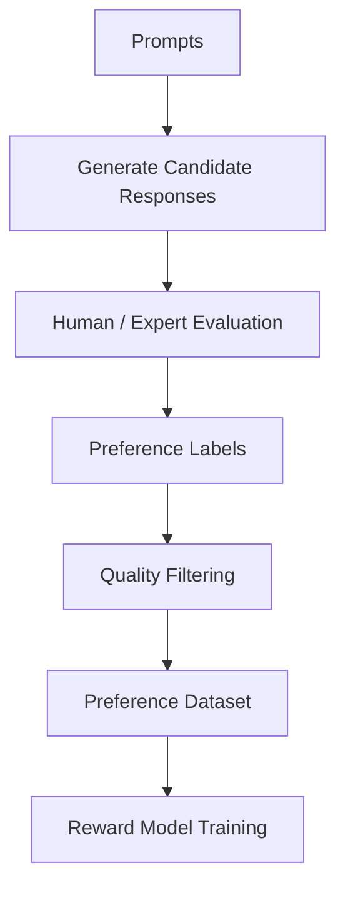

---

# 13. Sources of Preference Data

Preference data can come from:

```text
Human Annotators
Domain Experts
Production Users
Expert Reviewers
Synthetic Preference Generation
LLM Judges
Red-Team Evaluations
```

Each source has different strengths and risks.

---

# 14. Human Preference Labeling

Human annotators compare responses.

Example:

```text
Prompt
  ↓
Response A
Response B
  ↓
Human
  ↓
A preferred
```

Human labeling can evaluate:

```text
Correctness
Helpfulness
Clarity
Relevance
Safety
Style
Completeness
```

---

# 15. Human Labeling Guidelines

Annotators need explicit criteria.

Example:

```text
Prefer responses that are:

1. Factually correct
2. Relevant to the question
3. Clear and concise
4. Complete
5. Professionally written
6. Safe
```

Without consistent guidelines:

```text
Annotation Noise ↑
```

---

# 16. Preference Labels

Common labels include:

```text
A > B
B > A
Tie
```

Example:

```json
{
  "chosen": "A",
  "rejected": "B"
}
```

A tie can be useful when:

```text
Both responses are approximately equivalent.
```

---

# 17. Ranking Multiple Responses

Instead of only comparing two responses:

```text
A
B
C
D
```

a human may rank:

```text
A > C > D > B
```

This can provide richer preference information.

However, pairwise comparisons are often easier to collect and model.

---

# 18. Pairwise Preference Graph

Multiple comparisons can form a preference graph:

```text
        A
       / \
      ↓   ↓
      B   C
       \ /
        ↓
        D
```

where:

```text
A > B
A > C
B > D
C > D
```

The reward model learns a scoring function consistent with these preferences as much as possible.

---

# 19. Preference Consistency

Consider:

```text
A > B
B > C
C > A
```

This creates a cycle.

Such cases can indicate:

```text
Ambiguous Criteria
Annotation Noise
Different Evaluation Dimensions
```

Preference datasets should be analyzed for consistency.

---

# 20. Reward Model

A reward model takes:

```text
Prompt
+
Response
```

and outputs:

```text
Scalar Reward
```

Conceptually:

```text
R(x, y) → r
```

where:

```text
x = prompt
y = response
r = reward score
```

---

# 21. Reward Model Architecture

A common architecture uses a pretrained language model backbone plus a scalar reward head.

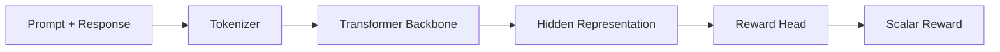

The backbone learns language representations.

The reward head maps those representations to a scalar preference score.

---

# 22. Reward Head

A simplified reward head can be represented as:

```python
import torch.nn as nn

reward_head = nn.Linear(
    hidden_size,
    1
)
```

Conceptually:

```text
Hidden State
     ↓
Linear Layer
     ↓
Scalar Reward
```

---

# 23. Reward Model Input

The reward model generally evaluates the combined sequence:

```text
Prompt
+
Response
```

For example:

```text
<user>
Explain Kafka.
</user>

<assistant>
Kafka is a distributed event streaming platform...
</assistant>
```

The model then produces:

```text
Reward = 2.73
```

The absolute value itself is usually less important than relative preference.

---

# 24. Relative Reward

Suppose:

```text
Response A → 3.8
Response B → 1.7
```

The important relationship is:

```text
A > B
```

The reward model is primarily useful for ranking candidate outputs.

---

# 25. Pairwise Reward Objective

For a preferred response \(y_w\) and rejected response \(y_l\), we want:

```text
R(x, y_w) > R(x, y_l)
```

A common pairwise objective is based on the Bradley-Terry preference model.

The probability that the chosen response is preferred can be modeled as:

```text
P(y_w > y_l | x)
```

using the difference between reward scores.

---

# 26. Bradley-Terry Model

The preference probability can be represented as:


where:

```text
r_w = Reward of chosen response
r_l = Reward of rejected response
σ   = Sigmoid function
```

The larger the reward difference:

```text
r_w - r_l
```

the greater the predicted probability that the chosen response is preferred.

---

# 27. Pairwise Reward Loss

A common loss is:


The model is optimized so that:

```text
Reward(chosen)
>
Reward(rejected)
```

---

# 28. Intuition Behind the Loss

Suppose:

```text
Chosen reward   = 4.0
Rejected reward = 1.0
```

Then:

```text
Difference = 3.0
```

The model strongly prefers the chosen response.

If:

```text
Chosen reward   = 1.2
Rejected reward = 1.1
```

then:

```text
Difference = 0.1
```

The model is uncertain.

If:

```text
Chosen reward   = 1.0
Rejected reward = 2.0
```

the model has learned the comparison incorrectly.

---

# 29. Reward Model Training

A simplified training loop:

```python
for batch in dataloader:

    chosen_reward = reward_model(
        batch["chosen"]
    )

    rejected_reward = reward_model(
        batch["rejected"]
    )

    loss = -torch.log(
        torch.sigmoid(
            chosen_reward - rejected_reward
        )
    ).mean()

    loss.backward()
    optimizer.step()
    optimizer.zero_grad()
```

This is a conceptual implementation.

Production implementations should handle:

```text
Padding
Attention Masks
Batching
Mixed Precision
Distributed Training
Gradient Accumulation
Checkpointing
```

---

# 30. Reward Model Training Pipeline

```text
Preference Dataset
      ↓
Tokenization
      ↓
Chosen / Rejected Batches
      ↓
Reward Model
      ↓
Chosen Reward
      +
Rejected Reward
      ↓
Pairwise Loss
      ↓
Backpropagation
      ↓
Updated Reward Model
```

---

# 31. Reward Model Training with Hugging Face

A simplified conceptual setup:

```python
from transformers import (
    AutoTokenizer,
    AutoModelForSequenceClassification
)

model_name = "your-base-model"

tokenizer = AutoTokenizer.from_pretrained(
    model_name
)

reward_model = AutoModelForSequenceClassification.from_pretrained(
    model_name,
    num_labels=1
)
```

The single output represents the scalar reward.

---

# 32. Reward Model Dataset Preparation

Example:

```python
def prepare_pair(example):

    chosen = tokenizer(
        example["prompt"] + example["chosen"],
        truncation=True,
        max_length=2048
    )

    rejected = tokenizer(
        example["prompt"] + example["rejected"],
        truncation=True,
        max_length=2048
    )

    return {
        "chosen": chosen,
        "rejected": rejected
    }
```

Production implementations should preserve role formatting through the appropriate chat template when required.

---

# 33. Reward Model with Chat Templates

For conversational models:

```python
messages = [
    {
        "role": "user",
        "content": "Explain Kafka."
    },
    {
        "role": "assistant",
        "content": "Kafka is..."
    }
]

text = tokenizer.apply_chat_template(
    messages,
    tokenize=False
)
```

The same model-specific formatting principles used during instruction tuning also apply to reward modeling.

---

# 34. Reward Model Dataset Quality

Reward models are highly sensitive to preference-data quality.

Poor labels can teach:

```text
Wrong Preferences
```

Examples:

```text
Verbose > Correct
Confident > Accurate
Long > Useful
Polite > Safe
```

The reward model may learn these unintended correlations.

---

# 35. Annotation Bias

Human evaluators may prefer:

```text
Longer Answers
More Formal Writing
Certain Vocabulary
Specific Writing Styles
```

even when those properties do not improve correctness.

Therefore annotation guidelines should clearly separate:

```text
Content Quality
```

from:

```text
Stylistic Preference
```

when appropriate.

---

# 36. Reward Model Bias

Suppose annotators consistently prefer longer answers.

The reward model may learn:

```text
Length ↑
→ Reward ↑
```

even if:

```text
Longer Answer
≠
Better Answer
```

This is a classic reward-modeling failure.

---

# 37. Reward Hacking

**Reward hacking** occurs when the optimized model discovers behaviors that increase the reward score without genuinely achieving the intended objective.

Example:

```text
Human:
Prefer accurate and useful answers.

Reward Model:
Long answers often score highly.

LLM:
Generates extremely long answers.

Result:
Reward ↑
Actual usefulness ↓
```

---

# 38. Goodhart's Law

A useful principle:

> When a measure becomes a target, it can cease to be a good measure.

In reward modeling:

```text
Reward
  ↓
Optimization Target
  ↓
Model Finds Shortcuts
  ↓
Reward Exploitation
```

Therefore reward should be treated as:

```text
Proxy
```

not perfect ground truth.

---

# 39. Reward Hacking Examples

Potential behaviors include:

```text
Excessive Verbosity
Reward-Optimized Phrases
Fake Confidence
Overuse of Politeness
Unnecessary Structure
Gaming Evaluation Criteria
```

---

# 40. Reward Hacking in Safety

A model might learn:

```text
Refuse Frequently
```

because refusals receive high safety scores.

But:

```text
Over-Refusal
```

can make the model less useful.

Therefore:

```text
Safety Reward
+
Helpfulness Reward
```

must be balanced.

---

# 41. Reward Hacking in Enterprise AI

Consider a coding assistant.

If the reward model favors:

```text
Detailed Explanations
```

the model may generate:

```text
500 lines of explanation
```

instead of:

```text
Correct 20-line implementation
```

Production evaluation should therefore include:

```text
Correctness
+
Task Completion
+
Efficiency
```

---

# 42. Reward Model Calibration

Reward scores should not automatically be interpreted as:

```text
Absolute Quality
```

A reward score of:

```text
4.2
```

does not necessarily mean:

```text
"4.2 / 5 quality"
```

unless the model was explicitly calibrated that way.

The primary use is often:

```text
Ranking
```

---

# 43. Reward Model Ranking

Given:

```text
Response A → 2.1
Response B → 3.7
Response C → 1.9
Response D → 4.2
```

Ranking becomes:

```text
D > B > A > C
```

This can be used to select candidate responses.

---

# 44. Reward Model for Candidate Selection

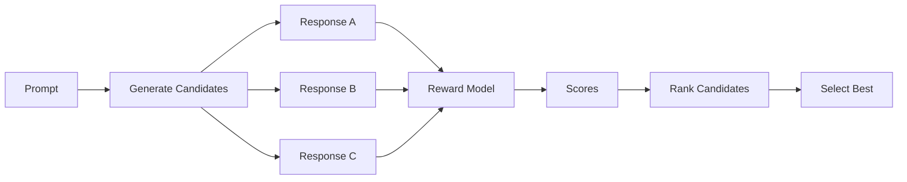

This is sometimes called reward-guided selection or rejection sampling depending on the exact training setup.

---

# 45. Rejection Sampling

A model can generate multiple responses:

```text
Prompt
 ↓
Generate 10 Responses
 ↓
Reward Model
 ↓
Rank
 ↓
Select Best
```

The selected response can then become:

```text
Preferred Training Data
```

for further supervised training.

---

# 46. Reward-Guided Fine-Tuning

A simplified loop:

```text
Base / SFT Model
      ↓
Generate Candidates
      ↓
Reward Model
      ↓
Select High-Reward Samples
      ↓
Fine-Tune
      ↓
Improved Model
```

This avoids directly optimizing the language model through reinforcement learning.

---

# 47. Reward Modeling and RLHF

A traditional RLHF pipeline is:

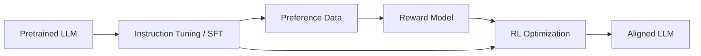

The reward model provides a learned signal to the reinforcement-learning stage.

---

# 48. RLHF Components

Traditional RLHF can be decomposed into:

```text
1. Pretrained Model

2. Supervised Fine-Tuning

3. Preference Data

4. Reward Model

5. Reinforcement Learning

6. Evaluation
```

Reward modeling is therefore one component of RLHF rather than the entire RLHF process.

---

# 49. Reward Model vs Policy Model

In RLHF:

```text
Policy Model
    ↓
Generates Responses

Reward Model
    ↓
Scores Responses
```

The policy is optimized to generate outputs receiving higher rewards.

---

# 50. Policy Optimization

Conceptually:

```text
Prompt
  ↓
Policy Model
  ↓
Response
  ↓
Reward Model
  ↓
Reward
  ↓
Policy Update
```

The goal is:

```text
Increase Expected Reward
```

while maintaining desired behavior.

---

# 51. KL Constraint

Direct optimization toward reward can cause the policy to move too far from the original model.

Therefore RLHF systems often constrain divergence from a reference policy.

Conceptually:

```text
Objective
=
Reward
-
KL Penalty
```

This encourages:

```text
Higher Reward
+
Reasonable Similarity to Reference Model
```

---

# 52. Why KL Regularization Matters

Without a constraint:

```text
Reward Optimization
        ↓
Extreme Behavior
        ↓
Reward Hacking
```

With a KL penalty:

```text
Reward Improvement
+
Stay Near Reference Policy
```

This helps stabilize optimization.

---

# 53. PPO in RLHF

**Proximal Policy Optimization (PPO)** has historically been used for RLHF.

High-level flow:

```text
Policy
 ↓
Generate Response
 ↓
Reward Model
 ↓
Compute Reward
 ↓
PPO Update
 ↓
Updated Policy
```

PPO attempts to make controlled policy updates rather than unrestricted changes.

---

# 54. Reward Model and DPO

DPO (**Direct Preference Optimization**) provides an alternative to the traditional explicit reward-model + PPO pipeline.

Traditional:

```text
Preference Data
 ↓
Reward Model
 ↓
PPO
 ↓
Policy
```

DPO:

```text
Preference Data
 ↓
Direct Preference Optimization
 ↓
Policy
```

Therefore DPO does not require a separately trained reward model in the same way traditional RLHF does.

---

# 55. Reward Modeling vs DPO

| Reward Modeling + RLHF | DPO |
|---|---|
| Train reward model | No separate reward model required |
| Uses reward signal | Uses preference pairs directly |
| Often uses RL optimization | Direct preference objective |
| More complex pipeline | Simpler training pipeline |
| Flexible reward modeling | Easier operationally |

Both are important preference-learning approaches.

---

# 56. Reward Model vs Preference Model

A reward model outputs:

```text
Scalar Score
```

A preference model can be thought of more generally as:

```text
Model of Which Response Is Preferred
```

In practical LLM alignment literature, the terms may overlap depending on implementation.

---

# 57. Multi-Criteria Reward Modeling

A single scalar reward can hide multiple dimensions.

For example:

```text
Correctness
Safety
Helpfulness
Conciseness
Style
```

A multi-objective approach can model them separately.

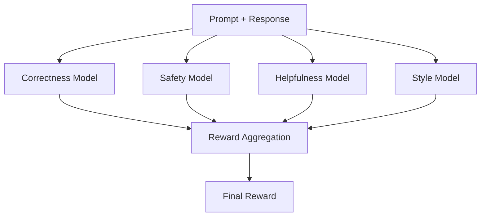

---

# 58. Weighted Reward

A combined reward can conceptually be:

```text
R =
w₁ Correctness
+
w₂ Safety
+
w₃ Helpfulness
+
w₄ Style
```

The weights define the relative importance of each objective.

These weights should be validated experimentally rather than assumed.

---

# 59. Reward Trade-Offs

Increasing one objective may reduce another.

Example:

```text
Safety ↑
Helpfulness ↓
```

or:

```text
Conciseness ↑
Completeness ↓
```

Production reward design should explicitly recognize these trade-offs.

---

# 60. Reward Model for Enterprise AI

An enterprise reward model may evaluate:

```text
Technical Correctness
Security
Policy Compliance
Groundedness
Format Compliance
Helpfulness
Latency / Cost Constraints
```

For example:

```text
Response
 ↓
Correctness Score
Security Score
Groundedness Score
Format Score
 ↓
Aggregate Reward
```

---

# 61. Reward Modeling for RAG

For RAG systems, reward signals can include:

```text
Answer Correctness
Context Relevance
Context Faithfulness
Citation Quality
Groundedness
```

A response should not receive high reward simply because it sounds convincing.

---

# 62. Groundedness Reward

Example:

```text
Retrieved Context:
Refunds are allowed within 30 days.

Model Response:
Customers have 90 days to request refunds.
```

Even if the response sounds fluent:

```text
Groundedness = Poor
```

A production reward model should penalize this behavior if groundedness is part of the objective.

---

# 63. Reward Modeling for Code Generation

For coding models, reward can include:

```text
Compilation
Unit Tests
Static Analysis
Security
Correctness
Style
```

Example:

```text
Prompt
 ↓
Generate 5 Solutions
 ↓
Compile
 ↓
Run Tests
 ↓
Reward
 ↓
Select Best
```

This is an example of using executable signals alongside learned preference signals.

---

# 64. Hybrid Reward Signals

Reward need not come exclusively from humans.

A production system may combine:

```text
Human Preference
+
Automated Tests
+
Rule-Based Checks
+
LLM Judge
+
Security Scanner
```

Conceptually:

```text
Multiple Signals
       ↓
Reward Aggregation
       ↓
Optimization / Ranking
```

---

# 65. Reward Model + Programmatic Evaluation

For code:

```python
def reward_code(solution):
    compilation = compile_check(solution)
    tests = run_tests(solution)

    return (
        0.3 * compilation +
        0.7 * tests
    )
```

This is a simplified conceptual example.

For safety-critical systems, automated signals should be carefully validated.

---

# 66. Reward Model + LLM Judge

An LLM can evaluate another LLM's responses.

```text
Candidate Response
       ↓
LLM Judge
       ↓
Quality Score
```

This can scale evaluation.

However:

```text
Judge Bias
+
Judge Correlation
+
Prompt Sensitivity
+
Model Blind Spots
```

must be considered.

---

# 67. Human + LLM Judge

A stronger evaluation strategy may combine:

```text
Human Evaluation
+
LLM Evaluation
+
Automated Metrics
```

Use humans especially for:

```text
Calibration
Ambiguous Cases
High-Risk Domains
Evaluation Audits
```

---

# 68. Reward Model Validation

Before using a reward model for optimization, evaluate:

```text
Pairwise Accuracy
Ranking Accuracy
Calibration
Generalization
Robustness
Bias
Distribution Shift
```

---

# 69. Pairwise Accuracy

Given:

```text
Chosen
Rejected
```

the reward model predicts:

```text
R(chosen) > R(rejected)
```

Pairwise accuracy is:

```text
Correct Preference Predictions
--------------------------------
Total Preference Comparisons
```

A high pairwise accuracy indicates that the model learned the preference labels reasonably well.

---

# 70. Reward Model Generalization

A reward model should be tested on:

```text
Unseen Prompts
Unseen Topics
Unseen Response Styles
Unseen Domains
```

Otherwise it may simply memorize training patterns.

---

# 71. Reward Model Robustness

Test adversarial variations:

```text
Longer Response
Shorter Response
Different Formatting
Paraphrased Response
Confident but Incorrect Response
Verbose Response
```

This helps identify reward shortcuts.

---

# 72. Reward Model Length Bias

A critical test:

```text
Same Information
Different Length
```

Example:

```text
Response A:
Correct answer in 50 words.

Response B:
Same answer expanded to 500 words.
```

If:

```text
Reward(B) >> Reward(A)
```

the model may have learned a length bias.

---

# 73. Reward Model Position Bias

When humans compare:

```text
Response A
Response B
```

they may unintentionally prefer the first or second response.

To detect this:

```text
A vs B
```

and:

```text
B vs A
```

should produce approximately consistent preferences.

---

# 74. Annotation Agreement

Multiple annotators can evaluate the same examples.

Measure agreement using suitable inter-rater agreement metrics.

Low agreement can indicate:

```text
Ambiguous Prompt
Poor Guidelines
Subjective Criteria
Low-Quality Responses
```

Such examples may need review or removal.

---

# 75. Reward Dataset Sampling

Do not sample preference examples randomly without considering distribution.

Include:

```text
Common Tasks
Rare Tasks
Hard Tasks
Safety Cases
Boundary Cases
Failure Cases
```

---

# 76. Hard Negatives

A **hard negative** is a rejected response that is very close to the chosen response but still worse.

Example:

```text
Chosen:
Correct and complete explanation.

Rejected:
Mostly correct but contains one important factual error.
```

Hard negatives can provide a stronger learning signal than obviously bad responses.

---

# 77. Easy vs Hard Preference Examples

Easy:

```text
A = Correct
B = Completely Wrong
```

Hard:

```text
A = Excellent
B = Mostly Correct but Slightly Incomplete
```

Hard examples are useful because they teach finer distinctions.

---

# 78. Preference Data Curriculum

A possible approach:

```text
Easy Preferences
       ↓
Moderate Preferences
       ↓
Hard Preferences
       ↓
Adversarial Preferences
```

This can help construct a more challenging reward dataset.

---

# 79. Reward Model Data Contamination

Avoid overlap between:

```text
Reward Training Data
```

and:

```text
Final Evaluation Data
```

Otherwise reward-model evaluation may be inflated.

---

# 80. Reward Model Drift

Production preferences can change.

For example:

```text
Business Policy Changes
        ↓
Preferred Responses Change
```

Therefore reward models may need periodic reassessment.

---

# 81. Reward Model Monitoring

Monitor:

```text
Preference Accuracy
Reward Distribution
Response Length
Reward / Length Correlation
Domain Performance
Safety Performance
User Feedback
```

---

# 82. Reward Distribution Monitoring

Track:

```text
Mean Reward
Median Reward
P95 Reward
P99 Reward
Reward by Task
Reward by Domain
```

Sudden shifts may indicate:

```text
Data Drift
Model Drift
Prompt Drift
Distribution Shift
```

---

# 83. Reward-Behavior Correlation

A key production question:

```text
Does higher reward actually correlate
with better user outcomes?
```

Measure:

```text
Reward
vs
Human Rating
vs
Task Success
```

If the correlation declines, the reward model may need retraining.

---

# 84. Reward Model as a Proxy

Always remember:

```text
Reward
≠
True Quality
```

Instead:

```text
Reward
≈
Learned Proxy for Desired Quality
```

This distinction is one of the most important concepts in reward modeling.

---

# 85. Reward Hacking Detection

Potential checks:

```text
Reward vs Length
Reward vs Token Count
Reward vs Refusal Rate
Reward vs Confidence
Reward vs Formatting
Reward vs User Satisfaction
```

Unexpected correlations may indicate reward hacking.

---

# 86. Reward Hacking Detection Example

Suppose:

```text
Response Length ↑
Reward ↑
User Satisfaction ↓
```

This is a strong warning sign.

The reward model may be rewarding:

```text
Verbosity
```

rather than:

```text
Usefulness
```

---

# 87. Reward Model Governance

For enterprise systems, maintain:

```text
Reward Model Version
Preference Dataset Version
Annotation Guidelines
Reward Definition
Evaluation Results
Known Biases
Known Limitations
Approval Status
```

---

# 88. Reward Model Registry

Example:

```yaml
reward_model:
  name: enterprise-helpfulness-rm
  version: "v3"

base_model:
  name: enterprise-base-7b

dataset:
  version: preference-v5

metrics:
  pairwise_accuracy: 0.91
```

---

# 89. Reward Model Deployment

A reward model can be deployed for:

```text
Offline Evaluation
Candidate Ranking
Data Filtering
Rejection Sampling
Training
Continuous Evaluation
```

It does not necessarily need to be deployed as part of the online user-facing path.

---

# 90. Offline Reward Scoring

A production pipeline can score historical outputs:

```text
Production Responses
       ↓
Reward Model
       ↓
Quality Distribution
       ↓
Detect Regressions
```

This can help identify changes between model versions.

---

# 91. Online Reward Scoring

In some architectures:

```text
User Prompt
 ↓
Generate Candidates
 ↓
Reward Model
 ↓
Select Candidate
 ↓
User
```

This adds:

```text
Latency
+
Infrastructure Cost
```

and should be used only when the quality improvement justifies it.

---

# 92. Reward Model Latency

If candidate reranking is used:

```text
Generate N Responses
+
Score N Responses
```

can significantly increase latency.

Therefore optimize:

```text
N
+
Reward Model Size
+
Batching
+
Caching
```

---

# 93. Candidate Generation Trade-Off

More candidates:

```text
Quality Potential ↑
Cost ↑
Latency ↑
```

Fewer candidates:

```text
Cost ↓
Latency ↓
Potential Quality ↓
```

The correct number should be determined experimentally.

---

# 94. Reward-Guided Search

Reward models can guide candidate selection:

```text
Prompt
 ↓
Candidate Generation
 ↓
Reward Scoring
 ↓
Top-K Selection
 ↓
Final Generation / Refinement
```

This is an important pattern beyond traditional RLHF.

---

# 95. Reward Model for Agentic Systems

For agents, reward can evaluate:

```text
Task Completion
Tool Selection
Tool Arguments
Number of Steps
Safety
Efficiency
Final Answer
```

Example:

```text
User Goal
 ↓
Agent Plan
 ↓
Tool Calls
 ↓
Final Result
 ↓
Reward
```

---

# 96. Agent Reward

A reward function might consider:

```text
Task Success        50%
Correct Tool Use    20%
Safety              20%
Efficiency           10%
```

The exact weighting depends on the business objective.

---

# 97. Reward Modeling for Tool Calling

Candidate:

```json
{
  "tool": "get_customer",
  "arguments": {
    "customer_id": "123"
  }
}
```

can be evaluated for:

```text
Tool Correctness
Argument Correctness
Authorization
Task Relevance
```

---

# 98. Reward Modeling for Structured Output

Reward can include:

```text
Valid JSON
Schema Compliance
Correct Fields
Correct Values
No Extra Text
```

This is useful for:

```text
Enterprise APIs
Workflow Automation
Data Extraction
Agent Systems
```

---

# 99. Reward Modeling for RAG + Agents

A sophisticated reward can evaluate:

```text
Retrieval Quality
+
Tool Selection
+
Groundedness
+
Final Answer
```

Architecture:

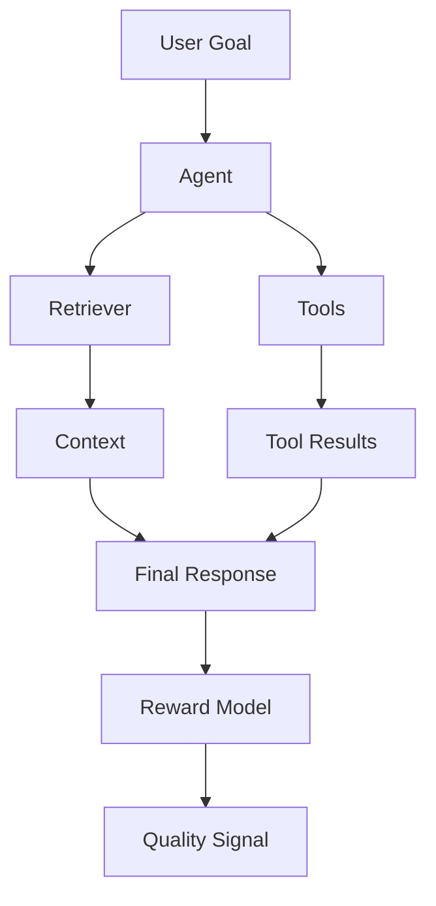

---

# 100. Reward Model Failure Modes

Common problems:

```text
Reward Hacking
Length Bias
Position Bias
Annotation Bias
Overfitting
Distribution Shift
Reward Misalignment
Poor Calibration
Preference Noise
Evaluation Leakage
```

---

# 101. Failure Mode: Reward Model Overfitting

If the reward model memorizes training examples:

```text
Training Pairwise Accuracy ↑
Validation Accuracy ↓
```

Solutions:

```text
More Diverse Data
Regularization
Early Stopping
Better Validation
Deduplication
```

---

# 102. Failure Mode: Annotation Noise

If annotators disagree heavily:

```text
A > B
B > A
```

the model receives contradictory signals.

Solutions:

```text
Better Guidelines
Multiple Annotators
Adjudication
Remove Ambiguous Examples
```

---

# 103. Failure Mode: Proxy Misalignment

The reward model optimizes something correlated with quality rather than quality itself.

Example:

```text
Politeness ↑
Reward ↑
Accuracy ↓
```

This is dangerous.

Reward design should therefore be validated against actual outcomes.

---

# 104. Failure Mode: Reward Collapse

If reward values become excessively concentrated:

```text
A → 1.02
B → 1.01
C → 1.00
D → 1.02
```

the reward model may have difficulty distinguishing candidates.

Investigate:

```text
Training
Architecture
Dataset Diversity
Optimization
```

---

# 105. Failure Mode: Reward Explosion

Extremely large reward differences may indicate:

```text
Optimization Instability
Outlier Examples
Poor Calibration
```

Monitor reward distributions during training.

---

# 106. Failure Mode: Distribution Shift

Training:

```text
Technical Questions
```

Production:

```text
Legal + Financial + Customer Support
```

The reward model may perform poorly outside its training distribution.

Therefore evaluation must reflect actual production workloads.

---

# 107. Failure Mode: Domain Bias

A reward model trained mainly on:

```text
Software Engineering
```

may incorrectly judge:

```text
Legal Responses
Medical Responses
Financial Responses
```

unless domain-specific evaluation is included.

---

# 108. Failure Mode: Over-Optimization

Repeatedly optimizing against the same reward model can cause:

```text
Reward ↑
Actual Quality ↓
```

because the policy becomes increasingly specialized to the reward model's weaknesses.

---

# 109. Reward Model Refresh

When the policy becomes too optimized against a reward model:

```text
New Human Preference Data
        ↓
Reward Model Refresh
        ↓
New Evaluation
```

This creates a more robust alignment loop.

---

# 110. Reward Modeling Feedback Loop

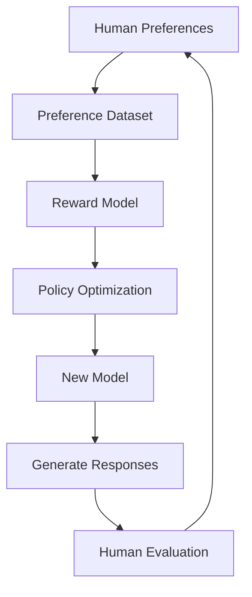

This iterative process is central to preference-based alignment.

---

# 111. Production Reward Modeling Architecture

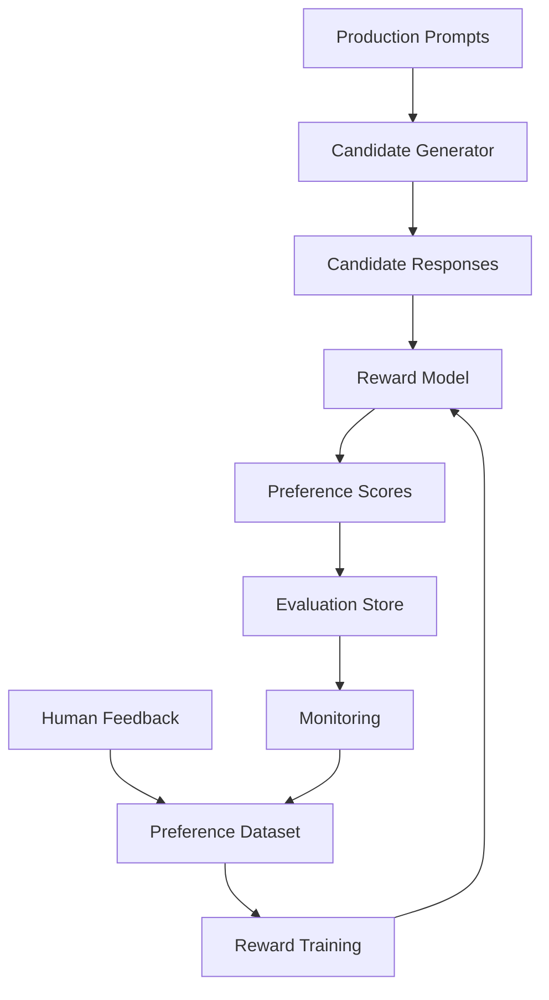

---

# 112. Enterprise Reward Pipeline

```text
Production Requests
       ↓
Candidate Responses
       ↓
Human / Automated Evaluation
       ↓
Preference Dataset
       ↓
Data Validation
       ↓
Reward Model Training
       ↓
Reward Evaluation
       ↓
Model Registry
       ↓
Alignment / Reranking
       ↓
Production
```

---

# 113. Reward Model + Model Registry

Track:

```text
LLM Version
Reward Model Version
Preference Dataset
Training Configuration
Evaluation Suite
Deployment Version
```

This makes experiments reproducible.

---

# 114. Reward Model CI/CD

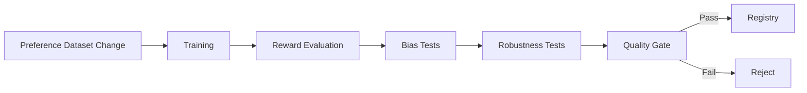

---

# 115. Reward Model Evaluation Checklist

```text
[ ] Pairwise Accuracy
[ ] Ranking Accuracy
[ ] Validation Accuracy
[ ] Human Correlation
[ ] LLM-Judge Correlation
[ ] Length Bias
[ ] Position Bias
[ ] Domain Bias
[ ] Safety Evaluation
[ ] Robustness
[ ] Distribution Shift
[ ] Reward Distribution
[ ] Reward / Length Correlation
[ ] Reward Hacking Tests
```

---

# 116. Reward Modeling Best Practices

## Data

```text
Use high-quality preference data.
Use diverse prompts.
Use hard negatives.
Remove duplicates.
Filter sensitive information.
Separate train and evaluation data.
```

## Training

```text
Monitor validation performance.
Avoid excessive training.
Track reward distributions.
Version all configurations.
```

## Evaluation

```text
Measure pairwise accuracy.
Measure human agreement.
Test unseen domains.
Test adversarial examples.
Test reward shortcuts.
```

## Production

```text
Monitor drift.
Version reward models.
Audit preference data.
Validate reward against real outcomes.
```

---

# 117. Reward Modeling vs Traditional ML Classification

A reward model is not simply:

```text
Good = 1
Bad = 0
```

In many LLM preference settings, the model learns:

```text
Response A
vs
Response B
```

and predicts:

```text
Which one is preferred?
```

This captures relative quality rather than only binary labels.

---

# 118. Reward Modeling vs Regression

A reward model outputs a scalar:

```text
R(x, y)
```

which looks like regression.

However, the training signal often comes from:

```text
Relative Preferences
```

rather than absolute ground-truth scores.

Therefore the model can be optimized through pairwise ranking objectives.

---

# 119. Reward Modeling vs Ranking Models

Reward modeling can be viewed as learning a scoring function:

```text
Input
 ↓
Score
 ↓
Ranking
```

This makes reward modeling conceptually related to:

```text
Learning-to-Rank
```

but the application is LLM response quality and alignment.

---

# 120. Reward Modeling and Learning-to-Rank

The core pattern:

```text
Query
+
Candidate A
+
Candidate B
 ↓
Preference
```

is structurally similar to ranking systems.

For LLMs:

```text
Query = Prompt
Candidate = Response
Preference = Human Judgment
```

---

# 121. Reward Modeling and Re-Ranking

Reward models can also act as a reranker.

```text
Prompt
 ↓
Generate Candidates
 ↓
Reward Model
 ↓
Rank
 ↓
Best Response
```

This is conceptually similar to reranking in retrieval systems, although the objects being ranked are generated responses rather than retrieved documents.

---

# 122. Reward Modeling for Enterprise Search Assistants

A reward model can evaluate:

```text
Answer Relevance
+
Groundedness
+
Completeness
+
Citation Quality
```

This can complement retrieval-stage ranking.

---

# 123. Reward Modeling and Production Retrieval

A complete enterprise AI pipeline may have:

```text
User Query
 ↓
Retriever
 ↓
Candidate Contexts
 ↓
Reranker
 ↓
LLM
 ↓
Candidate Responses
 ↓
Reward Model
 ↓
Final Selection
```

Each stage optimizes a different part of the system.

---

# 124. Reward Model Scope

Do not use one reward model blindly for every objective.

For example:

```text
General Helpfulness Reward
```

may not be sufficient for:

```text
Security-Critical Responses
```

or:

```text
Financial Compliance
```

Domain-specific evaluation may be necessary.

---

# 125. Reward Model for Regulated Domains

For high-risk enterprise domains, include:

```text
Domain Expert Review
+
Policy Compliance
+
Safety
+
Groundedness
+
Auditability
```

Reward modeling should not be the only safety mechanism.

---

# 126. Reward Modeling and Human Oversight

For high-impact decisions:

```text
Reward Model
```

should support:

```text
Human Oversight
```

rather than completely replacing it.

---

# 127. Reward Modeling and Human-in-the-Loop Systems

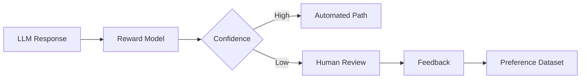

This creates a targeted human-review workflow.

---

# 128. Active Learning

Instead of labeling random examples, select uncertain examples:

```text
Reward Model
      ↓
Low Confidence
      ↓
Human Review
      ↓
New Preference Data
```

This can make annotation more efficient.

---

# 129. Uncertainty Sampling

Examples where:

```text
R(A) ≈ R(B)
```

may be especially useful for human review.

Why?

Because the reward model is uncertain about:

```text
Which response is better?
```

---

# 130. Active Preference Learning

```text
Current Reward Model
        ↓
Find Uncertain Comparisons
        ↓
Human Label
        ↓
Update Preference Dataset
        ↓
Retrain Reward Model
```

This is an efficient preference-data acquisition strategy.

---

# 131. Reward Model Explainability

Reward models are difficult to interpret directly.

A useful diagnostic approach is to analyze:

```text
High Reward Examples
Low Reward Examples
Reward Correlations
Failure Cases
```

Ask:

```text
What patterns does the model appear to reward?
```

---

# 132. Reward Attribution

Potential analysis:

```text
Reward
 ↓
Length
Style
Formatting
Vocabulary
Correctness
Safety
```

Statistical analysis can identify suspicious correlations.

---

# 133. Reward Model Auditing

Audit for:

```text
Bias
Shortcut Learning
Length Preference
Style Preference
Domain Preference
Position Bias
Safety Gaps
```

Regular auditing is especially important when reward models influence automated policy optimization.

---

# 134. Reward Model Security

Reward models can themselves become attack surfaces.

Potential attacks:

```text
Reward Hacking
Adversarial Responses
Prompt Injection
Evaluation Gaming
Data Poisoning
```

Protect:

```text
Preference Dataset
Reward Model
Evaluation Pipeline
Training Pipeline
```

---

# 135. Preference Data Poisoning

An attacker could inject examples such as:

```text
Unsafe Response = Preferred
```

If these examples enter the training dataset, the reward model can learn malicious preferences.

Therefore use:

```text
Data Provenance
Access Control
Review
Anomaly Detection
Dataset Versioning
```

---

# 136. Reward Model Security Pipeline

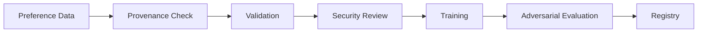

---

# 137. Reward Modeling and Model Alignment

Reward modeling is one mechanism for aligning model behavior with desired outcomes.

However:

```text
Human Preference
```

is not identical to:

```text
Universal Correctness
```

Therefore alignment requires multiple evaluation dimensions.

---

# 138. Alignment Stack

A simplified modern alignment stack:

```text
Pretraining
      ↓
Instruction Tuning
      ↓
Preference Data
      ↓
Reward Modeling / Direct Preference Optimization
      ↓
Safety / Policy Evaluation
      ↓
Deployment
      ↓
Human Feedback
```

---

# 139. Important Distinction

Remember:

```text
Instruction Tuning
=
Teach the model what responses should look like.

Reward Modeling
=
Learn what responses are preferred.

Policy Optimization
=
Change the model to produce higher-reward responses.
```

These are different stages.

---

# 140. Practical Reward Modeling Workflow

```text
1. Define the desired behavior.

2. Define evaluation criteria.

3. Collect representative prompts.

4. Generate multiple candidate responses.

5. Collect human or expert preferences.

6. Build preference pairs.

7. Clean and validate the dataset.

8. Remove duplicates and problematic examples.

9. Train the reward model.

10. Evaluate pairwise accuracy.

11. Test for reward shortcuts.

12. Validate against human judgments.

13. Register the reward model.

14. Use it for alignment, ranking, or filtering.

15. Monitor production behavior.

16. Collect new preference data.

17. Retrain when necessary.
```

---

# 141. Production Workflow

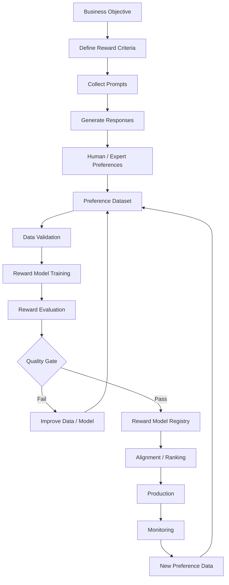

---

# 142. Production Considerations

When deploying reward modeling in an enterprise environment, consider:

```text
Data Governance
Security
Privacy
Latency
GPU Cost
Model Versioning
Preference Drift
Human Review
Auditability
Rollback
```

The reward model should be treated as a production ML artifact.

---

# 143. Reward Modeling Cost

Costs can come from:

```text
Human Annotation
GPU Training
Candidate Generation
Reward Inference
Evaluation
Storage
Monitoring
```

Candidate generation can become expensive if:

```text
N
```

responses are generated for every prompt.

---

# 144. Cost Optimization

Strategies:

```text
Use PEFT where appropriate
Batch reward inference
Use smaller reward models
Cache repeated evaluations
Use active learning
Use automated filtering
Generate fewer candidates
```

---

# 145. Reward Model Serving

A reward model service might expose:

```http
POST /score
```

Request:

```json
{
  "prompt": "Explain Kafka.",
  "response": "Kafka is..."
}
```

Response:

```json
{
  "reward": 3.82
}
```

In production, also include:

```text
Model Version
Latency
Request ID
Evaluation Metadata
```

---

# 146. Java Enterprise Integration

A Java/Spring Boot application can abstract the reward model behind an interface:

```java
public interface RewardModel {

    RewardScore score(
        RewardRequest request
    );
}
```

Implementation:

```text
RewardModel
      ↓
HTTP / gRPC Adapter
      ↓
Python GPU Service
      ↓
Transformer Reward Model
```

This keeps enterprise application logic independent of the ML implementation.

---

# 147. Ports and Adapters Architecture

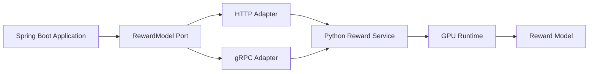

This aligns reward-model infrastructure with a capability-based architecture.

---

# 148. Reward Service Interface

Example:

```java
public record RewardRequest(
    String prompt,
    String response
) {}

public record RewardScore(
    double score,
    String modelVersion
) {}

public interface RewardModel {

    RewardScore score(
        RewardRequest request
    );
}
```

---

# 149. Reward Model API

A production API may support batch scoring:

```json
{
  "items": [
    {
      "prompt": "...",
      "response": "..."
    },
    {
      "prompt": "...",
      "response": "..."
    }
  ]
}
```

Response:

```json
{
  "scores": [
    2.8,
    4.1
  ]
}
```

Batching improves GPU utilization.

---

# 150. Observability

Track:

```text
Request Count
Latency
GPU Utilization
Batch Size
Reward Distribution
Error Rate
Model Version
Input Tokens
Output Tokens
```

For candidate ranking:

```text
Candidates per Request
Selected Candidate Reward
Reward Margin
```

can also be valuable.

---

# 151. Reward Margin

For chosen candidate:

```text
Best Reward = 4.3
Second Best = 4.2
```

The margin is:

```text
0.1
```

A low margin indicates:

```text
Reward Model Uncertainty
```

and may justify additional evaluation.

---

# 152. Confidence-Aware Routing

```text
Reward Margin
      ↓
High
 → Select Automatically

Low
 → Human / Secondary Judge
```

This can reduce the risk of making decisions based on weak reward differences.

---

# 153. Reward Model Ensemble

Multiple reward models can reduce reliance on one proxy.

```text
Response
 ↓
Reward Model A
Reward Model B
Reward Model C
 ↓
Aggregate
 ↓
Final Score
```

This can improve robustness but increases cost and complexity.

---

# 154. Reward Ensemble Trade-Off

Benefits:

```text
Reduced Single-Model Bias
Better Robustness
Multiple Evaluation Perspectives
```

Costs:

```text
Latency
GPU Cost
Operational Complexity
```

---

# 155. Reward Model vs LLM Judge

| Reward Model | LLM Judge |
|---|---|
| Specialized scoring model | General LLM evaluates |
| Usually faster | Usually more expensive |
| Trained on preferences | Prompted / trained as evaluator |
| Stable scoring | Can be prompt-sensitive |
| Good for high-volume scoring | Good for flexible evaluation |

A hybrid system can use both.

---

# 156. Reward Model + LLM Judge Architecture

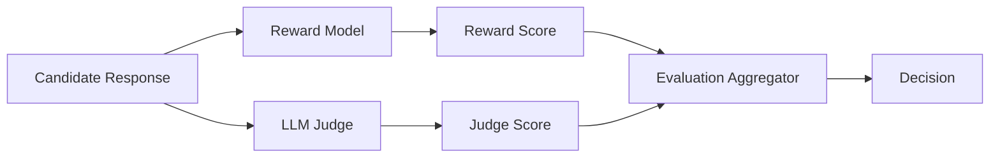

---

# 157. Human Calibration

Periodically sample:

```text
High Reward
Medium Reward
Low Reward
```

and send them to human evaluators.

Compare:

```text
Reward Model
vs
Human Judgment
```

This helps detect drift.

---

# 158. Reward Model Calibration Loop

```text
Reward Scores
      ↓
Sample Responses
      ↓
Human Review
      ↓
Compare
      ↓
Detect Bias
      ↓
Update Dataset
      ↓
Retrain
```

---

# 159. Reward Modeling and Continuous Improvement

A mature system creates:

```text
Preference Data Flywheel
```

where:

```text
Production
 ↓
Feedback
 ↓
Preference Data
 ↓
Reward Model
 ↓
Better Model
 ↓
Production
```

This is an important part of production LLM engineering.

---

# 160. Reward Modeling Anti-Patterns

Avoid:

```text
Using one reward model forever
Ignoring human calibration
Optimizing reward blindly
Using noisy preference labels
Ignoring reward hacking
Evaluating only average scores
Ignoring domain slices
Skipping safety evaluation
Ignoring production outcomes
```

---

# 161. Engineering Principles

## Principle 1

> **Reward is a proxy, not ground truth.**

## Principle 2

> **High reward does not automatically mean high-quality behavior.**

## Principle 3

> **Preference data quality determines reward-model quality.**

## Principle 4

> **Reward models should be validated against independent human judgments.**

## Principle 5

> **Optimizing a reward model too aggressively can produce reward hacking.**

## Principle 6

> **Production evaluation must measure real business outcomes.**

---

# 162. Reward Modeling Mental Model

Remember this simple chain:

```text
Humans
   ↓
Preferences
   ↓
Preference Dataset
   ↓
Reward Model
   ↓
Reward Signal
   ↓
Policy Optimization
   ↓
Aligned Behavior
```

---

# 163. Key Takeaways

- Reward modeling learns a preference signal from examples of preferred and rejected responses.
- It is an important component of traditional RLHF pipelines.
- Reward models usually assign a scalar score to a prompt-response pair.
- Pairwise preference data is one of the most common training formats.
- The reward model learns that preferred responses should receive higher scores than rejected responses.
- The Bradley-Terry formulation is commonly used to model pairwise preferences.
- Human preference data is powerful but expensive and can contain annotation bias.
- Preference labels require clear evaluation criteria.
- Multiple annotators can help reduce individual annotation noise.
- Hard negatives are valuable because they teach subtle quality distinctions.
- Reward models can be trained using pretrained Transformer backbones with scalar reward heads.
- Reward models can be used for ranking, rejection sampling, evaluation, and policy optimization.
- Traditional RLHF uses a reward model as part of the reinforcement-learning stage.
- PPO has historically been used to optimize policies against learned rewards.
- DPO provides an alternative preference-optimization approach that does not require a separately trained reward model in the same pipeline.
- Reward hacking is one of the most important risks in reward modeling.
- Goodhart's Law explains why optimizing a proxy can produce unintended behavior.
- Reward models can develop length, style, position, and confidence biases.
- Reward scores should generally be interpreted as relative preference signals rather than absolute quality scores.
- Reward models should be tested for pairwise accuracy and generalization.
- Human correlation is an important validation signal.
- Reward models should be evaluated against unseen prompts and domains.
- RAG applications may require reward signals for groundedness and citation quality.
- Coding systems can use automated execution and tests as additional reward signals.
- Agent systems can use task completion, tool correctness, safety, and efficiency as reward dimensions.
- Multiple reward signals can be combined for multi-objective optimization.
- A reward model can be integrated with LLM judges and automated evaluation.
- Active learning can focus human labeling on uncertain preference examples.
- Reward models should be versioned alongside preference datasets.
- Reward-model training belongs inside a broader MLOps / LLMOps lifecycle.
- Production reward models require monitoring for drift and reward-behavior mismatch.
- Enterprise reward modeling requires security, privacy, governance, auditability, and rollback.
- Reward modeling should be treated as an engineering system, not merely a training step.
- The ultimate goal is not to maximize reward.
- The goal is to maximize **real-world task quality while keeping the reward signal aligned with the intended objective**.

---

# 164. Remember

The most important distinction is:

```text
Instruction Tuning
        ↓
Teach the model how to follow instructions.

Reward Modeling
        ↓
Teach a separate model what responses are preferred.

Policy Optimization
        ↓
Use the preference signal to improve the language model.
```

And:

```text
Reward
≠
Truth
```

Instead:

```text
Reward
≈
Learned Proxy for Desired Behavior
```

Therefore a production AI system should always combine:

```text
Reward Modeling
+
Independent Evaluation
+
Human Calibration
+
Safety Controls
+
Production Monitoring
```

---

# 165. Chapter Navigation

## Previous Chapter

[17. Instruction Tuning](17-instruction-tuning.md)

## Current Chapter

**18. Reward Modeling**

## Next Chapter

[19. Llms As Policies](19-llms-as-policies.md)

## Related Chapters

- [01. Generative AI Fundamentals](01-generative-ai-fundamentals.md)
- [02. Language Understanding Fundamentals](02-language-understanding-fundamentals.md)
- [03. Word Embeddings](03-word-embeddings.md)
- [04. Language Modeling](04-language-modeling.md)
- [05. Attention and Positional Encoding](05-attention-and-positional-encoding.md)
- [06. GPT and BERT Architecture](06-gpt-and-bert-architecture.md)
- [07. Hugging Face and Transformers](07-huggingface-and-transformers.md)
- [08. LLM Data Preparation](08-llm-data-preparation.md)
- [09. Hugging Face Training Workflow](09-huggingface-training-workflow.md)
- [10. Transformer Fine-Tuning Fundamentals](10-transformer-fine-tuning-fundamentals.md)
- [11. Supervised Fine-Tuning (SFT)](11-supervised-fine-tuning-sft.md)
- [12. Parameter-Efficient Fine-Tuning (PEFT)](12-parameter-efficient-fine-tuning.md)
- [13. LoRA and QLoRA](13-lora-and-qlora.md)
- [14. Model Quantization](14-model-quantization.md)
- [15. LLM Generation Strategies](15-llm-generation-strategies.md)
- [16. LLM Evaluation](16-llm-evaluation.md)
- [17. Instruction Tuning](17-instruction-tuning.md)

---

# References

- Hugging Face Transformers Documentation
- Hugging Face TRL Documentation
- Hugging Face Datasets Documentation
- Hugging Face PEFT Documentation
- Stanford Human Preferences / RLHF research
- InstructGPT: Training Language Models to Follow Instructions with Human Feedback
- Learning to Summarize from Human Feedback
- Training Language Models to Follow Instructions with Human Feedback
- Deep Reinforcement Learning from Human Preferences
- Proximal Policy Optimization Algorithms
- The Bradley-Terry Model for Pairwise Preference Modeling
- Direct Preference Optimization: Your Language Model is Secretly a Reward Model
- Constitutional AI research
- Reinforcement Learning from Human Feedback research literature
- Preference Optimization research literature
- Reward Hacking research literature
- Goodhart's Law and specification gaming research
- LLM evaluation and alignment research literature
- Enterprise MLOps / LLMOps engineering practices

---

> **Enterprise AI Engineering Handbook**  
> *Building Production-Grade Enterprise AI Systems — One Chapter at a Time.*