# 19 — LLMs as Policies

> A practical, production-oriented guide to **LLMs as Policies**, explaining how a language model can be viewed as a policy in reinforcement learning, including states, observations, actions, trajectories, token-level policies, sequence-level policies, probability distributions, policy gradients, rewards, value functions, advantage estimation, exploration, exploitation, reference policies, KL constraints, RLHF, PPO, DPO, agentic AI, tool calling, enterprise AI architecture, evaluation, monitoring, failure modes, implementation concepts, and production engineering considerations.

---

# 1. Overview

A large language model is usually introduced as a system that predicts the next token:

```text
Previous Tokens
      ↓
Language Model
      ↓
Next-Token Probability Distribution
      ↓
Select Next Token
```

In reinforcement learning, however, the same model can be viewed differently:

```text
State / Context
      ↓
LLM Policy
      ↓
Action Distribution
      ↓
Action
      ↓
Environment
      ↓
Reward
```

This perspective is fundamental for understanding:

```text
RLHF
PPO
Preference Optimization
Agentic AI
Tool-Using LLMs
LLM Planning
Reinforcement Learning for Language Models
```

The key idea is:

> **An LLM can act as a policy because it maps a given context or state to a probability distribution over possible actions, where the next token or generated sequence can serve as the action.**

---

# 2. Why LLMs Can Be Viewed as Policies

A policy in reinforcement learning determines:

```text
What action should I take
given the current state?
```

An LLM determines:

```text
What token should I generate
given the current context?
```

These are structurally similar.

Traditional RL:

```text
State
 ↓
Policy
 ↓
Action
```

LLM:

```text
Context
 ↓
Language Model
 ↓
Next Token
```

Therefore:

```text
LLM
≈
Policy over token-generation actions
```

---

# 3. Traditional Reinforcement Learning Policy

In reinforcement learning, a policy is commonly represented as:


where:

```text
π = policy
s = state
a = action
```

The policy answers:

```text
Given state s,
how likely is action a?
```

---

# 4. LLM Policy

For a language model:

```text
Context
=
x₁, x₂, ..., xₜ
```

The model predicts the next token:

```text
xₜ₊₁
```

The policy can therefore be represented conceptually as:


where:

```text
θ
=
LLM parameters

sₜ
=
current token context

aₜ
=
next token
```

---

# 5. Token-Level Policy

Suppose the prompt is:

```text
Explain Kafka.
```

The model may produce:

```text
Kafka
is
a
distributed
event
streaming
platform
...
```

At every generation step:

```text
Context
 ↓
Probability Distribution
 ↓
Next Token
```

For example:

```text
P("Kafka")        = 0.02
P("Kafka's")      = 0.01
P("Apache")       = 0.18
P("A")            = 0.04
...
```

The model samples or selects an action from this distribution.

---

# 6. LLM as a Policy Diagram

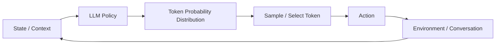

This loop is the foundation for interpreting language generation as sequential decision making.

---

# 7. State in LLM Reinforcement Learning

In traditional RL:

```text
State
=
Information available to the agent
```

For an LLM:

```text
State
≈
Current conversation / prompt / generated history
```

Example:

```text
System:
You are a helpful assistant.

User:
Explain Kafka.

Assistant:
Kafka is
```

The current state includes the preceding context.

---

# 8. Observation vs State

In RL terminology, it is useful to distinguish:

```text
Environment State
```

from:

```text
Agent Observation
```

For an LLM application, the model may not have access to the complete environment state.

It receives:

```text
Observation
=
Prompt
+
Conversation
+
Retrieved Context
+
Tool Results
```

Therefore:

```text
Environment
    ↓
Observation
    ↓
LLM Policy
```

---

# 9. Action in LLM Systems

The definition of an action depends on the application.

For a text-generation model:

```text
Action = Next Token
```

For a chatbot:

```text
Action = Generated Response
```

For an agent:

```text
Action = Tool Call
```

For a planning system:

```text
Action = Next Plan Step
```

Therefore the abstraction is:

```text
LLM
=
Policy over possible actions
```

---

# 10. Token-Level vs Sequence-Level Actions

There are two useful views.

## Token-Level

```text
Action
=
One Token
```

The model makes repeated decisions:

```text
a₁ → a₂ → a₃ → ... → aₙ
```

## Sequence-Level

```text
Action
=
Entire Generated Response
```

The sequence-level response is the result of many token-level policy decisions.

---

# 11. Token Generation as Sequential Decision Making

Suppose the model must generate:

```text
Kafka is a distributed event streaming platform.
```

The process becomes:

```text
State S₀
 ↓
Token "Kafka"
 ↓
State S₁
 ↓
Token "is"
 ↓
State S₂
 ↓
Token "a"
 ↓
State S₃
 ↓
...
```

Every generated token changes the state for the next decision.

---

# 12. Autoregressive Policy

An autoregressive language model factorizes a response probability into token-level probabilities.

Conceptually:


This means the complete response probability is built from sequential policy decisions.

---

# 13. Response as a Trajectory

A generated response can be represented as a trajectory:

```text
τ =
(s₀, a₀, s₁, a₁, ..., sₜ, aₜ)
```

For an LLM:

```text
τ
=
Prompt
+
Generated Token Sequence
```

Example:

```text
Prompt
 ↓
Token 1
 ↓
Token 2
 ↓
Token 3
 ↓
...
 ↓
EOS
```

---

# 14. What Is a Trajectory?

In reinforcement learning, a trajectory is the sequence of:

```text
States
+
Actions
+
Rewards
```

For LLM applications:

```text
Prompt
 ↓
Generate Tokens
 ↓
Environment Interaction
 ↓
Reward
```

For a simple chatbot:

```text
Prompt
+
Response
+
Reward
```

For an agent:

```text
User Goal
 ↓
Thought / Plan
 ↓
Tool Call
 ↓
Tool Result
 ↓
Next Action
 ↓
Final Response
 ↓
Reward
```

---

# 15. LLM Policy and Environment

An LLM does not always interact with a complex environment.

The environment can be:

```text
Human User
```

or:

```text
RAG System
```

or:

```text
Tool API
```

or:

```text
Code Execution Environment
```

or:

```text
Game
```

or:

```text
Enterprise Workflow
```

---

# 16. LLM + Environment

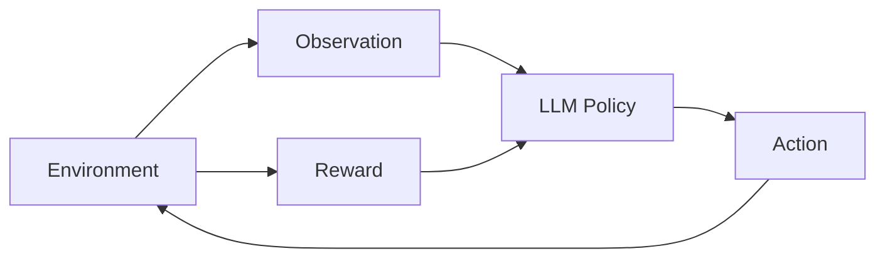

The policy repeatedly observes the environment and chooses actions.

---

# 17. Example: Coding Agent

Consider an agent asked:

```text
Fix the failing unit test.
```

The environment contains:

```text
Repository
Compiler
Test Runner
Terminal
```

The LLM observes:

```text
User Request
+
Repository Context
+
Test Failure
```

It chooses:

```text
Action:
Open File
```

Then:

```text
Tool Result
 ↓
LLM
 ↓
Action:
Modify Code
```

Then:

```text
Action:
Run Tests
```

Eventually:

```text
Tests Pass
 ↓
Positive Reward
```

---

# 18. Agent as a Policy

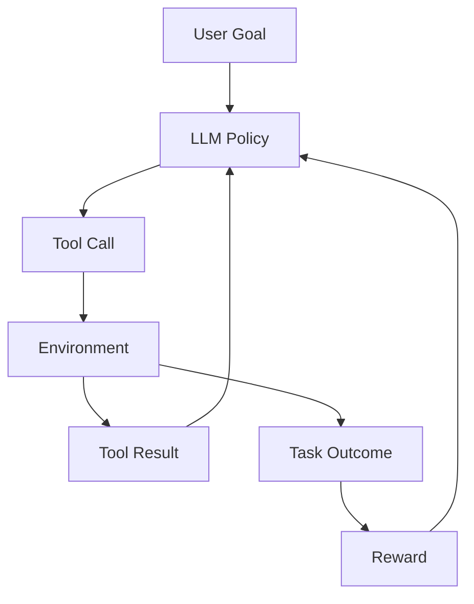

This is one of the most important connections between:

```text
LLMs
+
Reinforcement Learning
+
Agentic AI
```

---

# 19. Policy Distribution

A deterministic program might choose:

```text
Action A
```

every time.

An LLM instead produces a distribution:

```text
Action A → 0.70
Action B → 0.20
Action C → 0.10
```

This stochastic behavior enables:

```text
Exploration
Diversity
Alternative Solutions
```

---

# 20. Sampling as Policy Execution

If the model samples from:

```text
P(token | context)
```

then generation itself becomes stochastic policy execution.

Example:

```text
Temperature = 0
→ Mostly deterministic

Temperature > 0
→ More stochastic
```

Therefore generation configuration influences policy behavior.

---

# 21. Temperature and Policy Entropy

Higher temperature generally produces a flatter token distribution.

Conceptually:

```text
Low Temperature

A █████████
B ██
C █
```

versus:

```text
Higher Temperature

A ██████
B ████
C ███
```

This affects exploration.

---

# 22. Exploration vs Exploitation

Reinforcement learning balances:

```text
Exploration
```

and:

```text
Exploitation
```

Exploration:

```text
Try different actions.
```

Exploitation:

```text
Choose actions already believed to be good.
```

For LLMs:

```text
Sampling
```

supports exploration.

```text
Greedy / Low-Temperature Generation
```

supports exploitation.

---

# 23. Policy Entropy

Policy entropy measures uncertainty in the action distribution.

For a discrete policy:


Higher entropy:

```text
More uncertainty
+
More exploration
```

Lower entropy:

```text
More concentrated policy
+
More exploitation
```

---

# 24. Why Entropy Matters for LLMs

Suppose the model predicts:

```text
Option A = 0.98
Option B = 0.01
Option C = 0.01
```

The policy is highly concentrated.

If:

```text
A = 0.40
B = 0.35
C = 0.25
```

the policy has more uncertainty.

Training can influence this distribution.

---

# 25. Reward

The policy needs a signal indicating whether an action or trajectory was good.

Traditional RL:

```text
Environment
 ↓
Reward
```

LLM alignment:

```text
Response
 ↓
Human Preference / Reward Model
 ↓
Reward
```

Example:

```text
Response A → +1.0
Response B → -0.5
```

---

# 26. Immediate vs Delayed Reward

Some environments provide immediate rewards:

```text
Tool Call
 ↓
Success
 ↓
Reward
```

LLM responses often receive a reward after the complete response:

```text
Generate Response
 ↓
Evaluate Complete Response
 ↓
Reward
```

This creates a delayed-credit-assignment problem.

---

# 27. Credit Assignment

Suppose:

```text
Prompt
 ↓
Token 1
 ↓
Token 2
 ↓
...
 ↓
Token 500
 ↓
Final Reward
```

Which tokens contributed to the success?

This is difficult.

The RL algorithm needs to estimate:

```text
Which actions were responsible for the reward?
```

---

# 28. Token-Level Credit Assignment

Consider:

```text
Token 1 → low impact
Token 2 → low impact
Token 50 → critical reasoning step
Token 100 → incorrect statement
```

A sequence-level reward alone does not directly explain these contributions.

Methods such as:

```text
Advantage Estimation
Value Functions
Credit Assignment Techniques
```

help address this challenge.

---

# 29. Value Function

A value function estimates expected future reward.

For a state:


where:

```text
Vπ(s)
=
Expected return from state s

γ
=
Discount factor
```

---

# 30. Why Value Functions Matter

The policy asks:

```text
What action should I take?
```

The value function asks:

```text
How good is this state?
```

Together:

```text
Policy
+
Value Function
```

can support reinforcement-learning optimization.

---

# 31. State-Action Value

The action-value function estimates the expected return from taking an action in a state:


For LLMs:

```text
State
=
Current Context

Action
=
Next Token
```

---

# 32. Advantage Function

The advantage measures how much better an action is compared with the average action under the current policy.


Interpretation:

```text
A > 0
→ Action was better than expected.

A < 0
→ Action was worse than expected.

A ≈ 0
→ Action was approximately average.
```

---

# 33. Why Advantage Matters for LLMs

Suppose:

```text
Prompt:
Design a Kafka consumer.

Token sequence A:
Produces a correct architecture.

Token sequence B:
Produces an incorrect architecture.
```

The advantage signal can encourage the policy toward decisions associated with better outcomes.

---

# 34. Policy Gradient

Policy-gradient methods optimize the expected reward by changing the policy toward higher-reward actions.

The classic objective is:


where:

```text
θ
=
Policy parameters

τ
=
Trajectory

R(τ)
=
Trajectory reward
```

---

# 35. Policy Gradient Intuition

The basic idea:

```text
Generate Response
      ↓
Receive Reward
      ↓
Good Response
      ↓
Increase Probability

Bad Response
      ↓
Decrease Probability
```

Therefore:

```text
High-Reward Actions
→ More likely

Low-Reward Actions
→ Less likely
```

---

# 36. Policy Gradient for Language Models

A simplified conceptual form is:


The exact implementation used in modern LLM reinforcement learning can be considerably more sophisticated.

The important intuition is:

```text
Increase probability
of actions with positive advantage.
```

---

# 37. Why LLM RL Is Different from Traditional RL

Traditional RL may have:

```text
Small State Space
Small Action Space
Frequent Rewards
```

LLMs have:

```text
Huge State Space
Huge Action Space
Long Sequences
Expensive Rollouts
Delayed Rewards
Complex Safety Constraints
```

Therefore applying RL to LLMs is computationally and algorithmically challenging.

---

# 38. LLM Action Space

For a vocabulary of:

```text
50,000+ tokens
```

the action space at every step can contain tens of thousands of possible actions.

And a response may contain:

```text
100
```

or:

```text
1,000+
```

tokens.

Therefore the trajectory space is enormous.

---

# 39. Policy Space

A language model defines:

```text
P(token | context)
```

for every possible context.

The policy therefore exists over an extremely high-dimensional space.

This is why direct policy optimization can be expensive.

---

# 40. Reference Policy

RLHF systems commonly use a reference model.

Conceptually:

```text
Reference Policy
        +
Current Policy
```

The reference provides a baseline for controlling how far the optimized policy moves.

Usually the reference is related to the SFT model.

---

# 41. Why Use a Reference Policy?

Suppose the reward model says:

```text
Very long responses
```

receive high reward.

The policy could exploit this by producing increasingly long outputs.

A reference policy constraint helps prevent the model from moving too far away from the original useful behavior.

---

# 42. KL Divergence

A common measure of divergence between policies is KL divergence.

Conceptually:


A KL penalty can discourage excessive deviation from the reference policy.

---

# 43. Policy Optimization with KL

Conceptually:

```text
Objective
=
Reward
-
KL Penalty
```

or:


where:

```text
β
=
KL penalty coefficient
```

The exact objective depends on the RL algorithm.

---

# 44. Policy Drift

If:

```text
Current Policy
```

moves too far from:

```text
Reference Policy
```

we can get:

```text
Policy Drift
```

Potential consequences:

```text
Loss of General Capability
Reward Hacking
Training Instability
Unexpected Behavior
```

---

# 45. LLM Policy Lifecycle

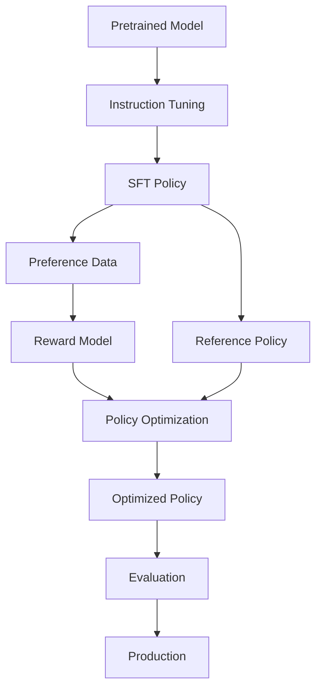

---

# 46. SFT Model as Initial Policy

The instruction-tuned model is often the starting policy.

```text
Pretrained Model
      ↓
Instruction Tuning
      ↓
SFT Model
      ↓
Initial Policy
```

Why?

Because an SFT model already knows:

```text
How to follow instructions
How to format responses
How to behave conversationally
```

RL then focuses on improving preference-based behavior.

---

# 47. Policy Initialization

Starting RL from an instruction-tuned model is generally more practical than starting from a raw pretrained model.

Raw model:

```text
Predicts text
```

SFT model:

```text
Follows instructions
```

Therefore:

```text
SFT
→ Better RL Starting Point
```

---

# 48. LLM Policy in RLHF

The complete conceptual system is:

```text
User Prompt
    ↓
Policy
    ↓
Generated Response
    ↓
Reward Model
    ↓
Reward
    ↓
Policy Update
```

The policy is repeatedly updated to produce higher-reward responses.

---

# 49. RLHF Architecture

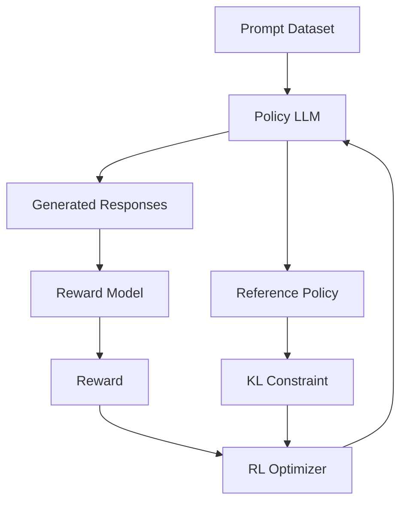

This diagram provides the conceptual bridge to the next chapter on RLHF.

---

# 50. LLMs as Policies for Agents

The policy abstraction becomes even more intuitive for agents.

```text
State
=
Goal
+
Conversation
+
Environment
+
Tool Results

Policy
=
LLM

Action
=
Tool Call / Text / Plan

Environment
=
External System

Reward
=
Task Success
```

---

# 51. Tool Calling as an Action

Suppose the model has:

```text
search_web()
get_customer()
send_email()
create_ticket()
```

The policy selects:

```text
Action:
get_customer()
```

and generates arguments:

```json
{
  "customer_id": "12345"
}
```

Therefore the LLM is acting as a policy over:

```text
Tool Selection
+
Tool Arguments
```

---

# 52. Agent Trajectory

Example:

```text
User:
Find the latest customer invoice.

        ↓

LLM Policy
        ↓

Action:
search_customer()

        ↓

Tool Result

        ↓

LLM Policy
        ↓

Action:
get_invoice()

        ↓

Tool Result

        ↓

LLM Policy
        ↓

Final Response
```

The entire interaction is a trajectory.

---

# 53. Agent Reward

Possible reward:

```text
Task Completed       +1.0
Correct Tool         +0.2
Invalid Tool         -0.3
Unsafe Action        -1.0
Unnecessary Step     -0.1
```

This converts business objectives into measurable signals.

---

# 54. Multi-Step Agent Policy

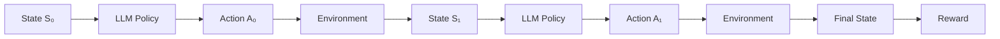

This is a sequential decision process.

---

# 55. LLM Policy for Planning

The model can also produce:

```text
Plan Step 1
Plan Step 2
Plan Step 3
```

The policy chooses the next step based on the current context.

Example:

```text
Goal:
Deploy a microservice.

Policy:
1. Build image.
2. Push image.
3. Update deployment.
4. Verify rollout.
```

Each step can be treated as an action.

---

# 56. Policy Granularity

The action can be defined at different levels:

```text
Token
Sentence
Plan Step
Tool Call
Complete Response
```

The appropriate abstraction depends on the RL problem.

---

# 57. Hierarchical Policies

Complex agents may use:

```text
High-Level Policy
      ↓
Choose Goal / Plan
      ↓
Low-Level Policy
      ↓
Choose Tool / Token
```

Example:

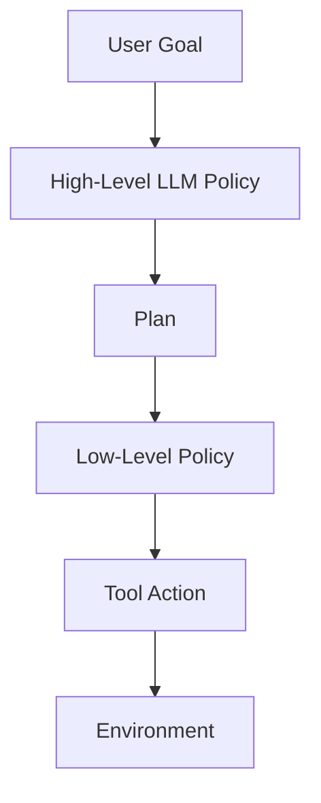

This is useful for long-horizon tasks.

---

# 58. Long-Horizon LLM Agents

Long trajectories create challenges:

```text
Credit Assignment
Memory
Error Accumulation
Reward Sparsity
Exploration
Cost
```

A small mistake early in the trajectory can lead to failure much later.

---

# 59. Reward Sparsity

Consider:

```text
50 tool calls
      ↓
Final task succeeds
      ↓
Reward = +1
```

The model must determine which actions contributed to success.

This is a sparse-reward problem.

---

# 60. Reward Shaping

Intermediate rewards can provide additional signals.

Example:

```text
Correct Tool Selection       +0.1
Valid Arguments              +0.1
Useful Retrieval             +0.2
Correct Final Answer         +0.6
```

The total reward becomes more informative.

---

# 61. Reward Shaping Risks

Poorly designed intermediate rewards can cause:

```text
Reward Hacking
Local Optimization
Wrong Behavior
```

Example:

```text
Reward:
"Use retrieval frequently."

Agent:
Calls retrieval 50 times
```

even when retrieval was unnecessary.

Therefore:

> Reward shaping should reinforce the actual objective, not merely an intermediate activity.

---

# 62. LLM Policy and RAG

A RAG system can also be modeled as a decision process.

```text
State:
User Query + Conversation

Action:
Retrieve documents

Observation:
Retrieved Context

Action:
Generate Answer

Reward:
Groundedness + Correctness
```

This creates opportunities for learning retrieval and generation policies jointly.

---

# 63. RAG Agent Policy

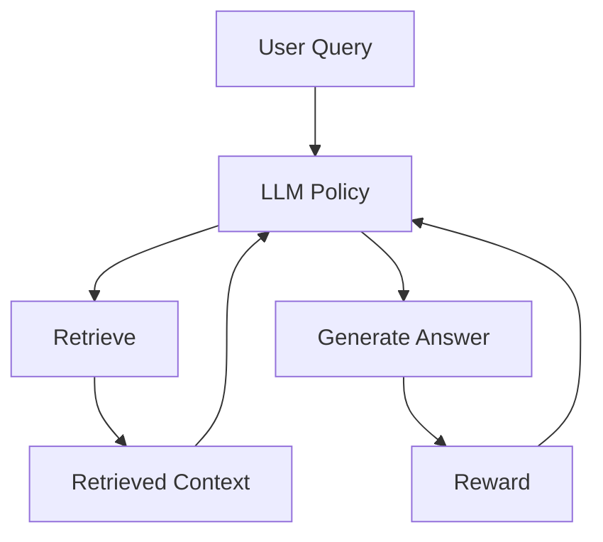

---

# 64. LLM Policy and Tool Routing

An enterprise AI platform may contain:

```text
LLM Policy
    ↓
Router
    ├── Search
    ├── SQL
    ├── CRM
    ├── Ticketing
    ├── Calculator
    └── Cloud APIs
```

The model determines the next action based on the current state.

---

# 65. Policy Constraints

Production policies should not be allowed to perform arbitrary actions.

For example:

```text
LLM Policy
     ↓
Policy Guardrails
     ↓
Authorization
     ↓
Tool
```

This is critical for enterprise security.

---

# 66. LLM Policy vs Application Policy

Do not confuse:

```text
LLM Policy
```

with:

```text
Business Policy
```

The LLM policy determines:

```text
What action the model wants to take.
```

The application policy determines:

```text
What actions the system permits.
```

---

# 67. Policy Enforcement

A production architecture should therefore be:

```text
LLM Decision
      ↓
Application Policy Engine
      ↓
Authorization
      ↓
Allowed / Denied
```

Never assume that model output itself is an authorization mechanism.

---

# 68. Enterprise Agent Architecture

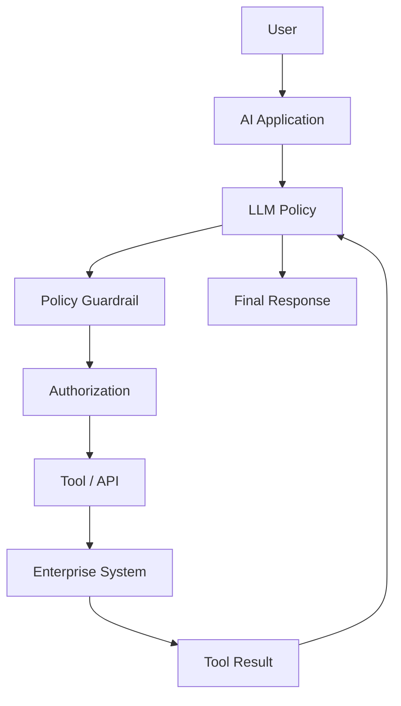

---

# 69. Policy and Security

For production agents:

```text
Model decides
```

but:

```text
System authorizes
```

This distinction is fundamental.

---

# 70. Policy Optimization Constraints

A practical policy optimization system may constrain:

```text
Reward
KL Divergence
Safety
Action Space
Token Budget
Tool Permissions
Latency
Cost
```

Therefore:

```text
Best Policy
≠
Highest Raw Reward
```

The best production policy satisfies business constraints.

---

# 71. Constrained Policy Optimization

Conceptually:

```text
Maximize:
Expected Reward

Subject To:
Safety Constraint
Cost Constraint
Latency Constraint
Security Constraint
```

This is particularly important for enterprise AI systems.

---

# 72. Cost as a Policy Signal

Suppose two responses have equal quality:

```text
Response A:
100 tokens

Response B:
2,000 tokens
```

A production system may prefer A.

Therefore reward can potentially include:

```text
Quality
-
Cost Penalty
```

But cost should not be optimized so aggressively that quality degrades.

---

# 73. Latency-Aware Policy

For an agent:

```text
Tool Call A → 100 ms
Tool Call B → 5 sec
```

If both produce similar outcomes:

```text
A
```

may be preferable.

This demonstrates that production policy objectives can include:

```text
Quality
+
Efficiency
```

---

# 74. Multi-Objective Policy

A production objective may look conceptually like:

```text
Utility
=
Quality
+
Safety
+
Task Success
-
Cost
-
Latency
```

The exact formulation depends on the system.

---

# 75. LLM Policy and Model Serving

A policy can be served as:

```text
Hosted API
Self-Hosted GPU
Kubernetes Deployment
Serverless Endpoint
Batch Inference
```

The serving architecture should expose:

```text
Inference
+
Observability
+
Versioning
+
Security
```

---

# 76. Policy Versioning

Track:

```text
Policy Model Version
Reward Model Version
Prompt Version
Tool Version
Policy Rules
Evaluation Version
```

Example:

```yaml
policy:
  model: enterprise-llm-v4
  reward_model: reward-v3
  prompt: system-v7
  policy_rules: rules-v5
```

---

# 77. Policy Registry

A production registry can store:

```text
Model
Adapter
Reward Model
Training Dataset
Evaluation Dataset
Policy Configuration
Deployment Configuration
```

This enables reproducibility.

---

# 78. Policy Observability

Monitor:

```text
Action Distribution
Tool Selection
Token Distribution
Response Length
Reward
Task Success
Failure Rate
Safety Violations
Latency
Cost
```

---

# 79. Action Distribution Monitoring

Suppose an agent normally chooses:

```text
Search → 30%
SQL    → 25%
CRM    → 20%
Other  → 25%
```

Suddenly:

```text
SQL → 80%
```

This may indicate:

```text
Prompt Drift
Policy Drift
Tool Description Change
Model Regression
```

---

# 80. Policy Drift

Policy drift occurs when the model's behavior changes over time.

Potential causes:

```text
Model Update
Prompt Update
Tool Changes
Context Changes
Training Data Changes
Distribution Shift
```

Monitor action distributions over time.

---

# 81. Policy Evaluation

Evaluate:

```text
Action Correctness
Task Completion
Safety
Efficiency
Tool Usage
Final Response Quality
```

For agentic systems, evaluating only the final text is insufficient.

---

# 82. Trajectory Evaluation

Evaluate the complete trajectory:

```text
State₀
 ↓
Action₀
 ↓
State₁
 ↓
Action₁
 ↓
...
 ↓
Final State
```

Questions:

```text
Was the right tool selected?
Were arguments correct?
Were unnecessary actions taken?
Was the task completed?
Was the final answer correct?
```

---

# 83. Trajectory-Level Reward

A trajectory reward can combine:

```text
Task Success
+
Correct Actions
+
Safety
+
Efficiency
```

Example:

```text
Task Success       0.6
Action Quality     0.2
Safety             0.15
Efficiency         0.05
```

These values are illustrative.

---

# 84. LLM Policy Evaluation Matrix

| Dimension | Example Metric |
|---|---|
| Task Completion | Success Rate |
| Action Selection | Tool Accuracy |
| Tool Arguments | Argument Accuracy |
| Final Answer | Correctness |
| Safety | Violation Rate |
| Efficiency | Steps / Tokens |
| Cost | Cost per Task |
| Latency | P50 / P95 |
| Reliability | Failure Rate |

---

# 85. Offline Policy Evaluation

Before deployment:

```text
Historical Tasks
      ↓
Replay Policy
      ↓
Compare Actions
      ↓
Evaluate Outcomes
```

This is safer than immediately deploying a new policy.

---

# 86. Shadow Evaluation

A new policy can observe production traffic without controlling production actions.

```text
Production Request
      ↓
Current Policy → Production

             ↘
              New Policy
              Shadow Only
```

Compare:

```text
Actions
Rewards
Responses
Costs
```

---

# 87. Canary Deployment

Deploy the new policy to:

```text
1%
```

then:

```text
5%
```

then:

```text
25%
```

then:

```text
100%
```

if metrics remain healthy.

---

# 88. Rollback

If:

```text
Task Success ↓
Safety Violations ↑
Cost ↑
Latency ↑
```

rollback:

```text
New Policy
 ↓
Previous Stable Policy
```

---

# 89. Policy Safety Layer

A production architecture should have:

```text
LLM Policy
 ↓
Output Validation
 ↓
Tool Authorization
 ↓
Rate Limits
 ↓
Audit Logging
 ↓
Tool
```

This reduces the impact of model mistakes.

---

# 90. Policy Guardrails

Guardrails may enforce:

```text
Allowed Tools
Allowed Parameters
Maximum Spend
Maximum Tokens
Restricted Actions
Data Access
User Permissions
```

---

# 91. Example: Banking Agent

Suppose an LLM can call:

```text
get_account()
transfer_money()
close_account()
```

The model may select:

```text
transfer_money()
```

But the application must still verify:

```text
User Authorization
Account Ownership
Transfer Limit
Fraud Rules
MFA
```

Therefore:

```text
LLM Policy
≠
Authorization Policy
```

---

# 92. Policy-as-a-Decision Layer

A robust enterprise architecture separates:

```text
LLM Policy
```

from:

```text
Business Policy
```

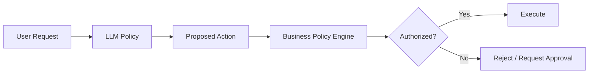

---

# 93. LLM Policy and Human Approval

For high-risk operations:

```text
LLM
 ↓
Proposed Action
 ↓
Risk Assessment
 ↓
Human Approval
 ↓
Execution
```

Examples:

```text
Financial Transfer
Production Deployment
Customer Account Closure
Security Configuration Change
```

---

# 94. Human-in-the-Loop Policy

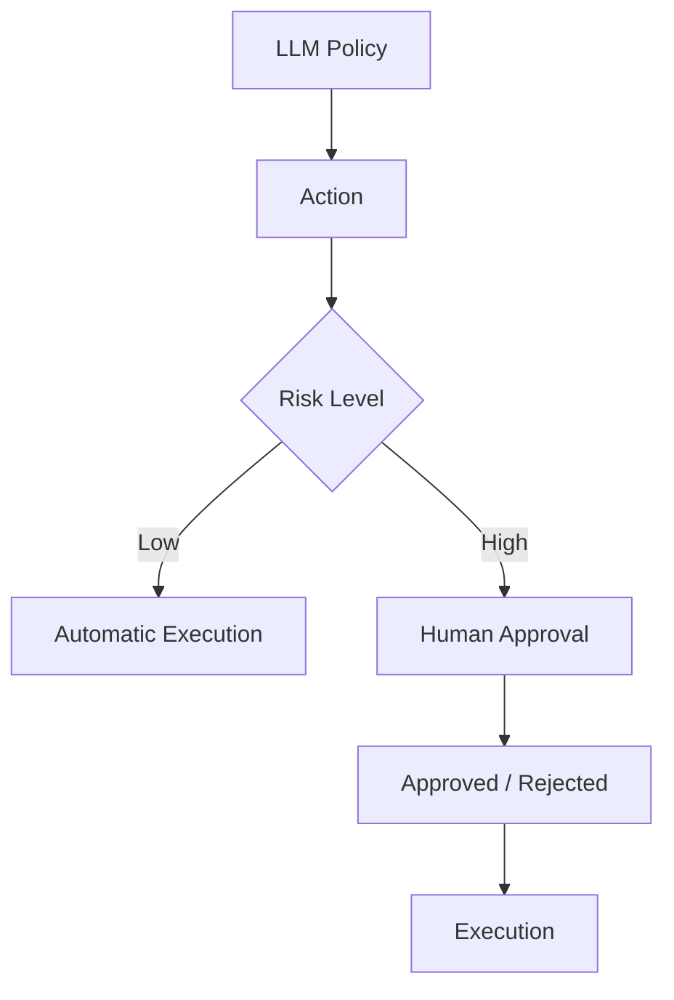

---

# 95. Policy Learning from Human Approval

Human decisions can generate additional preference data:

```text
Proposed Action
+
Human Decision
```

This can become:

```text
Preference Example
```

and potentially improve future policy behavior.

---

# 96. LLM Policy and Reward Modeling

The connection between Chapters 18 and 19 is:

```text
LLM
 ↓
Policy
 ↓
Generate Action
 ↓
Reward Model
 ↓
Reward
 ↓
Policy Optimization
```

The reward model provides the signal.

The LLM provides the policy.

---

# 97. LLM Policy and RLHF

RLHF can now be understood more clearly:

```text
LLM
=
Policy

Human Preferences
=
Preference Signal

Reward Model
=
Learned Reward Function

PPO / RL
=
Policy Optimization
```

This conceptual mapping is essential before studying PPO.

---

# 98. LLM Policy and DPO

DPO changes the optimization path:

```text
Preference Pairs
 ↓
DPO Objective
 ↓
Policy Update
```

instead of:

```text
Preference Pairs
 ↓
Reward Model
 ↓
PPO
 ↓
Policy Update
```

The policy perspective remains the same.

---

# 99. Policy Probability

For a generated sequence:

```text
y = y₁, y₂, ..., yₜ
```

the policy probability is:


This sequence probability is fundamental to:

```text
Policy Gradients
PPO
DPO
KL Regularization
Preference Optimization
```

---

# 100. Log Probability

Because multiplying many probabilities can become numerically small, systems typically work with log probabilities.


This makes sequence-level policy calculations more manageable.

---

# 101. Why Log Probabilities Matter

Suppose:

```text
P(token₁) = 0.5
P(token₂) = 0.4
P(token₃) = 0.2
```

Then:

```text
P(sequence)
=
0.5 × 0.4 × 0.2
```

For long sequences, this product can become extremely small.

Using log probabilities:

```text
log P(sequence)
=
log P(token₁)
+
log P(token₂)
+
log P(token₃)
```

is numerically more stable.

---

# 102. Policy Ratio

Policy optimization methods such as PPO compare:

```text
New Policy
```

with:

```text
Old Policy
```

using a probability ratio.

Conceptually:


This ratio indicates how much the policy probability changed.

---

# 103. Why Policy Ratio Matters

If:

```text
r = 1
```

then:

```text
New Policy
≈
Old Policy
```

If:

```text
r > 1
```

the new policy increased the action probability.

If:

```text
r < 1
```

the new policy decreased it.

This becomes central in PPO.

---

# 104. Policy Update Intuition

Suppose:

```text
Action:
Correct answer

Advantage:
Positive
```

The policy should increase:

```text
P(correct action)
```

If:

```text
Action:
Incorrect answer

Advantage:
Negative
```

the policy should decrease:

```text
P(incorrect action)
```

---

# 105. Why PPO Needs Conservative Updates

If the policy changes too aggressively:

```text
Policy
 ↓
Large Update
 ↓
Unexpected Behavior
 ↓
Training Instability
```

PPO limits policy updates.

This is why the next chapters move from:

```text
LLM as Policy
```

to:

```text
RLHF
```

and then:

```text
PPO
```

---

# 106. LLM Policy and Reference Model

A useful mental model:

```text
SFT Model
   │
   ├──────────────→ Reference Policy
   │
   ↓
Current Policy
   ↓
RL Optimization
```

The reference policy provides a behavioral anchor.

---

# 107. Policy Anchoring

The goal is not:

```text
Maximize Reward At Any Cost
```

but:

```text
Improve Reward
+
Remain Within a Reasonable Policy Region
```

This helps preserve:

```text
Language Quality
Instruction Following
General Capabilities
```

---

# 108. Policy Collapse

Potential failure:

```text
Policy becomes too concentrated
```

Example:

```text
Same response pattern
Same vocabulary
Same tool
Same strategy
```

This can reduce:

```text
Diversity
Robustness
Generalization
```

Monitoring policy entropy can help detect this.

---

# 109. Exploration Collapse

If the policy becomes too deterministic too early:

```text
Exploration ↓
```

and the model may stop discovering better strategies.

This is especially problematic for:

```text
Agents
Planning
Tool Selection
Long-Horizon Tasks
```

---

# 110. Exploration Strategies

Potential strategies include:

```text
Temperature
Sampling
Entropy Regularization
Candidate Generation
Reward-Guided Search
Exploration Bonuses
Diverse Decoding
```

The appropriate strategy depends on the training algorithm.

---

# 111. Policy and Generation Strategy

Generation strategies affect policy execution.

```text
Greedy
Sampling
Top-k
Top-p
Temperature
Beam Search
```

For modern conversational LLMs, sampling-based generation is often more relevant than traditional beam search, depending on the task.

---

# 112. Policy Evaluation with Multiple Samples

To understand stochastic policy behavior:

```text
Prompt
 ↓
Generate 10 Responses
 ↓
Evaluate
 ↓
Distribution of Outcomes
```

Measure:

```text
Average Quality
Best Quality
Worst Quality
Variance
Safety Failure Rate
```

---

# 113. Policy Robustness

A robust policy should perform consistently across:

```text
Prompt Paraphrases
Different Contexts
Different Users
Different Languages
Different Tool Results
Different Retrieval Results
```

---

# 114. Policy Robustness Testing

Example:

```text
Original:
Design a Kafka consumer.

Paraphrase:
How would you architect a scalable Kafka consumer?

Alternative:
What production concerns matter when building Kafka consumers?
```

A good policy should preserve core behavior across these variations.

---

# 115. Policy Generalization

Training:

```text
Known Prompts
```

Testing:

```text
Unseen Prompts
```

A good policy should learn:

```text
General Decision Patterns
```

rather than memorizing exact examples.

---

# 116. Policy Distribution Shift

Production can differ from training:

```text
Training:
Technical Questions

Production:
Technical + Business + Operational + Ambiguous Requests
```

Therefore policy evaluation should use representative production distributions.

---

# 117. Policy Safety Under Distribution Shift

Test unusual conditions:

```text
Unexpected Tool Result
Missing Context
Malformed Input
Conflicting Instructions
Adversarial Prompt
Unauthorized Request
```

The policy should fail safely.

---

# 118. Safe Failure

A production policy should prefer:

```text
Safe Failure
```

over:

```text
Confidently Wrong Action
```

For example:

```text
Insufficient authorization
 ↓
Request approval
```

rather than:

```text
Execute action anyway
```

---

# 119. LLM Policy and Guardrails

Guardrails should exist outside the model:

```text
LLM Policy
 ↓
Input Guardrails
 ↓
Model
 ↓
Output Guardrails
 ↓
Tool Authorization
 ↓
Execution
```

This creates defense in depth.

---

# 120. Defense-in-Depth Architecture

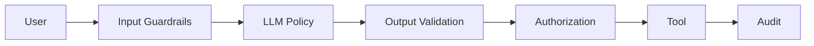

---

# 121. LLM Policy as a Capability

From an enterprise software perspective, treat the model as a capability:

```java
public interface PolicyEngine {

    PolicyDecision decide(
        PolicyContext context
    );
}
```

The implementation can be:

```text
LLM Policy
Rule-Based Policy
Hybrid Policy
Specialized Model
```

---

# 122. Hybrid Policy

A production system can combine:

```text
LLM
+
Rules
+
Classifiers
+
Risk Models
```

Example:

```text
LLM proposes action
      ↓
Rule Engine validates
      ↓
Risk Model scores
      ↓
Decision
```

---

# 123. Why Hybrid Policies Matter

LLMs are probabilistic.

Enterprise authorization is often deterministic.

Therefore:

```text
Probabilistic Intelligence
+
Deterministic Control
```

is a strong architecture.

---

# 124. LLM Policy and Microservices

A cloud-native architecture might contain:

```text
API Gateway
 ↓
Agent Service
 ↓
Policy Service
 ↓
LLM Provider
 ↓
Tool Services
```

Each capability can be independently observed and scaled.

---

# 125. Enterprise AI Policy Architecture

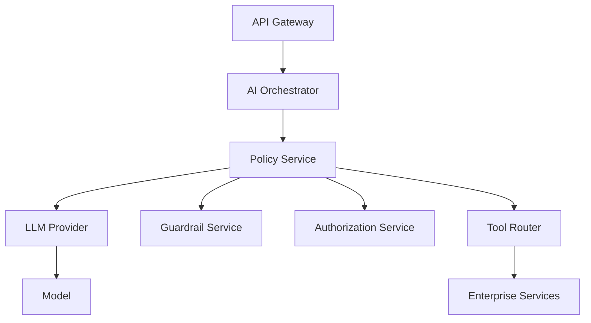

---

# 126. Policy Service Responsibilities

A policy service may handle:

```text
Prompt Construction
Model Invocation
Tool Selection
Policy Validation
Action Constraints
Reward / Evaluation Hooks
Observability
```

---

# 127. Model Provider Abstraction

An enterprise application can expose:

```java
public interface LLMProvider {

    GenerationResponse generate(
        GenerationRequest request
    );
}
```

while policy logic remains separate.

This allows:

```text
AWS Model
Azure Model
GCP Model
OpenAI Model
Self-Hosted Model
```

to be substituted without changing business logic.

---

# 128. Policy + Provider Architecture

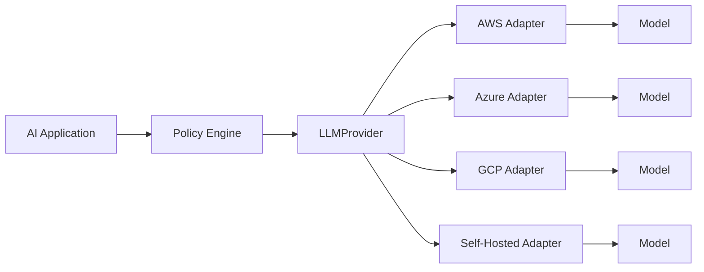

---

# 129. Policy Configuration

Externalize:

```yaml
policy:
  max_tokens: 2048
  temperature: 0.2

  allowed_tools:
    - search
    - knowledge_base

  max_tool_calls: 5

  approval_required_for:
    - financial_transfer
```

This prevents critical business constraints from being buried inside prompts.

---

# 130. Policy Observability Schema

Example:

```json
{
  "request_id": "abc-123",
  "model_version": "llm-v4",
  "policy_version": "policy-v7",
  "action": "search",
  "tool": "enterprise_search",
  "latency_ms": 320,
  "tokens": 812
}
```

This makes policy decisions auditable.

---

# 131. Policy Audit Trail

For high-value workflows, store:

```text
Request
Policy Version
Model Version
Context Hash
Proposed Action
Authorization Result
Tool Result
Final Outcome
```

Be careful to avoid storing sensitive content unnecessarily.

---

# 132. Policy Cost Monitoring

Track:

```text
Tokens per Task
Tool Calls per Task
GPU Time
API Cost
Total Cost per Successful Task
```

The last metric is often more meaningful than raw token cost.

---

# 133. Cost per Successful Task

Suppose:

```text
Policy A:
$0.10 per attempt
90% success

Policy B:
$0.05 per attempt
60% success
```

Approximate cost per successful task:

```text
A:
$0.10 / 0.90

B:
$0.05 / 0.60
```

The cheaper model per request is not necessarily cheaper per successful outcome.

---

# 134. Policy Efficiency

A production policy should optimize:

```text
Quality
+
Success
+
Safety
+
Efficiency
```

rather than:

```text
Reward Alone
```

---

# 135. Policy Evaluation in Production

Important metrics:

```text
Task Success Rate
Action Success Rate
Human Escalation Rate
Tool Error Rate
Safety Violation Rate
Average Steps
P95 Steps
Average Tokens
Cost per Task
P95 Latency
```

---

# 136. Policy Failure Taxonomy

Classify failures:

```text
Wrong Action
Wrong Tool
Wrong Arguments
Unnecessary Tool
Missing Tool
Unsafe Action
Infinite Loop
Premature Termination
Hallucinated Result
Incorrect Final Answer
```

This is more actionable than simply measuring:

```text
"Agent failed."
```

---

# 137. Agent Loop Detection

An LLM policy can sometimes repeat:

```text
Search
→ Search
→ Search
→ Search
```

without progress.

Production systems should enforce:

```text
Maximum Steps
Maximum Time
Maximum Cost
Loop Detection
```

---

# 138. Policy Timeout

For long-running tasks:

```text
Maximum Execution Time
```

should be enforced externally.

Never depend entirely on the LLM to stop itself.

---

# 139. Policy Budget

A production agent can receive a budget:

```yaml
budget:
  max_steps: 10
  max_tokens: 12000
  max_tool_calls: 8
  max_cost_usd: 0.25
```

This creates deterministic operational boundaries.

---

# 140. Policy and Reliability

LLM policies should operate inside resilient infrastructure:

```text
Timeouts
Retries
Circuit Breakers
Bulkheads
Rate Limits
Fallbacks
```

These are application-level controls.

---

# 141. Policy Fallback

If the primary model fails:

```text
Primary LLM
 ↓
Failure
 ↓
Fallback Model
 ↓
Continue
```

Or:

```text
LLM
 ↓
Unable to determine action
 ↓
Human Review
```

---

# 142. Policy and Idempotency

Tool actions should be designed carefully.

For example:

```text
create_payment()
```

should not accidentally execute twice because the LLM repeated the action.

Use:

```text
Idempotency Keys
Transaction Guards
Authorization
```

outside the model.

---

# 143. Policy and Event-Driven Architecture

Agent actions can emit events:

```text
AgentDecisionMade
ToolInvoked
ToolCompleted
TaskCompleted
TaskFailed
```

This enables:

```text
Observability
Auditing
Analytics
Offline Training Data
```

---

# 144. Policy Data Flywheel

Production events can become learning data:

```text
Policy Decision
 ↓
Outcome
 ↓
Human Feedback
 ↓
Preference / Reward Dataset
 ↓
Training
 ↓
New Policy
```

This creates a continuous policy improvement loop.

---

# 145. Policy Improvement Loop

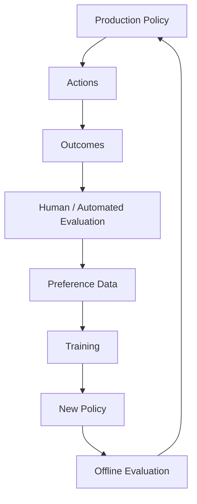

---

# 146. Policy Learning from Failures

Suppose:

```text
Agent chose SQL query
instead of search.
```

Capture:

```text
Prompt
Context
Wrong Action
Preferred Action
Outcome
```

This can become a preference example:

```text
Chosen:
Search

Rejected:
SQL
```

The data can later support:

```text
Reward Modeling
DPO
Instruction Tuning
Policy Evaluation
```

---

# 147. Policy Learning from Successes

Successful trajectories can also be valuable.

Example:

```text
Goal
 ↓
Correct Tool
 ↓
Correct Arguments
 ↓
Successful Outcome
```

These trajectories can become:

```text
Positive Demonstrations
```

for supervised training or evaluation.

---

# 148. Policy Learning Data

A mature dataset can contain:

```text
Prompt
State
Action
Outcome
Reward
Human Preference
Failure Type
```

This is richer than a simple prompt-response dataset.

---

# 149. Trajectory Dataset

Example:

```json
{
  "goal": "Find customer invoice",
  "trajectory": [
    {
      "action": "search_customer",
      "result": "customer_found"
    },
    {
      "action": "get_invoice",
      "result": "invoice_found"
    }
  ],
  "outcome": "success",
  "reward": 1.0
}
```

Such data can support agent training and evaluation.

---

# 150. LLM Policy and Reinforcement Learning

At this point the complete conceptual mapping is:

```text
RL Concept          LLM Equivalent

State               Context
Observation         Prompt / Tool Result
Policy              LLM
Action              Token / Tool Call
Trajectory          Conversation / Agent Trace
Reward              Preference / Outcome Signal
Value Function      Expected Future Reward
Advantage            Action Quality Relative to Baseline
Reference Policy    SFT / Frozen Reference Model
Environment         User / Tools / External System
```

---

# 151. Core Mapping Table

| Reinforcement Learning | LLM System |
|---|---|
| State | Context / Conversation |
| Observation | Prompt / Retrieved Context / Tool Result |
| Policy | Language Model |
| Action | Token / Response / Tool Call |
| Trajectory | Generated Sequence / Agent Trace |
| Reward | Human Preference / Reward Model / Outcome |
| Value | Expected Future Reward |
| Advantage | Relative Action Quality |
| Reference Policy | Frozen Reference Model |
| Environment | External System |
| Episode | Complete Task / Conversation |

This table is worth remembering.

---

# 152. LLM Policy Mental Model

Think:

```text
"What should I do next?"
```

The LLM answers this probabilistically:

```text
Given everything I currently know,
which action is most appropriate?
```

For text generation:

```text
Next Token
```

For agents:

```text
Next Tool / Action
```

For planning:

```text
Next Step
```

---

# 153. Why This Concept Matters

Understanding LLMs as policies makes the following topics much easier:

```text
RLHF
PPO
DPO
Policy Gradient
Advantage
KL Divergence
Reward Optimization
Agentic AI
Tool Use
Trajectory Learning
```

Without this mental model, PPO and RLHF can feel disconnected from normal LLM training.

---

# 154. Connection to Supervised Fine-Tuning

SFT says:

```text
Here is the desired response.
Learn to reproduce it.
```

Policy optimization says:

```text
Here are outcomes/preferences.
Change your behavior toward better outcomes.
```

Therefore:

```text
SFT
=
Demonstration Learning

RL / Preference Optimization
=
Outcome / Preference Learning
```

---

# 155. SFT vs Policy Optimization

| SFT | Policy Optimization |
|---|---|
| Learns demonstrations | Learns from reward/preference |
| Teacher provides target | Evaluator provides signal |
| Direct token supervision | Indirect behavioral signal |
| Simpler | More complex |
| Stable | Potentially unstable |
| Common starting point | Often follows SFT |

---

# 156. Why SFT Usually Comes First

SFT gives the model:

```text
Basic Instruction Following
```

Then preference optimization can focus on:

```text
Quality
Helpfulness
Safety
Preference
```

This reduces the difficulty of RL optimization.

---

# 157. LLM Policy and Preference Learning

The relationship is:

```text
Policy
 ↓
Candidate Response
 ↓
Preference Evaluation
 ↓
Reward / Preference Signal
 ↓
Policy Improvement
```

This loop is the heart of modern LLM alignment.

---

# 158. Policy Optimization Pipeline

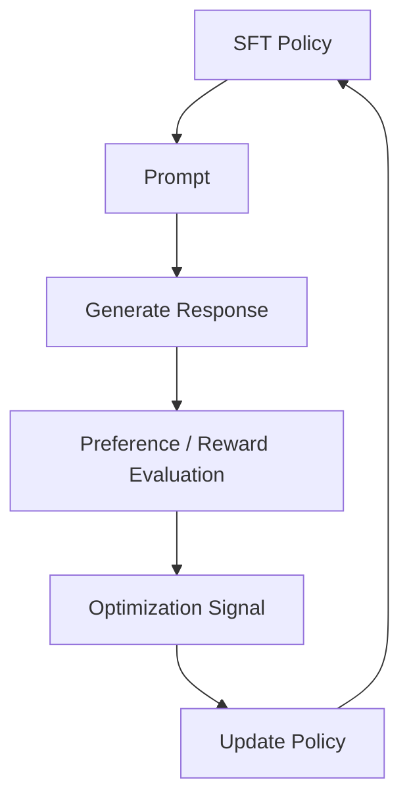

---

# 159. Practical Enterprise Example

Suppose an enterprise AI assistant must answer:

```text
How should I design a payment service?
```

The policy may generate:

```text
Response A:
Use idempotency, transactional boundaries,
event-driven processing, observability,
security, and retries...

Response B:
Create a REST service and database...
```

Preference data may indicate:

```text
A > B
```

Reward modeling learns:

```text
R(A) > R(B)
```

Policy optimization then tries to make responses like A more probable.

---

# 160. Production Architecture Example

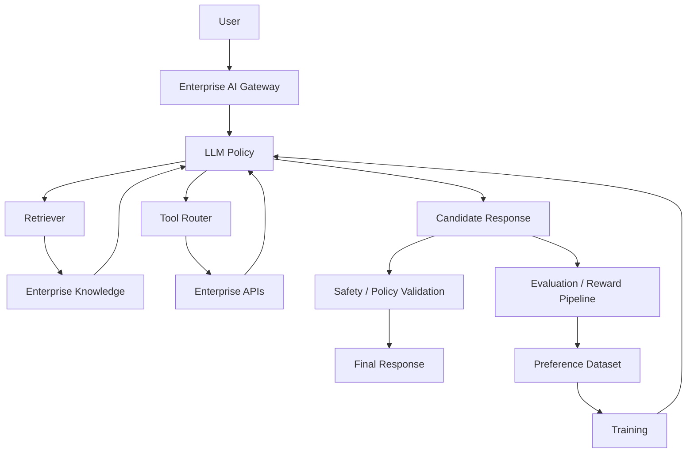

---

# 161. Production Engineering Principles

## Principle 1

> Treat the LLM as a probabilistic decision-making component.

## Principle 2

> Never treat model output as authorization.

## Principle 3

> Keep business policies outside the model.

## Principle 4

> Measure trajectory outcomes, not only final text.

## Principle 5

> Version the policy, model, prompts, tools, and evaluation datasets.

## Principle 6

> Use reward as a proxy, not ground truth.

## Principle 7

> Put deterministic safety and operational controls around the policy.

---

# 162. Common Mistakes

## Mistake 1 — Thinking the LLM Is the Environment

The LLM is usually:

```text
Policy
```

The environment is:

```text
External World / Application / Tools
```

---

## Mistake 2 — Treating Every Token as an Independent Decision

Tokens are sequentially dependent:

```text
aₜ
depends on
a₁ ... aₜ₋₁
```

---

## Mistake 3 — Ignoring the Reference Policy

Without anchoring, optimization can produce undesirable policy drift.

---

## Mistake 4 — Optimizing Raw Reward Blindly

Reward hacking can occur.

---

## Mistake 5 — Treating Temperature as Training

Temperature changes inference-time sampling.

It does not itself train the policy.

---

## Mistake 6 — Treating Tool Authorization as an LLM Problem

Authorization belongs outside the model.

---

# 163. Debugging an LLM Policy

When the policy behaves incorrectly, inspect:

```text
1. Input State
2. Context
3. Prompt
4. Available Actions
5. Model Probabilities
6. Tool Descriptions
7. Generated Action
8. Guardrails
9. Environment Result
10. Reward / Evaluation
```

This gives a complete trace.

---

# 164. Policy Trace

A useful production trace:

```text
Request
 ↓
State Snapshot
 ↓
Prompt Version
 ↓
Model Version
 ↓
Action
 ↓
Tool
 ↓
Tool Result
 ↓
Next State
 ↓
Next Action
 ↓
Final Outcome
```

---

# 165. Policy Trace Example

```json
{
  "request_id": "req-123",
  "policy_version": "policy-v4",
  "action": {
    "tool": "search",
    "arguments": {
      "query": "Kafka consumer scaling"
    }
  },
  "outcome": "success"
}
```

This provides valuable production observability.

---

# 166. Policy Evaluation Checklist

```text
[ ] State Representation Defined
[ ] Observation Defined
[ ] Action Space Defined
[ ] Reward Defined
[ ] Policy Model Defined
[ ] Reference Policy Defined
[ ] Trajectory Logging Enabled
[ ] Safety Constraints Defined
[ ] Business Policy Externalized
[ ] Tool Authorization Implemented
[ ] Offline Evaluation Available
[ ] Shadow Evaluation Available
[ ] Canary Deployment Available
[ ] Rollback Available
[ ] Cost Monitoring Enabled
[ ] Latency Monitoring Enabled
[ ] Policy Drift Monitoring Enabled
[ ] Failure Taxonomy Defined
```

---

# 167. Interview Questions

## Beginner

- What is a policy in reinforcement learning?
- Why can an LLM be viewed as a policy?
- What is a state?
- What is an action?
- What is a trajectory?
- What is a reward?
- What is the difference between a policy and a reward model?
- What is the difference between token-level and sequence-level actions?
- What is exploration vs exploitation?
- Why is an LLM considered a stochastic policy?

---

## Intermediate

- How does autoregressive generation map to a policy?
- What is the relationship between an LLM and π(a|s)?
- What is a policy gradient?
- What is a value function?
- What is an advantage function?
- Why are log probabilities used?
- Why is a reference policy used in RLHF?
- What is KL divergence?
- Why does RLHF start from an SFT model?
- How does tool calling map to reinforcement-learning actions?
- How do agent trajectories differ from simple LLM responses?
- What is reward sparsity?
- What is reward shaping?
- Why can LLM RL be computationally expensive?

---

## Advanced

- How would you model an agentic LLM as a Markov decision process?
- What is the state representation for a tool-using LLM?
- How would you define a reward for an enterprise agent?
- How would you perform credit assignment across a long LLM trajectory?
- How would you prevent policy collapse?
- How would you constrain policy drift?
- How does KL regularization help?
- Why does PPO use a policy ratio?
- How would you evaluate an LLM policy offline?
- How would you monitor policy drift in production?
- How would you combine an LLM policy with deterministic authorization?
- How would you design a policy service for an enterprise AI platform?
- How would you optimize quality, safety, latency, and cost simultaneously?
- How would you collect agent trajectories for future training?
- How would you use human approvals as preference data?
- How would you design safe reinforcement learning for a financial agent?

---

# 168. Scenario-Based Interview Questions

## Scenario 1 — Agent Keeps Choosing the Wrong Tool

Investigate:

```text
Tool Descriptions
Prompt
Training Data
Action Space
Policy Evaluation
```

Add:

```text
Tool Selection Examples
Hard Negatives
Preference Data
```

and enforce deterministic tool constraints where necessary.

---

## Scenario 2 — Agent Performs Correctly but Uses Too Many Steps

Add an efficiency signal:

```text
Task Success
+
Step Penalty
```

but validate that the agent does not start skipping necessary actions.

---

## Scenario 3 — Policy Achieves High Reward but User Satisfaction Falls

Likely:

```text
Reward Misalignment
```

Investigate:

```text
Reward Model
Human Feedback
Reward Correlations
Reward Hacking
```

---

## Scenario 4 — Agent Executes Unauthorized Action

Do not attempt to solve this only through training.

Implement:

```text
Authorization
+
Policy Engine
+
Tool Permissions
```

outside the model.

---

## Scenario 5 — New Policy Has Better Reward but Worse General Capability

Investigate:

```text
Policy Drift
KL Constraint
Training Data
Reward Hacking
General Evaluation
```

---

## Scenario 6 — Agent Repeats the Same Tool

Implement:

```text
Maximum Steps
Loop Detection
State Tracking
Tool Result Validation
```

and improve policy training if necessary.

---

## Scenario 7 — Policy Is Too Deterministic

Investigate:

```text
Entropy
Temperature
Training Objective
Sampling Strategy
```

and evaluate whether additional exploration is actually beneficial for the task.

---

## Scenario 8 — Policy Is Too Random

Investigate:

```text
Temperature
Sampling
Policy Entropy
Training Stability
Reward Signal
```

The goal is not maximum determinism or maximum randomness.

The goal is:

```text
Reliable Decision Making
```

---

# 169. Practical Learning Workflow

Study LLM policies in this order:

```text
1. Reinforcement Learning Basics

2. State / Action / Reward

3. Policy

4. Value Function

5. Advantage

6. Policy Gradient

7. LLM Token Probabilities

8. LLM as a Policy

9. Reference Policy

10. KL Divergence

11. RLHF

12. PPO

13. DPO

14. Agentic Policy Optimization
```

This progression makes the later chapters much easier to understand.

---

# 170. Production Workflow

```text
1. Define the business task.

2. Define the environment.

3. Define the observation/state.

4. Define the action space.

5. Define success criteria.

6. Define reward signals.

7. Start with a strong SFT model.

8. Evaluate baseline behavior.

9. Collect preference / outcome data.

10. Train or configure the reward signal.

11. Define policy constraints.

12. Optimize the policy.

13. Evaluate offline.

14. Run adversarial tests.

15. Run shadow evaluation.

16. Deploy using canary rollout.

17. Monitor policy behavior.

18. Monitor reward / outcome correlation.

19. Collect production failures.

20. Feed validated failures back into the learning pipeline.
```

---

# 171. Production Architecture Checklist

```text
[ ] Strong Base Model
[ ] Instruction-Tuned Starting Policy
[ ] Clear State Representation
[ ] Defined Action Space
[ ] Defined Reward
[ ] Reference Policy
[ ] Policy Constraints
[ ] Safety Guardrails
[ ] Authorization Layer
[ ] Tool Isolation
[ ] Trajectory Logging
[ ] Evaluation Dataset
[ ] Offline Evaluation
[ ] Shadow Evaluation
[ ] Canary Deployment
[ ] Model Registry
[ ] Policy Versioning
[ ] Observability
[ ] Cost Monitoring
[ ] Latency Monitoring
[ ] Rollback
[ ] Human Escalation
[ ] Feedback Loop
```

---

# 172. Quick Revision Sheet

## Core Mapping

```text
State
→ Context

Policy
→ LLM

Action
→ Token / Tool Call

Trajectory
→ Conversation / Agent Trace

Reward
→ Human Preference / Outcome

Value
→ Expected Future Reward

Advantage
→ Action Quality Relative to Baseline

Reference Policy
→ Frozen SFT Model
```

## Training Flow

```text
Pretraining
 ↓
SFT
 ↓
Policy
 ↓
Preference Data
 ↓
Reward Model
 ↓
PPO / RL
 ↓
Optimized Policy
```

## Enterprise Flow

```text
User
 ↓
LLM Policy
 ↓
Guardrails
 ↓
Authorization
 ↓
Tool
 ↓
Environment
 ↓
Result
 ↓
LLM Policy
```

---

# 173. Remember

> **An LLM can be viewed as a policy because it maps a context or state to a probability distribution over possible next actions.**

For text generation:

```text
Action = Token
```

For agents:

```text
Action = Tool Call
```

For planning:

```text
Action = Next Step
```

The complete reinforcement-learning perspective is:

```text
State
 ↓
Policy
 ↓
Action
 ↓
Environment
 ↓
Reward
 ↓
Policy Update
```

For LLMs:

```text
Context
 ↓
LLM
 ↓
Generated Response
 ↓
Human / Reward Model / Environment
 ↓
Reward
 ↓
RL / Preference Optimization
```

---

# 174. Key Takeaways

- An LLM can be modeled as a policy in reinforcement learning.
- A policy maps a state or observation to a probability distribution over actions.
- For an autoregressive LLM, the next token can be treated as the action.
- A complete generated response is a sequence of policy decisions.
- An agent's tool call can also be treated as an action.
- Conversation history, retrieved context, and tool results can form the model's observation.
- A generated conversation or agent execution can be represented as a trajectory.
- The environment may be a user, tool, database, API, code execution system, or enterprise workflow.
- LLM policy behavior is naturally probabilistic.
- Temperature and sampling influence policy execution but are not substitutes for training.
- Exploration and exploitation are important considerations for LLM agents.
- Policy entropy measures the uncertainty of the action distribution.
- Reward provides a signal about the quality of an action or trajectory.
- LLM rewards can come from human preferences, reward models, automated evaluation, or real-world task outcomes.
- Value functions estimate expected future reward.
- Advantage measures whether an action performed better or worse than expected.
- Policy gradients increase the probability of actions associated with positive advantage.
- LLM reinforcement learning is challenging because of enormous action spaces and long trajectories.
- Credit assignment is difficult because final rewards may depend on hundreds or thousands of generated tokens.
- SFT models provide a strong initial policy for preference optimization.
- A reference policy can constrain policy drift.
- KL divergence is commonly used to measure divergence between policies.
- Excessive policy optimization can lead to reward hacking and capability degradation.
- LLM agents can be viewed as policies interacting with external environments.
- Tool selection and tool arguments are policy actions.
- Agent trajectories can be evaluated using task success, action correctness, safety, and efficiency.
- Reward shaping can provide intermediate learning signals but can itself introduce reward hacking.
- Production systems should separate LLM decisions from authorization and business-policy enforcement.
- An LLM should propose actions; deterministic application controls should decide whether those actions are allowed.
- Enterprise agents should enforce maximum steps, token budgets, cost limits, timeouts, and authorization.
- Policy behavior should be monitored using action distributions, task success, latency, cost, safety, and failure rates.
- Policy drift should be detected across model, prompt, tool, and environment changes.
- Offline, shadow, and canary evaluation are important before production rollout.
- Production failures can become preference and trajectory data for future training.
- LLM policy architecture naturally connects instruction tuning, reward modeling, RLHF, PPO, DPO, and agentic AI.
- The most important conceptual chain is:

```text
LLM
→ Policy

Policy
→ Actions

Actions
→ Environment Interaction

Environment
→ Reward

Reward
→ Policy Improvement
```

---

# 175. Chapter Navigation

## Previous Chapter

[18. Reward Modeling](18-reward-modeling.md)

## Current Chapter

**19. LLMs as Policies**

## Next Chapter

[20. Reinforcement Learning from Human Feedback](20-reinforcement-learning-from-human-feedback.md)

## Related Chapters

- [01. Generative AI Fundamentals](01-generative-ai-fundamentals.md)
- [02. Language Understanding Fundamentals](02-language-understanding-fundamentals.md)
- [03. Word Embeddings](03-word-embeddings.md)
- [04. Language Modeling](04-language-modeling.md)
- [05. Attention and Positional Encoding](05-attention-and-positional-encoding.md)
- [06. GPT and BERT Architecture](06-gpt-and-bert-architecture.md)
- [07. Hugging Face and Transformers](07-huggingface-and-transformers.md)
- [08. LLM Data Preparation](08-llm-data-preparation.md)
- [09. Hugging Face Training Workflow](09-huggingface-training-workflow.md)
- [10. Transformer Fine-Tuning Fundamentals](10-transformer-fine-tuning-fundamentals.md)
- [11. Supervised Fine-Tuning (SFT)](11-supervised-fine-tuning-sft.md)
- [12. Parameter-Efficient Fine-Tuning (PEFT)](12-parameter-efficient-fine-tuning.md)
- [13. LoRA and QLoRA](13-lora-and-qlora.md)
- [14. Model Quantization](14-model-quantization.md)
- [15. LLM Generation Strategies](15-llm-generation-strategies.md)
- [16. LLM Evaluation](16-llm-evaluation.md)
- [17. Instruction Tuning](17-instruction-tuning.md)
- [18. Reward Modeling](18-reward-modeling.md)

---

# References

- Sutton, R. S. & Barto, A. G. — *Reinforcement Learning: An Introduction*
- Hugging Face Transformers Documentation
- Hugging Face TRL Documentation
- Hugging Face PEFT Documentation
- InstructGPT — Training Language Models to Follow Instructions with Human Feedback
- Learning to Summarize from Human Feedback
- Deep Reinforcement Learning from Human Preferences
- Proximal Policy Optimization Algorithms
- Direct Preference Optimization
- Reinforcement Learning from Human Feedback research literature
- Preference Optimization research literature
- LLM Agent and Tool-Use research literature
- Reward Modeling research literature
- LLM Evaluation research literature
- Enterprise MLOps / LLMOps engineering practices

---

> **Enterprise AI Engineering Handbook**  
> *Building Production-Grade Enterprise AI Systems — One Chapter at a Time.*