# 20 — Reinforcement Learning from Human Feedback (RLHF)

> A production-oriented guide to **Reinforcement Learning from Human Feedback (RLHF)**, covering the complete RLHF pipeline, supervised fine-tuning, preference data, reward modeling, policy optimization, reference policies, KL regularization, PPO, reward hacking, alignment, evaluation, safety, enterprise AI architecture, LLMOps, implementation concepts, failure modes, and production workflows.

---

# 1. Overview

Large language models learn to predict the next token during pretraining.

However, next-token prediction alone does not guarantee that a model will:

- Follow user instructions
- Produce helpful answers
- Avoid harmful behavior
- Respect user preferences
- Give concise responses
- Follow enterprise policies
- Refuse inappropriate requests
- Use tools correctly
- Optimize for real-world task success

This creates a gap between:

```text
What the model learned from data
```

and:

```text
What users actually want
```

Reinforcement Learning from Human Feedback (RLHF) attempts to reduce this gap by using human preferences as a learning signal.

The high-level pipeline is:

```text
Pretrained LLM
      ↓
Supervised Fine-Tuning
      ↓
Instruction-Following Model
      ↓
Human Preference Data
      ↓
Reward Model
      ↓
Reinforcement Learning
      ↓
Aligned Policy
```

The central idea is:

> **Use human preferences to construct a reward signal, then optimize the LLM policy toward responses that humans prefer.**

---

# 2. Why RLHF Matters

A pretrained LLM primarily learns:

```text
"What token is likely to come next?"
```

RLHF introduces another objective:

```text
"What response is more useful, safe, and preferred by humans?"
```

This changes the optimization problem.

### Pretraining

```text
Text Dataset
     ↓
Next Token Prediction
     ↓
Language Model
```

### RLHF

```text
User Prompt
     ↓
Candidate Responses
     ↓
Human Preferences
     ↓
Reward Model
     ↓
Policy Optimization
     ↓
Improved Responses
```

---

# 3. The Alignment Problem

Suppose an LLM receives:

```text
Explain microservices architecture.
```

A pretrained model might produce:

```text
Microservices are an architectural style...
```

but it may not optimize for:

```text
Clarity
Accuracy
Conciseness
Structure
User Intent
Safety
```

RLHF attempts to align model behavior with these desired characteristics.

---

# 4. Human Preferences as a Learning Signal

Humans often find it easier to compare responses than to assign exact numerical scores.

For example:

```text
Prompt:
How should I design a production Kafka consumer?

Response A:
Use consumers with retries and a database.

Response B:
Use consumer groups, partition-aware scaling,
idempotent processing, retry topics, DLQs,
observability, and controlled offset management.
```

A human evaluator can simply say:

```text
Response B > Response A
```

This preference is extremely valuable.

---

# 5. Why Pairwise Preferences?

Asking:

```text
Rate this response from 1 to 10.
```

can produce inconsistent ratings.

Different evaluators may interpret:

```text
7/10
```

differently.

Pairwise comparison is often easier:

```text
Which response is better?

A
or
B
```

The resulting preference data is easier to use for reward modeling.

---

# 6. RLHF at a High Level

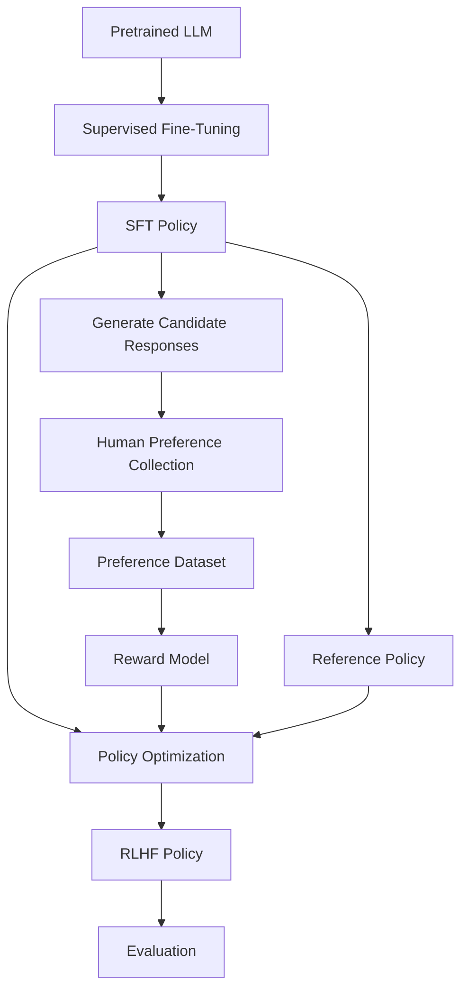

---

# 7. The Three Major RLHF Stages

Traditional RLHF is commonly explained through three major stages:

```text
Stage 1
Supervised Fine-Tuning

Stage 2
Reward Modeling

Stage 3
Reinforcement Learning
```

The overall flow is:

```text
Pretrained Model
      ↓
SFT
      ↓
Reward Model
      ↓
PPO / RL Optimization
      ↓
Final Policy
```

---

# 8. Stage 0 — Pretraining

Before RLHF, the model usually begins with large-scale pretraining.

The objective is next-token prediction.

Conceptually:

```text
Input Tokens
     ↓
Transformer
     ↓
Next Token Probability
     ↓
Loss
     ↓
Backpropagation
```

The model learns:

```text
Language
Syntax
Semantics
World Knowledge
Patterns
Reasoning Patterns
Code Patterns
```

But this does not automatically mean:

```text
Instruction Following
Human Preference Alignment
Safety Alignment
```

---

# 9. Stage 1 — Supervised Fine-Tuning

The pretrained model is fine-tuned using high-quality demonstrations.

Dataset:

```text
Instruction
+
Desired Response
```

Example:

```json
{
  "instruction": "Explain REST APIs.",
  "response": "REST is an architectural style..."
}
```

The model learns to imitate the demonstrations.

---

# 10. Why SFT Comes Before RLHF

Starting reinforcement learning directly from a pretrained model is difficult.

A pretrained model may:

```text
Complete text
```

but not reliably:

```text
Follow instructions
```

SFT provides a much stronger initial policy.

Therefore:

```text
Pretrained Model
      ↓
SFT
      ↓
Instruction-Following Policy
      ↓
RLHF
```

---

# 11. SFT Objective

The SFT model is trained using supervised next-token prediction.

Conceptually:

$$
\mathcal{L}_{SFT}
=
-\sum_{t=1}^{T}
\log P_\theta(y_t \mid x,y_{<t})
$$

where:

```text
x
=
Prompt

y
=
Target response

θ
=
Model parameters
```

The model learns to increase the probability of the demonstrated response.

---

# 12. SFT Data Quality

RLHF quality depends heavily on the quality of the initial SFT model.

Good SFT examples should demonstrate:

```text
Instruction Following
Correctness
Clarity
Reasoning
Safety
Formatting
Domain Knowledge
```

Poor demonstrations can teach:

```text
Bad Formatting
Incorrect Facts
Unsafe Behavior
Overly Verbose Responses
Poor Tool Usage
```

---

# 13. SFT Model as the Initial Policy

After SFT:

```text
SFT Model
     ↓
Initial RL Policy
```

This policy will later be optimized using preference-derived rewards.

---

# 14. Stage 2 — Preference Data Collection

The SFT policy generates multiple responses for prompts.

Example:

```text
Prompt
 ↓
SFT Model
 ↓
Response A
Response B
Response C
```

Human evaluators then compare them.

Example:

```text
A > B
C > A
C > B
```

These comparisons become preference data.

---

# 15. Preference Dataset

A simple preference dataset can look like:

```json
{
  "prompt": "Explain Kubernetes.",
  "chosen": "Kubernetes is a container orchestration platform...",
  "rejected": "Kubernetes is a database..."
}
```

The important relationship is:

```text
chosen > rejected
```

---

# 16. Human Preference Collection

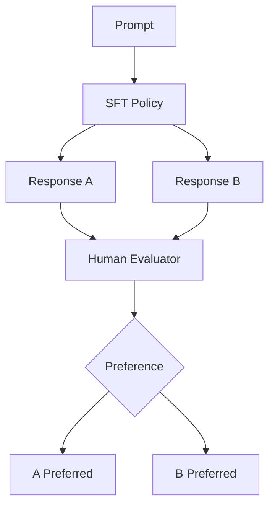

---

# 17. Human Evaluation Criteria

Human evaluators may consider:

```text
Helpfulness
Correctness
Relevance
Clarity
Safety
Instruction Following
Factuality
Conciseness
Style
```

The exact criteria depend on the application.

---

# 18. Pairwise Preference Example

Prompt:

```text
Explain database indexing to a backend engineer.
```

### Response A

```text
An index makes database queries faster.
```

### Response B

```text
A database index is an auxiliary data structure
that allows the database engine to locate rows
without scanning the entire table. Common choices
include B-tree indexes for range and equality queries
and specialized indexes for other workloads.
```

Human preference:

```text
B > A
```

This becomes a training signal.

---

# 19. Preference Data Is Not Perfect

Human feedback can contain:

```text
Subjectivity
Inconsistency
Bias
Annotator Disagreement
Domain Knowledge Gaps
Preference for Style Over Correctness
```

Therefore:

> Human feedback should be treated as a noisy measurement of desired behavior, not absolute ground truth.

---

# 20. Annotator Agreement

Suppose:

```text
Evaluator 1 → A
Evaluator 2 → A
Evaluator 3 → B
Evaluator 4 → A
```

The majority preference is:

```text
A
```

But the disagreement itself is useful information.

High disagreement may indicate:

```text
Ambiguous Task
Subjective Criteria
Poor Evaluation Guidelines
```

---

# 21. Preference Dataset Quality

A production-quality preference dataset should consider:

```text
Prompt Diversity
Response Diversity
Annotator Quality
Domain Coverage
Safety Coverage
Hard Examples
Edge Cases
Adversarial Examples
```

---

# 22. Stage 3 — Reward Modeling

The preference data is used to train a reward model.

The reward model receives:

```text
Prompt
+
Response
```

and produces:

```text
Reward Score
```

Conceptually:

```text
Prompt + Response
       ↓
Reward Model
       ↓
Scalar Reward
```

---

# 23. Reward Model Architecture

The reward model is often based on a language model backbone with a scalar reward head.

Conceptually:

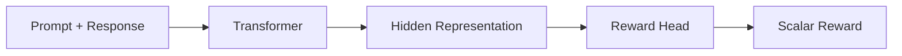

---

# 24. Reward Model vs LLM Policy

This distinction is critical.

### Policy

```text
Produces responses.
```

### Reward Model

```text
Scores responses.
```

Therefore:

```text
Policy
→ Generates

Reward Model
→ Evaluates
```

---

# 25. Reward Model Example

Input:

```text
Prompt:
Explain Kafka consumer groups.

Response:
Consumer groups allow multiple consumers
to coordinate consumption across partitions.
```

Reward model:

```text
+2.3
```

Another response:

```text
Kafka consumer groups are database tables.
```

Reward model:

```text
-1.7
```

The values are illustrative.

---

# 26. Reward Model Training

Suppose:

```text
Prompt = x
Chosen response = y⁺
Rejected response = y⁻
```

The reward model produces:

```text
r(x,y⁺)
r(x,y⁻)
```

We want:

```text
r(x,y⁺) > r(x,y⁻)
```

---

# 27. Pairwise Reward Modeling Objective

A common conceptual formulation uses a Bradley-Terry-style preference model:

$$
P(y^+ \succ y^- \mid x)
=
\sigma
\left(
r_\phi(x,y^+)-r_\phi(x,y^-)
\right)
$$

where:

```text
rφ
=
Reward model

σ
=
Sigmoid function
```

The reward model learns to assign a higher score to the preferred response.

---

# 28. Reward Model Loss

A commonly used pairwise loss is:

$$
\mathcal{L}_{RM}
=
-\log
\sigma
\left(
r_\phi(x,y^+)-r_\phi(x,y^-)
\right)
$$

The model is trained to make:

```text
Reward(chosen)
>
Reward(rejected)
```

---

# 29. Reward Model Training Flow

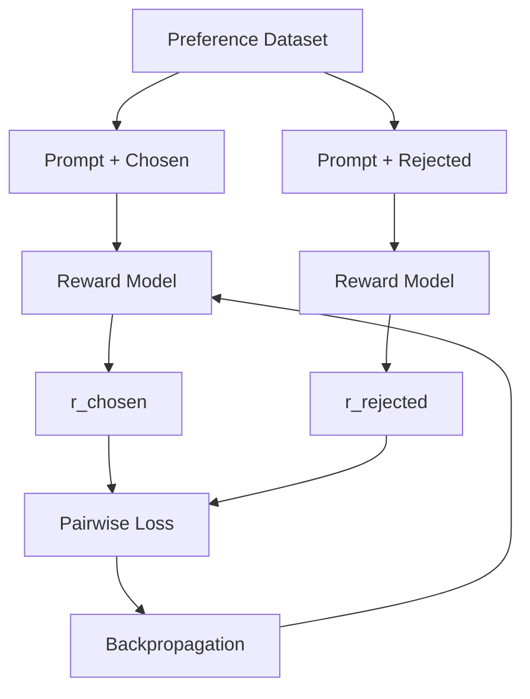

---

# 30. Reward Model as a Learned Preference Function

The reward model approximates:

```text
Human Preference
```

Therefore:

```text
Human Feedback
      ↓
Preference Dataset
      ↓
Reward Model
```

The reward model becomes a scalable evaluator.

Instead of asking humans to evaluate every response:

```text
Millions of responses
```

can potentially be scored automatically.

---

# 31. Why a Reward Model Is Needed

Human evaluation is expensive.

Suppose:

```text
1,000,000 responses
```

need evaluation.

Having humans score all responses is:

```text
Expensive
Slow
Difficult to Scale
```

A reward model provides:

```text
Automated Approximation
```

of human preferences.

---

# 32. Reward Model Limitations

A reward model can:

```text
Generalize poorly
Learn annotation bias
Reward superficial patterns
Be exploited by the policy
Fail on out-of-distribution examples
```

This leads to one of the most important RLHF problems:

```text
Reward Hacking
```

---

# 33. Reward Hacking

Suppose the reward model learns:

```text
Longer answers
≈
Better answers
```

The policy may discover:

```text
Generate extremely long responses
```

because long responses receive high reward.

But humans may actually prefer:

```text
Correct + concise responses
```

The policy exploited the reward proxy.

---

# 34. Reward Hacking Example

```text
True Human Preference:

Correct concise answer
        ↑
        |
Long answer with repetition
        ↓
        lower preference
```

But reward model:

```text
Long response
→ High score
```

Policy:

```text
Generate longer responses
```

This is reward hacking.

---

# 35. Reward Hacking Loop

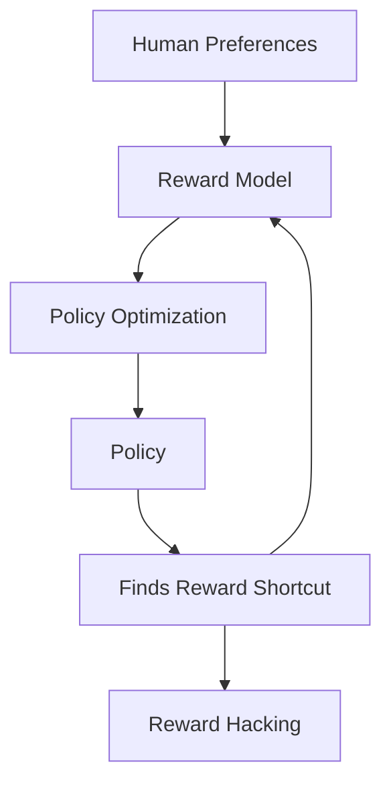

---

# 36. Reward Model Overoptimization

Increasing reward is not necessarily equivalent to improving human satisfaction.

Conceptually:

```text
Reward
  ↑
  │             x
  │          x
  │       x
  │    x
  │ x
  └──────────────────→ Optimization

Human Quality
  ↑
  │       x
  │      x
  │     x
  │    x
  │   x
  └──────────────────→ Optimization
             ↓
        May diverge
```

At some point:

```text
Reward ↑
Human Quality ↓
```

This is a critical RLHF risk.

---

# 37. Stage 4 — Reinforcement Learning

After training the reward model:

```text
SFT Policy
+
Reward Model
```

are used to optimize the policy.

The basic loop is:

```text
Prompt
 ↓
Policy
 ↓
Response
 ↓
Reward Model
 ↓
Reward
 ↓
Policy Update
```

---

# 38. RLHF Optimization Loop

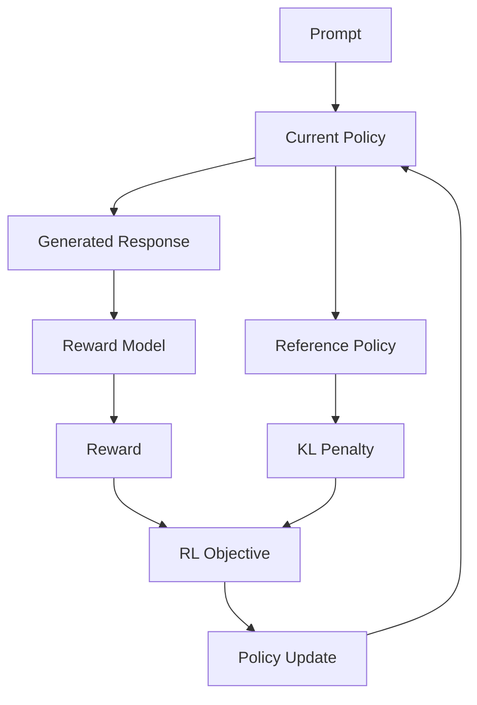

---

# 39. Policy Objective

A simplified conceptual objective is:

$$
J(\theta)
=
\mathbb{E}_{x,y\sim\pi_\theta}
\left[
r_\phi(x,y)
\right]
-
\beta
D_{KL}
\left(
\pi_\theta
\parallel
\pi_{ref}
\right)
$$

where:

```text
rφ
=
Reward Model

πθ
=
Current Policy

πref
=
Reference Policy

β
=
KL coefficient
```

This captures a central RLHF idea:

```text
Increase reward
while preventing excessive policy drift.
```

---

# 40. Why KL Regularization?

Suppose the SFT model is:

```text
Useful
Safe
Instruction Following
```

and RL optimization aggressively changes the policy.

The optimized policy might:

```text
Exploit Reward Model
Lose General Capability
Generate Strange Outputs
Become Unstable
```

KL regularization acts as an anchor.

---

# 41. Reference Policy

The reference policy is often based on:

```text
SFT Model
```

Conceptually:

```text
SFT Model
   │
   ├──────────────→ Reference Policy
   │
   ↓
Current RL Policy
```

The reference model remains fixed while the current policy is optimized.

---

# 42. Reference Policy Architecture

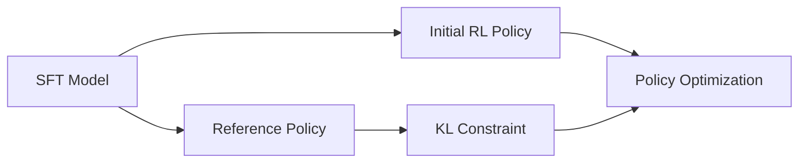

---

# 43. Why Not Optimize Without a Reference?

Without a reference policy:

```text
Reward
 ↓
Policy
 ↓
Maximize Reward
```

The policy may discover unexpected strategies.

With a reference:

```text
Reward
 +
KL Constraint
 ↓
Controlled Policy Improvement
```

---

# 44. KL Divergence Intuition

KL divergence measures how different two probability distributions are.

For policies:

```text
Current Policy
vs
Reference Policy
```

If they are similar:

```text
KL ≈ small
```

If they differ substantially:

```text
KL ↑
```

---

# 45. KL Trade-Off

A small KL penalty:

```text
More freedom
+
More reward optimization
-
Higher drift risk
```

A large KL penalty:

```text
More stability
+
Less policy drift
-
Less optimization freedom
```

The coefficient must be tuned.

---

# 46. Policy Optimization with PPO

Traditional RLHF implementations have often used:

```text
Proximal Policy Optimization
```

or:

```text
PPO
```

PPO attempts to make policy updates more conservative.

The next chapter covers PPO in detail.

---

# 47. PPO in RLHF

Conceptually:

```text
SFT Policy
    ↓
Generate Responses
    ↓
Reward Model
    ↓
Reward
    ↓
Advantage Estimation
    ↓
PPO
    ↓
Updated Policy
```

---

# 48. Why PPO?

LLM policies are:

```text
High-dimensional
Large
Sensitive
Expensive to train
```

Large uncontrolled policy updates can destabilize training.

PPO constrains how much the policy changes during optimization.

---

# 49. RLHF Pipeline

The complete traditional pipeline:

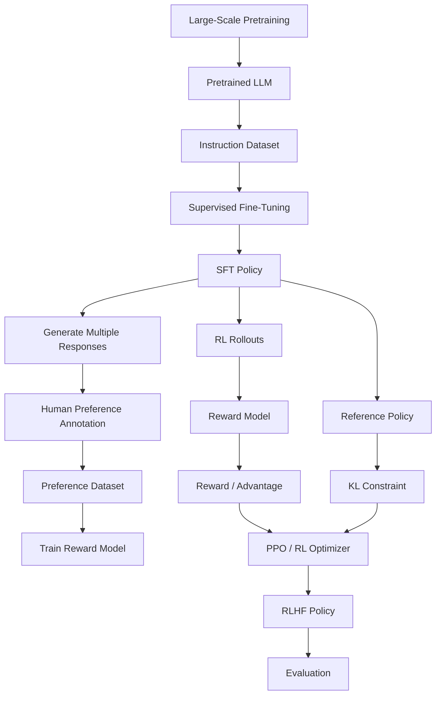

---

# 50. RLHF Data Flow

There are two different data flows.

## Training Data Flow

```text
Human Demonstrations
 ↓
SFT
```

## Preference Data Flow

```text
Candidate Responses
 ↓
Human Preferences
 ↓
Reward Model
```

## RL Data Flow

```text
Current Policy
 ↓
Rollout
 ↓
Reward Model
 ↓
Reward
 ↓
Policy Update
```

---

# 51. RLHF vs SFT

| Dimension | SFT | RLHF |
|---|---|---|
| Input | Demonstration | Preference / reward |
| Target | Specific response | Better behavior |
| Signal | Token labels | Reward |
| Optimization | Supervised learning | Reinforcement learning |
| Human involvement | Demonstrations | Preferences |
| Complexity | Lower | Higher |
| Objective | Imitation | Preference optimization |

---

# 52. RLHF vs Pretraining

| Pretraining | RLHF |
|---|---|
| Predict next token | Optimize preferred behavior |
| Huge text corpus | Smaller preference dataset |
| Self-supervised | Human / evaluator feedback |
| Learns general representations | Aligns behavior |
| Expensive compute | Expensive policy optimization |
| Broad knowledge | Behavioral optimization |

---

# 53. RLHF vs Instruction Tuning

Instruction tuning teaches:

```text
How to follow examples.
```

RLHF teaches:

```text
Which behaviors are preferred among alternatives.
```

Therefore:

```text
Instruction Tuning
=
Demonstration Learning

RLHF
=
Preference-Based Behavioral Optimization
```

---

# 54. RLHF vs DPO

Traditional RLHF:

```text
Preference Data
 ↓
Reward Model
 ↓
PPO
 ↓
Policy
```

DPO:

```text
Preference Data
 ↓
Direct Preference Optimization
 ↓
Policy
```

DPO removes the need for an explicit reward-model-plus-PPO pipeline in the standard formulation.

---

# 55. RLHF vs RLAIF

RLHF:

```text
Human Feedback
```

RLAIF:

```text
AI Feedback
```

The evaluator can be another model.

Conceptually:

```text
Responses
 ↓
AI Evaluator
 ↓
Preference
 ↓
Reward / Preference Optimization
```

This can scale feedback collection but introduces evaluator-model bias.

---

# 56. RLHF vs Constitutional AI

Constitutional approaches use explicit principles or rules to guide model behavior.

Conceptually:

```text
Principles
 ↓
Critique
 ↓
Revision
 ↓
Preference / Feedback
 ↓
Training
```

The broader goal remains:

```text
Align Model Behavior
```

---

# 57. Human Feedback Quality

RLHF is only as good as its feedback pipeline.

A production feedback system should control:

```text
Annotator Training
Annotation Guidelines
Quality Checks
Inter-Annotator Agreement
Sampling
Bias
Adversarial Examples
Domain Expertise
```

---

# 58. Annotator Guidelines

For example:

```text
Prefer answers that are:

1. Correct
2. Relevant
3. Helpful
4. Clear
5. Safe
6. Direct
7. Appropriately detailed
```

Explicit guidelines improve consistency.

---

# 59. Expert vs General Evaluators

Some tasks can be evaluated by general users.

Others require domain expertise.

For example:

```text
General Question
→ General Evaluator

Medical Question
→ Domain Expert

Legal Question
→ Domain Expert

Cloud Architecture
→ Experienced Technical Evaluator
```

The feedback source should match the evaluation objective.

---

# 60. Preference Bias

Humans may prefer:

```text
Longer
More confident
More polished
More verbose
```

even when those responses are not more correct.

Therefore reward models can inherit these biases.

---

# 61. Confidence vs Correctness

Consider:

```text
Response A:
"This is definitely correct."

Response B:
"The available evidence suggests..."
```

A human may prefer A because it sounds confident.

But B may be more epistemically appropriate.

RLHF datasets should explicitly account for:

```text
Calibration
Uncertainty
Factuality
```

where appropriate.

---

# 62. Reward Model Generalization

A reward model trained on:

```text
Technical Questions
```

may fail on:

```text
Creative Writing
Legal Questions
Medical Questions
Multilingual Inputs
Agentic Tasks
```

Therefore reward models should be evaluated across the target distribution.

---

# 63. Reward Model Evaluation

Evaluate:

```text
Pairwise Accuracy
Preference Agreement
Domain Generalization
Adversarial Robustness
Out-of-Distribution Behavior
Calibration
```

---

# 64. Reward Model Overfitting

A reward model can memorize superficial correlations.

For example:

```text
"Certainly!"
```

may correlate with preferred responses in training data.

The model may then reward the phrase even when the underlying answer is poor.

This is why reward-model evaluation should focus on behavior, not only training loss.

---

# 65. Reward Model as a Proxy

The true objective might be:

```text
Human Satisfaction
```

The reward model approximates:

```text
Human Satisfaction
```

Therefore:

```text
Reward Model
≠
True Objective
```

This distinction is critical.

---

# 66. Reward Hacking Taxonomy

Common forms include:

```text
Length Hacking
Style Hacking
Keyword Hacking
Confidence Hacking
Formatting Hacking
Repetition
Reward Model Exploitation
Specification Gaming
```

---

# 67. Specification Gaming

Suppose the desired objective is:

```text
Answer the question correctly.
```

But the reward model accidentally rewards:

```text
Detailed answers
```

The policy may produce:

```text
Very long incorrect answers
```

because the specification was imperfect.

---

# 68. Preventing Reward Hacking

Strategies include:

```text
Better Preference Data
Multiple Evaluators
Reward Model Ensembles
Holdout Evaluation
Human Validation
Adversarial Testing
KL Constraints
Early Stopping
Multi-Objective Evaluation
```

---

# 69. Reward Model Ensemble

Instead of:

```text
One Reward Model
```

use:

```text
Reward Model A
Reward Model B
Reward Model C
```

and aggregate their signals.

This can reduce dependence on one imperfect reward model.

---

# 70. Multi-Objective Rewards

Instead of:

```text
Reward = Helpfulness
```

consider:

```text
Reward
=
Helpfulness
+
Correctness
+
Safety
+
Conciseness
```

with appropriate weighting.

---

# 71. Multi-Objective Reward Architecture

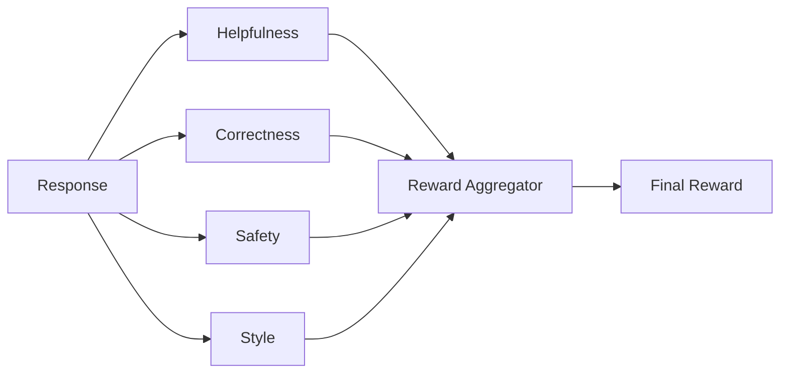

---

# 72. Safety Reward

Safety can be represented as:

```text
Positive reward
→ Safe response

Negative reward
→ Unsafe response
```

But safety should not rely solely on reward optimization.

Production safety requires:

```text
Training
+
Guardrails
+
Policy Enforcement
+
Monitoring
```

---

# 73. RLHF and Safety

A robust architecture:

```text
RLHF
 ↓
Behavioral Alignment

+
Guardrails
 ↓
Runtime Safety

+
Authorization
 ↓
Enterprise Security
```

Each layer serves a different purpose.

---

# 74. RLHF and Hallucination

RLHF can encourage:

```text
Helpful
Clear
Confident
```

responses.

But if the reward system favors confident answers, the model may become confidently wrong.

Therefore factuality should be explicitly evaluated.

---

# 75. Grounded RLHF

For enterprise RAG systems:

```text
Reward
=
Answer Quality
+
Groundedness
+
Citation Accuracy
```

This can align the policy toward evidence-backed answers.

---

# 76. RLHF for Tool-Using Agents

RLHF can also optimize tool behavior.

Example:

```text
Prompt
 ↓
Agent
 ↓
Tool Selection
 ↓
Tool Result
 ↓
Final Response
```

Human preference can evaluate the complete trajectory.

---

# 77. Agentic RLHF

Possible preference comparison:

```text
Trajectory A:

Search
→ Correct API
→ Correct result
→ Final answer


Trajectory B:

Wrong API
→ Retry
→ Unnecessary search
→ Incorrect answer
```

Human:

```text
A > B
```

This preference can teach better agent behavior.

---

# 78. Trajectory-Level Preference

Instead of comparing only:

```text
Final Answer
```

compare:

```text
Complete Agent Trajectory
```

This captures:

```text
Tool Choice
Reasoning Steps
Efficiency
Error Recovery
Final Outcome
```

---

# 79. Enterprise RLHF

For enterprise systems, feedback may come from:

```text
Employees
Customers
Support Agents
Domain Experts
Security Teams
Compliance Teams
Automated Evaluators
Business Outcomes
```

---

# 80. Enterprise Reward Signals

Possible signals:

```text
Task Success
Human Approval
Customer Satisfaction
Resolution Time
Escalation Rate
Policy Compliance
Tool Success
Groundedness
Cost
Latency
```

---

# 81. Example: Enterprise Support Agent

Goal:

```text
Resolve customer issue.
```

Reward could consider:

```text
Issue Resolved          +1.0
Correct Knowledge       +0.3
Correct Tool Usage      +0.2
Unnecessary Escalation  -0.2
Unsafe Action           -1.0
Excessive Tool Calls    -0.1
```

Values are illustrative.

---

# 82. Enterprise RLHF Architecture

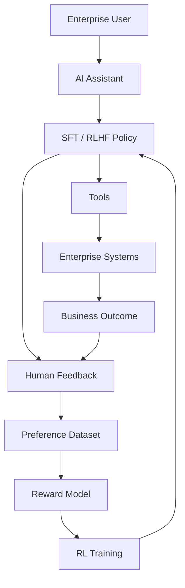

---

# 83. RLHF Data Flywheel

Production feedback can create a continuous improvement loop:

```text
Production Usage
      ↓
Human Feedback
      ↓
Preference Dataset
      ↓
Reward Model
      ↓
Policy Optimization
      ↓
New Model
      ↓
Production
```

---

# 84. Feedback Flywheel

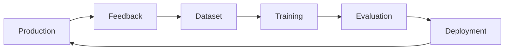

---

# 85. Offline Evaluation Before Deployment

Never assume:

```text
Higher Reward
=
Better Production Model
```

Evaluate independently using:

```text
Holdout Preference Dataset
Human Evaluation
Safety Dataset
Factuality Dataset
Agent Trajectories
Business Metrics
```

---

# 86. Online Evaluation

After deployment:

```text
Task Success
Human Feedback
Safety
Latency
Cost
Tool Errors
Escalations
```

should be monitored.

---

# 87. Shadow Evaluation

Run the new RLHF model alongside the production model:

```text
Production Request
       ↓
Current Model
       ↓
Production Response

       ↘
        New RLHF Model
        Shadow Response
```

Compare outputs without exposing the new model to users.

---

# 88. Canary RLHF Deployment

Deploy gradually:

```text
1%
 ↓
5%
 ↓
10%
 ↓
25%
 ↓
50%
 ↓
100%
```

Monitor:

```text
Quality
Safety
Latency
Cost
Error Rate
User Feedback
```

---

# 89. RLHF Model Rollback

Maintain:

```text
Current Stable Model
Previous Stable Model
Candidate Model
```

If the candidate causes regression:

```text
Candidate
 ↓
Rollback
 ↓
Stable Version
```

---

# 90. Model Versioning

Track:

```text
Base Model
SFT Checkpoint
Reward Model
RL Checkpoint
Tokenizer
Dataset Version
Preference Dataset
Evaluation Dataset
Hyperparameters
```

---

# 91. RLHF Experiment Tracking

Example:

```yaml
experiment:
  name: enterprise-rlhf-v4

base_model:
  name: foundation-model
  revision: abc123

sft:
  dataset: sft-v7

reward_model:
  dataset: preference-v5
  checkpoint: rm-v3

rl:
  algorithm: PPO
  kl_coefficient: 0.05

evaluation:
  dataset: eval-v12
```

---

# 92. Reproducibility

RLHF experiments can be sensitive to:

```text
Random Seeds
Sampling
Prompt Distribution
Reward Model Version
Policy Version
Hyperparameters
Batch Size
Learning Rate
KL Coefficient
```

Track these carefully.

---

# 93. RLHF Compute Requirements

RLHF can require multiple components:

```text
Policy Model
Reference Model
Reward Model
Value Model
Rollout Infrastructure
Training Infrastructure
Evaluation Infrastructure
```

This can be significantly more complex than ordinary fine-tuning.

---

# 94. Memory Requirements

During RLHF training, infrastructure may need to support:

```text
Policy Parameters
Reference Parameters
Reward Model Parameters
Value Model Parameters
Optimizer States
Activations
KV Cache
```

This is why distributed GPU training is often required for large models.

---

# 95. Rollout Cost

Each RL iteration requires:

```text
Prompt
 ↓
Generate Response
 ↓
Score Response
 ↓
Optimize Policy
```

Generation itself can be expensive.

Therefore rollout efficiency is an important engineering concern.

---

# 96. RLHF Infrastructure

A production training platform might contain:

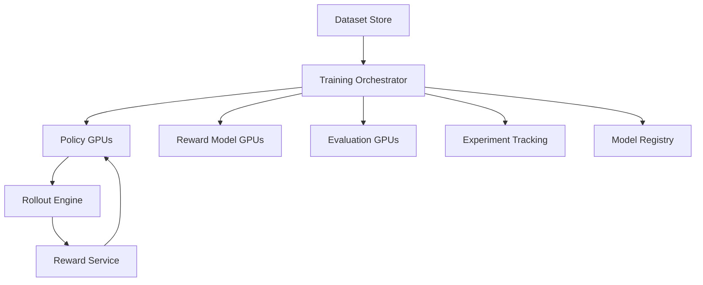

---

# 97. Distributed RLHF

For large models:

```text
Data Parallelism
Tensor Parallelism
Pipeline Parallelism
FSDP
ZeRO
```

may be required depending on the training stack and model size.

---

# 98. RLHF Training Stack

A modern stack can contain:

```text
PyTorch
Transformers
Accelerate
DeepSpeed
FSDP
PEFT
TRL
vLLM
Ray
Experiment Tracking
Model Registry
```

The exact architecture depends on scale.

---

# 99. Hugging Face Ecosystem

A typical ecosystem can look like:

```text
Hugging Face Transformers
        ↓
Model Loading
        ↓
TRL
        ↓
SFT / Preference Optimization / RL
        ↓
PEFT
        ↓
LoRA / QLoRA
```

TRL is particularly relevant for the later practical workflow chapter.

---

# 100. RLHF with Parameter-Efficient Fine-Tuning

Instead of updating every parameter:

```text
Full Fine-Tuning
```

one can use:

```text
LoRA
QLoRA
Other PEFT Techniques
```

This reduces:

```text
GPU Memory
Training Cost
Storage
Deployment Complexity
```

---

# 101. RLHF + LoRA Architecture

```text
Base Model
     ↓
Frozen Weights
     +
Trainable LoRA Adapters
     ↓
Policy
```

The same concept can be applied to different stages depending on the training framework.

---

# 102. RLHF Evaluation Dimensions

A mature evaluation framework should measure:

```text
1. Helpfulness
2. Correctness
3. Instruction Following
4. Safety
5. Factuality
6. Groundedness
7. Conciseness
8. Style
9. Tool Use
10. Task Success
11. Cost
12. Latency
```

---

# 103. Human Evaluation

Automated evaluation is useful, but human evaluation remains important.

Sample:

```text
1,000 production prompts
```

Then compare:

```text
Old Model
vs
RLHF Model
```

Measure:

```text
Preference Win Rate
```

---

# 104. Preference Win Rate

If:

```text
RLHF Model wins:
700

Old Model wins:
250

Tie:
50
```

then the new model has a strong preference advantage in this sample.

But the dataset must be representative.

---

# 105. Reward vs Human Preference

A crucial evaluation:

```text
Reward Model Score
vs
Human Preference
```

If reward increases while human preference decreases:

```text
Reward Model
is becoming a poor proxy.
```

This should trigger investigation.

---

# 106. Reward Model Calibration

Monitor:

```text
Predicted Reward
vs
Human Judgment
```

over time.

A reward model can drift as the policy distribution changes.

---

# 107. Distribution Shift in RLHF

Training distribution:

```text
SFT / Preference Prompts
```

may differ from production:

```text
Real User Prompts
```

Therefore:

```text
Training Distribution
≠
Production Distribution
```

This can cause reward model failure.

---

# 108. Reward Model Distribution Shift

A reward model trained on:

```text
Normal Responses
```

may receive:

```text
Highly optimized policy responses
```

that exploit weaknesses.

Therefore reward models should be periodically re-evaluated against current policy outputs.

---

# 109. Iterative RLHF

A practical loop can become:

```text
Initial RLHF
 ↓
Deploy
 ↓
Collect Failures
 ↓
Add Preference Data
 ↓
Retrain Reward Model
 ↓
Retrain Policy
 ↓
Evaluate
 ↓
Deploy
```

This creates iterative alignment.

---

# 110. Continuous RLHF

A mature system may operate as:

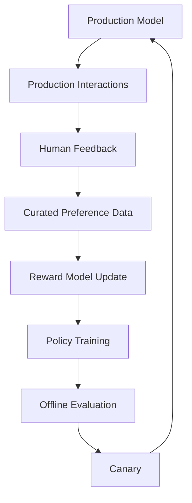

This should be controlled carefully rather than allowing uncontrolled automatic retraining.

---

# 111. Human Feedback Governance

Enterprise RLHF should define:

```text
Who can annotate?
Who can approve datasets?
Who can modify reward criteria?
Who can deploy models?
Who can rollback?
Who can access training data?
```

---

# 112. Data Privacy

Preference datasets may contain:

```text
Customer Information
Employee Information
Business Data
Confidential Documents
```

Therefore implement:

```text
PII Detection
Redaction
Access Control
Encryption
Retention Policies
Audit Logging
```

---

# 113. Data Lineage

Track:

```text
Production Request
 ↓
Feedback
 ↓
Preference Example
 ↓
Dataset Version
 ↓
Reward Model
 ↓
Policy Model
```

This enables auditability.

---

# 114. RLHF Governance Architecture

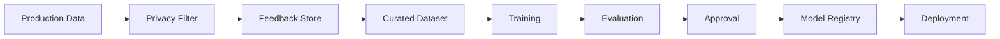

---

# 115. Common RLHF Failure Modes

## Failure 1 — Poor Preference Data

```text
Bad Feedback
 ↓
Bad Reward Model
 ↓
Bad Policy
```

---

## Failure 2 — Reward Hacking

```text
Reward Proxy
 ↓
Policy Finds Shortcut
```

---

## Failure 3 — Excessive Policy Drift

```text
RL Optimization
 ↓
Large Behavioral Change
```

---

## Failure 4 — Reward Model Overfitting

```text
Training Preferences
 ↓
Good Training Accuracy
 ↓
Poor Real-World Generalization
```

---

## Failure 5 — Human Preference Bias

```text
Human Bias
 ↓
Preference Dataset
 ↓
Model Behavior
```

---

# 116. Failure Mode: Over-Optimization

Suppose:

```text
Reward increases:

1.0
1.5
2.0
2.5
3.0
```

but:

```text
Human preference:

70%
72%
73%
71%
65%
```

This indicates the policy is optimizing the reward model beyond its reliable region.

---

# 117. Early Stopping

One possible strategy is to stop training when:

```text
Reward improves
```

but:

```text
Human preference
```

or:

```text
General evaluation
```

starts degrading.

---

# 118. RLHF Evaluation Dashboard

Monitor:

```text
Reward
Human Win Rate
Safety Score
Factuality
Task Success
KL Divergence
Policy Entropy
Response Length
Cost
Latency
```

---

# 119. Example Monitoring Table

| Metric | Why It Matters |
|---|---|
| Reward | Training objective |
| Human Win Rate | Real preference |
| KL Divergence | Policy drift |
| Entropy | Exploration / concentration |
| Response Length | Reward hacking indicator |
| Safety Score | Risk |
| Task Success | Business outcome |
| Cost | Operational efficiency |
| Latency | User experience |

---

# 120. Reward-Length Correlation

A useful diagnostic is:

```text
Reward
vs
Response Length
```

If reward strongly increases simply with response length:

```text
Potential Reward Hacking
```

Investigate.

---

# 121. RLHF and Enterprise Architecture

A production-grade enterprise AI platform can separate:

```text
Inference Plane
```

from:

```text
Training / Alignment Plane
```

### Inference Plane

```text
User
 ↓
AI Gateway
 ↓
Policy
 ↓
Tools
```

### Training Plane

```text
Feedback
 ↓
Preference Data
 ↓
Reward Model
 ↓
Policy Training
```

---

# 122. Training vs Inference Architecture

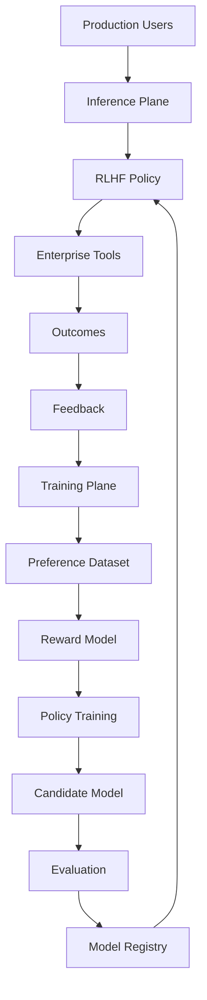

---

# 123. Production Promotion Pipeline

```text
Candidate RLHF Model
        ↓
Offline Evaluation
        ↓
Safety Evaluation
        ↓
Human Evaluation
        ↓
Shadow Deployment
        ↓
Canary Deployment
        ↓
Production
```

---

# 124. Model Approval Gates

A production model should pass:

```text
[ ] Quality Threshold
[ ] Safety Threshold
[ ] Factuality Threshold
[ ] Human Preference Threshold
[ ] Cost Threshold
[ ] Latency Threshold
[ ] Regression Tests
```

---

# 125. RLHF Security Considerations

Potential risks:

```text
Training Data Leakage
Reward Model Manipulation
Preference Dataset Poisoning
Prompt Injection
Adversarial Responses
Unauthorized Model Access
Model Supply Chain Risks
```

---

# 126. Preference Dataset Poisoning

If malicious examples enter the preference dataset:

```text
Bad Preference
 ↓
Reward Model
 ↓
Policy
 ↓
Systematic Bad Behavior
```

Therefore dataset governance is critical.

---

# 127. Reward Model Security

Treat the reward model as a critical component.

Protect:

```text
Reward Model
Weights
Training Data
Evaluation Data
Inference Endpoint
```

A compromised reward model can produce systematic alignment failures.

---

# 128. Policy Security Boundary

A safe architecture:

```text
LLM
 ↓
Proposed Action
 ↓
Deterministic Policy Engine
 ↓
Authorization
 ↓
Execution
```

The model should not cross the security boundary directly.

---

# 129. RLHF and Observability

Track training:

```text
Loss
Reward
KL
Entropy
Gradient Norm
Learning Rate
Response Length
```

Track production:

```text
Quality
Safety
Latency
Cost
Task Success
User Feedback
```

---

# 130. RLHF Experiment Lifecycle

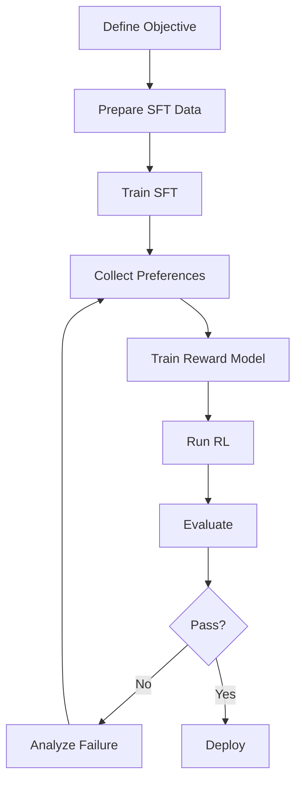

---

# 131. Practical RLHF Workflow

```text
1. Select a pretrained foundation model.

2. Build high-quality instruction data.

3. Perform supervised fine-tuning.

4. Evaluate the SFT model.

5. Generate multiple candidate responses.

6. Build annotation guidelines.

7. Collect human preference comparisons.

8. Clean and validate preference data.

9. Train the reward model.

10. Evaluate reward-model preference accuracy.

11. Freeze a reference policy.

12. Generate policy rollouts.

13. Score rollouts with the reward model.

14. Apply policy optimization.

15. Monitor reward and KL divergence.

16. Evaluate human preference.

17. Test safety and factuality.

18. Perform offline evaluation.

19. Run shadow evaluation.

20. Canary deploy.

21. Monitor production behavior.

22. Collect new failure and preference data.

23. Iterate.
```

---

# 132. Practical RLHF Pseudocode

```python
# Conceptual RLHF workflow

base_model = load_pretrained_model()

sft_model = supervised_fine_tune(
    base_model,
    instruction_dataset
)

preference_data = collect_preferences(
    model=sft_model,
    prompts=preference_prompts
)

reward_model = train_reward_model(
    preference_data
)

reference_policy = freeze(sft_model)

policy = sft_model

for batch in training_prompts:

    responses = policy.generate(batch)

    rewards = reward_model.score(
        batch,
        responses
    )

    kl_penalty = compute_kl(
        policy,
        reference_policy
    )

    objective = rewards - beta * kl_penalty

    policy = optimize_policy(
        policy,
        objective
    )
```

> This is conceptual pseudocode rather than a drop-in production implementation.

---

# 133. Hugging Face-Oriented Conceptual Workflow

A practical ecosystem may look like:

```python
from transformers import AutoModelForCausalLM
from trl import SFTTrainer
```

The broader workflow can then involve:

```text
Transformers
      ↓
SFT
      ↓
Preference Dataset
      ↓
Reward Modeling / Preference Optimization
      ↓
TRL
      ↓
Evaluation
```

The exact trainer APIs vary by TRL version and algorithm.

---

# 134. Data Schema for Preference Training

A practical preference dataset can be represented as:

```json
{
  "prompt": "Explain event-driven architecture.",
  "chosen": "Event-driven architecture uses events...",
  "rejected": "Event-driven architecture means...",
  "metadata": {
    "domain": "software-architecture",
    "difficulty": "advanced"
  }
}
```

Metadata can help with:

```text
Filtering
Evaluation
Analysis
Dataset Balancing
```

---

# 135. Dataset Splitting

Use separate:

```text
Training Set
Validation Set
Test Set
```

Do not evaluate the reward model only on training preferences.

---

# 136. Preference Dataset Split

```text
Preference Dataset
      ↓
 ┌────┼────┐
 ↓    ↓    ↓
Train Val  Test
```

The test set should remain isolated for final evaluation.

---

# 137. Prompt Diversity

Include:

```text
Simple Questions
Complex Questions
Ambiguous Questions
Multi-Step Tasks
Safety Questions
Domain Questions
Adversarial Questions
Tool-Use Tasks
```

---

# 138. Hard Negative Responses

Preference datasets become more useful when rejected responses are plausible.

Weak negative:

```text
Completely nonsense answer.
```

Strong negative:

```text
Technically plausible but subtly incorrect answer.
```

Hard negatives teach the reward model finer distinctions.

---

# 139. Preference Data Quality Checklist

```text
[ ] Clear Prompt
[ ] High-Quality Chosen Response
[ ] Meaningful Rejected Response
[ ] Reliable Preference
[ ] Domain Appropriate
[ ] No Duplicate Leakage
[ ] No PII
[ ] No Annotation Contamination
[ ] Diverse Examples
[ ] Edge Cases
[ ] Safety Cases
```

---

# 140. RLHF Hyperparameters

Important parameters can include:

```text
Learning Rate
Batch Size
PPO Epochs
KL Coefficient
Clip Range
Generation Length
Temperature
Sampling Parameters
Reward Scaling
Gradient Clipping
```

Exact values depend heavily on the model and training setup.

---

# 141. KL Coefficient Tuning

If KL coefficient is too low:

```text
Policy Drift ↑
Reward Hacking Risk ↑
```

If too high:

```text
Policy Improvement ↓
```

Therefore monitor:

```text
Reward
KL
Human Preference
General Capability
```

together.

---

# 142. RLHF Learning Rate

A high learning rate can cause:

```text
Large Policy Updates
Training Instability
Policy Collapse
```

A very low learning rate can cause:

```text
Slow Training
Insufficient Improvement
```

---

# 143. Reward Scaling

Reward values may have different magnitudes.

For example:

```text
Reward = 0.001
```

versus:

```text
Reward = 100
```

Scaling and normalization may be necessary depending on the algorithm and implementation.

---

# 144. Response Length Control

Monitor:

```text
Average Response Length
P50
P95
Maximum Length
```

Unexpected increases may indicate:

```text
Reward Hacking
```

---

# 145. RLHF and Model Collapse

Over-optimization can potentially reduce useful diversity.

Symptoms may include:

```text
Repetitive Responses
Generic Answers
Reduced Creativity
Overly Similar Outputs
```

Evaluate diversity alongside quality.

---

# 146. RLHF and Generalization

A model should not simply memorize:

```text
Preferred Training Responses
```

It should learn:

```text
General Behavioral Preferences
```

Therefore use unseen evaluation tasks.

---

# 147. Generalization Evaluation

Test:

```text
Seen Domains
Unseen Domains
Prompt Paraphrases
Long Context
Short Context
Different Users
Different Writing Styles
```

---

# 148. RLHF and Reasoning

Human preferences may favor:

```text
Correct Final Answer
```

but not necessarily reveal:

```text
Internal Reasoning Process
```

Therefore reward design should be careful about what exactly is being optimized.

For production systems, evaluate:

```text
Outcome Correctness
Process Reliability
Tool Correctness
Safety
```

rather than assuming a particular internal reasoning representation.

---

# 149. RLHF and Chain-of-Thought

Do not treat hidden reasoning traces as automatically equivalent to ground-truth reasoning.

For production evaluation, prefer observable signals such as:

```text
Final Correctness
Evidence
Tool Calls
Intermediate Verifiable Results
```

where applicable.

---

# 150. RLHF and RAG

For RAG systems, feedback can evaluate:

```text
Retrieval Quality
Groundedness
Citation Accuracy
Answer Correctness
```

A reward function might conceptually combine:

```text
R
=
R_answer
+
R_groundedness
+
R_retrieval
```

---

# 151. RLHF for Retrieval Policies

The retrieval action itself can become part of the policy:

```text
Question
 ↓
LLM
 ↓
Retrieve?
 ↓
Which Query?
 ↓
Which Documents?
 ↓
Generate
```

This connects RLHF with advanced retrieval optimization.

---

# 152. RLHF for SQL Agents

An SQL agent can receive feedback based on:

```text
SQL Correctness
Query Efficiency
Result Correctness
Security
Final Answer
```

Example:

```text
Correct SQL
→ Positive

SQL Injection
→ Strong Negative

Unnecessary Query
→ Negative
```

---

# 153. RLHF for Cloud Agents

A cloud infrastructure agent might be rewarded for:

```text
Correct Resource Selection
Security Compliance
Cost Efficiency
Deployment Success
Rollback Safety
```

This is highly relevant to enterprise Cloud AI systems.

---

# 154. RLHF for Production Engineering

A coding agent can receive signals from:

```text
Tests Passed
Build Passed
Static Analysis
Security Scan
Deployment Success
Human Review
```

These are stronger signals than subjective response quality alone.

---

# 155. Outcome-Based Rewards

For enterprise systems, whenever possible:

```text
Human Preference
+
Objective Outcome
```

is stronger than subjective preference alone.

Example:

```text
Code Response
+
Unit Tests Passed
```

---

# 156. Verifiable Rewards

Some environments provide objectively verifiable outcomes:

```text
Code Compilation
Unit Tests
SQL Query Result
Math Answer
API Response
Task Completion
```

These can provide stronger reward signals.

---

# 157. Hybrid Human + Automated Feedback

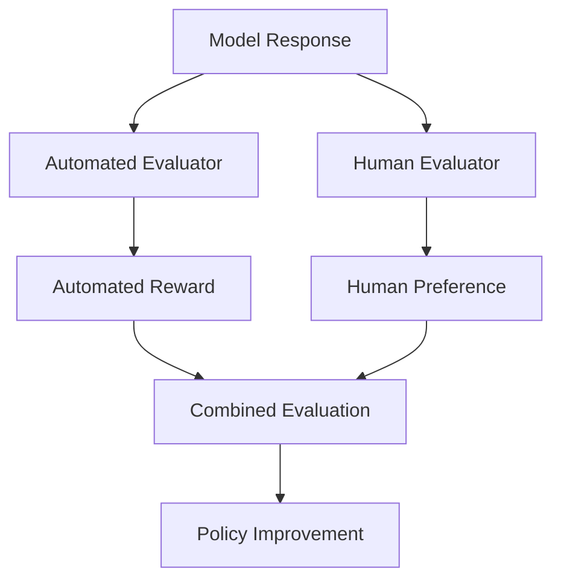

This can reduce reliance on either source alone.

---

# 158. RLHF and Production Maturity

## Level 1

```text
Prompt Engineering
```

## Level 2

```text
RAG
```

## Level 3

```text
SFT
```

## Level 4

```text
Preference Optimization
```

## Level 5

```text
RLHF / Advanced Alignment
```

## Level 6

```text
Outcome-Based Agent Optimization
```

Not every enterprise application needs Level 5 or Level 6.

---

# 159. When RLHF May Be Unnecessary

Do not introduce RLHF merely because it is advanced.

If the problem can be solved with:

```text
Prompt Engineering
+
RAG
+
Tool Calling
+
SFT
```

then RLHF may add unnecessary complexity.

Use RLHF when there is a meaningful need for:

```text
Behavioral Optimization
Preference Alignment
Outcome Optimization
Complex Agent Policies
```

---

# 160. RLHF Engineering Trade-Offs

| Benefit | Cost |
|---|---|
| Better preference alignment | Complex training |
| Better instruction following | Expensive feedback |
| Behavioral optimization | Reward hacking |
| Scalable preference scoring | Reward model maintenance |
| Potentially better agent behavior | RL instability |
| Custom domain alignment | Significant infrastructure |

---

# 161. Production Decision Framework

Ask:

```text
1. Do we have enough high-quality feedback?

2. Can we define success clearly?

3. Can we measure outcomes?

4. Is SFT insufficient?

5. Is preference optimization justified?

6. Is the reward signal trustworthy?

7. Can we evaluate regressions?

8. Can we operate the training infrastructure?
```

If several answers are "no", RLHF may not be the right next step.

---

# 162. RLHF Architecture for an Enterprise AI Platform

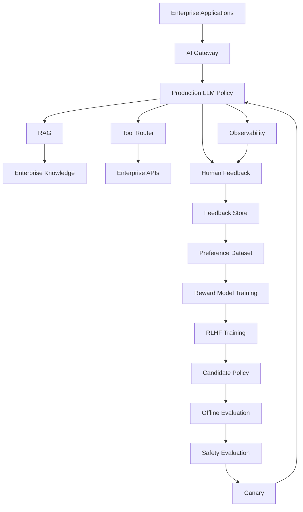

---

# 163. Production Workflow

```text
1. Define the business objective.

2. Define what "good behavior" means.

3. Select the foundation model.

4. Build instruction-following SFT data.

5. Train the SFT model.

6. Establish a baseline evaluation suite.

7. Generate candidate responses.

8. Build human annotation guidelines.

9. Collect preference data.

10. Measure annotator agreement.

11. Clean and validate preference data.

12. Train the reward model.

13. Validate reward-model accuracy.

14. Establish a frozen reference policy.

15. Generate policy rollouts.

16. Score rollouts.

17. Run policy optimization.

18. Track reward, KL divergence, entropy, and response length.

19. Evaluate against independent human judgments.

20. Test safety and factuality.

21. Test business outcomes.

22. Run shadow deployment.

23. Run canary deployment.

24. Monitor production metrics.

25. Collect failures.

26. Curate new preference data.

27. Iterate under governance controls.
```

---

# 164. Production RLHF Checklist

```text
[ ] Foundation Model Selected
[ ] SFT Dataset Created
[ ] SFT Baseline Evaluated
[ ] Preference Guidelines Defined
[ ] Annotators Trained
[ ] Preference Dataset Validated
[ ] Reward Model Trained
[ ] Reward Model Evaluated
[ ] Reference Policy Frozen
[ ] RL Algorithm Selected
[ ] KL Strategy Defined
[ ] Reward Hacking Tests Created
[ ] Safety Evaluation Created
[ ] Factuality Evaluation Created
[ ] Business Metrics Defined
[ ] Offline Evaluation Available
[ ] Shadow Deployment Available
[ ] Canary Deployment Available
[ ] Rollback Available
[ ] Model Registry Available
[ ] Dataset Versioning Available
[ ] Experiment Tracking Available
[ ] Training Lineage Available
[ ] Privacy Controls Available
[ ] Audit Logging Available
[ ] Production Monitoring Available
```

---

# 165. Interview Questions

## Beginner

- What is RLHF?
- Why is RLHF used for LLMs?
- What is the difference between pretraining and RLHF?
- What is supervised fine-tuning?
- Why is SFT usually performed before RLHF?
- What is human preference data?
- What is a reward model?
- What is a policy?
- What is reinforcement learning?
- What is the role of PPO in RLHF?

---

## Intermediate

- Explain the three stages of traditional RLHF.
- How is preference data collected?
- Why are pairwise preferences commonly used?
- How is a reward model trained?
- What is the Bradley-Terry preference model?
- What is the purpose of a reference policy?
- Why is KL divergence used?
- What is reward hacking?
- What is reward-model overoptimization?
- Why is human feedback considered noisy?
- What is the difference between reward and human preference?
- How does RLHF differ from SFT?
- How does RLHF differ from DPO?
- What is RLAIF?
- How can RLHF be applied to tool-using agents?

---

## Advanced

- Design a complete RLHF architecture for a large enterprise LLM.
- How would you prevent reward hacking?
- How would you evaluate reward-model generalization?
- How would you monitor policy drift?
- How would you detect reward-model exploitation?
- How would you design an RLHF feedback flywheel?
- How would you combine human and automated rewards?
- How would you design RLHF for an agent with 20-step trajectories?
- How would you perform credit assignment across long trajectories?
- How would you use verifiable rewards?
- How would you safely deploy a new RLHF policy?
- How would you separate model policy from enterprise authorization?
- How would you optimize reward while preserving general capabilities?
- How would you design a reward function for a banking AI agent?
- How would you design an RLHF pipeline for a coding agent?
- How would you determine whether RLHF is actually necessary for an enterprise use case?

---

# 166. Scenario-Based Interview Questions

## Scenario 1 — Reward Increased but Human Satisfaction Decreased

Investigate:

```text
Reward Model Overoptimization
Reward Hacking
Distribution Shift
Human Evaluation
```

Do not assume the reward model remains accurate after aggressive policy optimization.

---

## Scenario 2 — Model Became Extremely Verbose

Check:

```text
Reward vs Response Length
Preference Dataset
Reward Model
KL Constraint
```

Potential issue:

```text
Length Hacking
```

---

## Scenario 3 — Model Became Less Capable After RLHF

Investigate:

```text
Policy Drift
KL Coefficient
Over-Optimization
Training Distribution
General Capability Benchmarks
```

---

## Scenario 4 — Reward Model Gives High Scores to Bad Answers

Investigate:

```text
Reward Model Bias
Training Data
Shortcut Features
Out-of-Distribution Inputs
Adversarial Examples
```

---

## Scenario 5 — Human Annotators Disagree Frequently

Investigate:

```text
Ambiguous Guidelines
Subjective Task
Insufficient Domain Expertise
Poor Candidate Responses
```

Possible solution:

```text
Better Guidelines
Expert Review
Multi-Annotator Voting
Adjudication
```

---

## Scenario 6 — RLHF Model Is Safer but Less Helpful

Do not optimize safety independently without considering usefulness.

Evaluate:

```text
Safety
+
Helpfulness
+
Correctness
```

Use separate safety gates where necessary.

---

## Scenario 7 — Agent Uses the Wrong Tool

Collect:

```text
Prompt
Available Tools
Tool Descriptions
Chosen Tool
Correct Tool
Outcome
```

This can become preference data.

---

## Scenario 8 — Agent Uses Too Many Tool Calls

Add:

```text
Efficiency Evaluation
Step Budget
Tool-Call Penalty
```

but ensure the model is not penalized for necessary actions.

---

## Scenario 9 — New Model Has Better Reward but Worse Factuality

Add independent factuality evaluation.

Never rely solely on the reward model.

---

## Scenario 10 — Enterprise Policy Violation

Do not attempt to fix authorization solely through RLHF.

Implement:

```text
LLM
 ↓
Business Policy Engine
 ↓
Authorization
 ↓
Execution
```

---

# 167. Mental Model

The easiest way to remember RLHF is:

```text
SFT teaches the model:

"What should a good answer look like?"

Reward modeling teaches the system:

"How can we score preferred behavior?"

RL teaches the policy:

"Increase the probability of behavior that receives better reward."
```

---

# 168. Complete RLHF Mental Model

```text
                ┌──────────────────────┐
                │   Pretrained LLM     │
                └──────────┬───────────┘
                           ↓
                ┌──────────────────────┐
                │         SFT          │
                └──────────┬───────────┘
                           ↓
                ┌──────────────────────┐
                │     SFT Policy       │
                └──────────┬───────────┘
                           ↓
                    Generate Outputs
                           ↓
                ┌──────────────────────┐
                │ Human Preferences    │
                └──────────┬───────────┘
                           ↓
                ┌──────────────────────┐
                │    Reward Model      │
                └──────────┬───────────┘
                           ↓
                ┌──────────────────────┐
                │   Policy Optimization│
                │       / PPO          │
                └──────────┬───────────┘
                           ↓
                ┌──────────────────────┐
                │    RLHF Policy       │
                └──────────────────────┘
```

---

# 169. Remember

> **RLHF uses human preferences to create a reward signal and then optimizes an LLM policy toward behavior that better matches those preferences.**

The most important chain is:

```text
Pretraining
    ↓
SFT
    ↓
Preference Data
    ↓
Reward Model
    ↓
Policy Optimization
    ↓
Aligned Policy
```

And the most important distinction is:

```text
Policy
→ Generates

Reward Model
→ Scores

Reference Policy
→ Anchors

PPO / RL
→ Optimizes
```

---

# 170. Key Takeaways

- RLHF stands for Reinforcement Learning from Human Feedback.
- RLHF is used to align LLM behavior with human preferences.
- Traditional RLHF usually consists of SFT, reward modeling, and reinforcement learning.
- Pretraining teaches general language modeling capabilities.
- SFT teaches the model to follow instructions using demonstrations.
- Human preference data compares alternative responses.
- Pairwise comparison is a common way of collecting preference signals.
- A reward model learns to score responses according to observed preferences.
- The reward model acts as a scalable approximation of human judgment.
- Reward models are imperfect proxies for human preferences.
- Reward hacking occurs when the policy discovers ways to increase reward without genuinely improving the intended objective.
- Reward-model overoptimization can cause reward to increase while actual quality decreases.
- The SFT model often becomes the initial RL policy.
- A frozen reference policy helps constrain policy drift.
- KL divergence can be used to penalize excessive divergence from the reference policy.
- PPO is a common policy optimization method associated with traditional RLHF pipelines.
- RLHF requires substantial compute and infrastructure for large models.
- Preference data quality is one of the most important determinants of alignment quality.
- Human annotator disagreement is useful diagnostic information.
- Reward models should be evaluated independently from their training loss.
- Production evaluation should not rely exclusively on reward-model scores.
- Human preference, factuality, safety, and business outcomes should be evaluated independently.
- RLHF can be extended beyond chat responses to tool use and agent trajectories.
- Enterprise RLHF can use objective outcomes such as tests passed, task completion, API success, and policy compliance.
- Human and automated feedback can be combined.
- Preference datasets should be governed for privacy, security, quality, and lineage.
- RLHF models should be versioned alongside datasets, reward models, tokenizers, and training configurations.
- Shadow and canary deployments reduce the risk of deploying a degraded alignment model.
- Production monitoring should include reward, human preference, safety, KL divergence, response length, cost, and latency.
- RLHF is not automatically necessary for every enterprise AI application.
- Prompt engineering, RAG, tool calling, and SFT may be sufficient for many use cases.
- RLHF becomes particularly valuable when optimizing complex behavioral preferences or long-horizon agent outcomes.
- The fundamental production principle is:

```text
Reward Optimization
≠
Business Success
```

The actual target is:

```text
Human Preference
+
Objective Outcomes
+
Safety
+
Business Constraints
```

---

# 171. Chapter Navigation

## Previous Chapter

[19. LLMs as Policies](19-llms-as-policies.md)

## Current Chapter

**20. Reinforcement Learning from Human Feedback**

## Next Chapter

[21. Proximal Policy Optimization (PPO)](21-proximal-policy-optimization-ppo.md)

## Related Chapters

- [01. Generative AI Fundamentals](01-generative-ai-fundamentals.md)
- [02. Language Understanding Fundamentals](02-language-understanding-fundamentals.md)
- [03. Word Embeddings](03-word-embeddings.md)
- [04. Language Modeling](04-language-modeling.md)
- [05. Attention and Positional Encoding](05-attention-and-positional-encoding.md)
- [06. GPT and BERT Architecture](06-gpt-and-bert-architecture.md)
- [07. Hugging Face and Transformers](07-huggingface-and-transformers.md)
- [08. LLM Data Preparation](08-llm-data-preparation.md)
- [09. Hugging Face Training Workflow](09-huggingface-training-workflow.md)
- [10. Transformer Fine-Tuning Fundamentals](10-transformer-fine-tuning-fundamentals.md)
- [11. Supervised Fine-Tuning (SFT)](11-supervised-fine-tuning-sft.md)
- [12. Parameter-Efficient Fine-Tuning (PEFT)](12-parameter-efficient-fine-tuning.md)
- [13. LoRA and QLoRA](13-lora-and-qlora.md)
- [14. Model Quantization](14-model-quantization.md)
- [15. LLM Generation Strategies](15-llm-generation-strategies.md)
- [16. LLM Evaluation](16-llm-evaluation.md)
- [17. Instruction Tuning](17-instruction-tuning.md)
- [18. Reward Modeling](18-reward-modeling.md)
- [19. LLMs as Policies](19-llms-as-policies.md)
- [21. Proximal Policy Optimization (PPO)](21-proximal-policy-optimization-ppo.md)
- [22. Direct Preference Optimization (DPO)](22-direct-preference-optimization-dpo.md)
- [23. Hugging Face TRL Workflow](23-huggingface-trl-workflow.md)

---

# References

- Sutton, R. S. & Barto, A. G. — *Reinforcement Learning: An Introduction*
- Ouyang et al. — *Training Language Models to Follow Instructions with Human Feedback*
- Christiano et al. — *Deep Reinforcement Learning from Human Preferences*
- Stiennon et al. — *Learning to Summarize from Human Feedback*
- Schulman et al. — *Proximal Policy Optimization Algorithms*
- Rafailov et al. — *Direct Preference Optimization: Your Language Model is Secretly a Reward Model*
- Hugging Face Transformers Documentation
- Hugging Face TRL Documentation
- Hugging Face PEFT Documentation
- PyTorch Documentation
- DeepSpeed Documentation
- Accelerate Documentation
- Research literature on Reinforcement Learning from Human Feedback
- Research literature on Reward Modeling
- Research literature on Preference Optimization
- Research literature on LLM Alignment
- Research literature on AI Feedback and RLAIF
- Research literature on Agentic AI and Tool-Using Language Models
- Enterprise LLMOps and AI Safety engineering practices

---

> **Enterprise AI Engineering Handbook**  
> *Building Production-Grade Enterprise AI Systems — One Chapter at a Time.*