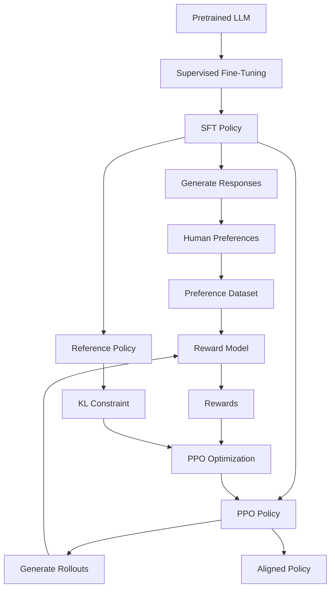
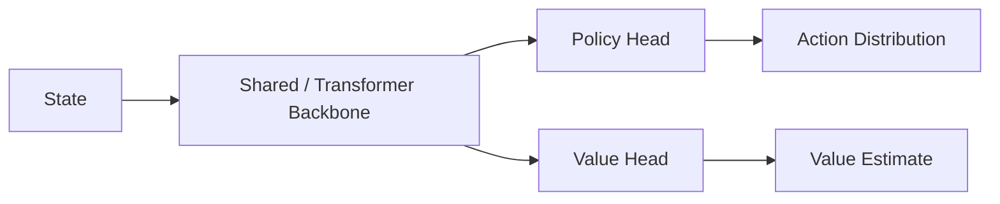
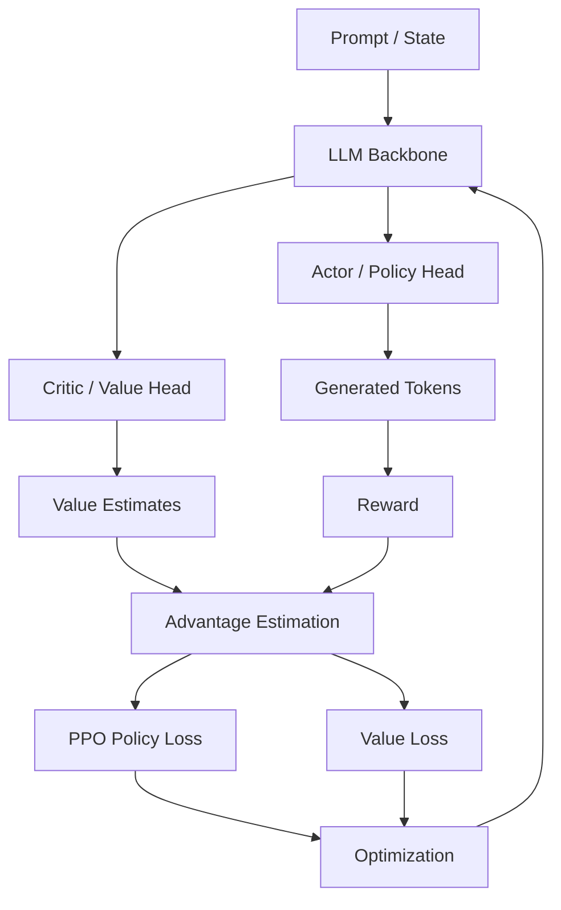
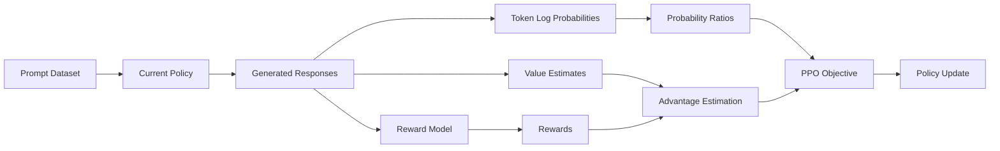
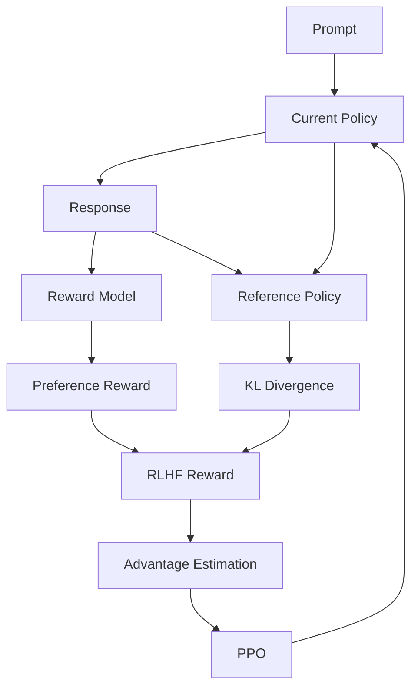
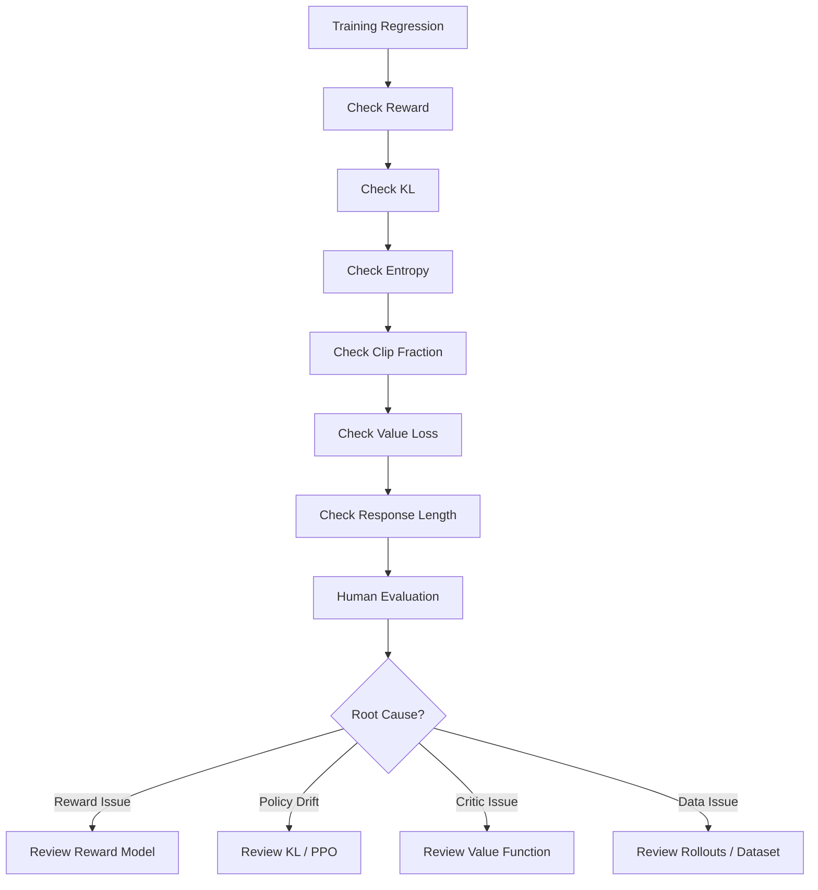
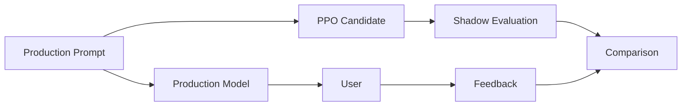
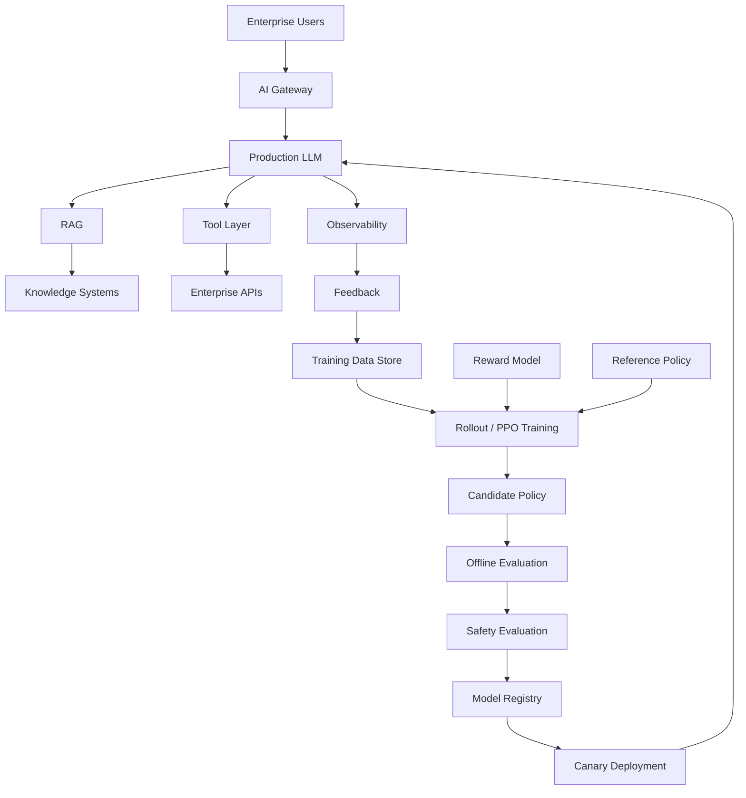
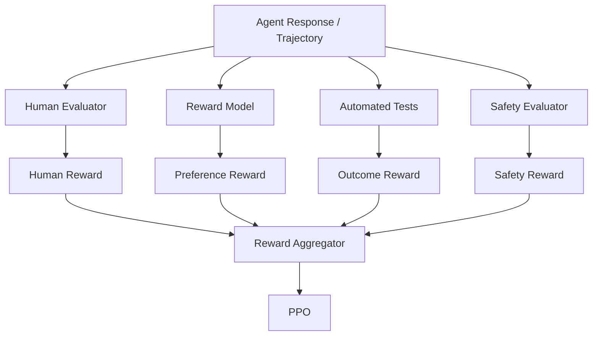

# 21 — Proximal Policy Optimization (PPO)

> A production-oriented guide to **Proximal Policy Optimization (PPO)**, covering PPO fundamentals, policy gradients, rewards, advantages, probability ratios, clipping, surrogate objectives, value functions, entropy, KL divergence, PPO training loops, PPO in RLHF, LLM-specific considerations, implementation concepts, failure modes, monitoring, enterprise AI architecture, and production deployment.

---

# 1. Overview

**Proximal Policy Optimization (PPO)** is a policy-gradient reinforcement learning algorithm designed to improve a policy while preventing excessively large policy updates.

PPO became particularly important in the LLM alignment ecosystem because traditional RLHF pipelines commonly used PPO to optimize an instruction-tuned language model against a learned reward model.

The high-level relationship is:

```text
Human Preferences
       ↓
Reward Model
       ↓
Reward
       ↓
PPO
       ↓
Updated LLM Policy
```

The key idea behind PPO is:

> **Improve the policy, but keep each update sufficiently close to the previous policy so that training remains stable.**

---

# 2. Why PPO Matters for LLMs

An LLM can be treated as a policy:

```text
Prompt
  ↓
LLM Policy
  ↓
Token Distribution
  ↓
Generated Response
```

During RLHF, we want the model to increase the probability of actions that lead to higher rewards.

However, aggressively changing the policy can cause:

```text
Policy Instability
Reward Hacking
Capability Regression
Mode Collapse
Training Divergence
```

PPO addresses this by limiting how much the policy can change during an optimization step.

---

# 3. PPO in the RLHF Pipeline



The critical PPO stage is:

```text
Current Policy
      ↓
Generate Rollout
      ↓
Calculate Reward
      ↓
Calculate Advantage
      ↓
PPO Objective
      ↓
Update Policy
```

---

# 4. What Problem Does PPO Solve?

Suppose the current policy generates a response with reward:

```text
+2.5
```

We want the model to increase the probability of the actions that produced this reward.

A naive policy-gradient algorithm might make a very large update:

```text
Old Policy
    ↓
Large Gradient Update
    ↓
Very Different Policy
```

PPO instead encourages:

```text
Old Policy
    ↓
Controlled Update
    ↓
Nearby Improved Policy
```

This is the origin of the word:

```text
Proximal
```

The new policy should remain **proximal**, or close, to the previous policy during an update.

---

# 5. Reinforcement Learning Foundations

Before understanding PPO, we need several concepts.

```text
State
Action
Policy
Reward
Return
Value
Advantage
```

For an LLM:

```text
State
≈ Prompt + Previously Generated Tokens

Action
≈ Next Token

Policy
≈ LLM

Reward
≈ Reward Model Score
```

---

# 6. State in an LLM

Traditional RL:

```text
State → Environment
```

For an LLM:

```text
Prompt
+
Generated Tokens
```

can represent the current state.

Example:

```text
Prompt:
Explain Kafka.

Generated:
Kafka is
```

The next token is selected based on the current sequence.

---

# 7. Action in an LLM

In traditional RL:

```text
State
 ↓
Action
```

For an autoregressive LLM:

```text
Current Tokens
 ↓
Next Token
```

Therefore:

```text
Action = Next Token
```

A complete response is a sequence of actions:

```text
a₁ → a₂ → a₃ → ... → aₜ
```

---

# 8. Policy

A policy determines the probability of selecting an action given a state.

For an LLM:

```text
Policy
=
P(next token | previous tokens)
```

Conceptually:

```text
Prompt
 ↓
Transformer
 ↓
Probability Distribution
 ↓
Next Token
```

---

# 9. Reward

A reward tells the agent how desirable an outcome was.

In RLHF:

```text
Prompt
+
Response
 ↓
Reward Model
 ↓
Reward
```

Example:

```text
Response A → +1.8
Response B → -0.4
```

The reward is a training signal.

---

# 10. Return

The **return** represents cumulative reward.

In general reinforcement learning:

$$
G_t =
r_t +
\gamma r_{t+1} +
\gamma^2 r_{t+2} + \cdots
$$

where:

```text
Gₜ
=
Return from timestep t

rₜ
=
Reward

γ
=
Discount factor
```

For many language-model RL settings, the reward structure differs from simple environments because the main reward may arrive at the end of a generated sequence.

---

# 11. Value Function

The value function estimates the expected future return from a state.

Conceptually:

```text
State
 ↓
Value Function
 ↓
Expected Future Reward
```

Written as:

$$
V^\pi(s)
=
\mathbb{E}_\pi[G_t \mid s_t=s]
$$

The value function helps PPO determine whether an action was better or worse than expected.

---

# 12. Advantage Function

The advantage tells us how much better or worse an action performed compared with the expected value of the current state.

Conceptually:

```text
Advantage
=
Actual Outcome
-
Expected Outcome
```

A simplified formulation is:

$$
A^\pi(s,a)
=
Q^\pi(s,a)-V^\pi(s)
$$

where:

```text
Qπ(s,a)
=
Expected return after taking action a

Vπ(s)
=
Expected return from state s
```

---

# 13. Advantage Intuition

Suppose:

```text
Expected reward = 1.0
Actual reward   = 2.0
```

Then:

```text
Advantage > 0
```

The action performed better than expected.

The policy should generally:

```text
Increase probability
```

of similar actions.

If:

```text
Expected reward = 2.0
Actual reward   = 0.5
```

then:

```text
Advantage < 0
```

The action performed worse than expected.

The policy should generally:

```text
Decrease probability
```

of similar actions.

---

# 14. Policy Gradient

The basic policy-gradient idea is:

```text
Generate Action
      ↓
Observe Reward
      ↓
Increase Probability of Good Actions
      ↓
Decrease Probability of Bad Actions
```

A simplified objective is:

$$
J(\theta)
=
\mathbb{E}
\left[
\log \pi_\theta(a|s)
A_t
\right]
$$

where:

```text
πθ
=
Current policy

Aₜ
=
Advantage
```

---

# 15. Why Vanilla Policy Gradient Can Be Unstable

Suppose:

```text
Old probability = 0.01
New probability = 0.50
```

That is a massive policy change.

The reward might improve during one update, but the model can move into a very different behavioral region.

This creates:

```text
High Variance
Large Updates
Instability
```

PPO introduces a mechanism to constrain the update.

---

# 16. PPO's Core Idea

PPO compares:

```text
New Policy
vs
Old Policy
```

using a probability ratio.

The ratio is:

$$
r_t(\theta)
=
\frac{
\pi_\theta(a_t|s_t)
}{
\pi_{\theta_{old}}(a_t|s_t)
}
$$

This tells us how much the probability of an action changed.

---

# 17. Probability Ratio Intuition

If:

```text
Old probability = 0.20
New probability = 0.24
```

then:

```text
Ratio = 1.2
```

The probability increased by:

```text
20%
```

If:

```text
Old probability = 0.20
New probability = 0.10
```

then:

```text
Ratio = 0.5
```

The probability decreased by:

```text
50%
```

---

# 18. Why the Ratio Matters

PPO asks:

```text
How much did the new policy change
the probability of this action?
```

This lets PPO control the magnitude of policy updates.

---

# 19. PPO Clipping

The central PPO mechanism is **clipping**.

The clipped objective is:

$$
L^{CLIP}(\theta)
=
\mathbb{E}_t
\left[
\min
\left(
r_t(\theta)A_t,
\operatorname{clip}
(r_t(\theta),1-\epsilon,1+\epsilon)A_t
\right)
\right]
$$

where:

```text
rₜ
=
Probability ratio

Aₜ
=
Advantage

ε
=
Clipping range
```

The clipping prevents the policy from benefiting too much from a large probability change.

---

# 20. PPO Clipping Intuition

Suppose:

```text
ε = 0.2
```

Then the ratio is effectively constrained around:

```text
0.8
to
1.2
```

Conceptually:

```text
Allowed region

0.8 ───────── 1.0 ───────── 1.2
       old policy
```

The objective prevents extreme policy updates from producing unlimited improvement in the surrogate objective.

---

# 21. Why `min()` Is Used

The PPO objective considers:

```text
Unclipped Objective
```

and:

```text
Clipped Objective
```

and uses the more conservative one.

Conceptually:

```text
Potentially aggressive improvement
          ↓
      Clipping
          ↓
Conservative policy update
```

---

# 22. Positive Advantage

If:

```text
Aₜ > 0
```

the action was better than expected.

We want:

```text
π_new(a|s)
↑
```

But PPO prevents this increase from becoming excessively large.

---

# 23. Negative Advantage

If:

```text
Aₜ < 0
```

the action was worse than expected.

We want:

```text
π_new(a|s)
↓
```

Again, PPO prevents an excessively large update.

---

# 24. PPO Objective Visualization

```text
Objective
   ↑
   │             ┌──────────────
   │            /
   │           /
   │          /
   │         /
   │        /
   │───────●──────────────────→ Probability Ratio
         1-ε   1    1+ε
```

The clipping region limits the useful effect of large policy changes.

---

# 25. PPO vs Vanilla Policy Gradient

| Aspect | Vanilla Policy Gradient | PPO |
|---|---|---|
| Policy updates | Can be large | Controlled |
| Stability | Lower | Higher |
| Probability ratio | Not central | Central |
| Clipping | No | Yes |
| Practicality | Simpler | More robust |
| RLHF usage | Less common | Historically common |

---

# 26. PPO and Trust Regions

PPO is related conceptually to trust-region methods.

The idea is:

```text
Do not move too far
from the current policy
during one optimization step.
```

Instead of allowing unrestricted optimization:

```text
Old Policy
      ↓
Huge Search Space
```

PPO effectively focuses optimization around:

```text
Old Policy
      ↓
Local / Proximal Region
```

---

# 27. PPO and TRPO

Another important algorithm is:

```text
Trust Region Policy Optimization
```

TRPO explicitly constrains policy divergence.

PPO provides a simpler practical approximation using mechanisms such as clipping.

Conceptually:

```text
TRPO
→ Explicit trust-region constraint

PPO
→ Practical clipped surrogate objective
```

---

# 28. Value Function in PPO

PPO typically uses both:

```text
Policy Model
```

and:

```text
Value Model
```

The policy answers:

```text
What action should I take?
```

The value model answers:

```text
How good is this state expected to be?
```

---

# 29. Actor-Critic Structure



For an LLM:

```text
Transformer
    ├── Policy Head → Token probabilities
    └── Value Head  → Value estimate
```

---

# 30. Actor

The actor is the policy.

For an LLM:

```text
Prompt + Context
      ↓
Transformer
      ↓
Token Probability Distribution
```

The actor decides:

```text
Which token should be generated?
```

---

# 31. Critic

The critic estimates:

```text
Expected Return
```

Conceptually:

```text
Prompt + Generated Context
       ↓
Value Head
       ↓
V(s)
```

The critic helps estimate the advantage.

---

# 32. Actor-Critic Training



---

# 33. Generalized Advantage Estimation

PPO implementations often use **Generalized Advantage Estimation (GAE)**.

The temporal-difference residual can be written as:

$$
\delta_t
=
r_t
+
\gamma V(s_{t+1})
-
V(s_t)
$$

GAE then combines these residuals:

$$
\hat{A}_t^{GAE(\gamma,\lambda)}
=
\sum_{l=0}^{\infty}
(\gamma\lambda)^l
\delta_{t+l}
$$

where:

```text
γ
=
Discount factor

λ
=
GAE smoothing parameter
```

GAE provides a useful trade-off between:

```text
Bias
and
Variance
```

---

# 34. Why Advantage Estimation Matters

Poor advantage estimates can produce:

```text
Noisy Gradients
Unstable Training
Slow Convergence
```

Better advantage estimates provide:

```text
Cleaner Policy Signals
```

---

# 35. PPO Loss Components

A practical PPO implementation commonly involves several losses:

```text
Policy Loss
+
Value Loss
-
Entropy Bonus
```

Conceptually:

$$
L
=
L_{policy}
+
c_vL_{value}
-
c_eH
$$

where:

```text
L_policy
=
Policy objective

L_value
=
Value-function loss

H
=
Entropy

c_v
=
Value-loss coefficient

c_e
=
Entropy coefficient
```

The exact implementation varies.

---

# 36. Policy Loss

The policy loss is based on the clipped surrogate objective.

Its goal is:

```text
Increase good actions
Decrease bad actions
```

while limiting the size of the policy update.

---

# 37. Value Loss

The critic needs to learn accurate value estimates.

A common value objective uses a squared-error-style loss:

$$
L_V
=
\left(
V_\theta(s_t)-V_t^{target}
\right)^2
$$

The value target represents an estimate of the expected return.

---

# 38. Entropy

Entropy measures uncertainty in the policy distribution.

Conceptually:

```text
High Entropy
→ More exploration / diversity

Low Entropy
→ More concentrated policy
```

The entropy of a policy can be expressed as:

$$
H(\pi)
=
-\sum_a
\pi(a|s)
\log \pi(a|s)
$$

---

# 39. Why Entropy Matters

Without sufficient exploration:

```text
Policy
 ↓
Repeats Existing Behavior
 ↓
Limited Exploration
```

An entropy bonus can encourage the policy to retain some diversity.

But excessive entropy can reduce exploitation of good behavior.

---

# 40. PPO Training Cycle

The typical PPO cycle is:

```text
1. Collect Rollouts
2. Calculate Rewards
3. Estimate Values
4. Calculate Advantages
5. Optimize Policy
6. Optimize Value Function
7. Repeat
```

---

# 41. PPO Rollout

A rollout is an interaction trajectory generated by the current policy.

For an LLM:

```text
Prompt
 ↓
Policy
 ↓
Token 1
 ↓
Token 2
 ↓
Token 3
 ↓
...
 ↓
Final Response
```

The resulting sequence is evaluated.

---

# 42. LLM Rollout Example

Prompt:

```text
Explain event-driven architecture.
```

Policy generates:

```text
Event-driven architecture is a software
architecture in which components communicate
through events...
```

The reward model then evaluates:

```text
Prompt + Response
```

and produces a reward.

---

# 43. Token-Level vs Sequence-Level Reward

LLM RL can involve different reward structures.

### Token-level

```text
Reward at multiple timesteps
```

### Sequence-level

```text
One major reward
at the end of the response
```

A simplified RLHF setup often has a strong terminal reward from the reward model.

---

# 44. Sparse Rewards

If reward is mostly provided at the end:

```text
Token 1
Token 2
Token 3
...
Token 100
       ↓
    Reward
```

credit assignment becomes difficult.

The system must determine which actions contributed to the final outcome.

---

# 45. Credit Assignment

Suppose:

```text
100-token response
```

receives:

```text
Reward = +2
```

Which tokens caused the success?

Possibilities:

```text
Early Planning
Correct Terminology
Useful Evidence
Correct Final Answer
```

Advantage estimation helps distribute learning signals across the trajectory.

---

# 46. PPO for Language Generation

The policy distribution is:

```text
πθ(token | context)
```

For a generated response:

```text
y₁, y₂, ..., yₜ
```

the sequence probability is based on the product of token probabilities:

$$
\pi_\theta(y|x)
=
\prod_{t=1}^{T}
\pi_\theta(y_t|x,y_{<t})
$$

In practice, computations are usually performed in log-probability space for numerical stability.

---

# 47. Log Probabilities

Instead of multiplying many probabilities:

```text
p₁ × p₂ × p₃ × ... × pₜ
```

we use:

```text
log p₁ + log p₂ + log p₃ + ... + log pₜ
```

This is computationally more stable.

---

# 48. PPO Ratio for LLM Tokens

For a token action:

$$
r_t(\theta)
=
\frac{
\pi_\theta(y_t|x,y_{<t})
}{
\pi_{\theta_{old}}(y_t|x,y_{<t})
}
$$

This ratio can be calculated for each generated token.

---

# 49. LLM PPO Data

A rollout record can conceptually contain:

```json
{
  "prompt": "...",
  "response": "...",
  "tokens": ["..."],
  "old_logprobs": ["..."],
  "values": ["..."],
  "rewards": ["..."],
  "advantages": ["..."]
}
```

This is illustrative rather than a framework-specific schema.

---

# 50. PPO Data Pipeline



---

# 51. PPO and the Reference Policy in RLHF

PPO itself focuses on stable policy optimization.

Traditional RLHF adds another important constraint:

```text
Current Policy
vs
Reference Policy
```

The reference policy is usually based on the SFT model.

The objective may therefore include a KL penalty.

Conceptually:

```text
PPO Objective
      +
Reward
      -
KL Penalty
```

---

# 52. KL Penalty

A conceptual RLHF objective is:

$$
R_{total}
=
R_{reward}
-
\beta
D_{KL}
(
\pi_\theta
\parallel
\pi_{ref}
)
$$

This discourages the optimized policy from drifting too far from the reference model.

---

# 53. PPO vs KL Constraint

These mechanisms solve related but different problems.

### PPO clipping

Controls:

```text
Policy update
relative to the old policy
```

### KL regularization

Controls:

```text
Policy divergence
relative to a reference policy
```

In RLHF, both concepts can appear together.

---

# 54. PPO Training Loop for RLHF

```text
SFT Policy
    ↓
Copy / Freeze Reference Policy
    ↓
Generate Rollouts
    ↓
Calculate Reward Model Score
    ↓
Calculate KL Penalty
    ↓
Calculate Final Reward
    ↓
Estimate Values
    ↓
Calculate Advantages
    ↓
PPO Update
    ↓
Repeat
```

---

# 55. PPO + Reward Model Architecture



---

# 56. PPO Training Pseudocode

```python
# Conceptual PPO loop

policy = load_sft_policy()
reference_policy = freeze_copy(policy)

for iteration in range(num_iterations):

    prompts = sample_prompts()

    responses = policy.generate(prompts)

    old_logprobs = policy.log_probs(
        prompts,
        responses
    )

    values = policy.value_estimates(
        prompts,
        responses
    )

    reward = reward_model.score(
        prompts,
        responses
    )

    kl = compute_kl(
        policy,
        reference_policy,
        prompts,
        responses
    )

    total_reward = reward - beta * kl

    advantages = estimate_advantages(
        total_reward,
        values
    )

    for epoch in range(ppo_epochs):

        new_logprobs = policy.log_probs(
            prompts,
            responses
        )

        ratio = exp(
            new_logprobs - old_logprobs
        )

        clipped_ratio = clip(
            ratio,
            1 - epsilon,
            1 + epsilon
        )

        policy_loss = -mean(
            minimum(
                ratio * advantages,
                clipped_ratio * advantages
            )
        )

        value_loss = calculate_value_loss(
            policy,
            values
        )

        entropy = calculate_entropy(policy)

        loss = (
            policy_loss
            + value_coefficient * value_loss
            - entropy_coefficient * entropy
        )

        optimizer.zero_grad()
        loss.backward()
        optimizer.step()
```

> This is conceptual pseudocode intended to explain the PPO/RLHF mechanics. Exact implementation details depend on the training framework.

---

# 57. PPO Algorithm — Simplified

```text
Initialize policy πθ
Initialize reference policy πref
Initialize value function V

Repeat:

    Sample prompts

    Generate responses using πθ

    Calculate:
        old log probabilities
        rewards
        values

    Calculate:
        KL penalty
        advantages

    For several optimization epochs:

        Calculate new log probabilities

        ratio =
            new probability
            /
            old probability

        Clip ratio

        Calculate policy loss

        Calculate value loss

        Calculate entropy

        Update model

Until convergence or stopping condition
```

---

# 58. PPO Clipping Example

Suppose:

```text
ε = 0.2
```

and:

```text
Advantage = +5
```

If:

```text
ratio = 1.1
```

then:

```text
1.1 × 5 = 5.5
```

The update is within the clipping range.

If:

```text
ratio = 1.8
```

the ratio exceeds:

```text
1 + ε = 1.2
```

and the clipped objective limits the benefit of that large update.

---

# 59. Negative Advantage Example

Suppose:

```text
Advantage = -5
```

and:

```text
ratio = 0.7
```

The policy is strongly reducing the probability of an action that performed poorly.

PPO limits extreme changes through clipping.

---

# 60. Why PPO Is Called "Proximal"

Because it attempts to prevent the optimized policy from moving too far from the policy used to collect the rollout.

Conceptually:

```text
Old Policy
     ●
    / \
   /   \
  /     \
Allowed Update Region
```

rather than:

```text
Old Policy
     ●
      \
       \
        \
         ●
      New Policy
```

with a very large behavioral jump.

---

# 61. PPO Epochs

PPO can reuse collected rollout data for multiple optimization epochs.

This improves data efficiency.

However, excessive reuse can cause:

```text
Overfitting to Rollout Data
Policy Drift
Training Instability
```

Therefore:

```text
PPO Epochs
```

must be controlled.

---

# 62. On-Policy Nature of PPO

PPO is generally considered an **on-policy** method.

That means data is collected using the current or recent policy.

This differs from many off-policy methods that can reuse older experience more extensively.

For LLMs, this matters because generating new responses is expensive.

---

# 63. PPO Data Efficiency Challenge

```text
Generate Rollout
      ↓
Optimize
      ↓
Data Becomes Stale
      ↓
Generate New Rollout
```

Therefore PPO training can require substantial inference compute.

---

# 64. PPO and LLM Compute

Large LLM PPO training may involve:

```text
Policy Model
Reference Model
Reward Model
Value Model
Rollout Engine
Optimizer
```

This creates significant GPU and memory requirements.

---

# 65. PPO Memory Architecture

```text
GPU Memory
│
├── Policy Parameters
├── Policy Gradients
├── Optimizer States
├── Activations
├── Value Head
├── Reference Model / Reference Outputs
└── Rollout / KV Cache
```

Distributed training techniques may be required for large models.

---

# 66. PPO with LoRA

Parameter-efficient approaches can reduce trainable parameter count.

Conceptually:

```text
Frozen Base Model
       +
LoRA Adapter
       ↓
Trainable Policy
```

This can reduce:

```text
Memory
Storage
Training Cost
```

but does not eliminate the complexity of rollouts, reward evaluation, and policy optimization.

---

# 67. PPO with Quantization

Quantization can reduce memory requirements.

Conceptually:

```text
FP16 / BF16
     ↓
Lower Precision Representation
     ↓
Reduced Memory
```

However, RL training has additional numerical stability considerations, so quantization choices must be validated carefully.

---

# 68. PPO Training Stability

Monitor:

```text
Policy Loss
Value Loss
Reward
KL Divergence
Entropy
Clip Fraction
Gradient Norm
Response Length
```

These metrics together provide a much better view than reward alone.

---

# 69. Clip Fraction

The **clip fraction** indicates how often policy ratios are affected by PPO clipping.

Conceptually:

```text
Low clip fraction
→ Most updates within allowed region

Very high clip fraction
→ Many updates hitting the constraint
```

A sudden increase can indicate overly aggressive updates.

---

# 70. KL Divergence Monitoring

Track:

```text
Current Policy
vs
Reference Policy
```

and:

```text
Current Policy
vs
Rollout / Old Policy
```

depending on the implementation.

Unexpected KL spikes can indicate instability.

---

# 71. Entropy Monitoring

If entropy drops too quickly:

```text
Policy becomes overly deterministic
```

Potential consequences:

```text
Reduced Exploration
Reduced Diversity
Mode Collapse
```

If entropy remains excessively high:

```text
Policy may fail to exploit learned preferences effectively.
```

---

# 72. Value Loss Monitoring

High or unstable value loss can indicate:

```text
Poor Reward Signal
Bad Advantage Estimates
Critic Instability
Learning Rate Problems
```

The critic is an important part of PPO stability.

---

# 73. Reward Curve

A typical training dashboard may show:

```text
Reward
 ↑
 │            ______
 │         __/
 │      __/
 │   __/
 │__/
 └────────────────────→ Training Steps
```

But reward alone is insufficient.

---

# 74. Multi-Metric PPO Dashboard

```text
Reward             ↑
Human Preference   ↑
KL Divergence      controlled
Entropy            stable
Clip Fraction      controlled
Value Loss         ↓ / stable
Response Length    stable
Safety Score       ↑
```

---

# 75. PPO Failure Modes

## Failure 1 — Policy Collapse

```text
Policy
 ↓
Becomes overly concentrated
 ↓
Low diversity
```

## Failure 2 — Reward Hacking

```text
Policy
 ↓
Finds shortcut
 ↓
Reward increases
 ↓
Actual quality does not
```

## Failure 3 — Excessive KL

```text
Policy
 ↓
Moves too far from reference
 ↓
Capability regression
```

## Failure 4 — Excessive KL Constraint

```text
KL penalty too strong
 ↓
Policy barely changes
 ↓
Little improvement
```

## Failure 5 — Critic Instability

```text
Poor value estimates
 ↓
Poor advantages
 ↓
Noisy policy updates
```

---

# 76. PPO Failure Mode: Reward Hacking

Suppose:

```text
Reward Model
```

accidentally prefers longer answers.

PPO learns:

```text
Longer response
→ Higher reward
```

The model may become:

```text
Overly verbose
Repetitive
Less useful
```

PPO is doing what it was optimized to do.

The problem is:

```text
Reward Definition
```

not necessarily the PPO algorithm itself.

---

# 77. PPO Failure Mode: Policy Drift

Suppose:

```text
SFT Model
```

is strong at:

```text
General Knowledge
Instruction Following
Safety
```

but PPO aggressively optimizes a narrow reward.

The model may lose some general capabilities.

This is why:

```text
Reference Policy
+
KL Monitoring
+
Independent Evaluation
```

are important.

---

# 78. PPO Failure Mode: Reward Model Exploitation

The policy may find patterns that humans did not anticipate.

Example:

```text
Reward Model likes confident language.
```

Policy learns:

```text
Use extremely confident language.
```

Even when:

```text
Answer is uncertain.
```

This is reward-model exploitation.

---

# 79. PPO Failure Mode: Length Explosion

Monitor:

```text
Average tokens per response
P50
P95
P99
```

If:

```text
Reward ↑
Response Length ↑↑
Human Preference ↓
```

investigate immediately.

---

# 80. PPO Failure Mode: Mode Collapse

Symptoms:

```text
Responses become very similar.
```

Potential causes:

```text
Excessive optimization
Low entropy
Reward overfitting
Poor preference diversity
```

---

# 81. PPO Failure Mode: Training Divergence

Possible causes include:

```text
Learning Rate Too High
Poor Reward Scaling
Bad Advantage Estimates
Critic Instability
Excessive Policy Updates
Incorrect KL Configuration
Numerical Instability
```

---

# 82. PPO Debugging Workflow



---

# 83. PPO Hyperparameters

Important parameters include:

```text
Learning Rate
Batch Size
Mini-Batch Size
PPO Epochs
Clip Range
Value Loss Coefficient
Entropy Coefficient
GAE Lambda
Discount Factor
KL Coefficient
Maximum Sequence Length
Generation Parameters
Gradient Clipping
```

---

# 84. Learning Rate

Too high:

```text
Large updates
Instability
Policy collapse
```

Too low:

```text
Slow learning
Weak improvement
```

---

# 85. Clip Range

The clip parameter:

```text
ε
```

controls the policy-ratio clipping region.

Conceptually:

```text
1 - ε
    ↓
Allowed region
    ↓
1 + ε
```

Smaller values are more conservative.

Larger values allow greater policy movement.

---

# 86. GAE Lambda

GAE uses:

```text
λ
```

to control the balance between:

```text
Bias
Variance
```

Conceptually:

```text
Lower λ
→ More local / lower variance

Higher λ
→ Longer-horizon estimate / potentially higher variance
```

The exact behavior depends on the environment and implementation.

---

# 87. Discount Factor

The discount factor:

```text
γ
```

controls how strongly future rewards influence current decisions.

Conceptually:

```text
γ low
→ Focus more on immediate reward

γ high
→ Value future rewards more strongly
```

For language-model alignment, reward structure and trajectory design must be considered carefully rather than blindly applying textbook RL defaults.

---

# 88. PPO Batch Size

Larger batches can:

```text
Reduce gradient noise
```

but require:

```text
More GPU Memory
```

and potentially increase training cost.

---

# 89. PPO Epoch Count

More epochs:

```text
More reuse of rollout data
```

but excessive reuse can:

```text
Overfit
Increase policy drift
Reduce on-policy validity
```

---

# 90. Gradient Clipping

Gradient clipping can prevent extreme gradients:

```text
Huge Gradient
     ↓
Clip
     ↓
Controlled Update
```

This can improve numerical stability.

---

# 91. PPO Evaluation Strategy

Evaluate PPO at multiple levels:

```text
Level 1
Training Metrics

Level 2
Automated Benchmarks

Level 3
Reward Model Evaluation

Level 4
Human Preference Evaluation

Level 5
Safety Evaluation

Level 6
Business Outcome Evaluation
```

---

# 92. Why Reward Alone Is Not Enough

A model can achieve:

```text
Reward ↑
```

while:

```text
Factuality ↓
Safety ↓
General Capability ↓
Human Preference ↓
```

Therefore:

> **Reward is a training signal, not the definition of production success.**

---

# 93. PPO and Human Evaluation

A strong evaluation compares:

```text
Base / SFT Model
vs
PPO Model
```

using unseen prompts.

Measure:

```text
Win Rate
Tie Rate
Loss Rate
```

and segment by:

```text
Domain
Difficulty
Language
Safety Category
Task Type
```

---

# 94. PPO and Offline Evaluation

Maintain a frozen evaluation set:

```text
eval-v1
eval-v2
eval-v3
```

Never continuously modify the same test set without tracking its history.

---

# 95. PPO and Online Evaluation

After deployment:

```text
User Feedback
Task Success
Escalation Rate
Safety Violations
Latency
Cost
```

should be monitored.

---

# 96. Shadow Deployment



The candidate model does not directly affect users.

---

# 97. Canary Deployment

```text
100% Production
      ↓
99% Stable / 1% Candidate
      ↓
95% Stable / 5% Candidate
      ↓
90% Stable / 10% Candidate
      ↓
...
      ↓
Candidate 100%
```

Promotion should depend on predefined quality and safety gates.

---

# 98. PPO Rollback

Always retain:

```text
Previous Stable Model
```

If:

```text
Quality ↓
Safety ↓
Cost ↑
Latency ↑
```

rollback immediately.

---

# 99. PPO Model Registry

Track:

```text
Base Model
SFT Model
Reward Model
PPO Checkpoint
Tokenizer
Dataset Version
Preference Dataset
Hyperparameters
Evaluation Results
```

---

# 100. PPO Experiment Tracking

Example:

```yaml
experiment:
  name: enterprise-ppo-v3

base_model:
  name: foundation-model
  revision: abc123

sft:
  checkpoint: sft-v7

reward_model:
  checkpoint: reward-v4

reference_policy:
  checkpoint: sft-v7

ppo:
  clip_range: 0.2
  kl_coefficient: 0.05
  learning_rate: 1.0e-6
  epochs: 4

evaluation:
  dataset: eval-v12
```

Values are illustrative.

---

# 101. Enterprise PPO Architecture

A production-grade enterprise PPO system can separate:

```text
Training Plane
```

from:

```text
Inference Plane
```

### Training Plane

```text
Prompts
 ↓
Policy Rollouts
 ↓
Reward Model
 ↓
PPO
 ↓
Candidate Model
```

### Inference Plane

```text
Users
 ↓
AI Gateway
 ↓
Approved Policy
 ↓
RAG / Tools
 ↓
Enterprise Systems
```

---

# 102. Enterprise PPO Architecture



---

# 103. Enterprise PPO Reward Design

For an enterprise agent:

```text
Reward
=
Task Success
+
Correctness
+
Groundedness
+
Policy Compliance
-
Unnecessary Tool Calls
-
Unsafe Actions
```

The actual reward formulation should be validated experimentally.

---

# 104. Example: Coding Agent

A coding agent could receive objective signals:

```text
Compilation Success       +1
Unit Tests Passing        +1
Integration Tests Passing +1
Security Violation        -1
Build Failure             -0.5
Unnecessary Changes       -0.2
```

These values are illustrative.

This is potentially stronger than relying only on human preference.

---

# 105. Example: SQL Agent

Reward components could include:

```text
SQL Correctness
Result Correctness
Query Efficiency
Security
Schema Compliance
```

The policy can be evaluated against executable outcomes.

---

# 106. Example: Cloud Agent

For a cloud infrastructure agent:

```text
Deployment Success
+
Security Compliance
+
Cost Efficiency
+
Rollback Safety
-
Unauthorized Resource Change
-
Policy Violation
```

This demonstrates why enterprise RL systems often benefit from combining human feedback with verifiable outcomes.

---

# 107. PPO for Tool-Using Agents

An agent trajectory can look like:

```text
User Request
     ↓
LLM
     ↓
Tool Selection
     ↓
Tool Call
     ↓
Tool Result
     ↓
LLM
     ↓
Another Tool
     ↓
Final Answer
```

PPO can optimize the policy across this trajectory.

---

# 108. Long-Horizon PPO

Long trajectories introduce:

```text
Credit Assignment
Memory
Sparse Rewards
High Variance
Expensive Rollouts
```

Therefore agentic PPO is substantially more complex than simple response optimization.

---

# 109. Verifiable Rewards

Where possible, prefer objective signals:

```text
Unit Tests
API Success
Task Completion
Database Result
Deployment Success
Security Validation
```

over purely subjective signals.

---

# 110. Human + Automated Rewards

A mature system can combine:

```text
Human Preference
+
Reward Model
+
Automated Verifiable Outcome
+
Safety Evaluator
```

Conceptually:



---

# 111. PPO and RAG

For a RAG application, PPO could potentially optimize:

```text
Query Rewriting
Retrieval Decisions
Document Selection
Answer Generation
```

A trajectory might be:

```text
Question
 ↓
Search Query
 ↓
Documents
 ↓
Answer
 ↓
Groundedness Reward
```

---

# 112. PPO and Groundedness

A reward function could consider:

```text
Answer Correctness
+
Evidence Support
+
Citation Accuracy
-
Unsupported Claims
```

This is particularly relevant for enterprise knowledge assistants.

---

# 113. PPO and Guardrails

Do not rely on PPO as the only safety mechanism.

A production architecture should use:

```text
Training Alignment
+
Runtime Guardrails
+
Authorization
+
Policy Enforcement
+
Monitoring
```

---

# 114. PPO and Deterministic Controls

For high-risk actions:

```text
LLM
 ↓
Proposed Action
 ↓
Deterministic Policy Engine
 ↓
Authorization
 ↓
Execution
```

The LLM should not directly control critical enterprise operations without deterministic controls.

---

# 115. PPO Security Considerations

Important risks include:

```text
Reward Model Manipulation
Training Data Poisoning
Preference Dataset Poisoning
Policy Exploitation
Prompt Injection
Sensitive Training Data
Unauthorized Model Changes
```

---

# 116. PPO Data Governance

Track:

```text
Dataset Owner
Dataset Version
Data Source
Annotation Source
Privacy Classification
Approval Status
Training Run
Model Version
```

This enables traceability.

---

# 117. PPO Data Lineage

```text
Production Interaction
        ↓
Feedback
        ↓
Curated Dataset
        ↓
Training Run
        ↓
PPO Checkpoint
        ↓
Evaluation
        ↓
Production Model
```

---

# 118. PPO LLMOps

A mature PPO platform requires:

```text
Dataset Versioning
Experiment Tracking
Distributed Training
Model Registry
Evaluation Pipeline
GPU Scheduling
Observability
Security
Approval Workflow
Deployment Automation
Rollback
```

---

# 119. PPO Training Infrastructure

Possible components:

```text
PyTorch
Transformers
Accelerate
DeepSpeed
FSDP
PEFT
TRL
vLLM
Ray
Object Storage
Experiment Tracking
Model Registry
Kubernetes
GPU Cluster
```

Exact technology choices depend on scale and architecture.

---

# 120. PPO Training Workflow

```text
Dataset Store
      ↓
Training Orchestrator
      ↓
GPU Cluster
      ↓
Rollout Engine
      ↓
Reward Service
      ↓
PPO Trainer
      ↓
Checkpoint
      ↓
Evaluation
      ↓
Model Registry
```

---

# 121. Production Workflow

```text
1. Define the behavioral objective.

2. Establish an SFT baseline.

3. Build a reliable reward signal.

4. Establish the reference policy.

5. Define PPO hyperparameters.

6. Generate policy rollouts.

7. Calculate rewards.

8. Calculate KL penalties where applicable.

9. Estimate advantages.

10. Run PPO optimization.

11. Monitor policy loss.

12. Monitor value loss.

13. Monitor reward.

14. Monitor KL divergence.

15. Monitor entropy.

16. Monitor clip fraction.

17. Monitor response length.

18. Evaluate against independent datasets.

19. Perform human preference evaluation.

20. Perform safety evaluation.

21. Compare against the SFT baseline.

22. Run shadow deployment.

23. Run canary deployment.

24. Monitor business outcomes.

25. Roll back if quality or safety regresses.

26. Capture production failures.

27. Add high-value examples to the next training cycle.

28. Re-run the full evaluation pipeline.
```

---

# 122. Production PPO Checklist

```text
[ ] SFT Baseline Available
[ ] Reward Model Validated
[ ] Reference Policy Frozen
[ ] Preference Dataset Versioned
[ ] Rollout Pipeline Available
[ ] Advantage Estimation Validated
[ ] PPO Configuration Versioned
[ ] KL Strategy Defined
[ ] Reward Scaling Defined
[ ] Evaluation Dataset Frozen
[ ] Human Evaluation Available
[ ] Safety Evaluation Available
[ ] Reward Hacking Tests Available
[ ] Response Length Monitoring Available
[ ] KL Monitoring Available
[ ] Entropy Monitoring Available
[ ] Clip Fraction Monitoring Available
[ ] Value Loss Monitoring Available
[ ] Model Registry Available
[ ] Experiment Tracking Available
[ ] Data Lineage Available
[ ] Privacy Controls Available
[ ] Shadow Deployment Available
[ ] Canary Deployment Available
[ ] Rollback Available
```

---

# 123. Common PPO Mistakes

## Mistake 1

Optimizing only for:

```text
Reward
```

instead of:

```text
Reward
+
Human Evaluation
+
Safety
+
Business Metrics
```

---

## Mistake 2

Ignoring:

```text
KL Divergence
```

---

## Mistake 3

Ignoring:

```text
Response Length
```

---

## Mistake 4

Using poor reward-model data.

---

## Mistake 5

Using too many PPO epochs.

---

## Mistake 6

Using an overly aggressive learning rate.

---

## Mistake 7

Deploying without an independent evaluation set.

---

## Mistake 8

Treating PPO as a replacement for deterministic security controls.

---

# 124. PPO vs SFT

| Dimension | SFT | PPO |
|---|---|---|
| Learning type | Supervised | Reinforcement Learning |
| Data | Demonstrations | Rollouts + rewards |
| Objective | Imitate responses | Optimize reward |
| Reward model | Not required | Common in RLHF |
| Policy updates | Gradient descent | Policy optimization |
| Complexity | Lower | Higher |
| Infrastructure | Moderate | High |
| Stability | Generally simpler | Requires careful tuning |

---

# 125. PPO vs DPO

| Dimension | PPO | DPO |
|---|---|---|
| Preference data | Yes | Yes |
| Reward model | Commonly used | Not explicitly required |
| RL loop | Yes | No traditional RL loop |
| Policy optimization | PPO | Direct preference objective |
| Rollouts | Required during training | Not required in the same PPO sense |
| Complexity | Higher | Lower |
| Compute | Higher | Usually simpler |
| Alignment | Preference-based | Preference-based |

DPO is covered in detail in the next relevant chapter.

---

# 126. PPO vs Reward Modeling

These are not competing concepts in traditional RLHF.

```text
Reward Modeling
=
Learn a reward signal
```

while:

```text
PPO
=
Optimize the policy using the reward signal
```

Therefore:

```text
Preference Data
      ↓
Reward Model
      ↓
PPO
```

---

# 127. PPO vs Policy Gradient

PPO is a policy-gradient method designed to improve training stability.

Conceptually:

```text
Policy Gradient
      ↓
Gradient-Based Policy Optimization
```

PPO adds:

```text
Probability Ratio
+
Clipping
```

to constrain updates.

---

# 128. PPO vs TRPO

```text
TRPO
→ More explicit trust-region optimization

PPO
→ Simpler clipped objective
```

PPO became popular partly because it offers a practical balance between:

```text
Stability
+
Implementation Complexity
+
Performance
```

---

# 129. PPO vs REINFORCE

REINFORCE is a basic policy-gradient method.

Conceptually:

```text
REINFORCE
→ Simple policy gradient
```

PPO:

```text
REINFORCE-style objective
+
Advantage estimation
+
Policy-ratio control
+
Clipping
```

This generally makes PPO more practical for complex policy optimization.

---

# 130. When PPO Is Appropriate

PPO may be appropriate when:

```text
You have a meaningful reward signal.
You need policy optimization.
You need controlled policy updates.
You can afford rollout generation.
You need optimization beyond ordinary supervised fine-tuning.
```

---

# 131. When PPO May Be Overkill

Avoid PPO if:

```text
SFT solves the problem.
RAG solves the problem.
Prompt engineering solves the problem.
There is no reliable reward.
The objective is poorly defined.
Training infrastructure is unavailable.
```

A more complex algorithm is not automatically a better architecture.

---

# 132. PPO Mental Model

Remember PPO as:

```text
Generate
   ↓
Reward
   ↓
Advantage
   ↓
Compare Old vs New Policy
   ↓
Clip Large Changes
   ↓
Update Policy
```

---

# 133. Complete PPO Mental Model

```text
                    ┌─────────────────┐
                    │      Prompt     │
                    └────────┬────────┘
                             ↓
                    ┌─────────────────┐
                    │  Current Policy │
                    └────────┬────────┘
                             ↓
                       Generate
                       Response
                             ↓
                    ┌─────────────────┐
                    │ Reward Model    │
                    └────────┬────────┘
                             ↓
                          Reward
                             ↓
                    ┌─────────────────┐
                    │ Advantage / GAE │
                    └────────┬────────┘
                             ↓
                    ┌─────────────────┐
                    │ PPO Objective   │
                    │     + Clip      │
                    └────────┬────────┘
                             ↓
                    ┌─────────────────┐
                    │ Updated Policy  │
                    └─────────────────┘
```

---

# 134. The Five Concepts You Must Remember

If you remember only five PPO concepts:

```text
1. Policy
   → Generates actions.

2. Reward
   → Measures how good the outcome was.

3. Advantage
   → Measures how much better/worse the action was than expected.

4. Probability Ratio
   → Measures how much the new policy changed action probability.

5. Clipping
   → Prevents excessively large policy updates.
```

---

# 135. Key Takeaways

- PPO stands for **Proximal Policy Optimization**.
- PPO is a policy-gradient reinforcement learning algorithm.
- PPO is designed to make policy updates more stable.
- PPO compares the new policy with the policy that generated the rollout.
- The probability ratio measures how much the action probability changed.
- PPO uses a clipped surrogate objective to limit excessive policy updates.
- The clipping parameter is commonly represented by `ε`.
- Positive advantage encourages increasing the probability of an action.
- Negative advantage encourages decreasing the probability of an action.
- The value function estimates expected future return.
- The critic helps estimate the advantage.
- PPO is commonly implemented using an actor-critic architecture.
- Generalized Advantage Estimation can improve advantage estimation.
- PPO training commonly involves policy loss, value loss, and entropy considerations.
- PPO can use multiple optimization epochs over collected rollout data.
- PPO is generally considered an on-policy algorithm.
- LLM PPO treats token generation as a sequence of actions.
- LLM rewards can be generated by a reward model.
- Traditional RLHF commonly combines reward modeling with PPO.
- A reference policy can be used to constrain policy drift through KL regularization.
- PPO clipping and KL regularization address related but distinct forms of policy stability.
- Reward hacking remains a major risk.
- Increasing reward does not necessarily mean improving human or business outcomes.
- Response length should be monitored because it can become a reward-hacking signal.
- Entropy should be monitored to detect excessive concentration or collapse.
- Clip fraction can reveal overly aggressive policy updates.
- Value loss can reveal critic or advantage-estimation problems.
- PPO can be expensive because it requires repeated policy rollouts.
- Large-model PPO may require distributed GPU infrastructure.
- LoRA and other PEFT approaches can reduce trainable parameter requirements.
- Enterprise PPO should separate training and inference planes.
- High-risk enterprise actions should remain behind deterministic authorization and policy controls.
- Human feedback can be combined with verifiable automated outcomes.
- Agentic PPO introduces additional challenges such as long-horizon credit assignment.
- Production PPO requires offline evaluation, human evaluation, safety testing, monitoring, canary deployment, and rollback.
- PPO is not automatically the right solution for every LLM application.
- If SFT, RAG, tool calling, or prompt engineering solves the problem, PPO may add unnecessary complexity.
- The core PPO principle is:

```text
Improve the policy
without allowing the policy
to change too aggressively.
```

---

# 136. Chapter Navigation

## Previous Chapter

[20. Reinforcement Learning from Human Feedback](20-reinforcement-learning-from-human-feedback.md)

## Current Chapter

**21. Proximal Policy Optimization (PPO)**

## Next Chapter

[22. Direct Preference Optimization (DPO)](22-direct-preference-optimization-dpo.md)

## Related Chapters

- [01. Generative AI Fundamentals](01-generative-ai-fundamentals.md)
- [02. Language Understanding Fundamentals](02-language-understanding-fundamentals.md)
- [03. Word Embeddings](03-word-embeddings.md)
- [04. Language Modeling](04-language-modeling.md)
- [05. Attention and Positional Encoding](05-attention-and-positional-encoding.md)
- [06. GPT and BERT Architecture](06-gpt-and-bert-architecture.md)
- [07. Hugging Face and Transformers](07-huggingface-and-transformers.md)
- [08. LLM Data Preparation](08-llm-data-preparation.md)
- [09. Hugging Face Training Workflow](09-huggingface-training-workflow.md)
- [10. Transformer Fine-Tuning Fundamentals](10-transformer-fine-tuning-fundamentals.md)
- [11. Supervised Fine-Tuning (SFT)](11-supervised-fine-tuning-sft.md)
- [12. Parameter-Efficient Fine-Tuning (PEFT)](12-parameter-efficient-fine-tuning.md)
- [13. LoRA and QLoRA](13-lora-and-qlora.md)
- [14. Model Quantization](14-model-quantization.md)
- [15. LLM Generation Strategies](15-llm-generation-strategies.md)
- [16. LLM Evaluation](16-llm-evaluation.md)
- [17. Instruction Tuning](17-instruction-tuning.md)
- [18. Reward Modeling](18-reward-modeling.md)
- [19. LLMs as Policies](19-llms-as-policies.md)
- [20. Reinforcement Learning from Human Feedback (RLHF)](20-reinforcement-learning-from-human-feedback.md)
- [22. Direct Preference Optimization (DPO)](22-direct-preference-optimization-dpo.md)
- [23. Hugging Face TRL Workflow](23-huggingface-trl-workflow.md)

---

# References

- Schulman et al. — *Proximal Policy Optimization Algorithms*
- Schulman et al. — *High-Dimensional Continuous Control Using Generalized Advantage Estimation*
- Schulman et al. — *Trust Region Policy Optimization*
- Sutton & Barto — *Reinforcement Learning: An Introduction*
- Ouyang et al. — *Training Language Models to Follow Instructions with Human Feedback*
- Christiano et al. — *Deep Reinforcement Learning from Human Preferences*
- Stiennon et al. — *Learning to Summarize from Human Feedback*
- Rafailov et al. — *Direct Preference Optimization: Your Language Model is Secretly a Reward Model*
- Hugging Face Transformers documentation
- Hugging Face TRL documentation
- Hugging Face PEFT documentation
- PyTorch documentation
- Accelerate documentation
- DeepSpeed documentation
- Research literature on policy-gradient reinforcement learning
- Research literature on PPO and trust-region optimization
- Research literature on RLHF
- Research literature on reward modeling
- Research literature on LLM alignment
- Research literature on preference optimization
- Research literature on agentic reinforcement learning

---

> **Enterprise AI Engineering Handbook**  
> *Building Production-Grade Enterprise AI Systems — One Chapter at a Time.*