# 22 — Direct Preference Optimization (DPO)

> A production-oriented guide to **Direct Preference Optimization (DPO)**, covering preference learning, the limitations of traditional RLHF, the DPO objective, chosen and rejected responses, reference policies, log-probabilities, implicit reward modeling, DPO training workflow, implementation concepts, Hugging Face workflows, evaluation, failure modes, enterprise AI architecture, and production deployment.

---

# 1. Overview

**Direct Preference Optimization (DPO)** is a preference-optimization technique for language models that learns directly from preference data without requiring a separately trained reward model and the traditional PPO-based reinforcement-learning loop.

The core idea is:

```text
Preference Dataset
        ↓
Chosen Response
        +
Rejected Response
        ↓
DPO Objective
        ↓
Updated Language Model
```

Instead of explicitly performing:

```text
Preference Data
      ↓
Reward Model
      ↓
Reward
      ↓
PPO
      ↓
Updated Policy
```

DPO directly optimizes the language model using preference pairs.

The major attraction is:

> **DPO turns preference-based alignment into a comparatively simple supervised-style optimization problem.**

---

# 2. Why DPO Matters

Traditional RLHF with PPO can be operationally complex.

A typical PPO-based RLHF system may require:

```text
Policy Model
Reward Model
Reference Policy
Value Model / Critic
Rollout Generation
Advantage Estimation
PPO Optimization
KL Monitoring
Distributed Training
```

DPO removes much of this machinery.

Conceptually:

```text
Traditional RLHF

Preference Data
      ↓
Reward Model
      ↓
Rollouts
      ↓
Reward
      ↓
Advantages
      ↓
PPO
      ↓
Policy
```

versus:

```text
DPO

Preference Data
      ↓
Chosen / Rejected Responses
      ↓
DPO Loss
      ↓
Policy
```

This can make preference optimization easier to implement and operate.

---

# 3. DPO in the LLM Alignment Pipeline

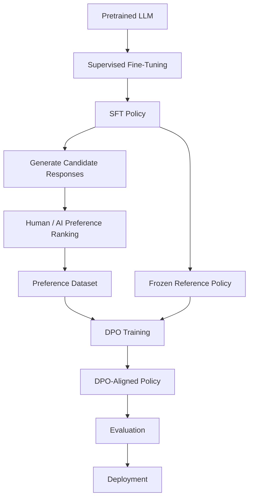

The important distinction is:

```text
Reward Model
      ↓
Not explicitly required by DPO

PPO
      ↓
Not required by DPO
```

---

# 4. The Problem DPO Solves

Suppose we have:

```text
Prompt:
Explain event-driven architecture.
```

Two responses are generated:

```text
Response A:
Clear, technically accurate explanation
with a useful architecture example.

Response B:
Vague explanation with several inaccuracies.
```

A human evaluator chooses:

```text
A > B
```

DPO learns from this comparison.

The training example can be represented as:

```text
Prompt
 ├── Chosen Response
 └── Rejected Response
```

---

# 5. Preference Data

A typical DPO example contains:

```text
Prompt
Chosen Response
Rejected Response
```

Conceptually:

```json
{
  "prompt": "Explain Kafka consumer groups.",
  "chosen": "A consumer group is a set of consumers...",
  "rejected": "Kafka consumers are simply servers..."
}
```

The actual dataset schema depends on the training framework.

---

# 6. Chosen vs Rejected

The terminology is important.

### Chosen

The response preferred by the evaluator.

```text
chosen
=
preferred response
```

### Rejected

The response not preferred.

```text
rejected
=
less-preferred response
```

DPO attempts to increase the relative preference of the chosen response.

---

# 7. Preference Learning

The goal is not simply:

```text
Make the chosen response likely.
```

The more important goal is:

```text
Make the chosen response
more likely than the rejected response.
```

Conceptually:

```text
P(chosen | prompt)
          >
P(rejected | prompt)
```

---

# 8. DPO and SFT

SFT learns:

```text
Prompt → Desired Response
```

DPO learns:

```text
Prompt
 ├── Preferred Response
 └── Less-Preferred Response
```

Therefore:

```text
SFT
→ Learn demonstrations

DPO
→ Learn relative preferences
```

---

# 9. Why Preference Pairs Are Powerful

Consider two responses:

```text
A:
Good answer

B:
Very good answer
```

An absolute score such as:

```text
A = 0.82
B = 0.87
```

can be difficult to calibrate.

A preference comparison:

```text
B > A
```

is often easier for humans to provide consistently.

This makes pairwise preference data useful for alignment.

---

# 10. Traditional RLHF vs DPO

## Traditional RLHF

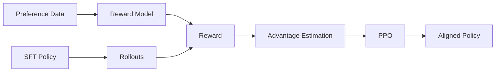

## DPO

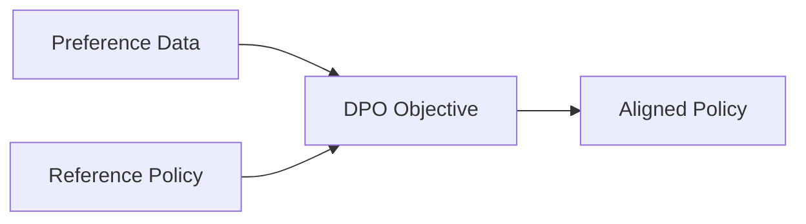

The training pipeline is therefore substantially simpler.

---

# 11. The Core DPO Idea

DPO starts from a key observation about preference-based reinforcement learning.

Instead of explicitly learning a reward model and then optimizing the policy with RL, the preference objective can be rewritten directly in terms of:

```text
Policy probabilities
+
Reference policy probabilities
```

This gives us a direct optimization objective.

---

# 12. Reference Policy

DPO normally uses a **reference policy**.

Usually:

```text
Reference Policy
=
SFT Model
```

The reference model provides a baseline against which the new policy is compared.

Conceptually:

```text
SFT Model
    ↓
Frozen Reference Policy
```

and:

```text
SFT Model
    ↓
Trainable DPO Policy
```

---

# 13. Why Use a Reference Policy?

Without a reference policy, the model could potentially optimize preference data in ways that move it far away from its original behavior.

The reference policy provides a behavioral anchor.

Conceptually:

```text
SFT Model
     ●
     │
     │ controlled optimization
     ↓
DPO Policy
```

rather than:

```text
SFT Model
     ●
      \
       \
        \
         ●
      Uncontrolled Policy
```

---

# 14. DPO and KL Regularization

DPO is derived from a KL-constrained preference-optimization formulation.

Conceptually:

```text
Improve preference reward
        +
Stay close to reference policy
```

This relationship is central to understanding DPO.

---

# 15. The DPO Objective

The commonly used DPO loss can be written as:

$$
\mathcal{L}_{DPO}(\pi_\theta;\pi_{ref})
=
-\mathbb{E}_{(x,y_w,y_l)\sim D}
\left[
\log
\sigma
\left(
\beta
\left[
\log
\frac{\pi_\theta(y_w|x)}
{\pi_{ref}(y_w|x)}
-
\log
\frac{\pi_\theta(y_l|x)}
{\pi_{ref}(y_l|x)}
\right]
\right)
\right]
$$

where:

```text
x
=
Prompt

y_w
=
Chosen / winning response

y_l
=
Rejected / losing response

πθ
=
Trainable policy

πref
=
Reference policy

β
=
Preference / KL-control parameter

σ
=
Sigmoid function
```

This is the central equation of DPO.

---

# 16. Simplifying the DPO Objective

The equation can be easier to understand by defining:

```text
Chosen log-ratio
=
log πθ(chosen|x)
-
log πref(chosen|x)
```

and:

```text
Rejected log-ratio
=
log πθ(rejected|x)
-
log πref(rejected|x)
```

Then DPO compares:

```text
Chosen log-ratio
-
Rejected log-ratio
```

The objective encourages this difference to become positive.

---

# 17. DPO Mental Model

Think of DPO as:

```text
Reference Model
      ↓
How much does the new model
increase preference for CHOSEN?
      ↓
How much does it increase preference
for REJECTED?
      ↓
Make CHOSEN relatively stronger
```

---

# 18. DPO Does Not Simply Maximize Chosen Probability

This is an important distinction.

DPO is not simply:

```text
maximize P(chosen)
```

It is closer to:

```text
increase chosen relative preference
while considering
the reference policy.
```

Therefore the reference policy matters.

---

# 19. Log Probability

DPO works with log probabilities.

For an autoregressive model:

$$
\log \pi_\theta(y|x)
=
\sum_{t=1}^{T}
\log
\pi_\theta(y_t|x,y_{<t})
$$

This means the log probability of a response is obtained by summing the log probabilities of its tokens.

---

# 20. Token-Level Log Probabilities

For:

```text
Response:
Kafka processes events.
```

the model produces token probabilities:

```text
Kafka       → p₁
processes   → p₂
events      → p₃
.           → p₄
```

Then:

```text
log P(response)
=
log p₁
+
log p₂
+
log p₃
+
log p₄
```

DPO uses these sequence-level log probabilities.

---

# 21. Chosen and Rejected Log Probabilities

For each preference pair, calculate:

```text
Policy:
    log P(chosen)
    log P(rejected)

Reference:
    log P(chosen)
    log P(rejected)
```

Then construct the relative log-ratio.

---

# 22. DPO Preference Signal

Conceptually:

```text
Policy preference

log πθ(chosen)
        -
log πθ(rejected)
```

is compared with:

```text
Reference preference

log πref(chosen)
        -
log πref(rejected)
```

DPO learns to improve the relative preference compared with the reference.

---

# 23. DPO Probability Flow

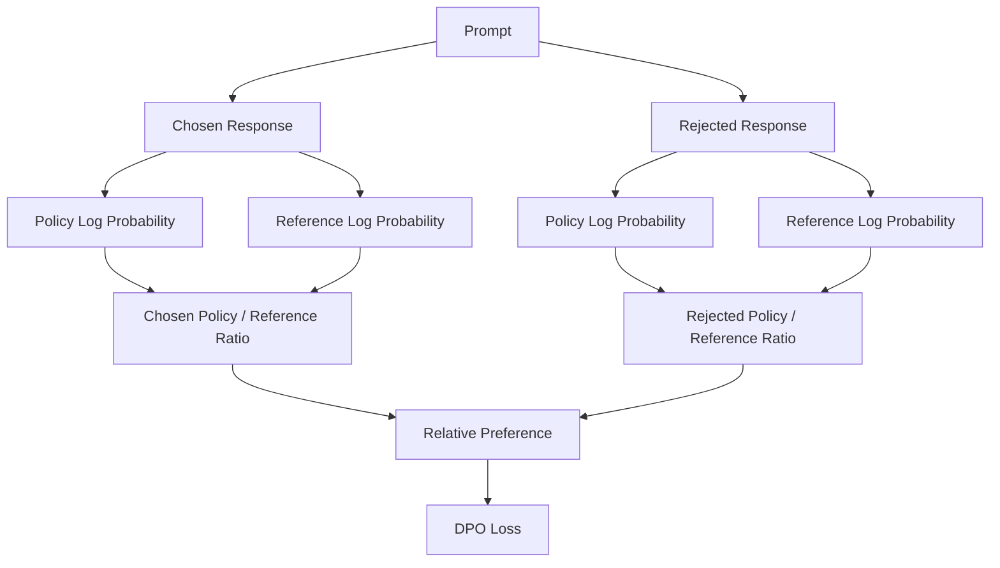

---

# 24. The Role of β

The parameter:

```text
β
```

controls how strongly the preference optimization is scaled relative to the reference-policy constraint.

Conceptually:

```text
Lower β
→ More conservative preference optimization

Higher β
→ Stronger preference pressure
```

The optimal value depends on:

```text
Dataset
Model
Preference quality
Training configuration
Evaluation results
```

It should be tuned empirically.

---

# 25. DPO and the Reference Model

The reference model is normally frozen.

```text
Reference Model
      ↓
Frozen
```

The trainable model is:

```text
DPO Policy
      ↓
Updated
```

Conceptually:

```text
                 ┌─────────────────┐
                 │ Reference Model │
                 │    Frozen       │
                 └────────┬────────┘
                          │
                          │ log probabilities
                          │
Prompt + Responses ───────┼───────┐
                          │       │
                          ↓       ↓
                    ┌─────────────────┐
                    │   DPO Loss      │
                    └────────┬────────┘
                             ↓
                    ┌─────────────────┐
                    │ Trainable Model │
                    └─────────────────┘
```

---

# 26. DPO Training Dataset

A production DPO dataset should contain high-quality preference pairs.

A conceptual structure is:

```text
Dataset
│
├── prompt
├── chosen
└── rejected
```

Additional metadata can include:

```text
task_type
domain
difficulty
annotator_id
preference_source
quality_score
safety_category
dataset_version
```

---

# 27. Preference Data Quality

DPO is highly dependent on preference data quality.

Poor preferences can produce:

```text
Poor Alignment
Reward-like Exploitation
Behavioral Drift
Inconsistent Responses
```

Therefore:

> **Better preference data is often more valuable than simply increasing dataset size.**

---

# 28. Preference Data Sources

Preference data can come from:

```text
Human Comparisons
Expert Review
Synthetic Preferences
Reward Models
LLM Judges
Production Feedback
Task Outcomes
```

Each source has different reliability characteristics.

---

# 29. Human Preference Data

Human evaluators can compare:

```text
Response A
vs
Response B
```

using criteria such as:

```text
Correctness
Relevance
Clarity
Completeness
Safety
Groundedness
Instruction Following
```

---

# 30. Synthetic Preference Data

An LLM can sometimes generate preference labels.

Conceptually:

```text
Prompt
 ↓
Response A
Response B
 ↓
Judge Model
 ↓
Preference
```

This can scale data generation.

However, synthetic preferences can introduce:

```text
Judge Bias
Model Bias
Preference Artifacts
Evaluation Blind Spots
```

Therefore synthetic preference data should be validated.

---

# 31. DPO Data Quality Pipeline


---

# 32. DPO vs SFT Dataset

### SFT

```text
Prompt
+
Ideal Response
```

### DPO

```text
Prompt
+
Chosen Response
+
Rejected Response
```

This is one of the most important differences between the two training methods.

---

# 33. DPO Training Workflow

```text
1. Start with pretrained model.

2. Perform SFT.

3. Freeze / preserve the SFT model as reference.

4. Collect preference pairs.

5. Validate preference dataset.

6. Tokenize prompt and responses.

7. Calculate policy log probabilities.

8. Calculate reference log probabilities.

9. Calculate relative preference score.

10. Calculate DPO loss.

11. Backpropagate through the trainable policy.

12. Update policy parameters.

13. Repeat across batches.

14. Evaluate against the SFT baseline.

15. Run safety and capability evaluation.

16. Deploy only after validation.
```

---

# 34. DPO Training Architecture

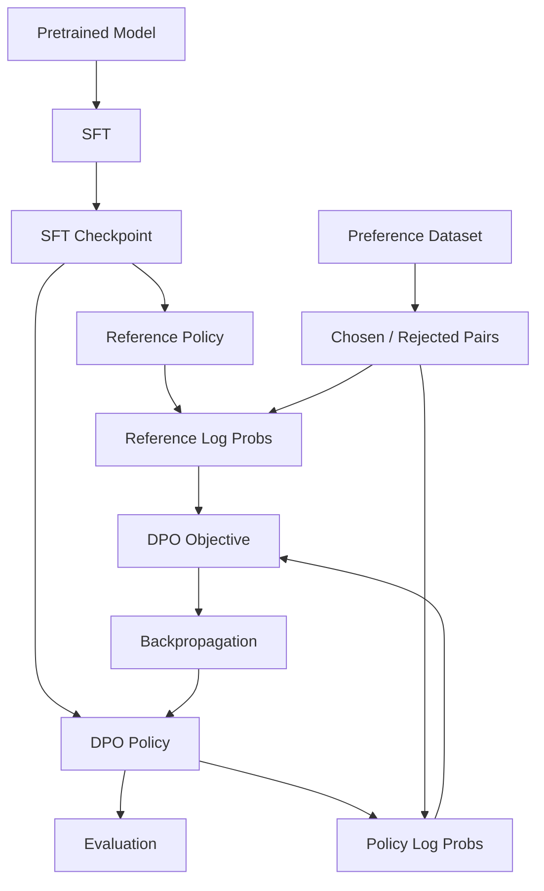

---

# 35. DPO Pseudocode

```python
# Conceptual DPO training

policy = load_sft_model()
reference = freeze_copy(policy)

for batch in preference_dataset:

    prompts = batch["prompt"]
    chosen = batch["chosen"]
    rejected = batch["rejected"]

    chosen_policy_logp = policy.log_probability(
        prompts,
        chosen
    )

    rejected_policy_logp = policy.log_probability(
        prompts,
        rejected
    )

    with no_grad():
        chosen_reference_logp = reference.log_probability(
            prompts,
            chosen
        )

        rejected_reference_logp = reference.log_probability(
            prompts,
            rejected
        )

    chosen_ratio = (
        chosen_policy_logp
        - chosen_reference_logp
    )

    rejected_ratio = (
        rejected_policy_logp
        - rejected_reference_logp
    )

    preference_margin = (
        chosen_ratio
        - rejected_ratio
    )

    loss = -mean(
        log_sigmoid(
            beta * preference_margin
        )
    )

    optimizer.zero_grad()
    loss.backward()
    optimizer.step()
```

> This is conceptual pseudocode. Exact implementation details vary by framework and trainer.

---

# 36. What DPO Is Learning

Consider:

```text
Prompt
```

with:

```text
Chosen:
Accurate and concise answer.

Rejected:
Incorrect and verbose answer.
```

If the policy initially assigns:

```text
Chosen   = 0.25
Rejected = 0.30
```

DPO pushes the relative preference toward:

```text
Chosen   ↑
Rejected ↓
```

The exact probabilities are determined by the model and training dynamics.

---

# 37. DPO Preference Margin

A useful mental model is the preference margin:

```text
Chosen Score
      -
Rejected Score
```

DPO tries to make:

```text
Preference Margin > 0
```

while respecting the reference-policy relationship.

---

# 38. DPO as Classification

DPO can be understood intuitively as a binary preference-learning problem.

```text
Chosen
   ↓
Target = 1

Rejected
   ↓
Target = 0
```

The important difference is that DPO derives the classification-style objective from a preference-optimization formulation involving the reference policy.

---

# 39. Why DPO Is Simpler Than PPO

PPO requires:

```text
Rollout Generation
Reward Calculation
Advantage Estimation
Policy Ratio
Clipping
Value Function
Potential KL Control
```

DPO primarily requires:

```text
Preference Pairs
Policy Log Probabilities
Reference Log Probabilities
DPO Loss
```

Therefore the engineering surface is smaller.

---

# 40. DPO Does Not Require a Reward Model

Traditional RLHF:

```text
Preference Data
      ↓
Reward Model
      ↓
Reward
```

DPO:

```text
Preference Data
      ↓
DPO Objective
```

This does not mean DPO has no concept of reward.

Instead, the preference signal is incorporated directly into the objective.

---

# 41. DPO and Implicit Reward

DPO can be understood as optimizing an **implicit reward model** induced by the policy/reference relationship.

Conceptually:

```text
Policy
   +
Reference Policy
   ↓
Implicit Reward Structure
```

This is one of the key theoretical ideas behind DPO.

---

# 42. DPO and Reward Modeling

Traditional approach:

```text
Human Preferences
      ↓
Train Reward Model
      ↓
Use Reward Model
      ↓
RL Optimization
```

DPO:

```text
Human Preferences
      ↓
Direct Preference Optimization
```

Therefore DPO removes the explicit reward-model training stage from the standard pipeline.

---

# 43. DPO and PPO

| Dimension | PPO | DPO |
|---|---|---|
| Preference data | Yes | Yes |
| Reward model | Common | Not explicitly required |
| Rollouts during training | Typically required | Not required in the same way |
| Critic / value model | Common | Not required |
| Advantage estimation | Yes | No |
| PPO clipping | Yes | No |
| Reference policy | Common in RLHF | Central |
| Training complexity | High | Lower |
| Online RL loop | Yes | No traditional PPO loop |
| Preference optimization | Indirect | Direct |

---

# 44. DPO vs SFT vs PPO

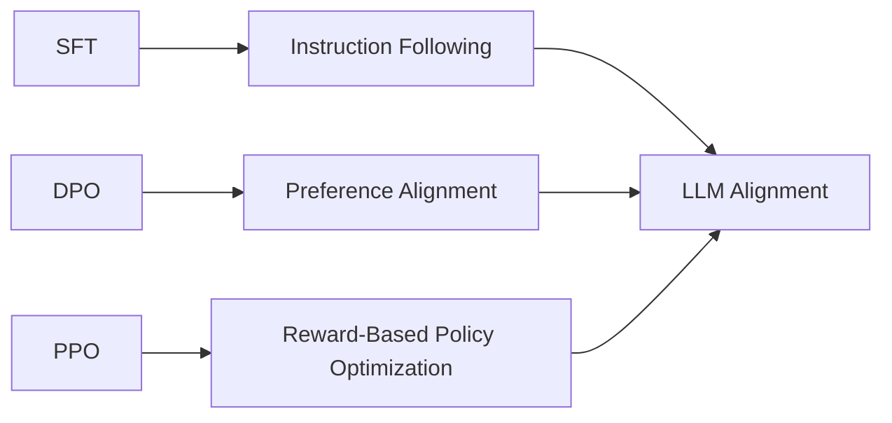

A practical model-development pipeline may use:

```text
Pretraining
   ↓
SFT
   ↓
DPO
```

or:

```text
Pretraining
   ↓
SFT
   ↓
RLHF / PPO
```

depending on the objective and infrastructure.

---

# 45. When DPO Is Attractive

DPO is attractive when:

```text
You have preference pairs.
You want preference alignment.
You want to avoid a separate reward-model training stage.
You want simpler training infrastructure.
You do not require an online RL loop.
You want an easier experimentation cycle.
```

---

# 46. When DPO May Not Be Enough

DPO may be insufficient when the task requires:

```text
Long-horizon interaction
Sequential decision making
Online exploration
Environment feedback
Tool execution rewards
Complex trajectory optimization
```

For such problems, RL methods may provide additional capabilities.

---

# 47. DPO for Coding Models

A coding dataset might contain:

```text
Prompt:
Implement a Java REST endpoint.

Chosen:
Correct implementation with validation and tests.

Rejected:
Compiles incorrectly and lacks validation.
```

DPO learns to prefer the stronger implementation.

---

# 48. DPO for Enterprise AI

For an enterprise assistant:

```text
Prompt:
Summarize this incident report.
```

Chosen:

```text
Accurate summary
with important root-cause details.
```

Rejected:

```text
Generic summary
that omits critical information.
```

DPO can optimize toward the preferred behavior.

---

# 49. DPO for RAG

Preference data can compare:

```text
Grounded Answer
vs
Unsupported Answer
```

Example:

```text
Chosen:
Answer supported by retrieved documents.

Rejected:
Answer contains unsupported claims.
```

DPO can therefore help improve:

```text
Groundedness
Citation behavior
Answer relevance
Instruction following
```

provided the preference data reliably represents these objectives.

---

# 50. DPO for Tool Use

Preference pairs can compare agent behaviors.

```text
Chosen:
Uses the correct enterprise API.

Rejected:
Uses the wrong API.
```

or:

```text
Chosen:
Requests confirmation before destructive action.

Rejected:
Executes destructive action immediately.
```

This can encode desirable tool-use behavior.

---

# 51. DPO and Safety

Preference data can encode:

```text
Safe Response
>
Unsafe Response
```

For example:

```text
Chosen:
Refuses an unsafe request and offers an appropriate alternative.

Rejected:
Provides unsafe operational instructions.
```

However:

> DPO should not be considered a replacement for runtime safety controls.

---

# 52. DPO and Guardrails

A production system should combine:

```text
DPO Alignment
+
System Instructions
+
Input Validation
+
Output Filtering
+
Authorization
+
Tool Policies
+
Monitoring
```

---

# 53. DPO and Enterprise Architecture

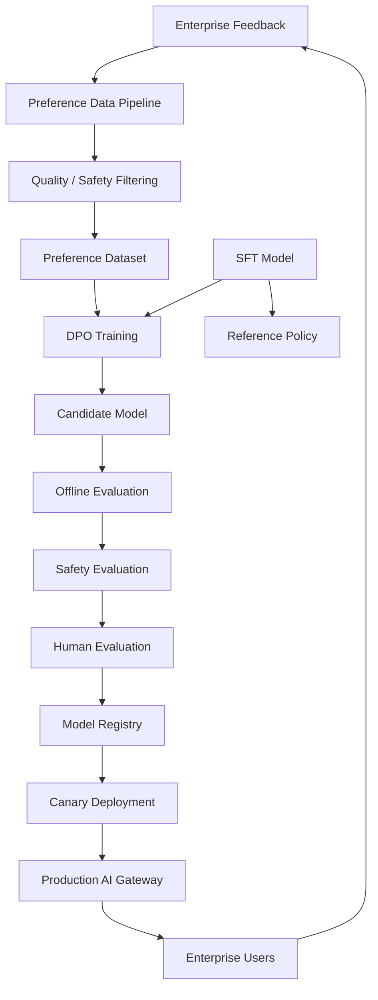

---

# 54. DPO Training Plane

The training plane may contain:

```text
Preference Data Store
        ↓
Data Validation
        ↓
Tokenizer
        ↓
DPO Trainer
        ↓
GPU Cluster
        ↓
Checkpoint Store
        ↓
Evaluation
        ↓
Model Registry
```

---

# 55. DPO Inference Plane

The inference plane remains independent:

```text
User
 ↓
API Gateway
 ↓
LLM Service
 ↓
RAG
 ↓
Tools
 ↓
Enterprise Systems
```

DPO is a training-time alignment technique.

---

# 56. DPO Data Governance

For enterprise environments, track:

```text
Preference Dataset Version
Data Source
Annotator / Judge Source
Domain
Privacy Classification
PII Handling
Safety Classification
Approval Status
Training Run
Model Version
Evaluation Version
```

---

# 57. Preference Dataset Versioning

Example:

```text
preference-v1
preference-v2
preference-v3
```

Each training experiment should record the exact dataset version.

This enables:

```text
Reproducibility
Auditing
Rollback
Comparison
```

---

# 58. DPO Experiment Tracking

Example:

```yaml
experiment:
  name: enterprise-dpo-v4

base_model:
  name: foundation-model
  revision: abc123

reference_model:
  checkpoint: sft-v7

preference_dataset:
  version: preference-v12

dpo:
  beta: 0.1
  learning_rate: 5.0e-7
  epochs: 2
  max_length: 4096

evaluation:
  dataset: eval-v15
```

Values are illustrative.

---

# 59. DPO Evaluation

A DPO model should be evaluated against:

```text
Base Model
SFT Model
DPO Model
```

The most important comparison is often:

```text
SFT
vs
DPO
```

because SFT is the direct pre-DPO baseline.

---

# 60. Preference Win Rate

One useful evaluation metric is:

```text
DPO response preferred
/
Total comparisons
```

Example:

```text
DPO wins = 620
Total = 1000

Win Rate = 62%
```

This should be interpreted together with other quality metrics.

---

# 61. DPO Evaluation Dimensions

Evaluate:

```text
Instruction Following
Correctness
Relevance
Helpfulness
Factuality
Groundedness
Safety
Style
Conciseness
Domain Performance
```

---

# 62. DPO Regression Testing

A model may improve:

```text
Preference Score ↑
```

while degrading:

```text
Coding Accuracy ↓
Factuality ↓
Safety ↓
```

Therefore maintain regression suites.

---

# 63. DPO Evaluation Matrix

| Category | SFT | DPO | Delta |
|---|---:|---:|---:|
| Helpfulness | baseline | measured | Δ |
| Instruction Following | baseline | measured | Δ |
| Factuality | baseline | measured | Δ |
| Safety | baseline | measured | Δ |
| Groundedness | baseline | measured | Δ |
| Domain Accuracy | baseline | measured | Δ |
| Response Quality | baseline | measured | Δ |

Actual values should come from your evaluation pipeline.

---

# 64. DPO Failure Modes

DPO can fail when:

```text
Preference Data Is Noisy
Preference Labels Are Biased
Rejected Responses Are Too Easy
Chosen Responses Are Low Quality
Dataset Is Too Narrow
Reference Model Is Poor
Training Is Too Aggressive
β Is Poorly Tuned
Evaluation Is Weak
```

---

# 65. Failure Mode: Noisy Preferences

Suppose:

```text
Response A
```

is labeled chosen in one example but rejected in another despite being effectively equivalent.

This creates contradictory training signals.

Symptoms:

```text
Unstable training
Weak improvements
Inconsistent behavior
```

---

# 66. Failure Mode: Easy Negatives

Suppose:

```text
Chosen:
Excellent answer

Rejected:
Completely incorrect answer
```

The preference is obvious.

The model may learn little about subtle quality differences.

More useful preference pairs may involve:

```text
Good
vs
Better
```

rather than:

```text
Good
vs
Terrible
```

---

# 67. Failure Mode: Preference Shortcut

Suppose annotators consistently prefer longer answers.

DPO may learn:

```text
Longer = Better
```

even when:

```text
Longer ≠ More Useful
```

This is a preference-data problem.

---

# 68. Failure Mode: Style Over Substance

If the preference dataset rewards:

```text
Polite
Confident
Verbose
Structured
```

but does not sufficiently reward:

```text
Correct
Grounded
Useful
```

DPO may optimize style at the expense of substance.

---

# 69. Failure Mode: Reference Model Too Weak

If the reference model is poor, the DPO optimization baseline may be problematic.

Therefore:

```text
Pretrained Model
      ↓
Good SFT
      ↓
Reference Policy
```

is generally preferable.

---

# 70. Failure Mode: Overfitting

DPO can overfit preference data.

Symptoms:

```text
Training preference improves
Validation preference stagnates
General capability declines
```

Use:

```text
Validation Preferences
Held-Out Tasks
Capability Benchmarks
Safety Tests
```

---

# 71. Failure Mode: Capability Regression

After DPO:

```text
Preference Alignment ↑
```

but:

```text
Reasoning ↓
Coding ↓
Knowledge ↓
```

This is possible when preference data is narrow.

---

# 72. Failure Mode: Dataset Narrowness

Suppose the dataset contains only:

```text
Customer Support
```

The model may become better at customer-support style behavior but not necessarily improve:

```text
Coding
Mathematics
Reasoning
Technical Architecture
```

Broad evaluation is therefore necessary.

---

# 73. DPO Debugging Workflow

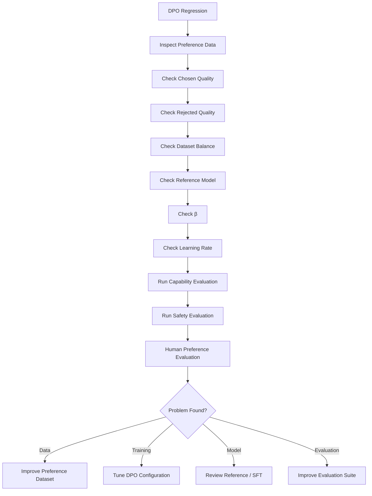

---

# 74. DPO Hyperparameters

Important parameters include:

```text
β
Learning Rate
Batch Size
Gradient Accumulation
Number of Epochs
Maximum Sequence Length
Maximum Prompt Length
Warmup
Weight Decay
Gradient Clipping
LoRA Configuration
Evaluation Frequency
```

---

# 75. Learning Rate

An excessively high learning rate can cause:

```text
Rapid Policy Drift
Overfitting
Capability Regression
Training Instability
```

A conservative learning rate is often appropriate for large pretrained models.

The correct value must be determined experimentally.

---

# 76. β

The DPO parameter:

```text
β
```

controls the strength of the preference objective relative to the reference relationship.

Tune it using:

```text
Preference Evaluation
Capability Evaluation
Safety Evaluation
KL / Policy Drift Metrics
```

rather than optimizing a single metric.

---

# 77. DPO Epochs

Too many epochs can lead to:

```text
Preference Overfitting
Behavioral Drift
Capability Regression
```

Therefore:

```text
Training Loss
+
Validation Preference
+
Capability Benchmarks
```

should be monitored together.

---

# 78. Sequence Length

DPO can involve:

```text
Prompt
+
Chosen Response
```

and:

```text
Prompt
+
Rejected Response
```

This can significantly increase memory requirements.

Long contexts can therefore increase:

```text
GPU Memory
Training Time
Throughput Cost
```

---

# 79. DPO and PEFT

DPO can be combined with parameter-efficient fine-tuning.

Conceptually:

```text
Frozen Base Model
        +
LoRA Adapter
        ↓
Trainable DPO Policy
```

This can reduce the number of trainable parameters.

---

# 80. DPO + LoRA Architecture

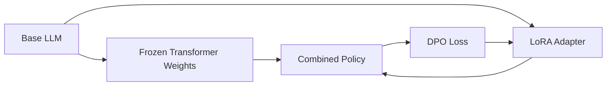

Only the adapter parameters may be updated in a PEFT setup.

---

# 81. DPO and Quantization

A practical training stack may combine:

```text
Quantized Base Model
+
LoRA
+
DPO
```

This can reduce memory requirements.

However:

```text
Quantization
+
Preference Optimization
```

must be validated carefully for numerical stability and model quality.

---

# 82. DPO with Hugging Face

A typical ecosystem can include:

```text
Transformers
+
Datasets
+
PEFT
+
TRL
+
PyTorch
```

A conceptual workflow is:

```text
Dataset
 ↓
Tokenizer
 ↓
Reference Model
 ↓
DPO Trainer
 ↓
PEFT / LoRA
 ↓
Evaluation
 ↓
Model Registry
```

---

# 83. Conceptual Hugging Face DPO Workflow

```python
from datasets import load_dataset
from transformers import AutoModelForCausalLM, AutoTokenizer
from trl import DPOTrainer, DPOConfig

model_name = "your-sft-model"

model = AutoModelForCausalLM.from_pretrained(model_name)
ref_model = AutoModelForCausalLM.from_pretrained(model_name)

tokenizer = AutoTokenizer.from_pretrained(model_name)

dataset = load_dataset(
    "json",
    data_files="preference-data.jsonl"
)

training_args = DPOConfig(
    output_dir="./dpo-output",
    learning_rate=5e-7,
    num_train_epochs=2,
    per_device_train_batch_size=2,
    beta=0.1
)

trainer = DPOTrainer(
    model=model,
    ref_model=ref_model,
    args=training_args,
    train_dataset=dataset["train"],
    processing_class=tokenizer
)

trainer.train()
```

> The exact TRL API evolves over time. Treat this as an architectural example rather than a guaranteed version-specific implementation.

---

# 84. DPO Dataset Example

A conceptual JSONL dataset:

```json
{"prompt":"Explain Kafka consumer groups.","chosen":"A consumer group is a set of consumers that collaboratively consume partitions...","rejected":"A consumer group is simply a Kafka server cluster..."}
{"prompt":"What is a REST API?","chosen":"A REST API exposes resources through HTTP semantics...","rejected":"A REST API is a database connection protocol..."}
```

---

# 85. DPO Data Validation

Before training:

```text
Validate:
    prompt != empty
    chosen != empty
    rejected != empty
```

Also check:

```text
chosen != rejected
```

and detect:

```text
Duplicates
Near Duplicates
Conflicting Labels
Excessive Length
Malformed Examples
Sensitive Data
```

---

# 86. Preference Dataset Statistics

Track:

```text
Number of Examples
Average Prompt Length
Average Chosen Length
Average Rejected Length
Length Distribution
Duplicate Rate
Domain Distribution
Preference Source
Safety Distribution
```

---

# 87. Chosen vs Rejected Length

Monitor:

```text
Average Chosen Length
vs
Average Rejected Length
```

If:

```text
Chosen responses
are consistently much longer
```

DPO may learn a length-related shortcut.

This does not mean length differences are always bad, but they should be understood.

---

# 88. Preference Dataset Balance

For enterprise use, segment preferences by:

```text
Domain
Task
Difficulty
User Type
Language
Safety Category
Business Function
```

Avoid allowing one dominant category to determine the entire model behavior.

---

# 89. DPO Data Leakage

Avoid training/evaluation contamination.

Check:

```text
Training Prompt
vs
Evaluation Prompt
```

and:

```text
Training Response
vs
Evaluation Response
```

Use hashing and semantic similarity checks where appropriate.

---

# 90. DPO Experiment Design

A useful experiment compares:

```text
Experiment A
SFT Baseline

Experiment B
DPO β = X

Experiment C
DPO β = Y

Experiment D
DPO + LoRA
```

Then compare:

```text
Preference Win Rate
Capability
Safety
Factuality
Groundedness
Latency
Cost
```

---

# 91. DPO Model Promotion

```text
DPO Checkpoint
      ↓
Automated Evaluation
      ↓
Safety Evaluation
      ↓
Human Preference Evaluation
      ↓
Regression Tests
      ↓
Model Registry
      ↓
Canary
      ↓
Production
```

---

# 92. Shadow Deployment

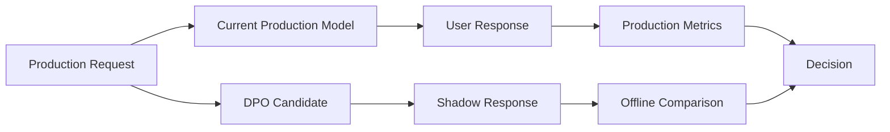

The DPO model can be evaluated without exposing its responses directly to users.

---

# 93. Canary Deployment

A controlled rollout may look like:

```text
100% Stable
     ↓
99% Stable / 1% DPO
     ↓
95% Stable / 5% DPO
     ↓
90% Stable / 10% DPO
     ↓
50% Stable / 50% DPO
     ↓
100% DPO
```

Promotion should depend on predefined gates.

---

# 94. DPO Rollback

Maintain:

```text
Previous Stable Model
```

and:

```text
DPO Candidate
```

If:

```text
Safety ↓
Quality ↓
Factuality ↓
Cost ↑
Latency ↑
```

rollback.

---

# 95. Production Monitoring

Monitor:

```text
Preference Win Rate
Task Success
Factuality
Groundedness
Safety
Response Length
Latency
Token Usage
Cost
User Feedback
Escalation Rate
```

---

# 96. DPO Observability

A production DPO system should connect:

```text
Model Version
        ↓
Request
        ↓
Response
        ↓
Feedback
        ↓
Evaluation
        ↓
Training Dataset
        ↓
DPO Run
```

This creates an end-to-end feedback loop.

---

# 97. DPO Feedback Loop

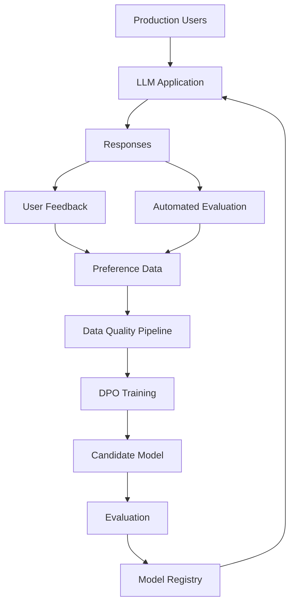

---

# 98. Enterprise DPO Architecture

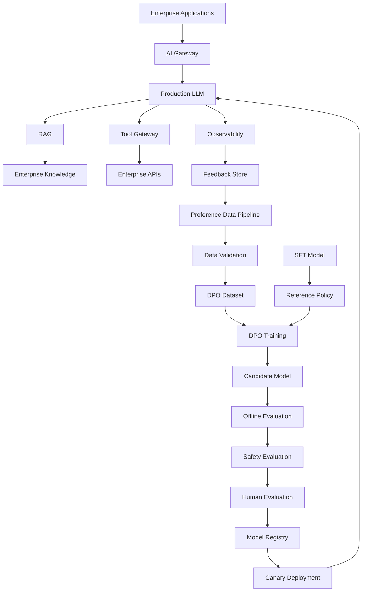

---

# 99. Enterprise DPO Use Case: Customer Support

Preference data:

```text
Prompt:
Customer cannot access account.

Chosen:
Clear troubleshooting steps,
appropriate escalation,
and no unsupported claims.

Rejected:
Generic response with no useful troubleshooting.
```

DPO can learn:

```text
Specificity
+
Correctness
+
Appropriate escalation
```

---

# 100. Enterprise DPO Use Case: Banking

For a banking assistant:

```text
Chosen:
Provides compliant explanation
and requires authentication before account-specific actions.

Rejected:
Attempts to provide sensitive account information
without proper verification.
```

This preference signal can reinforce desirable behavior.

Runtime authorization must still remain deterministic.

---

# 101. Enterprise DPO Use Case: Software Engineering

Preference data could compare:

```text
Chosen:
Production-ready Java implementation
with validation, testing, error handling,
and observability.

Rejected:
Minimal implementation that ignores
failure scenarios.
```

This is particularly useful for engineering assistants.

---

# 102. Enterprise DPO Use Case: Cloud Architecture

Chosen response:

```text
Uses secure IAM
least privilege
private networking
observability
failure handling
and cost controls.
```

Rejected response:

```text
Uses overly broad permissions
and ignores operational requirements.
```

DPO can encode architectural preferences.

---

# 103. DPO and Architecture-Level AI Engineering

For an enterprise AI engineer, DPO should not be viewed only as:

```text
A training algorithm
```

It is part of a larger lifecycle:

```text
Data
 ↓
Preference Collection
 ↓
Alignment Training
 ↓
Evaluation
 ↓
Deployment
 ↓
Observability
 ↓
Feedback
 ↓
New Preference Data
```

---

# 104. DPO and RAG Architecture

DPO can complement RAG.

```text
RAG
→ Provides knowledge

DPO
→ Shapes response preferences
```

Therefore:

```text
User Query
 ↓
Retriever
 ↓
Context
 ↓
DPO-Aligned LLM
 ↓
Grounded Answer
```

DPO does not replace retrieval.

---

# 105. DPO and Tool Calling

DPO can help teach:

```text
When to call a tool
Which tool to call
How to structure tool arguments
When to ask for confirmation
When not to call a tool
```

However, tool permissions must be enforced outside the model.

---

# 106. DPO and Agentic AI

An agent may generate:

```text
Thought / Planning
 ↓
Tool Call
 ↓
Tool Result
 ↓
Next Decision
 ↓
Final Answer
```

Preference data can compare complete trajectories or selected behaviors.

However, long-horizon optimization can require methods beyond simple response-level DPO.

---

# 107. DPO vs Agentic RL

DPO:

```text
Preference Pair
 ↓
Direct Optimization
```

Agentic RL:

```text
State
 ↓
Action
 ↓
Environment
 ↓
Reward
 ↓
Next State
 ↓
Policy Optimization
```

If the environment itself provides meaningful rewards, RL may become more appropriate.

---

# 108. DPO and Verifiable Outcomes

Preference data can be strengthened using objective signals.

For coding:

```text
Tests Passed
```

For SQL:

```text
Query Result Correct
```

For cloud:

```text
Deployment Successful
```

For RAG:

```text
Evidence Supports Answer
```

This creates more reliable preference labels.

---

# 109. Human + Automated Preference Pipeline

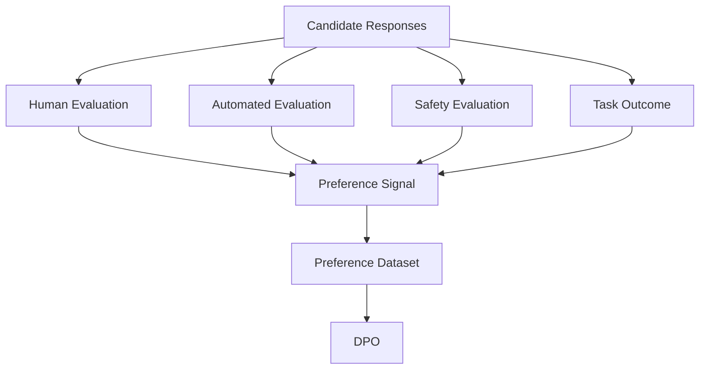

---

# 110. DPO Security

Important considerations:

```text
Training Data Poisoning
Preference Manipulation
Sensitive Data Leakage
Prompt Injection in Training Data
Malicious Preference Labels
Model Supply Chain Risks
Unauthorized Model Promotion
```

---

# 111. DPO Data Security

Apply:

```text
PII Detection
Data Masking
Access Control
Encryption
Dataset Versioning
Approval Workflow
Audit Logging
```

before preference data reaches training.

---

# 112. DPO Model Security

Protect:

```text
Base Model
SFT Checkpoint
Reference Model
DPO Checkpoint
Tokenizer
Training Configuration
Dataset
Evaluation Results
```

using appropriate artifact and access controls.

---

# 113. DPO Reproducibility

Record:

```text
Base Model Version
Reference Model Version
Preference Dataset Version
Tokenizer Version
DPO Configuration
Random Seed
Framework Version
GPU Environment
Training Code Version
Evaluation Dataset Version
```

This enables reproducibility.

---

# 114. DPO Model Registry

A production registry should capture:

```text
Model ID
Version
Parent Model
Training Method
Dataset Version
Evaluation Results
Safety Status
Approval Status
Deployment Status
Rollback Version
```

Example:

```text
enterprise-llm
    ├── sft-v7
    ├── dpo-v1
    ├── dpo-v2
    └── dpo-v3
```

---

# 115. DPO CI/CD Pipeline


---

# 116. DPO Production Gates

Before promotion:

```text
[ ] Preference Quality Validated
[ ] No Critical Data Leakage
[ ] Capability Regression Checked
[ ] Safety Evaluation Passed
[ ] Human Evaluation Passed
[ ] Groundedness Checked
[ ] Latency Checked
[ ] Cost Checked
[ ] Model Registry Updated
[ ] Rollback Available
```

---

# 117. DPO Common Mistakes

## Mistake 1

Using low-quality preference pairs.

## Mistake 2

Assuming:

```text
More preference data
=
Better model
```

without checking quality.

## Mistake 3

Ignoring the SFT baseline.

## Mistake 4

Ignoring capability regression.

## Mistake 5

Overfitting to annotator style.

## Mistake 6

Using only synthetic preferences.

## Mistake 7

Ignoring safety evaluation.

## Mistake 8

Treating DPO as a runtime safety mechanism.

## Mistake 9

Using excessively aggressive training settings.

## Mistake 10

Evaluating only on the same preference dataset used for training.

---

# 118. DPO Decision Framework

Use DPO when:

```text
Preference data exists
        +
Preference alignment is desired
        +
A simpler alternative to PPO is valuable
```

Consider PPO / RL when:

```text
Environment interaction
        +
Sequential decisions
        +
Meaningful reward
        +
Online optimization
```

Use SFT when:

```text
High-quality demonstrations
        +
Behavior can be learned directly
```

---

# 119. SFT → DPO → RL

A mature alignment strategy can be viewed as:

```text
Pretraining
      ↓
SFT
      ↓
DPO
      ↓
Further RL / Outcome Optimization
```

Not every model needs every stage.

The appropriate method depends on the objective.

---

# 120. DPO Mental Model

Remember DPO as:

```text
Prompt
  ↓
Chosen + Rejected
  ↓
Compare Policy Probabilities
  ↓
Compare with Reference Policy
  ↓
Increase Relative Preference
  ↓
Update Model
```

---

# 121. Complete DPO Mental Model

```text
                 ┌──────────────────┐
                 │      Prompt      │
                 └────────┬─────────┘
                          │
              ┌───────────┴───────────┐
              ↓                       ↓
       ┌─────────────┐         ┌─────────────┐
       │   CHOSEN    │         │  REJECTED   │
       └──────┬──────┘         └──────┬──────┘
              │                       │
              ↓                       ↓
       Policy Log P            Policy Log P
              │                       │
              ↓                       ↓
       Reference Log P       Reference Log P
              │                       │
              └───────────┬───────────┘
                          ↓
                  Relative Preference
                          ↓
                      DPO Loss
                          ↓
                  Policy Update
```

---

# 122. The Five Concepts You Must Remember

If you remember only five DPO concepts:

```text
1. Preference Pair
   → Chosen vs Rejected response.

2. Reference Policy
   → Behavioral anchor, usually the SFT model.

3. Log Probability
   → Measures how strongly the model assigns probability to responses.

4. Relative Preference
   → Chosen should become more preferred than rejected.

5. DPO Loss
   → Directly optimizes preference behavior without a traditional PPO loop.
```

---

# 123. DPO vs PPO — Final Mental Model

```text
PPO

Preference Data
      ↓
Reward Model
      ↓
Rollouts
      ↓
Reward
      ↓
Advantages
      ↓
PPO
      ↓
Policy


DPO

Preference Data
      ↓
Chosen + Rejected
      ↓
Reference Policy
      ↓
DPO Loss
      ↓
Policy
```

The major architectural difference is:

```text
PPO
=
Preference → Reward → RL

DPO
=
Preference → Direct Optimization
```

---

# 124. Production Workflow

```text
1. Establish a strong pretrained base model.

2. Build an instruction-following SFT model.

3. Freeze the SFT model as the reference policy.

4. Define preference criteria.

5. Generate candidate responses.

6. Collect human or automated preference comparisons.

7. Validate preference quality.

8. Remove duplicate and contradictory examples.

9. Remove sensitive or unsafe training data.

10. Version the preference dataset.

11. Configure DPO training.

12. Calculate policy log probabilities.

13. Calculate reference log probabilities.

14. Calculate the DPO preference margin.

15. Optimize the DPO loss.

16. Track training and validation metrics.

17. Evaluate against the SFT baseline.

18. Run capability regression tests.

19. Run safety evaluation.

20. Run human preference evaluation.

21. Register the candidate model.

22. Run shadow evaluation.

23. Run canary deployment.

24. Monitor production quality.

25. Monitor safety and business metrics.

26. Roll back if required.

27. Capture new high-value preference examples.

28. Version the next preference dataset.

29. Repeat the alignment cycle.
```

---

# 125. Production DPO Checklist

```text
[ ] Strong SFT Baseline
[ ] Reference Policy Available
[ ] Preference Criteria Defined
[ ] Preference Dataset Versioned
[ ] Human / Judge Quality Controls
[ ] Duplicate Detection
[ ] Contradiction Detection
[ ] Sensitive Data Filtering
[ ] Safety Filtering
[ ] Dataset Statistics
[ ] DPO Configuration Versioned
[ ] Validation Dataset
[ ] Capability Evaluation
[ ] Safety Evaluation
[ ] Groundedness Evaluation
[ ] Human Preference Evaluation
[ ] Experiment Tracking
[ ] Model Registry
[ ] Data Lineage
[ ] Shadow Deployment
[ ] Canary Deployment
[ ] Production Monitoring
[ ] Rollback
```

---

# 126. Key Takeaways

- **DPO** stands for **Direct Preference Optimization**.
- DPO directly learns from preference pairs.
- A preference pair contains a prompt, chosen response, and rejected response.
- DPO does not require a separately trained reward model in the standard formulation.
- DPO does not require a traditional PPO rollout-and-advantage training loop.
- DPO uses a reference policy as an important behavioral anchor.
- The reference policy is commonly the SFT model.
- DPO works with policy and reference-policy log probabilities.
- DPO increases the relative preference of the chosen response over the rejected response.
- The parameter `β` controls the strength of the preference objective relative to the reference-policy constraint.
- DPO can be understood as a direct preference-learning formulation derived from KL-constrained reward optimization.
- DPO has an implicit reward interpretation.
- Preference-data quality is one of the most important factors determining DPO success.
- Easy negative examples may provide less useful learning signals than difficult but meaningful comparisons.
- Noisy or contradictory preference labels can destabilize training.
- DPO can be combined with LoRA and other PEFT approaches.
- DPO can be combined with quantization, subject to numerical and quality validation.
- DPO is generally simpler to operate than traditional PPO-based RLHF.
- DPO is particularly attractive when preference pairs are available but a full online RL pipeline is unnecessary.
- DPO does not automatically solve long-horizon agentic optimization.
- DPO does not replace runtime guardrails or deterministic authorization.
- DPO should be evaluated against the SFT baseline.
- Reward or preference improvement alone is insufficient.
- Capability regression, factuality, safety, groundedness, latency, and cost should also be evaluated.
- Enterprise DPO requires dataset versioning, experiment tracking, model registry, evaluation, deployment controls, and rollback.
- The central DPO idea is:

```text
Given a prompt:

Chosen response
      >
Rejected response

Optimize the model so that this
preference becomes stronger
relative to the reference policy.
```

---

# 127. Chapter Navigation

## Previous Chapter

[21. Proximal Policy Optimization (PPO)](21-proximal-policy-optimization-ppo.md)

## Current Chapter

**22. Direct Preference Optimization (DPO)**

## Next Chapter

[23. Hugging Face TRL Workflow](23-huggingface-trl-workflow.md)

## Related Chapters

- [01. Generative AI Fundamentals](01-generative-ai-fundamentals.md)
- [02. Language Understanding Fundamentals](02-language-understanding-fundamentals.md)
- [03. Word Embeddings](03-word-embeddings.md)
- [04. Language Modeling](04-language-modeling.md)
- [05. Attention and Positional Encoding](05-attention-and-positional-encoding.md)
- [06. GPT and BERT Architecture](06-gpt-and-bert-architecture.md)
- [07. Hugging Face and Transformers](07-huggingface-and-transformers.md)
- [08. LLM Data Preparation](08-llm-data-preparation.md)
- [09. Hugging Face Training Workflow](09-huggingface-training-workflow.md)
- [10. Transformer Fine-Tuning Fundamentals](10-transformer-fine-tuning-fundamentals.md)
- [11. Supervised Fine-Tuning (SFT)](11-supervised-fine-tuning-sft.md)
- [12. Parameter-Efficient Fine-Tuning (PEFT)](12-parameter-efficient-fine-tuning.md)
- [13. LoRA and QLoRA](13-lora-and-qlora.md)
- [14. Model Quantization](14-model-quantization.md)
- [15. LLM Generation Strategies](15-llm-generation-strategies.md)
- [16. LLM Evaluation](16-llm-evaluation.md)
- [17. Instruction Tuning](17-instruction-tuning.md)
- [18. Reward Modeling](18-reward-modeling.md)
- [19. LLMs as Policies](19-llms-as-policies.md)
- [20. Reinforcement Learning from Human Feedback (RLHF)](20-reinforcement-learning-from-human-feedback.md)
- [21. Proximal Policy Optimization (PPO)](21-proximal-policy-optimization-ppo.md)
- [23. Hugging Face TRL Workflow](23-huggingface-trl-workflow.md)

---

# References

- Rafailov et al. — *Direct Preference Optimization: Your Language Model is Secretly a Reward Model*
- Ouyang et al. — *Training Language Models to Follow Instructions with Human Feedback*
- Christiano et al. — *Deep Reinforcement Learning from Human Preferences*
- Schulman et al. — *Proximal Policy Optimization Algorithms*
- Sutton & Barto — *Reinforcement Learning: An Introduction*
- Hugging Face Transformers documentation
- Hugging Face TRL documentation
- Hugging Face PEFT documentation
- Hugging Face Datasets documentation
- PyTorch documentation
- Research literature on preference learning
- Research literature on reinforcement learning from human feedback
- Research literature on direct preference optimization
- Research literature on language-model alignment
- Research literature on preference optimization
- Research literature on parameter-efficient fine-tuning
- Research literature on enterprise LLM alignment

---

> **Enterprise AI Engineering Handbook**  
> *Building Production-Grade Enterprise AI Systems — One Chapter at a Time.*