# 23 — Hugging Face TRL Workflow

> A production-oriented guide to the **Hugging Face TRL (Transformers Reinforcement Learning) workflow**, covering TRL architecture, installation, datasets, chat templates, `SFTTrainer`, `DPOTrainer`, `RewardTrainer`, `GRPOTrainer`, `RLOOTrainer`, PPO, PEFT/LoRA, quantization, evaluation, CLI workflows, distributed training, experiment tracking, model publishing, production architecture, and enterprise LLM post-training.

---

# 1. Overview

**Hugging Face TRL** is a library for post-training transformer language models.

It provides trainer implementations for techniques including:

```text
Supervised Fine-Tuning
        ↓
SFTTrainer

Preference Optimization
        ↓
DPOTrainer / KTOTrainer / other methods

Reward Modeling
        ↓
RewardTrainer

Online Reinforcement Learning
        ↓
GRPOTrainer / RLOOTrainer / other methods
```

TRL integrates closely with the Hugging Face ecosystem, including:

```text
Transformers
Datasets
PEFT
Accelerate
Hub
vLLM
DeepSpeed
PyTorch
```

The current TRL documentation describes it as a full-stack library for post-training foundation models and lists offline, reward-modeling, and online training methods. :contentReference[oaicite:0]{index=0}

---

# 2. Why Hugging Face TRL Matters

Building LLM post-training infrastructure from scratch requires implementing:

```text
Dataset Processing
Tokenization
Chat Templates
Training Loops
Preference Objectives
Reward Modeling
RL Algorithms
Distributed Training
Checkpointing
Evaluation
Model Saving
```

TRL provides reusable trainer abstractions for many of these workflows.

Instead of implementing:

```text
PyTorch Training Loop
       +
Preference Objective
       +
Distributed Training
       +
Checkpointing
```

you can often use:

```text
TRL Trainer
       +
Dataset
       +
Model
       +
Training Configuration
```

---

# 3. TRL in the LLM Engineering Stack

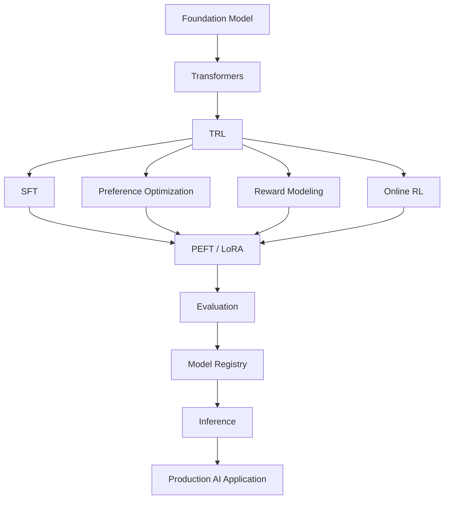

TRL is therefore best understood as a **post-training layer** around the broader Hugging Face model ecosystem.

---

# 4. TRL Workflow at a Glance

The general workflow is:

```text
Foundation Model
       ↓
Data Preparation
       ↓
Chat Template
       ↓
Training Configuration
       ↓
TRL Trainer
       ↓
PEFT / Distributed Training
       ↓
Evaluation
       ↓
Checkpoint
       ↓
Model Registry / Hugging Face Hub
       ↓
Inference
```

---

# 5. TRL Training Methods

The current TRL documentation organizes trainers into several categories.

## Offline methods

```text
SFTTrainer
DPOTrainer
KTOTrainer
BCOTrainer
CPOTrainer
ORPOTrainer
```

## Reward modeling

```text
RewardTrainer
PRMTrainer
```

## Online methods

```text
GRPOTrainer
RLOOTrainer
OnlineDPOTrainer
NashMDTrainer
PPOTrainer
XPOTrainer
```

Some methods are marked experimental and availability can change between TRL releases. Always verify the trainer and API against the version used by your project. :contentReference[oaicite:1]{index=1}

---

# 6. TRL Method Taxonomy

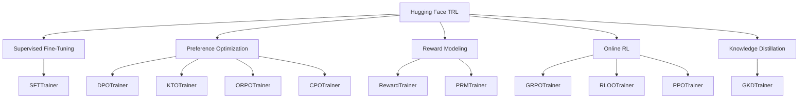

---

# 7. The Most Important TRL Trainers

For an LLM engineer, the most important trainers to understand first are:

```text
SFTTrainer
DPOTrainer
RewardTrainer
GRPOTrainer
RLOOTrainer
PPOTrainer
```

The exact trainer choice depends on the learning objective.

---

# 8. SFTTrainer

`SFTTrainer` is used for **Supervised Fine-Tuning**.

The learning pattern is:

```text
Prompt
   ↓
Expected Response
   ↓
SFT
   ↓
Instruction-Following Model
```

Typical use cases:

```text
Instruction Following
Domain Adaptation
Conversation Formatting
Task Specialization
Tool-Use Demonstrations
```

---

# 9. SFT Workflow

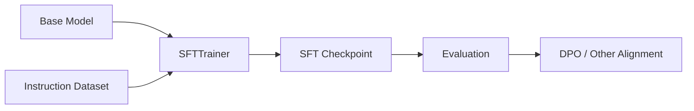

---

# 10. Basic SFT Example

```python
from datasets import load_dataset
from trl import SFTTrainer

dataset = load_dataset(
    "trl-lib/Capybara",
    split="train"
)

trainer = SFTTrainer(
    model="Qwen/Qwen2.5-0.5B",
    train_dataset=dataset,
)

trainer.train()
```

The current TRL quickstart uses `SFTTrainer` as one of its primary examples. :contentReference[oaicite:2]{index=2}

---

# 11. DPOTrainer

`DPOTrainer` is used for **Direct Preference Optimization**.

The training data contains preference information:

```text
Prompt
   ├── Chosen
   └── Rejected
```

Workflow:

```text
SFT Model
    ↓
Preference Dataset
    ↓
DPOTrainer
    ↓
Aligned Model
```

---

# 12. DPO Workflow

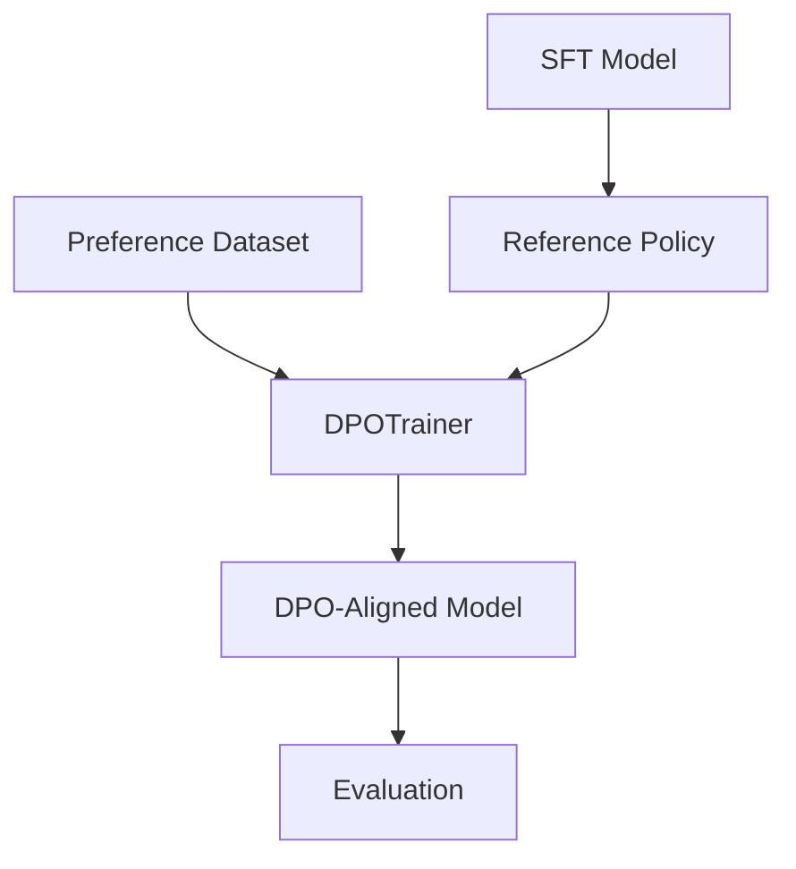

---

# 13. RewardTrainer

`RewardTrainer` is used for training reward models.

The workflow is:

```text
Preference Data
      ↓
RewardTrainer
      ↓
Reward Model
```

The current TRL documentation describes `RewardTrainer` as supporting outcome-supervised reward modeling and conversational as well as standard dataset formats. :contentReference[oaicite:3]{index=3}

---

# 14. Reward Model Workflow

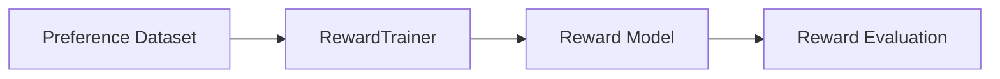

The reward model can later be used in reinforcement-learning workflows.

---

# 15. GRPOTrainer

**Group Relative Policy Optimization (GRPO)** is an online reinforcement-learning method.

Conceptually:

```text
Prompt
   ↓
Generate Multiple Responses
   ↓
Evaluate Responses
   ↓
Compare Relative Rewards
   ↓
Update Policy
```

GRPO is particularly important in modern reasoning-model post-training workflows.

---

# 16. GRPO Workflow

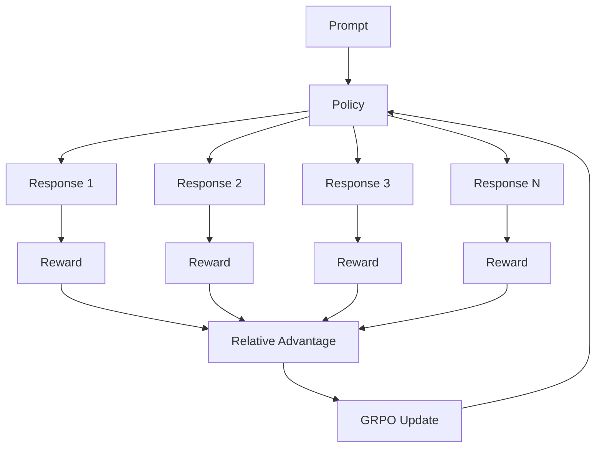

The current TRL documentation lists `GRPOTrainer` as an online method and documents vLLM support. :contentReference[oaicite:4]{index=4}

---

# 17. RLOOTrainer

**RLOO** stands for **REINFORCE Leave-One-Out**.

It is another online policy-optimization method.

Conceptually:

```text
Generate Multiple Samples
        ↓
Calculate Rewards
        ↓
Leave-One-Out Baseline
        ↓
Policy Gradient
```

It can be useful when preference or reward optimization is required without using the traditional PPO approach.

---

# 18. PPOTrainer

PPO is the reinforcement-learning algorithm covered in the previous chapter.

The conceptual workflow is:

```text
Policy
 ↓
Rollout
 ↓
Reward
 ↓
Advantage
 ↓
PPO
 ↓
Updated Policy
```

Current TRL documentation lists `PPOTrainer`, but currently categorizes it under online methods and marks it experimental. This is important when building a new production workflow because trainer availability and API maturity can change between versions. :contentReference[oaicite:5]{index=5}

---

# 19. Trainer Selection Framework

```text
Need instruction following?
        ↓
     SFTTrainer

Need preference optimization?
        ↓
     DPOTrainer

Need reward model?
        ↓
     RewardTrainer

Need online RL with verifiable rewards?
        ↓
     GRPOTrainer / other online method

Need PPO specifically?
        ↓
     PPOTrainer
```

Do not select a trainer because it is more sophisticated.

Select it because its optimization objective matches the problem.

---

# 20. TRL + Transformers

TRL builds on the Hugging Face Transformers ecosystem.

Conceptually:

```text
                 Transformers
                      │
        ┌─────────────┼─────────────┐
        ↓             ↓             ↓
     Models        Tokenizers     Config
        │             │
        └───────┬─────┘
                ↓
               TRL
                ↓
            Post-Training
```

---

# 21. TRL + Datasets

The Hugging Face `datasets` library provides the training data layer.

Typical flow:

```text
Raw Data
   ↓
Dataset
   ↓
Validation
   ↓
Formatting
   ↓
Chat Template
   ↓
TRL Trainer
```

---

# 22. TRL + PEFT

Parameter-efficient fine-tuning can be integrated into TRL workflows.

The architecture becomes:

```text
Base Model
     ↓
Frozen Parameters
     +
LoRA Adapter
     ↓
TRL Trainer
```

This reduces the number of trainable parameters.

---

# 23. TRL + LoRA

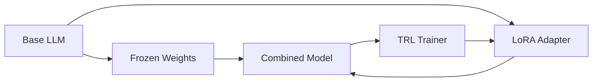

The adapter receives the updates while the base model can remain frozen.

---

# 24. TRL + QLoRA

A memory-efficient workflow can combine:

```text
Quantized Base Model
        +
LoRA
        +
TRL
```

Conceptually:

```text
4-bit Base Model
       ↓
LoRA Adapter
       ↓
SFT / DPO / Reward Training
```

The exact compatibility depends on the trainer, model architecture, PEFT configuration, and hardware.

---

# 25. TRL Installation

TRL can be installed from PyPI using:

```bash
pip install trl
```

or:

```bash
uv pip install trl
```

Hugging Face also documents installation from source for development workflows. :contentReference[oaicite:6]{index=6}

A typical environment may include:

```bash
pip install \
    transformers \
    datasets \
    accelerate \
    peft \
    trl
```

Additional dependencies may be required depending on:

```text
CUDA
Quantization
Distributed Training
vLLM
DeepSpeed
Flash Attention
```

---

# 26. Version Pinning

For production, avoid relying on unpinned dependencies.

Prefer:

```text
trl==<validated-version>
transformers==<validated-version>
datasets==<validated-version>
peft==<validated-version>
accelerate==<validated-version>
```

The exact versions should be selected and tested together.

---

# 27. Why Version Pinning Matters

TRL APIs evolve quickly.

A training script written against:

```text
TRL v0.x
```

may not behave identically under:

```text
TRL v1.x
```

Therefore:

```text
Code
+
Configuration
+
Dependencies
```

must be versioned together.

---

# 28. Environment Reproducibility

A production training environment should capture:

```text
Python Version
CUDA Version
PyTorch Version
Transformers Version
TRL Version
PEFT Version
Datasets Version
Accelerate Version
GPU Type
Driver Version
```

---

# 29. Project Structure

A production-oriented TRL project can use:

```text
llm-post-training/
│
├── configs/
│   ├── sft.yaml
│   ├── dpo.yaml
│   ├── reward.yaml
│   └── grpo.yaml
│
├── data/
│   ├── raw/
│   ├── processed/
│   └── evaluation/
│
├── src/
│   ├── data/
│   ├── training/
│   ├── evaluation/
│   ├── rewards/
│   └── utils/
│
├── scripts/
│   ├── prepare_data.py
│   ├── train_sft.py
│   ├── train_dpo.py
│   ├── train_reward.py
│   └── evaluate.py
│
├── tests/
│
├── requirements.txt
├── pyproject.toml
└── README.md
```

---

# 30. Data Pipeline

A robust pipeline should separate:

```text
Raw Data
   ↓
Cleaning
   ↓
Normalization
   ↓
Validation
   ↓
Formatting
   ↓
Chat Template
   ↓
Tokenization
   ↓
Training Dataset
```

Do not mix data preparation logic directly into the training script when building a reusable production pipeline.

---

# 31. Chat Templates

Modern conversational LLMs often expect a model-specific chat format.

Conceptually:

```text
System
   ↓
User
   ↓
Assistant
```

The tokenizer's chat template converts structured messages into the format expected by the model.

---

# 32. Conversational Dataset

Example:

```json
{
  "messages": [
    {
      "role": "system",
      "content": "You are an enterprise AI assistant."
    },
    {
      "role": "user",
      "content": "Explain Kafka."
    },
    {
      "role": "assistant",
      "content": "Kafka is an event streaming platform..."
    }
  ]
}
```

The exact dataset schema supported by a trainer should be checked against the TRL version being used.

---

# 33. Why Chat Templates Matter

Incorrect formatting can cause:

```text
Poor Training Quality
Incorrect Role Boundaries
Bad Generation Behavior
Evaluation Mismatch
```

The model may have learned:

```text
<system>
<user>
<assistant>
```

or another model-specific representation.

Do not manually invent the format when a tokenizer provides a chat template.

---

# 34. Applying a Chat Template

Conceptually:

```python
formatted = tokenizer.apply_chat_template(
    messages,
    tokenize=False,
    add_generation_prompt=False
)
```

For training and inference, the exact `add_generation_prompt` behavior depends on whether the assistant response is already present.

---

# 35. Data Validation Before Training

Validate:

```text
Prompt Exists
Response Exists
Roles Are Valid
No Empty Messages
No Malformed Conversations
No Duplicate Examples
No Evaluation Leakage
No Sensitive Data
```

---

# 36. Dataset Quality Pipeline

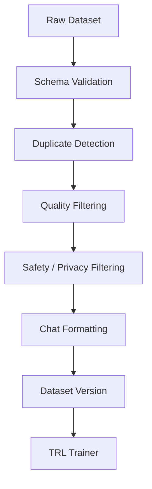

---

# 37. Dataset Versioning

Use explicit dataset versions:

```text
sft-v1
sft-v2
dpo-v1
dpo-v2
reward-v1
```

Each version should record:

```text
Source
Transformation
Filtering
Statistics
Owner
Creation Date
Approval
```

---

# 38. Training Configuration

Keep configuration separate from code.

Example:

```yaml
model:
  name: Qwen/Qwen2.5-0.5B

training:
  learning_rate: 2e-5
  epochs: 3
  batch_size: 4
  gradient_accumulation_steps: 8

output:
  directory: outputs/sft-v1

evaluation:
  strategy: steps
  frequency: 500
```

Values are illustrative.

---

# 39. SFT Configuration

A typical SFT configuration includes:

```text
Model
Dataset
Learning Rate
Batch Size
Gradient Accumulation
Epochs
Maximum Sequence Length
Evaluation Strategy
Checkpoint Strategy
Logging
```

---

# 40. DPO Configuration

Typical DPO settings include:

```text
Model
Reference Model
Preference Dataset
β
Learning Rate
Batch Size
Maximum Sequence Length
Epochs
Evaluation
Logging
```

---

# 41. Reward Model Configuration

Typical reward-model settings include:

```text
Base Model
Preference Dataset
Learning Rate
Batch Size
Epochs
Maximum Sequence Length
Evaluation
Checkpointing
```

---

# 42. GRPO Configuration

Typical GRPO configuration includes:

```text
Policy Model
Reward Function
Generation Configuration
Number of Generations
Batch Size
Learning Rate
Sequence Length
Training Steps
Evaluation
```

---

# 43. Trainer Abstraction

The architecture can be understood as:

```text
Dataset
   +
Model
   +
TrainingConfig
   +
Trainer
   ↓
Training Run
```

Different objectives replace the trainer:

```text
SFTTrainer
DPOTrainer
RewardTrainer
GRPOTrainer
RLOOTrainer
PPOTrainer
```

---

# 44. Training Loop Abstraction

Without TRL:

```text
Forward Pass
 ↓
Loss
 ↓
Backward Pass
 ↓
Gradient Accumulation
 ↓
Optimizer
 ↓
Scheduler
 ↓
Checkpoint
 ↓
Evaluation
```

With TRL:

```text
Trainer
 ↓
Configured Training Pipeline
```

The complexity is abstracted rather than eliminated.

---

# 45. What TRL Does Not Remove

TRL does not eliminate the need for:

```text
Data Engineering
Model Selection
Hyperparameter Tuning
Evaluation
GPU Capacity Planning
Experiment Tracking
Security
Deployment
Monitoring
Governance
```

A trainer solves the training-loop problem.

It does not solve the complete enterprise AI lifecycle.

---

# 46. Training with Accelerate

TRL integrates with the broader Hugging Face training stack.

Accelerate can help with:

```text
Multi-GPU
Mixed Precision
Distributed Training
Device Placement
```

Conceptually:

```text
TRL
 ↓
Accelerate
 ↓
PyTorch
 ↓
GPU Cluster
```

---

# 47. Distributed Training

For large models:

```text
Single GPU
     ↓
Multi-GPU
     ↓
Multi-Node
```

Potential strategies include:

```text
Data Parallelism
FSDP
DeepSpeed
Tensor Parallelism
Pipeline Parallelism
```

The correct strategy depends on:

```text
Model Size
GPU Memory
Interconnect
Batch Size
Sequence Length
Training Method
```

---

# 48. DeepSpeed

DeepSpeed can help with:

```text
Memory Optimization
Distributed Training
Optimizer State Sharding
Large Model Training
```

TRL documentation includes DeepSpeed integration guidance. :contentReference[oaicite:7]{index=7}

---

# 49. FSDP

Fully Sharded Data Parallelism can shard:

```text
Parameters
Gradients
Optimizer States
```

across GPUs.

Conceptually:

```text
GPU 0 → Shard A
GPU 1 → Shard B
GPU 2 → Shard C
GPU 3 → Shard D
```

This can enable models that do not fit entirely on one GPU.

---

# 50. Memory Optimization

Major memory consumers include:

```text
Model Parameters
Gradients
Optimizer States
Activations
KV Cache
Reference Model
```

Memory optimization techniques include:

```text
BF16 / FP16
Gradient Checkpointing
PEFT / LoRA
QLoRA
FSDP
DeepSpeed
Sequence Packing
Flash Attention
```

---

# 51. Gradient Accumulation

If GPU memory cannot fit the desired batch:

```text
Micro Batch
+
Micro Batch
+
Micro Batch
+
Micro Batch
```

can approximate:

```text
Larger Effective Batch
```

Conceptually:

```text
4 × batch_size 1
=
effective batch size 4
```

---

# 52. Mixed Precision

Common choices include:

```text
FP32
FP16
BF16
```

For modern GPU training, BF16 is often attractive when hardware supports it because of its numerical range.

The correct precision should be validated against the model and hardware.

---

# 53. Gradient Checkpointing

Gradient checkpointing trades:

```text
More Compute
```

for:

```text
Less Activation Memory
```

Conceptually:

```text
Normal:
Store many activations

Checkpointing:
Store fewer activations
Recompute when needed
```

---

# 54. Packing

For datasets with many short examples, sequence packing can improve utilization by combining examples into a training sequence where supported.

Conceptually:

```text
Example A
Example B
Example C
```

becomes:

```text
[Example A][Example B][Example C]
```

subject to the trainer's packing semantics and correct loss masking.

---

# 55. Training Throughput

Important metrics:

```text
Tokens / Second
Sequences / Second
GPU Utilization
GPU Memory
Step Time
Data Loading Time
```

Track these during training.

---

# 56. Training Efficiency Dashboard

```text
GPU Utilization      → 87%
GPU Memory           → 72%
Tokens / Second      → 18K
Step Time            → 2.4s
Data Wait            → 0.1s
Gradient Norm        → stable
Loss                 → decreasing
```

The exact values are illustrative.

---

# 57. Experiment Tracking

Track:

```text
Experiment ID
Model Version
Dataset Version
Trainer
Hyperparameters
Hardware
Training Duration
Loss
Evaluation Metrics
Checkpoint
Git Commit
```

---

# 58. Reproducibility

A training run should be reproducible from:

```text
Code Commit
+
Dataset Version
+
Model Version
+
Configuration
+
Environment
```

This is far more reliable than storing only:

```text
final_model/
```

---

# 59. Checkpointing

Checkpoints should be saved periodically.

Example:

```text
checkpoint-500
checkpoint-1000
checkpoint-1500
```

Checkpointing protects against:

```text
Hardware Failure
Preemption
Training Instability
Unexpected Process Termination
```

---

# 60. Best Checkpoint Selection

Do not automatically select:

```text
Latest Checkpoint
```

Instead consider:

```text
Validation Loss
Preference Win Rate
Capability Evaluation
Safety Evaluation
Business Metric
```

---

# 61. Evaluation Workflow

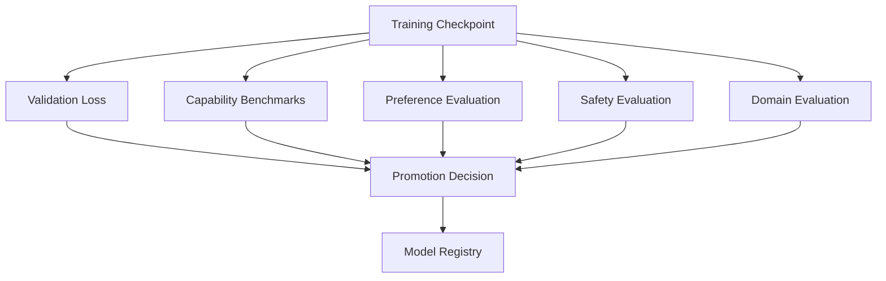

---

# 62. Evaluation Is Not Optional

A successful training run means:

```text
The optimization completed.
```

It does not mean:

```text
The model improved.
```

Therefore:

```text
Training Success
≠
Model Quality
```

---

# 63. SFT Evaluation

Evaluate:

```text
Instruction Following
Task Accuracy
Response Quality
Domain Performance
Safety
```

---

# 64. DPO Evaluation

Evaluate:

```text
Preference Win Rate
Helpfulness
Correctness
Safety
Factuality
Groundedness
Capability Regression
```

---

# 65. Reward Model Evaluation

Evaluate:

```text
Preference Accuracy
Ranking Quality
Calibration
Correlation with Human Preferences
Domain Robustness
```

---

# 66. GRPO Evaluation

Evaluate:

```text
Task Reward
Reasoning Accuracy
Outcome Success
Reward Stability
Policy Stability
General Capability
```

---

# 67. Model Comparison

Always compare:

```text
Base Model
      vs
SFT Model
      vs
DPO / RL Model
```

This establishes whether each training stage actually contributes value.

---

# 68. Hugging Face Hub

The Hugging Face Hub can be used for:

```text
Model Storage
Dataset Storage
Checkpoint Sharing
Versioning
Collaboration
Deployment Integration
```

A production workflow may be:

```text
Training
 ↓
Evaluation
 ↓
Approved Checkpoint
 ↓
Hub / Model Registry
```

---

# 69. Model Publishing

Conceptually:

```python
trainer.push_to_hub(
    "enterprise-llm-sft-v1"
)
```

The exact API depends on the trainer and installed version.

---

# 70. Model Cards

A production model should have documentation covering:

```text
Model Name
Base Model
Training Method
Dataset
Training Objective
Known Limitations
Evaluation
Safety
Intended Use
Out-of-Scope Use
License
Version
```

---

# 71. Dataset Cards

Training datasets should document:

```text
Data Source
Collection Method
Filtering
Transformations
Known Biases
Privacy
License
Intended Use
Limitations
Version
```

---

# 72. CLI Workflow

TRL provides a command-line interface for several training workflows.

Current documented commands include:

```bash
trl sft
trl dpo
trl reward
trl grpo
trl rloo
trl kto
```

It also provides commands such as:

```bash
trl env
trl vllm-serve
```

The exact CLI surface should be verified against the installed TRL version. :contentReference[oaicite:8]{index=8}

---

# 73. SFT CLI

Conceptually:

```bash
trl sft \
  --model_name_or_path Qwen/Qwen2.5-0.5B \
  --dataset_name your-dataset \
  --output_dir outputs/sft
```

The exact arguments depend on the installed TRL version and selected dataset/model.

---

# 74. DPO CLI

Conceptually:

```bash
trl dpo \
  --model_name_or_path your-sft-model \
  --dataset_name your-preference-dataset \
  --output_dir outputs/dpo
```

For production, store CLI arguments in version-controlled configuration.

---

# 75. Reward CLI

Conceptually:

```bash
trl reward \
  --model_name_or_path your-model \
  --dataset_name your-preference-dataset \
  --output_dir outputs/reward
```

---

# 76. GRPO CLI

Conceptually:

```bash
trl grpo \
  --model_name_or_path your-model \
  --output_dir outputs/grpo
```

Online RL workflows normally require additional reward configuration.

---

# 77. CLI vs Python API

### CLI

Best for:

```text
Reproducible Jobs
Automation
Experiment Configuration
CI/CD
Simple Training Pipelines
```

### Python API

Best for:

```text
Custom Data Processing
Custom Reward Functions
Advanced Control
Custom Callbacks
Complex Pipelines
```

---

# 78. Configuration-Driven Training

A production architecture should move toward:

```text
Git
 ↓
Config
 ↓
Training Job
 ↓
Experiment Tracking
 ↓
Model Registry
```

rather than:

```text
Developer Laptop
 ↓
Manually Edited Script
 ↓
Training
```

---

# 79. Training Job Metadata

Each job should record:

```json
{
  "experiment_id": "dpo-2026-001",
  "model": "enterprise-sft-v7",
  "dataset": "preference-v12",
  "trainer": "DPOTrainer",
  "trl_version": "validated-version",
  "git_commit": "abc123",
  "hardware": "gpu-cluster",
  "status": "completed"
}
```

---

# 80. Custom Callbacks

Trainer callbacks can be used for:

```text
Logging
Evaluation
Checkpoint Management
Early Stopping
Metrics
Notifications
Artifact Tracking
```

Use callbacks to integrate training with enterprise MLOps systems.

---

# 81. Custom Reward Functions

For online RL methods, reward functions can encode domain-specific objectives.

Example:

```python
def reward_function(response, expected):
    reward = 0.0

    if is_correct(response, expected):
        reward += 1.0

    if is_grounded(response):
        reward += 0.5

    if violates_policy(response):
        reward -= 1.0

    return reward
```

The reward should be:

```text
Deterministic where possible
Testable
Versioned
Observable
```

---

# 82. Reward Engineering

A production reward function should not be treated as an arbitrary score.

Define:

```text
What behavior is rewarded?
What behavior is penalized?
How are conflicts handled?
What are the edge cases?
Can the model exploit the reward?
```

---

# 83. Reward Hacking

Suppose:

```text
Reward = Answer Length
```

The model may learn:

```text
Longer answers
```

rather than:

```text
Better answers
```

Therefore reward design should reflect actual task outcomes.

---

# 84. Verifiable Rewards

Strong reward signals can come from:

```text
Unit Tests
SQL Results
API Responses
Compiler Output
Task Completion
Security Checks
Groundedness
Exact Match
```

These can be more objective than subjective evaluation alone.

---

# 85. TRL + vLLM

vLLM can be used in relevant TRL workflows to accelerate generation.

Conceptually:

```text
Training Policy
      ↓
Rollout Generation
      ↓
vLLM
      ↓
Generated Responses
      ↓
Reward
      ↓
RL Trainer
```

Current TRL documentation lists vLLM support for several online methods. :contentReference[oaicite:9]{index=9}

---

# 86. Why Rollout Infrastructure Matters

Online RL can spend substantial compute on:

```text
Generation
```

rather than only:

```text
Backpropagation
```

Therefore rollout throughput becomes a major architectural concern.

---

# 87. Training + Rollout Architecture

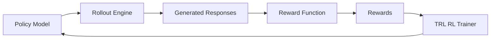

---

# 88. Distributed Rollouts

At larger scale:

```text
Training Workers
        +
Rollout Workers
        +
Reward Workers
```

can be separated.

```text
                ┌──────────────┐
                │ Policy Model │
                └──────┬───────┘
                       ↓
          ┌────────────┼────────────┐
          ↓            ↓            ↓
       Rollout       Rollout      Rollout
       Worker 1     Worker 2     Worker N
          ↓            ↓            ↓
          └────────────┼────────────┘
                       ↓
                  Reward Service
                       ↓
                  RL Trainer
```

---

# 89. Training Plane Architecture

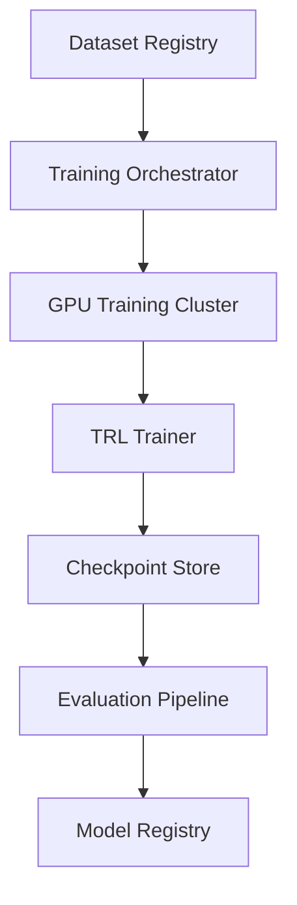

---

# 90. Enterprise TRL Architecture

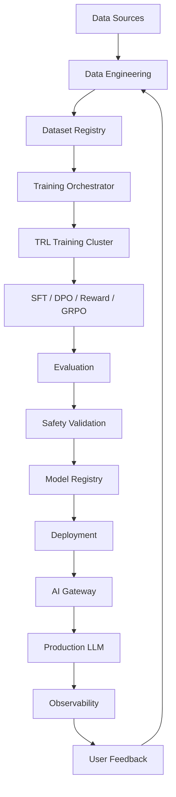

---

# 91. Enterprise AI Post-Training Lifecycle

```text
Data
 ↓
Dataset
 ↓
SFT
 ↓
Preference / Reward Data
 ↓
DPO / RL
 ↓
Evaluation
 ↓
Model Registry
 ↓
Deployment
 ↓
Observability
 ↓
Feedback
 ↓
New Data
```

This is the larger lifecycle in which TRL participates.

---

# 92. TRL and MLOps

TRL should integrate with:

```text
Experiment Tracking
Model Registry
Dataset Registry
CI/CD
GPU Scheduling
Observability
Security
Artifact Storage
Evaluation Platform
```

---

# 93. CI/CD for TRL

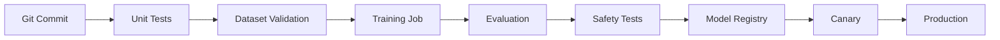

---

# 94. Continuous Evaluation

Do not evaluate only immediately after training.

Also evaluate:

```text
Before Deployment
During Canary
After Deployment
After Data Updates
After Model Updates
```

---

# 95. Production Monitoring

Monitor:

```text
Quality
Safety
Latency
Throughput
Token Usage
Cost
Error Rate
Task Success
User Feedback
```

---

# 96. Training Metrics

For SFT:

```text
Training Loss
Validation Loss
Tokens / Second
Gradient Norm
Learning Rate
```

For DPO:

```text
Loss
Reward / Preference Metrics
Chosen Log Probability
Rejected Log Probability
Reference Comparison
```

For Reward Modeling:

```text
Reward Loss
Preference Accuracy
Ranking Metrics
```

For GRPO / RL:

```text
Reward
Policy Metrics
KL
Entropy
Response Length
Generation Throughput
```

---

# 97. Model Drift

After deployment, behavior may change due to:

```text
Prompt Distribution
User Behavior
Retrieved Data
Tool Responses
System Instructions
External Environment
```

Monitor production behavior continuously.

---

# 98. Feedback Collection

Production feedback can include:

```text
Thumbs Up
Thumbs Down
Explicit Rating
Task Completion
Correction
Escalation
Human Review
Automated Outcome
```

Feedback should be carefully filtered before becoming training data.

---

# 99. Feedback-to-Training Pipeline

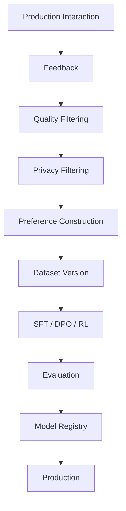

---

# 100. Data Governance

Enterprise training data should have:

```text
Ownership
Classification
Retention
Access Control
Audit Trail
Version
Approval
Deletion Policy
```

---

# 101. Security Boundaries

A production training system should separate:

```text
Data Plane
Training Plane
Model Registry
Inference Plane
```

For example:

```text
Production Data
      ↓
Controlled Export
      ↓
Training Data Store
      ↓
Training Cluster
```

Avoid unrestricted access from training infrastructure to production databases.

---

# 102. PII and Sensitive Data

Before training:

```text
Detect
 ↓
Classify
 ↓
Mask / Remove
 ↓
Validate
 ↓
Approve
```

Do not assume a dataset is safe merely because it came from an internal application.

---

# 103. Model Registry Governance

Every promoted model should have:

```text
Model Version
Parent Model
Training Method
Dataset Version
Evaluation Results
Safety Approval
Owner
Deployment Status
Rollback Version
```

---

# 104. Model Promotion

```text
Training Complete
      ↓
Automated Tests
      ↓
Evaluation
      ↓
Safety Review
      ↓
Human Review
      ↓
Model Registry
      ↓
Canary
      ↓
Production
```

---

# 105. Rollback

Always keep:

```text
Current Stable
Previous Stable
Candidate
```

If candidate quality degrades:

```text
Candidate
   ↓
Rollback
   ↓
Stable Version
```

---

# 106. TRL Workflow for SFT

```text
1. Select foundation model.

2. Prepare instruction dataset.

3. Validate schema.

4. Apply chat template.

5. Version dataset.

6. Configure SFTTrainer.

7. Add PEFT if required.

8. Launch training.

9. Monitor loss and throughput.

10. Save checkpoints.

11. Evaluate.

12. Register model.

13. Deploy if approved.
```

---

# 107. TRL Workflow for DPO

```text
1. Start from SFT model.

2. Preserve reference model.

3. Prepare preference dataset.

4. Validate chosen/rejected pairs.

5. Configure DPOTrainer.

6. Configure β.

7. Add LoRA if required.

8. Train.

9. Evaluate preference quality.

10. Evaluate capability regression.

11. Run safety evaluation.

12. Register model.

13. Canary deploy.
```

---

# 108. TRL Workflow for Reward Modeling

```text
1. Prepare preference dataset.

2. Validate preference quality.

3. Select reward-model base.

4. Configure RewardTrainer.

5. Train reward model.

6. Evaluate preference ranking.

7. Test reward robustness.

8. Register reward model.

9. Use it in an appropriate RL workflow.
```

---

# 109. TRL Workflow for GRPO

```text
1. Define task.

2. Define reward function.

3. Validate reward.

4. Select policy model.

5. Configure generation.

6. Generate multiple responses.

7. Score responses.

8. Calculate relative learning signal.

9. Update policy.

10. Monitor reward and policy stability.

11. Evaluate independently.

12. Register candidate.
```

---

# 110. TRL Workflow for PPO

```text
1. Establish policy.

2. Establish reward signal.

3. Establish reference policy if required.

4. Generate rollouts.

5. Calculate rewards.

6. Estimate advantages.

7. Run PPO optimization.

8. Monitor KL.

9. Monitor entropy.

10. Monitor clip fraction.

11. Evaluate.

12. Register candidate.
```

---

# 111. Choosing Between SFT, DPO, and RL

```text
                         ┌──────────────┐
                         │ Training Goal│
                         └──────┬───────┘
                                ↓
                    ┌─────────────────────┐
                    │ Do you have good    │
                    │ demonstrations?     │
                    └─────────┬───────────┘
                              │
                             Yes
                              ↓
                         SFTTrainer
                              │
                              ↓
                 Need preference alignment?
                       /              \
                     Yes              No
                      ↓                ↓
                 DPOTrainer        Evaluate
                      │
                      ↓
           Need online environment reward?
                  /          \
                Yes           No
                 ↓             ↓
          Online RL         DPO / SFT
```

---

# 112. Production Decision Rule

Use:

```text
SFT
```

when:

```text
Demonstrations are sufficient.
```

Use:

```text
DPO
```

when:

```text
Relative preferences are the main signal.
```

Use:

```text
Reward Modeling + RL
```

when:

```text
You need explicit reward optimization.
```

Use:

```text
Online RL
```

when:

```text
The environment and outcome provide meaningful feedback.
```

---

# 113. TRL as an Enterprise Capability

TRL should be considered one layer of an enterprise AI platform.

```text
                Enterprise AI Platform
                         │
        ┌────────────────┼────────────────┐
        ↓                ↓                ↓
   Data Platform    Training Platform   Inference
        │                │                │
        │                ↓                │
        │               TRL               │
        │                │                │
        └────────────────┼────────────────┘
                         ↓
                   Governance
```

---

# 114. Production Architecture Principles

A strong enterprise TRL architecture should follow:

```text
1. Version Everything.

2. Separate Data from Training Code.

3. Separate Training from Inference.

4. Keep Evaluation Independent.

5. Track Full Lineage.

6. Use Reproducible Configurations.

7. Use Model Registry Governance.

8. Monitor Training and Production.

9. Treat Reward Functions as Production Logic.

10. Never rely on the LLM alone for authorization.
```

---

# 115. Common TRL Mistakes

## Mistake 1 — Treating TRL as a Complete Platform

TRL handles training functionality.

It does not automatically provide:

```text
Complete MLOps
Governance
Security
Model Registry
Production Monitoring
```

---

## Mistake 2 — Ignoring Dataset Quality

```text
Bad Dataset
   ↓
Excellent Trainer
   ↓
Bad Model
```

---

## Mistake 3 — Ignoring Chat Templates

Incorrect conversational formatting can severely affect training quality.

---

## Mistake 4 — Not Pinning Versions

TRL evolves rapidly.

---

## Mistake 5 — Training Without an Evaluation Baseline

Always compare against:

```text
Base
SFT
DPO / RL
```

---

## Mistake 6 — Optimizing Only Training Loss

Training loss is not the production objective.

---

## Mistake 7 — Ignoring GPU Utilization

Poor data loading or inefficient batching can waste expensive GPU capacity.

---

## Mistake 8 — Using Online RL Without a Reliable Reward

A bad reward function can produce a bad policy very efficiently.

---

## Mistake 9 — Deploying Directly From Training

Use:

```text
Training
 ↓
Evaluation
 ↓
Approval
 ↓
Registry
 ↓
Canary
 ↓
Production
```

---

## Mistake 10 — Mixing Training and Production Infrastructure

Keep strong security and operational boundaries.

---

# 116. TRL Debugging Workflow

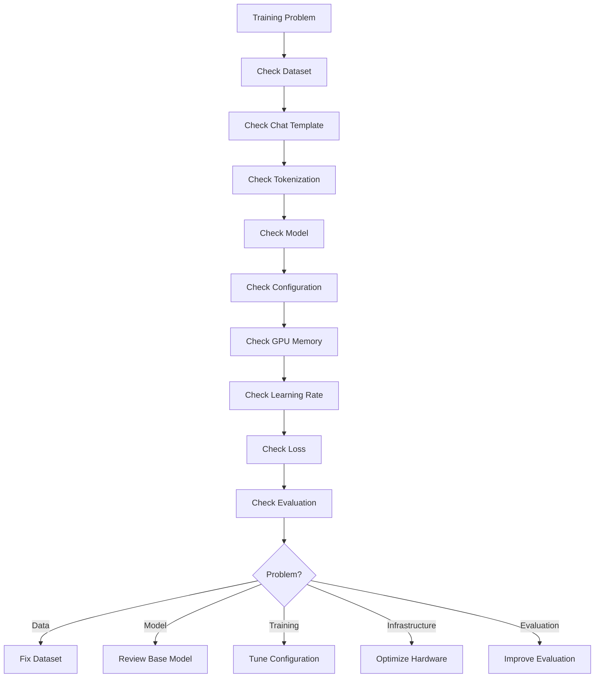

---

# 117. TRL Production Checklist

```text
[ ] Model Versioned
[ ] Dataset Versioned
[ ] Chat Template Validated
[ ] Data Schema Validated
[ ] Data Quality Checks
[ ] Privacy Checks
[ ] Safety Checks
[ ] Training Configuration Versioned
[ ] TRL Version Pinned
[ ] Transformers Version Pinned
[ ] PEFT Version Pinned
[ ] Accelerate Version Pinned
[ ] Reproducible Environment
[ ] Experiment Tracking
[ ] Checkpointing
[ ] Evaluation Pipeline
[ ] Capability Regression Tests
[ ] Safety Evaluation
[ ] Model Registry
[ ] Approval Workflow
[ ] Canary Deployment
[ ] Monitoring
[ ] Rollback
```

---

# 118. Production Workflow

```text
1. Define the business or technical objective.

2. Select the base model.

3. Define the training strategy.

4. Build the dataset.

5. Validate and clean the dataset.

6. Apply the correct chat template.

7. Version the dataset.

8. Pin the software environment.

9. Create the training configuration.

10. Select the appropriate TRL trainer.

11. Select PEFT / LoRA if appropriate.

12. Validate the training job on a small dataset.

13. Run a small-scale experiment.

14. Evaluate the result.

15. Tune hyperparameters.

16. Launch the production-scale training run.

17. Track metrics and resource utilization.

18. Save checkpoints.

19. Run automated evaluation.

20. Run safety evaluation.

21. Run domain-specific evaluation.

22. Compare against the baseline.

23. Register the candidate model.

24. Perform human review where required.

25. Run shadow evaluation.

26. Run canary deployment.

27. Monitor production.

28. Collect feedback.

29. Curate new training data.

30. Repeat the post-training lifecycle.
```

---

# 119. One Complete TRL Mental Model

```text
                       ┌─────────────────────┐
                       │    Foundation LLM   │
                       └──────────┬──────────┘
                                  ↓
                         ┌─────────────────┐
                         │ Data Preparation│
                         └────────┬────────┘
                                  ↓
                         ┌─────────────────┐
                         │ Chat Template   │
                         └────────┬────────┘
                                  ↓
                  ┌───────────────┼────────────────┐
                  ↓               ↓                ↓
             SFTTrainer       DPOTrainer     RewardTrainer
                  │               │                │
                  ↓               ↓                ↓
                SFT             DPO          Reward Model
                  │               │                │
                  └───────────────┼────────────────┘
                                  ↓
                           Online RL if needed
                                  ↓
                         ┌─────────────────┐
                         │   Evaluation    │
                         └────────┬────────┘
                                  ↓
                         ┌─────────────────┐
                         │ Model Registry  │
                         └────────┬────────┘
                                  ↓
                         ┌─────────────────┐
                         │  Deployment     │
                         └────────┬────────┘
                                  ↓
                         ┌─────────────────┐
                         │ Observability   │
                         └────────┬────────┘
                                  ↓
                              Feedback
                                  ↓
                           New Training Data
```

---

# 120. The Most Important TRL Concepts

If you remember only these concepts:

```text
1. TRL
   → Post-training library for transformer models.

2. Trainer
   → Encapsulates a particular optimization workflow.

3. Dataset
   → Defines what the model learns from.

4. Chat Template
   → Defines how conversational data is represented.

5. Evaluation
   → Determines whether training actually improved the model.
```

---

# 121. TRL Trainer Cheat Sheet

| Goal | Primary TRL Concept |
|---|---|
| Instruction tuning | `SFTTrainer` |
| Preference optimization | `DPOTrainer` |
| Reward model | `RewardTrainer` |
| Group-relative online RL | `GRPOTrainer` |
| Leave-one-out policy optimization | `RLOOTrainer` |
| PPO-based RL | `PPOTrainer` |
| Parameter-efficient training | PEFT / LoRA |
| Memory-efficient training | PEFT + quantization |
| Large-scale training | Accelerate / FSDP / DeepSpeed |
| Fast rollouts | vLLM where supported |
| Model sharing | Hugging Face Hub |

Trainer availability and maturity should be checked against the specific TRL release used in production. :contentReference[oaicite:10]{index=10}

---

# 122. TRL vs Raw PyTorch

| Capability | Raw PyTorch | TRL |
|---|---|---|
| Training loop | Manual | Trainer abstraction |
| SFT | Manual | `SFTTrainer` |
| DPO | Manual | `DPOTrainer` |
| Reward modeling | Manual | `RewardTrainer` |
| Online RL | Manual | Dedicated trainers |
| Dataset integration | Manual | Hugging Face ecosystem |
| PEFT integration | Manual | Supported |
| Distributed training | Manual setup | Ecosystem integrations |
| Experiment control | Custom | Trainer/config based |
| Flexibility | Maximum | High |

TRL trades some low-level control for a much faster path to reproducible post-training workflows.

---

# 123. TRL and the Enterprise AI Engineer

The important architectural lesson is:

```text
TRL
is not the architecture.

TRL
is one implementation layer
inside the training architecture.
```

The complete enterprise system is:

```text
Data
 ↓
Data Governance
 ↓
Dataset Registry
 ↓
TRL Training
 ↓
Evaluation
 ↓
Model Registry
 ↓
Deployment
 ↓
Observability
 ↓
Feedback
```

This distinction becomes important when moving from:

```text
Notebook
```

to:

```text
Production AI Platform
```

---

# 124. TRL and Cloud AI Architecture

A cloud-native training architecture can look like:

```text
Object Storage
      ↓
Data Processing
      ↓
Dataset Registry
      ↓
Training Orchestrator
      ↓
GPU Cluster
      ↓
TRL
      ↓
Evaluation
      ↓
Model Registry
      ↓
Inference Endpoint
```

Possible cloud implementations may use:

```text
AWS
Azure
GCP
Kubernetes
Managed ML Platforms
```

The architectural pattern remains largely the same.

---

# 125. TRL + Kubernetes

For enterprise environments:

```text
Training Job
      ↓
Kubernetes
      ↓
GPU Node Pool
      ↓
TRL Container
      ↓
Checkpoint Storage
```

This allows:

```text
Resource Isolation
Scheduling
Scaling
Retry
Observability
```

---

# 126. Containerized TRL Training

A training container should include:

```text
Python
PyTorch
Transformers
TRL
Datasets
PEFT
Accelerate
CUDA Dependencies
Training Code
Configuration
```

The container should be immutable for a given experiment version.

---

# 127. Example Container Workflow

```text
Git Commit
   ↓
Container Build
   ↓
Dependency Lock
   ↓
Training Image
   ↓
GPU Job
   ↓
TRL
   ↓
Checkpoint
```

---

# 128. Training Artifact Management

Store:

```text
Model Checkpoint
Tokenizer
Training Config
Dataset Metadata
Metrics
Logs
Git Commit
Container Image
Evaluation Results
```

Do not store only the model weights.

---

# 129. Training Lineage

A production model should be traceable:

```text
Production Model
      ↓
Training Run
      ↓
Dataset Version
      ↓
Source Data
```

and:

```text
Training Run
      ↓
Git Commit
      ↓
Container Version
      ↓
TRL Version
```

---

# 130. Enterprise Auditability

For regulated environments, answer:

```text
Which model is running?

Who trained it?

Which dataset was used?

Which TRL version was used?

Which code commit was used?

Which evaluation passed?

Who approved deployment?

What model was replaced?
```

A mature training platform should answer these questions automatically.

---

# 131. Production TRL Architecture — Final View

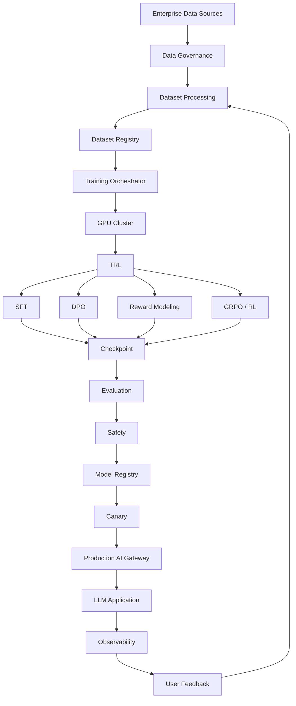

---

# 132. Key Takeaways

- **Hugging Face TRL** is a post-training library for transformer language models.
- TRL integrates with the Hugging Face Transformers ecosystem.
- TRL supports supervised fine-tuning, preference optimization, reward modeling, and online reinforcement-learning workflows.
- `SFTTrainer` is used for supervised fine-tuning.
- `DPOTrainer` is used for direct preference optimization.
- `RewardTrainer` is used for reward-model training.
- `GRPOTrainer` supports group-relative online reinforcement learning.
- `RLOOTrainer` provides leave-one-out policy optimization.
- `PPOTrainer` exists in the current trainer taxonomy but is currently marked experimental, so production teams should verify the exact version and API they plan to use. :contentReference[oaicite:11]{index=11}
- TRL provides both Python trainer APIs and CLI workflows.
- Current TRL CLI commands include `trl sft`, `trl dpo`, `trl reward`, `trl grpo`, `trl rloo`, and `trl kto`. :contentReference[oaicite:12]{index=12}
- TRL can work with PEFT and LoRA for parameter-efficient training.
- Quantization can be combined with PEFT for memory-efficient workflows where supported.
- Accelerate, FSDP, and DeepSpeed can help scale training.
- vLLM can accelerate rollout generation in supported online-RL workflows.
- Chat templates are critical for conversational-model training.
- Dataset quality has a major impact on post-training quality.
- Training configuration and dependencies should be versioned.
- TRL does not replace enterprise MLOps.
- TRL does not replace evaluation.
- TRL does not replace security.
- TRL does not replace model governance.
- TRL does not replace production monitoring.
- A production training system should track full data, code, model, configuration, and evaluation lineage.
- A model should not be promoted directly from a successful training job into production.
- The preferred lifecycle is:

```text
Data
 ↓
Training
 ↓
Evaluation
 ↓
Approval
 ↓
Model Registry
 ↓
Canary
 ↓
Production
```

- The most important architectural principle is:

```text
TRL handles the post-training optimization layer.

The enterprise AI platform
must handle everything around it.
```

---

# 133. Chapter Navigation

## Previous Chapter

[22. Direct Preference Optimization (DPO)](22-direct-preference-optimization-dpo.md)

## Current Chapter

**23. Hugging Face TRL Workflow**

## Related Chapters

- [01. Generative AI Fundamentals](01-generative-ai-fundamentals.md)
- [02. Language Understanding Fundamentals](02-language-understanding-fundamentals.md)
- [03. Word Embeddings](03-word-embeddings.md)
- [04. Language Modeling](04-language-modeling.md)
- [05. Attention and Positional Encoding](05-attention-and-positional-encoding.md)
- [06. GPT and BERT Architecture](06-gpt-and-bert-architecture.md)
- [07. Hugging Face and Transformers](07-huggingface-and-transformers.md)
- [08. LLM Data Preparation](08-llm-data-preparation.md)
- [09. Hugging Face Training Workflow](09-huggingface-training-workflow.md)
- [10. Transformer Fine-Tuning Fundamentals](10-transformer-fine-tuning-fundamentals.md)
- [11. Supervised Fine-Tuning (SFT)](11-supervised-fine-tuning-sft.md)
- [12. Parameter-Efficient Fine-Tuning (PEFT)](12-parameter-efficient-fine-tuning.md)
- [13. LoRA and QLoRA](13-lora-and-qlora.md)
- [14. Model Quantization](14-model-quantization.md)
- [15. LLM Generation Strategies](15-llm-generation-strategies.md)
- [16. LLM Evaluation](16-llm-evaluation.md)
- [17. Instruction Tuning](17-instruction-tuning.md)
- [18. Reward Modeling](18-reward-modeling.md)
- [19. LLMs as Policies](19-llms-as-policies.md)
- [20. Reinforcement Learning from Human Feedback (RLHF)](20-reinforcement-learning-from-human-feedback.md)
- [21. Proximal Policy Optimization (PPO)](21-proximal-policy-optimization-ppo.md)
- [22. Direct Preference Optimization (DPO)](22-direct-preference-optimization-dpo.md)

---

# References

- Hugging Face — TRL Documentation: https://huggingface.co/docs/trl/
- Hugging Face — TRL Installation: https://huggingface.co/docs/trl/en/installation
- Hugging Face — TRL Quickstart: https://huggingface.co/docs/trl/en/quickstart
- Hugging Face — TRL CLI Documentation: https://huggingface.co/docs/trl/clis
- Hugging Face — TRL Trainer Documentation
- Hugging Face — Transformers Documentation
- Hugging Face — Datasets Documentation
- Hugging Face — PEFT Documentation
- Hugging Face — Accelerate Documentation
- Hugging Face — DeepSpeed Integration
- Hugging Face — vLLM Integration
- Hugging Face — Model Hub Documentation
- Hugging Face — Dataset Documentation
- Rafailov et al. — *Direct Preference Optimization: Your Language Model is Secretly a Reward Model*
- Ouyang et al. — *Training Language Models to Follow Instructions with Human Feedback*
- Schulman et al. — *Proximal Policy Optimization Algorithms*
- Sutton & Barto — *Reinforcement Learning: An Introduction*

---

> **Enterprise AI Engineering Handbook**  
> *Building Production-Grade Enterprise AI Systems — One Chapter at a Time.*