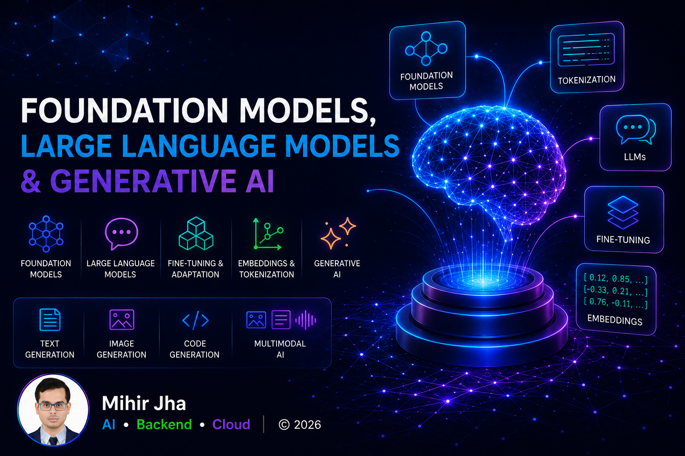

# Part III — Foundation Models, Large Language Models & Generative AI

> Learn how modern Foundation Models and Large Language Models (LLMs) are built, adapted, optimized, and deployed to power today's intelligent AI applications.

---

## 📖 Overview

Foundation Models have transformed Artificial Intelligence by enabling a single pre-trained model to solve a wide variety of tasks across natural language, computer vision, speech, code generation, and multimodal applications.

This module provides a production-focused introduction to Foundation Models, Large Language Models (LLMs), and Generative AI. You'll explore how large-scale pre-trained models are developed, adapted, optimized, and deployed using modern techniques such as fine-tuning, parameter-efficient fine-tuning (PEFT), quantization, and multimodal learning.

Designed for software engineers, backend developers, cloud engineers, solution architects, and AI engineers, this module bridges the gap between Deep Learning and Enterprise AI Engineering, preparing you for Prompt Engineering, Retrieval-Augmented Generation (RAG), AI Agents, and Agentic AI.

---

## 🎯 Learning Outcomes

After completing this module, you will be able to:

- Understand Foundation Models and how they differ from traditional Deep Learning models
- Explain the evolution from Transformers to Large Language Models (LLMs)
- Understand tokenization and modern embedding techniques
- Build applications using the Hugging Face ecosystem
- Understand model adaptation through fine-tuning, PEFT, and LoRA
- Apply quantization techniques to optimize model inference
- Understand Vision Transformers (ViT) and Multimodal AI
- Explore Diffusion Models and Generative Adversarial Networks (GANs)
- Compare open-source and proprietary Foundation Models
- Design and deploy production-ready LLM systems

---

## 🛣️ Recommended Learning Path

This module is designed as a progressive learning journey. We recommend studying the chapters in the order presented, as each topic builds upon concepts introduced in previous chapters, gradually progressing from Foundation Models to production-ready Generative AI systems.

| Chapter | Status |
|---------|:------:|
| **[01. Introduction to Foundation Models](01-introduction-to-foundation-models.md)** | 🚧 |
| **[02. Foundation Models Fundamentals](02-foundation-models-fundamentals.md)** | 🚧 |
| **[03. Large Language Models (LLMs)](03-large-language-models.md)** | 🚧 |
| **[04. Hugging Face Ecosystem](04-hugging-face-ecosystem.md)** | 🚧 |
| **[05. Tokenization](05-tokenization.md)** | 🚧 |
| **[06. Embeddings](06-embeddings.md)** | 🚧 |
| **[07. Fine-Tuning Foundation Models](07-fine-tuning-foundation-models.md)** | 🚧 |
| **[08. Parameter-Efficient Fine-Tuning (PEFT)](08-parameter-efficient-fine-tuning.md)** | 🚧 |
| **[09. LoRA & QLoRA](09-lora-and-qlora.md)** | 🚧 |
| **[10. Model Quantization](10-model-quantization.md)** | 🚧 |
| **[11. Vision Transformers (ViT)](11-vision-transformers.md)** | 🚧 |
| **[12. Diffusion Models](12-diffusion-models.md)** | 🚧 |
| **[13. Generative Adversarial Networks (GANs)](13-generative-adversarial-networks.md)** | 🚧 |
| **[14. Multimodal AI](14-multimodal-ai.md)** | 🚧 |
| **[15. Foundation Model Evaluation](15-foundation-model-evaluation.md)** | 🚧 |
| **[16. Building Production LLM Systems](16-building-production-llm-systems.md)** | 🚧 |

---

## 🏢 Enterprise Perspective

Foundation Models and Large Language Models have become the backbone of modern Enterprise AI systems.

Some common enterprise applications include:

- Enterprise Chatbots & Virtual Assistants
- Intelligent Document Processing
- Semantic Search
- Code Generation
- Knowledge Assistants
- Content Generation
- Multimodal AI Applications
- Image Generation
- Speech-to-Text & Text-to-Speech
- AI Copilots
- Recommendation Systems
- Enterprise Knowledge Platforms

Throughout this module, you'll learn not only the underlying concepts but also how Foundation Models are adapted, optimized, deployed, monitored, and governed in enterprise environments using modern AI engineering practices.

The concepts learned in this module provide the foundation for the next module, where you'll learn how to build intelligent AI applications using **Prompt Engineering** and **Retrieval-Augmented Generation (RAG)**.

---

## 🚀 Start Learning

Ready to begin your Foundation Models & Generative AI journey?

➡️ Continue with **[01. Introduction to Foundation Models](01-introduction-to-foundation-models.md)**.

---

Fixed issue in navigation

> **Enterprise AI Engineering Handbook**
> *Building Production-Grade Enterprise AI Systems — One Chapter at a Time.*