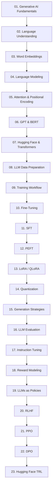
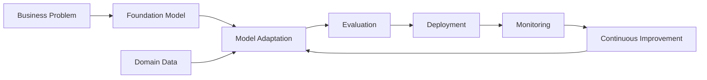

# Part III — Foundation Models, Large Language Models & Generative AI

> Learn how modern Foundation Models and Large Language Models (LLMs) evolved from Deep Learning and Transformer architectures, and how they are prepared, adapted, fine-tuned, evaluated, optimized, and aligned to build production-ready Generative AI systems.

---

## 📖 Overview

Foundation Models and Large Language Models have transformed Artificial Intelligence by enabling a single pretrained model to perform a wide variety of tasks across natural language, code, vision, speech, and multimodal applications.

This module builds on the Deep Learning foundations covered in **Part II** and moves toward modern Generative AI and LLM engineering.

Rather than treating Large Language Models as isolated technologies, this module follows their evolution:

```text
Deep Learning
      ↓
Natural Language Processing
      ↓
Word Embeddings
      ↓
Language Modeling
      ↓
Attention
      ↓
Transformers
      ↓
GPT / BERT
      ↓
Large Language Models
      ↓
Foundation Models
      ↓
Fine-Tuning
      ↓
Parameter-Efficient Fine-Tuning
      ↓
LoRA / QLoRA
      ↓
Quantization
      ↓
LLM Generation
      ↓
LLM Evaluation
      ↓
Instruction Tuning
      ↓
Reward Modeling
      ↓
RLHF
      ↓
PPO
      ↓
DPO
```

The module combines theoretical foundations with practical AI engineering using the modern Hugging Face ecosystem.

It is designed for software engineers, backend developers, cloud engineers, solution architects, and AI engineers who want to understand not only **how LLMs work**, but also how they are adapted and engineered for real-world applications.

---

## 🎯 Learning Outcomes

After completing this module, you will be able to:

- Understand the foundations of Generative AI
- Explain what Foundation Models are
- Understand the evolution of NLP toward modern LLMs
- Understand traditional and neural language representations
- Explain word embeddings and their role in NLP
- Understand language modeling and next-token prediction
- Explain attention and positional encoding
- Understand the Transformer architecture
- Compare GPT and BERT architectures
- Understand the fundamentals of Large Language Models
- Prepare datasets for LLM training and fine-tuning
- Work with the Hugging Face ecosystem
- Use Hugging Face Transformers for model development
- Understand the Transformer training workflow
- Understand supervised fine-tuning (SFT)
- Understand instruction tuning
- Apply Parameter-Efficient Fine-Tuning (PEFT)
- Understand LoRA and QLoRA
- Understand model quantization
- Understand different LLM generation strategies
- Evaluate LLM behavior and output quality
- Understand reward modeling
- Understand LLMs as policies
- Explain Reinforcement Learning from Human Feedback (RLHF)
- Understand Proximal Policy Optimization (PPO)
- Understand Direct Preference Optimization (DPO)
- Understand the Hugging Face TRL ecosystem
- Connect LLM engineering with downstream RAG, AI Agent, and Enterprise AI systems

---

## 🛣️ Recommended Learning Path

This module is organized as a progressive learning journey.

The first part establishes the foundations of language understanding and language modeling. The second part moves into Transformer architectures and the Hugging Face ecosystem. The third part focuses on model adaptation and optimization. The final part introduces alignment techniques used to make LLMs more useful and better aligned with human preferences.

---

## 🧠 Phase 1 — Generative AI & Language Foundations

| Chapter | Status |
| --- | :---: |
| **[01. Generative AI Fundamentals](01-generative-ai-fundamentals.md)** | ✅ |
| **[02. Language Understanding Fundamentals](02-language-understanding-fundamentals.md)** | ✅ |
| **[03. Word Embeddings](03-word-embeddings.md)** | ✅ |
| **[04. Language Modeling](04-language-modeling.md)** | ✅ |

This phase establishes the foundation required to understand how modern language models evolved.

The progression is:

```text
Text
 ↓
Language Representation
 ↓
Word Embeddings
 ↓
Language Modeling
```

---

## 🤖 Phase 2 — Transformers & Modern Language Models

| Chapter | Status |
| --- | :---: |
| **[05. Attention & Positional Encoding](05-attention-and-positional-encoding.md)** | ✅ |
| **[06. GPT & BERT Architecture](06-gpt-and-bert-architecture.md)** | ✅ |

This phase connects the language-modeling foundations to modern Transformer-based architectures.

```text
Language Modeling
       ↓
Attention
       ↓
Self-Attention
       ↓
Transformer
       ↓
GPT / BERT
       ↓
Modern LLMs
```

---

## 🤗 Phase 3 — Hugging Face & LLM Engineering

| Chapter | Status |
| --- | :---: |
| **[07. Hugging Face & Transformers](07-huggingface-and-transformers.md)** | ✅ |
| **[08. LLM Data Preparation](08-llm-data-preparation.md)** | ✅ |
| **[09. Hugging Face Training Workflow](09-huggingface-training-workflow.md)** | ✅ |

This phase moves from theory into practical LLM engineering.

You will work with:

```text
Hugging Face
      ↓
Tokenizers
      ↓
Datasets
      ↓
Transformers
      ↓
Training
      ↓
Model Artifacts
```

---

## 🛠️ Phase 4 — Transformer Fine-Tuning

| Chapter | Status |
| --- | :---: |
| **[10. Transformer Fine-Tuning Fundamentals](10-transformer-fine-tuning-fundamentals.md)** | ✅ |
| **[11. Supervised Fine-Tuning (SFT)](11-supervised-fine-tuning-sft.md)** | ✅ |
| **[12. Parameter-Efficient Fine-Tuning](12-parameter-efficient-fine-tuning.md)** | ✅ |
| **[13. LoRA & QLoRA](13-lora-and-qlora.md)** | ✅ |
| **[14. Model Quantization](14-model-quantization.md)** | ✅ |

This phase focuses on adapting pretrained Foundation Models for specialized tasks.

```text
Pretrained Model
       ↓
Fine-Tuning
       ↓
PEFT
       ↓
LoRA
       ↓
QLoRA
       ↓
Quantization
       ↓
Efficient Model
```

---

## ⚡ Phase 5 — LLM Generation & Evaluation

| Chapter | Status |
| --- | :---: |
| **[15. LLM Generation Strategies](15-llm-generation-strategies.md)** | ✅ |
| **[16. LLM Evaluation](16-llm-evaluation.md)** | ✅ |

Training a model is only one part of LLM engineering.

This phase focuses on:

```text
Prompt
 ↓
Token Generation
 ↓
Decoding Strategy
 ↓
Generated Output
 ↓
Evaluation
```

Topics include generation behavior, decoding strategies, and evaluating LLM outputs.

---

## 🎯 Phase 6 — Instruction Tuning & Alignment

| Chapter | Status |
| --- | :---: |
| **[17. Instruction Tuning](17-instruction-tuning.md)** | ✅ |
| **[18. Reward Modeling](18-reward-modeling.md)** | ✅ |
| **[19. LLMs as Policies](19-llms-as-policies.md)** | ✅ |
| **[20. Reinforcement Learning from Human Feedback](20-reinforcement-learning-from-human-feedback.md)** | ✅ |
| **[21. Proximal Policy Optimization (PPO)](21-proximal-policy-optimization-ppo.md)** | ✅ |
| **[22. Direct Preference Optimization (DPO)](22-direct-preference-optimization-dpo.md)** | ✅ |

This phase explains how pretrained language models are adapted toward instruction following and human preferences.

The progression is:

```text
Pretrained LLM
      ↓
Instruction Tuning
      ↓
Supervised Fine-Tuning
      ↓
Reward Modeling
      ↓
LLM as Policy
      ↓
RLHF
      ↓
PPO
      ↓
DPO
```

---

## 🧰 Phase 7 — Hugging Face TRL & Alignment Engineering

| Chapter | Status |
| --- | :---: |
| **[23. Hugging Face TRL Workflow](23-huggingface-trl-workflow.md)** | ✅ |

This phase connects the alignment concepts with practical implementation using the Hugging Face ecosystem.

The workflow brings together:

```text
Transformers
      +
Datasets
      +
PEFT
      +
Reward Modeling
      +
SFT
      +
RLHF
      +
PPO
      +
DPO
      ↓
LLM Alignment Workflow
```

---

# 🗺️ Complete Learning Journey

The complete Generative AI learning progression is:



---

# 🧠 From Deep Learning to Generative AI

This module builds directly on the Deep Learning concepts covered in **Part II**.

The relationship between the two modules is:

```text
Part II — Deep Learning
│
├── Neural Networks
├── CNNs
├── RNNs
├── Attention
├── Transformers
├── GANs
├── Diffusion
└── Production Deep Learning
          │
          ▼
Part III — Generative AI
│
├── Language Understanding
├── Word Embeddings
├── Language Modeling
├── Transformer Applications
├── GPT / BERT
├── LLMs
├── Hugging Face
├── Fine-Tuning
├── PEFT
├── LoRA / QLoRA
├── Quantization
├── Generation
├── Evaluation
└── LLM Alignment
```

The goal is therefore **not to repeat Deep Learning fundamentals**, but to build upon them and move toward modern Foundation Model and LLM engineering.

---

# 🏢 Enterprise Perspective

Foundation Models and Large Language Models are becoming core components of modern Enterprise AI platforms.

Typical enterprise applications include:

- Enterprise Chatbots
- AI Assistants
- Knowledge Assistants
- Intelligent Document Processing
- Semantic Search
- Code Generation
- Content Generation
- Customer Support
- Enterprise Copilots
- Document Summarization
- Classification
- Information Extraction
- Recommendation
- Multimodal AI
- AI-powered Developer Tools

However, enterprise LLM engineering requires more than simply calling an LLM API.

A production system typically requires:

```text
Model
+
Prompt
+
Data
+
Evaluation
+
Security
+
Observability
+
Scalability
+
Cost Management
+
Governance
```

---

# 🏗️ LLM Engineering Lifecycle



---

# ☁️ Cloud & Backend Engineering Perspective

As a backend or cloud engineer, the important shift is from:

```text
Training a Model
```

to:

```text
Engineering an AI Capability
```

An enterprise LLM application may look like:

```text
Client
   ↓
API Gateway
   ↓
Backend Service
   ↓
AI Orchestration Layer
   ↓
LLM / Foundation Model
   ↓
Business Systems
```

Later modules will extend this architecture with:

```text
RAG
 ↓
Vector Search
 ↓
Tool Calling
 ↓
Agents
 ↓
Agentic Workflows
```

---

# 🔗 Connection to the Next Modules

This module establishes the foundation for the next stages of the Enterprise AI Engineering roadmap.

```text
Part III
Foundation Models / LLMs
        ↓
Part IV
Prompt Engineering & RAG
        ↓
Advanced Retrieval
        ↓
AI Agents
        ↓
Agentic AI
        ↓
Enterprise AI Systems
```

The key transition is:

> **From understanding and adapting models → to engineering applications around models.**

---

# 🚀 What Comes After This Module?

After completing the Foundation Models, LLMs, and Generative AI foundations, the learning journey moves from **model-centric engineering** toward **application-centric AI engineering**.

The next major concepts are:

```text
LLM
 ↓
Prompt Engineering
 ↓
Embeddings
 ↓
Vector Search
 ↓
Retrieval
 ↓
RAG
 ↓
Advanced RAG
 ↓
Tool Calling
 ↓
Agents
 ↓
Agentic AI
 ↓
Enterprise AI Architecture
```

This is where the knowledge transitions from:

> **"How do LLMs work?"**

to:

> **"How do we build reliable enterprise systems around LLMs?"**

---

## 🧭 Module Summary

```text
Phase 1
Generative AI & Language Foundations
        ↓
Phase 2
Transformers & Modern Language Models
        ↓
Phase 3
Hugging Face & LLM Engineering
        ↓
Phase 4
Fine-Tuning & Model Optimization
        ↓
Phase 5
Generation & Evaluation
        ↓
Phase 6
Instruction Tuning & Alignment
        ↓
Phase 7
TRL & Alignment Engineering
        ↓
RAG
        ↓
AI Agents
        ↓
Enterprise AI
```

---

## 📌 Key Takeaways

- Foundation Models provide reusable pretrained capabilities across many AI tasks.
- Modern LLMs evolved from earlier NLP and language-modeling approaches.
- Word embeddings provide an important bridge between traditional NLP and neural language models.
- Language modeling introduces the concept of predicting language from context.
- Attention and Transformers enabled the scaling of modern language models.
- GPT and BERT represent important Transformer-based model families.
- The Hugging Face ecosystem provides tools for working with modern pretrained models.
- LLM data preparation is an important part of the model-development workflow.
- Fine-tuning adapts pretrained models to specialized tasks.
- SFT provides a foundation for instruction-following behavior.
- PEFT reduces the resources required to adapt large models.
- LoRA and QLoRA enable efficient parameter adaptation.
- Quantization can reduce model memory and inference requirements.
- Generation strategies influence the behavior and quality of LLM outputs.
- LLM evaluation requires appropriate technical and task-specific metrics.
- Instruction tuning improves the ability of models to follow human instructions.
- Reward modeling provides a mechanism for representing human preferences.
- RLHF uses human preference signals to align model behavior.
- PPO provides a reinforcement-learning-based optimization approach used in RLHF workflows.
- DPO provides a preference-optimization approach without requiring the same explicit RL optimization loop as PPO-based RLHF.
- Hugging Face TRL provides practical tooling for alignment workflows.
- These techniques form the foundation for building modern LLM-powered applications.
- The next stage is to move from model engineering toward RAG, AI Agents, Agentic AI, and Enterprise AI architecture.

---

## 🚀 Start Learning

Ready to begin your Foundation Models and Generative AI journey?

➡️ Continue with **[01. Generative AI Fundamentals](01-generative-ai-fundamentals.md)**.

---

> **Enterprise AI Engineering Handbook**  
> *Building Production-Grade Enterprise AI Systems — One Chapter at a Time.*