# 04 — Prompt Design Patterns

> Learn reusable Prompt Engineering patterns for designing clear, reliable, maintainable, and production-oriented LLM interactions.

---

## 📖 Overview

Prompt Engineering becomes significantly more effective when prompts are designed using **reusable patterns** rather than being written from scratch for every task.

A Prompt Design Pattern is a repeatable structure that helps solve a particular class of LLM application problem.

Common patterns include:

- Role-based prompting
- Task-specific prompting
- Instruction + Context
- Delimiter-based prompting
- Few-shot prompting
- Output-format prompting
- Constraint-based prompting
- Decomposition
- Step-by-step task execution
- Critique and refinement
- Self-checking
- Classification
- Extraction
- Transformation
- Summarization
- Grounded question answering

The objective is not to memorize prompt templates.

The objective is to understand **when a particular pattern is useful, what problem it solves, and how to implement it safely in a production application**.

---

# 1. What Is a Prompt Design Pattern?

A Prompt Design Pattern is a reusable approach for structuring instructions and context for an LLM.

Instead of:

```text
Write a prompt.
```

we think in terms of:

```text
Problem
   ↓
Prompt Pattern
   ↓
Prompt Structure
   ↓
LLM
   ↓
Expected Behavior
```

For example, if the problem is:

```text
The model produces inconsistent output.
```

a possible pattern is:

```text
Explicit Output Format
+
Constraints
+
Examples
```

If the problem is:

```text
The model does not understand the domain context.
```

a possible pattern is:

```text
Instruction
+
Relevant Context
+
Task
```

---

# 2. Why Prompt Patterns Matter

Without reusable patterns, applications can develop many unrelated prompts:

```text
Prompt A
Prompt B
Prompt C
Prompt D
Prompt E
...
```

This makes them difficult to:

- Understand
- Test
- Version
- Maintain
- Evaluate
- Reuse

A pattern-based approach creates consistency.

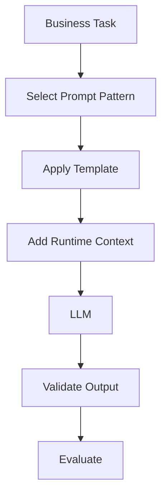

---

# 3. Pattern 1 — Role-Based Prompting

Role-based prompting establishes the perspective from which the model should respond.

Example:

```text
You are a senior Java backend architect.

Explain event-driven architecture for an enterprise
microservices platform.
```

The role can influence:

```text
Terminology
Perspective
Depth
Communication Style
```

---

## Example

```text
You are a senior cloud architect.

Review the following architecture.

Focus on:

- scalability
- availability
- reliability
- observability
```

The model is given a defined professional perspective.

---

## Architecture

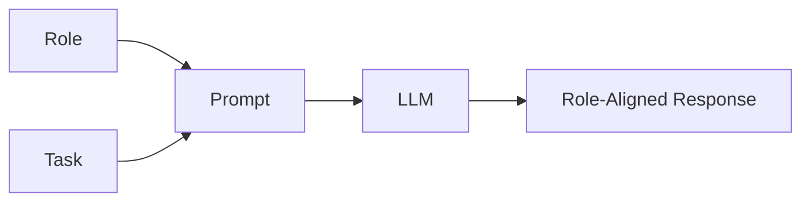

---

## Production Consideration

A role does **not** provide actual permissions.

For example:

```text
You are an administrator.
```

does not grant database or cloud administrator privileges.

Authorization must remain an application responsibility.

---

# 4. Pattern 2 — Instruction + Context

One of the most useful patterns is:

```text
Instruction
+
Context
```

Example:

```text
Task:

Identify the reliability risks.

Context:

The application consists of:

- Spring Boot microservices
- Kafka
- PostgreSQL
- Redis
- Kubernetes
```

The model now has the information required to perform the task.

---

## Architecture

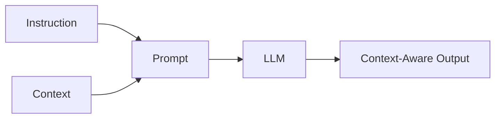

---

# 5. Pattern 3 — Instruction + Context + Constraints

The previous pattern can be extended with constraints.

```text
Instruction
+
Context
+
Constraints
```

Example:

```text
Task:

Review the architecture.

Context:

Spring Boot + Kafka + PostgreSQL

Constraints:

- Focus only on reliability.
- Identify the five most important risks.
- Provide one recommendation for each.
```

This reduces ambiguity.

---

# 6. Pattern 4 — Role + Task + Context + Output

A common production pattern is:

```text
Role
+
Task
+
Context
+
Constraints
+
Output
```

Example:

```text
ROLE

You are a senior backend architect.

TASK

Review the payment processing architecture.

CONTEXT

The system uses:

- Spring Boot
- Kafka
- PostgreSQL
- Redis

CONSTRAINTS

Focus on reliability and scalability.

OUTPUT

Return five findings using:

Risk | Impact | Recommendation
```

---

## Reusable Template

```text
ROLE

{role}

TASK

{task}

CONTEXT

{context}

CONSTRAINTS

{constraints}

OUTPUT

{output_format}
```

This pattern can serve as a general-purpose starting point.

---

# 7. Pattern 5 — Delimiter-Based Prompting

When a prompt contains external content, clearly separate it from instructions.

Example:

```text
Summarize the document.

--- DOCUMENT START ---

{{document}}

--- DOCUMENT END ---

Return five key points.
```

This creates a clear boundary.

---

## Mermaid Representation

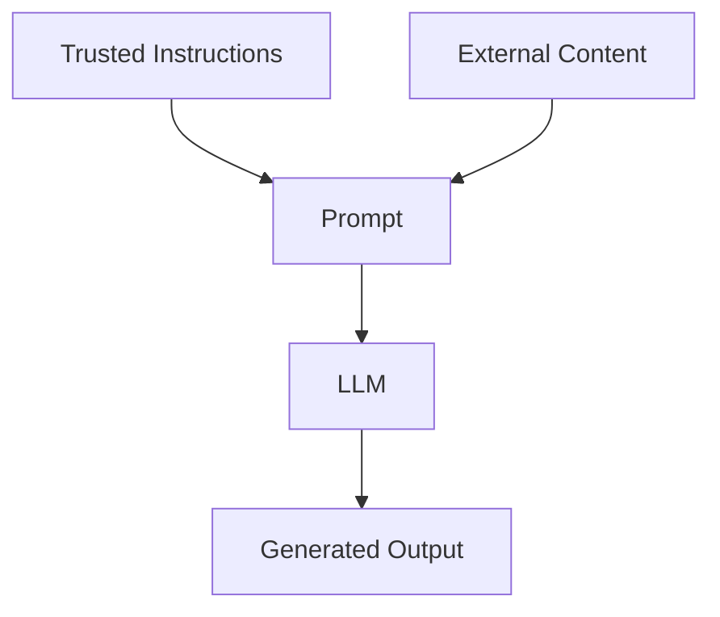

---

# 8. Pattern 6 — XML-Style Boundaries

Another approach is to use structured tags.

```text
<instructions>
Summarize the document.
</instructions>

<document>
{{document}}
</document>

<output>
Return five bullet points.
</output>
```

This can make complex prompts easier to organize.

The important principle is:

```text
Clear Semantic Boundaries
```

rather than any specific delimiter syntax.

---

# 9. Pattern 7 — Markdown-Structured Prompt

Markdown headings provide another simple structure.

```text
# ROLE

You are a senior Java architect.

# TASK

Review the architecture.

# CONTEXT

Spring Boot + Kafka + PostgreSQL.

# CONSTRAINTS

Focus on reliability.

# OUTPUT

Return a Markdown table.
```

This pattern is particularly readable during development and debugging.

---

# 10. Pattern 8 — Explicit Output Format

If the output is consumed by software, define the required format.

Example:

```text
Return:

{
  "category": "...",
  "severity": "...",
  "recommendation": "..."
}
```

Instead of:

```text
Tell me what you think about the incident.
```

---

## Production Flow


The prompt defines the expected structure.

The application should still validate it.

---

# 11. Pattern 9 — Constraint-Based Prompting

Constraints limit the model's response.

Examples:

```text
Return exactly five recommendations.
```

```text
Use Java 21.
```

```text
Do not introduce additional frameworks.
```

```text
Keep the answer below 500 words.
```

```text
Use only the supplied context.
```

Constraints are useful when an application has explicit requirements.

---

# 12. Pattern 10 — Positive and Negative Instructions

A prompt can define both desired and prohibited behavior.

```text
DO:

- Use only supplied information.
- Identify uncertainty.
- Provide production recommendations.

DO NOT:

- Invent facts.
- Assume missing information.
- Add unrelated technologies.
```

This makes the intended behavior clearer.

However:

> Negative instructions in a prompt should not replace application-level security controls.

---

# 13. Pattern 11 — Missing-Information Handling

Knowledge applications should explicitly define what happens when the required information is unavailable.

Example:

```text
Use only the supplied context.

If the answer cannot be determined from the context,
respond:

"Insufficient information."
```

---

## Decision Flow

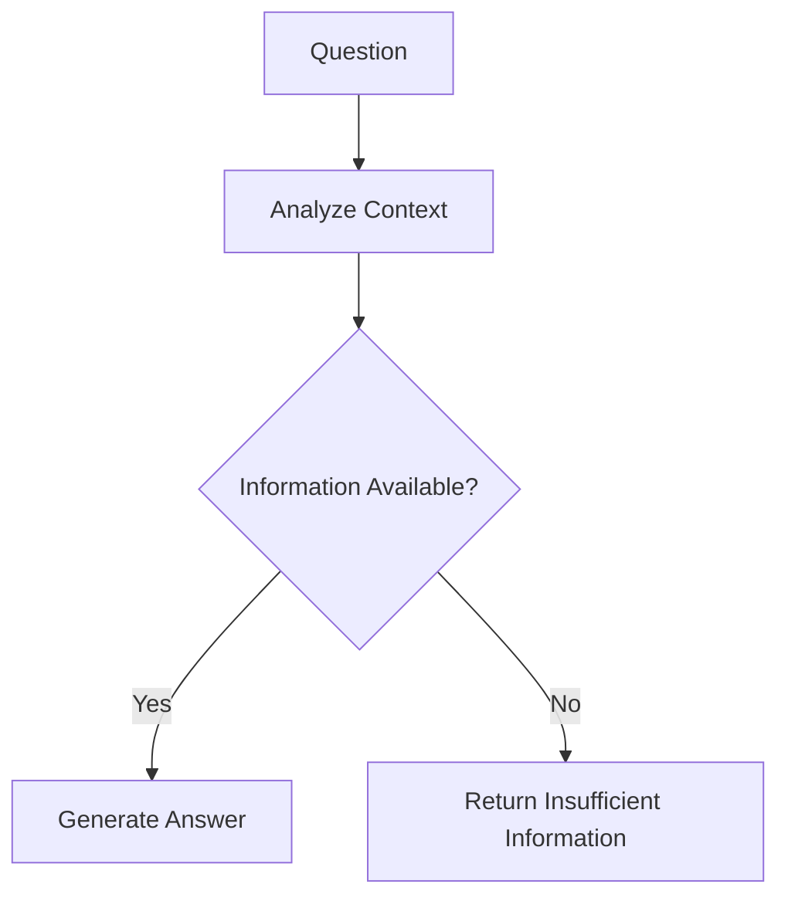

This pattern is particularly useful for enterprise knowledge assistants.

---

# 14. Pattern 12 — Uncertainty-Aware Prompting

Instead of forcing an answer, explicitly allow uncertainty.

```text
If the evidence is insufficient:

1. State what is known.
2. State what is unknown.
3. Do not invent missing information.
```

Example:

```text
Known:
The application uses Kafka.

Unknown:
The supplied architecture does not define
the retry strategy.

Recommendation:
Define an explicit retry and dead-letter strategy.
```

This is often preferable to an unsupported confident answer.

---

# 15. Pattern 13 — Task Decomposition

Complex tasks can be divided into smaller operations.

Instead of:

```text
Analyze the entire architecture.
```

use:

```text
1. Identify components.
2. Identify dependencies.
3. Analyze scalability.
4. Analyze reliability.
5. Analyze security.
6. Provide recommendations.
```

---

## Flow

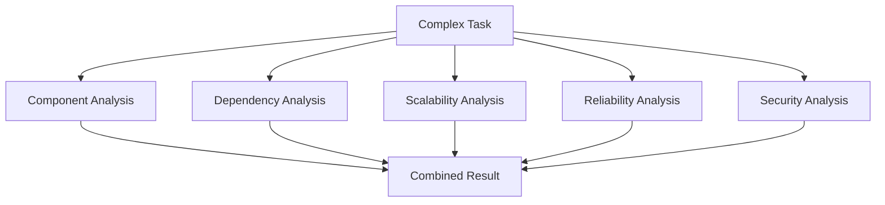

Task decomposition makes complex prompts easier to understand and evaluate.

---

# 16. Pattern 14 — Sequential Prompting

A complex operation can also be split across multiple LLM calls.

```text
Input
 ↓
Prompt 1
 ↓
Intermediate Result
 ↓
Prompt 2
 ↓
Intermediate Result
 ↓
Prompt 3
 ↓
Final Result
```

Example:

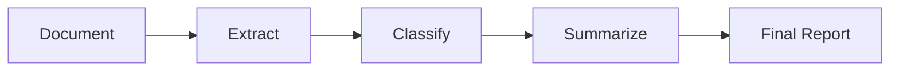

This is useful when each step has a clearly defined responsibility.

---

# 17. Pattern 15 — Prompt Chaining

Prompt chaining is an application-level implementation of sequential prompting.

Example:

```python
def extract_information(document):
    return llm(
        f"""
        Extract the important information.

        Document:
        {document}
        """
    )


def classify_information(extracted):
    return llm(
        f"""
        Classify the extracted information.

        Input:
        {extracted}
        """
    )


def summarize(classification):
    return llm(
        f"""
        Create a concise summary.

        Classification:
        {classification}
        """
    )
```

Pipeline:

```text
Document
   ↓
Extraction
   ↓
Classification
   ↓
Summary
```

---

# 18. Pattern 16 — Few-Shot Example Pattern

Examples can demonstrate the expected behavior.

Example:

```text
Classify the sentiment.

Example 1:

Input:
"The service was excellent."

Output:
positive

Example 2:

Input:
"The application was unavailable."

Output:
negative

Now classify:

Input:
"The service is working normally."
```

The examples provide demonstrations of the task.

The detailed zero-shot, one-shot, and few-shot techniques are covered in:

**05 — Zero-shot, One-shot & Few-shot Prompting**

---

# 19. Pattern 17 — Input / Output Example Pair

Examples can also establish output structure.

```text
Example:

Input:
Payment failed.

Output:

{
  "category": "PAYMENT",
  "severity": "HIGH"
}
```

Then:

```text
Classify:

Input:
Account password reset failed.
```

This gives the model both:

```text
Task
+
Expected Representation
```

---

# 20. Pattern 18 — Classification Pattern

Classification prompts map input into predefined categories.

Example:

```text
Classify the following customer request.

Allowed categories:

- PAYMENT
- ACCOUNT
- TECHNICAL
- SHIPPING
- OTHER

Customer request:

{{message}}
```

---

## Structured Version

```text
Return JSON:

{
  "category": "PAYMENT | ACCOUNT | TECHNICAL | SHIPPING | OTHER"
}
```

---

## Architecture

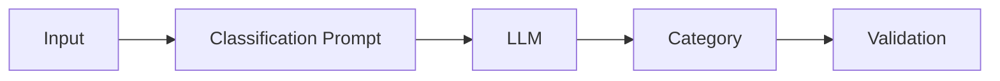

---

# 21. Pattern 19 — Extraction Pattern

Extraction prompts convert unstructured text into structured information.

Example:

```text
Extract:

- customer_name
- account_id
- issue_type
- priority

If a field is unavailable, return null.

Document:

{{document}}
```

Expected output:

```json
{
  "customer_name": "John",
  "account_id": "A10023",
  "issue_type": "PAYMENT_FAILURE",
  "priority": "HIGH"
}
```

---

# 22. Pattern 20 — Transformation Pattern

Transformation changes one representation into another.

Example:

```text
Convert the following incident report
into an engineering incident summary.

Include:

- incident
- impact
- root_cause
- mitigation
- follow_up_actions

Incident:

{{incident}}
```

---

## Flow

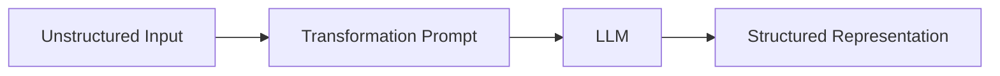

---

# 23. Pattern 21 — Summarization Pattern

A useful summarization prompt defines:

```text
Source
+
Purpose
+
Audience
+
Length
+
Focus
```

Example:

```text
Summarize the following architecture document
for a senior engineering manager.

Focus on:

- major architectural decisions
- risks
- operational concerns

Keep the summary below 300 words.

Document:

{{document}}
```

---

# 24. Pattern 22 — Comparison Pattern

Comparison prompts should define the dimensions to compare.

Weak:

```text
Compare Kafka and RabbitMQ.
```

Better:

```text
Compare Kafka and RabbitMQ for an enterprise
microservices platform.

Evaluate:

- throughput
- ordering
- delivery model
- scalability
- persistence
- operational complexity

Return a comparison table.
```

---

## Example Output Structure

| Dimension | Kafka | RabbitMQ |
|---|---|---|
| Throughput | | |
| Ordering | | |
| Delivery | | |
| Scalability | | |
| Persistence | | |
| Operations | | |

The exact technical conclusions should be evaluated independently rather than assumed from the prompt.

---

# 25. Pattern 23 — Decision-Making Prompt

Decision prompts can define explicit evaluation criteria.

```text
Recommend between Option A and Option B.

Evaluate:

1. Cost
2. Scalability
3. Reliability
4. Operational Complexity
5. Team Expertise

Return:

- recommendation
- reasons
- trade-offs
- assumptions
```

---

## Decision Flow

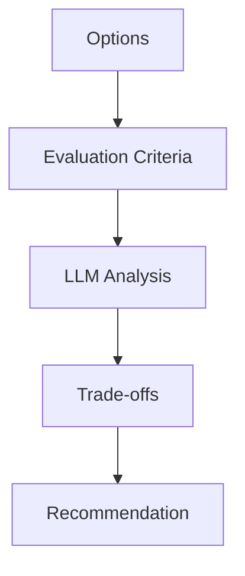

The application should not blindly treat an LLM recommendation as authoritative for high-impact decisions.

---

# 26. Pattern 24 — Rubric-Based Evaluation

A rubric gives explicit scoring criteria.

Example:

```text
Evaluate the architecture.

Scoring:

0 = Not addressed
1 = Partially addressed
2 = Adequately addressed

Evaluate:

- Availability
- Scalability
- Security
- Observability
```

Expected output:

```json
{
  "availability": 2,
  "scalability": 1,
  "security": 2,
  "observability": 1
}
```

Rubrics can improve consistency when evaluating similar inputs.

---

# 27. Pattern 25 — Critique and Refinement

One model call can generate an initial result.

A second step can critique it.

```text
Input
 ↓
Generate
 ↓
Critique
 ↓
Improve
 ↓
Final Output
```

---

## Flow

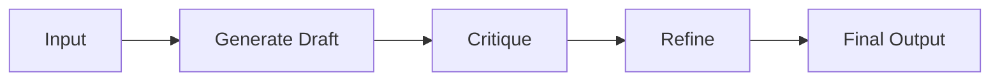

Example:

```text
Generate a technical architecture proposal.

Then review the proposal for:

- missing failure handling
- scalability risks
- security issues
- operational gaps

Then produce an improved version.
```

---

# 28. Pattern 26 — Self-Check

A prompt can ask the model to verify its output against explicit requirements.

Example:

```text
Before returning the final answer, verify:

- all requested sections are present
- no required field is missing
- the response follows the requested format
- unsupported assumptions are identified
```

The goal is to introduce a validation-oriented step.

However, model self-checking is not equivalent to independent verification.

---

# 29. Pattern 27 — Generate → Validate

A stronger application architecture separates generation from validation.

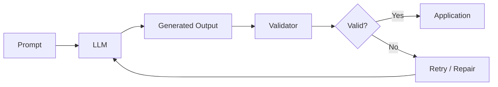

The validator may be:

```text
Schema Validator
Business Rule Validator
Type Validator
Application Logic
```

This is much stronger than relying entirely on prompt instructions.

---

# 30. Pattern 28 — Generate → Critique → Refine

For complex content:

```text
Generate
   ↓
Critique
   ↓
Refine
```

Example:

```python
draft = llm(
    """
    Create a production architecture proposal
    for the given requirements.
    """
)

critique = llm(
    f"""
    Review the following proposal.

    Identify:
    - reliability issues
    - scalability issues
    - security concerns

    Proposal:
    {draft}
    """
)

final = llm(
    f"""
    Improve the proposal using the critique.

    Proposal:
    {draft}

    Critique:
    {critique}
    """
)
```

---

# 31. Pattern 29 — Grounded Question Answering

A grounded prompt instructs the model to use supplied context.

```text
Answer the question using only the supplied context.

If the answer is not present in the context,
say that the information is unavailable.

Context:
{{context}}

Question:
{{question}}
```

---

## RAG Foundation

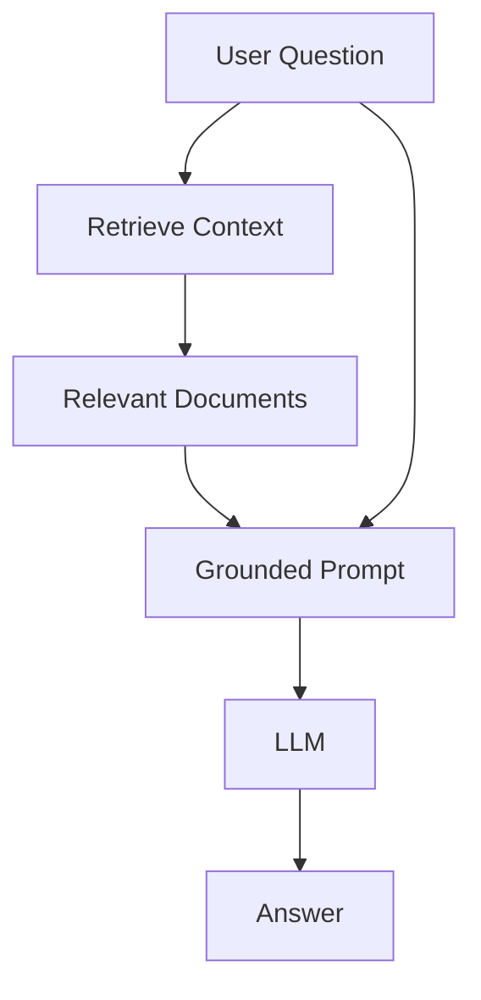

This pattern becomes central to the RAG portion of Part IV.

---

# 32. Pattern 30 — Context + Question Separation

A simple but important RAG prompt structure is:

```text
CONTEXT

{{context}}

QUESTION

{{question}}
```

This clearly separates:

```text
Evidence
```

from:

```text
Question
```

Example:

```text
CONTEXT

The payment service retries failed transactions
up to three times.

QUESTION

How many retries does the payment service perform?
```

Expected answer:

```text
Three retries.
```

---

# 33. Pattern 31 — Context-Grounded Answer with Evidence

For enterprise knowledge systems, the prompt can request supporting evidence.

```text
Answer using only the supplied context.

For every answer provide:

- answer
- supporting evidence

If evidence is unavailable, say so.

Context:
{{context}}

Question:
{{question}}
```

Possible output:

```json
{
  "answer": "Three retries.",
  "evidence": "The payment service retries failed transactions up to three times."
}
```

This can improve traceability, although evidence quality still needs application-level evaluation.

---

# 34. Pattern 32 — Instruction Hierarchy

Complex prompts may have multiple requirements.

A prompt can explicitly establish priority:

```text
Follow these rules in order of priority:

1. Do not invent information.
2. Use supplied context.
3. Follow the required output structure.
4. Be concise.
```

This helps communicate intended precedence.

---

# 35. Pattern 33 — Conditional Instructions

Conditional instructions allow prompts to adapt to the input.

Example:

```text
If the customer is an enterprise customer,
provide enterprise support recommendations.

Otherwise, provide standard support recommendations.
```

Python example:

```python
def build_prompt(customer_type, issue):

    return f"""
    Customer type:
    {customer_type}

    Issue:
    {issue}

    If the customer is enterprise,
    prioritize business continuity.

    Otherwise,
    prioritize standard support resolution.
    """
```

For more complex decision logic, application code may be preferable to putting all logic into a prompt.

---

# 36. Pattern 34 — Dynamic Context Injection

Production applications frequently inject runtime information.

```text
Static Prompt
      +
User Input
      +
Application Data
      +
Retrieved Context
      ↓
Final Prompt
```

Example:

```python
def build_prompt(question, customer, context):

    return f"""
    You are an enterprise support assistant.

    Customer:
    {customer}

    Context:
    {context}

    Question:
    {question}

    Answer using only the available information.
    """
```

---

# 37. Pattern 35 — Template + Variables

A clean pattern is:

```text
Template
+
Variables
```

Example:

```python
PROMPT = """
You are a {role}.

Task:
{task}

Context:
{context}

Output:
{output_format}
"""
```

Runtime:

```python
prompt = PROMPT.format(
    role="cloud architect",
    task="review architecture",
    context="AWS microservices platform",
    output_format="five recommendations"
)
```

This approach supports reusable application components.

---

# 38. Pattern 36 — Multi-Stage Prompt Pipeline

A complex application can combine multiple patterns.

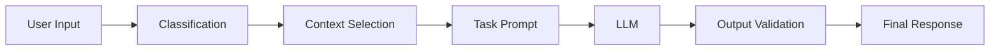

For example:

```text
Classify Query
       ↓
Select Relevant Context
       ↓
Generate Answer
       ↓
Validate
```

This is a useful foundation for RAG applications.

---

# 39. Pattern 37 — Prompt Router

Different tasks may require different prompts.

For example:

```text
Customer Query
      ↓
Classification
      ↓
 ┌───────────────┬───────────────┐
 ↓               ↓               ↓
Billing       Technical       Account
 ↓               ↓               ↓
Prompt A       Prompt B        Prompt C
```

---

## Mermaid

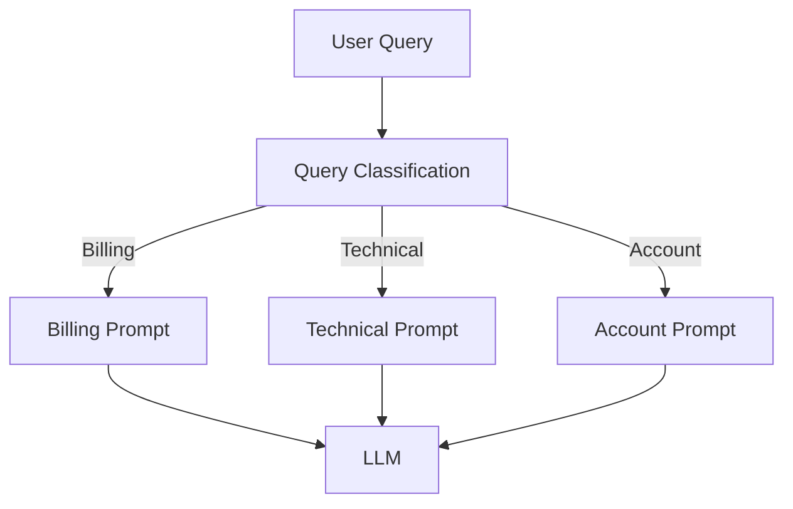

This pattern can keep individual prompts focused.

Advanced routing architectures belong to later retrieval/application topics.

---

# 40. Pattern 38 — Fallback Prompt

Applications can define fallback behavior.

Example:

```text
If the request cannot be answered using the
available information, return:

"I cannot answer this request with the information available."
```

Application-level fallback:

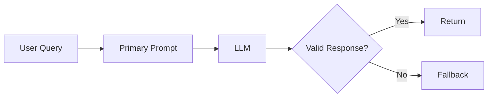

Fallbacks are especially important in production systems.

---

# 41. Pattern 39 — Retry / Repair

If structured output is invalid, the application may attempt a repair.

```text
LLM
 ↓
Invalid JSON
 ↓
Repair Prompt
 ↓
LLM
 ↓
Validated JSON
```

Example:

```python
repair_prompt = f"""
The previous response did not follow the required JSON format.

Return valid JSON matching:

{schema}

Previous response:
{response}
"""
```

A retry policy should include safeguards against infinite retries.

---

# 42. Pattern 40 — Structured Output + Validation

A robust application combines:

```text
Prompt
+
Structured Output
+
Schema Validation
```

Example schema:

```python
from pydantic import BaseModel


class Classification(BaseModel):
    category: str
    confidence: float
```

The application can validate the model response against the schema.

Conceptually:

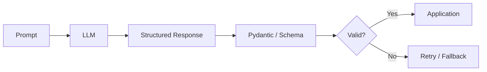

---

# 43. Pattern 41 — Prompt with Explicit Assumptions

When assumptions are required, state them explicitly.

```text
Assumptions:

- The application runs in AWS.
- PostgreSQL is the primary database.
- Kafka is used for asynchronous events.
- The system requires high availability.
```

Then:

```text
Recommend an architecture based on these assumptions.
```

This prevents hidden assumptions from becoming accidental requirements.

---

# 44. Pattern 42 — Ask for Clarification

For interactive systems, the model can identify missing information.

Example:

```text
If the request is missing information required
to provide a reliable answer, ask one concise
clarifying question before proceeding.
```

Example:

```text
User:
Design a deployment architecture.

Assistant:
Which cloud provider should the architecture target:
AWS, Azure, or GCP?
```

This pattern is useful for interactive assistants.

---

# 45. Pattern 43 — Progressive Disclosure

Instead of requesting a massive response immediately:

```text
Step 1:
Provide a high-level architecture.

Step 2:
After confirmation, provide implementation details.

Step 3:
Provide deployment details.
```

This can reduce unnecessary output and make interactions easier to manage.

---

# 46. Pattern 44 — Audience-Adaptive Prompt

The same information can be presented differently depending on the audience.

```text
Audience:
Senior backend engineer
```

versus:

```text
Audience:
Business stakeholder
```

Example:

```python
def build_explanation(topic, audience):

    return f"""
    Explain {topic} for this audience:

    {audience}

    Adjust:
    - terminology
    - technical depth
    - examples
    - assumptions
    """
```

---

# 47. Pattern 45 — Format-Specific Prompt

Different consumers require different formats.

### Markdown

```text
Return the answer as Markdown.
```

### JSON

```text
Return valid JSON.
```

### Table

```text
Return a Markdown comparison table.
```

### Code

```text
Return only the Java code.
```

### Bullet List

```text
Return exactly seven bullet points.
```

The output format should match the downstream consumer.

---

# 48. Pattern 46 — Code Generation with Constraints

A code-generation prompt should define:

```text
Language
Version
Framework
Architecture
Constraints
Expected Output
```

Example:

```text
Generate a Java 21 Spring Boot REST controller.

Requirements:

- POST /payments
- request validation
- service-layer delegation
- appropriate HTTP status codes
- no business logic in the controller

Return only the Java source code.
```

---

# 49. Pattern 47 — Code Review Rubric

A reusable code-review prompt:

```text
Review the following Java code.

Evaluate:

1. Correctness
2. Concurrency
3. Error Handling
4. Security
5. Performance
6. Maintainability

For each issue return:

- severity
- location
- explanation
- recommendation
```

This pattern turns a vague review request into a structured evaluation task.

---

# 50. Pattern 48 — Summarization with Focus

A generic:

```text
Summarize this document.
```

can be improved:

```text
Summarize this document for a senior engineering manager.

Focus on:

- architecture decisions
- risks
- operational concerns
- unresolved issues

Keep the summary below 400 words.
```

The pattern is:

```text
Source
+
Audience
+
Focus
+
Length
```

---

# 51. Pattern 49 — Extraction with Missing Values

A robust extraction prompt should define missing values.

```text
Extract:

- customer_name
- account_id
- order_id
- amount

If a field is not present,
return null.

Do not infer missing values.
```

This reduces unsupported assumptions.

---

# 52. Pattern 50 — Evidence-Based Answering

For knowledge-intensive tasks:

```text
Answer using the supplied evidence.

For each conclusion:

- provide the conclusion
- provide the supporting evidence
- identify uncertainty if applicable
```

This pattern is useful for enterprise knowledge applications.

---

# 53. Combining Prompt Patterns

Patterns can be combined.

For example:

```text
Role
+
Task
+
Context
+
Delimiters
+
Constraints
+
Few-shot Examples
+
Output Schema
+
Validation
```

A production prompt might therefore look like:

```text
<role>
You are an enterprise support assistant.
</role>

<task>
Classify the customer request.
</task>

<context>
{{customer_context}}
</context>

<examples>
{{examples}}
</examples>

<constraints>
Use only the supplied information.
Do not infer missing values.
</constraints>

<input>
{{customer_message}}
</input>

<output>
{
  "category": "...",
  "confidence": 0.0
}
</output>
```

---

# 54. Pattern Selection Framework

When designing a prompt, ask:

```text
What problem am I solving?
```

Then choose the appropriate pattern.

| Problem | Useful Pattern |
|---|---|
| Ambiguous task | Explicit Instructions |
| Missing context | Instruction + Context |
| Inconsistent format | Output Contract |
| Unstructured input | Extraction |
| Fixed categories | Classification |
| Long content | Summarization |
| Multiple tasks | Decomposition |
| Multiple stages | Prompt Chaining |
| Missing information | Uncertainty Handling |
| External knowledge | Grounded Prompt |
| Invalid output | Validation + Retry |
| Different user types | Audience Adaptation |
| Multiple task types | Prompt Routing |
| Complex output | Structured Output |

---

# 55. Prompt Pattern Decision Tree

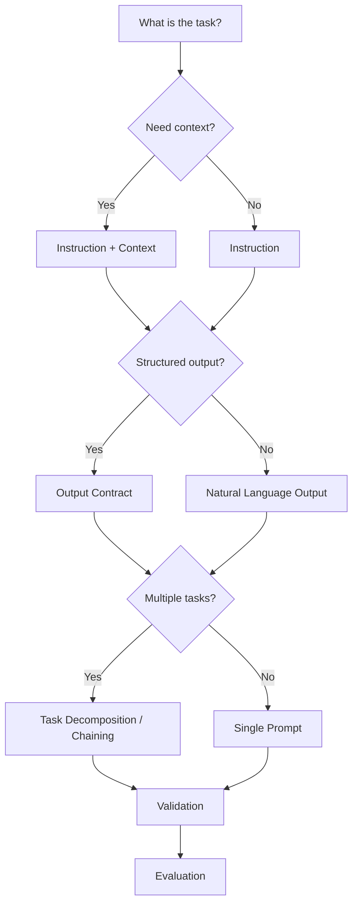

---

# 56. Prompt Pattern Selection in Production

Do not select patterns only because they are popular.

Choose based on:

```text
Task Complexity
+
Input Characteristics
+
Output Requirements
+
Reliability Requirements
+
Latency
+
Cost
+
Security
```

A simple task should use a simple prompt.

A complex task may justify a multi-stage architecture.

---

# 57. Prompt Patterns and Maintainability

Reusable patterns can improve maintainability.

Instead of:

```python
prompt1 = "..."
prompt2 = "..."
prompt3 = "..."
```

use reusable builders:

```python
def build_classification_prompt(message):
    ...


def build_summary_prompt(document):
    ...


def build_extraction_prompt(document):
    ...
```

This gives prompts explicit ownership and responsibilities.

---

# 58. Prompt Patterns and Testing

Each pattern should have representative tests.

For classification:

```text
Normal Input
Edge Case
Unknown Category
Empty Input
Ambiguous Input
```

For extraction:

```text
All Fields
Missing Fields
Malformed Input
Unexpected Fields
```

For summarization:

```text
Short Document
Long Document
Noisy Document
Repeated Information
```

Testing should reflect real application behavior.

---

# 59. Prompt Pattern Evaluation

A prompt pattern should be evaluated against:

```text
Correctness
Consistency
Format Compliance
Groundedness
Latency
Token Usage
Cost
Failure Rate
```

Example evaluation table:

| Metric | Prompt V1 | Prompt V2 |
|---|---:|---:|
| Accuracy |  |  |
| Format Compliance |  |  |
| Average Tokens |  |  |
| Latency |  |  |
| Failure Rate |  |  |

The actual values should come from application evaluation data rather than assumptions.

---

# 60. Prompt Patterns and Production Observability

For production systems, record useful metadata.

```text
Prompt Name
Prompt Version
Model
Request Type
Input Tokens
Output Tokens
Latency
Validation Result
Retry Count
Final Result
```

Conceptually:

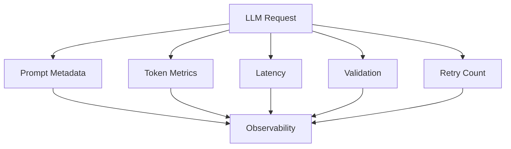

---

# 61. Prompt Patterns and Cost Optimization

Prompt patterns can reduce unnecessary token consumption.

For example:

```text
Large Repeated Prompt
```

may be replaced by:

```text
Reusable Template
+
Only Required Context
```

Cost optimization should consider:

```text
Prompt Size
+
Retrieved Context
+
Output Length
+
Request Volume
```

---

# 62. Prompt Patterns and Latency

A simple prompt may require:

```text
1 LLM Call
```

A chained workflow may require:

```text
3 LLM Calls
```

Therefore:

```text
Better Decomposition
```

may come at the cost of:

```text
Higher Latency
+
Higher Token Usage
+
More Failure Points
```

Architecture decisions should consider these trade-offs.

---

# 63. Prompt Patterns and Reliability

A production architecture should avoid assuming that a single prompt guarantees correct behavior.

Instead:

```mermaid
flowchart LR
    A["Prompt Pattern"] --> B["LLM"]
    B --> C["Validation"]
    C --> D["Evaluation"]
    D --> E["Application"]
```

Additional controls may include:

```text
Retry
Fallback
Schema Validation
Business Rules
Human Review
```

depending on the use case.

---

# 64. Prompt Patterns and Security

Prompt patterns can improve clarity but do not replace security architecture.

For example:

```text
DO NOT DELETE CUSTOMER DATA.
```

is not enough to secure a deletion operation.

Instead:

```mermaid
flowchart LR
    A["LLM"] --> B["Application"]
    B --> C["Authentication"]
    C --> D["Authorization"]
    D --> E["Business Rules"]
    E --> F["Tool / Database"]
```

The application remains the security boundary.

---

# 65. Framework Example — LangChain

LangChain can implement many of these patterns through prompt templates.

Example:

```python
from langchain_core.prompts import ChatPromptTemplate

prompt = ChatPromptTemplate.from_messages([
    (
        "system",
        """
        You are a senior backend architect.

        Focus on production reliability.
        """
    ),
    (
        "human",
        """
        Task:
        {task}

        Context:
        {context}

        Output:
        {output_format}
        """
    )
])

messages = prompt.invoke({
    "task": "Review the payment architecture.",
    "context": "Spring Boot + Kafka + PostgreSQL",
    "output_format": "Five risks with recommendations."
})
```

The framework provides the implementation abstraction.

The underlying pattern remains:

```text
Role
+
Task
+
Context
+
Output Contract
```

---

# 66. Framework Example — LlamaIndex

LlamaIndex can similarly represent reusable prompt templates.

```python
from llama_index.core import PromptTemplate

template = PromptTemplate(
    """
    You are an enterprise AI assistant.

    Task:
    {task}

    Context:
    {context}

    Requirements:
    {requirements}
    """
)

prompt = template.format(
    task="Summarize the document",
    context="Enterprise architecture document",
    requirements="Return five key points"
)
```

Again:

```text
Framework API
      ↓
Prompt Template
      ↓
Runtime Variables
      ↓
Final Prompt
```

Detailed framework architecture and comparisons are intentionally reserved for **Part VIII — AI Engineering Frameworks & Tooling**.

---

# 67. Framework-Agnostic Implementation

The same pattern can be implemented without an AI framework.

```python
def build_prompt(task, context, requirements):

    return f"""
    You are an enterprise AI assistant.

    Task:
    {task}

    Context:
    {context}

    Requirements:
    {requirements}
    """
```

This is an important architectural principle:

> Understand the prompt pattern independently of the framework implementing it.

---

# 68. Production Prompt Pattern Architecture

A mature application can organize prompt patterns as reusable components.

```text
prompts/
├── common/
│   ├── role.txt
│   ├── grounding.txt
│   └── output-rules.txt
│
├── classification/
│   └── customer-category.txt
│
├── extraction/
│   └── document-fields.txt
│
├── summarization/
│   └── document-summary.txt
│
└── question-answering/
    └── knowledge-answer.txt
```

This makes prompt organization similar to source-code organization.

---

# 69. Prompt Pattern Lifecycle

```mermaid
flowchart TD
    A["Identify Problem"] --> B["Select Pattern"]
    B --> C["Implement"]
    C --> D["Create Test Cases"]
    D --> E["Evaluate"]
    E --> F{"Acceptable?"}

    F -->|No| G["Refine Pattern"]
    G --> D

    F -->|Yes| H["Version"]
    H --> I["Deploy"]
    I --> J["Monitor"]
    J --> K["Improve"]
```

---

# 70. Production Workflow

A practical workflow for Prompt Design Patterns:

```text
1. Identify the business task.

2. Determine the task category.

3. Select a suitable prompt pattern.

4. Define the role if required.

5. Define the task explicitly.

6. Identify relevant context.

7. Separate instructions from external data.

8. Add meaningful constraints.

9. Define the output contract.

10. Add examples if useful.

11. Add uncertainty handling where required.

12. Implement the prompt template.

13. Create representative test cases.

14. Validate outputs.

15. Measure quality, latency, and cost.

16. Version the prompt.

17. Deploy.

18. Monitor production behavior.

19. Run regression evaluation after changes.
```

---

# 71. Common Mistakes

## Mistake 1 — Using a Complex Pattern for a Simple Task

Do not create a multi-stage workflow for:

```text
"Translate this sentence."
```

when a simple prompt is sufficient.

---

## Mistake 2 — Combining Too Many Patterns

A prompt containing:

```text
20 rules
10 examples
5 output formats
3 contradictory constraints
```

can become difficult to maintain.

Prefer composable and focused patterns.

---

## Mistake 3 — Treating Examples as Absolute Rules

Examples demonstrate desired behavior but may not cover every possible input.

---

## Mistake 4 — Relying Only on Prompt Instructions

Always use application-level validation where reliability matters.

---

## Mistake 5 — No Evaluation

A pattern should be evaluated against real representative cases.

---

## Mistake 6 — Ignoring Cost and Latency

More LLM calls are not free.

---

## Mistake 7 — Mixing Trusted and Untrusted Content

Use clear boundaries between instructions and external data.

---

# 72. Prompt Pattern Selection Checklist

```text
[ ] What problem am I solving?

[ ] Is the task simple or complex?

[ ] Does the model need additional context?

[ ] Is the context trusted or untrusted?

[ ] Is structured output required?

[ ] Are predefined categories required?

[ ] Does the task require extraction?

[ ] Does the task require transformation?

[ ] Does the task require summarization?

[ ] Would examples improve the result?

[ ] Would task decomposition improve reliability?

[ ] Would chaining justify the additional latency?

[ ] What happens if information is missing?

[ ] How will the output be validated?

[ ] How will the prompt be evaluated?

[ ] How will the prompt be versioned?

[ ] What are the cost and latency implications?

[ ] Are security boundaries enforced outside the prompt?
```

---

# 73. Key Takeaways

- Prompt Design Patterns provide reusable structures for common LLM application tasks.
- The goal is to select the simplest pattern that reliably solves the problem.
- Common foundational patterns include:
  - Role + Task
  - Instruction + Context
  - Constraints
  - Delimiters
  - Output Contracts
  - Task Decomposition
  - Classification
  - Extraction
  - Transformation
  - Summarization
  - Grounded Question Answering
- Patterns can be combined when application requirements demand it.
- Complex tasks can benefit from decomposition or prompt chaining.
- Structured output should be validated by the application.
- Missing-information handling can reduce unsupported answers.
- Untrusted content should be clearly separated from trusted instructions.
- Prompt patterns do not replace authentication, authorization, or business-rule enforcement.
- Prompt templates make patterns reusable and maintainable.
- Prompt patterns should be evaluated using representative datasets.
- Prompt versions should be traceable in production.
- Quality, cost, latency, reliability, and security should all be considered.
- LangChain and LlamaIndex can implement these patterns, but the patterns themselves should remain framework-independent.
- The right prompt pattern is determined by the **problem**, not by the popularity of a framework or technique.

The core principle is:

```text
Business Problem
      ↓
Select Appropriate Pattern
      ↓
Compose Prompt
      ↓
Validate
      ↓
Evaluate
      ↓
Version
      ↓
Deploy
      ↓
Monitor
```

---

# 74. Chapter Navigation

## Part IV — Prompt Engineering & RAG Fundamentals

**Previous Chapter:** [03. Advanced Prompt Engineering](03-advanced-prompt-engineering.md)

**Current Chapter:** 04 — Prompt Design Patterns

**Next Chapter:** [05. Zero-shot, One-shot & Few-shot Prompting](05-zero-one-few-shot-prompting.md)

### Part IV Chapters

1. [01. Introduction to Prompt Engineering](01-introduction-to-prompt-engineering.md)
2. [02. Prompt Engineering Fundamentals](02-prompt-engineering-fundamentals.md)
3. [03. Advanced Prompt Engineering](03-advanced-prompt-engineering.md)
4. **04. Prompt Design Patterns**
5. [05. Zero-shot, One-shot & Few-shot Prompting](05-zero-one-few-shot-prompting.md)
6. [06. Chain-of-Thought Prompting](06-chain-of-thought-prompting.md)
7. [07. ReAct Prompting](07-react-prompting.md)
8. [08. Structured Outputs & Output Parsing](08-structured-outputs-and-output-parsing.md)
9. [09. Function Calling & Tool Calling](09-function-calling-and-tool-calling.md)
10. [10. Embeddings in Practice](10-embeddings-in-practice.md)
11. [11. Document Processing & Vectorization](11-document-processing-and-vectorization.md)
12. [12. Document Chunking Strategies](12-document-chunking-strategies.md)
13. [13. Vector Database Fundamentals](13-vector-database-fundamentals.md)
14. [14. Similarity Search Techniques](14-similarity-search-techniques.md)
15. [15. RAG Pipeline Components](15-rag-pipeline-components.md)
16. [16. Retrieval & Generation Pipeline](16-retrieval-and-generation-pipeline.md)
17. [17. Vector Databases in RAG](17-vector-databases-in-rag.md)
18. [18. Building Your First RAG Pipeline](18-building-your-first-rag-pipeline.md)
19. [19. RAG Evaluation Fundamentals](19-rag-evaluation-fundamentals.md)
20. [20. Enterprise Generative AI Application Architecture](20-enterprise-generative-ai-application-architecture.md)
21. [21. Deploying AI Applications with Gradio](21-deploying-ai-applications-with-gradio.md)

---

# References

- OpenAI — Prompt Engineering and API Documentation
- Anthropic — Prompt Engineering Documentation
- Google — Gemini API and Generative AI Documentation
- Hugging Face — Transformers Documentation
- LangChain — Prompt Templates and LLM Application Documentation
- LlamaIndex — Prompt and LLM Application Documentation
- OWASP — Large Language Model Application Security
- Brown et al. — *Language Models are Few-Shot Learners*
- Wei et al. — *Chain-of-Thought Prompting Elicits Reasoning in Large Language Models*
- Yao et al. — *ReAct: Synergizing Reasoning and Acting in Language Models*

---

> **Enterprise AI Engineering Handbook**  
> *Building Production-Grade Enterprise AI Systems — One Chapter at a Time.*