# 06 — Chain-of-Thought Prompting

> Learn how Chain-of-Thought (CoT) prompting can improve performance on complex reasoning tasks, understand when it is useful, how it differs from ordinary prompting, and how to apply reasoning-oriented techniques safely in production LLM applications.

---

## 📖 Overview

Large Language Models can often answer simple questions directly:

```text
Question
   ↓
LLM
   ↓
Answer
```

However, more complex tasks may require several intermediate reasoning steps.

Examples include:

- Mathematical problems
- Logical reasoning
- Multi-step classification
- Planning
- Data analysis
- Code reasoning
- Architecture analysis
- Constraint-based decisions

Chain-of-Thought prompting is a prompting technique that encourages a model to approach a problem through intermediate reasoning steps rather than jumping directly to the final answer.

Conceptually:

```text
Direct Answer

Question
   ↓
LLM
   ↓
Answer
```

versus:

```text
Reasoning-Oriented Approach

Question
   ↓
Problem Decomposition
   ↓
Intermediate Reasoning
   ↓
Conclusion
   ↓
Answer
```

A production application should distinguish between:

```text
Reasoning used internally by the model
```

and:

```text
Concise explanation or evidence returned to the user
```

The application should not assume that exposing a model's private chain of thought is necessary or desirable.

---

# 1. What Is Chain-of-Thought Prompting?

Chain-of-Thought prompting is a technique that encourages an LLM to solve a complex problem through a sequence of intermediate reasoning steps.

A simple conceptual representation is:

```text
Problem
   ↓
Step 1
   ↓
Step 2
   ↓
Step 3
   ↓
Conclusion
```

For example, instead of asking:

```text
What is the final answer?
```

a reasoning-oriented prompt may ask the model to:

```text
Break the problem into smaller steps,
evaluate the relevant information,
and provide the final answer.
```

The important idea is **structured reasoning**, not simply producing a longer response.

---

# 2. Why Chain-of-Thought Matters

Some tasks are inherently multi-step.

Consider:

```text
A system has three services.

Service A calls Service B.
Service B calls Service C.
Service C is unavailable.

What happens to the original request?
```

The model needs to reason about:

```text
A
 ↓
B
 ↓
C
 ↓
Failure
```

A reasoning-oriented approach can help the model identify the dependency chain before producing the conclusion.

---

# 3. Direct Answer vs Reasoning-Oriented Prompt

### Direct Prompt

```text
Which service failure causes the request to fail?

A calls B.
B calls C.
C is unavailable.
```

### Reasoning-Oriented Prompt

```text
Analyze the service dependency chain.

Identify:

1. The request path.
2. The dependency that becomes unavailable.
3. The impact on the upstream request.

Then provide the final conclusion.
```

The second prompt explicitly structures the task.

---

# 4. Chain-of-Thought Architecture

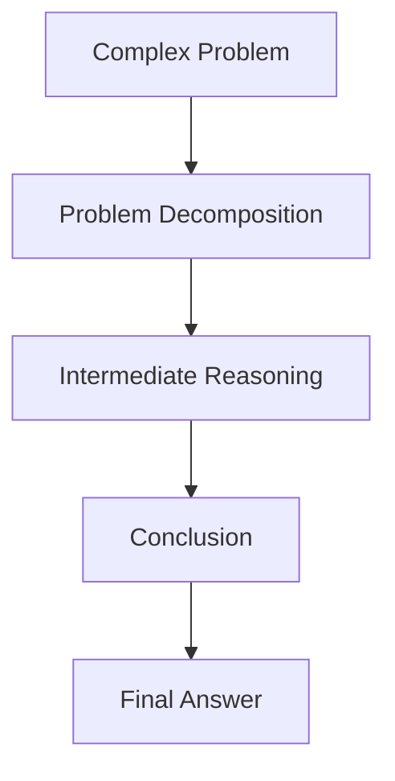

The reasoning process may involve multiple internal steps even when the final response contains only the conclusion.

---

# 5. Simple Reasoning Example

Consider:

```text
A payment service processes 100 transactions.

20 transactions fail.

What percentage succeeded?
```

A reasoning-oriented solution conceptually identifies:

```text
Total transactions = 100

Failed transactions = 20

Successful transactions = 100 - 20

Success percentage = successful / total × 100
```

The final answer is:

```text
80%
```

The important point is that the problem contains multiple intermediate operations.

---

# 6. Chain-of-Thought Prompt Pattern

A general reasoning-oriented prompt can be structured as:

```text
TASK

Solve the problem carefully.

REQUIREMENTS

- Identify the important information.
- Break the problem into logical steps.
- Check the result.
- Provide the final answer clearly.
```

For user-facing applications, it is often preferable to request:

```text
A concise explanation
```

rather than asking the model to expose its complete private reasoning process.

---

# 7. Reasoning vs Final Answer

A useful architecture separates:

```text
Reasoning Process
```

from:

```text
User-Facing Explanation
```

Conceptually:

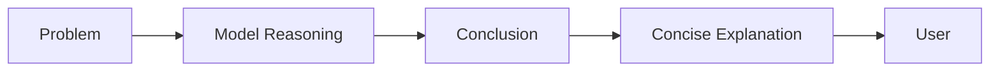

The final application response may therefore be:

```text
The request fails because Service C is unavailable,
and Service B depends on Service C.
```

rather than exposing every internal reasoning step.

---

# 8. Chain-of-Thought and Complex Tasks

CoT-style reasoning can be useful for tasks involving:

```text
Multiple constraints
+
Multiple dependencies
+
Intermediate calculations
+
Logical relationships
```

Examples:

```text
Mathematical reasoning
Logical puzzles
Architecture analysis
Code analysis
Planning
Multi-step classification
```

---

# 9. Chain-of-Thought vs Normal Prompting

| Aspect | Normal Prompt | Reasoning-Oriented Prompt |
|---|---|---|
| Task | Usually simple | Often multi-step |
| Structure | Direct | Explicit reasoning structure |
| Intermediate work | Not emphasized | Encouraged |
| Best for | Straightforward tasks | Complex tasks |
| Output | Direct answer | Conclusion with optional explanation |
| Cost | Usually lower | Can be higher |
| Latency | Usually lower | May be higher |

The actual performance difference depends on the model and task.

---

# 10. Zero-shot Chain-of-Thought

Zero-shot CoT refers to encouraging reasoning without providing worked examples.

A classic conceptual pattern is:

```text
Solve the problem step by step.
```

The model is not shown demonstrations.

The structure is:

```text
Instruction
+
Problem
```

rather than:

```text
Instruction
+
Examples
+
Problem
```

---

# 11. Zero-shot Reasoning Example

```text
A service receives 1,000 requests.

150 requests fail.

Calculate the successful request percentage.

Solve the problem carefully and provide the final answer.
```

The model is asked to perform the intermediate reasoning internally or conceptually, without receiving an example.

---

# 12. Few-shot Chain-of-Thought

Few-shot reasoning provides demonstrations of how similar tasks can be approached.

Conceptually:

```text
Instruction
+
Example 1
+
Example 2
+
New Problem
```

For example:

```text
Example:

Problem:
A system receives 100 requests and 10 fail.

Approach:
Calculate successful requests and divide by total requests.

Answer:
90%

Now solve:

A system receives 500 requests and 75 fail.
```

The examples provide a reasoning pattern.

---

# 13. Few-shot Reasoning Architecture

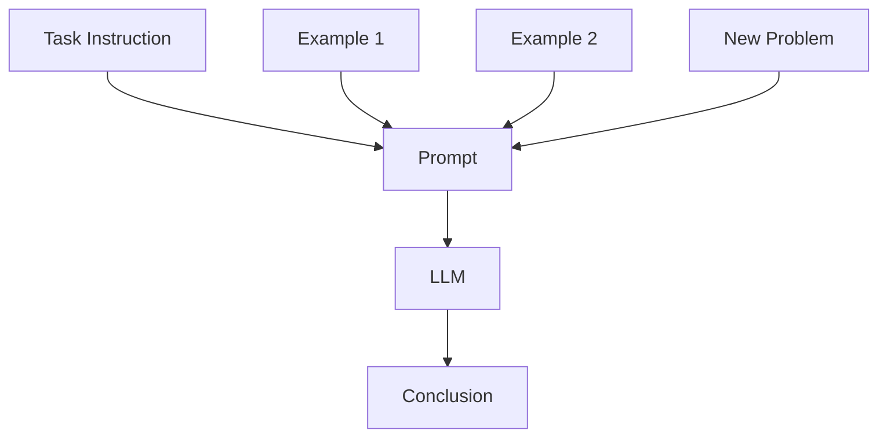

Few-shot reasoning is related to the techniques discussed in:

**05 — Zero-shot, One-shot & Few-shot Prompting**

---

# 14. Chain-of-Thought for Mathematical Problems

Mathematical tasks often contain multiple operations.

Example:

```text
A product costs $200.

It receives a 10% discount.

Then a 5% tax is applied.

What is the final price?
```

A structured reasoning approach identifies:

```text
Original Price
      ↓
Discount
      ↓
Discounted Price
      ↓
Tax
      ↓
Final Price
```

The final answer can be provided with a concise calculation.

---

# 15. Reasoning Flow

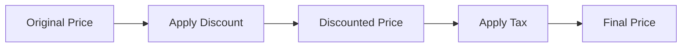

The intermediate structure makes the dependency between calculations explicit.

---

# 16. Chain-of-Thought for Logical Reasoning

Consider:

```text
All payment services require authentication.

Service A is a payment service.

Does Service A require authentication?
```

The reasoning relationship is:

```text
Payment Service
      ↓
Requires Authentication
      ↓
Service A is Payment Service
      ↓
Service A Requires Authentication
```

The final answer is:

```text
Yes.
```

---

# 17. Chain-of-Thought for Architecture Analysis

CoT-style reasoning can be useful for architecture questions.

Example:

```text
A REST API calls Service A.

Service A calls Service B.

Service B uses PostgreSQL.

PostgreSQL becomes unavailable.

Analyze the impact.
```

A structured approach:

```text
Request
 ↓
API
 ↓
Service A
 ↓
Service B
 ↓
PostgreSQL
 ↓
Failure
```

The final response could summarize:

```text
Requests requiring Service B's database access
will fail or degrade depending on the application's
failure-handling strategy.
```

---

# 18. Architecture Reasoning Pattern

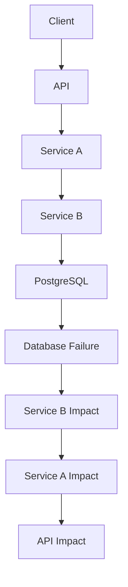

This is a useful example of dependency-chain reasoning.

---

# 19. Chain-of-Thought for Code Analysis

Consider:

```java
public int calculate(int a, int b) {
    return a / b;
}
```

A reasoning-oriented analysis should identify:

```text
Operation
 ↓
Potential Failure
 ↓
Input Condition
 ↓
Recommended Handling
```

For example:

```text
The method performs integer division.

If b is zero, Java throws ArithmeticException.

The caller should therefore validate the divisor
or explicitly handle the exception.
```

The user receives the useful conclusion rather than an unnecessary dump of internal reasoning.

---

# 20. Reasoning and Code Generation

For code-generation tasks, a prompt can ask the model to consider:

```text
Requirements
+
Constraints
+
Edge Cases
+
Error Handling
+
Expected Interface
```

Example:

```text
Implement a Java method for processing payments.

Consider:

- null input
- invalid amount
- duplicate request
- downstream failure

Return the implementation and a concise explanation
of the important design decisions.
```

This encourages systematic consideration of requirements.

---

# 21. Chain-of-Thought for Planning

Planning tasks naturally involve multiple stages.

Example:

```text
Design a migration plan from a monolith
to microservices.
```

A structured planning approach may consider:

```text
1. Identify bounded domains.
2. Identify dependencies.
3. Select migration candidates.
4. Define migration sequence.
5. Define rollback strategy.
6. Define observability.
7. Define validation.
```

---

# 22. Planning Architecture

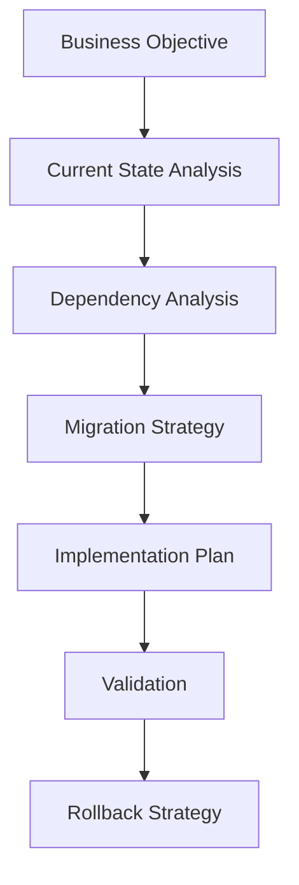

The model is being asked to reason about a sequence of dependent decisions.

---

# 23. Chain-of-Thought for Classification

Some classification problems require multiple criteria.

Example:

```text
Classify an incident as:

LOW
MEDIUM
HIGH

Consider:

- number of affected users
- financial impact
- duration
- business criticality
```

A structured reasoning approach can evaluate these dimensions before assigning the final category.

---

# 24. Classification with a Rubric

```text
Evaluate the incident using the following criteria:

Affected users:
LOW / MEDIUM / HIGH

Financial impact:
LOW / MEDIUM / HIGH

Duration:
LOW / MEDIUM / HIGH

Business criticality:
LOW / MEDIUM / HIGH

Return the final severity.
```

This combines:

```text
Reasoning
+
Explicit Evaluation Criteria
```

---

# 25. Chain-of-Thought and Decomposition

One of the strongest connections is:

```text
Complex Problem
      ↓
Decomposition
      ↓
Smaller Problems
      ↓
Reasoning
      ↓
Final Result
```

For example:

```text
"Analyze this production incident."
```

can become:

```text
1. Identify symptoms.
2. Identify affected components.
3. Identify dependencies.
4. Identify possible causes.
5. Evaluate evidence.
6. Recommend next action.
```

---

# 26. CoT vs Task Decomposition

These concepts are related but not identical.

### Task Decomposition

The application explicitly breaks a task into stages.

```text
Step 1
 ↓
Step 2
 ↓
Step 3
```

### Chain-of-Thought

The model is encouraged to reason through intermediate steps.

```text
Problem
 ↓
Internal Reasoning
 ↓
Conclusion
```

A production system may use task decomposition without exposing or relying on a model's complete reasoning trace.

---

# 27. CoT vs Prompt Chaining

Prompt chaining is an application architecture:

```text
LLM Call 1
   ↓
LLM Call 2
   ↓
LLM Call 3
```

Chain-of-Thought is a reasoning technique:

```text
Problem
   ↓
Intermediate Reasoning
   ↓
Conclusion
```

They can be combined, but they are not the same concept.

---

# 28. Prompt Chaining Example

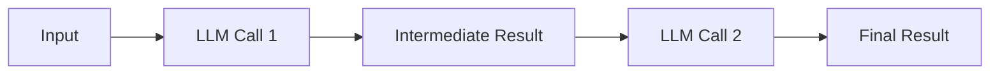

This architecture makes intermediate stages explicit at the application level.

---

# 29. CoT and Self-Consistency

A related reasoning technique is **self-consistency**.

Instead of relying on one reasoning path:

```text
Problem
 ↓
One Reasoning Path
 ↓
Answer
```

multiple candidate reasoning paths may be generated conceptually:

```text
Problem
 ├── Reasoning Path A → Answer A
 ├── Reasoning Path B → Answer B
 └── Reasoning Path C → Answer C

              ↓

        Select Consistent Result
```

---

# 30. Self-Consistency Architecture

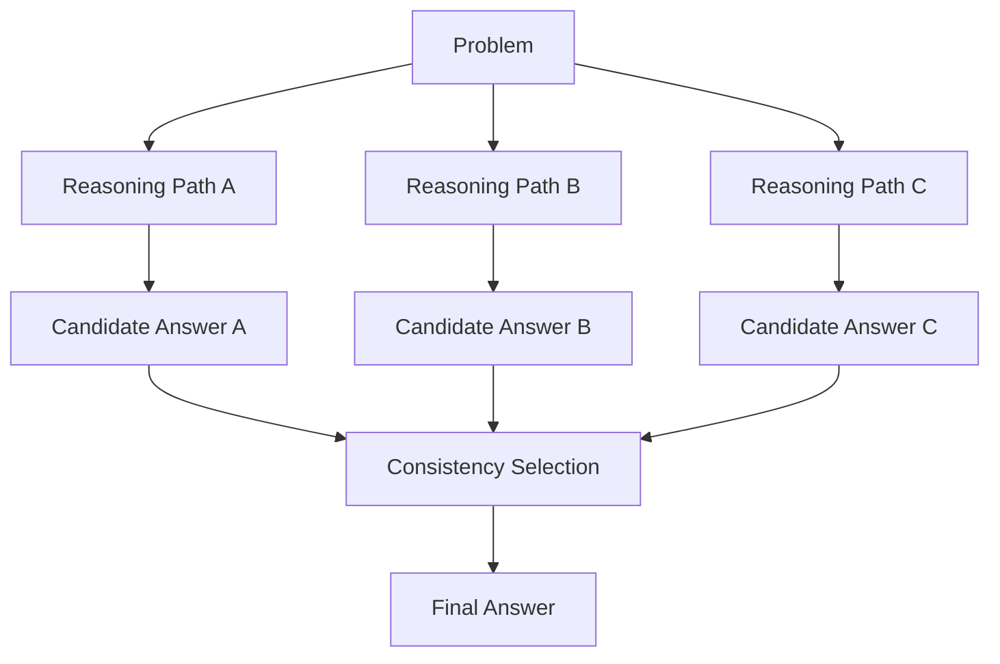

This can improve reliability for some reasoning tasks but increases inference cost.

---

# 31. Cost Trade-off of Self-Consistency

A single request:

```text
1 model invocation
```

Self-consistency may require:

```text
N model invocations
```

Therefore:

```text
Potential Quality Improvement
        vs
Higher Cost + Higher Latency
```

This technique should be evaluated rather than automatically enabled.

---

# 32. Chain-of-Thought and Verification

For complex reasoning, a separate verification step can be useful.

```text
Generate Answer
      ↓
Verify Result
      ↓
Final Answer
```

Architecture:

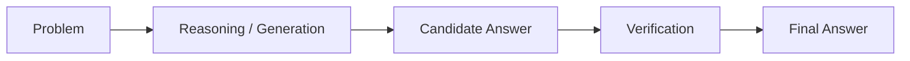

The verifier can check:

```text
Mathematical consistency
Required fields
Business rules
Output schema
Known constraints
```

---

# 33. Generate → Verify Pattern

Example:

```text
Generate a solution to the problem.

Then verify:

- calculations
- assumptions
- required constraints

Return the final answer only after verification.
```

Again, the verification should not be treated as mathematically or logically infallible.

For high-stakes applications, independent validation is preferable.

---

# 34. Independent Validation

A stronger architecture is:

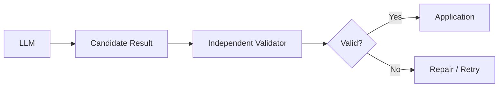

Possible validators include:

```text
Schema Validator
Rule Engine
Database Check
Calculator
Static Analyzer
Unit Test
Business Logic
```

---

# 35. Do Not Use LLM Reasoning for Deterministic Calculations When a Tool Is Better

For example, if the application needs:

```text
127,531 × 8,921
```

a deterministic calculator is preferable.

Architecture:

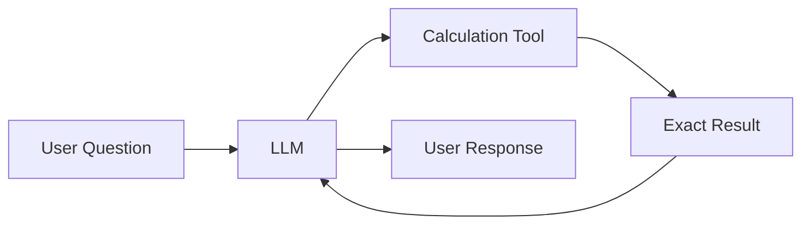

The LLM can determine **when** a calculation is required, while the calculator performs the exact computation.

---

# 36. Reasoning + Tool Calling

Modern LLM applications can combine reasoning with tools.

Conceptually:

```text
User Request
      ↓
LLM
      ↓
Determine Required Tool
      ↓
Tool Execution
      ↓
Tool Result
      ↓
LLM
      ↓
Final Response
```

For example:

```text
Question
 ↓
Need calculation?
 ↓
Calculator
 ↓
Result
 ↓
Final response
```

Detailed Function Calling and Tool Calling are covered in:

**09 — Function Calling & Tool Calling**

---

# 37. CoT and Tool Use

A production system may look like:

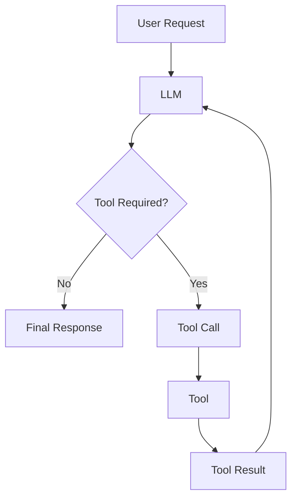

The model can use external tools when the task requires deterministic or external information.

---

# 38. Chain-of-Thought and RAG

RAG provides external knowledge.

CoT-style reasoning helps process the task using that context.

A simplified architecture is:

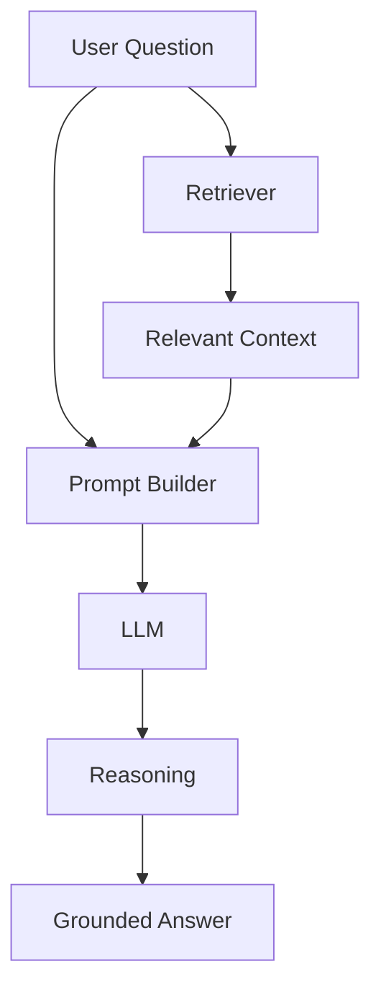

The important distinction is:

```text
RAG → provides knowledge
CoT → supports reasoning over the task/context
```

---

# 39. Grounded Reasoning

A production prompt can require the model to reason using supplied context.

```text
Use only the supplied context.

Analyze the information carefully.

If the context does not contain enough information
to answer the question, state that the information
is unavailable.

Provide a concise answer with supporting evidence.
```

This creates:

```text
Context
+
Reasoning
+
Grounding
```

rather than allowing the model to freely invent missing information.

---

# 40. RAG Reasoning Architecture

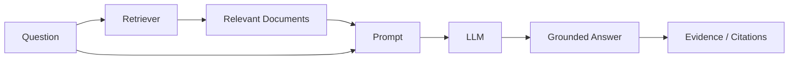

Advanced retrieval mechanisms are covered in later Part IV and Part V chapters.

---

# 41. Chain-of-Thought and Structured Outputs

Reasoning tasks can still require structured results.

Example:

```text
Analyze the incident and return:

{
  "severity": "...",
  "impact": "...",
  "recommendation": "..."
}
```

The application architecture becomes:

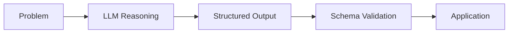

This is often more useful than returning a long reasoning narrative.

---

# 42. Reasoning + JSON

Example:

```text
Analyze the incident.

Determine:

- severity
- affected_component
- recommended_action

Return only JSON matching:

{
  "severity": "LOW | MEDIUM | HIGH",
  "affected_component": "string",
  "recommended_action": "string"
}
```

The model can perform the reasoning required to reach the conclusion while the application receives a structured result.

---

# 43. Chain-of-Thought and Output Parsing

The production pipeline can be:

```text
Reasoning
 ↓
Structured Response
 ↓
Parser
 ↓
Validator
 ↓
Business Logic
```

Example:

```python
from pydantic import BaseModel


class IncidentResult(BaseModel):
    severity: str
    affected_component: str
    recommended_action: str
```

The application validates the final structured output.

---

# 44. CoT and Error Handling

Reasoning does not eliminate model errors.

Potential failures include:

```text
Incorrect assumptions
Incorrect intermediate reasoning
Wrong conclusion
Missing information
Hallucinated facts
Invalid output
```

Therefore:

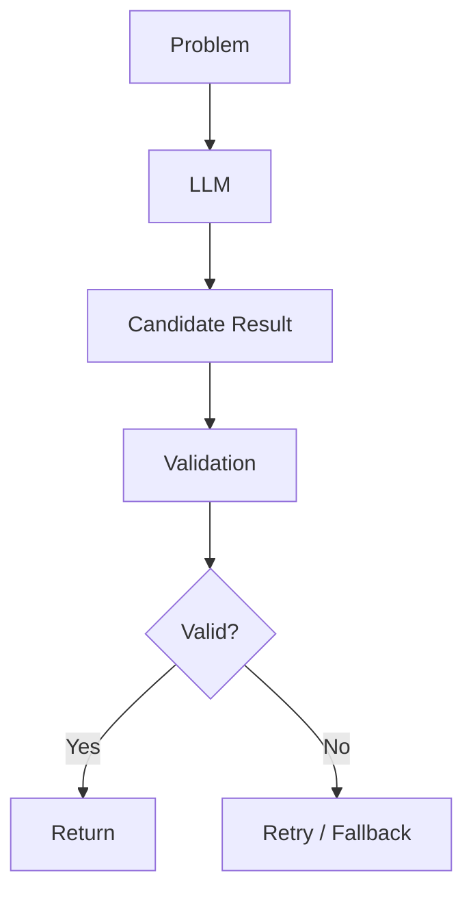

---

# 45. Reasoning Failure Example

Suppose:

```text
All premium customers receive priority support.

Customer A is not identified as premium.

Does Customer A receive priority support?
```

A model may incorrectly infer:

```text
Not premium → definitely no priority support.
```

But the premise only establishes:

```text
Premium → Priority Support
```

It does not establish:

```text
Non-premium → No Priority Support
```

This illustrates why reasoning must be evaluated rather than assumed to be correct.

---

# 46. Avoiding Unsupported Assumptions

A useful reasoning prompt can specify:

```text
Use only the information explicitly provided.

Do not infer facts that are not supported.

If a conclusion depends on an assumption,
identify the assumption.
```

Example:

```text
Known:
Service A calls Service B.

Unknown:
The architecture does not specify whether
Service B has a retry policy.

Do not assume that retries are configured.
```

---

# 47. Assumption-Aware Reasoning

A useful output structure is:

```text
Conclusion:
...

Known Facts:
...

Assumptions:
...

Missing Information:
...
```

This is often more useful in enterprise systems than a long unrestricted reasoning narrative.

---

# 48. Chain-of-Thought and Enterprise Architecture

Enterprise architecture questions frequently involve:

```text
Dependencies
Availability
Scalability
Security
Data Flow
Failure Modes
Operational Constraints
```

A structured analysis prompt might be:

```text
Analyze the architecture.

Evaluate:

1. Request flow
2. Dependencies
3. Failure points
4. Scalability constraints
5. Availability risks
6. Security boundaries
7. Observability gaps

Provide:

- key findings
- risks
- recommendations
```

---

# 49. Architecture Reasoning Example

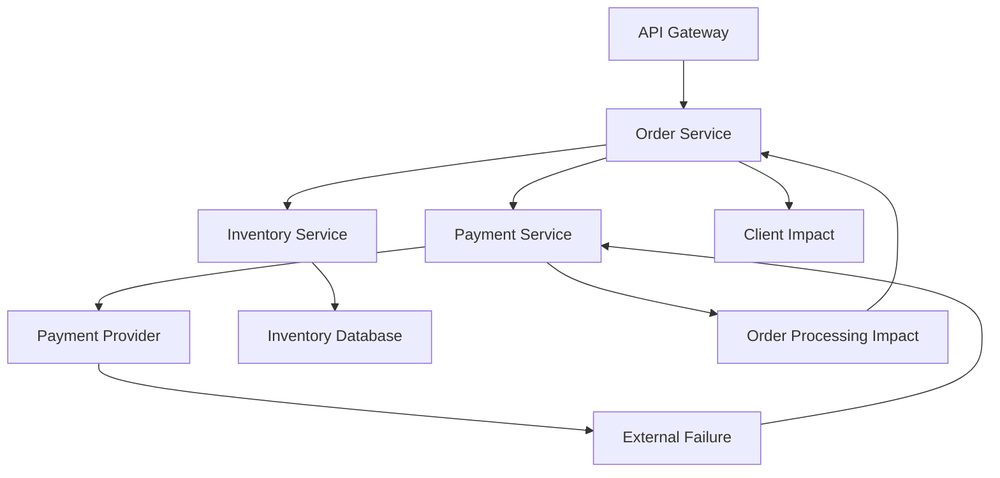

A reasoning-oriented analysis can trace the dependency path before producing recommendations.

---

# 50. CoT and Incident Analysis

A production incident analysis can be structured as:

```text
Symptoms
   ↓
Affected Components
   ↓
Dependency Analysis
   ↓
Potential Causes
   ↓
Evidence
   ↓
Likely Cause
   ↓
Mitigation
```

This creates a disciplined investigation workflow.

---

# 51. Incident Analysis Prompt

```text
Analyze the incident using the following framework:

1. Symptoms
2. Affected components
3. Dependency relationships
4. Evidence
5. Possible causes
6. Most likely cause
7. Immediate mitigation
8. Follow-up actions

Do not invent information.

Clearly distinguish known facts from assumptions.
```

This is a practical reasoning-oriented prompt pattern.

---

# 52. CoT and Planning vs Execution

LLMs can help create plans.

However:

```text
Planning
```

should be separated from:

```text
Execution
```

Example:

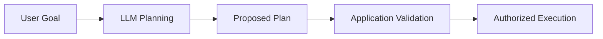

The LLM should not automatically execute high-impact operations simply because its reasoning suggests them.

---

# 53. Reasoning and Security Boundaries

A critical enterprise principle is:

> **Reasoning does not grant authority.**

For example:

```text
LLM concludes:
"Delete the inactive account."
```

does not mean:

```text
Database DELETE
```

should automatically happen.

Instead:

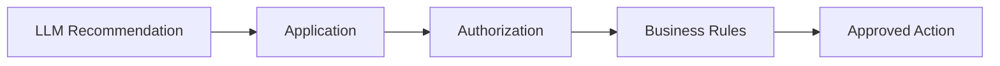

---

# 54. CoT and Human-in-the-Loop

High-impact decisions may require human approval.

Example:

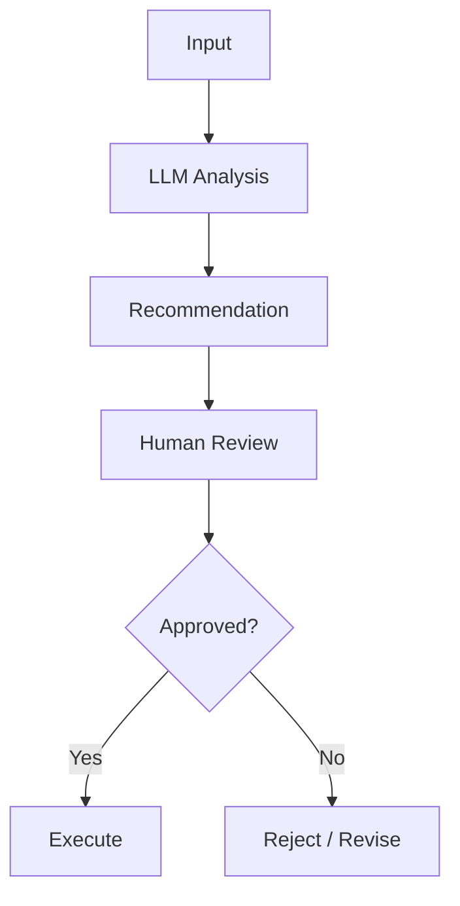

Potential use cases include:

```text
Financial decisions
Legal workflows
Security actions
Production changes
Customer-impacting actions
```

The exact approval boundary should be determined by the application's risk model.

---

# 55. Chain-of-Thought and Evaluation

Reasoning quality should be evaluated using task-specific outcomes.

Do not evaluate only:

```text
"Does the answer sound reasonable?"
```

Instead evaluate:

```text
Correctness
+
Constraint Compliance
+
Groundedness
+
Format Validity
+
Consistency
```

---

# 56. Reasoning Evaluation Dataset

Example:

```python
test_cases = [
    {
        "problem": "A system receives 100 requests and 20 fail.",
        "expected": "80%"
    },
    {
        "problem": "Service A depends on unavailable Service B.",
        "expected": "Service A requests may fail."
    }
]
```

Run the same dataset against different prompt strategies.

---

# 57. Reasoning Evaluation Pipeline

```mermaid
flowchart TD
    A["Evaluation Dataset"] --> B["Direct Prompt"]
    A --> C["CoT-style Prompt"]
    A --> D["Decomposed Workflow"]

    B --> E["Metrics"]
    C --> E
    D --> E

    E --> F["Compare Results"]
```

This determines whether the additional complexity actually improves the application.

---

# 58. Cost Considerations

Reasoning-oriented approaches can increase:

```text
Output Tokens
+
Latency
+
Inference Cost
```

Prompt chaining can increase costs further:

```text
LLM Call 1
+
LLM Call 2
+
LLM Call 3
```

Self-consistency can multiply calls again.

Therefore:

```text
Quality Improvement
        vs
Cost + Latency
```

must be measured.

---

# 59. Latency Considerations

A direct request may be:

```text
Request
 ↓
LLM
 ↓
Response
```

A multi-stage reasoning workflow may be:

```text
Request
 ↓
LLM
 ↓
Validation
 ↓
LLM
 ↓
Tool
 ↓
LLM
 ↓
Response
```

The latter can be significantly more expensive and slower.

Use additional reasoning stages only when they provide measurable value.

---

# 60. When Chain-of-Thought Is Useful

CoT-style reasoning is particularly useful when:

```text
The task is multi-step.
```

```text
The task contains dependencies.
```

```text
The task requires intermediate calculations.
```

```text
The task requires evaluating multiple constraints.
```

```text
The task requires logical comparison.
```

Examples:

```text
Mathematical reasoning
Architecture analysis
Planning
Complex classification
Code analysis
Incident analysis
```

---

# 61. When Chain-of-Thought May Be Unnecessary

Do not automatically use reasoning-oriented prompting for simple tasks.

Examples:

```text
Translate "Hello" into German.
```

```text
Extract the date from this sentence.
```

```text
Return the customer's name.
```

A simple prompt may be sufficient.

---

# 62. CoT vs Simpler Prompt

A useful engineering principle:

```text
Simple Task
   ↓
Simple Prompt
```

```text
Complex Task
   ↓
Structured Reasoning / Decomposition
```

Avoid unnecessary complexity.

---

# 63. CoT vs Few-shot Prompting

These techniques solve different problems.

### Few-shot

Provides:

```text
Examples of Desired Behavior
```

### Chain-of-Thought

Encourages:

```text
Intermediate Reasoning
```

They can be combined:

```text
Instruction
+
Few-shot Examples
+
Reasoning-Oriented Task
```

---

# 64. CoT vs ReAct

Chain-of-Thought focuses primarily on reasoning through a problem.

ReAct combines:

```text
Reasoning
+
Action
```

Conceptually:

```text
Reason
 ↓
Act
 ↓
Observe
 ↓
Reason
 ↓
Act
```

ReAct is covered in the next relevant chapter:

**07 — ReAct Prompting**

---

# 65. CoT vs Agentic Reasoning

An agent may involve:

```text
Planning
+
Reasoning
+
Tool Use
+
Observation
+
Memory
+
Iteration
```

Chain-of-Thought is only one possible reasoning technique.

Do not treat:

```text
CoT = Agent
```

They are different concepts.

---

# 66. Production Reasoning Architecture

A production LLM application may use:

```mermaid
flowchart TD
    A["User Request"] --> B["Application"]

    B --> C["Prompt Builder"]
    B --> D["Context Retrieval"]

    D --> C

    C --> E["LLM"]

    E --> F["Output Parser"]
    F --> G["Validator"]

    G --> H{"Valid?"}

    H -->|Yes| I["Business Logic"]
    H -->|No| J["Retry / Fallback"]

    I --> K["Response"]
```

The model's reasoning capability is only one component of the system.

---

# 67. Framework Example — LangChain

A framework can help compose reasoning-oriented prompts.

```python
from langchain_core.prompts import ChatPromptTemplate

prompt = ChatPromptTemplate.from_messages([
    (
        "system",
        """
        You are an enterprise architecture assistant.

        Analyze the supplied architecture carefully.

        Identify:
        - dependencies
        - failure points
        - scalability risks
        - reliability risks

        Provide a concise explanation and final recommendations.
        """
    ),
    (
        "human",
        """
        Architecture:

        {architecture}

        Question:

        {question}
        """
    )
])

messages = prompt.invoke({
    "architecture": """
    API Gateway -> Order Service -> Payment Service
    """,
    "question": "What happens if Payment Service fails?"
})
```

The framework handles prompt composition.

The reasoning strategy remains independent of the framework.

Detailed LangChain architecture is covered later in:

**Part VIII — AI Engineering Frameworks & Tooling**

---

# 68. Framework Example — LlamaIndex

A similar reasoning-oriented prompt can be constructed using LlamaIndex.

```python
from llama_index.core import PromptTemplate

template = PromptTemplate(
    """
    You are an enterprise architecture assistant.

    Analyze the architecture carefully.

    Identify:
    - dependencies
    - failure points
    - risks

    Provide a concise conclusion.

    Architecture:
    {architecture}

    Question:
    {question}
    """
)

prompt = template.format(
    architecture="API -> Order Service -> Payment Service",
    question="What happens if Payment Service fails?"
)
```

Again:

```text
Framework
   ↓
Prompt Template
   ↓
Runtime Context
   ↓
LLM
```

The underlying prompt pattern remains framework-agnostic.

---

# 69. Framework-Agnostic Implementation

The same concept can be implemented using plain Python.

```python
def build_reasoning_prompt(
    problem: str,
    context: str
) -> str:

    return f"""
    Analyze the problem carefully.

    Use the supplied context.

    Identify the important dependencies
    and constraints before reaching a conclusion.

    Context:
    {context}

    Problem:
    {problem}

    Provide a concise conclusion and explanation.
    """
```

This demonstrates that Chain-of-Thought concepts are not dependent on a particular framework.

---

# 70. Production Prompt Template

A useful enterprise reasoning template is:

```text
ROLE

You are an enterprise AI assistant.

TASK

{{task}}

CONTEXT

{{context}}

CONSTRAINTS

- Use only supported information.
- Identify important assumptions.
- Do not invent missing facts.
- Follow the requested output format.

ANALYSIS REQUIREMENTS

- Identify relevant factors.
- Consider dependencies.
- Evaluate constraints.
- Check the final conclusion.

OUTPUT

Provide:

- conclusion
- concise explanation
- assumptions, if applicable
```

This focuses the model on disciplined analysis without requiring the application to expose private reasoning traces.

---

# 71. Reasoning with Explicit Evidence

For enterprise systems, a useful pattern is:

```text
Conclusion
+
Evidence
+
Assumptions
```

Example:

```text
Conclusion:
The request is likely to fail.

Evidence:
Service B depends on unavailable Service C.

Assumption:
No fallback mechanism is configured.
```

This is often more actionable than an unrestricted reasoning transcript.

---

# 72. Evidence-Based Reasoning Architecture

```mermaid
flowchart TD
    A["Question"] --> B["Context"]
    B --> C["Evidence Selection"]
    C --> D["LLM Analysis"]
    D --> E["Conclusion"]
    D --> F["Supporting Evidence"]
    D --> G["Assumptions"]

    E --> H["Final Response"]
    F --> H
    G --> H
```

---

# 73. Reasoning and Hallucination

Chain-of-Thought does not guarantee factual correctness.

A model can produce:

```text
Long reasoning
+
Wrong assumptions
+
Incorrect conclusion
```

Therefore:

```text
More reasoning
≠
Guaranteed correctness
```

This is a critical production principle.

---

# 74. Grounding and Verification

For knowledge-intensive applications:

```text
Reasoning
+
Retrieved Evidence
+
Validation
```

is generally stronger than:

```text
Reasoning Alone
```

Architecture:

```mermaid
flowchart LR
    A["Question"] --> B["Retriever"]
    B --> C["Evidence"]
    C --> D["LLM"]
    A --> D
    D --> E["Candidate Answer"]
    E --> F["Validation"]
    F --> G["Final Response"]
```

---

# 75. Reasoning and Model Choice

Different models may have different reasoning capabilities.

When evaluating a reasoning-oriented application, consider:

```text
Model Quality
+
Task Complexity
+
Latency
+
Cost
+
Context Requirements
```

Do not assume that a more expensive model is always the best production choice.

Benchmark the actual task.

---

# 76. Prompt Optimization for Reasoning

Optimization should focus on:

```text
Clear Task
+
Relevant Context
+
Explicit Constraints
+
Useful Output Contract
```

Avoid unnecessary instructions.

A useful progression is:

```text
Basic Prompt
      ↓
Clarify Task
      ↓
Add Context
      ↓
Add Constraints
      ↓
Evaluate
      ↓
Add Decomposition if Needed
```

---

# 77. Reasoning Prompt Evaluation

Compare different strategies:

```text
A. Direct Prompt

B. Structured Reasoning Prompt

C. Few-shot Reasoning Prompt

D. Decomposed Multi-step Workflow
```

Measure:

```text
Accuracy
Consistency
Latency
Cost
Failure Rate
```

---

# 78. Evaluation Example

| Strategy | Accuracy | Avg. Latency | Cost |
|---|---:|---:|---:|
| Direct | | | |
| Structured Reasoning | | | |
| Few-shot Reasoning | | | |
| Multi-step | | | |

Do not populate these values without actual evaluation data.

The objective is to make the architecture decision evidence-driven.

---

# 79. Production Workflow

A practical Chain-of-Thought workflow:

```text
1. Identify whether the task actually requires multi-step reasoning.

2. Start with a simple prompt.

3. Establish clear task instructions.

4. Provide relevant context.

5. Add explicit constraints.

6. Evaluate the baseline.

7. Introduce reasoning-oriented structure if required.

8. Consider task decomposition for complex workflows.

9. Add examples only when they provide measurable value.

10. Validate the final output.

11. Use deterministic tools for deterministic operations.

12. Add independent verification for high-risk tasks.

13. Measure quality, latency, and cost.

14. Version the prompt.

15. Monitor production behavior.

16. Continuously evaluate regressions.
```

---

# 80. Common Mistakes

## 80.1 Using CoT for Every Task

Simple tasks may not need reasoning-oriented prompting.

---

## 80.2 Assuming More Reasoning Means More Accuracy

A model can reason incorrectly.

---

## 80.3 Exposing Unnecessary Internal Reasoning

User-facing applications should generally provide concise explanations, conclusions, or evidence rather than assuming that a complete private reasoning trace should be exposed.

---

## 80.4 Using LLM Reasoning for Exact Calculations

Use deterministic tools when exact computation is required.

---

## 80.5 No Validation

Reasoning output should still be validated.

---

## 80.6 Ignoring Cost

Additional reasoning or multiple inference steps can increase token usage and cost.

---

## 80.7 Ignoring Latency

Multi-stage reasoning workflows may increase response time.

---

## 80.8 Treating Reasoning as Authorization

A model's conclusion does not grant permission to execute an action.

---

## 80.9 Using Reasoning Instead of Retrieval

If the model lacks current enterprise knowledge, reasoning alone does not solve the knowledge problem.

Use retrieval when external knowledge is required.

---

# 81. Best Practices

```text
1. Use reasoning-oriented prompting for genuinely multi-step tasks.

2. Start with the simplest prompt that can solve the task.

3. Define the task clearly.

4. Provide relevant context.

5. Separate instructions from untrusted content.

6. Define constraints explicitly.

7. Use task decomposition for complex workflows.

8. Prefer concise user-facing explanations over unnecessary reasoning transcripts.

9. Use structured outputs when applications need machine-readable results.

10. Validate model output independently.

11. Use deterministic tools for exact calculations.

12. Use retrieval when current or external knowledge is required.

13. Measure whether reasoning improves the actual task.

14. Consider latency and cost.

15. Version prompts and evaluation datasets.

16. Monitor production failures.

17. Add human review for high-impact decisions when appropriate.

18. Keep authorization and business rules outside the model.
```

---

# 82. Chain-of-Thought Decision Framework

```mermaid
flowchart TD
    A["Task"] --> B{"Multi-step?"}

    B -->|No| C["Simple Prompt"]
    B -->|Yes| D["Structured Reasoning"]

    D --> E{"Requires External Knowledge?"}

    E -->|Yes| F["Retrieval + Reasoning"]
    E -->|No| G["Reasoning"]

    F --> H{"Requires Tools?"}
    G --> H

    H -->|Yes| I["Reasoning + Tool Calling"]
    H -->|No| J["Reasoning"]

    I --> K["Validation"]
    J --> K
    C --> K

    K --> L["Final Response"]
```

---

# 83. Chain-of-Thought vs Other Prompting Techniques

| Technique | Primary Purpose |
|---|---|
| Zero-shot | Perform task without examples |
| One-shot | Provide one demonstration |
| Few-shot | Provide multiple demonstrations |
| Chain-of-Thought | Support multi-step reasoning |
| Prompt Chaining | Divide workflow across calls |
| ReAct | Combine reasoning and actions |
| Structured Output | Control response representation |
| RAG | Supply external knowledge |
| Function Calling | Invoke application tools |

These techniques can be combined in production systems.

---

# 84. Combined Production Example

An enterprise knowledge assistant may combine:

```text
Few-shot
+
Retrieved Context
+
Reasoning
+
Structured Output
+
Validation
```

Architecture:

```mermaid
flowchart TD
    A["User Question"] --> B["Query Processing"]

    B --> C["Retrieve Relevant Context"]
    B --> D["Select Few-shot Examples"]

    C --> E["Prompt Builder"]
    D --> E
    A --> E

    E --> F["LLM"]

    F --> G["Structured Output"]
    G --> H["Schema Validation"]

    H --> I{"Valid?"}

    I -->|Yes| J["Final Response"]
    I -->|No| K["Retry / Fallback"]
```

This demonstrates how multiple Part IV concepts can work together.

---

# 85. Production Checklist

Before using a reasoning-oriented prompt in production:

```text
[ ] Is the task genuinely multi-step?

[ ] Could a simpler prompt solve it?

[ ] Is the task clearly defined?

[ ] Is the required context available?

[ ] Are instructions separated from data?

[ ] Are constraints explicit?

[ ] Are assumptions identified?

[ ] Is missing information handled?

[ ] Is retrieval required?

[ ] Are deterministic tools required?

[ ] Is structured output required?

[ ] Is the output validated?

[ ] Are edge cases tested?

[ ] Is the prompt evaluated against a dataset?

[ ] Are latency and cost measured?

[ ] Is the prompt version controlled?

[ ] Is production observability available?

[ ] Are high-impact decisions subject to appropriate controls?

[ ] Are authentication and authorization implemented outside the LLM?
```

---

# 86. Key Takeaways

- Chain-of-Thought prompting is a technique for encouraging structured reasoning on complex tasks.
- It is most useful when a problem requires multiple logical or computational steps.
- Zero-shot reasoning can provide reasoning guidance without demonstrations.
- Few-shot reasoning combines demonstrations with reasoning-oriented tasks.
- Chain-of-Thought is different from prompt chaining.
- Prompt chaining is an application orchestration pattern.
- ReAct extends reasoning with actions and observations.
- RAG supplies external knowledge; reasoning helps process that knowledge.
- Reasoning does not guarantee correctness.
- More reasoning does not automatically mean better results.
- Deterministic calculations should generally use deterministic tools.
- Structured outputs and independent validation are important for production systems.
- A model's reasoning does not grant authorization to perform an action.
- High-impact decisions may require human review or independent controls.
- Production systems should measure:
  - Quality
  - Accuracy
  - Consistency
  - Latency
  - Cost
  - Failure rate
- User-facing applications should generally prefer concise explanations, conclusions, and supporting evidence rather than unnecessarily exposing private model reasoning.
- Chain-of-Thought should be introduced only when evaluation shows that the additional complexity provides measurable value.

The production principle is:

```text
Simple Task
    ↓
Simple Prompt

Complex Task
    ↓
Structured Reasoning

External Knowledge
    ↓
Retrieval + Reasoning

Deterministic Operation
    ↓
Tool + Reasoning

High-Impact Result
    ↓
Reasoning + Validation + Authorization / Human Review
```

---

# 87. Chapter Navigation

## Part IV — Prompt Engineering & RAG Fundamentals

**Previous Chapter:** [05. Zero-shot, One-shot & Few-shot Prompting](05-zero-one-few-shot-prompting.md)

**Current Chapter:** 06 — Chain-of-Thought Prompting

**Next Chapter:** [07. ReAct Prompting](07-react-prompting.md)

### Part IV Chapters

1. [01. Introduction to Prompt Engineering](01-introduction-to-prompt-engineering.md)
2. [02. Prompt Engineering Fundamentals](02-prompt-engineering-fundamentals.md)
3. [03. Advanced Prompt Engineering](03-advanced-prompt-engineering.md)
4. [04. Prompt Design Patterns](04-prompt-design-patterns.md)
5. [05. Zero-shot, One-shot & Few-shot Prompting](05-zero-one-few-shot-prompting.md)
6. **06. Chain-of-Thought Prompting**
7. [07. ReAct Prompting](07-react-prompting.md)
8. [08. Structured Outputs & Output Parsing](08-structured-outputs-and-output-parsing.md)
9. [09. Function Calling & Tool Calling](09-function-calling-and-tool-calling.md)
10. [10. Embeddings in Practice](10-embeddings-in-practice.md)
11. [11. Document Processing & Vectorization](11-document-processing-and-vectorization.md)
12. [12. Document Chunking Strategies](12-document-chunking-strategies.md)
13. [13. Vector Database Fundamentals](13-vector-database-fundamentals.md)
14. [14. Similarity Search Techniques](14-similarity-search-techniques.md)
15. [15. RAG Pipeline Components](15-rag-pipeline-components.md)
16. [16. Retrieval & Generation Pipeline](16-retrieval-and-generation-pipeline.md)
17. [17. Vector Databases in RAG](17-vector-databases-in-rag.md)
18. [18. Building Your First RAG Pipeline](18-building-your-first-rag-pipeline.md)
19. [19. RAG Evaluation Fundamentals](19-rag-evaluation-fundamentals.md)
20. [20. Enterprise Generative AI Application Architecture](20-enterprise-generative-ai-application-architecture.md)
21. [21. Deploying AI Applications with Gradio](21-deploying-ai-applications-with-gradio.md)

---

# References

- OpenAI — Prompt Engineering and Generative AI Documentation
- Anthropic — Prompt Engineering Documentation
- Google — Gemini API and Generative AI Documentation
- Hugging Face — Transformers Documentation
- LangChain — Prompt Templates and LLM Application Documentation
- LlamaIndex — Prompt Templates and LLM Application Documentation
- Wei et al. — *Chain-of-Thought Prompting Elicits Reasoning in Large Language Models*
- Kojima et al. — *Large Language Models are Zero-Shot Reasoners*
- Wang et al. — *Self-Consistency Improves Chain of Thought Reasoning in Language Models*
- Yao et al. — *ReAct: Synergizing Reasoning and Acting in Language Models*

---

> **Enterprise AI Engineering Handbook**  
> *Building Production-Grade Enterprise AI Systems — One Chapter at a Time.*