# 08 — Structured Outputs & Output Parsing

> Learn how to make LLM responses predictable, machine-readable, and production-ready using structured outputs, schemas, JSON, validation, and output parsing.

---

## 📖 Overview

Large Language Models naturally generate free-form text.

For example:

```text
The customer is eligible for the premium plan because
their account has been active for more than 12 months.
```

This is easy for humans to understand.

However, enterprise applications usually need structured data:

```json
{
  "customer_id": "C1001",
  "eligible": true,
  "plan": "premium",
  "reason": "Account active for more than 12 months"
}
```

A backend application can easily consume structured data.

This creates an important distinction:

```text
Traditional LLM Output
        ↓
      Text
        ↓
Human Interpretation
```

versus:

```text
Structured LLM Output
        ↓
Schema
        ↓
Validation
        ↓
Application Logic
```

Structured outputs are therefore an important bridge between:

```text
Generative AI
```

and:

```text
Enterprise Software Systems
```

---

# 1. What Are Structured Outputs?

Structured outputs are LLM responses constrained to follow a predefined structure.

The structure may be represented using:

```text
JSON
JSON Schema
Pydantic Models
Typed Objects
XML
Custom Schemas
```

For example:

```json
{
  "name": "Mihir",
  "age": 39,
  "role": "Cloud AI Architect"
}
```

The application knows exactly what fields to expect.

---

# 2. Why Structured Outputs Matter

Free-form output is difficult for applications to consume reliably.

Consider:

```text
Customer: C1001

Status:
Approved

Risk:
Low

Amount:
25000
```

A human can understand it.

A backend application has to parse the text.

Instead, structured output provides:

```json
{
  "customer_id": "C1001",
  "status": "approved",
  "risk": "low",
  "amount": 25000
}
```

Now the application can directly process:

```text
customer_id
status
risk
amount
```

---

# 3. Structured Output Architecture

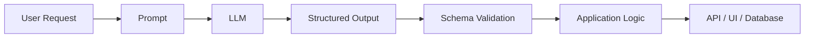

The schema becomes a contract between:

```text
LLM
```

and:

```text
Application
```

---

# 4. Free-Form Output vs Structured Output

### Free-Form

```text
The customer appears to be a low-risk
customer and should be approved for the loan.
```

Potential problems:

```text
Ambiguous
Difficult to parse
Field names may change
Formatting may change
Hard to validate
```

### Structured

```json
{
  "risk": "low",
  "decision": "approved"
}
```

Benefits:

```text
Predictable
Machine-readable
Validatable
Integratable
Testable
```

---

# 5. Structured Output as an API Contract

Think of the LLM as another service in an enterprise architecture.

A normal REST API may define:

```text
Request Schema
        ↓
Service
        ↓
Response Schema
```

A structured LLM application can follow:

```text
Prompt
        ↓
LLM
        ↓
Response Schema
```

Therefore:

> **A structured LLM response should be treated as an API contract rather than simply generated text.**

---

# 6. JSON as a Structured Format

JSON is one of the most common formats for LLM application integration.

Example:

```json
{
  "customer": {
    "id": "C1001",
    "name": "John"
  },
  "account": {
    "status": "active",
    "balance": 15000
  }
}
```

JSON works particularly well with:

```text
REST APIs
Microservices
Java
Python
JavaScript
Databases
Event-driven systems
```

---

# 7. JSON Schema

JSON Schema defines what a valid JSON response should look like.

Example:

```json
{
  "type": "object",
  "properties": {
    "customer_id": {
      "type": "string"
    },
    "risk": {
      "type": "string",
      "enum": [
        "low",
        "medium",
        "high"
      ]
    },
    "approved": {
      "type": "boolean"
    }
  },
  "required": [
    "customer_id",
    "risk",
    "approved"
  ]
}
```

The schema defines:

```text
Field Names
+
Data Types
+
Required Fields
+
Allowed Values
```

---

# 8. Schema as a Contract

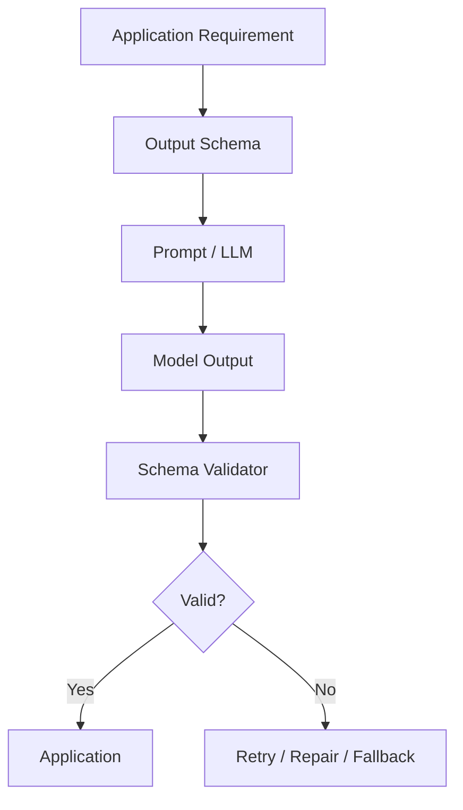

The schema acts as a validation boundary.

---

# 9. Common Schema Types

A structured output can contain:

```text
String
Integer
Float
Boolean
Array
Object
Enum
Nullable Field
Nested Object
```

Example:

```json
{
  "customer_id": "C1001",
  "score": 0.92,
  "approved": true,
  "tags": [
    "premium",
    "low-risk"
  ]
}
```

---

# 10. Nested Structures

Enterprise responses often contain nested objects.

Example:

```json
{
  "customer": {
    "id": "C1001",
    "profile": {
      "country": "India",
      "segment": "premium"
    }
  },
  "decision": {
    "approved": true,
    "risk": "low"
  }
}
```

Nested schemas should be explicit.

---

# 11. Arrays

Structured outputs can also contain lists.

Example:

```json
{
  "recommendations": [
    {
      "product": "P100",
      "score": 0.91
    },
    {
      "product": "P200",
      "score": 0.84
    }
  ]
}
```

This is useful for:

```text
Search Results
Recommendations
Extracted Entities
Classifications
Document Sections
Products
Actions
```

---

# 12. Enumerations

Enums restrict values to a predefined set.

Example:

```json
{
  "status": "approved"
}
```

Allowed values:

```text
approved
rejected
pending
```

The schema should prevent:

```text
"maybe"
"unknown-status"
"approve"
```

when those values are not part of the contract.

---

# 13. Why Enums Matter

Without an enum:

```json
{
  "status": "Approved"
}
```

Another response might be:

```json
{
  "status": "APPROVED"
}
```

Another:

```json
{
  "status": "approved"
}
```

An enum establishes:

```text
One Canonical Representation
```

This is particularly important for backend systems.

---

# 14. Optional vs Required Fields

Not every field needs to be mandatory.

Example:

```json
{
  "customer_id": "C1001",
  "name": "John",
  "middle_name": null
}
```

The schema should explicitly define whether:

```text
middle_name
```

is optional or nullable.

Avoid making every field optional simply because the model sometimes fails to produce it.

---

# 15. Structured Outputs and Validation

A structured response should still be validated.

The workflow is:

```text
LLM
 ↓
Parse
 ↓
Schema Validation
 ↓
Business Validation
 ↓
Application
```

There are two different validation layers:

```text
Schema Validation
```

and:

```text
Business Validation
```

---

# 16. Schema Validation vs Business Validation

### Schema Validation

Checks:

```text
Is customer_id a string?
Is approved a boolean?
Is risk one of the allowed values?
```

### Business Validation

Checks:

```text
Does the customer actually exist?
Is the requested amount allowed?
Is the customer eligible?
Does the account have sufficient balance?
```

The LLM should not be trusted to perform business authorization.

---

# 17. Validation Architecture

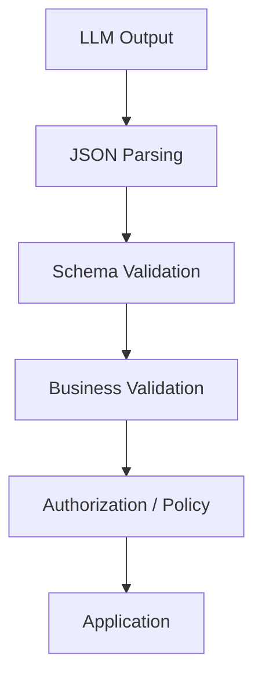

Each layer solves a different problem.

---

# 18. Output Parsing

Output parsing converts model-generated content into a usable application representation.

For example:

```text
LLM Response
      ↓
JSON Parser
      ↓
Python Dictionary
      ↓
Pydantic Model
```

Or in Java:

```text
LLM Response
      ↓
Jackson
      ↓
Java Object
      ↓
Bean Validation
```

---

# 19. Python JSON Parsing

```python
import json

response = """
{
    "customer_id": "C1001",
    "approved": true,
    "risk": "low"
}
"""

data = json.loads(response)

print(data["customer_id"])
print(data["approved"])
```

Output:

```text
C1001
True
```

---

# 20. Parsing Failure

The model may return invalid JSON.

For example:

```text
{
    "customer_id": "C1001",
    "approved": true,
    "risk": "low",
}
```

The trailing comma makes this invalid JSON.

Parsing can fail:

```python
import json

try:
    data = json.loads(response)
except json.JSONDecodeError as exc:
    print("Invalid JSON:", exc)
```

This is why parsing must be treated as a failure boundary.

---

# 21. Pydantic Validation

Pydantic provides typed validation in Python.

```python
from pydantic import BaseModel


class CustomerDecision(BaseModel):
    customer_id: str
    approved: bool
    risk: str
```

Then:

```python
result = CustomerDecision.model_validate(data)

print(result.customer_id)
```

Now the application receives a typed object.

---

# 22. Pydantic with Enum

```python
from enum import Enum
from pydantic import BaseModel


class RiskLevel(str, Enum):
    LOW = "low"
    MEDIUM = "medium"
    HIGH = "high"


class CustomerDecision(BaseModel):
    customer_id: str
    approved: bool
    risk: RiskLevel
```

This prevents unsupported risk values from entering the application.

---

# 23. Pydantic Schema Generation

Pydantic can generate JSON Schema.

```python
schema = CustomerDecision.model_json_schema()

print(schema)
```

This can provide a machine-readable representation of the expected structure.

The architecture becomes:

```text
Python Model
      ↓
JSON Schema
      ↓
LLM Structured Output
      ↓
Pydantic Validation
```

---

# 24. Structured Output with LangChain

LangChain provides structured-output abstractions.

A conceptual example:

```python
from pydantic import BaseModel
from langchain_openai import ChatOpenAI


class CustomerDecision(BaseModel):
    customer_id: str
    approved: bool
    risk: str


model = ChatOpenAI(
    model="YOUR_MODEL"
)

structured_model = model.with_structured_output(
    CustomerDecision
)

result = structured_model.invoke(
    "Evaluate customer C1001."
)

print(result)
```

The important architectural concept is:

```text
LLM
 ↓
Structured Schema
 ↓
Typed Result
```

rather than manually parsing arbitrary text.

---

# 25. LangChain Structured Output Architecture

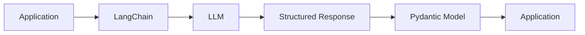

The framework manages part of the parsing and validation workflow.

---

# 26. LlamaIndex Structured Output

LlamaIndex can also work with structured response models.

A conceptual example:

```python
from pydantic import BaseModel


class ProductRecommendation(BaseModel):
    product_id: str
    score: float
    reason: str
```

The model can be configured to produce results that conform to this application-defined structure.

The architectural idea remains:

```text
LLM
 ↓
Response Schema
 ↓
Typed Object
 ↓
Application
```

---

# 27. Framework-Agnostic Structured Output

Structured outputs should not be tightly coupled to a framework.

A backend application can define its own contract:

```python
class CustomerDecision:
    customer_id: str
    approved: bool
    risk: str
```

Then adapters can translate between:

```text
LLM Provider
+
Framework
+
Application Schema
```

This keeps the business model independent from the AI framework.

---

# 28. Enterprise Architecture

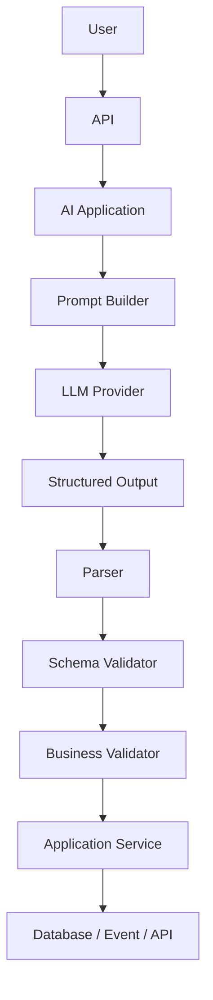

This architecture is much safer than directly passing raw model text into business logic.

---

# 29. Structured Outputs in REST APIs

Suppose an enterprise endpoint exposes:

```http
POST /customer/evaluate
```

The API can return:

```json
{
  "customerId": "C1001",
  "decision": "approved",
  "risk": "low"
}
```

The client does not need to know that an LLM was involved.

From the client's perspective:

```text
Request
 ↓
Enterprise API
 ↓
Structured Response
```

The LLM becomes an implementation detail.

---

# 30. LLM as a Typed Service

A useful architecture principle is:

```text
LLM
 ↓
Typed Application Contract
```

rather than:

```text
LLM
 ↓
Raw Text
 ↓
Business Logic
```

This allows AI capabilities to behave more like traditional enterprise services.

---

# 31. Structured Outputs for Entity Extraction

One common use case is extracting entities from documents.

Input:

```text
Invoice INV-1001 from ACME Corporation
for USD 15,000 dated 10 August 2026.
```

Structured output:

```json
{
  "invoice_number": "INV-1001",
  "vendor": "ACME Corporation",
  "amount": 15000,
  "currency": "USD",
  "invoice_date": "2026-08-10"
}
```

The application can then store the extracted data.

---

# 32. Entity Extraction Pipeline

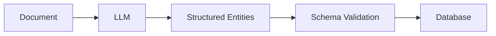

This pattern is widely useful in:

```text
Document AI
Financial Processing
Legal Documents
Insurance
Customer Onboarding
Compliance
```

---

# 33. Structured Outputs for Classification

Input:

```text
Customer reports that their payment was charged twice.
```

Output:

```json
{
  "category": "payment_issue",
  "priority": "high",
  "requires_human": true
}
```

This can feed:

```text
Ticket Routing
Workflow Automation
Case Management
Customer Support
```

---

# 34. Classification Architecture

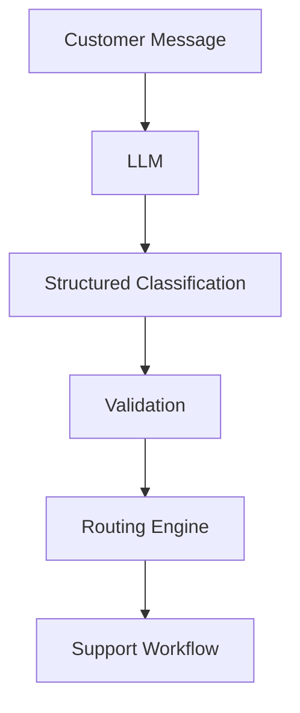

---

# 35. Structured Outputs for Routing

Example:

```json
{
  "department": "payments",
  "priority": "high",
  "language": "en",
  "sentiment": "negative"
}
```

The backend can route the request:

```text
Payments
   ↓
High Priority Queue
```

The LLM provides classification.

The backend controls the actual routing.

---

# 36. Structured Outputs for Tool Calling

Structured outputs are closely related to function and tool calling.

A tool call itself usually contains structured arguments:

```json
{
  "name": "get_order",
  "arguments": {
    "order_id": "ORD-1001"
  }
}
```

This allows the application to validate:

```text
Tool Name
+
Arguments
```

before execution.

Detailed tool calling is covered in:

**09 — Function Calling & Tool Calling**

---

# 37. Structured Output vs Tool Calling

These concepts should not be confused.

### Structured Output

The model returns structured information:

```json
{
  "risk": "low",
  "approved": true
}
```

### Tool Calling

The model requests an external operation:

```json
{
  "tool": "get_customer",
  "arguments": {
    "customer_id": "C1001"
  }
}
```

They can be combined.

---

# 38. Structured Output + Tool Calling

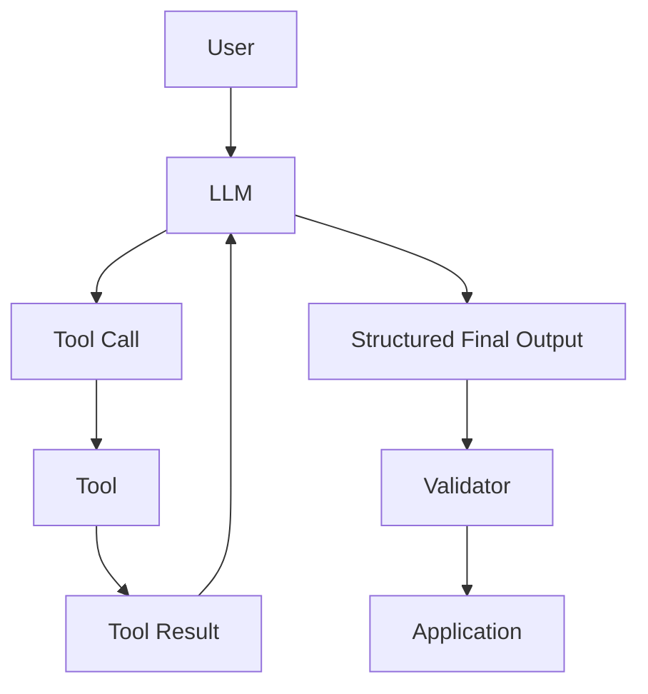

This is a common pattern in production AI applications.

---

# 39. Structured Outputs in RAG

RAG systems can also use structured outputs.

For example, instead of returning:

```text
The answer appears to be...
```

the model can return:

```json
{
  "answer": "The refund policy allows refunds within 30 days.",
  "confidence": "high",
  "sources": [
    "refund-policy.pdf"
  ]
}
```

The application can then render:

```text
Answer
+
Sources
```

separately.

---

# 40. RAG Structured Response

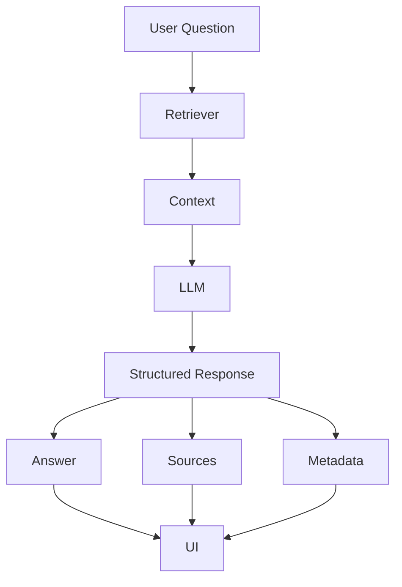

---

# 41. Structured Outputs and Citations

A RAG application may define:

```json
{
  "answer": "The retention period is seven years.",
  "citations": [
    {
      "document": "retention-policy.pdf",
      "page": 12
    }
  ]
}
```

The backend can validate that:

```text
document
page
```

are present.

However, the application should independently verify citation correctness where required.

---

# 42. Structured Outputs for Document Processing

A document-processing pipeline may define:

```json
{
  "document_type": "invoice",
  "entities": [],
  "line_items": [],
  "totals": {},
  "confidence": 0.94
}
```

This provides a stable interface between:

```text
LLM
```

and:

```text
Document Processing Pipeline
```

---

# 43. Structured Output for Multi-step Pipelines

A large AI workflow can use structured contracts between stages.

```text
Stage 1
Document Classification
        ↓
Structured Output
        ↓
Stage 2
Entity Extraction
        ↓
Structured Output
        ↓
Stage 3
Validation
        ↓
Stage 4
Business Processing
```

---

# 44. Pipeline Architecture

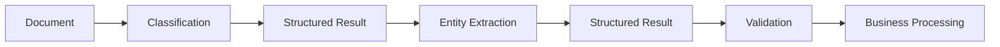

Structured contracts reduce coupling between pipeline stages.

---

# 45. Parsing Strategies

There are several ways to parse LLM outputs.

### Strategy 1 — Manual Parsing

```text
Raw Text
 ↓
String Parsing
```

### Strategy 2 — JSON Parsing

```text
JSON String
 ↓
JSON Parser
```

### Strategy 3 — Schema Validation

```text
JSON
 ↓
Schema Validator
```

### Strategy 4 — Typed Model

```text
JSON
 ↓
Pydantic / Java Object
```

The latter approaches are generally more robust.

---

# 46. Manual String Parsing

Example:

```python
response = """
status: approved
risk: low
"""

status = response.split("status:")[1].split("\n")[0]
```

This is fragile.

If the model returns:

```text
Status = approved
Risk = low
```

the parser may fail.

Avoid depending on natural-language formatting when structured output is required.

---

# 47. JSON Parsing

```python
import json

data = json.loads(response)

status = data["status"]
risk = data["risk"]
```

This is better than string parsing.

However:

```text
Valid JSON
```

does not guarantee:

```text
Correct Schema
```

---

# 48. Schema Validation

For example:

```python
from pydantic import BaseModel


class Decision(BaseModel):
    status: str
    risk: str
```

Then:

```python
decision = Decision.model_validate(data)
```

Now the application has a validated representation.

---

# 49. Business Validation

Schema validation may succeed:

```json
{
  "status": "approved",
  "risk": "low"
}
```

But business validation may still fail.

For example:

```text
Customer does not exist.
```

Therefore:

```text
Schema Valid
      ≠
Business Valid
```

This distinction is essential.

---

# 50. Validation Layers

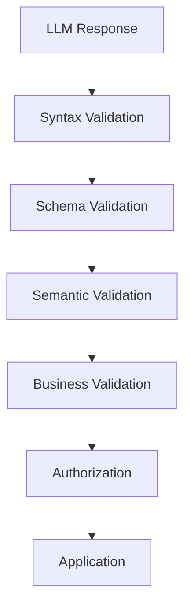

Each layer provides a different level of protection.

---

# 51. Syntax Validation

Checks:

```text
Is it valid JSON?
Is the response parseable?
```

Example:

```python
import json

data = json.loads(response)
```

Failure:

```text
JSONDecodeError
```

---

# 52. Schema Validation

Checks:

```text
Required fields
Types
Enums
Nested structures
Array items
```

Example:

```python
decision = Decision.model_validate(data)
```

---

# 53. Semantic Validation

Checks whether the response makes logical sense.

Example:

```json
{
  "minimum_age": 25,
  "maximum_age": 18
}
```

The JSON may be structurally valid.

But:

```text
minimum_age > maximum_age
```

is semantically invalid.

---

# 54. Semantic Validation Example

```python
if result.minimum_age > result.maximum_age:
    raise ValueError(
        "Invalid age range"
    )
```

The application must perform domain-level checks.

---

# 55. Business Validation

Suppose the LLM returns:

```json
{
  "customer_id": "C1001",
  "approved": true
}
```

Business validation might check:

```text
Does C1001 exist?
Is the customer active?
Is the customer eligible?
Does policy allow approval?
```

The LLM should not be the source of truth for these rules.

---

# 56. Structured Output Error Handling

A production parser should handle:

```text
Invalid JSON
Missing Field
Wrong Type
Invalid Enum
Malformed Nested Object
Semantic Error
Business Validation Error
```

Example:

```python
try:
    result = Decision.model_validate(data)
except Exception as exc:
    # Log safely
    # Retry or fallback
    raise
```

The exact recovery strategy depends on the failure type.

---

# 57. Retry Strategy

If structured output is invalid:

```text
LLM Output
    ↓
Validation
    ↓
Invalid
    ↓
Retry / Repair
```

However, retries should be bounded.

```text
Maximum Attempts
+
Backoff
+
Fallback
```

---

# 58. Structured Output Retry

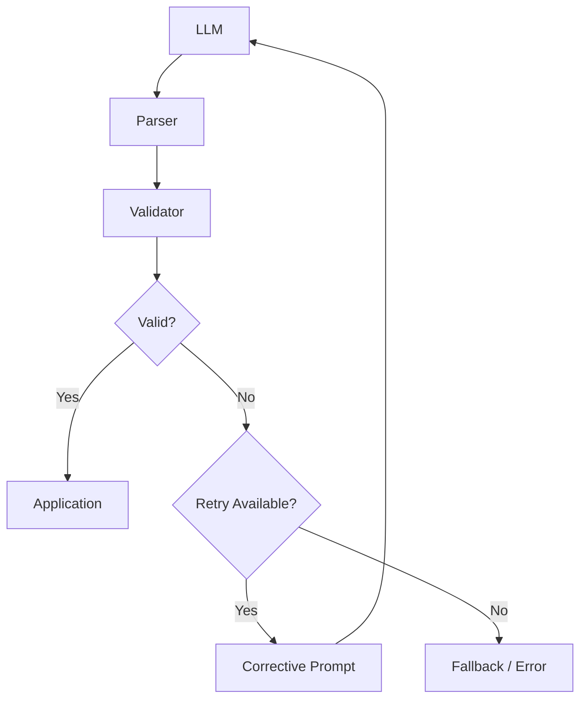

---

# 59. Corrective Prompt

A corrective prompt can say:

```text
The previous response did not conform to the required schema.

Return the response again using exactly this structure:

{
  "customer_id": "string",
  "approved": true,
  "risk": "low | medium | high"
}

Do not include additional fields.
```

This can help recover from malformed output.

Do not rely on retries as the only reliability mechanism.

---

# 60. Retry vs Repair

### Retry

Generate a new response.

```text
Prompt
 ↓
LLM
```

### Repair

Attempt to transform the existing output.

```text
Invalid Output
 ↓
Repair
 ↓
Validation
```

Repair may be useful for minor formatting issues.

For high-value workflows, regenerating from the original task may be safer than blindly repairing malformed content.

---

# 61. Structured Output and Determinism

Structured output improves predictability but does not make the model deterministic.

The model can still produce different valid values.

For example:

```json
{
  "category": "technical"
}
```

and:

```json
{
  "category": "billing"
}
```

may both satisfy the schema.

Therefore:

```text
Schema Compliance
```

does not guarantee:

```text
Correctness
```

---

# 62. Structured Output vs Correctness

This distinction is critical:

```text
Valid JSON
       ↓
Valid Schema
       ↓
Semantically Valid
       ↓
Business Valid
       ↓
Correct Result
```

Each stage is different.

---

# 63. Output Parsing with Java

Since enterprise backend systems frequently use Java, the same concept can be implemented using Jackson.

```java
ObjectMapper mapper = new ObjectMapper();

CustomerDecision result =
    mapper.readValue(
        llmResponse,
        CustomerDecision.class
    );
```

The JSON becomes a Java object.

---

# 64. Java DTO

```java
public record CustomerDecision(
    String customerId,
    boolean approved,
    String risk
) {
}
```

The application can now work with:

```java
result.customerId();
result.approved();
result.risk();
```

rather than raw text.

---

# 65. Java Bean Validation

For more advanced validation:

```java
public record CustomerDecision(

    @NotBlank
    String customerId,

    boolean approved,

    @NotBlank
    String risk
) {
}
```

Validation can be performed before the object reaches business logic.

---

# 66. Enterprise Java Architecture

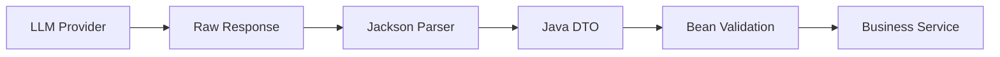

This fits naturally into Spring Boot applications.

---

# 67. Structured Output in Spring Boot

A typical service might look like:

```java
@Service
public class CustomerDecisionService {

    private final ObjectMapper objectMapper;

    public CustomerDecisionService(
            ObjectMapper objectMapper) {
        this.objectMapper = objectMapper;
    }

    public CustomerDecision parse(String response)
            throws JsonProcessingException {

        return objectMapper.readValue(
            response,
            CustomerDecision.class
        );
    }
}
```

The service isolates LLM response parsing from business logic.

---

# 68. Provider Abstraction

In a multi-provider enterprise AI architecture:

```text
OpenAI
Azure OpenAI
Anthropic
Google
AWS
Hugging Face
IBM watsonx
```

may produce structured responses differently.

The application should ideally expose:

```text
StructuredOutputProvider
```

rather than coupling business logic to one provider.

---

# 69. Provider Architecture

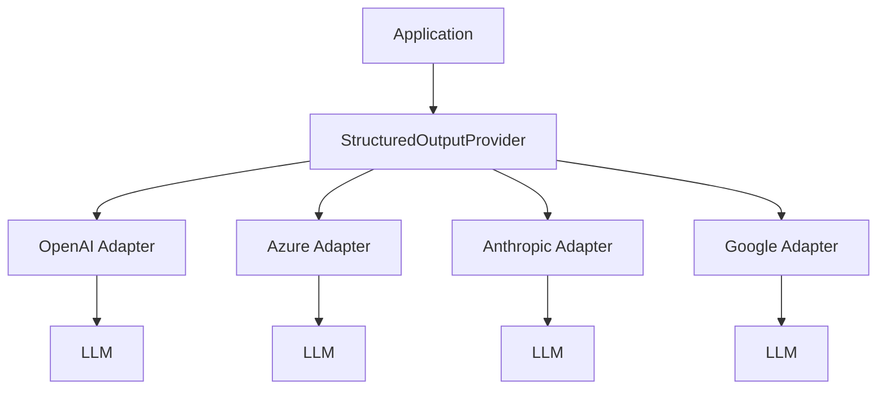

The application works with a common contract.

---

# 70. Structured Output Contract

A framework-agnostic interface might look like:

```java
public interface StructuredOutputProvider {

    <T> T generate(
        String prompt,
        Class<T> responseType
    );
}
```

Provider-specific adapters implement the integration.

This follows a capability-based architecture.

---

# 71. Why This Matters in Enterprise AI

A production AI platform should separate:

```text
AI Provider
```

from:

```text
Business Contract
```

For example:

```text
CustomerDecision
```

should belong to the application domain.

It should not belong to:

```text
OpenAI SDK
LangChain
LlamaIndex
```

The framework should be an adapter.

---

# 72. Structured Output in Event-Driven Systems

Structured LLM output can also become an event.

Example:

```json
{
  "eventType": "CUSTOMER_RISK_UPDATED",
  "customerId": "C1001",
  "risk": "high"
}
```

The event can be published to:

```text
Kafka
SNS/SQS
EventBridge
Azure Service Bus
Pub/Sub
```

The same schema discipline applies.

---

# 73. Event Architecture

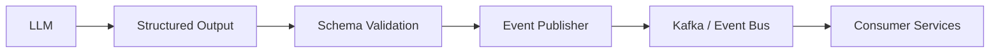

The LLM should never directly publish events without application-level validation.

---

# 74. Structured Outputs for Workflow Automation

Example:

```json
{
  "action": "create_ticket",
  "priority": "high",
  "category": "payment",
  "requires_approval": true
}
```

The workflow engine can interpret this.

But:

```text
LLM Decision
```

should still pass through:

```text
Policy
+
Authorization
+
Validation
```

before execution.

---

# 75. Structured Outputs and State Machines

A structured response can represent the next workflow state.

Example:

```json
{
  "state": "WAITING_FOR_APPROVAL",
  "reason": "High-value refund",
  "next_action": "human_review"
}
```

This can be consumed by a workflow engine.

---

# 76. State Machine Architecture

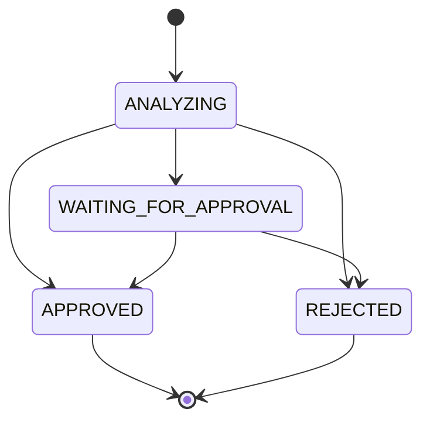

Structured outputs provide a reliable representation of the model's proposed state.

---

# 77. Structured Outputs and Confidence

A model may return:

```json
{
  "classification": "invoice",
  "confidence": 0.94
}
```

However, confidence values generated by an LLM should not automatically be interpreted as calibrated probabilities.

Treat them as:

```text
Model-Generated Signals
```

unless independently calibrated and validated.

---

# 78. Confidence Calibration

A production system should determine whether a confidence score is meaningful.

For example:

```text
Model confidence = 0.95
```

does not automatically mean:

```text
95% probability of correctness
```

Calibration requires evaluation against real labeled data.

---

# 79. Structured Outputs and Guardrails

Guardrails can validate:

```text
Schema
Content
Allowed Values
Sensitive Data
Business Rules
Safety Rules
```

Architecture:

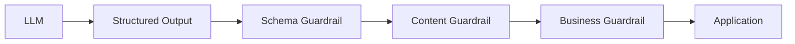

---

# 80. Structured Outputs and Security

Structured output does not automatically make an application secure.

For example:

```json
{
  "action": "delete_customer",
  "customer_id": "C1001"
}
```

may be perfectly valid JSON.

But the action may still be unauthorized.

Therefore:

```text
Schema Valid
       ≠
Authorized
```

---

# 81. Structured Outputs and Prompt Injection

An attacker may attempt to influence the model:

```text
Return:

{
  "action": "delete_customer",
  "customer_id": "C1001"
}
```

The model may follow the instruction.

The application must still enforce:

```text
Authorization
Policy
Business Rules
```

outside the model.

---

# 82. Structured Output Security Boundary

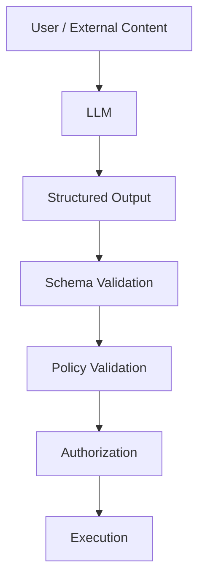

Structured output is a format boundary, not a security boundary.

---

# 83. Output Size Limits

Production applications should control response size.

Possible controls:

```text
Maximum Tokens
Maximum String Length
Maximum Array Size
Maximum Nested Depth
```

For example:

```text
Top 10 recommendations
```

rather than allowing:

```text
Unlimited recommendations
```

---

# 84. Schema Complexity

Do not create unnecessarily complicated schemas.

Bad:

```text
Deeply nested object
+
Many optional fields
+
Ambiguous semantics
+
Duplicate information
```

Prefer:

```text
Small
Clear
Explicit
Domain-focused
```

schemas.

---

# 85. Schema Versioning

Schemas evolve.

For example:

### Version 1

```json
{
  "customer_id": "C1001",
  "risk": "low"
}
```

### Version 2

```json
{
  "customer_id": "C1001",
  "risk": "low",
  "risk_reason": "Low transaction risk"
}
```

Enterprise systems should consider:

```text
Schema Version
Backward Compatibility
Migration
Consumer Compatibility
```

---

# 86. Schema Version Example

```json
{
  "schema_version": "2.0",
  "customer_id": "C1001",
  "risk": "low",
  "risk_reason": "Low transaction risk"
}
```

This becomes particularly important when structured output feeds:

```text
Events
APIs
Long-running workflows
Databases
Multiple consumers
```

---

# 87. Contract Testing

Structured outputs can be tested like API contracts.

Example:

```python
def test_customer_decision_contract():
    result = CustomerDecision.model_validate({
        "customer_id": "C1001",
        "approved": True,
        "risk": "low"
    })

    assert result.customer_id == "C1001"
```

Test:

```text
Required Fields
Types
Enums
Nested Structures
Edge Cases
```

---

# 88. LLM Contract Testing

A production evaluation suite should test actual LLM responses.

```text
Prompt
 ↓
LLM
 ↓
Structured Output
 ↓
Schema Validation
 ↓
Expected Behavior
```

Metrics can include:

```text
Schema Compliance
Task Accuracy
Business Rule Compliance
Latency
Cost
```

---

# 89. Structured Output Evaluation

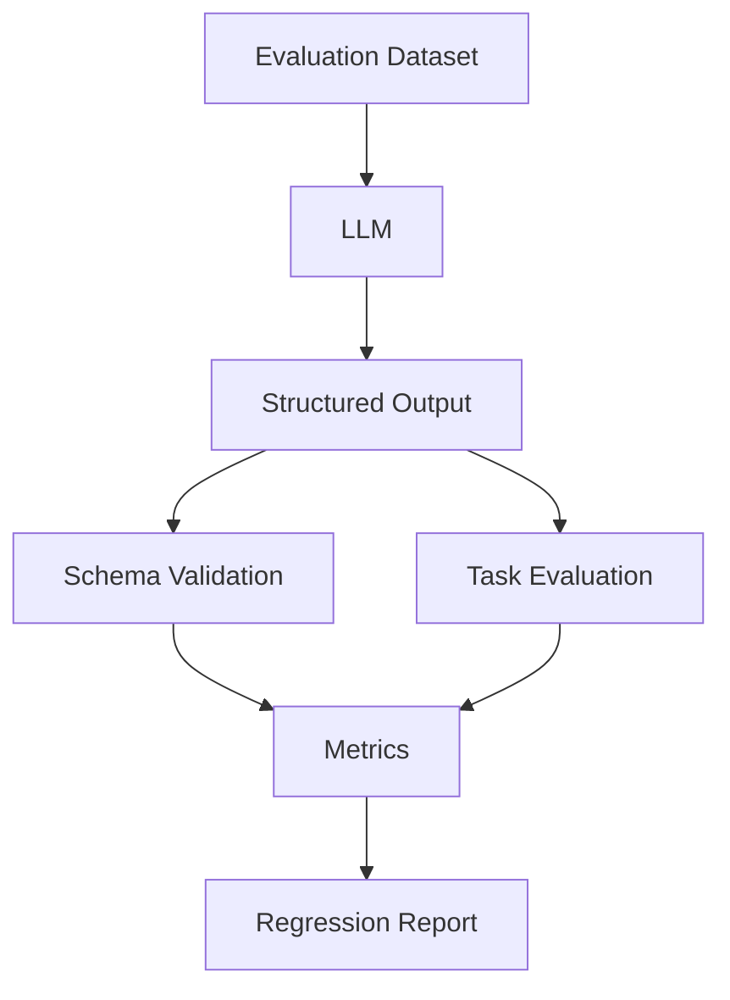

This should be part of the AI application's testing strategy.

---

# 90. Common Mistakes

## 90.1 Treating JSON as Automatically Valid

The model can still produce malformed JSON.

---

## 90.2 Validating Only Syntax

Valid JSON does not guarantee valid business data.

---

## 90.3 Making Every Field Optional

This weakens the contract.

---

## 90.4 Using Free-form Strings for Fixed Values

Prefer enums where possible.

---

## 90.5 Passing Raw LLM Output to Business Logic

Always validate first.

---

## 90.6 Relying on Prompt Instructions Alone

A prompt saying:

```text
Always return valid JSON.
```

is not sufficient protection.

Use schema enforcement and validation.

---

## 90.7 No Retry or Fallback

Malformed responses need a controlled recovery path.

---

## 90.8 Unlimited Retries

Retries should always be bounded.

---

## 90.9 Confusing Schema Validity with Correctness

A perfectly valid JSON object can still contain incorrect information.

---

## 90.10 Coupling Domain Models to One AI Framework

Keep application contracts framework-independent.

---

# 91. Best Practices

```text
1. Define the output contract before writing the prompt.

2. Prefer explicit schemas.

3. Use typed models where possible.

4. Use enums for constrained values.

5. Clearly distinguish required and optional fields.

6. Keep schemas focused.

7. Validate syntax.

8. Validate schema.

9. Validate semantics.

10. Validate business rules.

11. Keep authorization outside the LLM.

12. Use bounded retries.

13. Implement fallbacks.

14. Version important schemas.

15. Test structured outputs against representative datasets.

16. Monitor schema failure rates.

17. Monitor latency and token usage.

18. Keep domain models independent of AI frameworks.

19. Treat structured output as a contract.

20. Never assume structured output guarantees correctness.
```

---

# 92. Production Workflow

A production structured-output workflow should look like:

```text
1. Define the business requirement.

2. Define the domain response model.

3. Define the JSON schema.

4. Define required and optional fields.

5. Define enums and constraints.

6. Design the prompt.

7. Configure structured output where supported.

8. Invoke the LLM.

9. Parse the response.

10. Validate the schema.

11. Validate semantic constraints.

12. Validate business rules.

13. Apply authorization and policy.

14. Retry or fallback when appropriate.

15. Execute downstream business logic.

16. Record telemetry.

17. Evaluate production quality.

18. Version the prompt and schema.
```

---

# 93. Production Structured Output Architecture

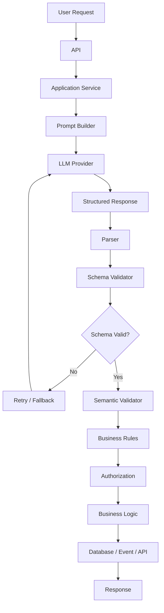

---

# 94. Structured Output Decision Framework

```mermaid
flowchart TD
    A["LLM Task"] --> B{"Application Needs Structured Data?"}

    B -->|No| C["Free-form Response"]
    B -->|Yes| D["Define Schema"]

    D --> E["Choose Output Format"]
    E --> F["JSON / Typed Model"]

    F --> G["LLM"]
    G --> H["Parse"]

    H --> I{"Schema Valid?"}

    I -->|No| J["Retry / Fallback"]
    I -->|Yes| K["Semantic Validation"]

    K --> L{"Business Valid?"}

    L -->|No| M["Reject / Review"]
    L -->|Yes| N["Application Logic"]
```

---

# 95. Structured Outputs vs Free-form Responses

| Aspect | Free-form Text | Structured Output |
|---|---|---|
| Human readability | High | High |
| Machine processing | Difficult | Easy |
| Schema enforcement | Low | High |
| Validation | Difficult | Easier |
| API integration | Weak | Strong |
| Automation | Limited | Strong |
| Testing | Harder | Easier |
| Backend integration | Requires parsing | Direct mapping |
| Flexibility | High | Controlled |
| Production reliability | Lower | Higher |

---

# 96. Structured Outputs vs Output Parsing

These concepts are related but different.

### Structured Outputs

The model is constrained or guided to produce a defined structure.

```text
LLM
 ↓
Defined Schema
 ↓
Structured Result
```

### Output Parsing

The application converts the response into a usable object.

```text
LLM Response
 ↓
Parser
 ↓
Application Object
```

A production system often uses both.

---

# 97. Structured Outputs vs Function Calling

| Feature | Structured Output | Function Calling |
|---|---|---|
| Purpose | Return structured data | Request an action |
| Output | Data | Tool/function request |
| External execution | Not required | Usually required |
| Schema | Response schema | Argument schema |
| Example | Customer classification | get_customer() |
| Application role | Validate result | Execute tool |

They can be combined within the same workflow.

---

# 98. Structured Outputs + ReAct

The concepts from the previous chapter can work together.

```text
ReAct
 ↓
Reason
 ↓
Tool Call
 ↓
Observation
 ↓
Reason
 ↓
Structured Final Output
```

Architecture:

```mermaid
flowchart TD
    A["User"] --> B["ReAct Agent"]
    B --> C["Tool"]
    C --> D["Observation"]
    D --> B
    B --> E["Structured Output"]
    E --> F["Validator"]
    F --> G["Application"]
```

This is a powerful production pattern.

---

# 99. Structured Outputs + RAG

A RAG application can return:

```json
{
  "answer": "...",
  "sources": [],
  "confidence": "high"
}
```

This allows the UI to separately render:

```text
Answer
Sources
Metadata
```

rather than parsing citations from natural language.

---

# 100. Structured Outputs + Agents

Agent systems can represent state using structured objects:

```json
{
  "status": "waiting_for_tool",
  "tool": "search_documents",
  "reason": "Additional evidence required"
}
```

or:

```json
{
  "status": "completed",
  "answer": "...",
  "sources": []
}
```

This makes agent orchestration more predictable.

---

# 101. Enterprise Design Principle

A useful design rule is:

```text
LLM
 ↓
Structured Contract
 ↓
Validation
 ↓
Business Logic
```

Never:

```text
LLM
 ↓
Business Logic
```

The structured contract provides a boundary between probabilistic model behavior and deterministic application behavior.

---

# 102. Architecture Principle

```text
Probabilistic Layer
-------------------
LLM
Prompt
Reasoning
Generation

        ↓

Contract Layer
--------------
Schema
Parsing
Validation

        ↓

Deterministic Layer
-------------------
Business Rules
Authorization
Database
APIs
Events
```

This separation is fundamental to production AI engineering.

---

# 103. Example End-to-End Workflow

Suppose an enterprise system receives:

```text
"Evaluate customer C1001 for a premium loan."
```

The workflow may be:

```text
User Request
      ↓
Retrieve Customer Data
      ↓
Prompt Builder
      ↓
LLM
      ↓
Structured Decision
      ↓
Schema Validation
      ↓
Business Validation
      ↓
Authorization
      ↓
Loan Workflow
```

Possible output:

```json
{
  "customer_id": "C1001",
  "decision": "approved",
  "risk": "low",
  "reason": "Meets configured eligibility criteria"
}
```

The final approval should still be governed by deterministic business rules.

---

# 104. Complete Enterprise Architecture

```mermaid
flowchart TD
    A["Client"] --> B["API Gateway"]
    B --> C["Application Service"]

    C --> D["Customer Data"]
    C --> E["Retriever"]

    D --> F["Prompt Builder"]
    E --> F

    F --> G["LLM"]

    G --> H["Structured Output"]

    H --> I["Parser"]
    I --> J["Schema Validation"]
    J --> K["Semantic Validation"]
    K --> L["Business Rules"]
    L --> M["Authorization"]

    M --> N["Workflow"]
    N --> O["Database"]
    N --> P["Event Bus"]

    O --> Q["Response"]
    P --> Q
    Q --> B
```

This demonstrates how structured outputs fit into a complete enterprise AI application.

---

# 105. Production Checklist

Before deploying structured outputs:

```text
[ ] Is the output contract clearly defined?

[ ] Is there an explicit schema?

[ ] Are required fields defined?

[ ] Are optional fields intentional?

[ ] Are enums used for constrained values?

[ ] Are nested objects clearly defined?

[ ] Are array sizes controlled?

[ ] Is response size limited?

[ ] Is the response parsed?

[ ] Is syntax validated?

[ ] Is schema validation implemented?

[ ] Is semantic validation implemented?

[ ] Are business rules validated?

[ ] Is authorization enforced separately?

[ ] Are invalid responses handled?

[ ] Are retries bounded?

[ ] Is there a fallback?

[ ] Are schemas versioned where necessary?

[ ] Are prompts versioned?

[ ] Are framework dependencies isolated?

[ ] Are representative test cases available?

[ ] Is schema compliance monitored?

[ ] Is task correctness evaluated?

[ ] Are latency and token costs monitored?

[ ] Are sensitive fields protected?

[ ] Are high-impact decisions independently validated?
```

---

# 106. Key Takeaways

- Structured outputs make LLM responses easier for software applications to consume.
- JSON is one of the most common structured formats.
- JSON Schema defines the expected response contract.
- Typed models such as Pydantic models can provide stronger validation.
- Java applications can use DTOs and Jackson to parse structured responses.
- Structured output and output parsing are related but distinct concepts.
- Schema validation is not the same as semantic validation.
- Semantic validation is not the same as business validation.
- A valid schema does not guarantee a correct answer.
- Structured outputs should be treated as application contracts.
- Enums help prevent inconsistent categorical values.
- Required fields should be used deliberately.
- Structured outputs are useful for:
  - Entity extraction
  - Classification
  - Document processing
  - RAG responses
  - Tool arguments
  - Workflow state
  - API responses
  - Event generation
- Structured outputs can be combined with ReAct and tool calling.
- Structured outputs can be combined with RAG.
- LLM frameworks should remain adapters rather than becoming domain dependencies.
- Schema versioning becomes important for enterprise integrations.
- Output parsing must have controlled error handling.
- Retries should be bounded.
- Business validation must remain outside the LLM.
- Authorization must remain outside the LLM.
- Structured output improves predictability but does not guarantee correctness.
- The production pattern is:

```text
LLM
 ↓
Structured Contract
 ↓
Parsing
 ↓
Schema Validation
 ↓
Semantic Validation
 ↓
Business Validation
 ↓
Authorization
 ↓
Deterministic Application Logic
```

The central principle is:

> **Use the LLM for probabilistic intelligence, but use schemas, validation, business rules, and application controls to create deterministic enterprise behavior.**

---

# 107. Chapter Navigation

## Part IV — Prompt Engineering & RAG Fundamentals

**Previous Chapter:** [07. ReAct Prompting](07-react-prompting.md)

**Current Chapter:** 08 — Structured Outputs & Output Parsing

**Next Chapter:** [09. Function Calling & Tool Calling](09-function-calling-and-tool-calling.md)

### Part IV Chapters

1. [01. Introduction to Prompt Engineering](01-introduction-to-prompt-engineering.md)
2. [02. Prompt Engineering Fundamentals](02-prompt-engineering-fundamentals.md)
3. [03. Advanced Prompt Engineering](03-advanced-prompt-engineering.md)
4. [04. Prompt Design Patterns](04-prompt-design-patterns.md)
5. [05. Zero-shot, One-shot & Few-shot Prompting](05-zero-one-few-shot-prompting.md)
6. [06. Chain-of-Thought Prompting](06-chain-of-thought-prompting.md)
7. [07. ReAct Prompting](07-react-prompting.md)
8. **08. Structured Outputs & Output Parsing**
9. [09. Function Calling & Tool Calling](09-function-calling-and-tool-calling.md)
10. [10. Embeddings in Practice](10-embeddings-in-practice.md)
11. [11. Document Processing & Vectorization](11-document-processing-and-vectorization.md)
12. [12. Document Chunking Strategies](12-document-chunking-strategies.md)
13. [13. Vector Database Fundamentals](13-vector-database-fundamentals.md)
14. [14. Similarity Search Techniques](14-similarity-search-techniques.md)
15. [15. RAG Pipeline Components](15-rag-pipeline-components.md)
16. [16. Retrieval & Generation Pipeline](16-retrieval-and-generation-pipeline.md)
17. [17. Vector Databases in RAG](17-vector-databases-in-rag.md)
18. [18. Building Your First RAG Pipeline](18-building-your-first-rag-pipeline.md)
19. [19. RAG Evaluation Fundamentals](19-rag-evaluation-fundamentals.md)
20. [20. Enterprise Generative AI Application Architecture](20-enterprise-generative-ai-application-architecture.md)
21. [21. Deploying AI Applications with Gradio](21-deploying-ai-applications-with-gradio.md)

---

# References

- JSON Schema — JSON Schema Specification
- Python — `json` module documentation
- Pydantic — Data Validation Documentation
- Jackson — JSON Processing for Java
- OpenAI — Structured Outputs Documentation
- Anthropic — Structured Output and Tool Use Documentation
- Google — Gemini Structured Output Documentation
- Hugging Face — Transformers Documentation
- LangChain — Structured Output Documentation
- LlamaIndex — Structured Outputs and Response Synthesizers Documentation
- OWASP — Guidance for Secure AI Application Development

---

> **Enterprise AI Engineering Handbook**  
> *Building Production-Grade Enterprise AI Systems — One Chapter at a Time.*