# 10 — Embeddings in Practice

> Learn how text, documents, queries, and other data are converted into numerical vector representations and how embeddings power semantic search, retrieval, recommendation, clustering, and modern RAG systems.

---

## 📖 Overview

Large Language Models work with tokens, but many enterprise AI applications need a different representation for comparing and retrieving information.

**Embeddings** convert information such as:

```text
Text
Documents
Queries
Images
Code
Products
Users
```

into numerical vectors.

For example:

```text
"How do I apply for annual leave?"
              ↓
        Embedding Model
              ↓
[0.021, -0.184, 0.731, ..., 0.092]
```

The resulting vector represents semantic characteristics of the input.

This allows applications to compare:

```text
Query
  ↓
Vector
  ↓
Similarity Search
  ↓
Semantically Related Content
```

Embeddings are therefore one of the foundational building blocks behind:

- Semantic Search
- Vector Databases
- Retrieval-Augmented Generation
- Recommendation Systems
- Document Clustering
- Duplicate Detection
- Classification
- Question Matching
- Knowledge Retrieval
- Code Search

---

# 1. What Is an Embedding?

An **embedding** is a numerical representation of an object in a continuous vector space.

For text:

```text
Text
 ↓
Embedding Model
 ↓
Vector
```

Example:

```text
"How can I reset my password?"
```

might become:

```text
[
    0.182,
   -0.421,
    0.731,
    0.094,
    ...
]
```

The vector may contain hundreds or thousands of dimensions depending on the embedding model.

The exact values are not normally interpreted individually.

Instead, the vector is used for mathematical comparison.

---

# 2. Why Embeddings Are Important

Traditional keyword search looks for matching words.

For example:

```text
Query:
"How do I reset my password?"
```

A keyword search might look for:

```text
reset
password
```

But a document containing:

```text
"Steps for recovering account credentials"
```

may be relevant even though it does not contain the exact words.

Semantic embeddings help identify this relationship.

```text
"reset password"
        ≈
"recover account credentials"
```

The system can therefore search by **meaning**, not only by exact words.

---

# 3. Embedding Architecture


At query time:


The same embedding space is used to compare the query and stored document vectors.

---

# 4. Text Embeddings

The most common embedding use case is converting text into vectors.

Example:

```text
Document:
"Employees receive 25 days of annual leave."

        ↓

Embedding Model

        ↓

[0.13, -0.42, 0.71, ...]
```

Another document:

```text
"Staff members are entitled to 25 vacation days."

        ↓

Embedding Model

        ↓

[0.14, -0.40, 0.70, ...]
```

The vectors may be close because the texts express similar concepts.

---

# 5. Semantic Similarity

The core idea behind embeddings is:

> Semantically related inputs should generally have nearby representations in the embedding space.

For example:

```text
"car"
"automobile"
"vehicle"
```

may have vectors that are closer to each other than:

```text
"car"
"database transaction"
```

Conceptually:

```text
             automobile
                ●
               /
              /
          car ●
              \
               \
              vehicle ●


                         database
                            ●
```

The actual geometry depends on the embedding model and dataset.

---

# 6. Vector Representation

Suppose an embedding has four dimensions:

```text
v = [0.20, 0.71, -0.13, 0.42]
```

A real embedding may have hundreds or thousands of dimensions.

For example:

```text
Embedding
├── Dimension 1
├── Dimension 2
├── Dimension 3
├── ...
└── Dimension N
```

The dimensions generally do not correspond directly to human-readable concepts.

---

# 7. Embedding Dimensions

Embedding models have a fixed output dimensionality.

For example:

```text
Model A → 384 dimensions
Model B → 768 dimensions
Model C → 1536 dimensions
```

These numbers are illustrative.

The important rule is:

> **The vector dimensionality is determined by the embedding model.**

A vector database collection/index normally expects vectors of a consistent dimension.

---

# 8. Embedding Model

An embedding model is trained to map inputs into a vector space that captures useful relationships.

Conceptually:

```text
Input
  ↓
Neural Network
  ↓
Representation
  ↓
Embedding Vector
```

Unlike an LLM generation request:

```text
Prompt → Generated Text
```

an embedding request is:

```text
Input → Vector
```

---

# 9. Embedding Model vs Generative Model

| Aspect | Embedding Model | Generative Model |
|---|---|---|
| Primary output | Vector | Text / structured output |
| Main purpose | Representation | Generation |
| Typical use | Search / retrieval | Answers / generation |
| Output | Numerical vector | Tokens |
| Used in RAG | Retrieval side | Generation side |
| Typical operation | Similarity | Generation |

A RAG system commonly uses both.

---

# 10. Embeddings in a RAG System

A basic RAG pipeline contains two major embedding stages.

### Indexing

```text
Documents
 ↓
Chunking
 ↓
Embedding Model
 ↓
Vectors
 ↓
Vector Database
```

### Querying

```text
User Query
 ↓
Embedding Model
 ↓
Query Vector
 ↓
Vector Database
 ↓
Relevant Chunks
 ↓
LLM
```

---

# 11. Complete Embedding Flow

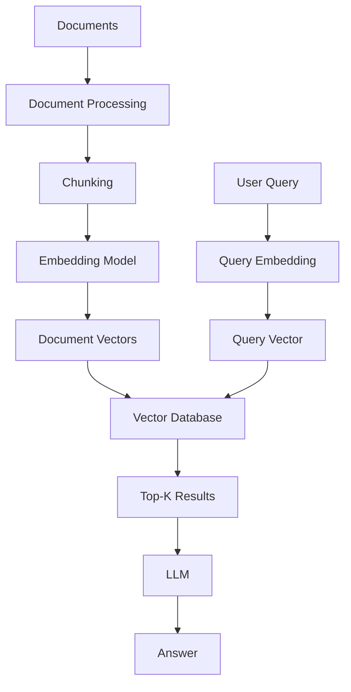

Embeddings therefore sit between:

```text
Raw Information
```

and:

```text
Semantic Retrieval
```

---

# 12. Document Embeddings

A document should generally be processed into manageable chunks before embedding.

Example:

```text
Large Document
      ↓
Document Processing
      ↓
Chunk 1
Chunk 2
Chunk 3
...
Chunk N
      ↓
Embedding Model
      ↓
Vector 1
Vector 2
Vector 3
...
Vector N
```

This allows retrieval at a useful level of granularity.

Detailed chunking strategies are covered in:

**12 — Document Chunking Strategies**

---

# 13. Query Embeddings

At search time, the user query is embedded using the appropriate embedding model.

Example:

```text
User:

"What is the annual leave policy?"

        ↓

Embedding Model

        ↓

Query Vector
```

The query vector is compared against stored document vectors.

---

# 14. Query and Document Embeddings

A common architecture is:

```text
Document
    ↓
Document Embedding
    ↓
Vector Database

Query
    ↓
Query Embedding
    ↓
Similarity Search
```

The document and query representations need to be compatible for meaningful similarity comparison.

---

# 15. Same Embedding Space

For many semantic retrieval systems:

```text
Document Encoder
       ↓
Document Vector

Query Encoder
       ↓
Query Vector
```

Both representations need to live in a compatible vector space.

This is why changing the embedding model can require re-embedding the existing corpus.

---

# 16. Embedding Model Consistency

Suppose documents were embedded using:

```text
Embedding Model A
```

and queries are embedded using:

```text
Embedding Model B
```

The vectors may not be compatible.

Therefore:

```text
Indexing Model
        =
Query Model
```

unless the embedding system explicitly supports a compatible architecture.

---

# 17. Embedding Model Migration

Changing embedding models is not simply:

```text
Change configuration
```

It often requires:

```text
Existing Documents
        ↓
Re-chunk if necessary
        ↓
New Embedding Model
        ↓
Re-embed
        ↓
New Vector Index
        ↓
Evaluation
        ↓
Cutover
```

This is an important production consideration.

---

# 18. Similarity Search

Once vectors are available, the system needs a way to determine which vectors are most similar.

Common similarity measures include:

```text
Cosine Similarity
Dot Product
Euclidean Distance
```

Different vector databases and embedding models may use different metrics.

---

# 19. Cosine Similarity

Cosine similarity measures the angle between two vectors.

For vectors:

```text
A
B
```

the conceptual formula is:

```text
similarity(A, B)
=
(A · B) / (||A|| ||B||)
```

The important idea is that cosine similarity focuses on the orientation of vectors rather than simply their magnitude.

---

# 20. Cosine Similarity Visualization

```text
             B
            ↗
           /
          /
         / θ
        /
       ●────────────→ A
```

A smaller angle generally indicates greater similarity.

For normalized vectors, cosine similarity and dot product become closely related.

---

# 21. Dot Product

The dot product is:

```text
A · B
```

For vectors:

```text
A = [a1, a2, ..., an]

B = [b1, b2, ..., bn]
```

the dot product is:

```text
a1b1 + a2b2 + ... + anbn
```

Some embedding systems normalize vectors, making dot-product similarity particularly convenient.

---

# 22. Euclidean Distance

Euclidean distance measures straight-line distance between vectors.

For two vectors:

```text
A = [a1, a2]
B = [b1, b2]
```

the distance is:

```text
sqrt(
    (a1 - b1)^2 +
    (a2 - b2)^2
)
```

Smaller distance generally means greater proximity.

---

# 23. Similarity Metrics Comparison

| Metric | Measures | Typical Interpretation |
|---|---|---|
| Cosine Similarity | Vector angle | Higher = more similar |
| Dot Product | Vector alignment + magnitude | Higher = more similar |
| Euclidean Distance | Geometric distance | Lower = more similar |

The correct metric depends on the embedding model and retrieval architecture.

---

# 24. Normalization

An embedding vector can be normalized so that its magnitude becomes approximately 1.

For vector:

```text
v
```

normalized representation:

```text
v / ||v||
```

Normalization can make similarity calculations more predictable.

However, whether normalization should be performed depends on the embedding model and its documented retrieval setup.

---

# 25. Why Similarity Metric Matters

Suppose the application uses:

```text
Cosine Similarity
```

during evaluation but:

```text
Euclidean Distance
```

in production.

The ranking behavior may differ.

Therefore:

```text
Embedding Model
+
Normalization
+
Similarity Metric
+
Index Configuration
```

should be treated as one retrieval configuration.

---

# 26. Top-K Retrieval

A typical semantic search request asks for the top `K` nearest vectors.

Example:

```text
Query
 ↓
Embedding
 ↓
Similarity Search
 ↓
Top 5 Results
```

If:

```text
K = 5
```

the system returns the five highest-ranked candidates according to the selected similarity metric.

---

# 27. Top-K Architecture


Top-K selection is one of the simplest retrieval strategies.

More advanced retrieval techniques are covered later in Part IV and Part V.

---

# 28. Semantic Search Example

Suppose the knowledge base contains:

```text
Document A:
How to reset your password

Document B:
Annual leave policy

Document C:
Recovering access to your account

Document D:
Office cafeteria timings
```

Query:

```text
How can I regain access to my account?
```

A keyword search may prioritize:

```text
Document A
```

A semantic search system may retrieve:

```text
Document A
Document C
```

because:

```text
reset password
```

and:

```text
regain access
```

are semantically related.

---

# 29. Embeddings Enable Semantic Search

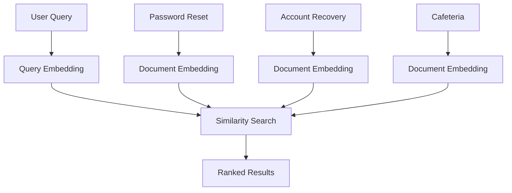

---

# 30. Keyword Search vs Semantic Search

| Feature | Keyword Search | Semantic Search |
|---|---|---|
| Exact words | Strong | Not required |
| Synonyms | Limited | Stronger |
| Meaning | Limited | Stronger |
| Vector database | Not required | Usually |
| Embeddings | No | Yes |
| Exact identifiers | Often strong | May need additional handling |
| Hybrid approach | Possible | Possible |

Semantic search does not replace keyword search in every enterprise workload.

---

# 31. Hybrid Search

Enterprise retrieval often benefits from combining:

```text
Keyword Search
+
Semantic Search
```

For example:

```text
Query:
"ORD-1001 payment failure"
```

Keyword search is useful for:

```text
ORD-1001
```

while semantic search can identify:

```text
payment failure
transaction declined
payment processing issue
```

This is one reason hybrid retrieval is important.

---

# 32. Embeddings and Metadata

Vectors should normally be stored together with metadata.

Example:

```json
{
  "id": "chunk-1001",
  "vector": [0.12, -0.42, 0.81],
  "metadata": {
    "document_id": "leave-policy",
    "department": "HR",
    "country": "IN",
    "page": 12
  }
}
```

The vector enables semantic retrieval.

Metadata enables filtering and traceability.

---

# 33. Vector + Metadata Architecture

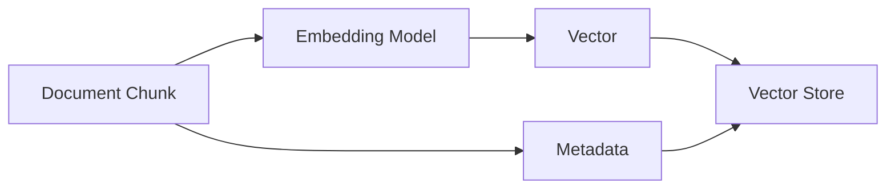

The embedding should not be expected to represent every retrieval constraint.

Metadata handles explicit attributes.

---

# 34. Embedding Metadata Separately

Avoid stuffing important filtering information only into text.

For example:

```text
Country = Germany
Department = HR
Document Type = Policy
```

should often be stored as structured metadata.

Then the system can perform:

```text
Semantic Similarity
+
Metadata Filter
```

---

# 35. Metadata Filtering

Example query:

```text
"What is the leave policy?"
```

with filter:

```text
country = "IN"
department = "HR"
```

The vector search operates within the permitted candidate set.

Conceptually:

```text
Query
 ↓
Metadata Filter
 ↓
Candidate Documents
 ↓
Vector Similarity
 ↓
Top-K
```

---

# 36. Embedding Storage

A production vector record may look like:

```json
{
  "id": "doc-001-chunk-05",
  "embedding": [0.12, -0.34, 0.71],
  "text": "Employees receive...",
  "metadata": {
    "document_id": "doc-001",
    "chunk_index": 5,
    "page": 12
  }
}
```

This allows the retrieval layer to return:

```text
Text
+
Metadata
+
Similarity Score
```

---

# 37. Embeddings and Vector Databases

A vector database provides infrastructure for:

```text
Store vectors
Index vectors
Search vectors
Filter metadata
Return nearest neighbors
```

Examples include:

```text
FAISS
Chroma
pgvector
Milvus
Qdrant
Weaviate
Pinecone
OpenSearch
Elasticsearch
```

The choice depends on:

```text
Scale
Deployment Model
Cloud Environment
Filtering Requirements
Operational Model
Latency
Cost
Existing Infrastructure
```

Detailed vector database concepts are covered in:

**13 — Vector Database Fundamentals**

---

# 38. Embedding Pipeline

A typical indexing pipeline:

```text
Source Documents
       ↓
Document Loader
       ↓
Text Extraction
       ↓
Cleaning
       ↓
Chunking
       ↓
Embedding
       ↓
Vector + Metadata
       ↓
Vector Database
```

This is the foundation of semantic retrieval.

---

# 39. Embedding Pipeline Diagram

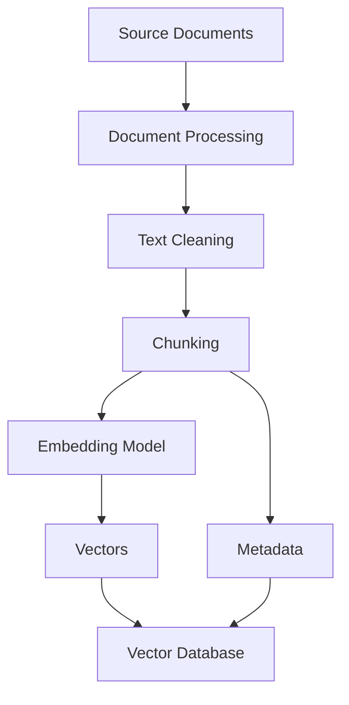

---

# 40. Query Pipeline

At runtime:

```text
User Query
      ↓
Query Validation
      ↓
Query Embedding
      ↓
Vector Search
      ↓
Metadata Filtering
      ↓
Top-K Results
```

The retrieved chunks may then be passed to:

```text
RAG Prompt
```

and ultimately:

```text
LLM
```

---

# 41. Query Pipeline Diagram


---

# 42. Embedding API Concept

A typical embedding API conceptually looks like:

```python
embedding = embedding_model.embed(
    "How do I reset my password?"
)

print(len(embedding))
```

The output is a vector:

```python
[
    0.12,
   -0.31,
    0.72,
    ...
]
```

The exact API differs by provider.

---

# 43. Sentence Transformers Example

A common open-source approach uses Sentence Transformers.

```python
from sentence_transformers import SentenceTransformer

model = SentenceTransformer(
    "sentence-transformers/all-MiniLM-L6-v2"
)

texts = [
    "How do I reset my password?",
    "How can I recover my account?"
]

embeddings = model.encode(texts)

print(embeddings.shape)
```

The model converts each text into a vector representation.

For production systems, select the embedding model based on:

```text
Language Requirements
Domain
Retrieval Quality
Latency
Memory
Cost
Deployment Constraints
```

rather than choosing a model solely because it is popular.

---

# 44. Embedding a Single Text

```python
text = "How do I reset my password?"

vector = model.encode(
    text,
    normalize_embeddings=True
)

print(vector)
```

Normalization is optional and should match the intended similarity strategy.

---

# 45. Embedding Multiple Documents

```python
documents = [
    "Password reset instructions",
    "Annual leave policy",
    "Employee reimbursement policy"
]

vectors = model.encode(
    documents,
    normalize_embeddings=True
)
```

Each document receives one vector.

```text
Document 1 → Vector 1
Document 2 → Vector 2
Document 3 → Vector 3
```

---

# 46. Query-to-Document Similarity

A simple example:

```python
from sentence_transformers import util

query = "How can I recover my account?"

query_vector = model.encode(
    query,
    normalize_embeddings=True
)

document_vectors = model.encode(
    documents,
    normalize_embeddings=True
)

scores = util.cos_sim(
    query_vector,
    document_vectors
)

print(scores)
```

The scores can be used to rank candidate documents.

---

# 47. Ranking Results

```python
scores = scores[0]

ranked = sorted(
    zip(documents, scores.tolist()),
    key=lambda item: item[1],
    reverse=True
)

for document, score in ranked:
    print(score, document)
```

This illustrates the basic semantic-search mechanism.

Production vector databases use optimized indexing structures rather than computing similarity against every vector manually.

---

# 48. Brute-Force Search

For a small dataset:

```text
Query
 ↓
Compare with every vector
 ↓
Calculate similarity
 ↓
Sort
 ↓
Top-K
```

Complexity grows with the number of vectors.

For large datasets, this becomes expensive.

---

# 49. Approximate Nearest Neighbor Search

Large vector systems commonly use **Approximate Nearest Neighbor (ANN)** indexing.

Instead of comparing the query with every vector:

```text
Query
 ↓
ANN Index
 ↓
Candidate Vectors
 ↓
Similarity Ranking
 ↓
Top-K
```

This improves search performance at large scale.

---

# 50. ANN Architecture


ANN is an infrastructure-level optimization.

Detailed retrieval optimization is covered later.

---

# 51. Embedding Batches

When embedding many documents, process them in batches.

Instead of:

```python
for document in documents:
    embed(document)
```

a model may support:

```python
embeddings = model.encode(
    documents,
    batch_size=32
)
```

Batching can improve throughput.

The optimal batch size depends on:

```text
Model
Hardware
Sequence Length
Memory
Concurrency
```

---

# 52. Batch Embedding Pipeline


For large ingestion pipelines, batching is a basic but important performance optimization.

---

# 53. Long Documents

Embedding models have input limits.

A very long document should not simply be passed as one huge string.

Prefer:

```text
Long Document
 ↓
Chunking
 ↓
Chunk Embeddings
```

This also improves retrieval granularity.

---

# 54. Embedding and Chunk Size

Chunk size affects:

```text
Embedding Quality
Retrieval Precision
Context Size
Storage
Latency
```

Very small chunks may lose context.

Very large chunks may contain multiple unrelated concepts.

There is no universally optimal chunk size.

It should be evaluated against the target corpus and retrieval task.

---

# 55. Embedding Quality Depends on Input Quality

Garbage in:

```text
Broken extraction
Duplicate text
Navigation menus
Headers
Footers
OCR noise
```

can produce poor embeddings.

Therefore:

```text
Document Processing
        ↓
Embedding Quality
        ↓
Retrieval Quality
```

Embedding quality is not isolated from upstream data quality.

---

# 56. Document Cleaning

Before embedding, consider removing or normalizing:

```text
Repeated Headers
Repeated Footers
Navigation Text
Unwanted HTML
Formatting Noise
Duplicate Content
OCR Artifacts
```

But do not remove information that may be important for retrieval.

---

# 57. Embedding and Document Structure

Metadata and structural information can improve retrieval.

For example:

```json
{
  "document": "employee-policy.pdf",
  "section": "Annual Leave",
  "page": 12,
  "chunk": 5
}
```

The text can be embedded while the structural information remains metadata.

---

# 58. Embedding and Hierarchical Documents

Consider:

```text
Employee Handbook
 ├── Leave
 │    ├── Annual Leave
 │    └── Sick Leave
 ├── Benefits
 └── Compensation
```

The embedding represents the chunk content.

Metadata can preserve:

```text
document
section
subsection
page
```

This can support better retrieval and filtering.

---

# 59. Embeddings for Questions

Embeddings are useful for question matching.

Example:

```text
Question A:
How can I reset my password?

Question B:
What are the steps to recover my account?
```

Semantic similarity can identify them as related.

Potential use cases:

```text
FAQ Matching
Duplicate Question Detection
Support Ticket Routing
Knowledge Base Search
```

---

# 60. Embeddings for Recommendations

Products can also be represented as vectors.

```text
Product
 ↓
Embedding Model
 ↓
Product Vector
```

A user preference can also be represented:

```text
User Interests
 ↓
Embedding
 ↓
User Vector
```

The system can compare vectors to identify related products or content.

---

# 61. Recommendation Architecture

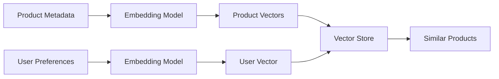

The exact recommendation architecture depends on the business problem and evaluation requirements.

---

# 62. Embeddings for Duplicate Detection

Suppose two support tickets are:

```text
"Payment failed for my order."

and:

"Unable to complete payment for my purchase."
```

Their embeddings may be close.

A system can use similarity thresholds to identify potential duplicates.

```text
Ticket A
   ↓
Embedding
   ↓
Similarity Search
   ↓
Existing Tickets
```

---

# 63. Similarity Thresholds

Suppose the system returns:

```text
Score = 0.91
```

The application may decide that the result is sufficiently similar.

But thresholds should not be chosen arbitrarily.

They should be evaluated using representative data.

For example:

```text
Relevant Pairs
vs
Non-Relevant Pairs
```

can be used to determine a suitable operating threshold.

---

# 64. Embedding Evaluation

Embedding quality should be evaluated through the downstream task.

Possible metrics include:

```text
Recall@K
Precision@K
MRR
NDCG
Hit Rate
Duplicate Detection Accuracy
Classification Accuracy
```

For RAG, retrieval evaluation should be connected to answer quality.

---

# 65. Retrieval Evaluation Flow

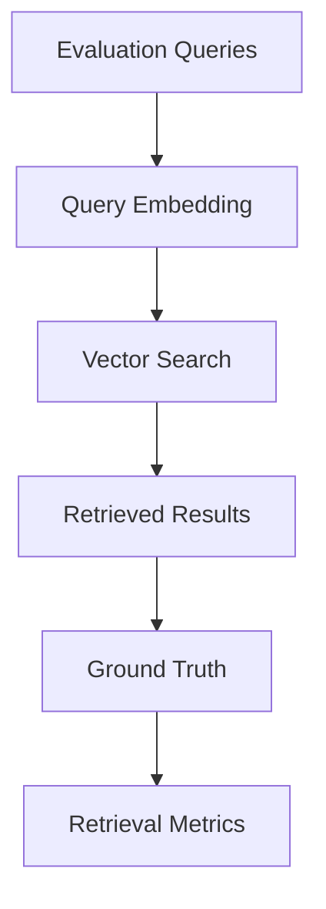

A strong embedding model is one that performs well for the target task, not merely one with a large embedding dimension.

---

# 66. Domain-Specific Embeddings

Generic embedding models may perform well across broad datasets.

However, enterprise domains may contain:

```text
Finance Terminology
Medical Terminology
Legal Language
Telecom Terminology
Internal Product Names
Technical Documentation
```

A domain-specific model may perform better.

The correct choice should be validated empirically.

---

# 67. Multilingual Embeddings

Enterprise systems may support multiple languages:

```text
English
German
Hindi
French
Spanish
Japanese
...
```

A multilingual embedding model can map multiple languages into a compatible semantic space.

For example:

```text
"What is the leave policy?"

        ≈

"Wie lautet die Urlaubsregelung?"
```

The exact quality depends on the chosen model.

---

# 68. Cross-Lingual Retrieval

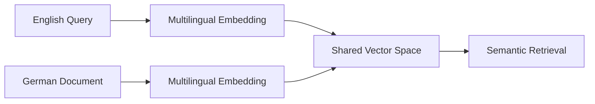

This can support cross-language enterprise search.

---

# 69. Code Embeddings

Embeddings can also represent source code.

For example:

```java
public User findUser(String id) {
    return repository.findById(id);
}
```

can be represented as a vector.

Potential use cases:

```text
Code Search
Duplicate Code Detection
Repository Search
API Discovery
Code Recommendation
Documentation Matching
```

Code-specific embedding models may be appropriate for specialized workloads.

---

# 70. Image Embeddings

Images can also be converted into vectors.

```text
Image
 ↓
Vision Embedding Model
 ↓
Image Vector
```

Potential use cases:

```text
Image Search
Similarity Search
Product Matching
Visual Recommendations
Document Images
Multimodal Retrieval
```

The exact embedding architecture depends on the modality and model.

---

# 71. Multimodal Embeddings

Some models can place different modalities into a shared embedding space.

Conceptually:

```text
Text ───────┐
            │
Image ──────┼──→ Shared Vector Space
            │
Code ───────┘
```

This can enable:

```text
Text → Image Search
Image → Text Search
Text → Multimodal Retrieval
```

Multimodal AI is explored further in later modules.

---

# 72. Embeddings Are Not Storage

An embedding is:

```text
Representation
```

not:

```text
Complete Original Data
```

For retrieval systems, store:

```text
Vector
+
Original Text / Chunk Reference
+
Metadata
```

Do not assume the vector can reconstruct the original document.

---

# 73. Embedding Storage Pattern

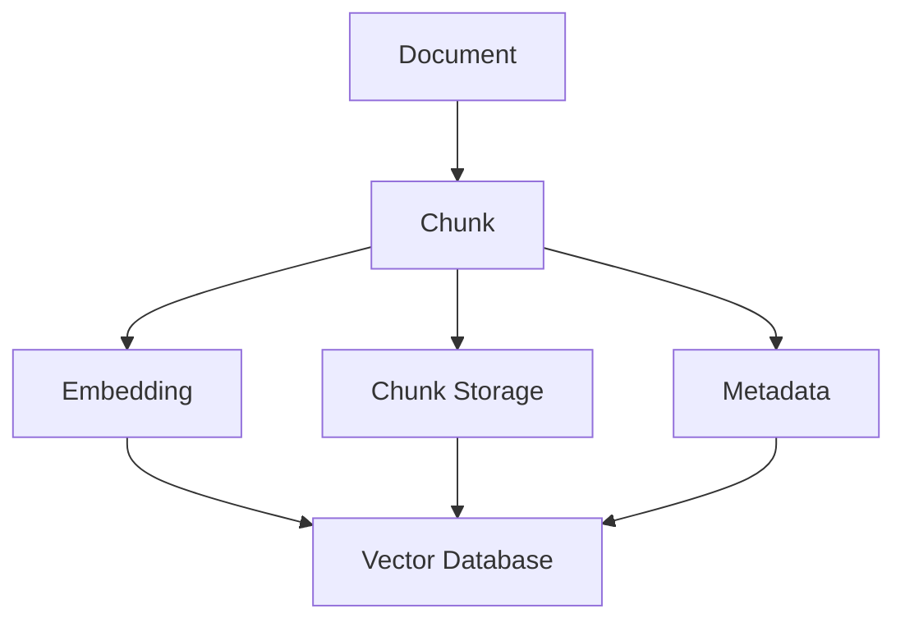

Depending on architecture, the original chunk may be stored directly or referenced through another document store.

---

# 74. Vector ID

Every embedding record should have a stable identifier.

Example:

```text
document-123:chunk-007
```

This allows the system to map:

```text
Vector
 ↓
Chunk
 ↓
Document
```

and support:

```text
Citation
Deletion
Updates
Re-indexing
Debugging
```

---

# 75. Document Versioning

If a document changes:

```text
Version 1
 ↓
New Content
 ↓
Version 2
```

the corresponding embeddings may need to be regenerated.

A production record may contain:

```json
{
  "document_id": "policy-001",
  "version": "v3",
  "chunk_id": "chunk-07"
}
```

This supports controlled re-indexing.

---

# 76. Incremental Embedding Updates

Do not necessarily re-embed the entire corpus for every document change.

A production ingestion system can identify:

```text
New Documents
Modified Documents
Deleted Documents
Unchanged Documents
```

Then:

```text
New
 → Embed

Modified
 → Re-embed

Deleted
 → Remove

Unchanged
 → Skip
```

---

# 77. Incremental Indexing Architecture

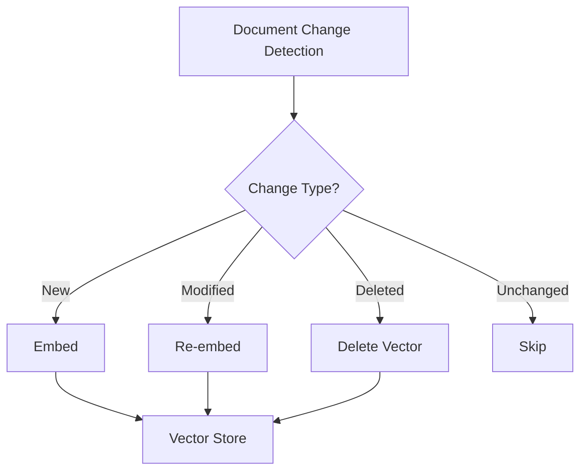

This can significantly reduce ingestion cost.

---

# 78. Embedding Cache

Embedding generation can be expensive at scale.

A cache can map:

```text
Content Hash
      ↓
Embedding
```

If the same content appears again:

```text
Hash Match
 ↓
Reuse Existing Embedding
```

Example:

```python
import hashlib


def content_hash(text: str) -> str:
    return hashlib.sha256(
        text.encode("utf-8")
    ).hexdigest()
```

The hash can be used as a cache key.

---

# 79. Embedding Cache Architecture

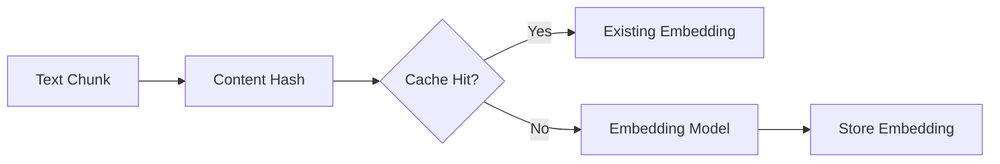

Caching is particularly useful when ingestion pipelines repeatedly process unchanged content.

---

# 80. Embedding Cost

Embedding cost depends on:

```text
Number of Documents
+
Number of Chunks
+
Input Tokens
+
Embedding Model
+
Infrastructure
```

For a corpus:

```text
1,000,000 chunks
```

even a small per-chunk cost can become significant.

Therefore:

```text
Chunking Strategy
+
Deduplication
+
Incremental Indexing
+
Caching
```

matter economically.

---

# 81. Embedding Latency

Embedding latency depends on:

```text
Model
Hardware
Batch Size
Sequence Length
Network
Concurrency
```

For online search:

```text
User Query
 ↓
Embedding
 ↓
Search
```

query embedding latency contributes directly to user-facing latency.

For offline ingestion:

```text
Documents
 ↓
Batch Embedding
```

throughput is often more important than single-request latency.

---

# 82. Online vs Offline Embedding

### Offline

```text
Documents
 ↓
Batch Embedding
 ↓
Vector Store
```

Primary concern:

```text
Throughput
Cost
Reliability
```

### Online

```text
User Query
 ↓
Embedding
 ↓
Search
```

Primary concern:

```text
Latency
Availability
Scalability
```

---

# 83. Embedding Service Architecture

For enterprise systems, embeddings may be exposed as a platform capability:

```text
EmbeddingProvider
```

with implementations:

```text
OpenAIEmbeddingProvider
HuggingFaceEmbeddingProvider
AzureEmbeddingProvider
VertexEmbeddingProvider
WatsonxEmbeddingProvider
```

The application depends on the capability rather than a specific provider.

---

# 84. Embedding Provider Interface

A Java-oriented capability interface might look like:

```java
public interface EmbeddingProvider {

    List<Float> embed(String text);

    List<List<Float>> embedBatch(
        List<String> texts
    );
}
```

The application does not need to know which provider generated the vector.

---

# 85. Provider Adapter Architecture

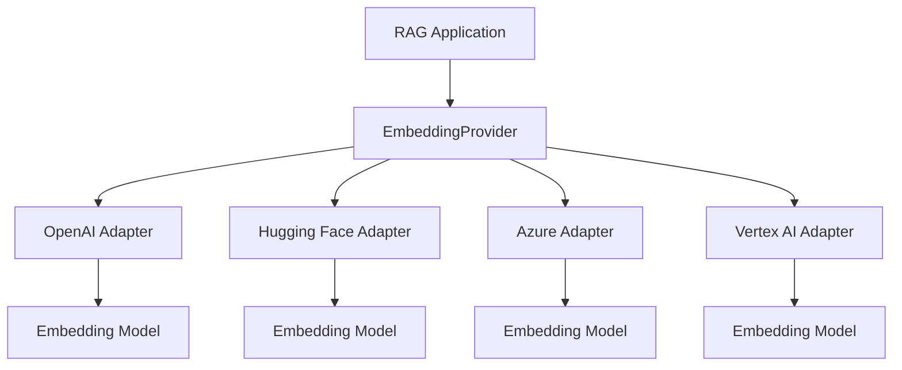

This follows the same capability-based architecture used elsewhere in enterprise AI systems.

---

# 86. Embedding Model Configuration

A production configuration may include:

```yaml
embedding:
  provider: huggingface
  model: sentence-transformers/all-MiniLM-L6-v2
  dimension: 384
  normalize: true
  batch-size: 32
```

The exact configuration depends on the chosen provider and model.

---

# 87. Configuration Consistency

The following should be treated as one configuration unit:

```text
Embedding Provider
Embedding Model
Dimension
Normalization
Similarity Metric
Vector Index
```

Changing one component may require changes elsewhere.

---

# 88. Embedding Model Registry

An enterprise AI platform may maintain:

```text
Embedding Model Registry
 ├── Model Name
 ├── Provider
 ├── Dimension
 ├── Languages
 ├── Version
 ├── Similarity Metric
 ├── Evaluation Results
 └── Status
```

This helps manage multiple embedding models safely.

---

# 89. Model Versioning

Embedding models evolve.

For example:

```text
embedding-model-v1
embedding-model-v2
```

A model upgrade may change:

```text
Vector Dimensions
Similarity Behavior
Retrieval Ranking
Quality
Latency
Cost
```

Therefore model upgrades should go through evaluation.

---

# 90. Blue-Green Embedding Migration

A safe migration can use:

```text
Existing Index
      ↓
Model V1

New Index
      ↓
Model V2
```

Run evaluation:

```text
V1 Retrieval Quality
vs
V2 Retrieval Quality
```

Then switch traffic after validation.

---

# 91. Embedding Migration Architecture

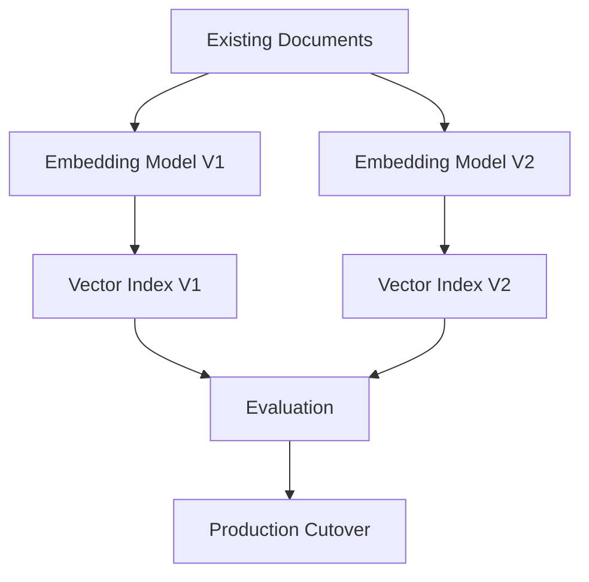

This avoids silently degrading retrieval quality.

---

# 92. Embeddings and Retrieval Quality

A high-quality embedding model does not guarantee high-quality RAG.

Retrieval quality depends on:

```text
Document Quality
+
Chunking
+
Embedding Model
+
Similarity Metric
+
Metadata
+
Filters
+
Top-K
+
Reranking
```

Therefore embedding selection is one component of a larger retrieval architecture.

---

# 93. Embeddings and Chunking Interaction

Consider two chunking strategies:

```text
Strategy A:
Very small chunks

Strategy B:
Large chunks
```

Even with the same embedding model, retrieval results can differ significantly.

Therefore evaluate:

```text
Embedding Model
+
Chunking Strategy
```

together.

---

# 94. Embeddings and Query Rewriting

A query may be poorly phrased:

```text
leave thing?
```

A query transformation step might produce:

```text
"What is the company's annual employee leave policy?"
```

The improved query can then be embedded.

This is a retrieval optimization pattern.

Detailed query transformation techniques appear later in the retrieval chapters.

---

# 95. Embeddings and Multi-Query Retrieval

One question can produce multiple search queries:

```text
Original Query
       ↓
Query 1
Query 2
Query 3
       ↓
Embeddings
       ↓
Multiple Searches
       ↓
Combined Results
```

This can improve recall for complex questions.

It belongs to the advanced retrieval layer rather than basic embedding generation.

---

# 96. Embeddings and Re-ranking

A basic vector search may retrieve:

```text
Top 20 candidates
```

A reranker can then reorder them:

```text
20 candidates
 ↓
Reranker
 ↓
Top 5
```

The embedding model is therefore often responsible for:

```text
Candidate Retrieval
```

while another model may handle:

```text
Fine-grained Ranking
```

Advanced reranking is covered later in the handbook.

---

# 97. Embeddings and Hybrid Retrieval

A production retrieval system may combine:

```text
BM25 / Keyword Search
+
Dense Embeddings
+
Metadata Filters
+
Reranking
```

This provides multiple retrieval signals.

Embeddings are therefore not necessarily the only search mechanism.

---

# 98. Dense vs Sparse Representations

Embeddings generally provide **dense representations**.

A sparse representation may have many zero values:

```text
[0, 0, 0, 1, 0, 0, 0, 1, ...]
```

Dense embeddings look more like:

```text
[0.12, -0.43, 0.71, 0.08, ...]
```

Dense and sparse retrieval can complement each other.

---

# 99. Dense Retrieval Architecture

```text
Query
 ↓
Dense Embedding
 ↓
Vector Search
 ↓
Documents
```

Sparse retrieval:

```text
Query
 ↓
Term-based Representation
 ↓
Keyword Search
 ↓
Documents
```

Hybrid retrieval combines both.

---

# 100. Embedding Quality Failure Modes

Poor retrieval may result from:

```text
Wrong embedding model
Wrong model for language
Wrong model for domain
Bad chunking
Poor document extraction
Incorrect normalization
Wrong similarity metric
Wrong vector dimension
Query/document mismatch
Stale embeddings
Duplicate documents
Poor metadata
```

Debugging should consider the entire pipeline.

---

# 101. Embedding Dimension Mismatch

Suppose the vector store expects:

```text
768 dimensions
```

but the new embedding model generates:

```text
1536 dimensions
```

The vectors cannot simply be inserted into the existing index.

The index needs to be compatible with the new dimension.

---

# 102. Dimension Validation

A simple application-side check:

```python
EXPECTED_DIMENSION = 768


def validate_embedding(vector):
    if len(vector) != EXPECTED_DIMENSION:
        raise ValueError(
            "Embedding dimension mismatch"
        )
```

Production systems should validate this at ingestion time.

---

# 103. Empty or Invalid Embeddings

The embedding service may fail or return unexpected output.

Validate:

```python
def validate_vector(vector):
    if not vector:
        raise ValueError("Empty embedding")

    if not all(
        isinstance(value, (int, float))
        for value in vector
    ):
        raise ValueError(
            "Invalid embedding values"
        )
```

Additional checks may include:

```text
Dimension
NaN
Infinity
Expected range
```

---

# 104. Embedding Data Quality Checks

An ingestion pipeline can validate:

```text
[✓] Text not empty
[✓] Chunk within size limits
[✓] Embedding generated
[✓] Correct dimension
[✓] No NaN values
[✓] No Infinity values
[✓] Metadata present
[✓] Document ID present
[✓] Version present
```

This prevents corrupt records from entering the vector index.

---

# 105. Embedding Observability

Useful production metrics include:

```text
Embedding Requests
Embedding Tokens
Embedding Latency
Embedding Throughput
Embedding Errors
Average Batch Size
Cache Hit Rate
Embedding Cost
Dimension Validation Failures
```

For RAG:

```text
Query Embedding Latency
```

should also be measured separately because it affects user-facing latency.

---

# 106. Embedding Monitoring Architecture

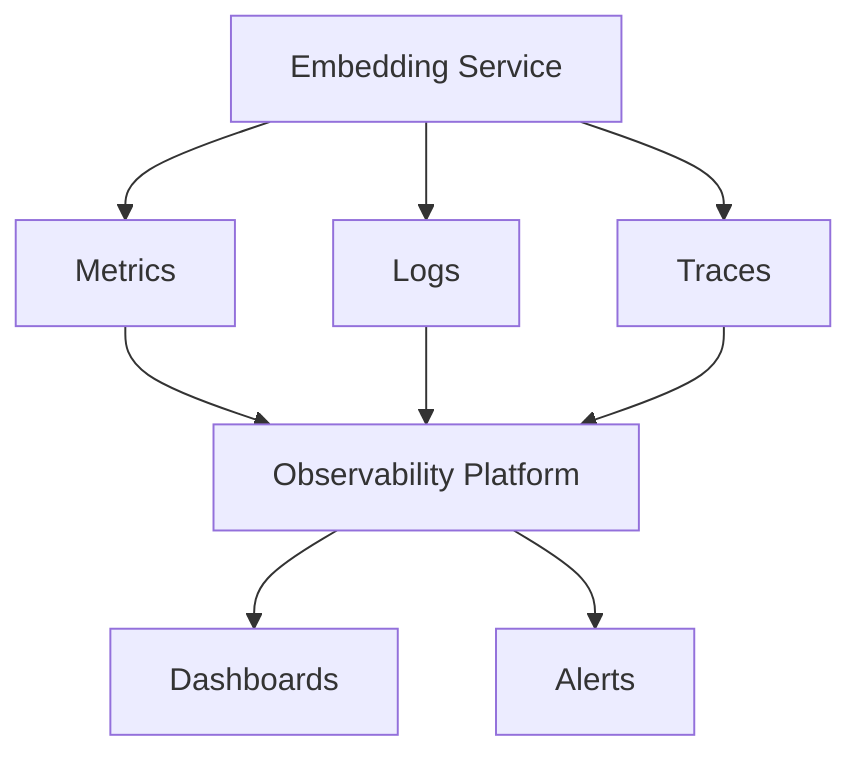

---

# 107. Embedding Security

Embeddings may contain information derived from sensitive content.

Do not automatically assume:

```text
Vector = harmless
```

Depending on the application, vectors may require:

```text
Access Controls
Encryption
Tenant Isolation
Retention Policies
Deletion
Auditability
```

---

# 108. Tenant Isolation

A multi-tenant vector database must prevent:

```text
Tenant A Query
        ↓
Tenant B Vectors
```

Metadata filters, separate namespaces, separate collections, or stronger isolation mechanisms may be used depending on requirements.

The exact architecture should be determined by the security model.

---

# 109. Embedding Deletion

When a document is deleted, associated vectors should also be removed.

```text
Document Deleted
      ↓
Identify Document ID
      ↓
Find Associated Chunks
      ↓
Delete Vectors
```

Otherwise stale content may remain retrievable.

---

# 110. Right-to-Delete Workflow

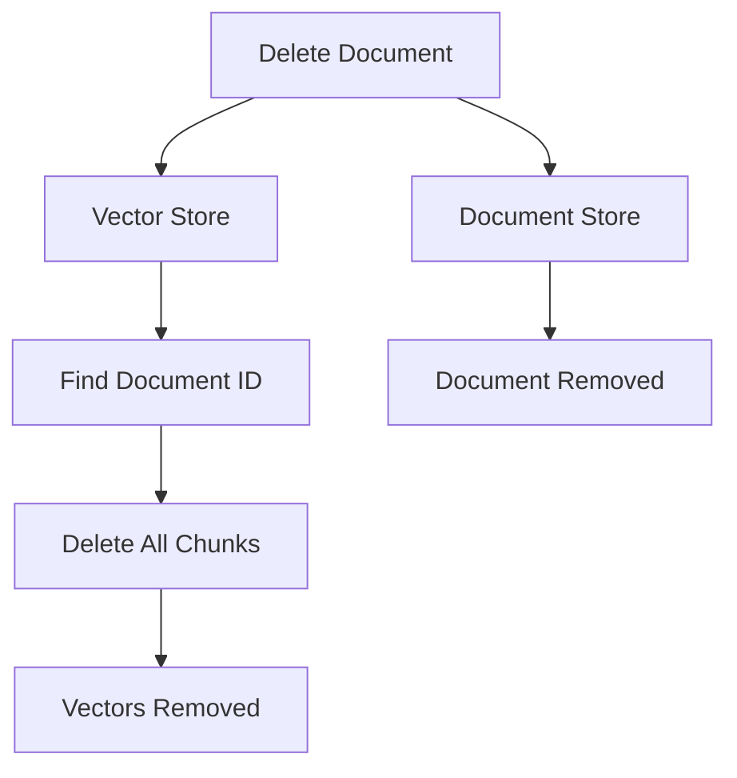

Deletion should be designed as part of the ingestion lifecycle rather than treated as an afterthought.

---

# 111. Stale Embeddings

A common production failure:

```text
Source Document Updated
        ↓
Vector Not Updated
        ↓
RAG Retrieves Old Content
```

Therefore:

```text
Document Version
+
Embedding Version
+
Index Update
```

should be tracked.

---

# 112. Freshness Architecture

```mermaid
flowchart LR
    A["Source Document"] --> B["Change Detection"]
    B --> C["Re-embedding"]
    C --> D["Vector Index"]

    D --> E["Fresh Retrieval"]
```

A production RAG system should define an acceptable freshness SLA.

---

# 113. Embeddings and Data Lineage

For enterprise systems, track:

```text
Source Document
 ↓
Document Version
 ↓
Chunk ID
 ↓
Embedding Model
 ↓
Embedding Version
 ↓
Vector Record
```

This makes retrieval behavior traceable.

---

# 114. Embedding Lineage

```mermaid
flowchart TD
    A["Source Document"] --> B["Document Version"]
    B --> C["Chunk"]
    C --> D["Embedding Model"]
    D --> E["Vector"]
    E --> F["Vector Index"]
```

This is valuable for:

```text
Debugging
Compliance
Reproducibility
Model Migration
Data Deletion
```

---

# 115. Reproducibility

A production embedding record should ideally make it possible to determine:

```text
Which model?
Which version?
Which input?
Which preprocessing?
Which normalization?
Which index?
```

This is especially important when retrieval quality changes after deployments.

---

# 116. Embeddings and Testing

Unit tests can validate:

```text
Dimension
Non-empty vector
Provider behavior
Batch behavior
Error handling
```

Integration tests can validate:

```text
Document
 ↓
Embedding
 ↓
Vector Store
 ↓
Search
```

Evaluation tests should validate:

```text
Retrieval Quality
```

---

# 117. Example Embedding Test

```python
def test_embedding_dimension():
    vector = model.encode(
        "Test document"
    )

    assert len(vector) == EXPECTED_DIMENSION
```

Another test:

```python
def test_embedding_not_empty():
    vector = model.encode(
        "Test document"
    )

    assert len(vector) > 0
```

---

# 118. Semantic Retrieval Test

```python
def test_semantic_similarity():
    query = "How do I recover my account?"

    documents = [
        "Password recovery instructions",
        "Office cafeteria timings"
    ]

    query_vector = model.encode(
        query,
        normalize_embeddings=True
    )

    document_vectors = model.encode(
        documents,
        normalize_embeddings=True
    )

    scores = util.cos_sim(
        query_vector,
        document_vectors
    )[0]

    assert scores[0] > scores[1]
```

This tests a basic semantic relationship.

Production evaluation should use a larger representative dataset.

---

# 119. Embedding Benchmarking

When choosing an embedding model, evaluate:

```text
Retrieval Quality
Latency
Throughput
Memory
Cost
Language Coverage
Domain Performance
Dimension
Deployment Complexity
```

Do not select based solely on:

```text
Embedding Dimension
```

or:

```text
Model Popularity
```

---

# 120. Model Selection Matrix

| Criterion | Questions |
|---|---|
| Quality | Does it retrieve relevant content? |
| Domain | Does it understand the target domain? |
| Language | Does it support required languages? |
| Latency | Is query embedding fast enough? |
| Throughput | Can ingestion scale? |
| Cost | Is the operating cost acceptable? |
| Dimension | Is vector storage manageable? |
| Deployment | Can it run within infrastructure constraints? |
| Versioning | Can the model be managed safely? |

---

# 121. Embedding Storage Cost

If each vector contains:

```text
D dimensions
```

and each value uses:

```text
B bytes
```

then raw vector storage is approximately:

```text
Number of vectors × D × B
```

For example, with:

```text
10 million vectors
1536 dimensions
4 bytes per float
```

the raw vector values alone require approximately:

```text
10,000,000 × 1536 × 4
=
61,440,000,000 bytes
```

or roughly:

```text
61.44 GB
```

before indexes, metadata, replication, and database overhead.

This demonstrates why embedding dimensionality affects infrastructure cost.

---

# 122. Embedding Storage Trade-off

Higher dimensionality can provide:

```text
Potentially richer representations
```

but also:

```text
More storage
More memory
More bandwidth
Potentially higher search cost
```

Therefore:

> **Higher dimension does not automatically mean better retrieval.**

Evaluate the complete system.

---

# 123. Quantization of Embeddings

Vector stores may support compressed or quantized representations.

Conceptually:

```text
Float32
 ↓
Compressed Representation
 ↓
Lower Memory / Storage
```

Potential benefits:

```text
Lower storage
Lower memory
Faster retrieval
```

Potential trade-off:

```text
Possible retrieval-quality degradation
```

This is an infrastructure optimization and should be evaluated empirically.

---

# 124. Embeddings and Quantization

Do not confuse:

```text
LLM Weight Quantization
```

with:

```text
Embedding Vector Compression
```

LLM quantization reduces the precision of model parameters.

Embedding/vector quantization reduces the representation size of stored vectors.

They solve different problems.

---

# 125. Embeddings in Production

A production embedding system typically contains:

```text
Embedding Provider
        ↓
Preprocessing
        ↓
Batching
        ↓
Embedding Generation
        ↓
Validation
        ↓
Metadata Enrichment
        ↓
Vector Storage
        ↓
Monitoring
```

For queries:

```text
Query
 ↓
Validation
 ↓
Embedding
 ↓
Similarity Search
 ↓
Filtering
 ↓
Ranking
```

---

# 126. Production Embedding Architecture

```mermaid
flowchart TD
    A["Document Source"] --> B["Document Processor"]
    B --> C["Chunking"]
    C --> D["Embedding Service"]

    D --> E["Vector Validation"]
    E --> F["Metadata Enrichment"]
    F --> G["Vector Database"]

    H["User Query"] --> I["Query Processor"]
    I --> D
    D --> J["Query Vector"]

    J --> G
    G --> K["Retrieved Chunks"]
    K --> L["RAG Pipeline"]
```

---

# 127. Embedding Service API

A platform-level service might expose:

```http
POST /embeddings
```

Request:

```json
{
  "model": "enterprise-embedding-v1",
  "inputs": [
    "How do I reset my password?"
  ]
}
```

Response:

```json
{
  "model": "enterprise-embedding-v1",
  "dimension": 768,
  "embeddings": [
    [0.12, -0.31, 0.71]
  ]
}
```

The actual API contract will vary by implementation.

---

# 128. Batch Embedding API

A batch endpoint can accept:

```json
{
  "model": "enterprise-embedding-v1",
  "inputs": [
    "Document chunk 1",
    "Document chunk 2",
    "Document chunk 3"
  ]
}
```

This reduces per-request overhead.

For large-scale ingestion, asynchronous batch processing may be more appropriate.

---

# 129. Embedding Service Resilience

The embedding layer should handle:

```text
Timeouts
Rate Limits
Provider Errors
Model Unavailability
Malformed Inputs
Oversized Inputs
Quota Exhaustion
```

Possible strategies:

```text
Retry
Backoff
Circuit Breaker
Fallback Provider
Queue
Dead-Letter Queue
```

Fallback providers require careful consideration because different embedding models may produce incompatible vector spaces.

---

# 130. Provider Fallback Warning

Do not blindly switch:

```text
Embedding Model A
```

to:

```text
Embedding Model B
```

for query-time fallback if the existing index was built with Model A and the vector spaces are incompatible.

A safer design may require:

```text
Provider A
 → Index A

Provider B
 → Index B
```

and controlled routing between them.

---

# 131. Embedding Provider Abstraction

A provider abstraction can expose:

```java
public interface EmbeddingProvider {

    EmbeddingResult embed(
        EmbeddingRequest request
    );

    BatchEmbeddingResult embedBatch(
        BatchEmbeddingRequest request
    );
}
```

The result can contain:

```text
Model
Dimension
Vectors
Usage
Metadata
```

This makes provider behavior observable.

---

# 132. Embedding Result Model

```java
public record EmbeddingResult(
    String model,
    int dimension,
    List<Float> vector
) {
}
```

For batch processing:

```java
public record BatchEmbeddingResult(
    String model,
    int dimension,
    List<List<Float>> vectors
) {
}
```

This provides an application-level contract.

---

# 133. Enterprise AI Embedding Capability

A larger architecture may contain:

```text
EmbeddingProvider
VectorStore
Retriever
Reranker
LLMProvider
```

The responsibilities remain separate.

```text
EmbeddingProvider
      ↓
Create vectors

VectorStore
      ↓
Store/search vectors

Retriever
      ↓
Apply retrieval strategy

Reranker
      ↓
Refine ranking
```

This separation becomes important in production RAG systems.

---

# 134. Embeddings vs Vector Database

These are different components.

### Embedding Model

Creates:

```text
Text → Vector
```

### Vector Database

Stores and searches:

```text
Vector → Similar Vectors
```

Architecture:

```text
Text
 ↓
Embedding Model
 ↓
Vector
 ↓
Vector Database
 ↓
Search
```

Do not treat the embedding model and vector database as interchangeable concepts.

---

# 135. Embeddings vs Retriever

Similarly:

### Embedding Model

Creates representations.

### Retriever

Defines how information is retrieved.

For example:

```text
Retriever
 ├── Vector Search
 ├── Hybrid Search
 ├── Metadata Filtering
 ├── Multi-Query
 └── Reranking
```

The embedding model is one component used by some retrievers.

---

# 136. End-to-End Retrieval Stack

```mermaid
flowchart TD
    A["Documents"] --> B["Chunking"]
    B --> C["Embedding Model"]
    C --> D["Vector Store"]

    E["Query"] --> F["Query Embedding"]
    F --> G["Retriever"]
    D --> G

    G --> H["Reranker / Filters"]
    H --> I["Context"]
    I --> J["LLM"]
```

This is the foundation for the next RAG chapters.

---

# 137. Production Workflow

A production embedding workflow should follow:

```text
1. Identify the source data.

2. Extract and clean the content.

3. Define chunking strategy.

4. Select an embedding model.

5. Evaluate the model on representative queries.

6. Define vector dimensionality.

7. Define similarity metric.

8. Define normalization strategy.

9. Generate embeddings.

10. Validate vector dimensions.

11. Validate vector values.

12. Attach metadata.

13. Store vectors.

14. Track document and model versions.

15. Monitor ingestion.

16. Generate query embeddings.

17. Execute similarity search.

18. Apply metadata filters.

19. Rank results.

20. Evaluate retrieval quality.

21. Monitor latency and cost.

22. Handle updates and deletions.

23. Plan model migrations.

24. Re-evaluate retrieval quality after changes.
```

---

# 138. Production Embedding Checklist

```text
[ ] Is the embedding model appropriate for the domain?

[ ] Does it support required languages?

[ ] Has retrieval quality been evaluated?

[ ] Is the model version recorded?

[ ] Is the vector dimension known?

[ ] Is the similarity metric defined?

[ ] Is normalization behavior documented?

[ ] Is chunking strategy defined?

[ ] Is document preprocessing validated?

[ ] Are empty inputs rejected?

[ ] Are embedding dimensions validated?

[ ] Are NaN / Infinity values rejected?

[ ] Is metadata stored?

[ ] Is document lineage tracked?

[ ] Are document versions tracked?

[ ] Are embedding model versions tracked?

[ ] Are stale embeddings detected?

[ ] Are document deletions propagated?

[ ] Is incremental indexing supported?

[ ] Is embedding caching considered?

[ ] Is batch processing supported?

[ ] Is query latency monitored?

[ ] Is ingestion throughput monitored?

[ ] Are embedding errors monitored?

[ ] Are costs monitored?

[ ] Is tenant isolation enforced?

[ ] Are vectors protected appropriately?

[ ] Is model migration planned?

[ ] Is retrieval quality continuously evaluated?
```

---

# 139. Common Mistakes

## 139.1 Choosing a Model Only by Dimension

```text
1536 dimensions
```

does not automatically mean better than:

```text
768 dimensions
```

Evaluate retrieval quality.

---

## 139.2 Mixing Embedding Models

Do not casually mix incompatible models between indexing and querying.

---

## 139.3 Ignoring Chunking

Embedding quality cannot compensate for fundamentally poor chunk boundaries.

---

## 139.4 Embedding Raw Documents Without Cleaning

Headers, footers, navigation, and OCR noise can reduce retrieval quality.

---

## 139.5 Ignoring Metadata

Semantic similarity cannot replace explicit metadata filtering.

---

## 139.6 Using Arbitrary Similarity Thresholds

Thresholds should be evaluated using representative data.

---

## 139.7 Re-embedding Everything

Use incremental processing when appropriate.

---

## 139.8 Ignoring Document Updates

Stale vectors can produce stale answers.

---

## 139.9 Ignoring Deletions

Deleted documents should no longer be retrievable.

---

## 139.10 Returning Only Vectors

Applications usually need:

```text
Vector
+
Text / Reference
+
Metadata
```

---

## 139.11 Treating Embeddings as Anonymous Numbers

Vectors have lineage:

```text
Source
Model
Version
Preprocessing
```

Track it.

---

## 139.12 Using a Different Query Model

The query and document embedding configuration must be compatible.

---

## 139.13 No Evaluation Dataset

Embedding model selection should be based on measurable retrieval performance.

---

# 140. Best Practices

```text
1. Treat embeddings as a platform capability.

2. Choose models based on the target retrieval task.

3. Evaluate on real enterprise queries.

4. Keep indexing and query embedding configurations compatible.

5. Track model versions.

6. Track vector dimensions.

7. Define the similarity metric explicitly.

8. Normalize only when appropriate.

9. Clean documents before embedding.

10. Use appropriate chunking.

11. Preserve metadata.

12. Track document lineage.

13. Support incremental indexing.

14. Support deletion.

15. Validate vectors.

16. Batch offline embedding workloads.

17. Optimize query embedding latency.

18. Cache repeated embeddings where appropriate.

19. Monitor embedding cost.

20. Monitor retrieval quality.

21. Consider hybrid retrieval for exact identifiers and semantic meaning.

22. Separate embedding generation from vector storage.

23. Separate vector storage from retrieval strategy.

24. Keep provider integrations behind capability interfaces.

25. Treat embedding-model migration as an indexed-data migration.

26. Protect vectors and metadata according to enterprise security requirements.

27. Evaluate model upgrades before production cutover.
```

---

# 141. Key Takeaways

- Embeddings convert information into numerical vector representations.
- Text embeddings are a foundational component of semantic search.
- Embeddings enable similarity-based retrieval.
- A query is converted into a vector before semantic search.
- Documents are typically chunked before embedding.
- Document and query embeddings must be compatible.
- Common similarity measures include:
  - Cosine similarity
  - Dot product
  - Euclidean distance
- Vector databases store and search embeddings efficiently.
- Metadata should normally accompany vectors.
- Semantic search is different from keyword search.
- Hybrid retrieval can combine both.
- Embedding quality depends on:
  - Model
  - Data quality
  - Chunking
  - Query quality
  - Similarity configuration
- Higher-dimensional embeddings are not automatically better.
- Embedding model changes may require rebuilding the vector index.
- Incremental indexing reduces unnecessary embedding work.
- Caching can reduce repeated embedding costs.
- Batch embedding improves ingestion throughput.
- Query embedding latency directly affects online search latency.
- Embeddings can be used for:
  - Semantic search
  - RAG
  - Recommendations
  - Duplicate detection
  - Question matching
  - Code search
  - Multilingual retrieval
  - Multimodal retrieval
- Embeddings are representations, not replacements for the original data.
- Production systems should maintain:
  - Model version
  - Document version
  - Chunk ID
  - Vector ID
  - Metadata
- Embeddings should be evaluated through downstream retrieval quality.
- Provider-specific embedding implementations should be isolated behind application-level interfaces.
- Embeddings are one component of a larger retrieval architecture.

The central production principle is:

> **An embedding model is not the retrieval system. It is the representation layer that enables semantic retrieval.**

---

# 142. Chapter Navigation

## Part IV — Prompt Engineering & RAG Fundamentals

**Previous Chapter:** [09. Function Calling & Tool Calling](09-function-calling-and-tool-calling.md)

**Current Chapter:** 10 — Embeddings in Practice

**Next Chapter:** [11. Document Processing & Vectorization](11-document-processing-and-vectorization.md)

### Part IV Chapters

1. [01. Introduction to Prompt Engineering](01-introduction-to-prompt-engineering.md)
2. [02. Prompt Engineering Fundamentals](02-prompt-engineering-fundamentals.md)
3. [03. Advanced Prompt Engineering](03-advanced-prompt-engineering.md)
4. [04. Prompt Design Patterns](04-prompt-design-patterns.md)
5. [05. Zero-shot, One-shot & Few-shot Prompting](05-zero-one-few-shot-prompting.md)
6. [06. Chain-of-Thought Prompting](06-chain-of-thought-prompting.md)
7. [07. ReAct Prompting](07-react-prompting.md)
8. [08. Structured Outputs & Output Parsing](08-structured-outputs-and-output-parsing.md)
9. [09. Function Calling & Tool Calling](09-function-calling-and-tool-calling.md)
10. **10. Embeddings in Practice**
11. [11. Document Processing & Vectorization](11-document-processing-and-vectorization.md)
12. [12. Document Chunking Strategies](12-document-chunking-strategies.md)
13. [13. Vector Database Fundamentals](13-vector-database-fundamentals.md)
14. [14. Similarity Search Techniques](14-similarity-search-techniques.md)
15. [15. RAG Pipeline Components](15-rag-pipeline-components.md)
16. [16. Retrieval & Generation Pipeline](16-retrieval-and-generation-pipeline.md)
17. [17. Vector Databases in RAG](17-vector-databases-in-rag.md)
18. [18. Building Your First RAG Pipeline](18-building-your-first-rag-pipeline.md)
19. [19. RAG Evaluation Fundamentals](19-rag-evaluation-fundamentals.md)
20. [20. Enterprise Generative AI Application Architecture](20-enterprise-generative-ai-application-architecture.md)
21. [21. Deploying AI Applications with Gradio](21-deploying-ai-applications-with-gradio.md)

---

# References

- Sentence Transformers Documentation
- Hugging Face — Sentence Transformers and Embedding Models
- FAISS Documentation
- Chroma Documentation
- pgvector Documentation
- Qdrant Documentation
- Weaviate Documentation
- Pinecone Documentation
- OpenAI — Embeddings Documentation
- Google — Embedding Documentation
- Azure AI — Embeddings Documentation
- AWS — Embedding Model Documentation
- JSON Schema — Data Representation
- scikit-learn — Similarity and Nearest Neighbor Documentation

---

> **Enterprise AI Engineering Handbook**  
> *Building Production-Grade Enterprise AI Systems — One Chapter at a Time.*