# 11 — Document Processing & Vectorization

> Learn how enterprise documents are ingested, extracted, cleaned, normalized, transformed into meaningful chunks, enriched with metadata, and converted into vectors for downstream semantic retrieval and RAG systems.

---

## 📖 Overview

Retrieval-Augmented Generation does not begin with an embedding model.

Before documents can be embedded and stored in a vector database, an enterprise AI system must first transform raw information into a clean, structured, searchable representation.

A typical document-processing pipeline looks like:

```text
Documents
    ↓
Ingestion
    ↓
Document Parsing
    ↓
Text Extraction
    ↓
Cleaning & Normalization
    ↓
Structure Detection
    ↓
Metadata Extraction
    ↓
Chunk Preparation
    ↓
Embedding / Vectorization
    ↓
Vector Store
```

This chapter focuses on the **document processing and vectorization layer** between raw enterprise data and semantic retrieval.

---

# 1. Why Document Processing Matters

Enterprise knowledge rarely arrives as clean plain text.

Real-world data can include:

```text
PDF
DOCX
PPTX
XLSX
HTML
Markdown
CSV
JSON
Emails
Scanned Documents
Images
Web Pages
Database Records
Source Code
Knowledge Base Articles
```

A production RAG system therefore needs to solve:

```text
How do we reliably transform heterogeneous enterprise data
into high-quality retrieval units?
```

Poor document processing can directly lead to poor retrieval.

```text
Poor Extraction
      ↓
Poor Chunks
      ↓
Poor Embeddings
      ↓
Poor Retrieval
      ↓
Poor Context
      ↓
Poor LLM Answer
```

Therefore:

> **Retrieval quality starts with data quality.**

---

# 2. Document Processing vs Vectorization

These are related but different stages.

### Document Processing

Transforms:

```text
Raw Document
```

into:

```text
Clean Structured Content
```

### Vectorization

Transforms:

```text
Text / Chunk
```

into:

```text
Embedding Vector
```

Architecture:

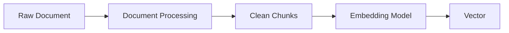

---

# 3. End-to-End Architecture

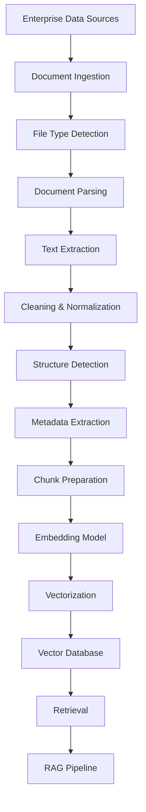

---

# 4. Enterprise Data Sources

A production ingestion system may receive content from:

```text
File Systems
Object Storage
SharePoint
Google Drive
Confluence
Websites
Databases
Email
Enterprise APIs
Document Management Systems
Knowledge Bases
Git Repositories
```

The ingestion layer should normalize these sources into a common internal representation.

---

# 5. Document Ingestion

Ingestion is responsible for bringing documents into the processing pipeline.

```text
Source
  ↓
Connector
  ↓
Document
  ↓
Processing Pipeline
```

Example:

```text
S3
 ↓
Document Ingestion Service
 ↓
PDF Processor
 ↓
Text Extraction
```

Another source:

```text
SharePoint
 ↓
Connector
 ↓
Document Ingestion Service
 ↓
DOCX Processor
```

---

# 6. Ingestion Architecture

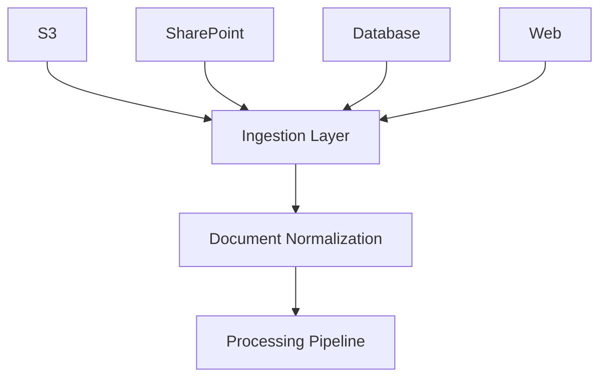

The ingestion layer should isolate source-specific logic from downstream document processing.

---

# 7. Document Type Detection

Before processing a document, identify its type.

For example:

```text
application/pdf
application/vnd.openxmlformats-officedocument.wordprocessingml.document
text/html
text/markdown
application/json
text/csv
```

The processing pipeline can then route the document to the appropriate parser.

---

# 8. Content-Type Routing

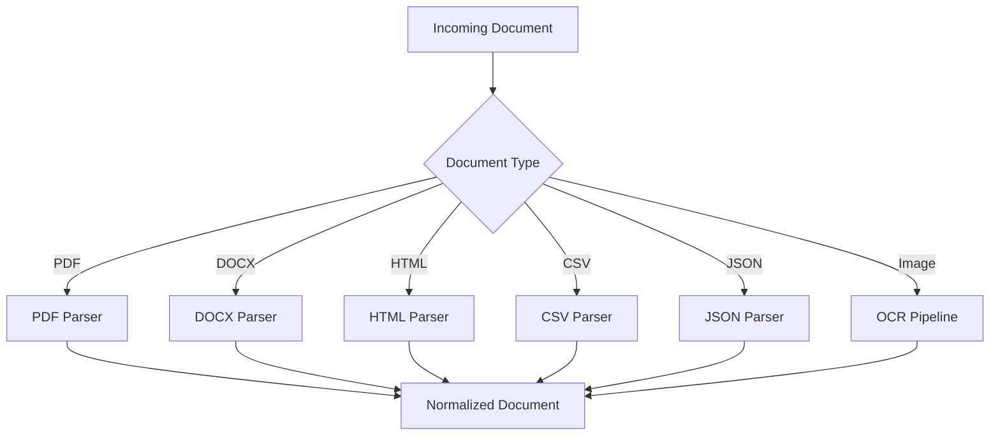

---

# 9. The Normalized Document Model

Instead of allowing every parser to return a different structure, define a common internal representation.

For example:

```python
from dataclasses import dataclass, field
from typing import Any


@dataclass
class Document:
    id: str
    content: str
    metadata: dict[str, Any] = field(default_factory=dict)
```

Every parser can then produce:

```text
Document
├── id
├── content
└── metadata
```

This makes downstream processing provider-independent.

---

# 10. Rich Document Representation

For more advanced systems, a document can preserve structural information:

```python
@dataclass
class DocumentElement:
    type: str
    content: str
    metadata: dict


@dataclass
class ProcessedDocument:
    id: str
    elements: list[DocumentElement]
    metadata: dict
```

Possible element types:

```text
title
heading
paragraph
table
list
image
code
footer
header
```

This is useful when document structure matters for retrieval.

---

# 11. Why Structure Matters

Consider:

```text
Annual Leave Policy

Eligibility

Employees who have completed...

Entitlement

Employees receive...

Carry Forward

Unused leave may...
```

Flattening everything into plain text may lose relationships between:

```text
Heading
↓
Section
↓
Paragraph
```

Preserving structure can improve downstream chunking and metadata.

---

# 12. PDF Processing

PDF files are particularly challenging because they can contain:

```text
Text
Tables
Images
Multiple Columns
Headers
Footers
Page Numbers
Scanned Pages
Charts
Forms
Annotations
```

A PDF that visually looks simple may have a complex internal representation.

---

# 13. PDF Text Extraction

Basic PDF processing:

```text
PDF
 ↓
PDF Parser
 ↓
Page Text
 ↓
Normalized Text
```

For example:

```python
import fitz

document = fitz.open("employee-handbook.pdf")

for page_number, page in enumerate(document):
    text = page.get_text()

    print(
        f"Page {page_number + 1}"
    )

    print(text)
```

This works well for text-based PDFs.

---

# 14. Scanned PDFs

A scanned PDF may contain images rather than machine-readable text.

```text
Scanned PDF
    ↓
Page Image
    ↓
OCR
    ↓
Extracted Text
    ↓
Cleaning
```

Therefore:

```text
PDF Parser
```

alone may not be enough.

---

# 15. OCR Pipeline

OCR stands for:

> Optical Character Recognition

A basic OCR workflow:

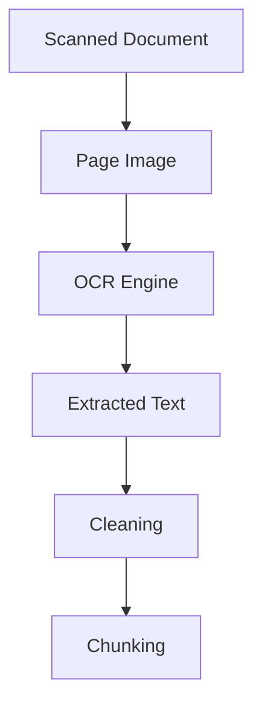

OCR quality can significantly influence retrieval quality.

---

# 16. OCR Failure Modes

OCR may introduce:

```text
Character Substitution
Missing Characters
Wrong Reading Order
Broken Words
Incorrect Tables
Header/Footer Noise
Formatting Loss
```

Example:

```text
Original:
Annual Leave: 25 days

OCR:
Annuai Leave: 25 day5
```

Therefore OCR output should be validated where accuracy is important.

---

# 17. DOCX Processing

DOCX files can contain:

```text
Paragraphs
Headings
Tables
Lists
Images
Headers
Footers
Links
Comments
```

A basic extraction pipeline:

```text
DOCX
 ↓
Parser
 ↓
Paragraphs + Tables
 ↓
Normalized Representation
```

Example:

```python
from docx import Document

doc = Document(
    "employee-handbook.docx"
)

paragraphs = [
    paragraph.text
    for paragraph in doc.paragraphs
    if paragraph.text.strip()
]

for paragraph in paragraphs:
    print(paragraph)
```

---

# 18. Processing Tables

Tables are important enterprise knowledge.

Example:

| Grade | Annual Leave |
|---|---:|
| G1 | 20 |
| G2 | 25 |
| G3 | 30 |

Simply extracting the visible text may produce:

```text
Grade Annual Leave G1 20 G2 25 G3 30
```

which loses structural relationships.

A better representation might be:

```text
Grade: G1
Annual Leave: 20 days

Grade: G2
Annual Leave: 25 days

Grade: G3
Annual Leave: 30 days
```

---

# 19. Table-Aware Processing

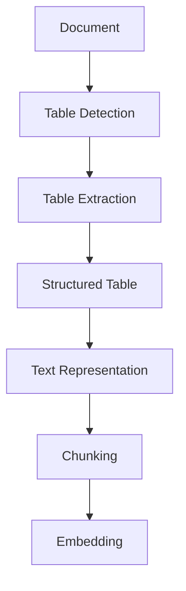

For table-heavy documents, table-aware extraction can significantly improve retrieval.

---

# 20. HTML Processing

HTML contains both useful and irrelevant content.

Example:

```html
<html>
    <body>
        <nav>...</nav>

        <main>
            <h1>Annual Leave Policy</h1>
            <p>Employees receive...</p>
        </main>

        <footer>...</footer>
    </body>
</html>
```

The retrieval pipeline usually wants:

```text
Annual Leave Policy
Employees receive...
```

rather than:

```text
Navigation
Advertisements
Footer Links
Cookie Banners
Tracking Content
```

---

# 21. HTML Cleaning

A basic approach:

```python
from bs4 import BeautifulSoup


def extract_text(html: str) -> str:
    soup = BeautifulSoup(
        html,
        "html.parser"
    )

    for element in soup(
        ["script", "style", "nav"]
    ):
        element.decompose()

    return soup.get_text(
        separator="\n",
        strip=True
    )
```

Production implementations should be more careful about preserving meaningful structure.

---

# 22. Markdown Processing

Markdown already contains useful structure:

```markdown
# Annual Leave

## Eligibility

Employees who...

## Entitlement

Employees receive...
```

The parser can preserve:

```text
Heading
Subheading
Paragraph
List
Code
Table
```

This makes Markdown particularly convenient for knowledge-base pipelines.

---

# 23. CSV Processing

CSV data should usually be treated differently from narrative documents.

Example:

```csv
employee_id,department,leave_days
101,Engineering,25
102,Finance,20
103,HR,30
```

Instead of blindly embedding raw CSV text, consider converting rows into structured text.

```text
Employee ID: 101
Department: Engineering
Leave Days: 25
```

This improves semantic interpretability.

---

# 24. JSON Processing

JSON contains explicit structure.

Example:

```json
{
  "product": "Payment Gateway",
  "region": "Europe",
  "status": "Active"
}
```

Possible normalized representation:

```text
Product: Payment Gateway
Region: Europe
Status: Active
```

For deeply nested JSON, flattening or selective transformation may be necessary.

---

# 25. Email Processing

Enterprise email can contain:

```text
From
To
CC
Subject
Timestamp
Body
Attachments
Quoted Replies
Signatures
```

The processing pipeline may need to remove:

```text
Repeated quoted messages
Email signatures
Legal disclaimers
Tracking content
```

while preserving:

```text
Subject
Relevant body
Important metadata
```

---

# 26. Web Content Processing

Web pages can contain:

```text
Navigation
Main Content
Sidebar
Advertisements
Cookie Notices
Footer
Related Links
```

A production web ingestion pipeline should identify the primary content.

```text
Web Page
 ↓
HTML Parsing
 ↓
Main Content Detection
 ↓
Cleaning
 ↓
Metadata
 ↓
Chunks
```

---

# 27. Document Cleaning

Document cleaning converts noisy extracted content into retrieval-ready content.

Typical operations include:

```text
Remove unnecessary whitespace
Normalize line breaks
Remove duplicate headers
Remove duplicate footers
Remove navigation
Remove OCR artifacts
Normalize Unicode
Remove irrelevant boilerplate
Preserve meaningful structure
```

---

# 28. Whitespace Normalization

Raw extraction might produce:

```text
Annual Leave


Employees receive


25 days
```

A normalization step can produce:

```text
Annual Leave

Employees receive

25 days
```

But avoid aggressively collapsing all whitespace when formatting carries meaning.

---

# 29. Unicode Normalization

Enterprise documents may contain different Unicode representations of visually similar characters.

Normalization can improve consistency.

Conceptually:

```python
import unicodedata


def normalize_unicode(text: str) -> str:
    return unicodedata.normalize(
        "NFKC",
        text
    )
```

The appropriate Unicode normalization form depends on the application.

---

# 30. Duplicate Detection

Enterprise repositories frequently contain duplicate documents.

For example:

```text
employee-policy-v1.pdf
employee-policy-copy.pdf
employee-policy-final.pdf
```

If all are indexed independently, retrieval may return redundant results.

A document fingerprint can help identify duplicates.

---

# 31. Content Hashing

```python
import hashlib


def document_hash(text: str) -> str:
    return hashlib.sha256(
        text.encode("utf-8")
    ).hexdigest()
```

Identical normalized content should produce the same hash.

This can support:

```text
Deduplication
Caching
Change Detection
Version Tracking
```

---

# 32. Document Version Detection

A document may change over time.

```text
Policy v1
    ↓
Policy v2
    ↓
Policy v3
```

A production pipeline should identify changes.

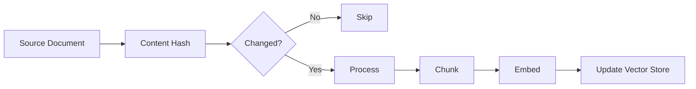

---

# 33. Metadata Extraction

Metadata provides context around the content.

Useful metadata can include:

```text
Document ID
Document Name
Document Type
Author
Created Date
Modified Date
Department
Country
Language
Version
Page Number
Section
Source
Access Classification
Tenant
```

---

# 34. Metadata Example

```json
{
  "document_id": "policy-001",
  "title": "Annual Leave Policy",
  "document_type": "policy",
  "department": "HR",
  "country": "IN",
  "language": "en",
  "version": "v3",
  "page": 12
}
```

The metadata should travel with the chunk.

---

# 35. Chunk-Level Metadata

A chunk should have enough information to trace it back to the source.

Example:

```json
{
  "chunk_id": "policy-001-chunk-07",
  "document_id": "policy-001",
  "page": 12,
  "section": "Annual Leave",
  "chunk_index": 7
}
```

This is important for:

```text
Citations
Debugging
Filtering
Auditing
Deletion
Re-indexing
```

---

# 36. Document Hierarchy

A useful internal representation is:

```text
Document
 ├── Section
 │    ├── Subsection
 │    │    ├── Paragraph
 │    │    └── Table
 │    └── Paragraph
 └── Section
```

This structure can be preserved as metadata even when the final vector record contains plain text.

---

# 37. Structure-Aware Processing

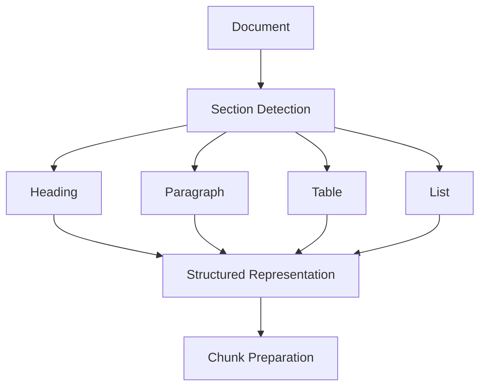

Structure-aware processing becomes particularly valuable for complex PDFs and enterprise manuals.

---

# 38. Parent Document and Child Chunks

A useful relationship is:

```text
Document
   │
   ├── Chunk 1
   ├── Chunk 2
   ├── Chunk 3
   └── Chunk 4
```

Every chunk maintains:

```text
document_id
```

and:

```text
chunk_id
```

This supports later retrieval strategies such as parent-child retrieval.

---

# 39. Page Metadata

For PDF documents, preserve page numbers.

Example:

```json
{
  "document_id": "handbook-001",
  "page": 42,
  "chunk_id": "chunk-18"
}
```

This enables citations such as:

```text
Employee Handbook, Page 42
```

---

# 40. Section Metadata

If a chunk belongs to:

```text
Employee Handbook
 → Leave
   → Annual Leave
```

preserve that hierarchy.

Example:

```json
{
  "document": "Employee Handbook",
  "section": "Leave",
  "subsection": "Annual Leave"
}
```

This provides useful context during retrieval.

---

# 41. Adding Context Before Embedding

A chunk can be represented as:

```text
Document: Employee Handbook
Section: Leave
Subsection: Annual Leave

Employees receive 25 days of annual leave...
```

The additional context can make the embedding more informative.

However, context augmentation should be evaluated rather than applied blindly.

---

# 42. Document Context Enrichment


This approach can improve retrieval for chunks whose standalone text lacks sufficient context.

---

# 43. Chunk Preparation

After extraction and cleaning, the document is ready for chunking.

```text
Clean Document
      ↓
Structure
      ↓
Chunking
      ↓
Chunk Records
```

Chunking is covered in detail in:

**12 — Document Chunking Strategies**

This chapter focuses on preparing high-quality input for that stage.

---

# 44. Why Not Embed the Whole Document?

Suppose a document contains:

```text
100 pages
```

Embedding the entire document as one vector creates a representation of many unrelated concepts.

A query such as:

```text
"What is the annual leave entitlement?"
```

may need a small section from page 12.

A document-level vector is too coarse for precise retrieval.

---

# 45. Chunk-Level Vectorization

Instead:

```text
100-page Document
       ↓
Chunks
       ↓
Chunk Embeddings
```

Example:

```text
Chunk 1 → Vector 1
Chunk 2 → Vector 2
Chunk 3 → Vector 3
...
Chunk N → Vector N
```

The retriever can then identify the relevant chunk.

---

# 46. Vectorization

Vectorization is the process of transforming a chunk into an embedding.

```text
Text Chunk
    ↓
Embedding Model
    ↓
Numerical Vector
```

Example:

```python
text = """
Employees receive 25 days
of annual leave.
"""

vector = embedding_model.encode(text)

print(len(vector))
```

---

# 47. Vectorization Pipeline

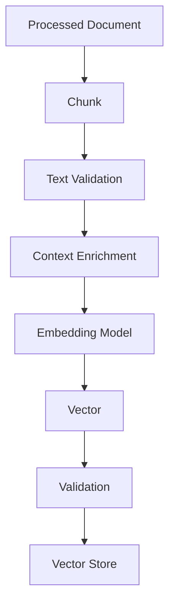

---

# 48. Vector Validation

After embedding, validate:

```text
Vector exists
Dimension is correct
No NaN values
No Infinity values
Expected datatype
```

Example:

```python
import math


def validate_vector(
    vector,
    expected_dimension
):
    if len(vector) != expected_dimension:
        raise ValueError(
            "Invalid embedding dimension"
        )

    if not all(
        math.isfinite(value)
        for value in vector
    ):
        raise ValueError(
            "Embedding contains invalid values"
        )
```

---

# 49. Vector Dimension

Suppose the selected embedding model produces:

```text
768 dimensions
```

Then:

```text
Every vector
    ↓
768 values
```

The vector store/index must be configured accordingly.

A different model producing:

```text
1536 dimensions
```

cannot simply be inserted into the same 768-dimensional index.

---

# 50. Vectorization Batching

For large document collections:

```text
100,000 chunks
```

do not necessarily call the embedding service one chunk at a time.

Instead:

```text
Chunks
 ↓
Batcher
 ↓
Embedding Model
 ↓
Vectors
```

Example:

```python
batch_size = 32

for start in range(
    0,
    len(chunks),
    batch_size
):
    batch = chunks[
        start:start + batch_size
    ]

    vectors = embedding_model.embed_batch(
        batch
    )
```

---

# 51. Embedding Throughput

For offline ingestion, optimize:

```text
Documents per second
Chunks per second
Tokens per second
Cost per million tokens
```

rather than focusing only on individual request latency.

---

# 52. Retry Handling

Embedding providers can fail.

Possible failures:

```text
Timeout
Rate Limit
Temporary Network Error
Provider Error
Invalid Input
Quota Exhaustion
```

Use controlled retries:

```python
for attempt in range(3):
    try:
        vector = embedding_model.embed(text)
        break
    except TemporaryEmbeddingError:
        if attempt == 2:
            raise
```

Production systems should use exponential backoff and provider-specific retry policies.

---

# 53. Dead-Letter Handling

A document that repeatedly fails processing should not block the entire ingestion pipeline.

```text
Document
 ↓
Processing
 ↓
Failure
 ↓
Retry
 ↓
Failure
 ↓
Dead-Letter Queue
```

The failed item can then be investigated independently.

---

# 54. Document Processing State

Track processing state:

```text
DISCOVERED
   ↓
DOWNLOADED
   ↓
PARSED
   ↓
CLEANED
   ↓
CHUNKED
   ↓
EMBEDDED
   ↓
INDEXED
```

Failure states can be:

```text
FAILED_PARSING
FAILED_OCR
FAILED_EMBEDDING
FAILED_INDEXING
```

---

# 55. Processing State Machine

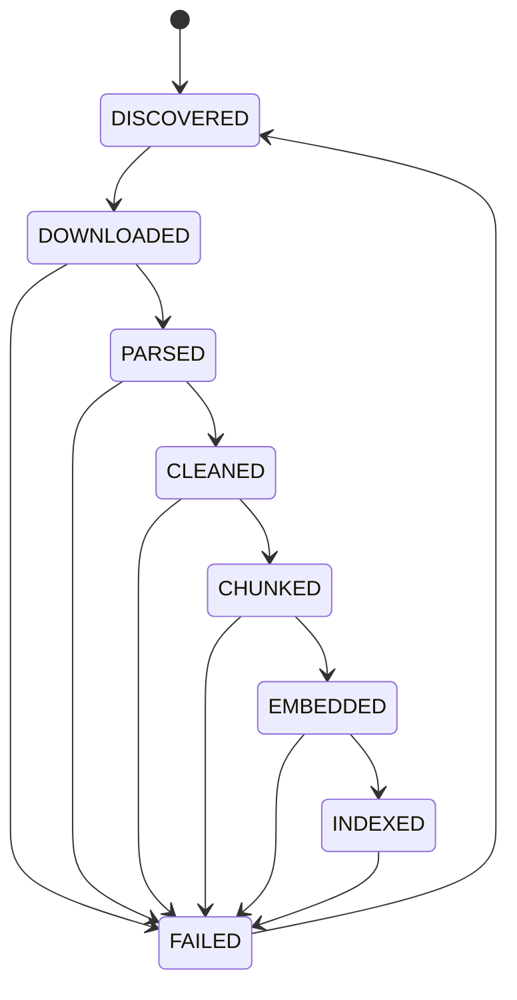

This is useful for resilient ingestion systems.

---

# 56. Idempotent Processing

A production pipeline should ideally be idempotent.

If the same document is processed twice:

```text
Document
 ↓
Same Content Hash
```

the system should recognize that it has already processed that version.

This prevents:

```text
Duplicate Chunks
Duplicate Vectors
Duplicate Storage
```

---

# 57. Idempotency Key

A practical key can combine:

```text
source
+
document_id
+
document_version
```

Example:

```text
sharepoint:policy-001:v3
```

or use a content hash where appropriate.

---

# 58. Incremental Processing

A scalable ingestion pipeline should distinguish:

```text
New
Modified
Deleted
Unchanged
```

Architecture:

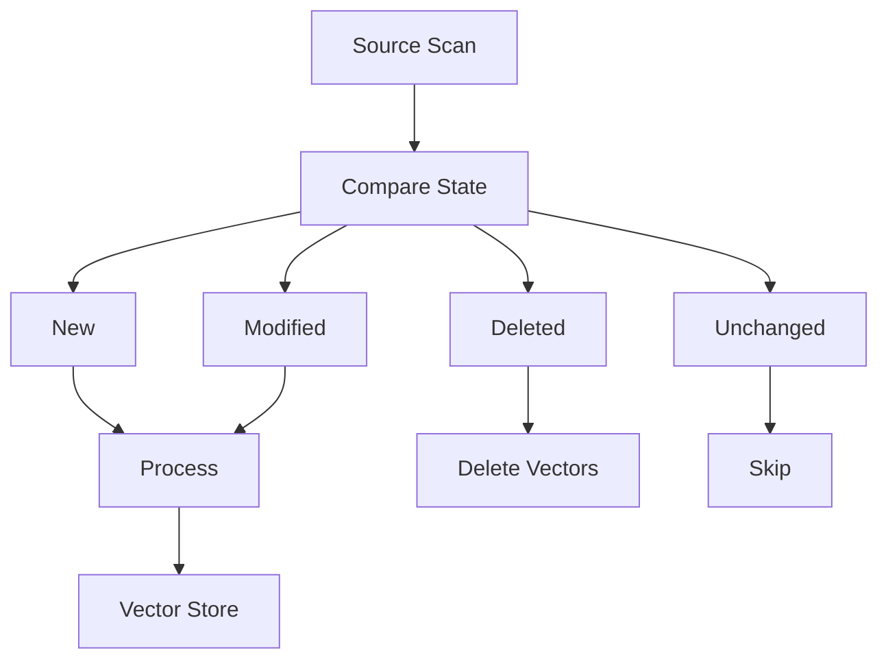

---

# 59. Document Deletion

Deletion must propagate through the entire pipeline.

```text
Source Deleted
      ↓
Document Record Deleted
      ↓
Chunks Deleted
      ↓
Vectors Deleted
```

Otherwise RAG may continue retrieving content that no longer exists.

---

# 60. Document Update

When a document changes:

```text
Old Version
     ↓
New Version
```

a production workflow may:

```text
Detect Change
     ↓
Remove Old Chunks
     ↓
Process New Version
     ↓
Create New Chunks
     ↓
Generate New Embeddings
     ↓
Index
```

---

# 61. Vector Store Record

A production vector record might look like:

```json
{
  "id": "policy-001-chunk-007",
  "vector": [0.12, -0.34, 0.72],
  "text": "Employees receive 25 days...",
  "metadata": {
    "document_id": "policy-001",
    "document_version": "v3",
    "page": 12,
    "section": "Annual Leave",
    "source": "sharepoint"
  }
}
```

---

# 62. Vectorization and Metadata

The final record combines:

```text
Content
+
Vector
+
Metadata
+
Lineage
```

Conceptually:

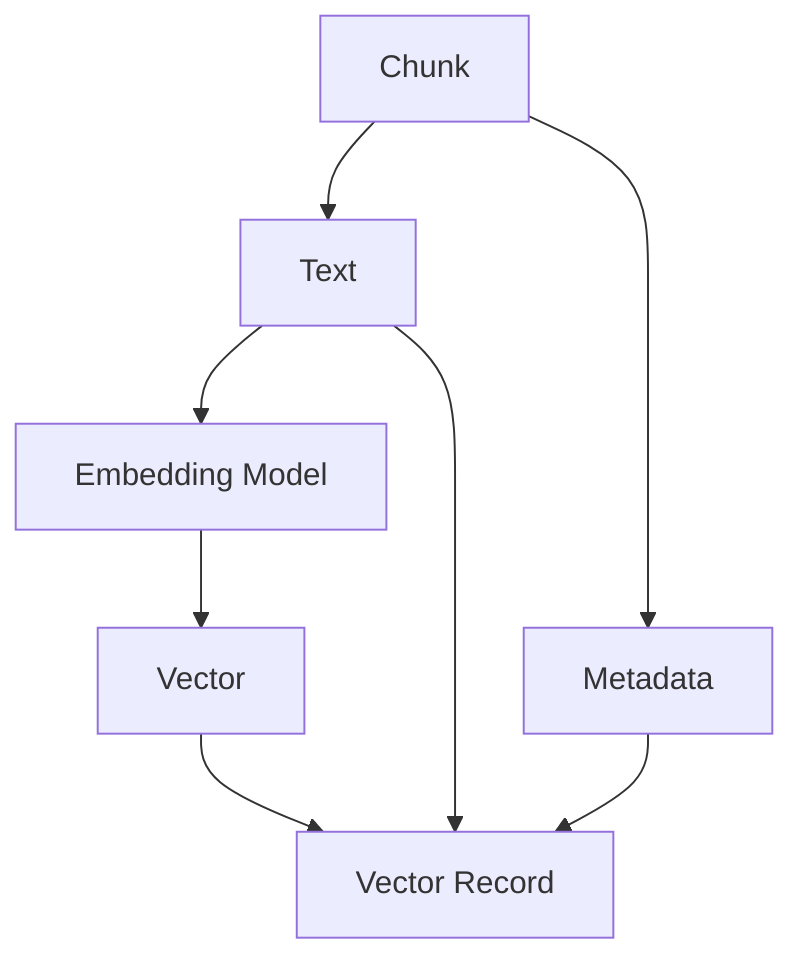

---

# 63. Content Hash + Vector Record

A useful record may include:

```json
{
  "document_id": "policy-001",
  "version": "v3",
  "chunk_id": "chunk-007",
  "content_hash": "abc123...",
  "embedding_model": "enterprise-embedding-v1",
  "embedding_dimension": 768
}
```

This supports reproducibility and migration.

---

# 64. Embedding Model Versioning

Store:

```text
Model Name
Model Version
Dimension
Normalization
Similarity Metric
```

Example:

```json
{
  "embedding_model": "enterprise-embedding-v1",
  "dimension": 768,
  "normalized": true,
  "similarity": "cosine"
}
```

This prevents ambiguity when debugging retrieval.

---

# 65. Vectorization and Re-indexing

When the embedding model changes:

```text
Model V1
   ↓
Existing Index
```

cannot always be directly reused with:

```text
Model V2
```

A migration may require:

```text
Documents
 ↓
Re-process
 ↓
Re-chunk if necessary
 ↓
Embed with V2
 ↓
Build New Index
 ↓
Evaluate
 ↓
Cutover
```

---

# 66. Blue-Green Vector Index Migration

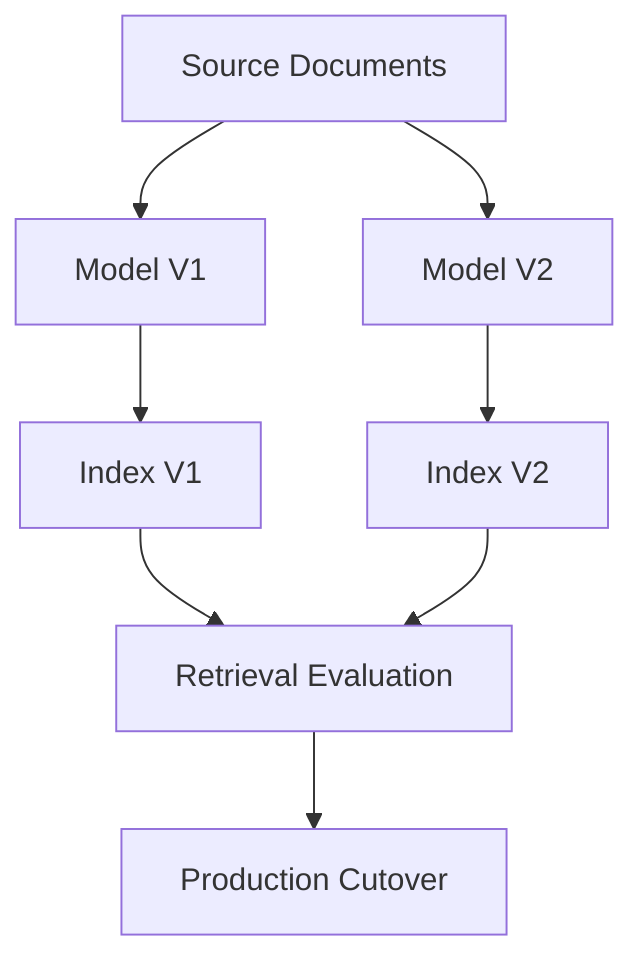

This is safer than modifying the production index in place.

---

# 67. Document Processing Quality Gates

A production pipeline can introduce quality gates:

```text
Gate 1:
Document successfully parsed

Gate 2:
Text extraction quality acceptable

Gate 3:
Content not empty

Gate 4:
Metadata valid

Gate 5:
Chunk sizes valid

Gate 6:
Embedding generated

Gate 7:
Vector dimension valid

Gate 8:
Vector successfully indexed
```

---

# 68. Quality Gate Architecture

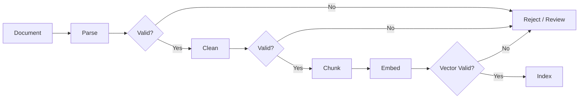

---

# 69. Document Processing Observability

Track:

```text
Documents discovered
Documents processed
Documents failed
Parsing latency
OCR latency
Chunk count
Average chunk size
Embedding latency
Embedding failures
Indexing failures
Processing throughput
```

---

# 70. Data Quality Metrics

Useful metrics include:

```text
Empty Document Rate
OCR Failure Rate
Duplicate Document Rate
Average Chunks per Document
Average Characters per Chunk
Average Tokens per Chunk
Metadata Completeness
Embedding Failure Rate
Indexing Failure Rate
```

These metrics provide early signals of ingestion problems.

---

# 71. Document Processing Dashboard

```text
Documents Processed        125,420
Documents Failed               83
OCR Success Rate              97%
Average Chunks / Document     42
Embedding Success Rate       99.8%
Indexing Success Rate         99.9%
```

The exact metrics depend on the application.

---

# 72. Logging

Useful structured logs:

```json
{
  "event": "document_processed",
  "document_id": "policy-001",
  "version": "v3",
  "chunks": 42,
  "embedding_model": "enterprise-embedding-v1",
  "status": "success"
}
```

Avoid logging sensitive document content unnecessarily.

---

# 73. Tracing

A distributed ingestion pipeline may look like:

```text
Ingestion Service
       ↓
Parser Service
       ↓
OCR Service
       ↓
Chunking Service
       ↓
Embedding Service
       ↓
Vector Store
```

Distributed tracing helps identify which stage caused latency or failure.

---

# 74. Security Considerations

Documents may contain:

```text
Personal Data
Financial Information
Customer Information
Credentials
Confidential Policies
Source Code
Legal Documents
```

The document processing pipeline must therefore respect enterprise security controls.

---

# 75. Access Control Metadata

Metadata can contain:

```json
{
  "classification": "CONFIDENTIAL",
  "department": "FINANCE",
  "tenant": "tenant-a",
  "allowed_roles": [
    "finance-user"
  ]
}
```

The retrieval system can use this information to enforce access boundaries.

---

# 76. Security-Aware Retrieval

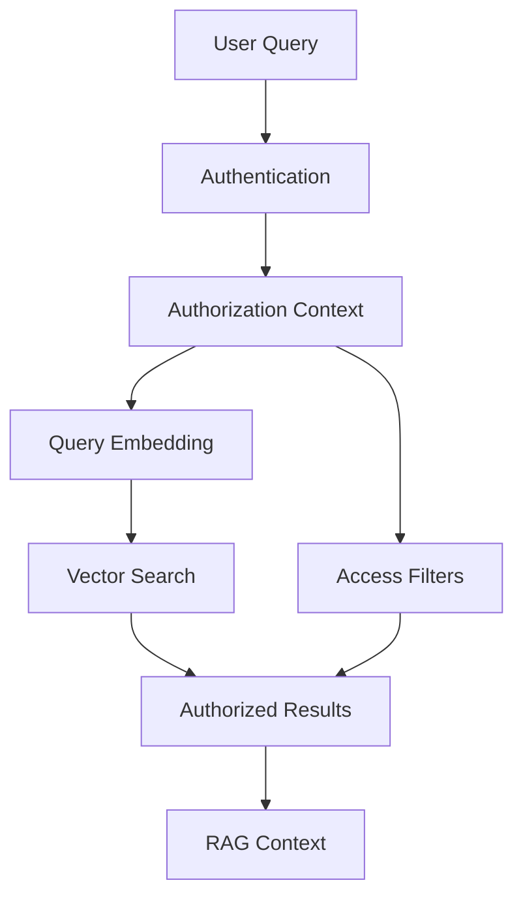

Retrieval should not expose documents merely because they are semantically relevant.

---

# 77. Multi-Tenant Processing

A multi-tenant system should preserve tenant identity:

```text
Tenant A
 ├── Document
 ├── Chunk
 └── Vector

Tenant B
 ├── Document
 ├── Chunk
 └── Vector
```

Never rely solely on the LLM to prevent cross-tenant retrieval.

Isolation must exist in the retrieval architecture.

---

# 78. Data Lineage

A production document-processing pipeline should maintain:

```text
Source
 ↓
Document ID
 ↓
Version
 ↓
Parser
 ↓
Extracted Content
 ↓
Chunk
 ↓
Embedding Model
 ↓
Vector
```

This allows the team to answer:

> "Where did this retrieved context come from?"

---

# 79. Data Lineage Diagram


---

# 80. Citation Support

If the application needs citations, preserve:

```text
Document Name
Page
Section
URL
Paragraph
Chunk ID
```

Then the RAG system can return:

```text
Answer

Source:
Employee Handbook
Page 42
Annual Leave
```

This is one reason metadata preservation is essential.

---

# 81. Document Processing for RAG

The complete flow is:

```text
Source Documents
       ↓
Ingestion
       ↓
Parsing
       ↓
Extraction
       ↓
Cleaning
       ↓
Normalization
       ↓
Structure Detection
       ↓
Metadata
       ↓
Chunk Preparation
       ↓
Embedding
       ↓
Vector Store
```

---

# 82. RAG Data Preparation Architecture

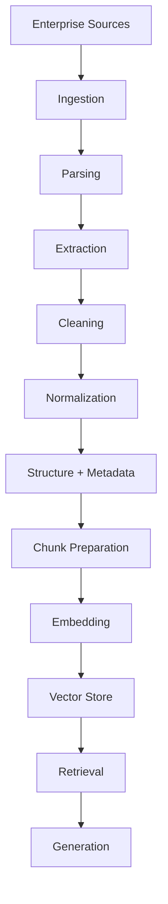

---

# 83. Framework-Agnostic Processing

The concepts in this chapter should not depend on one AI framework.

The architecture can be:

```text
DocumentProcessor
EmbeddingProvider
VectorStore
```

rather than:

```text
Application
   ↓
Framework-specific implementation everywhere
```

This keeps the enterprise architecture flexible.

---

# 84. Document Processor Interface

A Java-oriented interface:

```java
public interface DocumentProcessor {

    ProcessedDocument process(
        DocumentSource source
    );
}
```

A separate embedding capability:

```java
public interface EmbeddingProvider {

    List<Float> embed(
        String text
    );

    List<List<Float>> embedBatch(
        List<String> texts
    );
}
```

And vector storage:

```java
public interface VectorStore {

    void upsert(
        List<VectorRecord> records
    );
}
```

---

# 85. Ports and Adapters Architecture

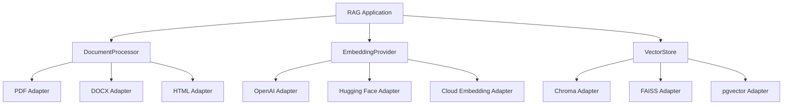

This allows technology choices to remain behind adapters.

---

# 86. LangChain Example

Frameworks can simplify implementation.

For example, a LangChain-style conceptual pipeline:

```python
from langchain_text_splitters import RecursiveCharacterTextSplitter

splitter = RecursiveCharacterTextSplitter(
    chunk_size=1000,
    chunk_overlap=150
)

chunks = splitter.split_text(
    document_text
)
```

The important architectural concept remains:

```text
Document
 ↓
Chunk
 ↓
Embedding
 ↓
Vector Store
```

The framework is an implementation mechanism, not the architecture itself.

---

# 87. LlamaIndex Example

A LlamaIndex-style workflow can represent documents and nodes:

```python
from llama_index.core import Document

document = Document(
    text=document_text,
    metadata={
        "document_id": "policy-001",
        "source": "sharepoint"
    }
)
```

The framework can then handle downstream indexing and retrieval components.

Again, the core architecture remains framework-independent.

---

# 88. Framework Usage in This Module

Framework examples should be used to demonstrate concepts such as:

```text
Document Loading
Document Parsing
Chunk Preparation
Embedding
Vectorization
Indexing
```

but the underlying concepts should remain understandable without the framework.

---

# 89. Why Framework Abstraction Matters

If application code directly depends on one framework:

```text
Business Logic
   ↓
LangChain
   ↓
Provider
```

switching frameworks can become expensive.

A capability-oriented design is:

```text
Business Logic
   ↓
Application Port
   ↓
Framework / Provider Adapter
```

This keeps the architecture portable.

---

# 90. Common Document Processing Mistakes

## 90.1 Embedding Before Cleaning

Bad:

```text
Raw PDF
 ↓
Embedding
```

Better:

```text
PDF
 ↓
Extraction
 ↓
Cleaning
 ↓
Structure
 ↓
Chunking
 ↓
Embedding
```

---

## 90.2 Ignoring Tables

Tables often contain important enterprise facts.

---

## 90.3 Ignoring OCR Quality

Bad OCR can create misleading retrieval results.

---

## 90.4 Losing Metadata

Without metadata:

```text
Where did this chunk come from?
```

becomes difficult to answer.

---

## 90.5 Treating All File Types the Same

PDF, DOCX, HTML, CSV, and JSON require different processing strategies.

---

## 90.6 Embedding Entire Documents

Large documents usually require chunk-level processing.

---

## 90.7 No Version Tracking

Updated documents can leave stale vectors.

---

## 90.8 No Deduplication

Duplicate documents can pollute retrieval.

---

## 90.9 No Deletion Workflow

Deleted documents can remain searchable.

---

## 90.10 No Processing State

Without state tracking, failed documents become difficult to recover.

---

# 91. Best Practices

```text
1. Separate ingestion from processing.

2. Normalize different source formats into a common representation.

3. Preserve document structure where useful.

4. Clean extracted content carefully.

5. Treat tables as structured data.

6. Use OCR for scanned documents.

7. Validate OCR output for critical content.

8. Preserve document and chunk metadata.

9. Track document versions.

10. Use content hashes for change detection.

11. Deduplicate documents.

12. Process documents incrementally.

13. Make ingestion idempotent.

14. Validate chunks before embedding.

15. Batch embedding workloads.

16. Validate vector dimensions.

17. Handle provider failures with retries.

18. Use dead-letter handling for persistent failures.

19. Track document processing state.

20. Preserve source lineage.

21. Support deletion propagation.

22. Support re-indexing.

23. Monitor processing quality.

24. Monitor embedding performance.

25. Enforce access controls during retrieval.

26. Isolate tenants where required.

27. Keep document processing framework-independent.

28. Keep embedding providers behind capability interfaces.

29. Evaluate the complete pipeline rather than individual components only.

30. Design for observability from the beginning.
```

---

# 92. Production Workflow

A production document-to-vector workflow can be organized as follows:

```text
1. Discover documents.

2. Identify source and document ID.

3. Download or retrieve the source.

4. Determine document type.

5. Select the appropriate parser.

6. Extract content.

7. Run OCR when required.

8. Preserve document structure.

9. Remove irrelevant content.

10. Normalize text.

11. Detect duplicates.

12. Calculate content hash.

13. Detect document version changes.

14. Extract metadata.

15. Attach security metadata.

16. Prepare content for chunking.

17. Generate chunks.

18. Validate chunks.

19. Add contextual metadata.

20. Generate embeddings in batches.

21. Validate vectors.

22. Create vector records.

23. Upsert vectors.

24. Record processing state.

25. Record model and document versions.

26. Emit metrics and traces.

27. Handle failures through retry/dead-letter workflows.

28. Remove vectors when source documents are deleted.

29. Re-index modified documents.

30. Evaluate retrieval quality continuously.
```

---

# 93. Production Document Pipeline

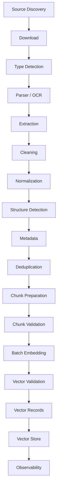

---

# 94. Production Checklist

```text
Document Ingestion
[ ] Source connector defined
[ ] Document ID defined
[ ] Content type detected
[ ] Source metadata captured

Document Processing
[ ] Parser selected
[ ] OCR supported where required
[ ] Text extraction validated
[ ] Tables handled
[ ] Structure preserved
[ ] HTML/navigation noise removed
[ ] Unicode normalized
[ ] Duplicate content detected

Metadata
[ ] Document ID
[ ] Version
[ ] Source
[ ] Page
[ ] Section
[ ] Language
[ ] Tenant
[ ] Security classification

Chunk Preparation
[ ] Chunking strategy defined
[ ] Chunk size validated
[ ] Context preserved
[ ] Chunk IDs generated
[ ] Parent document tracked

Vectorization
[ ] Embedding model selected
[ ] Model version tracked
[ ] Batch processing enabled
[ ] Vector dimensions validated
[ ] Invalid vectors rejected
[ ] Retry policy implemented

Storage
[ ] Vector store configured
[ ] Metadata indexed
[ ] Access filters supported
[ ] Deletion workflow implemented
[ ] Versioning supported

Operations
[ ] Processing state tracked
[ ] Metrics emitted
[ ] Logs structured
[ ] Tracing available
[ ] Dead-letter workflow available
[ ] Re-indexing supported

Security
[ ] Authentication
[ ] Authorization
[ ] Tenant isolation
[ ] Encryption
[ ] Sensitive data handling
[ ] Auditability
```

---

# 95. Key Takeaways

- Document processing is the first major stage of a production RAG data pipeline.
- Enterprise documents are heterogeneous and require format-specific processing.
- PDF, DOCX, HTML, CSV, JSON, images, and emails should not necessarily be processed identically.
- Scanned documents require OCR before semantic processing.
- Tables require structure-aware extraction.
- Cleaning should remove noise without destroying meaningful context.
- Document structure can improve downstream retrieval.
- Metadata is essential for filtering, traceability, security, and citations.
- Document IDs and chunk IDs should be stable.
- Content hashes can support deduplication and change detection.
- Document versions should be tracked.
- Deleted documents must result in vector deletion.
- Modified documents must be reprocessed.
- Idempotent ingestion prevents duplicate vectors.
- Processing state makes ingestion pipelines recoverable.
- Chunks should be validated before vectorization.
- Embedding generation should generally support batching.
- Embedding vectors should be validated for dimension and numeric validity.
- Model versions should be recorded with vector data.
- Changing embedding models can require rebuilding the vector index.
- Document processing quality directly influences retrieval quality.
- Security metadata must be preserved throughout the pipeline.
- Multi-tenant systems require retrieval isolation.
- Observability should cover the complete ingestion pipeline.
- Frameworks such as LangChain and LlamaIndex can simplify implementation, but the underlying architecture should remain framework-independent.
- Document processing, embedding generation, and vector storage are separate capabilities.
- Production RAG begins with reliable enterprise data preparation.

The central principle is:

> **A high-quality RAG system cannot compensate for low-quality source data. Document processing is part of the retrieval architecture, not merely an ingestion utility.**

---

# 96. Chapter Navigation

## Part IV — Prompt Engineering & RAG Fundamentals

**Previous Chapter:** [10. Embeddings in Practice](10-embeddings-in-practice.md)

**Current Chapter:** 11 — Document Processing & Vectorization

**Next Chapter:** [12. Document Chunking Strategies](12-document-chunking-strategies.md)

### Part IV Chapters

1. [01. Introduction to Prompt Engineering](01-introduction-to-prompt-engineering.md)
2. [02. Prompt Engineering Fundamentals](02-prompt-engineering-fundamentals.md)
3. [03. Advanced Prompt Engineering](03-advanced-prompt-engineering.md)
4. [04. Prompt Design Patterns](04-prompt-design-patterns.md)
5. [05. Zero-shot, One-shot & Few-shot Prompting](05-zero-one-few-shot-prompting.md)
6. [06. Chain-of-Thought Prompting](06-chain-of-thought-prompting.md)
7. [07. ReAct Prompting](07-react-prompting.md)
8. [08. Structured Outputs & Output Parsing](08-structured-outputs-and-output-parsing.md)
9. [09. Function Calling & Tool Calling](09-function-calling-and-tool-calling.md)
10. [10. Embeddings in Practice](10-embeddings-in-practice.md)
11. **11. Document Processing & Vectorization**
12. [12. Document Chunking Strategies](12-document-chunking-strategies.md)
13. [13. Vector Database Fundamentals](13-vector-database-fundamentals.md)
14. [14. Similarity Search Techniques](14-similarity-search-techniques.md)
15. [15. RAG Pipeline Components](15-rag-pipeline-components.md)
16. [16. Retrieval & Generation Pipeline](16-retrieval-and-generation-pipeline.md)
17. [17. Vector Databases in RAG](17-vector-databases-in-rag.md)
18. [18. Building Your First RAG Pipeline](18-building-your-first-rag-pipeline.md)
19. [19. RAG Evaluation Fundamentals](19-rag-evaluation-fundamentals.md)
20. [20. Enterprise Generative AI Application Architecture](20-enterprise-generative-ai-application-architecture.md)
21. [21. Deploying AI Applications with Gradio](21-deploying-ai-applications-with-gradio.md)

---

# References

- Python documentation
- PyMuPDF documentation
- python-docx documentation
- Beautiful Soup documentation
- Hugging Face documentation
- Sentence Transformers documentation
- LangChain documentation
- LlamaIndex documentation
- FAISS documentation
- Chroma documentation
- pgvector documentation
- Qdrant documentation
- Apache Tika documentation
- OCR documentation and enterprise document-processing platforms
- Vector database documentation
- Enterprise document management platform documentation

---

> **Enterprise AI Engineering Handbook**  
> *Building Production-Grade Enterprise AI Systems — One Chapter at a Time.*